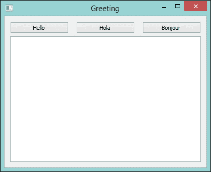
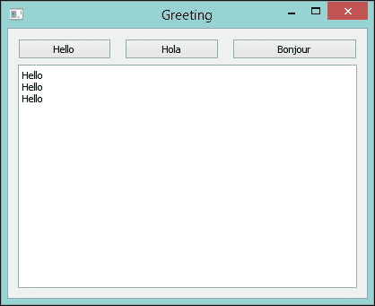
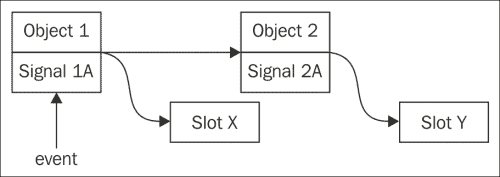

# 第一章. 创建您的第一个 Qt 应用程序

GUI 编程并不像您想象的那么困难。至少，当您进入 Qt 的世界时，它不是那么困难。这本书将带您穿越这个世界，并让您深入了解这个令人难以置信的神奇工具包。无论您是否听说过它，只要您具备 C++ 编程的基本知识即可。

在本章中，我们将让您熟悉 Qt 应用程序的开发。简单的应用程序被用作演示，以便您涵盖以下主题：

+   创建一个新项目

+   更改小部件布局

+   理解信号和槽的机制

+   连接两个信号

+   创建一个 Qt Quick 应用程序

+   将 C++ 槽连接到 QML 信号

# 创建一个新项目

如果您还没有安装 Qt 5，请参考[`www.qt.io/download`](http://www.qt.io/download)安装最新版本。建议您安装社区版，它是完全免费的，并且符合 GPL/LGPL。通常，安装程序会为您安装**Qt 库**和**Qt Creator**。在这本书中，我们将使用 Qt 5.4.0 和 Qt Creator 3.3.0。较新版本可能会有细微差异，但概念保持不变。如果您电脑上没有 Qt Creator，强烈建议您安装它，因为本书中的所有教程都是基于它的。它也是 Qt 应用程序开发的官方 IDE。尽管您可能能够使用其他 IDE 开发 Qt 应用程序，但这通常会更加复杂。所以，如果您准备好了，让我们通过以下步骤开始吧：

1.  打开 Qt Creator。

1.  导航到**文件** | **新建文件**或**项目**。

1.  选择**Qt Widgets 应用程序**。

1.  输入项目的名称和位置。在这种情况下，项目的名称是 `layout_demo`。

您可以选择跟随向导并保留默认值。在此过程之后，Qt Creator 将根据您的选择生成项目的骨架。UI 文件位于 `Forms` 目录下。当您双击一个 UI 文件时，Qt Creator 将将您重定向到集成设计器。模式选择器应该突出显示**设计**，主窗口应包含几个子窗口，以便您设计用户界面。这正是我们要做的。有关 Qt Creator UI 的更多详细信息，请参阅[`doc.qt.io/qtcreator/creator-quick-tour.html`](http://doc.qt.io/qtcreator/creator-quick-tour.html)。

从小部件框（小部件调色板）中拖动三个按钮到中心**MainWindow**的框架中。这些按钮上显示的默认文本是**PushButton**，但你可以通过双击按钮来更改文本。在这种情况下，我将按钮改为`Hello`、`Hola`和`Bonjour`。请注意，此操作不会影响`objectName`属性。为了保持整洁且易于查找，我们需要更改`objectName`属性。UI 的右侧包含两个窗口。右上部分包括**对象检查器**，而右下部分包括**属性编辑器**。只需选择一个按钮；你可以在**属性编辑器**中轻松更改`objectName`。为了方便起见，我将这些按钮的`objectName`属性分别更改为`helloButton`、`holaButton`和`bonjourButton`。

### 提示

使用小写字母作为`objectName`的第一个字母，大写字母作为**类名**是一个好习惯。这有助于使你的代码对熟悉此约定的人更易读。

好了，是时候看看你对你的第一个 Qt 应用程序的用户界面做了什么。在左侧面板上点击**运行**。它将自动构建项目然后运行。看到应用程序与设计完全相同的界面，是不是很神奇？如果一切正常，应用程序应该看起来与以下截图所示相似：


你可能想查看源代码看看那里发生了什么。所以，让我们通过返回到**编辑**模式来回到源代码。在模式选择器中点击**编辑**按钮。然后，在**项目**树视图的**源**文件夹中双击`main.cpp`。`main.cpp`的代码如下所示：

```cpp
#include "mainwindow.h"
#include <QApplication>

int main(int argc, char *argv[])
{
    QApplication a(argc, argv);
    MainWindow w;
    w.show();

    return a.exec();
}
```

### 注意

`QApplication`类管理 GUI 应用程序的控制流和主要设置。

实际上，你不需要也不太可能在这个文件中做太多改动。主作用域的第一行只是初始化用户桌面上的应用程序并处理一些事件。然后还有一个对象`w`，它属于`MainWindow`类。至于最后一行，它确保应用程序在执行后不会终止，而是保持在一个事件循环中，以便能够响应外部事件，如鼠标点击和窗口状态变化。

最后但同样重要的是，让我们看看在`MainWindow`对象初始化过程中会发生什么，`w`是这个内容，如下所示：

```cpp
#ifndef MAINWINDOW_H
#define MAINWINDOW_H

#include <QMainWindow>

namespace Ui {
    class MainWindow;
}

class MainWindow : public QMainWindow
{
    Q_OBJECT

public:
    explicit MainWindow(QWidget *parent = 0);
    ~MainWindow();

private:
    Ui::MainWindow *ui;
};

#endif // MAINWINDOW_H
```

如果你第一次编写 Qt 应用程序，看到`Q_OBJECT`宏可能会让你感到有些惊讶。在 QObject 文档中，它说：

> *`Q_OBJECT`宏必须出现在声明其自己的信号和槽或使用 Qt 元对象系统提供的其他服务的类定义的私有部分中。*

好吧，这意味着如果你打算使用 Qt 的元对象系统以及（或）其信号和槽机制，就必须声明 `QObject`。信号和槽，几乎是 Qt 的核心，将在本章后面进行介绍。

有一个名为 `ui` 的私有成员，它是 `Ui` 命名空间中 `MainWindow` 类的指针。你还记得我们之前编辑的 UI 文件吗？Qt 的魔法在于它将 UI 文件和父源代码链接起来。我们可以通过代码行来操作 UI，也可以在 Qt Creator 的集成设计器中设计它。最后，让我们看看 `mainwindow.cpp` 中 `MainWindow` 的构造函数：

```cpp
#include "mainwindow.h"
#include "ui_mainwindow.h"

MainWindow::MainWindow(QWidget *parent) :
    QMainWindow(parent),
    ui(new Ui::MainWindow)
{
    ui->setupUi(this);
}

MainWindow::~MainWindow()
{
    delete ui;
}
```

你看到用户界面是从哪里来的了吗？它是 `Ui::MainWindow` 的成员函数 `setupUi`，它初始化并为我们设置它。你可能想检查如果我们把成员函数改为类似这样会发生什么：

```cpp
MainWindow::MainWindow(QWidget *parent) :
    QMainWindow(parent),
    ui(new Ui::MainWindow)
{
    ui->setupUi(this);
    ui->holaButton->setEnabled(false);
}
```

这里发生了什么？由于我们禁用了它，所以无法点击 `Hola` 按钮！如果在设计器中取消勾选 **启用** 复选框而不是在这里编写语句，也会有相同的效果。请在进入下一个主题之前应用此更改，因为我们不需要禁用的按钮在本章中进行任何演示。

# 更改小部件的布局

你已经知道如何在 **设计** 模式下添加和移动小部件。现在，我们需要使 UI 整洁有序。我会一步步地教你如何做。

删除小部件的一个快捷方法是选择它并按 **Delete** 按钮。同时，一些小部件，如菜单栏、状态栏和工具栏，不能被选择，因此我们必须在 **对象检查器** 中右键点击它们并删除它们。由于它们在这个例子中无用，所以安全地移除它们，我们可以永久地这样做。

好的，让我们了解在移除之后需要做什么。你可能希望将这些按钮都保持在同一水平轴上。为此，执行以下步骤：

1.  通过逐个点击按钮同时按住 *Ctrl* 键或绘制一个包含所有按钮的包围矩形来选择所有按钮。

1.  右键点击并选择 **布局** | **水平布局**，此操作的快捷键是 *Ctrl* + *H*。

1.  通过选择并拖动选择框周围的任何一点来调整水平布局的大小，直到它最适合。

嗯…！你可能已经注意到**Bonjour**按钮的文本比其他两个按钮长，它应该比其他按钮更宽。你该如何做到这一点？你可以在**属性编辑器**中更改水平布局对象的`layoutStretch`属性。此值表示水平布局内小部件的拉伸因子。它们将按比例排列。将其更改为`3,3,4`，就是这样。拉伸的大小肯定不会小于最小尺寸提示。这就是当存在非零自然数时零因子的作用，这意味着你需要保持最小尺寸，而不是因为零除数而出现错误。

现在，将**纯文本编辑**拖动到水平布局的下方，而不是内部。显然，如果我们能扩展纯文本编辑的宽度，会看起来更整洁。然而，我们不必手动这样做。实际上，我们可以更改父窗口的布局，即**MainWindow**。就是这样！右键点击**MainWindow**，然后导航到**布局** | **垂直布局**。哇！所有子小部件都会自动扩展到**MainWindow**的内边界；它们保持垂直顺序。你也会在`centralWidget`属性中找到**布局**设置，这与之前的水平布局完全相同。

使这个应用程序变得半 decent 的最后一件事是更改窗口的标题。"MainWindow"不是你想要的标题，对吧？在对象树中点击**MainWindow**。然后，滚动其属性以找到**windowTitle**。给它起个你想的名字。在这个例子中，我将其更改为`Greeting`。现在，再次运行应用程序，你将看到它看起来就像以下截图所示：



# 理解信号和槽的机制

保持好奇心并探索这些属性究竟有什么作用，这一点非常重要。然而，请记住恢复你对应用程序所做的更改，因为我们即将进入 Qt 的核心部分，即信号和槽。

### 注意

信号和槽用于对象之间的通信。信号和槽机制是 Qt 的核心特性，可能是与其他框架提供的特性差异最大的部分。

您是否曾经想过为什么在点击**关闭**按钮后窗口会关闭？熟悉其他工具包的开发者会说，点击**关闭**按钮是一个事件，这个事件绑定了一个回调函数，该函数负责关闭窗口。然而，在 Qt 的世界中，情况并不完全相同。由于 Qt 使用名为信号和槽的机制，它使得回调函数与事件之间的耦合变得较弱。此外，我们通常在 Qt 中使用信号和槽这两个术语。当特定事件发生时发出信号。槽是响应特定信号而被调用的函数。以下简单且示意图有助于您理解信号、事件和槽之间的关系：


Qt 有大量的预定义信号和槽，涵盖了其通用目的。然而，添加自己的槽来处理目标信号确实是常见的做法。您可能还对子类化小部件并编写自己的信号感兴趣，这将在稍后介绍。由于信号和槽机制要求具有相同参数的列表，因此它被设计为类型安全的。实际上，槽可以比信号具有更短的参数列表，因为它可以忽略额外的参数。您可以拥有尽可能多的参数。这使得您可以在 C 和其他工具包中忘记通配符 `void*` 类型。

自从 Qt 5 以来，这种机制变得更加安全，因为我们可以使用新的信号和槽语法来处理连接。这里演示了一段代码的转换。让我们看看旧式风格中典型的连接语句：

```cpp
connect(sender, SIGNAL(textChanged(QString)), receiver, SLOT(updateText(QString)));
```

这可以用新的语法风格重写：

```cpp
connect(sender, &Sender::textChanged, receiver, &Receiver::updateText);
```

在传统的代码编写方式中，信号和槽的验证仅在运行时发生。在新风格中，编译器可以在编译时检测参数类型的不匹配以及信号和槽的存在。

### 注意

只要可能，本书中的所有 `connect` 语句都使用新的语法风格编写。

现在，让我们回到我们的应用程序。我将向您展示如何在点击**Hello**按钮时在纯文本编辑器中显示一些文字。首先，我们需要创建一个槽，因为 Qt 已经为 `QPushButton` 类预定义了点击信号。编辑 `mainwindow.h` 并添加槽声明：

```cpp
#ifndef MAINWINDOW_H
#define MAINWINDOW_H

#include <QMainWindow>

namespace Ui {
    class MainWindow;
}

class MainWindow : public QMainWindow
{
    Q_OBJECT

public:
    explicit MainWindow(QWidget *parent = 0);
    ~MainWindow();

private slots:
    void displayHello();

private:
    Ui::MainWindow *ui;
};

#endif // MAINWINDOW_H
```

如您所见，是 `slots` 关键字将槽与普通函数区分开来。我将其声明为私有以限制访问权限。如果您需要在其他类的对象中调用它，必须将其声明为 `public` 槽。在此声明之后，我们必须在 `mainwindow.cpp` 文件中实现它。`displayHello` 槽的实现如下：

```cpp
void MainWindow::displayHello()
{
    ui->plainTextEdit->appendPlainText(QString("Hello"));
}
```

它只是调用纯文本编辑的一个成员函数，以便向其中添加一个`Hello` QString。`QString`是 Qt 引入的一个核心类。它提供了一个 Unicode 字符字符串，有效地解决了国际化问题。它也方便地将`QString`类转换为`std::string`，反之亦然。此外，就像其他`QObject`类一样，`QString`使用隐式共享机制来减少内存使用并避免不必要的复制。如果你不想关心以下代码中显示的场景，只需将`QString`视为`std::string`的改进版本。现在，我们需要将这个槽连接到**Hello**按钮将发出的信号：

```cpp
MainWindow::MainWindow(QWidget *parent) :
    QMainWindow(parent),
    ui(new Ui::MainWindow)
{
    ui->setupUi(this);

    connect(ui->helloButton, &QPushButton::clicked, this, &MainWindow::displayHello);
}
```

我所做的是在`MainWindow`的构造函数中添加了一个`connect`语句。实际上，我们可以在任何地方和任何时候连接信号和槽。然而，连接只有在执行这一行之后才会存在。因此，在构造函数中放置大量的`connect`语句是一种常见的做法。为了更好地理解，运行你的应用程序并看看点击**Hello**按钮时会发生什么。每次点击，都会在纯文本编辑中追加一个**Hello**文本。以下是在我们点击了**Hello**按钮三次之后的截图：



感到困惑？让我带你一步步走过这个过程。当你点击**Hello**按钮时，它发出了一个点击信号。然后，`displayHello`槽中的代码被执行，因为我们把**Hello**按钮的点击信号连接到了`MainWindow`的`displayHello`槽。`displayHello`槽所做的是简单地将`Hello`追加到纯文本编辑中。

完全理解信号和槽的机制可能需要一些时间。请慢慢来。在我们点击了**Hola**按钮之后，我会给你展示一个如何断开这种连接的例子。同样，将槽的声明添加到头文件中，并在源文件中定义它。我已经粘贴了`mainwindow.h`头文件的内容，如下所示：

```cpp
#ifndef MAINWINDOW_H
#define MAINWINDOW_H

#include <QMainWindow>

namespace Ui {
    class MainWindow;
}

class MainWindow : public QMainWindow
{
    Q_OBJECT

public:
    explicit MainWindow(QWidget *parent = 0);
    ~MainWindow();

private slots:
    void displayHello();
    void onHolaClicked();

private:
    Ui::MainWindow *ui;
};

#endif // MAINWINDOW_H
```

它只是声明了一个与原始版本不同的`onHolaClicked`槽。以下是源文件的内容：

```cpp
#include "mainwindow.h"
#include "ui_mainwindow.h"

MainWindow::MainWindow(QWidget *parent) :
    QMainWindow(parent),
    ui(new Ui::MainWindow)
{
    ui->setupUi(this);

    connect(ui->helloButton, &QPushButton::clicked, this, &MainWindow::displayHello);
    connect(ui->holaButton, &QPushButton::clicked, this, &MainWindow::onHolaClicked);
}

MainWindow::~MainWindow()
{
    delete ui;
}

void MainWindow::displayHello()
{
    ui->plainTextEdit->appendPlainText(QString("Hello"));
}

void MainWindow::onHolaClicked()
{
    ui->plainTextEdit->appendPlainText(QString("Hola"));
    disconnect(ui->helloButton, &QPushButton::clicked, this, &MainWindow::displayHello);
}
```

你会发现点击了**Hola**按钮之后，**Hello**按钮不再工作。这是因为在我们点击了`onHolaClicked`槽之后，我们只是断开了`helloButton`的点击信号和`MainWindow`的`displayHello`槽之间的绑定。实际上，`disconnect`有一些重载函数，可以用更破坏性的方式使用。例如，你可能想要断开特定信号发送者和特定接收者之间的所有连接：

```cpp
disconnect(ui->helloButton, 0, this, 0);
```

如果你想要断开与一个信号相关联的所有槽，因为一个信号可以连接到任意多个槽，代码可以写成这样：

```cpp
disconnect(ui->helloButton, &QPushButton::clicked, 0, 0);
```

我们还可以断开一个对象中的所有信号，无论它们连接到哪个槽。以下代码将断开`helloButton`中的所有信号，当然包括点击信号：

```cpp
disconnect(ui->helloButton, 0, 0, 0);
```

就像信号一样，槽可以连接到任意多的信号。然而，没有这样的函数可以从所有信号中断开特定槽的连接。

### 小贴士

总是记住你连接的信号和槽。

除了传统的信号和槽连接的新语法之外，Qt 5 还提供了一种使用 C++11 lambda 表达式简化这种绑定过程的新方法。正如你可能已经注意到的，在头文件中声明槽、在源代码文件中定义它，然后将其连接到信号，这有点繁琐。如果槽有很多语句，这很值得，否则它会变得耗时并增加复杂性。在我们继续之前，我们需要在 Qt 上打开 C++11 支持。编辑 pro 文件（我的例子中的`layout_demo.pro`），并向其中添加以下行：

```cpp
CONFIG += c++11
```

### 注意

注意，一些旧的编译器不支持 C++11。如果发生这种情况，请升级您的编译器。

现在，你需要导航到**构建** | **运行 qmake**来正确地重新配置项目。如果一切正常，我们可以回到编辑`mainwindow.cpp`文件。这样，就没有必要声明槽并定义和连接它。只需向`MainWindow`的构造函数中添加一个`connect`语句即可：

```cpp
connect(ui->bonjourButton, &QPushButton::clicked, [this](){
    ui->plainTextEdit->appendPlainText(QString("Bonjour"));
});
```

这非常直接，不是吗？第三个参数是一个 lambda 表达式，它自 C++11 以来被添加到 C++中。

### 注意

关于 lambda 表达式的更多详细信息，请访问[`en.cppreference.com/w/cpp/language/lambda`](http://en.cppreference.com/w/cpp/language/lambda)。

如果你不需要断开这样的连接，则会执行这对信号和槽的连接。但是，如果你需要，你必须保存这个连接，它是一个`QMetaObject::Connection`类型的对象。为了在别处断开这个连接，最好将其声明为`MainWindow`变量的一个变量。因此，头文件变为以下内容：

```cpp
#ifndef MAINWINDOW_H
#define MAINWINDOW_H

#include <QMainWindow>

namespace Ui {
    class MainWindow;
}

class MainWindow : public QMainWindow
{
    Q_OBJECT

public:
    explicit MainWindow(QWidget *parent = 0);
    ~MainWindow();

private slots:
    void displayHello();
    void onHolaClicked();

private:
    Ui::MainWindow *ui;
    QMetaObject::Connection bonjourConnection;
};

#endif // MAINWINDOW_H
```

在这里，我将`bonjourConnection`声明为`QMetaObject::Connection`对象，这样我们就可以保存处理未命名槽的连接。同样，断开连接发生在`onHolaClicked`中，因此在我们点击**Hola**按钮后，屏幕上不会出现任何新的`Bonjour`文本。以下是`mainwindow.cpp`的内容：

```cpp
#include "mainwindow.h"
#include "ui_mainwindow.h"

MainWindow::MainWindow(QWidget *parent) :
    QMainWindow(parent),
    ui(new Ui::MainWindow)
{
    ui->setupUi(this);

    connect(ui->helloButton, &QPushButton::clicked, this, &MainWindow::displayHello);
    connect(ui->holaButton, &QPushButton::clicked, this, &MainWindow::onHolaClicked);
    bonjourConnection = connect(ui->bonjourButton, &QPushButton::clicked, [this](){
        ui->plainTextEdit->appendPlainText(QString("Bonjour"));
    });
}

MainWindow::~MainWindow()
{
    delete ui;
}

void MainWindow::displayHello()
{
    ui->plainTextEdit->appendPlainText(QString("Hello"));
}

void MainWindow::onHolaClicked()
{
    ui->plainTextEdit->appendPlainText(QString("Hola"));
    disconnect(ui->helloButton, &QPushButton::clicked, this, &MainWindow::displayHello);
    disconnect(bonjourConnection);
}
```

### 小贴士

**下载示例代码**

您可以从您在[`www.packtpub.com`](http://www.packtpub.com)的账户中下载示例代码文件，以获取您购买的所有 Packt Publishing 书籍。如果您在其他地方购买了这本书，您可以访问[`www.packtpub.com/support`](http://www.packtpub.com/support)并注册，以便将文件直接通过电子邮件发送给您。

这确实是`disconnect`的另一种新用法。它只接受一个`QMetaObject::Connection`对象作为参数。如果你打算将 lambda 表达式用作槽，你会感谢这个新重载函数。

# 连接两个信号

由于 Qt 信号和槽机制的弱耦合，将信号绑定到彼此是可行的。这听起来可能有些令人困惑，所以让我画一个图表来使其更清晰：



当一个事件触发一个特定信号时，这个发出的信号可能是一个事件，它将发出另一个特定信号。这并不是一个非常常见的做法，但当您处理一些复杂的信号和槽连接网络时，它往往很有用，尤其是当大量事件导致仅发出几个信号时。尽管这肯定会增加项目的复杂性，但绑定这些信号可以大大简化代码。将以下语句添加到 `MainWindow` 的构造函数中：

```cpp
connect(ui->bonjourButton, &QPushButton::clicked, ui->helloButton, &QPushButton::clicked);
```

在您点击 **Bonjour** 按钮后，您将在纯文本编辑器中看到两行。第一行是 **Bonjour**，第二行是 **Hello**。显然，这是因为我们将 **Bonjour** 按钮的点击信号与 **Hello** 按钮的点击信号耦合起来。后者的点击信号已经与一个槽耦合，这导致了新的文本行 **Hello**。实际上，它具有与以下语句相同的效果：

```cpp
connect(ui->bonjourButton, &QPushButton::clicked, [this](){
    emit ui->helloButton->clicked();
});
```

基本上，连接两个信号是连接信号和槽的简化版本，而槽的目的是发出另一个信号。至于优先级，后一个信号的槽将在事件循环返回到对象时被处理。

然而，由于机制要求一个信号，而槽被看作是接收者而不是发送者，因此无法连接两个槽。因此，如果您想简化连接，只需将这些槽封装为一个槽，它可以用于连接。

# 创建一个 Qt Quick 应用程序

我们已经介绍了如何创建一个 Qt (C++) 应用程序。那么，尝试一下新引入的 Qt Quick 应用程序开发如何？Qt Quick 自 Qt 4.8 以来被引入，现在在 Qt 5 中已经变得成熟。由于 QML 文件通常是平台无关的，它使您能够使用相同的代码为多个目标开发应用程序，包括移动操作系统。

在本章中，我将向您展示如何创建一个基于 Qt Quick Controls 1.2 的简单 Qt Quick 应用程序，具体如下：

1.  创建一个名为 `HelloQML` 的新项目。

1.  选择 **Qt Quick Application** 而不是我们之前选择的 **Qt Widgets Application**。

1.  当向导引导您到 **选择 Qt Quick 组件集** 时，选择 **Qt Quick Controls 1.2**。

Qt Quick Controls 自 Qt 5.1 以来已被引入，并且强烈推荐使用，因为它使您能够构建一个完整且本地的用户界面。您还可以从 QML 控制顶级窗口属性。对 QML 和 Qt Quick 感到困惑？

### 注意

QML 是一种用户界面规范和编程语言。它允许开发者和设计师创建高性能、流畅动画和视觉吸引力的应用程序。QML 提供了一种高度可读的、声明性的、类似 JSON 的语法，并支持命令式 JavaScript 表达式与动态属性绑定的结合。

虽然 Qt Quick 是 QML 的标准库，但它听起来与 STL 和 C++ 之间的关系相似。不同之处在于 QML 专注于用户界面设计，Qt Quick 包含了许多视觉类型、动画等功能。在我们继续之前，我想通知您，QML 与 C++ 不同，但与 JavaScript 和 JSON 相似。

编辑位于 `Resources` 文件根目录下的 `main.qml` 文件，`qml.qrc`，这是 Qt Creator 为我们新的 Qt Quick 项目生成的。让我们看看代码应该如何编写：

```cpp
import QtQuick 2.3
import QtQuick.Controls 1.2

ApplicationWindow {
    visible: true
    width: 640
    height: 480
    title: qsTr("Hello QML")

    menuBar: MenuBar {
        Menu {
            title: qsTr("File")
            MenuItem {
                text: qsTr("Exit")
                shortcut: "Ctrl+Q"
                onTriggered: Qt.quit()
            }
        }
    }

    Text {
        id: hw
        text: qsTr("Hello World")
        font.capitalization: Font.AllUppercase
        anchors.centerIn: parent
    }

    Label {
        anchors { bottom: hw.top; bottomMargin: 5; horizontalCenter: hw.horizontalCenter }
        text: qsTr("Hello Qt Quick")
    }
}
```

如果您曾经接触过 Java 或 Python，前两行对您来说不会太陌生。它只是简单地导入 Qt Quick 和 Qt Quick Controls，后面的数字是库的版本号。如果您有更新的库，可能需要更改版本。在开发 Qt Quick 应用程序时，导入其他库是一种常见做法。

这个 QML 源文件的主体实际上采用了 JSON 风格，这使得您可以通过代码理解用户界面的层次结构。在这里，根项是 `ApplicationWindow`，这基本上与前面主题中的 `MainWindow` 相同，我们使用大括号来包围语句，就像在 JSON 文件中一样。虽然您可以使用分号来标记语句的结束，就像我们在 C++ 中做的那样，但这样做是没有必要的。正如您所看到的，如果属性定义是单行语句，则需要冒号；如果包含多个子属性，则需要大括号。

这些语句相当自解释，并且与我们在 Qt Widgets 应用程序中看到的属性相似。`qsTr` 函数用于国际化本地化。被 `qsTr` 标记的字符串可以被 Qt Linguist 翻译。除此之外，您再也不需要关心 `QString` 和 `std::string` 了。QML 中的所有字符串都使用与 QML 文件相同的编码，并且 QML 文件默认以 UTF-8 编码创建。

关于 Qt Quick 中的信号和槽机制，如果您只使用 QML 编写回调函数到相应的槽，那么它很容易。在这里，我们在 `MenuItem` 的 `onTriggered` 槽中执行 `Qt.quit()`。将 QML 项的信号连接到 C++ 对象的槽是可行的，我将在后面介绍。

当你在 Windows 上运行此应用程序时，你几乎找不到 `Text` 项和 `Label` 项之间的区别。然而，在某些平台或更改系统字体及其颜色时，你会发现 `Label` 会遵循系统的字体和颜色方案，而 `Text` 则不会。虽然你可以使用 `Text` 的属性来自定义 `Label` 的外观，但使用系统设置以保持应用程序的本地外观会更好。好吧，如果你现在运行这个应用程序，它将看起来与以下截图所示相似：


由于 Qt Quick 应用程序没有单独的 UI 文件，只有一个 QML 文件，我们使用 `anchors` 属性来定位项目，`anchors.centerIn` 将项目定位在父级的中心。Qt Creator 中有一个集成的 Qt Quick 设计器，可以帮助你设计 Qt Quick 应用的用户界面。如果你需要它，只需在编辑 QML 文件时导航到 **设计** 模式。然而，我建议你保持在 **编辑** 模式下，以便理解每个语句的含义。

# 连接 C++ 插槽到 QML 信号

用户界面和后端的分离使我们能够将 C++ 插槽连接到 QML 信号。虽然可以在 QML 中编写处理函数并在 C++ 中操作界面元素，但这违反了分离原则。因此，你可能首先想知道如何将 C++ 插槽连接到 QML 信号。至于将 QML 插槽连接到 C++ 信号，我将在本书的后面介绍。

为了演示这一点，我们首先需要在 **项目** 面板中右键单击项目，并选择 **添加新…**。然后在弹出的窗口中点击 **C++ 类**。新创建的类至少应该通过选择 `QObject` 作为其基类来继承 `QObject`。这是因为一个普通的 C++ 类不能包含 Qt 的插槽或信号。头文件的内容如下所示：

```cpp
#ifndef PROCESSOR_H
#define PROCESSOR_H

#include <QObject>

class Processor : public QObject
{
    Q_OBJECT
public:
    explicit Processor(QObject *parent = 0);

public slots:
    void onMenuClicked(const QString &);
};

#endif // PROCESSOR_H
```

这是源文件的内容：

```cpp
#include <QDebug>
#include "processor.h"

Processor::Processor(QObject *parent) :
    QObject(parent)
{
}

void Processor::onMenuClicked(const QString &str)
{
    qDebug() << str;
}
```

C++ 文件与我们在前几节中处理的是同一个。我定义的 `onMenuClicked` 插槽仅仅是为了输出通过信号的字符串。请注意，如果你想使用 `qDebug`、`qWarning`、`qCritical` 等内置函数，你必须包含 `QDebug`。

插槽已经准备好了，因此我们需要在 QML 文件中添加一个信号。QML 文件修改为以下代码：

```cpp
import QtQuick 2.3
import QtQuick.Controls 1.2

ApplicationWindow {
    id: window
    visible: true
    width: 640
    height: 480
    title: qsTr("Hello QML")
    signal menuClicked(string str)

    menuBar: MenuBar {
        Menu {
            title: qsTr("File")
            MenuItem {
                text: qsTr("Exit")
                shortcut: "Ctrl+Q"
                onTriggered: Qt.quit()
            }
            MenuItem {
                text: qsTr("Click Me")
                onTriggered: window.menuClicked(text)
            }
        }
    }

    Text {
        id: hw
        text: qsTr("Hello World")
        font.capitalization: Font.AllUppercase
        anchors.centerIn: parent
    }

    Label {
        anchors { bottom: hw.top; bottomMargin: 5; horizontalCenter: hw.horizontalCenter }
        text: qsTr("Hello Qt Quick")
    }
}
```

如你所见，我指定了根 `ApplicationWindow` 项的 ID 为窗口，并声明了一个名为 `menuClicked` 的信号。除此之外，菜单文件中还有一个 `MenuItem`。它使用其文本作为参数，发出窗口的 `menuClicked` 信号。

现在，让我们将 C++ 文件中的插槽连接到这个新创建的 QML 信号。编辑 `main.cpp` 文件。

```cpp
#include <QApplication>
#include <QQmlApplicationEngine>
#include "processor.h"

int main(int argc, char *argv[])
{
    QApplication app(argc, argv);

    QQmlApplicationEngine engine;
    engine.load(QUrl(QStringLiteral("qrc:///main.qml")));

    QObject *firstRootItem = engine.rootObjects().first();
    Processor myProcessor;
    QObject::connect(firstRootItem, SIGNAL(menuClicked(QString)), &myProcessor, SLOT(onMenuClicked(QString)));

    return app.exec();
}
```

在 QML 文件中的项以 `QObject` 的形式在 C++ 中访问，并且它可以被转换为 `QQuickItem`。目前，我们只需要连接其信号，所以 `QObject` 就足够了。

你可能会注意到我使用了 `connect` 语句的老式语法。这是因为 QML 是动态的，C++ 编译器无法检测 QML 文件中信号的存在。由于 QML 中的事物是在运行时检查的，所以在这里使用老式语法是没有意义的。

当你运行此应用程序并导航到菜单栏中的 **文件** | **点击我** 时，你将在 Qt Creator 中看到 **应用程序输出**：

```cpp
"Click Me"
```

让我们再次回顾这个过程。触发 **点击我** 菜单项导致窗口的信号 `menuClicked` 被发射。这个信号将 `MenuItem` 的文本（`点击我`）传递给 C++ 类 `Processor` 中的槽，处理器 `myProcessor` 的槽 `onMenuClicked` 将字符串打印到 **应用程序输出** 面板。

# 摘要

在本章中，我们学习了 Qt 的基础知识，包括创建 Qt 应用程序的步骤。然后，我们了解了 Qt Widgets 和 Qt Quick 的使用，以及如何更改布局。最后，我们通过介绍关于信号和槽机制的重要概念来结束本章。

在下一章中，我们将有机会将所学知识付诸实践，并开始构建一个真实世界、当然也是跨平台的 Qt 应用程序。
