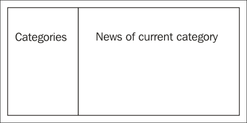
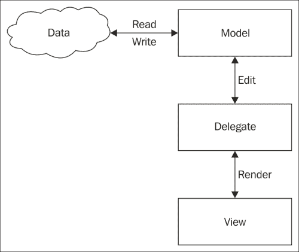
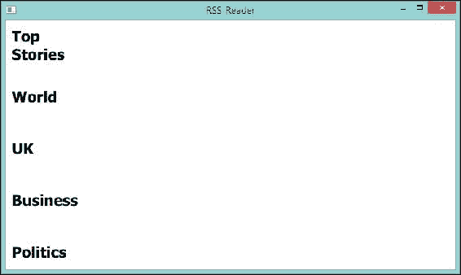
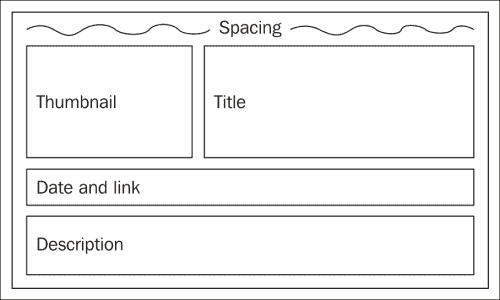
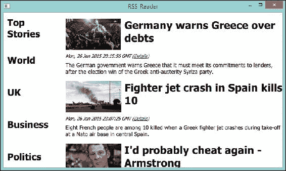
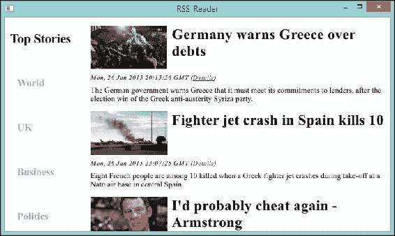
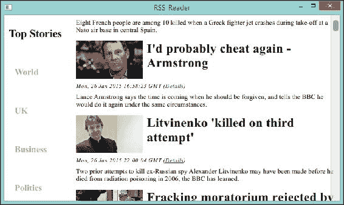
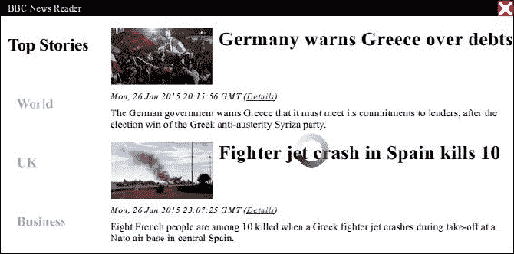
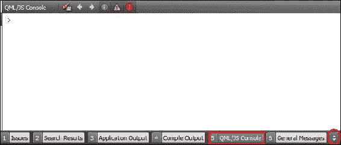

# 第三章。使用 Qt Quick 制作 RSS 阅读器

在本章中，我们将专注于开发使用 Qt Quick 的应用程序。对于支持触控屏的设备，Qt Quick 应用程序响应更快，编写起来也更简单。本章使用 RSS 阅读器作为演示。以下主题将帮助您构建优雅的 Qt Quick 应用程序：

+   理解模型和视图

+   通过 `XmlListModel` 解析 RSS 源

+   调整分类

+   利用 `ScrollView`

+   添加 `BusyIndicator`

+   制作无边框窗口

+   QML 调试

# 理解模型和视图

如前所述，Qt Quick 应用程序与传统 Qt Widgets 应用程序不同。您将编写 QML 而不是 C++ 代码。因此，让我们创建一个新的项目，一个名为 `RSS_Reader` 的 Qt Quick 应用程序。这次，我们将使用 Qt Quick 2.3 作为组件集。由于我们不会使用 Qt Quick Controls 提供的小部件，我们将编写自己的小部件。

在我们动手之前，让我们勾勒出这个应用程序的外观。根据以下图表，将有两个部分。左侧面板提供一些分类，以便用户可以选择有趣的分类。右侧面板是主要区域，显示当前分类下的新闻。这是一个典型的 RSS 新闻阅读器的用户界面。



我们可以通过使用 `ListView` 来实现 **分类** 面板。这种类型（我们在 QML 中说 "类型" 而不是 "类"）用于显示来自各种列表模型的数据。所以让我们编辑我们的 `main.qml`，使其类似于以下内容：

```cpp
import QtQuick 2.3
import QtQuick.Window 2.2

Window {
  id: mainWindow
  visible: true
  width: 720
  height: 400

  ListView {
    id: categories

    width: 150
    height: parent.height
    orientation: ListView.Vertical
    anchors.top: parent.top
    spacing: 3
  }
}
```

`ListView` 需要一个模型来获取数据。在这种情况下，我们可以利用 `ListModel` 的简单性。为了实现这一点，让我们创建一个新的 `Feeds.qml` 文件，它将包含一个自定义的 `ListModel` 示例：

1.  右键单击项目。

1.  选择 **添加新…**。

1.  导航到 **Qt** | **QML 文件（Qt Quick 2）**。

1.  输入 `Feeds.qml` 文件名。

这是 `Feeds.qml` 的内容：

```cpp
import QtQuick 2.3

ListModel {
  ListElement { name: "Top Stories"; url: "http://feeds.bbci.co.uk/news/rss.xml" }
  ListElement { name: "World"; url: "http://feeds.bbci.co.uk/news/world/rss.xml" }
  ListElement { name: "UK"; url: "http://feeds.bbci.co.uk/news/uk/rss.xml" }
  ListElement { name: "Business"; url: "http://feeds.bbci.co.uk/news/business/rss.xml" }
  ListElement { name: "Politics"; url: "http://feeds.bbci.co.uk/news/politics/rss.xml" }
  ListElement { name: "Health"; url: "http://feeds.bbci.co.uk/news/health/rss.xml" }
  ListElement { name: "Education & Family"; url: "http://feeds.bbci.co.uk/news/education/rss.xml" }
  ListElement { name: "Science & Environment"; url: "http://feeds.bbci.co.uk/news/science_and_environment/rss.xml" }
  ListElement { name: "Technology"; url: "http://feeds.bbci.co.uk/news/technology/rss.xml" }
  ListElement { name: "Entertainment & Arts"; url: "http://feeds.bbci.co.uk/news/entertainment_and_arts/rss.xml" }
}
```

### 注意

我们使用 BBC News RSS 作为源，但您可能希望将其更改为另一个。

正如您所看到的，前面的 `ListModel` 示例有两个角色，`name` 和 `url`。一个 "角色"基本上是孩子项的另一种说法。这些可以通过我们即将创建的 `ListView` 代理来绑定。以这种方式，角色通常代表实体的属性或表格的列。

让我解释一下视图、模型和代理之间的关系，这是 Qt 世界中另一个重要但难以理解的概念。这官方上被称为 **模型-视图** 架构。除了传统的视图之外，Qt 将视图和控制器解耦，以便数据可以以许多定制的方式进行渲染和编辑。后者更加优雅和高效。以下图表有助于您理解这个概念：



以用于排列数据的模型`ListModel`为例来阐述它们之间的关系。以下代码中显示的`CategoriesDelegate`是一个代理，用于控制如何从模型中显示角色。最后，我们使用一个视图，在这个例子中是`ListView`，来渲染代理。

模型、视图和代理之间的通信基于信号和槽机制。这需要您花费一些时间才能完全理解这个概念。希望我们可以通过练习这个例子来缩短这个时间。在这个阶段，我们已经有了一个视图和一个模型。我们必须定义一个代理，正如之前提到的`CategoriesDelegate`，来控制模型中的数据并将其渲染在视图上。添加一个新的`CategoriesDelegate.qml`文件，其内容如下：

```cpp
import QtQuick 2.3

Rectangle {
  id: delegate
  property real itemWidth
  width: itemWidth
  height: 80
  Text {
    id: title
    anchors { left: parent.left; leftMargin: 10; right: parent.right; rightMargin: 10 }
    anchors.verticalCenter: delegate.verticalCenter
    text: name
    font { pointSize: 18; bold: true }
    verticalAlignment: Text.AlignVCenter
    wrapMode: Text.WordWrap
  }
}
```

您应该对模型、代理和视图之间的关系有所了解。在这里，我们使用`Rectangle`作为代理类型。在`Rectangle`类型内部是一个`Text`对象，用于显示来自我们的`ListModel`示例中的`name`。至于`font`属性，在这里我们使用`pointSize`来指定文本的大小，而您也可以使用`pixelSize`作为替代。

要完成模型-视图架构，请回到`main.qml`编辑：

```cpp
import QtQuick 2.3
import QtQuick.Window 2.2
import "qrc:/"

Window {
  id: mainWindow
  visible: true
  width: 720
  height: 400

  Feeds {
    id: categoriesModel
  }

  ListView {
    id: categories

    width: 150
    height: parent.height
    orientation: ListView.Vertical
    anchors.top: parent.top
    spacing: 3
    model:categoriesModel
    delegate: CategoriesDelegate {
      id: categoriesDelegate
      width: categories.width
    }
  }
}
```

注意第三行；将其导入`qrc`是至关重要的。我们使用`"qrc:/"`是因为我们需要将 QML 文件放在根目录下。如果您使用子目录来保持`Feeds.qml`和`CategoriesDelegate.qml`，请修改它。在这个例子中，这些文件是未组织的。但强烈建议将它们分类为不同的模块。如果您没有导入目录，您将无法使用这些 QML 文件。

在`Window`项中，我们创建`Feeds`，它是来自`Feeds.qml`的`ListModel`的一个元素。然后，我们给这个`Feeds`项一个`categoriesModel` ID，并使用它作为`ListView`的模型。指定代理的方式与指定视图的模型类似。我们不是在`ListView`外部声明它，而必须在`delegate`作用域内定义它，否则代理项`CategoriesDelegate`将无法从模型中获取数据。如您所见，我们可以操作`categoriesDelegate`的`width`。这是为了确保文本不会超出`ListView`的边界。

如果一切设置正确，点击**运行**，您将看到它这样运行：



# 使用 XmlListModel 解析 RSS 源

的确，我们现在有了分类，但它们似乎与 RSS 没有任何关系。此外，如果您进一步挖掘，您会发现 RSS 源实际上是 XML 文档。Qt 已经提供了一个有用的类型来帮助我们解析它们。我们不需要重新发明轮子。这个强大的类型就是所谓的`XmlListModel`元素，它使用`XmlRole`进行查询。

首先，我们需要将`categoriesModel`的`url`角色暴露给主作用域。这是通过在`ListView`内部声明存储模型当前元素`url`的属性来完成的，即`url`。然后，我们可以添加一个`XmlListModel`元素，并使用该`url`元素作为其`source`。相应地，修改后的`main.qml`文件如下所示：

```cpp
import QtQuick 2.3
import QtQuick.Window 2.2
import QtQuick.XmlListModel 2.0
import "qrc:/"

Window {
  id: mainWindow
  visible: true
  width: 720
  height: 400

  Feeds {
    id: categoriesModel
  }

  ListView {
    id: categories
    width: 150
    height: parent.height
    orientation: ListView.Vertical
    anchors.top: parent.top
    spacing: 3
    model:categoriesModel
    delegate: CategoriesDelegate {
      id: categoriesDelegate
      width: categories.width
    }
    property string currentUrl: categoriesModel.get(0).url
  }

  XmlListModel {
    id: newsModel

    source: categories.currentUrl
    namespaceDeclarations: "declare namespace media = 'http://search.yahoo.com/mrss/'; declare namespace atom = 'http://www.w3.org/2005/Atom';"
    query: "/rss/channel/item"

    XmlRole { name: "title"; query: "title/string()" }
    XmlRole { name: "description"; query: "description/string()" }
    XmlRole { name: "link"; query: "link/string()" }
    XmlRole { name: "pubDate"; query: "pubDate/string()" }
    //XPath starts from 1 not 0 and the second thumbnail is larger and more clear
    XmlRole { name: "thumbnail"; query: "media:thumbnail[2]/@url/string()" }
  }
}
```

### 注意

在 Qt Quick 中，对象的值会动态改变并隐式更新。你不需要显式地给出新值。

为了使用此元素，你需要通过添加`import QtQuick.XmlListModel 2.0`行来导入模块。此外，`XmlListModel`是一个只读模型，这意味着你不能通过此模型修改数据源。这是完全可以接受的，因为我们需要从 RSS 源检索新闻数据。以“头条新闻”为例；以下代码是该 XML 文档内容的一部分：

```cpp
<?xml version="1.0" encoding="UTF-8"?>
<?xml-stylesheet title="XSL_formatting" type="text/xsl" href="/shared/bsp/xsl/rss/nolsol.xsl"?>

<rss   version="2.0">  
<channel> 
<title>BBC News - Home</title>  
<link>http://www.bbc.co.uk/news/#sa-ns_mchannel=rss&amp;ns_source=PublicRSS20-sa</link>  
<description>The latest stories from the Home section of the BBC News web site.</description>  
<language>en-gb</language>  
<lastBuildDate>Mon, 26 Jan 2015 23:19:42 GMT</lastBuildDate>  
<copyright>Copyright: (C) British Broadcasting Corporation, see http://news.bbc.co.uk/2/hi/help/rss/4498287.stm for terms and conditions of reuse.</copyright>  
<image> 
  <url>http://news.bbcimg.co.uk/nol/shared/img/bbc_news_120x60.gif</url>  
  <title>BBC News - Home</title>  
  <link>http://www.bbc.co.uk/news/#sa-ns_mchannel=rss&amp;ns_source=PublicRSS20-sa</link>  
  <width>120</width>  
  <height>60</height> 
</image>  
<ttl>15</ttl>  
<atom:link href="http://feeds.bbci.co.uk/news/rss.xml" rel="self" type="application/rss+xml"/>  
<item> 
  <title>Germany warns Greece over debts</title>  
  <description>The German government warns Greece that it must meet its commitments to lenders, after the election win of the Greek anti-austerity Syriza party.</description>  
  <link>http://www.bbc.co.uk/news/business-30977714#sa-ns_mchannel=rss&amp;ns_source=PublicRSS20-sa</link>  
  <guid isPermaLink="false">http://www.bbc.co.uk/news/business-30977714</guid>  
  <pubDate>Mon, 26 Jan 2015 20:15:56 GMT</pubDate>  
  <media:thumbnail width="66" height="49" url="http://news.bbcimg.co.uk/media/images/80536000/jpg/_80536447_025585607-1.jpg"/>  
  <media:thumbnail width="144" height="81" url="http://news.bbcimg.co.uk/media/images/80536000/jpg/_80536448_025585607-1.jpg"/> 
</item>
……
```

需要设置`namespaceDeclarations`属性，因为 XML 文档有 XML 命名空间。

```cpp
<rss   version="2.0">
```

在这里，`xmlns`代表 XML 命名空间，因此我们相应地声明了命名空间。

```cpp
namespaceDeclarations: "declare namespace media = 'http://search.yahoo.com/mrss/'; declare namespace atom = 'http://www.w3.org/2005/Atom';"
```

实际上，你只需声明一个`media`命名空间并安全地忽略一个`atom`命名空间。然而，如果你没有声明`media`命名空间，应用程序最终会失败解析 XML 文档。因此，回到 XML 文档，你会发现它有一个数据排序的层次结构。我们这里需要的是这些项。以顶级作为根`/`，因此`item`的路径可以写成`/rss/channel/item`。这正是我们放入`query`中的内容。

所有的`XmlRole`元素都是使用`query`作为基础创建的。对于`XmlRole`，`name`定义了它的名称，它不需要与 XML 文档中的名称相同。它类似于常规 Qt Quick 项的`id`。然而，`XmlRole`的查询必须使用相对于`XmlListModel`查询的相对路径。尽管在大多数情况下它是`string()`类型，但它仍然必须显式声明。如果有共享相同键的元素，它将是一个数组，其中列出的第一个元素具有第一个索引。

### 注意

XPath 的第一个索引是`1`而不是`0`。

有时，我们需要获取一个属性`thumbnail`。这是`media:thumbnail`标签的`url`属性。在这种情况下，是`@`符号将完成我们需要的所有魔法。

与这些类别类似，我们必须为`XmlListModel`元素编写一个委托以渲染视图。新的 QML `NewsDelegate.qml`文件如下所示：

```cpp
import QtQuick 2.3

Column {
  id: news
  spacing: 8

  //used to separate news item
  Item { height: news.spacing; width: news.width }

  Row {
    width: parent.width
    height: children.height
    spacing: news.spacing

    Image {
      id: titleImage
      source: thumbnail
    }

    Text {
      width: parent.width - titleImage.width
      wrapMode: Text.WordWrap
      font.pointSize: 20
      font.bold: true
      text: title
    }
  }

  Text {
    width: parent.width
    font.pointSize: 9
    font.italic: true
    text: pubDate + " (<a href=\"" + link + "\">Details</a>)"
    onLinkActivated: {
      Qt.openUrlExternally(link)
    }
  }

  Text {
    width: parent.width
    wrapMode: Text.WordWrap
    font.pointSize: 10.5
    horizontalAlignment: Qt.AlignLeft
    text: description
  }
}
```

不同之处在于这次我们使用`Column`来组织新闻数据并以直观的方式表示。相关的图示如下：



因此，这就是我们为什么在 `Column` 中使用 `Row` 来将 **缩略图** 和 **标题** 一起装箱的原因。因此，我们需要在前面放置一个空的 `item` 元素来分隔每个新闻代理。除了这些不言自明的行之外，还有一个处理链接的技巧。您需要指定 `onLinkActivated` 信号的槽，在这种情况下是 `Qt.openUrlExternally(link)`。否则，点击链接时将不会发生任何操作。

在完成所有这些之后，是时候在 `main.qml` 中编写一个视图来显示我们的新闻了：

```cpp
import QtQuick 2.3
import QtQuick.Window 2.2
import QtQuick.XmlListModel 2.0
import "qrc:/"

Window {
  id: mainWindow
  visible: true
  width: 720
  height: 400

  Feeds {
    id: categoriesModel
  }

  ListView {
    id: categories

    width: 150
    height: parent.height
    orientation: ListView.Vertical
    anchors.top: parent.top
    spacing: 3
    model:categoriesModel
    delegate: CategoriesDelegate {
      id: categoriesDelegate
      width: categories.width
    }
    property string currentUrl: categoriesModel.get(0).url
  }

  XmlListModel {
    id: newsModel

    source: categories.currentUrl
    namespaceDeclarations: "declare namespace media = 'http://search.yahoo.com/mrss/'; declare namespace atom = 'http://www.w3.org/2005/Atom';"
    query: "/rss/channel/item"

    XmlRole { name: "title"; query: "title/string()" }
    XmlRole { name: "description"; query: "description/string()" }
    XmlRole { name: "link"; query: "link/string()" }
    XmlRole { name: "pubDate"; query: "pubDate/string()" }
    //XPath starts from 1 not 0 and the second thumbnail is larger and more clear
    XmlRole { name: "thumbnail"; query: "media:thumbnail[2]/@url/string()" }
  }

  ListView {
    id: newsList

    anchors { left: categories.right; leftMargin: 10; right: parent.right; rightMargin: 4; top: parent.top; bottom: parent.bottom; }
    model: newsModel
    delegate: NewsDelegate {
      width: newsList.width
    }
  }
}
```

记得定义 `NewsDelegate` 的 `width`，以防它显示异常。点击 **运行**；应用程序将看起来像以下截图：



# 调整类别

此应用程序仍然不完整。例如，点击其他类别后，新闻视图将完全不会改变。在这个阶段，我们将解决这个问题并使其更加美观。

我们需要做的是向 `CategoriesDelegate` 添加 `MouseArea`。此元素用于处理各种鼠标交互，包括点击。新的 `CategoriesDelegate.qml` 文件的代码如下所示：

```cpp
import QtQuick 2.3

Rectangle {
  id: delegate
  height: 80

  Text {
    id: title
    anchors { left: parent.left; leftMargin: 10; right: parent.right; rightMargin: 10 }
    anchors.verticalCenter: delegate.verticalCenter
    text: name
    font { pointSize: 18; bold: true }
    verticalAlignment: Text.AlignVCenter
    wrapMode: Text.WordWrap
  }

  MouseArea {
    anchors.fill: delegate
    onClicked: {
      categories.currentIndex = index
      if(categories.currentUrl == url)
      newsModel.reload()
      else
      categories.currentUrl = url
    }
  }
}
```

如您所见，一旦点击了代理，如果需要，它将更改 `categories.currentIndex` 和 `currentUrl`，或者简单地让 `newsModel` 重新加载。如前所述，QML 是一种动态语言，它更改 `categories.currentUrl`，`newsModel` 的 `source` 属性，这会自动导致 `newsModel` 重新加载。

为了帮助用户区分当前选中的类别和其他类别，我们可能希望改变其大小和缩放。有一些附加属性，它们附加到每个代理实例上，或者简单地被它们共享。`.isCurrentItem` 属性是会帮我们大忙的一个属性。它是一个布尔值，表示此代理是否是当前项。然而，只有代理的根项可以直接访问这些附加属性。为了以干净的方式编写代码，我们在 `CategoriesDelegate` 的 `Rectangle` 中添加了一行来持有这个属性：

```cpp
property bool selected: ListView.isCurrentItem
```

现在，我们可以通过在 `Text` 项中添加以下行来利用 `selected`：

```cpp
scale: selected ? 1.0 : 0.8
color: selected ? "#000" : "#AAA"
```

`Text` 将在未选中时缩放至 `0.8`，并在激活时保持正常行为。对于其颜色也有类似条件。`#AAA` 颜色代码是一种非常浅的灰色，这使得激活时的黑色文本更加突出。然而，这些变化没有动画效果。虽然我们希望这些过渡更加自然，Qt Quick 提供了 **带有状态的 Behavior** 来实现这些过渡。通过将这些行添加到 `Text` 项目中，我们得到以下代码：

```cpp
Behavior on color { ColorAnimation { duration: 300 } }
Behavior on scale { PropertyAnimation { duration: 300 } }
```

预期在更改当前代理时会出现动画，这会导致颜色和缩放的变化。如果您不确定是否已执行正确的修改，以下代码显示了新修改的 `CategoriesDelegate.qml` 文件：

```cpp
import QtQuick 2.3

Rectangle {
  id: delegate
  height: 80

  property bool selected: ListView.isCurrentItem

  Text {
    id: title
    anchors { left: parent.left; leftMargin: 10; right: parent.right; rightMargin: 10 }
    anchors.verticalCenter: delegate.verticalCenter
    text: name
    font { pointSize: 18; bold: true }
    verticalAlignment: Text.AlignVCenter
    wrapMode: Text.WordWrap
    scale: selected ? 1.0 : 0.8
    color: selected ? "#000" : "#AAA"
    Behavior on color { ColorAnimation { duration: 300 } }
    Behavior on scale { PropertyAnimation { duration: 300 } }
  }

  MouseArea {
    anchors.fill: delegate
    onClicked: {
      categories.currentIndex = index
      if(categories.currentUrl == url)
      newsModel.reload()
      else
      categories.currentUrl = url
    }
  }
}
```

有改进分类的空间，包括背景图像，它只是一个简单的`Image`元素，可以成为你的练习的一部分。然而，这部分内容不会在本章中涉及。接下来，我们将更改 Windows 平台上的显示字体。我们将在`main.cpp`（而不是`main.qml`）中添加几行代码来将字体更改为`Times New Roman`。

```cpp
#include <QGuiApplication>
#include <QQmlApplicationEngine>
#include <QFont>

int main(int argc, char *argv[])
{
  QGuiApplication app(argc, argv);

  #ifdef Q_OS_WIN
  app.setFont(QFont(QString("Times New Roman")));
  #endif

  QQmlApplicationEngine engine;
  engine.load(QUrl(QStringLiteral("qrc:/main.qml")));

  return app.exec();
}
```

在这里，我们使用一个预定义的宏来限制这种更改仅适用于 Windows 平台。通过设置类型为`QGuiApplication`的`app`的字体，所有子小部件，包括`engine`，都将受到这种更改的影响。现在再次运行应用程序；你应该期望看到一个带有这种报纸式字体的新的 RSS 阅读器：



# 利用 ScrollView

我们现在正在构建 RSS 新闻阅读器。从现在开始，让我们关注那些不愉快的细节。我们首先要添加的是滚动条。更具体地说，`ScrollView`即将被添加。

回到 Qt 4 时代，你必须编写自己的`ScrollView`组件来获得这个虽小但非常不错的功能。尽管你可以在 X11 平台上使用 KDE Plasma Components 的`ScrollArea`，但 Qt 没有捆绑的模块用于此目的，这意味着你无法在 Windows 和 Mac OS X 上使用这些模块。感谢 Qt 项目的开放治理，许多社区代码被合并，特别是来自 KDE 社区。从 Qt 5.1 开始，我们有了`QtQuick.Controls`模块，它包含许多内置的桌面组件，包括`ScrollView`。

这是一个非常易于使用的元素，它为子项提供了滚动条和内容框架。只能有一个直接的`Item`子项，并且这个子项会隐式地锚定以填充`ScrollView`组件。这意味着我们只需要锚定`ScrollView`组件。

指定子项有两种方式。第一种是在`ScrollView`组件的作用域内声明子项，那么内部的项将隐式地成为`ScrollView`组件的子项。另一种方式是设置`contentItem`属性，这是一个显式的方法。在本章的示例中，这两种方式都为你演示了。以下是`main.qml`的内容：

```cpp
import QtQuick 2.3
import QtQuick.Window 2.2
import QtQuick.XmlListModel 2.0
import QtQuick.Controls 1.2
import QtQuick.Controls.Styles 1.2
import "qrc:/"

Window {
  id: mainWindow
  visible: true
  width: 720
  height: 400

  Feeds {
    id: categoriesModel
  }

  ListView {
    id: categories

    orientation: ListView.Vertical
    spacing: 3
    model:categoriesModel
    delegate: CategoriesDelegate {
      id: categoriesDelegate
      width: categories.width
    }
    property string currentUrl: categoriesModel.get(0).url
  }

  ScrollView {
    id: categoriesView
    contentItem: categories
    anchors { left: parent.left; top: parent.top; bottom: parent.bottom; }
    width: 0.2 * parent.width
    style: ScrollViewStyle {
      transientScrollBars: true
    }
  }

  XmlListModel {
  id: newsModel

  source: categories.currentUrl
  namespaceDeclarations: "declare namespace media = 'http://search.yahoo.com/mrss/'; declare namespace atom = 'http://www.w3.org/2005/Atom';"
  query: "/rss/channel/item"

  XmlRole { name: "title"; query: "title/string()" }
  XmlRole { name: "description"; query: "description/string()" }
  XmlRole { name: "link"; query: "link/string()" }
  XmlRole { name: "pubDate"; query: "pubDate/string()" }
  //XPath starts from 1 not 0 and the second thumbnail is larger and more clear
  XmlRole { name: "thumbnail"; query: "media:thumbnail[2]/@url/string()" }
  }

  ScrollView {
    id: newsView
    anchors { left: categoriesView.right; leftMargin: 10; right: parent.right; top: parent.top; bottom: parent.bottom }
    style: ScrollViewStyle {
      transientScrollBars: true
    }
    ListView {
      id: newsList
      model: newsModel
      delegate: NewsDelegate {
        width: newsList.width
      }
    }
  }
}
```

由于子项会自动填充`anchors`，`ListView`内部的一些行被删除了。尽管如此，大多数行只是被移动到了`ScrollView`中。你可以看到我们为`categories`使用了显式方式，而为`newsList`使用了隐式方式。

查看一下`ScrollView`，我们通过将`transientScrollBars`设置为`true`来定义了一个自定义的`style`元素。需要注意的是，`transientScrollBars`的默认值是平台相关的。瞬态滚动条仅在内容被滚动时出现，并在不再需要时消失。无论如何，默认情况下在 Windows 上是`false`，所以我们显式地将其打开，从而得到以下更好的视觉样式：



# 添加 BusyIndicator

缺少忙碌指示器也会让人感到不舒服。无论指示器有多短或多长，下载数据和解析 XML 都需要时间。我非常确信您会想添加这样的指示器，告诉用户保持冷静并等待。幸运的是，`BusyIndicator`，它只是一个运行中的圆圈，是`QtQuick.Controls`的一个元素。这正好是我们想要的。

您需要做的是将这些行添加到`main.qml`文件中的`Window`元素内部：

```cpp
BusyIndicator {
  anchors.centerIn: newsView
  running: newsModel.status == XmlListModel.Loading
}
```

注意，我们不需要更改`BusyIndicator`的`visible`属性，因为`BusyIndicator`仅在`running`属性设置为`true`时可见。在这种情况下，当`newsModel`状态为`Loading`时，我们将`running`设置为`true`。

# 制作无边框窗口

与我们在上一章中所做的一样，我们在这里不希望系统窗口的边框装饰我们的 Qt Quick 应用程序。这主要是因为它看起来像是一个 Web 应用程序，这使得它带有原生的窗口装饰看起来很奇怪。在 QML 中完成这项工作比在 C++中更容易。我们可以在`main.qml`中的`Window`元素中添加以下行：

```cpp
flags: Qt.Window | Qt.FramelessWindowHint
```

尽管我们的 RSS 阅读器以无边框风格运行，但无法移动它，关闭它也很困难，就像上一章中的情况一样。由于我们的鼠标在类别和新闻`ListView`以及`ScrollView`上有很多任务，我们无法简单地使用一个新的`MouseArea`元素来填充`Window`根。因此，我们将绘制自己的标题栏，当然还有退出按钮。

要将退出按钮图片添加到`qrc`文件中，右键点击`qml.qrc`，选择**在编辑器中打开**，导航到**添加** | **添加文件**，然后选择`close.png`。

### 小贴士

使用不同的资源文件（`qrc`）为不同类型的文件会更好，这会使它更有组织。我们将在第八章中更多关于资源文件的内容，*启用您的 Qt 应用程序支持其他语言*。

现在，添加一个新的 QML `TitleBar.qml`文件，其内容如下：

```cpp
import QtQuick 2.3

Row {
  id: titlebar
  width: parent.width
  height: 22
  layoutDirection: Qt.RightToLeft

  property point mPos: Qt.point(0,0)

  Image {
    id: closebutton
    width: 22
    height: 22
    fillMode: Image.PreserveAspectFit
    source: "qrc:/close.png"

    MouseArea {
      anchors.fill: parent
      onClicked: {
        Qt.quit()
      }
    }
  }

  Rectangle {
    width: titlebar.width - closebutton.width
    height: titlebar.height
    color: "#000"

    MouseArea {
      anchors.fill: parent
      onPressed: {
        mPos = Qt.point(mouseX, mouseY)
      }
      onPositionChanged: {
        mainWindow.setX(mainWindow.x + mouseX - mPos.x)
        mainWindow.setY(mainWindow.y + mouseY - mPos.y)
      }
    }
  }
}
```

在这里，我们使用一个`QPoint`对象，`mPos`，来存储鼠标按钮被点击时的位置。

### 注意

尽管我们过去可能将其声明为`var`或`variant`，但为了获得最佳性能，您应避免使用`var`。此外，请注意，`variant`现在已弃用，因此在任何情况下都不应使用。

用于移动的`MouseArea`元素位于`Rectangle`元素内部。`MouseArea`有很多预定义的信号和槽。请注意，我们在这里使用`onPressed`槽而不是`onClicked`来获取鼠标位置。这是因为`clicked`信号仅在鼠标按钮按下然后释放时发出，这使得它不适合移动窗口。

当鼠标按钮被按下然后移动时，会发出 `positionChanged` 信号。除此之外，还有一个名为 `hoverEnabled` 的属性，默认值为 `false`。如果您将其设置为 `true`，则即使没有鼠标按钮被点击，也会处理所有鼠标事件。换句话说，当鼠标移动时，无论是否点击，都会发出 `positionChanged` 信号。因此，在这个例子中，我们不将 `hoverEnabled` 设置为 `true`。

现在让我们回到 `Image` 元素并检查它。`fillMode` 元素决定了图像应该如何调整。默认情况下，它会被拉伸，尽管有比例。在这里，我们将其设置为在调整 `Image` 时保持比例。`source` 属性持有图像文件路径。在这种情况下，它是位于 `Resources` 文件中的 `qml.qrc` 的 `close.png` 文件。这里我们走；这是一个简单的 `MouseArea`，它将 `Image` 变成关闭按钮。

最后，是时候将 `TitleBar` 添加到 `main.qml` 中了，如下所示：

```cpp
import QtQuick 2.3
import QtQuick.Window 2.2
import QtQuick.XmlListModel 2.0
import QtQuick.Controls 1.2
import QtQuick.Controls.Styles 1.2
import "qrc:/"

Window {
  id: mainWindow
  visible: true
  width: 720
  height: 400
  flags: Qt.Window | Qt.FramelessWindowHint

  TitleBar {
    id: titleBar
  }

  Text {
    id: windowTitle
    anchors { left: titleBar.left; leftMargin: 10; verticalCenter: titleBar.verticalCenter }
    text: "BBC News Reader"
    color: "#FFF"
    font.pointSize: 10
  }

  Feeds {
    id: categoriesModel
  }

  ListView {
    id: categories

    orientation: ListView.Vertical
    spacing: 3
    model:categoriesModel
    delegate: CategoriesDelegate {
      id: categoriesDelegate
      width: categories.width
    }
    property string currentUrl: categoriesModel.get(0).url
  }

  ScrollView {
    id: categoriesView
    contentItem: categories
    anchors { left: parent.left; top: titleBar.bottom; bottom: parent.bottom; }
    width: 0.2 * parent.width
    style: ScrollViewStyle {
      transientScrollBars: true
    }
  }

  XmlListModel {
    id: newsModel

    source: categories.currentUrl
    namespaceDeclarations: "declare namespace media = 'http://search.yahoo.com/mrss/'; declare namespace atom = 'http://www.w3.org/2005/Atom';"
    query: "/rss/channel/item"

    XmlRole { name: "title"; query: "title/string()" }
    XmlRole { name: "description"; query: "description/string()" }
    XmlRole { name: "link"; query: "link/string()" }
    XmlRole { name: "pubDate"; query: "pubDate/string()" }
    //XPath starts from 1 not 0 and the second thumbnail is larger and more clear
    XmlRole { name: "thumbnail"; query: "media:thumbnail[2]/@url/string()" }
  }

  ScrollView {
    id: newsView
    anchors { left: categoriesView.right; leftMargin: 10; right: parent.right; top: titleBar.bottom; bottom: parent.bottom }
    style: ScrollViewStyle {
      transientScrollBars: true
    }
    ListView {
      id: newsList
      model: newsModel
      delegate: NewsDelegate {
        width: newsList.width
      }
    }
  }

  BusyIndicator {
    anchors.centerIn: newsView
    running: newsModel.status == XmlListModel.Loading
  }
}
```

我们还使用了一个 `Text` 元素，`windowTitle`，在 `titleBar` 中显示窗口标题。由于我们从 BBC News 获取数据，将其称为 `BBC News Reader` 或随意命名都是不错的选择。

除了添加标题栏外，还需要修改一些代码以留出空间。`ScrollView` 组件的锚定 `top` 应该改为 `titleBar.bottom` 而不是 `parent.top`，否则标题栏将部分位于这两个滚动视图的顶部。

运行应用程序；它应该提供一种新的视觉风格。尽管它看起来更像是一个网络应用程序，但整个界面整洁且集成。这种改变的另一个好处是在所有平台上实现统一的 UI。



# 调试 QML

调试 QML 最常见的做法是使用 API 控制台。JavaScript 开发者应该熟悉这一点，因为 QML 中有控制台支持。`console` 函数与 Qt/C++ `QDebug` 函数之间的关系如下：

| QML | Qt/C++ |
| --- | --- |
| `console.log()` | `qDebug()` |
| `console.debug()` | `qDebug()` |
| `console.info()` | `qDebug()` |
| `console.warn()` | `qWarning()` |
| `console.error()` | `qCritical()` |

在现有的支持基础上，QML 就像 JavaScript 编程一样。同时，以下函数也被引入到 QML 中：

| 函数 | 描述 |
| --- | --- |
| `console.assert()` | 此函数测试表达式是否为真。如果不是，它将可选地将消息写入控制台并打印堆栈跟踪。 |
| `console.exception()` | 此函数在调用点打印错误消息以及 JavaScript 执行的堆栈跟踪。 |
| `console.trace()` | 此函数在调用点打印 JavaScript 执行的堆栈跟踪。 |
| `console.count()` | 此函数打印特定代码块当前执行的次数，并附带一条消息。 |
| `console.time()``console.timeEnd()` | 这对函数将打印它们之间特定代码块所花费的时间（以毫秒为单位）。 |
| `console.profile()``console.profileEnd()` | 这对函数可以分析`QDeclarativeEngine`的状态以及 V8 调用方法。然而，在调用`console.profileEnd()`之前，您需要将 QML 分析器工具附加到应用程序上。 |

除了前面提到的有用功能外，Qt Creator 中的常见**调试**模式也适用于 QML。操作几乎与 C++调试相同。您可以设置断点、观察值等。然而，QML 还提供了一项额外功能。那就是**QML/JS 控制台**！Qt Creator 默认不显示**QML/JS 控制台**，您需要手动开启。只需点击以下截图中的小按钮（红色圆圈），然后勾选**QML/JS 控制台**：



### 小贴士

当应用程序被断点中断时，您可以使用**QML/JS 控制台**执行当前上下文中的 JavaScript 表达式。您可以在不编辑源代码的情况下临时更改属性值，并在运行的应用程序中查看结果。

**QML/JS 控制台**标签以吸引人的方式显示调试输出，包括 Qt 调试信息和 JavaScript 控制台消息。它提供了一个按钮组，帮助您过滤信息、警告和错误。因此，当您调试 Qt Quick 应用程序时，只需使用这个**QML/JS 控制台**标签来替换**应用程序输出**。

# 摘要

在本章中，我们详细介绍了 Qt Quick。我们还涵盖了模型-视图编程，这是 Qt/C++和 Qt Quick/QML 中的关键概念。您可能还会发现，QML 在某种程度上是 JavaScript 的可扩展版本。这对于 JavaScript 开发者来说是一个额外的优势。然而，如果您之前从未编写过脚本，开始并不困难。一旦开始，您将能够探索 Qt Quick 的迷人特性。我们将在下一章向您展示如何使用 Qt 访问相机设备。
