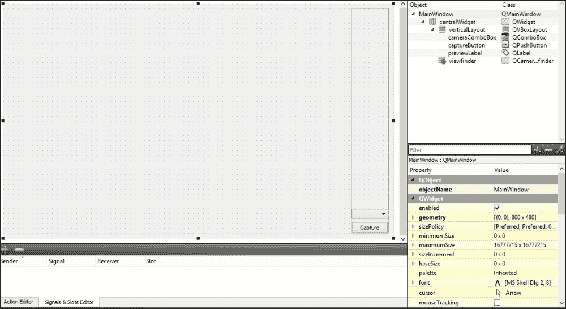
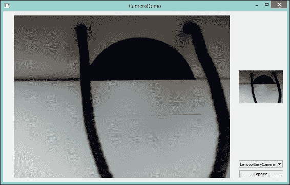
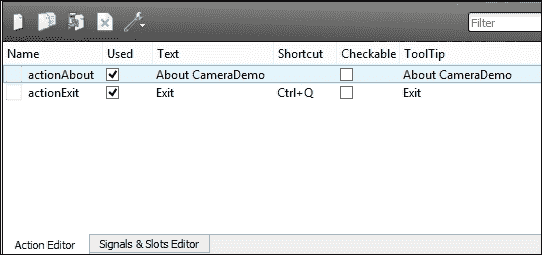
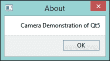
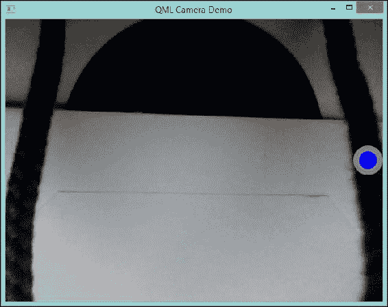
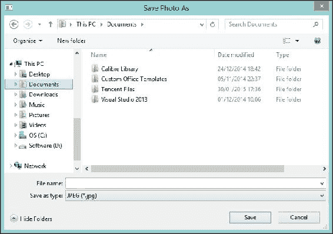

# 第四章：控制相机和拍照

通过本章，你会发现使用 Qt 访问和控制相机是多么容易。本章中的示例还演示了如何利用状态栏和菜单栏。除了传统的 Qt Widget 应用程序外，还有一个 QML 相机示例，它以更优雅的方式完成与 Qt/C++相同的功能。本章涵盖的以下主题将扩展你的应用程序：

+   在 Qt 中访问相机

+   控制相机

+   在状态栏中显示错误

+   在状态栏中显示永久小部件

+   利用菜单栏

+   使用`QFileDialog`

+   使用 QML 相机

# 在 Qt 中访问相机

尽管我们不会讨论相机工作原理的技术细节，但 Qt 中实现相机的概述将会被涵盖。相机支持包含在 Qt Multimedia 模块中，这是一个提供丰富 QML 类型和 C++类以处理多媒体内容的模块。例如，音频播放、相机和收音机功能等。为了补充这一点，Qt Multimedia Widgets 模块提供了基于小部件的多媒体类，以简化工作。

有一些类帮助我们处理相机。例如，`viewfinder`允许用户通过相机来构图，并在许多情况下聚焦图片。在 Qt/C++中，你可以使用`QGraphicsView`与`QGraphicsVideoItem`来完成这项工作。`QGraphicsView`提供了一个小部件来显示`QGraphicsScene`的内容。在这种情况下，`QGraphicsVideoItem`是场景中的一个项目。这个视图-场景-项目是**图形视图框架**。关于这个概念的具体信息，请访问[`doc.qt.io/qt-5/graphicsview.html`](http://doc.qt.io/qt-5/graphicsview.html)。在这个例子中，我们使用`QCameraViewfinder`，这是一个专门的`viewfinder`类，它更简单、更直接。

要捕捉照片，我们需要使用`QCameraImageCapture`类，它记录媒体内容，而聚焦和缩放则由`QCameraFocus`类管理。

最终，`QCamera`在这个过程中扮演核心角色。`QCamera`类提供了一个接口来访问相机设备，包括网络摄像头和移动设备摄像头。还有一个名为`QCameraInfo`的类，可以列出所有可用的相机设备并选择使用哪一个。以下图表将帮助您理解这一点：


创建一个名为`CameraDemo`的新 Qt Widget 应用程序项目。编辑`CameraDemo.pro`文件。通过添加一行，如所示，将多媒体`multimediawidgets`添加到 QT 中，或者将两个模块添加到预定义的 QT 行中：

```cpp
QT       += multimedia multimediawidgets
```

进行此修改后，您需要保存文件并导航到**构建** | **运行 qmake**以加载这些新模块。让我们编辑`CameraDemo`的`mainwindow.ui`文件，通过以下步骤添加一些小部件来使用相机：

1.  移除状态栏和菜单栏。它们将在下一节中重新添加。目前，为了获得更简洁的用户界面，它们已被移除。

1.  将**Widget**拖入框架中。

1.  将其名称更改为`viewfinder`。

1.  右键单击`viewfinder`并选择**提升到…**。

1.  在**提升类名称**字段中填写`QCameraViewfinder`。请记住勾选**全局包含**复选框，因为这是一个预定义的 Qt 类。点击**添加**，然后点击**提升**。

1.  将**主窗口**设置为**水平布局**。

1.  将一个**垂直布局**拖到`viewfinder`的右侧。随后，组件将被添加到布局中。

1.  添加**标签**，用于显示捕获的图像。请注意，在这里我们不使用`QGraphicsView`，仅仅因为`QLabel`足以满足这个目的，并且更容易使用。

1.  将其重命名为`previewLabel`并清除其文本。

1.  将**组合框**拖到`previewLabel`下方。

1.  由于它将用于显示所有可用的摄像头设备，将其重命名为`cameraComboBox`。

1.  在**垂直布局**中`ComboBox`下方添加一个名为`captureButton`的**按钮**，让用户点击拍照。此按钮上应显示文本`Capture`。

它应该看起来像以下截图：



现在，回到`mainwindow.h`编辑，如下所示：

```cpp
#ifndef MAINWINDOW_H
#define MAINWINDOW_H

#include <QMainWindow>
#include <QCamera>
#include <QCameraInfo>
#include <QCameraImageCapture>

namespace Ui {
  class MainWindow;
}

class MainWindow : public QMainWindow
{
  Q_OBJECT

public:
  explicit MainWindow(QWidget *parent = 0);
  ~MainWindow();

private:
  Ui::MainWindow *ui;
  QList<QCameraInfo> camList;
  QCamera *camera;
  QCameraImageCapture *imgCapture;

private slots:
  void onCameraChanged(int);
  void onCaptureButtonClicked();
  void onImageCaptured(int, const QImage &);
};

#endif // MAINWINDOW_H
```

如同往常，为了使用前面代码中的类，我们必须正确包含它们。此外，我们使用`camList`，它是一种`QList<QCameraInfo>`类型，用于存储可用的摄像头设备。由于`QList`是一个模板类，我们必须将列表元素的类型传递给构造函数，在这种情况下是`QCameraInfo`。

这些私有槽负责摄像头控制，即更改摄像头设备和点击捕获按钮。同时，`onImageCaptured`用于处理`QCameraImageCapture`的`imageCaptured`信号。

`maindow.cpp`文件的内容如下所示：

```cpp
#include "mainwindow.h"
#include "ui_mainwindow.h"

MainWindow::MainWindow(QWidget *parent) :
  QMainWindow(parent),
  ui(new Ui::MainWindow)
{
  ui->setupUi(this);

  camera = NULL;
  connect(ui->captureButton, &QPushButton::clicked, this, &MainWindow::onCaptureButtonClicked);
  connect(ui->cameraComboBox, static_cast<void (QComboBox::*) (int)>(&QComboBox::currentIndexChanged), this, &MainWindow::onCameraChanged);

  camList = QCameraInfo::availableCameras();
  for (QList<QCameraInfo>::iterator it = camList.begin(); it != camList.end(); ++it) {
    ui->cameraComboBox->addItem(it->description());
  }
}

MainWindow::~MainWindow()
{
  delete ui;
}

void MainWindow::onCameraChanged(int idx)
{
  if (camera != NULL) {
    camera->stop();
  }

  camera = new QCamera(camList.at(idx), this);
  camera->setViewfinder(ui->viewfinder);
  camera->setCaptureMode(QCamera::CaptureStillImage);
  camera->start();
}

void MainWindow::onCaptureButtonClicked()
{
  imgCapture = new QCameraImageCapture(camera, this);
  connect(imgCapture, &QCameraImageCapture::imageCaptured, this, &MainWindow::onImageCaptured);
  camera->searchAndLock();
  imgCapture->setCaptureDestination(QCameraImageCapture::CaptureToFile);
  imgCapture->capture();
}

void MainWindow::onImageCaptured(int, const QImage &img)
{
  QPixmap pix = QPixmap::fromImage(img).scaled(ui->previewLabel->size(), Qt::KeepAspectRatio);
  ui->previewLabel->setPixmap(pix);
  camera->unlock();
  imgCapture->deleteLater();
}
```

让我们先看看构造函数。我们给`camera`一个`NULL`地址来标记没有分配和/或激活摄像头。这将在后面解释。

由于`QComboBox::currentIndexChanged`有重载的信号函数，你必须使用`static_cast`指定你想要的信号。否则，编译器会报错并无法编译。只有信号和槽的新语法语句受到影响，这意味着这里显示的旧语法语句不会引起任何错误：

```cpp
connect(ui->cameraComboBox, SIGNAL(currentIndexChanged(int)), this, SLOT(onCameraChanged(int)));
```

然而，如前所述，新语法有许多优点，并且强烈建议你替换旧语法。

在我们继续的过程中，我们可以用可用的摄像头填充`camList`，因为`availableCameras`是`QCameraInfo`的一个静态成员函数，它返回系统上所有可用的摄像头列表。你也可以传递一个参数来指定摄像头位置，如前置或后置摄像头，这在移动平台上非常有用。

然后，我们将`camList`中的所有项目添加到我们的相机`combobox`中。在这里，迭代器遍历列表并对每个项目进行操作。在处理列表、数组等时，使用迭代器非常快。Qt 支持这种方法，包括 Java 风格和 STL 风格的迭代器。在这种情况下，我们更喜欢并使用 STL 风格的迭代器。`QCameraInfo`的描述函数返回相机的可读描述。

现在，让我们进入`onCameraChanged`函数内部。在构建相机之前，我们需要检查是否已经存在相机。如果存在，我们停止旧的相机。然后，我们使用`viewfinder`小部件设置`viewfinder`类，这是我们之前在**设计**模式中做的。指定捕获模式为`CaptureStillImage`后，我们可以开始相机。

### 提示

如果没有释放（停止），相机将无法再次启动。

因此，它进入`onCaptureButtonClicked`槽。同样，`imgCapture`对象通过传递`camera`和`this`作为其`QCamera`目标和`QObject`父对象来构造。然后，我们必须将`imageCaptured`信号连接到`MainWindow`的`onImageCaptured`槽。现在，让`camera->searchAndLock()`锁定所有相机设置。这个函数是对快门按钮半按的响应。在拍照之前，我们将捕获目标设置为文件。如果需要，可以使用`QCameraImageCapture::CaptureToBuffer`标志将其设置为缓冲区，但请注意，这并不是所有平台都支持的。

如果一切顺利，`camera`将捕获一张图片，并发出`imageCaptured`信号。然后，将执行`onImageCaptured`槽函数。在这个函数内部，我们将捕获的图片缩放到`previewLabel`的大小。然后，只需为`previewLabel`设置`QPixmap`并解锁`camera`。最后，我们调用`deleteLater()`函数来安全地删除`imgCapture`实例。

### 注意

你应该明确指出`Qt::KeepAspectRatio`，否则它将使用默认的`Qt::IgnoreAspectRatio`标志。

现在，运行演示并查看你得到的结果。



就像我们在前面的章节中所做的那样，你可以随意更改窗口标题、应用程序字体等。这些微小的调整将不再详细说明。

# 控制相机

`QCameraFocus`类被提及以控制相机的缩放和聚焦。说到缩放，Qt 支持光学和数字缩放。众所周知，光学缩放的质量优于数字缩放。因此，光学缩放应优先于数字缩放。

将一个水平滑块和一个标签拖到 **MainWindow** 面板的 `verticalLayout` 中，位于捕获按钮上方。分别命名为 `zoomSlider` 和 `zoomLabel`。记得将 `zoomLabel` 的文本改为 `Zoom`，并将 `alignment` 中的文本改为 `AlignHCenter`。由于 Qt 不提供浮点数滑块，我们简单地乘以 `10` 以在滑块中得到一个整数。因此，将 `zoomSlider` 的 `minimum` 值改为 `10`，这意味着缩放 1.0。

在 `mainwindow.h` 中包含 `QCameraFocus` 并添加这两个私有成员：

```cpp
QCameraFocus *cameraFocus;
qreal maximumOptZoom;
```

### 提示

并非每个相机都支持缩放。如果不支持，最大缩放为 1.0，适用于光学和数字缩放。

存在一个名为 `qreal` 的类型，它基本上是一个 `double` 值。出于性能考虑，在 ARM 平台上它是 `float`，而在其他平台上是 `double`。然而，从 Qt 5.2 版本开始，Qt 默认在 ARM 上使用 `double`。无论如何，如果应用程序部署在不同的硬件平台上，建议使用 `qreal`。

还需要声明一个新的插槽：

```cpp
void onZoomChanged(int);
```

现在，在 `MainWindow` 类的构造函数中连接 `zoomSlider`：

```cpp
connect(ui->zoomSlider, &QSlider::valueChanged, this, &MainWindow::onZoomChanged);
```

然而，`QCameraFocus` 不能显式构造。相反，它只能从 `QCamera` 类中检索。因此，我们在 `onCameraChanged` 中 `camera` 参数构造之后获得 `cameraFocus`：

```cpp
cameraFocus = camera->focus();
```

然后，设置 `maximumOptZoom` 和 `zoomSlider` 的 `maximum` 值：

```cpp
maximumOptZoom = cameraFocus->maximumOpticalZoom();
ui->zoomSlider->setMaximum(maximumOptZoom * cameraFocus->maximumDigitalZoom() * 10);
```

如果相机根本不支持缩放，滑块将无法滑动。`onZoomChanged` 插槽的定义如下所示：

```cpp
void MainWindow::onZoomChanged(int z)
{
  qreal zoom = qreal(z) / 10.0;
  if (zoom > maximumOptZoom) {
    cameraFocus->zoomTo(maximumOptZoom, zoom / maximumOptZoom);
  }
  else {
    cameraFocus->zoomTo(zoom, 1.0);
  }
}
```

如您所见，`zoomTo` 的第一个参数是光学缩放因子，而另一个是数字缩放因子。

# 在状态栏上显示错误

首先，整个相机过程中可能会出现错误，让用户了解错误是什么是一个好的做法。可以通过弹出对话框和/或状态栏来实现。你不想提醒用户每个琐碎的错误。因此，最好只对关键错误使用弹出对话框，而在状态栏上显示非关键错误和警告。

Qt 很早就开始支持状态栏了。`QStatusBar` 类是提供适合展示状态信息的水平栏。相机的状态也可以显示，这将在后续主题中介绍。

要使用状态栏，编辑 `mainwindow.ui`，右键单击 `MainWindow`，如果不存在或之前已删除，则选择 **Create Status Bar**。

然后，我们应该声明两个插槽来分别处理相机和图像捕获错误。将这两行添加到 `mainwindow.h` 中的 `private slots`：

```cpp
void onCameraError();
void onImageCaptureError(int, QCameraImageCapture::Error, const QString &);
```

`mainwindow.cpp` 中的定义如下所示：

```cpp
void MainWindow::onCameraError()
{
  ui->statusBar->showMessage(camera->errorString(), 5000);
}

void MainWindow::onImageCaptureError(int, QCameraImageCapture::Error, const QString &err)
{
  ui->statusBar->showMessage(err, 5000);
  imgCapture->deleteLater();
}
```

这只是让 `statusBar` 显示一个持续五秒钟的临时消息。即使你传递零给 `showMessage`，它仍然是一个临时消息。在后续情况下，它不会在给定时间段后消失；相反，如果有新的临时消息，它才会消失。

由于`QCamera`和`QCameraImageCapture`中的信号错误不同，我们使用不同的槽来处理它。对于`QCamera`，`error`信号函数只有一个参数`QCamera::Error`。

相比之下，`QCameraImageCapture::error`提供了三个参数：`int`、`QCameraImageCapture::Error`和一个`const QString`引用。因此，我们可以通过直接使用其错误`string`来利用这个信号。

不要忘记连接信号和槽。在这里，在`onCameraChanged`函数中，在`camera`构造之后，连接`camera`错误和`onCameraError`槽。

```cpp
connect(camera, static_cast<void (QCamera::*) (QCamera::Error)>(&QCamera::error), this, &MainWindow::onCameraError);
```

由于`QCamera`类中还有一个名为`error`的重载函数，我们必须使用`static_cast`来指定信号函数，就像我们在`QComboBox`中做的那样。

类似地，在`onCaptureButtonClicked`函数中`imgCapture`对象构造之后添加`connect`语句。

```cpp
connect(imgCapture, static_cast<void (QCameraImageCapture::*) (int, QCameraImageCapture::Error, const QString &)>(&QCameraImageCapture::error), this, &MainWindow::onImageCaptureError);
```

这是另一个重载的`error`信号函数。然而，由于有三个参数，它很繁琐。

# 状态栏中的永久控件

有时，我们想在状态栏内显示某种指示器以显示实时状态，例如相机状态。如果它被临时消息覆盖，这就不合适了。在这种情况下，`QStatusBar`提供了`insertPermanentWidget`函数以永久地将控件添加到状态栏。这意味着它不会被临时消息遮挡，并且位于状态栏的右侧。

首先，让我们创建一个相机状态控件。添加一个名为`CameraStatusWidget`的新 C++类，它继承自`QWidget`，但使用`QLabel`作为基类。我们使用`QLabel`作为基类，因为相机的状态以文本形式显示，基本上是一个定制的标签控件。`camerastatuswidget.h`的内容如下所示：

```cpp
#ifndef CAMERASTATUSWIDGET_H
#define CAMERASTATUSWIDGET_H

#include <QLabel>
#include <QCamera>

class CameraStatusWidget : public QLabel
{
  Q_OBJECT
  public:
    explicit CameraStatusWidget(QWidget *parent = 0);

  public slots:
    void onCameraStatusChanged(QCamera::Status);
};

#endif // CAMERASTATUSWIDGET_H
```

除了`#include <QCamera>`，我们只在这个头文件中添加了`onCameraStatusChanged`槽的声明。相关的`camerastatuswidget.cpp`源文件如下所示：

```cpp
#include "camerastatuswidget.h"

CameraStatusWidget::CameraStatusWidget(QWidget *parent) :
  QLabel(parent)
{
}

void CameraStatusWidget::onCameraStatusChanged(QCamera::Status s)
{
  QString status;
  switch (s) {
    case QCamera::ActiveStatus:
      status = QString("Active");
      break;
    case QCamera::StartingStatus:
      status = QString("Starting");
      break;
    case QCamera::StoppingStatus:
      status = QString("Stopping");
      break;
    case QCamera::StandbyStatus:
      status = QString("Standby");
      break;
    case QCamera::LoadedStatus:
      status = QString("Loaded");
      break;
    case QCamera::LoadingStatus:
      status = QString("Loading");
      break;
    case QCamera::UnloadingStatus:
      status = QString("Unloading");
      break;
    case QCamera::UnloadedStatus:
      status = QString("Unloaded");
      break;
    case QCamera::UnavailableStatus:
      status = QString("Unavailable");
      break;
    default:
      status = QString("Unknown");
  }
  this->setText(status);
}
```

### 提示

总是在`switch`语句中处理异常。

`QCamera::Status`是一个`enum`类型。这就是为什么我们必须使用`switch`语句将状态转换为`string`。既然我们现在有了相机状态控件，是时候将其添加到状态栏了。编辑`mainwindow.h`并添加以下`CameraStatusWidget`指针：

```cpp
CameraStatusWidget *camStatusWid;
```

不要忘记包含`camerastatuswidget.h`头文件。然后，在`ui->setupUi(this)`之后立即设置`camStatusWid`，添加以下行：

```cpp
camStatusWid = new CameraStatusWidget(ui->statusBar);
ui->statusBar->addPermanentWidget(camStatusWid);
```

导航到`onCameraChanged`函数；我们需要连接`QCamera::statusChanged`信号。只需在相机构造之后添加以下行：

```cpp
connect(camera, &QCamera::statusChanged, camStatusWid, &CameraStatusWidget::onCameraStatusChanged);
```

同样，我们还可以将当前缩放添加到状态栏。实际上，对于这个小型且易于实现的控件，我们不需要创建一个新的类。相反，我们将使用现有的`QLabel`类通过声明一个新成员来实现这一点。在`mainwindow.h`中添加一个新的私有成员：

```cpp
QLabel *zoomStatus;
```

同时，在 `mainwindow.cpp` 文件的 `MainWindow` 类构造函数中构建并插入 `zoomStatus` 到 `statusBar`：

```cpp
zoomStatus = new QLabel(QString::number(qreal(ui->zoomSlider->value()) / 10.0), this);
ui->statusBar->addPermanentWidget(zoomStatus);
```

在这里，我们使用一个 `number` 函数，它是 `QString` 类的静态公共函数，用于将数字（可以是 `double` 或 `integer`）转换为 `QString`。为了及时更新 `zoomStatus`，将此行添加到 `onZoomChanged` 函数中：

```cpp
zoomStatus->setText(QString::number(zoom));
```

经过这些修改后，应用程序将如以下截图所示运行：


# 利用菜单栏

现在你已经完成了底部的栏，是时候开始顶部的菜单栏了。与状态栏类似，在 **设计** 模式下右键单击 `MainWindow`，如果不存在或之前已删除，则选择 **创建菜单栏**。

然后，只需遵循提示。添加一个包含 **退出** 动作的 **文件** 菜单。另一个菜单可以是 **关于**，其中包含 **关于 CameraDemo** 动作。你应该知道，这些动作可以在 **动作编辑器** 面板中更改，该面板与 **信号与槽编辑器** 在同一位置。



如以下截图所示，这些动作的名称分别更改为 `actionAbout` 和 `actionExit`。此外，`actionExit` 有一个快捷键，*Ctrl* + *Q*。只需双击动作，然后按住你想要的快捷键添加快捷键。这在上面的截图中有展示：


我们已经在 第二章 *构建一个漂亮的跨平台时钟* 中使用了 `QMenu` 和 `QAction`。这里的区别在于你使用 `QMenu` 作为菜单栏，并在 **设计** 模式下设置它，而不是编写代码。但为什么它叫做 `QAction` 呢？这是因为用户可以在菜单、工具栏或快捷键上触发一个命令。他们期望无论在哪里都能有相同的行为。因此，它应该被抽象成一个动作，可以插入到菜单或工具栏中。你可以将其设置为可复选的 `QAction` 选项，并用作简单的 `QCheckbox` 选项。

让我们先完成 `actionExit`，因为它比另一个简单。对于 `actionExit`，我们只需要一个 `connect` 语句来使其工作。将以下语句添加到 `mainwindow.cpp` 文件的 `MainWindow` 类构造函数中：

```cpp
connect(ui->actionExit, &QAction::triggered, this, &MainWindow::close);
```

如果有快捷键，`triggered` 信号将由鼠标点击或键盘快捷键（如果有快捷键）触发。由于我们将其连接到 `MainWindow` 的 `close` 槽，它将关闭 `MainWindow`，从而导致整个应用程序退出。

同时，我们需要声明一个槽来满足与 `actionAbout` 的连接。像往常一样，在 `mainwindow.h` 头文件中声明它。

```cpp
void onAboutTriggered();
```

你可能认为我们将创建一个新的类来显示**关于**对话框。但是，我们不必自己制作**关于**对话框，因为 Qt 已经为我们做了。它包含在`QMessageBox`中，所以你应该使用以下行包含它：

```cpp
#include <QMessageBox>
```

这是槽的定义：

```cpp
void MainWindow::onAboutTriggered()
{
  QMessageBox::about(this, QString("About"), QString("Camera Demonstration of Qt5"));
}
```

### 注意

`QMessageBox`类提供了一个模态对话框，用于通知用户或询问用户一个问题，并接收答案。

几乎所有类型的弹出对话框都可以在`QMessageBox`中找到。在这里，我们使用静态的`About`函数创建一个**关于**对话框。它有三个参数。第一个是父`QObject`指针，后面是标题和上下文。请记住在`MainWindow`类的构造函数中连接信号和槽。

```cpp
connect(ui->actionAbout, &QAction::triggered, this, &MainWindow::onAboutTriggered);
```

如果再次编译并运行应用程序，尝试触发**关于**对话框，它将类似于以下截图：



### 注意

除了`About`之外，`QMessageBox`还有其他有用的静态公共成员。最常用的是`critical`、`information`、`question`和`warning`，用于弹出消息框。有时，你会在菜单栏中看到**关于 Qt**的条目，这是调用`aboutQt`函数。

实际上，如果存在，**关于**对话框将显示一个图标。由于缺少图标，这里有一个空白区域。搜索图标的顺序如下所示：

+   如果存在，这个第一个图标将是`parent->icon()`。

+   第二个图标将是包含`parent`的顶层小部件。

+   第三个图标将是活动窗口。

+   第四个图标将是`Information`图标。

# 使用 QFileDialog

拍照的最后一步是将照片保存到磁盘。在这个阶段，程序会将图像保存到文件中，但文件的位置由相机后端决定。我们可以简单地使用一个对话框，让用户选择照片的目录和文件名。有一个`QFileDialog`类可以帮助我们简化工作。创建`QFileDialog`类最简单的方法是使用静态函数。因此，请编辑`mainwindow.cpp`文件中的`onCaptureButtonClicked`函数。

```cpp
void MainWindow::onCaptureButtonClicked()
{
  imgCapture = new QCameraImageCapture(camera, this);
  connect(imgCapture, static_cast<void (QCameraImageCapture::*) (int, QCameraImageCapture::Error, const QString &)>(&QCameraImageCapture::error), this, &MainWindow::onImageCaptureError);
  connect(imgCapture, &QCameraImageCapture::imageCaptured, this, &MainWindow::onImageCaptured);

  camera->searchAndLock();
  imgCapture->setCaptureDestination(QCameraImageCapture::CaptureToFile);
  QString location = QFileDialog::getSaveFileName(this, QString("Save Photo As"), QString(), "JPEG Image (*.jpg)");
  imgCapture->capture(location);
}
```

在这里，我们使用`getSaveFileName`静态函数创建一个文件对话框，以返回用户选择的文件。如果用户点击**取消**，则`location`类型将是一个空的`QString`引用，图像将被保存在默认位置。文件不需要存在。实际上，如果它存在，将会有一个覆盖对话框。此函数的原型如下所示：

```cpp
QString QFileDialog::getSaveFileName(QWidget * parent = 0, const QString & caption = QString(), const QString & dir = QString(), const QString & filter = QString(), QString * selectedFilter = 0, Options options = 0)
```

第一个参数是`QObject`父对象，如通常一样。第二个是对话框的标题，后面是默认目录。`filter`对象用于限制文件类型，并且可以使用多个由两个分号`;;`分隔的过滤器。以下是一个示例：

```cpp
"JPEG (*.jpeg *.jpg);;PNG (*.png);;BMP (*.bmp)"
```

设置`selectedFilter`可以更改默认过滤器。最后，`Options`用于定义文件对话框的行为。有关更多详细信息，请参阅`QFileDialog`文档。

# QML 相机

到目前为止，我们讨论了如何在 Qt/C++中访问和控制相机。现在是时候看看 QML 在这个领域的表现了。尽管有一些限制，但你会发现，由于 Qt 提供了许多包，使用 Qt Quick/QML 来做这件事要容易得多，也更优雅。

创建一个新的 Qt Quick 应用程序项目。`main.qml`的内容如下所示：

```cpp
import QtQuick 2.3
import QtQuick.Controls 1.2
import QtMultimedia 5.3
import "qrc:/"

ApplicationWindow {
  visible: true
  width: 640
  height: 480
  title: qsTr("QML Camera Demo")

  Camera {
    id: camera

    imageCapture {
      onImageCaptured: {
        photoPreview.source = preview
        photoPreview.visible = true;
        previewTimer.running = true;
      }
    }
  }

  VideoOutput {
    id: viewfinder
    source: camera
    anchors.fill: parent
  }

  Image {
    id: photoPreview
    anchors.fill: viewfinder
  }

  Timer {
    id: previewTimer
    interval: 2000
    onTriggered: photoPreview.visible = false;
  }

  CaptureButton {
    anchors.right: parent.right
    anchors.verticalCenter: parent.verticalCenter
    diameter: 50
  }
}
```

让我带你了解这个。

`Camera`和`VideoOutput`由`QtMultimedia`模块提供。与 Qt/C++类类似，`Camera`类型与`QCamera`类相同。当使用`VideoOutput`作为取景器时，预览的处理方式不同。一个`image`对象用于显示捕获的图片，并且每次拍照时只可见 2 秒钟。这个`photoPreview`由计时器`previewTimer`控制。换句话说，`photoPreview`的 2 秒显示取决于这个`previewTimer`计时器。同时，`camera`类型的`imageCapture`将提供`preview`图像给`photoPreview`，并在捕获照片时启动`previewTimer`。

最后一个部分是`CaptureButton`，它不是由 Qt 提供的，而是在另一个文件`CaptureButton.qml`中编写的。其内容如下所示：

```cpp
import QtQuick 2.3

Rectangle {
  property real diameter

  width: diameter
  height: diameter

  color: "blue"
  border.color: "grey"
  border.width: diameter / 5
  radius: diameter * 0.5

  MouseArea {
    anchors.fill: parent
    onClicked: camera.imageCapture.capture()
  }
}
```

由于 Qt Quick 没有提供圆形形状，我们使用这个`Rectangle`对象作为替代方案来显示圆形。就像我们在上一章所做的那样，定义一个`diameter`属性来同时持有`height`和`width`。关键在于半径值。通过将其设置为直径的一半，这个`Rectangle`对象就变成了圆形。最后但同样重要的是，添加`MouseArea`来响应用户的点击。遗憾的是，`MouseArea`不能是圆形的，所以只需留下它并填写按钮。

现在，你可以运行你的应用程序，它应该类似于以下内容：



它不如 Qt/C++演示强大。你可能首先注意到的是，你不能更改相机设备。在当前版本的 Qt 中缺少这一功能，但未来应该会支持。与此同时，唯一的解决方案是在主部分仍然是 QML 编写的同时编写一个 C++插件。由于在后面的章节中会介绍如何为 QML 开发 C++插件，所以我们在这里简单地跳过这一部分。

我们可以在 QML 中以一种更加优雅的方式制作文件对话框。Qt Quick 通过`QtQuick.Dialogs`模块提供了常用的对话框。因此，首先导入这个模块：

```cpp
import QtQuick.Dialogs 1.2
```

我们感兴趣的是`FileDialog`类型，它提供了一个基本的文件选择器。它允许用户选择现有的文件和/或目录，或创建新的文件名。它尽可能使用原生平台的文件对话框。要使用此类型，请在`main.qml`文件中的`ApplicationWindow`内添加`FileDialog`。

```cpp
FileDialog {
  id: saveDlg
  property string location

  title: "Save Photo As"
  selectExisting: false
  nameFilters: [ "JPEG (*.jpg)" ]
  onAccepted: {
    location = saveDlg.fileUrl
    camera.imageCapture.captureToLocation(location.slice(8))
  }
}
```

QML 中的`string`类型是 JavaScript `string`类型的扩展版本。尽可能避免使用`var`关键字，而应使用确切的数据类型，如`int`、`double`和`string`。根据 QML 文档，这样做可以提高性能，因为机器不需要猜测数据类型。在这里，我们声明了一个`location`，其类型为`string`，而其余属性与 Qt/C++中的对话框设置类似，包括其`title`（标题）和`nameFilters`。你应该将`selectExisting`属性设置为`false`，因为默认值为`true`。否则，它将表现得像一个打开文件对话框。

在`onAccepted`处理程序内部，首先将`fileUrl`值传递给`location`。此处理程序是对`accepted`信号的响应，该信号在用户成功选择文件时发出。然后，`fileUrl`属性将发生变化。它采用 URI 格式，有一个额外的`file:///`前缀。此外，如果我们直接在`fileUrl`上执行`slice`操作，目前存在一个问题。因此，作为解决方案，我们使用显式声明的`string location`来调用`slice`函数。这是一个 JavaScript 函数，它将返回一个新的`string`类型，其中包含字符串的提取部分。`slice`方法的原型是`slice(start, end)`，其中`end`将是字符串类型的末尾，如果省略。此外，请注意，`start`位置的字符被包含在内，索引从零开始。之后，我们简单地调用`imageCapture`的`captureToLocation`函数，以将图像存储在所选位置。

为了使其工作，我们必须改变`CaptureButton`的行为。编辑`CaptureButton.qml`文件，并更改`MouseArea`，如下所示：

```cpp
MouseArea {
  anchors.fill: parent
  onClicked: saveDlg.open()
  onPressed: parent.color = "black"
  onReleased: parent.color = "blue"
}
```

此外，为了改变`onClicked`处理程序，我们还添加了`onPressed`和`onReleased`，以便它具有推压效果。正如你所看到的，`open()`函数将执行我们的`FileDialog`。在桌面操作系统（如 Windows）上，平台文件对话框被用作以下示例所示：



当`CaptureButton`被按下时，其内部圆圈将变为黑色，然后在鼠标释放时恢复为蓝色。尽管这只是一个小小的视觉效果，但它确实提高了用户体验。

> *"不要因为规模小就错过行善的机会。"*

为了完成这个 QML 相机应用程序，我们需要添加一个缩放控制，就像我们在 Qt/C++相机中做的那样。添加一个名为`ZoomControl.qml`的新 QML 文件，其内容如下所示：

```cpp
import QtQuick 2.3

Item {
  property real zoom: camera.opticalZoom * camera.digitalZoom

  function zoomControl() {
    if (zoom > camera.maximumOpticalZoom) {
      camera.digitalZoom = zoom / camera.maximumOpticalZoom
      camera.opticalZoom = camera.maximumOpticalZoom
    }
    else {
      camera.digitalZoom = 1.0
      camera.opticalZoom = zoom
    }
  }

  Text {
    id: indicator
    anchors.fill: parent
    horizontalAlignment: Text.AlignHCenter
    verticalAlignment: Text.AlignVCenter
    color: "darkgrey"
    font.bold: true
    font.family: "Segoe"
    font.pointSize: 20
    style: Text.Raised
    styleColor: "black"
  }

  Timer {
    id: indicatorTimer
    interval: 2000
    onTriggered: indicator.visible = false
  }

  MouseArea {
    anchors.fill: parent
    onWheel: {
      if (wheel.angleDelta.y > 0) {
        zoom += 1.0
        if (zoom > camera.maximumOpticalZoom * camera.maximumOpticalZoom) {
          zoom -= 1.0
        }
        else {
          zoomControl()
        }
      }
      else {
        zoom -= 1.0
        if (zoom < camera.maximumOpticalZoom * camera.maximumOpticalZoom) {
          zoom += 1.0
        }
        else {
          zoomControl()
        }
      }
      indicator.text = "X " + zoom.toString()
      indicator.visible = true
      indicatorTimer.running = true
    }
  }
}
```

首先，我们声明一个`property`，类型为`real`，用于存储当前的缩放级别，其初始值是摄像头的当前缩放级别，这本身是当前数字缩放和光学缩放相乘的结果。随后是一个 JavaScript 风格的函数，`zoomControl`。如前所述，你可以在 QML 的任何地方无缝使用 JavaScript。此函数与上一主题中的 Qt/C++槽函数`onZoomChanged`相同。

然后，有一个 `Text` 元素用于在屏幕上显示当前的 `zoom` 函数。这些只是在 `Text` 元素内部的一些视觉自定义，包括通过设置水平和垂直对齐来在父元素中居中。

接下来是一个控制 `Text` 可见性的 `Timer` 元素，类似于 `photoPreview` 的控制器。

最后但也是最复杂的是 `MouseArea`。我们使用鼠标滚轮来控制缩放，因此可以获取滚轮事件的处理器是 `onWheel`。`wheel.angleDelta.y` 是滚轮，它被旋转到垂直方向。如果是正数，它向上移动；否则，它向下移动。正数值用于放大，负数用于缩小。在调用 `zoomControl` 函数之前，你必须确保新的缩放值在 `camera` 支持的缩放范围内。之后，让 `Text` 指示器显示 `zoom` 并打开 `Timer` 以使其仅在 2 秒内可见。你还可以看到有一个内置函数可以将 `real` 元素转换为 `string`，就像 Qt/C++ 中的 `QString::number` 函数一样。

经过所有这些之后，编辑 `main.qml` 并将 `ZoomControl` 添加到应用程序中，如下面的代码所示：

```cpp
ZoomControl {
  anchors.fill: viewfinder
}
```

注意，`ZoomControl` 应该填充 `viewfinder` 而不是 `parent`；否则，它可能被其他组件，如 `viewfinder`，覆盖。

对这个 QML 相机进行测试运行，并比较哪个更好。

# 摘要

到本章结束时，你应该能够编写能够访问 Qt/C++ 或 QML 中的相机设备的应用程序。更重要的是，你应该能够利用传统桌面应用程序中的状态栏和菜单栏，这些在历史上非常重要，并且继续作为交互式功能小部件发挥关键作用。此外，别忘了文件对话框和消息框，因为它们使你的编码工作变得更简单。在下一章中，我们将讨论一个高级主题，即插件，这是扩展大型应用程序的流行方式。
