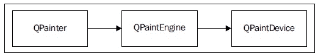
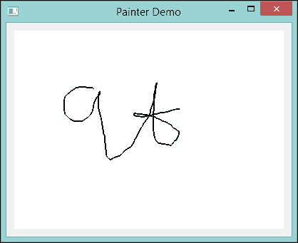
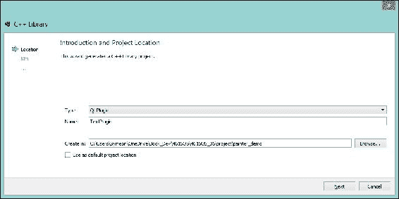
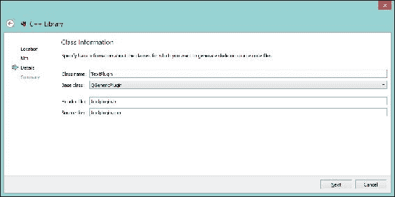
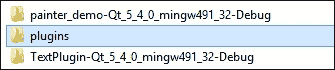
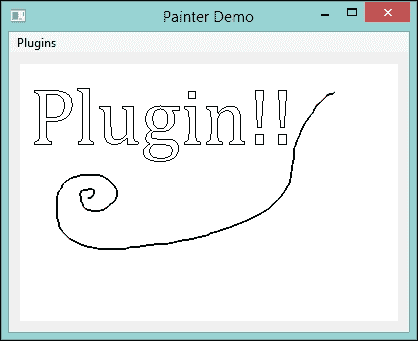
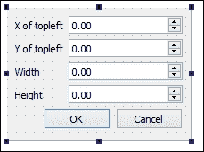
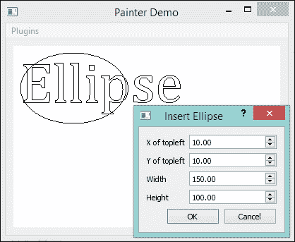
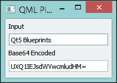

# 第五章：使用插件扩展绘图应用程序

插件使您能够使您的应用程序可扩展且对其他开发者友好。因此，在本章中，我们将指导您如何为 Qt 应用程序编写插件。一个绘图应用程序展示了 Qt/C++的配方。一个简单的演示向您展示了如何编写一个 C++插件用于 QML。本章我们将涵盖的主题如下所示：

+   通过`QPainter`绘图

+   编写静态插件

+   编写动态插件

+   合并插件和主程序项目

+   为 QML 应用程序创建 C++插件

# 通过 QPainter 绘图

在我们开始之前，让我向您介绍`QPainter`类。这个类在窗口和其他绘图设备上执行低级绘图。实际上，在 Qt 应用程序中屏幕上绘制的所有内容都是`QPainter`的结果。它可以绘制几乎任何东西，包括简单的线条和对齐文本。多亏了 Qt 提供的高级 API，使用这些丰富的功能变得极其简单。

Qt 的绘图系统由`QPainter`、`QPaintDevice`和`QPaintEngine`组成。在本章中，我们不需要处理后两者。关系图如下所示：



`QPainter`用于执行绘图操作，而`QPaintDevice`是一个可以由`QPainter`绘制的二维空间抽象。`QPaintEngine`提供了画家用于在不同类型的设备上绘图的接口。请注意，`QPaintEngine`类是`QPainter`和`QPaintDevice`内部使用的。它也被设计成对程序员隐藏，除非他们创建自己的设备类型。

因此，我们基本上需要关注的是`QPainter`。让我们创建一个新的项目并在其中做一些练习。新的`painter_demo`项目是一个 Qt 小部件应用程序。快速创建它并添加一个新的从`QWidget`继承的 C++ `Canvas`类。`Canvas`是我们自定义的小部件，其头文件如下所示：

```cpp
#ifndef CANVAS_H
#define CANVAS_H

#include <QWidget>

class Canvas : public QWidget
{
  Q_OBJECT
  public:
    explicit Canvas(QWidget *parent = 0);

  private:
    QVector<QPointF> m_points;

  protected:
    void paintEvent(QPaintEvent *);
    void mousePressEvent(QMouseEvent *);
    void mouseMoveEvent(QMouseEvent *);
    void mouseReleaseEvent(QMouseEvent *);
};

#endif // CANVAS_H
```

`QVector`类是一个模板类，它提供了一个快速且动态的数组。它之所以快速，是因为元素存储在相邻的内存位置，这意味着索引时间保持恒定。在这里，我们将`QPointF`元素存储在`m_points`中，其中`QPointF`是一个使用浮点精度定义点的类。

在`protected`作用域中，有四个事件函数。我们熟悉这些鼠标事件。最前面的是新的事件，即`paintEvent`函数。由于我们在小部件上绘图，`QPainter`应该只在使用`paintEvent`函数时使用。

`canvas.cpp`中函数的定义如下所示：

```cpp
#include <QStyleOption>
#include <QPainter>
#include <QPaintEvent>
#include <QMouseEvent>
#include "canvas.h"

Canvas::Canvas(QWidget *parent) :
  QWidget(parent)
{
}

void Canvas::paintEvent(QPaintEvent *)
{
  QPainter painter(this);

  QStyleOption opt;
  opt.initFrom(this);
  this->style()->drawPrimitive(QStyle::PE_Widget, &opt, &painter, this);

  painter.setPen(QColor(Qt::black));
  painter.setRenderHint(QPainter::Antialiasing);
  painter.drawPolyline(m_points.data(), m_points.count());
}

void Canvas::mousePressEvent(QMouseEvent *e)
{
  m_points.clear();
  m_points.append(e->localPos());
  this->update();
}

void Canvas::mouseMoveEvent(QMouseEvent *e)
{
  m_points.append(e->localPos());
  this->update();
}

void Canvas::mouseReleaseEvent(QMouseEvent *e)
{
  m_points.append(e->localPos());
  this->update();
}
```

首先，让我们检查`paintEvent`函数内部的内容。第一条是初始化一个`QPainter`对象，它使用此作为`QPaintDevice`。嗯，还有另一种初始化`QPainter`类的方法，这里将演示：

```cpp
QPainter painter;
painter.begin(this);
painter.drawPolyline(m_points.data(), m_points.count());
painter.end();
```

如果你使用前面代码中所示的方法，请记住调用`end()`函数来销毁`painter`。相比之下，如果你通过构造函数初始化`QPainter`，析构函数将自动调用`end()`函数。然而，构造函数不会返回一个指示是否成功初始化的值。因此，当处理外部`QPaintDevice`（如打印机）时，选择后者方法会更好。

初始化之后，我们使用`QStyleOption`，它包含了`QStyle`函数绘制图形元素和使我们的自定义小部件样式感知所需的所有信息。我们简单地使用`initFrom`函数来获取样式信息。然后，我们获取我们小部件的`QStyle`函数，并使用`painter`和由`opt`指定的样式选项来绘制`QStyle::PE_Widget`。如果我们不写这三行代码，我们就无法更改小部件的显示样式，例如背景颜色。

然后，我们让画家使用一支黑色笔在部件上绘制一个抗锯齿多段线。在这里，使用了重载的`setPen`函数。`painter.setPen(QColor(Qt::black))`函数将设置一个宽度为`1`的实线样式笔，颜色为黑色。`painter.setRenderHint(QPainter::Antialiasing)`函数将使绘图平滑。

### 注意

第二个参数`bool`控制渲染提示。默认值为`true`，这意味着你需要打开渲染提示。虽然你可以通过传递`false`值来关闭渲染提示。

如下所示，列出了可用的渲染提示：

```cpp
QPainter::Antialiasing
QPainter::TextAntialiasing
QPainter::SmoothPixmapTransform
QPainter::Qt4CompatiblePainting
```

此外，还有两个已废弃的提示：`QPainter::HighQualityAntialiasing`和`QPainter::NonCosmeticDefaultPen`。第一个被`QPainter::Antialiasing`所取代，而第二个现在是无用的，因为`QPen`默认是非装饰性的。

最后，`drawPolyline`函数将在`Canvas`小部件上绘制一个多段线，该多段线由鼠标移动生成。第一个参数是指向`QPointF`或`QPoint`数组的指针，而第二个参数是数组中项的数量。

说到鼠标移动，使用了三个鼠标事件函数来跟踪鼠标。实际上，它们相当直观。当鼠标按下事件发生时，清除点数组，因为很明显现在是一个新的多段线，然后通过调用`localPos()`函数添加鼠标位置。`localPos()`函数将返回鼠标相对于接收事件的部件或项的位置。虽然你可以通过`screenPos()`和`globalPos()`函数获取全局位置，但在大多数情况下，我们只需要本地位置。在这些事件函数的末尾，调用`update()`来重新绘制小部件，以显示鼠标移动路径作为多段线。

现在，在**设计**模式下编辑`mainwindow.ui`。删除状态栏，因为我们在这个章节中不会使用它，但保留菜单栏。将**Widget**拖到`centralWidget`上，并将其重命名为`canvas`。右键单击`canvas`并选择**提升到…**，然后在**提升的类名**中填写`Canvas`。现在，点击**添加**，然后点击**提升**。你不应该勾选**全局包含**框，因为`canvas.h`头文件在我们的项目目录中，而不是全局包含目录中。

在**属性**中，编辑`styleSheet`，输入`background-color: rgb(255, 255, 255);`以便画布具有白色背景。然后，将`MainWindow`类的布局更改为**水平布局**或**垂直布局**，以便`canvas`小部件可以填充整个框架。现在运行你的应用程序；你应该期望看到一个简单的白色画笔，如下所示：



这个画笔太简单，无法保留旧线条。虽然 Qt 没有提供在旧场景上绘制的 API，但`QImage`可以帮助我们摆脱这个困境。换句话说，当鼠标移动时，我们在`QImage`对象上绘制一个笔触，然后将这个`QImage`对象绘制到`Canvas`上。

新的头文件`canvas.h`如下所示：

```cpp
#ifndef CANVAS_H
#define CANVAS_H

#include <QWidget>

class Canvas : public QWidget
{
  Q_OBJECT
  public:
    explicit Canvas(QWidget *parent = 0);

  private:
    QVector<QPointF> m_points;
    QImage image;

    void updateImage();

  protected:
    void paintEvent(QPaintEvent *);
    void mousePressEvent(QMouseEvent *);
    void mouseMoveEvent(QMouseEvent *);
    void mouseReleaseEvent(QMouseEvent *);
    void resizeEvent(QResizeEvent *);
};

#endif // CANVAS_H
```

差异包括`QImage`对象的声明，`image`；私有成员函数，`updateImage()`；以及重写的函数，`resizeEvent(QResizeEvent *)`。`paintEvent(QPaintEvent *)`函数也被修改为绘制`image`对象，而在`canvas.cpp`源文件中的修改比头文件要多，其内容如下所示：

```cpp
#include <QStyleOption>
#include <QPainter>
#include <QPaintEvent>
#include <QMouseEvent>
#include <QResizeEvent>
#include "canvas.h"

Canvas::Canvas(QWidget *parent) :
  QWidget(parent)
{
}

void Canvas::paintEvent(QPaintEvent *e)
{
  QPainter painter(this);

  QStyleOption opt;
  opt.initFrom(this);
  this->style()->drawPrimitive(QStyle::PE_Widget, &opt, &painter, this);

 painter.drawImage(e->rect().topLeft(), image);
}

void Canvas::updateImage()
{
  QPainter painter(&image);
  painter.setPen(QColor(Qt::black));
  painter.setRenderHint(QPainter::Antialiasing);
  painter.drawPolyline(m_points.data(), m_points.count());
  this->update();
}

void Canvas::mousePressEvent(QMouseEvent *e)
{
  m_points.clear();
  m_points.append(e->localPos());
  updateImage();
}

void Canvas::mouseMoveEvent(QMouseEvent *e)
{
  m_points.append(e->localPos());
  updateImage();
}

void Canvas::mouseReleaseEvent(QMouseEvent *e)
{
  m_points.append(e->localPos());
  updateImage();
}

void Canvas::resizeEvent(QResizeEvent *e)
{
  QImage newImage(e->size(), QImage::Format_RGB32);
  newImage.fill(Qt::white);
  QPainter painter(&newImage);
  painter.drawImage(0, 0, image);
  image = newImage;
  QWidget::resizeEvent(e);
}
```

让我们来看看鼠标事件处理器；在`m_points`操作之后，调用的是`updateImage()`函数而不是`update()`函数。在`updateImage()`函数内部，我们使用`QImage`对象作为`QPaintDevice`来创建一个`QPainter`对象，而其余的与`paintEvent`中的相同。

尽管如此，还有一个新的成员函数，名为`resizeEvent`，它是从`QWidget`重写的。正如你所想象的那样，我们在小部件大小改变时更改了底层的`QImage`对象，这可能是由于窗口大小调整的结果。因此，我们只需将旧图像绘制到新图像上。如果新的大小小于之前的大小，这可能会导致图像的一部分丢失。你可能希望向`MainWindow`添加`Scroll Area`，并将`Canvas`作为`Scroll Area`的子小部件。你已经在 QML 中知道了如何做，而在 Qt/C++中也是类似的。因此，只需将其视为练习，并为这个应用程序实现`Scroll Area`。

# 编写静态插件

插件有两种类型：静态和动态。静态插件与可执行文件静态链接，而动态插件在运行时加载。动态插件以`.dll`或`.so`文件的形式存在，具体取决于平台。尽管静态插件将被构建为`.lib`或`.a`文件，但它们将在主程序编译时集成到可执行文件中。

在这个主题中，我们将了解如何编写一个静态插件以扩展应用程序。作为外部插件，它获得了在保持接口兼容性的同时更改其内部代码的灵活性。是否在主程序或不同的插件中维护接口取决于您。在这个例子中，我们将`interface.h`文件放在主程序`painter_demo`中。`interface.h`的内容如下：

```cpp
#ifndef INTERFACE_H
#define INTERFACE_H

#include <QtPlugin>
#include <QPainterPath>

class InsertInterface
{
  public:
    virtual ~InsertInterface() {}
    virtual QString name() const = 0;
    virtual QPainterPath getObject(QWidget *parent) = 0;
};

#define InsertInterface_iid "org.qt-project.Qt.PainterDemo.InsertInterface"
Q_DECLARE_INTERFACE(InsertInterface, InsertInterface_iid)

#endif // INTERFACE_H
```

如您所见，我们声明了一个纯虚类`InsertInterface`。为了避免错误，您必须声明一个虚析构函数。否则，编译器可能会抱怨并终止编译。`QPainterPath`类提供了一个用于常见 2D 绘图操作的容器，包括`ellipse`和`text`。因此，`getObject`的返回类型是`QPainterPath`，如果有一个新创建的对话框从用户那里获取任何输入，`QWidget`参数可以直接使用。

在此文件的末尾，我们通过`Q_DECLARE_INTERFACE`宏将`InsertInterface`声明为一个接口，其中`InsertInterface_iid`是`InsertInterface`类的标识符。请注意，标识符必须是唯一的，因此建议您使用 Java 风格的命名规则。

现在，我们需要创建一个新的项目。导航到**库** | **C++库**。然后，如以下截图所示，选择**Qt 插件**作为**类型**，并为了方便或任何顾虑，将此项目放在主程序项目文件夹内：



点击**下一步**并选择与`painter_demo`项目相同的 Qt 工具包。在这个例子中，`build`目录设置在与`painter_demo`项目相同的目录中，即`D:\Projects\build`。因此，`TextPlugin`的`build`目录为`D:\Projects\build\TextPlugin-Qt_5_4_0_mingw491_32-Debug`和`D:\Projects\build\TextPlugin-Qt_5_4_0_mingw491_32-Release`，分别对应`Debug`和`Release`。

### 注意

此外，您可以在**工具** | **选项** | **构建和运行** | **常规**中更改**默认构建目录**。在这本书中，我们使用`D:/Projects/build/%{CurrentProject:Name}-%{CurrentKit:FileSystemName}-%{CurrentBuild:Name}`，以便将所有构建组织在一个地方。

然后，在`类名`字段中填写`TextPlugin`，如下面的截图所示：



我们需要对`TextPlugin.pro`项目文件进行一些修改，如下所示：

```cpp
QT       += core gui widgets

TARGET = TextPlugin
TEMPLATE = lib
CONFIG += plugin static

DESTDIR = ../plugins

SOURCES += textplugin.cpp

INCLUDEPATH += ../

HEADERS += textplugin.h
OTHER_FILES += TextPlugin.json
```

通过添加小部件，我们可以使用一些有用的类，例如 `QMessageBox`。我们还需要将 `static` 添加到 `CONFIG` 中，以声明这是一个静态插件项目。然后，将 `DESTDIR` 变量更改为 `../plugins`，以便插件安装到 `build` 文件夹外的 `plugins` 目录。最后，我们将上级目录 `../` 添加到 `INCLUDEPATH` 中，以便我们可以在这个子项目中包含 `interface.h` 头文件。`textplugin.h` 文件如下所示：

```cpp
#ifndef TEXTPLUGIN_H
#define TEXTPLUGIN_H

#include "interface.h"

class TextPlugin : public QObject,
                   public InsertInterface
{
  Q_OBJECT
  Q_PLUGIN_METADATA(IID "org.qt-project.Qt.PainterDemo.InsertInterface" FILE "TextPlugin.json")
  Q_INTERFACES(InsertInterface)

  public:
    QString name() const;
    QPainterPath getObject(QWidget *parent);
};

#endif // TEXTPLUGIN_H
```

我们使用 `Q_PLUGIN_METADATA` 宏来指定唯一的 `IID`，它与我们在 `interface.h` 中声明的相同，其中 `FILE "TextPlugin.json"` 可以用来包含此插件的元数据。在这种情况下，我们只是保留 `TextPlugin.json` 文件不变。然后，`Q_INTERFACES` 宏告诉编译器这是一个 `InsertInterface` 的插件。在 `public` 范围内，只有两个重新实现的功能。它们的定义位于 `textplugin.cpp` 源文件中，其内容如下所示：

```cpp
#include <QInputDialog>
#include "textplugin.h"

QString TextPlugin::name() const
{
  return QString("Text");
}

QPainterPath TextPlugin::getObject(QWidget *parent)
{
  QPainterPath ppath;
  QString text = QInputDialog::getText(parent, QString("Insert Text"), QString("Text"));

  if (!text.isEmpty()) {
    ppath.addText(10, 80, QFont("Cambria", 60), text);
  }
  return ppath;
}
```

`name()` 函数简单地返回这个插件的名称，在这个例子中是 `Text`。至于 `getObject`，它构建一个包含用户通过弹出对话框提供的文本的 `QPainterPath` 类，然后将 `QPainterPath` 对象返回给主程序。`addText` 函数将文本绘制为从字体创建的一组封闭子路径，而前两个参数定义了此文本基线的左端。

插件项目就到这里。现在，只需构建它，你应该期望在 `plugins` 目录下找到一个 `libTextPlugin.a` 文件，而 `plugins` 目录本身应该位于项目 `build` 文件夹的父目录中，如图所示：



如果你将文件放在其他目录下，这并不会影响太多，尽管这意味着你可能需要相应地进行一些路径修改。

现在，让我们回到主程序的项目，在这个例子中是 `painter_demo`。编辑它的 `painter_demo.pro` 项目文件，并向其中添加以下行：

```cpp
LIBS     += -L../plugins -lTextPlugin
```

### 提示

编译过程中的工作目录是 `build` 目录，而不是项目源代码目录。

然后，在 **设计** 模式下编辑 `mainwindow.ui`；向菜单栏添加一个名为 `Plugins` 的菜单，其对象名为 `menuPlugins`。

在主程序的所有更改中，对 `MainWindow` 类的修改最多。以下是新 `mainwindow.h` 文件的代码：

```cpp
#ifndef MAINWINDOW_H
#define MAINWINDOW_H

#include <QMainWindow>

namespace Ui {
  class MainWindow;
}

class MainWindow : public QMainWindow
{
  Q_OBJECT

  public:
    explicit MainWindow(QWidget *parent = 0);
    ~MainWindow();

  private:
    Ui::MainWindow *ui;

    void loadPlugins();
    void generatePluginMenu(QObject *);

  private slots:
    void onInsertInterface();
};

#endif // MAINWINDOW_H
```

对于这个问题还是毫无头绪？嗯，它的 `mainwindow.cpp` 源文件也粘贴在这里：

```cpp
#include <QPluginLoader>
#include "mainwindow.h"
#include "ui_mainwindow.h"
#include "interface.h"

Q_IMPORT_PLUGIN(TextPlugin)

MainWindow::MainWindow(QWidget *parent) :
  QMainWindow(parent),
  ui(new Ui::MainWindow)
{
  ui->setupUi(this);
  loadPlugins();
}

MainWindow::~MainWindow()
{
  delete ui;
}

void MainWindow::loadPlugins()
{
  foreach(QObject *plugin, QPluginLoader::staticInstances()) {
    generatePluginMenu(plugin);
  }
}

void MainWindow::generatePluginMenu(QObject *plugin)
{
  InsertInterface *insertInterfacePlugin = qobject_cast<InsertInterface *>(plugin);
  if (insertInterfacePlugin) {
    QAction *action = new QAction(insertInterfacePlugin->name(), plugin);
    connect(action, &QAction::triggered, this, &MainWindow::onInsertInterface);
    ui->menuPlugins->addAction(action);
  }
}

void MainWindow::onInsertInterface()
{
  QAction *action = qobject_cast<QAction *>(sender());
  InsertInterface *insertInterfacePlugin = qobject_cast<InsertInterface *>(action->parent());
  const QPainterPath ppath = insertInterfacePlugin->getObject(this);
  if (!ppath.isEmpty()) {
    ui->canvas->insertPainterPath(ppath);
  }
}
```

你可能已经弄清楚，`Q_IMPORT_PLUGIN` 宏用于导入插件。是的，是这样的，但仅限于静态插件。在 `loadPlugins()` 函数中，我们遍历了所有静态插件实例，并通过调用 `generatePluginMenu` 函数将它们添加到菜单中。

插件最初被视为普通的`QOjbect`对象，然后您可以使用`qobject_cast`将它们转换为它们自己的类。如果`qobject_cast`类失败，它将返回一个`NULL`指针。在`if`语句中，有一个技巧可以在稍后成功使用插件。我们不是调用简化和重载的`addAction`函数，而是构造`QAction`并将其添加到菜单中，因为`QAction`将插件作为其`QObject`父对象。因此，您可以看到我们在`onInsertInterface`函数中将它的父对象转换为相关的插件类。在这个函数内部，我们调用`insertPainterPath`函数，将插件返回的`QPainterPath`类绘制到`canvas`上。当然，我们需要在`Canvas`类中声明和定义这个函数。将此语句添加到`canvas.h`文件的`public`域：

```cpp
void insertPainterPath(const QPainterPath &);
```

前面代码在`canvas.cpp`中的定义如下：

```cpp
void Canvas::insertPainterPath(const QPainterPath &ppath)
{
  QPainter painter(&image);
  painter.drawPath(ppath);
  this->update();
}
```

前面的语句应该对您来说很熟悉，它们也是自我解释的。现在，再次构建并运行此应用程序；不要忘记通过右键单击`painter_demo`项目并选择**将"painter_demo"设置为活动项目**来将当前活动项目切换回`painter_demo`。当它运行时，点击**插件**，选择**文本**，在弹出对话框中输入`Plugin!!`，然后确认。然后，您将看到文本**Plugin!!**如预期地绘制在画布上。



可执行文件的大小也会增加，因为我们将我们的`TextPlugin`项目文件静态链接到了它。此外，如果您更改了插件，您还必须重新构建主程序。否则，新生成的插件将不会像应该的那样链接到可执行文件。

# 编写动态插件

静态插件提供了一种方便的方式来分发您的应用程序。然而，这通常需要重新构建主程序。相比之下，动态插件由于它们是动态链接的，因此具有更大的灵活性。这意味着在本例中，主项目`painter_demo`不需要使用动态插件构建，也不需要发布其源代码。相反，它只需要提供一个接口及其头文件，然后在运行时扫描这些动态插件，以便它们可以被加载。

### 注意

动态插件在复杂应用程序中很常见，尤其是在像 Adobe Illustrator 这样的商业软件中。

与我们刚刚编写的静态插件类似，我们需要创建一个新的 Qt 插件项目，这次我们将其命名为`EllipsePlugin`。虽然您可以在插件中编写新的接口，但在这里我们将只关注插件相关的话题。因此，我们只是重用了`InsertInterface`类，而`ellipseplugin.pro`项目文件如下所示：

```cpp
QT       += core gui widgets

TARGET = EllipsePlugin
TEMPLATE = lib
CONFIG += plugin

DESTDIR = ../plugins

SOURCES +=  ellipseplugin.cpp \
            ellipsedialog.cpp

HEADERS +=  ellipseplugin.h \
            ellipsedialog.h
OTHER_FILES += EllipsePlugin.json

INCLUDEPATH += ../

FORMS += ellipsedialog.ui
```

尽管如此，不要忘记在`ellipseplugin.pro`文件中更改`DESTDIR`和`INCLUDEPATH`变量，它们基本上与之前的`TextPlugin`项目相同。

忽略源文件、表单等，基本上是一样的，只是去掉了 `CONFIG` 中的 `static`。以下展示了 `ellipseplugin.h` 头文件：

```cpp
#ifndef ELLIPSEPLUGIN_H
#define ELLIPSEPLUGIN_H

#include "interface.h"

class EllipsePlugin : public QObject,
                      public InsertInterface
{
  Q_OBJECT
  Q_PLUGIN_METADATA(IID "org.qt-project.Qt.PainterDemo.InsertInterface" FILE "EllipsePlugin.json")
  Q_INTERFACES(InsertInterface)

  public:
    QString name() const;
    QPainterPath getObject(QWidget *parent);

  public slots:
    void onDialogAccepted(qreal x, qreal y, qreal wid, qreal hgt);

  private:
    qreal m_x;
    qreal m_y;
    qreal width;
    qreal height;
};

#endif // ELLIPSEPLUGIN_H
```

如前述代码所示，我们声明这是一个插件，使用 `InsertInterface` 作为与 `TextPlugin` 相同的方式，而不同之处在于声明了一个 `onDialogAccepted` 插槽函数和几个 `private` 变量。因此，`ellipseplugin.cpp` 文件如下所示：

```cpp
#include "ellipsedialog.h"
#include "ellipseplugin.h"

QString EllipsePlugin::name() const
{
  return QString("Ellipse");
}

QPainterPath EllipsePlugin::getObject(QWidget *parent)
{
  m_x = 0;
  m_y = 0;
  width = 0;
  height = 0;

  EllipseDialog *dlg = new EllipseDialog(parent);
  connect(dlg, &EllipseDialog::accepted, this, &EllipsePlugin::onDialogAccepted);
  dlg->exec();

  QPainterPath ppath;
  ppath.addEllipse(m_x, m_y, width, height);
  return ppath;
}

void EllipsePlugin::onDialogAccepted(qreal x, qreal y, qreal wid, qreal hgt)
{
  m_x = x;
  m_y = y;
  width = wid;
  height = hgt;
}
```

`name()` 函数没有特别之处。相比之下，我们使用 `EllipseDialog` 自定义对话框从用户那里获取一些输入。记住在执行 `exec()` 函数之前连接与对话框相关的所有信号和槽；否则，槽将无法连接。还要注意，`exec()` 函数将阻塞事件循环，并且只有在对话框关闭后才会返回，这对于我们的目的来说非常方便，因为我们可以使用接受值，如 `m_x` 和 `m_y`，来向 `QPainterPath` 添加椭圆。

至于 `EllipseDialog` 自定义对话框本身，它是通过在 Qt Creator 中添加一个新的 Qt Designer 表单类创建的。由于它用于为用户提供指定一些参数的接口，我们在该对话框中使用了 **表单布局**。按照以下截图中的建议添加 `QLabel` 和 `QDoubleSpinBox`：



因此，它们的 `objectName` 值分别是 `tlXLabel`、`tlXDoubleSpinBox`、`tlYLabel`、`tlYDoubleSpinBox`、`widthLabel`、`widthDoubleSpinBox`、`heightLabel` 和 `heightDoubleSpinBox`。你还需要在 `QDoubleSpinBox` 的 `属性` 面板中将 `最大值` 改为 `9999.99` 或更大的数值。

此外，还要注意在 **信号与槽编辑器** 中移除了默认的信号和槽。只需删除 `buttonBox` 的 `accepted()` 信号对，因为我们需要一个更高级的处理程序。在这个表单类头文件 `ellipsedialog.h` 中，我们声明了一个新的信号和一个新的槽：

```cpp
#ifndef ELLIPSEDIALOG_H
#define ELLIPSEDIALOG_H

#include <QDialog>

namespace Ui {
  class EllipseDialog;
}

class EllipseDialog : public QDialog
{
  Q_OBJECT

  public:
    explicit EllipseDialog(QWidget *parent = 0);
    ~EllipseDialog();

  signals:
    void accepted(qreal, qreal, qreal, qreal);

  private:
    Ui::EllipseDialog *ui;

  private slots:
    void onAccepted();
};

#endif // ELLIPSEDIALOG_H
```

这里传递的 `accepted(qreal, qreal, qreal, qreal)` 信号将这些值传回插件，而 `onAccepted()` 插槽处理来自 `buttonBox` 的 `accepted()` 信号。它们在 `ellipsedialog.cpp` 源文件中定义，如下所示：

```cpp
#include "ellipsedialog.h"
#include "ui_ellipsedialog.h"

EllipseDialog::EllipseDialog(QWidget *parent) :
    QDialog(parent),
    ui(new Ui::EllipseDialog)
{
  ui->setupUi(this);

  connect(ui->buttonBox, &QDialogButtonBox::accepted, this, &EllipseDialog::onAccepted);
}

EllipseDialog::~EllipseDialog()
{
  delete ui;
}

void EllipseDialog::onAccepted()
{
  emit accepted(ui->tlXDoubleSpinBox->value(), ui->tlYDoubleSpinBox->value(), ui->widthDoubleSpinBox->value(), ui->heightDoubleSpinBox->value());
  this->accept();
}
```

在构造函数中，将 `buttonBox` 的 `accepted()` 信号连接到 `onAccepted()` 高级处理槽。在这个槽中，我们发出 `accepted` 信号，其中包含用户输入的值。然后，调用 `accept()` 函数来关闭此对话框。

到此为止，`EllipsePlugin` 已完成。在面板中单击 **构建** 按钮来构建此项目。你应该期望输出，Windows 上的 `EllipsePlugin.dll`，位于与之前的 `TextPlugin` 项目相同的 `plugins` 目录中。

要使用这个动态插件，我们需要一个最终步骤，即让主程序加载动态插件（s）。在这里我们需要更改的是`mainwindow.cpp`中的`loadPlugins()`函数：

```cpp
void MainWindow::loadPlugins()
{
  foreach(QObject *plugin, QPluginLoader::staticInstances()) {
    generatePluginMenu(plugin);
  }

  //search and load dynamic plugins
  QDir pluginDir = QDir(qApp->applicationDirPath());
  #ifdef Q_OS_WIN
  QString dirName = pluginDir.dirName();
  if (dirName.compare(QString("debug"), Qt::CaseInsensitive) == 0 || dirName.compare(QString("release"), Qt::CaseInsensitive) == 0) {
    pluginDir.cdUp();
    pluginDir.cdUp();
  }
  #endif
  pluginDir.cd(QString("plugins"));

  foreach (QString fileName, pluginDir.entryList(QDir::Files)) {
    QPluginLoader loader(pluginDir.absoluteFilePath(fileName));
    QObject *plugin = loader.instance();
    if (plugin) {
      generatePluginMenu(plugin);
    }
  }
}
```

为了使用`QDir`类，你可能还需要包含以下内容：

```cpp
#include <QDir>
```

`QDir`类将提供对目录结构和其内容的访问，我们使用它来定位我们的动态插件。`qApp`宏是一个全局指针，指向这个应用程序实例。它对于非 GUI 和 GUI 应用程序分别等同于`QCoreApplication::instance()`函数和`QApplication::instance()`。在 Windows 平台上，我们的`plugins`目录位于`build`路径的第二上级目录。

然后，我们只需测试`plugins`目录中的每个文件，加载它，如果它是一个可加载的插件，就生成适当的菜单项。再次运行此应用程序；你将在**插件**菜单中看到一个**椭圆**条目。它按预期工作。



# 合并插件和主程序项目

打开几个项目并按顺序构建它们是一件繁琐的事情。鉴于我们只有两个插件和一个主程序，这并不是什么大问题。然而，一旦插件数量增加，这将成为一个严重的效率问题。因此，将插件合并到主项目中，并在每次点击**构建**按钮时按指定顺序构建它们，是一种更好的做法。这在 Qt 项目中是完全可行的，并且很常见。

首先，我们将`painter_demo`目录中的所有文件（除了`EllipsePlugin`和`TextPlugin`文件夹）移动到一个新创建的`main`文件夹中。

然后，在`main`文件夹中，将`painter_demo.pro`重命名为`main.pro`，同时在`painter_demo`目录外创建一个新的`painter_demo.pro`项目文件。这个新的`painter_demo.pro`项目文件需要包含以下代码所示的内容：

```cpp
TEMPLATE  = subdirs
CONFIG   += ordered
SUBDIRS   = TextPlugin \
            EllipsePlugin \
            main
```

`subdirs`项目是一个特殊的模板，这意味着这个项目文件不会生成应用程序或库。相反，它告诉`qmake`构建子目录。通过将`ordered`添加到`CONFIG`中，我们可以确保编译过程按照`SUBDIRS`中的确切顺序进行。

为了完成这个任务，我们需要修改两个插件目录中的项目文件。将`INCLUDEPATH`变量更改为以下行：

```cpp
INCLUDEPATH += ../main
```

这个更改很明显，因为我们已经将所有源代码移动到了`main`目录。如果我们不更改`INCLUDEPATH`，编译器将抱怨找不到`interface.h`头文件。

# 为 QML 应用程序创建 C++插件

为 Qt/C++应用程序编写插件并不太难，而创建 QML 应用程序的插件则稍微复杂一些。思路是相同的，在这里我们将使用一个非常基本的示例来演示这个主题。基本上，这个应用程序将文本输入编码为`Base64`并显示出来。`Base64`编码部分是在 C++插件中实现的。

这次，我们将首先创建插件项目，然后完成 QML 部分。为 QML 应用程序创建插件项目遵循相同的步骤。导航到**库** | **C++库**，然后选择名为`Base64Plugin`的**Qt 插件**。其项目文件`Base64Plugin.pro`如下所示：

```cpp
QT       += core qml

TARGET = qmlbase64Plugin
TEMPLATE = lib
CONFIG += plugin

DESTDIR = ../imports/Base64

SOURCES += base64.cpp \
           base64plugin.cpp

HEADERS += base64.h \
           base64plugin.h

OTHER_FILES += \
           qmldir
```

我们将`DESTDIR`设置为`../imports/Base64`以方便起见。你可以将其更改为其他路径，但可能需要稍后进行一些相关更改才能导入此插件。

此项目由两个 C++类组成。`Base64`类将被导出到 QML 中，而`Base64Plugin`注册`Base64`类。前者的`base64.h`头文件如下所示：

```cpp
#ifndef BASE64_H
#define BASE64_H

#include <QObject>

class Base64 : public QObject
{
  Q_OBJECT

  public:
    explicit Base64(QObject *parent = 0);

  public slots:
    QString get(QString);
};

#endif // BASE64_H
```

`base.cpp`的对应部分定义了`get`函数，如下所示：

```cpp
#include "base64.h"

Base64::Base64(QObject *parent) :
  QObject(parent)
{
}

QString Base64::get(QString in)
{
  return QString::fromLocal8Bit(in.toLocal8Bit().toBase64());
}
```

复杂的部分在`Base64Plugin`类中，它与之前的插件类不完全相同。其`base64plugin.h`头文件如下所示：

```cpp
#ifndef BASE64PLUGIN_H
#define BASE64PLUGIN_H

#include <QQmlExtensionPlugin>

class Base64Plugin : public QQmlExtensionPlugin
{
  Q_OBJECT
  Q_PLUGIN_METADATA(IID "org.qt-project.Qt.QmlExtensionInterface")

  public:
    void registerTypes(const char *uri);
};

#endif // BASE64PLUGIN_H
```

通过`QQmlExtensionPlugin`子类，我们可以编写自己的 QML 插件。实际上，这个类用于声明 QML 中的`Base64`类。还请注意，由于`Q_PLUGIN_METADATA`中的`IID`是固定的，你可能不想更改它。作为一个子类，它必须重新实现`registerTypes`函数，该函数简单地注册类。详细的定义位于`baseplugin.cpp`文件中，其内容如下所示：

```cpp
#include <QtQml>
#include "base64plugin.h"
#include "base64.h"

void Base64Plugin::registerTypes(const char *uri)
{
  Q_ASSERT(uri == QLatin1String("Base64"));
  qmlRegisterType<Base64>(uri, 1, 0, "Base64");
}
```

`Q_ASSERT`宏将确保插件位于`Base64`目录内。如果不是，它将打印包含源代码、文件名和行号的警告信息。请注意，在此情况下预期的`uri`是`Base64`，它是 QML 的模块名。在这行下面，`qmlRegisterType`是一个模板函数，其中你需要将类名`Base64`放在括号内。这些参数将使用版本 1.0 将类注册为具有`Base64` QML 名称。

最后还需要一个声明可加载插件的文件，即`qmldir`文件。请注意，它没有扩展名。此文件定义了模块名和目录中的相关文件。以下是内容：

```cpp
module Base64
plugin qmlbase64Plugin
```

我们需要将此文件放在`../imports/Base64`目录中，这是`Base64Plugin`的`DESTDIR`。在 QML 应用程序项目的`main.cpp`文件中的几行代码之后，QML 就可以像导入任何其他 Qt Quick 模块一样导入插件。

现在是时候创建一个新的 Qt Quick 应用程序项目了。项目名称简单地是`QML_Plugin`，我们将`Base64Plugin`类移动到`QML_Plugin`目录中，这样 Qt Creator 就能突出显示`Base64Plugin`类。以下是`main.qml`的内容：

```cpp
import QtQuick 2.3
import QtQuick.Controls 1.2
import Base64 1.0

ApplicationWindow {
  visible: true
  width: 180
  height: 100
  title: qsTr("QML Plugin")

  Base64 {
    id: b64
  }

  Column {
    spacing: 6
    anchors {left: parent.left; right: parent.right; top: parent.top; bottom: parent.bottom; leftMargin: 6; rightMargin: 6; topMargin: 6; bottomMargin: 6}
    Label {
      text: "Input"
    }
    TextField {
      id: input
      width: parent.width
      placeholderText: "Input string here"
      onEditingFinished: bt.text = b64.get(text)
    }
    Label {
      text: "Base64 Encoded"
    }
    TextField {
      id: bt
      readOnly: true
      width: parent.width
    }
  }
}
```

记得在代码开头声明`import Base64 1.0`，以便我们的插件可以被加载。然后，`Base64`就像我们之前使用过的其他 QML 类型一样。在`input TextField`的`onEditingFinished`处理程序中，我们使用`Base64`类中的`get`函数，将`bt.text`设置为相应的`Base64`类编码字符串。

你可能会想知道如何将 QML 的`string`类型转换为`QString`对象。嗯，在 QML 和 Qt/C++之间是隐式转换的。对于常见的 QML 数据类型和 Qt 数据类，有很多这样的转换。有关详细信息，您可以查看 Qt 文档以查看完整列表。

另一件事是我们需要更改`main.cpp`，如前所述。类似于 Qt/C++的情况，我们使用`QDir`类来获取应用程序目录并将其更改为`../imports`。请注意，您应该使用`addImportPath`而不是`addPluginPath`来将`../imports`添加到 QML 引擎的模块搜索路径。这是因为我们使用`Base64`作为模块，它应该位于`imports`路径。同时，插件路径是用于导入模块的本地插件，这些插件在`qmldir`中声明。`main.cpp`文件的内容如下：

```cpp
#include <QApplication>
#include <QDir>
#include <QQmlApplicationEngine>

int main(int argc, char *argv[])
{
  QApplication app(argc, argv);

  QQmlApplicationEngine engine;
  QDir pluginDir = app.applicationDirPath();
  pluginDir.cdUp();
  pluginDir.cdUp();
  pluginDir.cd("imports");
  engine.addImportPath(pluginDir.absolutePath());
  engine.load(QUrl(QStringLiteral("qrc:/main.qml")));

  return app.exec();
}
```

为了运行此应用程序，请执行以下步骤：

1.  构建`Base64Plugin`。

1.  将`qmldir`文件复制到`../imports/Base64`目录（`imports`文件夹应位于与`plugins`相同的目录中）。

1.  构建并运行`QML_Plugin`项目。

您可以通过在第一个输入字段中输入任何字符串并仅按*Enter*键来测试此应用程序。此应用程序的一个场景是将您的电子邮件地址编码以避免网络爬虫，如下所示：



如果模块没有正确放置，应用程序将不会显示，并且会抱怨`Base64`未安装。如果发生这种情况，请确保在`main.cpp`中添加正确的路径，并且在`Base64`文件夹内有一个`qmldir`文件。

# 摘要

开始编写插件有些困难。然而，经过一些基本实践后，你会发现它实际上比看起来容易。对于 Qt Widgets 应用程序，插件以灵活的方式扩展应用程序。同时，它们使开发者能够为 QML 应用程序设计新的形式。我们还介绍了使用`subdirs`项目来管理多个子项目。即使您不打算编写插件，本章也涵盖了对于 GUI 应用程序开发至关重要的绘画相关内容，包括`QPainter`、`paintEvent`和`resizeEvent`。

在下一章中，我们将讨论 Qt 中的网络编程和多线程。
