# 第十章. 遇到这些问题时不要慌张

在应用程序开发过程中，你可能会遇到一些问题。Qt 总是令人惊叹，因为 Qt Creator 有一个出色的 **调试** 模式，这可以在调试时节省你的时间。你将学习如何调试 Qt/C++ 或 Qt Quick/QML 应用程序。本章将涵盖以下主题：

+   常见问题

+   调试 Qt 应用程序

+   调试 Qt Quick 应用程序

+   有用资源

# 常见问题

错误，或者更恰当地说，意外结果，在应用程序开发过程中肯定是不可避免的。此外，还可能有编译器错误，甚至应用程序崩溃。当你遇到这类问题时，请不要慌张。为了减轻你的痛苦并帮助你定位问题，我们已经收集了一些常见的、可复现的意外结果，并将它们分类，如下节所示。

## C++ 语法错误

对于编程初学者，或者不熟悉 C 和 C++ 的开发者来说，C++ 的语法并不容易记住。如果出现任何语法错误，编译器将会因为错误信息而终止。实际上，编辑器会在有问题的语句下方显示波浪线，如下所示：

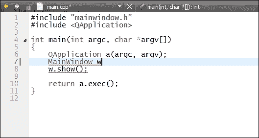

在所有 C++ 语法错误中，最常见的一个是缺少分号 (;)。C++ 需要分号来标记语句的结束。因此，第 7 行和第 8 行等同于以下行：

```cpp
    MainWindow w w.show();
```

在 C++ 中，这显然是写错了。不仅编辑器会突出显示错误，编译器也会给你一个详尽的错误信息。在这种情况下，它将显示以下信息：

`C:\Users\Symeon\OneDrive\Book_Dev\4615OS\4615OS_07\project\Weather_Demo\main.cpp:8: 错误: C2146: 语法错误 : 在标识符 'w' 前缺少 ';'`

如你所见，编译器不会告诉你应该在第 7 行末尾添加分号。相反，它在第 8 行的 `w` 标识符之前读取 `missing;`。无论如何，在大多数情况下，C++ 语法错误可以被编译器检测到，而其中大多数首先会被编辑器检测到。多亏了 Qt Creator 的突出显示功能，这些类型的错误应该能够有效地避免。

建议养成一个好习惯，在按下 *Enter* 键之前添加分号。这是因为在某些情况下，语法可能对编译器和 Qt Creator 来说看起来是正确的，但它肯定是不正确的编码，并可能导致意外的行为。

## 指针和内存

任何熟悉 C 及其野指针的人都知道，在内存管理方面出错是多么容易。正如我们之前提到的，Qt 有一个优越的内存管理机制，一旦父对象被删除，它将释放其子对象。不幸的是，如果开发者明确使用 `delete` 来释放子对象，这可能会导致崩溃。

这背后的主要原因是 `delete` 不是一个线程安全的操作。它可能会导致双重删除，从而引发段错误。因此，为了以线程安全的方式释放内存，我们使用在 `QObject` 类中定义的 `deleteLater()` 函数，这意味着这个方法对所有继承自 `QObject` 的类都是可用的。正如文档中所述，`deleteLater()` 将安排对象进行删除，但删除不会立即发生。

### 注意

调用 `deleteLater()` 多次是完全安全的。一旦第一次延迟删除完成，任何挂起的删除都将从事件队列中移除。不会发生双重删除。

Qt 中还有一个处理内存管理的类，`QObjectCleanupHandler`。这个类监视多个 QObjects 的生命周期。你可以将其视为一个简单的 Qt 垃圾收集器。例如，有很多 `QTcpSocket` 对象需要被监视和正确删除。这类情况并不少见，尤其是在网络程序中。一个简单的技巧是将所有这些对象添加到 `QObjectCleanupHandler` 中。以下代码片段是一个简单的演示，它将 `QObject` 添加到 `QObjectCleanupHandler ch`：

```cpp
QTcpSocket *t = new QTcpSocket(this);
QObjectCleanupHandler ch;
ch.add(t);
```

将 `t` 对象添加到 `ch` 中不会改变 `t` 的父对象从 `this` 到 `&ch`。`QObjectCleanupHandler` 在这方面更像是 `QList`。如果 `t` 在其他地方被删除，它将自动从 `ch` 的列表中移除。如果没有对象剩下，`isEmpty()` 函数将返回 `true`。当 `QObjectCleanupHandler` 被销毁时，其中所有的对象都将被删除。你也可以显式调用 `clear()` 来手动删除 `QObjectCleanupHandler` 中的所有对象。

## 不兼容的共享库

这种类型的错误被称为 DLL 地狱，我们在上一章中讨论过。它是由不兼容的共享库引起的，可能会导致奇怪的行为或崩溃。

在大多数情况下，Qt 库是向后兼容的，这意味着你可以用新的 DLL 替换所有的 DLL，而不需要重新编译可执行文件。某些特定的模块或 API 可能已经被弃用，并将在 Qt 的后续版本中删除。例如，`QGLWidget` 类在 Qt 5.4 中被新引入的 `QOpenGLWidget` 类所取代。尽管如此，`QGLWidget` 目前仍然提供。

在相反的方向上，事情变得相当糟糕。如果你的应用程序调用了一个自 Qt 5.4 以来引入的 API，那么应用程序在较老的 Qt 版本（如 Qt 5.2）中肯定会出现故障。

以下是一个简单的程序，它使用了在 Qt 5.4 中引入的 `QSysInfo`。这个简单 `incompat_demo` 项目的 `main.cpp` 文件如下所示：

```cpp
#include <QDebug>
#include <QSysInfo>
#include <QCoreApplication>

int main(int argc, char *argv[])
{
    QCoreApplication a(argc, argv);

    qDebug() << "CPU:" << QSysInfo::currentCpuArchitecture();

    return a.exec();
}
```

`QSysInfo::currentCpuArchitecture()` 返回应用程序正在运行的 CPU 架构，作为一个 `QString` 对象。如果 Qt 的版本足够高（大于或等于 5.4），它将按预期运行，如下面的截图所示：

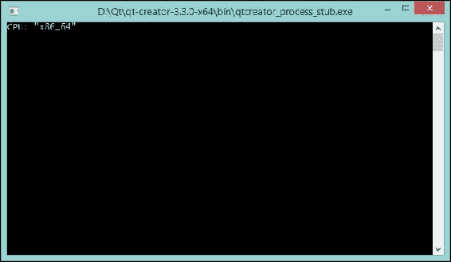

如你所见，它说我们在一个 64 位 x86 CPU 机器上运行此应用程序。然而，如果我们使用 Qt 5.2 的 DLL 编译的可执行文件，它将显示错误，如这里所示，并崩溃：

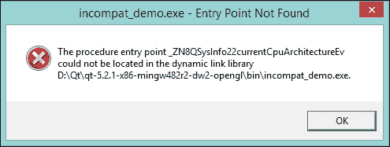

这种情况当然很少见。然而，如果发生这种情况，你会对出了什么问题有一个大概的了解。从错误对话框中，我们可以看到错误是因为动态链接库中缺少 `QSysInfo::currentCpuArchitecture` 行。

另一个 DLL 地狱更为复杂，可能被初学者忽略。所有库都必须由相同的编译器构建。你不能使用 MSVC 库与 GCC 一起，这对其他编译器也适用，例如 ICC 和 Clang。不同的编译器版本也可能导致不兼容。你可能不希望在 GCC 版本为 4.9 的开发环境中使用由 GCC 4.3 编译的库。然而，由 GCC 4.9.1 编译的库应该与由 GCC 4.9.2 编译的库兼容。

除了编译器之外，不同的架构通常是不兼容的。例如，64 位库在 32 位平台上无法工作。同样，x86 库和可执行文件不能用于非 x86 设备，如 ARM 和 MIPS。

## 在 Android 上无法运行！

Qt 最近才移植到 Android。因此，它在桌面 PC 上运行良好，但在 Android 上可能不行。一方面，Android 硬件各不相同，更不用说成千上万的定制 ROM 了。因此，一些 Android 设备可能遇到兼容性问题是有道理的。另一方面，在 Android 上运行的 Qt 应用程序是一个带有 Java 包装器的本地 C++ 应用程序，而二进制可执行文件自然更容易遇到兼容性问题，比脚本更敏感。

总之，这里有一个步骤：

1.  尝试在另一部 Android 手机或虚拟 Android 设备上运行你的应用程序。

1.  如果仍然不起作用，它可能是 Qt 在 Android 上的潜在错误。我们将在本章末尾讨论如何向 Qt 报告错误。

# 调试 Qt 应用程序

要调试任何 Qt 应用程序，你需要确保你已经安装了 Qt 库的调试符号。在 Windows 上，它们与发布版本的 DLL 一起安装。同时，在 Linux 上，你可能需要通过发行版的包管理器安装调试符号。

一些开发者倾向于使用类似于 `printf` 的函数来调试应用程序。Qt 提供了四个全局函数，如下表所示，用于打印调试、警告和错误文本：

| 函数 | 用途 |
| --- | --- |
| `qDebug()` | 此函数用于写入自定义调试输出。 |
| `qWarning()` | 此函数用于报告警告和可恢复的错误。 |
| `qCritical()` | 此函数用于写入关键错误消息和报告系统错误。 |
| `qFatal()` | 此函数用于在退出前打印致命错误消息。 |

通常，您可以使用类似于`printf`的 C 风格方法。

```cpp
qDebug("Hello %s", "World!");
```

然而，在大多数情况下，我们会包含`<QtDebug>`头文件，这样我们就可以使用流操作符（`<<`）作为更方便的方式。

```cpp
qDebug() << "Hello World!"
```

这些函数最强大的地方在于它们可以输出某些复杂类、`QList`和`QMap`的内容。需要注意的是，这些复杂的数据类型只能通过流操作符（`<<`）打印。

`qDebug()`和`qWarning()`都是调试工具，这意味着它们可以通过定义`QT_NO_DEBUG_OUTPUT`和`QT_NO_WARNING_OUTPUT`分别在编译时禁用。

除了这些功能外，Qt 还提供了`QObject::dumpObjectTree()`和`QObject::dumpObjectInfo()`函数，这些函数通常很有用，尤其是在应用程序看起来异常时。`QObject::dumpObjectTree()`会输出信号连接的信息，如果您认为信号槽连接可能存在问题，这会非常有用。同时，后者会将子节点以树状结构输出到调试输出。别忘了以**调试**模式构建应用程序，否则它们都不会打印任何内容。

除了这些有用的调试功能外，Qt Creator 还提供了一种直观的方式来调试您的应用程序。如果您使用的是 MSVC 编译器，请确保已安装 Microsoft **控制台调试器**（**CDB**）。在其他情况下，GDB 调试器包含在 MinGW 版本中。

### 注意

CDB 现在是**Windows 驱动程序工具包**（**WDK**）的一部分；请访问[`msdn.microsoft.com/en-us/windows/hardware/hh852365`](http://msdn.microsoft.com/en-us/windows/hardware/hh852365)下载它。别忘了在安装过程中检查调试工具包。

以第二章中的`Fancy_Clock`为例，*构建一个漂亮的跨平台时钟*。在`MainWindow::setColour()`函数中，将光标移至第 97 行，即`switch (i) {`。然后，导航到**调试** | **切换断点**，或者直接按键盘上的*F9*。这将在第 97 行添加一个断点，并添加一个断点标记（行号前的红色暂停图标），如图所示：

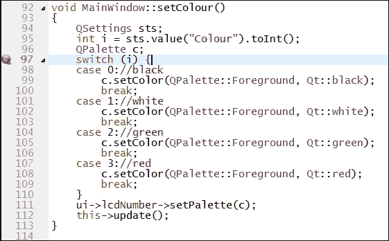

现在点击面板上的**开始调试**按钮，它上面有一个错误，或者导航到菜单栏上的**调试** | **开始调试** | **开始调试**，或者按键盘上的*F5*。这将根据需要重新编译应用程序，并以**调试**模式启动。同时，Qt Creator 将自动切换到**调试**模式。

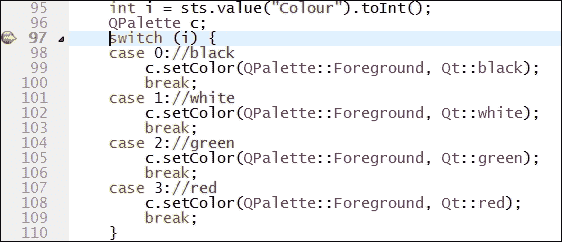

应用程序中断是因为我们设置的断点。您可以看到一个黄色箭头指示应用程序当前所在的行，如前一张截图所示。默认情况下，在右侧面板中，您可以查看**局部变量和表达式**，其中显示了所有局部变量及其值和类型。要更改默认设置，请转到**窗口** | **视图**，然后选择要显示或隐藏的内容。

在此截图中的**调试**模式面板以蓝色文字标记：

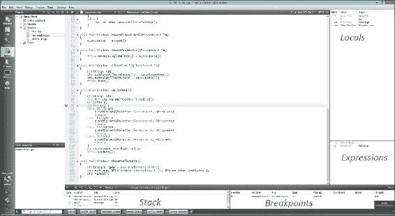

简而言之，您可以在**局部变量**中监控变量，在**表达式**中监控表达式。**堆栈**显示当前堆栈，所有断点都可以在**断点**面板中管理。

在底部面板中，有一系列按钮用于控制调试过程。前六个按钮分别是**继续**、**停止调试器**、**单步执行**、**进入**、**退出**和**重启调试会话**。**单步执行**是将一行代码作为一个整体执行。**进入**将进入一个函数或子函数，而**退出**可以离开当前函数或子函数。

**断点**在调试中起着至关重要的作用，因为它可以告诉您断点代表的是代码中的位置或一组位置，这些位置会中断应用程序的调试并赋予您控制权。一旦中断，您可以检查程序的状态或继续执行，无论是逐行还是连续执行。Qt Creator 在**断点**视图中显示断点，默认情况下位于右下角。您可以在**断点**视图中添加或删除断点。要添加断点，右键单击**断点**视图并选择**添加断点…**；将出现一个**添加断点**对话框，如下所示：

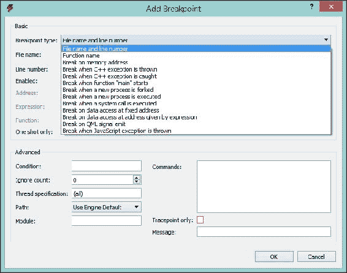

在**断点类型**字段中，选择程序代码中您希望应用程序中断的位置。其他选项取决于所选类型。

要移动断点，只需拖动断点标记并将其放置在目标位置。尽管这不是一个经常需要的功能。

删除断点有许多方法。

+   通过在编辑器中单击断点标记，将光标移动到相应的行，然后转到**调试** | **切换断点**，或按*F9*

+   通过在**断点**视图中右键单击断点并选择**删除断点**

+   通过在**断点**视图中选择断点并按下键盘上的*删除*按钮

最强大的地方是之前介绍的**局部变量和表达式**视图。每次程序在调试器的控制下停止时，它都会检索信息并在**局部变量和表达式**视图中显示。**局部**窗格显示函数参数和局部变量。Qt 基本对象的数据有全面的显示。在这种情况下，当程序在`MainWindow::setColour()`中断时，有一个其**值**为`"MainWindow"`的指针。除了这个指针的内存地址之外，它还可以显示属于此对象的所有数据和子项：

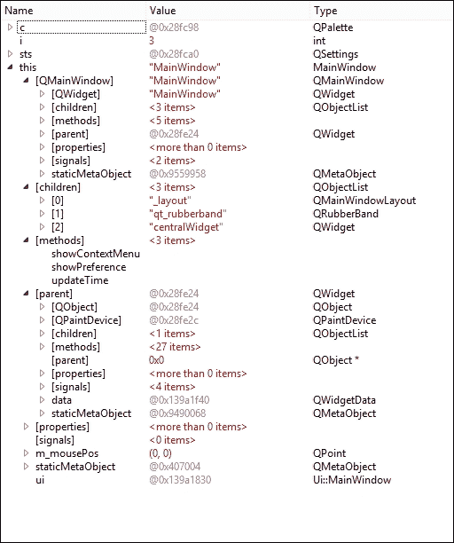

如前一个截图所示，这是一个`MainWindow`实例，它继承自`QMainWindow`。它有三个子项：`_layout`、`qt_rubberband`和`centralWidget`。请注意，在`[方法]`中只显示槽函数。现在你将理解为什么**局部**窗格是**调试**模式中最重要且最常用的视图。

另一方面，**表达式**窗格功能更强大，可以计算算术表达式或函数调用的值。在**局部变量和表达式**视图中右键单击，并在上下文菜单中选择**添加新表达式计算器…**。

注意，上下文菜单条目仅在程序中断时可用。在这种情况下，`Fancy_Clock`在`MainWindow::setColour()`函数中被中断，其中局部变量`i`可以用来执行一些算术运算。例如，我们在**新评估表达式**弹出对话框中填写`i * 5`。

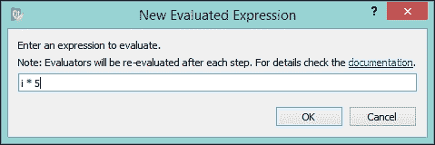

除了算术运算之外，你可以调用一个函数来评估返回值。然而，这个函数必须对调试器是可访问的，这意味着它要么被编译到可执行文件中，要么可以从库中调用。

表达式的值将在每次步骤后重新评估。点击**确定**按钮后，表达式`i * 5`将如所示在**表达式**窗格中显示：

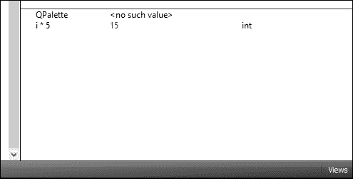

现在`i`的值是`3`。因此，表达式`i * 5`被评估为`15`。

> *"表达式计算器功能强大，但会显著减慢调试器的操作速度。建议不要过度使用，并尽快移除不必要的表达式计算器。"*

即使表达式中的函数有副作用，它们也将在当前帧更改时被调用。毕竟，表达式计算器功能强大，但会影响调试速度。

# 调试 Qt Quick 应用程序

我们将使用来自第七章，*解析 JSON 和 XML 文档以使用在线 API*的`Weather_QML`项目作为演示程序，展示如何调试 Qt Quick 应用程序。

首先，我们需要确保已启用 QML 调试。在 Qt Creator 中打开`Weather_QML`项目。然后，执行以下步骤：

1.  切换到**项目**模式。

1.  在**构建步骤**中扩展**qmake**步骤。

1.  如果未勾选，请勾选**启用 QML 调试**。

    ### 小贴士

    调试 QML 将在一个知名端口上打开一个套接字，这会带来安全风险。您的网络上的任何人都可以连接到调试应用程序并执行任何 JavaScript 函数。因此，您必须确保有适当的防火墙规则。

启动 QML 调试使用相同的步骤，即导航到**调试** | **开始调试** | **开始调试**，或点击**调试**按钮，或直接按*F5*。它可能会触发**Windows 安全警报**，如下面的截图所示。别忘了点击**允许访问**按钮。

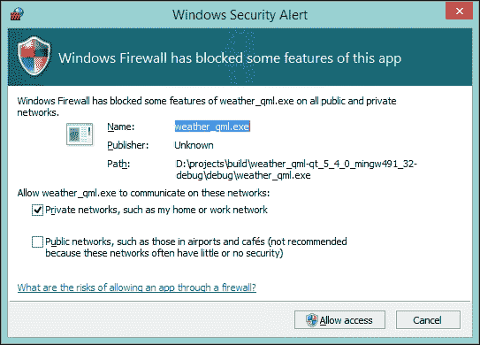

一旦应用程序开始运行，它将像往常一样运行和表现。然而，在调试模式下，您可以执行一些有用的任务。您可以在**局部变量**面板中看到所有元素及其属性，就像我们对 Qt/C++应用程序所做的那样。

除了观察这些变量之外，您还可以临时更改它们，并在运行时立即看到更改。要更改值，您可以直接在**局部变量**面板中更改它，或者在**QML/JS 控制台**中更改它。

例如，要更改`ApplicationWindow`的`title`属性，请执行以下步骤：

1.  在**局部变量**面板中展开**ApplicationWindow** | **属性**。

1.  双击`title`条目。

1.  将值从`Weather QML`更改为`Yahoo! Weather`。

1.  按键盘上的*Enter*或*Return*键确认。

或者，您也可以在**QML/JS 控制台**中更改它。无需展开`ApplicationWindow`；只需在**局部变量**面板中点击`ApplicationWindow`。您会注意到**QML/JS 控制台**面板上的**上下文**将变为`ApplicationWindow`，如下面的截图所示。然后，只需输入`title="Yahoo! Weather"`命令来更改标题。

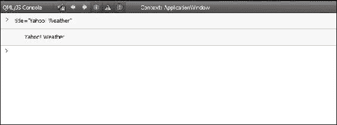

您会注意到应用程序窗口中的标题立即更改为**Yahoo! Weather**，如下所示：


同时，源代码保持不变。当您想测试属性的更好值时，这个功能特别方便。您不必在代码中更改并重新运行，可以直接更改并测试。实际上，您还可以在**QML/JS 控制台**中执行 JavaScript 表达式，而不仅仅是更改它们的值。

# 有用资源

仍然遇到问题？除了在线搜索引擎外，还有两个在线论坛可能对您也很有用。第一个是 Qt 项目论坛，其网址为 [`qt-project.org/forums`](http://qt-project.org/forums)。另一个是由社区网站 Qt Centre 维护的，其网址为 [`www.qtcentre.org/forum.php`](http://www.qtcentre.org/forum.php)。

在大多数情况下，您应该能够在这些网站上找到类似或甚至完全相同的问题。如果没有，您可以发起新的主题寻求帮助。尽可能详细地描述问题，以便其他用户可以了解出了什么问题。

有可能您已经正确地做了所有事情，但仍然可能得到意外的结果、编译错误或崩溃。在这种情况下，这可能是 Qt 错误。如果您认为您遇到了 Qt 错误，您被鼓励报告它。由于 Qt 有错误跟踪器，因此报告错误很容易，其网址为 [`bugreports.qt.io`](https://bugreports.qt.io)。

### 小贴士

错误报告的质量将直接影响错误被修复的速度。

要生成高质量的错误报告，以下是一个简单的分步指南：

1.  访问 Qt 错误跟踪器网站。

1.  登录。如果是第一次，您需要创建一个新账户。请记住提供有效的电子邮件地址，因为这是 Qt 开发人员与您联系的唯一方式。

1.  使用右上角的**搜索**字段查找任何类似或甚至完全相同的错误。

1.  如果您发现了错误，您可以在评论中留下任何额外的信息。此外，您还可以点击**投票**为该错误投票。最后，如果您想跟踪进度，可以添加自己作为观察者。

1.  如果没有，请点击**创建新问题**并填写字段。

您应该在**摘要**中输入简短的描述性文本。这不仅增加了修复错误的机会，而且对其他正在搜索现有错误的人也有帮助。对于其他字段，您总是被鼓励提供尽可能多的信息。

# 摘要

在阅读完本章后，您可以自己解决大多数基于 Qt 的问题。我们首先介绍了一些常见问题，然后是如何调试 Qt 和 Qt Quick 应用程序。最后，提供了一些有用的链接，以帮助您解决各种问题和错误。如果您遇到特定 Qt 错误的问题，不要慌张，只需去错误跟踪器报告即可。
