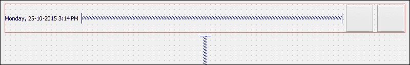
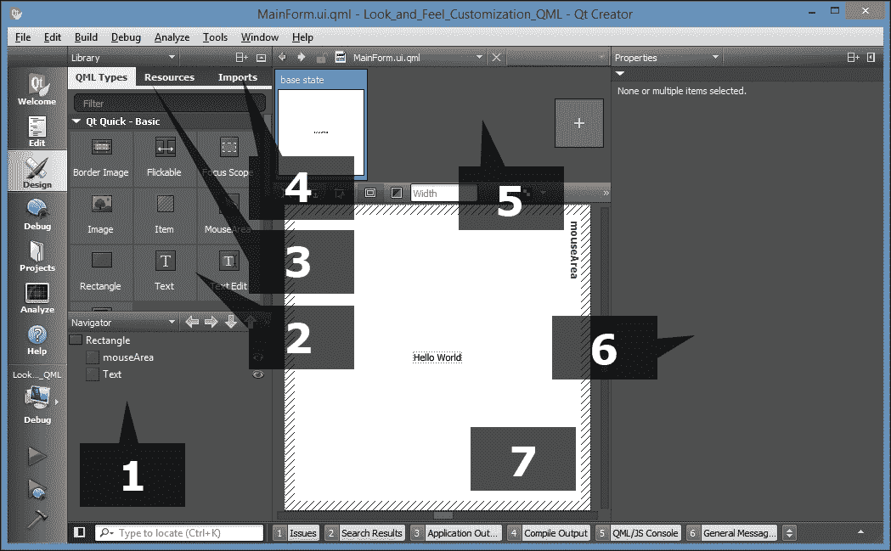

# 第一章 外观和感觉定制

在本章中，我们将涵盖以下内容：

+   在 Qt Designer 中使用样式表

+   基本样式表定制

+   使用样式表创建登录界面

+   在样式表中使用资源

+   自定义属性和子控件

+   QML 中的样式

+   将 QML 对象指针暴露给 C++

# 介绍

Qt 允许我们通过大多数人熟悉的方法轻松设计程序的用户界面。Qt 不仅为我们提供了一个强大的用户界面工具包 Qt Designer，使我们能够在不写一行代码的情况下设计用户界面，而且还允许高级用户通过一种简单的脚本语言 Qt 样式表来自定义他们的用户界面组件。

# 在 Qt Designer 中使用样式表

在这个例子中，我们将学习如何通过使用样式表和资源来改变程序的外观和感觉，使其看起来更专业。Qt 允许你使用一种名为 Qt 样式表的样式表语言来装饰你的**图形用户界面**（**GUI**），这与网页设计师使用的**层叠样式表**（**CSS**）非常相似，用于装饰他们的网站。

## 如何做…

1.  我们需要做的第一件事是打开 Qt Creator 并创建一个新项目。如果这是你第一次使用 Qt Creator，你可以点击上面写着**New Project**和一个**+**号的大按钮，或者简单地转到**File** | **New File or New Project**。

1.  然后，在**项目**窗口下选择**Application**，并选择**Qt Widgets Application**。

1.  之后，点击底部的**Choose**按钮。然后会弹出一个窗口，要求你输入项目名称和位置。

1.  完成后，点击**Next**几次，然后点击**Finish**按钮创建项目。现在我们将坚持使用所有默认设置。项目创建完成后，你会看到窗口左侧有一个名为**Mode Selector**的面板，上面有很多大图标；我们稍后将在*How it works...*部分详细讨论这一点。

1.  然后，你还会看到所有源文件都列在位于**Mode Selector**面板旁边的**Side Bar**面板上。这是你可以选择要编辑的文件的地方，在这种情况下是`mainwindow.ui`，因为我们即将开始设计程序的 UI！

1.  双击 `mainwindow.ui`，你会看到一个完全不同的界面突然出现。Qt Creator 实际上帮助你从脚本编辑器切换到 UI 编辑器（Qt Designer），因为它检测到你要打开的文件具有`.ui`扩展名。

1.  你还会注意到**Mode Selector**面板上高亮显示的按钮已经从**Edit**按钮变成了**Design**按钮。你可以通过点击**Mode Selector**面板上半部分的按钮之一，切换回脚本编辑器或切换到其他工具。

1.  让我们回到 Qt Designer，看看`mainwindow.ui`文件。这基本上是我们程序的主窗口（如文件名所示），默认情况下是空的，没有任何小部件。你可以尝试通过点击**Mode Selector**面板底部的**Run**按钮（绿色箭头按钮）来编译和运行程序，一旦编译完成，你会看到一个空窗口弹出来：

1.  现在，让我们通过单击小部件框中的`Push Button`项目（在**按钮**类别下）并将其拖动到表单编辑器中的主窗口，向我们的程序 UI 添加一个按钮。然后，保持按钮选定状态，现在您将在窗口右侧的属性编辑器中看到此按钮的所有属性。向下滚动到中间左右某处，查找名为**styleSheet**的属性。这是您向小部件应用样式的地方，这些样式可能会根据您设置样式表的方式递归地继承到其子代或孙代。或者，您还可以右键单击表单编辑器中的任何小部件，并从弹出菜单中选择**更改样式表**。

1.  您可以单击**styleSheet**属性的输入字段，直接编写样式表代码，或单击输入字段旁边的**...**按钮，打开**编辑样式表**窗口，该窗口具有更大的空间，用于编写更长的样式表代码。在窗口顶部，您可以找到几个按钮，例如**添加资源**、**添加渐变**、**添加颜色**和**添加字体**，这些按钮可以帮助您启动编码，如果您记不住属性的名称。

让我们尝试使用**编辑样式表**窗口进行一些简单的样式设置。

1.  单击**添加颜色**并选择颜色。

1.  从颜色选择器窗口中选择一个随机颜色，比如纯红色。然后单击**确定**。

1.  现在，您将看到一行代码已添加到**编辑样式表**窗口上的文本字段中，例如：

`color: rgb(255, 0, 0);`

1.  单击**确定**按钮，现在您将看到按钮上的文本已更改为红色。

## 它是如何工作的...

在开始学习如何设计自己的 UI 之前，让我们花点时间熟悉 Qt Designer 的界面：


1.  **菜单栏：**菜单栏包含特定于应用程序的菜单，可轻松访问诸如创建新项目、保存文件、撤消、重做、复制、粘贴等基本功能。它还允许您访问随 Qt Creator 一起提供的开发工具，例如编译器、调试器、分析器等。

1.  **小部件框：**这是您可以找到 Qt Designer 提供的所有不同类型的小部件的地方。您可以通过单击小部件框中的一个小部件并将其拖动到表单编辑器中，向程序 UI 添加一个小部件。

1.  **模式选择器：**模式选择器是一个侧面面板，其中放置了用于轻松访问不同工具的快捷按钮。您可以通过单击模式选择器面板上的**编辑**或**设计**按钮快速在脚本编辑器和表单编辑器之间切换，这对于多任务处理非常有用。您还可以以相同的速度和方式轻松导航到调试器和分析器工具。

1.  **构建快捷键：**构建快捷键位于模式选择器面板的底部。您可以通过按快捷按钮轻松构建、运行和调试项目。

1.  **表单编辑器：**表单编辑器是您编辑程序 UI 的地方。您可以从小部件框中选择一个小部件，并将其拖动到表单编辑器中，从而向程序添加不同的小部件。

1.  **表单工具栏：**从这里，您可以快速选择要编辑的不同表单，单击位于小部件框上方的下拉框，并选择要在 Qt Designer 中打开的文件。在下拉框旁边是用于在表单编辑器的不同模式之间切换的按钮，还有用于更改 UI 布局的按钮。

1.  **对象检视器：**对象检视器列出了当前`.ui`文件中的所有小部件。所有小部件按照它们在层次结构中的父子关系进行排列。您可以从对象检视器中选择一个小部件，以在属性编辑器中显示其属性。

1.  **属性编辑器：**属性编辑器将显示您从对象检视器窗口或表单编辑器窗口中选择的小部件的所有属性。

1.  **操作编辑器和信号与槽编辑器：** 此窗口包含两个编辑器，**操作编辑器**和**信号与槽编辑器**，可以从窗口下方的选项卡中访问。操作编辑器是您创建可以添加到程序 UI 的菜单栏或工具栏中的操作的地方。

1.  **输出窗格：** 输出窗格由几个不同的窗口组成，显示与脚本编译和调试相关的信息和输出消息。您可以通过按带有数字的按钮（例如**1**-**Issues**，**2**-**Search Results**，**3**-**Application Output**等）来在不同的输出窗格之间切换。

## 还有更多...

在前一节中，我们讨论了如何通过 C++编码将样式表应用到 Qt 小部件。虽然这种方法非常有效，但大多数时候负责设计程序 UI 的人不是程序员，而是专门设计用户友好 UI 的 UI 设计师。在这种情况下，最好让 UI 设计师使用不同的工具设计程序的布局和样式表，而不要在代码中乱搞。

Qt 提供了一个名为 Qt Creator 的多合一编辑器。Qt Creator 包括几种不同的工具，如脚本编辑器、编译器、调试器、分析器和 UI 编辑器。UI 编辑器，也称为 Qt Designer，是设计师设计其程序 UI 而无需编写任何代码的完美工具。这是因为 Qt Designer 采用了所见即所得的方法，通过提供最终结果的准确视觉表示，意味着您在 Qt Designer 中设计的任何内容在编译和运行程序时都会完全相同。

Qt 样式表和 CSS 之间的相似之处如下：

+   **CSS**：`h1 { color: red; background-color: white;}`

+   **Qt 样式表**：`QLineEdit { color: red; background-color: white;}`

+   如您所见，它们都包含选择器和声明块。每个声明包含一个属性和一个值，由冒号分隔。

+   在 Qt 中，可以通过在 C++代码中调用`QObject::setStyleSheet()`函数将样式表应用于单个小部件，例如：

```cpp
myPushButton->setStyleSheet("color : blue");
```

+   上述代码将将变量名为`myPushButton`的按钮的文本颜色更改为`蓝色`。您也可以通过在 Qt Designer 的样式表属性字段中编写声明来实现相同的结果。我们将在下一节中更多地讨论 Qt Designer。

+   Qt 样式表还支持 CSS2 标准中定义的所有不同类型的选择器，包括通用选择器、类型选择器、类选择器、ID 选择器等，这使我们能够将样式应用于非常具体的单个或一组小部件。例如，如果我们想要更改具有对象名称`usernameEdit`的特定行编辑小部件的背景颜色，我们可以使用 ID 选择器来引用它：

```cpp
QLineEdit#usernameEdit { background-color: blue }
```

### 注意

要了解 CSS2 中所有选择器的详细信息（这些选择器也被 Qt 样式表支持），请参考此文档：[`www.w3.org/TR/REC-CSS2/selector.html`](http://www.w3.org/TR/REC-CSS2/selector.html)。

# 基本样式表定制

在前面的示例中，您学会了如何在 Qt Designer 中将样式表应用于小部件。让我们疯狂一下，进一步推动事情，创建一些其他类型的小部件，并将它们的样式属性更改为一些奇怪的东西以便学习。但是这一次，我们不会逐个将样式应用于每个小部件，而是学会将样式表应用于主窗口，并让它在整个层次结构中继承到所有其他小部件，以便更容易地管理和维护样式表。

## 如何做...

1.  首先，让我们通过选择它并单击`styleSheet`属性旁边的小箭头按钮来从按钮中删除样式表。这个按钮将将属性恢复到默认值，在这种情况下是空的样式表。

1.  然后，通过将它们一个接一个地从小部件框拖动到表单编辑器中，向 UI 添加几个小部件。我添加了一个行编辑、组合框、水平滑块、单选按钮和复选框。

1.  为了简单起见，通过从对象检查器中选择它们，右键单击并选择**删除**，从您的 UI 中删除菜单栏、主工具栏和状态栏。现在您的 UI 应该看起来类似于这样：

1.  从表单编辑器或对象检查器中选择主窗口，然后右键单击并选择**更改样式表**以打开**编辑样式表**。

插入以下样式表：

```cpp
border: 2px solid gray;
border-radius: 10px;
padding: 0 8px;
background: yellow;
```

1.  现在您将看到一个完全奇异的 UI，所有内容都被涂成黄色，带有厚厚的边框。这是因为前面的样式表没有选择器，这意味着样式将应用于主窗口的所有子小部件，一直到层次结构的底部。为了改变这一点，让我们尝试一些不同的东西：

```cpp
QPushButton
{
  border: 2px solid gray;
  border-radius: 10px;
  padding: 0 8px;
  background: yellow;
}
```

1.  这一次，只有按钮将获得前面代码中描述的样式，所有其他小部件将返回到默认样式。您可以尝试向您的 UI 添加几个按钮，它们将看起来都一样：

1.  这是因为我们明确告诉选择器将样式应用于所有具有名为`QPushButton`的类的小部件。我们还可以通过在样式表中提及其名称来仅将样式应用于其中一个按钮，如下所示：

```cpp
QPushButton#pushButton_3
{
  border: 2px solid gray;
  border-radius: 10px;
  padding: 0 8px;
  background: yellow;
}
```

1.  一旦您理解了这种方法，我们可以将以下代码添加到样式表中：

```cpp
QPushButton
{
 color: red;
 border: 0px;
 padding: 0 8px;
 background: white;
}

QPushButton#pushButton_2
{
 border: 1px solid red;
 border-radius: 10px;
}

QPushButton#pushButton_3
{
  border: 2px solid gray;
  border-radius: 10px;
  padding: 0 8px;
  background: yellow;
}
```

1.  它的作用基本上是更改所有按钮的样式，以及更改名为`pushButton_2`的特定按钮的一些属性。我们保留`pushButton_3`的样式表。现在按钮将看起来像这样：

1.  第一组样式表将把所有`QPushButton`类型的小部件更改为白色的矩形按钮，没有边框，红色文本。然后第二组样式表仅更改名为`pushButton_2`的特定`QPushButton`小部件的边框。请注意，`pushButton_2`的背景颜色和文本颜色仍然分别为白色和红色，因为我们没有在第二组样式表中覆盖它们，因此它将返回到第一组样式表中描述的样式，因为它适用于所有`QPushButton`小部件。请注意，第三个按钮的文本也变为了红色，因为我们没有在第三组样式表中描述颜色属性。

1.  之后，使用通用选择器创建另一组样式，如下所示：

```cpp
*
{
  background: qradialgradient(cx: 0.3, cy: -0.4, fx: 0.3, fy: -0.4, radius: 1.35, stop: 0 #fff, stop: 1 #888);
  color: rgb(255, 255, 255);
  border: 1px solid #ffffff;
}
```

1.  通用选择器将影响所有小部件，而不考虑它们的类型。因此，前面的样式表将为所有小部件的背景应用漂亮的渐变颜色，并将它们的文本设置为白色，并给它们一个白色的一像素实线轮廓。我们可以使用`rgb`函数（`rgb(255, 255, 255)`）或十六进制代码（`#ffffff`）来描述颜色值，而不是写颜色的名称（即白色）。

1.  就像以前一样，前面的样式表不会影响按钮，因为我们已经为它们提供了自己的样式，这将覆盖通用选择器中描述的一般样式。请记住，在 Qt 中，更具体的样式最终将在对小部件产生影响的多个样式中使用。这是现在 UI 的外观：

## 它是如何工作的...

如果您曾经参与使用 HTML 和 CSS 进行 Web 开发，Qt 的样式表的工作方式与 CSS 完全相同。样式表提供了描述小部件呈现方式的定义 - 小部件组中每个元素的颜色是什么，边框应该有多厚等等。

如果你将小部件的名称指定给样式表，它将更改具有你提供的名称的特定推按钮小部件的样式。其他小部件都不会受到影响，仍将保持默认样式。

要更改小部件的名称，从表单编辑器或对象检查器中选择小部件，并在属性窗口中更改名为`objectName`的属性。如果之前使用了 ID 选择器来更改小部件的样式，更改其对象名称将破坏样式表并丢失样式。要解决这个问题，只需在样式表中也更改对象名称。

# 使用样式表创建登录界面

接下来，我们将学习如何将我们在之前示例中学到的所有知识结合起来，为一个想象中的操作系统创建一个虚假的图形登录界面。样式表并不是你需要掌握的唯一东西，以设计良好的 UI。你还需要学会如何使用 Qt Designer 中的布局系统整齐地排列小部件。

## 操作步骤…

1.  我们需要做的第一件事是在开始任何操作之前设计图形登录界面的布局。规划对于制作良好的软件非常重要。以下是我制作的一个示例布局设计，以展示我想象中的登录界面将会是什么样子。只要能清晰地传达信息，像这样的简单线条图就足够了：

1.  现在我们知道了登录界面应该是什么样子，让我们再次回到 Qt Designer。

1.  我们将首先放置顶部面板上的小部件，然后放置标志和登录表单。

1.  选择主窗口，并将其宽度和高度从 400 和 300 分别更改为 800 和 600，因为我们将需要更大的空间来放置所有的小部件。

1.  点击并从小部件框中的**显示小部件**类别下拖动一个标签到表单编辑器中。

1.  将标签的`objectName`属性更改为`currentDateTime`，并将其`Text`属性更改为当前日期和时间，仅用于显示目的，例如`星期一，2015 年 10 月 25 日 下午 3:14`。

1.  点击并从**按钮**类别下拖动一个推按钮到表单编辑器中。重复此过程一次，因为顶部面板上有两个按钮。将这两个按钮分别重命名为`restartButton`和`shutdownButton`。

1.  接下来，选择主窗口并单击表单工具栏上的小图标按钮，当鼠标悬停在上面时，它会显示**垂直布局**。现在你会看到小部件被自动排列在主窗口上，但还不是我们想要的。

1.  点击并从**布局**类别下拖动一个水平布局小部件到主窗口中。

1.  点击并将两个按钮和文本标签拖放到水平布局中。现在你会看到这三个小部件被水平排列，但在垂直方向上它们位于屏幕中间。水平排列几乎是正确的，但垂直位置完全不对。

1.  点击并从**间隔器**类别下拖动一个垂直间隔器，并将其放置在我们之前创建的水平布局下方（红色矩形轮廓下方）。现在你会看到所有的小部件都被间隔器推到了顶部。

1.  现在，在文本标签和两个按钮之间放置一个水平间隔器，使它们保持分开。这将使文本标签始终保持在左侧，按钮对齐到右侧。

1.  将两个按钮的`水平策略`和`垂直策略`属性都设置为`固定`，并将`minimumSize`属性设置为`55x55`。然后，将按钮的`text`属性设置为空，因为我们将使用图标而不是文本。我们将在下一节学习如何在按钮小部件中放置图标。

1.  现在你的 UI 应该看起来类似于这样：

接下来，我们将通过以下步骤添加标志：

1.  在顶部面板和垂直间隔器之间添加一个水平布局，作为标志的容器。

1.  添加水平布局后，您会发现布局的高度太瘦，无法添加任何小部件。这是因为布局是空的，并且被下方的垂直间隔推到零高度。为解决这个问题，我们可以将其垂直边距（`layoutTopMargin`或`layoutBottomMargin`）临时设置得更大，直到向布局添加小部件为止。

1.  接下来，在您刚刚创建的水平布局中添加一个标签，并将其重命名为`logo`。我们将在下一节中学习如何将图像插入标签以将其用作徽标。目前，只需清空`text`属性，并将其`Horizontal Policy`和`Vertical Policy`属性都设置为`Fixed`。然后，将`minimumSize`属性设置为`150x150`。

1.  如果尚未这样做，请将布局的垂直边距设置回零。

1.  现在徽标看起来是不可见的，因此我们将添加一个临时样式表使其可见，直到在下一节中为其添加图像。样式表非常简单：

```cpp
border: 1px solid;
```

1.  现在您的 UI 应该看起来类似于这样：

现在让我们按照以下步骤创建登录表单：

1.  在徽标的布局和垂直间隔之间添加一个水平布局。就像之前一样，将`layoutTopMargin`属性设置为更大的数字（例如 100），以便更轻松地向其中添加小部件。

1.  之后，在您刚刚创建的水平布局中添加一个垂直布局。该布局将用作登录表单的容器。将其`layoutTopMargin`设置为比水平布局低的数字（例如 20），以便我们可以在其中放置小部件。

1.  接下来，右键单击您刚刚创建的垂直布局，然后选择**Morph into -> QWidget**。垂直布局现在被转换为一个空小部件。这一步是必不可少的，因为我们将调整登录表单的容器的宽度和高度。布局小部件不包含宽度和高度的任何属性，而只包含边距，因为布局将向其周围的空白空间扩展，这是有道理的，考虑到它没有任何大小属性。将布局转换为`QWidget`对象后，它将自动继承小部件类的所有属性，因此我们现在可以调整其大小以满足我们的需求。

1.  将刚刚从布局转换的`QWidget`对象重命名为`loginForm`，并将其`Horizontal Policy`和`Vertical Policy`属性都设置为`Fixed`。然后，将`minimumSize`设置为`350x200`。

1.  由于我们已经将`loginForm`小部件放入了水平布局中，现在可以将其`layoutTopMargin`属性设置回零。

1.  将与徽标相同的样式表添加到`loginForm`小部件中，以使其暂时可见，但这次我们需要在前面添加一个 ID 选择器，以便仅将样式应用于`loginForm`，而不是其子小部件：

```cpp
#loginForm { border: 1px solid; }
```

1.  现在您的 UI 应该看起来类似于这样：

我们还没有完成登录表单。现在我们已经为登录表单创建了容器，是时候向表单中添加更多小部件了：

1.  将两个水平布局放入登录表单容器中。我们需要两个布局，一个用于用户名字段，另一个用于密码字段。

1.  在您刚刚添加的每个布局中添加一个标签和一个行编辑。将上方标签的`text`属性更改为“用户名：”，下方标签更改为“密码：”。然后，分别将两个行编辑重命名为`username`和`password`。

1.  在密码布局下方添加一个按钮，并将其`text`属性更改为“登录”。然后，将其重命名为`loginButton`。

1.  您可以在密码布局和登录按钮之间添加一个垂直间隔以稍微拉开它们之间的距离。放置垂直间隔后，将其`sizeType`属性更改为`Fixed`，并将`Height`更改为`5`。

1.  现在，选择`loginForm`容器，并将其所有边距设置为 35。这是为了通过在所有边缘添加一些空间来使登录表单看起来更好。

1.  您还可以将`username`、`password`和`loginButton`小部件的`Height`属性设置为 25，以使它们看起来不那么拥挤。

1.  现在您的用户界面应该看起来像这样：

我们还没有完成！正如您所看到的，由于它们下方的垂直间隔器，登录表单和标志都紧贴主窗口顶部。标志和登录表单应该放在主窗口的中心，而不是顶部。要解决这个问题，请按照以下步骤操作：

1.  在顶部面板和标志布局之间添加另一个垂直间隔器。这样它将抵消底部的间隔器，从而平衡对齐。

1.  如果您认为标志与登录表单太过紧密，还可以在标志布局和登录表单布局之间添加一个垂直间隔器。将其`sizeType`属性设置为`Fixed`，将`Height`属性设置为`10`。

1.  右键单击顶部面板的布局，然后选择**Morph into -> QWidget**。然后，将其重命名为`topPanel`。布局必须转换为`QWidget`的原因是，我们无法对布局应用样式表，因为它除了边距之外没有任何属性。

1.  目前，您可以看到主窗口的边缘周围有一点边距 - 我们不希望出现这种情况。要删除边距，请从对象检查器窗口中选择`centralWidget`对象，该对象位于`MainWindow`面板的正下方，并将所有边距值设置为零。

1.  此时，您可以通过单击**Run**按钮（带有绿色箭头图标）来运行项目，以查看您的程序现在的外观。如果一切顺利，您应该看到类似于这样的东西：

1.  布局完成后，是时候为用户界面添加一些花哨的样式表了！由于所有重要的小部件都被赋予了对象名称，因此我们可以更容易地从主窗口为其应用样式表，因为我们只会将样式表写到主窗口，然后让它们在层次树中继承下来。

1.  从对象检查器窗口中右键单击**MainWindow**，然后选择**Change Stylesheet**。

1.  将以下代码添加到样式表中：

```cpp
#centralWidget { background: rgba(32, 80, 96, 100); }
```

1.  现在您会看到主窗口的背景颜色发生了变化。我们将在下一节中学习如何使用图像作为背景，因此颜色只是临时的。

1.  在 Qt 中，如果要对主窗口本身应用样式，必须将其应用到其中央小部件，而不是主窗口本身，因为窗口只是一个容器。

1.  然后，我们将为顶部面板添加一个漂亮的渐变颜色：

```cpp
#topPanel { background-color: qlineargradient(spread:reflect, x1:0.5, y1:0, x2:0, y2:0, stop:0 rgba(91, 204, 233, 100), stop:1 rgba(32, 80, 96, 100)); }
```

1.  之后，我们将为登录表单应用黑色，并使其看起来半透明。之后，我们还将通过设置`border-radius`属性使登录表单容器的角略微圆润：

```cpp
#loginForm
{
  background: rgba(0, 0, 0, 80);
  border-radius: 8px;
}
```

1.  在我们完成对特定小部件应用样式之后，我们将对一般类型的小部件应用样式：

```cpp
QLabel { color: white; }
QLineEdit { border-radius: 3px; }
```

1.  上述样式表将把所有标签的文本更改为白色，这包括小部件上的文本，因为在内部，Qt 使用相同类型的标签来标记带有文本的小部件。此外，我们使线编辑小部件的角稍微圆润。

1.  接下来，我们将为用户界面上的所有推按钮应用样式表：

```cpp
QPushButton
{
  color: white;
  background-color: #27a9e3;
  border-width: 0px;
  border-radius: 3px;
}
```

1.  上述样式表将把所有按钮的文本更改为白色，然后将其背景颜色设置为蓝色，并且还使其角稍微圆润。

1.  为了更进一步推动事情，我们将使用关键字`hover`来在鼠标悬停时更改推按钮的颜色。

```cpp
QPushButton:hover { background-color: #66c011; }
```

1.  上述样式表将在鼠标悬停时将推按钮的背景颜色更改为绿色。我们将在下一节中详细讨论这个问题。

1.  您可以进一步调整小部件的大小和边距，使它们看起来更好。记得通过删除我们之前直接应用到登录表单的样式表来删除登录表单的边框线。

1.  现在您的登录屏幕应该看起来像这样：

## 它是如何工作的…

这个示例更多地关注 Qt 的布局系统。Qt 布局系统提供了一种简单而强大的方式，自动安排小部件在一个小部件内，以确保它们充分利用可用的空间。

在前面的示例中使用的间隔项有助于推动布局中包含的小部件向外推动，以创建间距。要将小部件定位到布局的中间，请将两个间隔项放到布局中，一个放在小部件的左侧，另一个放在小部件的右侧。然后，这两个间隔器将把小部件推到布局的中间。

# 在样式表中使用资源

Qt 为我们提供了一个平台无关的资源系统，允许我们将任何类型的文件存储在程序的可执行文件中以供以后使用。我们可以在可执行文件中存储任何类型的文件，如图像、音频、视频、HTML、XML、文本文件、二进制文件等。如果您的应用程序始终需要一定的文件集（图标、翻译文件等），并且您不希望丢失这些文件，这将非常有用。为了实现这一点，我们必须告诉 Qt 我们想要将哪些文件添加到其资源系统中的`.qrc`文件，并且 Qt 将在构建过程中处理其余部分。

## 如何做

要向项目添加新的`.qrc`文件，请转到**文件** | **新建文件或项目**。然后，在**文件和类别**类别下选择**Qt**，然后选择**Qt 资源文件**。之后，给它取一个名字（即`resources`），然后单击**下一步**，接着单击**完成**。`.qrc`文件将被创建并由 Qt Creator 自动打开。

您不必直接在 XML 格式中编辑`.qrc`文件，因为 Qt Creator 为您提供了用户界面来管理资源。要向项目添加图像和图标，首先需要确保图像和图标被放置在项目的目录中。

在 Qt Creator 中打开`.qrc`文件后，单击**添加**按钮，然后单击**添加前缀**按钮。前缀用于对资源进行分类，以便在项目中有大量资源时更好地进行管理：

1.  重命名您刚创建的前缀为`/icons`。

1.  然后，通过单击**添加**，然后单击**添加前缀**来创建另一个前缀。

1.  重命名新的前缀为`/images`。

1.  之后，选择`/icon`前缀，然后单击**添加**，接着单击**添加文件**。

1.  将出现文件选择窗口；使用它来选择所有图标文件。您可以通过在键盘上按住*Ctrl*键并单击文件来选择多个文件。完成后，单击**打开**。

1.  然后，选择`/images`前缀，然后单击**添加**按钮，接着单击**添加文件**按钮。文件选择窗口将再次弹出，这次我们将选择背景图像。

1.  重复上述步骤，但这次我们将把徽标图像添加到`/images`前缀。

完成后不要忘记按*Ctrl* + *S*保存。您的`.qrc`文件现在应该是这样的：


1.  之后，打开我们的`mainwindow.ui`文件；我们现在将使用刚刚添加到项目中的资源。首先，我们将选择位于顶部面板上的重新启动按钮。然后，向下滚动属性编辑器，直到看到`icon`属性。单击带有下拉箭头图标的小按钮，然后从其菜单中单击**选择资源**。

1.  然后将弹出**选择资源**窗口。在左侧面板上单击`icons`前缀，然后在右侧面板上选择重新启动图标。之后，按**确定**。

1.  现在您会看到一个小图标出现在按钮上。图标看起来非常小，因为默认图标尺寸设置为`16x16`。将`iconSize`属性更改为`50x50`，您会看到图标现在变大了。

对于关闭按钮，重复上述步骤，只是这次我们将选择关闭图标。

1.  完成后，两个按钮现在应该看起来像这样：

1.  接下来，我们将使用添加到资源文件中的图像作为我们的标志。首先，选择标志小部件，并删除我们先前添加的样式表，以渲染其轮廓。

1.  向下滚动属性编辑器，直到看到`pixmap`属性。

1.  单击`pixmap`属性后面的小下拉按钮，并从菜单中选择**选择资源**。之后，选择标志图像并单击**确定**。现在，您会看到标志的大小不再遵循您先前设置的尺寸，而是遵循图像的实际尺寸。我们无法更改其尺寸，因为这就是`pixmap`的工作原理。

1.  如果您想对标志的尺寸有更多控制，可以从`pixmap`属性中删除图像，并改用样式表。您可以使用以下代码将图像应用到图标容器：

```cpp
border-image: url(:/images/logo.png);
```

1.  要获取图像的路径，请右键单击文件列表窗口上的图像名称，然后选择**复制路径**。路径将保存到您的操作系统剪贴板中，现在您可以将其粘贴到前面的样式表中。使用这种方法将确保图像完全适合您应用样式的小部件的尺寸。您的标志现在应该看起来像这样：

1.  最后，我们将使用样式表将壁纸图像应用到背景上。由于背景尺寸会根据窗口大小而改变，所以在这种情况下我们不能使用`pixmap`。相反，我们将使用样式表中的`border-image`属性来实现这一点。右键单击主窗口，选择**更改样式表**以打开**编辑样式表**窗口。我们将在中央小部件的样式表下添加一行新的样式表：

```cpp
#centralWidget
{
  background: rgba(32, 80, 96, 100);
 border-image: url(:/images/login_bg.png);
}
```

1.  这真的很简单和容易！您的登录界面现在应该看起来像这样：

## 它的工作原理…

Qt 中的资源系统将二进制文件（如图像、翻译文件等）存储在编译后的可执行文件中。它读取项目中的资源集合文件（`.qrc`）来定位需要存储在可执行文件中的文件，并将它们包含到构建过程中。`.qrc`文件看起来像这样：

```cpp
<!DOCTYPE RCC><RCC version="1.0">
  <qresource>
    <file>images/copy.png</file>
    <file>images/cut.png</file>
    <file>images/new.png</file>
    <file>images/open.png</file>
    <file>images/paste.png</file>
    <file>images/save.png</file>
  </qresource>
</RCC>
```

它使用 XML 格式存储资源文件的路径，这些路径是相对于包含它的目录的。请注意，列出的资源文件必须位于与`.qrc`文件相同的目录中，或者其子目录之一。

# 自定义属性和子控件

Qt 的样式表系统使我们能够轻松创建令人惊叹和专业的 UI。在这个例子中，我们将学习如何为我们的小部件设置自定义属性，并使用它们在不同样式之间切换。

## 如何做…

1.  让我们尝试一下上述段落中描述的情景，创建一个新的 Qt 项目。我已经为此准备了 UI。UI 在左侧包含三个按钮，在右侧有一个包含三个页面的选项卡小部件，如下截图所示：

1.  三个按钮是蓝色的，因为我已将以下样式表添加到主窗口（而不是单独的按钮）：

```cpp
QPushButton
{
  color: white;
  background-color: #27a9e3;
  border-width: 0px;
  border-radius: 3px;
}
```

1.  接下来，我将通过向主窗口添加以下样式表来向您解释 Qt 中的伪状态，您可能已经熟悉：

```cpp
QPushButton:hover
{
  color: white;
  background-color: #66c011;
  border-width: 0px;
  border-radius: 3px;
}
```

1.  我们在上一个教程中使用了前面的样式表，使按钮在鼠标悬停时更改颜色。这是由 Qt 样式表的伪状态实现的，在这种情况下，是单词`hover`与`QPushButton`类之间用冒号分隔。每个小部件都有一组通用伪状态，例如`active`、`disabled`、`enabled`等，还有一组适用于其小部件类型的伪状态。例如，`QPushButton`可用`open`和`flat`等状态，但`QLineEdit`不行。让我们添加`pressed`伪状态以在用户单击时将按钮的颜色更改为黄色：

```cpp
QPushButton:pressed
{
  color: white;
  background-color: yellow;
  border-width: 0px;
  border-radius: 3px;
}
```

1.  伪状态允许用户根据适用于它的条件加载不同的样式表。Qt 通过在 Qt 样式表中实现动态属性进一步推动了这一概念。这使我们能够在满足自定义条件时更改小部件的样式表。我们可以利用此功能根据 Qt 中的自定义属性设置来更改按钮的样式表。

首先，我们将向我们的主窗口添加此样式表：

```cpp
QPushButton[pagematches=true]
{
  color: white;
  background-color: red;
  border-width: 0px;
  border-radius: 3px;
}
```

1.  它的基本作用是，如果名为`pagematches`的属性返回`true`，则将推按钮的背景颜色更改为红色。显然，`QPushButton`类中不存在此属性。但是，我们可以通过使用`QObject::setProperty()`将其添加到我们的按钮中：

+   在您的`MainWindow.cpp`源代码中，在`ui->setupUi(this)`之后添加以下代码：

```cpp
ui->button1->setProperty("pagematches", true);
```

+   前面的代码将向第一个按钮添加一个名为`pagematches`的自定义属性，并将其值设置为`true`。这将使第一个按钮默认变为红色。

+   然后，在选项卡小部件上右键单击，选择**转到槽**。然后会弹出一个窗口；从列表中选择**currentChanged(int)**选项，然后单击**确定**。Qt 将为您生成一个`slot`函数，看起来像这样：

```cpp
private slots:
void on_tabWidget_currentChanged(int index);
```

+   每当我们更改选项卡小部件的页面时，将调用`slot`函数。然后，我们可以通过将代码添加到`slot`函数中来决定我们希望它执行的操作。要做到这一点，请打开`mainwindow.cpp`，您将在那里看到函数的声明。让我们向函数添加一些代码：

```cpp
void MainWindow::on_tabWidget_currentChanged(int index)
{
  // Set all buttons to false
  ui->button1->setProperty("pagematches", false);
  ui->button2->setProperty("pagematches", false);
  ui->button3->setProperty("pagematches", false);

  // Set one of the buttons to true
  if (index == 0)
    ui->button1->setProperty("pagematches", true);
  else if (index == 1)
    ui->button2->setProperty("pagematches", true);
  else
    ui->button3->setProperty("pagematches", true);

  // Update buttons style
  ui->button1->style()->polish(ui->button1);
  ui->button2->style()->polish(ui->button2);
  ui->button3->style()->polish(ui->button3);
}
```

1.  前面的代码基本上是这样的：当选项卡小部件切换到当前页面时，它将所有三个按钮的`pagematches`属性设置为`false`。在我们决定哪个按钮应该变为红色之前，请确保重置所有内容。

1.  然后，检查事件信号提供的`index`变量，它将告诉您当前页面的索引号。根据索引号将一个按钮的`pagematches`属性设置为`true`。

1.  最后，通过调用`polish()`来刷新所有三个按钮的样式。

然后，构建并运行项目。现在，每当您将选项卡小部件切换到不同页面时，您应该会看到三个按钮的颜色变为红色。此外，当鼠标悬停时，按钮将变为绿色，当您单击它们时，它们的颜色将变为黄色：


## 它是如何工作的…

Qt 为用户提供了向任何类型的小部件添加自定义属性的自由。如果您想在满足特殊条件时更改特定小部件，而 Qt 默认情况下不提供这样的上下文，那么自定义属性非常有用。这使用户能够扩展 Qt 的可用性，并使其成为定制解决方案的灵活工具。

例如，如果我们在主窗口上有一排按钮，并且我们需要其中一个根据选项卡小部件当前显示的页面而更改其颜色，则按钮不会知道它们何时应更改其颜色，因为 Qt 本身没有针对这种情况的内置上下文。为了解决这个问题，Qt 为我们提供了一种方法来向小部件添加自己的属性，即使用一个名为`QObject::setProperty()`的通用函数。要读取自定义属性，我们可以使用另一个名为`QObject::property()`的函数。

接下来，我们将讨论 Qt 样式表中的子控件。通过观察子控件这个术语，实际上是相当不言自明的。通常，一个小部件不仅仅是一个单一的对象，而是由多个对象或控件组合而成，以形成一个更复杂的小部件，这些对象被称为子控件。

例如，一个微调框小部件包含一个输入字段、一个向下按钮、一个向上按钮、一个向上箭头和一个向下箭头，与其他一些小部件相比相当复杂。在这种情况下，Qt 允许我们通过样式表更灵活地改变每个子控件，如果我们想的话。我们可以通过在小部件类名后面指定子控件的名称，用双冒号分隔来实现。例如，如果我想改变微调框中向下按钮的图像，我可以这样写我的样式表：

```cpp
QSpinBox::down-button
{
  image: url(:/images/spindown.png);
  subcontrol-origin: padding;
  subcontrol-position: right bottom;
}
```

这将只将图像应用于我的微调框的向下按钮，而不是小部件的任何其他部分。

通过结合自定义属性、伪状态和子控件，Qt 为我们提供了一种非常灵活的方法来自定义我们的用户界面。

### 注意

访问以下链接了解更多关于 Qt 中伪状态和子控件的信息：

[`doc.qt.io/qt-4.8/stylesheet-reference.html`](http://doc.qt.io/qt-4.8/stylesheet-reference.html)

# 在 QML 中进行样式设置

**Qt Meta Language**或**Qt Modeling Language**（**QML**）是 Qt 使用的一种类似于 Javascript 的用户界面标记语言，用于设计用户界面。Qt 为您提供了 Qt Quick 组件（由 QML 技术提供支持的小部件），可以轻松设计触摸友好的 UI，无需 C++编程。我们将通过按照以下部分给出的步骤来学习如何使用 QML 和 Qt Quick 组件来设计我们程序的 UI。

## 如何做…

1.  通过转到**文件**|**新建文件或项目**来创建一个新项目。在**项目**类别下选择**应用程序**，然后选择**Qt Quick 应用程序**。

1.  点击**选择**按钮，这将带您到下一个窗口。输入项目名称，然后再次点击**下一步**按钮。

1.  现在将出现另一个窗口，询问您选择所需的最低 Qt 版本。选择计算机上安装的最新版本，然后点击**下一步**。

1.  之后，再次点击**下一步**，然后点击**完成**。Qt Creator 现在将为您创建一个新项目。

1.  项目创建后，您会发现与 C++ Qt 项目相比有一些不同。您会在项目资源中看到两个`.qml`文件，分别是`main.qml`和`MainForm.ui.qml`。这两个文件是使用 QML 标记语言的 UI 描述文件。如果您双击`main.qml`文件，Qt Creator 将打开脚本编辑器，您会看到类似于这样的内容：

```cpp
import QtQuick 2.5
import QtQuick.Window 2.2

Window {
  visible: true
  MainForm {
    anchors.fill: parent
    mouseArea.onClicked: {
      Qt.quit();
    }
  }
}
```

1.  这个文件基本上告诉 Qt 创建一个窗口，并插入一个名为`MainForm`的 UI 集，实际上是来自另一个名为`MainForm.ui.qml`的`.qml`文件。它还告诉 Qt，当用户点击**mouseArea**小部件时，整个程序应该被终止。

1.  现在，尝试双击打开`MainForm.ui.qml`文件。这次，Qt Designer（UI 编辑器）将被打开，您会看到一个与我们之前做的 C++项目完全不同的 UI 编辑器。这个编辑器也被称为 Qt Quick Designer，专门用于编辑基于 QML 的 UI。

1.  如果你在项目中打开`main.cpp`文件，你会看到这行代码：

```cpp
QQmlApplicationEngine engine;
engine.load(QUrl(QStringLiteral("qrc:/main.qml")));
```

1.  前面的代码基本上告诉 Qt 的 QML 引擎在程序启动时加载`main.qml`文件。如果你想加载其他`.qml`文件而不是`main.qml`，你知道在哪里找代码了。

1.  当`main.qml`被 QML 引擎加载时，它还将`MainForm.ui.qml`导入到 UI 中，因为`MainForm`在`main.qml`文件中被调用。Qt 将通过搜索其`.qml`文件来检查`MainForm`是否是有效的 UI，这是基于命名约定的。基本上，这个概念类似于我们在上一节中做的 C++项目，其中`main.qml`文件就像`main.cpp`文件，`MainForm.ui.qml`就像`MainWindow`类。您还可以创建其他 UI 模板并在`main.qml`中使用它们。希望这种比较能让您更容易理解 QML 的工作原理。

1.  现在让我们打开`MainForm.ui.qml`。您应该在导航窗口上看到列出了三个项目：**Rectangle**、**mouseArea**和**Text**。当 QML 引擎解释这些项目时，它会在画布上产生以下结果：

1.  **Rectangle**项目基本上是窗口的基本布局，无法删除。它类似于我们在上一节中使用的`centralWidget`。**mouseArea**项目是一个无形项目，当鼠标点击它或手指触摸它（适用于移动平台）时会触发它。鼠标区域也用于按钮组件，我们一会儿会用到。**Text**组件是不言自明的：它是一个在应用程序上显示文本块的标签。

1.  在**导航**窗口上，我们可以通过单击类似于眼睛图标的项目旁边的图标来隐藏或显示项目。当项目被隐藏时，它将不会显示在画布上，也不会显示在编译后的应用程序中。就像 C++ Qt 项目中的小部件一样，Qt Quick 组件是根据父子关系的层次结构排列的。所有子项目将放置在具有缩进位置的父项目下方。在我们的情况下，您可以看到**mouseArea**和**Text**项目都相对于**Rectangle**项目略微向右放置，因为它们都是**Rectangle**项目的子项目。我们可以通过从导航窗口使用单击和拖动的方法重新排列父子关系以及它们在层次结构中的位置。您可以尝试单击**Text**项目并将其拖动到**mouseArea**上方。然后，您将看到**Text**项目改变了位置，现在位于**mouseArea**下方，并且缩进更宽：

1.  我们还可以通过使用位于导航窗口顶部的箭头按钮来重新排列它们，如前面的屏幕截图所示。发生在父项上的任何事情也会影响到其所有子项，例如移动父项、隐藏和显示父项等。

### 提示

您可以通过按住鼠标中键（或鼠标滚轮）并移动鼠标来在画布视图中移动。您还可以在按住键盘上的*Ctrl*键的同时滚动鼠标来放大和缩小。默认情况下，滚动鼠标会上下移动画布视图。但是，如果您的鼠标光标位于画布的水平滚动条上方，滚动鼠标将使视图向左和向右移动。

1.  接下来，删除**mouseArea**和**Text**项目，因为我们将学习如何使用 QML 和 Qt Quick 从头开始创建用户界面。

1.  完成后，让我们将**Rectangle**项目的大小设置为`800x600`，因为我们将需要更大的空间来放置小部件。

1.  打开`main.qml`并删除以下代码：

```cpp
mouseArea.onClicked: {
  Qt.quit();
}
```

这是因为**mouseArea**项目不再存在，当编译时会导致错误。

1.  之后，从`MainForm.ui.qml`中删除以下代码：

```cpp
property alias mouseArea: mousearea
```

1.  由于**mouseArea**项目不再存在，因此出于相同的原因，此内容已被删除。

1.  然后，将我们在之前的 C++项目中使用的图像复制到 QML 项目的文件夹中，因为我们要使用 QML 重新创建相同的登录界面！

1.  将图像添加到资源文件中，以便我们可以在 UI 中使用它们。

1.  完成后，再次打开 Qt Quick Designer，并切换到资源窗口。直接点击并拖动背景图像到画布上。然后，切换到属性窗格上的**布局**选项卡，并点击红色圆圈标记的填充锚点按钮。这将使背景图像始终固定在窗口大小上：

1.  接下来，从库窗口中点击并拖动一个**矩形**组件到画布上。我们将使用这个作为程序的顶部面板。

1.  对于顶部面板，启用顶部锚点、左锚点和右锚点，使其固定在窗口顶部并跟随其宽度。确保所有边距都设置为零。

1.  然后，转到顶部面板的`Color`属性，并选择**Gradient**模式。将第一种颜色设置为`#805bcce9`，第二种颜色设置为`#80000000`。这将创建一个半透明的面板，带有蓝色的渐变。

1.  之后，将一个文本小部件添加到画布上，并将其设置为顶部面板的子级。将其文本属性设置为当前日期和时间（例如，星期一，2015 年 10 月 26 日下午 3:14），以供显示目的。然后，将文本颜色设置为白色。

1.  切换到**布局**选项卡，启用顶部锚点和左锚点，以便文本小部件始终固定在屏幕的左上角。

1.  接下来，在屏幕上添加一个鼠标区域，并将其大小设置为`50x50`。然后，通过将其拖动到导航窗口中的顶部面板上，使其成为顶部面板的子级。

1.  将鼠标区域的颜色设置为蓝色（`#27a9e3`），并将其半径设置为`2`，使其角落略微圆润。然后，启用顶部锚点和右锚点，使其固定在窗口的右上角。将顶部锚点的边距设置为`8`，右锚点的边距设置为`10`，以留出一些空间。

1.  之后，打开资源窗口，并将关闭图标拖动到画布上。然后，将其设置为我们刚刚创建的鼠标区域项的子级。然后，启用填充锚点，使其适应鼠标区域的大小。

1.  哦，这是很多步骤！现在你的项目应该在**导航**窗口上排列如下：

1.  当主窗口改变大小时，父子关系和布局锚点都非常重要，以保持小部件在正确的位置。

1.  此时，你的顶部面板应该看起来像这样：

1.  接下来，我们将开始处理登录表单。首先，通过从**库**窗口中拖动矩形到画布上，添加一个新的矩形。将矩形的大小调整为`360x200`，并将其半径设置为`15`。

1.  然后，将其颜色设置为`#80000000`，这将使其变为黑色，透明度为`50%`。

1.  之后，启用垂直中心锚点和水平中心锚点，使其始终与窗口中心对齐。然后，将垂直中心锚点的边距设置为`100`，使其稍微向下移动到底部，为标志留出空间。以下截图展示了锚点的设置：

1.  将文本小部件添加到画布上。将它们设置为登录表单（矩形小部件）的子级，并将它们的文本属性分别设置为`用户名：`和`密码：`。然后，将它们的文本颜色设置为白色，并相应地定位它们。这次我们不需要设置边距，因为它们将跟随矩形的位置。

1.  然后，在画布上添加两个文本输入小部件，并将它们放置在我们刚刚创建的文本小部件旁边。确保文本输入也是登录表单的子级。由于文本输入不包含任何背景颜色属性，我们需要在画布上添加两个矩形作为它们的背景。

1.  在画布上添加两个矩形，并将它们分别设置为我们刚刚创建的文本输入的子级。然后，将半径属性设置为`5`，使它们具有一些圆角。之后，在两个矩形上启用填充锚点，以便它们将跟随文本输入小部件的大小。

1.  之后，我们将在密码字段下方创建登录按钮。首先，在画布上添加一个鼠标区域，并将其设置为登录表单的子级。然后，将其调整为所需的尺寸并移动到指定位置。

1.  由于鼠标区域也不包含任何背景颜色属性，我们需要添加一个矩形小部件，并将其设置为鼠标区域的子级。将矩形的颜色设置为蓝色（`#27a9e3`），并启用填充锚点，使其与鼠标区域完美匹配。

1.  接下来，在画布上添加一个文本小部件，并将其设置为登录按钮的子级。将其文本颜色设置为白色，并将其文本属性设置为`登录`。最后，启用水平居中锚点和垂直居中锚点，使其与按钮居中对齐。

1.  现在，您将获得一个看起来与我们在 C++项目中制作的登录表单非常相似的登录表单：

1.  完成登录表单后，是时候添加标志了。实际上非常简单。首先，打开资源窗口，然后将标志图像拖放到画布中。

1.  将其设置为登录表单的子级，并将其大小设置为`512x200`。

1.  将其定位在登录表单上方，然后完成！

1.  这是编译后整个 UI 的样子。我们已经成功地用 QML 和 Qt Quick 重新创建了 C++项目中的登录界面！如何做...

## 它是如何工作的...

Qt Quick 编辑器在将小部件放置在应用程序中的方法上与表单编辑器有很大不同。用户可以自行决定哪种方法最适合他/她。

以下截图显示了 Qt Quick Designer 的外观：



现在我们将看一下编辑器 UI 的各个元素：

1.  **导航器**：**导航器**窗口以树形结构显示当前 QML 文件中的项目。它类似于我们在上一节中使用的其他 Qt Designer 中的对象操作器窗口。

1.  **库**：**库**窗口显示所有可用的 QML 组件或 Qt Quick 控件。您可以单击并将其拖放到画布窗口中以添加到您的 UI 中。您还可以创建自定义的 QML 组件并在此处显示。

1.  **资源**：**资源**窗口以列表形式显示所有资源，然后可以在 UI 设计中使用。

1.  **导入**：**导入**窗口允许您将不同的 QML 模块导入到当前的 QML 文件中，例如蓝牙模块、webkit 模块、定位模块等，以为您的 QML 项目添加额外的功能。

1.  **状态窗格**：状态窗格显示 QML 项目中的不同状态，通常描述 UI 配置，例如 UI 控件、其属性和行为以及可用的操作。

1.  **属性窗格**：与我们在上一节中使用的属性编辑器类似，QML Designer 中的属性窗格显示所选项目的属性。您也可以在代码编辑器中更改项目的属性。

1.  **画布**：画布是您创建 QML 组件和设计应用程序的工作区。

# 将 QML 对象指针暴露给 C++

有时，我们希望通过 C++脚本修改 QML 对象的属性，例如更改标签的文本、隐藏/显示小部件、更改其大小等。Qt 的 QML 引擎允许您将 QML 对象注册为 C++类型，从而自动公开其所有属性。

## 如何做...

我们想在 QML 中创建一个标签，并偶尔更改其文本。为了将标签对象暴露给 C++，我们可以执行以下步骤。首先，创建一个名为`MyLabel`的 C++类，它继承自`QObject`类：

```cpp
mylabel.h:
class MyLabel : public QObject
{
  Q_OBJECT
  public:
    // Object pointer
    QObject* myObject;

    explicit MyLabel(QObject *parent = 0);

  // Must call Q_INVOKABLE so that this function can be used in QML
  Q_INVOKABLE void SetMyObject(QObject* obj);
}
```

在`mylabel.cpp`源文件中，定义一个名为`SetMyObject()`的函数来保存对象指针。稍后将在 QML 中调用此函数：

```cpp
mylabel.cpp:
void MyLabel::SetMyObject(QObject* obj)
{
  // Set the object pointer
  myObject = obj;
}
```

之后，在`main.cpp`中，包括`MyLabel`头文件，并使用`qmlRegisterType()`函数将其注册到 QML 引擎中：

```cpp
#include "mylabel.h"
int main(int argc, char *argv[])
{
  // Register your class to QML
  qmlRegisterType<MyClass>("MyLabelLib", 1, 0, "MyLabel");
}
```

请注意，在`qmlRegisterType()`中需要声明四个参数。除了声明您的类名（`MyLabel`）之外，还需要声明您的库名称（`MyLabelLib`）和其版本（`1.0`），这将用于以后将您的类导入到 QML 中。

现在 QML 引擎已经完全了解我们的自定义标签类，我们可以将其映射到 QML 中的标签对象，并通过在我们的 QML 文件中调用`import MyLabelLib 1.0`来导入我们之前定义的类库。请注意，库名称及其版本号必须与您在`main.cpp`中声明的相匹配，否则将会抛出错误。

在 QML 中声明`MyLabel`并将其 ID 设置为`mylabels`后，立即调用`mylabel.SetMyObject(myLabel)`将其指针暴露给 C/C++，在标签初始化后：

```cpp
import MyLabelLib 1.0

ApplicationWindow
{
  id: mainWindow
  width: 480
  height: 640

  MyLabel
  {
    id: mylabel
  }

  Label
  {
    id: helloWorldLabel
    text: qsTr("Hello World!")
    Component.onCompleted:
    {
      mylabel.SetMyObject(hellowWorldLabel);
    }
  }
}
```

请注意，您需要等待标签完全初始化后，才能将其指针暴露给 C/C++，否则可能会导致程序崩溃。为了确保它完全初始化，调用`SetMyObject()`在`Component.onCompleted`中，而不是其他任何地方。

现在 QML 标签已经暴露给 C/C++，我们可以通过调用`setProperty()`函数来更改其任何属性。例如，我们可以将其可见性设置为`true`，并将其文本更改为`再见世界！`：

```cpp
// QVariant automatically detects your data type
myObject->setProperty("visible", QVariant(true));
myObject->setProperty("text", QVariant("Bye bye world!"));
```

除了更改属性，我们还可以通过调用`QMetaObject::invokeMethod()`来调用其函数：

```cpp
QVariant returnedValue;
QVariant message = "Hello world!";

QMetaObject::invokeMethod(myObject, "myQMLFunction",
Q_RETURN_ARG(QVariant, returnedValue),
Q_ARG(QVariant, message));

qDebug() << "QML function returned:" << returnedValue.toString();
```

或者简单地，如果我们不希望从中返回任何值，我们可以只使用两个参数调用`invokedMethod()`函数：

```cpp
QMetaObject::invokeMethod(myObject, "myQMLFunction");
```

## 它是如何工作的...

QML 旨在通过 C++代码轻松扩展。Qt QML 模块中的类使得可以从 C++加载和操作 QML 对象，而 QML 引擎与 Qt 的元对象系统的集成性质使得可以直接从 QML 调用 C++功能。要将一些 C++数据或功能提供给 QML，必须从 QObject 派生类中提供。

QML 对象类型可以从 C++中实例化和检查，以便访问它们的属性，调用它们的方法，并接收它们的信号通知。这是可能的，因为所有 QML 对象类型都是使用 QObject 派生类实现的，使得 QML 引擎能够通过 Qt 元对象系统动态加载和内省对象。
