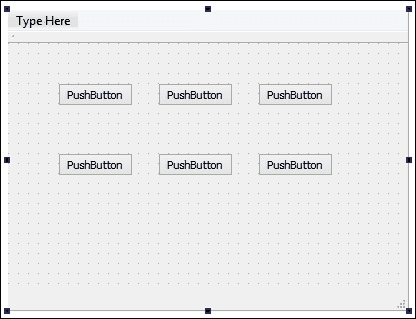

# 第二章。状态和动画

在本章中，我们将涵盖以下内容：

+   Qt 中的属性动画

+   使用缓动曲线控制属性动画

+   创建动画组

+   创建嵌套动画组

+   Qt 中的状态机

+   QML 中的状态、转换和动画

+   使用动画器动画小部件属性

+   精灵动画

# 介绍

Qt 提供了一种简单的方法来为继承`QObject`类的小部件或其他对象进行动画处理，通过其强大的动画框架。动画可以单独使用，也可以与状态机框架一起使用，该框架允许根据小部件的当前活动状态播放不同的动画。Qt 的动画框架还支持分组动画，允许您同时移动多个图形项，或者按顺序移动它们。

# Qt 中的属性动画

在这个例子中，我们将学习如何使用 Qt 的属性动画类来为我们的**图形用户界面**（**GUI**）元素添加动画效果，这是其强大的动画框架的一部分，它允许我们以最小的努力创建流畅的动画效果。

## 如何做到…

1.  首先，让我们创建一个新的 Qt 小部件应用程序项目。之后，用 Qt Designer 打开`mainwindow.ui`并在主窗口上放置一个按钮，如下所示：

1.  接下来，打开`mainwindow.cpp`并在源代码开头添加以下行代码：

```cpp
    #include <QPropertyAnimation>
    ```

1.  之后，打开`mainwindow.cpp`并在构造函数中添加以下代码：

```cpp
    QPropertyAnimation *animation = new QPropertyAnimation(ui->pushButton, "geometry");
    animation->setDuration(10000);
    animation->setStartValue(ui->pushButton->geometry());
    animation->setEndValue(QRect(200, 200, 100, 50));
    animation->start();
    ```

## 它是如何工作的...

通过 Qt 提供的属性动画类`QPropertyAnimation`类是通过 Qt 提供的一种常见方法来为 GUI 元素添加动画效果。这个类是动画框架的一部分，它利用 Qt 的定时器系统在给定的持续时间内更改 GUI 元素的属性。

我们在这里要做的是将按钮从一个位置动画到另一个位置，同时也随着动画过程放大按钮的大小。

通过在步骤 2 中在源代码中包含`QPropertyAnimation`头文件，我们将能够访问 Qt 提供的`QPropertyAnimation`类并利用其功能。

步骤 3 中的代码基本上创建了一个新的属性动画，并将其应用于我们刚刚在 Qt Designer 中创建的按钮。我们明确要求属性动画类更改按钮的`geometry`属性，并将其持续时间设置为 3,000 毫秒（3 秒）。

然后，动画的起始值设置为按钮的初始几何形状，因为显然我们希望它从我们最初在 Qt Designer 中放置按钮的位置开始。然后，结束值设置为我们希望它变成的值；在这种情况下，我们将按钮移动到 x:`200`，y:`200`的新位置，同时沿途改变其大小为宽度:`100`，高度:`50`。

之后，调用`animation->start()`来启动动画。

编译并运行项目，现在您应该看到按钮开始在主窗口上缓慢移动，同时逐渐扩大大小，直到达到目的地。您可以通过修改前面代码中的值来更改动画持续时间和目标位置和比例。使用 Qt 的属性动画系统来为 GUI 元素添加动画效果真的是如此简单！

## 还有更多...

Qt 为我们提供了几种不同的子系统来为我们的 GUI 创建动画，包括定时器、时间轴、动画框架、状态机框架和图形视图框架：

+   **定时器**：Qt 为我们提供了重复和单次定时器。当达到超时值时，将通过 Qt 的信号和槽机制触发事件回调函数。您可以利用定时器在给定的时间间隔内更改 GUI 元素的属性（颜色、位置、比例等），以创建动画效果。

+   **时间轴**：时间轴定期调用插槽以对 GUI 元素进行动画处理。它与重复定时器非常相似，但是当触发插槽时，时间轴会向插槽提供一个值来指示当前帧索引，以便您可以根据给定的值执行不同的操作（例如偏移到精灵表的不同位置）。

+   **动画框架**：动画框架通过允许对 GUI 元素的属性进行动画处理，使动画变得简单。动画是通过使用缓动曲线来控制的。缓动曲线描述了控制动画速度的函数，从而产生不同的加速和减速模式。Qt 支持的缓动曲线类型包括：线性、二次、三次、四次、正弦、指数、圆形和弹性。

+   **状态机框架**：Qt 为我们提供了用于创建和执行状态图的类，允许每个 GUI 元素在触发信号时从一个状态移动到另一个状态。状态机框架中的状态图是分层的，这意味着每个状态也可以嵌套在其他状态内部。

+   **图形视图框架**：图形视图框架是一个强大的图形引擎，用于可视化和与大量自定义的 2D 图形项进行交互。如果您是一名经验丰富的程序员，您可以使用图形视图框架手动绘制 GUI，并对其进行动画处理。

通过利用这里提到的所有强大功能，我们能够轻松创建直观现代的 GUI。在本章中，我们将探讨使用 Qt 对 GUI 元素进行动画处理的实际方法。

# 使用缓动曲线控制属性动画

在这个示例中，我们将学习如何通过利用缓动曲线使我们的动画更加有趣。我们仍然会使用先前的源代码，该源代码使用属性动画来对推按钮进行动画处理。

## 如何做...

1.  在调用`start()`函数之前，定义一个缓动曲线并将其添加到属性动画中：

```cpp
    QPropertyAnimation *animation = new QPropertyAnimation(ui->pushButton, "geometry");
    animation->setDuration(3000);
    animation->setStartValue(ui->pushButton->geometry());
    animation->setEndValue(QRect(200, 200, 100, 50));
    QEasingCurve curve;
    curve.setType(QEasingCurve::OutBounce);
    animation->setEasingCurve(curve);
    animation->start();
    ```

1.  调用`setLoopCount()`函数来设置要重复多少次循环：

```cpp
    QPropertyAnimation *animation = new QPropertyAnimation(ui->pushButton, "geometry");
    animation->setDuration(3000);
    animation->setStartValue(ui->pushButton->geometry());
    animation->setEndValue(QRect(200, 200, 100, 50));
    QEasingCurve curve;
    Curve.setType(EasingCurve::OutBounce);
    animation->setEasingCurve(curve);
    animation->setLoopCount(2);
    animation->start();
    ```

1.  在应用缓动曲线到动画之前，调用`setAmplitude()`、`setOvershoot()`和`setPeriod()`：

```cpp
    QEasingCurve curve;
    curve.setType(QEasingCurve::OutBounce);
    curve.setAmplitude(1.00);
    curve.setOvershoot(1.70);
    curve.setPeriod(0.30);
    animation->setEasingCurve(curve);
    animation->start();
    ```

## 它是如何工作的...

为了让缓动曲线控制动画，您只需要在调用`start()`函数之前定义一个缓动曲线并将其添加到属性动画中。您还可以尝试几种其他类型的缓动曲线，看看哪一种最适合您。以下是一个示例：

```cpp
animation->setEasingCurve(QEasingCurve::OutBounce);
```

如果您希望动画在播放完成后循环播放，可以调用`setLoopCount()`函数来设置要重复多少次循环，或者将值设置为`-1`以进行无限循环：

```cpp
animation->setLoopCount(-1);
```

在将缓动曲线应用到属性动画之前，您可以设置几个参数来完善缓动曲线。这些参数包括振幅、超调和周期：

+   **振幅**：振幅越高，动画的弹跳或弹簧效果就越强。

+   **超调**：由于阻尼效应，某些曲线函数将产生超调（超过其最终值）曲线。通过调整超调值，我们能够增加或减少这种效果。

+   **周期**：设置较小的周期值将使曲线具有较高的频率。较大的周期将使其具有较低的频率。

然而，这些参数并不适用于所有曲线类型。请参考 Qt 文档，了解哪个参数适用于哪种曲线类型。

## 还有更多...

虽然属性动画运行良好，但有时看到 GUI 元素以恒定速度进行动画处理会感到有些无聊。我们可以通过添加缓动曲线来控制运动使动画看起来更有趣。在 Qt 中有许多类型的缓动曲线可供使用，以下是其中一些：


正如您从上图中看到的，每个缓动曲线产生不同的缓入和缓出效果。

### 注意

有关 Qt 中可用的缓动曲线的完整列表，请参阅 Qt 文档[`doc.qt.io/qt-5/qeasingcurve.html#Type-enum`](http://doc.qt.io/qt-5/qeasingcurve.html#Type-enum)。

# 创建动画组

在这个例子中，我们将学习如何使用动画组来管理组中包含的动画的状态。

## 操作方法...

1.  我们将使用之前的例子，但这次，我们将在主窗口中添加两个更多的按钮，如下所示：

1.  接下来，在主窗口的构造函数中为每个按钮定义动画：

```cpp
    QPropertyAnimation *animation1 = new QPropertyAnimation(ui->pushButton, "geometry");
    animation1->setDuration(3000);
    animation1->setStartValue(ui->pushButton->geometry());
    animation1->setEndValue(QRect(50, 200, 100, 50));

    QPropertyAnimation *animation2 = new QPropertyAnimation(ui->pushButton_2, "geometry");
    animation2->setDuration(3000);
    animation2->setStartValue(ui->pushButton_2->geometry());
    animation2->setEndValue(QRect(150, 200, 100, 50));

    QPropertyAnimation *animation3 = new QPropertyAnimation(ui->pushButton_3, "geometry");
    animation3->setDuration(3000);
    animation3->setStartValue(ui->pushButton_3->geometry());
    animation3->setEndValue(QRect(250, 200, 100, 50));
    ```

1.  之后，创建一个缓动曲线并将相同的曲线应用于所有三个动画：

```cpp
    QEasingCurve curve;
    curve.setType(QEasingCurve::OutBounce);
    curve.setAmplitude(1.00);
    curve.setOvershoot(1.70);
    curve.setPeriod(0.30);

    animation1->setEasingCurve(curve);
    animation2->setEasingCurve(curve);
    animation3->setEasingCurve(curve);
    ```

1.  一旦您将缓动曲线应用于所有三个动画，我们将创建一个动画组并将所有三个动画添加到组中：

```cpp
    QParallelAnimationGroup *group = new QParallelAnimationGroup;group->addAnimation(animation1);
    group->addAnimation(animation2);
    group->addAnimation(animation3);
    ```

1.  从刚刚创建的动画组中调用`start()`函数：

```cpp
    group->start();
    ```

## 工作原理...

由于我们现在使用动画组，我们不再从单独的动画中调用`start()`函数，而是从刚刚创建的动画组中调用`start()`函数。

如果现在编译并运行示例，您将看到所有三个按钮同时播放。这是因为我们使用了并行动画组。您可以将其替换为顺序动画组并再次运行示例：

```cpp
QSequentialAnimationGroup *group = new QSequentialAnimationGroup;
```

这次，一次只有一个按钮会播放其动画，而其他按钮将耐心等待他们的轮到。

优先级是根据首先添加到动画组中的动画来设置的。您可以通过简单地重新排列添加到组中的动画的顺序来更改动画顺序。例如，如果我们希望按钮 3 首先开始动画，然后是按钮 2，然后是按钮 1，代码将如下所示：

```cpp
group->addAnimation(animation3);
group->addAnimation(animation2);
group->addAnimation(animation1);
```

由于属性动画和动画组都是从`QAbstractAnimator`类继承的，这意味着您也可以将一个动画组添加到另一个动画组中，以形成一个更复杂的嵌套动画组。

## 还有更多...

Qt 允许我们创建多个动画并将它们分组成一个动画组。一个组通常负责管理其动画的状态（即，它决定何时开始、停止、恢复和暂停它们）。目前，Qt 提供了两种动画组类，`QParallelAnimationGroup`和`QSequentialAnimationGroup`：

+   `QParallelAnimationGroup`：顾名思义，并行动画组同时运行其组中的所有动画。当最持久的动画完成运行时，组被视为已完成。

+   `QSequentialAnimationGroup`：顺序动画组按顺序运行其动画，这意味着一次只运行一个动画，并且只有当前动画完成后才会播放下一个动画。

# 创建嵌套动画组

使用嵌套动画组的一个很好的例子是当您有几个并行动画组并且希望按顺序播放这些组时。

## 操作方法...

1.  我们将使用之前的示例中的 UI，并在主窗口中添加几个更多的按钮，如下所示：

1.  首先，为所有按钮创建动画，然后创建一个缓动曲线并将其应用于所有动画：

```cpp
    QPropertyAnimation *animation1 = new QPropertyAnimation(ui->pushButton, "geometry");
    animation1->setDuration(3000);
    animation1->setStartValue(ui->pushButton->geometry());
    animation1->setEndValue(QRect(50, 50, 100, 50));

    QPropertyAnimation *animation2 = new QPropertyAnimation(ui->pushButton_2, "geometry");
    animation2->setDuration(3000);
    animation2->setStartValue(ui->pushButton_2->geometry());
    animation2->setEndValue(QRect(150, 50, 100, 50));

    QPropertyAnimation *animation3 = new QPropertyAnimation(ui->pushButton_3, "geometry");
    animation3->setDuration(3000);
    animation3->setStartValue(ui->pushButton_3->geometry());
    animation3->setEndValue(QRect(250, 50, 100, 50));

    QPropertyAnimation *animation4 = new QPropertyAnimation(ui->pushButton_4, "geometry");
    animation4->setDuration(3000);
    animation4->setStartValue(ui->pushButton_4->geometry());
    animation4->setEndValue(QRect(50, 200, 100, 50));

    QPropertyAnimation *animation5 = new QPropertyAnimation(ui->pushButton_5, "geometry");
    animation5->setDuration(3000);
    animation5->setStartValue(ui->pushButton_5->geometry());
    animation5->setEndValue(QRect(150, 200, 100, 50));

    QPropertyAnimation *animation6 = new QPropertyAnimation(ui->pushButton_6, "geometry");
    animation6->setDuration(3000);
    animation6->setStartValue(ui->pushButton_6->geometry());
    animation6->setEndValue(QRect(250, 200, 100, 50));

    QEasingCurve curve;
    curve.setType(QEasingCurve::OutBounce);
    curve.setAmplitude(1.00);
    curve.setOvershoot(1.70);
    curve.setPeriod(0.30);

    animation1->setEasingCurve(curve);
    animation2->setEasingCurve(curve);
    animation3->setEasingCurve(curve);
    animation4->setEasingCurve(curve);
    animation5->setEasingCurve(curve);
    animation6->setEasingCurve(curve);
    ```

1.  创建两个动画组，一个用于上列按钮，另一个用于下列按钮：

```cpp
    QParallelAnimationGroup *group1 = new QParallelAnimationGroup;
    group1->addAnimation(animation1);
    group1->addAnimation(animation2);
    group1->addAnimation(animation3);

    QParallelAnimationGroup *group2 = new QParallelAnimationGroup;
    group2->addAnimation(animation4);
    group2->addAnimation(animation5);
    group2->addAnimation(animation6);
    ```

1.  我们将创建另一个动画组，用于存储我们之前创建的两个动画组：

```cpp
    QSequentialAnimationGroup *groupAll = new QSequentialAnimationGroup;
    groupAll->addAnimation(group1);
    groupAll->addAnimation(group2);
    groupAll->start();
    ```

## 工作原理...

我们在这里要做的是先播放上列按钮的动画，然后是下列按钮的动画。

由于两个动画组都是并行动画组，当调用`start()`函数时，属于各自组的按钮将同时进行动画。

这一次，然而，这个组是一个顺序动画组，这意味着一次只有一个并行动画组会被播放，当第一个完成时，另一个会接着播放。

动画组是一个非常方便的系统，它允许我们用简单的编码创建非常复杂的 GUI 动画。Qt 会为我们处理困难的部分，所以我们不必自己处理。

# Qt 中的状态机

状态机可以用于许多目的，但在本章中，我们只会涵盖与动画相关的主题。

## 如何做...

1.  首先，我们将为我们的示例程序设置一个新的用户界面，它看起来像这样：

1.  接下来，我们将在源代码中包含一些头文件：

```cpp
    #include <QStateMachine>
    #include <QPropertyAnimation>
    #include <QEventTransition>
    ```

1.  在我们的主窗口构造函数中，添加以下代码来创建一个新的状态机和两个状态，我们稍后会使用它们：

```cpp
    QStateMachine *machine = new QStateMachine(this);
    QState *s1 = new QState();
    QState *s2 = new QState();
    ```

1.  然后，我们将定义在每个状态中应该做什么，这种情况下将是更改标签的文本，以及按钮的位置和大小：

```cpp
    QState *s1 = new QState();
    s1->assignProperty(ui->stateLabel, "text", "Current state: 1");
    s1->assignProperty(ui->pushButton, "geometry", QRect(50, 200, 100, 50));

    QState *s2 = new QState();
    s2->assignProperty(ui->stateLabel, "text", "Current state: 2");
    s2->assignProperty(ui->pushButton, "geometry", QRect(200, 50, 140, 100));

    ```

1.  完成后，让我们通过向源代码添加事件转换类来继续：

```cpp
    QEventTransition *t1 = new QEventTransition(ui->changeState, QEvent::MouseButtonPress);
    t1->setTargetState(s2);
    s1->addTransition(t1);

    QEventTransition *t2 = new QEventTransition(ui->changeState, QEvent::MouseButtonPress);
    T2->setTargetState(s1);
    s2->addTransition(t2);
    ```

1.  接下来，将我们刚刚创建的所有状态添加到状态机中，并将状态 1 定义为初始状态。然后，调用`machine->start()`来启动状态机运行：

```cpp
    machine->addState(s1);
    machine->addState(s2);

    machine->setInitialState(s1);
    machine->start();
    ```

1.  如果你现在运行示例程序，你会注意到一切都运行正常，除了按钮没有经历平滑的过渡，它只是立即跳到我们之前设置的位置和大小。这是因为我们没有使用属性动画来创建平滑的过渡。

1.  返回到事件转换步骤，添加以下代码行：

```cpp
    QEventTransition *t1 = new QEventTransition(ui->changeState, QEvent::MouseButtonPress);
    t1->setTargetState(s2);
    t1->addAnimation(new QPropertyAnimation(ui->pushButton, "geometry"));
    s1->addTransition(t1);

    QEventTransition *t2 = new QEventTransition(ui->changeState, QEvent::MouseButtonPress);
    t2->setTargetState(s1);
    t2->addAnimation(new QPropertyAnimation(ui->pushButton, "geometry"));
    s2->addTransition(t2);
    ```

1.  你也可以为动画添加一个缓动曲线，使其看起来更有趣：

```cpp
    QPropertyAnimation *animation = new QPropertyAnimation(ui->pushButton, "geometry");
    animation->setEasingCurve(QEasingCurve::OutBounce);
    QEventTransition *t1 = new QEventTransition(ui->changeState, QEvent::MouseButtonPress);
    t1->setTargetState(s2);
    t1->addAnimation(animation);
    s1->addTransition(t1);

    QEventTransition *t2 = new QEventTransition(ui->changeState, QEvent::MouseButtonPress);
    t2->setTargetState(s1);
    t2->addAnimation(animation);
    s2->addTransition(t2);
    ```

## 它是如何工作的...

主窗口布局上有两个按钮和一个标签。左上角的按钮在按下时将触发状态更改，而右上角的标签将更改其文本以显示我们当前处于哪个状态，并且下面的按钮将根据当前状态进行动画。

`QEventTransition`类定义了触发一个状态到另一个状态的转换。

在我们的例子中，当点击`ui->changeState`按钮（左上角的按钮）时，我们希望状态从状态 1 变为状态 2。之后，当再次按下相同的按钮时，我们还希望从状态 2 变回状态 1。这可以通过创建另一个事件转换类并将目标状态设置回状态 1 来实现。然后，将这些转换添加到它们各自的状态中。

我们告诉 Qt 使用属性动画类来平滑地插值属性到目标值，而不是直接将属性直接分配给小部件。就是这么简单！

不需要设置起始值和结束值，因为我们已经调用了`assignProperty()`函数，它已经自动分配了结束值。

## 还有更多...

Qt 中的状态机框架提供了用于创建和执行状态图的类。Qt 的事件系统用于驱动状态机，状态之间的转换可以通过使用信号来触发，然后在另一端的槽将被信号调用来执行一个动作，比如播放一个动画。

一旦你理解了状态机的基础知识，你也可以用它们来做其他事情。状态机框架中的状态图是分层的。就像前一节中的动画组一样，状态也可以嵌套在其他状态中：


# QML 中的状态、转换和动画

如果你更喜欢使用 QML 而不是 C++，Qt 还提供了类似的功能在 Qt Quick 中，允许你用最少的代码轻松地为 GUI 元素添加动画。在这个例子中，我们将学习如何用 QML 实现这一点。

## 如何做...

1.  首先，我们将创建一个新的**Qt Quick Application**项目，并设置我们的用户界面如下：

1.  这是我的`main.qml`文件的样子：

```cpp
    import QtQuick 2.3
    import QtQuick.Window 2.2

    Window {
      visible: true
      width: 480;
      height: 320;

      Rectangle {
        id: background;
        anchors.fill: parent;
        color: "blue";
      }

      Text {
        text: qsTr("Hello World");
        anchors.centerIn: parent;
        color: "white";
        font.pointSize: 15;
      }
    }
    ```

1.  将颜色动画添加到`Rectangle`对象中：

```cpp
    Rectangle {
      id: background;
      anchors.fill: parent;
      color: "blue";
      SequentialAnimation on color
      {
        ColorAnimation { to: "yellow"; duration: 1000 }
        ColorAnimation { to: "red"; duration: 1000 }
        ColorAnimation { to: "blue"; duration: 1000 }
        loops: Animation.Infinite;
      }
    }
    ```

1.  然后，将数字动画添加到文本对象中：

```cpp
    Text {
      text: qsTr("Hello World");
      anchors.centerIn: parent;
      color: "white";
      font.pointSize: 15;
      SequentialAnimation on opacity {
     NumberAnimation { to: 0.0; duration: 200}
     NumberAnimation { to: 1.0; duration: 200}
     loops: Animation.Infinite;
     }
    }
    ```

1.  接下来，为其添加另一个数字动画：

```cpp
    Text {
      text: qsTr("Hello World");
      anchors.centerIn: parent;
      color: "white";
      font.pointSize: 15;
      SequentialAnimation on opacity {
        NumberAnimation { to: 0.0; duration: 200}
        NumberAnimation { to: 1.0; duration: 200}
        loops: Animation.Infinite;
      }
     NumberAnimation on rotation {
     from: 0;
     to: 360;
     duration: 2000;
     loops: Animation.Infinite;
     }
    }
    ```

1.  定义两种状态，一种称为`PRESSED`状态，另一种称为`RELEASED`状态。然后，将默认状态设置为`RELEASED`：

```cpp
    Rectangle {
      id: background;
      anchors.fill: parent;

     state: "RELEASED";
     states: [
     State {
     name: "PRESSED"
     PropertyChanges { target: background; color: "blue"}
     },
     State {
     name: "RELEASED"
     PropertyChanges { target: background; color: "red"}
     }
     ]
    }
    ```

1.  之后，在`Rectangle`对象内创建一个鼠标区域，以便我们可以单击它：

```cpp
    MouseArea {
      anchors.fill: parent;
      onPressed: background.state = "PRESSED";
      onReleased: background.state = "RELEASED";
    }
    ```

1.  给`Rectangle`对象添加一些过渡效果：

```cpp
    transitions: [
      Transition {
        from: "PRESSED"
        to: "RELEASED"
        ColorAnimation { target: background; duration: 200}
      },
      Transition {
        from: "RELEASED"
        to: "PRESSED"
        ColorAnimation { target: background; duration: 200}
      }
    ]
    ```

## 它是如何工作的...

主窗口由一个蓝色矩形和静态文本组成，上面写着`Hello World`。

我们希望背景颜色在循环中从蓝色变为黄色，然后变为红色，最后再变回蓝色。这可以通过在 QML 中使用颜色动画类型轻松实现。

在步骤 3 中，我们基本上是在`Rectangle`对象内创建了一个顺序动画组，然后在组内创建了三个不同的颜色动画，这些动画将每 1000 毫秒（1 秒）改变对象的颜色。我们还将动画设置为无限循环。

在步骤 4 中，我们希望使用数字动画来动画化静态文本的 alpha 值。我们在`Text`对象内创建了另一个顺序动画组，并创建了两个数字动画，以将 alpha 值从 0 动画到 1，然后再返回。然后，我们将动画设置为无限循环。

然后在第 5 步中，我们通过向其添加另一个数字动画来旋转`Hello World`文本。

在第 6 步中，我们希望在单击时使`Rectangle`对象从一种颜色变为另一种颜色。当鼠标释放时，`Rectangle`对象将恢复到其初始颜色。为了实现这一点，首先我们需要定义两种状态，一种称为`PRESSED`状态，另一种称为`RELEASED`状态。然后，我们将默认状态设置为`RELEASED`。

现在，当您编译并运行示例时，背景在按下时会立即变为蓝色，当释放鼠标时会变回红色。这很好用，我们可以通过给颜色切换时添加一些过渡效果来进一步增强它。这可以通过向`Rectangle`对象添加过渡效果轻松实现。

## 还有更多…

在 QML 中，有八种不同类型的属性动画可供使用：

+   **锚点动画**：动画化锚点值的变化

+   **颜色动画**：动画化颜色值的变化

+   **数字动画**：动画化 qreal 类型值的变化

+   **父动画**：动画化父级值的变化

+   **路径动画**：沿路径动画化项目

+   **属性动画**：动画化属性值的变化

+   **旋转动画**：动画化旋转值的变化

+   **Vector3d 动画**：动画化 QVector3d 值的变化

就像 C++版本一样，这些动画也可以在动画组中组合在一起，以便按顺序或并行播放动画。您还可以使用缓动曲线来控制动画，并使用状态机确定何时播放这些动画，就像我们在上一节中所做的那样。

# 使用动画器动画化小部件属性

在本教程中，我们将学习如何使用 QML 提供的动画器功能来动画化 GUI 小部件的属性。

## 如何做…

1.  创建一个矩形对象，并为其添加一个比例动画器：

```cpp
    Rectangle {
      id: myBox;
      width: 50;
      height: 50;
      anchors.horizontalCenter: parent.horizontalCenter;
      anchors.verticalCenter: parent.verticalCenter;
      color: "blue";

      ScaleAnimator {
        target: myBox;
        from: 5;
        to: 1;
        duration: 2000;
        running: true;
      }
    }
    ```

1.  添加一个旋转动画器，并将运行值设置为并行动画组中，但不是任何单独的动画器中。

```cpp
    ParallelAnimation {
      ScaleAnimator {
        target: myBox;
        from: 5;
        to: 1;
        duration: 2000;
      }
      RotationAnimator {
        target: myBox;
        from: 0;
        to: 360;
        duration: 1000;
      }
      running: true;
    }
    ```

1.  为比例动画器添加一个缓动曲线：

```cpp
    ScaleAnimator {
      target: myBox;
      from: 5;
      to: 1;
      duration: 2000;
      easing.type: Easing.InOutElastic;
     easing.amplitude: 2.0;
     asing.period: 1.5;
      running: true;
    }
    ```

## 它是如何工作的...

动画器类型可以像任何其他动画类型一样使用。我们希望在 2000 毫秒（2 秒）内将矩形从大小`5`缩放到大小`1`。

我们创建了一个蓝色的`Rectangle`对象，并为其添加了一个比例动画器。我们将初始值设置为`5`，最终值设置为`1`。然后，我们将动画持续时间设置为`2000`，并将运行值设置为`true`，这样程序启动时就会播放它。

就像动画类型一样，动画器也可以放入组中（即并行动画组或顺序动画组）。动画组也将被 QtQuick 视为动画器，并在可能的情况下在场景图的渲染线程上运行。

在第 2 步中，我们想将两个不同的动画器分组到一个并行动画组中，以便它们同时运行。

我们将保留之前创建的缩放动画器，并向`Rectangle`对象添加另一个旋转动画器。这次，在并行动画组中设置运行值，而不是在任何单独的动画器中设置。

就像 C++版本一样，QML 也支持缓动曲线，它们可以轻松应用于任何动画或动画器类型。

QML 中有一种叫做动画器的东西，它与普通动画类型类似但又不同。动画器类型是一种特殊类型的动画，它直接在 Qt Quick 的场景图上运行，而不是像常规动画类型那样在 QML 对象和它们的属性上运行。

QML 属性的值将在动画完成后更新。然而，在动画运行时，属性不会被更新。使用动画器类型的好处是性能稍微更好，因为它不在 UI 线程上运行，而是直接在场景图的渲染线程上运行。

# 精灵动画

在这个例子中，我们将学习如何在 QML 中创建精灵动画。

## 如何做…

1.  首先，我们需要将精灵表添加到 Qt 的资源系统中，以便在程序中使用。打开`qml.qrc`，点击**添加** | **添加文件**按钮。选择精灵表图像并按下*Ctrl* + *S*保存资源文件。

1.  之后，在`main.qml`中创建一个新的空窗口：

```cpp
    import QtQuick 2.3
    import QtQuick.Window 2.2

    Window {
      visible: true
      width: 420
      height: 380
      Rectangle {
        anchors.fill: parent
        color: "white"
      }
    }
    ```

1.  完成后，我们将在 QML 中开始创建一个`AnimatedSprite`对象：

```cpp
    import QtQuick 2.3
    import QtQuick.Window 2.2

    Window {
      visible: true;
      width: 420;
      height: 380;
      Rectangle {
        anchors.fill: parent;
        color: "white";
      }

     AnimatedSprite {
     id: sprite;
     width: 128;
     height: 128;
     anchors.centerIn: parent;
     source: "qrc:///horse_1.png";
     frameCount: 11;
     frameWidth: 128;
     frameHeight: 128;
     frameRate: 25;
     loops: Animation.Infinite;
     running: true;
     }
    }
    ```

1.  在窗口中添加一个鼠标区域并检查`onClicked`事件：

```cpp
    MouseArea {
      anchors.fill: parent;
      onClicked: {
        if (sprite.paused)
          sprite.resume();
        else
          sprite.pause();
      }
    }
    ```

1.  如果现在编译和运行示例程序，你会看到一个小马在窗口中间奔跑。多有趣啊！如何做…

1.  接下来，我们想尝试做一些酷炫的事情。我们将让马在窗口中奔跑，并在播放奔跑动画的同时无限循环！

首先，我们需要从 QML 中删除`anchors.centerIn:` parent，并用`x`和`y`值替换它：

```cpp
    AnimatedSprite {
      id: sprite;
      width: 128;
      height: 128;
      x: -128;
      y: parent.height / 2;
      source: "qrc:///horse_1.png";
      frameCount: 11;
      frameWidth: 128;
      frameHeight: 128;
      frameRate: 25;
      loops: Animation.Infinite;
      running: true;
    }
    ```

1.  之后，向精灵对象添加一个数字动画，并设置其属性如下：

```cpp
    NumberAnimation {
      target: sprite;
      property: "x";
      from: -128;
      to: 512;
      duration: 3000;
      loops: Animation.Infinite;
      running: true;
    }
    ```

1.  现在编译和运行示例程序，你会看到小马疯狂地在窗口中奔跑！

## 工作原理…

在这个示例中，我们将动画精灵对象放在窗口中间，并将其图像源设置为刚刚添加到项目资源中的精灵表。

然后，我们数了一下属于奔跑动画的精灵表中有多少帧，这里是 11 帧。我们还告诉 Qt 每一帧动画的尺寸，这里是 128 x 128。之后，我们将帧速率设置为`25`以获得合理的速度，然后将其设置为无限循环。然后我们将奔跑值设置为`true`，这样动画在程序开始运行时将默认播放。

然后在第 4 步，我们希望能够通过点击窗口来暂停动画并恢复它。当点击鼠标区域时，我们只需检查精灵当前是否暂停。如果精灵动画已经暂停，那么恢复动画；否则，暂停动画。

在第 6 步，我们用`x`和`y`值替换了`anchors.centerIn`，这样动画精灵对象就不会锚定在窗口中心，这样就可以移动了。

然后，我们在动画精灵中创建了一个数字动画，以动画化其`x`属性。我们将起始值设置为窗口左侧的某个位置，将结束值设置为窗口右侧的某个位置。之后，我们将持续时间设置为 3,000 毫秒（3 秒），并使其无限循环。

最后，我们还将运行值设置为`true`，这样当程序开始运行时，它将默认播放动画。

## 还有更多...

精灵动画被广泛应用，尤其在游戏开发中。精灵用于角色动画、粒子动画，甚至 GUI 动画。精灵表包含许多图像组合成一个，然后可以被切割并逐一显示在屏幕上。从精灵表中不同图像（或精灵）之间的过渡创造了动画的错觉，我们通常称之为精灵动画。在 QML 中，可以很容易地使用`AnimatedSprite`类型实现精灵动画。

### 注意

在这个示例程序中，我使用了由 bluecarrot16 在 CC-BY 3.0 / GPL 3.0 / GPL 2.0 / OGA-BY 3.0 许可下创建的免费开源图像。该图像可以在[`opengameart.org/content/lpc-horse`](http://opengameart.org/content/lpc-horse)上合法获取。
