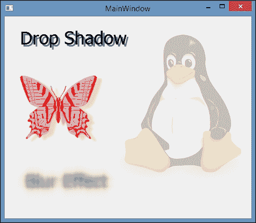
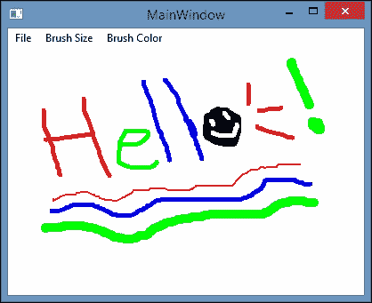

# 第三章。QPainter 和 2D 图形

在本章中，我们将涵盖以下内容：

+   在屏幕上绘制基本形状

+   将形状导出为 SVG 文件

+   坐标变换

+   在屏幕上显示图像

+   将图像效果应用于图形

+   创建基本绘画程序

+   QML 中的 2D 画布

# 简介

在本章中，我们将学习如何使用 Qt 在屏幕上渲染 2D 图形。在内部，Qt 使用一个低级别的类称为`QPainter`来在主窗口上渲染其小部件。Qt 允许我们访问和使用`QPainter`类来绘制矢量图形、文本、2D 图像，甚至 3D 图形。您可以利用`QPainter`类来创建自定义小部件，或者创建依赖于计算机图形渲染的程序，如视频游戏、照片编辑器、3D 建模工具等。

# 在屏幕上绘制基本形状

在本节中，我们将学习如何使用`QPainter`类在主窗口上绘制简单的矢量形状（线条、矩形、圆形等）并显示文本。我们还将学习如何使用`QPen`类更改矢量形状的绘制样式。

## 如何做...

首先，让我们创建一个新的**Qt Widgets 应用程序**项目：

1.  打开`mainwindow.ui`并删除菜单栏、主工具栏和状态栏，以便获得一个干净的空白主窗口。右键单击栏小部件，从弹出菜单中选择**删除菜单栏**：

1.  然后，打开`mainwindow.h`并添加以下代码以包含`QPainter`头文件：

```cpp
    #include <QMainWindow>
    #include <QPainter>

    ```

1.  然后，在类析构函数下面声明`paintEvent()`事件处理程序：

```cpp
    public:
    explicit MainWindow(QWidget *parent = 0);
    ~MainWindow();
    virtual void paintEvent(QPaintEvent *event);

    ```

1.  接下来，打开`mainwindow.cpp`并定义`paintEvent()`事件处理程序：

```cpp
    void MainWindow::paintEvent(QPaintEvent *event)
    {
    }
    ```

1.  之后，我们将使用`paintEvent()`事件处理程序内的`QPainter`类向屏幕添加文本。我们在屏幕上的位置`(20, 30)`绘制文本之前设置文本字体设置：

```cpp
    QPainter textPainter(this);
    textPainter.setFont(QFont("Times", 14, QFont::Bold));
    textPainter.drawText(QPoint(20, 30), "Testing");
    ```

1.  然后，我们将绘制一条从`(50, 60)`开始到`(100, 100)`结束的直线：

```cpp
    QPainter linePainter(this);
    linePainter.drawLine(QPoint(50, 60), QPoint(100, 100));
    ```

1.  我们还可以通过使用`QPainter`类调用`drawRect()`函数轻松绘制一个矩形形状。不过这次，在绘制之前我们还会为形状应用一个背景图案：

```cpp
    QPainter rectPainter(this);
    rectPainter.setBrush(Qt::BDiagPattern);
    rectPainter.drawRect(QRect(40, 120, 80, 30));
    ```

1.  接下来，声明一个`QPen`类，将其颜色设置为`red`，将其绘制样式设置为`Qt::DashDotLine`。然后，将`QPen`类应用于`QPainter`并在`(80, 200)`处绘制一个水平半径为`50`，垂直半径为`20`的椭圆形：

```cpp
    QPen ellipsePen;
    ellipsePen.setColor(Qt::red);
    ellipsePen.setStyle(Qt::DashDotLine);

    QPainter ellipsePainter(this);
    ellipsePainter.setPen(ellipsePen);
    ellipsePainter.drawEllipse(QPoint(80, 200), 50, 20);
    ```

1.  我们还可以使用`QPainterPath`类来定义形状，然后将其传递给`QPainter`类进行渲染：

```cpp
    QPainterPath rectPath;
    rectPath.addRect(QRect(150, 20, 100, 50));

    QPainter pathPainter(this);
    pathPainter.setPen(QPen(Qt::red, 1, Qt::DashDotLine, Qt::FlatCap, Qt::MiterJoin));
    pathPainter.setBrush(Qt::yellow);
    pathPainter.drawPath(rectPath);
    ```

1.  您还可以使用`QPainterPath`绘制任何其他形状，比如椭圆：

```cpp
    QPainterPath ellipsePath;
    ellipsePath.addEllipse(QPoint(200, 120), 50, 20);

    QPainter ellipsePathPainter(this);
    ellipsePathPainter.setPen(QPen(QColor(79, 106, 25), 5, Qt::SolidLine, Qt::FlatCap, Qt::MiterJoin));
    ellipsePathPainter.setBrush(QColor(122, 163, 39));
    ellipsePathPainter.drawPath(ellipsePath);
    ```

1.  `QPainter`也可以用来将图像文件绘制到屏幕上。在下面的示例中，我们加载一个名为`tux.png`的图像文件，并在屏幕上的位置`(100, 150)`绘制它：

```cpp
    QImage image;
    image.load("tux.png");

    QPainter imagePainter(this);
    imagePainter.drawImage(QPoint(100, 150), image);
    ```

1.  最终结果应该看起来像这样：

## 工作原理...

如果您想使用`QPainter`在屏幕上绘制一些东西，基本上您只需要告诉它应该绘制什么类型的图形（文本、矢量形状、图像、多边形等），以及其位置和大小。

QPen 确定了图形的轮廓样式，如颜色、线宽、线型（实线、虚线、点线等）、端点样式、连接样式等。

另一方面，`QBrush`设置了图形的背景样式，如背景颜色、图案（纯色、渐变、密集刷、交叉对角线等）和像素图。

在调用绘制函数（`drawLine()`、`drawRect()`、`drawEllipse()`等）之前应设置图形的选项。

如果你的图形不显示在屏幕上，并且在 Qt Creator 的应用程序输出窗口中看到警告，比如`QPainter::setPen: Painter not active`和`QPainter::setBrush: Painter not active`，这意味着`QPainter`类当前不活动，你的程序不会触发它的绘制事件。要解决这个问题，将主窗口设置为`QPainter`类的父类。通常，如果你在`mainwindow.cpp`文件中编写代码，初始化`QPainter`时只需要在括号中放入`this`。例如：

```cpp
QPainter linePainter(this);
```

`QImage`可以从计算机目录和程序资源中加载图像。

## 还有更多…

把`QPainter`想象成一个带着笔和空画布的机器人。你只需要告诉机器人应该画什么类型的形状以及它在画布上的位置，然后机器人会根据你的描述完成工作。为了让你的生活更轻松，`QPainter`类还提供了许多函数，比如`drawArc()`、`drawEllipse()`、`drawLine()`、`drawRect()`、`drawPie()`等，让你可以轻松地渲染预定义的形状。

在 Qt 中，所有的窗口部件类（包括主窗口）都有一个名为`QWidget::paintEvent()`的事件处理程序。每当操作系统认为主窗口应该重新绘制其窗口部件时，这个事件处理程序就会被触发。许多事情可能导致这个决定，比如主窗口被缩放，窗口部件改变其状态（即，按钮被按下），或者在代码中手动调用`repaint()`或`update()`等函数。不同的操作系统在决定是否触发相同条件下的更新事件时可能会有不同的行为。如果你正在制作一个需要连续和一致的图形更新的程序，可以使用定时器手动调用`repaint()`或`update()`。

# 将形状导出为 SVG 文件

**可伸缩矢量图形**（**SVG**）是一种基于 XML 的语言，用于描述二维矢量图形。Qt 提供了保存矢量形状到 SVG 文件的类。这个功能可以用来创建一个简单的矢量图形编辑器，类似于 Adobe Illustrator 和 Inkscape。

在下一个示例中，我们将继续使用前一个示例中的相同项目文件。

## 如何做…

让我们学习如何创建一个简单的程序，在屏幕上显示 SVG 图形：

1.  首先，通过右键单击层次结构窗口上的主窗口部件，并从弹出菜单中选择**创建菜单栏**选项来创建一个菜单栏。之后，在菜单栏中添加一个**文件**选项，然后在其下方添加一个**另存为 SVG**操作：

1.  之后，在 Qt Creator 窗口底部的**Action Editor**窗口中会看到一个名为`actionSave_as_SVG`的项目。右键单击该项目，从弹出菜单中选择**转到槽…**。现在会出现一个窗口，其中列出了特定操作可用的槽。选择名为`triggered()`的默认信号，然后点击**OK**按钮：

1.  点击**OK**按钮后，Qt Creator 将切换到脚本编辑器。你会发现一个名为`on_actionSave_as_SVG_triggered()`的槽已经自动添加到你的主窗口类中。在你的`mainwindow.h`的底部，你会看到类似这样的内容：

```cpp
    void MainWindow::on_actionSave_as_SVG_triggered()
    {
    }
    ```

当你从菜单栏点击**另存为 SVG**选项时，将调用上述函数。我们将在这个函数中编写代码，将所有矢量图形保存到一个 SVG 文件中。

1.  为了做到这一点，我们首先需要在源文件顶部包含一个名为`QSvgGenerator`的类头文件。这个头文件非常重要，因为它用于生成 SVG 文件。然后，我们还需要包含另一个名为`QFileDialog`的类头文件，它将用于打开保存对话框：

```cpp
    #include <QtSvg/QSvgGenerator>
    #include <QFileDialog>
    ```

1.  我们还需要在项目文件中添加 SVG 模块，如下所示：

```cpp
    QT += core gui svg
    ```

1.  然后，在`mainwindow.h`中创建一个名为`paintAll()`的新函数，如下所示：

```cpp
    public:
      explicit MainWindow(QWidget *parent = 0);
      ~MainWindow();

      virtual void paintEvent(QPaintEvent *event);
      void paintAll(QSvgGenerator *generator = 0);
    ```

1.  之后，在`mainwindow.cpp`中，将所有代码从`paintEvent()`移动到`paintAll()`函数中。然后，用单一统一的`QPainter`替换所有单独的`QPainter`对象来绘制所有图形。还要在绘制任何内容之前调用`begin()`函数，并在完成绘制后调用`end()`函数。代码应该如下所示：

```cpp
    void MainWindow::paintAll(QSvgGenerator *generator)
    {
      QPainter painter;

      if (engine)
        painter.begin(engine);
      else
        painter.begin(this);

      painter.setFont(QFont("Times", 14, QFont::Bold));
      painter.drawText(QPoint(20, 30), "Testing");

      painter.drawLine(QPoint(50, 60), QPoint(100, 100));

      painter.setBrush(Qt::BDiagPattern);
      painter.drawRect(QRect(40, 120, 80, 30));

      QPen ellipsePen;
      ellipsePen.setColor(Qt::red);
      ellipsePen.setStyle(Qt::DashDotLine);

      painter.setPen(ellipsePen);
      painter.drawEllipse(QPoint(80, 200), 50, 20);

      QPainterPath rectPath;
      rectPath.addRect(QRect(150, 20, 100, 50));

      painter.setPen(QPen(Qt::red, 1, Qt::DashDotLine, Qt::FlatCap, Qt::MiterJoin));
      painter.setBrush(Qt::yellow);
      painter.drawPath(rectPath);

      QPainterPath ellipsePath;
      ellipsePath.addEllipse(QPoint(200, 120), 50, 20);

      painter.setPen(QPen(QColor(79, 106, 25), 5, Qt::SolidLine, Qt::FlatCap, Qt::MiterJoin));
      painter.setBrush(QColor(122, 163, 39));
      painter.drawPath(ellipsePath);

      QImage image;
      image.load("tux.png");

      painter.drawImage(QPoint(100, 150), image);

      painter.end();
    }
    ```

1.  由于我们已将所有代码从`paintEvent()`移动到`paintAll()`，因此现在我们应该在`paintEvent()`中调用`paintAll()`函数，如下所示：

```cpp
    void MainWindow::paintEvent(QPaintEvent *event)
    {
     paintAll();
    }
    ```

1.  然后，我们将编写将图形导出到 SVG 文件的代码。代码将写在名为`on_actionSave_as_SVG_triggered()`的槽函数中，该函数由 Qt 生成。我们首先调用保存文件对话框，并从用户那里获取所需文件名的目录路径：

```cpp
    void MainWindow::on_actionSave_as_SVG_triggered()
    {
      QString filePath = QFileDialog::getSaveFileName(this, "Save SVG", "", "SVG files (*.svg)");

      if (filePath == "")
        return;
    }
    ```

1.  之后，创建一个`QSvgGenerator`对象，并通过将`QSvgGenerator`对象传递给`paintAll()`函数将图形保存到 SVG 文件中：

```cpp
    void MainWindow::on_actionSave_as_SVG_triggered()
    {
      QString filePath = QFileDialog::getSaveFileName(this, "Save SVG", "", "SVG files (*.svg)");

      if (filePath == "")
        return;

     QSvgGenerator generator;
     generator.setFileName(filePath);
     generator.setSize(QSize(this->width(), this->height()));
     generator.setViewBox(QRect(0, 0, this->width(), this->height()));
     generator.setTitle("SVG Example");
     generator.setDescription("This SVG file is generated by Qt.");

     paintAll(&generator);
    }
    ```

1.  现在编译并运行程序，您应该能够通过转到**文件** | **另存为 SVG**来导出图形：

## 工作原理...

默认情况下，`QPainter`将使用其父对象的绘图引擎来绘制分配给它的图形。如果您没有为`QPainter`分配任何父对象，可以手动为其分配绘图引擎，这就是我们在这个例子中所做的。

我们将代码放入`paintAll()`的原因是因为我们希望将相同的代码用于两个不同的目的：用于在窗口上显示图形和将图形导出到 SVG 文件。请注意`paintAll()`函数中`generator`变量的默认值设置为`0`，这意味着除非指定，否则不需要`QSvgGenerator`对象来运行该函数。稍后，在`paintAll()`函数中，我们检查`generator`对象是否存在。如果存在，就像这样将其用作绘图引擎：

```cpp
if (engine)
 painter.begin(engine);
else
  painter.begin(this);
```

否则，将主窗口传递给`begin()`函数（因为我们正在`mainwindow.cpp`中编写代码，所以可以直接使用`this`来引用主窗口的指针），这样它将使用主窗口本身的绘图引擎，这意味着图形将绘制在主窗口的表面上。

在这个例子中，需要使用单个`QPainter`对象将图形保存到 SVG 文件中。如果使用多个`QPainter`对象，生成的 SVG 文件将包含多个 XML 头定义，因此任何图形编辑软件都会将文件视为无效。

`QFileDialog::getSaveFileName()`将为用户打开本机保存文件对话框，以选择保存目录并设置所需的文件名。一旦用户完成，完整路径将作为字符串返回，我们将能够将该信息传递给`QSvgGenerator`对象以导出图形。

请注意，在上一张截图中，SVG 文件中的企鹅已被裁剪。这是因为 SVG 的画布大小设置为跟随主窗口的大小。为了帮助可怜的企鹅找回身体，导出 SVG 文件之前将窗口放大。

## 还有更多...

**可缩放矢量图形**（**SVG**）以 XML 格式定义图形。由于它是矢量图形，所以 SVG 图形在缩放或调整大小时不会失去任何质量。

SVG 允许三种类型的图形对象：矢量图形、光栅图形和文本。包括 PNG 和 JPEG 光栅图像在内的图形对象可以分组、样式化、变换和合成到先前渲染的对象中。

您可以在[`www.w3.org/TR/SVG`](https://www.w3.org/TR/SVG)上查看 SVG 图形的完整规范。

# 坐标变换

在这个例子中，我们将学习如何使用坐标变换和定时器来创建实时时钟显示。

## 如何做...

要创建我们的第一个图形时钟显示，请按照以下步骤进行：

1.  首先，创建一个新的**Qt Widgets Application**项目。然后，打开`mainwindow.ui`并移除菜单栏、工具栏和状态栏。

1.  在此之后，打开`mainwindow.h`并包含以下头文件：

```cpp
    #include <QTime>
    #include <QTimer>
    #include <QPainter>
    ```

1.  然后，声明`paintEvent()`函数，如下所示：

```cpp
    public:
      explicit MainWindow(QWidget *parent = 0);
      ~MainWindow();

    virtual void paintEvent(QPaintEvent *event);

    ```

1.  在`mainwindow.cpp`中，创建三个数组来存储时针、分针和秒针的形状，其中每个数组包含三组坐标：

```cpp
    void MainWindow::paintEvent(QPaintEvent *event)
    {
     static const QPoint hourHand[3] =
     {
     QPoint(4, 4),
     QPoint(-4, 4),
     QPoint(0, -40)
     };

     static const QPoint minuteHand[3] =
     {
     QPoint(4, 4),
     QPoint(-4, 4),
     QPoint(0, -70)
     };

     static const QPoint secondHand[3] =
     {
     QPoint(2, 2),
     QPoint(-2, 2),
     QPoint(0, -90)
     };
    }
    ```

1.  在此之后，将以下代码添加到数组下面，以创建绘图器并将其移动到主窗口的中心。此外，我们调整绘图器的大小，使其在主窗口中很好地适应，即使窗口被调整大小：

```cpp
    int side = qMin(width(), height());

    QPainter painter(this);
    painter.setRenderHint(QPainter::Antialiasing);
    painter.translate(width() / 2, height() / 2);
    painter.scale(side / 250.0, side / 250.0);
    ```

1.  完成后，我们将通过使用`for`循环开始绘制刻度。每个刻度旋转增加 6 度，所以 60 个刻度将完成一个完整的圆。此外，每 5 分钟的刻度看起来会稍微长一些：

```cpp
    for (int i = 0; i < 60; ++i)
    {
      if ((i % 5) != 0)
        painter.drawLine(92, 0, 96, 0);
      else
        painter.drawLine(86, 0, 96, 0);
      painter.rotate(6.0);
    }
    ```

1.  然后，我们继续绘制时钟的指针。每个指针的旋转根据当前时间和其相应的单位计算超过 360 度：

```cpp
    QTime time = QTime::currentTime();

    // Draw hour hand
    painter.save();
    painter.rotate((time.hour() * 360) / 12);
    painter.setPen(Qt::NoPen);
    painter.setBrush(Qt::black);
    painter.drawConvexPolygon(hourHand, 3);
    painter.restore();

    // Draw minute hand
    painter.save();
    painter.rotate((time.minute() * 360) / 60);
    painter.setPen(Qt::NoPen);
    painter.setBrush(Qt::black);
    painter.drawConvexPolygon(minuteHand, 3);
    painter.restore();

    // Draw second hand
    painter.save();
    painter.rotate((time.second() * 360) / 60);
    painter.setPen(Qt::NoPen);
    painter.setBrush(Qt::black);
    painter.drawConvexPolygon(secondHand, 3);
    painter.restore();
    ```

1.  最后，创建一个定时器，每秒刷新一次图形，使程序像一个真正的时钟一样工作！

```cpp
    MainWindow::MainWindow(QWidget *parent) :
      QMainWindow(parent), ui(new Ui::MainWindow)
    {
      ui->setupUi(this);

      QTimer* timer = new QTimer(this);
      timer->start(1000);
      connect(timer, SIGNAL(timeout()), this, SLOT(update()));
    }
    ```

1.  现在编译并运行程序，你应该会看到类似这样的东西：

## 它是如何工作的...

每个数组都包含三个`QPoint`数据，形成一个细长的三角形。然后将这些数组传递给绘图器，并使用`drawConvexPolygon()`函数呈现为凸多边形。

在绘制每个时钟指针之前，我们使用`painter.save()`保存`QPainter`对象的状态，然后使用坐标转换继续绘制指针。完成绘制后，我们通过调用`painter.restore()`将绘图器恢复到先前的状态。这个函数将撤消`painter.restore()`之前的所有转换，以便下一个时钟指针不会继承上一个时钟指针的转换。如果不使用`painter.save()`和`painter.restore()`，我们将不得不在绘制下一个指针之前手动改变位置、旋转和比例。

不使用`painter.save()`和`painter.restore()`的一个很好的例子是绘制刻度。由于每个刻度的旋转是从前一个刻度增加 6 度，我们根本不需要保存绘图器的状态。我们只需在循环中调用`painter.rotate(6.0)`，每个刻度将继承前一个刻度的旋转。我们还使用模运算符(`%`)来检查刻度所代表的单位是否可以被 5 整除。如果可以，我们就会稍微拉长它。

如果不使用定时器不断调用`update()`槽，时钟将无法正常工作。这是因为当父窗口的状态没有改变时，Qt 不会调用`paintEvent()`。因此，我们需要手动告诉 Qt 我们需要通过每秒调用`update()`来刷新图形。

我们使用`painter.setRenderHint(QPainter::Antialiasing)`函数在渲染时启用抗锯齿。没有抗锯齿，图形看起来会非常锯齿和像素化：


## 还有更多...

`QPainter`类使用坐标系统来确定在屏幕上呈现图形之前的位置和大小。这些信息可以被改变，使图形出现在不同的位置、旋转和大小。这个改变图形坐标信息的过程就是我们所谓的坐标转换。有几种类型的转换，其中包括平移、旋转、缩放和剪切：


Qt 使用一个坐标系统，其原点位于左上角，意味着 x 值向右增加，y 值向下增加。这个坐标系统可能与物理设备使用的坐标系统不同，比如计算机屏幕。Qt 通过使用`QPaintDevice`类自动处理这个问题，将 Qt 的逻辑坐标映射到物理坐标。

`QPainter`提供了四种变换操作来执行不同类型的变换：

+   `QPainter::translate()`: 通过给定的单位偏移图形的位置

+   `QPainter::rotate()`: 以顺时针方向围绕原点旋转图形

+   `QPainter::scale()`: 通过给定的因子偏移图形的大小

+   `QPainter::shear()`: 扭曲图形的坐标系围绕原点

# 在屏幕上显示图像

Qt 不仅允许我们在屏幕上绘制形状和图像，还允许我们将多个图像叠加在一起，并使用不同类型的算法结合所有图层的像素信息，以创建非常有趣的结果。在这个例子中，我们将学习如何将图像叠加在一起，并对它们应用不同的组合效果。

## 如何做…

让我们创建一个简单的演示，通过以下步骤展示不同图像组合效果的效果：

1.  首先，设置一个新的**Qt Widgets Application**项目，并移除菜单栏、工具栏和状态栏。

1.  接下来，将 QPainter 类头文件添加到`mainwindow.h`中：

```cpp
    #include <QPainter>
    ```

1.  之后，声明`paintEvent()`虚函数如下：

```cpp
    virtual void paintEvent(QPaintEvent* event);
    ```

1.  在`mainwindow.cpp`中，我们将首先使用`QImage`类加载几个图像文件：

```cpp
    void MainWindow::paintEvent(QPaintEvent* event)
    {
     QImage image;
     image.load("checker.png");

     QImage image2;
     image2.load("tux.png");

     QImage image3;
     image3.load("butterfly.png");
    }
    ```

1.  然后，创建一个`QPainter`对象，并使用它来绘制两对图像，其中一张图像叠加在另一张图像上：

```cpp
    QPainter painter(this);
    painter.drawImage(QPoint(10, 10), image);
    painter.drawImage(QPoint(10, 10), image2);
    painter.drawImage(QPoint(300, 10), image);
    painter.drawImage(QPoint(300, 40), image3);
    ```

1.  现在编译并运行程序，你应该会看到类似这样的东西：

1.  接下来，我们将在屏幕上绘制每个图像之前设置组合模式：

```cpp
    QPainter painter(this);

    painter.setCompositionMode(QPainter::CompositionMode_Difference);
    painter.drawImage(QPoint(10, 10), image);
    painter.setCompositionMode(QPainter::CompositionMode_Multiply);
    painter.drawImage(QPoint(10, 10), image2);

    painter.setCompositionMode(QPainter::CompositionMode_Xor);
    painter.drawImage(QPoint(300, 10), image);
    painter.setCompositionMode(QPainter::CompositionMode_SoftLight);
    painter.drawImage(QPoint(300, 40), image3);
    ```

1.  再次编译并运行程序，你现在会看到类似这样的东西：

## 它是如何工作的…

在使用 Qt 绘制图像时，调用`drawImage()`函数的顺序将决定首先渲染哪个图像，以及后渲染哪个图像。这将影响图像的深度顺序，并产生不同的结果。

在之前的例子中，我们调用了`drawImage()`四次，在屏幕上绘制了四个不同的图像。第一次`drawImage()`渲染了`checker.png`，第二次`drawImage()`渲染了`tux.png`（企鹅）。后渲染的图像将始终出现在其他图像的前面，这就是为什么企鹅显示在棋盘前面。右侧的蝴蝶和棋盘也是如此。尽管蝴蝶被渲染在棋盘前面，你仍然能看到棋盘，这是因为蝴蝶图像不是完全不透明的。

现在让我们反转渲染顺序，看看会发生什么。我们将尝试首先渲染企鹅，然后是棋盘。右侧的另一对图像也是如此：蝴蝶首先被渲染，然后是棋盘：


要对图像应用组合效果，我们必须在绘制图像之前设置绘图者的组合模式，通过调用`painter.setCompositionMode()`函数来选择所需的组合模式。

在之前的例子中，我们将`QPainter::CompositionMode_Difference`应用到左侧的棋盘上，这使其颜色反转。接下来，我们将`QPainter::CompositionMode_Overlay`应用到企鹅上，使其与棋盘混合，我们能够看到两个图像叠加在一起。

在右侧，我们将`QPainter::CompositionMode_Xor`应用于棋盘，如果源和目的地之间存在差异，则显示颜色；否则，它将呈现为黑色。由于它正在与白色背景比较差异，棋盘的不透明部分变为完全黑色。我们还将`QPainter::CompositionMode_SoftLight`应用于蝴蝶图像。这会将像素与背景混合，降低对比度。

如果您想在进行下一个渲染之前禁用刚刚设置的合成模式，请将其设置回默认模式，即`QPainter::CompositionMode_SourceOver`。

## 还有更多…

例如，我们可以将多个图像叠加在一起，并使用 Qt 的图像合成功能将它们合并在一起，并根据我们使用的合成模式计算屏幕上的结果像素。这在图像编辑软件（如 Photoshop 和 GIMP）中经常用于合成图像图层。

Qt 中有 30 多种合成模式可用。一些最常用的模式包括：

+   **清除**：目的地中的像素被设置为完全透明，与源无关。

+   **源**：输出是源像素。这种模式是`CompositionMode_Destination`的反向。

+   **目的地**：输出是目的地像素。这意味着混合没有效果。这种模式是`CompositionMode_Source`的反向。

+   **源上**：通常称为 alpha 混合。源的 alpha 值用于将像素混合在目的地的顶部。这是`QPainter`使用的默认模式。

+   **目的地超过**：目的地的 alpha 值用于在源像素的顶部混合。这种模式是`CompositionMode_SourceOver`的反向。

+   **源入**：输出是源，其中 alpha 值减少了目标的 alpha 值。

+   **目的地内**：输出是目的地，其中 alpha 值减少了源的 alpha 值。这种模式是`CompositionMode_SourceIn`的反向。

+   **源出**：输出是源，其中 alpha 值减少了目标的倒数。

+   **目的地外**：输出是目的地，其中 alpha 值减少了源的倒数。这种模式是`CompositionMode_SourceOut`的反向。

+   **源顶部**：源像素在目标的顶部混合，源像素的 alpha 值减少了目标像素的 alpha 值。

+   **目的地顶部**：目的地像素在源的顶部混合，源像素的 alpha 值减少了目的地像素的 alpha 值。这种模式是`CompositionMode_SourceAtop`的反向。

+   **异或**：这是**异或**的缩写，是一种主要用于图像分析的高级混合模式。源的 alpha 值减少了目的地 alpha 值的倒数，与目的地合并，目的地的 alpha 值减少了源 alpha 值的倒数。

以下图像显示了使用不同合成模式叠加两个图像的结果：


# 应用图像效果到图形

Qt 提供了一种简单的方法，可以在使用`QPainter`类绘制的任何图形上添加图像效果。在这个例子中，我们将学习如何应用不同的图像效果，如阴影、模糊、着色和不透明度效果，以在屏幕上显示图形之前应用到图形上。

## 如何做…

让我们学习如何通过以下步骤将图像效果应用于文本和图形：

1.  创建一个新的**Qt 小部件应用程序**，并删除菜单栏、工具栏和状态栏。

1.  通过转到**文件** | **新文件或项目**创建一个新的资源文件，并添加项目所需的所有图像：

1.  接下来，打开`mainwindow.ui`并向窗口添加四个标签。其中两个标签将是文本，另外两个将加载我们刚刚添加到资源文件中的图像：

1.  您可能已经注意到字体大小比默认大小要大得多。例如，可以通过向标签小部件添加样式表来实现：

```cpp
    font: 26pt "MS Shell Dlg 2";
    ```

1.  之后，打开`mainwindow.cpp`并在源代码顶部包含以下头文件：

```cpp
    #include <QGraphicsBlurEffect>
    #include <QGraphicsDropShadowEffect>
    #include <QGraphicsColorizeEffect>
    #include <QGraphicsOpacityEffect>
    ```

1.  然后，在`MainWindow`类的构造函数中，添加以下代码以创建一个投影效果，并将其应用于其中一个标签：

```cpp
    MainWindow::MainWindow(QWidget *parent) :
      QMainWindow(parent), ui(new Ui::MainWindow)
    {
      ui->setupUi(this);

     QGraphicsDropShadowEffect* shadow = new QGraphicsDropShadowEffect();
     shadow->setXOffset(4);
     shadow->setYOffset(4);
     ui->label->setGraphicsEffect(shadow);
    }
    ```

1.  接下来，我们将创建一个着色效果，并将其应用于其中一幅图像，这里是蝴蝶。我们还将效果颜色设置为红色：

```cpp
    QGraphicsColorizeEffect* colorize = new QGraphicsColorizeEffect();
    colorize->setColor(QColor(255, 0, 0));
    ui->butterfly->setGraphicsEffect(colorize);
    ```

1.  完成后，创建一个模糊效果，并将其半径设置为`12`。然后，将图形效果应用于另一个标签：

```cpp
    QGraphicsBlurEffect* blur = new QGraphicsBlurEffect();
    blur->setBlurRadius(12);
    ui->label2->setGraphicsEffect(blur);
    ```

1.  最后，创建一个 alpha 效果，并将其应用于企鹅图像。我们将不透明度值设置为`0.2`，即 20%的不透明度：

```cpp
    QGraphicsOpacityEffect* alpha = new QGraphicsOpacityEffect();
    alpha->setOpacity(0.2);
    ui->penguin->setGraphicsEffect(alpha);
    ```

1.  现在编译并运行程序，您应该能够看到类似于这样的东西：

## 它是如何工作的…

每种图形效果都是其自己的类，继承自`QGraphicsEffect`父类。您可以通过创建一个新类，该类继承自`QGraphicsEffect`并重新实现其中的一些函数来创建自定义效果。

每种效果都有其专门为其创建的一组变量。例如，您可以设置着色效果的颜色，但在模糊效果中没有这样的变量。这是因为每种效果与其他效果大不相同，这也是为什么它需要成为自己的类，而不是使用相同的类来处理所有不同的效果。

一次只能向小部件添加一个图形效果。如果添加多个效果，只有最后一个效果将应用于小部件，因为它替换了前一个效果。除此之外，要注意，如果创建了一个图形效果，比如投影效果，您不能将其分配给两个不同的小部件，因为它只会分配给您应用它的最后一个小部件。如果需要将相同类型的效果应用于几个不同的小部件，创建几个相同类型的图形效果，并将每个效果应用于各自的小部件。

## 还有更多…

目前 Qt 支持模糊、投影、着色和不透明度效果。这些效果可以通过调用以下类来使用：`QGraphicsBlurEffect`、`QGraphicsDropShadowEffect`、`QGraphicsColorizeEffect`和`QGraphicsOpacityEffect`。所有这些类都是从`QGraphicsEffect`类继承的。您还可以通过创建`QGrapicsEffect`的子类（或任何其他现有效果）并重新实现`draw()`函数来创建自定义图像效果。

图形效果仅改变源的边界矩形。如果要增加边界矩形的边距，可以重新实现虚拟的`boundingRectFor()`函数，并在此矩形更改时调用`updateBoundingRect()`来通知框架。

# 创建一个基本的绘画程序

由于我们已经学习了关于`QPainter`类以及如何使用它在屏幕上显示图形，我想现在是时候做一些有趣的事情，这样我们就可以将我们的知识付诸实践了。

在这个示例中，我们将学习如何制作一个基本的绘画程序，允许我们在画布上用不同的画笔大小和颜色绘制线条。我们还将学习如何使用`QImage`类和鼠标事件来构建绘画程序。

## 如何做…

让我们通过以下步骤开始我们有趣的项目：

1.  同样，我们首先创建一个新的**Qt Widgets Application**项目，并移除工具栏和状态栏。这次我们将保留菜单栏。

1.  之后，设置菜单栏如下：

1.  我们将暂时保留菜单栏，然后继续进行`mainwindow.h`。首先，包括以下头文件，因为它对项目是必需的：

```cpp
    #include <QPainter>
    #include <QMouseEvent>
    #include <QFileDialog>
    ```

1.  接下来，声明我们将在此项目中使用的变量，如下所示：

```cpp
    private:
    Ui::MainWindow *ui;

    QImage image;
    bool drawing;
    QPoint lastPoint;
    int brushSize;
    QColor brushColor;

    ```

1.  然后，声明事件回调函数，这些函数是从`QWidget`类继承的。这些函数将由 Qt 在相应事件发生时触发。我们将重写这些函数，并告诉 Qt 在这些事件被调用时该做什么：

```cpp
    public:
      explicit MainWindow(QWidget *parent = 0);
      ~MainWindow();

     virtual void mousePressEvent(QMouseEvent *event);
     virtual void mouseMoveEvent(QMouseEvent *event);
     virtual void mouseReleaseEvent(QMouseEvent *event);
     virtual void paintEvent(QPaintEvent *event);
     virtual void resizeEvent(QResizeEvent *event);

    ```

1.  之后，转到`mainwindow.cpp`并在类构造函数中添加以下代码以设置一些变量：

```cpp
    MainWindow::MainWindow(QWidget *parent) :
      QMainWindow(parent), ui(new Ui::MainWindow)
    {
      ui->setupUi(this);

     image = QImage(this->size(), QImage::Format_RGB32);
     image.fill(Qt::white);

     drawing = false;
     brushColor = Qt::black;
     brushSize = 2;
    }
    ```

1.  接下来，我们将构造`mousePressEvent()`事件并告诉 Qt 当左鼠标按钮被按下时该做什么：

```cpp
    void MainWindow::mousePressEvent(QMouseEvent *event)
    {
      if (event->button() == Qt::LeftButton)
      {
        drawing = true;
        lastPoint = event->pos();
      }
    }
    ```

1.  然后，我们将构造`mouseMoveEvent()`事件并告诉 Qt 当鼠标移动时该做什么。在这种情况下，如果左鼠标按钮被按住，我们希望在画布上绘制线条：

```cpp
    void MainWindow::mouseMoveEvent(QMouseEvent *event)
    {
      if ((event->buttons() & Qt::LeftButton) && drawing)
      {
        QPainter painter(&image);
        painter.setPen(QPen(brushColor, brushSize, Qt::SolidLine, Qt::RoundCap, Qt::RoundJoin));
        painter.drawLine(lastPoint, event->pos());

        lastPoint = event->pos();
        this->update();
      }
    }
    ```

1.  之后，我们还将构造`mouseReleaseEvent()`事件，当鼠标按钮释放时将被触发：

```cpp
    void MainWindow::mouseReleaseEvent(QMouseEvent *event)
    {
      if (event->button() == Qt::LeftButton)
      {
        drawing = false;
      }
    }
    ```

1.  完成后，我们将继续进行`paintEvent()`事件，与我们在之前章节中看到的其他示例相比，这个事件非常简单：

```cpp
    void MainWindow::paintEvent(QPaintEvent *event)
    {
      QPainter canvasPainter(this);
      canvasPainter.drawImage(this->rect(), image, image.rect());
    }
    ```

1.  记住我们有一个无所事事的菜单栏吗？让我们右键单击 GUI 编辑器下面的每个操作，并在弹出菜单中选择**转到槽...**。我们要告诉 Qt 当菜单栏上的每个选项被选择时该做什么：

1.  然后，选择名为`triggered()`的默认槽，并按下**确定**按钮。Qt 将自动生成一个新的槽函数，分别在你的`mainwindow.h`和`mainwindow.cpp`中。完成所有操作后，你应该在`mainwindow.h`中看到类似这样的东西：

```cpp
    private slots:
      void on_actionSave_triggered();
      void on_actionClear_triggered();
      void on_action2px_triggered();
      void on_action5px_triggered();
      void on_action10px_triggered();
      void on_actionBlack_triggered();
      void on_actionWhite_triggered();
      void on_actionRed_triggered();
      void on_actionGreen_triggered();
      void on_actionBlue_triggered();
    ```

1.  接下来，我们将告诉 Qt 在每个这些槽被触发时该做什么：

```cpp
    void MainWindow::on_actionSave_triggered()
    {
      QString filePath = QFileDialog::getSaveFileName(this, "Save Image", "", "PNG (*.png);;JPEG (*.jpg *.jpeg);;All files (*.*)");

      if (filePath == "")
        return;

      image.save(filePath);
    }
    void MainWindow::on_actionClear_triggered()
    {
      image.fill(Qt::white);
      this->update();
    }
    void MainWindow::on_action2px_triggered()
    {
      brushSize = 2;
    }
    void MainWindow::on_action5px_triggered()
    {
      brushSize = 5;
    }
    void MainWindow::on_action10px_triggered()
    {
      brushSize = 10;
    }
    void MainWindow::on_actionBlack_triggered()
    {
      brushColor = Qt::black;
    }

    void MainWindow::on_actionWhite_triggered()
    {
      brushColor = Qt::white;
    }
    void MainWindow::on_actionRed_triggered()
    {
      brushColor = Qt::red;
    }
    void MainWindow::on_actionGreen_triggered()
    {
      brushColor = Qt::green;
    }
    void MainWindow::on_actionBlue_triggered()
    {
      brushColor = Qt::blue;
    }
    ```

1.  如果我们现在编译并运行程序，我们将得到一个简单但可用的绘图程序：

## 它是如何工作的...

在这个例子中，当程序启动时，我们创建了一个`QImage`小部件。这个小部件充当画布，当窗口被调整大小时，它将跟随窗口的大小。

为了在画布上绘制东西，我们需要使用 Qt 提供的鼠标事件。这些事件将告诉我们光标的位置，我们将能够利用这些信息来改变画布上的像素。

我们使用一个名为`drawing`的布尔变量来让程序知道当鼠标按钮被按下时是否应该开始绘制。在这种情况下，当左鼠标按钮被按下时，变量`drawing`将被设置为`true`。当左鼠标按钮被按下时，我们还将当前光标位置保存到`lastPoint`变量中，这样 Qt 就会知道从哪里开始绘制。

当鼠标移动时，Qt 将触发`mouseMoveEvent()`事件。这是我们需要检查`drawing`变量是否设置为`true`的地方。如果是，那么`QPainter`可以根据我们提供的画笔设置开始在`QImage`小部件上绘制线条。

画笔设置包括画笔颜色和画笔大小。这些设置被保存为变量，并可以通过从菜单栏中选择不同的设置来更改。

请记住，在用户在画布上绘制时调用`update()`函数。否则，尽管我们已经改变了画布的像素信息，画布仍将保持空白。当我们从菜单栏中选择**文件** | **清除**时，我们还必须调用`update()`函数来重置我们的画布。

在这个例子中，我们使用`QImage::save()`来保存图像文件，这非常简单和直接。我们使用文件对话框让用户决定在哪里保存图像及其所需的文件名。然后，我们将信息传递给`QImage`，它将自行完成剩下的工作。如果我们没有向`QImage::save()`函数指定文件格式，`QImage`将尝试通过查看所需文件名的扩展名来确定它。

# QML 中的 2D 画布

在本章的所有先前示例中，我们已经讨论了使用 Qt 的 C++ API 渲染 2D 图形的方法和技术。然而，我们还没有学习如何使用强大的 QML 脚本来实现类似的结果。

## 如何做…

在这个项目中，我们将做一些完全不同的事情：

1.  像往常一样，我们应该首先创建一个新项目，方法是转到**文件** | **新建文件或项目**，然后选择**Qt Quick Application**作为项目模板。

1.  创建新项目后，从项目窗格中的`Resource`文件夹中右键单击打开`qml.qrc`。然后，从项目资源中删除`MainForm.ui.qml`，因为我们不需要它：

1.  接下来，打开`qml.rc`项目窗格下列出的`main.qml`。之后，删除引用`MainForm`的整个部分。现在剩下的只有`main.qml`中的`Window`对象。之后，为窗口设置一个 ID，并将其宽度和高度调整为更高的值，如下所示：

```cpp
    import QtQuick 2.5
    import QtQuick.Window 2.2

    Window
    {
      id: myWindow
      visible: true
      width: 540
      height: 380
    }
    ```

1.  然后，在`myWindow`下添加一个`Canvas`对象，并将其命名为`myCanvas`。之后，将其宽度和高度设置为与`myWindow`相同：

```cpp
    Window
    {
      id: myWindow
      visible: true
      width: 540
      height: 380

     Canvas
     {
     id: myCanvas
     width: myWindow.width
     height: myWindow.height
     }
    }
    ```

1.  接下来，我们定义`onPaint`事件触发时会发生什么；在这种情况下，我们将在窗口上绘制一个十字架：

```cpp
    Canvas
    {
      id: myCanvas
      width: myWindow.width
      height: myWindow.height

      onPaint:
     {
     var context = getContext('2d')
     context.fillStyle = 'white'
     context.fillRect(0, 0, width, height)
     context.lineWidth = 2
     context.strokeStyle = 'black'

     // Draw cross
     context.beginPath()
     context.moveTo(50, 50)
     context.lineTo(100, 100)
     context.closePath()
     context.stroke()

     context.beginPath()
     context.moveTo(100, 50)
     context.lineTo(50, 100)
     context.closePath()
     context.stroke()
     }
    }
    ```

1.  之后，添加以下代码以在十字架旁边绘制一个勾号：

```cpp
    // Draw tick
    context.beginPath()
    context.moveTo(150, 90)
    context.lineTo(158, 100)
    context.closePath()
    context.stroke()

    context.beginPath()
    context.moveTo(180, 100)
    context.lineTo(210, 50)
    context.closePath()
    context.stroke()
    ```

1.  然后，通过添加以下代码来绘制一个三角形形状：

```cpp
    // Draw triangle
    context.lineWidth = 4
    context.strokeStyle = "red"
    context.fillStyle = "salmon"

    context.beginPath()
    context.moveTo(50,150)
    context.lineTo(150,150)
    context.lineTo(50,250)
    context.closePath()
    context.fill()
    context.stroke()
    ```

1.  之后，使用以下代码绘制一个半圆和一个完整的圆：

```cpp
    // Draw circle
    context.lineWidth = 4
    context.strokeStyle = "blue"
    context.fillStyle = "steelblue"

    var pi = 3.141592653589793

    context.beginPath()
    context.arc(220, 200, 60, 0, pi, true)
    context.closePath()
    context.fill()
    context.stroke()

    context.beginPath()
    context.arc(220, 280, 60, 0, 2 * pi, true)
    context.closePath()
    context.fill()
    context.stroke()
    ```

1.  最后，我们从文件中绘制一个 2D 图像：

```cpp
    // Draw image
    context.drawImage("tux.png", 280, 10, 256, 297)
    ```

1.  然而，仅仅使用上述代码将无法成功在屏幕上渲染图像，因为您还必须预先加载图像文件。在`Canvas`对象内添加以下代码，以便在程序启动时要求 QML 加载图像文件，然后在图像加载时调用`requestPaint()`信号，以便触发`onPaint()`事件槽：

```cpp
    Component.onCompleted:
    {
     loadImage("tux.png")
    }

    onImageLoaded:requestPaint();
    onPaint:
    {
      // The code we added previously
    }
    ```

1.  现在构建并运行程序，您应该会得到以下结果：
