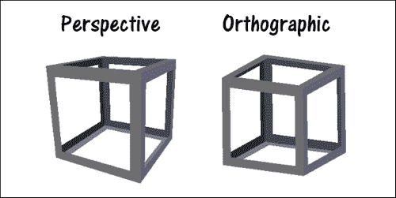

# 第四章。OpenGL 实现

在本章中，我们将涵盖以下内容：

+   在 Qt 中设置 OpenGL

+   你好，世界！

+   渲染 2D 形状

+   渲染 3D 形状

+   OpenGL 中的纹理

+   OpenGL 中的光照和纹理滤镜

+   使用键盘控制移动对象

+   QML 中的 3D 画布

# 介绍

在本章中，我们将学习如何使用**开放图形库**（**OpenGL**），这是一个强大的渲染**应用程序编程接口**（**API**），并将其与 Qt 结合使用。OpenGL 是一个跨语言、跨平台的 API，用于通过计算机的图形芯片内的**图形处理单元**（**GPU**）在屏幕上绘制 2D 和 3D 图形。在本章中，我们将学习 OpenGL 2.x 而不是 3.x，因为对于初学者来说，固定功能管线比较新的可编程管线更容易理解。Qt 支持这两个版本，因此一旦您学会了 OpenGL 渲染的基本概念，切换到 OpenGL 3.x 及以上版本就不会有问题。

# 在 Qt 中设置 OpenGL

在这个示例中，我们将学习如何在 Qt 中设置 OpenGL。

## 操作方法…

1.  首先，让我们通过转到**文件** | **新建文件或项目**来创建一个新的 Qt 小部件应用程序。

1.  接下来，我们将删除`mainwindow.ui`文件，因为我们在本示例中不会使用它。右键单击`mainwindow.ui`文件，然后从下拉菜单中选择**删除文件**。然后，将出现一个消息框并要求您确认。选中**永久删除文件**并按**确定**按钮。

1.  之后，打开您的项目文件（`.pro`），并通过在`QT +=`后面添加`opengl`关键字来将 OpenGL 模块添加到您的项目中，如下所示：

```cpp
QT += core gui opengl
```

1.  您还需要在项目文件中添加另一行，以便在启动时加载 OpenGL 和**GLu**（**OpenGL 实用程序**）库。没有这两个库，您的程序将无法运行：

```cpp
LIBS += -lopengl32 -lglu32
```

1.  然后，打开`mainwindow.h`并从中删除一些内容：

```cpp
#ifndef MAINWINDOW_H
#define MAINWINDOW_H
#include <QMainWindow>

namespace Ui {
  class MainWindow;
}
class MainWindow : public QMainWindow
{
  Q_OBJECT
  public:
    explicit MainWindow(QWidget *parent = 0);
    ~MainWindow();
  private:
    Ui::MainWindow *ui;
};
#endif // MAINWINDOW_H
```

1.  接下来，将以下代码添加到您的`mainwindow.h`中：

```cpp
#ifndef MAINWINDOW_H
#define MAINWINDOW_H
#include <QOpenGLWindow>

class MainWindow : public QOpenGLWindow
{
  Q_OBJECT
  public:
    explicit MainWindow(QWidget *parent = 0);
    ~MainWindow();

  protected:
    virtual void initializeGL();
    virtual void resizeGL(int w, int h);
    virtual void paintGL();
    void paintEvent(QPaintEvent *event);
    void resizeEvent(QResizeEvent *event);
};

#endif // MAINWINDOW_H
```

1.  完成后，我们将继续进行源文件，即`mainwindow.cpp`。我们刚刚添加到头文件中的函数，如`initializeGL()`、`resizeGL()`等，现在可以暂时留空；我们将在下一节中使用这些函数：

```cpp
#include "mainwindow.h"
#include "ui_mainwindow.h"

MainWindow::MainWindow(QWidget *parent):
  QMainWindow(parent),
  ui(new Ui::MainWindow)
MainWindow::MainWindow(QWidget *parent)
{
  ui->setupUi(this);
  setSurfaceType(QWindow::OpenGLSurface);
}

MainWindow::~MainWindow()
{
  delete ui;
}
void MainWindow::initializeGL()
{
  void MainWindow::resizeGL(int w, int h)
{
}
void MainWindow::paintGL()
{
}
void MainWindow::paintEvent(QPaintEvent *event)
{
}
void MainWindow::resizeEvent(QResizeEvent *event)
{
}
```

1.  最后，通过将以下代码添加到您的`main.cpp`文件中，为主窗口设置标题并将其调整大小为 640x480：

```cpp
#include "mainwindow.h"
#include <QApplication>

int main(int argc, char *argv[])
{
  QApplication a(argc, argv);
  MainWindow w;
  w.setTitle("OpenGL Hello World!");
  w.resize(640, 480);
  w.show();
  return a.exec();
}
```

1.  如果您现在编译并运行项目，您将看到一个带有黑色背景的空窗口。不要担心，您的程序现在正在使用 OpenGL 运行！操作方法…

## 它是如何工作的…

必须在项目文件（`.pro`）中添加 OpenGL 模块，以便访问与 OpenGL 相关的头文件，如 QtOpenGL、QOpenGLFunctions 等。我们使用了`QOpenGLWindow`类而不是`QMainWindow`用于主窗口，因为它被设计为轻松创建执行 OpenGL 渲染的窗口，并且与 QOpenGLWidget 相比具有更好的性能，因为它在其小部件模块中没有依赖项。我们必须调用`setSurfaceType(QWindow::OpenGLSurface)`来告诉 Qt 我们更喜欢使用 OpenGL 来将图像渲染到屏幕上，而不是使用 QPainter。`QOpenGLWindow`类为我们提供了几个虚拟函数（`initializeGL()`、`resizeGL()`、`paintGL()`等），方便我们设置 OpenGL 并执行图形渲染。

## 还有更多…

OpenGL 是一个跨语言、跨平台的 API，用于通过计算机的图形芯片内的**图形处理单元**（**GPU**）在屏幕上绘制 2D 和 3D 图形。

计算机图形技术多年来发展迅速，以至于软件行业几乎无法跟上其步伐。2008 年，维护和开发 OpenGL 的 Khronos Group 公司宣布发布 OpenGL 3.0 规范，这在整个行业中引起了巨大的轰动和争议。这主要是因为 OpenGL 3.0 应该废弃 OpenGL API 中的整个固定功能流水线，对于大公司来说，从固定功能流水线一夜之间转换为可编程流水线是不可能的任务。这导致 Khronos Group 同时维护两个不同的 OpenGL 主要版本，即 OpenGL 2.x 和 3.x。

在本章中，我们将学习 OpenGL 2.x 而不是 3.x，因为对于初学者来说，固定功能流水线比可编程流水线更容易理解。对于学习计算机图形编程的基础知识来说，这是非常直接和不容易混淆的。Qt 支持这两个版本，因此一旦学会了 OpenGL 渲染的基本概念，切换到 OpenGL 3.x（及以上版本）应该没有问题。

Qt 在适当时候内部使用 OpenGL。此外，新的 Qt Quick 2 渲染器基于 OpenGL，现在是 Qt 图形提供的核心部分。这使得 OpenGL 与 Qt 的兼容性比其他任何图形 API（如 DirectX）都更好。

# 你好世界！

在这个示例中，我们将学习 OpenGL 的流水线以及如何将简单的形状渲染到窗口中。我们将继续使用上一个示例项目中的示例。

## 操作步骤…

1.  首先，转到`mainwindow.h`并在源代码顶部添加以下头文件：

```cpp
#include <QSurfaceFormat>
#include <QOpenGLFunctions>
#include <QtOpenGL>
#include <GL/glu.h>
```

1.  接下来，在`mainwindow.h`中声明两个私有变量：

```cpp
private:
  QOpenGLContext* context;
  QOpenGLFunctions* openGLFunctions;
```

1.  之后，转到`mainwindow.cpp`并将表面格式设置为兼容性配置文件。我们还将 OpenGL 版本设置为 2.1，并使用我们刚刚声明的格式创建 OpenGL 上下文。然后，使用我们刚刚创建的上下文来访问仅与我们刚刚设置的 OpenGL 版本相关的 OpenGL 函数，通过调用`context->functions()`：

```cpp
MainWindow::MainWindow(QWidget *parent)
{
 setSurfaceType(QWindow::OpenGLSurface);
 QSurfaceFormat format;
 format.setProfile(QSurfaceFormat::CompatibilityProfile);
 format.setVersion(2, 1); // OpenGL 2.1
 setFormat(format);

 context = new QOpenGLContext;
 context->setFormat(format);
 context->create();
 context->makeCurrent(this);

 openGLFunctions = context->functions();
}
```

1.  接下来，我们将开始向`paintGL()`函数中添加一些代码：

```cpp
void MainWindow::paintGL()
{
 // Initialize clear color (cornflower blue)
 glClearColor(0.39f, 0.58f, 0.93f, 1.f);

 // Clear color buffer
 glClear(GL_COLOR_BUFFER_BIT);

 // Render quad
 glBegin(GL_QUADS);
 glVertex2f(-0.5f, -0.5f);
 glVertex2f(0.5f, -0.5f);
 glVertex2f(0.5f, 0.5f);
 glVertex2f(-0.5f, 0.5f);
 glEnd();

 glFlush();
}
```

1.  在`paintEvent()`函数中调用`paintGL()`之前，屏幕上不会出现任何内容：

```cpp
void MainWindow::paintEvent(QPaintEvent *event)
{
 paintGL();
}
```

1.  如果现在编译并运行项目，您应该能够看到一个白色矩形在蓝色背景前被绘制出来：

## 工作原理…

我们必须将 OpenGL 版本设置为 2.1，并将表面格式设置为兼容性配置文件，以便访问在较新版本中不再存在的固定功能流水线。或者，如果要使用 OpenGL 3.x 及以上版本，可以将表面格式设置为`QSurfaceFormat::CoreProfile`。

我们调用了`glClearColor()`和`glClear(GL_COLOR_BUFFER_BIT)`来清除先前的`渲染缓冲区`（或者通俗地说，上一个帧），并用我们提供的颜色填充整个画布。在渲染图像后，我们将重复这一步骤，以便在进行下一帧之前清除整个屏幕。我们调用了`glBegin(GL_QUAD)`来告诉 OpenGL 我们将在屏幕上绘制一个四边形。之后，我们向 OpenGL 提供了所有顶点（或点）的位置，以便它知道如何将四边形放置在屏幕上，通过四次调用`glVertex2f()`，因为四边形只能通过连接四个不同的点来构造。然后，我们调用了`glEnd()`来告诉 OpenGL 我们已经完成了四边形。

在完成屏幕上的图像绘制后，始终调用`glFlush()`，以便 OpenGL 清除内存中的所有不需要的信息，为下一次绘制腾出空间。

最后，在`paintEvent()`函数中必须调用`paintGL()`，否则屏幕上将什么都不会被绘制。就像我们在前几章中学到的那样，所有的绘图都发生在`paintEvent()`函数中，只有在 Qt 认为有必要刷新屏幕时才会调用它。要强制 Qt 更新屏幕，需要手动调用`update()`。

# 渲染 2D 形状

由于我们已经学会了如何在屏幕上绘制第一个矩形，我们将在本节中进一步增强它。我们将采用前面的例子，并从那里继续。

## 如何做...

1.  首先，转到`mainwindow.cpp`中的`paintGL()`函数，并用新代码替换上一个示例中的四边形。这次，我们画了一个四边形和一个三角形：

```cpp
void MainWindow::paintGL()
{
  // Initialize clear color (cornflower blue)
  glClearColor(0.39f, 0.58f, 0.93f, 1.f);

  // Clear color buffer
  glClear(GL_COLOR_BUFFER_BIT);

 glBegin(GL_QUADS);
 glVertex2f(-0.5f, -0.5f);
 glVertex2f(0.5f, -0.5f);
 glVertex2f(0.5f, 0.5f);
 glVertex2f(-0.5f, 0.5f);
 glEnd();

 glBegin(GL_QUADS);
 glColor3f(1.f, 0.f, 0.f); glVertex2f(-0.8f, -0.8f);
 glColor3f(1.f, 1.f, 0.f); glVertex2f(0.3f, -0.8f);
 glColor3f(0.f, 1.f, 0.f); glVertex2f(0.3f, 0.3f);
 glColor3f(0.f, 0.f, 1.f); glVertex2f(-0.8f, 0.3f);
 glEnd();

 glBegin(GL_TRIANGLES);
 glColor3f(1.f, 0.f, 0.f); glVertex2f(-0.4f, -0.4f);
 glColor3f(0.f, 1.f, 0.f); glVertex2f(0.8f, -0.1f);
 glColor3f(0.f, 0.f, 1.f); glVertex2f(-0.1f, 0.8f);
 glEnd();

  glFlush();
}
```

1.  接下来，在`resizeGL()`函数中，添加以下代码来调整视口和正交视图，以便渲染的图像正确地遵循窗口的纵横比：

```cpp
void MainWindow::resizeGL(int w, int h)
{
  // Initialize Projection Matrix
  glMatrixMode(GL_PROJECTION);
  glLoadIdentity();

  glViewport(0, 0, w, h);

  qreal aspectRatio = qreal(w) / qreal(h);
  glOrtho(-1 * aspectRatio, 1 * aspectRatio, -1, 1, 1, -1);
}
```

1.  然后，在`resizeEvent()`函数中，调用`resize()`函数并强制主窗口刷新屏幕：

```cpp
void MainWindow::resizeEvent(QResizeEvent *event)
{
 resizeGL(this->width(), this->height());
 this->update();
}
```

1.  之后，在`initializeGL()`函数中，我们调用`resizeGL()`一次，以便第一个渲染的图像的纵横比是正确的（在任何窗口调整大小事件触发之前）：

```cpp
void MainWindow::initializeGL()
{
 resizeGL(this->width(), this->height());
}
```

1.  完成后，编译并运行程序。你应该会看到类似这样的东西：

## 工作原理...

OpenGL 支持的几何基元类型包括点、线、线条、线环、多边形、四边形、四边形条带、三角形、三角形条带和三角形扇形。在这个例子中，我们画了一个四边形和一个三角形，每个形状都提供了一组顶点和颜色，以便 OpenGL 知道如何渲染形状。彩虹色是通过给每个顶点赋予不同的颜色来创建的。OpenGL 会自动在每个顶点之间插值颜色并在屏幕上显示。稍后渲染的形状将始终出现在其他形状的前面。在这种情况下，三角形稍后被渲染，因此它出现在矩形的前面。

我们需要在每次调整大小时计算主窗口的纵横比，以便渲染的图像不会被拉伸，导致奇怪的外观。在调用`glViewport()`和`glOrtho()`之前，始终通过调用`glMatrixMode()`和`glLoadIdentity()`重置投影矩阵，以便在调整主窗口大小时正确渲染形状。如果不重置投影矩阵，我们将使用上一帧的矩阵，从而产生错误的投影。

### 注意

记得在调整窗口大小时调用`update()`，否则屏幕将不会更新。

# 渲染 3D 形状

在上一节中，我们已经学会了如何在屏幕上绘制简单的 2D 形状。然而，为了充分利用 OpenGL API，我们还需要学习如何使用它来渲染 3D 图像。简而言之，3D 图像只是使用堆叠的 2D 形状创建的一种幻觉，使它们看起来像 3D。

这里的主要成分是深度值，它决定了哪些形状应该出现在其他形状的前面或后面。位于另一个表面后面（深度比另一个形状浅）的基本形状将不会被渲染（或部分渲染）。OpenGL 提供了一种简单的方法来实现这一点，而不需要太多的技术麻烦。

## 如何做...

1.  首先，在你的`mainwindow.h`中添加`QTimer`头文件：

```cpp
#include <QTimer>
```

1.  然后，在你的`MainWindow`类中添加一个私有变量：

```cpp
private:
  QOpenGLContext* context;
  QOpenGLFunctions* openGLFunctions;
 float rotation;

```

1.  我们还在`mainwindow.h`中添加了一个公共槽，以备后用：

```cpp
public slots:
  void updateAnimation();
```

1.  之后，在`mainwindow.cpp`的`initializeGL()`函数中添加`glEnable(GL_DEPTH_TEST)`以启用深度测试：

```cpp
void MainWindow::initializeGL()
{
 //  Enable Z-buffer depth test
 glEnable(GL_DEPTH_TEST);
  resizeGL(this->width(), this->height());
}
```

1.  接下来，我们将修改`resizeGL()`函数，以便使用透视视图而不是正交视图：

```cpp
void MainWindow::resizeGL(int w, int h)
{
  // Set the viewport
  glViewport(0, 0, w, h);
  qreal aspectRatio = qreal(w) / qreal(h);

  // Initialize Projection Matrix
  glMatrixMode(GL_PROJECTION);
  glLoadIdentity();

 glOrtho(-1 * aspectRatio, 1 * aspectRatio, -1, 1, 1, -1);
 gluPerspective(75, aspectRatio, 0.1, 400000000);

 // Initialize Modelview Matrix
 glMatrixMode(GL_MODELVIEW);
 glLoadIdentity();
}
```

1.  之后，我们还需要修改`paintGL()`函数。首先，将`GL_DEPTH_BUFFER_BIT`添加到`glClear()`函数中，因为我们还需要清除上一帧的深度信息，然后再渲染下一帧。然后，删除我们在之前示例中使用的代码，该代码在屏幕上渲染了一个四边形和一个三角形：

```cpp
void MainWindow::paintGL()
{
  // Initialize clear color (cornflower blue)
  glClearColor(0.39f, 0.58f, 0.93f, 1.f);

 // Clear color buffer
 glClear(GL_COLOR_BUFFER_BIT);
 glClear(GL_COLOR_BUFFER_BIT | GL_DEPTH_BUFFER_BIT);

 glBegin(GL_QUADS);
 glColor3f(1.f, 0.f, 0.f); glVertex2f(-0.8f, -0.8f);
 glColor3f(1.f, 1.f, 0.f); glVertex2f(0.3f, -0.8f);
 glColor3f(0.f, 1.f, 0.f); glVertex2f(0.3f, 0.3f);
 glColor3f(0.f, 0.f, 1.f); glVertex2f(-0.8f, 0.3f);
 glEnd();

 glBegin(GL_TRIANGLES);
 glColor3f(1.f, 0.f, 0.f); glVertex2f(-0.4f, -0.4f);
 glColor3f(0.f, 1.f, 0.f); glVertex2f(0.8f, -0.1f);
 glColor3f(0.f, 0.f, 1.f); glVertex2f(-0.1f, 0.8f);
 glEnd();

  glFlush();
}
```

1.  然后，在调用`glFlush()`之前，我们将添加以下代码来绘制一个 3D 立方体：

```cpp
// Reset modelview matrix
glMatrixMode(GL_MODELVIEW);
glLoadIdentity();

// Transformations
glTranslatef(0.0, 0.0, -3.0);
glRotatef(rotation, 1.0, 1.0, 1.0);

// FRONT
glBegin(GL_POLYGON);
  glColor3f(0.0, 0.0, 0.0);
  glVertex3f(0.5, -0.5, -0.5); glVertex3f(0.5, 0.5, -0.5);
  glVertex3f(-0.5, 0.5, -0.5); glVertex3f(-0.5, -0.5, -0.5);
glEnd();

// BACK
glBegin(GL_POLYGON);
  glColor3f(0.0, 1.0, 0.0);
  glVertex3f(0.5, -0.5, 0.5); glVertex3f(0.5, 0.5, 0.5);
  glVertex3f(-0.5, 0.5, 0.5); glVertex3f(-0.5, -0.5, 0.5);
glEnd();

// RIGHT
glBegin(GL_POLYGON);
  glColor3f(1.0, 0.0, 1.0);
  glVertex3f(0.5, -0.5, -0.5); glVertex3f(0.5, 0.5, -0.5);
  glVertex3f(0.5, 0.5, 0.5); glVertex3f(0.5, -0.5, 0.5);
glEnd();

// LEFT
glBegin(GL_POLYGON);
  glColor3f(1.0, 1.0, 0.0);
  glVertex3f(-0.5, -0.5, 0.5); glVertex3f(-0.5, 0.5, 0.5);
  glVertex3f(-0.5, 0.5, -0.5); glVertex3f(-0.5, -0.5, -0.5);
glEnd();

// TOP
glBegin(GL_POLYGON);
  glColor3f(0.0, 0.0, 1.0);
  glVertex3f(0.5, 0.5, 0.5); glVertex3f(0.5, 0.5, -0.5);
  glVertex3f(-0.5, 0.5, -0.5); glVertex3f(-0.5, 0.5, 0.5);
glEnd();

// BOTTOM
glBegin(GL_POLYGON);
  glColor3f(1.0, 0.0, 0.0);
  glVertex3f(0.5, -0.5, -0.5); glVertex3f(0.5, -0.5, 0.5);
  glVertex3f(-0.5, -0.5, 0.5); glVertex3f(-0.5, -0.5, -0.5);
glEnd();
```

1.  完成后，向`MainWindow`类的构造函数中添加一个定时器，如下所示：

```cpp
MainWindow::MainWindow(QWidget *parent)
{
  setSurfaceType(QWindow::OpenGLSurface);
  QSurfaceFormat format;
  format.setProfile(QSurfaceFormat::CompatibilityProfile);
  format.setVersion(2, 1); // OpenGL 2.1
  setFormat(format);

  context = new QOpenGLContext;
  context->setFormat(format);
  context->create();
  context->makeCurrent(this);

  openGLFunctions = context->functions();

 QTimer *timer = new QTimer(this);
 connect(timer, SIGNAL(timeout()), this, SLOT(updateAnimation()));
 timer->start(100);

 rotation = 0;
}
```

1.  最后，每当定时器调用`updateAnimation()`槽时，我们将旋转变量增加 10。我们还手动调用`update()`函数来更新屏幕：

```cpp
void MainWindow::updateAnimation()
{
  rotation += 10;
  this->update();
}
```

1.  如果现在编译并运行程序，您应该会在主窗口中看到一个旋转的立方体！如何做...

## 它是如何工作的...

在任何 3D 渲染中，深度非常重要，因此我们需要通过调用`glEnable(GL_DEPTH_TEST)`在 OpenGL 中启用深度测试功能。当我们清除缓冲区时，我们还必须指定`GL_DEPH_BUFFER_BIT`，以便深度信息也被清除，以便下一幅图像能够正确渲染。

我们使用`gluPerspective()`来设置透视投影矩阵，以便图形看起来具有深度和距离。透视视图的相反是正交视图，这是 OpenGL 中的默认视图，我们在之前的示例中使用过。正交投影是一种平行投影，其中物体看起来是平的，不具有深度和距离的概念：



在这个例子中，我们使用了一个定时器，每 100 毫秒（0.1 秒）增加旋转值 10。然后在将顶点数据提供给 OpenGL 之前，通过调用`glRotatef()`将旋转值应用于立方体。我们还调用了`glTranslatef()`将立方体稍微向后移动，以便它不会太靠近相机视图。

记得手动调用`update()`，以便屏幕得到刷新，否则立方体将不会被动画化。

# OpenGL 中的纹理

OpenGL 允许我们将图像（也称为纹理）映射到 3D 形状或多边形上。这个过程也被称为纹理映射。在这种情况下，Qt 似乎是与 OpenGL 最佳组合，因为它提供了一种简单的方式来加载属于常见格式（BMP、JPEG、PNG、TARGA、TIFF 等）的图像，而不需要自己实现。我们将使用旋转立方体的先前示例，并尝试将其与纹理映射！

## 如何做...

1.  首先，打开`mainwindow.h`并将以下标题添加到其中：

```cpp
#include <QGLWidget>
```

1.  接下来，声明一个数组，用于存储由 OpenGL 创建的纹理 ID。在渲染时我们将使用它：

```cpp
private:
  QOpenGLContext* context;
  QOpenGLFunctions* openGLFunctions;

  float rotation;
 GLuint texID[1];

```

1.  之后，打开`mainwindow.cpp`并将以下代码添加到`initializeGL()`中以加载纹理文件：

```cpp
void MainWindow::initializeGL()
{
  // Enable Z-buffer depth test
  glEnable(GL_DEPTH_TEST);

 // Enable texturing
 glEnable(GL_TEXTURE_2D);

 QImage image("bricks");
 QImage texture = QGLWidget::convertToGLFormat(image);

 glGenTextures(1, &texID[0]);
 glBindTexture(GL_TEXTURE_2D, texID[0]);

 glTexParameteri(GL_TEXTURE_2D, GL_TEXTURE_MIN_FILTER, GL_NEAREST);
 glTexParameteri(GL_TEXTURE_2D, GL_TEXTURE_MAG_FILTER, GL_NEAREST);

 glTexImage2D(GL_TEXTURE_2D, 0, GL_RGBA, texture.width(), texture.height(), 0, GL_RGBA, GL_UNSIGNED_BYTE, texture.bits());

  // Make sure render at the correct aspect ratio
  resizeGL(this->width(), this->height());
}
```

1.  然后，将以下代码添加到`paintGL()`函数中，将纹理应用到 3D 立方体上：

```cpp
glEnable(GL_TEXTURE_2D);
glBindTexture(GL_TEXTURE_2D, texID[0]);

// FRONT
glBegin(GL_POLYGON);
  glColor3f(0.0, 0.0, 0.0);
  glTexCoord2f(0.0f, 0.0f); glVertex3f(0.5, -0.5, -0.5);
  glTexCoord2f(1.0f, 0.0f); glVertex3f(0.5, 0.5, -0.5);
  glTexCoord2f(1.0f, 1.0f); glVertex3f(-0.5, 0.5, -0.5);
  glTexCoord2f(0.0f, 1.0f); glVertex3f(-0.5, -0.5, -0.5);
glEnd();

// BACK
glBegin(GL_POLYGON);
  glColor3f(0.0, 1.0, 0.0);
  glTexCoord2f(1.0f, 0.0f); glVertex3f(0.5, -0.5, 0.5);
  glTexCoord2f(1.0f, 1.0f); glVertex3f(0.5, 0.5, 0.5);
  glTexCoord2f(0.0f, 1.0f); glVertex3f(-0.5, 0.5, 0.5);
  glTexCoord2f(0.0f, 0.0f); glVertex3f(-0.5, -0.5, 0.5);
glEnd();

// RIGHT
glBegin(GL_POLYGON);
  glColor3f(1.0, 0.0, 1.0);
  glTexCoord2f(0.0f, 1.0f); glVertex3f(0.5, -0.5, -0.5);
  glTexCoord2f(0.0f, 0.0f); glVertex3f(0.5, 0.5, -0.5);
  glTexCoord2f(1.0f, 0.0f); glVertex3f(0.5, 0.5, 0.5);
  glTexCoord2f(1.0f, 1.0f); glVertex3f(0.5, -0.5, 0.5);
glEnd();

// LEFT
glBegin(GL_POLYGON);
  glColor3f(1.0, 1.0, 0.0);
  glTexCoord2f(1.0f, 1.0f); glVertex3f(-0.5, -0.5, 0.5);
  glTexCoord2f(0.0f, 1.0f); glVertex3f(-0.5, 0.5, 0.5);
  glTexCoord2f(0.0f, 0.0f); glVertex3f(-0.5, 0.5, -0.5);
  glTexCoord2f(1.0f, 0.0f); glVertex3f(-0.5, -0.5, -0.5);
glEnd();

// TOP
glBegin(GL_POLYGON);
  glColor3f(0.0, 0.0, 1.0);
  glTexCoord2f(1.0f, 0.0f); glVertex3f(0.5, 0.5, 0.5);
  glTexCoord2f(1.0f, 1.0f); glVertex3f(0.5, 0.5, -0.5);
  glTexCoord2f(0.0f, 1.0f); glVertex3f(-0.5, 0.5, -0.5);
  glTexCoord2f(0.0f, 0.0f); glVertex3f(-0.5, 0.5, 0.5);
glEnd();

// Red side - BOTTOM
glBegin(GL_POLYGON);
  glColor3f(1.0, 0.0, 0.0);
  glTexCoord2f(0.0f, 0.0f); glVertex3f( 0.5, -0.5, -0.5);
  glTexCoord2f(1.0f, 0.0f); glVertex3f( 0.5, -0.5, 0.5);
  glTexCoord2f(1.0f, 1.0f); glVertex3f(-0.5, -0.5, 0.5);
  glTexCoord2f(0.0f, 1.0f); glVertex3f(-0.5, -0.5, -0.5);
glEnd();

glDisable(GL_TEXTURE_2D);
```

1.  如果现在编译并运行程序，您应该会看到一个围绕屏幕旋转的砖块立方体！如何做...

## 它是如何工作的...

变量`GLuint texID[1]`是一个数组，用于存储由 OpenGL 在我们调用`glGenTexture()`时生成的纹理 ID，OpenGL 在渲染期间使用它来从内存中分配纹理。在这种情况下，我们将数组的大小设置为`1`，因为在这个示例中我们只使用一个纹理。我们必须告诉 OpenGL 通过调用`glEnable(GL_TEXTURE_2D)`来启用纹理处理，然后再进行与纹理相关的任何操作。我们使用了两个`QImage`类来加载纹理，第一个称为`image`用于加载图像文件，第二个称为`texture`用于将图像转换为 OpenGL 兼容格式。然后我们调用`glGenTextures()`使用 OpenGL 生成一个空纹理，之后我们调用`glBindTexture()`来选择特定的纹理。这一步是必要的，以便之后调用的函数将应用于我们刚刚选择的纹理。

接下来，我们调用了两次`glTexParameteri()`来将纹理缩小和纹理放大设置为点采样。这将告诉 OpenGL 纹理应该如何渲染。之后，我们调用了`glTexImage2D()`来提供由 Qt 加载的纹理文件中的像素信息到我们刚刚创建的空 OpenGL 纹理中。在开始渲染 3D 立方体之前，调用`glEnabled(GL_TEXTURE_2D)`和`glBindTexture()`来启用 OpenGL 中的纹理处理并选择我们想要使用的纹理。然后，在调用`glVertex3f()`之前，我们必须调用`glTexCoord2f()`来告诉 OpenGL 纹理应该如何映射。我们提供纹理的坐标，OpenGL 会为我们解决其余的问题。

完成后，调用`glDisable(GL_TEXTURE_2D)`来禁用纹理处理。

# OpenGL 中的照明和纹理滤镜

在这个示例中，我们将学习如何在 OpenGL 中对我们使用的纹理应用不同类型的滤镜效果，如点采样、双线性插值和三线性插值。

## 如何做...

1.  再次，我们将使用之前的示例，并在旋转的立方体附近添加一个光源。打开`mainwindow.cpp`并将以下代码添加到`initializeGL()`函数中：

```cpp
// Trilinear interpolation
glTexParameterf(GL_TEXTURE_2D, GL_TEXTURE_MIN_FILTER, GL_LINEAR_MIPMAP_LINEAR);
glTexParameterf(GL_TEXTURE_2D, GL_TEXTURE_MAG_FILTER, GL_LINEAR);

glTexParameteri(GL_TEXTURE_2D, GL_GENERATE_MIPMAP, GL_TRUE);

glTexImage2D(GL_TEXTURE_2D, 0, GL_RGBA, texture.width(), texture.height(), 0, GL_RGBA, GL_UNSIGNED_BYTE, texture.bits());

// Enable smooth shading
glShadeModel(GL_SMOOTH);

// Lighting
glEnable(GL_LIGHT1);
GLfloat lightAmbient[]= { 0.5f, 0.5f, 0.5f, 1.0f };
GLfloat lightDiffuse[]= { 1.0f, 1.0f, 1.0f, 1.0f };
GLfloat lightPosition[]= { 3.0f, 3.0f, -5.0f, 1.0f };
glLightfv(GL_LIGHT1, GL_AMBIENT, lightAmbient);
glLightfv(GL_LIGHT1, GL_DIFFUSE, lightDiffuse);
glLightfv(GL_LIGHT1, GL_POSITION, lightPosition);

// Make sure render at the correct aspect ratio
resizeGL(this->width(), this->height());
```

1.  接下来，转到`paintGL()`函数并添加以下代码：

```cpp
glEnable(GL_LIGHTING);

// FRONT
glBegin(GL_POLYGON);
  glNormal3f(0.0f, 0.0f, 1.0f);
  glTexCoord2f(0.0f, 0.0f); glVertex3f(0.5, -0.5, -0.5);
  glTexCoord2f(1.0f, 0.0f); glVertex3f(0.5, 0.5, -0.5);
  glTexCoord2f(1.0f, 1.0f); glVertex3f(-0.5, 0.5, -0.5);
  glTexCoord2f(0.0f, 1.0f); glVertex3f(-0.5, -0.5, -0.5);
glEnd();

// BACK
glBegin(GL_POLYGON);
  glNormal3f(0.0f, 0.0f,-1.0f);
  glTexCoord2f(1.0f, 0.0f); glVertex3f(0.5, -0.5, 0.5);
  glTexCoord2f(1.0f, 1.0f); glVertex3f(0.5, 0.5, 0.5);
  glTexCoord2f(0.0f, 1.0f); glVertex3f(-0.5, 0.5, 0.5);
  glTexCoord2f(0.0f, 0.0f); glVertex3f(-0.5, -0.5, 0.5);
glEnd();

// RIGHT
glBegin(GL_POLYGON);
  glNormal3f(0.0f, 1.0f, 0.0f);
  glTexCoord2f(0.0f, 1.0f); glVertex3f(0.5, -0.5, -0.5);
  glTexCoord2f(0.0f, 0.0f); glVertex3f(0.5, 0.5, -0.5);
  glTexCoord2f(1.0f, 0.0f); glVertex3f(0.5, 0.5, 0.5);
  glTexCoord2f(1.0f, 1.0f); glVertex3f(0.5, -0.5, 0.5);
glEnd();

// LEFT
glBegin(GL_POLYGON);
  glNormal3f(0.0f,-1.0f, 0.0f);
  glTexCoord2f(1.0f, 1.0f); glVertex3f(-0.5, -0.5, 0.5);
  glTexCoord2f(0.0f, 1.0f); glVertex3f(-0.5, 0.5, 0.5);
  glTexCoord2f(0.0f, 0.0f); glVertex3f(-0.5, 0.5, -0.5);
  glTexCoord2f(1.0f, 0.0f); glVertex3f(-0.5, -0.5, -0.5);
glEnd();

// TOP
glBegin(GL_POLYGON);
  glNormal3f(1.0f, 0.0f, 0.0f);
  glTexCoord2f(1.0f, 0.0f); glVertex3f(0.5, 0.5, 0.5);
  glTexCoord2f(1.0f, 1.0f); glVertex3f(0.5, 0.5, -0.5);
  glTexCoord2f(0.0f, 1.0f); glVertex3f(-0.5, 0.5, -0.5);
  glTexCoord2f(0.0f, 0.0f);glVertex3f(-0.5, 0.5, 0.5);
glEnd();

// Red side - BOTTOM
glBegin(GL_POLYGON);
  glNormal3f(-1.0f, 0.0f, 0.0f);
  glTexCoord2f(0.0f, 0.0f); glVertex3f(0.5, -0.5, -0.5);
  glTexCoord2f(1.0f, 0.0f); glVertex3f(0.5, -0.5, 0.5);
  glTexCoord2f(1.0f, 1.0f); glVertex3f(-0.5, -0.5, 0.5);
  glTexCoord2f(0.0f, 1.0f); glVertex3f(-0.5, -0.5, -0.5);
glEnd();

glDisable(GL_LIGHTING);
```

1.  如果现在编译并运行程序，您应该看到照明效果的应用！

## 它是如何工作的...

在固定管线中，向场景中添加光源非常容易。首先，我们需要选择 OpenGL 要使用的着色模型。在我们的情况下，我们通过调用`glShaderModel(GL_SMOOTH)`选择了平滑着色模型。或者，您也可以通过调用`glShaderModel(GL_FLAT)`选择平面着色模型：


之后，通过调用`glEnable(GL_LIGHT1)`来启用 OpenGL 中的第一个光源。由于固定管线中允许的光源数量有限，光源的名称都是静态的：`GL_LIGHT1`，`GL_LIGHT2`，`GL_LIGHT3`等等。接下来，我们创建了三个数组，用于存储环境光的颜色、漫射光的颜色和漫射光的位置。环境光是环境照明，影响整个场景，没有位置。另一方面，漫射光具有位置和光影响区域。然后，我们通过调用`glLightfv()`函数将这些信息提供给 OpenGL。然后，在`paintGL()`中，在开始渲染立方体之前，我们必须通过调用`glEnable(GL_LIGHTING)`来启用照明。如果没有它，你将看不到应用于立方体的任何照明效果。

除此之外，我们还需要为立方体的每个表面添加一个表面法线值。表面法线指示表面朝向何处，并用于光照计算。完成后，不要忘记通过调用`glDisable(GL_LIGHTING)`来禁用照明。

除了向场景添加光照外，我们还通过调用`glTexParameteri()`将纹理过滤设置为三线性插值，使纹理看起来更加平滑。您还可以尝试其他两种过滤，点过滤和双线性过滤，只需取消注释代码即可。

以下图像显示了三种不同类型的过滤之间的区别：


双线性和三线性过滤需要 mipmap 才能工作，我们可以通过调用`glTexParameteri(GL_TEXTURE_2D, GL_GENERATE_MIPMAP, GL_TRUE)`来要求 OpenGL 生成。Mipmaps 是预先计算的、优化的纹理序列，每个纹理都是同一图像的逐渐降低分辨率的表示。当远离摄像机移动时，OpenGL 会将物体的纹理切换到分辨率较低的 mipmap，这对于避免视觉伪影非常有效。

## 还有更多…

在 3D 场景中，光照是一个非常重要的方面，它有助于定义物体的 3D 形状。光不仅使面对光的表面变得更亮，而且还使其他被阻挡的表面变暗。

在 OpenGL 中，至少在固定功能管道中，您只能向场景中添加有限数量的灯光。灯光的数量受图形芯片的限制-有些支持多达四个灯光，有些支持多达八个，有些支持多达 16 个。然而，由于固定功能管道正在逐渐被淘汰，人们开始使用可编程管道，这个问题已经得到解决。在可编程管道中，您可以在场景中拥有任意数量的灯光；然而，光照模型将需要完全由您在着色器中编码，这并不是一项容易的任务。

在固定功能管道中，如果要添加的灯光多于图形芯片支持的数量，可以关闭远离摄像机视图的灯光，并只打开靠近摄像机视图的一些灯光。这种方法的缺点是，例如在迷宫中行走时，可能会看到灯光不断闪烁。

# 使用键盘控制移动对象

在本主题中，我们将学习如何使用键盘控制在 OpenGL 中移动对象。Qt 提供了一种简单的方法来检测键盘事件，即使用虚拟函数`keyPressEvent()`和`keyReleaseEvent()`。我们将使用之前的示例并进行扩展。

## 如何做…

1.  打开`mainwindow.h`并声明两个名为`moveX`和`moveZ`的浮点数：

```cpp
private:
  QOpenGLContext* context;
  QOpenGLFunctions* openGLFunctions;

  float rotation;
  GLuint texID[1];

 float moveX;
 float moveZ;

```

1.  之后，声明`keyPressEvent()`函数，如下所示：

```cpp
public:
  explicit MainWindow(QWidget *parent = 0);
  ~MainWindow();

  void keyPressEvent(QKeyEvent *event);

```

1.  然后，打开`mainwindow.cpp`并设置我们刚刚声明的两个变量的默认值：

```cpp
MainWindow::MainWindow(QWidget *parent)
{
  setSurfaceType(QWindow::OpenGLSurface);

  QSurfaceFormat format;
  format.setProfile(QSurfaceFormat::CompatibilityProfile);
  format.setVersion(2, 1); // OpenGL 2.1
  setFormat(format);

  context = new QOpenGLContext;
  context->setFormat(format);
  context->create();
  context->makeCurrent(this);

  openGLFunctions = context->functions();

  QTimer *timer = new QTimer(this);
  connect(timer, SIGNAL(timeout()), this, SLOT(updateAnimation()));
  timer->start(100);

  rotation = 0;

 moveX = 0;
 moveZ = 0;
}
```

1.  接下来，我们将实现`keyPressEvent()`函数：

```cpp
void MainWindow::keyPressEvent(QKeyEvent *event)
{
  if (event->key() == Qt::Key_W)
  {
    moveZ -= 0.2;
  }

  if (event->key() == Qt::Key_S)
  {
    moveZ += 0.2;
  }

  if (event->key() == Qt::Key_A)
  {
    moveX -= 0.2;
  }

  if (event->key() == Qt::Key_D)
  {
    moveX += 0.2;
  }
}
```

1.  之后，在绘制 3D 立方体之前调用`glTranslatef()`，并将`moveX`和`moveZ`都放入函数中。此外，我们禁用了旋转，以便更容易看到移动：

```cpp
// Transformations
glTranslatef(0.0, 0.0, -3.0);
glRotatef(rotation, 1.0, 1.0, 1.0);
glTranslatef(moveX, 0.0, moveZ);

// Texture mapping
glEnable(GL_TEXTURE_2D);
glBindTexture(GL_TEXTURE_2D, texID[0]);

glEnable(GL_LIGHTING);
```

1.  如果现在编译并运行程序，您应该能够通过按*W*、*A*、*S*和*D*来移动立方体：

## 它是如何工作的...

基本上，我们在这里所做的是在按下键时添加或减去`moveX`和`moveZ`的值。在`keyPressEvent()`中，我们检查键盘按下的按钮是否是*W*、*A*、*S*或*D*。然后，我们相应地从变量中添加或减去 0.2。要获取 Qt 使用的键名称的完整列表，请访问[`doc.qt.io/qt-5/qt.html#Key-enum`](http://doc.qt.io/qt-5/qt.html#Key-enum)。

当我们按住相同的键不放时，Qt 会在一段时间后重复按键事件。键盘输入间隔在不同的操作系统之间有所不同。您可以通过调用`QApplication::setKeyboardInterval()`来设置间隔，但这可能在每个操作系统中都不起作用。我们在绘制立方体之前调用了`glTranslatef(moveX, 0.0, moveZ)`，这会在按下*W*、*A*、*S*或*D*时移动立方体。

# QML 中的 3D 画布

在这个示例中，我们将学习如何使用 Qt 强大的 QML 脚本语言呈现 3D 图像。

## 如何做…

1.  让我们通过在 Qt Creator 中创建一个新项目来开始这个示例。这一次，我们将创建**Qt Canvas 3D 应用程序**，而不是我们在所有先前示例中选择的其他选项：

1.  之后，Qt Creator 会询问您是否要创建一个基于`three.js`的项目。保持选项选中，然后按**下一步**按钮继续：

1.  创建项目后，您会注意到一些 JavaScript（`.js`）文件已经添加到项目的资源中。这是正常的，因为 Qt Canvas 3D 应用程序使用 JavaScript 和 WebGL 技术在屏幕上呈现 3D 图像。在这种情况下，它正在运行一个基于 WebGL 的渲染库称为 three.js，这使我们的编程工作与编写纯 WebGL 代码相比更简单和更容易：

1.  接下来，向我们的项目资源中添加一个图像文件，因为我们将在此示例中使用它。通过在**项目**窗格中右键单击`qml.qrc`，然后选择**在编辑器中打开**，以使用 Qt Creator 打开`qml.qrc`。一旦 Qt Creator 打开了资源文件，点击**添加**按钮，然后点击**添加文件**按钮，然后从计算机中选择要使用的图像文件。在我的情况下，我添加了一个名为`bricks.png`的图像，它将用作我们的 3D 对象的表面纹理：

1.  之后，使用 Qt Creator 打开`glcode.js`。您会看到文件中已经有大量的代码编写。这基本上是使用`three.js`库在屏幕上渲染一个简单的 3D 立方体。您可以立即构建项目并运行它，看看它的样子。但是，我们将稍微更改代码以自定义其输出。

1.  在`initializeGL（）`函数中，我们将向场景添加一个定向光，加载刚刚添加到项目资源中的纹理文件，然后将纹理应用于定义 3D 立方体表面属性的材质。此外，我们将通过将其在所有维度上的比例设置为`3`，使立方体的比例略微变大：

```cpp
function initializeGL(canvas) {
  scene = new THREE.Scene();
  camera = new THREE.PerspectiveCamera(75, canvas.width / canvas.height, 0.1, 1000);
  camera.position.z = 5;

 var directionalLight = new THREE.DirectionalLight(0xffffff);
 directionalLight.position.set(1, 1, 1).normalize();
 scene.add(directionalLight);

 var texture = THREE.ImageUtils.loadTexture('bricks.jpg');

 var material = new THREE.MeshBasicMaterial({ map: texture });
 var cubeGeometry = new THREE.BoxGeometry(3, 3, 3);
  cube = new THREE.Mesh(cubeGeometry, material);
  cube.rotation.set(0.785, 0.785, 0.0);
  scene.add(cube);

  renderer = new THREE.Canvas3DRenderer(
    { canvas: canvas, antialias: true, devicePixelRatio: canvas.devicePixelRatio });
  renderer.setSize(canvas.width, canvas.height);
}
```

1.  然后，在`paintGL（）`函数中，添加一行额外的代码来在渲染场景之前旋转 3D 立方体：

```cpp
function paintGL(canvas) {
  cube.rotation.y -= 0.005;
  renderer.render(scene, camera);
}
```

1.  我个人觉得窗口大小有点太大，所以我还在`main.qml`文件中更改了窗口的宽度和高度：

```cpp
import QtQuick 2.4
import QtCanvas3D 1.0
import QtQuick.Window 2.2
import "glcode.js" as GLCode

Window {
  title: qsTr("Qt_Canvas_3D")
 width: 480
 height: 320
  visible: true

  Canvas3D {
    id: canvas3d
    anchors.fill: parent
    focus: true

    onInitializeGL: {
      GLCode.initializeGL(canvas3d);
    }

    onPaintGL: {
      GLCode.paintGL(canvas3d);
    }

    onResizeGL: {
      GLCode.resizeGL(canvas3d);
    }
  }
}
```

1.  完成后，让我们构建并运行项目。您应该能够在屏幕上看到一个带有砖纹理的 3D 立方体，缓慢旋转：

## 工作原理...

最初，`three.js`是一个跨浏览器的 JavaScript 库/ API，它使用 WebGL 技术在 Web 浏览器中显示动画的 3D 计算机图形。然而，Qt Canvas 3D 也使用 Web 技术，特别是 WebGL 技术，来呈现 3D 图像，就像在 Web 浏览器上一样。这意味着不仅`three.js`在 Qt Canvas 3D 上受到支持，而且所有基于 WebGL 技术的不同类型的库都将在 Qt Canvas 3D 上无缝运行。但是，Qt Canvas 3D 仅适用于基于 QML 的项目，不适用于 C ++。

### 注意

如果您有兴趣了解更多关于`three.js`的信息，请访问他们的网站[`threejs.org`](http://threejs.org)。
