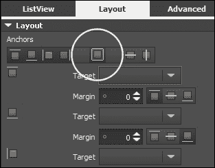
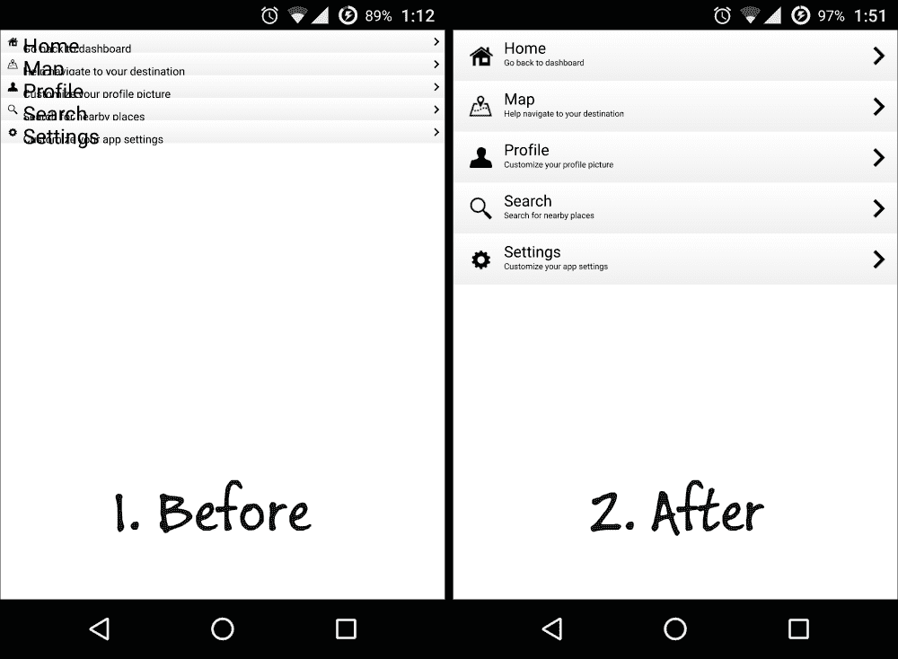

# 第五章。使用 Qt5 构建触摸屏应用程序

在本章中，我们将涵盖以下内容：

+   为移动应用程序设置 Qt

+   使用 QML 设计基本用户界面

+   触摸事件

+   QML 中的动画

+   使用模型视图显示信息

+   集成 QML 和 C++

# 介绍

Qt 不仅是 PC 平台的跨平台软件开发工具包，还支持 iOS 和 Android 等移动平台。Qt 的开发人员在 2010 年推出了 Qt Quick，它提供了一种简单的方式来构建高度动态的自定义用户界面，用户可以轻松地通过最少的编码创建流畅的过渡和效果。Qt Quick 使用一种称为**QML**的声明性脚本语言，类似于 Web 开发中使用的 JavaScript 语言。高级用户还可以在 C++中创建自定义函数，并将其移植到 Qt Quick 中以增强其功能。目前，Qt Quick 支持 Windows、Linux、Mac、iOS 和 Android 等多个平台。

# 为移动应用程序设置 Qt

在这个例子中，我们将学习如何在 Qt Quick 中设置我们的 Qt 项目，并使其能够构建和导出到移动设备。

## 操作步骤...

1.  首先，让我们通过转到**文件** | **新建文件或新建项目**来创建一个新项目。然后，将弹出一个窗口供您选择项目模板。选择**Qt Quick 应用程序**并单击**选择**按钮：

1.  之后，插入项目名称并选择项目位置。单击**下一步**按钮，它将要求您选择项目所需的最低 Qt 版本。请确保选择计算机上存在的版本，否则您将无法正确运行它。完成后，单击**下一步**按钮继续。

1.  然后，Qt Creator 将询问您要为项目使用哪个**工具**。这些“工具”基本上是您可以用来为不同平台编译项目的不同编译器。由于我们正在为移动平台开发应用程序，因此我们将启用 Android 工具（或者如果您使用 Mac，则启用 iOS 工具）以构建和导出应用程序到移动设备。请注意，如果您首次使用 Android 工具，则需要配置它，以便 Qt 可以找到 Android SDK 的目录。完成后，单击**下一步**：

1.  创建项目后，Qt Creator 将自动打开项目中的一个文件，名为`main.qml`。您将在屏幕上看到类似于这样的东西，与您通常的 C/C++项目非常不同：

```cpp
    import QtQuick 2.3
    import QtQuick.Window 2.2

    Window {
      visible: true

      MouseArea {
        anchors.fill: parent
        onClicked: {
          Qt.quit();
        }
      }

      Text {
        text: qsTr("Hello World")
        anchors.centerIn: parent
      }
    }
    ```

1.  现在通过单击 Qt Creator 左下角的绿色箭头按钮构建和运行项目。如果将默认工具设置为**桌面**，将弹出一个窗口，看起来像这样：

1.  我们可以通过转到**项目**界面并选择要使用的工具来在不同的工具之间切换。您还可以管理计算机上所有可用的工具，或者从**项目**界面向项目添加新的工具：

1.  如果这是您第一次构建和运行项目，您需要在**构建**设置下为 Android 工具创建一个模板。一旦单击了**创建模板**按钮，Qt 将生成运行应用程序所需的所有文件。如果您不打算在项目中使用 Gradle，请禁用**将 Gradle 文件复制到 Android 目录**选项。否则，在尝试编译和部署应用程序到移动设备时可能会遇到问题：

1.  创建模板后，单击**运行**按钮，现在您应该看到一个弹出窗口，询问应该导出到哪个设备：

1.  选择当前连接到计算机的设备，然后按**确定**按钮。等待一会儿，直到项目构建完成，然后您应该在移动设备上看到类似于这样的东西：

## 工作原理...

Qt Quick 应用程序项目与表单应用程序项目有很大不同。您将大部分时间编写 QML 脚本，而不是编写 C/C++代码。

构建和导出应用程序到 Android 平台需要**Android 软件开发工具包**（**SDK**）、**Android 本机开发工具包**（**NDK**）、**Java 开发工具包**（**JDK**）和**Apache Ant**。或者，您也可以使用 Gradle 代替 Apache Ant 来构建您的 Android 工具包。您只需要启用**使用 Gradle 代替 Ant**选项，并提供 Qt Gradle 的安装路径。请注意，Android Studio 目前不受 Qt Creator 支持：


如果您在 Android 设备上运行应用程序，请确保已启用 USB 调试模式。要启用 USB 调试模式，您需要先在 Android 设备上启用开发者选项，方法是转到**设置** | **关于手机**，然后点击**版本号**七次。之后，转到**设置** | **开发者选项**，您将在菜单中看到**Android 调试**选项。启用该选项后，您现在可以将应用程序导出到设备进行测试。

要构建 iOS 平台，您需要在 Mac 上运行 Qt Creator，并确保最新的 XCode 也安装在您的 Mac 上。

要在 iOS 设备上测试您的应用程序，您需要在 Apple 注册开发者帐户，在开发者门户注册您的设备，并将配置文件安装到 XCode 中，这比 Android 要棘手得多。一旦您从 Apple 获得了开发者帐户，您将获得访问开发者门户的权限。

# 使用 QML 设计基本用户界面

在这个例子中，我们将学习如何使用 Qt Quick Designer 来设计程序的用户界面。

## 如何操作...

1.  首先，创建一个新的 Qt Quick 应用程序项目，就像我们在之前的示例中所做的那样。如果愿意，您也可以使用之前的项目文件。

1.  您将在项目资源中看到两个 QML 文件——`main.qml`和`MainForm.ui.qml`。前者是我们实现应用程序逻辑的地方，后者是我们设计用户界面的地方。我们将从 UI 设计开始，所以让我们打开`MainForm.ui.qml`。一旦被 Qt Creator 打开，您将看到一个与我们在之前章节中使用的完全不同的 UI 编辑器。这个编辑器称为 Qt Quick Designer，专门用于设计 Qt Quick 项目的 UI。该编辑器的组件描述如下：

+   **库**：**库**窗口显示了您可以添加到 UI 画布的所有预定义的 QML 类型。您还可以从**导入**选项卡导入自定义的 Qt Quick 组件并在此处显示它们。

+   **导航器**：**导航器**窗口以树形结构显示当前 QML 文件中的项目。

+   **连接**：您可以使用**连接**窗口中提供的工具将对象连接到信号，为对象指定动态属性，并在两个对象的属性之间创建绑定。

+   **状态**：**状态**窗口显示了项目的不同状态。您可以通过单击**状态**窗口右侧的**+**按钮为项目添加新状态。

+   **画布**：画布是您设计程序用户界面的地方。您可以从**库**窗口将 Qt Quick 组件拖放到画布上，并立即看到它在程序中的外观。

+   **属性**：这是您更改所选项目属性的地方。

1.  在**导航器**窗口下选择**矩形**对象下的所有内容（**mouseArea**和**Text**）并删除它们。

1.  我们将制作一个简单的登录界面。从**库**窗口中，将两个文本小部件拖放到画布上。

1.  将两个文本小部件的文本属性设置为**用户名：**和**密码：**

1.  从**库**窗口中拖动两个矩形到画布上，然后将两个文本输入小部件拖到画布上，并将它们各自作为父级添加到刚刚添加到画布上的矩形上。将矩形的`border`属性设置为`1`，`radius`设置为`5`。然后，将一个文本字段的`echo mode`设置为`Password`。

1.  现在，我们将通过将鼠标区域小部件与矩形和文本小部件组合来手动创建一个按钮小部件。将鼠标区域小部件拖到画布上，然后将矩形和文本小部件拖到画布上，并将它们都作为父级添加到鼠标区域上。将矩形的颜色设置为`#bdbdbd`，然后将其`border`属性设置为`1`，`radius`设置为`5`。然后，将文本设置为`登录`，并确保鼠标区域的大小与矩形相同。

1.  之后，将另一个矩形拖到画布上，作为登录表单的容器，使其看起来整洁。将其`border color`设置为`#5e5858`，`border`属性设置为`2`。然后，将其`radius`属性设置为`5`，使其角看起来有点圆润。

1.  确保我们在上一步中添加的矩形在**导航器**窗口中的层次结构顶部，以便它出现在所有其他小部件后面。您可以通过按位于**导航器**窗口顶部的箭头按钮来排列层次结构中的小部件位置：

1.  接下来，我们将导出三个小部件——鼠标区域和两个文本输入小部件——作为根项目的别名属性，以便以后可以从`main.qml`文件中访问这些小部件。通过单击小部件名称后面的小图标，并确保图标变为**On**状态来导出小部件：

1.  到目前为止，您的 UI 应该看起来像这样：

1.  现在让我们打开`main.qml`。Qt Creator 默认情况下不会在 Qt Quick Designer 中打开此文件，而是会在脚本编辑器中打开。这是因为所有与 UI 设计相关的任务都是在`MainForm.ui.qml`中完成的，而`main.qml`仅用于定义将应用于 UI 的逻辑和函数。但是，您可以通过单击编辑器左侧边栏上的**Design**按钮，使用 Qt Quick Designer 打开它以预览 UI。

1.  在脚本顶部，添加第三行以导入对话框模块到`main.qml`，如下所示：

```cpp
    import QtQuick 2.5
    import QtQuick.Window 2.2
    import QtQuick.Dialogs 1.2
    ```

1.  接下来，用以下代码替换下面的代码：

```cpp
    Window {
      visible: true
      width: 360
      height: 360

      MainForm {
        anchors.fill: parent
        loginButton.onClicked: {
          messageDialog.text = "Username is " + userInput.text + " and password is " + passInput.text
            messageDialog.visible = true
        }
      }

      MessageDialog {
        id: messageDialog
        title: "Fake login"
        text: ""
        onAccepted: {
          console.log("You have clicked the login button")
          Qt.quit()
        }
      }
    }
    ```

1.  在 PC 上构建并运行此程序，当您单击**登录**按钮时，应该会显示一个消息框的简单程序：

## 工作原理…

自 Qt 5.4 以来，引入了一个名为`.ui.qml`的新文件扩展名。QML 引擎处理它就像处理普通的`.qml`文件一样，但禁止在其中编写任何逻辑实现。它用作 UI 定义模板，可以在不同的`.qml`文件中重用。UI 定义和逻辑实现的分离改善了 QML 代码的可维护性，并创建了更好的工作流程。

**Qt Quick - 基本**下的所有小部件都是我们可以使用来混合和匹配并创建新类型小部件的最基本小部件。在前面的示例中，我们学习了如何将三个小部件组合在一起——文本、鼠标区域和矩形，以形成一个按钮小部件。

然而，如果您懒得做，可以通过转到**库**窗口中的**导入**选项卡并单击**<添加导入>**按钮，将预制模块导入到您的 Qt Quick 项目中。然后，从下拉列表中选择要添加到项目中的模块。一旦您在 QML 脚本和 C++编程方面有所进步，还可以创建自己的 Qt Quick 模块：


我们在`main.qml`中导入了`QtQuick.dialogs`模块，并创建了一个消息框，当用户按下**登录**按钮时显示用户填写的用户名和密码，以证明 UI 功能正在工作。如果小部件没有从`MainForm.ui.qml`中导出，我们将无法在`main.qml`中访问其属性。

在这一点上，我们可以将程序导出到 iOS 和 Android，但是在一些具有更高分辨率或更高**每英寸像素密度**（**DPI**）单位的设备上，UI 可能看起来不准确。我们将在本章后面解决这个问题。

# 触摸事件

在这一部分，我们将学习如何使用 Qt Quick 开发在移动设备上运行的触摸驱动应用程序。

## 如何做…

1.  首先，创建一个新的 Qt Quick 应用程序项目。

1.  在 Qt Creator 中，右键单击`qml.qrc`，然后选择**在编辑器中打开**。然后，单击**添加** | **添加文件**，将`tux.png`添加到项目中：

1.  接下来，打开`MainForm.ui.qml`。从**库**窗口将图像小部件拖动到画布上。然后，将图像的源设置为`tux.png`，并将其`fillmode`设置为`PreserveAspectFit`。之后，将其`width`设置为`200`，将其`height`设置为`220`。

1.  确保鼠标区域小部件和图像小部件都通过单击其各自的小部件名称旁边的小图标作为根项目的别名属性导出。

1.  在那之后，通过单击编辑器左侧边栏上的**编辑**按钮切换到脚本编辑器。我们需要将鼠标区域小部件更改为多点触摸区域小部件，如下所示：

```cpp
    MultiPointTouchArea {
      id: touchArea
      anchors.fill: parent
      touchPoints: [
        TouchPoint { id: point1 },
        TouchPoint { id: point2 }
      ]
    }
    ```

1.  我们还将`Image`小部件设置为默认自动放置在窗口中心：

```cpp
    Image {
      id: tux
      x: (window.width / 2) - (tux.width / 2)
      y: (window.height / 2) - (tux.height / 2)
      width: 200
      height: 220
      fillMode: Image.PreserveAspectFit
      source: "tux.png"
    }
    ```

最终的 UI 应该看起来像这样：


1.  完成后，让我们打开`main.qml`。首先清除`MainForm`对象中除`anchors.fill: parent`之外的所有内容，如下所示：

```cpp
    import QtQuick 2.5
    import QtQuick.Window 2.2

    Window {
      visible: true

      MainForm {
        anchors.fill: parent
      }
    }
    ```

1.  在`MainForm`对象中声明几个变量，这些变量将用于重新调整图像小部件。如果您想了解以下代码中使用的`property`关键字的更多信息，请查看本示例末尾的*还有更多…*部分：

```cpp
    property int prevPointX: 0
    property int prevPointY: 0
    property int curPointX: 0
    property int curPointY: 0

    property int prevDistX: 0
    property int prevDistY: 0
    property int curDistX: 0
    property int curDistY: 0

    property int tuxWidth: tux.width
    property int tuxHeight: tux.height
    ```

1.  接下来，我们将定义当手指触摸多点区域小部件时会发生什么。在这种情况下，如果多个手指触摸到多点触摸区域，我们将保存第一个和第二个触摸点的位置。我们还保存图像小部件的宽度和高度，以便以后可以使用这些变量来计算手指开始移动时图像的比例：

```cpp
    touchArea.onPressed:
    {
      if (touchArea.touchPoints[1].pressed)
      {
        if (touchArea.touchPoints[1].x < touchArea.touchPoints[0].x)
          prevDistX = touchArea.touchPoints[1].x - touchArea.touchPoints[0].x
        else
          prevDistX = touchArea.touchPoints[0].x - touchArea.touchPoints[1].x

        if (touchArea.touchPoints[1].y < touchArea.touchPoints[0].y)
          prevDistY = touchArea.touchPoints[1].y - touchArea.touchPoints[0].y
        else
          prevDistY = touchArea.touchPoints[0].y - touchArea.touchPoints[1].y

        tuxWidth = tux.width
        tuxHeight = tux.height
      }
    }
    ```

以下图像显示了当两根手指触摸屏幕时，在触摸区域边界内注册的触摸点的示例。`touchArea`.`touchPoints[0]`是第一个注册的触摸点，`touchArea.touchPoints[1]`是第二个。然后我们计算两个触摸点之间的 X 和 Y 距离，并将它们保存为`prevDistX`和`prevDistY`：


1.  在那之后，我们将定义当我们的手指在屏幕上移动时会发生什么，同时仍然保持与触摸区域的边界接触。在这一点上，我们将使用我们在上一步中保存的变量来计算图像的比例。同时，如果我们检测到只有一个触摸点，那么我们将移动图像而不是改变其比例：

```cpp
    touchArea.onUpdated:{
      if (!touchArea.touchPoints[1].pressed)
      {
        tux.x += touchArea.touchPoints[0].x - touchArea.touchPoints[0].previousX
        tux.y += touchArea.touchPoints[0].y - touchArea.touchPoints[0].previousY
      }
      else
      {
        if (touchArea.touchPoints[1].x < touchArea.touchPoints[0].x)
        curDistX = touchArea.touchPoints[1].x - touchArea.touchPoints[0].x
        else
          curDistX = touchArea.touchPoints[0].x - touchArea.touchPoints[1].x

        if (touchArea.touchPoints[1].y < touchArea.touchPoints[0].y)
          curDistY = touchArea.touchPoints[1].y - touchArea.touchPoints[0].y
        else
          curDistY = touchArea.touchPoints[0].y - touchArea.touchPoints[1].y

          tux.width = tuxWidth + prevDistX - curDistX
          tux.height = tuxHeight + prevDistY - curDistY
      }
    }
    ```

以下图像显示了移动触摸点的示例 - `touchArea.touchPoints[0]`从点 A 移动到点 B，而`touchArea.touchPoints[1]`从点 C 移动到点 D。然后，我们可以通过查看先前的 X、Y 变量与当前变量之间的差异来确定触摸点移动了多少单位：


1.  现在，您可以构建并将程序导出到您的移动设备上。您将无法在不支持多点触摸的平台上测试此程序。一旦程序在支持多点触摸的移动设备（或支持多点触摸的台式机/笔记本电脑）上运行，请尝试两件事：只在屏幕上放一个手指并移动它，以及在屏幕上放两个手指并朝相反方向移动它们。您应该看到的是，如果您只使用一个手指，企鹅将被移动到另一个位置，如果您使用两个手指，它将被放大或缩小：

## 它是如何工作的…

当手指触摸设备的屏幕时，多点触摸区域小部件会触发`onPressed`事件，并在内部数组中注册每个触摸点的位置。我们可以通过告诉 Qt 要访问的触摸点来获取这些数据。第一个触摸点将带有索引号`0`，第二个触摸点将是`1`，依此类推。然后，我们将这些数据保存到变量中，以便以后可以检索它们以计算企鹅图像的缩放。

当一个或多个手指在移动时仍然与屏幕保持接触，多点触摸区域将触发`onUpdate`事件。然后，我们将检查触摸点的数量 - 如果只找到一个触摸点，我们将根据手指移动的距离移动企鹅图像。如果有多个触摸点，我们将比较两个触摸点之间的距离，并将其与我们之前保存的变量进行比较，以确定我们应该如何重新调整图像的大小。


我们还必须检查第一个触摸点是否在第二个触摸点的左侧还是右侧。这样我们就可以防止图像在手指移动的反方向上被缩放，并产生不准确的结果。

至于企鹅的移动，我们将只获取当前触摸位置和上一个触摸位置之间的差异，将其添加到企鹅的坐标中，然后完成。单点触摸事件通常比多点触摸事件简单得多，更直接。

## 还有更多…

在 Qt Quick 中，所有组件都具有内置属性，如宽度、高度、颜色等，默认情况下附加到组件上。但是，Qt Quick 还允许您创建自己的自定义属性，并将其附加到您在 QML 脚本中声明的组件上。对象类型的自定义属性可以通过在 QML 文档中的对象声明之前添加`property`关键字来定义，例如：

```cpp
property int myValue;
```

您还可以使用冒号（`:`）将自定义属性绑定到值，如下所示：

```cpp
property int myValue: 100;
```

要了解 Qt Quick 支持的属性类型的更多信息，请查看此链接：[`doc.qt.io/qt-5/qtqml-typesystem-basictypes.html`](http://doc.qt.io/qt-5/qtqml-typesystem-basictypes.html)

# QML 中的动画

Qt 允许我们在不编写大量代码的情况下轻松地为 UI 组件添加动画。在这个例子中，我们将学习如何通过应用动画使我们程序的 UI 更有趣。

## 如何做…

1.  我们将再次从头开始。因此，在 Qt Creator 中创建一个新的 Qt Quick 应用程序项目，并打开`MainForm.ui.qml`。

1.  转到**库**窗口中的**导入**选项卡，并将一个名为**QtQuick.Controls**的 Qt Quick 模块添加到您的项目中。

1.  之后，您将在**QML 类型**选项卡中看到一个名为**Qt Quick - Controls**的新类别，其中包含许多可以放置在画布上的新小部件。

1.  接下来，将三个按钮小部件拖到画布上，并将它们的高度设置为`45`。然后，转到**属性**窗口上的**布局**选项卡，并为所有三个按钮小部件启用左右锚点。确保锚点的目标设置为**父级**，边距保持为`0`。这将使按钮根据主窗口的宽度水平调整大小。之后，将第一个按钮的*y*值设置为`0`，第二个为`45`，第三个为`90`。UI 现在应该是这样的：

1.  现在，用编辑器打开`qml.qrc`并将`fan.png`添加到项目中：

1.  然后，在画布上添加两个鼠标区域小部件。之后，在画布上拖动一个矩形小部件和一个图像小部件。将矩形和图像作为父级部件添加到我们刚刚添加的鼠标区域上。

1.  将矩形的颜色设置为`#0000ff`，并将`fan.png`应用到图像小部件。您的 UI 现在应该是这样的：

1.  然后，通过单击小部件名称右侧的图标，将`MainForm.ui.qml`中的所有小部件导出为根项目的别名属性：

1.  接下来，我们将为 UI 应用动画和逻辑，但我们不会在`MainForm.ui.qml`中进行。相反，我们将在`main.qml`中完成所有操作。

1.  在`main.qml`中，删除鼠标区域的默认代码，并为窗口添加宽度和高度，以便我们有更多的空间进行预览：

```cpp
    import QtQuick 2.5
    import QtQuick.Window 2.2

    Window {
      visible: true
      width: 480
      height: 550

      MainForm {
        anchors.fill: parent
      }
    }
    ```

1.  之后，在`MainForm`小部件中添加定义按钮行为的代码：

```cpp
    button1 {
      Behavior on y { SpringAnimation { spring: 2; damping: 0.2 } }

      onClicked: {
        button1.y = button1.y + (45 * 3)
      }
    }

    button2 {
      Behavior on y { SpringAnimation { spring: 2; damping: 0.2 } }

      onClicked: {
        button2.y = button2.y + (45 * 3)
      }
    }

    button3 {
      Behavior on y { SpringAnimation { spring: 2; damping: 0.2 } }

      onClicked: {
        button3.y = button3.y + (45 * 3)
      }
    }
    ```

1.  然后，按照`fan`图像和其附加的鼠标区域小部件的行为：

```cpp
    fan {
      RotationAnimation on rotation {
        id: anim01
        loops: Animation.Infinite
        from: 0
        to: -360
        duration: 1000
      }
    }

    mouseArea1 {
      onPressed: {
        if (anim01.paused)
          anim01.resume()
        else
          anim01.pause()
      }
    }
    ```

1.  最后但并非最不重要的是，添加矩形和鼠标区域小部件的行为：

1.  如果现在编译并运行程序，您应该会看到窗口顶部有三个按钮，底部左侧有一个移动的矩形，底部右侧有一个旋转的风扇。如果您点击任何按钮，它们将以流畅的动画略微向下移动。如果您点击矩形，它将从蓝色变为红色。同时，如果您在风扇图像正在动画时点击它，它将暂停动画，如果再次点击它，它将恢复动画：

## 工作原理

Qt 的 C++版本支持的大多数动画元素，如过渡、顺序动画、并行动画等，在 Qt Quick 中也是可用的。如果您熟悉 C++中的 Qt 动画框架，您应该能够很容易地掌握这个。

在这个例子中，我们为所有三个按钮添加了一个弹簧动画元素，它专门跟踪它们各自的*y*轴。如果 Qt 检测到*y*值已经改变，小部件将不会立即跳到新位置，而是进行插值运算，沿着画布移动，并在到达目的地时执行一些摇晃动画，模拟弹簧效果。我们只需写一行代码，剩下的交给 Qt 处理。

至于风扇图像，我们为其添加了旋转动画元素，并将`持续时间`设置为`1000`毫秒，这意味着它将在一秒内完成一次完整的旋转。我们还设置它循环播放动画。当我们点击它附加的鼠标区域小部件时，我们只需调用`pause()`或`resume()`来启用或禁用动画。

接下来，对于矩形小部件，我们为其添加了两个状态，一个称为`BLUE`，一个称为`RED`，每个状态都带有一个在状态改变时将应用于矩形的`颜色`属性。同时，我们为矩形附加的鼠标区域小部件添加了一个顺序动画组，并向组中添加了两个属性动画元素。您还可以混合不同类型的组动画；Qt 可以很好地处理这一点。

# 使用模型视图显示信息

Qt 包括一个模型视图框架，它保持数据组织和管理方式与向用户呈现方式之间的分离。在本节中，我们将学习如何利用模型视图，特别是通过使用列表视图来显示信息，并同时应用我们自己的定制使其看起来漂亮。

## 操作步骤…

1.  创建一个新的 Qt Quick 应用程序项目，并用 Qt Creator 打开`qml.qrc`。将六个图像`home.png`、`map.png`、`profile.png`、`search.png`、`settings.png`和`arrow.png`添加到项目中：

1.  之后，打开`MainForm.ui.qml`。删除画布上的所有默认小部件，并从库窗口的**Qt Quick - Views**类别下拖动一个**列表视图**小部件到画布上。然后，通过单击**布局**窗口中间的按钮，将其**锚点**设置为**填充父级大小**：

1.  接下来，切换到脚本编辑器，因为我们将定义列表视图的外观：

1.  之后，打开`main.qml`并用以下代码替换原代码：

```cpp
    import QtQuick 2.4
    import QtQuick.Window 2.2

    Window {
      visible: true
      width: 480
      height: 480

      MainForm {
        anchors.fill: parent

        MouseArea {
          onPressed: row1.opacity = 0.5
          onReleased: row1.opacity = 1.0
        }
      }
    }
    ```

1.  构建并运行程序，现在您的程序应该是这个样子：

## 工作原理…

Qt Quick 允许我们轻松定制列表视图的每一行外观。`delegate`定义了每一行的外观，而`model`是您存储在列表视图上显示的数据的地方。

在这个例子中，我们在每一行上添加了一个渐变的背景，然后我们还在项目的两侧添加了一个图标、一个标题、一个描述，以及一个鼠标区域小部件，使列表视图的每一行都可以点击。委托是不静态的，因为我们允许模型更改标题、描述和图标，使每一行看起来都是独特的。

在`main.qml`中，我们定义了鼠标区域小部件的行为，当按下时，它的不透明度值会降低一半，释放时会恢复完全不透明。由于所有其他元素，如标题、图标等，都是鼠标区域小部件的子元素，它们也会自动遵循其父小部件的行为，并变得半透明。

此外，我们终于解决了移动设备高分辨率和 DPI 显示问题。这是一个非常简单的技巧——首先，我们定义了一个名为`sizeMultiplier`的变量。`sizeMultiplier`的值是将窗口宽度除以预定义值（例如`480`）的结果，这是我们用于 PC 的当前窗口宽度。然后，将`sizeMultiplier`乘以所有与大小和位置有关的小部件变量，包括字体大小。请注意，在这种情况下，应该使用文本的`pixelSize`属性而不是`pointSize`，这样当乘以`sizeMultiplier`时，您将获得正确的显示。以下截图显示了在移动设备上使用和不使用`sizeMultiplier`时应用的样子：



请注意，一旦您用`sizeMultiplier`变量乘以所有东西，您可能会在编辑器中得到一个混乱的 UI。这是因为编辑器中的`width`变量可能返回为`0`。因此，将`0`乘以`480`，您可能会得到结果`0`，这会使整个 UI 看起来很滑稽。然而，在运行实际程序时，它会看起来很好。如果您想在编辑器中预览 UI，请将`sizeMultiplier`临时设置为`1`。

# 集成 QML 和 C++

Qt 支持在 C++类和 QML 引擎之间进行桥接。这种组合允许开发人员充分利用 QML 的简单性和 C++的灵活性。您甚至可以集成来自外部库的 Qt 不支持的功能，然后将生成的数据传递给 Qt Quick 以在 UI 中显示。在这个例子中，我们将学习如何将我们的 UI 组件从 QML 导出到 C++框架，并在显示在屏幕上之前操纵它们的属性。

## 如何做…

1.  我们将再次从头开始。因此，在 Qt Creator 中创建一个新的 Qt Quick 应用程序项目，并打开`MainForm.ui.qml`。

1.  我们可以保留鼠标区域和文本小部件，但将文本小部件放在窗口底部。将文本小部件的**文本**属性更改为**使用 C++更改此文本**，并将其字体大小设置为`18`。之后，转到**布局**选项卡，并启用**垂直中心锚点**和**水平中心锚点**，以确保它始终位于窗口中间的某个位置，无论如何重新调整窗口。将**垂直中心锚点**的**边距**设置为`120`：

1.  接下来，从**库**窗口将**Rectangle**小部件拖动到画布上，并将其颜色设置为`#ff0d0d`。将其**宽度**和**高度**设置为`200`，并启用垂直和水平中心锚点。之后，将水平中心锚点的**边距**设置为`-14`。您的 UI 现在应该看起来像这样：

1.  完成后，在 Qt Creator 中右键单击项目目录，然后选择**添加新内容**。然后，将弹出一个窗口，让您选择文件模板。选择**C++类**并按**选择…**。之后，它将要求您填写类的信息来定义 C++类。在这种情况下，在**类名**字段中插入**MyClass**，并选择**QObject**作为**基类**。然后，确保**包括 QObject**选项已被选中，现在可以单击**下一步**按钮，然后单击**完成**按钮。现在将创建并添加两个文件—`myclass.h`和`myclass.cpp`—到您的项目中：

1.  现在，打开`myclass.h`并在类构造函数下方添加变量和函数，如下所示：

```cpp
    #ifndef MYCLASS_H
    #define MYCLASS_H
    #include <QObject>

    class MyClass : public QObject
    {
      Q_OBJECT
      public:
        explicit MyClass(QObject *parent = 0);

        // Object pointer
        QObject* myObject;

        // Must call Q_INVOKABLE so that this function can be used in QML
        Q_INVOKABLE void setMyObject(QObject* obj);

      signals:

      public slots:
    };

    #endif // MYCLASS_H
    ```

1.  之后，打开`myclass.cpp`并定义`setMyObject()`函数：

```cpp
    #include "myclass.h"

    MyClass::MyClass(QObject *parent) : QObject(parent)
    {
    }

    void MyClass::setMyObject(QObject* obj)
    {
      // Set the object pointer
      myObject = obj;
    }
    ```

1.  现在可以关闭`myclass.cpp`并打开`main.qml`。在文件顶部添加第三行，导入我们刚在 C++中创建的自定义库：

```cpp
    import QtQuick 2.4
    import QtQuick.Window 2.2
    import MyClassLib 1.0
    ```

1.  然后，在`Window`对象中定义`MyClass`并在`MainForm`对象中调用其函数`setMyObject()`，如下所示：

```cpp
    Window {
      visible: true
      width: 480
      height: 320

      MyClass
      {
        id: myclass
      }

      MainForm {
        anchors.fill: parent
        mouseArea.onClicked: {
          Qt.quit();
        }
        Component.onCompleted:       myclass.setMyObject(messageText);
      }
    }
    ```

1.  最后，打开`main.cpp`并将自定义类注册到 QML 引擎。我们还在这里使用 C++代码更改文本小部件和矩形的属性：

```cpp
    #include <QGuiApplication>
    #include <QQmlApplicationEngine>
    #include <QtQml>
    #include <QQuickView>
    #include <QQuickItem>
    #include <QQuickView>
    #include "myclass.h"

    int main(int argc, char *argv[])
    {
      // Register your class to QML
      qmlRegisterType<MyClass>("MyClassLib", 1, 0, "MyClass");

      QGuiApplication app(argc, argv);

      QQmlApplicationEngine engine;
      engine.load(QUrl(QStringLiteral("qrc:/main.qml")));

      QObject* root = engine.rootObjects().value(0);

      QObject* messageText =     root->findChild<QObject*>("messageText");
      messageText->setProperty("text", QVariant("C++ is now in     control!"));
      messageText->setProperty("color", QVariant("green"));

      QObject* square = root->findChild<QObject*>("square");
      square->setProperty("color", QVariant("blue"));

      return app.exec();
    }
    ```

1.  现在构建和运行程序，您应该看到矩形和文本的颜色与您在 Qt Quick 中定义的完全不同。这是因为它们的属性已被 C++代码更改：

## 它是如何工作的…

QML 旨在通过 C++代码轻松扩展。Qt QML 模块中的类使 QML 对象可以从 C++中加载和操作。

只有从`QObject`基类继承的类才能与 QML 集成，因为它是 Qt 生态系统的一部分。一旦类已经在 QML 引擎中注册，我们就可以从 QML 引擎获取根项目，并使用它来查找我们想要操作的对象。之后，使用`setProperty()`函数来更改小部件的任何属性。

请注意，`Q_INVOKABLE`宏在您打算在 QML 中调用的函数前是必需的。没有它，Qt 不会将函数暴露给 Qt Quick，您将无法调用它。
