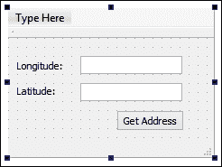

# 第六章。XML 解析变得容易

在本章中，我们将涵盖以下内容：

+   使用流读取器处理 XML 数据

+   使用流写入器写入 XML 数据

+   使用 QDomDocument 类处理 XML 数据

+   使用 QDomDocument 类写入 XML 数据

+   使用 Google 的地理编码 API

# 介绍

XML 是一种名为**可扩展标记语言**的文件格式的文件扩展名，用于以结构化格式存储信息。XML 格式广泛用于 Web 以及其他应用程序。例如，HTML 是用于创建网页的文件格式，基于 XML 格式。从 Microsoft Office 2007 开始，Microsoft Office 使用基于 XML 的文件格式，如`.docx`、`.xlsx`、`.pptx`等。

# 使用流读取器处理 XML 数据

在本节中，我们将学习如何处理从 XML 文件中提取的数据，并使用流读取器进行提取。

## 操作方法…

让我们按照以下步骤创建一个简单的程序，通过读取和处理 XML 文件：

1.  像往常一样，在你想要的位置创建一个新的**Qt Widgets 应用程序**项目。

1.  接下来，打开任何文本编辑器，创建一个看起来像下面这样的 XML 文件，然后将其保存为`scene.xml`：

```cpp
    <?xml version="1.0" encoding="UTF-8"?> 
    <scene>
      <object tag="building">
        <name>Library</name>
        <position>120.0,0.0,50.68</position>
        <rotation>0.0,0.0,0.0</rotation>
        <scale>1.0,1.0,1.0</scale>
      </object>
      <object tag="building">
        <name>Town Hall</name>
        <position>80.2,0.0,20.5</position>
        <rotation>0.0,0.0,0.0</rotation>
        <scale>1.0,1.0,1.0</scale>
      </object>
      <object tag="prop">
        <name>Tree</name>
        <position>10.46,-0.2,80.2</position>
        <rotation>0.0,0.0,0.0</rotation>
        <scale>1.0,1.0,1.0</scale>
      </object>
    </scene>
    ```

1.  接下来，返回到 Qt Creator 并打开`mainwindow.h`。在脚本顶部添加以下头文件，就在`#include <QMainWindow>`之后：

```cpp
    #include <QXmlStreamReader>
    #include <QDebug>
    #include <QFile>
    #include <QFileDialog>
    ```

1.  然后，打开`mainwindow.ui`，从左侧的小部件框中拖动一个**Push Button**到 UI 编辑器中。将按钮的对象名称更改为`loadXmlButton`，显示文本更改为**加载 XML**：

1.  之后，右键单击按钮，选择**转到槽…**。一个窗口将弹出，显示可供选择的信号列表。

1.  选择默认的`clicked()`选项，然后按**确定**按钮。Qt 现在会在你的头文件和源文件中插入一个名为`on_loadXmlButton_clicked()`的槽函数。

1.  现在，将以下代码添加到`on_loadXmlButton_clicked()`函数中：

1.  现在构建并运行项目，你会看到一个弹出的窗口，看起来就像你在第 4 步中制作的窗口：

1.  点击**加载 XML**按钮，你会看到文件选择窗口弹出在屏幕上。选择在第 2 步中创建的 XML 文件，然后按**选择**按钮。之后，你应该在 Qt Creator 的应用程序输出窗口中看到以下调试文本，这表明程序已成功从你刚刚选择的 XML 文件中加载了数据：

## 工作原理…

在这个例子中，我们要做的是使用`QXmlStreamReader`类从 XML 文件中提取和处理数据。想象一下，你正在制作一个电脑游戏，你正在使用 XML 文件来存储游戏场景中所有对象的属性。在这种情况下，XML 格式在以结构化方式存储数据方面发挥着重要作用，这使得数据的提取变得容易。

首先，我们需要在源文件中添加与 XML 相关的类的头文件，这种情况下是`QXmlStreamReader`类。`QXmlStreamReader`内置在 Qt 的核心库中，因此不需要使用任何附加模块，这也意味着它是在 Qt 中处理 XML 数据的推荐类。

一旦我们点击了**加载 XML**按钮，`on_loadXmlButton_clicked()`槽将被调用；这是我们编写处理 XML 数据的代码的地方。

首先，我们使用文件对话框来选择要处理的 XML 文件。然后，将所选文件的文件名和路径发送到`QFile`类中，以打开和读取 XML 文件的文本数据。之后，文件的数据被发送到`QXmlStreamReader`类进行处理。

我们使用 while 循环来读取整个 XML 文件，并检查流读取器处理的每个元素。我们确定元素是开始元素还是结束元素。如果是开始元素，我们将检查元素的名称，以确定元素是否应包含我们需要的任何数据。

然后，我们将提取数据，可以是属性或文本的形式。一个元素可能有多个属性，这就是为什么我们必须循环遍历所有属性并逐个提取它们。

## 还有更多…

除了 Web 浏览器之外，许多商业游戏引擎和交互应用程序也使用 XML 格式来存储游戏场景、网格和产品中使用的其他形式的资产信息。这是因为 XML 格式相对于其他文件格式提供了许多优势，如紧凑的文件大小、高灵活性和可扩展性、易于文件恢复，以及允许用于高效和性能关键应用程序的关系树结构，如搜索引擎、智能数据挖掘服务器、科学模拟等。

让我们简单了解一下 XML 文件的格式。我们将使用前面示例中使用的`scene.xml`，它看起来像这样：

```cpp
<?xml version="1.0" encoding="UTF-8"?> 
<scene>
  <object tag="building">
    <name>Library</name>
    <position>120.0,0.0,50.68</position>
    <rotation>0.0,0.0,0.0</rotation>
    <scale>1.0,1.0,1.0</scale>
  </object>
  <object tag="building">
    <name>Town Hall</name>
    <position>80.2,0.0,20.5</position>
    <rotation>0.0,0.0,0.0</rotation>
    <scale>1.0,1.0,1.0</scale>
  </object>
  <object tag="prop">
    <name>Tree</name>
    <position>10.46,-0.2,80.2</position>
    <rotation>0.0,0.0,0.0</rotation>
    <scale>1.0,1.0,1.0</scale>
  </object>
</scene>
```

在 XML 中，标签是以`<`符号开始，以`>`符号结束的一行标记文本。例如，`<scene>`是一个名为`scene`的标签，`<object>`是一个名为`object`的标签，依此类推。标签有三种类型：

+   开始标签，例如`<scene>`

+   结束标签，例如`</scene>`

+   空元素标签，例如`<scene />`

每当你写一个开始标签时，它必须以一个结束标签结束，否则你的 XML 数据将无效。然而，空元素标签是一个独立的标签，不需要在其后面加上结束标签。

在`scene.xml`的顶部，你会看到一个名为`xml`的标签，其中存储了 XML 格式的版本和编码类型，本例中为 XML 版本 1.0 和 UTF-8（8 位 Unicode）编码。这一行称为 XML 声明，它必须存在于你的任何 XML 文件中以验证其格式。

之后，你会看到带有属性的标签，例如`<object tag="building">`。这意味着`object`标签包含一个名为`tag`的属性，其中包含一个值`building`。你可以在一个标签中放置尽可能多的属性，例如`<object tag="building" color="red" name="LA Community Hospital" coordinate="34.0191757,-118.2567239">`。这些属性中的每一个都存储着可以使用 Qt 轻松检索的独特数据。

除此之外，你还可以在开始标签和结束标签之间存储数据，例如`<name>Town Hall</name>`。然而，这种方法与空元素标签无关，因为它是一个独立的标签，不需要跟随一个关闭标签。因此，你只能在空元素标签中存储属性。

### 注意

要了解更多关于 XML 格式的信息，请访问[`www.w3schools.com/xml`](http://www.w3schools.com/xml)。

# 使用流写入器写入 XML 数据

由于我们已经学会了如何处理从 XML 文件中获取的数据，在前面的示例中，我们将继续学习如何将数据保存到 XML 文件中。我们将继续使用前面的示例并对其进行扩展。

## 如何做…

我们将通过以下步骤学习如何将数据保存到 XML 文件中：

1.  首先，在`mainwindow.ui`中添加另一个按钮，并将其对象名称设置为`saveXmlButton`，标签设置为**保存 XML**：

1.  接下来，右键单击按钮，选择**转到槽…**。一个窗口将弹出，显示可供选择的信号列表。选择`clicked()`选项，然后单击**确定**。一个名为`on_saveXmlButton_clicked()`的信号函数将被 Qt 自动添加到你的`mainwindow.h`和`mainwindow.cpp`文件中：

1.  在`on_saveXmlButton_clicked()`函数中添加以下代码：

```cpp
    QXmlStreamWriter xml;

    QString filename = QFileDialog::getSaveFileName(this, "Save Xml", ".", "Xml files (*.xml)");
    QFile file(filename);
    if (!file.open(QFile::WriteOnly | QFile::Text))
      qDebug() << "Error saving XML file.";
    xml.setDevice(&file);

    xml.setAutoFormatting(true);
    xml.writeStartDocument();

    xml.writeStartElement("contact");
    xml.writeAttribute("category", "Friend");
    xml.writeTextElement("name", "John Doe");
    xml.writeTextElement("age", "32");
    xml.writeTextElement("address", "114B, 2nd Floor, Sterling Apartment, Morrison Town");
    xml.writeTextElement("phone", "0221743566");
    xml.writeEndElement();

    xml.writeStartElement("contact");
    xml.writeAttribute("category", "Family");
    xml.writeTextElement("name", "Jane Smith");
    xml.writeTextElement("age", "24");
    xml.writeTextElement("address", "13, Ave Park, Alexandria");
    xml.writeTextElement("phone", "0025728396");
    xml.writeEndElement();

    xml.writeEndDocument();
    ```

1.  构建并运行程序，你应该会在程序界面上看到一个额外的按钮：

1.  单击**保存 XML**按钮，屏幕上会出现一个保存文件对话框。输入你想要的文件名，然后单击**保存**按钮。

1.  用任何文本编辑器打开你刚保存的 XML 文件。文件的内容应该是这样的：

```cpp
    <?xml version="1.0" encoding="UTF-8"?>
    <contact category="Friend">
      <name>John Doe</name>
      <age>32</age>
      <address>114B, 2nd Floor, Sterling Apartment, Morrison Town</address>
      <phone>0221743566</phone>
    </contact>
    <contact category="Family">
      <name>Jane Smith</name>
      <age>24</age>
      <address>13, Ave Park, Alexandria</address>
      <phone>0025728396</phone>
    </contact>
    ```

## 工作原理…

保存过程与前面示例中加载 XML 文件的过程基本相似。唯一的区别是，我们不再使用`QXmlStreamReader`类，而是改用`QXmlStreamWriter`类。

我们仍然使用文件对话框和`QFile`类来保存 XML 文件。这次，我们必须在将`QFile`类传递给流写入器之前，将打开模式从`QFile::ReadOnly`更改为`QFile::WriteOnly`。

在我们开始向新的 XML 文件写入任何数据之前，我们必须将自动格式设置为`true`，否则将不会有间距；它还会向 XML 文件添加新行和缩进，使其看起来整洁且易于阅读。但是，如果这是你的意图（使用户难以阅读和编辑），那么你可以忽略`setAutoFormatting()`函数。

接下来，通过调用`writeStartDocument()`开始编写 XML 文件，然后写入要保存到文件中的所有元素，最后调用`writeEndDocument()`函数停止写入。

为了使读取过程正常工作，每个元素都必须有开始和结束标记。元素的属性将存储在开始标记中，而文本数据将存储在开始和结束标记之间。

如果我们要写入一个包含一组子元素的元素，那么在写入子元素之前必须调用`writeStartElement()`。然后，在保存所有子元素后，调用`writeEndElement()`来关闭该组并添加结束标记。`writetextElement()`函数会自动为您添加结束标记，因此您不必担心这个。

您可以调用`writeAttribute()`函数向元素添加属性。对于特定元素，您可以添加任意数量的属性。

# 使用`QDomDocument`类处理 XML 数据

Qt 允许多种方式解析 XML 数据，包括我们在前面示例中介绍的常见方法。这一次，我们将学习如何使用另一个名为`QDomDocument`的类从 XML 文件中读取数据。

## 操作步骤…

使用`QDomDocument`类处理 XML 数据非常简单：

1.  首先，我们需要通过打开项目（`.pro`）文件并在`core`和`gui`后面添加文本`xml`来将 XML 模块添加到我们的项目中，如下所示：

```cpp
    QT += core gui xml
    ```

1.  然后，就像我们在本章的第一个示例中所做的那样，创建一个用户界面，上面有一个按钮，上面写着**加载 XML**：

1.  之后，右键单击按钮，选择**转到槽…**，然后选择`clicked()`选项。按下**确定**按钮，Qt 将在您的源代码中添加一个槽函数。

1.  转到`mainwindow.h`并添加以下头文件，以便我们可以使用这些类：

```cpp
    #include <QDomDocument>
    #include <QDebug>
    #include <QFile>
    #include <QFileDialog>
    ```

1.  接下来，转到`mainwindow.cpp`并插入以下代码到按钮的`clicked()`槽函数中：

1.  现在编译并运行程序。单击**加载 XML**按钮，然后选择第一个示例中使用的 XML 文件。你应该会看到以下输出：

## 工作原理…

与`QXmlStreamReader`相比，`QDomDocument`类在加载或保存 XML 数据时不太直接。然而，`QDomDocument`通过确保每个元素都递归地链接到其相应的父元素，就像树结构一样，以严格的方式来完成。与`QXmlStreamReader`不同，`QDomDocument`允许我们在稍后的时间保存数据到之前创建的元素中。

由于`QDomDocument`不是 Qt 核心库的一部分，我们必须手动将 XML 模块添加到我们的项目中。否则，我们将无法访问`QDomDocument`和与之相关的其他类。

首先，我们加载 XML 文件并提取其内容到`QDomDocument`类。然后，我们获取其文档元素，它充当根文档，并获取其直接子元素。然后，我们将每个子节点转换为`QDomElement`并获取它们的标签名称。

通过检查标签名称，我们能够确定我们从每个元素中期望的数据类型。由于这是具有标签名称`object`的第一层元素，我们不期望从中获取任何数据；我们再次重复第 3 步，但这一次，我们将在具有标签名称`object`的元素上执行此操作，并获取其所有直接子元素，这意味着文档元素的孙元素。

同样，通过检查标签名称，我们能够知道我们从其子元素中期望什么数据。如果标签名称与我们期望的匹配（在本例中为`name`、`position`、`rotation`、`scale`），那么我们可以通过调用`QDomElement::text()`获取其数据。

# 使用`QDomDocument`类编写 XML 数据

在这个例子中，我们将学习如何使用`QDomDocument`类将数据写入 XML 文件。我们将继续上一个例子，并添加一些内容。

## 如何做…

要学习如何使用`QDomDocument`类将数据保存到 XML 文件中，请执行以下操作：

1.  首先，将第二个按钮添加到 UI 中，名为**保存 XML**：

1.  右键单击**保存 XML**按钮，然后选择**转到槽…**。然后，选择**clicked()**选项并单击**确定**。现在将在源文件中添加一个新的`clicked()`槽函数。

1.  之后，在按钮的`clicked()`槽函数中编写以下代码：

1.  现在编译并运行程序，然后单击**保存 XML**按钮。在保存文件对话框中输入所需的文件名，然后单击**保存**。

1.  使用任何文本编辑器打开您在第 4 步中保存的 XML 文件，您应该会看到类似于以下内容：

```cpp
    <!DOCTYPE contact>
    <contact category="Family">
      <name>John Doe</name>
      <age>32</age>
      <address>114B, 2nd Floor, Sterling Apartment, Morrisontown</address>
      <phone>0221743566</phone>
    </contact>
    <contact category="Friend">
      <name>John Doe</name>
      <age>32</age>
      <address>114B, 2nd Floor, Sterling Apartment, Morrisontown</address>
      <phone>0221743566</phone>
    </contact>
    ```

## 它是如何工作的…

与上一个例子类似，我们首先初始化文件对话框并声明一个`QDomDocument`对象。

然后，通过调用`QDomDocument::createElement()`创建根元素。从`QDomDocument`创建的任何元素都不会自动成为其直接子元素，除非我们将新创建的元素附加为其子元素。

要创建`QDomDocument`的孙元素，只需将新创建的元素附加到根元素即可。通过使用`append()`函数，我们可以轻松地将 XML 数据排列成树形结构，而无需费心思考。在我看来，这就是使用`QDomDocument`而不是`QXmlStreamReader`的优势。

然后，我们可以通过调用`QDomElement::setAttribute()`为元素添加属性。我们还可以通过调用`QDomDocument::createTextNode()`创建文本节点，并将其附加到 XML 结构中的任何元素。

在我们完成构造 XML 数据之后，我们可以将所有数据以文本形式输出到`QTextStream`类，并允许其将数据保存到文件中。

# 使用谷歌的地理编码 API

在这个例子中，我们将学习如何使用谷歌的地理编码 API 获取特定位置的完整地址。

## 如何做…

让我们创建一个程序，通过以下步骤利用地理编码 API：

1.  首先，创建一个新的**Qt 小部件应用程序**项目。

1.  接下来，打开`mainwindow.ui`并添加一些文本标签、输入字段和一个按钮，使您的 UI 看起来类似于这样：

1.  之后，打开您的项目（`.pro`）文件，并将网络模块添加到您的项目中。您只需在`core`和`gui`之后添加`network`文本即可完成此操作，如下所示：

```cpp
    QT += core gui network
    ```

1.  然后，打开`mainwindow.h`并在`#include <QMainWindow>`之后的源代码中添加以下头文件：

```cpp
    #include <QDebug>
    #include <QtNetwork/QNetworkAccessManager>
    #include <QtNetwork/QNetworkReply>
    #include <QXmlStreamReader>
    ```

1.  接下来，手动声明一个槽函数并将其命名为`getAddressFinished()`：

```cpp
    private slots:
      void getAddressFinished(QNetworkReply* reply);
    ```

1.  在那之后，声明一个名为`addressRequest`的`private`变量：

```cpp
    private:
      QNetworkAccessManager* addressRequest;
    ```

1.  完成后，再次打开`mainwindow.ui`，右键单击**获取地址**按钮，然后选择**转到槽…**。然后选择**clicked()**选项并按**确定**。槽函数现在将添加到`mainwindow.h`和`mainwindow.cpp`源文件中。

1.  现在，打开`mainwindow.cpp`并将以下代码添加到类构造函数中：

```cpp
    MainWindow::MainWindow(QWidget *parent) :
      QMainWindow(parent),
      ui(new Ui::MainWindow)
    {
      ui->setupUi(this);

      addressRequest = new QNetworkAccessManager();
      connect(addressRequest, SIGNAL(finished(QNetworkReply*)),   SLOT(getAddressFinished(QNetworkReply*)));
    }
    ```

1.  然后，我们将以下代码添加到我们刚刚手动声明的`getAddressFinished()`槽函数中：

```cpp
    void MainWindow::getAddressFinished(QNetworkReply* reply)
    {
      QByteArray bytes = reply->readAll();

      //qDebug() << QString::fromUtf8(bytes.data(), bytes.size());

      QXmlStreamReader xml;
      xml.addData(bytes);

      while(!xml.atEnd())
      {
        if (xml.isStartElement())
        {
          QString name = xml.name().toString();
          //qDebug() << name;

          if (name == "formatted_address")
          {
            QString text = xml.readElementText();
            qDebug() << "Address:" << text;
            return;
          }
        }

        xml.readNext();
      }

      if (xml.hasError())
      {
        qDebug() << "Error loading XML:" << xml.errorString();
        return;
      }

      qDebug() << "No result.";
    }
    ```

1.  最后，将以下代码添加到 Qt 创建的`clicked()`槽函数中：

```cpp
    void MainWindow::on_getAddressButton_clicked()
    {
      QString latitude = ui->latitude->text();
      QString longitude = ui->longitude->text();

      QNetworkRequest request;
      request.setUrl(QUrl("http://maps.googleapis.com/maps/api/geocode/xml?latlng=" + latitude + "," + longitude + "&sensor=false"));
      addressRequest->get(request);
    }
    ```

1.  现在构建并运行程序，您应该能够通过插入经度和纬度值并单击**获取地址**按钮来获取地址：

1.  让我们尝试使用经度`-73.9780838`和纬度`40.6712957`。单击**获取地址**按钮，您将在应用程序输出窗口中看到以下结果：

```cpp
    Address: "180-190 7th Ave, Brooklyn, NY 11215, USA"
    ```

## 它是如何工作的…

我无法告诉您谷歌如何从其后端系统获取地址，但我可以教您如何使用`QNetworkRequest`从谷歌请求数据。基本上，您只需要将网络请求的 URL 设置为我在先前源代码中使用的 URL，并将纬度和经度信息附加到 URL。之后，我们只能等待来自谷歌 API 服务器的响应。

请注意，当向谷歌发送请求时，我们需要指定 XML 作为期望的格式；否则，它可能会返回 JSON 格式的结果。这可以通过在网络请求 URL 中添加`xml`关键字来实现，如下所示：

```cpp
request.setUrl(QUrl("http://maps.googleapis.com/maps/api/geocode/xml?latlng=" + latitude + "," + longitude + "&sensor=false"));
```

当程序从谷歌接收到响应时，将调用`getAddressFinished()`槽函数，我们将能够通过`QNetworkReply`获取谷歌发送的数据。

谷歌通常会以 XML 格式回复一个长文本，其中包含大量我们不需要的数据。我们使用`QXmlStreamReader`来解析数据，因为在这种情况下，我们不必关心 XML 结构的父子关系。

我们只需要在 XML 数据中存储的`formatted_address`元素中的文本。由于有多个名为`formatted_address`的元素，我们只需要找到第一个并忽略其余的。

您还可以通过向谷歌提供地址并从其网络响应中获取位置坐标来进行反向操作。

## 还有更多…

谷歌的地理编码 API 是谷歌地图 API Web 服务的一部分，为您的地图应用程序提供地理数据。除了地理编码 API，您还可以使用他们的位置 API、地理位置 API、时区 API 等来实现您想要的结果。

### 注意

有关谷歌地图 API Web 服务的更多信息，请访问此链接：[`developers.google.com/maps/web-services`](https://developers.google.com/maps/web-services)
