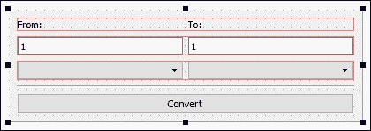

# 第七章 转换库

在本章中，我们将涵盖以下配方：

+   数据转换

+   图像转换

+   视频转换

+   货币转换

# 介绍

我们计算机环境中的数据以各种方式进行编码。有时它可以直接用于某种目的，其他时候需要将其转换为另一种格式以适应任务的上下文。根据源格式和目标格式，数据从一种格式转换为另一种格式的过程也各不相同。有时这个过程可能非常复杂，特别是在处理功能丰富和敏感的数据时，比如图像或视频转换。即使在转换过程中出现小错误，也可能使文件无法使用。

# 数据转换

Qt 提供了一组类和函数，用于轻松地在不同类型的数据之间进行转换。这使得 Qt 不仅仅是一个 GUI 库；它是一个完整的软件开发平台。`QVariant`类，我们将在下面的示例中使用，使 Qt 比 C++标准库提供的类似转换功能更加灵活和强大。

## 如何做…

让我们按照以下步骤学习如何在 Qt 中转换各种数据类型：

1.  打开 Qt Creator，并通过**文件** | **新建文件或项目**创建一个新的**Qt 控制台应用程序**项目：

1.  接下来，打开`main.cpp`并添加以下头文件：

```cpp
#include <QCoreApplication>
#include <QDebug>
#include <QtMath>
#include <QDateTime>
#include <QTextCodec>
#include <iostream>
```

1.  然后，在`main()`函数中，添加以下代码将字符串转换为数字：

```cpp
int numberA = 2;
QString numberB = "5";
qDebug() << "1) " << "2 + 5 =" << numberA + numberB.toInt();
```

1.  之后，我们将把一个数字转换回字符串：

```cpp
float numberC = 10.25;
float numberD = 2;
QString result = QString::number(numberC * numberD);
qDebug() << "2) " <<  "10.25 * 2 =" << result;
```

1.  我们还学习了如何使用`qFloor()`将值向下舍入：

```cpp
float numberE = 10.3;
float numberF = qFloor(numberE);
qDebug() << "3) " << "Floor of 10.3 is" << numberF;
```

1.  然后，通过使用`qCeil()`，我们能够将数字舍入到不小于其初始值的最小整数值：

```cpp
float numberG = 10.3;
float numberH = qCeil(numberG);
qDebug() << "4) " << "Ceil of 10.3 is" << numberH;
```

1.  之后，我们将通过从字符串转换来创建一个日期时间变量：

```cpp
QString dateTimeAString = "2016-05-04 12:24:00";
QDateTime dateTimeA = QDateTime::fromString(dateTimeAString, "yyyy-MM-dd hh:mm:ss");
qDebug() << "5) " << dateTimeA;
```

1.  随后，我们还可以将日期时间变量转换为具有自定义格式的字符串：

```cpp
QDateTime dateTimeB = QDateTime::currentDateTime();
QString dateTimeBString = dateTimeB.toString("dd/MM/yy hh:mm");
qDebug() << "6) " << dateTimeBString;
```

1.  我们可以调用`QString::toUpper()`函数将字符串变量转换为全大写字母：

```cpp
QString hello1 = "hello world!";
qDebug() << "7) " << hello1.toUpper();
```

1.  另一方面，调用`QString::toLower()`将把字符串转换为全小写：

```cpp
QString hello2 = "HELLO WORLD!";
qDebug() << "8) " << hello2.toLower();
```

1.  Qt 提供的`QVariant`类是一种非常强大的数据类型，可以轻松转换为其他类型，程序员无需任何努力：

```cpp
QVariant aNumber = QVariant(3.14159);
double aResult = 12.5 * aNumber.toDouble();
qDebug() << "9) 12.5 * 3.14159 =" << aResult;
```

1.  这演示了如何将单个`QVariant`变量同时转换为多个数据类型，而程序员无需任何努力：

```cpp
qDebug() << "10) ";
QVariant myData = QVariant(10);
qDebug() << myData;
myData = myData.toFloat() / 2.135;
qDebug() << myData;
myData = true;
qDebug() << myData;
myData = QDateTime::currentDateTime();
qDebug() << myData;
myData = "Good bye!";
qDebug() << myData;
```

`main.cpp`中的完整源代码现在看起来是这样的：


1.  现在编译并运行项目，你应该会看到类似这样的东西：

## 它是如何工作的…

Qt 提供的所有数据类型，如`QString`、`QDateTime`、`QVariant`等，都包含使转换到其他类型变得简单和直接的函数。

Qt 还提供了自己的对象转换函数`qobject_cast()`，它不依赖于标准库。它也更兼容 Qt，并且对于在 Qt 的窗口部件类型和数据类型之间进行转换非常有效。

Qt 还为您提供了`QtMath`类，它可以帮助您操作数字变量，例如将浮点数四舍五入或将角度从度转换为弧度。

`QVariant`是一个特殊的类，可以用于存储各种类型的数据。它可以通过检查变量中存储的值来自动确定数据类型。您还可以通过调用单个函数（如`toFloat()`、`toInt()`、`toBool()`、`toChar()`、`toString()`等）轻松地将数据转换为`QVariant`类支持的任何类型。

## 还有更多…

请注意，每次转换都需要计算资源才能实现。尽管现代计算机在处理此类操作时非常快速，但您应该小心，不要一次处理大量操作。如果您正在为复杂计算转换大量变量，可能会显著减慢计算机的速度，因此请尽量仅在必要时转换变量。

# 图像转换

在本节中，我们将学习如何构建一个简单的图像转换器，将图像从一种格式转换为另一种格式。Qt 支持读取和写入不同类型的图像格式，这种支持以外部 DLL 文件的形式出现，这是由于许可问题。但是，您不必担心，因为只要将这些 DLL 文件包含在项目中，它将在不同格式之间无缝工作。有些格式仅支持读取而不支持写入，还有一些支持两者。您可以在[`doc.qt.io/qt-5/qtimageformats-index.html`](http://doc.qt.io/qt-5/qtimageformats-index.html)上查看完整的详细信息。

## 如何操作...

Qt 内置的图像库使图像转换变得非常简单：

1.  首先，打开 Qt Creator 并创建一个新的**Qt Widgets Application**项目。

1.  打开`mainwindow.ui`，并在画布上添加一个行编辑和一个按钮，用于选择图像文件，一个下拉框，用于选择所需的文件格式，以及另一个按钮，用于启动转换过程：

1.  接下来，双击下拉框，将出现一个窗口，用于编辑下拉框。我们将通过点击**+**按钮三次并将项目重命名为`PNG`，`JPEG`和`BMP`，向下拉框列表中添加三个项目：

1.  之后，右键单击其中一个按钮，选择**转到槽...**，然后单击**确定**按钮。然后，槽函数将自动添加到您的源文件中。然后，对另一个按钮重复此步骤：

1.  完成 UI 后，让我们转到源代码。打开`mainwindow.h`，并添加以下头文件：

```cpp
#include <QMainWindow>
#include <QFileDialog>
#include <QMessageBox>
#include <QDebug>
```

1.  然后，打开`mainwindow.cpp`并定义单击**浏览**按钮时会发生什么，即打开文件对话框以选择图像文件：

```cpp
void MainWindow::on_browseButton_clicked()
{
  QString fileName = QFileDialog::getOpenFileName(this, "Open Image", "", "Image Files (*.png *.jpg *.bmp)");
  ui->filePath->setText(fileName);
}
```

1.  最后，我们还定义了单击**转换**按钮时会发生什么：

1.  现在构建并运行程序，我们应该得到一个非常简单的图像转换器，看起来像这样：

## 工作原理...

前面的示例使用了 Qt 中的本机`QImage`类，其中包含可以访问像素数据并操纵它的函数。它还用于通过不同的解压缩方法加载图像文件并提取其数据，具体取决于图像的格式。一旦提取了数据，您就可以对其进行任何操作，例如在屏幕上显示图像，操纵其颜色信息，调整图像大小，或者使用另一种格式对其进行压缩并将其保存为文件。

我们使用`QFileInfo`将文件名与扩展名分开，以便我们可以使用用户从下拉框中选择的新格式修改扩展名。这样，我们可以将新转换的图像保存在与原始图像相同的文件夹中，并自动以相同的文件名保存，只是格式不同。

只要您尝试将图像转换为 Qt 支持的格式，您只需要调用`QImage::save()`。在内部，Qt 会为您解决其余问题，并将图像输出到所选格式。在`QImage::save()`函数中，有一个设置图像质量的参数，另一个用于设置格式。在本例中，我们将两者都设置为默认值，这将以最高质量保存图像，并让 Qt 通过检查输出文件名中的扩展名来确定格式。

## 还有更多...

以下是一些提示。您还可以使用 Qt 提供的`QPdfWriter`类将图像转换为 PDF。基本上，您要做的是将所选图像绘制到新创建的 PDF 文档的布局中，并相应地设置其分辨率。有关`QPdfWriter`类的更多信息，请访问[`doc.qt.io/qt-5/qpdfwriter.html`](http://doc.qt.io/qt-5/qpdfwriter.html)。

# 视频转换

在这个教程中，我们将使用 Qt 和 FFmpeg 创建一个简单的视频转换器，FFmpeg 是一个领先的多媒体框架，是免费开源的。虽然 Qt 确实支持通过其小部件播放视频文件，但目前不支持视频转换。不用担心！通过 Qt 提供的`QProcess`类，您实际上仍然可以通过使您的程序与另一个独立程序合作来实现相同的目标。

## 如何做...

让我们按照以下步骤制作一个简单的视频转换器：

1.  从[`ffmpeg.zeranoe.com/builds`](http://ffmpeg.zeranoe.com/builds)下载 FFmpeg（静态包），并将内容提取到`C:/FFmpeg/`。

1.  然后，打开 Qt Creator，并通过**文件** | **新建文件或项目…**创建一个新的**Qt Widgets 应用程序**项目。

1.  之后，打开`mainwindow.ui`，我们将在程序的用户界面上进行工作。它的用户界面与之前的示例非常相似，只是我们在画布下方添加了一个额外的文本编辑小部件，就在组合框下面：

1.  双击组合框，将出现一个窗口以编辑组合框。我们将通过点击**+**按钮三次向组合框列表添加三个项目，并将项目重命名为`AVI`，`MP4`和`MOV`：

1.  之后，右键单击其中一个按钮，选择**转到槽…**，然后单击**确定**按钮。然后，槽函数将自动添加到您的源文件中。然后，对另一个按钮重复此步骤。

1.  之后，打开`mainwindow.h`，并在顶部添加以下头文件：

```cpp
#include <QMainWindow>
#include <QFileDialog>
#include <QProcess>
#include <QMessageBox>
#include <QScrollBar>
#include <QDebug>
```

1.  然后，在`public`关键字下添加以下指针：

```cpp
public:
  explicit MainWindow(QWidget *parent = 0);
  ~MainWindow();

 QProcess* process;
 QString outputText;
 QString fileName;
 QString outputFileName;

```

1.  除此之外，我们还需要在 Qt 为我们之前创建的两个函数下添加三个额外的槽函数：

```cpp
private slots:
  void on_browseButton_clicked();
  void on_convertButton_clicked();

 void processStarted();
 void readyReadStandardOutput();
 void processFinished();

```

1.  接下来，打开`mainwindow.cpp`，并将以下代码添加到类构造函数中：

```cpp
MainWindow::MainWindow(QWidget *parent) :
  QMainWindow(parent), ui(new Ui::MainWindow)
{
  ui->setupUi(this);

 process = new QProcess(this);
 connect(process, SIGNAL(started()), this, SLOT(processStarted()));
 connect(process,SIGNAL(readyReadStandardOutput()), this,SLOT(readyReadStandardOutput()));
 connect(process, SIGNAL(finished(int)), this, SLOT(processFinished()));
}
```

1.  之后，我们定义了**浏览**按钮点击时会发生什么，这种情况下将打开文件对话框以选择视频文件：

```cpp
void MainWindow::on_browseButton_clicked()
{
  QString fileName = QFileDialog::getOpenFileName(this, "Open Video", "", "Video Files (*.avi *.mp4 *.mov)");
  ui->filePath->setText(fileName);
}
```

1.  然后，我们还定义了**转换**按钮点击时会发生什么。我们在这里做的是将文件名和参数传递给 FFmpeg，然后转换过程将由 FFmpeg 在外部处理：

1.  完成后，我们将告诉我们的程序在转换过程开始时要做什么：

```cpp
void MainWindow::processStarted()
{
  qDebug() << "Process started.";

  ui->browseButton->setEnabled(false);
  ui->fileFormat->setEditable(false);
  ui->convertButton->setEnabled(false);
}
```

1.  接下来，我们将编写在转换过程中由 FFmpeg 返回程序输出时调用的槽函数：

```cpp
void MainWindow::readyReadStandardOutput()
{
  outputText += process->readAllStandardOutput();
  ui->outputDisplay->setText(outputText);

  ui->outputDisplay->verticalScrollBar()->setSliderPosition(ui->outputDisplay->verticalScrollBar()->maximum());
}
```

1.  最后，我们定义了在整个转换过程完成时调用的槽函数：

```cpp
void MainWindow::processFinished()
{
  qDebug() << "Process finished.";

  if (QFile::exists(outputFileName))
  {
    QMessageBox::information(this, "Success", "Video successfully converted.");
  }
  else
  {
    QMessageBox::information(this, "Failed", "Failed to convert video.");
  }

  ui->browseButton->setEnabled(true);
  ui->fileFormat->setEditable(true);
  ui->convertButton->setEnabled(true);
}
```

1.  现在构建和运行项目，您应该得到一个简单但可用的视频转换器：

## 它是如何工作的...

Qt 提供的`QProcess`类用于启动外部程序并与其通信。在这种情况下，我们启动了位于`C:/FFmpeg/bin/`中的`ffmpeg.exe`作为一个进程，并开始与其通信。我们还向它发送了一组参数，告诉它启动时该做什么。我们在这个例子中使用的参数相对基本；我们只告诉 FFmpeg 源图像的路径和输出文件名。有关 FFmpeg 中可用的参数设置的更多信息，请查看[`www.ffmpeg.org/ffmpeg.html`](https://www.ffmpeg.org/ffmpeg.html)。

FFmpeg 不仅可以转换视频文件。您还可以使用它来转换音频文件，甚至图像。有关 FFmpeg 支持的所有格式的更多信息，请查看[`www.ffmpeg.org/general.html#File-Formats`](https://www.ffmpeg.org/general.html#File-Formats)。

除此之外，您还可以通过运行位于`C:/FFmpeg/bin`中的`ffplay.exe`来播放视频或音频文件，或者通过运行`ffprobe.exe`以人类可读的方式打印视频或音频文件的信息。查看 FFmpeg 的完整文档：[`www.ffmpeg.org/about.html`](https://www.ffmpeg.org/about.html)。

## 还有更多…

使用这种方法可以做很多事情。这意味着您不受 Qt 提供的限制，可以通过仔细选择提供所需功能的第三方程序来摆脱这些限制。一个这样的例子是利用市场上提供的仅支持命令行的反病毒扫描程序，如 Avira ScanCL、Panda Antivirus Command Line Scanner、SAV32CLI、ClamavNet 等，制作自己的反病毒 GUI。您可以使用 Qt 构建自己的 GUI，并向反病毒进程发送命令，告诉它该做什么。

# 货币转换

在这个例子中，我们将学习如何使用 Qt 创建一个简单的货币转换器，借助名为`Fixer.io`的外部服务提供商。

## 如何做…

通过以下简单步骤制作一个货币转换器：

1.  我们首先打开 Qt Creator，并从“文件”|“新建文件或项目”中创建一个新的“Qt Widgets 应用程序”项目。

1.  接下来，打开项目文件（`.pro`）并将网络模块添加到我们的项目中：

```cpp
QT += core gui network
```

1.  之后，打开`mainwindow.ui`并从 UI 中删除菜单栏、工具栏和状态栏。

1.  然后，在画布上添加三个水平布局、一条水平线和一个按钮。一旦它们都放好了，左键单击画布，然后点击画布上方的“垂直布局”按钮。然后，将按钮的标签设置为“转换”。UI 现在应该看起来像这样：

1.  之后，将两个标签添加到顶部布局，并将左侧的文本设置为“从：”，右侧的文本设置为“到：”。紧接着，在第二个布局中添加两个行编辑小部件，并将它们的默认值都设置为`1`：

1.  在我们继续向最后一个布局添加最后一批小部件之前，让我们选择右侧的行编辑框，并在属性窗格中启用`readOnly`复选框：

1.  除此之外，我们还必须将其**cursor**属性设置为**Forbidden**，以便用户在鼠标悬停在小部件上时知道它是不可编辑的：

1.  完成后，让我们将两个组合框添加到底部的第三个布局中。现在我们只是把它们留空：

1.  之后，右键单击“转换”按钮，选择“转到槽…”。一个窗口将弹出，要求您选择适当的信号。让我们保持默认的`clicked()`信号作为选择，然后点击“确定”。Qt Creator 现在会自动为您在`mainwindow.h`和`mainwindow.cpp`中添加一个槽函数。

1.  接下来，打开`mainwindow.h`，确保以下头文件被添加到源文件的顶部：

```cpp
#include <QMainWindow>
#include <QDoubleValidator>
#include <QNetworkAccessManager>
#include <QNetworkRequest>
#include <QNetworkReply>
#include <QJsonDocument>
#include <QJsonObject>
#include <QDebug>
#include <QMessageBox>
```

1.  然后，我们需要添加另一个名为`finished()`的槽函数：

```cpp
private slots:
  void on_convertButton_clicked();
 void finished(QNetworkReply* reply);

```

1.  除此之外，我们还需要在`private`标签下添加两个变量：

```cpp
private:
  Ui::MainWindow *ui;
 QNetworkAccessManager* manager;
 QString targetCurrency;

```

1.  完成后，让我们这次打开`mainwindow.cpp`。我们将在类构造函数中的两个组合框中添加几个货币简码。我们还为左侧的行编辑小部件设置了验证器，以便它只能接受数字输入。最后，我们还初始化了网络访问管理器，并将其`finished()`信号连接到我们的`finished()`槽函数。

```cpp
MainWindow::MainWindow(QWidget *parent) :
  QMainWindow(parent), ui(new Ui::MainWindow)
{
  ui->setupUi(this);

  QStringList currencies;
  currencies.push_back("EUR");
  currencies.push_back("USD");
  currencies.push_back("CAD");
  currencies.push_back("MYR");
  currencies.push_back("GBP");

  ui->currencyFrom->insertItems(0, currencies);
  ui->currencyTo->insertItems(0, currencies);

  QValidator *inputRange = new QDoubleValidator(this);
  ui->amountFrom->setValidator(inputRange);

  manager = new QNetworkAccessManager(this);
  connect(manager, SIGNAL(finished(QNetworkReply*)), this, SLOT(finished(QNetworkReply*)));
}
```

1.  之后，我们定义了当用户点击**转换**按钮时会发生什么：

```cpp
void MainWindow::on_convertButton_clicked()
{
  if (ui->amountFrom->text() != "")
  {
    ui->convertButton->setEnabled(false);
    QString from = ui->currencyFrom->currentText();
    QString to = ui->currencyTo->currentText();
    targetCurrency = to;
    QString url = "http://api.fixer.io/latest?base=" + from + "&symbols=" + to;
    QNetworkRequest request= QNetworkRequest(QUrl(url));
    manager->get(request);
  }
  else
  {
    QMessageBox::warning(this, "Error", "Please insert a value.");
  }
}
```

1.  最后，定义`finished()`信号被触发时会发生什么：

```cpp
void MainWindow::finished(QNetworkReply* reply)
{
  QByteArray response = reply->readAll();
  qDebug() << response;
  QJsonDocument jsonResponse = QJsonDocument::fromJson(response);
  QJsonObject jsonObj = jsonResponse.object();
  QJsonObject jsonObj2 = jsonObj.value("rates").toObject();
  double rate = jsonObj2.value(targetCurrency).toDouble();
  if (rate == 0)
    rate = 1;
  double amount = ui->amountFrom->text().toDouble();
  double result = amount * rate;
  ui->amountTo->setText(QString::number(result));
  ui->convertButton->setEnabled(true);
}
```

1.  现在编译并运行项目，您应该能够获得一个简单的货币转换器，看起来像这样：

## 工作原理...

与我们之前看到的示例类似，该示例使用外部程序来实现特定任务，这次我们使用了一个外部服务提供商，他们为我们提供了一个免费且易于使用的开放**应用程序编程接口**（**API**）。

这样，我们就不必考虑检索最新货币汇率的方法。相反，服务提供商已经为我们完成了这项工作，我们只需发送一个礼貌的请求并要求它。然后，我们只需等待他们服务器的响应，并根据我们的意图处理数据。

除了`Fixer.io`（[`fixer.io`](http://fixer.io)）之外，您还可以选择其他几个不同的服务提供商。有些是免费的，但没有任何高级功能；有些提供额外的功能，尽管它们是付费的。其中一些替代方案包括 Open Exchange Rate（[`openexchangerates.org`](https://openexchangerates.org)）、Currencylayer（[`currencylayer.com`](https://currencylayer.com)）、Currency API（[`currency-api.appspot.com`](https://currency-api.appspot.com)）、XE Currency Data API（[`www.xe.com/xecurrencydata`](http://www.xe.com/xecurrencydata)）和 Jsonrates（[`jsonrates.com`](http://jsonrates.com)）。

## 还有更多...

除了货币汇率，您还可以使用这种方法来执行其他更高级的任务，这些任务可能太复杂而无法自行完成，或者除非使用专家提供的服务，否则根本无法访问，例如可编程**短信服务**（**SMS**）和语音服务、网络分析和统计生成、在线支付网关等等。大多数这些服务都不是免费的，但您可以在几分钟内轻松实现这些功能，甚至无需设置服务器基础架构、后端系统等等；这绝对是最便宜和最快的方式，让您的产品快速上线而几乎没有任何麻烦。
