# 第八章：访问数据库

在本章中，我们将涵盖以下内容：

+   为 Qt 设置 SQL 驱动程序

+   连接到数据库

+   编写基本的 SQL 查询

+   使用 Qt 创建登录界面

+   在模型视图上显示来自数据库的信息

+   高级 SQL 查询

# 介绍

SQL 代表结构化查询语言，这是一种特殊的编程语言，用于管理关系数据库管理系统中保存的数据。SQL 服务器是一个设计用来使用多种类型的 SQL 编程语言来管理数据的数据库系统。

### 注意

如果您想了解更多关于 SQL 的信息，请访问此链接：[`www.w3schools.com/sql/sql_intro.asp`](http://www.w3schools.com/sql/sql_intro.asp)。

Qt 支持多种不同类型的 SQL 驱动程序，以插件/附加组件的形式提供。然而，将这些驱动程序集成到您的 Qt 项目中非常容易。我们将在以下示例中学习如何做到这一点。

## 如何做…

在我们深入 Qt 之前，让我们先设置我们的 SQL 服务器：

1.  在为 SQL 设置 Qt 之前，我们需要安装和设置 MySQL 服务器。有许多安装方法。第一种方法是从官方网站[`dev.mysql.com/downloads/mysql/`](http://dev.mysql.com/downloads/mysql/)下载 MySQL 并安装。之后，您还需要从[`dev.mysql.com/downloads/workbench/`](http://dev.mysql.com/downloads/workbench/)安装 MySQL Workbench 来管理您的数据库。

1.  另一种方法是安装一个带有 MySQL 和其他有用应用程序（如 Apache Web 服务器、phpMyAdmin 等）的第三方软件包，所有这些都在一个统一的安装程序中。此类软件包的示例包括 XAMPP，[`sourceforge.net/projects/xampp/`](https://sourceforge.net/projects/xampp/)，以及 AppServ，[`www.appservnetwork.com/en/download/`](https://www.appservnetwork.com/en/download/)。

1.  在此示例中，我们将安装 XAMPP。打开您的 Web 浏览器，从[`sourceforge.net/projects/xampp/`](https://sourceforge.net/projects/xampp/)下载 XAMPP 安装程序，并在计算机上安装它。

1.  安装完 XAMPP 后，打开 XAMPP 控制面板，您应该看到类似于这样的界面：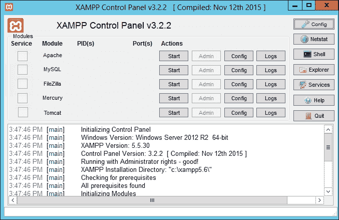

1.  我们需要的是 Apache Web 服务器和 MySQL 数据库服务器。在控制面板上，单击**Apache**和**MySQL**选项旁边的**启动**按钮。

1.  一旦服务器启动，打开您的 Web 浏览器并访问[`localhost/phpmyadmin/`](http://localhost/phpmyadmin/)。您将看到一个名为**PhpMyAdmin**的 Web 界面，看起来像这样：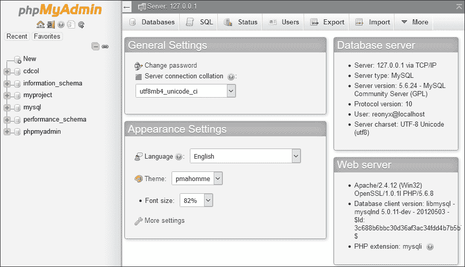

1.  phpMyAdmin 是一个基于 Web 的实用程序，可以帮助您管理 MySQL 数据库，就像官方的 MySQL Workbench 一样。在我看来，phpMyAdmin 更简单，更适合初学者，这就是为什么我建议使用它而不是 MySQL Workbench。

1.  默认情况下，phpMyAdmin 会自动使用默认用户帐户`root`登录到 MySQL，该用户帐户保存在其配置文件中。出于安全原因，我们不想使用它。因此，我们需要做的下一件事是为自己创建一个帐户。转到顶部的**用户**选项卡，一旦在该页面上，单击底部的**添加用户**。在登录信息窗格的字段中输入您想要的用户名和密码。暂时选择**本地**作为**主机**选项。在底部，您将看到与**全局权限**相关的选项；选中**全部检查**选项，然后单击**Go**：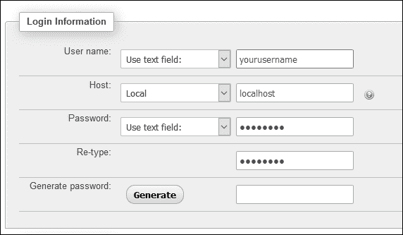

1.  现在您已经创建了用户帐户，请转到 XAMPP 控制面板，单击 Apache 和 MySQL 的**停止**。然后，单击**Apache**列上的**Config**按钮，并选择**phpMyAdmin（config.inc.php）**选项。之后，`config.inc.php`文件将以您选择的文本编辑器打开。

1.  在`config.inc.php`中搜索以下行，并将单词`config`更改为`cookie`：

```cpp
$cfg['Servers'][$i]['auth_type'] = 'config';
$cfg['Servers'][$i]['auth_type'] = 'cookie';
```

1.  之后，通过单击**启动**按钮再次启动 Apache 和 MySQL。这样，我们强制 phpMyAdmin 重新加载其配置并应用更改。再次从 Web 浏览器转到 phpmyAdmin，这次应该会在屏幕上显示登录界面：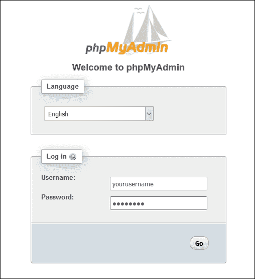

1.  登录到 phpMyAdmin，然后单击侧边栏上的**新建**链接：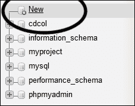

1.  输入您想要的数据库名称，然后按**创建**按钮。创建完成后，数据库名称将显示在侧边栏上。单击数据库名称，将带您到另一个页面，显示消息**数据库中找不到表**。在消息下方，您可以通过填写所需的表名和表的列数来创建您的第一个数据表：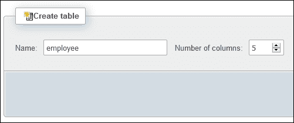

1.  单击**Go**按钮后，您将被带到另一个页面，您将在其中设置要创建的新表。在本例中，我们创建了一个包含五列数据的`employee`表：`id`、`name`、`age`、`gender`和`married`：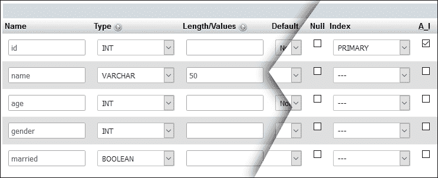

1.  完成后，单击**保存**，现在您将能够在侧边栏上看到`employee`表名。我们已成功安装了 MySQL 并设置了我们的第一个数据库和数据表。

1.  之后，我们需要从 phpMyAdmin 向数据库插入数据，以便我们能够在下一个示例中检索它。在`employee`表中单击**插入**选项卡；然后将带您到另一个页面，用于向`employee`表中插入新数据：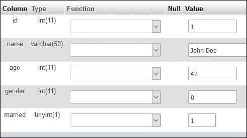

1.  接下来，我们将继续为我们的 Qt 项目设置 SQL 驱动程序。基本上，您只需要转到 Qt 安装文件夹，然后查找`sqldrivers`文件夹。例如，我的位于`C:\Qt\5.5\mingw492_32\plugins\sqldrivers`。

1.  将整个`sqldrivers`文件夹复制到项目的构建目录中。您可以删除与您正在运行的 SQL 服务器不相关的 DLL 文件。在我们的情况下，由于我们使用的是 MySQL 服务器，我们可以删除除了`qsqlmysql.dll`和`qsqlmysqld.dll`之外的所有内容。带有后面带有字母`d`的 DLL 文件仅用于调试构建，而另一个用于发布构建。将这些 DLL 文件放在各自的构建目录中，例如，调试构建的`builds/debug/sqldrivers/qsqlmysqld.dll`和发布构建的`builds/release/sqldrivers/qsqlmysql.dll`。

1.  在上一步提到的 DLL 文件是使 Qt 能够与不同类型的 SQL 架构进行通信的驱动程序。您可能还需要 SQL 客户端库的 DLL 文件才能使驱动程序正常工作。在我们的情况下，我们需要`libmysql.dll`位于与我们程序可执行文件相同的目录中。您可以从 MySQL 的安装目录获取它，或者从官方网站[`dev.mysql.com/downloads/connector/cpp/`](https://dev.mysql.com/downloads/connector/cpp/)下载 Connector/C++包。

## 工作原理…

Qt 为我们提供了 SQL 驱动程序，以便我们可以轻松地连接到不同类型的 SQL 服务器，而无需自己实现它们。

目前，Qt 官方支持 SQLite、MySQL、ODBC 和 PostgreSQL。作为受支持架构之一的分支的 SQL 架构，例如 MariaDB（MySQL 的一个分支），可能仍然与 Qt 兼容，而不会出现太多问题。

如果您使用的架构不受 Qt 支持，您仍然可以通过使用 QNetworkAccessManager 向后端脚本（如 PHP、ASP、JSP 等）发送 HTTP 请求来间接地与您的 SQL 数据库进行交互，然后后端脚本可以与数据库进行通信。

如果您只需要一个简单的基于文件的数据库，并且不打算使用基于服务器的数据库，那么 SQLite 是一个很好的选择。

# 连接到数据库

在本教程中，我们将学习如何使用 Qt 的 SQL 模块连接到我们的 SQL 数据库。

## 操作方法…

在 Qt 中连接到 SQL 服务器非常简单：

1.  首先，打开 Qt Creator 并创建一个新的**Qt Widgets Application**项目。

1.  打开你的项目文件（`.pro`）并将 SQL 模块添加到你的项目中，就像这样：

```cpp
QT += core gui sql
```

1.  接下来，打开`mainwindow.ui`并将七个标签小部件、一个组合框和一个复选框拖到画布上。将四个标签的文本属性设置为`Name:`，`Age:`，`Gender:`和`Married:`。然后，将其余的`objectName`属性设置为`name`，`age`，`gender`和`married`。对于前四个标签，不需要设置对象名称，因为它们仅用于显示目的：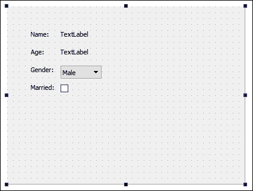

1.  之后，打开`mainwindow.h`并在`QMainWindow`头文件下添加以下头文件：

```cpp
#include <QMainWindow>
#include <QtSql>
#include <QSqlDatabase>
#include <QSqlQuery>
#include <QDebug>

```

1.  然后，打开`mainwindow.cpp`并在类构造函数中插入以下代码：

```cpp
MainWindow::MainWindow(QWidget *parent) :
  QMainWindow(parent), ui(new Ui::MainWindow)
{
  ui->setupUi(this);

 QSqlDatabase db = QSqlDatabase::addDatabase("QMYSQL");
 db.setHostName("127.0.0.1");
 db.setUserName("yourusername");
 db.setPassword("yourpassword");
 db.setDatabaseName("databasename");

 if (db.open())
 {
 QSqlQuery query;
 if (query.exec("SELECT name, age, gender, married FROM employee"))
 {
 while (query.next())
 {
 qDebug() << query.value(0) << query.value(1) << query.value(2) << query.value(3);

 ui->name->setText(query.value(0).toString());
 ui->age->setText(query.value(1).toString());
 ui->gender->setCurrentIndex(query.value(2).toInt());
 ui->married->setChecked(query.value(3).toBool());
 }
 }
 else
 {
 qDebug() << query.lastError().text();
 }

 db.close();
 }
 else
 {
 qDebug() << "Failed to connect to database.";
 }
}
```

1.  现在编译和运行你的项目，你应该会得到类似以下的结果：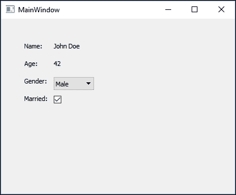

## 它是如何工作的...

上一个例子向你展示了如何使用从 SQL 模块派生的`QSqlDatabase`类连接到你的 SQL 数据库。如果没有将模块添加到 Qt 项目中，你将无法访问与 SQL 相关的任何类。

我们必须告诉 Qt 我们正在运行哪个 SQL 架构，当调用`addDatabase()`函数时提到它。Qt 支持的选项有 QSQLITE、QMYSQL、QMYSQL3、QODBC、QODBC3、QPSQL 和 QPSQL7

如果遇到错误消息说**QSqlDatabase: QMYSQL driver not loaded**，那么你应该再次检查 DLL 文件是否放在正确的目录中。

我们可以通过`QSqlQuery`类将我们的 SQL 语句发送到数据库，并等待它返回结果，通常是你请求的数据或由于无效语句而产生的错误消息。

如果有任何来自数据库服务器的数据，它将全部存储在`QSqlQuery`类中。你只需要在`QSqlQuery`类上进行`while`循环，检查所有现有记录，并通过调用`value()`函数检索它们。

# 编写基本的 SQL 查询

在上一个例子中，我们编写了我们的第一个 SQL 查询，涉及`SELECT`语句。这一次，我们将学习如何使用其他一些 SQL 语句，比如`INSERT`，`UPDATE`和`DELETE`。

## 如何做...

让我们创建一个简单的程序，通过以下步骤演示基本的 SQL 查询命令：

1.  我们可以使用之前的项目文件，但有一些需要更改的地方。首先，打开`mainwindow.ui`，用行编辑小部件替换名称和年龄的标签。然后，在画布上添加三个按钮，并将它们命名为**更新**，**插入**和**删除**：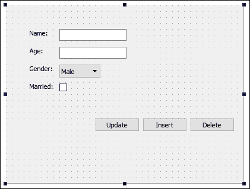

1.  之后，打开`mainwindow.h`并在私有继承下添加以下变量：

```cpp
private:
  Ui::MainWindow *ui;
 QSqlDatabase db;
 bool connected;
 int currentID;

```

1.  接下来，打开`mainwindow.cpp`并转到类构造函数。它与上一个例子基本相同，只是我们将数据库连接状态存储在名为`connected`的布尔变量中，并且还获取来自数据库的数据的 ID 并将其存储到名为`currentID`的整数变量中：

```cpp
MainWindow::MainWindow(QWidget *parent) :
  QMainWindow(parent), ui(new Ui::MainWindow)
{
  ui->setupUi(this);

  db = QSqlDatabase::addDatabase("QMYSQL");
  db.setHostName("127.0.0.1");
  db.setUserName("yourusername");
  db.setPassword("yourpassword");
  db.setDatabaseName("databasename");

  connected = db.open();

  if (connected)
  {
    QSqlQuery query;
    if (query.exec("SELECT id, name, age, gender, married FROM employee"))
    {
      while (query.next())
      {
        currentID = query.value(0).toInt();
        ui->name->setText(query.value(1).toString());
        ui->age->setText(query.value(2).toString());
        ui->gender->setCurrentIndex(query.value(3).toInt());
        ui->married->setChecked(query.value(4).toBool());
      }
    }
    else
    {
      qDebug() << query.lastError().text();
    }
  }
  else
  {
    qDebug() << "Failed to connect to database.";
  }
}
```

1.  然后，转到`mainwindow.ui`，右键单击我们在步骤 1 中添加到画布上的一个按钮。选择**转到槽...**，然后单击**确定**。在另一个按钮上重复这些步骤，现在你应该看到三个槽函数被添加到你的`mainwindow.h`和`mainwindow.cpp`中：

```cpp
private slots:
  void on_updateButton_clicked();
  void on_insertButton_clicked();
  void on_deleteButton_clicked();
```

1.  之后，打开`mainwindow.cpp`，我们将声明当点击**更新**按钮时程序将做什么：

```cpp
void MainWindow::on_updateButton_clicked()
{
  if (connected)
  {
    if (currentID == 0)
    {
      qDebug() << "Nothing to update.";
    }
    else
    {
      QString id = QString::number(currentID);
      QString name = ui->name->text();
      QString age = ui->age->text();
      QString gender = QString::number(ui->gender->currentIndex());
      QString married = QString::number(ui->married->isChecked());

      qDebug() << "UPDATE employee SET name = '" + name + "', age = '" + age + "', gender = " + gender + ", married = " + married + " WHERE id = " + id;

      QSqlQuery query;
      if (query.exec("UPDATE employee SET name = '" + name + "', age = '" + age + "', gender = " + gender + ", married = " + married + " WHERE id = " + id))
      {
        qDebug() << "Update success.";
      }
      else
      {
        qDebug() << query.lastError().text();
      }
    }
  }
  else
  {
    qDebug() << "Failed to connect to database.";
  }
}
```

1.  完成后，我们将继续声明**插入**按钮被点击时会发生什么：

```cpp
void MainWindow::on_insertButton_clicked()
{
  if (connected)
  {
    QString name = ui->name->text();
    QString age = ui->age->text();
    QString gender = QString::number(ui->gender->currentIndex());
    QString married = QString::number(ui->married->isChecked());

    qDebug() << "INSERT INTO employee (name, age, gender, married) VALUES ('" + name + "','" + age + "'," + gender + "," + married + ")";

    QSqlQuery query;
    if (query.exec("INSERT INTO employee (name, age, gender, married) VALUES ('" + name + "','" + age + "'," + gender + "," + married + ")"))
    {
      currentID = query.lastInsertId().toInt();
      qDebug() << "Insert success.";
    }
    else
    {
      qDebug() << query.lastError().text();
    }
  }
  else
  {
    qDebug() << "Failed to connect to database.";
  }
}
```

1.  之后，我们还声明了**删除**按钮被点击时会发生什么：

```cpp
void MainWindow::on_deleteButton_clicked()
{
  if (connected)
  {
    if (currentID == 0)
    {
      qDebug() << "Nothing to delete.";
    }
    else
    {
      QString id = QString::number(currentID);
      qDebug() << "DELETE FROM employee WHERE id = " + id;
      QSqlQuery query;
      if (query.exec("DELETE FROM employee WHERE id = " + id))
      {
        currentID = 0;
        qDebug() << "Delete success.";
      }
      else
      {
        qDebug() << query.lastError().text();
      }
    }
  }
  else
  {
    qDebug() << "Failed to connect to database.";
  }
}
```

1.  最后，在类析构函数中调用`QSqlDatabase::close()`以正确终止程序退出前的 SQL 连接：

```cpp
MainWindow::~MainWindow()
{
 db.close();
  delete ui;
}
```

1.  现在编译并运行程序，您应该能够从数据库中选择默认数据；然后您可以选择更新或从数据库中删除它。您还可以通过单击**插入**按钮将新数据插入到数据库中。您可以使用 phpMyAdmin 来检查数据是否被正确修改：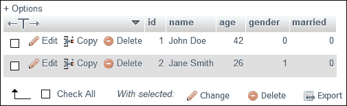

## 工作原理…

在向数据库发送 SQL 查询之前，检查数据库是否连接是非常重要的。因此，我们将状态保存在一个变量中，并在发送任何查询之前使用它进行检查。然而，对于长时间保持打开的复杂程序，不建议使用固定变量，因为数据库在这些时间段内可能会断开连接，固定变量可能不准确。在这种情况下，最好通过调用`QSqlDatabase::isOpen()`来检查实际状态。

`currentID`变量用于保存从数据库中获取的当前数据的 ID。当您想要更新数据或从数据库中删除数据时，这个变量对于让数据库知道您要更新或删除的数据至关重要。如果您正确设置了数据库表，MySQL 将把每个数据项视为一个唯一条目，因此在保存新数据时，可以确保不会产生重复的 ID。

在将新数据插入到数据库后，我们调用`QSqlQuery::lastInsertId()`来获取新数据的 ID，并将其保存为`currentID`变量，以便它成为我们可以从数据库中更新或删除的当前数据。

在使用它们在 Qt 中之前，先在 phpMyAdmin 上测试您的 SQL 查询是一个很好的习惯。您可以立即发现您的 SQL 语句是正确还是错误，而不是等待项目构建，然后尝试，然后再次重建。作为程序员，我们必须以最有效的方式工作。努力工作，聪明工作。

# 使用 Qt 创建登录界面

在这个教程中，我们将学习如何运用我们的知识，使用 Qt 和 MySQL 创建一个功能性的登录界面。

## 操作步骤…

通过以下步骤创建您的第一个功能性登录界面：

1.  首先，打开一个网页浏览器，转到 phpMyAdmin。我们将创建一个名为`user`的新数据表，如下所示：

1.  接下来，将我们的第一条数据插入到新创建的表中，并将`employeeID`设置为现有员工数据的 ID。这样，我们创建的用户帐户将与其中一个员工的数据相关联：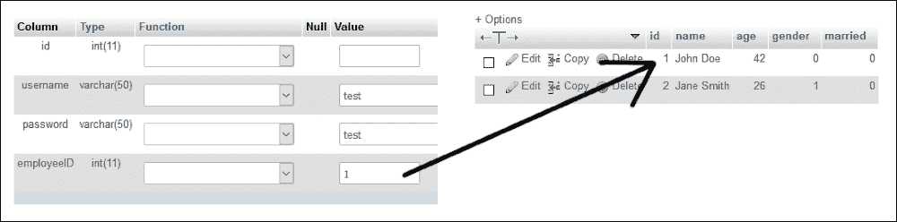

1.  之后，打开 Qt Creator 并创建一个新的**Qt Widgets Application**项目。我们将从`mainwindow.ui`开始。首先，在画布上放置一个堆叠窗口，并确保它包含两个页面。然后，设置堆叠窗口中的两个页面如下：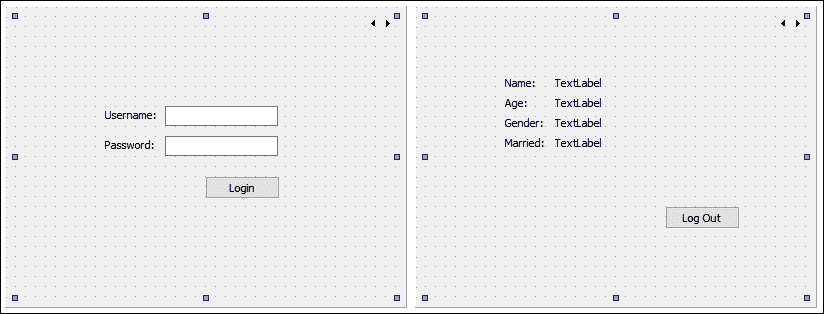

1.  然后，在堆叠窗口的第一页，单击窗口顶部的**编辑标签顺序**按钮，以便我们可以调整程序中窗口部件的顺序：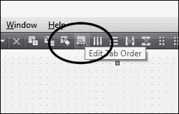

1.  单击**编辑标签顺序**按钮后，您将看到画布上每个部件顶部出现了一些数字。确保数字看起来像这样。否则，单击数字以更改它们的顺序。我们只对堆叠窗口的第一页进行此操作；第二页保持原样即可：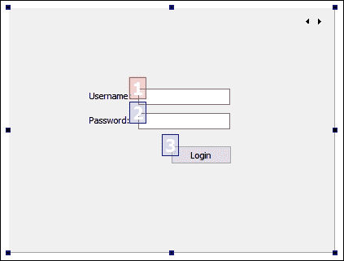

1.  接下来，右键单击**登录**按钮，选择**转到槽…**。然后，确保选择**clicked()**选项并按**确定**。Qt 将在项目源文件中为您创建一个槽函数。同样的步骤也要对**登出**按钮进行操作。

1.  然后，打开`mainwindow.h`，在`#include <QMainWindow>`后添加以下头文件：

```cpp
#include <QMainWindow>
#include <QtSql>
#include <QSqlDatabase>
#include <QSqlQuery>
#include <QMessageBox>
#include <QDebug>

```

1.  之后，在`mainwindow.h`中添加以下变量：

```cpp
private:
  Ui::MainWindow *ui;
 QSqlDatabase db;

```

1.  完成后，让我们打开`mainwindow.cpp`，并将以下代码放入类构造函数中：

```cpp
MainWindow::MainWindow(QWidget *parent) :
  QMainWindow(parent),
  ui(new Ui::MainWindow)
{
  ui->setupUi(this);
 ui->stackedWidget->setCurrentIndex(0);
 db = QSqlDatabase::addDatabase("QMYSQL");
 db.setHostName("127.0.0.1");
 db.setUserName("yourusername");
 db.setPassword("yourpassword");
 db.setDatabaseName("databasename");

 if (!db.open())
 {
 qDebug() << "Failed to connect to database.";
 }
}
```

1.  之后，我们将定义**Login**按钮被点击时会发生什么：

```cpp
void MainWindow::on_loginButton_clicked()
{
  QString username = ui->username->text();
  QString password = ui->password->text();

  QSqlQuery query;
  if (query.exec("SELECT employeeID from user WHERE username = '" + username + "' AND password = '" + password + "'"))
  {
    if (query.size() > 0)
    {
      while (query.next())
      {
        QString employeeID = query.value(0).toString();
        QSqlQuery query2;
        if (query2.exec("SELECT name, age, gender, married FROM employee WHERE id = " + employeeID))
        {
          while (query2.next())
          {
            QString name = query2.value(0).toString();
            QString age = query2.value(1).toString();
            int gender = query2.value(2).toInt();
            bool married = query2.value(3).toBool();
            ui->name->setText(name);
            ui->age->setText(age);

            if (gender == 0)
              ui->gender->setText("Male");
            else
              ui->gender->setText("Female");

            if (married)
              ui->married->setText("Yes");
            else
              ui->married->setText("No");

            ui->stackedWidget->setCurrentIndex(1);
          }
        }
      }
    }
    else
    {
      QMessageBox::warning(this, "Login failed", "Invalid username or password.");
    }
  }
  else
  {
    qDebug() << query.lastError().text();
  }
}
```

1.  然后，我们还定义了**Log Out**按钮被点击时会发生什么：

```cpp
void MainWindow::on_logoutButton_clicked()
{
  ui->stackedWidget->setCurrentIndex(0);
}
```

1.  最后，在主窗口关闭时关闭数据库：

```cpp
MainWindow::~MainWindow()
{
  db.close();

  delete ui;
}
```

1.  现在编译并运行程序，您应该能够使用虚拟帐户登录。登录后，您应该能够看到与用户帐户关联的虚拟员工信息。您也可以通过单击**Log Out**按钮注销：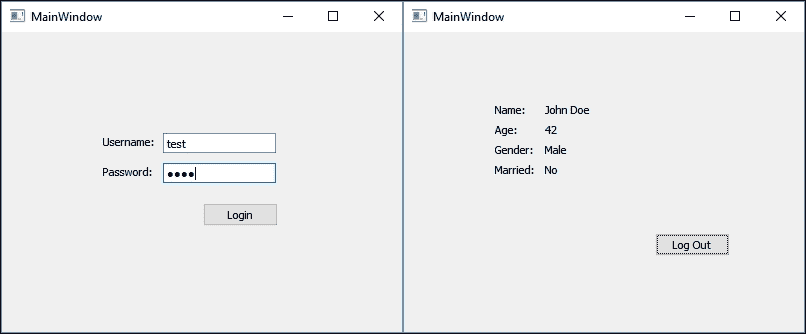

## 工作原理…

在此示例中，我们从`user`表中选择与我们插入到文本字段中的用户名和密码匹配的数据。如果找不到任何内容，这意味着我们提供了无效的用户名或密码。否则，从用户帐户中获取`employeeID`数据，并进行另一个 SQL 查询，以查找与`employeeID`变量匹配的`employee`表中的信息。然后，根据我们程序的 UI 显示数据。

我们必须在**编辑标签顺序**模式下设置小部件顺序，这样当程序启动时，第一个获得焦点的小部件是用户名行编辑小部件。如果用户在键盘上按下**TAB**按钮，焦点应切换到第二个小部件，即密码行编辑。错误的小部件顺序将完全破坏用户体验，并驱赶潜在用户。

确保密码行编辑的**echoMode**选项设置为`Password`。该设置将隐藏插入到行编辑中的实际密码，并用点符号替换以确保安全。

# 在模型视图上显示来自数据库的信息

在本示例中，我们将学习如何在程序中的模型视图上显示从 SQL 数据库获取的多组数据。

## 操作方法…

按照以下步骤在模型视图小部件上显示来自数据库的信息：

1.  我们将使用名为`employee`的数据库表，这是我们在上一个示例中使用的。这次，我们需要在`employee`表中添加更多数据。打开您的 Web 浏览器并登录到 phpMyAdmin 控制面板。为几个员工添加数据，以便稍后在我们的程序中显示：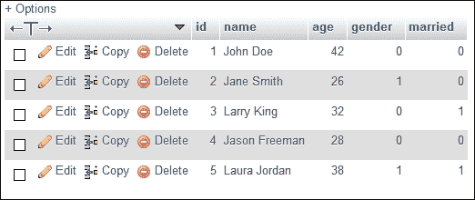

1.  之后，打开 Qt Creator，创建一个新的**Qt Widgets 应用程序**项目，然后将 SQL 模块添加到您的项目中。

1.  接下来，打开`mainwindow.ui`并从**小部件**框窗格下的**基于项目的小部件**中添加一个表格小部件（而不是表格视图）。在画布上选择主窗口，然后单击**垂直布局**或**水平布局**按钮，使表格小部件固定在主窗口的大小上，即使在调整大小时也是如此：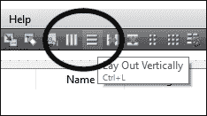

1.  之后，双击表格小部件，然后会出现一个窗口。在**列**选项卡下，通过单击左上角的**+**按钮添加五个项目。将项目命名为`ID`、`Name`、`Age`、`Gender`和`Married`。完成后，单击**OK**：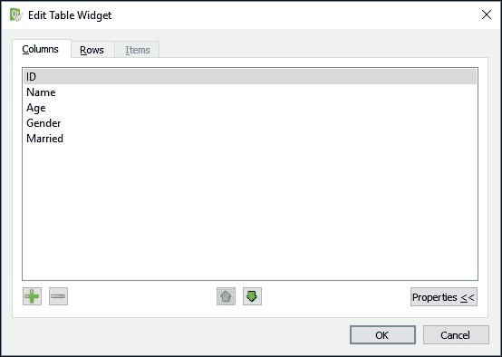

1.  然后，右键单击表格小部件，在弹出菜单中选择**转到槽…**。滚动到最底部，在弹出窗口中选择**itemChanged(QTableWidgetItem*)**选项，然后单击**OK**。将在您的源文件中创建一个槽函数。

1.  打开`mainwindow.h`并将这些私有变量添加到我们的`MainWindow`类中：

```cpp
private:
  Ui::MainWindow *ui;
 bool hasInit;
 QSqlDatabase db;

```

1.  我们还将以下类头文件添加到`mainwindow.h`中：

```cpp
#include <QtSql>
#include <QSqlDatabase>
#include <QSqlQuery>
#include <QMessageBox>
#include <QDebug>
#include <QTableWidgetItem>
```

1.  完成后，打开`mainwindow.cpp`，我们将在那里编写大量代码。首先，我们需要声明程序启动时会发生什么。将以下代码添加到`MainWindow`类的构造函数中：

```cpp
MainWindow::MainWindow(QWidget *parent) :
  QMainWindow(parent),
  ui(new Ui::MainWindow)
{
  hasInit = false;

  ui->setupUi(this);

  db = QSqlDatabase::addDatabase("QMYSQL");
  db.setHostName("127.0.0.1");
  db.setUserName("yourusername");
  db.setPassword("yourpassword");
  db.setDatabaseName("databasename");

  ui->tableWidget->setColumnHidden(0, true);

  if (db.open())
  {
    QSqlQuery query;
    if (query.exec("SELECT id, name, age, gender, married FROM employee"))
    {
      while (query.next())
      {
        qDebug() << query.value(0) << query.value(1) << query.value(2) << query.value(3) << query.value(4);

        QString id = query.value(0).toString();
        QString name = query.value(1).toString();
        QString age = query.value(2).toString();
        int gender = query.value(3).toInt();
        bool married = query.value(4).toBool();

        ui->tableWidget->setRowCount(ui->tableWidget->rowCount() + 1);

        QTableWidgetItem* idItem = new QTableWidgetItem(id);
        QTableWidgetItem* nameItem = new QTableWidgetItem(name);
        QTableWidgetItem* ageItem = new QTableWidgetItem(age);
        QTableWidgetItem* genderItem = new QTableWidgetItem();

        if (gender == 0)
          genderItem->setData(0, "Male");
        else
          genderItem->setData(0, "Female");

        QTableWidgetItem* marriedItem = new QTableWidgetItem();

        if (married)
          marriedItem->setData(0, "Yes");
        else
          marriedItem->setData(0, "No");

        ui->tableWidget->setItem(ui->tableWidget->rowCount() - 1, 0, idItem);
        ui->tableWidget->setItem(ui->tableWidget->rowCount() - 1, 1, nameItem);
        ui->tableWidget->setItem(ui->tableWidget->rowCount() - 1, 2, ageItem);
        ui->tableWidget->setItem(ui->tableWidget->rowCount() - 1, 3, genderItem);
        ui->tableWidget->setItem(ui->tableWidget->rowCount() - 1, 4, marriedItem);
      }

      hasInit = true;
    }
    else
    {
      qDebug() << query.lastError().text();
    }
  }
  else
  {
    qDebug() << "Failed to connect to database.";
  }
}
```

1.  之后，声明当表格小部件的项目被编辑时会发生什么。将以下代码添加到名为`on_tableWidget_itemChanged()`的槽函数中：

```cpp
void MainWindow::on_tableWidget_itemChanged(QTableWidgetItem *item)
{
  if (hasInit)
  {
    QString id = ui->tableWidget->item(item->row(), 0)->data(0).toString();
    QString name = ui->tableWidget->item(item->row(), 1)->data(0).toString();
    QString age = QString::number(ui->tableWidget->item(item->row(), 2)->data(0).toInt());
    ui->tableWidget->item(item->row(), 2)->setData(0, age);

    QString gender;
    if (ui->tableWidget->item(item->row(), 3)->data(0).toString() == "Male")
    {
      gender = "0";
    }
    else
    {
      ui->tableWidget->item(item->row(), 3)->setData(0, "Female");
      gender = "1";
    }

    QString married;
    if (ui->tableWidget->item(item->row(), 4)->data(0).toString() == "No")
    {
      married = "0";
    }
    else
    {
      ui->tableWidget->item(item->row(), 4)->setData(0, "Yes");
      married = "1";
    }

    qDebug() << id << name << age << gender << married;
    QSqlQuery query;
    if (query.exec("UPDATE employee SET name = '" + name + "', age = '" + age + "', gender = '" + gender + "', married = '" + married + "' WHERE id = " + id))
    {
      QMessageBox::information(this, "Update Success", "Data updated to database.");
    }
    else
    {
      qDebug() << query.lastError().text();
    }
  }
}
```

1.  最后，在类析构函数中关闭数据库：

```cpp
MainWindow::~MainWindow()
{
 db.close();
  delete ui;
}
```

1.  现在编译并运行示例，你应该会得到类似这样的结果：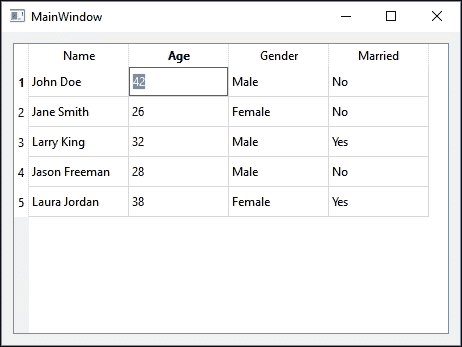

## 它是如何工作的...

表部件类似于电子表格应用程序中看到的表格，比如 Microsoft Excel 和 Open Office Calc。与其他类型的模型视图（如列表视图或树视图）相比，表视图（或表部件）是一个二维模型视图，以行和列的形式显示数据。

在 Qt 中，表视图和表部件的主要区别在于表部件是建立在表视图类之上的，这意味着表部件更容易使用，更适合初学者。然而，表部件的灵活性较差，往往比表视图不够可扩展，如果你想要自定义你的表格，这并不是最佳选择。

从 MySQL 中检索数据后，我们为每个数据项创建了一个`QTableWidgetItem`项目，并设置应该添加到表部件的哪一列和哪一行。在将项目添加到表部件之前，我们必须通过调用`QTableWidget::setRowCount()`来增加表的行数。我们也可以通过简单地调用`QTableWidget::rowCount()`来获取表部件的当前行数。

从左边的第一列被隐藏了，因为我们只是用它来保存数据的 ID，这样我们就可以在数据项发生变化时使用它来更新数据库。

当单元格中的数据发生变化时，槽函数`on_tableWidget_itemChanged()`将被调用。它不仅在你编辑单元格中的数据时被调用，而且在从数据库中检索到数据后首次添加到表中时也会被调用。为了确保这个函数只在我们编辑数据时触发，我们使用了一个名为`hasInit`的布尔变量来检查我们是否已经完成了初始化过程（向表中添加了第一批数据）或者没有。如果`hasInit`是`false`，则忽略函数调用。

为了防止用户输入完全无关的数据类型，比如将字母插入到本应为数字的数据单元中，我们在数据被编辑时手动检查数据是否接近我们期望的内容。如果数据与有效数据差距较大，将其恢复为默认值。当然，这是一个简单的技巧，能够完成工作，但并不是最专业的方法。或者，你可以尝试创建一个继承了`QItemDelegate`类的新类，并定义你的模型视图应该如何行为。然后，调用`QTableWidget::setItemDelegate()`将该类应用到你的表部件上。

# 高级 SQL 查询

通过遵循这个步骤，我们将学习如何使用高级 SQL 语句，比如`INNER JOIN`、`COUNT`、`LIKE`、`DISTINCT`等等。

## 如何做到这一点...

你可以做的不仅仅是执行简单的 SQL 数据库查询：

1.  首先，我们需要在数据库中添加一些表，然后才能开始编程部分。打开你的网络浏览器，访问你的 phpMyAdmin。我们需要为这个示例添加几个表才能使其工作：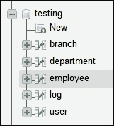

1.  我将向你展示这个项目所需的每个表的结构以及插入到表中用于测试的虚拟数据。第一个表叫做`branch`，用于存储虚拟公司不同分支的 ID 和名称：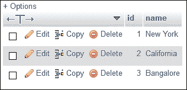

1.  其次，我们有一个`department`表，用于存储虚拟公司不同部门的 ID 和名称，它也与分支数据通过分支 ID 相关联：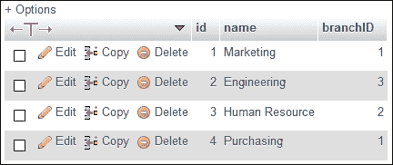

1.  接下来，我们还有一个`employee`表，用于存储虚拟公司所有员工的信息。这个表与我们在之前示例中使用的表类似，只是多了两列，分别是`birthday`和`departmentID`：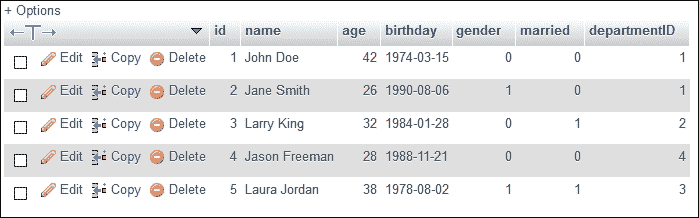

1.  除此之外，我们还有一个名为`log`的表，其中包含每个员工的登录时间的虚拟记录。`loginTime`列可以是`timestamp`或`date time`变量类型：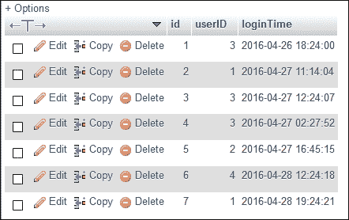

1.  最后，我们还有在前面的示例中使用的`user`表：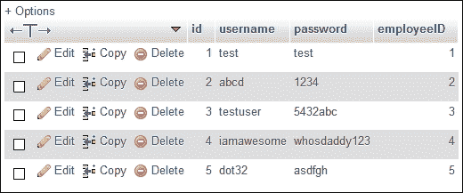

1.  我们已经完成了数据库；让我们继续进行 Qt。打开 Qt Creators，这一次，不再选择**Qt Widgets Application**，而是创建**Qt Console Application**：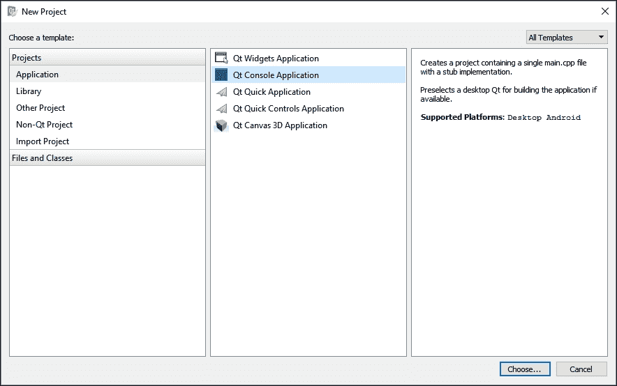

1.  创建完控制台项目后，打开项目文件（`.pro`）并将 SQL 模块添加到项目中：

```cpp
QT += core sql
QT -= gui
```

1.  接下来，打开`main.cpp`并在源文件顶部添加以下头文件：

```cpp
#include <QSqlDatabase>
#include <QSqlQuery>
#include <QSqlError>
#include <QDate>
#include <QDebug>
```

1.  然后，添加以下函数来显示年龄超过 30 岁的员工：

```cpp
void filterAge()
{
  qDebug() << "== Employees above 30 year old =============";
  QSqlQuery query;
  if (query.exec("SELECT name, age FROM employee WHERE age > 30"))
  {
    while (query.next())
    {
      qDebug() << query.value(0).toString() << query.value(1).toString();
    }
  }
  else
  {
    qDebug() << query.lastError().text();
  }

  qDebug() << "\n";
}
```

1.  之后，添加这个函数来显示每个员工的部门和分支信息：

```cpp
void getDepartmentAndBranch()
{
  qDebug() << "== Get employees' department and branch =============";

  QSqlQuery query;
  if (query.exec("SELECT myEmployee.name, department.name, branch.name FROM (SELECT name, departmentID FROM employee) AS myEmployee INNER JOIN department ON department.id = myEmployee.departmentID INNER JOIN branch ON branch.id = department.branchID"))
  {
    while (query.next())
    {
      qDebug() << query.value(0).toString() << query.value(1).toString() << query.value(2).toString();
    }
  }
  else
  {
    qDebug() << query.lastError().text();
  }

  qDebug() << "\n";
}
```

1.  接下来，添加这个函数，显示在`纽约`分支工作且年龄不到 30 岁的员工：

```cpp
void filterBranchAndAge()
{
  qDebug() << "== Employees from New York and age below 30 =============";

  QSqlQuery query;
  if (query.exec("SELECT myEmployee.name, myEmployee.age, department.name, branch.name FROM (SELECT name, age, departmentID FROM employee) AS myEmployee INNER JOIN department ON department.id = myEmployee.departmentID INNER JOIN branch ON branch.id = department.branchID WHERE branch.name = 'New York' AND age < 30"))
  {
    while (query.next())
    {
      qDebug() << query.value(0).toString() << query.value(1).toString() << query.value(2).toString() << query.value(3).toString();
    }
  }
  else
  {
    qDebug() << query.lastError().text();
  }

  qDebug() << "\n";
}
```

1.  然后，添加这个函数来计算虚拟公司中女性员工的总数：

```cpp
void countFemale()
{
  qDebug() << "== Count female employees =============";

  QSqlQuery query;
  if (query.exec("SELECT COUNT(gender) FROM employee WHERE gender = 1"))
  {
    while (query.next())
    {
      qDebug() << query.value(0).toString();
    }
  }
  else
  {
    qDebug() << query.lastError().text();
  }

  qDebug() << "\n";
}
```

1.  完成后，我们将添加另一个函数，过滤员工列表，并仅显示以`Ja`开头的员工：

```cpp
void filterName()
{
  qDebug() << "== Employees name start with 'Ja' =============";

  QSqlQuery query;
  if (query.exec("SELECT name FROM employee WHERE name LIKE '%Ja%'"))
  {
    while (query.next())
    {
      qDebug() << query.value(0).toString();
    }
  }
  else
  {
    qDebug() << query.lastError().text();
  }

  qDebug() << "\n";
}
```

1.  接下来，我们还添加另一个函数，显示在`8 月`份生日的员工：

```cpp
void filterBirthday()
{
  qDebug() << "== Employees birthday in August =============";

  QSqlQuery query;
  if (query.exec("SELECT name, birthday FROM employee WHERE MONTH(birthday) = 8"))
  {
    while (query.next())
    {
      qDebug() << query.value(0).toString() << query.value(1).toDate().toString("d-MMMM-yyyy");
    }
  }
  else
  {
    qDebug() << query.lastError().text();
  }

  qDebug() << "\n";
}
```

1.  然后，我们添加最后一个函数，检查谁在`2016 年 4 月 27 日`登录到虚拟系统，并在终端上显示他们的名字：

```cpp
void checkLog()
{
  qDebug() << "== Employees who logged in on 27 April 2016 =============";

  QSqlQuery query;
  if (query.exec("SELECT DISTINCT myEmployee.name, FROM (SELECT id, name FROM employee) AS myEmployee INNER JOIN user ON user.employeeID = myEmployee.id INNER JOIN log ON log.userID = user.id WHERE DATE(log.loginTime) = '2016-04-27'"))
  {
    while (query.next())
    {
      qDebug() << query.value(0).toString();
    }
  }
  else
  {
    qDebug() << query.lastError().text();
  }

  qDebug() << "\n";
}
```

1.  最后，在我们的`main()`函数中，连接我们的程序到 MySQL 数据库，并调用我们在前面步骤中定义的所有函数。之后，关闭数据库连接，我们就完成了：

```cpp
int main(int argc, char *argv[])
{
  QCoreApplication a(argc, argv);

  QSqlDatabase db = QSqlDatabase::addDatabase("QMYSQL");
  db.setHostName("127.0.0.1");
  db.setUserName("reonyx");
  db.setPassword("reonyx");
  db.setDatabaseName("testing");

  if (db.open())
  {
    filterAge();
    getDepartmentAndBranch();
    filterBranchAndAge();
    countFemale();
    filterName();
    filterBirthday();
    checkLog();

    db.close();
  }
  else
  {
    qDebug() << "Failed to connect to database.";
  }

  return a.exec();
}
```

1.  现在编译并运行项目，您应该看到一个终端窗口，显示了之前定义的数据库中的过滤结果：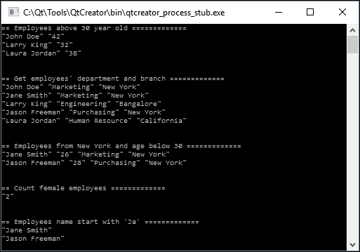

## 工作原理...

控制台应用程序根本没有任何 GUI，只在终端窗口中显示文本。这通常用于后端系统，因为它使用的资源比小部件应用程序少。在本例中使用它是因为它更快地显示结果，而无需在程序中放置任何小部件，这在这种情况下是不需要的。

我们将 SQL 查询分成不同的函数，以便更容易维护代码，避免变得太混乱。请注意，在 C++中，函数必须位于`main()`函数之前，否则它们将无法被`main()`调用。

## 还有更多...

在前面的示例中使用的`INNER JOIN`语句将两个表连接在一起，并选择两个表中的所有行，只要两个表中的列之间存在匹配。在 MySQL（以及其他类型的 SQL 架构）中，还有许多其他类型的`JOIN`语句，例如`LEFT JOIN`，`RIGHT JOIN`，`FULL OUTER JOIN`等。以下图表显示了不同类型的`JOIN`语句及其效果：

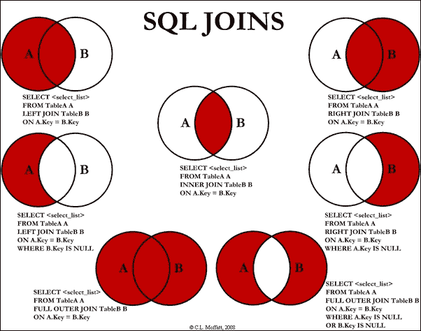

1.  `LIKE`语句通常用于在数据库中搜索字符串变量而不是完整单词。请注意，搜索关键字之前和之后有两个`%`符号。

1.  在前面的示例中使用的`DISTINCT`语句过滤掉具有完全相同变量的结果。例如，如果没有`DISTINCT`语句，您将在终端中看到两个 Larry King 的版本，因为他在同一天登录系统有两条记录。通过添加`DISTINCT`语句，MySQL 将消除重复的结果之一，并确保每个结果都是唯一的。

1.  您可能想知道`d-MMMM-yyyy`代表什么，为什么我们在前面的例子中使用它。这实际上是提供给 Qt 中的`QDateTime`类的一个表达式，用于使用给定的格式显示日期时间结果。在这种情况下，它将改变我们从 MySQL 获取的日期时间数据`2016-08-06`，转换为我们指定的格式，结果为`6-August-2016`。更多信息，请查看 Qt 的文档[`doc.qt.io/qt-5/qdatetime.html#toString`](http://doc.qt.io/qt-5/qdatetime.html#toString)，其中包含可以用来确定日期和时间字符串格式的完整表达式列表。
