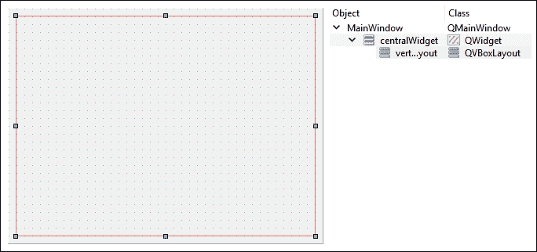

# 第九章。使用 Qt Web 引擎开发 Web 应用程序

在本章中，我们将涵盖以下内容：

+   介绍 Qt WebEngine

+   WebView 和 Web 设置

+   在项目中嵌入 Google 地图

+   从 JavaScript 调用 C++函数

+   从 C++调用 JavaScript 函数

# 介绍

Qt 包括一个名为**Qt WebEngine**的模块，允许我们将 Web 浏览器小部件嵌入到我们的程序中，并用它来显示网页或本地 HTML 内容。在 5.6 版本之前，Qt 使用另一个类似的模块称为**Qt WebKit**，现在已经被弃用，并且已经被基于 Chromium 的**Web 引擎**模块所取代。Qt 还允许 JavaScript 和 C++代码之间的通信通过“Web 通道”，这使我们能够更有效地使用这个模块。

# 介绍 Qt WebEngine

在这个示例项目中，我们将探索 Qt 中 Web 引擎模块的基本功能，并尝试构建一个简单的工作 Web 浏览器。自 Qt 5.6 以来，Qt 的 WebKit 模块已被弃用，并由基于 Google 的 Chromium 引擎的 WebEngine 模块所取代。请注意，当撰写本章时，WebEngine 仍在积极开发中，可能会在不久的将来发生变化。

## 操作方法…

首先，让我们设置我们的 Web 引擎项目：

1.  首先，如果您的计算机上没有安装 Microsoft Visual Studio，则需要下载并安装它。这是因为目前，Qt 的 WebEngine 模块只能与 Visual C++编译器一起使用，而不能与其他编译器（如 MinGW 或 Clang）一起使用。这可能会在将来发生变化，但这一切取决于 Google 是否愿意让他们的 Chromium 引擎支持其他编译器。与此同时，您可以从这里下载最新的 Visual Studio：[`www.visualstudio.com`](https://www.visualstudio.com)。

1.  同时，您可能还需要确保您计算机上安装的 Qt 支持 Visual C++编译器。您可以使用 Qt 的维护工具向 Qt 安装**mvc2015**组件。还要确保您在 Qt 中也安装了**Qt WebEngine**组件：

1.  完成后，打开 Qt Creator 并创建一个新的**Qt Widgets 应用程序**项目。这次，您必须选择使用 Visual C++编译器的工具包：

1.  之后，打开项目文件（.pro）并将以下模块添加到您的项目中：

```cpp
QT += core gui webengine webenginewidgets

```

1.  打开`mainwindow.ui`并删除`menuBar`，`mainToolBar`和`statusBar`对象，因为在这个项目中我们不需要它们：

1.  在画布上放置两个水平布局，然后在顶部的布局中放置一个行编辑小部件和一个按钮：

1.  之后，选择画布并单击编辑器顶部的**垂直布局**按钮：

1.  单击**垂直布局**按钮后，布局将扩展并遵循主窗口的大小。行编辑也将根据水平布局的宽度水平扩展：

1.  接下来，在行编辑的左侧添加两个按钮。我们将使用这两个按钮在页面历史记录之间进行后退和前进。然后，在主窗口底部添加一个进度条小部件，以便我们可以了解页面是否已经加载完成，或者加载仍在进行中。此时我们不必担心中间的水平布局，因为我们将在稍后使用 C++代码将 Web 视图添加到其中，然后该空间将被占用：

1.  右键单击其中一个按钮，选择**转到槽…**，然后选择**clicked()**并单击**确定**。槽函数将自动在`mainwindow.h`和`mainwindow.cpp`中为您创建。对所有其他按钮也重复此步骤。

1.  之后，右键单击行编辑并选择**转到槽…**，然后选择**returnPressed()**并单击**确定**。现在`mainwindow.h`和`mainwindow.cpp`中将自动为您创建另一个槽函数。

1.  现在我们完成了 UI 设计，让我们转到`mainwindow.h`。我们需要做的第一件事是在`mainwindow.h`中添加以下头文件：

```cpp
#include <QtWebEngineWidgets/QtWebEngineWidgets>
```

1.  然后，在类析构函数下声明`loadUrl()`函数：

```cpp
public:
  explicit MainWindow(QWidget *parent = 0);
  ~MainWindow();

  void loadUrl();

```

1.  之后，在`mainwindow.h`中添加一个名为`loading()`的自定义槽函数，因为我们很快就会用到它：

```cpp
private slots:
  void on_goButton_clicked();
  void on_address_returnPressed();
  void on_backButton_clicked();
  void on_forwardButton_clicked();
  void loading(int progress);

```

1.  最后，声明一个`QWebEngineView`对象并将其命名为`webview`：

```cpp
private:
  Ui::MainWindow *ui;
  QWebEngineView* webview;

```

1.  完成后，打开`mainwindow.cpp`并初始化 web 引擎视图。然后，将其添加到第二个水平布局中，并将其`loadProgress()`信号连接到我们刚刚添加到`mainwindow.h`的`loading()`槽函数：

```cpp
MainWindow::MainWindow(QWidget *parent) :
  QMainWindow(parent),
  ui(new Ui::MainWindow)
{
  ui->setupUi(this);

  webview = new QWebEngineView;
  ui->horizontalLayout_2->addWidget(webview);

  connect(webview, SIGNAL(loadProgress(int)), SLOT(loading(int)));
}
```

1.  之后，声明`loadUrl()`函数被调用时会发生什么：

```cpp
void MainWindow::loadUrl()
{
  QUrl url = QUrl(ui->address->text());
  url.setScheme("http");
  webview->page()->load(url);
}
```

1.  接下来，当单击**Go**按钮或单击`Return/Enter`键时，调用`loadUrl()`函数：

```cpp
void MainWindow::on_goButton_clicked()
{
  loadUrl();
}

void MainWindow::on_address_returnPressed()
{
  loadUrl();
}
```

1.  至于另外两个按钮，如果在历史堆栈中可用，我们将要求 web 视图加载上一页或下一页：

```cpp
void MainWindow::on_backButton_clicked()
{
  webview->back();
}

void MainWindow::on_forwardButton_clicked()
{
  webview->forward();
}
```

1.  最后，在加载网页时更改`progressBar`的值：

```cpp
void MainWindow::loading(int progress)
{
  ui->progressBar->setValue(progress);
}
```

1.  现在构建并运行程序，您将获得一个非常基本但功能齐全的网页浏览器！

## 工作原理…

旧的 web 视图系统基于苹果的 WebKit 引擎，仅在 Qt 5.5 及其前身中可用。自 5.6 以来，Qt 完全放弃了 WebKit，并用 Google 的 Chromium 引擎替换。API 已完全更改，因此一旦迁移到 5.6，与 Qt WebKit 相关的所有代码都将无法正常工作。如果您是 Qt 的新手，建议跳过 WebKit 并学习 WebEngine API，因为它正在成为 Qt 的新标准。如果您以前使用过 Qt 的 WebKit，本网页将教您如何将旧代码迁移到 WebEngine，[`wiki.qt.io/Porting_from_QtWebKit_to_QtWebEngine`](https://wiki.qt.io/Porting_from_QtWebKit_to_QtWebEngine)。

在第 16 步，我们将属于 web 视图小部件的`loadProgress()`信号连接到`loading()`槽函数。当在第 17 步通过调用`QWebEnginePage::load()`请求加载网页时，信号将自动调用。如果需要，您还可以连接`loadStarted()`和`loadFinished()`信号。

在第 17 步，我们使用`QUrl`类将从行编辑中获取的文本转换为 URL 格式。默认情况下，如果不指定 URL 方案（`http`，`https`，`ftp`等），我们插入的地址将导致本地路径。如果我们给出`packtpub.com`而不是`http://packtpub.com`，则可能无法加载页面。因此，我们通过调用`QUrl::setScheme()`手动为其指定 URL 方案。这将确保在将其传递给 web 视图之前，地址格式正确。

## 还有更多…

如果您正在运行 Qt 5.6 或更高版本，并且出于某种原因需要 Webkit 模块用于您的项目（通常用于维护旧项目），您可以从 GitHub 获取模块代码并自行构建：

[`github.com/qt/qtwebkit`](https://github.com/qt/qtwebkit)

# WebView 和 web 设置

在本节中，我们将深入探讨 Qt 的 WebEngine 中可用的功能，并探索我们可以使用的设置来自定义我们的 WebView。我们将使用上一个示例的源文件，并向其添加更多代码。

## 如何做…

让我们探索一些 Qt WebEngine 的基本功能：

1.  首先，打开`mainwindow.ui`并在进度条下添加一个垂直布局。然后，在垂直布局中添加一个**纯文本编辑**小部件（在输入小部件类别下），以及一个推送按钮。将推送按钮的显示更改为**加载 HTML**，并将纯文本编辑小部件的`plaintext`属性设置为以下内容：

```cpp
</img>
<h1>Hello World!</h1>
<h3>This is our custom HTML page.</h3>

<script>alert("Hello!");</script>
```


1.  接下来，转到**文件** | **新建文件或项目**。然后会弹出一个窗口，要求你选择一个文件模板。在**Qt**类别下选择**Qt 资源文件**，然后点击**选择...**按钮。输入你想要的文件名，然后点击**下一步**，接着点击**完成**。

1.  之后，通过在**项目**窗格中右键单击刚刚创建的资源文件并选择**在编辑器中打开**选项来打开资源文件。一旦文件被编辑器打开，点击**添加**按钮，然后点击**添加前缀**。然后，将前缀设置为**/**，点击**添加**，接着点击**添加文件**。这时，文件浏览器窗口会出现，我们会选择**tux.png**图像文件并点击**打开**。现在我们已经将图像文件添加到我们的项目中，它将被嵌入到可执行文件（`.exe`）中一起编译：

1.  接下来，打开`mainwindow.h`并添加以下头文件：

```cpp
#include <QMainWindow>
#include <QtWebEngineWidgets/QtWebEngineWidgets>
#include <QDebug>
#include <QFile>

```

1.  然后，确保以下函数和指针已在`mainwindow.h`中声明：

```cpp
public:
  explicit MainWindow(QWidget *parent = 0);
  ~MainWindow();
  void loadUrl();

private slots:
  void on_goButton_clicked();
  void on_address_returnPressed();
  void on_backButton_clicked();
  void on_forwardButton_clicked();

  void startLoading();
  void loading(int progress);
  void loaded(bool ok);

 void on_loadHtml_clicked();
private:
  Ui::MainWindow *ui;
  QWebEngineView* webview;

```

1.  完成后，打开`mainwindow.cpp`并将以下代码添加到类构造函数中：

```cpp
MainWindow::MainWindow(QWidget *parent) :
  QMainWindow(parent),
  ui(new Ui::MainWindow)
{
  ui->setupUi(this);

  webview = new QWebEngineView;
  ui->horizontalLayout_2->addWidget(webview);

  //webview->page()->settings()>setAttribute(QWebEngineSettings::JavascriptEnabled, false);
  //webview->page()->settings()->setAttribute(QWebEngineSettings::AutoLoadImages, false);

  //QString fontFamily = webview->page()->settings()->fontFamily(QWebEngineSettings::SerifFont);
  QString fontFamily = webview->page()->settings()->fontFamily(QWebEngineSettings::SansSerifFont);
  int fontSize = webview->page()->settings()->fontSize(QWebEngineSettings::MinimumFontSize);
  QFont myFont = QFont(fontFamily, fontSize);
  webview->page()->settings()->setFontFamily(QWebEngineSettings::StandardFont, myFont.family());

  QFile file("://tux.png");
  if (file.open(QFile::ReadOnly))
  {
    QByteArray data = file.readAll();
    webview->page()->setContent(data, "image/png");
  }
  else
  {
    qDebug() << "File cannot be opened.";
  }

  connect(webview, SIGNAL(loadStarted()), SLOT(startLoading()));
  connect(webview, SIGNAL(loadProgress(int)), SLOT(loading(int)));
  connect(webview, SIGNAL(loadFinished(bool)), SLOT(loaded(bool)));
}
```

1.  `MainWindow::loadUrl()`函数仍然与之前的例子相同，它在加载页面之前将 URL 方案设置为`http`：

```cpp
void MainWindow::loadUrl()
{
  QUrl url = QUrl(ui->address->text());
  url.setScheme("http");
  webview->page()->load(url);
}
```

1.  对于以下函数，情况也是一样的：

```cpp
void MainWindow::on_goButton_clicked()
{
  loadUrl();
}

void MainWindow::on_address_returnPressed()
{
  loadUrl();
}

void MainWindow::on_backButton_clicked()
{
  webview->back();
}

void MainWindow::on_forwardButton_clicked()
{
  webview->forward();
}
```

1.  在之前的例子中，我们只有`MainWindow::loading()`，它在网页加载时设置进度条的值。这次，我们还添加了`MainWindow::startLoading()`和`MainWindow::loaded()`槽函数，它们将被`loadStarted()`和`loadFinished()`信号调用。这两个函数的作用基本上是在页面开始加载时显示进度条，在页面加载完成时隐藏进度条：

```cpp
void MainWindow::startLoading()
{
  ui->progressBar->show();
}

void MainWindow::loading(int progress)
{
  ui->progressBar->setValue(progress);
}

void MainWindow::loaded(bool ok)
{
  ui->progressBar->hide();
}
```

1.  最后，当点击**加载 HTML**按钮时，我们调用`webview->loadHtml()`将纯文本转换为 HTML 内容：

```cpp
void MainWindow::on_loadHtml_clicked()
{
  webview->setHtml(ui->source->toPlainText());
}
```

1.  现在构建并运行程序，你应该会看到类似这样的东西：

## 工作原理...

在这个例子中，我们使用 C++加载图像文件，并将其设置为 WebView 的默认内容（而不是空白页面）。我们可以通过在启动时加载默认 HTML 文件和图像来实现相同的结果。

类构造函数中的一些代码已被注释掉。你可以删除双斜杠`//`，看看它的不同之处——JavaScript 警报将不再出现（因为 JavaScript 被禁用），任何图像也将不再出现在你的 Web 视图中。

你还可以尝试将字体系列从`QWebEngineSettings::SansSerifFont`改为`QWebEngineSettings::SerifFont`。你会注意到字体在 Web 视图中的显示略有不同：


通过点击**加载 HTML**按钮，我们要求 WebView 将纯文本编辑小部件的内容视为 HTML 代码并将其加载为 HTML 页面。你可以使用这个方法来制作一个由 Qt 驱动的简单 HTML 编辑器！

# 在项目中嵌入谷歌地图

在这个例子中，我们将学习如何通过 Qt 的 WebEngine 模块在我们的项目中嵌入谷歌地图。这个例子并不太关注 Qt 和 C++，而是关注 HTML 代码中的谷歌地图 API。

## 操作步骤...

让我们按照以下步骤创建一个显示谷歌地图的程序：

1.  首先，创建一个新的**Qt Widgets 应用程序**项目，并移除状态栏、菜单栏和工具栏。

1.  然后，打开项目文件（`.pro`）并将以下模块添加到你的项目中：

```cpp
QT += core gui webengine webenginewidgets

```

1.  然后，打开`mainwindow.ui`并为画布添加一个垂直布局。然后，选择画布并点击画布顶部的**垂直布局**按钮。你会得到类似这样的东西：

1.  然后，打开`mainwindow.cpp`并在源代码顶部添加以下头文件：

```cpp
#include <QtWebEngineWidgets/QWebEngineView>
#include <QtWebEngineWidgets/QWebEnginePage>
#include <QtWebEngineWidgets/QWebEngineSettings>
```

1.  之后，将以下代码添加到`MainWindow`构造函数中：

```cpp
MainWindow::MainWindow(QWidget *parent) :
  QMainWindow(parent),
  ui(new Ui::MainWindow)
{
  ui->setupUi(this);
  QWebEngineView* webview = new QWebEngineView;
  QUrl url = QUrl("qrc:/map.html");
  webview->page()->load(url);
  ui->verticalLayout->addWidget(webview);
}
```

1.  然后，转到**文件** | **新建文件或项目**并创建一个 Qt 资源文件（.qrc）。我们将在项目中添加一个名为`map.html`的 HTML 文件：

1.  完成后，用您喜欢的文本编辑器打开`map.html`。不建议使用 Qt Creator 打开 HTML 文件，因为它不提供 HTML 语法的颜色编码。

1.  之后，我们将开始编写 HTML 代码，声明重要的标签，如`<html>`、`<head>`和`<body>`，如下所示：

```cpp
<!DOCTYPE html>
<html>
  <head>
  </head>
  <body ondragstart="return false">
  </body>
</html>
```

1.  然后，在 body 中添加一个`<div>`标签，并将其 ID 设置为`map-canvas`：

```cpp
<body ondragstart="return false">
  <div id="map-canvas" />
</body>
```

1.  之后，将以下代码添加到 HTML 文档的头部：

```cpp
<meta name="viewport" content="initial-scale=1.0,user-scalable=no" />
<style type="text/css">
  html { height: 100% }
  body { height: 100%; margin: 0; padding: 0 }
  #map-canvas { height: 100% }
</style>
<script type="text/javascript" src="img/js?key=YOUR_KEY_HERE&libraries=drawing"></script>
```

1.  然后，将以下代码添加到 HTML 文档的头部，就在我们在上一步中插入的代码的底部：

```cpp
<script type="text/javascript">
  var map;
  function initialize()
  {
    // Add map
    var mapOptions =
    {
      center: new google.maps.LatLng(40.705311, -74.2581939),
        zoom: 6
    };

    map = new google.maps.Map(document.getElementById("map-canvas"),mapOptions);

    // Add event listener
    google.maps.event.addListener(map, 'zoom_changed', function()
    {
      //alert(map.getZoom());
    });

    // Add marker
    var marker = new google.maps.Marker(
    {
      position: new google.maps.LatLng(40.705311, -74.2581939),
        map: map,
        title: "Marker A",
    });
    google.maps.event.addListener(marker, 'click', function()
    {
      map.panTo(marker.getPosition());
    });
    marker.setMap(map);

    // Add polyline
    var points = [ new google.maps.LatLng(39.8543, -73.2183), new google.maps.LatLng(41.705311, -75.2581939), new google.maps.LatLng(40.62388, -75.5483) ];
    var polyOptions =
    {
      path: points,
      strokeColor: '#FF0000',
      strokeOpacity: 1.0,
      strokeWeight: 2
    };
    historyPolyline = new google.maps.Polyline(polyOptions);
    historyPolyline.setMap(map);

    // Add polygon
    var points = [ new google.maps.LatLng(37.314166, -75.432),new google.maps.LatLng(40.2653, -74.4325), new google.maps.LatLng(38.8288, -76.5483) ];
      var polygon = new google.maps.Polygon(
    {
      paths: points,
      fillColor:  '#000000',
      fillOpacity: 0.2,
      strokeWeight: 3,
      strokeColor: '#fff000',
    });
    polygon.setMap(map);

    // Setup drawing manager
    var drawingManager = new google.maps.drawing.DrawingManager();
    drawingManager.setMap(map);
  }

  google.maps.event.addDomListener(window, 'load', initialize);

</script>
```

1.  完成后，编译并运行项目。您应该看到类似于这样的东西：

## 工作原理...

谷歌允许您通过使用他们的 JavaScript 库谷歌地图 API 在网页中嵌入谷歌地图。通过 Qt 的 WebEngine 模块，我们可以通过将 HTML 文件加载到我们的 Web 视图小部件中来在我们的 C++项目中嵌入谷歌地图，该小部件使用谷歌地图 API。这种方法的唯一缺点是在没有互联网连接时无法加载地图。

谷歌允许您的网站每天多次调用任何谷歌 API。如果您计划有更多的流量，您应该从谷歌获取一个免费的 API 密钥。转到[`console.developers.google.com`](https://console.developers.google.com)获取一个免费的密钥，并用从谷歌获得的 API 密钥替换 JavaScript 源路径中的`YOUR_KEY_HERE`一词。

我们必须定义一个`<div>`对象，它作为地图的容器。然后，当我们初始化地图时，我们指定`<div>`对象的 ID，以便 Google Maps API 知道在嵌入地图时要查找哪个 HTML 元素。

默认情况下，我们将地图的中心设置为纽约的坐标，并将默认缩放级别设置为`6`。然后，我们添加了一个事件侦听器，当地图的缩放级别发生变化时触发。删除代码中的双斜杠`//`以查看其运行情况。

之后，我们还通过 JavaScript 向地图添加了一个标记。标记也附加了一个事件侦听器，当单击标记时将触发`panTo()`函数。它的作用基本上是将地图视图移动到已单击的标记。

虽然我们已经将绘图管理器添加到地图中（**地图**和**卫星**按钮旁边的图标按钮），允许用户在地图上绘制任何类型的形状，但也可以使用 JavaScript 手动添加形状，类似于我们在上一步中添加标记的方式。

最后，您可能已经注意到标题被添加到`mainwindow.cpp`而不是`mainwindow.h`。这完全没问题，除非您在`mainwindow.h`中声明类指针；那么您必须在其中包含这些标题。

# 从 JavaScript 调用 C++函数

在这个教程中，我们将学习如何运用我们的知识，使用 Qt 和 MySQL 创建一个功能性的登录界面。

## 操作步骤

通过以下步骤学习如何从 JavaScript 调用 C++函数：

1.  首先，创建一个**Qt Widgets 应用程序**项目，完成后，打开项目文件（.pro）并将以下模块添加到项目中：

```cpp
QT += core gui webengine webenginewidgets

```

1.  然后，打开`mainwindow.ui`并删除工具栏、菜单栏和状态栏，因为在这个示例程序中我们不需要这些。

1.  之后，向画布添加一个垂直布局，然后选择画布并单击画布顶部的**垂直布局**按钮。然后，在垂直布局的顶部添加一个文本标签，并将其文本设置为**Hello!**。还可以通过设置其`stylesheet`属性使其字体变大：

```cpp
font: 75 26pt "MS Shell Dlg 2";
```


1.  接下来，转到**文件** | **新建文件或项目**并创建一个资源文件。然后，将一个空的 HTML 文件和所有 JavaScript 文件、CSS 文件、字体文件等添加到 jQuery、Boostrap 和 Font Awesome 的项目资源中：

1.  之后，打开 HTML 文件，这里称为`test.html`。首先，将所有必要的 JavaScript 和 CSS 文件链接到 HTML 源代码中，放在`<head>`标签之间：

```cpp
<!DOCTYPE html>
<html>
  <head>
    <script src="img/qwebchannel.js"></script>

    <script src="img/jquery.min.js"></script>
    <script src="img/bootstrap.js"></script>

    <link rel="stylesheet" type="text/css"       href="css/bootstrap.css">
    <link rel="stylesheet" type="text/css" href="css/font-      awesome.css">
  </head>
  <body>
  </body>
</html>
```

1.  然后，将以下 JavaScript 添加到`<head>`元素中，放在`<script>`标签之间：

```cpp
<script>
  $(document).ready(function()
  {
    new QWebChannel(qt.webChannelTransport, function(channel)
      {
        mainWindow = channel.objects.mainWindow;
      });

      $("#login").click(function(e)
      {
        e.preventDefault();

        var user = $("#username").val();
        var pass = $("#password").val();
        mainWindow.showLoginInfo(user, pass);
      });

      $("#changeText").click(function(e)
      {
        e.preventDefault();

        mainWindow.changeQtText("Good bye!");
      });
  });
</script>
```

1.  然后，将以下代码添加到`<body>`元素中：

```cpp
<div class="container-fluid">
  <form id="example-form" action="#" class="container-fluid">
    <div class="form-group">
      <div class="col-md-12"><h3>Call C++ Function from Javascript</h3></div>

      <div class="col-md-12"><div class="alert alert-info" role="alert"><i class="fa fa-info-circle"></i> <span id="infotext">Click "Login" to send username and password variables to C++.Click "Change Cpp Text" to change the text label on Qt GUI.</span></div></div>

      <div class="col-md-12">
        <label>Username:</label> <input id="username" type="text"><p />
      </div>

      <div class="col-md-12">
        <label>Password:</label> <input id="password" type="password"><p />
      </div>

      <div class="col-md-12">
        <button id="login" class="btn btn-success" type="button"><i class="fa fa-check"></i> Login</button> <button id="changeText" class="btn btn-primary" type="button"><i class="fa fa-pencil"></i> Change Cpp Text</button>
      </div>
    </div>
  </form>
</div>
```

1.  完成后，让我们打开`mainwindow.h`并向`MainWindow`类添加以下公共函数：

```cpp
public:
  explicit MainWindow(QWidget *parent = 0);
  ~MainWindow();

  Q_INVOKABLE void changeQtText(QString newText);
  Q_INVOKABLE void showLoginInfo(QString user, QString pass);

```

1.  之后，打开`mainwindow.cpp`并将以下头文件添加到源代码顶部：

```cpp
#include <QtWebEngineWidgets/QWebEngineView>
#include <QtWebChannel/QWebChannel>
#include <QMessageBox>
```

1.  然后，将以下代码添加到`MainWindow`构造函数中：

```cpp
MainWindow::MainWindow(QWidget *parent) :
  QMainWindow(parent),
  ui(new Ui::MainWindow)
{
  qputenv("QTWEBENGINE_REMOTE_DEBUGGING", "1234");

  ui->setupUi(this);

  QWebEngineView* webview = new QWebEngineView();
  ui->verticalLayout->addWidget(webview);

  QWebChannel* webChannel = new QWebChannel();
  webChannel->registerObject("mainWindow", this);
  webview->page()->setWebChannel(webChannel);

  webview->page()->load(QUrl("qrc:///html/test.html"));
}
```

1.  之后，我们将声明`changeQtText()`和`showLoginInfo()`被调用时发生的事情：

```cpp
void MainWindow::changeQtText(QString newText)
{
  ui->label->setText(newText);
}

void MainWindow::showLoginInfo(QString user, QString pass)
{
  QMessageBox::information(this, "Login info", "Username is " + user + " and password is " + pass);
}
```

1.  现在让我们编译并运行程序；您应该会看到类似以下截图的内容。如果单击**Change Cpp Text**按钮，顶部的**Hello!**将变为**Goodbye!**如果单击**Login**按钮，将会出现一个消息框，显示您在**Username**和**Password**输入字段中输入的内容：

## 工作原理…

在这个例子中，我们使用了两个 JavaScript 库，jQuery 和 Boostrap。我们还使用了一个叫做**Font Awesome**的图标字体包。这些第三方附加组件被用来使 HTML 用户界面更有趣，并对不同的屏幕分辨率做出响应。我们还使用了 jQuery 来检测文档的就绪状态，以及获取输入字段的值。您可以从[`jquery.com/download`](https://jquery.com/download)下载 jQuery，从[`getbootstrap.com/getting-started/#download`](http://getbootstrap.com/getting-started/#download)下载 Bootstrap，从[`fontawesome.io`](http://fontawesome.io)下载 Font Awesome。

Qt 的 WebEngine 使用一种称为**Web Channel**的机制，它使 C++程序和 HTML 页面之间能够进行点对点通信。WebEngine 模块提供了一个 JavaScript 库，使集成变得更加容易。JavaScript 默认嵌入在您的项目资源中，因此您不需要手动将其导入到项目中。您只需要通过调用以下内容将其包含在 HTML 页面中：

```cpp
<script src="img/qwebchannel.js"></script>
```

一旦您包含了`qwebchannel.js`，您就可以初始化`QWebChannel`类，并将我们之前在 C++中注册的 Qt 对象分配给 JavaScript 变量。

在 C++中，如下所示：

```cpp
QWebChannel* webChannel = new QWebChannel();
webChannel->registerObject("mainWindow", this);
webview->page()->setWebChannel(webChannel);
```

然后在 JavaScript 中，如下所示：

```cpp
new QWebChannel(qt.webChannelTransport, function(channel)
{
  mainWindow = channel.objects.mainWindow;
});
```

您可能想知道这行是什么意思：

```cpp
qputenv("QTWEBENGINE_REMOTE_DEBUGGING", "1234");
```

Qt 的 Web 引擎使用远程调试方法来检查 JavaScript 错误和其他问题。数字`1234`定义了您想要用于远程调试的端口号。一旦启用了远程调试，您可以通过打开基于 Chromium 的 Web 浏览器，如 Google Chrome（这在 Firefox 和其他浏览器中不起作用），并输入`http://127.0.0.1:1234`来访问调试页面。然后您将看到一个类似于这样的页面：


第一个页面将显示当前在您的程序中运行的所有 HTML 页面，这里是`test.html`。单击页面链接，它将带您到另一个用于检查的页面。您可以使用此功能来检查 CSS 错误、JavaScript 错误、丢失的文件等。请注意，一旦您的程序没有错误并且准备部署，应该禁用远程调试。这是因为远程调试需要时间来启动，并且会增加程序的启动时间。

如果您想要从 JavaScript 调用 C++函数，您必须在函数声明前放置`Q_INVOKABLE`宏；否则，它将无法工作：

```cpp
Q_INVOKABLE void changeQtText(QString newText);
```

# 从 C++调用 JavaScript 函数

在先前的示例中，我们已经学习了如何通过 Qt 的 Web Channel 系统从 JavaScript 调用 C++函数。在这个示例中，我们将尝试做相反的事情：从 C++代码调用 JavaScript 函数。

## 操作步骤…

我们可以通过以下步骤从 C++中调用 JavaScript 函数：

1.  像往常一样，创建一个新的**Qt Widgets Application**项目，并将`webengine`和`webenginewidgets`模块添加到你的项目中。

1.  然后，打开`mainwindow.ui`并移除工具栏、菜单栏和状态栏。

1.  在此之后，将垂直布局和水平布局添加到画布中。然后，选择画布并单击**垂直布局**。确保水平布局位于垂直布局的底部。

1.  将两个按钮添加到水平布局中；一个叫做**更改 HTML 文本**，另一个叫做**播放 UI 动画**。右键单击其中一个按钮，然后单击**转到槽…**。现在会弹出一个窗口，要求你选择一个信号。选择**clicked()**选项，然后单击**确定**。Qt 将自动向你的源代码中添加一个槽函数。对另一个按钮也重复此步骤：

1.  现在，打开`mainwindow.h`并向其中添加以下头文件：

```cpp
#include <QtWebEngineWidgets/QWebEngineView>
#include <QtWebChannel/QWebChannel>
#include <QMessageBox>
```

1.  然后，声明一个名为`webview`的`QWebEngineView`对象的类指针：

```cpp
public:
  explicit MainWindow(QWidget *parent = 0);
  ~MainWindow();

  QWebEngineView* webview;

```

1.  在此之后，打开`mainwindow.cpp`并将以下代码添加到`MainWindow`构造函数中：

```cpp
MainWindow::MainWindow(QWidget *parent) :
  QMainWindow(parent),
  ui(new Ui::MainWindow)
{
  //qputenv("QTWEBENGINE_REMOTE_DEBUGGING", "1234");

  ui->setupUi(this);

  webview = new QWebEngineView();
  ui->verticalLayout->addWidget(webview);

  QWebChannel* webChannel = new QWebChannel();
  webChannel->registerObject("mainWindow", this);
  webview->page()->setWebChannel(webChannel);

  webview->page()->load(QUrl("qrc:///html/test.html"));
}
```

1.  然后，定义当单击`changeHtmlText`按钮和`playUIAnimation`按钮时会发生什么：

```cpp
void MainWindow::on_changeHtmlTextButton_clicked()
{
  webview->page()->runJavaScript("changeHtmlText('Text has been replaced by C++!');");
}

void MainWindow::on_playUIAnimationButton_clicked()
{
  webview->page()->runJavaScript("startAnim();");
}
```

1.  完成后，让我们通过转到**文件** | **新建文件或项目**来为我们的项目创建一个资源文件。然后，在**Qt**类别下选择**Qt 资源文件**，并单击**选择**。然后，插入你想要的文件名，然后单击**下一步**，接着单击**完成**。

1.  然后，将一个空的 HTML 文件和所有必需的附加组件（jQuery、Bootstrap 和 Font Awesome）添加到我们的项目资源中。同时，也将`tux.png`图像文件添加到资源文件中，因为我们将在短时间内使用它。

1.  在此之后，打开我们刚创建的 HTML 文件并将其添加到项目资源中，在我们的例子中，它叫做`test.html`。然后，将以下 HTML 代码添加到文件中：

```cpp
<!DOCTYPE html>
<html>
  <head>
    <script src="img/qwebchannel.js"></script>

    <script src="img/jquery.min.js"></script>
    <script src="img/bootstrap.js"></script>

    <link rel="stylesheet" type="text/css" href="css/bootstrap.css">
    <link rel="stylesheet" type="text/css" href="css/font-awesome.css">
  </head>
  <body>
  </body>
</html>
```

1.  将以下 JavaScript 代码添加到我们的 HTML 文件的`<head>`元素中，该代码被包裹在`<script>`标签中：

```cpp
<script>
  $(document).ready(function()
  {
    $("#tux").css({ opacity:0, width:"0%", height:"0%" });
    $("#listgroup").hide();
    $("#listgroup2").hide();

    new QWebChannel(qt.webChannelTransport, function(channel)
    {
      mainWindow = channel.objects.mainWindow;
    });
  });

  function changeHtmlText(newText)
  {
    $("#infotext").html(newText);
  }

  function startAnim()
  {
    // Reset
    $("#tux").css({ opacity:0, width:"0%", height:"0%" });
    $("#listgroup").hide();
    $("#listgroup2").hide();

    $("#tux").animate({ opacity:1.0, width:"100%", height:"100%" }, 1000, function()
    {
      // tux animation complete
      $("#listgroup").slideDown(1000, function()
      {
        // listgroup animation complete
        $("#listgroup2").fadeIn(1500);
      });
    });
  }
</script>
```

1.  最后，将以下代码添加到我们的 HTML 文件的`<body>`元素中：

```cpp
<div class="container-fluid">
  <form id="example-form" action="#" class="container-fluid">
    <div class="form-group">
      <div class="col-md-12"><h3>Call Javascript Function from C++</h3></div>

      <div class="col-md-12"><div class="alert alert-info" role="alert"><i class="fa fa-info-circle"></i> <span id="infotext">Change this text using C++.</span></div></div>

      <div class="col-md-2">
        </img>
      </div>

      <div class="col-md-5">
        <ul id="listgroup" class="list-group">
          <li class="list-group-item">Cras justo odio</li>
           <li class="list-group-item">Dapibus ac facilisis in</li>
           <li class="list-group-item">Morbi leo risus</li>
           <li class="list-group-item">Porta ac consectetur ac</li>
           <li class="list-group-item">Vestibulum at eros</li>
        </ul>
      </div>

      <div id="listgroup2" class="col-md-5">
        <a href="#" class="list-group-item active">
          <h4 class="list-group-item-heading">Item heading</h4>
          <p class="list-group-item-text">Cras justo odio</p>
        </a>
        <a href="#" class="list-group-item">
          <h4 class="list-group-item-heading">Item heading</h4>
          <p class="list-group-item-text">Dapibus ac facilisis in</p>
        </a>
        <a href="#" class="list-group-item">
          <h4 class="list-group-item-heading">Item heading</h4>
          <p class="list-group-item-text">Morbi leo risus</p>
        </a>
      </div>

    </div>
  </form>
</div>
```

1.  现在构建并运行程序；你应该会得到与以下截图中显示的类似的结果。当你单击**更改 HTML 文本**按钮时，信息文本位于顶部面板中。如果你单击**播放 UI 动画**按钮，企鹅图像以及两组小部件将依次出现，具有不同的动画效果：

## 工作原理…

这个示例与之前的示例类似。一旦我们包含了 Web Channel JavaScript 库并初始化了`QWebChannel`类，我们就可以通过调用`webview->page()->runJavascript("jsFunctionNameHere();")`从 C++中调用任何 JavaScript 函数。不要忘记将在 C++中创建的 web channel 也应用到 WebView 的页面上；否则，它将无法与 HTML 文件中的`QWebChannel`类进行通信。

默认情况下，我们更改企鹅图像的 CSS 属性，并将其不透明度设置为`0`，宽度设置为`0%`，高度设置为`0%`。我们还通过调用 jQuery 函数`hide()`来隐藏两个列表组。当单击**播放 UI 动画**按钮时，我们再次重复相同的步骤，以防动画之前已经播放过（之前单击过相同的按钮），然后再次隐藏它们，以便重新播放动画。

jQuery 的一个强大特性是你可以定义动画完成后发生的事情，这使我们能够按顺序播放动画。在这个例子中，我们从企鹅图片开始，并在 1 秒内插值其 CSS 属性到目标设置（`1000`毫秒）。一旦完成，我们开始另一个动画，使第一个列表组在 1 秒内从顶部滑动到底部。之后，我们运行第三个动画，使第二个列表组在 1.5 秒内从无处淡入。

为了替换顶部面板中的信息文本，我们创建了一个名为`changeHtmlText()`的 JavaScript 函数，在函数内部，我们通过引用其 ID 并调用`html()`来获取 HTML 元素以更改其内容。
