# 第一章：使用 Qt Designer 进行外观和感觉定制

Qt 6 允许我们通过大多数人熟悉的方法轻松设计程序的用户界面。Qt 不仅为我们提供了一个强大的用户界面工具包，称为 **Qt Designer**，它使我们能够在不写任何代码的情况下设计用户界面，而且还允许高级用户通过一种简单的脚本语言，称为 **Qt 样式表**，来自定义他们的用户界面组件。

在本章中，我们将介绍以下菜谱：

+   使用 Qt Designer 与样式表结合使用

+   定制基本样式表

+   使用样式表创建登录屏幕

+   在样式表中使用资源

+   定制属性和子控件

+   在 **Qt 模型语言**（**QML**）中进行样式化

+   将 QML 对象指针暴露给 C++

# 技术要求

本章的技术要求包括拥有 **Qt 6.1.1 MinGW 64-bit** 和 **Qt Creator 12.0.2**。本章使用的代码可以从本书的 GitHub 仓库下载：[`github.com/PacktPublishing/QT6-C-GUI-Programming-Cookbook---Third-Edition-/tree/main/Chapter01`](https://github.com/PacktPublishing/QT6-C-GUI-Programming-Cookbook---Third-Edition-/tree/main/Chapter01)。

# 使用 Qt Designer 与样式表结合使用

在本例中，我们将学习如何通过使用样式表和资源来改变我们程序的外观和感觉，使其看起来更加专业。Qt 允许您使用一种名为 **Qt 样式表** 的样式表语言来装饰您的 **图形用户界面**（**GUI**），这与网页设计师用来装饰他们网站的 **层叠样式表**（**CSS**）非常相似。

## 如何做到...

让我们开始学习如何创建一个新项目，并熟悉 Qt Designer：

1.  打开 **Qt Creator** 并创建一个新项目。如果您是第一次使用 Qt Creator，您可以点击大按钮，上面写着 **创建项目…**，或者简单地转到 **文件** | **新建项目…**。

1.  从**项目**窗口中选择**应用程序（Qt**）并选择**Qt 小部件应用程序**。

1.  点击底部的**选择...**按钮。会出现一个窗口，要求您输入项目的名称和位置。

1.  点击 **下一步** 几次，然后点击 **完成** 按钮来创建项目。我们现在将保持默认设置。一旦项目创建完成，您将首先看到左侧窗口中带有大量大图标的面板，这被称为模式选择面板；我们将在 *剖析 Qt Designer* 菜谱中更详细地讨论这一点。

1.  您将在侧边栏面板上看到所有源文件列表，该面板位于模式选择面板旁边。您可以选择要编辑的文件。在这种情况下，这是 `mainwindow.ui`，因为我们即将开始设计程序的 UI。

1.  双击`mainwindow.ui`文件；您将看到一个完全不同的界面突然出现。Qt Creator 帮助您从脚本编辑器切换到 UI 编辑器（Qt Designer），因为它检测到您要打开的文件上的`.ui`扩展名。

1.  您还会注意到模式选择面板上高亮的按钮已从**编辑**更改为**设计**。您可以通过点击模式选择面板上半部分的按钮之一切换回脚本编辑器或切换到任何其他工具。

1.  让我们回到 Qt Designer，查看`mainwindow.ui`文件。这是我们的程序的主窗口（如文件名所示），默认情况下它是空的，没有任何小部件。您可以通过按下模式选择面板底部的**运行**按钮（绿色箭头按钮）来尝试编译并运行程序；一旦编译完成，您将看到一个空窗口弹出。

1.  让我们在程序的 UI 中添加一个按钮，通过在**小部件框**区域（位于**按钮**类别下）点击**推按钮**项并将其拖动到表单编辑器中的主窗口中来实现。保持推按钮选中状态；您将在窗口右侧的**属性编辑器**区域看到该按钮的所有属性。向下滚动到中间，寻找一个名为**styleSheet**的属性。这就是您将应用样式到您的控件的地方，这些样式可能或可能不是从其子控件或孙控件递归继承的，具体取决于您如何设置样式表。或者，您可以在表单编辑器中的 UI 中的任何控件上右键单击，并从弹出菜单中选择**更改样式表...**。

1.  您可以点击**styleSheet**属性的输入字段来直接编写样式表代码，或者点击输入字段旁边的**…**按钮来打开**编辑样式表**窗口，该窗口有更大的空间来编写较长的样式表代码。在窗口顶部，您可以找到几个按钮，例如**添加资源**、**添加渐变**、**添加颜色**和**添加字体**，如果您记不住属性名称，这些按钮可以帮助您开始编码。让我们尝试使用**编辑样式表**窗口进行一些简单的样式设置。

1.  点击**添加颜色**并选择一种颜色。

1.  从颜色选择器窗口中随机选择一种颜色——比如说，纯红色。然后，点击**确定**。

1.  在**编辑样式表**窗口的文本字段中已经添加了一行代码，在我的情况下如下所示：

    ```cpp
    color: rgb(255, 0, 0);
    ```

1.  点击**确定**按钮；您的推按钮上的文本应变为红色。

## 它是如何工作的...

在我们开始学习如何设计自己的 UI 之前，让我们花点时间熟悉 Qt Designer 的界面：

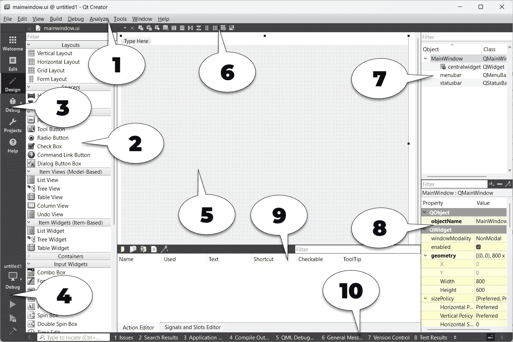

图 1.1 – Qt Designer 界面的概述

上述截图的解释如下：

1.  **菜单栏**：菜单栏包含特定于应用程序的菜单，提供对基本功能的轻松访问，例如创建新项目、保存文件、撤销、重做、复制和粘贴。它还允许您访问 Qt Creator 附带的开发工具，例如编译器、调试器和性能分析器。

1.  **部件箱**：在这里，您可以找到 Qt Designer 提供的所有不同类型的部件。您可以通过从**部件箱**区域中选择一个部件并将其拖动到表单编辑器中来将部件添加到程序的 UI 中。

1.  **模式选择器**：模式选择器是一个侧面板，其中放置了快捷按钮，以便轻松访问不同的工具。您可以通过点击模式选择器面板上的**编辑**或**设计**按钮快速在脚本编辑器和表单编辑器之间切换，这对于多任务处理非常有用。您还可以以相同的方式和速度轻松导航到调试器和性能分析工具。

1.  **构建快捷键**：构建快捷键位于模式选择器面板的底部。您可以通过按下这里的快捷按钮轻松构建、运行和调试项目。

1.  **表单编辑器**：表单编辑器是您编辑程序 UI 的地方。您可以通过从**部件箱**区域选择一个部件并将其拖动到表单编辑器中来向程序添加不同的部件。

1.  **表单工具栏**：从这里，您可以快速选择要编辑的不同表单。点击**部件箱**区域顶部的下拉框并选择您想要用 Qt Designer 打开的文件。在下拉框旁边是按钮，用于在表单编辑器的不同模式之间切换，以及按钮用于更改 UI 布局。

1.  `.ui`文件。所有部件都根据它们在层次结构中的父子关系排列。您可以从**对象检查器**区域选择一个部件，在**属性****编辑器**区域显示其属性。

1.  **属性编辑器**：**属性编辑器**区域将显示您从**对象检查器**区域或表单编辑器窗口中选择的部件的所有属性。

1.  **动作编辑器**和**信号与槽编辑器**：此窗口包含两个编辑器：**动作编辑器**和**信号与槽编辑器**。您可以通过窗口下方的标签访问这两个编辑器。**动作编辑器**是您创建可以添加到程序 UI 菜单栏或工具栏中的动作的地方。

1.  **输出面板**：输出面板由几个不同的窗口组成，显示与脚本编译和调试相关的信息和输出消息。您可以通过按下带有数字的按钮在不同输出面板之间切换，例如**1 问题**、**2 搜索结果**或**3 应用程序输出**。

## 更多...

在本示例中，我们讨论了如何通过 C++编码将样式表应用到 Qt 小部件上。虽然这种方法效果不错，但大多数情况下，负责设计程序 UI 的人不是程序员，而是一个专注于设计用户友好 UI 的 UI 设计师。在这种情况下，最好让 UI 设计师使用不同的工具来设计程序的布局和样式表，而不是与代码纠缠。Qt 提供了一个名为**Qt Creator**的一站式编辑器。

Qt Creator 由几个不同的工具组成，例如脚本编辑器、编译器、调试器、性能分析器和 UI 编辑器。UI 编辑器，也称为**Qt Designer**，是设计师在没有编写任何代码的情况下设计程序 UI 的完美工具。这是因为 Qt Designer 采用了*所见即所得*的方法，通过提供最终结果的准确视觉表示，这意味着你用 Qt Designer 设计的任何内容在程序编译和运行时都将具有相同的视觉表现。

Qt 样式表与 CSS 之间的相似之处如下：

+   这就是典型的 CSS 代码的样子：

    ```cpp
    h1 { color: red; background-color: white;}
    ```

+   这就是 Qt 样式表的样子，它与前面的 CSS 几乎相同：

    ```cpp
    QLineEdit { color: red; background-color: white;}
    ```

如你所见，它们都包含一个选择器和声明块。每个声明包含一个属性和一个值，由冒号分隔。在 Qt 中，可以通过在 C++代码中调用`QObject::setStyleSheet()`函数将样式表应用到单个小部件上。

例如，考虑以下内容：

```cpp
myPushButton->setStyleSheet("color : blue");
```

上述代码将`myPushButton`变量名的按钮文本变为蓝色。你同样可以通过在 Qt Designer 的样式表属性字段中编写声明来实现相同的结果。我们将在*自定义基本样式表*示例中进一步讨论 Qt Designer。

Qt 样式表还支持 CSS2 标准中定义的所有不同类型的选择器，包括`usernameEdit`对象名称，我们可以通过使用 ID 选择器来引用它：

QLineEdit#usernameEdit { background-color: blue }

注意

要了解 CSS2 中所有可用的选择器（Qt 样式表也支持这些选择器），请参阅此文档：[`www.w3.org/TR/REC-CSS2/selector.html`](http://www.w3.org/TR/REC-CSS2/selector.html)。

# 自定义基本样式表

在上一个示例中，你学习了如何使用 Qt Designer 将样式表应用到小部件上。让我们疯狂一点，进一步探索，创建一些其他类型的小部件，并将它们的样式属性更改为一些奇怪的东西，以学习为目的。

然而，这一次，我们不会逐个将样式应用到每个小部件上；相反，我们将学习如何将样式表应用到主窗口，并让它向下继承到所有其他小部件，这样样式表就更容易在长期内进行管理和维护。

## 如何做到这一点...

在下面的示例中，我们将对画布上的不同类型的小部件进行格式化，并在样式表中添加一些代码以改变其外观：

1.  通过选择`PushButton`并单击**样式表**属性旁边的箭头按钮来从`PushButton`移除样式表。此按钮将属性还原为其默认值，在这种情况下是空样式表。

1.  通过从**小部件框**区域逐个拖动它们到表单编辑器中，向 UI 添加更多小部件。我已经添加了一个行编辑器、组合框、水平滑块、单选按钮和一个复选框。

1.  为了简化，通过在**对象检查器**区域选择它们，右键单击并选择**移除**来从你的 UI 中删除**菜单栏**、**主工具栏**和**状态栏**。现在，你的 UI 应该看起来类似于这样：

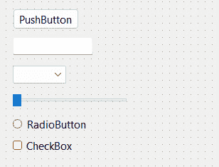

图 1.2 – 将一些小部件拖放到表单编辑器中

1.  从表单编辑器或**对象检查器**区域选择主窗口，然后右键单击并选择**更改样式表...**以打开**编辑样式表**窗口。将以下内容插入到样式表中：

    ```cpp
    border: 2px solid gray;
    border-radius: 10px;
    padding: 0 8px;
    background: yellow;
    ```

1.  你将看到一个奇特的 UI，所有内容都被黄色覆盖，并且有粗边框。这是因为前面的样式表没有选择器，这意味着样式将应用于主窗口层次结构下的子小部件。为了改变这一点，让我们尝试不同的方法：

    ```cpp
    QPushButton {
         border: 2px solid gray;
         border-radius: 10px;
         padding: 0 8px;
         background: yellow;
    }
    ```

1.  这次，只有**PushButton**将获得前面代码中描述的样式，所有其他小部件将恢复到默认样式。你可以尝试向你的 UI 添加更多按钮；它们都将看起来相同：

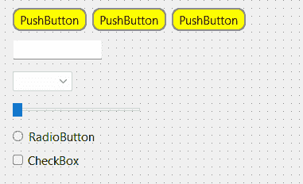

图 1.3 – 将按钮改为黄色

1.  这是因为我们明确告诉选择器将样式应用于具有`QPushButton`类的所有小部件。我们也可以通过在样式表中提及其名称来仅将样式应用于一个按钮，如下面的代码所示：

    ```cpp
    QPushButton#pushButton_3 {
         border: 2px solid gray;
         border-radius: 10px;
         padding: 0 8px;
         background: yellow;
    }
    ```

1.  一旦你理解了这种方法，我们就可以将以下代码添加到样式表中：

    ```cpp
    QPushButton {
         color: red;
         border: 0px;
         padding: 0 8px;
         background: white;
    }
    QPushButton#pushButton_2 {
         border: 1px solid red;
         border-radius: 10px;
    }
    ```

1.  这段代码会改变所有按钮的样式，以及`pushButton_2`按钮的一些属性。我们保持`pushButton_3`的样式表不变。现在，按钮将看起来像这样：

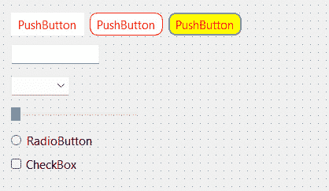

图 1.4 – 为每个按钮应用不同的样式

1.  第一组样式表将所有`QPushButton`类型的小部件更改为无边框的白色矩形按钮，文本为红色。第二组样式表仅更改名为`pushButton_2`的特定`QPushButton`小部件的边框。请注意，`pushButton_2`的背景颜色和文本颜色仍然分别是白色和红色，因为我们没有在第二组样式表中覆盖它们，因此它将返回到第一组样式表中描述的样式，因为它适用于所有`QPushButton`小部件。第三个按钮的文本也变为红色，因为我们没有在第三组样式表中描述**颜色**属性。

1.  创建另一组使用通用选择器的样式表，可以使用以下代码：

    ```cpp
    * {
         background: qradialgradient(cx: 0.3, cy: -0.4, fx: 0.3, fy: -0.4, radius: 1.35, stop: 0 #fff, stop: 1 #888);
         color: rgb(255, 255, 255);
         border: 1px solid #ffffff;
    }
    ```

1.  通用选择器将影响所有小部件，无论它们的类型如何。因此，前面的样式表将应用一个漂亮的渐变颜色到所有小部件的背景，并将它们的文本设置为白色，并带有白色的一像素实线轮廓。我们不需要写出颜色的名称（即白色），我们可以使用`rgb`函数（`rgb(255, 255, 255)`）或十六进制代码（`#ffffff`）来描述颜色值。

1.  与之前一样，前面的样式表不会影响按钮，因为我们已经为它们提供了自己的样式，这将覆盖通用选择器中描述的通用样式。只需记住，在 Qt 中，当有多个样式影响小部件时，最终将使用更具体的样式。这就是 UI 现在的样子：

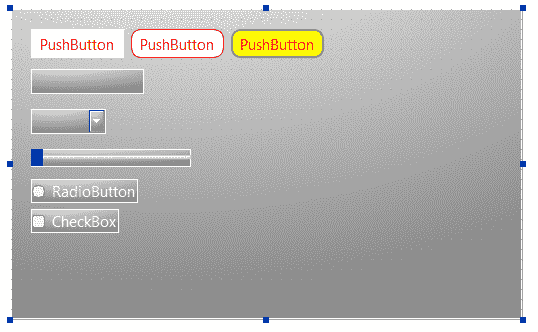

图 1.5 – 将渐变背景应用到所有其他小部件

## 它是如何工作的……

如果你曾经参与过使用 HTML 和 CSS 的 Web 开发，Qt 的样式表与 CSS 的工作方式相同。样式表提供了定义来描述小部件的展示——每个小部件组中每个元素的色彩是什么，边框应该有多厚，等等。如果你将小部件的名称指定给样式表，它将更改你提供的名称的特定`PushButton`小部件的样式。其他小部件将不受影响，并保持默认样式。

要更改小部件的名称，从表编辑器或**对象检查器**区域选择小部件，并在属性窗口中更改**objectName**属性。如果你之前使用 ID 选择器更改小部件的样式，更改其对象名称将破坏样式表并丢失样式。要解决这个问题，只需在样式表中更改对象名称即可。

# 使用样式表创建登录屏幕

接下来，我们将学习如何将之前学到的所有知识结合起来，为虚构的操作系统创建一个假图形登录界面。除了样式表之外，你还需要掌握如何使用 Qt Designer 中的布局系统整齐地排列小部件。

## 如何做到这一点...

让我们按照以下步骤开始：

1.  在开始做任何事情之前，我们需要设计图形登录界面的布局。规划对于制作优秀的软件非常重要。以下是我制作的示例布局设计，以展示我如何想象登录界面的外观。只要能清楚地传达信息，这样的简单线条草图就足够了：

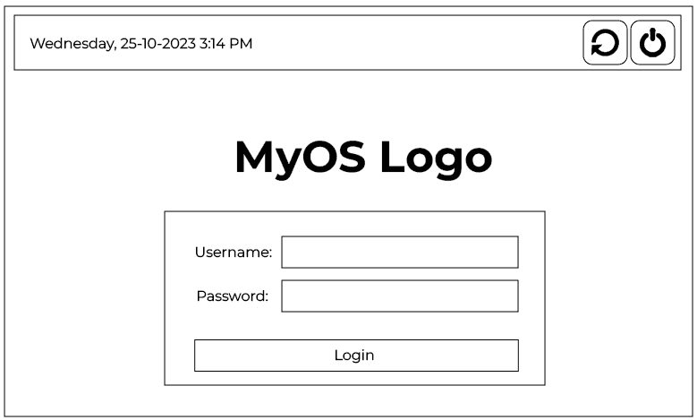

图 1.6 – 描述登录界面的简单草图

1.  再次回到 Qt Designer。

1.  我们将首先在顶部面板放置小部件，然后在下面放置标志和登录表单。

1.  选择主窗口，将其宽度和高度分别从`400`和`300`改为`800`和`600`——我们需要更大的空间来放置所有小部件。

1.  从**显示小部件**类别中点击并拖动一个标签到**小部件框**区域的表单编辑器。

1.  更改`currentDateTime`并更改其文本属性以显示当前日期和时间——例如，`周三，25-10-2023` `3:14 PM`。

1.  点击并拖动`PushButton`到`restartButton`和`shutdownButton`下。

1.  选择主窗口，并点击表单工具栏上的小图标按钮，当鼠标悬停时它显示为**垂直布局**。你会看到小部件会自动排列在主窗口上，但这还不是我们想要的。

1.  在**布局**类别下，点击并拖动一个**水平布局**小部件到主窗口。

1.  点击并拖动两个按钮和文本标签到水平布局中。你会看到三个小部件被排列成一行，但在垂直方向上，它们位于屏幕的中间。水平排列几乎正确，但垂直位置不正确。

1.  从**间隔**类别中点击并拖动一个**垂直间隔**小部件，并将其放置在我们在第 9 步中创建的**水平布局**小部件下方（在红色矩形轮廓下）。所有小部件都会被间隔推到顶部。

1.  在文本标签和两个按钮之间放置一个**水平间隔**小部件，以保持它们之间的距离。这将确保文本标签始终保持在左侧，而按钮则对齐到右侧。

1.  将两个按钮的`55 x 55`设置为相同。将按钮的**文本**属性设置为空，因为我们将会使用图标而不是文本。我们将在*使用样式表中的资源*菜谱中学习如何在按钮小部件中放置图标。

1.  你的 UI 应该看起来像这样：

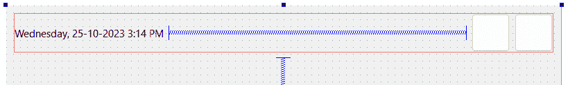

图 1.7 – 使用水平间距将文本和按钮分开

接下来，我们将添加标志。按照以下步骤操作：

1.  在顶部面板和**水平间距**小部件之间添加一个**水平布局**小部件，用作标志的容器。

1.  在添加**水平布局**小部件后，您会发现布局的高度（几乎为零高度）太窄，以至于您无法向其中添加任何小部件。这是因为布局是空的，并且被其下的垂直间距推到零高度。为了解决这个问题，我们可以将其**垂直间距**（无论是**layoutTopMargin**还是**layoutBottomMargin**）临时设置得更大，直到向布局中添加小部件。

1.  添加一个`logo`。我们将在*使用样式表中的资源*配方中了解更多关于如何将图像插入到标签中，以便将其用作标志。现在，只需将`150` `x 150`清空即可。

1.  如果您还没有这样做，请将布局的垂直间距设置回零。

1.  标志现在看起来将不可见，因此我们将放置一个临时样式表来使其可见，直到我们在*使用样式表中的资源*配方中添加图像。样式表非常简单：

    ```cpp
    border: 1px solid;
    ```

    您的 UI 应该看起来类似于这个：

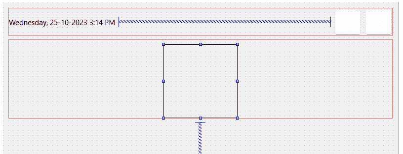

图 1.8 – 将占位符标志放置在中间

现在，让我们创建登录表单：

1.  添加一个`100`)，以便您可以更轻松地向其中添加小部件。

1.  添加一个`20`)，以便我们可以将其中的小部件放置进去。

1.  右键单击`QWidget`对象，它将自动继承小部件类的所有属性，这意味着我们现在可以调整其大小以满足我们的需求。

1.  将我们刚刚从布局转换过来的`QWidget`对象重命名为`loginForm`，并将其大小改为`350 x 200`。

1.  由于我们已经在**水平布局**中放置了`loginForm`小部件，我们可以将其**layoutTopMargin**属性设置回零。

1.  将您为标志添加的相同样式表添加到`loginForm`小部件中，使其临时可见。然而，这次，我们需要在前面添加一个 ID 选择器，以便它只会将样式应用于`loginForm`而不是其子小部件：

    ```cpp
    #loginForm { border: 1px solid; }
    ```

    您的 UI 应该看起来类似于这个：


图 1.9 – 构建登录表单的框架

我们还没有完成登录表单。现在我们已经创建了登录表单的容器，是时候将更多小部件放入表单中：

1.  在登录表单容器中放置两个水平布局。我们需要两个布局：一个用于用户名字段，另一个用于密码字段。

1.  将`Username:`和其下方的`Password:`添加到`loginForm`中。将两个行编辑分别重命名为`username`和`password`。

1.  在密码布局下方添加一个按钮，并将其`Login`改为`loginButton`。

1.  您可以在`5`之后添加一个`Login`按钮，以稍微分隔它们。

1.  选择`loginForm`容器并将其所有边距设置为`35`。这是为了通过在其所有边上添加一些空间来使登录表单看起来更好。

1.  将`Username`、`Password`和`loginButton`小部件的值设置为`25`，这样它们看起来就不会那么拥挤。

    你的 UI 应该看起来像这样：

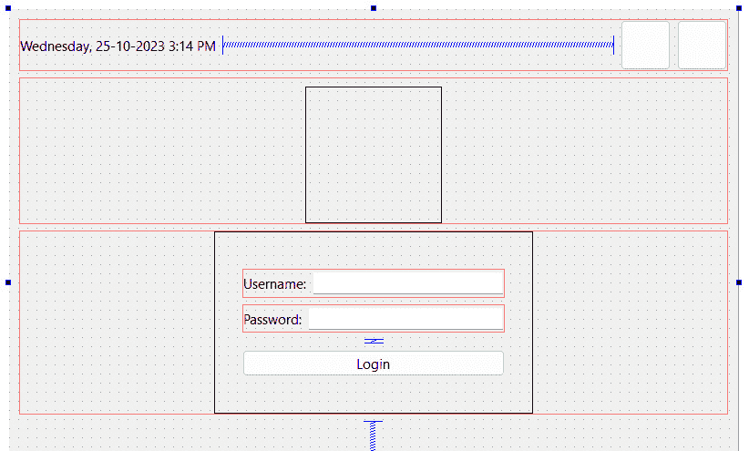

图 1.10 – 向登录表单添加小部件

注意

或者，你可以使用网格布局来保持**Username**和**Password**字段的大小一致。

我们还没有完成！正如你所见，由于它们下面的**垂直间距**小部件，登录表单和标志都粘附在主窗口的顶部。标志和登录表单应该放置在主窗口的中心而不是顶部。要解决这个问题，请按照以下步骤操作：

1.  在顶部面板和标志布局之间添加另一个**垂直间距**小部件。这将抵消底部的间距，以平衡对齐。

1.  如果你认为标志与登录表单的距离太近，你可以添加一个`10`。

1.  右键单击顶部面板的布局并选择`topPanel`。布局必须转换为**QWidget**，因为我们不能将样式表应用到布局上。这是因为布局除了边距之外没有其他属性。

1.  主窗口的边缘有一点边距 – 我们不希望这样。要删除边距，请从**对象检查器**窗口中选择**centralWidget**对象，该窗口位于**MainWindow**面板下方，并将所有边距值设置为零。

1.  通过单击**运行**按钮（带有绿色箭头图标）来运行项目，看看你的程序看起来像什么。如果一切顺利，你应该看到如下所示的内容：

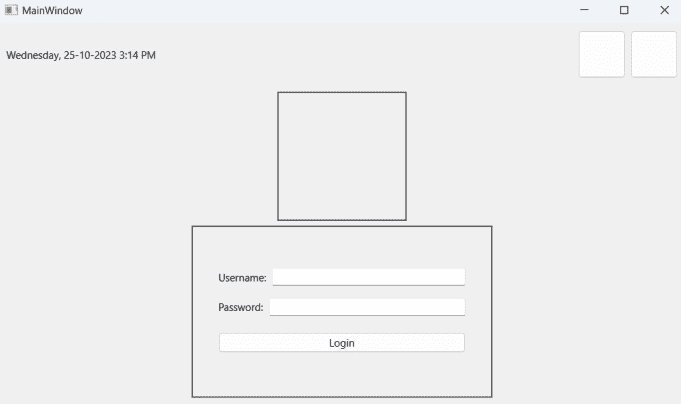

图 1.11 – 我们完成了布局 – 至少目前是这样

1.  现在，让我们使用样式表来装饰 UI！由于所有重要的小部件都已经赋予了对象名称，因此从主窗口应用样式表到它们会更容易，因为我们只需将样式表写入主窗口，并让它们从层次结构树中继承下来。

1.  在**对象检查器**区域中右键单击**MainWindow**，然后选择**更改样式表...**。

1.  将以下代码添加到样式表中：

    ```cpp
    #centralWidget { background: rgba(32, 80, 96, 100); }
    ```

1.  主窗口的背景将改变颜色。我们将在*使用样式表中的资源*配方中学习如何使用图像作为背景。所以，颜色只是临时的。

1.  在 Qt 中，如果你想将样式应用到主窗口本身，你必须将其应用到其**centralWidget**小部件上，而不是主窗口，因为窗口只是一个容器。

1.  在顶部面板上添加一个漂亮的渐变色：

    ```cpp
    #topPanel {
         background-color: qlineargradient(spread:reflect, x1:0.5, y1:0, x2:0, y2:0, stop:0 rgba(91, 204, 233, 100), stop:1 rgba(32, 80, 96, 100));
    }
    ```

1.  将黑色应用到登录表单，并使其看起来半透明。我们还将通过设置`border-radius`属性使登录表单容器的角落略微圆滑：

    ```cpp
    #loginForm {
         background: rgba(0, 0, 0, 80);
         border-radius: 8px;
    }
    ```

1.  将样式应用到小部件的一般类型：

    ```cpp
    QLabel { color: white; }
    QLineEdit { border-radius: 3px; }
    ```

1.  之前的样式表将所有标签的文本颜色更改为白色；这包括小部件上的文本，因为内部 Qt 使用与具有文本的小部件相同的标签类型。此外，我们还使行编辑小部件的角落略微圆滑。

1.  将样式表应用于我们 UI 上的所有按钮：

    ```cpp
    QPushButton {
         color: white;
         background-color: #27a9e3;
         border-width: 0px;
         border-radius: 3px;
    }
    ```

1.  之前样式表将所有按钮的文本颜色改为白色，然后将背景颜色设置为蓝色，并使其角落略微圆滑。

1.  为了更进一步，我们将使用 `hover` 关键字使按钮的颜色在鼠标悬停时改变：

    ```cpp
    QPushButton:hover { background-color: #66c011; }
    ```

1.  当我们将鼠标悬停在按钮上时，之前的样式表将按钮的背景颜色更改为绿色。我们将在*自定义属性和* *子控件* 菜单中进一步讨论这一点。

1.  您可以进一步调整小部件的大小和边距，使它们看起来更好。请记住，通过移除在 *步骤 6* 中直接应用于登录表单的样式表来移除登录表单的边框线。

1.  您的登录屏幕应该看起来像这样：

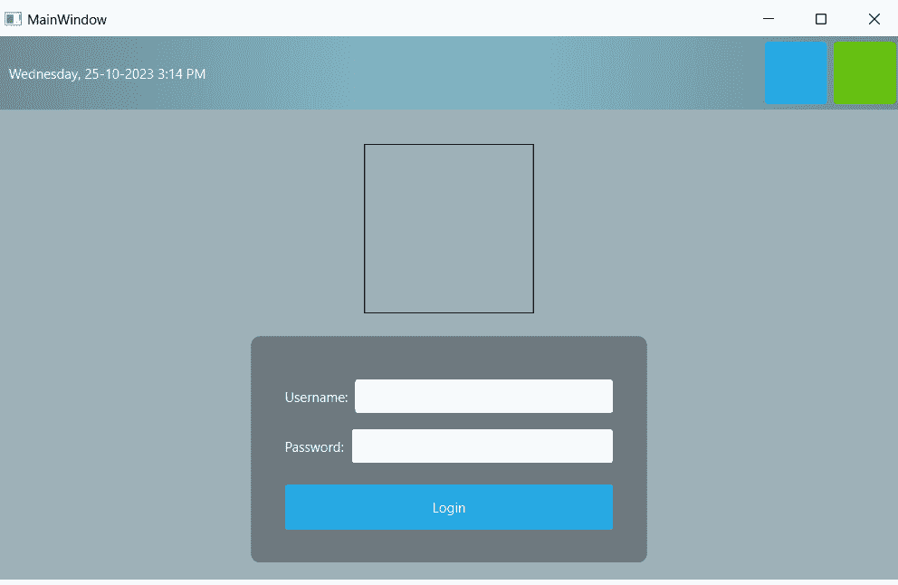

图 1.12 – 将颜色和样式应用于小部件

## 它是如何工作的...

此示例更多地关注 Qt 的布局系统。Qt 的布局系统允许我们的应用程序 GUI 通过排列每个小部件的子对象自动在给定空间内排列自己。我们在此菜谱中使用的空格项有助于将布局中包含的小部件推向外部，从而在空格项的宽度上创建间距。

要在布局中间定位小部件，我们必须在布局中放入两个空格项：一个在小部件的左侧，一个在小部件的右侧。然后，两个空格会将小部件推向布局的中间。

# 在样式表中使用资源

Qt 为我们提供了一个平台无关的资源系统，允许我们将任何类型的文件存储在我们的程序的可执行文件中以供以后使用。我们可以在可执行文件中存储的文件类型没有限制——图像、音频、视频、HTML、XML、文本文件、二进制文件等等都是允许的。

资源系统对于将资源文件（如图标和翻译文件）嵌入可执行文件以便应用程序随时访问非常有用。为了实现这一点，我们必须在`.qrc`文件中告诉 Qt 我们想要添加到其资源系统中的文件；Qt 将在构建过程中处理其余部分。

## 如何做到这一点...

要将新的 `.qrc` 文件添加到我们的项目中，请转到 `resources`) 并点击 `.qrc` 文件现在将被 Qt Creator 创建并自动打开。您不需要直接以 XML 格式编辑 `.qrc` 文件，因为 Qt Creator 为您提供了用户界面来管理您的资源。

要将图像和图标添加到你的项目中，你需要确保图像和图标被放置在你的项目目录中。当`.qrc`文件在 Qt Creator 中打开时，点击**添加**按钮，然后点击**添加前缀**按钮。前缀用于对资源进行分类，以便在项目中有大量资源时能更好地管理：

1.  将你刚刚创建的前缀重命名为`/icons`。

1.  通过点击**添加**，然后点击**添加前缀**来创建另一个前缀。

1.  将新前缀重命名为`/images`。

1.  选择`/icon`前缀，然后点击**添加**，接着点击**添加文件**。

1.  将会出现一个文件选择窗口；使用它来选择所有图标文件。你可以在按住键盘上的*Ctrl*键的同时点击文件来选择多个文件。完成后点击**打开**。

1.  选择`/images`前缀，然后点击**添加**按钮，接着点击**添加文件**按钮。将再次弹出文件选择窗口；这次我们将选择背景图像。

1.  重复前面的步骤，但这次我们将把标志图像添加到`/images`前缀。完成后，按*Ctrl* + *S*保存。你的`.qrc`文件现在应该看起来像这样：

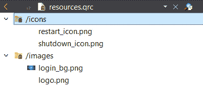

图 1.13 – 显示资源文件的结构

1.  返回到`mainwindow.ui`文件；让我们利用我们刚刚添加到项目中的资源。选择位于顶部面板上的重启按钮。滚动到**属性编辑器**区域，直到你看到**图标**属性。点击带有下拉箭头图标的小按钮，并从其菜单中选择**选择资源**。

1.  **选择资源**窗口将弹出。在左侧面板上点击图标前缀，然后在右侧面板上选择重启图标。按**确定**。

1.  按钮上会出现一个小图标。这个图标看起来非常小，因为默认图标大小设置为`16 x 16`。将其更改为`50 x 50`；你会看到图标变得更大。重复前面的步骤为关机按钮，这次选择关机图标。

1.  这两个按钮现在应该看起来像这样：

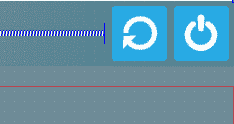

图 1.14 – 将图标应用到按钮上

1.  让我们使用添加到资源文件中的图像作为我们的标志。选择标志小部件，并移除我们之前添加的样式表以渲染其轮廓。

1.  滚动到**属性编辑器**区域，直到你看到**pixmap**属性。

1.  点击**pixmap**属性后面的下拉小按钮，并从菜单中选择**选择资源**。选择标志图像并点击**确定**。标志的大小不再遵循你之前设置的维度；它遵循图像的实际维度。我们无法更改其维度，因为这正是**pixmap**属性的工作方式。

1.  如果你想对标志的尺寸有更多控制，你可以从 **pixmap** 属性中移除图像，并使用样式表代替。你可以使用以下代码将图像应用到图标容器中：

    ```cpp
    border-image: url(:/images/logo.png);
    ```

1.  要获取图像的路径，在文件列表窗口中右键单击图像的名称，并选择 **复制路径**。路径将被保存到你的操作系统剪贴板；现在，你只需将其粘贴到前面的样式表中。使用这种方法将确保图像适合你应用样式的控件尺寸。现在，你的标志应该看起来像以下截图所示：

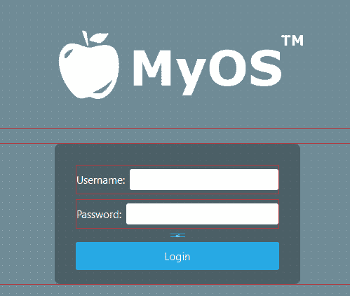

图 1.15 – 标志现在出现在登录表单的顶部

1.  使用样式表将壁纸图像应用到背景上。由于背景尺寸会根据窗口大小变化，我们无法在样式表中使用 `border-image` 属性。右键单击主窗口并选择 **更改样式表...** 以打开 **编辑样式表** 窗口。我们将在 **centralWidget** 小部件的样式表下添加一行新内容：

    ```cpp
    #centralWidget {
         background: rgba(32, 80, 96, 100);
         border-image: url(:/images/login_bg.png);
    }
    ```

1.  真的是非常简单和容易！你的登录屏幕现在应该看起来像这样：

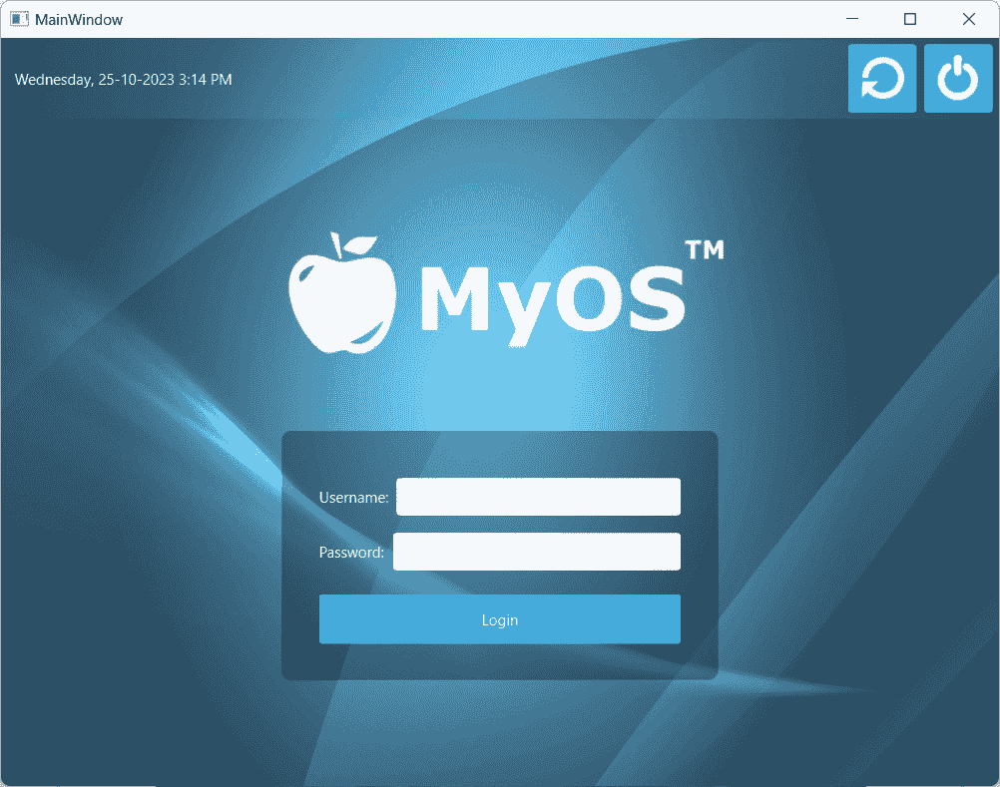

图 1.16 – 最终结果看起来整洁

## 它是如何工作的...

Qt 的资源系统在编译时将二进制文件，如图像和翻译文件，存储在可执行文件中。它读取你的项目中的 `.qrc`) 以定位需要存储在可执行文件中的文件，并将它们包含在构建过程中。一个 `.qrc` 文件看起来像这样：

```cpp
<!DOCTYPE RCC>
<RCC version="1.0">
     <qresource>
           <file>images/copy.png</file>
           <file>images/cut.png</file>
           <file>images/new.png</file>
           <file>images/open.png</file>
           <file>images/paste.png</file>
           <file>images/save.png</file>
     </qresource>
</RCC>
```

它使用 `.qrc` 文件，或其子目录之一。

# 自定义属性和子控件

Qt 的样式表系统使我们能够轻松地创建令人惊叹且专业的 UI。在这个例子中，我们将学习如何为我们的小部件设置自定义属性，并使用它们在不同的样式之间切换。

## 如何做到这一点...

按照以下步骤自定义小部件属性和子控件：

1.  让我们创建一个新的 Qt 项目。我已经为此准备了 UI。UI 包含左侧的三个按钮和右侧的 **标签小部件**，其中包含三个页面，如下面的截图所示：

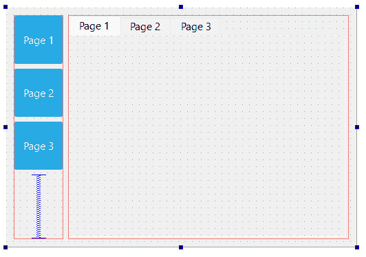

图 1.17 – 基本用户界面，包含三个标签和按钮

1.  三个按钮是蓝色的，因为我已经将以下样式表添加到主窗口中（而不是单独的按钮）：

    ```cpp
    QPushButton {
         color: white;
         background-color: #27a9e3;
         border-width: 0px;
         border-radius: 3px;
    }
    ```

1.  我将通过向主窗口添加以下样式表来解释 Qt 中的 **伪状态** 是什么。你可能已经熟悉这个了：

    ```cpp
    QPushButton:hover {
         color: white;
         background-color: #66c011;
         border-width: 0px;
         border-radius: 3px;
    }
    ```

1.  我们在 *使用样式表创建登录界面* 的配方中使用了前面的样式表，使按钮在鼠标悬停事件发生时改变颜色。这是通过 Qt 样式表的 `hover` 与 `QPushButton` 类通过冒号分隔来实现的。每个小部件都有一组通用伪状态，例如 `QPushButton`，但不是 `QLineEdit`。让我们添加一个 **pressed** 伪状态，当用户点击按钮时将按钮的颜色变为黄色：

    ```cpp
    QPushButton:pressed {
         color: white;
         background-color: yellow;
         border-width: 0px;
         border-radius: 3px;
    }
    ```

1.  伪状态允许用户根据适用于他们的条件加载不同的样式表集。Qt 通过在 Qt 样式表中实现 **动态属性** 来进一步推进这一概念。这允许我们在满足自定义条件时更改小部件的样式表。我们可以利用这个特性，根据我们可以在 Qt 中使用自定义属性设置的特定条件来更改按钮的样式表。首先，我们将添加此样式表到我们的主窗口：

    ```cpp
    QPushButton[pagematches=true] {
         color: white;
         background-color: red;
         border-width: 0px;
         border-radius: 3px;
    }
    ```

1.  这将如果 `pagematches` 属性返回 `QPushButton` 类，则将按钮的背景颜色更改为红色。然而，我们可以使用 `QObject::setProperty()` 将它添加到我们的按钮中：

    +   在你的 `mainwindow.cpp` 源代码中，在 `ui->setupUi(this)` 之后添加以下代码：

        ```cpp
        ui->button1->setProperty("pagematches", true);
        ```

    上述代码将为第一个按钮添加一个名为 `pagematches` 的自定义属性，并将其值设置为 true。这将使第一个按钮默认变为红色。

    +   然后，从列表中右键单击 `currentChanged(int)` 选项，并点击 **OK**。Qt 将为你生成一个槽函数，看起来像这样：

        ```cpp
        private slots:
        void on_tabWidget_currentChanged(int index);
        ```

    +   你将在 `mainwindow.cpp` 中看到函数的声明。让我们向该函数添加一些代码：

        ```cpp
        void MainWindow::on_tabWidget_currentChanged(int
        index) {
             // Set all buttons to false
             ui->button1->setProperty("pagematches", false);
             ui->button2->setProperty("pagematches", false);
             ui->button3->setProperty("pagematches", false);
             // Set one of the buttons to true
             if (0 == index)
                   ui->button1->setProperty("pagematches", true);
             else if (index == 1)
                   ui->button2->setProperty("pagematches", true);
             else
                   ui->button3->setProperty("pagematches", true);
             // Update buttons style
             ui->button1->style()->polish(ui->button1);
             ui->button2->style()->polish(ui->button2);
             ui->button3->style()->polish(ui->button3);
        }
        ```

1.  上述代码在 **Tab Widget** 切换到当前页面时将所有三个按钮的 `pagematches` 属性设置为 **false**。在决定哪个按钮应该变为红色之前，请确保重置一切。

1.  检查由事件信号提供的 `index` 变量；这将告诉你当前页面的索引号。将一个按钮的 `pagematches` 属性设置为 `index` 号。

1.  通过调用 `polish()` 来刷新所有三个按钮的样式。你可能还希望在 `mainwindow.h` 中添加以下头文件：

    ```cpp
    #include <QStyle>
    ```

1.  构建并运行项目。现在你应该看到每次你将 **Tab Widget** 切换到不同的页面时，三个按钮都会变为红色。此外，当鼠标悬停时，按钮将变为绿色，当你点击它们时，颜色将变为黄色：

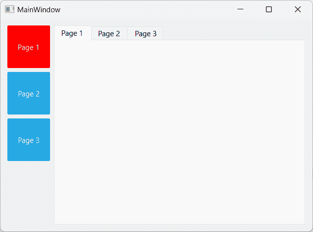

图 1.18 – 最终结果看起来是这样的

## 它是如何工作的…

Qt 为用户提供添加任何类型小部件自定义属性的自由。如果你想在满足特定条件时更改特定小部件，自定义属性非常有用，而 Qt 默认不提供这样的上下文。这允许用户扩展 Qt 的可用性，使其成为定制解决方案的灵活工具。

例如，如果我们主窗口上有一排按钮，并且我们需要其中一个按钮根据页面改变其颜色，我们可以使用`QObject::setProperty()`。要读取自定义属性，我们可以使用另一个名为`QObject::property()`的函数。

接下来，我们将讨论 Qt 样式表中的子控件。通常，一个小部件不仅仅是一个单独的对象，而是由多个对象或控件组合而成，用于形成一个更复杂的小部件。这些对象被称为**子控件**。

例如，一个旋转框小部件包含一个输入字段、一个下按钮、一个上按钮、一个上箭头和一个下箭头，与一些其他小部件相比，这相当复杂。在这种情况下，Qt 通过允许我们通过样式表更改每个子控件来赋予我们更多的灵活性。我们可以通过在控件类名后面指定子控件的名称来实现，名称由双冒号分隔。例如，如果我想将下按钮的图像更改为旋转框，我可以将我的样式表编写如下：

```cpp
QSpinBox::down-button {
     image: url(:/images/spindown.png);
     subcontrol-origin: padding;
     subcontrol-position: right bottom;
}
```

这只会将图像应用到我的旋转框的下按钮，而不会应用到小部件的任何其他部分。通过结合**自定义属性**、**伪状态**和**子控件**，Qt 为我们提供了一个非常灵活的方法来自定义我们的用户界面。

注意

访问以下链接了解有关 Qt 中伪状态和子控件的更多信息：[`doc.qt.io/qt-6/stylesheet-reference.html`](http://doc.qt.io/qt-6/stylesheet-reference.html)。

# Qt 建模语言（QML）中的样式

**Qt 元语言**或**Qt 建模语言**（**QML**）是一种受 JavaScript 启发的用户界面标记语言，Qt 用它来设计用户界面。Qt 为你提供了**Qt Quick 组件**（由 QML 技术驱动的控件），以便在不使用 C++编程的情况下轻松设计触摸友好的 UI。我们将通过遵循本食谱中提供的步骤来学习如何使用 QML 和 Qt Quick 组件来设计我们程序的 UI。

## 如何做到这一点...

按照以下步骤了解 QML 中的样式：

1.  自从 Qt 6 以来，Qt 公司发布了一个名为**Qt Design Studio**的独立程序，用于开发 Qt Quick 应用程序。它的目的是将设计师和程序员的任务分开。因此，如果你是 GUI 设计师，你应该使用**Qt Design Studio**，如果你是程序员，则应坚持使用 Qt Creator。一旦安装并打开 Qt Design Studio，可以通过点击大号**创建项目…**按钮或从顶部菜单中选择**文件** | **新建项目…**来创建一个新项目：

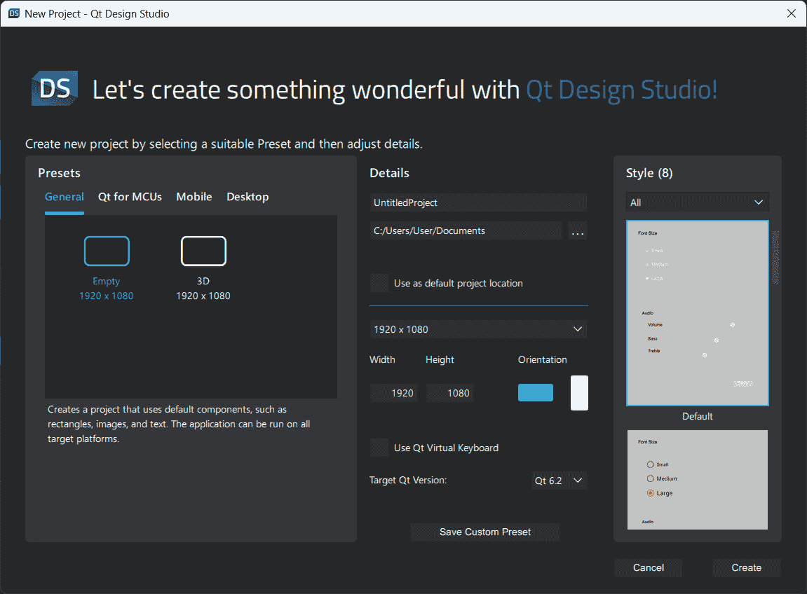

图 1.19 – 在 Qt Design Studio 中创建新的 QML 项目

1.  当 **新建项目** 窗口出现时，输入项目窗口的默认宽度和高度，并为你的项目输入一个名称。然后，选择你想要创建项目所在的目录，选择默认的 GUI 风格，选择目标 Qt 版本，并点击 **创建** 按钮。现在，Qt Design Studio 将创建你的 Qt Quick 项目。

1.  在项目资源中，`App.qml` 文件与其他文件有一些区别。这个 `.qml` 文件是使用 QML 标记语言编写的 UI 描述文件。如果你双击 `main.qml` 文件，Qt Creator 将打开脚本编辑器，你会看到如下内容：

    ```cpp
    import QtQuick 6.2
    import QtQuick.Window 6.2
    import MyProject
    Window {
        width: mainScreen.width
        height: mainScreen.height
        visible: true
        title: "MyProject"
        Screen01 {
            id: mainScreen
        }
    }
    ```

1.  此文件指示 Qt 创建一个窗口，加载 **Screen01** 用户界面以及带有你的项目名称的窗口标题。**Screen01** 界面来自另一个名为 **Screen01.ui.qml** 的文件。

1.  如果你打开位于你项目 `scr` 文件夹中的 `main.cpp` 文件，你会看到以下代码行：

    ```cpp
    QQmlApplicationEngine engine;
    const QUrl url(u"qrc:Main/main.qml"_qs);
    ```

1.  上述代码告诉 Qt 的 QML 引擎在程序启动时加载 `main.qml` 文件。如果你想加载其他 `.qml` 文件，你知道在哪里查找代码。`src` 文件夹在 Qt Design Studio 项目中是隐藏的；你可以在你的项目目录中找到它。

1.  如果你现在构建项目，你将得到一个带有简单文本和显示“**按我**”的按钮的巨大窗口。当你按下按钮时，窗口的背景颜色和文本将发生变化：

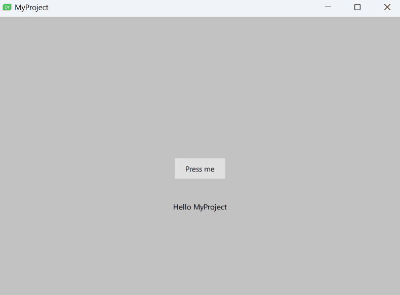

图 1.20 – 你的第一个 Qt Quick 程序

1.  要添加 UI 元素，我们将通过转到 **文件** | **新建文件…** 并在 **文件和类** | **Qt Quick** **文件**类别下选择 **Qt Quick UI 文件** 来创建一个 **Qt Quick UI 文件**：

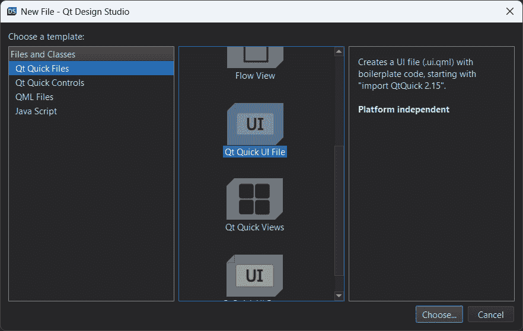

图 1.21 - 创建新的 Qt Quick UI 文件

1.  设置 `Main`，然后点击 **完成** 按钮：


图 1.22 – 为你的 Qt Quick 组件赋予一个有意义的名称

1.  已在你的项目资源中添加了一个名为 `Main.ui.qml` 的新文件。尝试通过双击它来打开 `Main.ui.qml` 文件，如果它没有被 Qt Design Studio 在创建时自动打开。你将看到一个与之前 C++ 项目中完全不同的 UI 编辑器。

1.  让我们打开 `App.qml` 并将 **Screen01** 替换为 **Main**，如下所示：

    ```cpp
    Main {
         id: mainScreen
    }
    ```

1.  当 QML 引擎加载`App.qml`时，它也会将`Main.ui.qml`导入 UI 中，因为现在在`App.qml`文件中正在调用`Main`。Qt 会通过根据命名约定搜索其`.qml`文件来检查`Main`是否是一个有效的 UI。这个概念与我们在所有之前的食谱中完成的 C++项目类似；`App.qml`文件就像`main.cpp`文件，而`Main.ui.qml`就像`MainWindow`类。您还可以创建其他 UI 模板并在`App.qml`中使用它们。希望这个比较会使理解 QML 的工作方式更容易。

1.  打开`Main.ui.qml`。您应该在**导航器**窗口中只看到一个项被列出：**项**。这是窗口的基本布局，不应该被删除。它类似于我们在之前的食谱中使用的**centralWidget**。 

1.  目前画布是空的，所以让我们从左侧的**QML 类型**面板中拖动一个**鼠标区域**项和**文本**项到画布上。调整**鼠标区域**的大小，使其填充整个画布。同时，确保**鼠标区域**和**文本**项都被放置在**导航器**面板中的**项**项下，如下面的截图所示：

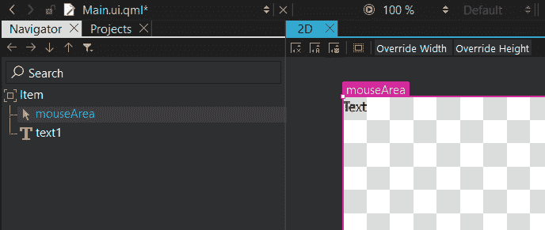

图 1.23 – 将鼠标区域和文本项拖放到画布上

1.  **鼠标区域**项是一个不可摧毁的项，当鼠标点击它时或当手指触摸它（在移动平台上）时会被触发。**鼠标区域**项也用于**按钮**组件，我们稍后会使用它。**文本**项是自解释的：它是一个标签，用于在应用程序中显示文本块。

1.  在**导航器**窗口中，我们可以通过点击项旁边类似眼睛的图标来隐藏或显示一个项。当一个项被隐藏时，它将不会出现在画布或编译的应用程序中。就像 C++ Qt 项目中的小部件一样，Qt Quick 组件根据父子关系进行分层排列。所有子项都将放置在具有缩进位置的父项下。在我们的例子中，我们可以看到**鼠标区域**和**文本**元素相对于**项**项稍微向右偏移，因为它们都是**项**元素的子项。我们可以通过使用**导航器**窗口中的点击和拖动方法来重新排列父子关系，以及它们在层次结构中的位置。您可以尝试点击**文本**项并将其拖动到鼠标区域上方。然后您会看到**文本**项的位置已经改变，现在位于鼠标区域下方，并且有更宽的缩进：

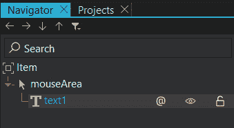

图 1.24 – 重新排列项之间的父子关系

1.  我们可以通过使用位于**导航器**窗口顶部的箭头按钮来重新排列它们，如前面的截图所示。父项发生的任何变化也会影响所有子项，例如移动父项，以及隐藏和显示父项。

注意

您可以通过按住鼠标中键（或鼠标滚轮）并移动鼠标来在画布视图中平移。您还可以通过在键盘上按住*Ctrl*键并滚动鼠标来放大和缩小。默认情况下，滚动鼠标将上下移动画布视图。然而，如果鼠标光标位于画布的水平滚动条上，则滚动鼠标将视图左右移动。

1.  删除**鼠标区域**项和**文本**项，因为我们将要学习如何从头开始使用 QML 和 Qt Quick 创建用户界面。

1.  设置`800 x 600`，因为我们需要更大的空间来放置小部件。

1.  将我们在上一个 C++项目中使用的图像复制到 QML 项目的文件夹中，因为我们将要使用 QML 重新创建相同的登录屏幕。

1.  将图像添加到资源文件中，以便我们可以在 UI 中使用它们。

1.  打开**Qt 设计工作室**并切换到**资源**窗口。直接将背景图像拖动到画布上。切换到**属性**面板上的**布局**选项卡并单击填充锚点按钮，如这里用红色圆圈所示。这将使背景图像始终粘附到窗口大小：

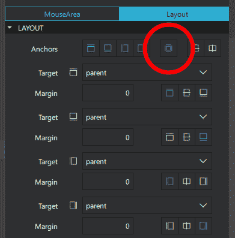

图 1.25 – 选择填充锚点按钮以使项目跟随其父对象的大小

1.  从**库**窗口拖动一个**矩形**组件到画布上。我们将用它作为程序的顶部面板。

1.  对于顶部面板，启用顶部锚点、左侧锚点和右侧锚点，以便面板粘附到窗口顶部并跟随其宽度。确保所有边距都设置为零。

1.  将颜色更改为`#805bcce9`和第二个颜色为`#80000000`。这将创建一个半透明的带有蓝色渐变的面板。

1.  为显示目的，添加一个`周三，25-10-2023 3:14 PM`。然后，将文本颜色设置为白色。

1.  切换到**布局**选项卡并启用顶部锚点和左侧锚点，以便文本小部件始终粘附到屏幕的左上角。

1.  添加一个`50 x 50`。然后，通过在**导航器**窗口中将它拖动到顶部面板上，使其成为顶部面板的子项。

1.  将鼠标区域的颜色设置为蓝色（`#27a9e3`），并将其半径设置为`2`以使其角落略微圆滑。启用顶部锚点和右侧锚点以使其粘附到窗口的右上角。将顶部锚点的边距设置为`8`，将右侧锚点的边距设置为`10`以创建一些空间。

1.  打开**资源**窗口，并将关机图标拖动到画布中。使其成为我们刚刚创建的**鼠标区域**项的子元素。然后，启用填充锚点，使其与鼠标区域的尺寸相匹配。

1.  呼——这有很多步骤！现在，您的项目在**导航器**窗口中应该如下排列：

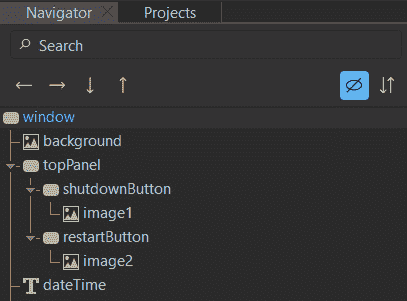

图 1.26 – 注意项目之间的父子关系

1.  父子关系和布局锚点都非常重要，以保持小部件在主窗口更改尺寸时的正确位置。您的顶部面板应该看起来像这样：


图 1.27 – 完成顶部横幅设计

1.  让我们着手处理登录表单。添加一个新的`360 x 200`，并将其半径设置为`15`。

1.  将其颜色设置为`#80000000`；这将使其变为黑色，并具有 50%的不透明度。

1.  启用垂直居中锚点和水平居中锚点，使矩形始终与窗口的中心对齐。然后，将垂直居中锚点的边距设置为`100`，使其稍微向下移动到底部。这将确保我们有足够的空间放置标志。以下截图展示了**锚点**的设置：

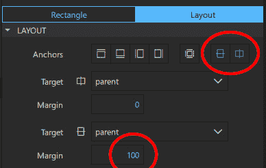

图 1.28 – 设置对齐和边距

1.  将文本对象添加到画布中。使它们成为登录表单的子元素（`用户名:`和`密码:`）。将它们的文本颜色更改为白色，并相应地定位它们。这次我们不需要设置边距，因为它们将跟随矩形的定位。

1.  在画布上添加两个文本输入对象，并将它们放置在我们刚刚创建的文本小部件旁边。确保文本输入也是登录表单的子元素。由于文本输入不包含任何背景颜色属性，我们需要在画布上添加两个矩形作为它们的背景。

1.  在画布上添加两个矩形，并将它们各自设置为刚刚创建的文本输入的子元素。设置`5`以给它们一些圆角。之后，在两个矩形上启用填充锚点，以便它们跟随文本输入小部件的尺寸。

1.  现在，让我们在密码字段下方创建登录按钮。将鼠标区域添加到画布中，并使其成为登录表单的子元素。调整其尺寸到您喜欢的尺寸，并将其移动到合适的位置。

1.  由于鼠标区域不包含任何背景颜色属性，我们需要添加一个`#27a9e3`并启用填充锚点，以便它与鼠标区域很好地匹配。

1.  在画布上添加一个文本对象，并使其成为登录按钮的子元素。将其文本颜色更改为白色，并设置其`登录`。最后，启用水平居中锚点和垂直居中锚点，使它们与按钮的中心对齐。

1.  现在，你将看到一个登录表单，它的外观与我们在 C++ 项目中制作的非常相似：

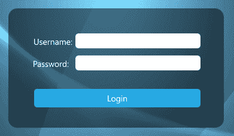

图 1.29 – 登录表单的最终设计

1.  现在，是时候添加标志了，这非常简单。打开**资源**窗口，并将标志图像拖放到画布上。

1.  让它成为登录表单的子元素，并设置其大小为 `512` `x 200`。

1.  将其放置在登录表单的顶部。这样，您就完成了。

1.  这是编译后的整个 UI 的样子。我们已经成功地将 C++ 项目的登录屏幕重新创建出来，但这次我们使用的是 QML 和 Qt Quick：


图 1.30 – 最终结果

## 它是如何工作的……

Qt Quick 编辑器在将小部件放置在应用程序中与表单编辑器相比采用了一种非常不同的方法。用户可以决定哪种方法最适合他们的需求。以下截图显示了 Qt Quick 设计器的样子：

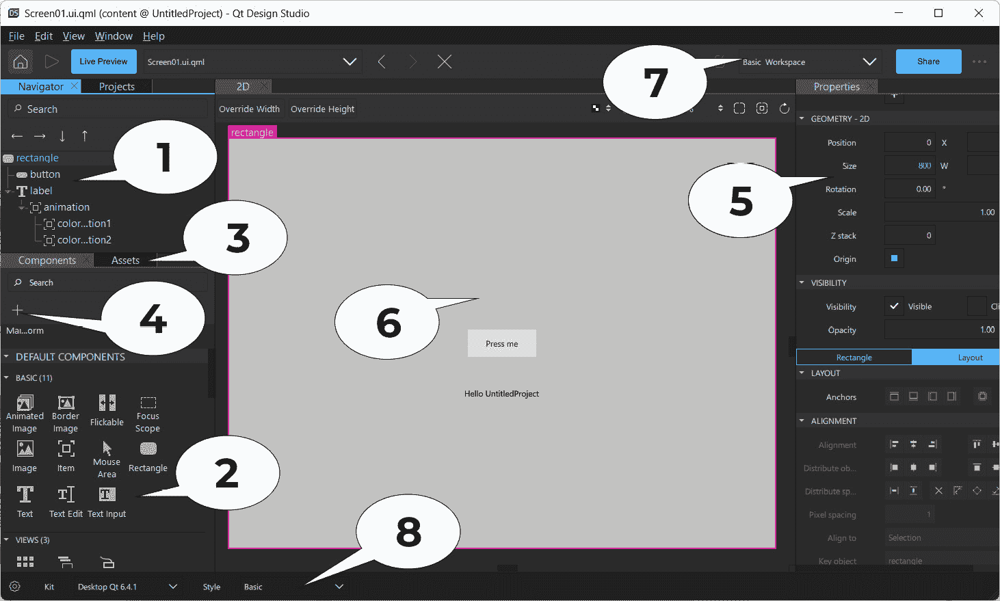

图 1.31 – Qt Design Studio 用户界面概览

让我们看看编辑器 UI 的各个元素：

1.  **导航器**：**导航器**窗口以树状结构显示当前 QML 文件中的项目。它与我们在“使用 Qt Designer 的样式表”配方中使用的其他 Qt Designer 中的对象操作窗口类似。

1.  **库**：**库**窗口显示了 QML 中可用的所有 Qt Quick 组件或 Qt Quick 控件。您可以将它拖放到画布窗口中，以将其添加到您的 UI 中。您还可以创建自己的自定义 QML 组件，并将它们显示在这里。

1.  **资产**：**资产**窗口以列表形式显示所有可以用于 UI 设计的资源。

1.  **添加模块**：**添加模块**按钮允许您将不同的 QML 模块导入到当前的 QML 文件中，例如蓝牙模块、WebKit 模块或定位模块，以向您的 QML 项目添加额外的功能。

1.  **属性**：与我们在前面的配方中使用的**属性编辑器**区域类似，QML 设计器的**属性**面板显示所选项目的属性。您还可以在代码编辑器中更改项目的属性。

1.  **画布**：画布是您创建 QML 组件和设计应用程序的工作区域。

1.  **工作区选择器**：工作区选择器区域显示了 Qt Design Studio 编辑器中可用的不同布局，允许用户选择适合他们需求的工区。

1.  **样式选择器**：这个选择器是您可以选择不同样式以预览应用程序在特定平台上运行时的外观的地方。这对于开发跨平台应用程序非常有用。

# 将 QML 对象指针暴露给 C++

有时，我们希望通过 C++脚本修改 QML 对象的属性，例如更改标签的文本、隐藏/显示小部件或更改其大小。Qt 的 QML 引擎允许你将你的 QML 对象注册到 C++类型，这会自动暴露其所有属性。

## 如何做到这一点…

我们想在 QML 中创建一个标签并偶尔更改其文本。为了将标签对象暴露给 C++，我们可以这样做：

1.  在`mylabel.h`中创建一个名为`MyLabel`的 C++类，它扩展了`QObject`类：

    ```cpp
    class MyLabel : public QObject {
    Q_OBJECT
    public:
         // Object pointer
         QObject* myObject;
         explicit MyLabel(QObject *parent = 0);
         // Must call Q_INVOKABLE so that this function can be used in QML
         Q_INVOKABLE void SetMyObject(QObject* obj);
    }
    ```

1.  在`mylabel.cpp`源文件中，定义一个名为`SetMyObject()`的函数来保存对象指针。此函数将在 QML 中的`mylabel.cpp`中被调用：

    ```cpp
    void MyLabel::SetMyObject(QObject* obj) {
         // Set the object pointer
         myObject = obj;
    }
    ```

1.  在`main.cpp`中，包含`MyLabel`头文件并使用`qmlRegisterType()`函数将其注册到 QML 引擎：

    ```cpp
    include "mylabel.h"
    int main(int argc, char *argv[]) {
         // Register your class to QML
         qmlRegisterType<MyLabel>("MyLabelLib", 1, 0, "MyLabel");
    }
    ```

1.  注意，在`qmlRegisterType()`中你需要声明四个参数。除了声明你的类名（`MyLabel`）外，你还需要声明你的库名（`MyLabelLib`）及其版本（`1.0`）。这将用于将你的类导入 QML。

1.  在 QML 中将 QML 引擎映射到我们的标签对象，并通过在 QML 文件中调用`import MyLabelLib 1.0`来导入我们在*第 3 步*中定义的类库。请注意，库的名称及其版本号必须与你在`main.cpp`中声明的相匹配；否则，它将抛出错误。在 QML 中声明`MyLabel`并将其 ID 设置为`mylabel.SetMyObject(myLabel)`以在标签初始化后立即将其指针暴露给 C/C++之后：

    ```cpp
    import MyLabelLib 1.0
    ApplicationWindow {
         id: mainWindow
         width: 480
         height: 640
         MyLabel {
               id: mylabel
         }
         Label {
               id: helloWorldLabel
               text: qsTr("Hello World!")
               Component.onCompleted: {
                   mylabel.SetMyObject(hellowWorldLabel);
               }
         }
    }
    ```

1.  在将标签的指针暴露给 C/C++之前，请等待标签完全初始化；否则，你可能会使程序崩溃。为了确保它已完全初始化，请在`Component.onCompleted`中调用`SetMyObject()`函数，而不是在其他任何函数或事件回调中。现在，QML 标签已经暴露给 C/C++，我们可以通过调用`setProperty()`函数更改其任何属性。例如，我们可以将其可见性设置为`true`并将文本更改为`Bye` `bye world!`：

    ```cpp
    // Qvariant automatically detects your data type
    myObject->setProperty("visible", Qvariant(true));
    myObject->setProperty("text", Qvariant("Bye bye world!"));
    ```

1.  除了改变属性外，我们还可以通过以下代码调用其函数：

    ```cpp
    QVariant returnedValue;
    QVariant message = "Hello world!";
    QMetaObject::invokeMethod(myObject, "myQMLFunction",
    Q_RETURN_ARG(QVariant, returnedValue), Q_ARG(QVariant,
    message));
    qDebug() << "QML function returned:" <<
    returnedValue.toString();
    ```

1.  或者，如果我们不期望从它返回任何值，我们可以仅用两个参数调用`invokedMethod()`函数：

    ```cpp
    QMetaObject::invokeMethod(myObject, "myQMLFunction");
    ```

## 它是如何工作的…

QML 的设计方式使其可以通过 C++代码进行扩展。Qt QML 模块中的类允许从 C++使用和操作 QML 对象，QML 引擎与 Qt 的**元对象系统**的结合能力允许直接从 QML 调用 C++功能。要向 QML 添加一些 C++数据或用法，它应该从一个 QObject 派生类中提出。可以从 C++建立 QML 对象类型，并监督访问它们的属性、调用它们的方法和获取它们的信号警报。这是可能的，因为所有 QML 对象类型都是使用 QObject 派生类执行的，这使得 QML 引擎能够通过 Qt 元对象系统强制加载和检查对象。

## 还有更多…

Qt 6 提供了两种不同的 GUI 工具包——Qt Widgets 和 Qt Quick。它们各自都有相对于对方的优点和优势，为程序员提供了设计和应用界面的能力和自由，无需担心功能限制和性能问题。

Qt 6 允许你选择最适合你工作风格和项目需求的最佳方法和编程语言。通过阅读本章，你将能够迅速创建一个外观美观且功能齐全的跨平台应用程序，使用 Qt 6。
