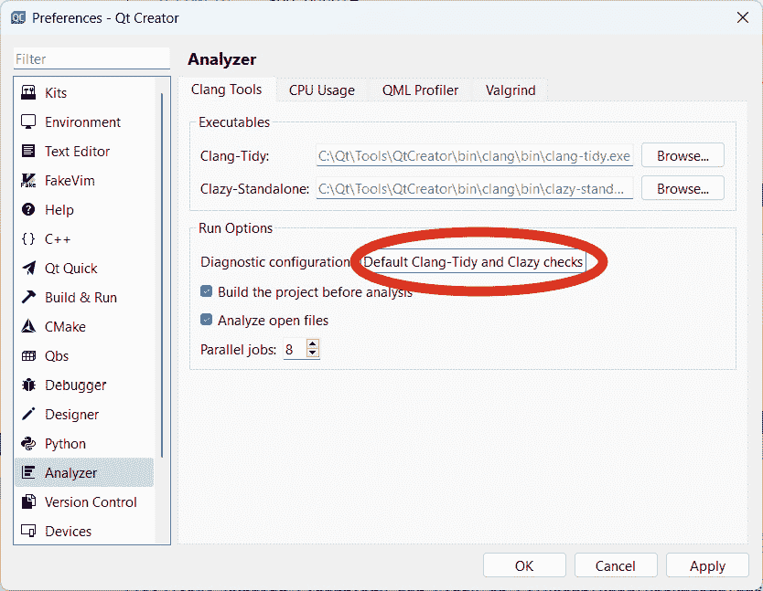
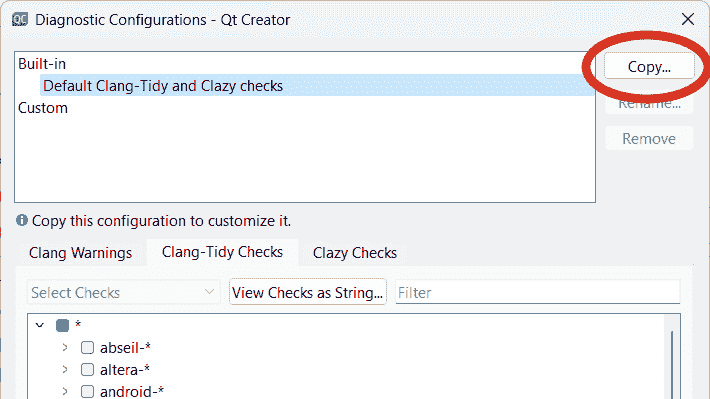
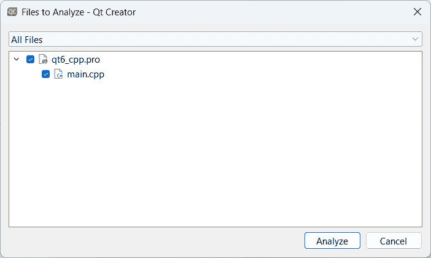
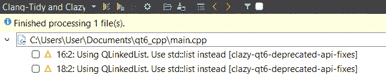
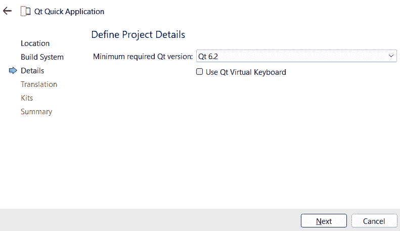
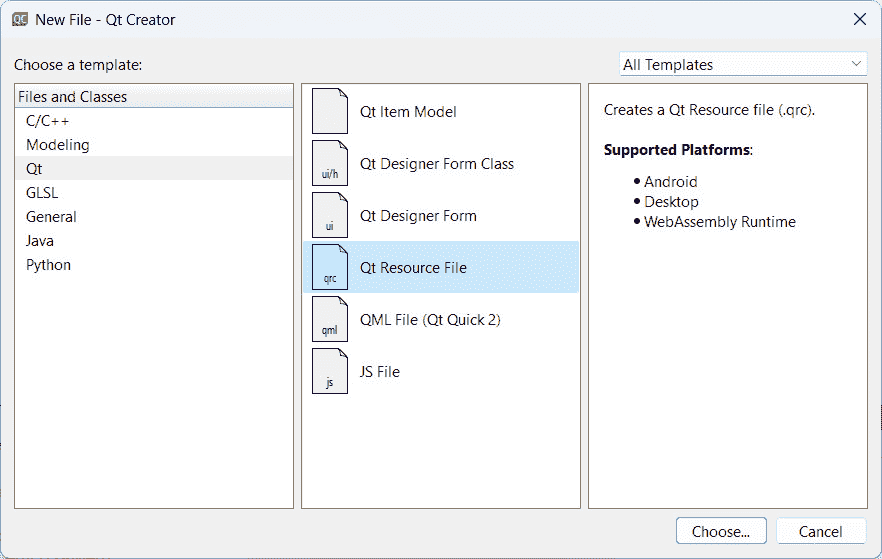
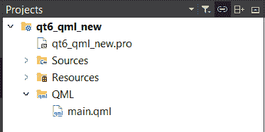

# 第六章：从 Qt 5 到 Qt 6 的过渡

在本章中，我们将了解 Qt 6 中所做的更改以及如何将现有的 Qt 5 项目升级到 Qt 6。与之前的更新不同，Qt 6 几乎是从头到尾重写了整个 Qt 代码库，包括所有底层类。这些重大更改可能会破坏你现有的 Qt 5 项目，如果你只是切换到 Qt 6。

在本章中，我们将涵盖以下主要主题：

+   C++ 类更改

+   使用 **Clazy 检查** 对 Clang 和 C++ 进行检查

+   QML 类型更改

# 技术要求

本章的技术要求包括 Qt 6.6.1 MinGW 64 位、Qt 5.15.2 MinGW 64 位和 Qt Creator 12.0.2。本章中使用的所有代码都可以从以下 GitHub 仓库下载：[`github.com/PacktPublishing/QT6-C-GUI-Programming-Cookbook---Third-Edition-/tree/main/Chapter06`](https://github.com/PacktPublishing/QT6-C-GUI-Programming-Cookbook---Third-Edition-/tree/main/Chapter06)。

# C++ 类更改

在本食谱中，我们将了解 Qt6 的 C++ 类发生了哪些变化。

## 如何实现…

按照以下步骤了解 Qt6 中的 C++ 类：

1.  通过访问 **文件** | **新建项目** 创建一个新的 **Qt 控制台应用程序**。

1.  我们将打开 `main.cpp` 文件并添加以下头文件：

    ```cpp
    #include <QCoreApplication>
    #include <QDebug>
    #include <QLinkedList>
    #include <QRegExp>
    #include <QStringView>
    #include <QTextCodec>
    #include <QTextEncoder>
    #include <QTextDecoder>
    ```

1.  之后，添加以下代码以演示 `QLinkedList` 类：

    ```cpp
    int main(int argc, char *argv[])
    {
        QCoreApplication a(argc, argv);
        // QLinkedList
        QLinkedList<QString> list;
        list << "string1" << "string2" << "string3";
        QLinkedList<QString>::iterator it;
        for (it = list.begin(); it != list.end(); ++it)
        {
            qDebug() << "QLinkedList:" << *it;
    QRegExp class:

    ```

    // QRegExp

    QRegExp rx("\\d+");

    QString text = "Jacky 有 3 个胡萝卜，15 个苹果，9 个橙子和 12 个葡萄。";

    QStringList myList;

    int pos = 0;

    while ((pos = rx.indexIn(text, pos)) != -1)

    {

    // 从句子中分离所有数字

    myList << rx.cap(0);

    pos += rx.matchedLength();

    }

    qDebug() << "QRegExp:" << myList;

    ```cpp

    ```

1.  然后，在前面代码的底部添加以下代码以演示 `QStringView` 类：

    ```cpp
    // QStringView
    QStringView x = QString("Good afternoon");
    QStringView y = x.mid(5, 5);
    QStringView z = x.mid(5);
    qDebug() << "QStringView:" << y; // after
    qDebug() << "QStringView:" << z; // afternoon
    ```

1.  不仅如此，我们还在此添加以下代码以演示 `QTextCodec` 类：

    ```cpp
    // QTextCodec
    QByteArray data = "\xCE\xB1\xCE\xB2\xCE\xB3"; // Alpha, beta, gamma symbols
    QTextCodec *codec = QTextCodec::codecForName("UTF-8");
    QString str = codec->toUnicode(data);
    ```

```cpp
qDebug() << "QTextCodec:" << str;
```

1.  接下来，添加以下代码，该代码演示了如何使用 `QTextEncoder` 类将十六进制代码转换为字符：

    ```cpp
    // QTextEncoder
    QString str2 = QChar(0x41); // Character "A"
    QTextCodec *locale = QTextCodec::codecForLocale();
    QTextEncoder *encoder = locale->makeEncoder();
    QByteArray encoded = encoder->fromUnicode(str2);
    qDebug() << "QTextEncoder:" << encoded.data();
    ```

1.  让我们再添加以下代码来演示如何使用 `QTextDecoder` 类将一行文本从 Shift JIS 格式转换为 Unicode：

    ```cpp
    // QTextDecoder
    QByteArray data2 = "\x82\xB1\x82\xF1\x82\xC9\x82\xBF\x82\xCD\x90\xA2\x8A\x45"; // "Hello world" in Japanese
    QTextCodec *codec2 = QTextCodec::codecForName("Shift-JIS");
    QTextDecoder *decoder = codec2->makeDecoder();
    QString decoded = decoder->toUnicode(data2);
    qDebug() << "QTextDecoder:" << decoded;
    ```

1.  现在我们已经完成了代码，让我们尝试使用 Qt 5 编译项目，看看会发生什么。你的程序应该可以正常编译，并在输出窗口中显示以下结果：

    ```cpp
    QLinkedList: "string1"
    QLinkedList: "string2"
    QLinkedList: "string3"
    QRegExp: ("3", "15", "9", "12")
    QStringView: "after"
    QStringView: "afternoon"
    QTextCodec: "αβγ"
    QTextEncoder: A
    QTextDecoder: "こんにちは世界"
    ```

1.  现在，让我们切换到 Qt 6 并重新编译项目，你应该会得到如下错误：

    ```cpp
    QLinkedList: No such file or directory
    fatal error: QLinkedList: No such file or directory
    ```

1.  打开你的项目文件（`.pro`）并在顶部添加以下代码：

    ```cpp
    QT += core5compat
    ```

1.  最后，再次使用 Qt 6 编译项目。这次你应该能够运行它。`core5compat` 只是过渡从 Qt 5 到 Qt 6 的临时解决方案。你可以改为使用 `std::list` 来替换 `QLinkedList`，因为将来它将被弃用。

## 工作原理…

我们不需要任何 GUI，因为我们只是测试一些 C++ 类，所以使用 `QDebug` 类在输出窗口中打印结果。

在前一个示例中，我们使用了一些在 Qt 6 中已弃用的类，即 `QLinkedList`、`QRegExp`、`QStringView`、`QTextCodec`、`QTextEncoder` 和 `QTextDecoder`。这些只是我们在使用 Qt 时会遇到的一些常见类，它们在 Qt 6 中已被重写。如果您正在将项目从 Qt 5 迁移到 6，最佳做法是将 `Core5Compat` 模块添加到您的项目中，以便 Qt 5 类可以在 Qt 6 下继续运行。`Core5Compat` 模块是在 Qt 6 项目下支持 Qt 5 类的临时措施，以便 Qt 程序员可以安全地将项目迁移到 Qt 6，并有时间将代码逐步迁移到 Qt 6 类。

当您迁移到 Qt 7 时，`Core5Compat` 模块将停止工作，因此不建议长时间使用弃用的类。

## 更多内容…

在 Qt 6 中，许多核心功能是从头开始重写的，以使库与现代计算架构和工作流程保持最新。因此，Qt 6 被视为一个过渡阶段，其中一些类已完成，而另一些尚未完成。

为了使其正常工作，Qt 开发者引入了 `Core5Compat` 模块，以便 Qt 程序员在逐渐过渡到新类的同时更容易保持他们的项目运行。您可以从官方在线文档中查看这些类的替代方案。

最后，Qt 6 现在正在利用 C++ 17。强烈建议您的项目遵循 C++ 17 标准，以便您的代码可以很好地与 Qt 6 一起工作。

注意

在 Qt 6 中，许多其他 C++ 类已被弃用或正在被重写；请参阅此链接以检查 Qt 6 中已更改或弃用的完整 C++ 类列表：[`doc.qt.io/qt-6/obsoleteclasses.html`](https://doc.qt.io/qt-6/obsoleteclasses.html)。您还可以将 `QT_DISABLE_DEPRECATED_UP_TO` 宏添加到您的 Qt 项目中，以禁用项目中弃用的 C++ API。例如，将 `DEFINES += QT_DISABLE_DEPRECATED_UP_TO=0x050F00` 添加到您的配置文件中将禁用 Qt 5.15 中弃用的所有 C++ API。

# 使用 Clazy 检查 Clang 和 C++

在本章中，我们将学习如何使用 Clang 工具集中的 Clazy 检查，在您的 Qt 项目中检测到已弃用的 Qt 5 类和函数时自动显示警告。

## 如何操作…

让我们按照以下步骤开始：

1.  我们将使用前一个示例中的相同项目。然后，通过转到 **编辑** | **首选项…** 来打开首选项窗口。

1.  之后，转到 **分析器** 页面并单击 **诊断配置** 旁边的按钮：



图 6.1 – 打开诊断配置窗口

1.  在顶部选择 **默认 Clang-Tidy 和 Clazy 检查** 选项，并点击如图 *图 6**.2* 所示的 **复制…** 按钮。给它起个名字，然后点击 **确定**。新的选项现在将出现在 **自定义** 类别下：



图 6.2 - 点击复制按钮

1.  然后，打开 `qt6-deprecated-api-fixes`

1.  `qt6-header-fixes`

1.  `qt6-qhash-signature`

1.  `qt6-fwd-fixes`

1.  `missing-qobject-macro`

1.  完成后，关闭首选项窗口，转到 **分析** | **Clang-Tidy 和 Clazy...**。将弹出一个包含所有源文件的 **要分析的文件** 窗口。我们将坚持默认选项，通过点击 **分析** 按钮继续：



图 6.3 – 选择所有文件并按分析按钮

1.  Clang-Tidy 和 Clazy 工具分析完项目后，你应在 Qt Creator 下的单独面板上看到显示的结果。它将显示在 Qt 6 中已被弃用的代码行，并给出替换建议：



图 6.4 – 分析结果

## 它是如何工作的...

Tidy 和 Clazy 工具随 Clang 包一起提供，因此无需单独安装。这是一个功能强大的工具，可以用来检查许多事情，例如检查代码中使用的已弃用函数、在循环中放置容器、将非 void 槽标记为常量、注册以小写字母开头的 QML 类型等等。

这是一个帮助你轻松检查和改进代码质量的工具。它应该被广泛推广，并更频繁地被 Qt 程序员使用。

# QML 类型更改

在本章中，我们将学习与 Qt 5 相比，Qt 6 做了哪些改动。

## 如何操作…

让我们按照以下步骤开始：

1.  通过转到 **文件** | **新建项目** 创建一个新的 **Qt Quick 应用程序**。

1.  在定义项目详细信息时，选择 **最低要求的 Qt 版本** 为 **Qt 6.2**。



图 6.5 – 选择 Qt 6.2 作为最低要求的 Qt 版本

1.  创建项目后，打开 `main.qml` 文件并添加以下属性：

    ```cpp
    import QtQuick
    Window {
        width: 640
        height: 480
        visible: true
        title: qsTr("Hello World")
        property variant myColor: "red"
        Rectangle object to main.qml, as shown in the following:

    ```

    Rectangle {

    id: rect

    x: 100

    y: 100

    width: 100

    height: 100

    color: myColor

    }

    ```cpp

    ```

1.  之后，我们将在矩形下方添加另一个 `Image` 对象：

    ```cpp
    Image {
        id: img
        x: 300
        y: 100
        width: 150
        height: 180
        source: imageFolder + "/tux.png"
    }
    ```

1.  接下来，我们通过转到 **文件** | **新建文件…** 并在 **Qt** 模板下选择 **Qt 资源文件** 来为我们的项目创建一个新的资源文件。



图 6.6 – 创建新的 Qt 资源文件

1.  然后，在资源文件中创建一个名为 `images` 的文件夹，并将 `tux.png` 添加到 `images` 文件夹中。


图 6.7 – 将 tux.png 添加到图像文件夹

1.  现在构建并运行项目，你应该得到以下类似的结果：


图 6.8 – Qt Quick 6 中的 Hello World 示例

## 它是如何工作的...

Qt 6 对 Qt Quick 也进行了许多更改，但它们大多是底层函数，不会对 QML 语言和对象产生很大影响。因此，在从 Qt 5 转换到 Qt 6 时，您不需要对您的 QML 脚本进行很多更改。然而，项目结构仍有一些细微的变化，代码也有一些小的差异。

最明显的区别之一是，现在 QML 脚本在项目结构下的 `QML` 类别中列出，而不是像在 Qt 5 中那样在 `Resources` 下。



图 6.9 – QML 文件现在有自己的类别

因此，当我们将在 `main.cpp` C++ 源代码中加载 `main.qml` 文件时，我们将使用以下代码：

```cpp
const QUrl url(u"qrc:/qt6_qml_new/main.qml"_qs);
```

与我们在 Qt 5 中所做的方法相比，有一些细微的差别：

```cpp
const QUrl url(QStringLiteral("qrc:/main.qml"));
```

字符串前面的 `u` 创建了一个 16 位字符串字面量，而字符串后面的 `_qs` 将其转换为 `QString`。这些运算符类似于 Qt 5 中使用的 `QStringLiteral` 宏，但更容易转换为所需的精确字符串格式，同时符合 C++ 17 编码风格。

Qt 6 的另一个重大区别是，从上一个示例中的 `main.qml` 可以看到差异：

```cpp
import QtQuick
Window {
    width: 640
    height: 480
    visible: true
    title: qsTr("Hello World")
```

如您从前面的代码块中高亮显示的部分所示，现在在导入 Qt Quick 模块时版本号是可选的。Qt 将默认选择可用的最新版本。

现在，让我们看看我们在示例中声明的属性：

```cpp
property variant myColor: "red"
property url imageFolder: "/images"
```

尽管前面的代码可以正常运行，但建议使用 Qt 函数，如 `Qt.color()` 和 `Qt.resolvedUrl()`，来返回具有正确类型的属性，而不是仅仅传递一个字符串：

```cpp
property variant myColor: Qt.color("red")
property url imageFolder: Qt.resolvedUrl("/images")
```

另一个可能注意不到的小区别是 Qt 处理相对路径的方式。在 Qt 5 中，我们会将相对路径写成 `./images`，它将返回为 `qrc:/images`。然而，在 Qt 6 中，`./images` 将返回为 `qrc:/[project_name]/images/tux.png`，这是不正确的。我们必须使用 `/images` 而不是前面的点。

注意

关于 Qt 6 中 Qt Quick 的全面更改的更多信息，请访问 [`doc.qt.io/qt-6/qtquickcontrols-changes-qt6.html`](https://doc.qt.io/qt-6/qtquickcontrols-changes-qt6.html)。
