# 第七章：使用网络和管理大型文档

在本章中，我们将学习如何使用 Qt 6 的网络模块创建网络服务器程序和客户端程序。我们还将学习如何创建一个使用**文件传输协议**（**FTP**）从服务器上传和下载文件的程序。最后，我们将学习如何使用 Qt 6 和 C++ 语言向特定的网络服务发送 HTTP 请求。

在本章中，我们将涵盖以下主要主题：

+   创建 TCP 服务器

+   创建 TCP 客户端

+   使用 FTP 上传和下载文件

# 技术要求

本章的技术要求是 Qt 6.6.1、Qt Creator 12.0.2 和 FileZilla。本章中使用的所有代码都可以从以下 GitHub 仓库下载：[`github.com/PacktPublishing/QT6-C-GUI-Programming-Cookbook---Third-Edition-/tree/main/Chapter07`](https://github.com/PacktPublishing/QT6-C-GUI-Programming-Cookbook---Third-Edition-/tree/main/Chapter07)。

# 创建 TCP 服务器

在本食谱中，我们将学习如何在 Qt 6 中创建一个**传输控制协议**（**TCP**）服务器。在我们能够创建一个允许我们上传和下载文件的服务器之前，让我们先缩小范围，学习如何创建一个接收和发送文本的网络服务器。

## 如何操作...

按照以下步骤创建 TCP 服务器：

1.  首先，让我们从 **文件** | **新建文件或项目** 创建一个 **Qt 控制台应用程序** 项目，如下面的截图所示：


图 7.1 – 创建新的 Qt 控制台应用程序项目

1.  然后，再次转到 **文件** | **新建文件或项目**，但这次在 **C/C++** 类别下选择 **C++ 类**，如下面的截图所示：

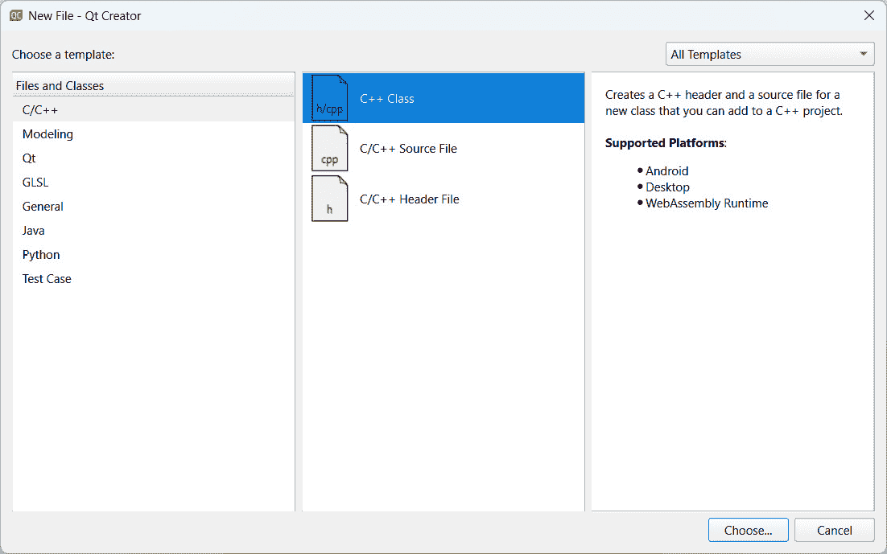

图 7.2 – 创建新的 C++ 类

1.  然后，将你的类命名为 `server`。将其基类设置为 `server.h` 和 `server.cpp`，如下面的截图所示：

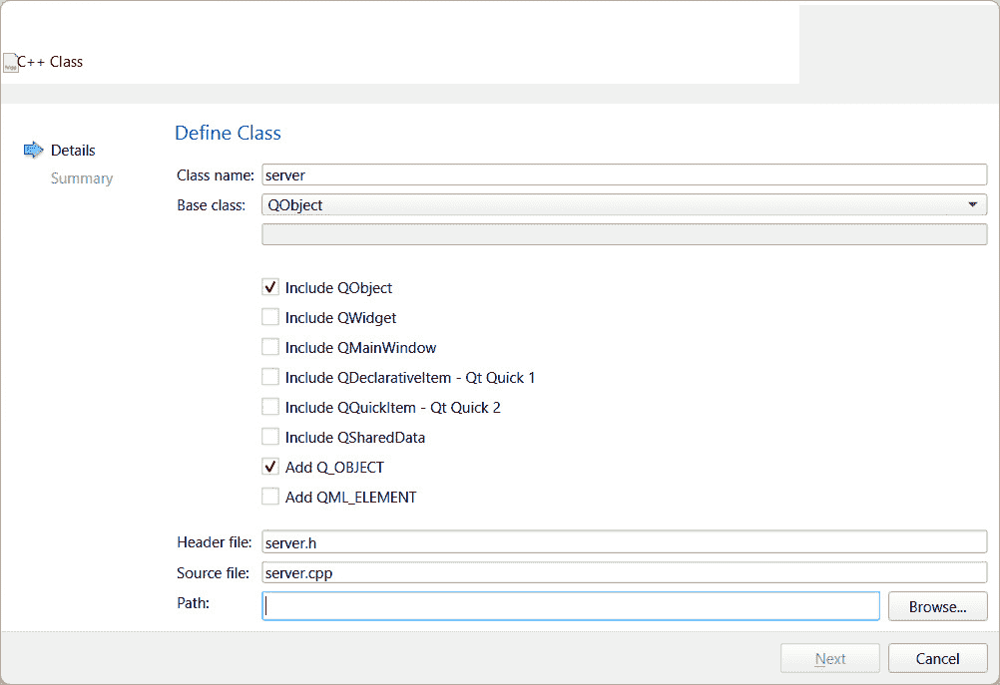

图 7.3 – 定义服务器类

1.  然后，打开你的项目文件（`.pro`）并添加 `network` 模块，如下面的代码所示。然后，再次运行 `qmake` 以重新加载模块：

    ```cpp
    QT += core server.h and add the following headers to it:

    ```

    `#include <QTcpServer>`

    `#include <QTcpSocket>`

    `#include <QVector>`

    `#include <QDebug>`

    ```cpp

    ```

1.  在此之后，声明 `startServer()` 和 `sendMessageToClients()` 函数，如下面的代码所示：

    ```cpp
    public:
          server(QObject *parent = nullptr);
          void startServer();
    server class:

    ```

    公共槽：

    `void newClientConnection();`

    `void socketDisconnected();`

    `void socketReadReady();`

    `void socketStateChanged(QAbstractSocket::SocketState state);`

    ```cpp

    ```

1.  最后，声明两个私有变量，如下面的代码所示：

    ```cpp
    private:
         QTcpServer* chatServer;
         QVector<QTcpSocket*>* allClients;
    ```

1.  完成前面的步骤后，打开 `server.cpp` 并定义 `startServer()` 函数。在这里，我们创建一个 `QVector` 容器来存储所有连接到服务器的客户端，并在后续步骤中使用它发送消息。以下是一个示例：

    ```cpp
    void server::startServer() {
         allClients = new QVector<QTcpSocket*>;
         chatServer = new QTcpServer();
         chatServer->setMaxPendingConnections(10);
         connect(chatServer, &QTcpServer::newConnection,      this, &server::newClientConnection);
    if (chatServer->listen(QHostAddress::Any, 8001))
         qDebug() << "Server has started. Listening to port     8001.";
    else
         qDebug() << "Server failed to start. Error: " +   chatServer->errorString();
    }
    ```

1.  接下来，我们实现 `sendMessageToClients()` 函数，在这个函数中，我们将遍历我们在上一步中创建的 `allClients` 容器，并将消息发送给每个客户端，如下面的示例所示：

    ```cpp
    void server::sendMessageToClients(QString message) {
    if (allClients->size() > 0) {
         for (int i = 0; i < allClients->size(); i++) {
         if (allClients->at(i)->isOpen() && allClients-   >at(i)->isWritable()) {
         allClients->at(i)->write(message.toUtf8());
    }
    }}}
    ```

1.  之后，我们将开始实现槽函数。让我们从以下代码开始：

    ```cpp
    void server::newClientConnection() {
         QTcpSocket* client = chatServer->nextPendingConnection();
         QString ipAddress = client->peerAddress().toString();
         int port = client->peerPort();
         connect(client, &QTcpSocket::disconnected, this, &server::socketDisconnected);
         connect(client, &QTcpSocket::readyRead,this, &server::socketReadReady);
         connect(client, &QTcpSocket::stateChanged, this, &server::socketStateChanged);
         allClients->push_back(client);
         qDebug() << "Socket connected from " + ipAddress + ":" + QString::number(port);
    }
    ```

1.  接下来，我们将处理 `socketDisconnected()` 函数。当客户端从服务器断开连接时，将调用此槽函数，如下面的示例所示：

    ```cpp
    void server::socketDisconnected() {
         QTcpSocket* client = qobject_cast<QTcpSocket*>(QObject::sender());
         QString socketIpAddress = client->peerAddress().toString();
         int port = client->peerPort();
         qDebug() << "Socket disconnected from " + socketIpAddress + ":" + QString::number(port);
    }
    ```

1.  接下来，我们将定义 `socketReadReady()` 函数，当客户端向服务器发送文本消息时，将触发此函数，如下面的示例所示：

    ```cpp
    void server::socketReadReady() {
         QTcpSocket* client = qobject_cast<QTcpSocket*>(QObject::sender());
         QString socketIpAddress = client->peerAddress().toString();
         int port = client->peerPort();
         QString data = QString(client->readAll());
         qDebug() << "Message: " + data + " (" + socketIpAddress + ":" + QString::number(port) + ")";
         sendMessageToClients(data);
    }
    ```

1.  之后，让我们实现 `socketStateChanged()` 函数，当客户端的网络状态发生变化时，将调用此函数，如下面的示例所示：

    ```cpp
    void server::socketStateChanged(QAbstractSocket::SocketState state) {
         QTcpSocket* client = qobject_cast<QTcpSocket*>(QObject::sender());
         QString socketIpAddress = client->peerAddress().toString();
         int port = client->peerPort();
         qDebug() << "Socket state changed (" + socketIpAddress + ":" + QString::number(port) + "): " + desc;
    }
    ```

1.  我们还需要在 `socketStateChanged()` 中添加以下代码以打印客户端的状态：

    ```cpp
         QString desc;
         if (state == QAbstractSocket::UnconnectedState)
               desc = "The socket is not connected.";
         else if (state == QAbstractSocket::HostLookupState)
               desc = "The socket is performing a host name lookup.";
         else if (state == QAbstractSocket::ConnectingState)
               desc = "The socket has started establishing a connection.";
         else if (state == QAbstractSocket::ConnectedState)
               desc = "A connection is established.";
         else if (state == QAbstractSocket::BoundState)
               desc = "The socket is bound to an address and port.";
         else if (state == QAbstractSocket::ClosingState)
               desc = "The socket is about to close (data may still be waiting to be written).";
         else if (state == QAbstractSocket::ListeningState)
               desc = "For internal use only.";
    ```

1.  最后，让我们打开 `main.cpp` 并在下面的示例中添加高亮显示的代码以启动服务器：

    ```cpp
    #include <QCoreApplication>
    #include "server.h"
         int main(int argc, char *argv[]) {
         QCoreApplication a(argc, argv);
         server* myServer = new server();
         myServer->startServer();
         return a.exec();
    }
    ```

1.  你现在可以尝试运行服务器程序，但你无法测试它，因为我们还没有创建客户端程序，如下面的截图所示：

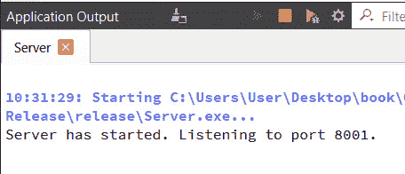

图 7.4 – 服务器现在正在监听端口 8001

1.  让我们继续下一个示例项目，学习如何创建客户端程序。我们稍后还会回来测试这个程序。

## 它是如何工作的…

主要有两种类型的网络连接——TCP 连接和 **用户数据报协议** (**UDP**) 连接。TCP 是一种可靠的网络连接，而 UDP 则是不可靠的。

这两种连接是为非常不同的目的设计的：

+   TCP 网络通常用于需要按顺序发送和接收每一份数据的程序。它还确保客户端接收数据，并且服务器会得到通知。像消息软件、Web 服务器和数据库这样的程序使用 TCP 网络。

+   另一方面，UDP 网络不需要服务器和客户端之间的持续监控。由于连接不可靠，也没有关于数据是否成功接收的反馈。数据包的丢失是可以容忍的，数据可能甚至不会按照发送的顺序到达。UDP 连接通常用于不需要对数据包投递有严格要求的程序，例如视频游戏、视频会议软件和域名系统。

使用 Qt 6 创建网络软件要容易得多，这得益于其信号和槽机制。我们所需做的只是将 `QTcpServer` 类和 `QTcpSocket` 类发出的信号连接到我们的槽函数。然后我们将实现这些槽函数并定义这些函数中的操作。

注意

我们使用 `QVector` 容器来存储连接到服务器的所有客户端的指针，以便我们可以使用它来稍后传递消息。

为了使这个示例项目简单，我们只是向所有客户端发送文本消息，有点像群聊。您可以自由探索其他可能性并自行修改以改进程序。

# 创建 TCP 客户端

由于我们在前面的菜谱中创建了一个 TCP 服务器，我们现在需要一个客户端程序来完成项目。因此，在本菜谱中，我们将学习如何使用 Qt 6 和其网络模块创建一个 TCP 客户端程序。

## 如何做到这一点...

在 Qt 6 中创建 TCP 客户端，让我们按照以下步骤进行：

1.  首先，让我们从 **Files** | **New File** **or Project** 创建一个新的 **Qt Widgets Application** 项目。

1.  一旦项目创建完成，让我们打开 `mainwindow.ui` 并设置如图所示的 GUI。请注意，中央小部件的布局方向必须是垂直的：


图 7.5 – 我们客户端程序的布局

1.  然后，右键单击菜单中的 `clicked()` 按钮槽函数。然后，在 **Send** 按钮上也重复相同的步骤。结果，在源代码中为您创建了两个槽函数，这些函数可能或可能不会像以下代码中我们看到的那样，这取决于您的小部件名称：

    ```cpp
    void on_connectButton_clicked();
    void on_sendButton_clicked();
    ```

1.  接下来，打开 `mainwindow.h` 并添加以下头文件：

    ```cpp
    #include <QDebug>
    #include <QTcpSocket>
    ```

1.  然后，声明 `printMessage()` 函数和三个槽函数：`socketConnected()`、`socketDisconnected()` 和 `socketReadyRead()`，如下面的代码所示：

    ```cpp
    public:
         explicit MainWindow(QWidget *parent = 0);
         ~MainWindow();
         void printMessage(QString message);
    private slots:
         void on_connectButton_clicked();
         void on_sendButton_clicked();
         void socketConnected();
         void socketDisconnected();
         void socketReadyRead();
    ```

1.  之后，声明以下变量：

    ```cpp
    private:
         Ui::MainWindow *ui;
         bool connectedToHost;
         mainwindow.cpp and define the printMessage() function, as shown in the following example:

    ```

    void MainWindow::printMessage(QString message) {

    ui->chatDisplay->append(message);

    }

    ```cpp

    ```

1.  然后，我们将实现 `on_connectButton_clicked()` 函数，该函数将在 **Connect** 按钮被点击时触发，如下面的代码所示：

    ```cpp
    void MainWindow::on_connectButton_clicked() {
         if (!connectedToHost) {
               socket = new QTcpSocket();
               connect(socket, &QTcpSocket::connected, this, &MainWindow::socketConnected);
               connect(socket, &QTcpSocket::disconnected, this, &MainWindow::socketDisconnected);
               connect(socket, &QTcpSocket::readyRead, this, &MainWindow::socketReadyRead);
               socket->connectToHost("127.0.0.1", 8001);
         }
         else {
               QString name = ui->nameInput->text();
               socket->write("<font color=\"Orange\">" + name.toUtf8() + " has left the chat room.</font>");
               socket->disconnectFromHost();
         }
    }
    ```

1.  我们还定义了 `on_sendButton_clicked()` 函数，该函数将在 **Send** 按钮被点击时被调用，如下面的示例所示：

    ```cpp
    void MainWindow::on_sendButton_clicked() {
         QString name = ui->nameInput->text();
         QString message = ui->messageInput->text();
         socket->write("<font color=\"Blue\">" + name.toUtf8() + "</font>: " + message.toUtf8());
         ui->messageInput->clear();
    }
    ```

1.  在此之后，我们实现 `socketConnected()` 函数，该函数将在客户端程序成功连接到服务器时被调用，如下面的代码所示：

    ```cpp
    void MainWindow::socketConnected() {
         qDebug() << "Connected to server.";
         printMessage("<font color=\"Green\">Connected to server.</font>");
         QString name = ui->nameInput->text();
         socket->write("<font color=\"Purple\">" + name.toUtf8() + " has joined the chat room.</font>");
         ui->connectButton->setText("Disconnect");
         connectedToHost = true;
    }
    ```

1.  到目前为止，我们还没有完成。我们还需要实现 `socketDisconnected()` 函数，该函数将在客户端从服务器断开连接时触发，如下面的代码所示：

    ```cpp
    void MainWindow::socketDisconnected() {
         qDebug() << "Disconnected from server.";
         printMessage("<font color=\"Red\">Disconnected from server.</font>");
         ui->connectButton->setText("Connect");
         connectedToHost = false;
    }
    ```

1.  最后，我们还需要定义 `socketReadyRead()` 函数，该函数将打印出从服务器发送的消息，如下面的示例所示：

    ```cpp
    void MainWindow::socketReadyRead() {
         printMessage(socket->readAll());
    }
    ```

1.  在我们运行客户端程序之前，我们必须首先打开我们在前面的菜谱中创建的服务器程序。然后，构建并运行客户端程序。一旦程序打开，就去点击 **连接** 按钮。成功连接到服务器后，在位于底部的行编辑小部件中输入一些内容，并按 **发送** 按钮。你应该会看到以下类似的截图：


图 7.6 – 我们的聊天程序现在正在运行

1.  让我们转到下面的服务器程序截图，看看终端窗口上是否有什么打印出来的内容：

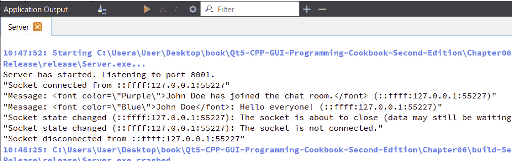

图 7.7 – 客户端活动也显示在服务器输出中

1.  恭喜你，你已经成功创建了一个看起来有点像 **互联网中继聊天**（**IRC**）聊天室的程序！

## 它是如何工作的…

为了使这可行，我们需要两个程序：一个连接所有客户端并传递他们消息的服务器程序，以及一个用户使用的客户端程序，用于发送和接收其他用户的消息。

由于服务器程序只是幕后默默工作，处理所有事情，它不需要任何用户界面，因此我们只需要它作为一个 Qt 控制台应用程序。

然而，客户端程序需要用户友好的图形用户界面，以便用户可以阅读和发送他们的消息。因此，我们将客户端程序创建为一个 Qt 小部件应用程序。

与服务器程序相比，客户端程序相对简单。它所做的只是连接到服务器，发送用户输入的消息，并打印出服务器发送给它的所有内容。

# 使用 FTP 上传和下载文件

我们已经学习了如何创建简单的聊天软件，该软件可以在用户之间分发文本消息。接下来，我们将学习如何创建一个使用 FTP 上传和下载文件的程序。

## 如何操作…

让我们从观察以下步骤开始：

1.  对于这个项目，我们需要安装一个名为 **FileZilla 服务器** 的软件，我们将将其用作 FTP 服务器。FileZilla 服务器可以通过点击以下截图所示的 **下载 FileZilla 服务器** 按钮从 [`filezilla-project.org`](https://filezilla-project.org) 下载：


图 7.8 – 从官方网站下载 FileZilla 服务器

1.  下载安装程序后，运行它，并同意所有默认选项来安装 **FileZilla 服务器**，如下面的截图所示：

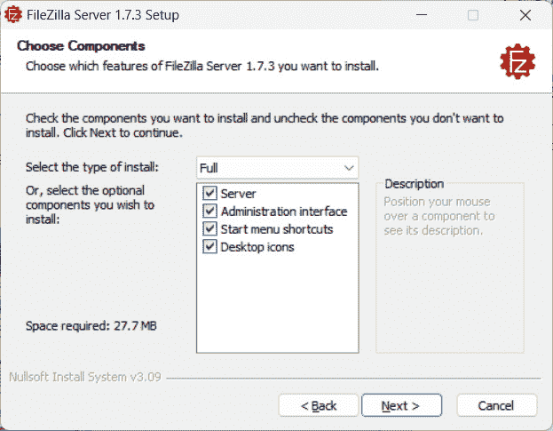

图 7.9 – 默认安装选项

1.  当它完成时，打开 **FileZilla Server** 并按下 **连接到服务器…** 按钮，将弹出 **连接** 窗口，如下截图所示：

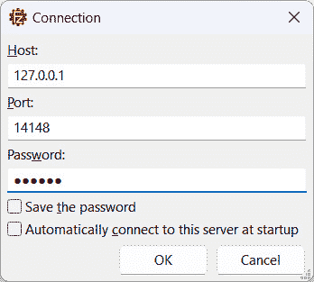

图 7.10 – 在连接窗口中设置主机、端口和密码

1.  服务器启动后，从顶部菜单中选择 **服务器** | **配置…**，如下截图所示：

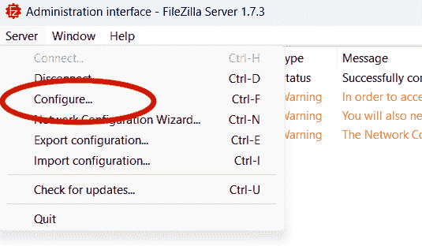

图 7.11 – 从顶部菜单打开设置窗口

1.  一旦打开 **设置** 窗口，点击位于 **可用用户** 列表下的 **添加** 按钮，以添加新用户。然后，在 **共享文件夹** 列表下添加一个共享文件夹，用户将在此上传和下载文件，如下截图所示：

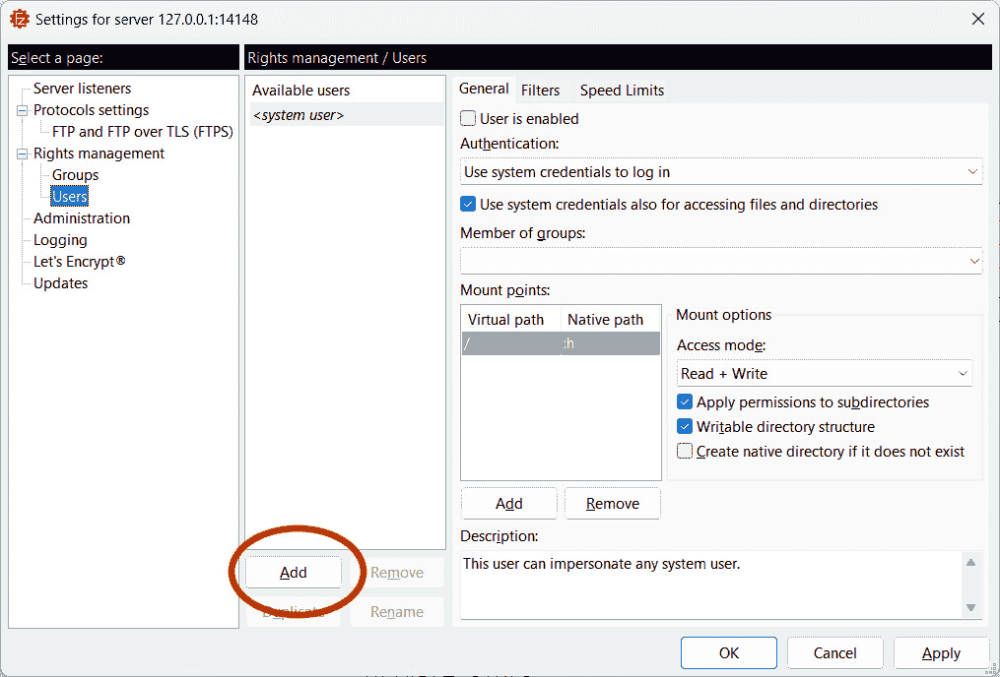

图 7.12 – 点击添加按钮添加新用户

1.  我们现在已经完成了 FileZilla Server 的设置。让我们继续使用 Qt Creator 创建一个新的 `mainwindow.ui` 并设置 GUI，如下所示：

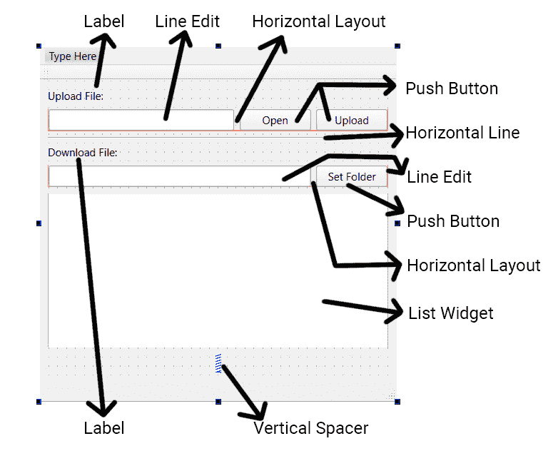

图 7.13 – 我们 FTP 程序的布局

1.  接着，在 `clicked()` 插槽函数上右键单击，如下所示：

    ```cpp
    private slots:
         void on_openButton_clicked();
         void on_uploadButton_clicked();
         itemDoubleClicked(QListWidgetItem*) option and click OK, as shown in the following screenshot:
    ```

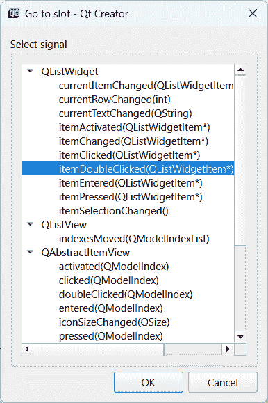

图 7.14 – 选择 itemDoubleClicked 选项

1.  然后，声明其他槽函数，如 `serverConnected()`、`serverReply()` 和 `dataReceived()`，我们将在本章后面实现它们：

    ```cpp
    private slots:
         void on_openButton_clicked();
         void on_uploadButton_clicked();
         void on_setFolderButton_clicked();
         void on_fileList_itemDoubleClicked(QListWidgetItem *item);
         void serverConnected(const QHostAddress &address, int port);
         void serverReply(int code, const QString &parameters);
         FtpDataChannel.
    ```

1.  然后，打开 `ftpdatachannel.h` 并向其中添加以下代码：

    ```cpp
    #ifndef FTPDATACHANNEL_H
    #define FTPDATACHANNEL_H
    #include <QtCore/qobject.h>
    #include <QtNetwork/qtcpserver.h>
    #include <QtNetwork/qtcpsocket.h>
    #include <memory>
    class FtpDataChannel : public QObject{
        Q_OBJECT
    public:
        explicit FtpDataChannel(QObject *parent = nullptr);
        void listen(const QHostAddress &address = QHostAddress::Any);
        void sendData(const QByteArray &data);
        void close();
        QString portspec() const;
        QTcpServer m_server;
        std::unique_ptr<QTcpSocket> m_socket;
    signals:
        void dataReceived(const QByteArray &data);
    };
    #endif
    ```

1.  随后，打开 `ftpdatachannel.cpp` 源文件并写入以下代码：

    ```cpp
    #include "ftpdatachannel.h"
    FtpDataChannel::FtpDataChannel(QObject *parent) : QObject(parent){
        connect(&m_server, &QTcpServer::newConnection, this, [this](){
            m_socket.reset(m_server.nextPendingConnection());
            connect(m_socket.get(), &QTcpSocket::readyRead, this, [this](){
                emit dataReceived(m_socket->readAll());
            });
            connect(m_socket.get(), &QTcpSocket::bytesWritten, this, this{
                qDebug() << bytes;
                close();
            });
        });
    }
    ```

1.  然后，我们继续实现 `FtpDataChannel` 类的函数，例如 `listen()`、`sendData()` 和 `close()`：

    ```cpp
    void FtpDataChannel::listen(const QHostAddress &address){
        m_server.listen(address);
    }
    void FtpDataChannel::sendData(const QByteArray &data){
        if (m_socket)
            m_socket->write(QByteArray(data).replace("\n", "\r\n"));
    }
    void FtpDataChannel::close(){
        if (m_socket)
            m_socket->disconnectFromHost();
    }
    ```

1.  最后，我们实现 `postspec()` 函数，该函数以特殊格式组合 FTP 服务器的信息，以便发送回 FTP 服务器进行验证：

    ```cpp
    QString FtpDataChannel::portspec() const{
        QString portSpec;
        quint32 ipv4 = m_server.serverAddress().toIPv4Address();
        quint16 port = m_server.serverPort();
        portSpec += QString::number((ipv4 & 0xff000000) >> 24);
        portSpec += ',' + QString::number((ipv4 & 0x00ff0000) >> 16);
        portSpec += ',' + QString::number((ipv4 & 0x0000ff00) >> 8);
        portSpec += ',' + QString::number(ipv4 & 0x000000ff);
        portSpec += ',' + QString::number((port & 0xff00) >> 8);
        portSpec += ',' + QString::number(port &0x00ff);
        return portSpec;
    }
    ```

1.  一旦我们完成了 `FtpDataChannel` 类，转到 `FtpControlChannel`。

1.  打开新创建的 `ftpcontrolchannel.h` 并将以下代码添加到头文件中：

    ```cpp
    #ifndef FTPCONTROLCHANNEL_H
    #define FTPCONTROLCHANNEL_H
    #include <QtNetwork/qhostaddress.h>
    #include <QtNetwork/qtcpsocket.h>
    #include <QtCore/qobject.h>
    class FtpControlChannel : public QObject{
        Q_OBJECT
    public:
        explicit FtpControlChannel(QObject *parent = nullptr);
        void connectToServer(const QString &server);
        void command(const QByteArray &command, const QByteArray &params);
    public slots:
        void error(QAbstractSocket::SocketError);
    signals:
        void opened(const QHostAddress &localAddress, int localPort);
        void closed();
        void info(const QByteArray &info);
        void reply(int code, const QByteArray &parameters);
        void invalidReply(const QByteArray &reply);
    private:
        void onReadyRead();
        QTcpSocket m_socket;
        QByteArray m_buffer;
    };
    #endif // FTPCONTROLCHANNEL_H
    ```

1.  然后，让我们打开 `ftpcontrolchannel.cpp` 并写入以下代码：

    ```cpp
    #include "ftpcontrolchannel.h"
    #include <QtCore/qcoreapplication.h>
    FtpControlChannel::FtpControlChannel(QObject *parent) : QObject(parent){
        connect(&m_socket, &QIODevice::readyRead,
                this, &FtpControlChannel::onReadyRead);
        connect(&m_socket, &QAbstractSocket::disconnected,
                this, &FtpControlChannel::closed);
        connect(&m_socket, &QAbstractSocket::connected, this, [this]() {
            emit opened(m_socket.localAddress(), m_socket.localPort());
        });
        connect(&m_socket, &QAbstractSocket::errorOccurred,
                this, &FtpControlChannel::error);
    }
    ```

1.  然后，我们继续实现类的其他函数，例如 `connectToServer()` 和 `command()`：

    ```cpp
    void FtpControlChannel::connectToServer(const QString &server){
        m_socket.connectToHost(server, 21);
    }
    void FtpControlChannel::command(const QByteArray &command, const QByteArray &params){
        QByteArray sendData = command;
        if (!params.isEmpty())
            sendData += " " + params;
        m_socket.write(sendData + "\r\n");
    }
    ```

1.  随后，我们继续为其槽函数编写代码——即 `onReadyRead()` 和 `error()`：

    ```cpp
    void FtpControlChannel::onReadyRead(){
        m_buffer.append(m_socket.readAll());
        int rn = -1;
        while ((rn = m_buffer.indexOf("\r\n")) != -1) {
            QByteArray received = m_buffer.mid(0, rn);
            m_buffer = m_buffer.mid(rn + 2);
            int space = received.indexOf(' ');
            if (space != -1) {
                int code = received.mid(0, space).toInt();
                if (code == 0) {
                    qDebug() << "Info received: " << received.mid(space + 1);
                    emit info(received.mid(space + 1));
                } else {
                    qDebug() << "Reply received: " << received.mid(space + 1);
                    emit reply(code, received.mid(space + 1));
                }
            } else {
                emit invalidReply(received);
            }
        }
    }
    void FtpControlChannel::error(QAbstractSocket::SocketError error){
        qWarning() << "Socket error:" << error;
        QCoreApplication::exit();
    }
    ```

1.  之后，打开 `mainwindow.h` 并添加以下头文件：

    ```cpp
    #include <QDebug>
    #include <QNetworkAccessManager>
    #include <QNetworkRequest>
    #include <QNetworkReply>
    #include <QFile>
    #include <QFileInfo>
    #include <QFileDialog>
    #include <QListWidgetItem>
    #include <QMessageBox>
    #include <QThread>
    #include "ftpcontrolchannel.h"
    #include "ftpdatachannel.h"
    ```

1.  然后，声明 `getFileList()` 函数，如下所示：

    ```cpp
    public:
         explicit MainWindow(QWidget *parent = 0);
         ~MainWindow();
         void getFileList();
    ```

1.  随后，声明以下变量：

    ```cpp
    private:
         Ui::MainWindow *ui;
         FtpDataChannel* dataChannel;
         FtpControlChannel* controlChannel;
         QString ftpAddress;
         QString username;
         QString password;
         QStringList fileList;
         QString uploadFileName;
         QString downloadFileName;
    ```

1.  然后，打开 `mainwindow.cpp` 并将以下代码添加到类构造函数中：

    ```cpp
    MainWindow::MainWindow(QWidget *parent) : QMainWindow(parent), ui(new Ui::MainWindow) {
         ui->setupUi(this);
         dataChannel = new FtpDataChannel(this);
         connect(dataChannel, &FtpDataChannel::dataReceived, this, &MainWindow::dataReceived);
         connect(controlChannel, &FtpControlChannel::reply, this, &MainWindow::serverReply);
         connect(controlChannel, &FtpControlChannel::opened, this, &MainWindow::serverConnected);
         controlChannel = new FtpControlChannel(this);
         ftpAddress = "127.0.0.1/";
         username = "myuser";
         password = "123456";
         controlChannel->connectToServer(ftpAddress);
    }
    ```

1.  之后，实现 `getFileList()` 函数，如下所示：

    ```cpp
    void MainWindow::getFileList() {
    controlChannel->command("PORT", dataChannel->portspec().toUtf8());
        controlChannel->command("MLSD", "");}
    ```

1.  然后，定义`on_openButton_clicked()`槽函数，该函数在点击**打开**按钮时被触发，如下面的代码所示：

    ```cpp
    void MainWindow::on_openButton_clicked() {
         QString fileName = QFileDialog::getOpenFileName(this, "Select File", qApp->applicationDirPath());
         ui->uploadFileInput->setText(fileName);
    }
    ```

1.  完成这些操作后，实现当**上传**按钮被点击时调用的槽函数，如下面的示例所示：

    ```cpp
    void MainWindow::on_uploadButton_clicked() {
         QFile* file = new QFile(ui->uploadFileInput->text());
         QFileInfo fileInfo(*file);
         uploadFileName = fileInfo.fileName();
         controlChannel->command("PORT", dataChannel->portspec().toUtf8());
         controlChannel->command("STOR", uploadFileName.toUtf8());
    }
    ```

1.  以下代码显示了`on_setFolderButton_clicked()`槽函数的样子：

    ```cpp
    void MainWindow::on_setFolderButton_clicked() {
         QString folder = QFileDialog::getExistingDirectory(this, tr("Open Directory"), qApp->applicationDirPath(), QFileDialog::ShowDirsOnly);
         ui->downloadPath->setText(folder);
    }
    ```

1.  接下来，定义一个槽函数，当列表小部件的某个项目被双击时将触发该函数，如下面的代码所示：

    ```cpp
    void MainWindow::on_fileList_itemDoubleClicked(QListWidgetItem *item) {
         downloadFileName = item->text();
         QString folder = ui->downloadPath->text();
         if (folder != "" && QDir(folder).exists()) {
               controlChannel->command("PORT", dataChannel->portspec().toUtf8());
                           controlChannel->command("RETR", downloadFileName.toUtf8());
         }
         else {
               QMessageBox::warning(this, "Invalid Path", "Please set the download path before download.");
    }}
    ```

1.  我们还没有完成。接下来，我们将实现`serverConnected()`函数，当程序成功连接到 FTP 服务器时，该函数将自动被调用，如下面的代码所示：

    ```cpp
    void MainWindow::serverConnected(const QHostAddress &address, int port){
        qDebug() << "Listening to:" << address << port;
        dataChannel->listen(address);
        controlChannel->command("USER", username.toUtf8());
        controlChannel->command("PASS", password.toUtf8());
        getFileList();
    }
    ```

1.  我们还需要实现当 FTP 服务器回复我们的请求时将被调用的函数，如下面的示例所示：

    ```cpp
    void MainWindow::serverReply(int code, const QString &parameters){
        if (code == 150 && uploadFileName != ""){
            QFile* file = new QFile(ui->uploadFileInput->text());
            QFileInfo fileInfo(*file);
            uploadFileName = fileInfo.fileName();
            if (file->open(QIODevice::ReadOnly)){
                QThread::msleep(1000);
                QByteArray data = file->readAll();
                dataChannel->sendData(data + "\n\r");
                qDebug() << data;
            } else {
                QMessageBox::warning(this, "Invalid File", "Failed to open file for upload.");
            }
        }
        if (code == 226 && uploadFileName != ""){
            uploadFileName = "";
            QMessageBox::warning(this, "Upload Success", "File successfully uploaded.");
        }
    }
    ```

1.  `dataReceived()`函数用于获取从 FTP 服务器接收到的数据，其代码如下所示：

    ```cpp
    void MainWindow::dataReceived(const QByteArray &data){
        if (data.startsWith("type=file")){
            ui->fileList->clear();
            QStringList fileList = QString(data).split("\r\n");
            if (fileList.length() > 0){
                for (int i = 0; i < fileList.length(); ++i){
                    if (fileList.at(i) != ""){
                        QStringList fileInfo = fileList.at(i).split(";");
                        QString fileName = fileInfo.at(4).simplified();
                        ui->fileList->addItem(fileName);
                    }
                 }
            }
        } else {
            QString folder = ui->downloadPath->text();
            QFile file(folder + "/" + downloadFileName);
            file.open(QIODevice::WriteOnly);
            file.write((data));
            file.close();
            QMessageBox::information(this, "Success", "File successfully downloaded.");
        }
    }
    ```

1.  最后，构建并运行程序。尝试上传一些文件到 FTP 服务器。如果成功，文件列表应该会更新并显示在**列表**小部件上。然后，尝试双击列表小部件上的文件名，将文件下载到您的计算机上，如下面的屏幕截图所示：

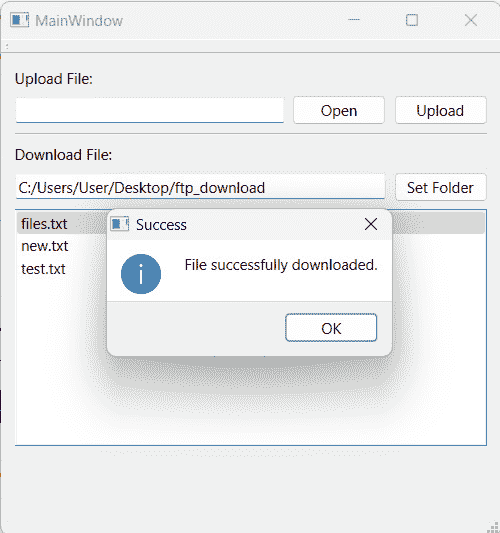

图 7.15 – 通过双击从 FTP 服务器下载文件

1.  您还可以尝试通过点击**打开**按钮，选择所需的文件，然后按下**上传**按钮来上传文件，如下面的屏幕截图所示：

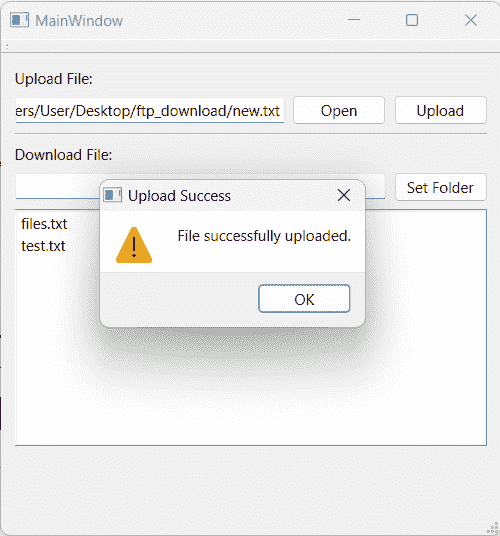

图 7.16 – 将文件上传到 FTP 服务器

1.  恭喜您，您现在已经成功创建了一个可工作的 FTP 程序！

注意

请注意，这个示例程序仅用于展示 FTP 程序最基本实现，并不是一个功能齐全的程序。如果您尝试上传/下载非文本格式的文件，则可能无法保证其正常工作。如果 FTP 服务器上已存在同名文件，也可能无法正确上传。如果您希望在此基础上扩展项目，必须自行实现这些功能。

## 它是如何工作的……

尽管这个项目规模更大，代码也更长，但实际上它与我们在之前菜谱中完成的 TCP 网络项目非常相似。我们还利用了 Qt 6 提供的信号和槽机制来简化我们的工作。

在过去，Qt 曾经支持`QNetworkAccessManager`类中的 FTP。然而，自 Qt 6 以来，FTP 已被弃用，因此我们必须自己实现它。

我们必须了解一些最常见的 FTP 命令，并在我们的程序中利用它们。更多信息，请查看[`www.serv-u.com/resources/tutorial/appe-stor-stou-retr-list-mlsd-mlst-ftp-command`](https://www.serv-u.com/resources/tutorial/appe-stor-stou-retr-list-mlsd-mlst-ftp-command)。

`FtpControlChannel` 和 `FtpDataChannel` 类是从 Qt 的官方 Git 仓库中提取的，并进行了一些微小的修改：[`code.qt.io/cgit/qt/qtscxml.git/tree/examples/scxml/ftpclient`](https://code.qt.io/cgit/qt/qtscxml.git/tree/examples/scxml/ftpclient)。
