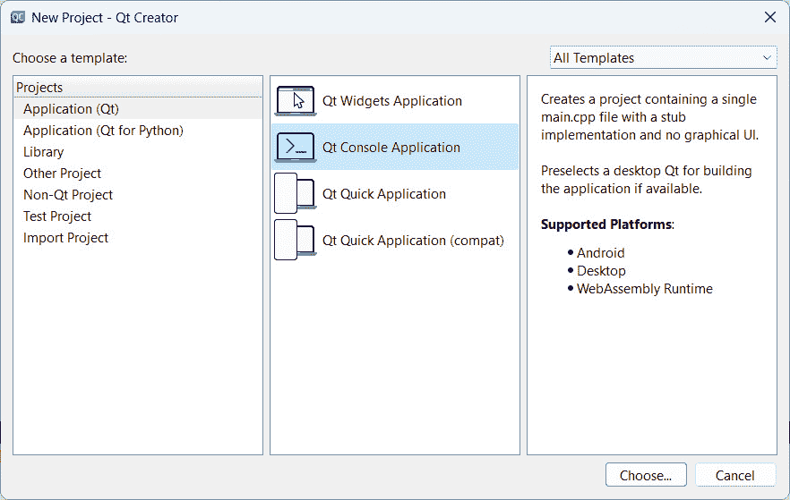
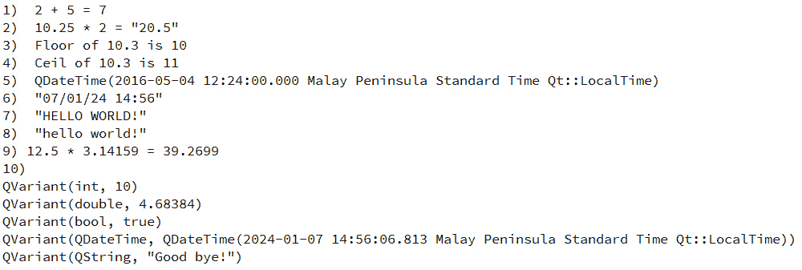
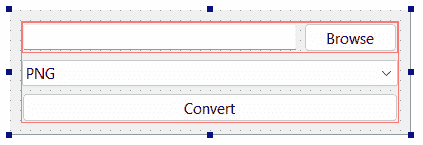
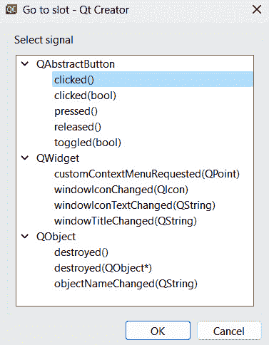
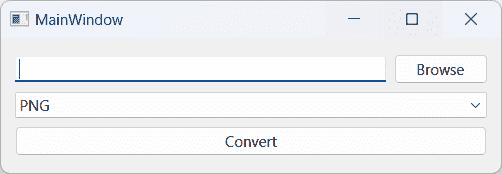
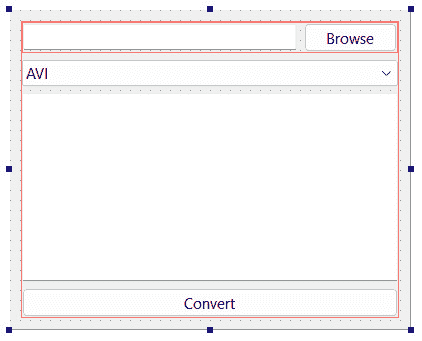
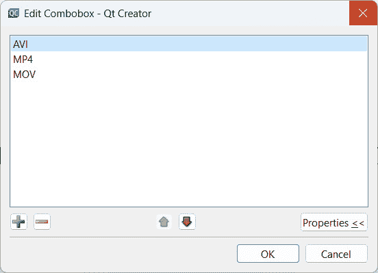
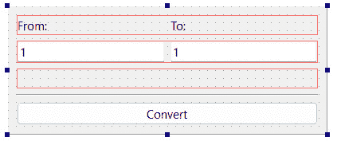
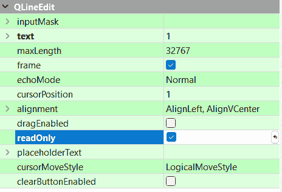
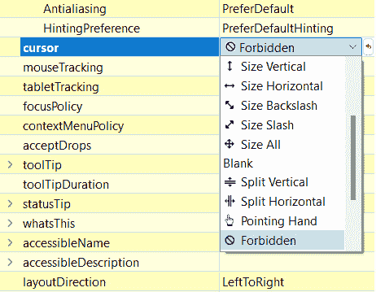

# 第十一章：转换库

在我们的计算机环境中保存的数据以各种方式编码。有时，它可以直接用于某个目的；其他时候，它需要转换为另一种格式，以便适应任务的上下文。将数据从一种格式转换为另一种格式的过程也取决于源格式以及目标格式。

有时，这个过程可能非常复杂，尤其是在处理功能丰富且敏感的数据时，如图像或视频转换。即使在转换过程中出现的小错误也可能使文件无法使用。

本章将涵盖以下食谱：

+   转换数据

+   转换图像

+   转换视频

+   转换货币

# 技术要求

本章的技术要求包括 Qt 6.6.1 MinGW-64 位和 Qt Creator 12.0.2。本章中使用的所有代码都可以从以下 GitHub 仓库下载：[`github.com/PacktPublishing/QT6-C-GUI-Programming-Cookbook---Third-Edition-/tree/main/Chapter11`](https://github.com/PacktPublishing/QT6-C-GUI-Programming-Cookbook---Third-Edition-/tree/main/Chapter11)。

# 转换数据

Qt 提供了一套类和函数，可以轻松地在不同类型的数据之间进行转换。这使得 Qt 不仅仅是一个 GUI 库；它是一个完整的软件开发平台。在以下示例中，我们将使用的 `QVariant` 类与 C++ 标准库提供的类似转换功能相比，使 Qt 更加灵活和强大。

## 如何做到这一点…

让我们按照以下步骤学习如何在 Qt 中转换各种数据类型：

1.  打开 **Qt Creator** 并创建一个新的 **Qt 控制台应用程序**项目，方法是通过 **文件** | **新建项目…**：



图 11.1 – 创建 Qt 控制台应用程序项目

1.  打开 `main.cpp` 并向其中添加以下头文件：

    ```cpp
    #include <QCoreApplication>
    #include <QDebug>
    #include <QtMath>
    #include <QDateTime>
    #include <QTextCodec>
    main() function, add the following code to convert a string into a number:

    ```

    int numberA = 2;

    QString numberB = "5";

    qDebug() << "1) " << "2 + 5 =" << numberA + numberB.toInt();

    ```cpp

    ```

1.  将数字转换回字符串：

    ```cpp
        float numberC = 10.25;
        float numberD = 2;
        QString result = QString::number(numberC * numberD);
        qDebug() << "2) " << "10.25 * 2 =" << result;
    ```

1.  让我们看看如何使用 `qFloor()` 来向下舍入一个值：

    ```cpp
        float numberE = 10.3;
        float numberF = qFloor(numberE);
        qDebug() << "3) " << "Floor of 10.3 is" << numberF;
    ```

1.  使用 `qCeil()`，我们可以将一个数字向下舍入到不小于其初始值的最小整数：

    ```cpp
        float numberG = 10.3;
        float numberH = qCeil(numberG);
        qDebug() << "4) " << "Ceil of 10.3 is" << numberH;
    ```

1.  通过将字符串格式的日期时间数据转换来创建日期时间变量：

    ```cpp
        QString dateTimeAString = "2016-05-04 12:24:00";
        QDateTime dateTimeA = QDateTime::fromString(dateTimeAString, "yyyy-MM-dd hh:mm:ss");
        qDebug() << "5) " << dateTimeA;
    ```

1.  使用我们的自定义格式将日期时间变量转换回字符串：

    ```cpp
        QDateTime dateTimeB = QDateTime::currentDateTime();
        QString dateTimeBString = dateTimeB.toString("dd/MM/yy hh:mm");
        qDebug() << "6) " << dateTimeBString;
    ```

1.  调用 `QString::toUpper()` 函数将字符串变量转换为大写字母：

    ```cpp
        QString hello1 = "hello world!";
        qDebug() << "7) " << hello1.toUpper();
    ```

1.  调用 `QString::toLower()` 将字符串完全转换为小写：

    ```cpp
        QString hello2 = "HELLO WORLD!";
        qDebug() << "8) " << hello2.toLower();
    ```

1.  Qt 提供的 `QVariant` 类是一个非常强大的数据类型，可以轻松地转换为其他类型，而无需程序员做任何努力：

    ```cpp
        QVariant aNumber = QVariant(3.14159);
        double aResult = 12.5 * aNumber.toDouble();
        qDebug() << "9) 12.5 * 3.14159 =" << aResult;
    ```

1.  这演示了单个 `QVariant` 变量如何同时转换为多个数据类型，而无需程序员做任何努力：

    ```cpp
        qDebug() << "10) ";
        QVariant myData = QVariant(10);
        qDebug() << myData;
        myData = myData.toFloat() / 2.135;
        qDebug() << myData;
        myData = true;
        qDebug() << myData;
        myData = QDateTime::currentDateTime();
        qDebug() << myData;
        myData = "Good bye!";
        qDebug() << myData;
    ```

1.  `main.cpp` 中的完整源代码现在看起来是这样的：

    ```cpp
    #include <QCoreApplication>
    #include <QDebug>
    #include <QtMath>
    #include <QDateTime>
    #include <QStringConverter>
    #include <iostream>
    int main(int argc, char *argv[]) {
        QCoreApplication a(argc, argv);
    ```

1.  然后，让我们添加代码将字符串转换为数字，反之亦然：

    ```cpp
    // String to number
        int numberA = 2;
        QString numberB = "5";
        qDebug() << "1) " << "2 + 5 =" << numberA +
    numberB.toInt();
    // Number to string
        float numberC = 10.25;
        float numberD = 2;
        QString result = QString::number(numberC * numberD);
        qDebug() << "2) " << "10.25 * 2 =" << result;
    ```

1.  编写代码将浮点数转换为最接近的整数，分别向上取整或向下取整：

    ```cpp
    // Floor
        float numberE = 10.3;
        float numberF = qFloor(numberE);
        qDebug() << "3) " << "Floor of 10.3 is" << numberF;
    // Ceil
        float numberG = 10.3;
        float numberH = qCeil(numberG);
        qDebug() << "4) " << "Ceil of 10.3 is" << numberH;
    ```

1.  将字符串转换为日期时间格式，反之亦然：

    ```cpp
    // Date time from string
        QString dateTimeAString = "2016-05-04 12:24:00";
        QDateTime dateTimeA = QDateTime::fromString(dateTimeAString, "yyyy-MM-dd hh:mm:ss");
        qDebug() << "5) " << dateTimeA;
    // Date time to string
        QDateTime dateTimeB = QDateTime::currentDateTime();
        QString dateTimeBString = dateTimeB.toString("dd/MM/yy hh:mm");
        qDebug() << "6) " << dateTimeBString;
    ```

1.  继续添加代码将字符串转换为大写或小写字符：

    ```cpp
    // String to all uppercase
        QString hello1 = "hello world!";
        qDebug() << "7) " << hello1.toUpper();
    // String to all lowercase
        QString hello2 = "HELLO WORLD!";
        qDebug() << "8) " << hello2.toLower();
    ```

1.  将 `QVariant` 数据类型转换为其他类型：

    ```cpp
    // QVariant to double
        QVariant aNumber = QVariant(3.14159);
        double aResult = 12.5 * aNumber.toDouble();
        qDebug() << "9) 12.5 * 3.14159 =" << aResult;
    // QVariant different types
        qDebug() << "10) ";
        QVariant myData = QVariant(10);
        qDebug() << myData;
        myData = myData.toFloat() / 2.135;
        qDebug() << myData;
        myData = true;
        qDebug() << myData;
    ```

1.  将 `QVariant` 数据类型转换为 `QDateTime` 和 `QString`：

    ```cpp
        myData = QDateTime::currentDateTime();
        qDebug() << myData;
        myData = "Good bye!";
        qDebug() << myData;
        return a.exec();
    }
    ```

1.  编译并运行项目，你应该会看到类似这样的结果：



图 11.2 – 在应用程序输出窗口中打印转换结果

## 它是如何工作的…

Qt 提供的所有数据类型，如 `QString`、`QDateTime` 和 `QVariant`，都包含使转换到其他类型变得简单直接的函数。Qt 还提供了自己的对象转换函数 `qobject_cast()`，它不依赖于标准库。它也与 Qt 更为兼容，并且可以很好地在 Qt 的控件类型和数据类型之间进行转换。

Qt 还为你提供了 `QtMath` 类，它可以帮助你操作数字变量，例如向上取整一个浮点数或将角度从度转换为弧度。`QVariant` 是一个特殊类，可以用来存储各种类型的数据，例如 `int`、`float`、`char` 和 `string`。它可以通过检查变量中存储的值来自动确定数据类型。你还可以通过调用单个函数，如 `toFloat()`、`toInt()`、`toBool()`、`toChar()` 或 `toString()`，轻松地将数据转换为 `QVariant` 类支持的任何类型。

## 还有更多…

请注意，这些转换都需要计算能力。尽管现代计算机在处理这些操作方面非常快，但你应该小心不要一次性处理大量数据。如果你正在为复杂计算转换大量变量，这可能会显著减慢你的计算机速度，因此请尽量仅在必要时转换变量。

# 转换图像

在本节中，我们将学习如何构建一个简单的图像转换器，它可以将图像从一种格式转换为另一种格式。Qt 支持读取和写入不同类型的图像格式，由于许可问题，这种支持以外部 DLL 文件的形式提供。

然而，你不必担心这一点，因为只要你在项目中包含那些 DLL 文件，它就可以在不同格式之间无缝工作。某些格式只支持读取而不支持写入，而某些格式则两者都支持。

注意

你可以在 [`doc.qt.io/qt-6/qtimageformats-index.html`](http://doc.qt.io/qt-6/qtimageformats-index.html) 查看有关转换图像的完整详细信息。

## 如何做到这一点…

Qt 的内置图像库使得图像转换变得非常简单：

1.  打开 Qt Creator 并创建一个新的 **Qt Widgets** **应用程序** 项目。

1.  打开`mainwindow.ui`并在画布上添加一个用于选择图像文件的文本框和一个按钮，一个用于选择所需文件格式的组合框，以及另一个用于启动转换过程的按钮：



图 11.3 – 按照此处所示布局 UI

1.  双击组合框，然后会出现一个窗口，您可以在其中编辑框。我们将通过点击`PNG`、`JPEG`和`BMP`来向组合框列表中添加三项：


图 11.4 – 向组合框添加三个选项

1.  右键单击一个按钮，选择**转到槽…**，然后点击**确定**按钮。将自动为您添加一个槽函数。对其他按钮也重复此步骤：



图 11.5 – 选择 clicked() 信号并点击确定

1.  让我们转到源代码。打开`mainwindow.h`并添加以下头文件：

    ```cpp
    #include <QMainWindow>
    #include <QFileDialog>
    #include <QMessageBox>
    mainwindow.cpp and define what will happen when the Browse button is clicked, which in this case is opening the file dialog to select an image file:

    ```

    void MainWindow::on_browseButton_clicked() {

    QString fileName = QFileDialog::getOpenFileName(this, "Open Image", "", "Image Files (*.png *.jpg *.bmp)");

    ui->filePath->setText(fileName);

    }

    ```cpp

    ```

1.  定义当**转换**按钮被点击时会发生什么：

    ```cpp
    void MainWindow::on_convertButton_clicked() {
        QString fileName = ui->filePath->text();
        if (fileName != "") {
            QFileInfo fileInfo = QFileInfo(fileName);
            QString newFileName = fileInfo.path() + "/" + fileInfo.completeBaseName();
            QImage image = QImage(ui->filePath->text());
            if (!image.isNull()) {
    ```

1.  检查使用的格式：

    ```cpp
    // 0 = PNG, 1 = JPG, 2 = BMP
                int format = ui->fileFormat->currentIndex();
                if (format == 0) {
                    newFileName += ".png";
                }
                else if (format == 1) {
                    newFileName += ".jpg";
                }
                else if (format == 2) {
                    newFileName += ".bmp";
                }
    ```

1.  检查图像是否已转换：

    ```cpp
                qDebug() << newFileName << format;
                if (image.save(newFileName, 0, -1)) {
                    QMessageBox::information(this, "Success", "Image successfully converted.");
                }
                else {
                    QMessageBox::warning(this, "Failed", "Failed to convert image.");
                }
            }
    ```

1.  显示消息框：

    ```cpp
            else {
                QMessageBox::warning(this, "Failed", "Failed to open image file.");
                }
            }
        else {
            QMessageBox::warning(this, "Failed", "No file is selected.");
        }
    }
    ```

1.  现在构建并运行程序，我们应该得到一个看起来像这样的简单图像转换器：



图 11.6 – 浏览图像，选择格式，然后点击转换按钮

## 它是如何工作的…

之前的例子使用了 Qt 的原生`QImage`类，它包含可以访问像素数据并操作它的函数。它也被用来通过不同的解压缩方法加载图像文件并提取其数据，具体取决于图像的格式。

一旦数据被提取，您就可以对它做任何您想做的事情，例如在屏幕上显示图像，操作其颜色信息，调整图像大小，或者用另一种格式压缩它并保存为文件。

我们使用了`QFileInfo`来将文件名与扩展名分开，这样我们就可以使用用户从组合框中选择的新的格式来修改扩展名。这样，我们就可以将新转换的图像保存到与原始图像相同的文件夹中，并且自动给它相同的文件名，除了不同的格式。

只要您尝试将图像转换为 Qt 支持的格式，您只需调用 `QImage::save()`。内部，Qt 会为您处理其余部分并将图像输出到所选格式。在 `QImage::save()` 函数中，有一个参数用于设置图像质量，另一个参数用于设置格式。在这个例子中，我们只是将两者都设置为默认值，这样图像就会以最高质量保存，并且 Qt 会根据输出文件名中声明的扩展名来确定格式。

## 还有更多...

您还可以使用 Qt 提供的 `QPdfWriter` 类将图像转换为 PDF。本质上，您将选定的图像绘制到新创建的 PDF 文档的布局中，并相应地设置其分辨率。

注意

想了解更多关于 `QPdfWriter` 类的信息，请访问 [`doc.qt.io/qt-6/qpdfwriter.html`](http://doc.qt.io/qt-6/qpdfwriter.html)。

# 转换视频

在这个菜谱中，我们将使用 Qt 和 Qt 提供的 `QProcess` 类创建一个简单的视频转换器。

## 如何做到这一点...

让我们按照以下步骤制作一个简单的视频转换器：

1.  从 [`ffmpeg.zeranoe.com/builds`](http://ffmpeg.zeranoe.com/builds) 下载 `FFmpeg`（一个静态包）并将其内容解压到您喜欢的位置 – 例如，`C:/FFmpeg/`。

1.  打开 Qt Creator 并创建一个新的 **Qt Widgets 应用程序** 项目，方法是转到 **文件** | **新建项目...**。

1.  打开 `mainwindow.ui` – 我们将处理程序的用户界面。它的 UI 与之前的例子非常相似，只是我们在组合框下方添加了一个额外的文本编辑小部件：



图 11.7 – 按照这样设计你的视频转换器 UI

1.  双击组合框，然后会出现一个窗口来编辑该框。我们将通过点击 `AVI`、`MP4` 和 `MOV` 添加三个项目到组合框列表中：



图 11.8 – 向组合框添加三个视频格式

1.  右键单击其中一个按钮，选择 **转到槽...**，然后点击 **确定** 按钮。然后会自动将槽函数添加到您的源文件中。对其他按钮重复此步骤。

1.  打开 `mainwindow.h` 并将以下头文件添加到顶部：

    ```cpp
    #include <QMainWindow>
    #include <QFileDialog>
    #include <QProcess>
    #include <QMessageBox>
    #include <QScrollBar>
    public keyword:

    ```

    public:

    explicit MainWindow(QWidget *parent = 0);

    ~MainWindow();

    QProcess* process;

    QString outputText;

    QString fileName;

    QString outputFileName;

    ```cpp

    ```

1.  在之前 Qt 为我们创建的两个函数（*转换* *图像* 菜单）下添加三个额外的槽函数：

    ```cpp
    private slots:
        void on_browseButton_clicked();
        void on_convertButton_clicked();
        void processStarted();
        void readyReadStandardOutput();
        void processFinished();
    ```

1.  打开 `mainwindow.cpp` 并在类构造函数中添加以下代码：

    ```cpp
    MainWindow::MainWindow(QWidget *parent) :
        QMainWindow(parent), ui(new Ui::MainWindow) {
        ui->setupUi(this);
        process = new QProcess(this);
        connect(process, QProcess::started, this,
    MainWindow::processStarted);
        connect(process, QProcess::readyReadStandardOutput, this,
    MainWindow::readyReadStandardOutput);
        connect(process, QProcess::finished, this,
    MainWindow::processFinished);
    }
    ```

1.  定义当 **浏览** 按钮被点击时会发生什么，在这种情况下是打开文件对话框以允许我们选择视频文件：

    ```cpp
    void MainWindow::on_browseButton_clicked() {
        QString fileName = QFileDialog::getOpenFileName(this, "Open Video", "", "Video Files (*.avi *.mp4 *.mov)");
        ui->filePath->setText(fileName);
    }
    ```

1.  定义当 `FFmpeg`（它将随后处理转换过程）发生时会发生什么：

    ```cpp
    void MainWindow::on_convertButton_clicked() {
        QString ffmpeg = "C:/FFmpeg/bin/ffmpeg";
        QStringList arguments;
        fileName = ui->filePath->text();
        if (fileName != "") {
            QFileInfo fileInfo = QFileInfo(fileName);
            outputFileName = fileInfo.path() + "/" +
    fileInfo.completeBaseName();
    ```

1.  检查文件的格式 – 特别是它是否为 `.avi`、`.mp4` 或 `.mov`：

    ```cpp
            if (QFile::exists(fileName)) {
                int format = ui->fileFormat->currentIndex();
                if (format == 0) {
                    outputFileName += ".avi"; // AVI
                }
                else if (format == 1) {
                    outputFileName += ".mp4"; // MP4
                }
                else if (format == 2) {
                    outputFileName += ".mov"; // MOV
                }
    ```

1.  使用以下代码开始转换：

    ```cpp
                qDebug() << outputFileName << format;
                arguments << "-i" << fileName << outputFileName;
                qDebug() << arguments;
                process->setProcessChannelMode(QProcess::MergedChannels);
                process->start(ffmpeg, arguments);
            }
    ```

1.  显示消息框：

    ```cpp
            else {
                QMessageBox::warning(this, "Failed", "Failed to open video file.");
            }
        }
        else {
            QMessageBox::warning(this, "Failed", "No file is selected.");
        }
    }
    ```

1.  当转换过程开始时，告诉程序要做什么：

    ```cpp
    void MainWindow::processStarted() {
        qDebug() << "Process started.";
        ui->browseButton->setEnabled(false);
        ui->fileFormat->setEditable(false);
        ui->convertButton->setEnabled(false);
    }
    ```

1.  编写在转换过程中`FFmpeg`向程序返回输出时被调用的槽函数：

    ```cpp
    void MainWindow::readyReadStandardOutput() {
        outputText += process->readAllStandardOutput();
        ui->outputDisplay->setText(outputText);
        ui->outputDisplay->verticalScrollBar()->setSliderPosition(ui->outputDisplay->verticalScrollBar()->maximum());
    }
    ```

1.  定义在转换过程完成后被调用的槽函数：

    ```cpp
    void MainWindow::processFinished() {
        qDebug() << "Process finished.";
        if (QFile::exists(outputFileName)) {
            QMessageBox::information(this, "Success", "Video successfully converted.");
        }
        else {
            QMessageBox::information(this, "Failed", "Failed to convert video.");
        }
        ui->browseButton->setEnabled(true);
        ui->fileFormat->setEditable(true);
        ui->convertButton->setEnabled(true);
    }
    ```

1.  构建并运行项目，你应该得到一个简单但实用的视频转换器：


图 11.9 – 由 FFmpeg 和 Qt 驱动的您的视频转换器

## 它是如何工作的…

Qt 提供的`QProcess`类用于启动外部程序并与它们通信。在本例中，我们将位于`C:/FFmpeg/bin/`的`ffmpeg.exe`作为一个进程启动，并开始与之通信。我们还向它发送了一组参数，告诉它在启动时应该做什么。在这个例子中，我们使用的参数相对基础——我们只告诉`FFmpeg`源图像的路径和输出文件名。

注意

想了解更多关于`FFmpeg`中可用参数设置的信息，请查看[www.ffmpeg.org/ffmpeg.html](http://www.ffmpeg.org/ffmpeg.html)。

`FFmpeg`不仅能转换视频文件，还可以用来转换音频文件和图片。

注意

想了解更多关于`FFmpeg`支持的所有格式的信息，请查看[`www.ffmpeg.org/general.html#File-Formats`](https://www.ffmpeg.org/general.html#File-Formats)。

此外，您还可以通过运行位于`C:/FFmpeg/bin`的`ffplay.exe`播放视频或音频文件，或者通过运行`ffprobe.exe`以人类可读的方式打印视频或音频文件的信息。

注意

在[`www.ffmpeg.org/about.html`](https://www.ffmpeg.org/about.html)查看`FFmpeg`的完整文档。

## 更多内容…

使用这种方法，您可以做很多事情。您不仅限于 Qt 提供的内容，而且可以通过仔细选择提供您所需功能的第三方程序来突破这些限制。一个这样的例子是利用市场上仅提供命令行扫描程序的杀毒软件，如**Avira ScanCL**、**Panda Antivirus Command Line Scanner**、**SAV32CLI**和**ClamAV**。您可以使用 Qt 构建自己的 GUI，并基本上向杀毒进程发送命令，告诉它要做什么。

# 货币转换

在本例中，我们将学习如何使用 Qt 创建一个简单的货币转换器，借助名为**Fixer.io**的外部服务提供商。

## 如何做到这一点…

按照以下简单步骤制作自己的货币转换器：

1.  打开 Qt Creator，从**文件** | **新建项目...**创建一个新的**Qt Widgets 应用程序**项目。

1.  打开项目文件（`.pro`），将网络模块添加到我们的项目中：

    ```cpp
    QT += core gui mainwindow.ui and remove the menu bar, toolbar, and status bar from the UI.
    ```

1.  向画布添加三个水平布局、一条水平线和一个推按钮。在画布上左键单击，然后通过点击 `Convert` 继续操作。UI 应该看起来像这样：


图 11.10 – 在转换按钮上方放置三个垂直布局

1.  在顶部布局中添加两个标签，并将左侧标签的文本设置为 `From:`，右侧标签的文本设置为 `To:`。添加两个 `1`：



图 11.11 – 向布局中添加标签和行编辑小部件

1.  选择右侧的行编辑，并在 **属性** 面板中启用 **只读** 复选框：



图 11.12 – 为第二个行编辑启用只读属性

1.  将光标属性设置为 **禁止**，以便用户知道在鼠标悬停在控件上时它不可编辑：



图 11.13 – 显示禁止光标以让用户知道它已被禁用

1.  在底部布局的第三个布局中添加两个组合框。我们现在将它们留空：


图 11.14 – 向最终布局添加两个组合框

1.  右键单击 `clicked()` 信号作为选择，并点击 `mainwindow.h` 和 `mainwindow.cpp`。

1.  打开 `mainwindow.h` 并确保以下头文件被添加到源文件顶部：

    ```cpp
    #include <QMainWindow>
    #include <QDoubleValidator>
    #include <QNetworkAccessManager>
    #include <QNetworkRequest>
    #include <QNetworkReply>
    #include <QJsonDocument>
    #include <QJsonObject>
    #include <QDebug>
    finished():

    ```

    私有槽位：

    void on_convertButton_clicked();

    void finished(QNetworkReply* reply);

    ```cpp

    ```

1.  在 `private` 标签下添加两个变量：

    ```cpp
    private:
        Ui::MainWindow *ui;
        QNetworkAccessManager* manager;
        QString targetCurrency;
    ```

1.  打开 `mainwindow.cpp` 文件。在类构造函数中向两个组合框添加几个货币简码。将验证器设置到 `finished()` 信号到我们的 `finished()` 槽函数：

    ```cpp
    MainWindow::MainWindow(QWidget *parent) :
        QMainWindow(parent), ui(new Ui::MainWindow) {
        ui->setupUi(this);
        QStringList currencies;
        currencies.push_back("EUR");
        currencies.push_back("USD");
        currencies.push_back("CAD");
        currencies.push_back("MYR");
        currencies.push_back("GBP");
    ```

1.  我们从前面的代码继续，并将货币简写形式插入到组合框中。然后，我们声明一个新的网络访问管理器，并将其 finished 信号连接到我们的自定义槽函数：

    ```cpp
        ui->currencyFrom->insertItems(0, currencies);
        ui->currencyTo->insertItems(0, currencies);
        QValidator *inputRange = new QDoubleValidator(this);
        ui->amountFrom->setValidator(inputRange);
        manager = new QNetworkAccessManager(this);
        connect(manager, &QNetworkAccessManager::finished, this, &MainWindow::finished);
    }
    ```

1.  定义当用户点击 **转换** 按钮时会发生什么：

    ```cpp
    void MainWindow::on_convertButton_clicked() {
        if (ui->amountFrom->text() != "") {
            ui->convertButton->setEnabled(false);
            QString from = ui->currencyFrom->currentText();
            QString to = ui->currencyTo->currentText();
            targetCurrency = to;
            QString url = "http://data.fixer.io/api/latest?base=" +      from + "&symbols=" + to + "&access_key=YOUR_KEY";
    ```

1.  通过调用 `get()` 来启动请求：

    ```cpp
            QNetworkRequest request = QNetworkRequest(QUrl(url));
            manager->get(request);
        }
        else {
            QMessageBox::warning(this, "Error", "Please insert a value.");
        }
    }
    ```

1.  定义当 `finished()` 信号被触发时会发生什么：

    ```cpp
    void MainWindow::finished(QNetworkReply* reply) {
        QByteArray response = reply->readAll();
        qDebug() << response;
        QJsonDocument jsonResponse =
    QJsonDocument::fromJson(response);
        QJsonObject jsonObj = jsonResponse.object();
        QJsonObject jsonObj2 = jsonObj.value("rates").toObject();
        double rate = jsonObj2.value(targetCurrency).toDouble();
    ```

1.  继续编写前面的代码，如下面的代码片段所示：

    ```cpp
        if (rate == 0)
            rate = 1;
        double amount = ui->amountFrom->text().toDouble();
        double result = amount * rate;
        ui->amountTo->setText(QString::number(result));
        ui->convertButton->setEnabled(true);
    }
    ```

1.  编译并运行项目，然后你应该得到一个看起来像这样的简单货币转换器：


图 11.15 – 一个可用的货币转换器已完成

## 它是如何工作的…

与我们之前看到的示例类似，该示例使用外部程序来完成特定任务，这次我们使用了一个外部服务提供商，它为我们提供了一个对所有用户免费且易于使用的 **应用程序编程接口** (**API**)。

这样，我们就不必考虑获取最新货币汇率的方法。相反，服务提供商已经为我们完成了这项工作；我们只需礼貌地请求它。然后，我们等待从他们的服务器返回的响应，并根据我们的目的处理数据。

除了 Fixer.io ([`fixer.io`](http://fixer.io))之外，您还可以选择相当多的不同服务提供商。有些是免费的，但没有任何高级功能；有些提供您以高端价格。这些替代方案中的一些是**Open Exchange Rates** ([`openexchangerates.org`](https://openexchangerates.org))、**currencylayer API** ([`currencylayer.com`](https://currencylayer.com))、**Currency API** ([`currency-api.appspot.com`](https://currency-api.appspot.com))、**XE Currency Data API** ([`www.xe.com/xecurrencydata`](http://www.xe.com/xecurrencydata))和**jsonrates** ([`jsonrates.com`](http://jsonrates.com))。

在之前的代码中，您应该已经注意到一个访问密钥被传递给了 Fixer.io API，这是我为此教程注册的一个免费访问密钥。如果您将其用于自己的项目，您应该在 Fixer.io 上创建一个账户。

## 还有更多...

除了货币汇率，您还可以使用这种方法执行更高级的任务，这些任务可能太复杂而无法自行完成，或者除非您使用专家提供的服务，否则根本无法访问，例如可编程的**短信服务**（**SMS**）和语音服务、网站分析和统计数据生成，以及在线支付网关。大多数这些服务都不是免费的，但您可以在几分钟内轻松实现这些功能，甚至无需设置服务器基础设施和后端系统；这绝对是快速且成本最低的方式，让您的产品快速运行而无需太多麻烦。
