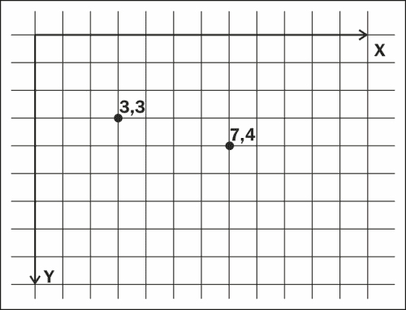
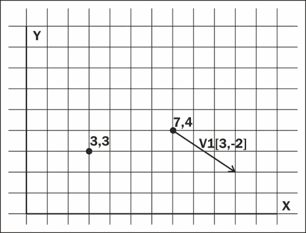
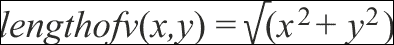
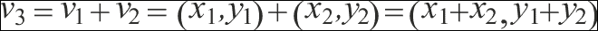
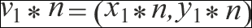
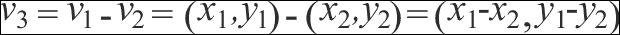
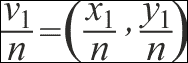
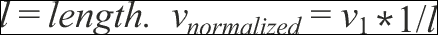
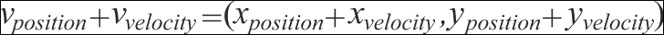

# 第四章：探索运动和输入处理

我们已经介绍了如何在屏幕上绘制以及如何处理对象，但到目前为止还没有任何东西在屏幕上移动。从用户那里获取输入并控制我们的游戏对象是游戏开发中最重要的话题之一。它可以决定游戏的感受和响应速度，并且是用户能够真正感受到的。在本章中，我们将涵盖以下内容：

+   笛卡尔坐标系

+   2D 向量

+   创建变量以控制游戏对象的运动

+   设置简单的运动系统

+   设置来自游戏手柄、键盘和鼠标的输入处理

+   创建固定帧率

# 为运动设置游戏对象

在上一章中，我们给我们的对象分配了 x 和 y 值，然后我们可以将这些值传递到我们的绘图代码中。我们使用的 x 和 y 值可以用笛卡尔坐标系来表示。



上面的图显示了一个笛卡尔坐标系（Y 轴翻转）和两个坐标。将它们表示为 (x,y) 给我们位置 1 为 (3,3) 和位置 2 为 (7,4)。这些值可以用来表示 2D 空间中的位置。想象这个图是我们游戏窗口左上角的放大图像，每个网格方块代表我们游戏窗口的一个像素。考虑到这一点，我们可以看到如何使用这些值在正确的位置上绘制东西。我们现在需要一种方法来更新这些位置值，以便我们可以移动我们的对象。为此，我们将查看 2D 向量。

## 什么是向量？

**向量**可以被描述为一个具有方向和大小的实体。我们可以使用它们来表示游戏对象的各个方面，例如速度和加速度，这些可以用来创建运动。以速度为例，为了完全表示我们对象的运动，我们需要它们移动的方向以及它们在该方向上移动的量（或大小）。



让我们定义一些关于我们将如何使用向量的内容：

+   我们将向量表示为 v(x,y)

    我们可以使用以下方程式来获取向量的长度：

    

前面的图显示了向量 v1(3,-2)，其长度将为 √(3²+(-2)²)。我们可以使用向量的 x 和 y 分量来表示我们的对象在 2D 空间中的位置。然后我们可以使用一些常见的向量运算来移动我们的对象。在我们继续这些运算之前，让我们在项目中创建一个名为 `Vector2D` 的向量类。然后我们可以查看我们需要的每个运算并将它们添加到类中。

```cpp
#include<math.h>
class Vector2D
{
public:
  Vector2D(float x, float y): m_x(x), m_y(y) {}

  float getX() { return m_x; }
  float getY() { return m_y; }

  void setX(float x) { m_x = x; }
  void setY(float y) { m_y = y; }
private:

  float m_x;
  float m_y;
};
```

你可以看到，`Vector2D` 类目前非常简单。我们有 x 和 y 值以及获取和设置它们的方法。我们已经知道如何获取向量的长度，所以让我们创建一个用于此目的的函数：

```cpp
float length() { return sqrt(m_x * m_x + m_y * m_y); }
```

## 一些常见运算

现在我们已经有了基本类，我们可以开始逐渐添加一些操作。

### 两个向量的加法

我们将要查看的第一个操作是两个向量的加法。为此，我们只需将每个向量的各个分量相加。



让我们使用重载的运算符来简化我们添加两个向量的操作：

```cpp
Vector2D operator+(const Vector2D& v2) const
{
  return Vector2D(m_x + v2.m_x, m_y + v2.m_y);
}

friend Vector2D& operator+=(Vector2D& v1, const Vector2D& v2)
{
  v1.m_x += v2.m_x;
  v1.m_y += v2.m_y;

  return v1;
}
```

使用这些函数，我们可以使用标准的加法运算符将两个向量相加，例如：

```cpp
Vector2D v1(10, 11);
Vector2D v2(35,25);
v1 += v2;
Vector2D v3 = v1 + v2;
```

### 乘以一个标量数

另一个操作是将向量乘以一个常规的标量数。对于这个操作，我们将向量的每个分量乘以标量数：



我们可以再次使用重载的运算符来创建这些函数：

```cpp
Vector2D operator*(float scalar)
{
  return Vector2D(m_x * scalar, m_y * scalar);
}

Vector2D& operator*=(float scalar)
{
  m_x *= scalar;
  m_y *= scalar;

  return *this;
}
```

### 两个向量的减法

减法与加法非常相似。



让我们创建一些函数来为我们完成这项工作：

```cpp
Vector2D operator-(const Vector2D& v2) const
{ 
  return Vector2D(m_x - v2.m_x, m_y - v2.m_y); 
}

friend Vector2D& operator-=(Vector2D& v1, const Vector2D& v2)
{
  v1.m_x -= v2.m_x;
  v1.m_y -= v2.m_y;

  return v1;
}
```

### 除以一个标量数

到现在为止，我相信你已经注意到一个模式的产生，并且可以猜测除以标量向量将如何工作，但无论如何我们都会介绍它。



我们的函数：

```cpp
Vector2D operator/(float scalar)    
{
  return Vector2D(m_x / scalar, m_y / scalar);
}

Vector2D& operator/=(float scalar)
{
  m_x /= scalar;
  m_y /= scalar;

  return *this;
}
```

### 规范化一个向量

我们还需要另一个非常重要的操作，那就是向量的规范化能力。规范化一个向量使其长度等于 1。长度（大小）为 1 的向量称为单位向量，用于表示仅方向，例如对象的面向方向。为了规范化一个向量，我们将其乘以其长度的倒数。



我们可以创建一个新的成员函数来规范化我们的向量：

```cpp
void normalize()
{
  float l = length();
  if ( l > 0) // we never want to attempt to divide by 0
  {
    (*this) *= 1 / l;
  }
}

```

现在我们已经建立了一些基本函数，让我们开始在`SDLGameObject`类中使用这些向量。

## 添加 Vector2D 类

1.  打开`SDLGameObject.h`，我们可以开始实现向量。首先，我们需要包含新的`Vector2D`类。

    ```cpp
    #include "Vector2D.h"
    ```

1.  我们还需要删除之前的`m_x`和`m_y`值，并用`Vector2D`替换它们。

    ```cpp
    Vector2D m_position;
    ```

1.  现在，我们可以移动到`SDLGameObject.cpp`文件并更新构造函数。

    ```cpp
    SDLGameObject::SDLGameObject(const LoaderParams* pParams) : GameObject(pParams), m_position(pParams->getX(), pParams->getY())
    {
      m_width = pParams->getWidth();
      m_height = pParams->getHeight();
      m_textureID = pParams->getTextureID();

      m_currentRow = 1;
      m_currentFrame = 1;
    }
    ```

1.  我们现在使用成员初始化列表构建`m_position`向量，并且必须在我们的绘制函数中使用`m_position`向量。

    ```cpp
    void SDLGameObject::draw()
    {
      TextureManager::Instance()->drawFrame(m_textureID, 
      (int)m_position.getX(), (int)m_position.getY(), m_width, 
      m_height, m_currentRow, m_currentFrame, 
      TheGame::Instance()->getRenderer());
    }
    ```

1.  在测试之前，最后一件事是在`Enemy::update`函数中使用我们的向量。

    ```cpp
    void Enemy::update()
    {
      m_position.setX(m_position.getX() + 1);
      m_position.setY(m_position.getY() + 1);
    }
    ```

这个函数将很快使用向量加法，但就目前而言，我们只是将`1`加到当前位置以获得我们之前已经有的相同行为。现在我们可以运行游戏，我们将看到我们已经实现了一个非常基本的向量系统。继续使用`Vector2D`函数进行尝试。

## 添加速度

我们之前必须单独设置对象的`x`和`y`值，但现在我们的位置是一个向量，我们有能力向它添加一个新的向量以更新我们的移动。我们将这个向量称为速度向量，我们可以将其视为我们想要对象在特定方向上移动的量：

1.  速度向量可以表示如下：

1.  我们可以将这个添加到我们的 `SDLGameObject` 更新函数中，因为这是我们更新所有派生对象的方式。所以首先让我们创建速度成员变量。

    ```cpp
    Vector2D m_velocity;
    ```

1.  我们将在成员初始化列表中将它设置为 0,0。

    ```cpp
    SDLGameObject::SDLGameObject(const LoaderParams* pParams) : GameObject(pParams), m_position(pParams->getX(), pParams->getY()), m_velocity(0,0)
    ```

1.  接下来，我们将转向 `SDLGameObject::update` 函数。

    ```cpp
    void SDLGameObject::update()
    {
      m_position += m_velocity;
    }
    ```

1.  我们可以在我们的派生类中测试这一点。转到 `Player.cpp` 并添加以下内容：

    ```cpp
    void Player::update()
    {
      m_currentFrame = int(((SDL_GetTicks() / 100) % 6));

      m_velocity.setX(1);

      SDLGameObject::update();
    }
    ```

我们将 `m_velocity` 的 x 值设置为 1。这意味着每次调用更新函数时，我们将向 `m_position` 的 x 值添加 `1`。现在我们可以运行这个来看到我们的对象使用新的速度向量移动。

## 添加加速度

并非所有对象都会以恒定的速度移动。一些游戏可能需要我们通过加速度逐渐增加对象的速率。汽车或宇宙飞船是很好的例子。没有人会期望这些对象瞬间达到最高速度。我们需要一个新的加速度向量，所以让我们将其添加到我们的 `SDLGameObject.h` 文件中。

```cpp
Vector2D m_acceleration;
```

然后我们可以将其添加到我们的 `update` 函数中。

```cpp
void SDLGameObject::update()
{
  m_velocity += m_acceleration;
  m_position += m_velocity;
}
```

现在修改我们的 `Player::update` 函数，使其设置加速度而不是速度。

```cpp
void Player::update()
{
  m_currentFrame = int(((SDL_GetTicks() / 100) % 6));

  m_acceleration.setX(1);

  SDLGameObject::update();
}
```

运行我们的游戏后，你会看到对象逐渐加速。

# 创建固定每秒帧数

在本书的早期，我们添加了一个 `SDL_Delay` 函数来减慢一切速度并确保我们的对象不会移动得太快。现在我们将在此基础上扩展，使我们的游戏以固定帧率运行。固定每秒帧数（FPS）并不一定总是好的选择，尤其是当你的游戏包含更高级的物理时。当你从本书中继续前进并开始开发自己的游戏时，这一点值得记住。然而，对于本书中我们将要努力实现的简单 2D 游戏，固定 FPS 将是合适的。

话虽如此，让我们继续看代码：

1.  打开 `main.cpp` 文件，我们将创建一些常量变量。

    ```cpp
    const int FPS = 60;
    const int DELAY_TIME = 1000.0f / FPS;

    int main()
    {
    ```

1.  在这里，我们定义了我们的游戏希望以多少帧每秒运行。每秒 60 帧的帧率是一个好的起点，因为这基本上与大多数现代显示器和电视的刷新率同步。然后我们可以将这个除以一秒钟中的毫秒数，得到我们在循环之间延迟游戏所需的时间，以保持恒定的帧率。我们还需要在主函数的顶部添加另外两个变量；这些将用于我们的计算。

    ```cpp
    int main()
    {
        Uint32 frameStart, frameTime;
    ```

1.  我们现在可以在主循环中实现我们的固定帧率。

    ```cpp
    while(TheGame::Instance()->running())
    {
      frameStart = SDL_GetTicks();

      TheGame::Instance()->handleEvents();
      TheGame::Instance()->update();
      TheGame::Instance()->render();

      frameTime = SDL_GetTicks() - frameStart;

      if(frameTime< DELAY_TIME)
      {
        SDL_Delay((int)(DELAY_TIME - frameTime));
      }
    }
    ```

首先，我们在循环开始时获取时间并将其存储在`frameStart`中。为此，我们使用`SDL_GetTicks`，它返回自我们调用`SDL_Init`以来的毫秒数。然后我们运行我们的游戏循环，并通过从帧开始的时间减去当前时间来存储运行所需的时间。如果它小于我们想要的帧所需的时间，我们就调用`SDL_Delay`，使我们的循环等待我们想要的时间，并减去循环已经完成所需的时间。

# 输入处理

我们现在已经根据速度和加速度使对象移动，因此接下来我们必须引入一种方法来通过用户输入控制这种移动。SDL 支持多种不同类型用户界面设备，包括游戏手柄、游戏控制器、鼠标和键盘，这些内容将在本章中介绍，以及如何将它们添加到我们的框架实现中。

## 创建我们的输入处理类

我们将创建一个类来处理所有设备输入，无论它来自控制器、键盘还是鼠标。让我们从一个基本的类开始，并在此基础上构建。首先，我们需要一个头文件，`InputHandler.h`。

```cpp
#include "SDL.h"
class InputHandler
{
public:
  static InputHandler* Instance()
  {
    if(s_pInstance == 0)
    {
      s_pInstance = new InputHandler();
    }

    return s_pInstance;
  }

  void update();
  void clean();

private:

  InputHandler();
  ~InputHandler() {}

  static InputHandler* s_pInstance;
};
typedef InputHandler TheInputHandler;
```

这是我们的单例`InputHandler`。到目前为止，我们有一个`update`函数，它将轮询事件并相应地更新我们的`InputHandler`，还有一个干净的函数，它将清除我们已初始化的任何设备。随着我们开始添加设备支持，我们将进一步完善这个功能。

## 处理游戏手柄/游戏控制器输入

目前市面上有大量的游戏手柄和游戏控制器，它们通常具有不同数量的按钮和模拟摇杆等不同功能。当 PC 游戏开发者试图支持所有这些不同的游戏控制器时，他们有很多事情要做。SDL 对游戏手柄和游戏控制器的支持很好，因此我们应该能够设计出一个系统，该系统不会很难扩展以支持不同的游戏控制器。

### SDL 游戏手柄事件

SDL 中有几种不同的结构用于处理游戏手柄事件。下表列出了每一个及其用途。

| SDL 游戏手柄事件 | 用途 |
| --- | --- |
| `SDL_JoyAxisEvent` | 轴运动信息 |
| `SDL_JoyButtonEvent` | 按钮按下和释放信息 |
| `SDL_JoyBallEvent` | 轨迹球事件运动信息 |
| `SDL_JoyHatEvent` | 游戏手柄帽子位置变化 |

我们最感兴趣的事件是轴运动和按钮按下事件。这些事件中的每一个都有一个枚举类型，我们可以在事件循环中检查以确保我们只处理我们想要处理的事件。下表显示了上述每个事件的类型值。

| SDL 游戏手柄事件 | 类型值 |
| --- | --- |
| `SDL_JoyAxisEvent` | `SDL_JOYAXISMOTION` |
| `SDL_JoyButtonEvent` | `SDL_JOYBUTTONDOWN` 或 `SDL_JOYBUTTONUP` |
| `SDL_JoyBallEvent` | `SDL_JOYBALLMOTION` |
| `SDL_JoyHatEvent` | `SDL_JOYHATMOTION` |

### 注意

使用 Windows 中的**Joystick Control Panel**属性或 OSX 上的**JoystickShow**来查找您在 SDL 中需要使用的特定按钮的按钮编号是个好主意。这些应用程序对于了解您的摇杆/游戏手柄信息，以便正确支持它们非常有价值。

我们将放置的代码将假设我们正在使用微软 Xbox 360 控制器（可以在 PC 或 OSX 上使用），因为这是 PC 游戏中最受欢迎的控制器之一。其他控制器，如 PS3 控制器，按钮和轴可能具有不同的值。Xbox 360 控制器由以下部分组成：

+   两个模拟摇杆

+   模拟摇杆按键

+   开始和选择按钮

+   四个方向按钮：A、B、X 和 Y

+   四个扳机：两个数字和两个模拟

+   一个数字方向垫

### 初始化摇杆

1.  要在 SDL 中使用游戏手柄和摇杆，我们首先需要初始化它们。我们将在`InputHandler`类中添加一个新的公共函数。这个函数将找出 SDL 可以访问多少个摇杆，然后初始化它们。

    ```cpp
    void initialiseJoysticks();
    bool joysticksInitialised() { 
    return m_bJoysticksInitialised; }
    ```

1.  我们还将声明一些我们将需要的私有成员变量。

    ```cpp
    std::vector<SDL_Joystick*> m_joysticks;
    bool m_bJoysticksInitialised;
    ```

1.  `SDL_Joystick*`是指向我们将要初始化的摇杆的指针。当我们使用摇杆时，我们实际上不需要这些指针，但我们在完成后需要关闭它们，因此保留一个列表以供以后访问是有帮助的。我们现在将定义我们的`initialiseJoysticks`函数，然后通过它进行操作。

    ```cpp
    void InputHandler::initialiseJoysticks()
    {
      if(SDL_WasInit(SDL_INIT_JOYSTICK) == 0)
      {
        SDL_InitSubSystem(SDL_INIT_JOYSTICK);
      }

      if(SDL_NumJoysticks() > 0)
      {
        for(int i = 0; i < SDL_NumJoysticks(); i++)
        {
          SDL_Joystick* joy = SDL_JoystickOpen(i);
          if(SDL_JoystickOpened(i) == 1)
          {
            m_joysticks.push_back(joy);
          }
          else
          {
            std::cout << SDL_GetError();
          }
        }
        SDL_JoystickEventState(SDL_ENABLE);
        m_bJoysticksInitialised = true;

        std::cout << "Initialised "<< m_joysticks.size() << " 
        joystick(s)";
      }
      else
      {
        m_bJoysticksInitialised = false;
      }
    }
    ```

1.  让我们逐行分析。首先，我们使用`SDL_WasInit`检查摇杆子系统是否已初始化。如果没有初始化，我们使用`SDL_InitSubSystem`来初始化它。

    ```cpp
    if(SDL_WasInit(SDL_INIT_JOYSTICK) == 0)
    {
      SDL_InitSubSystem(SDL_INIT_JOYSTICK);
    }
    ```

1.  接下来是打开每个可用的摇杆。在我们尝试打开对象之前，我们使用`SDL_NumJoysticks`来确保有一些摇杆可用。然后我们可以遍历摇杆的数量，依次使用`SDL_JoystickOpen`打开它们。然后它们可以被推入我们的数组以便稍后关闭。

    ```cpp
    if(SDL_NumJoysticks() > 0)
    {
      for(int i = 0; i < SDL_NumJoysticks(); i++)
      {
        SDL_Joystick* joy = SDL_JoystickOpen(i);
        if(SDL_JoystickOpened(i))
        {
          m_joysticks.push_back(joy);
        }
        else
        {
          std::cout << SDL_GetError();
        }
      }
    }
    ```

1.  最后，我们告诉 SDL 开始监听摇杆事件，通过启用`SDL_JoystickEventState`。我们还根据初始化的结果设置我们的`m_bJoysticksEnabled`成员变量。

    ```cpp
    SDL_JoystickEventState(SDL_ENABLE);
    m_bJoysticksInitialised = true;

    std::cout << "Initialised " << m_joysticks.size() << " joystick(s)";

    }
    else
    {
      m_bJoysticksInitialised = false;
    }
    ```

1.  因此，我们现在有了一种初始化我们的摇杆的方法。我们还需要定义另外两个函数，即`update`和`clean`函数。`clean`函数将遍历我们的`SDL_Joystick*`数组，并在每次迭代中调用`SDL_JoystickClose`。

    ```cpp
    void InputHandler::clean()
    {
      if(m_bJoysticksInitialised)
      {
        for(unsigned int i = 0; i < SDL_NumJoysticks(); i++)
        {
          SDL_JoystickClose(m_joysticks[i]);
        }
      }
    }
    ```

1.  `update`函数将在主游戏循环的每一帧中被调用以更新事件状态。不过，目前它将简单地监听退出事件并调用游戏的`quit`函数（这个函数简单地调用`SDL_Quit()`）。

    ```cpp
    void InputHandler::update()
    {
      SDL_Event event;
      while(SDL_PollEvent(&event))
      {
        if(event.type == SDL_QUIT)
        {
          TheGame::Instance()->quit();
        }
      }
    }
    ```

1.  现在我们将在我们的`Game`类函数中使用这个`InputHandler`。首先，我们在`Game::init`函数中调用`initialiseJoysticks`。

    ```cpp
    TheInputHandler::Instance()->initialiseJoysticks();
    ```

    我们将在`Game::handleEvents`函数中更新它，清除之前的内容：

    ```cpp
    void Game::handleEvents()
    {
      TheInputHandler::Instance()->update();
    }
    ```

1.  我们还可以将`clean`函数添加到我们的`Game::clean`函数中。

    ```cpp
    TheInputHandler::Instance()->clean();
    ```

1.  现在我们可以插入一个手柄或操纵杆并运行构建。如果一切按计划进行，我们应该得到以下输出，其中`x`是您插入的操纵杆数量：

    ```cpp
    Initialised x joystick(s)
    ```

1.  理想情况下，我们希望能够轻松地使用一个或多个控制器，而无需更改我们的代码。我们已经有了一种方法来加载和打开已插入的控制器，但我们需要知道哪个事件对应哪个控制器；我们通过在事件中存储的一些信息来完成这项工作。每个操纵杆事件都将有一个存储在其内的`which`变量。使用这个变量将允许我们找出事件来自哪个操纵杆。

    ```cpp
    if(event.type == SDL_JOYAXISMOTION) // check the type value
    {
      int whichOne = event.jaxis.which; // get which controller
    ```

## 监听和处理轴移动

我们不会以模拟的方式处理模拟摇杆。相反，它们将被处理为数字信息，即它们要么开启要么关闭。我们的控制器有四个运动轴，两个用于左模拟摇杆，两个用于右模拟摇杆。

我们将对我们的控制器做出以下假设（您可以使用外部应用程序来找出您控制器的具体值）：

+   一号摇杆的左右移动是轴 0

+   一号摇杆的上下移动是轴 1

+   二号摇杆的左右移动是轴 3

+   二号摇杆的上下移动是轴 4

Xbox 360 控制器使用轴 2 和 5 作为模拟触发器。为了处理具有多个轴的多台控制器，我们将创建一个`Vector2D*`对的向量，每个摇杆一个。

```cpp
std::vector<std::pair<Vector2D*, Vector2D*>> m_joystickValues;
```

我们使用`Vector2D`值来设置摇杆是否向上、向下、向左或向右移动。现在当我们初始化我们的操纵杆时，我们需要在`m_joystickValues`数组中创建一个`Vector2D*`对。

```cpp
for(int i = 0; i < SDL_NumJoysticks(); i++)
{
  SDL_Joystick* joy = SDL_JoystickOpen(i);
  if(SDL_JoystickOpened(i))
  {
    m_joysticks.push_back(joy);
    m_joystickValues.push_back(std::make_pair(new 
    Vector2D(0,0),new Vector2D(0,0))); // add our pair
  }
  else
  {
    std::cout << SDL_GetError();
  }
}
```

我们需要一种方法来从这对数组的值中获取我们需要的值；我们将在`InputHandler`类中声明两个新函数：

```cpp
int xvalue(int joy, int stick);
int yvalue(int joy, int stick);
```

`joy`参数是我们想要使用的操纵杆的标识符（ID），摇杆为 1 表示左摇杆，为 2 表示右摇杆。让我们定义这些函数：

```cpp
int InputHandler::xvalue(int joy, int stick);
{
  if(m_joystickValues.size() > 0)
  {
    if(stick == 1)
    {
      return m_joystickValues[joy].first->getX();
    }
    else if(stick == 2)
    {
      return m_joystickValues[joy].second->getX();
    }
  }
  return 0;
}

int InputHandler::yvalue(int joy, int stick)
{
  if(m_joystickValues.size() > 0)
  {
    if(stick == 1)
    {
      return m_joystickValues[joy].first->getY();
    }
    else if(stick == 2)
    {
      return m_joystickValues[joy].second->getY();
    }
  }
  return 0;
}
```

根据传递给每个函数的参数，我们获取 x 或 y 值。`first`和`second`值是数组中这对的第一个或第二个对象，其中`joy`是数组的索引。我们现在可以在事件循环中相应地设置这些值。

```cpp
SDL_Event event;
while(SDL_PollEvent(&event))
{
  if(event.type == SDL_QUIT)
  {
    TheGame::Instance()->quit();
  }

  if(event.type == SDL_JOYAXISMOTION)
  {
    int whichOne = event.jaxis.which;

    // left stick move left or right
    if(event.jaxis.axis == 0)
    {
      if (event.jaxis.value > m_joystickDeadZone)
      {
        m_joystickValues[whichOne].first->setX(1);
      }
      else if(event.jaxis.value < -m_joystickDeadZone)
      {
        m_joystickValues[whichOne].first->setX(-1);
      }
      else
      {
        m_joystickValues[whichOne].first->setX(0);
      }
    }

    // left stick move up or down
    if(event.jaxis.axis == 1)
    {
      if (event.jaxis.value > m_joystickDeadZone)
      {
        m_joystickValues[whichOne].first->setY(1);
      }
      else if(event.jaxis.value < -m_joystickDeadZone)
      {
        m_joystickValues[whichOne].first->setY(-1);
      }
      else
      {
        m_joystickValues[whichOne].first->setY(0);
      }
    }

    // right stick move left or right
    if(event.jaxis.axis == 3)
    {
      if (event.jaxis.value > m_joystickDeadZone)
      {
        m_joystickValues[whichOne].second->setX(1);
      }
      else if(event.jaxis.value < -m_joystickDeadZone)
      {
        m_joystickValues[whichOne].second->setX(-1);
      }
      else
      {
        m_joystickValues[whichOne].second->setX(0);
      }
    }

    // right stick move up or down
    if(event.jaxis.axis == 4)
    {
      if (event.jaxis.value > m_joystickDeadZone)
      {
        m_joystickValues[whichOne].second->setY(1);
      }
      else if(event.jaxis.value < -m_joystickDeadZone)
      {
        m_joystickValues[whichOne].second->setY(-1);
      }
      else
      {
        m_joystickValues[whichOne].second->setY(0);
      }
    }
  }
}
```

这是一个很大的函数！然而，它相对简单。我们首先检查`SDL_JOYAXISMOTION`事件，然后使用`which`值找出事件来自哪个控制器。

```cpp
int whichOne = event.jaxis.which;
```

从这里我们可以知道事件来自哪个操纵杆，并可以相应地在数组中设置一个值；例如：

```cpp
m_joystickValues[whichOne]
```

首先，我们检查事件来自哪个轴：

```cpp
if(event.jaxis.axis == 0) // …1,3,4
```

如果轴是 0 或 1，则是左摇杆，如果是 3 或 4，则是右摇杆。我们使用这对的`first`或`second`来设置左摇杆或右摇杆。您可能也注意到了`m_joystickDeadZone`变量。我们使用这个变量来考虑控制器的灵敏度。我们可以在`InputHandler`头文件中将此作为常量变量设置：

```cpp
const int m_joystickDeadZone = 10000;
```

`10000`这个值可能看起来对于静止的摇杆来说很大，但控制器的灵敏度可能非常高，因此需要这么大的值。根据您自己的控制器相应地更改此值。

为了巩固我们在这里所做的工作，让我们仔细看看一个场景。

```cpp
// left stick move left or right
{
  if (event.jaxis.value > m_joystickDeadZone)
  {
    m_joystickValues[whichOne].first->setX(1);
  }
  else if(event.jaxis.value < -m_joystickDeadZone)
  {
    m_joystickValues[whichOne].first->setX(-1);
  }
  else
  {
    m_joystickValues[whichOne].first->setX(0);
  }
}
```

如果我们到达第二个 if 语句，我们知道我们正在处理左摇杆的左右移动事件，因为轴是 0。我们已经设置了事件来自哪个控制器，并将`whichOne`调整为正确的值。我们还想让这对中的`first`是左摇杆。所以如果轴是 0，我们使用数组的`first`对象并设置其 x 值，因为我们正在处理一个 x 移动事件。那么为什么我们将值设置为 1 或-1 呢？我们将通过开始移动我们的`Player`对象来回答这个问题。

打开`Player.h`，我们可以开始使用我们的`InputHandler`来获取事件。首先，我们将声明一个新的私有函数：

```cpp
private:

void handleInput();
```

现在在我们的`Player.cpp`文件中，我们可以定义这个函数，使其与`InputHandler`一起工作。

```cpp
void Player::handleInput()
{
  if(TheInputHandler::Instance()->joysticksInitialised())
  {
    if(TheInputHandler::Instance()->xvalue(0, 1) > 0 || 
    TheInputHandler::Instance()->xvalue(0, 1) < 0)
    {
      m_velocity.setX(1 * TheInputHandler::Instance()->xvalue(0, 
      1));
    }

    if(TheInputHandler::Instance()->yvalue(0, 1) > 0 || 
    TheInputHandler::Instance()->yvalue(0, 1) < 0)
    {
      m_velocity.setY(1 * TheInputHandler::Instance()->yvalue(0, 
      1));
    }

    if(TheInputHandler::Instance()->xvalue(0, 2) > 0 || 
    TheInputHandler::Instance()->xvalue(0, 2) < 0)
    {
      m_velocity.setX(1 * TheInputHandler::Instance()->xvalue(0, 
      2));
    }

    if(TheInputHandler::Instance()->yvalue(0, 2) > 0 || 
    TheInputHandler::Instance()->yvalue(0, 2) < 0)
    {
      m_velocity.setY(1 * TheInputHandler::Instance()->yvalue(0, 
      2));
    }

  }
}
```

然后，我们可以在`Player::update`函数中调用这个函数。

```cpp
void Player::update()
{
  m_velocity.setX(0);
  m_velocity.setY(0);

  handleInput(); // add our function

  m_currentFrame = int(((SDL_GetTicks() / 100) % 6));

  SDLGameObject::update();
}
```

一切都已经就绪，但首先让我们看看我们是如何设置我们的移动方式的。

```cpp
if(TheInputHandler::Instance()->xvalue(0, 1) > 0 || TheInputHandler::Instance()->xvalue(0, 1) < 0)
{
  m_velocity.setX(1 * TheInputHandler::Instance()->xvalue(0, 1));
}
```

在这里，我们首先检查左摇杆的`xvalue`是否大于 0（它已经移动了）。如果是这样，我们将我们的`Player` x 速度设置为想要的速率乘以左摇杆的`xvalue`，我们知道这是 1 或-1。正如你所知道的那样，一个正数乘以一个负数的结果是一个负数，所以将我们想要的速率乘以-1 意味着我们将我们的 x 速度设置为负值（向左移动）。我们对其他摇杆和 y 值也做同样的处理。构建项目并使用游戏手柄开始移动你的`Player`对象。你也可以插入另一个控制器，并更新`Enemy`类以使用它。

## 处理摇杆按钮输入

我们接下来的步骤是实现处理控制器按钮输入的方法。实际上，这比处理轴要简单得多。我们需要知道每个按钮的当前状态，以便我们可以检查是否有一个被按下或释放。为此，我们将声明一个布尔值数组，因此每个控制器（数组的第一个索引）将有一个布尔值数组，每个控制器上的一个按钮对应一个布尔值。

```cpp
std::vector<std::vector<bool>> m_buttonStates;
```

我们可以通过一个查找正确摇杆上正确按钮的功能来获取当前按钮状态。

```cpp
bool getButtonState(int joy, int buttonNumber)
{
  return m_buttonStates[joy][buttonNumber];
}
```

第一个参数是数组的索引（摇杆 ID），第二个是按钮的索引。接下来，我们必须为每个控制器及其每个按钮初始化这个数组。我们将在`initialiseJoysticks`函数中完成这项工作。

```cpp
for(int i = 0; i < SDL_NumJoysticks(); i++)
{
  SDL_Joystick* joy = SDL_JoystickOpen(i);
  if(SDL_JoystickOpened(i))
  {
    m_joysticks.push_back(joy);
    m_joystickValues.push_back(std::make_pair(new 
    Vector2D(0,0),new Vector2D(0,0)));

    std::vector<bool> tempButtons;

    for(int j = 0; j < SDL_JoystickNumButtons(joy); j++)
    {
      tempButtons.push_back(false);
    }

    m_buttonStates.push_back(tempButtons);
  }
}
```

我们使用`SDL_JoystickNumButtons`来获取每个摇杆的按钮数量。然后我们将每个按钮的值推入一个数组。我们开始时推入`false`，因为没有按钮被按下。然后这个数组被推入`our m_buttonStates`数组，以便与`getButtonState`函数一起使用。现在我们必须监听按钮事件并相应地设置数组中的值。

```cpp
if(event.type == SDL_JOYBUTTONDOWN)  
{
  int whichOne = event.jaxis.which;

  m_buttonStates[whichOne][event.jbutton.button] = true;
}

if(event.type == SDL_JOYBUTTONUP)
{
  int whichOne = event.jaxis.which;

  m_buttonStates[whichOne][event.jbutton.button] = false;
}
```

当按钮被按下（`SDL_JOYBUTTONDOWN`）时，我们可以知道哪个控制器被按下，并使用这个作为`m_buttonStates`数组的索引。然后我们使用按钮号（`event.jbutton.button`）来设置正确的按钮为`true`；当按钮被释放（`SDL_JOYBUTTONUP`）时，也是同样的处理。这就是按钮处理的主要内容。让我们在我们的`Player`类中测试一下。

```cpp
if(TheInputHandler::Instance()->getButtonState(0, 3))
{
  m_velocity.setX(1);
}
```

在这里，我们检查按钮 3 是否被按下（在 Xbox 控制器上为黄色或 Y 键），如果按下，则设置我们的速度。这就是本书中关于摇杆的所有内容。你会意识到支持多个摇杆非常复杂，需要大量调整以确保每个摇杆都能正确处理。然而，有方法可以开始支持多个摇杆；例如，通过配置文件或甚至通过使用继承来处理不同类型的摇杆。

## 处理鼠标事件

与摇杆不同，我们不需要初始化鼠标。我们还可以安全地假设一次只会插入一个鼠标，因此我们不需要处理多个鼠标设备。我们可以从查看 SDL 提供的可用鼠标事件开始：

| SDL 鼠标事件 | 目的 |
| --- | --- |
| `SDL_MouseButtonEvent` | 鼠标上的按钮已被按下或释放 |
| `SDL_MouseMotionEvent` | 鼠标已移动 |
| `SDL_MouseWheelEvent` | 鼠标滚轮已移动 |

就像摇杆事件一样，每个鼠标事件都有一个类型值；以下表格显示了这些值：

| SDL 鼠标事件 | 类型值 |
| --- | --- |
| `SDL_MouseButtonEvent` | `SDL_MOUSEBUTTONDOWN` 或 `SDL_MOUSEBUTTONUP` |
| `SDL_MouseMotionEvent` | `SDL_MOUSEMOTION` |
| `SDL_MouseWheelEvent` | `SDL_MOUSEWHEEL` |

我们不会实现任何鼠标滚轮移动事件，因为大多数游戏都不会使用它们。

### 使用鼠标按钮事件

实现鼠标按钮事件与摇杆事件一样简单，甚至更简单，因为我们只有三个按钮可供选择：左键、右键和中键。SDL 将这些分别编号为 0（左键）、1（中键）和 2（右键）。在我们的`InputHandler`头文件中，让我们声明一个与摇杆按钮相似的数组，但这次是一个一维数组，因为我们不会处理多个鼠标设备。

```cpp
std::vector<bool> m_mouseButtonStates;
```

然后在我们的`InputHandler`构造函数中，我们可以将我们的三个鼠标按钮状态（默认为`false`）推入数组：

```cpp
for(int i = 0; i < 3; i++)
{
  m_mouseButtonStates.push_back(false);
}
```

在我们的头文件中，让我们创建一个`enum`属性来帮助我们处理鼠标按钮的值。把这个属性放在类上方，这样其他包含我们的`InputHandler.h`头文件的文件也可以使用它。

```cpp
enum mouse_buttons
{
    LEFT = 0,
    MIDDLE = 1,
    RIGHT = 2
};
```

现在，让我们在我们的事件循环中处理鼠标事件：

```cpp
if(event.type == SDL_MOUSEBUTTONDOWN)
{
  if(event.button.button == SDL_BUTTON_LEFT)
  {
    m_mouseButtonStates[LEFT] = true;
  }

  if(event.button.button == SDL_BUTTON_MIDDLE)
  {
    m_mouseButtonStates[MIDDLE] = true;
  }

  if(event.button.button == SDL_BUTTON_RIGHT)
  {
    m_mouseButtonStates[RIGHT] = true;
  }
}

if(event.type == SDL_MOUSEBUTTONUP)
{
  if(event.button.button == SDL_BUTTON_LEFT)
  {
    m_mouseButtonStates[LEFT] = false;
  }

  if(event.button.button == SDL_BUTTON_MIDDLE)
  {
    m_mouseButtonStates[MIDDLE] = false;
  }

  if(event.button.button == SDL_BUTTON_RIGHT)
  {
    m_mouseButtonStates[RIGHT] = false;
  }
}
```

我们还需要一个函数来访问我们的鼠标按钮状态。让我们在`InputHandler`头文件中添加这个公共函数：

```cpp
bool getMouseButtonState(int buttonNumber)
{
  return m_mouseButtonStates[buttonNumber];
}
```

这是我们需要的所有关于鼠标按钮事件的内容。现在我们可以在`Player`类中测试它。

```cpp
if(TheInputHandler::Instance()->getMouseButtonState(LEFT))
{
  m_velocity.setX(1);
}
```

### 处理鼠标移动事件

鼠标移动事件非常重要，尤其是在大型 3D 第一人称或第三人称动作游戏中。对于我们的 2D 游戏，我们可能想让我们的角色跟随鼠标作为控制对象的一种方式，或者我们可能想让对象移动到鼠标点击的位置（例如，在策略游戏中）。我们甚至可能只想知道鼠标点击的位置，以便我们可以用它来制作菜单。幸运的是，鼠标移动事件相对简单。我们首先在头文件中创建一个私有的`Vector2D*`，用作鼠标的位置变量：

```cpp
Vector2D* m_mousePosition;
```

接下来，我们需要一个公共访问器来获取这个：

```cpp
Vector2D* getMousePosition()
{
  return m_mousePosition;
}
```

现在我们可以在我们的事件循环中处理这个了：

```cpp
if(event.type == SDL_MOUSEMOTION)
{
  m_mousePosition->setX(event.motion.x);
  m_mousePosition->setY(event.motion.y);
}
```

这就是处理鼠标移动所需的所有内容。所以，让我们让我们的`Player`函数跟随鼠标位置来测试这个功能：

```cpp
Vector2D* vec = TheInputHandler::Instance()->getMousePosition();

m_velocity = (*vec - m_position) / 100;
```

在这里，我们将速度设置为从玩家当前位置到鼠标位置的向量。你可以通过从当前位置减去期望的位置来获取这个向量；我们已经有了一个向量减法重载运算符，所以这对我们来说很容易。我们还把这个向量除以 100；这只是为了稍微降低速度，这样我们就可以看到它跟随鼠标而不是仅仅停留在鼠标位置。如果你想使你的对象精确跟随鼠标，请移除`/`。

## 实现键盘输入

我们最终的输入方法是键盘输入。我们不需要处理任何移动事件，我们只想知道每个按钮的状态。我们不会在这里声明一个数组，因为 SDL 有一个内置函数会给我们一个包含每个键状态的数组；1 表示按下，0 表示未按下。

```cpp
SDL_GetKeyboardState(int* numkeys)
```

`numkeys`参数将返回键盘上可用的键的数量（`keystate`数组的长度）。所以，在我们的`InputHandler`头文件中，我们可以声明一个指向`SDL_GetKeyboardState`返回的数组的指针。

```cpp
Uint8* m_keystate;
```

当我们更新事件处理器时，我们也可以更新键的状态；把这个放在事件循环的顶部。

```cpp
m_keystates = SDL_GetKeyboardState(0);
```

我们现在需要创建一个简单的函数来检查一个键是否被按下。

```cpp
bool InputHandler::isKeyDown(SDL_Scancode key)
{
  if(m_keystates != 0)
  {
    if(m_keystates[key] == 1)
    {
      return true;
    }
    else
    {
      return false;
    }
  }

  return false;
}
```

这个函数接受`SDL_SCANCODE`作为参数。`SDL_SCANCODE`的所有值可以在 SDL 文档中找到，具体请参阅[`wiki.libsdl.org/moin.cgi`](http://wiki.libsdl.org/moin.cgi)。

我们可以在`Player`类中测试这些键。我们将使用箭头键来移动我们的玩家。

```cpp
if(TheInputHandler::Instance()->isKeyDown(SDL_SCANCODE_RIGHT))
{
  m_velocity.setX(2);
}

if(TheInputHandler::Instance()->isKeyDown(SDL_SCANCODE_LEFT))
{
  m_velocity.setX(-2);
}

if(TheInputHandler::Instance()->isKeyDown(SDL_SCANCODE_UP))
{
  m_velocity.setY(-2);
}

if(TheInputHandler::Instance()->isKeyDown(SDL_SCANCODE_DOWN))
{
  m_velocity.setY(2);
}
```

我们现在已经实现了键处理。尽可能多地测试键，并查找你最可能想要使用的键的`SDL_Scancode`。

## 总结

我们现在已经实现了将要处理的全部设备，但此刻我们的事件循环有些混乱。我们需要将其分解成更易于管理的块。我们将通过使用事件类型的 switch 语句和一些私有函数，在我们的`InputHandler`中实现这一点。首先，让我们在头文件中声明我们的函数：

```cpp
// private functions to handle different event types

// handle keyboard events
void onKeyDown();
void onKeyUp();

// handle mouse events
void onMouseMove(SDL_Event& event);
void onMouseButtonDown(SDL_Event& event);
void onMouseButtonUp(SDL_Event& event);

// handle joysticks events
void onJoystickAxisMove(SDL_Event& event);
void onJoystickButtonDown(SDL_Event& event);
void onJoystickButtonUp(SDL_Event& event);
```

我们将事件循环中的事件传递给每个函数（除了键以外），这样我们就可以相应地处理它们。现在我们需要在事件循环中创建我们的 switch 语句。

```cpp
void InputHandler::update()
{
  SDL_Event event;
  while(SDL_PollEvent(&event))
  {
    switch (event.type)
    {
    case SDL_QUIT:
      TheGame::Instance()->quit();
    break;

    case SDL_JOYAXISMOTION:
      onJoystickAxisMove(event);
    break;

    case SDL_JOYBUTTONDOWN:
      onJoystickButtonDown(event);
    break;

    case SDL_JOYBUTTONUP:
      onJoystickButtonUp(event);
    break;

    case SDL_MOUSEMOTION:
      onMouseMove(event);
    break;

    case SDL_MOUSEBUTTONDOWN:
      onMouseButtonDown(event);
    break;

    case SDL_MOUSEBUTTONUP:
      onMouseButtonUp(event);
    break;

    case SDL_KEYDOWN:
      onKeyDown();
    break;

    case SDL_KEYUP:
      onKeyUp();
    break;

    default:
    break;
    }
  }
}
```

如您所见，我们现在分解了事件循环，根据事件类型调用相关的函数。现在我们可以将所有之前的工作拆分到这些函数中；例如，我们可以将所有鼠标按钮按下处理代码放入`onMouseButtonDown`函数中。

```cpp
void InputHandler::onMouseButtonDown(SDL_Event& event)
{
  if(event.button.button == SDL_BUTTON_LEFT)
  {
    m_mouseButtonStates[LEFT] = true;
  }

  if(event.button.button == SDL_BUTTON_MIDDLE)
  {
    m_mouseButtonStates[MIDDLE] = true;
  }

  if(event.button.button == SDL_BUTTON_RIGHT)
  {
    m_mouseButtonStates[RIGHT] = true;
  }
}
```

`InputHandler`的其余代码可以在源代码下载中找到。

# 摘要

在本章中，我们介绍了一些复杂的内容。我们查看了一小部分向量数学以及我们如何使用它来移动游戏对象。我们还介绍了多个摇杆和轴的初始化和使用，以及鼠标和键盘的使用。最后，我们以一种整洁的方式处理了所有事件。
