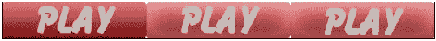
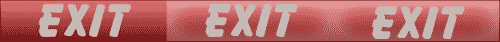
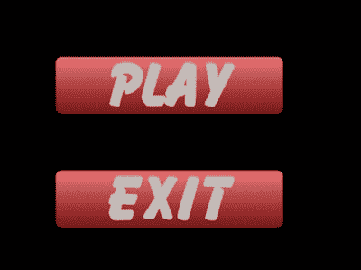
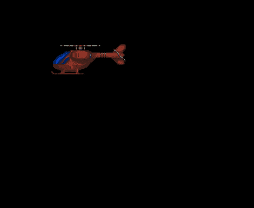
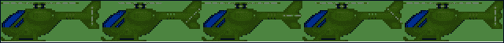
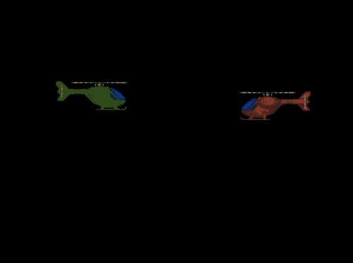

# 第五章：处理游戏状态

当我们第一次启动游戏时，我们期望看到显示出版商和开发者的任何品牌信息的启动画面，然后是加载画面，因为游戏正在进行初始设置。之后，我们通常会看到一个菜单屏幕；在这里，我们可以更改设置并开始游戏。开始游戏会带我们进入另一个加载画面，可能还会跟随一个剪辑场景，最终，我们就在游戏中了。当我们处于游戏状态时，我们可以暂停我们的游戏（允许我们更改任何设置），退出游戏，重新开始关卡，等等。如果我们未能通过关卡，我们会看到动画或游戏结束画面，具体取决于游戏的设置。所有这些不同的游戏部分都被称为*游戏状态*。我们使这些状态之间的转换尽可能容易是非常重要的。

在本章中，我们将涵盖：

+   处理状态的两个不同方法，从一个非常简单的实现开始，逐步构建我们的框架实现

+   实现有限状态机（**FSM**）

+   将状态添加到整体框架中

# 切换状态的一种简单方法

处理状态的最简单方法之一是在游戏的初始化阶段加载我们想要的所有东西，但只绘制和更新每个状态特定的对象。让我们看看这如何工作。首先，我们可以定义我们将要使用的一组状态：

```cpp
enum game_states
{
  MENU = 0,
  PLAY = 1,
  GAMEOVER = 2
};
```

然后，我们可以使用`Game::init`函数来创建对象：

```cpp
// create menu objects
m_pMenuObj1 = new MenuObject();
m_pMenuObj1 = new MenuObject();

// create play objects
m_pPlayer = new Player();
m_pEnemy = new Enemy();

// create game over objects…
```

然后，设置我们的初始状态：

```cpp
m_currentGameState = MENU;
```

接下来，我们可以将我们的`update`函数修改为仅在特定状态下使用我们想要的东西：

```cpp
void Game::update()
{
  switch(m_currentGameState)
  {
    case MENU:
      m_menuObj1->update();
      m_menuObj2->update();
      break;

    case PLAY:
      m_pPlayer->update();
      m_pEnemy->update();

    case GAMEOVER:
      // do game over stuff…
  }
}
```

`render`函数会做类似的事情。当然，这些函数仍然可以循环遍历数组并使用多态，就像我们最初所做的那样，但基于状态。改变状态就像改变`m_currentGameState`变量的值一样简单。

如果你发现这个方法有问题，那么你开始以面向对象的方式思考是非常令人鼓舞的。这种更新状态的方式维护起来会相当困难，出错的可能性也相当大。有太多需要更新和更改的区域，这使得它成为任何比简单街机游戏更大的游戏的可行解决方案。

# 实现有限状态机

我们真正需要的是在`game`类之外定义我们的状态，并且让状态本身负责加载、渲染和更新所需的内容。为此，我们可以创建所谓的有限状态机（FSM）。我们将使用的 FSM 定义是一个可以存在于有限数量的状态中的机器，一次只能存在于一个状态（称为当前状态），并且可以从一个状态转换到另一个状态（称为转换）。

## 游戏状态的基础类

让我们通过创建所有状态的基类来开始我们的实现；创建一个名为`GameState.h`的头文件：

```cpp
#include<string>
class GameState
{
public:
  virtual void update() = 0;
  virtual void render() = 0;

  virtual bool onEnter() = 0;
  virtual bool onExit() = 0;

  virtual std::string getStateID() const = 0;
};
```

就像我们的 `GameObject` 类一样，这是一个抽象基类；我们实际上并没有将其中的任何功能放入其中，我们只是希望所有派生类都遵循这个蓝图。`update` 和 `render` 函数是自解释的，因为它们将像我们在 `Game` 类中创建的函数一样工作。我们可以将 `onEnter` 和 `onExit` 函数视为类似于其他 `load` 和 `clean` 函数；一旦创建状态，我们就调用 `onEnter` 函数，一旦移除状态，就调用 `onExit`。最后一个函数是状态 ID 的获取器；每个状态都需要定义这个函数并返回它自己的 `staticconst` ID。ID 用于确保状态不会重复。不应该需要更改到相同的状态，因此我们使用状态 ID 来检查这一点。

这就是我们的 `GameState` 基类的全部内容；我们现在可以创建一些从这个类派生的测试状态。我们将从一个名为 `MenuState` 的状态开始。继续在我们的项目中创建 `MenuState.h` 和 `MenuState.cpp`，打开 `MenuState.h` 并开始编码：

```cpp
#include"GameState.h"

class MenuState : public GameState
{
public:

  virtual void update();
  virtual void render();

  virtual bool onEnter();
  virtual bool onExit();

  virtual std::string getStateID() const { return s_menuID; }

private:

  static const std::string s_menuID;
};
```

我们现在可以在我们的 `MenuState.cpp` 文件中定义这些方法。现在我们只是将在控制台窗口中显示一些文本来测试我们的实现；我们将给这个状态一个 `"MENU"` 的 ID：

```cpp
#include "MenuState.h"

const std::string MenuState::s_menuID = "MENU";

void MenuState::update()
{
  // nothing for now
}

void MenuState::render()
{
  // nothing for now
}

bool MenuState::onEnter()
{
  std::cout << "entering MenuState\n";
  return true;
}

bool MenuState::onExit()
{
  std::cout << "exiting MenuState\n";
  return true;
}
```

我们现在将创建另一个状态，称为 `PlayState`，在我们的项目中创建 `PlayState.h` 和 `PlayState.cpp`，并在头文件中声明我们的方法：

```cpp
#include "GameState.h"

class PlayState : public GameState
{
public:

  virtual void update();
  virtual void render();

  virtual bool onEnter();
  virtual bool onExit();

  virtual std::string getStateID() const { return s_playID; }

private:

  static const std::string s_playID;
};
```

这个头文件与 `MenuState.h` 相同，唯一的区别是 `getStateID` 返回这个类的特定 ID (`"PLAY"`)。让我们定义我们的函数：

```cpp
#include "PlayState.h"

const std::string PlayState::s_playID = "PLAY";

void PlayState::update()
{
  // nothing for now
}

void PlayState::render()
{
  // nothing for now
}

bool PlayState::onEnter()
{
  std::cout << "entering PlayState\n";
  return true;
}

bool PlayState::onExit()
{
  std::cout << "exiting PlayState\n";
  return true;
}
```

我们现在有两个状态准备测试；接下来，我们必须创建我们的有限状态机（FSM）以便我们可以处理它们。

## 实现有限状态机（FSM）

我们的状态机（FSM）将需要以多种方式处理我们的状态，包括：

+   **删除一个状态并添加另一个状态**：我们将使用这种方法来完全改变状态而不留下返回的选项

+   **在不删除前一个状态的情况下添加一个状态**：这种方法对于暂停菜单等很有用

+   **在不添加另一个状态的情况下删除一个状态**：这种方法将用于删除暂停状态或任何其他被推到另一个状态之上的状态

现在我们已经想出了我们希望有限状态机（FSM）具有的行为，让我们开始创建这个类。在我们的项目中创建 `GameStateMachine.h` 和 `GameStateMachine.cpp` 文件。我们将在头文件中声明我们的函数：

```cpp
#include "GameState.h"

class GameStateMachine
{
public:

  void pushState(GameState* pState);
  void changeState(GameState* pState);
  void popState();
};
```

我们已经声明了所需的三个函数。`pushState` 函数将在不删除前一个状态的情况下添加一个状态，`changeState` 函数将在添加另一个状态之前删除前一个状态，最后，`popState` 函数将删除当前正在使用的任何状态而不添加另一个。我们需要一个地方来存储这些状态；我们将使用一个向量：

```cpp
private:

std::vector<GameState*> m_gameStates;
```

在 `GameStateMachine.cpp` 文件中，我们可以定义这些函数，然后逐步进行：

```cpp
void GameStateMachine::pushState(GameState *pState)
{
  m_gameStates.push_back(pState);
  m_gameStates.back()->onEnter();
}
```

这是一个非常简单的函数；我们只是将传入的`pState`参数推入`m_gameStates`数组，然后调用它的`onEnter`函数：

```cpp
void GameStateMachine::popState()
{
  if(!m_gameStates.empty())
  {
    if(m_gameStates.back()->onExit())
    {
      delete m_gamestates.back();
      m_gameStates.pop_back();
    }
  }
}
```

另一个简单的函数是`popState`。我们首先检查是否真的有可用的状态可以移除，如果有，我们调用当前状态的`onExit`函数然后移除它：

```cpp
void GameStateMachine::changeState(GameState *pState)
{
  if(!m_gameStates.empty())
  {
    if(m_gameStates.back()->getStateID() == pState->getStateID())
    {
      return; // do nothing
    }

    if(m_gameStates.back()->onExit())
    {
      delete m_gamestates.back();
      m_gameStates.pop_back();
    }
  }

  // push back our new state
  m_gameStates.push_back(pState);

  // initialise it
  m_gameStates.back()->onEnter();
}
```

我们的第三个功能稍微复杂一些。首先，我们必须检查数组中是否已经存在任何状态，如果存在，我们检查它们的州 ID 是否与当前的一个相同，如果是，那么我们就不做任何事情。如果州 ID 不匹配，那么我们就移除当前状态，添加我们的新`pState`，并调用它的`onEnter`函数。接下来，我们将添加新的`GameStateMachine`作为`Game`类的一个成员：

```cpp
GameStateMachine* m_pGameStateMachine;
```

然后，我们可以使用`Game::init`函数来创建我们的状态机并添加我们的第一个状态：

```cpp
m_pGameStateMachine = new GameStateMachine();
m_pGameStateMachine->changeState(new MenuState());
```

`Game::handleEvents`函数将允许我们暂时在状态之间移动：

```cpp
void Game::handleEvents()
{
  TheInputHandler::Instance()->update();

  if(TheInputHandler::Instance()->isKeyDown(SDL_SCANCODE_RETURN))
  {
    m_pGameStateMachine->changeState(new PlayState());
  }
}
```

当我们按下*Enter*键时，状态将改变。测试项目后，你应该在改变状态后得到以下输出：

```cpp
entering MenuState
exiting MenuState
entering PlayState
```

现在我们有了 FSM 的初步形态，接下来可以在`GameStateMachine`头文件中添加`update`和`render`函数：

```cpp
void update();
void render();
```

我们可以在`GameStateMachine.cpp`文件中定义它们：

```cpp
void GameStateMachine::update()
{
  if(!m_gameStates.empty())
  {
    m_gameStates.back()->update();
  }
}

void GameStateMachine::render()
{
  if(!m_gameStates.empty())
  {
    m_gameStates.back()->render();
  }
}
```

这些函数只是检查是否有任何状态，如果有，它们就会更新并渲染当前状态。你会注意到我们使用`back()`来获取当前状态；这是因为我们设计我们的 FSM 总是使用数组后面的状态。我们在添加新状态时使用`push_back()`，这样它们就会被推到数组的后面并立即使用。我们的`Game`类现在将使用 FSM 函数来代替它自己的`update`和`render`函数：

```cpp
void Game::render()
{
  SDL_RenderClear(m_pRenderer); 

  m_pGameStateMachine->render();

  SDL_RenderPresent(m_pRenderer); 
}

void Game::update()
{
  m_pGameStateMachine->update();
}
```

我们的状态机现在已经到位。

# 实现菜单状态

现在我们将进入创建一个带有视觉和鼠标处理的简单菜单状态。我们将使用两个新的截图来显示我们的按钮，这些截图可以在源代码下载中找到：



以下截图显示了退出功能：



这些实际上是包含我们按钮三个状态的原生精灵表。让我们为这些按钮创建一个新的类，我们将称之为`MenuButton`。现在创建`MenuButton.h`和`MenuButton.cpp`文件。我们将从头文件开始：

```cpp
class MenuButton : public SDLGameObject
{
public:

  MenuButton(const LoaderParams* pParams);

  virtual void draw();
  virtual void update();
  virtual void clean();
};
```

到现在为止，这应该看起来非常熟悉，创建新类型应该感觉很简单。我们还将定义我们的按钮状态为一个枚举类型，这样我们的代码就更容易阅读；在头文件中的`private`部分放入以下内容：

```cpp
enum button_state
{
  MOUSE_OUT = 0,
  MOUSE_OVER = 1,
  CLICKED = 2
};
```

打开`MenuButton.cpp`文件，我们可以开始充实我们的`MenuButton`类：

```cpp
MenuButton::MenuButton(const LoaderParams* pParams) : SDLGameObject(pParams)
{
  m_currentFrame = MOUSE_OUT; // start at frame 0
}

void MenuButton::draw()
{
  SDLGameObject::draw(); // use the base class drawing
}

void MenuButton::update()
{
  Vector2D* pMousePos = TheInputHandler::Instance()
  ->getMousePosition();

  if(pMousePos->getX() < (m_position.getX() + m_width) 
  && pMousePos->getX() > m_position.getX()
  && pMousePos->getY() < (m_position.getY() + m_height) 
  && pMousePos->getY() > m_position.getY())
  {
    m_currentFrame = MOUSE_OVER;

    if(TheInputHandler::Instance()->getMouseButtonState(LEFT))
    {
      m_currentFrame = CLICKED;
    }
  }
  else
  {
    m_currentFrame = MOUSE_OUT;
  }
}

void MenuButton::clean()
{
  SDLGameObject::clean();
}
```

这个类中真正新的东西只有`update`函数。接下来，我们将逐步介绍这个函数的每个步骤：

+   首先，我们获取鼠标指针的坐标并将它们存储在一个指向`Vector2D`对象的指针中：

    ```cpp
    Vector2D* pMousePos = TheInputHandler::Instance()->getMousePosition();
    ```

+   现在，检查鼠标是否在按钮上。我们首先检查鼠标位置是否小于按钮右侧的位置（*x 位置 + 宽度*）。然后检查鼠标位置是否大于按钮左侧的位置（*x 位置*）。y 位置检查与*y 位置 + 高度*和*y 位置*对于底部和顶部分别相同：

    ```cpp
    if(pMousePos->getX() < (m_position.getX() + m_width) 
    && pMousePos->getX() > m_position.getX()
    && pMousePos->getY() < (m_position.getY() + m_height) 
    && pMousePos->getY() > m_position.getY())
    ```

+   如果前一个检查为真，我们知道鼠标悬停在按钮上；我们将它的框架设置为`MOUSE_OVER (1)`：

    ```cpp
    m_currentFrame = MOUSE_OVER;
    ```

+   我们可以检查鼠标是否被点击；如果是，则将当前框架设置为`CLICKED(2)`：

    ```cpp
    if(TheInputHandler::Instance()->getMouseButtonState(LEFT))
    {
      m_currentFrame = CLICKED;
    }
    ```

+   如果检查不为真，那么我们知道鼠标在按钮外，我们将框架设置为`MOUSE_OUT (0)`：

    ```cpp
    else
    {
      m_currentFrame = MOUSE_OUT;
    }
    ```

我们现在可以测试我们的可重用按钮类。打开我们之前创建的`MenuState.hand`，我们将为其实际实现。首先，我们需要一个`GameObject*`的向量来存储我们的菜单项：

```cpp
std::vector<GameObject*> m_gameObjects;
```

在`MenuState.cpp`文件中，我们现在可以开始处理我们的菜单项：

```cpp
void MenuState::update()
{
  for(int i = 0; i < m_gameObjects.size(); i++)
  {
    m_gameObjects[i]->update();
  }
}
void MenuState::render()
{
  for(int i = 0; i < m_gameObjects.size(); i++)
  {
    m_gameObjects[i]->draw();
  }
}
```

`onExit`和`onEnter`函数可以定义如下：

```cpp
bool MenuState::onEnter()
{
  if(!TheTextureManager::Instance()->load("assets/button.png", 
  "playbutton", TheGame::Instance()->getRenderer()))
  {
    return false;
  }

  if(!TheTextureManager::Instance()->load("assets/exit.png", 
  "exitbutton", TheGame::Instance()->getRenderer()))
  {
    return false;
  }

  GameObject* button1 = new MenuButton(new LoaderParams(100, 100, 
  400, 100, "playbutton"));
  GameObject* button2 = new MenuButton(new LoaderParams(100, 300, 
  400, 100, "exitbutton"));

  m_gameObjects.push_back(button1);
  m_gameObjects.push_back(button2);

  std::cout << "entering MenuState\n";
  return true;
}

bool MenuState::onExit()
{
  for(int i = 0; i < m_gameObjects.size(); i++)
  {
    m_gameObjects[i]->clean();
  }
  m_gameObjects.clear();
  TheTextureManager::Instance()
  ->clearFromTextureMap("playbutton");
  TheTextureManager::Instance()
  ->clearFromTextureMap("exitbutton");

  std::cout << "exiting MenuState\n";
  return true;
}
```

我们使用`TextureManager`来加载我们的新图像，然后将这些纹理分配给两个按钮。`TextureManager`类还有一个名为`clearFromTextureMap`的新函数，它接受我们想要删除的纹理的 ID；它定义如下：

```cpp
void TextureManager::clearFromTextureMap(std::string id)
{
  m_textureMap.erase(id);
}
```

此函数使我们能够仅从当前状态中清除纹理，而不是整个纹理图。当我们推送状态然后弹出它们时，这是非常重要的，因为我们不希望弹出的状态清除原始状态的纹理。

其他一切都是本质上与我们在`Game`类中处理对象的方式相同。运行项目，我们将有对鼠标事件做出反应的按钮。窗口将看起来像以下截图（请继续测试它）：



## 函数指针和回调函数

我们的按钮对悬停和点击做出反应，但实际上还没有做任何事情。我们真正想要实现的是创建`MenuButton`并传递我们想要它在点击时调用的函数的能力；我们可以通过使用函数指针来实现这一点。函数指针确实如其所言：它们指向一个函数。我们可以暂时使用经典的 C 风格函数指针，因为我们只将使用不接受任何参数且总是返回类型为`void`的函数（因此，我们目前不需要使它们泛型）。

函数指针的语法如下：

```cpp
returnType (*functionName)(parameters);
```

我们在`MenuButton.h`中将我们的函数指针声明为私有成员，如下所示：

```cpp
void (*m_callback)();
```

我们还添加了一个新的成员变量来更好地处理点击：

```cpp
bool m_bReleased;
```

现在我们可以修改构造函数，以便我们可以传递我们的函数：

```cpp
MenuButton(const LoaderParams* pParams, void (*callback)());
```

在我们的`MenuButton.cpp`文件中，我们现在可以修改构造函数并使用初始化列表初始化我们的指针：

```cpp
MenuButton::MenuButton(const LoaderParams* pParams, void (*callback)() ) : SDLGameObject(pParams), m_callback(callback)
```

`update`函数现在可以调用此函数：

```cpp
void MenuButton::update()
{
  Vector2D* pMousePos = TheInputHandler::Instance()
  ->getMousePosition();

  if(pMousePos->getX() < (m_position.getX() + m_width) 
  && pMousePos->getX() > m_position.getX()
  && pMousePos->getY() < (m_position.getY() + m_height) 
  && pMousePos->getY() > m_position.getY())
  {
    if(TheInputHandler::Instance()->getMouseButtonState(LEFT) 
    && m_bReleased)
    {
      m_currentFrame = CLICKED;

      m_callback(); // call our callback function

      m_bReleased = false;
    }
    else if(!TheInputHandler::Instance()
    ->getMouseButtonState(LEFT))
    {
      m_bReleased = true;
      m_currentFrame = MOUSE_OVER;
    }
  }
  else
  {
    m_currentFrame = MOUSE_OUT;
  }
}
```

注意，这个`update`函数现在使用`m_bReleased`值来确保我们在再次进行回调之前释放鼠标按钮；这是我们想要的点击行为。

在我们的`MenuState.h`对象中，我们可以声明一些函数，这些函数将传递到我们的`MenuButton`对象的构造函数中：

```cpp
private:
// call back functions for menu items
static void s_menuToPlay();
static void s_exitFromMenu();
```

我们将这些函数声明为静态的；这是因为我们的回调功能只支持静态函数。将常规成员函数作为函数指针处理要复杂一些，因此我们将避免这样做，坚持使用静态函数。我们可以在`MenuState.cpp`文件中定义这些函数：

```cpp
void MenuState::s_menuToPlay()
{
  std::cout << "Play button clicked\n";
}

void MenuState::s_exitFromMenu()
{
  std::cout << "Exit button clicked\n";
}
```

我们可以将这些函数传递到按钮的构造函数中：

```cpp
GameObject* button1 = new MenuButton(new LoaderParams(100, 100, 400, 100, "playbutton"), s_menuToPlay);
GameObject* button2 = new MenuButton(new LoaderParams(100, 300, 400, 100, "exitbutton"), s_exitFromMenu);
```

测试我们的项目，你将看到我们的函数正在打印到控制台。我们现在正在传递我们想要在按钮点击时调用的函数；这对我们的按钮功能来说非常好。让我们用一些实际的功能测试退出按钮：

```cpp
void MenuState::s_exitFromMenu()
{
  TheGame::Instance()->quit();
}
```

现在点击我们的退出按钮将退出游戏。下一步是允许`s_menuToPlay`函数移动到`PlayState`。我们首先需要在`Game.h`文件中添加一个获取器，以便我们可以访问状态机：

```cpp
GameStateMachine* getStateMachine(){ return m_pGameStateMachine; }
```

我们现在可以使用这个来在`MenuState`中改变状态：

```cpp
void MenuState::s_menuToPlay()
{
  TheGame::Instance()->getStateMachine()->changeState(new 
  PlayState());
}
```

好吧，去测试一下；`PlayState`目前还没有做任何事情，但我们的控制台输出应该显示状态之间的移动。

## 实现临时播放状态

我们已经创建了`MenuState`；接下来，我们需要创建`PlayState`以便我们可以直观地看到状态的变化。对于`PlayState`，我们将创建一个使用我们的`helicopter.png`图像并跟随鼠标移动的玩家对象。我们将从`Player.cpp`文件开始，并添加代码使`Player`对象跟随鼠标位置：

```cpp
void Player::handleInput()
{
  Vector2D* target = TheInputHandler::Instance()
  ->getMousePosition();

  m_velocity = *target - m_position;

  m_velocity /= 50;
}
```

首先，我们获取当前的鼠标位置；然后我们可以通过从鼠标位置减去当前位置来获取一个指向鼠标位置的向量。然后我们将速度除以一个标量以稍微减慢速度，并允许我们看到我们的直升机追上鼠标而不是粘附在它上面。现在我们的`PlayState.h`文件将需要它自己的`GameObject*`向量：

```cpp
class GameObject;

class PlayState : public GameState
{
public:

  virtual void update();
  virtual void render();

  virtual bool onEnter();
  virtual bool onExit();

  virtual std::string getStateID() const { return s_playID; }

private:

  static const std::string s_playID;

  std::vector<GameObject*> m_gameObjects;
};
```

最后，我们必须更新`PlayState.cpp`实现文件以使用我们的`Player`对象：

```cpp
const std::string PlayState::s_playID = "PLAY";

void PlayState::update()
{
  for(int i = 0; i < m_gameObjects.size(); i++)
  {
    m_gameObjects[i]->update();
  }
}

void PlayState::render()
{
  for(int i = 0; i < m_gameObjects.size(); i++)
  {
    m_gameObjects[i]->draw();
  }
}

bool PlayState::onEnter()
{
  if(!TheTextureManager::Instance()->load("assets/helicopter.png", 
  "helicopter", TheGame::Instance()->getRenderer()))
  {
    return false;
  }

  GameObject* player = new Player(new LoaderParams(100, 100, 128, 
  55, "helicopter");

  m_gameObjects.push_back(player);

  std::cout << "entering PlayState\n";
  return true;
}

bool PlayState::onExit()
{
  for(int i = 0; i < m_gameObjects.size(); i++)
  {
    m_gameObjects[i]->clean();
  }
  m_gameObjects.clear();
  TheTextureManager::Instance()
  ->clearFromTextureMap("helicopter");

  std::cout << "exiting PlayState\n";
  return true;
}
```

这个文件与`MenuState.cpp`文件非常相似，但这次我们使用了一个`Player`对象而不是两个`MenuButton`对象。我们对`SDLGameObject.cpp`文件进行了一次调整，这将使`PlayState`看起来更加出色；我们将根据对象的速率翻转图像文件：

```cpp
void SDLGameObject::draw()
{
  if(m_velocity.getX() > 0)
  {
    TextureManager::Instance()->drawFrame(m_textureID, 
    (Uint32)m_position.getX(), (Uint32)m_position.getY(),
    m_width, m_height, m_currentRow, m_currentFrame, 
    TheGame::Instance()->getRenderer(),SDL_FLIP_HORIZONTAL);
  }
  else
  {
    TextureManager::Instance()->drawFrame(m_textureID, 
    (Uint32)m_position.getX(), (Uint32)m_position.getY(),
    m_width, m_height, m_currentRow, m_currentFrame, 
    TheGame::Instance()->getRenderer());
  }
}
```

我们检查对象的速率是否大于`0`（向右移动）并相应地翻转图像。运行我们的游戏，你现在将能够在这两个状态`MenuState`和`PlayState`之间移动，每个状态都有其自己的功能和对象。以下截图显示了我们的项目到目前为止的情况：



## 暂停游戏

对于我们的游戏来说，另一个非常重要的状态是暂停状态。一旦暂停，游戏可以有多种选项。我们的 `PauseState` 类将与 `MenuState` 类非常相似，但具有不同的按钮视觉和回调。以下是我们的两个新截图（同样可在源代码下载中找到）：


以下截图显示了恢复功能：


首先，让我们在项目中创建我们的 `PauseState.h` 文件：

```cpp
class GameObject;

class PauseState : public GameState
{
public:

  virtual void update();
  virtual void render();

  virtual bool onEnter();
  virtual bool onExit();

  virtual std::string getStateID() const { return s_pauseID; }

private:

  static void s_pauseToMain();
  static void s_resumePlay();

  static const std::string s_pauseID;

  std::vector<GameObject*> m_gameObjects;
};
```

接下来，创建我们的 `PauseState.cpp` 文件：

```cpp
const std::string PauseState::s_pauseID = "PAUSE";

void PauseState::s_pauseToMain()
{
  TheGame::Instance()->getStateMachine()->changeState(new 
  MenuState());
}

void PauseState::s_resumePlay()
{
  TheGame::Instance()->getStateMachine()->popState();
}

void PauseState::update()
{
  for(int i = 0; i < m_gameObjects.size(); i++)
  {
    m_gameObjects[i]->update();
  }
}

void PauseState::render()
{
  for(int i = 0; i < m_gameObjects.size(); i++)
  {
    m_gameObjects[i]->draw();
  }
}

bool PauseState::onEnter()
{
  if(!TheTextureManager::Instance()->load("assets/resume.png", 
  "resumebutton", TheGame::Instance()->getRenderer()))
  {
    return false;
  }

  if(!TheTextureManager::Instance()->load("assets/main.png", 
  "mainbutton", TheGame::Instance()->getRenderer()))
  {
    return false;
  }

  GameObject* button1 = new MenuButton(new LoaderParams(200, 100, 
  200, 80, "mainbutton"), s_pauseToMain);
  GameObject* button2 = new MenuButton(new LoaderParams(200, 300, 
  200, 80, "resumebutton"), s_resumePlay);

  m_gameObjects.push_back(button1);
  m_gameObjects.push_back(button2);

  std::cout << "entering PauseState\n";
  return true;
}

bool PauseState::onExit()
{
  for(int i = 0; i < m_gameObjects.size(); i++)
  {
    m_gameObjects[i]->clean();
  }
  m_gameObjects.clear();
  TheTextureManager::Instance()
  ->clearFromTextureMap("resumebutton");
  TheTextureManager::Instance()
  ->clearFromTextureMap("mainbutton");
  // reset the mouse button states to false
  TheInputHandler::Instance()->reset();

  std::cout << "exiting PauseState\n";
  return true;
}
```

在我们的 `PlayState.cpp` 文件中，我们现在可以使用我们新的 `PauseState` 类：

```cpp
void PlayState::update()
{
  if(TheInputHandler::Instance()->isKeyDown(SDL_SCANCODE_ESCAPE))
  {
    TheGame::Instance()->getStateMachine()->pushState(new 
    PauseState());
  }

  for(int i = 0; i < m_gameObjects.size(); i++)
  {
    m_gameObjects[i]->update();
  }
}
```

此函数监听 *Esc* 键被按下，一旦按下，它就会将一个新的 `PauseState` 类推入 FSM 的状态数组。记住，`pushState` 不会移除旧状态；它只是停止使用它并使用新状态。一旦我们完成推入的状态，我们就从状态数组中移除它，游戏继续使用之前的状态。我们使用恢复按钮的回调来移除暂停状态：

```cpp
void PauseState::s_resumePlay()
{
  TheGame::Instance()->getStateMachine()->popState();
}
```

主菜单按钮将带我们回到主菜单，并完全移除任何其他状态：

```cpp
void PauseState::s_pauseToMain()
{
  TheGame::Instance()->getStateMachine()->changeState(new 
  MenuState());
}
```

## 创建游戏结束状态

我们将创建一个最终的状态，`GameOverState`。要进入此状态，我们将在 `PlayState` 类中使用碰撞检测和新的 `Enemy` 对象。我们将检查 `Player` 对象是否击中了 `Enemy` 对象，如果是，我们将切换到我们的 `GameOverState` 类。我们的敌人对象将使用一个新的图像 `helicopter2.png`：



我们将使 `Enemy` 对象的直升机在屏幕上下移动，以保持游戏的趣味性。在我们的 `Enemy.cpp` 文件中，我们将添加此功能：

```cpp
Enemy::Enemy(const LoaderParams* pParams) : SDLGameObject(pParams)
{
  m_velocity.setY(2);
  m_velocity.setX(0.001);
}

void Enemy::draw()
{
  SDLGameObject::draw();
}

void Enemy::update()
{
  m_currentFrame = int(((SDL_GetTicks() / 100) % m_numFrames));

  if(m_position.getY() < 0)
  {
    m_velocity.setY(2);
  }
  else if(m_position.getY() > 400)
  {
    m_velocity.setY(-2);
  }

  SDLGameObject::update();
}
```

我们现在可以向我们的 `PlayState` 类添加一个 `Enemy` 对象：

```cpp
bool PlayState::onEnter()
{
  if(!TheTextureManager::Instance()->load("assets/helicopter.png", 
  "helicopter", TheGame::Instance()->getRenderer()))
  {
    return false;
  }

  if(!TheTextureManager::Instance()
  ->load("assets/helicopter2.png", "helicopter2", 
  TheGame::Instance()->getRenderer()))
  {
    return false;
  }

  GameObject* player = new Player(new LoaderParams(500, 100, 128, 
  55, "helicopter"));
  GameObject* enemy = new Enemy(new LoaderParams(100, 100, 128, 
  55, "helicopter2"));

  m_gameObjects.push_back(player);
  m_gameObjects.push_back(enemy);

  std::cout << "entering PlayState\n";
  return true;
}
```

运行游戏将允许我们看到我们的两架直升机：



在我们介绍碰撞检测之前，我们将创建我们的 `GameOverState` 类。我们将为此状态使用两个新的图像，一个用于新的 `MenuButton`，另一个用于一种新类型，我们将称之为 `AnimatedGraphic`：


以下截图显示了游戏结束功能：


`AnimatedGraphic` 与其他类型非常相似，所以这里不会过多介绍；然而，重要的是构造函数中添加的值，它控制动画的速度，并设置私有成员变量 `m_animSpeed`：

```cpp
AnimatedGraphic::AnimatedGraphic(const LoaderParams* pParams, int animSpeed) : SDLGameObject(pParams), m_animSpeed(animSpeed)
{

}
```

`update` 函数将使用此值来设置动画的速度：

```cpp
void AnimatedGraphic::update()
{
  m_currentFrame = int(((SDL_GetTicks() / (1000 / m_animSpeed)) % 
  m_numFrames));
}
```

现在我们已经有了 `AnimatedGraphic` 类，我们可以实现我们的 `GameOverState` 类。在我们的项目中创建 `GameOverState.h` 和 `GameOverState.cpp`；我们将创建的头文件应该看起来非常熟悉，如下面的代码所示：

```cpp
class GameObject;

class GameOverState : public GameState
{
public:

  virtual void update();
  virtual void render();

  virtual bool onEnter();
  virtual bool onExit();

  virtual std::string getStateID() const {return s_gameOverID;}

private:

  static void s_gameOverToMain();
  static void s_restartPlay();

  static const std::string s_gameOverID;

  std::vector<GameObject*> m_gameObjects;
};
```

我们的实现文件也与已覆盖的其他文件非常相似，所以我又会只介绍不同的部分。首先，我们定义我们的静态变量和函数：

```cpp
const std::string GameOverState::s_gameOverID = "GAMEOVER";

void GameOverState::s_gameOverToMain()
{
  TheGame::Instance()->getStateMachine()->changeState(new 
  MenuState());
}

void GameOverState::s_restartPlay()
{
  TheGame::Instance()->getStateMachine()->changeState(new 
  PlayState());
}
```

`onEnter`函数将创建三个新对象及其纹理：

```cpp
bool GameOverState::onEnter()
{
  if(!TheTextureManager::Instance()->load("assets/gameover.png", 
  "gameovertext", TheGame::Instance()->getRenderer()))
  {
    return false;
  }

  if(!TheTextureManager::Instance()->load("assets/main.png", 
  "mainbutton", TheGame::Instance()->getRenderer()))
  {
    return false;
  }

  if(!TheTextureManager::Instance()->load("assets/restart.png", 
  "restartbutton", TheGame::Instance()->getRenderer()))
  {
    return false;
  }

  GameObject* gameOverText = new AnimatedGraphic(new 
  LoaderParams(200, 100, 190, 30, "gameovertext", 2), 2);
  GameObject* button1 = new MenuButton(new LoaderParams(200, 200, 
  200, 80, "mainbutton"), s_gameOverToMain);
  GameObject* button2 = new MenuButton(new LoaderParams(200, 300, 
  200, 80, "restartbutton"), s_restartPlay);

  m_gameObjects.push_back(gameOverText);
  m_gameObjects.push_back(button1);
  m_gameObjects.push_back(button2);

  std::cout << "entering PauseState\n";
  return true;
}
```

对于我们的`GameOverState`类，基本上就是这样，但我们现在必须创建一个条件来创建这个状态。移动到我们的`PlayState.h`文件，我们将创建一个新函数，允许我们检查碰撞：

```cpp
bool checkCollision(SDLGameObject* p1, SDLGameObject* p2);
```

我们将在`PlayState.cpp`中定义这个函数：

```cpp
bool PlayState::checkCollision(SDLGameObject* p1, SDLGameObject* 
p2)
{
  int leftA, leftB;
  int rightA, rightB;
  int topA, topB;
  int bottomA, bottomB;

  leftA = p1->getPosition().getX();
  rightA = p1->getPosition().getX() + p1->getWidth();
  topA = p1->getPosition().getY();
  bottomA = p1->getPosition().getY() + p1->getHeight();

  //Calculate the sides of rect B
  leftB = p2->getPosition().getX();
  rightB = p2->getPosition().getX() + p2->getWidth();
  topB = p2->getPosition().getY();
  bottomB = p2->getPosition().getY() + p2->getHeight();

  //If any of the sides from A are outside of B
  if( bottomA <= topB ){return false;} 
  if( topA >= bottomB ){return false; }
  if( rightA <= leftB ){return false; }
  if( leftA >= rightB ){return false;}

  return true;
}
```

这个函数检查两个`SDLGameObject`类型之间的碰撞。为了让这个函数工作，我们需要向我们的`SDLGameObject`类添加三个新函数：

```cpp
Vector2D& getPosition() { return m_position; }
int getWidth() { return m_width; }
int getHeight() { return m_height; }
```

下一章将介绍这个函数是如何工作的，但到目前为止，知道它确实存在就足够了。我们的`PlayState`类现在将在其`update`函数中使用这种碰撞检测：

```cpp
void PlayState::update()
{
  if(TheInputHandler::Instance()->isKeyDown(SDL_SCANCODE_ESCAPE))
  {
    TheGame::Instance()->getStateMachine()->pushState(new 
    PauseState());
  }

  for(int i = 0; i < m_gameObjects.size(); i++)
  {
    m_gameObjects[i]->update();
  }

  if(checkCollision(dynamic_cast<SDLGameObject*>
  (m_gameObjects[0]), dynamic_cast<SDLGameObject*>
  (m_gameObjects[1])))
  {
    TheGame::Instance()->getStateMachine()->pushState(new 
    GameOverState());
  }
}
```

我们必须使用一个`dynamic_cast`对象将我们的`GameObject*`类转换为`SDLGameObject*`类。如果`checkCollision`返回`true`，则添加`GameOverState`类。以下截图显示了`GameOver`状态：


# 摘要

本章留给我们的东西比之前章节更像一个游戏。我们为菜单、暂停、播放和游戏结束创建了状态，每个状态都有其自己的功能，并且使用 FSM 进行处理。现在`Game`类使用 FSM 来渲染和更新游戏对象，它不再直接处理对象，因为每个单独的状态都处理其自己的对象。我们还使用函数指针和静态函数为我们的按钮创建了简单的回调函数。
