# 第七章。创建和显示瓦片地图

大多数你过去玩过的二维游戏都使用了**瓦片地图**。这是一种极其高效且快速的方式来开发复杂的二维关卡或场景。即使一个游戏有更复杂的图形内容，它也可能会以某种方式使用瓦片。在本章中，我们将使用**tiled 地图编辑器**，这是一个由 Thorbjørn Lindeijer 和一个大型开源社区创建的开源和跨平台工具。它可在[`www.mapeditor.org/`](http://www.mapeditor.org/)找到。我们将把这个工具作为我们的关卡编辑器，并使用它来创建地图以及在这些地图中放置我们的对象。

在本章中，我们将涵盖：

+   什么是瓦片地图

+   瓦片图看起来像什么

+   使用 tiled 地图编辑器创建我们的地图

+   从 tiled 地图中解析状态

+   在 SDL 2.0 中加载和显示基于瓦片的地图

# 什么是瓦片地图？

如果你玩过很多二维游戏，那么你对瓦片地图会非常熟悉。我们将从以下屏幕截图中的示例开始：

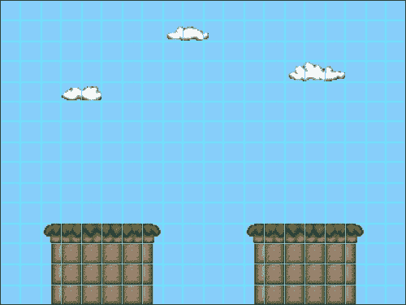

这个 20 x 15 的瓦片地图是使用以下屏幕截图所示的**瓦片集**制作的。

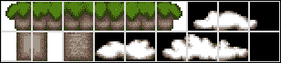

如你所见，这种瓦片系统的一个巨大优势是，你可以从相对较小的图像文件中创建大型地图。瓦片地图本质上是一个多维数组，其中的 ID 告诉我们想要在每个位置绘制瓦片集中的哪个部分。再次查看带有 ID 的图像将有所帮助，如下面的屏幕截图所示：

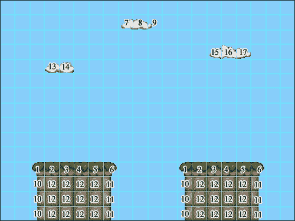

这里是带有其 ID 的瓦片集，如前面的屏幕截图所示。

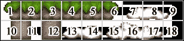

要绘制地图，我们遍历列数和行数，使用其 ID 获取正确的瓦片，并将其绘制到屏幕上。任何 ID 为零的瓦片将不会绘制（一个空白瓦片）。这可以在前面的屏幕截图中看到。

# 熟悉 Tiled 应用程序

Tiled 是一个非常用户友好的应用程序，可以大大加快我们的开发时间。一旦你下载并安装了应用程序，打开它，你将看到如下所示的用户界面：

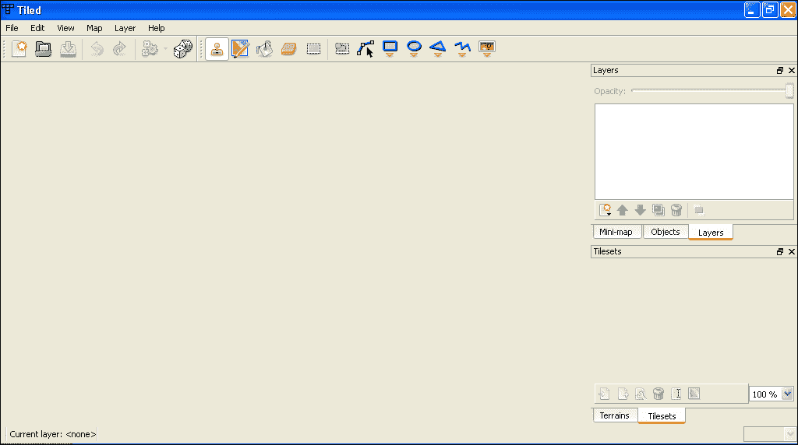

在右侧，我们有**层**和**瓦片集**视图；左侧将包含我们的瓦片地图。首先，我们必须创建一个新的地图，这可以通过导航到**文件** | **新建…**或*Ctrl* + *N*来完成。这将打开新的地图对话框，如下面的屏幕截图所示：

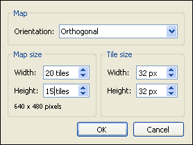

在这里，我们可以定义我们地图的大小和类型。我们只将使用正交瓦片地图（与等距地图相对），因此请创建一个宽度为 20 个瓦片、高度为 15 个瓦片的正交瓦片地图，瓦片宽度和高度都设置为 32 像素。现在我们可以在 UI 的左侧看到我们的瓦片地图（*Ctrl* + *G* 将显示网格）。Tiled 还会自动为我们创建一个名为 **Tile Layer 1** 的图层（在右侧的 **图层** 视图中可见），如下面的截图所示：

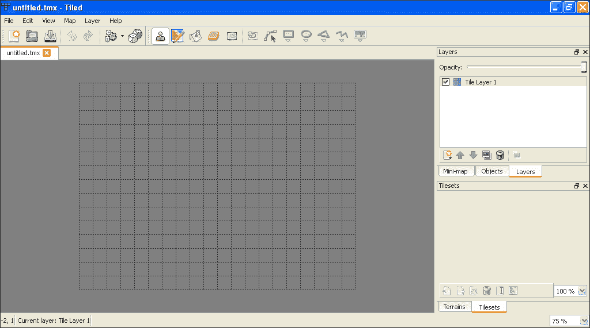

我们不会处理任何地形，因此我们可以通过导航到 **视图** | **地形** 并取消选中来关闭该选项卡。将此地图保存为 `map1.tmx`，与我们的其他游戏资源在同一位置。如果您打开此文件，您会看到它实际上只是一个 XML 文件：

```cpp
<?xml version="1.0" encoding="UTF-8"?>
<map version="1.0" orientation="orthogonal" width="20" height="15" tilewidth="32" tileheight="32">
    <layer name="Tile Layer 1" width="20" height="15">
        <data encoding="base64" compression="zlib">
          eJxjYBgFo2AUjIKhAQAEsAAB
        </data>
    </layer>
</map>
```

这一切看起来都应该非常熟悉。Tiled 有几种不同的压缩算法，可以用来存储我们地图的瓦片 ID。前面的文件使用了 **zlib 压缩算法** 以及 **base64 编码**，正如您所看到的，这给出了非常好的结果：

```cpp
<data encoding="base64" compression="zlib">
  eJxjYBgFo2AUjIKhAQAEsAAB
</data>
```

如果我们将使用 base64 编码且没有压缩的相同地图进行比较，我们可以看到，为了解压和解析 zlib 压缩所需的额外工作绝对物有所值。以下是未压缩的地图：

```cpp
 <data encoding="base64">AAAAAAAAAAAAAAAAAAAAAAAAAAAAAAAAAAAAAAAAAAAAAAAAAAAAAAAAAAAAAAAAAAAAAAAAAAAAAAAAAAAAAAAAAAAAAAAAAAAAAAAAAAAAAAAAAAAAAAAAAAAAAAAAAAAAAAAAAAAAAAAAAAAAAAAAAAAAAAAAAAAAAAAAAAAAAAAAAAAAAAAAAAAAAAAAAAAAAAAAAAAAAAAAAAAAAAAAAAAAAAAAAAAAAAAAAAAAAAAAAAAAAAAAAAAAAAAAAAAAAAAAAAAAAAAAAAAAAAAAAAAAAAAAAAAAAAAAAAAAAAAAAAAAAAAAAAAAAAAAAAAAAAAAAAAAAAAAAAAAAAAAAAAAAAAAAAAAAAAAAAAAAAAAAAAAAAAAAAAAAAAAAAAAAAAAAAAAAAAAAAAAAAAAAAAAAAAAAAAAAAAAAAAAAAAAAAAAAAAAAAAAAAAAAAAAAAAAAAAAAAAAAAAAAAAAAAAAAAAAAAAAAAAAAAAAAAAAAAAAAAAAAAAAAAAAAAAAAAAAAAAAAAAAAAAAAAAAAAAAAAAAAAAAAAAAAAAAAAAAAAAAAAAAAAAAAAAAAAAAAAAAAAAAAAAAAAAAAAAAAAAAAAAAAAAAAAAAAAAAAAAAAAAAAAAAAAAAAAAAAAAAAAAAAAAAAAAAAAAAAAAAAAAAAAAAAAAAAAAAAAAAAAAAAAAAAAAAAAAAAAAAAAAAAAAAAAAAAAAAAAAAAAAAAAAAAAAAAAAAAAAAAAAAAAAAAAAAAAAAAAAAAAAAAAAAAAAAAAAAAAAAAAAAAAAAAAAAAAAAAAAAAAAAAAAAAAAAAAAAAAAAAAAAAAAAAAAAAAAAAAAAAAAAAAAAAAAAAAAAAAAAAAAAAAAAAAAAAAAAAAAAAAAAAAAAAAAAAAAAAAAAAAAAAAAAAAAAAAAAAAAAAAAAAAAAAAAAAAAAAAAAAAAAAAAAAAAAAAAAAAAAAAAAAAAAAAAAAAAAAAAAAAAAAAAAAAAAAAAAAAAAAAAAAAAAAAAAAAAAAAAAAAAAAAAAAAAAAAAAAAAAAAAAAAAAAAAAAAAAAAAAAAAAAAAAAAAAAAAAAAAAAAAAAAAAAAAAAAAAAAAAAAAAAAAAAAAAAAAAAAAAAAAAAAAAAAAAAAAAAAAAAAAAAAAAAAAAAAAAAAAAAAAAAAAAAAAAAAAAAAAAAAAAAAAAAAAAAAAAAAAAAAAAAAAAAAAAAAAAAAAAAAAAAAAAAAAAAAAAAAAAAAAAAAAAAAAAAAAAAAAAAAAAAAAAAAAAAAAAAAAAAAAAAAAAAAAAAAAAAAAAAAAAAAAAAAAAAAAAAAAAAAAAAAAAAAAAAAAAAAAAAAAAAAAAAAAAAAAAAAAAAAAAAAAAAAAAAAAAAAAAAAAAAAAAAAAAAAAAAAAAAAAAAAAAAAAAAAAAAAAAAAAAAAAAAAAAAAAAAAAAAAAAAAAAAAAAAAAAAAAAAAAAAAAAAAAAAAAAAAAAAAAAAAAAAAAAAAAAAAAAAAAAAAAAAAAAAAAAAAAAAAAAAAAAAAAAAAAAAAAAAAAAAAAAAAAAAAAAAAAAAAAAAAAAAAAAAAAAAAAAAAAAAAAAAAAAAAAA
</data>
```

一旦我们开始解析瓦片地图，我们将更深入地介绍这一点，但到目前为止，让我们看看如何添加一个瓦片集。导航到 **地图** | **新建瓦片集…**，它将弹出一个新的 **瓦片集** 对话框，如下面的截图所示：

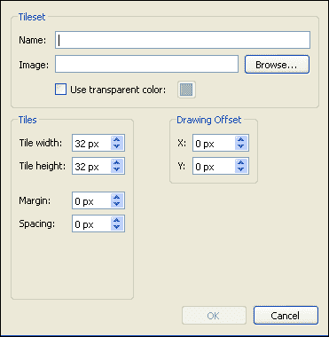

我们将开始的瓦片集是 `blocks1.png`，如下面的截图所示，可在源代码下载中找到。

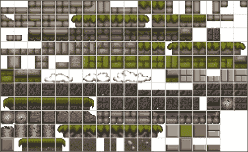

将图像复制到游戏资源位置，然后我们可以在 **新建瓦片集** 对话框中浏览到它。这个瓦片集在外围有 2 像素宽的边框，每个瓦片之间有 2 像素的间距；每个瓦片是 32 x 32 像素。一旦设置了这些值，点击 **确定**，瓦片集将出现在右侧的 **瓦片集** 视图中。现在我们可以开始使用提供的工具构建我们的地图，如下面的截图所示：

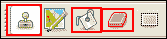

红色突出显示的是我们的基本工具。印章工具将瓦片集中的所选瓦片添加到指定位置，油漆桶工具用瓦片集中的所选瓦片填充一个区域，而橡皮擦工具当然用于擦除。我们可以一次选择一个或多个瓦片，如下面的截图所示：

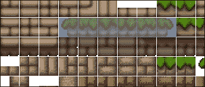

通过构建一个简单的地图来熟悉这些工具。一旦地图保存，我们将看到瓦片集已被添加到地图文件中：

```cpp
<tileset firstgid="1" name="blocks1" tilewidth="32" tileheight="32" spacing="2" margin="2">
  <image source="assets/blocks1.png" width="614" height="376"/>
</tileset>
```

`firstgid`属性是使用此瓦片集的第一个瓦片 ID。如果我们有多个瓦片集，它们将各自带有自己的`firstgid`属性，这样我们就可以知道哪些瓦片 ID 应该与哪个瓦片集关联；我们将在解析我们的地图时更详细地介绍这一点。向我们的地图添加另一个瓦片集`blocks2.png`（也包含在源代码下载中），然后我们将进入在游戏中绘制它的步骤。

# 解析和绘制瓦片地图

现在我们相对熟悉了在 Tiled 应用程序中创建瓦片地图，我们将继续解析它们并在我们的游戏中绘制它们。我们将创建许多新的类，从名为`Level`的类开始，这个类将存储我们的瓦片集，并绘制和更新我们的单独层。让我们继续在我们的项目中创建`Level.h`并添加以下代码：

```cpp
class Level
{
  public:

  Level();
  ~Level() {}

  void update();
  void render();
};
```

我们还将在文件顶部定义一个名为`Tileset`的`struct`：

```cpp
struct Tileset
{
  int firstGridID;
  int tileWidth;
  int tileHeight;
  int spacing;
  int margin;
  int width;
  int height;
  int numColumns;
  std::string name;
};
```

这个`struct`包含了我们需要了解的关于我们的瓦片集的任何信息。现在，我们的`Level`类也将包含一个`Tileset`对象的向量：

```cpp
private:

  std::vector<Tileset> m_tilesets;
```

接下来，我们将创建一个公共的获取函数，该函数返回指向这个`Tileset`向量的指针：

```cpp
std::vector<Tileset>* getTilesets() 
{ 
    return &m_tilesets;  
}
```

当我们到达加载地图时，我们将把这个传递给我们的解析器。

我们接下来要创建的类是一个名为`Layer`的抽象基类。我们所有的层类型都将从这个类派生。创建`Layer.h`并添加以下代码：

```cpp
class Layer
{
  public:

  virtual void render() = 0;
  virtual void update() = 0;

  protected:

  virtual ~Layer() {}
};
```

现在我们有了`Layer`类，我们将在`Level`类中存储一个`Layer*`对象的向量。回到`Level.h`，添加我们的向量：

```cpp
std::vector<Layer*> m_layers;
```

以及一个获取函数：

```cpp
std::vector<Layer*>* getLayers() 
{ 
    return &m_layers; 
}
```

现在我们已经建立了基本的`Level`类；它的目的是存储、绘制和更新我们的层。我们将在`Level.cpp`文件中定义`Level`的函数：

```cpp
void Level::render()
{
  for(int i = 0; i < m _layers.size(); i++)
  {
    m_layers[i]->render();
  }
}
void Level::update()
{
  for(int i = 0; i < m_layers.size(); i++)
  {
    m_layers[i]->update();
  }
}
```

## 创建 TileLayer 类

我们的第一层类型将是一个`TileLayer`。这种类型的层完全由瓦片组成，不包含其他任何内容。我们已经在 Tiled 应用程序中创建了一个类似的层。创建`TileLayer.h`，然后我们可以开始编写这个类：

```cpp
class TileLayer : public Layer
{
  public:

    TileLayer(int tileSize, const std::vector<Tileset> &tilesets);

    virtual void update();
    virtual void render();

    void setTileIDs(const std::vector<std::vector<int>>& data)  
    {  
        m_tileIDs = data;  
    }

    void setTileSize(int tileSize)  
    {  
        m_tileSize = tileSize;  
    }

    Tileset getTilesetByID(int tileID);

  private:

    int m_numColumns;
    int m_numRows;
    int m_tileSize;

    Vector2D m_position;
    Vector2D m_velocity;

    const std::vector<Tileset> &m_tilesets;

    std::vector<std::vector<int>> m_tileIDs;
};
```

这节课并没有什么太复杂的；它为我们的瓦片层存储数据。当开始滚动地图时，会使用`Vector2D`变量。我们现在不会正确地定义这个类的函数，但你需要创建空的定义，并在`TileLayer.cpp`文件中定义向量常量。

## 创建 LevelParser 类

现在我们已经建立了基本的等级和层类，我们可以继续创建解析我们的`.tmx`文件的解析器，并从它们中创建等级。创建`LevelParser.h`：

```cpp
Class LevelParser
{
  public:

    Level* parseLevel(const char* levelFile);

  private:

    void parseTilesets(TiXmlElement* pTilesetRoot,std::vector<Tileset>* pTilesets);

    void parseTileLayer(TiXmlElement* pTileElement,std::vector<Layer*> *pLayers, const std::vector<Tileset>*pTilesets);

    int m_tileSize;
    int m_width;
    int m_height;
};
```

`parseLevel`函数是我们每次想要创建一个等级时都会调用的函数。为了确保必须使用此函数来创建`Level`对象，我们将`Level`类的构造函数设为私有，并使其成为`LevelParser`的友元类：

```cpp
private:

  friend class LevelParser;
  Level();
```

现在`LevelParser`可以访问`Level`的私有构造函数，并可以返回新的实例。我们现在可以定义`parseLevel`函数，然后逐步进行。创建`LevelParser.cpp`并定义`parseLevel`函数如下：

```cpp
Level* LevelParser::parseLevel(const char *levelFile)
{
    // create a TinyXML document and load the map XML
    TiXmlDocument levelDocument;
    levelDocument.LoadFile(levelFile);

    // create the level object
    Level* pLevel = new Level();

    // get the root node 
    TiXmlElement* pRoot = levelDocument.RootElement();

    pRoot->Attribute("tilewidth", &m_tileSize);
    pRoot->Attribute("width", &m_width);
    pRoot->Attribute("height", &m_height);

    // parse the tilesets
    for(TiXmlElement* e = pRoot->FirstChildElement(); e != NULL; e = e->NextSiblingElement())
    {
      if(e->Value() == std::string("tileset"))
      {
         parseTilesets(e, pLevel->getTilesets());
      }
    }

    // parse any object layers
    for(TiXmlElement* e = pRoot->FirstChildElement(); e != NULL; e = e->NextSiblingElement())
    {
      if(e->Value() == std::string("layer"))
      {
        parseTileLayer(e, pLevel->getLayers(), pLevel->getTilesets());
      }
    }

    return pLevel;
}
```

我们在上一章中已经介绍了 XML 文件和 TinyXML，所以在这里我不会再详细说明。函数的第一部分获取根节点：

```cpp
// get the root node 
TiXmlElement* pRoot = levelDocument.RootElement();
```

我们可以从地图文件中看到这个节点有几个属性：

```cpp
<map version="1.0" orientation="orthogonal" width="60" height="15" tilewidth="32" tileheight="32">
```

我们使用 TinyXML 的`Attribute`函数获取这些值，并设置`LevelParser`的成员变量：

```cpp
pRoot->Attribute("tilewidth", &m_tileSize);
pRoot->Attribute("width", &m_width);
pRoot->Attribute("height", &m_height);
```

接下来我们必须检查任何瓦片集节点，并解析它们，使用我们新创建的`Level`实例的`getTilesets`函数将`Tileset`向量传递进去：

```cpp
// parse the tilesets
for(TiXmlElement* e = pRoot->FirstChildElement(); e != NULL; e = e->NextSiblingElement())
{
  if(e->Value() == std::string("tileset"))
  {
    parseTilesets(e, pLevel->getTilesets());
  }
}
```

最后，我们可以检查任何瓦片层，然后解析它们，再次使用我们的`pLevel`对象中的 getter 函数，然后将其返回：

```cpp
// parse any object layers
for(TiXmlElement* e = pRoot->FirstChildElement(); e != NULL; e = e->NextSiblingElement())
{
  if(e->Value() == std::string("layer"))
  {
    parseTileLayer(e, pLevel->getLayers(), pLevel->getTilesets());
  }
}

return pLevel;
}
```

你可以看到这个函数与我们上一章中的`parseState`函数非常相似。现在我们必须定义`parseTilesets`和`parseTileLayer`函数。

## 解析瓦片集

由于我们的`TextureManager`类，解析瓦片集实际上非常简单：

```cpp
void LevelParser::parseTilesets(TiXmlElement* pTilesetRoot, std::vector<Tileset>* pTilesets)
{
  // first add the tileset to texture manager
    TheTextureManager::Instance()->load(pTilesetRoot->FirstChildElement()->Attribute("source"), pTilesetRoot->Attribute("name"), TheGame::Instance()->getRenderer());

  // create a tileset object
  Tileset tileset;
  pTilesetRoot->FirstChildElement()->Attribute("width", &tileset.width);
  pTilesetRoot->FirstChildElement()->Attribute("height", &tileset.height);
  pTilesetRoot->Attribute("firstgid", &tileset.firstGridID);
  pTilesetRoot->Attribute("tilewidth", &tileset.tileWidth);
  pTilesetRoot->Attribute("tileheight", &tileset.tileHeight);
  pTilesetRoot->Attribute("spacing", &tileset.spacing);
  pTilesetRoot->Attribute("margin", &tileset.margin);
  tileset.name = pTilesetRoot->Attribute("name");

  tileset.numColumns = tileset.width / (tileset.tileWidth + tileset.spacing);

  pTilesets->push_back(tileset);
}
```

我们使用其属性将瓦片集添加到`TextureManager`类中，然后创建一个`Tileset`对象并将其推入`pTilesets`数组。`pTilesets`数组实际上是我们之前在`parseLevel`函数中创建的`pLevel`对象数组的指针。以下是我们的第一个瓦片集，以便您可以与前面的函数一起查看：

```cpp
<tileset firstgid="1" name="blocks1" tilewidth="32" tileheight="32"spacing="2" margin="2">
  <image source="blocks1.png" width="614" height="376"/>
</tileset>
```

## 解析瓦片层

由于我们的瓦片 ID 经过了压缩和编码，这个函数实际上相当复杂。我们将利用几个不同的库来帮助我们解码和解压缩我们的数据，其中第一个是一个**Base64**解码器。我们将使用由 René Nyffenegger 创建的解码器，可以从源代码下载中获取，也可以从[`github.com/ReneNyffenegger/development_misc/tree/master/base64`](https://github.com/ReneNyffenegger/development_misc/tree/master/base64)获取。`base64.h`和`base64.cpp`文件可以直接添加到项目中。

我们需要的第二个库是`zlib`库，编译版本可在[`www.zlib.net`](http://www.zlib.net)找到，可以像添加其他库一样轻松地将其添加到项目中。一旦这些库可用，我们就可以开始解析我们的瓦片了：

```cpp
void LevelParser::parseTileLayer(TiXmlElement* pTileElement, std::vector<Layer*> *pLayers, const std::vector<Tileset>* pTilesets)
{
  TileLayer* pTileLayer = new TileLayer(m_tileSize, *pTilesets);

    // tile data
  std::vector<std::vector<int>> data;

  std::string decodedIDs;
  TiXmlElement* pDataNode;

  for(TiXmlElement* e = pTileElement->FirstChildElement(); e != NULL; e = e->NextSiblingElement())
  {
    if(e->Value() == std::string("data"))
    {
      pDataNode = e;
    }
  }

  for(TiXmlNode* e = pDataNode->FirstChild(); e != NULL; e = e->NextSibling())
  {
    TiXmlText* text = e->ToText();
    std::string t = text->Value();
    decodedIDs = base64_decode(t);
  }

    // uncompress zlib compression
  uLongf numGids = m_width * m_height * sizeof(int);
  std::vector<unsigned> gids(numGids);
  uncompress((Bytef*)&gids[0], &numGids,(const Bytef*)decodedIDs.c_str(), decodedIDs.size());

  std::vector<int> layerRow(m_width);

  for(int j = 0; j < m_height; j++)
  {
    data.push_back(layerRow);
  }

  for(int rows = 0; rows < m_height; rows++)
  {
    for(int cols = 0; cols < m_width; cols++)
    {
      data[rows][cols] = gids[rows * m_width + cols];
    }
  }

  pTileLayer->setTileIDs(data);

  pLayers->push_back(pTileLayer);
}
```

让我们逐步分析这个函数。首先我们创建一个新的`TileLayer`实例：

```cpp
TileLayer* pTileLayer = new TileLayer(m_tileSize, *pTilesets);
```

接下来我们声明一些需要的变量；一个多维数组，用于存储我们最终解码和未压缩的瓦片数据，一个`std::string`，它将是我们 base64 解码后的信息，以及一旦找到 XML 节点后存储该节点的地方：

```cpp
// tiledata
std::vector<std::vector<int>> data;

std::string decodedIDs;
TiXmlElement* pDataNode;
```

我们可以像之前做的那样搜索我们需要的节点：

```cpp
for(TiXmlElement* e = pTileElement->FirstChildElement(); e != NULL; e = e->NextSiblingElement())
{
    if(e->Value() == std::string("data"))
    {
      pDataNode = e;
    }
}
```

一旦我们找到了正确的节点，我们就可以从其中获取文本（我们的编码/压缩数据），并使用 base64 解码器对其进行解码：

```cpp
for(TiXmlNode* e = pDataNode->FirstChild(); e != NULL; e = e->NextSibling())
{
  TiXmlText* text = e->ToText();
  std::string t = text->Value();
  decodedIDs = base64_decode(t);
}
```

我们的 `decodedIDs` 变量现在是一个 `base64` 解码后的 `string`。下一步是使用 `zlib` 库来解压缩我们的数据，这是通过 `uncompress` 函数完成的：

```cpp
// uncompress zlib compression
uLongf sizeofids = m_width * m_height * sizeof(int);

std::vector<int> ids(m_width * m_height);

uncompress((Bytef*)&ids[0], &sizeofids,(const Bytef*)decodedIDs.c_str(), decodedIDs.size());
```

`uncompress` 函数接受一个 `Bytef*` 数组（在 zlib 的 `zconf.h` 中定义）作为目标缓冲区；我们使用一个 `int` 值的 `std::vector` 并将其转换为 `Bytef*` 数组。第二个参数是目标缓冲区的总大小，在我们的例子中，我们使用一个 `int` 值的 `vector`，使得总大小为行数乘以列数乘以 `int` 的大小；或者 `m_width * m_height * sizeof(int)`。然后，我们将解码后的字符串及其大小作为最后两个参数传递。现在，我们的 `ids` 向量包含了所有的瓦片 ID，函数继续设置我们用于填充瓦片 ID 的数据向量的大小：

```cpp
std::vector<int> layerRow(m_width);
for(int j = 0; j < m_height; j++)
{
  data.push_back(layerRow);
}
```

我们现在可以用正确的值填充我们的数据数组：

```cpp
for(int rows = 0; rows < m_height; rows++)
{
  for(int cols = 0; cols < m_width; cols++)
  {
    data[rows][cols] = ids[rows * m_width + cols];
  }
}
```

最后，我们设置这个层的瓦片数据，然后将层推入 `Level` 的层数组中。

我们现在必须在 `Level.cpp` 文件中定义函数。

## 绘制地图

我们终于到了可以开始将我们的瓦片绘制到屏幕上的阶段。在之前创建的 `TileLayer.cpp` 文件中，我们现在需要定义层的函数。从构造函数开始：

```cpp
TileLayer::TileLayer(int tileSize, const std::vector<Tileset> &tilesets) : m_tileSize(tileSize), m_tilesets(tilesets), m_position(0,0), m_velocity(0,0)
{
  m_numColumns = (TheGame::Instance()->getGameWidth() / m_tileSize);
  m_numRows = (TheGame::Instance()->getGameHeight() / m_tileSize);
}
```

新的 `Game::getGameWidth` 和 `Game::getGameHeight` 函数只是简单的获取器函数，返回在 `Game::init` 函数中设置的变量：

```cpp
int getGameWidth() const  
{  
  return m_gameWidth;  
}
int getGameHeight() const  
{  
  return m_gameHeight;  
}
```

`TileLayer` 的 `update` 函数使用 `velocity` 来设置地图的位置；当我们开始滚动地图时，我们将更详细地介绍这一点：

```cpp
void TileLayer::update()
{
  m_position += m_velocity;
}
```

`render` 函数是所有魔法发生的地方：

```cpp
void TileLayer::render()
{
  int x, y, x2, y2 = 0;

  x = m_position.getX() / m_tileSize;
  y = m_position.getY() / m_tileSize;

  x2 = int(m_position.getX()) % m_tileSize;
  y2 = int(m_position.getY()) % m_tileSize;

  for(int i = 0; i < m_numRows; i++)
  {
    for(int j = 0; j < m_numColumns; j++)
    {
        int id = m_tileIDs[i][j + x];

          if(id == 0)
          {
            continue;
          }

        Tileset tileset = getTilesetByID(id);

        id--;

        TheTextureManager::Instance()->drawTile(tileset.name, 2, 2, (j * m_tileSize) - x2, (i * m_tileSize) - y2, m_tileSize, m_tileSize, (id - (tileset.firstGridID - 1)) / tileset.numColumns, (id - (tileset.firstGridID - 1)) % tileset.numColumns, TheGame::Instance()->getRenderer());
    }
  }
}
```

你会注意到在 `TextureManager` 中有一个新的函数，`drawTile`。这个函数专门用于绘制瓦片，并包括边距和间距值。下面是它的样子：

```cpp
void TextureManager::drawTile(std::string id, int margin, int spacing, int x, int y, int width, int height, int currentRow, int currentFrame, SDL_Renderer *pRenderer)
{
  SDL_Rect srcRect;
  SDL_Rect destRect;
  srcRect.x = margin + (spacing + width) * currentFrame;
  srcRect.y = margin + (spacing + height) * currentRow;
  srcRect.w = destRect.w = width;
  srcRect.h = destRect.h = height;
  destRect.x = x;
  destRect.y = y;

  SDL_RenderCopyEx(pRenderer, m_textureMap[id], &srcRect,&destRect, 0, 0, SDL_FLIP_NONE);
}
```

让我们更仔细地看看 `render` 函数；现在我们将忽略定位代码：

```cpp
for(int i = 0; i < m_numRows; i++)
{
  for(int j = 0; j < m_numColumns; j++)
  {
    int id = m_tileIDs[i][j + x];

    if(id == 0)
    {
      continue;
    }

    Tilesettileset = getTilesetByID(id);

    id--;

    TheTextureManager::Instance()->drawTile(tileset.name,tileset.margin, tileset.spacing, (j * m_tileSize) - x2, (i *m_tileSize) - y2, m_tileSize, m_tileSize, (id -(tileset.firstGridID - 1)) / tileset.numColumns, (id -(tileset.firstGridID - 1)) % tileset.numColumns,TheGame::Instance()->getRenderer());
  }
}
```

我们遍历列数和行数：

```cpp
for(int i = 0; i < m_numRows; i++)
{
  for(int j = 0; j < m_numColumns; j++)
{
```

这不是完整瓦片 ID 数组中的行数和列数，实际上是我们需要填充游戏大小的列数和行数。我们不希望绘制任何不必要的图形。我们之前在构造函数中获得了这些值：

```cpp
m_numColumns = (TheGame::Instance()->getGameWidth() / m_tileSize);
m_numRows = (TheGame::Instance()->getGameHeight() / m_tileSize);
```

接下来，我们从数组中获取当前的瓦片 ID（现在忽略 `+ x`）：

```cpp
int id = m_tileIDs[i + y][j + x];
```

我们检查瓦片 ID 是否为 0。如果是，那么我们不想绘制任何东西：

```cpp
if(id == 0)
{
  continue;
}
```

否则，我们获取正确的 tileset：

```cpp
Tileset tileset = getTilesetByID(id);
```

获取 tileset 使用一个非常简单的函数，`getTilesetByID`，它比较每个 tileset 的 `firstgid` 值并返回正确的 tileset：

```cpp
Tileset TileLayer::getTilesetByID(int tileID)
{
  for(int i = 0; i < m_tilesets.size(); i++)
  {
    if( i + 1 <= m_tilesets.size() - 1)
    {
      if(tileID >= m_tilesets[i].firstGridID&&tileID < m_tilesets[i + 1].firstGridID)
      {
        return m_tilesets[i];
      }
    }
    else
    {
      return m_tilesets[i];
    }
  }

  std::cout << "did not find tileset, returning empty tileset\n";
  Tileset t;
  return t;
}
```

接下来，我们继续绘制瓦片：

```cpp
id--;

TheTextureManager::Instance()->drawTile(tileset.name, 
  tileset.margin, tileset.spacing, (j * m_tileSize) - x2, (i * 
  m_tileSize) - y2, m_tileSize, m_tileSize, (id - 
  (tileset.firstGridID - 1)) / tileset.numColumns, (id - 
  (tileset.firstGridID - 1)) % tileset.numColumns, 
    TheGame::Instance()->getRenderer());
  }
}
```

首先，我们将 ID 减小，以便我们可以从 tilesheet 中绘制正确的瓦片，即使它位于位置 `0,0`。然后，我们使用 `drawTile` 函数，通过我们之前获取的 tileset 来复制正确的瓦片，设置函数的第一个参数，即纹理的 `name`。同样，我们可以使用 tileset 来设置接下来的两个参数，`margin` 和 `spacing`：

```cpp
tileset.margin, tileset.spacing
```

下两个参数设置我们要绘制瓦片的起始位置：

```cpp
(j * m_tileSize) - x2, (i * m_tileSize) - y2
```

现在忽略`x2`和`y2`值（它们无论如何都是 0），我们可以将当前`x`位置设置为当前列乘以瓦片的宽度，将`y`值设置为当前行乘以瓦片的高度。然后我们设置我们要复制的瓦片的宽度和高度：

```cpp
m_tileSize, m_tileSize,
```

最后，我们计算出瓦片在瓦片集中的位置：

```cpp
(id - (tileset.firstGridID - 1)) / tileset.numColumns, 
(id - (tileset.firstGridID - 1)) % tileset.numColumns,
```

我们减去`firstGridID - 1`以允许我们对待每个瓦片集相同，并获得正确的位置。例如，瓦片集的`firstGridID`可能是 50，当前瓦片 ID 可能是 70。我们知道这实际上将是瓦片集中的第 19 个瓦片（在我们递减 ID 之后）。

最后，我们必须在我们的`PlayState`类中创建一个级别：

```cpp
bool PlayState::onEnter()
{
  LevelParser levelParser;
  pLevel = levelParser.parseLevel("assets/map1.tmx");

  std::cout << "entering PlayState\n";
  return true;
}
```

接下来，在`render`函数中绘制它，并在`update`函数中也做同样的操作：

```cpp
void PlayState::render()
{
  pLevel->render();
}
```

我们还必须注释掉任何使用对象（如`collisionChecks`）的函数，因为我们还没有任何对象，这将导致运行时错误。运行我们的游戏，你会看到我们的瓦片地图被绘制到屏幕上。

# 滚动瓦片地图

我们目前创建的内容对于在一个区域发生游戏（该区域的大小与我们的窗口大小相同）是不错的，但如果我们想要有大型地图，这些地图是开放的，可以探索的，那会怎样呢？这就是滚动发挥作用的地方。我们实际上已经实现了这个功能，但还没有一步一步地介绍它，也没有看到它的实际效果。现在让我们来做这件事。

首先，我们必须在 Tiled 应用程序中调整我们的地图大小。导航到**地图** | **调整地图大小…**将允许我们这样做。保持地图的高度为 15，将宽度更改为 60。用你喜欢的瓦片填满剩余的方块。地图将看起来像以下截图：

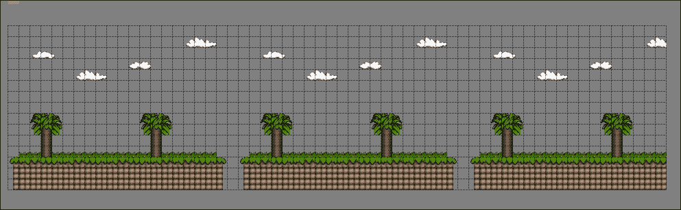

保存地图，我们就可以查看代码：

```cpp
int x, y, x2, y2 = 0;

x = m_position.getX() / m_tileSize;
y = m_position.getY() / m_tileSize;

x2 = int(m_position.getX()) % m_tileSize;
y2 = int(m_position.getY()) % m_tileSize;
```

当滚动地图时，我们实际上不会移动它超过一个瓦片的宽度；我们使用位置值来确定我们应该从瓦片 ID 数组中开始绘制地图的位置。要获取`x`值，我们可以使用移动到的位置除以瓦片的宽度。例如，假设我们将地图移动到`x 位置 = 100`，瓦片宽度为 32；这将给出 3.125 的值，但由于我们使用的是`int`值，这将简单地是 3。我们现在知道我们应该从地图上的第三个瓦片开始绘制。`y`位置的工作方式相同。

为了确保我们的瓦片绘制不会在瓦片之间跳跃，而是平滑滚动，我们使用模运算来获取我们需要移动的剩余瓦片数量，并使用这个值来定位我们的地图：

```cpp
x2 = int(m_position.getX()) % m_tileSize;
y2 = int(m_position.getY()) % m_tileSize;
```

我们然后在`draw`函数中减去这些值：

```cpp
(j * m_tileSize) - x2, (i * m_tileSize) - y2
```

我们可以通过在我们的层的`update`函数中设置速度来测试这一点：

```cpp
void TileLayer::update()
{
  m_position += m_velocity;
  m_velocity.setX(1);
}
```

然后在`PlayState`中我们可以调用这个函数：

```cpp
void PlayState::update()
{
  pLevel->update();
}
```

运行游戏，你会看到地图滚动。目前我们还没有为循环地图或停止在末尾添加任何处理。我们将在后面的章节中创建游戏时讨论这个问题。

# 解析对象层

本章我们将讨论的最后一个主题是从我们的 Tiled 地图文件中加载对象。这非常实用，并消除了在级别内放置对象的猜测工作。打开 Tiled 应用程序，我们可以通过点击**层** | **添加对象层**来创建我们的第一个**对象层**。这将创建一个新的层，称为**对象层 1**，如下面的截图所示：

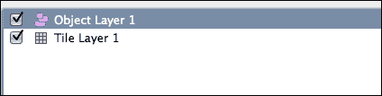

我们可以在这些层上创建对象并分配我们想要的任何值和属性。首先我们将创建一个矩形。按*R*键并在你的瓦片地图上点击任何地方，你会看到一个小的正方形出现，如下面的截图所示：

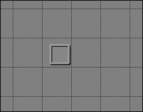

右键点击这个正方形，然后点击**对象属性…**。这将弹出对象属性对话框，如下面的截图所示：

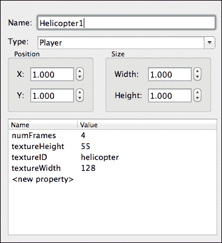

在这里，我们可以设置我们想要我们的对象拥有的值，就像我们之前的州 XML 文件一样。按照前面的截图填写对话框。这个对话框的位置和大小是以瓦片为单位的，而不是像素，所以`x = 1`实际上是`x = 瓦片宽度`等等。保存这个地图将把我们的新对象层添加到地图文件中：

```cpp
<objectgroup name="Object Layer 1" width="60" height="15">
  <object name="Helicopter1" type="Player" x="32" y="32" width="32 height="32">
    <properties>
      <property name="numFrames" value="4"/>
      <property name="textureHeight" value="55"/>
      <property name="textureID" value="helicopter"/>
      <property name="textureWidth" value="128"/>
    </properties>
  </object>
</objectgroup>
```

我们还将使用另一个属性列表来加载这个地图的纹理。**地图** | **地图属性**将弹出地图属性对话框，如下面的截图所示：

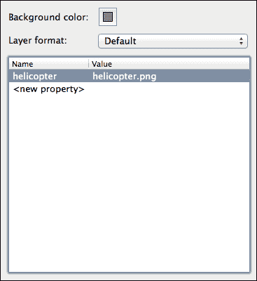

在这里我们可以添加这个地图对象的所需纹理。保存的文件现在将有一个额外的属性列表供我们解析：

```cpp
<properties>
  <property name="helicopter" value="helicopter.png"/>
</properties>
```

## 开发 ObjectLayer 类

在我们的项目中，我们现在将创建一个新的层类型，称为`ObjectLayer`。创建`ObjectLayer.h`，我们可以添加以下代码：

```cpp
class ObjectLayer : public Layer
{
  public:
  virtual void update();
  virtual void render();

  std::vector<GameObject*>* getGameObjects()  
  {  
    return &m_gameObjects;  
  }

  private:

  std::vector<GameObject*> m_gameObjects;
};
```

我们还将定义这些函数在`ObjectLayer.cpp`中：

```cpp
void ObjectLayer::update()
{
  for(int i = 0; i < m_gameObjects.size(); i++)
  {
    m_gameObjects[i]->update();
  }

}
void ObjectLayer::render()
{
  for(int i = 0; i < m_gameObjects.size(); i++)
  {
    m_gameObjects[i]->draw();
  }
}
```

我们的`ObjectLayer`类非常简单。它只需要绘制和更新该层的对象。现在让我们解析我们的`ObjectLayer`。我们将在`LevelParser`类中需要两个新函数：

```cpp
void parseTextures(TiXmlElement* pTextureRoot);

void parseObjectLayer(TiXmlElement* pObjectElement,std::vector<Layer*> *pLayers);
```

`parseLevel`函数现在必须包含这些函数并传入正确的 XML 节点：

```cpp
// we must parse the textures needed for this level, which have been added to properties
for(TiXmlElement* e = pProperties->FirstChildElement(); e != NULL;e = e->NextSiblingElement())
{
  if(e->Value() == std::string("property"))
  {
  parseTextures(e);
  }
}
```

我们将改变我们寻找瓦片层的方式，以也寻找对象层：

```cpp
// parse any object layers
for(TiXmlElement* e = pRoot->FirstChildElement(); e != NULL; e = e->NextSiblingElement())
{
  if(e->Value() == std::string("objectgroup") || e->Value() == std::string("layer"))
  {
    if(e->FirstChildElement()->Value() == std::string("object"))
    {
      parseObjectLayer(e, pLevel->getLayers());
    }
    else if(e->FirstChildElement()->Value() == std::string("data"))
    {
      parseTileLayer(e, pLevel->getLayers(), pLevel->getTilesets());
    }
  }
}
```

现在我们需要定义新的函数；`parseTextures`是一个非常小且简单的函数：

```cpp
void LevelParser::parseTextures(TiXmlElement* pTextureRoot)
{
  TheTextureManager::Instance()->load(pTextureRoot->Attribute("value"), pTextureRoot->Attribute("name"), TheGame::Instance()->getRenderer());
}
```

它获取纹理值并将它们添加到`TextureManager`。`parseObjects`函数稍微长一些，但并不特别复杂：

```cpp
void LevelParser::parseObjectLayer(TiXmlElement* pObjectElement, std::vector<Layer*> *pLayers)
{
    // create an object layer
  ObjectLayer* pObjectLayer = new ObjectLayer();

  std::cout << pObjectElement->FirstChildElement()->Value();

  for(TiXmlElement* e = pObjectElement->FirstChildElement(); e != NULL; e = e->NextSiblingElement())
    {
      std::cout << e->Value();
      if(e->Value() == std::string("object"))
      {
        int x, y, width, height, numFrames, callbackID, animSpeed;
        std::string textureID;

        // get the initial node values type, x and y
        e->Attribute("x", &x);
        e->Attribute("y", &y);
        GameObject* pGameObject = TheGameObjectFactory::Instance()->create(e->Attribute("type"));

        // get the property values
        for(TiXmlElement* properties = e->FirstChildElement(); properties != NULL; properties = properties->NextSiblingElement())
        {
          if(properties->Value() == std::string("properties"))
          {
            for(TiXmlElement* property = properties->FirstChildElement(); property != NULL; property = property->NextSiblingElement())
            {
              if(property->Value() == std::string("property"))
              {
                if(property->Attribute("name") == std::string("numFrames"))
                  {
                    property->Attribute("value", &numFrames);
                  }
                else if(property->Attribute("name") == std::string("textureHeight"))
                {
                  property->Attribute("value", &height);
                }
                else if(property->Attribute("name") == std::string("textureID"))
                {
                  textureID = property->Attribute("value");
                }
                else if(property->Attribute("name") == std::string("textureWidth"))
                {
                  property->Attribute("value", &width);
                }
                else if(property->Attribute("name") == std::string("callbackID"))
                {
                  property->Attribute("value", &callbackID);
                }
                else if(e->Attribute("name") == std::string("animSpeed"))
                {
                  property->Attribute("value", &animSpeed);
                }
              }
            }
          }
        }
        pGameObject->load(newLoaderParams(x, y, width, height, textureID, numFrames, callbackID, animSpeed));
      pObjectLayer->getGameObjects()->push_back(pGameObject);
    }
  }

  pLayers->push_back(pObjectLayer);
}
```

我们以与状态解析器非常相似的方式加载对象，但这次我们必须检查属性的`name`而不是直接获取`attribute`：

```cpp
if(property->Attribute("name") == std::string("numFrames"))
{
  property->Attribute("value", &numFrames);
}
```

我们可以像状态解析器一样创建对象：

```cpp
pGameObject->load(new LoaderParams(x,y,width,height,textureID,numFrames,callbackID, animSpeed));
```

并将其添加到这一层的游戏对象数组中：

```cpp
pObjectLayer->getGameObjects()->push_back(pGameObject);
```

一旦我们加载了这一层的所有对象，我们就可以将其推入我们的 `Level` 层数组中：

```cpp
pLayers->push_back(pObjectLayer);
```

运行游戏，你将再次看到我们的直升机在 `PlayState` 中。

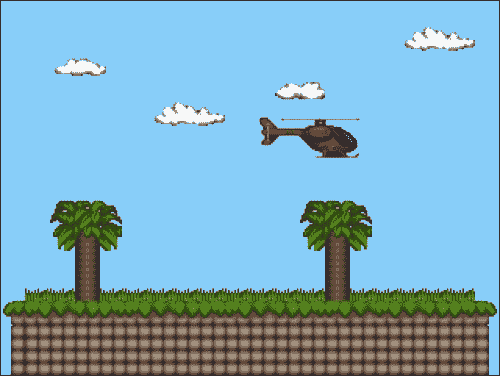

# 摘要

我们一直在向一个完整的游戏迈进。本章介绍了通过使用瓦片快速创建 2D 地图的方法，还探讨了使用外部应用程序在我们的关卡中放置对象。接下来的两章将解决所有剩余的悬而未决的问题，我们将创建一些实际的游戏。
