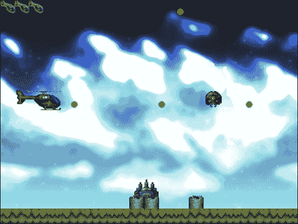
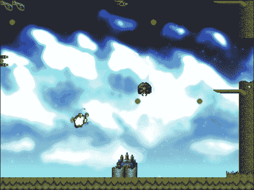
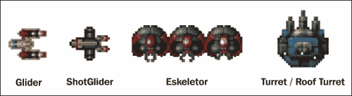
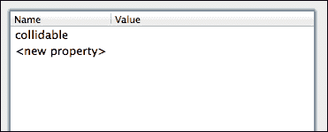

# 第八章。创建外星攻击

框架已经取得了长足的进步，我们几乎准备好制作我们的第一个游戏了。我们将创建一个简单的 2D 侧滚动射击游戏，类似于经典的 80 年代和 90 年代的射击游戏，如 R-Type 或 Pulstar。然而，游戏不会设定在太空中。外星人袭击了地球，只有你和你武装的直升机才能阻止他们。源代码下载中提供了一个快节奏的动作关卡，本章将介绍创建它的步骤。以下是我们要创建的游戏的截图：



另一个稍微紧张一点的镜头：



在我们可以创建这个游戏之前，框架必须处理一些事情。这些添加包括：

+   声音

+   碰撞检测

到本章结束时，你将很好地理解如何使用框架构建这个游戏，并且你将有能力继续并改进它。在本章中，我们将涵盖：

+   实现声音

+   创建特定于游戏的对象类

+   射击和检测子弹

+   创建不同的敌人类型

+   开发游戏

# 使用 SDL_mixer 扩展进行声音处理

SDL_mixer 扩展有其自己的 Mercurial 仓库，可以用来获取该扩展的最新源代码。它位于 [`hg.libsdl.org/SDL_mixer`](http://hg.libsdl.org/SDL_mixer)。可以使用 TortoiseHg 应用程序再次克隆扩展的 Mercurial 仓库。按照以下步骤构建库：

1.  打开 TortoiseHg 并按 *CTRL*+*SHIFT*+*N* 开始克隆新的仓库。

1.  在源框中输入 [`hg.libsdl.org/SDL_mixer`](http://hg.libsdl.org/SDL_mixer)。

1.  **目标位置** 将是 `C:\SDL2_mixer`。

1.  点击 **克隆** 并等待完成。

1.  导航到 `C:\SDL2_mixer\VisualC\` 并在 Visual Studio 2010 中打开 `SDL_mixer.vcproj`。

1.  只要 第二章 中概述的 x64 文件夹存在，即 *在 SDL 中绘图* 被创建，项目将无问题地转换。

1.  我们将构建不带 MP3 支持的库，因为我们不需要它，而且它与 SDL 2.0 的兼容性也不太好。

1.  在项目属性中的 **预处理器定义** 中添加 `MP3_MUSIC_DISABLED`，这可以通过导航到 **C/C++** | **预处理器** 来找到，并按照 第二章 中 *在 SDL 中绘图* 的 `SDL_image` 指令进行构建。

## 创建 SoundManager 类

本章创建的游戏不需要任何高级声音处理，这意味着 `SoundManager` 类相当基础。该类仅使用 `.ogg` 文件进行音乐测试和 `.wav` 文件进行声音效果测试。以下是头文件：

```cpp
enum sound_type
{
  SOUND_MUSIC = 0,
  SOUND_SFX = 1
};

class SoundManager
{
public:

  static SoundManager* Instance()
  {
    if(s_pInstance == 0)
    {
      s_pInstance = newSoundManager();
      return s_pInstance;
    }
    return s_pInstance;
  }

  bool load(std::string fileName, std::string id, sound_type type);

  void playSound(std::string id, int loop);
  void playMusic(std::string id, int loop);

  private:

  static SoundManager* s_pInstance;

  std::map<std::string, Mix_Chunk*> m_sfxs;
  std::map<std::string, Mix_Music*> m_music;

  SoundManager();
  ~SoundManager();

  SoundManager(const SoundManager&);
  SoundManager &operator=(const SoundManager&);
};

typedef SoundManager TheSoundManager;
```

`SoundManager` 类是一个单例；这样做是有道理的，因为声音应该只存储在一个地方，并且应该可以从游戏的任何地方访问。在使用声音之前，必须调用 `Mix_OpenAudio` 来设置游戏音频。`Mix_OpenAudio` 函数接受以下参数：

```cpp
(int frequency, Uint16 format, int channels, int chunksize)
```

这是在 `SoundManager` 的构造函数中完成的，使用对大多数游戏都适用的值。

```cpp
SoundManager::SoundManager()
{
  Mix_OpenAudio(22050, AUDIO_S16, 2, 4096);
}
```

`SoundManager` 类使用两个不同的 `std::map` 容器来存储声音：

```cpp
std::map<std::string, Mix_Chunk*> m_sfxs;
std::map<std::string, Mix_Music*> m_music;
```

这些映射存储了 `SDL_mixer` 使用的两种不同类型的指针（`Mix_Chunk*` 和 `Mix_Music*`），使用字符串作为键。`Mix_Chunk*` 类型用于音效，而 `Mix_Music*` 类型当然用于音乐。当将音乐文件或音效加载到 `SoundManager` 中时，我们传递一个名为 `sound_type` 的 `enum` 来表示要加载的声音类型。

```cpp
bool load(std::string fileName, std::string id, sound_type type);
```

这种类型用于决定将加载的声音添加到哪个 `std::map` 中，以及从 `SDL_mixer` 中使用哪个 `load` 函数。`load` 函数在 `SoundManager.cpp` 中定义。

```cpp
bool SoundManager::load(std::string fileName, std::string id, sound_type type)
{
  if(type == SOUND_MUSIC)
  {
    Mix_Music* pMusic = Mix_LoadMUS(fileName.c_str());

    if(pMusic == 0)
    {
      std::cout << "Could not load music: ERROR - "
      << Mix_GetError() << std::endl;
      return false;
    }

    m_music[id] = pMusic;
    return true;
  }
  else if(type == SOUND_SFX)
  {
    Mix_Chunk* pChunk = Mix_LoadWAV(fileName.c_str());
    if(pChunk == 0)
    {
      std::cout << "Could not load SFX: ERROR - "
      << Mix_GetError() << std::endl;

      return false;
    }

    m_sfxs[id] = pChunk;
    return true;
  }
  return false;
}
```

一旦加载了声音，就可以使用 `**playSound**` 或 `**playMusic**` 函数来播放：

```cpp
void playSound(std::string id, int loop);
void playMusic(std::string id, int loop);
```

这两个函数都接受要播放的声音的 ID 和要循环播放的次数。这两个函数非常相似。

```cpp
void SoundManager::playMusic(std::string id, int loop)
{
  Mix_PlayMusic(m_music[id], loop);
}

void SoundManager::playSound(std::string id, int loop)
{
  Mix_PlayChannel(-1, m_sfxs[id], loop);
}
```

`Mix_PlayMusic` 和 `Mix_PlayChannel` 之间的一个区别是后者将一个 `int` 作为第一个参数；这是声音要播放的通道。值为 **-1**（如前述代码所示）告诉 `SDL_mixer` 在任何可用的通道上播放声音。

最后，当 `SoundManager` 类被销毁时，它将调用 `Mix_CloseAudio`：

```cpp
SoundManager::~SoundManager()
{
  Mix_CloseAudio();
}
```

`SoundManager` 类的内容到此结束。

# 设置基本游戏对象

创建 Alien Attack 所做的绝大多数工作都是在对象类中完成的，而框架中几乎所有的其他工作都是由管理类处理的。以下是最重要的更改：

## `GameObject` 进行了改进

`GameObject` 基类比之前要复杂得多。

```cpp
class GameObject
{
public:
  // base class needs virtual destructor
  virtual ~GameObject() {}
  // load from file 
  virtual void load(std::unique_ptr<LoaderParams> const &pParams)=0;
  // draw the object
  virtual void draw()=0;
  // do update stuff
  virtual void update()=0;
  // remove anything that needs to be deleted
  virtual void clean()=0;
  // object has collided, handle accordingly
  virtual void collision() = 0;
  // get the type of the object
  virtual std::string type() = 0;
  // getters for common variables
  Vector2D& getPosition() { return m_position; }
  int getWidth() { return m_width; }
  int getHeight() { return m_height; }
  // scroll along with tile map
  void scroll(float scrollSpeed) { m_position.setX(m_position.getX() - 
  scrollSpeed); }
  // is the object currently being updated?
  bool updating() { return m_bUpdating; }
  // is the object dead?
  bool dead() { return m_bDead; }
  // is the object doing a death animation?
  bool dying() { return m_bDying; }
  // set whether to update the object or not
  void setUpdating(bool updating) { m_bUpdating = updating; }

protected:

  // constructor with default initialisation list
  GameObject() :  m_position(0,0),
  m_velocity(0,0),
  m_acceleration(0,0),
  m_width(0),
  m_height(0),
  m_currentRow(0),
  m_currentFrame(0),
  m_bUpdating(false),
  m_bDead(false),
  m_bDying(false),
  m_angle(0),
  m_alpha(255)
  {
  }
  // movement variables
  Vector2D m_position;
  Vector2D m_velocity;
  Vector2D m_acceleration;
  // size variables
  int m_width;
  int m_height;
  // animation variables
  int m_currentRow;
  int m_currentFrame;
  int m_numFrames;
  std::string m_textureID;
  // common boolean variables
  bool m_bUpdating;
  bool m_bDead;
  bool m_bDying;
  // rotation
  double m_angle;
  // blending
  int m_alpha;
};
```

这个类现在有很多以前在 `SDLGameObject` 中使用的成员变量。新增了一些变量来检查对象是否正在更新、是否正在执行死亡动画或已经死亡。当对象在滚动游戏级别后位于游戏屏幕内时，更新设置为 true。

在加载函数中，用 `std::unique_ptr` 指针代替了常规的 `LoaderParams` 指针；这是 **C++11 标准** 的一部分，并确保指针在超出作用域后会被删除。

```cpp
virtual void load(std::unique_ptr<LoaderParams> const &pParams)=0;
```

现在有两个新的函数，每个派生对象都必须实现（无论是所有者还是继承）：

```cpp
 // object has collided, handle accordingly
virtual void collision() = 0;

 // get the type of the object
virtual std::string type() = 0;
```

## `SDLGameObject` 现在更名为 `ShooterObject`

`SDLGameObject` 类现在已更名为 `ShooterObject`，并且更具体地针对这种类型的游戏：

```cpp
class ShooterObject : public GameObject
{
public:

  virtual ~ShooterObject() {}// for polymorphism
  virtual void load(std::unique_ptr<LoaderParams> const
  &pParams);
  virtual void draw();
  virtual void update();
  virtual void clean() {}// not implemented in this class
  virtual void collision() {}//not implemented in this class
  virtual std::string type() { return "SDLGameObject"; }

protected:

  // we won't directly create ShooterObject's
  ShooterObject();

  // draw the animation for the object being destroyed
  void doDyingAnimation();

  // how fast will this object fire bullets? with a counter
  int m_bulletFiringSpeed;
  int m_bulletCounter;

  // how fast will this object move?
  int m_moveSpeed;

  // how long will the death animation takes? with a counter
  int m_dyingTime;
  int m_dyingCounter;

  // has the explosion sound played?
  bool m_bPlayedDeathSound;
};
```

此类为绘制和更新提供了默认实现，这些实现可以在派生类中使用；它们基本上与之前的 `SDLGameObject` 类相同，所以我们在这里不会介绍它们。新增的一个函数是 `doDyingAnimation`。此函数负责在敌人爆炸时更新动画，并将它们设置为死亡状态，以便可以从游戏中移除。

```cpp
void ShooterObject::doDyingAnimation()
{
  // keep scrolling with the map
  scroll(TheGame::Instance()->getScrollSpeed());

  m_currentFrame = int(((SDL_GetTicks() / (1000 / 3)) % 
  m_numFrames));

  if(m_dyingCounter == m_dyingTime)
  {
    m_bDead = true;
  }
  m_dyingCounter++; //simple counter, fine with fixed frame rate
}
```

## 玩家继承自 `ShooterObject`

**玩家** 对象现在继承自新的 `ShooterObject` 类，并实现了自己的更新函数。一些新的游戏特定函数和变量已被添加：

```cpp
private:

  // bring the player back if there are lives left
  void ressurect();

  // handle any input from the keyboard, mouse, or joystick
  void handleInput();

  // handle any animation for the player
  void handleAnimation();

  // player can be invulnerable for a time
  int m_invulnerable;
  int m_invulnerableTime;
  int m_invulnerableCounter;
};
```

`ressurect` 函数将玩家重置到屏幕中心，并暂时使 `Player` 对象免疫伤害；这一效果通过纹理的 `alpha` 值来可视化。此函数还负责重置在 `doDyingAnimation` 中更改的纹理大小值，以适应爆炸纹理：

```cpp
void Player::ressurect()
{
  TheGame::Instance()->setPlayerLives(TheGame::Instance()
  ->getPlayerLives() - 1);

  m_position.setX(10);
  m_position.setY(200);
  m_bDying = false;

  m_textureID = "player";

  m_currentFrame = 0;
  m_numFrames = 5;
  m_width = 101;
  m_height = 46;

  m_dyingCounter = 0;
  m_invulnerable = true;
}
```

动画是 `Player` 对象感觉的重要组成部分；从闪烁（当无敌时），到旋转（当向前或向后移动时）。这导致有一个专门处理动画的独立函数：

```cpp
void Player::handleAnimation()
{
  // if the player is invulnerable we can flash its alpha to let 
  people know
  if(m_invulnerable)
  {
    // invulnerability is finished, set values back
    if(m_invulnerableCounter == m_invulnerableTime)
    {
      m_invulnerable = false;
      m_invulnerableCounter = 0;
      m_alpha = 255;
    }
    else// otherwise, flash the alpha on and off
    {
      if(m_alpha == 255)
      {
        m_alpha = 0;
      }
      else
      {
        m_alpha = 255;
      }
    }

    // increment our counter
    m_invulnerableCounter++;
  }

  // if the player is not dead then we can change the angle with 
  the velocity to give the impression of a moving helicopter
  if(!m_bDead)
  {
    if(m_velocity.getX() < 0)
    {
      m_angle = -10.0;
    }
    else if(m_velocity.getX() > 0)
    {
      m_angle = 10.0;
    }
    else
    {
      m_angle = 0.0;
    }
  }

  // our standard animation code - for helicopter propellors
  m_currentFrame = int(((SDL_GetTicks() / (100)) % m_numFrames));
}
```

使用 `TextureManager` 的 `drawFrame` 函数的新参数来改变对象的角和 `alpha` 值：

```cpp
void TextureManager::drawFrame(std::string id, int x, int y, int 
width, int height, int currentRow, int currentFrame, SDL_Renderer 
*pRenderer, double angle, int alpha, SDL_RendererFlip flip)
{
  SDL_Rect srcRect;
  SDL_Rect destRect;
  srcRect.x = width * currentFrame;
  srcRect.y = height * currentRow;
  srcRect.w = destRect.w = width;
  srcRect.h = destRect.h = height;
  destRect.x = x;
  destRect.y = y;

  // set the alpha of the texture and pass in the angle
  SDL_SetTextureAlphaMod(m_textureMap[id], alpha);
  SDL_RenderCopyEx(pRenderer, m_textureMap[id], &srcRect, 
  &destRect, angle, 0, flip);
}
```

最后，`Player::update` 函数将所有这些整合在一起，同时还有额外的逻辑来处理关卡完成的情况：

```cpp
void Player::update()
{
  // if the level is complete then fly off the screen
  if(TheGame::Instance()->getLevelComplete())
  {
    if(m_position.getX() >= TheGame::Instance()->getGameWidth())
    {
      TheGame::Instance()->setCurrentLevel(TheGame::Instance()
      ->getCurrentLevel() + 1);
    }
    else
    {
      m_velocity.setY(0);
      m_velocity.setX(3);
      ShooterObject::update();
      handleAnimation();
    }
  }
  else
  {
    // if the player is not doing its death animation then update 
    it normally
    if(!m_bDying)
    {
      // reset velocity
      m_velocity.setX(0);
      m_velocity.setY(0);

      // get input
      handleInput();
      // do normal position += velocity update
      ShooterObject::update();

      // update the animation
      handleAnimation();
    }
    else // if the player is doing the death animation
    {
      m_currentFrame = int(((SDL_GetTicks() / (100)) % 
      m_numFrames));

      // if the death animation has completed
      if(m_dyingCounter == m_dyingTime)
      {
        // ressurect the player
        ressurect();
      }

      m_dyingCounter++;
    }
  }
}
```

一旦关卡完成且玩家飞出屏幕，`Player::update` 函数还会告诉游戏增加当前关卡：

```cpp
TheGame::Instance()->setCurrentLevel(TheGame::Instance()->getCurrentLevel() + 1);
```

`Game::setCurrentLevel` 函数将状态更改为 `BetweenLevelState`：

```cpp
void Game::setCurrentLevel(int currentLevel)
{
  m_currentLevel = currentLevel;
  m_pGameStateMachine->changeState(new BetweenLevelState());
  m_bLevelComplete = false;
}
```

## 许多敌人类型

像外星攻击这样的游戏需要很多敌人类型来保持趣味性；每种敌人都有自己的行为。敌人应该易于创建并自动添加到碰撞检测列表中。考虑到这一点，`Enemy` 类现在已成为一个基类：

```cpp
// Enemy base class
class Enemy : public ShooterObject
{
public:
  virtual std::string type() { return"Enemy"; }

protected:
  int m_health;

  Enemy() : ShooterObject() {}
  virtual ~Enemy() {} // for polymorphism

};
```

所有敌人类型都将从这个类派生，但重要的是它们不要覆盖 `type` 方法。原因将在我们转向游戏碰撞检测类时变得清晰。现在请查看 Alien Attack 源代码中的敌人类型，看看它们是如何简单易创建的。



## 添加滚动背景

滚动背景对于像这样的 2D 游戏非常重要；它们有助于营造深度和运动感。这个 `ScrollingBackground` 类使用两个目标矩形和两个源矩形；一个扩展，另一个收缩。一旦扩展的矩形达到其完整宽度，两个矩形都会重置，循环继续：

```cpp
void ScrollingBackground::load(std::unique_ptr<LoaderParams> const &pParams)
{
  ShooterObject::load(std::move(pParams));
  m_scrollSpeed = pParams->getAnimSpeed();

  m_scrollSpeed = 1;

  m_srcRect1.x = 0;
  m_destRect1.x = m_position.getX();
  m_srcRect1.y = 0;
  m_destRect1.y = m_position.getY();

  m_srcRect1.w = m_destRect1.w = m_srcRect2Width = 
  m_destRect1Width = m_width;
  m_srcRect1.h = m_destRect1.h = m_height;

  m_srcRect2.x = 0;
  m_destRect2.x = m_position.getX() + m_width;
  m_srcRect2.y = 0;
  m_destRect2.y = m_position.getY();

  m_srcRect2.w = m_destRect2.w = m_srcRect2Width = 
  m_destRect2Width = 0;
  m_srcRect2.h = m_destRect2.h = m_height;
}

void ScrollingBackground::draw()
{
  // draw first rect
  SDL_RenderCopyEx(TheGame::Instance()->getRenderer(), 
  TheTextureManager::Instance()->getTextureMap()[m_textureID], 
  &m_srcRect1, &m_destRect1, 0, 0, SDL_FLIP_NONE);

  // draw second rect
  SDL_RenderCopyEx(TheGame::Instance()->getRenderer(), 
  TheTextureManager::Instance()->getTextureMap()[m_textureID], 
  &m_srcRect2, &m_destRect2, 0, 0, SDL_FLIP_NONE);

}

void ScrollingBackground::update()
{
  if(count == maxcount)
  {
    // make first rectangle smaller
    m_srcRect1.x += m_scrollSpeed;
    m_srcRect1.w -= m_scrollSpeed;
    m_destRect1.w -= m_scrollSpeed;

    // make second rectangle bigger
    m_srcRect2.w += m_scrollSpeed;
    m_destRect2.w += m_scrollSpeed;
    m_destRect2.x -= m_scrollSpeed;

    // reset and start again
    if(m_destRect2.w >= m_width)
    {
      m_srcRect1.x = 0;
      m_destRect1.x = m_position.getX();
      m_srcRect1.y = 0;
      m_destRect1.y = m_position.getY();

      m_srcRect1.w = m_destRect1.w = m_srcRect2Width = 
      m_destRect1Width = m_width;
      m_srcRect1.h = m_destRect1.h = m_height;

      m_srcRect2.x = 0;
      m_destRect2.x = m_position.getX() + m_width;
      m_srcRect2.y = 0;
      m_destRect2.y = m_position.getY();

      m_srcRect2.w = m_destRect2.w = m_srcRect2Width = 
      m_destRect2Width = 0;
      m_srcRect2.h = m_destRect2.h = m_height;
    }
    count = 0;
  }

  count++;
}
```

# 处理子弹

游戏中的大多数对象都会发射子弹，它们几乎都需要检查与子弹的碰撞；总之——子弹在《外星攻击》中非常重要。游戏有一个专门的`BulletHandler`类来处理子弹的创建、销毁、更新和渲染。

## 两种类型的子弹

游戏中有两种子弹，`PlayerBullet`和`EnemyBullet`，它们都在同一个`BulletManager`类中处理。这两个子弹类都在`Bullet.h`中声明和定义：

```cpp
class PlayerBullet : public ShooterObject
{
public:

  PlayerBullet() : ShooterObject()
  {
  }

  virtual ~PlayerBullet() {}

  virtual std::string type() { return "PlayerBullet"; }

  virtual void load(std::unique_ptr<LoaderParams> pParams, Vector2D 
  heading)
  {
    ShooterObject::load(std::move(pParams));
    m_heading = heading;
  }

  virtual void draw()
  {
    ShooterObject::draw();
  }

  virtual void collision()
  {
    m_bDead = true;
  }

  virtual void update()
  {
    m_velocity.setX(m_heading.getX());
    m_velocity.setY(m_heading.getY());

    ShooterObject::update();
  }

  virtual void clean()
  {
    ShooterObject::clean();
  }

private:

  Vector2D m_heading;
};

// Enemy Bullet is just a Player Bullet with a different typename
class EnemyBullet : public PlayerBullet
{
public:

  EnemyBullet() : PlayerBullet()
  {
  }

  virtual ~EnemyBullet() {}

  virtual std::string type() { return "EnemyBullet"; }
};
```

子弹非常简单，它们只朝一个方向以一定速度移动。

## `BulletHandler`类

`BulletHandler`类使用两个公共函数来添加子弹：

```cpp
void addPlayerBullet(int x, int y, int width, int height, std::string textureID, int numFrames, Vector2D heading);
void addEnemyBullet(int x, int y, int width, int height, std::string textureID, int numFrames, Vector2D heading);
```

`BulletHandler`类也是一个单例。因此，如果对象想要向游戏中添加子弹，它可以使用上述函数之一。以下是从`ShotGlider`类中的一个示例：

```cpp
TheBulletHandler::Instance()->addEnemyBullet(m_position.getX(), m_position.getY() + 15, 16, 16, "bullet2", 1, Vector2D(-10, 0));
```

这将在`ShotGlider`的当前位置添加一个子弹，其航向向量为*V*(-10,0)。

两个`add`函数非常相似；它们创建`PlayerBullet`或`EnemyBullet`的新实例，然后将它推入正确的向量中。以下是它们的定义：

```cpp
void BulletHandler::addPlayerBullet(int x, int y, int width, int 
  height, std::string textureID, int numFrames, Vector2D heading)
{
  PlayerBullet* pPlayerBullet = newPlayerBullet();
  pPlayerBullet->load(std::unique_ptr<LoaderParams>(new 
  LoaderParams(x, y, width, height, textureID, numFrames)), 
  heading);

  m_playerBullets.push_back(pPlayerBullet);
}

void BulletHandler::addEnemyBullet(int x, int y, int width, int 
height, std::string textureID, int numFrames, Vector2D heading)
{
  EnemyBullet* pEnemyBullet = new EnemyBullet();
  pEnemyBullet->load(std::unique_ptr<LoaderParams>(new 
  LoaderParams(x, y, width, height, textureID, numFrames)), 
  heading);

  m_enemyBullets.push_back(pEnemyBullet);
}
```

与对象自己管理自己的子弹相比，在这样一个单独的地方存储子弹的一个大优点是，不需要传递对象来仅仅获取它们的子弹以检查碰撞。这个`BulletHandler`类为我们提供了一个集中的位置，我们可以轻松地将它传递给碰撞处理器。

`update`和`draw`函数本质上只是循环调用每个子弹的相应函数，然而`update`函数还会销毁任何已经离开屏幕的子弹：

```cpp
for (std::vector<PlayerBullet*>::iterator p_it = 
m_playerBullets.begin(); p_it != m_playerBullets.end();)
{
  if((*p_it)->getPosition().getX() < 0 || (*p_it)
  ->getPosition().getX() >TheGame::Instance()->getGameWidth()
  || (*p_it)->getPosition().getY() < 0 || (*p_it)->
  getPosition().getY() >TheGame::Instance()->getGameHeight() || 
  (*p_it)->dead())// if off screen or dead
  {
    delete * p_it; // delete the bullet
    p_it = m_playerBullets.erase(p_it); //remove
  }
  else// continue to update and loop
  {
    (*p_it)->update();
    ++p_it;
  }
}
```

# 处理碰撞

在周围飞舞着这么多子弹，并且需要检查与`Enemy`对象碰撞的情况下，有一个单独的类来为我们进行碰撞检测是非常重要的。这样，如果我们决定要实现一种新的碰撞检测方式或优化现有代码，我们就知道该往哪里查找。`Collision.h`文件包含一个静态方法，用于检查两个`SDL_Rect`对象之间的碰撞：

```cpp
const static int s_buffer = 4;

static bool RectRect(SDL_Rect* A, SDL_Rect* B)
{
  int aHBuf = A->h / s_buffer;
  int aWBuf = A->w / s_buffer;

  int bHBuf = B->h / s_buffer;
  int bWBuf = B->w / s_buffer;

  // if the bottom of A is less than the top of B - no collision
  if((A->y + A->h) - aHBuf <= B->y + bHBuf)  { return false; }

  // if the top of A is more than the bottom of B = no collision
  if(A->y + aHBuf >= (B->y + B->h) - bHBuf)  { return false; }

  // if the right of A is less than the left of B - no collision
  if((A->x + A->w) - aWBuf <= B->x +  bWBuf) { return false; }

  // if the left of A is more than the right of B - no collision
  if(A->x + aWBuf >= (B->x + B->w) - bWBuf)  { return false; }

  // otherwise there has been a collision
 return true;
}
```

这个函数使用了一个缓冲区，这是一个用于使矩形稍微小一点的价值。在像《外星攻击》这样的游戏中，精确的碰撞检测在边界矩形上可能会稍微不公平，而且也不太有趣。使用缓冲区值，需要更直接的命中才能被注册为碰撞。这里缓冲区设置为`4`；这将从矩形的每一边减去四分之一。

`Player`类不会处理自己的碰撞。当关卡加载时，需要一种方法将玩家从其他`GameObject`实例中分离出来。现在`Level`类存储了一个指向`Player`的指针：

```cpp
Player* m_pPlayer;
```

使用公共获取器和设置器：

```cpp
Player* getPlayer() { return m_pPlayer; }
void setPlayer(Player* pPlayer) { m_pPlayer = pPlayer; }
```

当`LevelParser`实例从关卡文件中加载`Player`时，它会设置这个指针：

```cpp
pGameObject->load(std::unique_ptr<LoaderParams>(new LoaderParams(x, y, width, height, textureID, numFrames,callbackID, animSpeed)));

if(type == "Player") // check if it's the player
{
  pLevel->setPlayer(dynamic_cast<Player*>(pGameObject));
}

pObjectLayer->getGameObjects()->push_back(pGameObject);
```

`Level`的另一个新增功能是它包含一个单独的`std::vector`，其中包含`TileLayer*`，这些是游戏将用于碰撞检查的瓦片层。这个值来自`.tmx`文件，任何需要检查碰撞的`TileLayer`都必须在 tiled 应用程序中将`collidable`属性设置为属性。



这也要求在检查对象层时对`LevelParser::parseLevel`进行轻微的修改，以防该层包含属性（在这种情况下，数据将不再是第一个子元素）：

```cpp
else if(e->FirstChildElement()->Value() == std::string("data") || (e->FirstChildElement()->NextSiblingElement() != 0 && e->FirstChildElement()->NextSiblingElement()->Value() == std::string("data")))
{
  parseTileLayer(e, pLevel->getLayers(), pLevel->getTilesets(), 
  pLevel->getCollisionLayers());
}
```

`LevelParser`实例现在可以在`parseTileLayer`中将碰撞层添加到碰撞层数组中：

```cpp
// local temporary variable
bool collidable = false;

// other code…

for(TiXmlElement* e = pTileElement->FirstChildElement(); e != NULL; e = e->NextSiblingElement())
{
  if(e->Value() == std::string("properties"))
  {
    for(TiXmlElement* property = e->FirstChildElement(); property != NULL; property = property->NextSiblingElement())
    {
      if(property->Value() == std::string("property"))
      {
        if(property->Attribute("name") == std::string("collidable"))
        {
          collidable = true;
        }
      }
    }
  }

  if(e->Value() == std::string("data"))
  {
    pDataNode = e;
  }
}

// other code…

// push into collision array if necessary
if(collidable)
{
  pCollisionLayers->push_back(pTileLayer);
}

pLayers->push_back(pTileLayer);
```

## 创建一个`CollisionManager`类

负责检查和处理所有这些碰撞的类是`CollisionManager`类。以下是它的声明：

```cpp
class CollisionManager
{
public:

  void checkPlayerEnemyBulletCollision(Player* pPlayer);
  void checkPlayerEnemyCollision(Player* pPlayer, const 
  std::vector<GameObject*> &objects);
  void checkEnemyPlayerBulletCollision(const 
  std::vector<GameObject*> &objects);
  void checkPlayerTileCollision(Player* pPlayer, const 
  std::vector<TileLayer*> &collisionLayers);
};
```

查看源代码你会发现这些函数相当大，但它们相对简单。它们遍历每个需要碰撞测试的对象，为每个对象创建一个矩形，然后将它传递到在`Collision.h`中定义的静态`RectRect`函数。如果发生碰撞，它将调用该对象的`collision`函数。`checkEnemyPlayerBulletCollision`和`checkPlayerEnemyCollision`函数执行额外的检查，以查看对象是否实际上是`Enemy`类型：

```cpp
if(objects[i]->type() != std::string("Enemy") || !objects[i]->updating())
{
 continue;
}
```

如果不是，则不会检查碰撞。这就是为什么确保`Enemy`子类型不覆盖`type`函数，或者如果它们覆盖了，它们的类型也必须添加到这个检查中，这一点很重要。这个条件还会检查对象是否正在更新；如果不是，那么它已经不在屏幕上，不需要检查碰撞。

检查与瓦片的碰撞需要与确定从哪里开始绘制瓦片的方法类似，这已在`TileLayer::render`函数中实现。以下是`checkPlayerTileCollision`的定义：

```cpp
void CollisionManager::checkPlayerTileCollision(Player* pPlayer, 
  const std::vector<TileLayer*> &collisionLayers)
{
  // iterate through collision layers
  for(std::vector<TileLayer*>::const_iterator it = 
  collisionLayers.begin(); it != collisionLayers.end(); ++it)
  {
    TileLayer* pTileLayer = (*it);
    std::vector<std::vector<int>> tiles = pTileLayer-
    >getTileIDs();

    // get this layers position
    Vector2D layerPos = pTileLayer->getPosition();

    int x, y, tileColumn, tileRow, tileid = 0;

    // calculate position on tile map
    x = layerPos.getX() / pTileLayer->getTileSize();
    y = layerPos.getY() / pTileLayer->getTileSize();

    // if moving forward or upwards
    if(pPlayer->getVelocity().getX() >= 0 || pPlayer-
    >getVelocity().getY() >= 0)
    {
      tileColumn = ((pPlayer->getPosition().getX() + pPlayer-
      >getWidth()) / pTileLayer->getTileSize());
      tileRow = ((pPlayer->getPosition().getY() + pPlayer-
      >getHeight()) 
      / pTileLayer->getTileSize());
      tileid = tiles[tileRow + y][tileColumn + x];
    }
    else if(pPlayer->getVelocity().getX() < 0 || pPlayer-
    >getVelocity().getY() < 0) // if moving backwards or downwards
    {
      tileColumn = pPlayer->getPosition().getX() / pTileLayer-
      >getTileSize();
      tileRow = pPlayer->getPosition().getY() / pTileLayer-
      >getTileSize();
      tileid = tiles[tileRow + y][tileColumn + x];
    }
    if(tileid != 0) // if the tile id not blank then collide
    {
      pPlayer->collision();
    }
  }
}
```

# 可能的改进

目前《外星攻击》是一款相当稳健的游戏；我们强烈建议查看源代码并熟悉它的每个方面。一旦你对游戏的大部分区域有了很好的理解，就更容易看到某些区域可以如何增强。以下是一些可以添加到游戏中以改进游戏的想法：

+   子弹可以在关卡开始时创建并存储在对象池中；因此，而不是不断创建和删除子弹，它们可以从对象池中取出并放回。这种方法的主要优点是，当涉及到性能时，对象的创建和销毁可能相当昂贵。在游戏运行时消除这一点可以真正提高性能。

+   碰撞检测可以进一步优化，可能通过添加一个**四叉树**来停止不必要的碰撞检查。

+   源代码中有几个区域使用字符串比较来检查类型。这可能会对性能产生一定影响，因此使用`枚举`作为类型等其它选项可能是一个更好的选择。

你可能自己已经注意到了一些你认为可以改进的地方。在游戏的背景下对这些进行工作，在那里你可以测试结果，是一种很好的学习体验。

# 摘要

该框架已被成功用于创建一款游戏——外星人攻击。在本章中，我们涵盖了游戏最重要的部分，并简要解释了为什么它们被设计成这样。由于这款游戏的源代码现在可用，因此现在有一个很好的项目可以开始练习。
