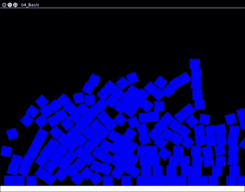
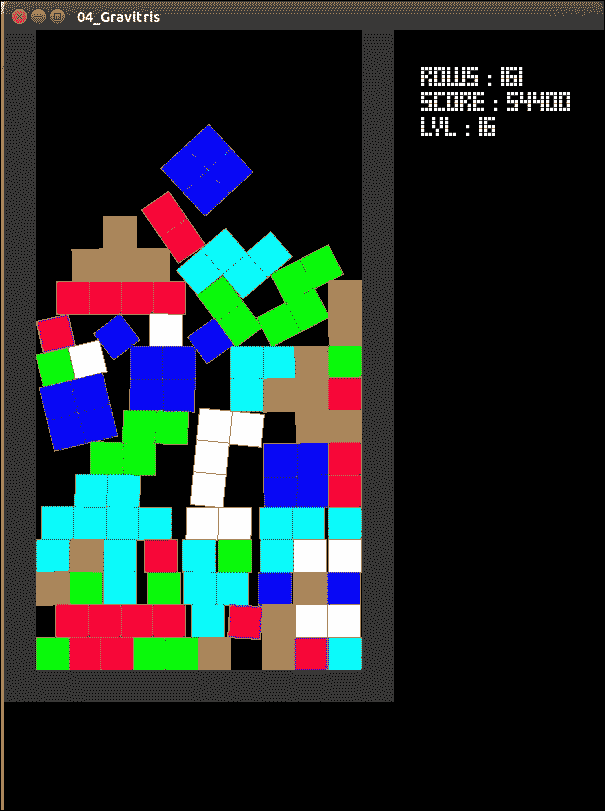

# 第四章 玩转物理

在上一章中，我们构建了几个游戏，包括一个俄罗斯方块克隆版。在本章中，我们将向这个游戏添加物理效果，使其变成一个新的游戏。通过这样做，我们将学习：

+   什么是物理引擎

+   如何安装和使用 Box2D 库

+   如何将物理引擎与 SFML 配合进行显示

+   如何在游戏中添加物理效果

在本章中，我们将学习物理的魔法。我们还将做一些数学，但请放心，这只是转换。现在，让我们开始吧！

# 物理引擎——késako？

在本章中，我们将讨论物理引擎，但首先的问题是“什么是物理引擎？”让我们来解释一下。

物理引擎是一种能够模拟物理的软件或库，例如描述刚体运动的牛顿-欧拉方程。物理引擎还能够处理碰撞，其中一些甚至可以处理软体和流体。

有不同类型的物理引擎，主要分为实时引擎和非实时引擎。第一种主要用于视频游戏或模拟器，第二种用于高性能科学模拟、电影特效和动画的概念设计。

由于我们的目标是将在视频游戏中使用引擎，因此让我们专注于基于实时的引擎。在这里，同样有两种重要的引擎类型。第一种是用于 2D 的，另一种是用于 3D 的。当然，你可以在 2D 世界中使用 3D 引擎，但出于优化的目的，最好使用 2D 引擎。有很多引擎，但并非所有都是开源的。

## 3D 物理引擎

对于 3D 游戏，我建议你使用`Bullet`物理库。它被集成到 Blender 软件中，并被用于一些商业游戏和电影制作。这是一个用 C/C++编写的真正优秀的引擎，可以处理刚体和软体、流体、碰撞、力……以及你需要的一切。

## 2D 物理引擎

如前所述，在 2D 环境中，你可以使用 3D 物理引擎；你只需忽略深度（Z 轴）。然而，最有趣的事情是使用针对 2D 环境优化的引擎。有几种这样的引擎，其中最著名的是 Box2D 和 Chipmunk。它们都非常出色，没有一个比另一个更好，但我不得不做出选择，那就是 Box2D。我之所以做出这个选择，不仅是因为它的 C++ API 允许你使用重载，还因为该项目拥有庞大的社区。

# 物理引擎与游戏引擎比较

不要将物理引擎和游戏引擎混淆。物理引擎只模拟物理世界，没有其他任何东西。没有图形，没有逻辑，只有物理模拟。相反，游戏引擎，大多数情况下包括物理引擎和渲染技术（如 OpenGL 或 DirectX）的配套。一些预定义的逻辑取决于引擎的目标（RPG、FPS 等），有时还包括人工智能。所以正如你所见，游戏引擎比物理引擎更完整。最知名的两种引擎是 Unity 和 Unreal 引擎，它们都非常完整。此外，它们对非商业用途是免费的。

那么我们为什么不直接使用游戏引擎呢？这是一个很好的问题。有时候，使用现成的东西，而不是重新发明轮子，会更好。然而，我们真的需要游戏引擎的所有功能来完成这个项目吗？更重要的是，我们需要它来做什么？让我们看看以下内容：

+   图形输出

+   能够处理碰撞的物理引擎

没有其他需要的东西。所以正如你所见，为这个项目使用游戏引擎就像是杀蚊子用火箭筒。我希望你已经理解了物理引擎的目的，游戏引擎和物理引擎之间的区别，以及本章所述项目中做出的选择的原因。

# 使用 Box2D

如前所述，Box2D 是一个物理引擎。它有很多功能，但对我们项目来说最重要的如下（摘自 Box2D 文档）：

+   **碰撞**：这个功能非常有趣，因为它允许我们的俄罗斯方块相互交互

    +   连续碰撞检测

    +   刚体（凸多边形和圆形）

    +   每个物体可以有多个形状

+   **物理**：这个功能将允许一个物体落下，等等

    +   基于碰撞时间解算器的连续物理

    +   关节限制、电机和摩擦

    +   相对准确的反应力/冲量

正如你所见，Box2D 为我们提供了构建游戏所需的一切。这个引擎还有很多其他可用功能，但它们目前对我们来说并不重要，所以不会详细描述。然而，如果你感兴趣，可以查看 Box2D 官方网站了解更多关于其功能的信息([`box2d.org/about/`](http://box2d.org/about/))。

需要注意的是，Box2D 使用米、千克、秒和弧度作为角度的单位；SFML 使用像素、秒和度。因此，我们需要进行一些转换。我稍后会回到这个问题。

## 准备 Box2D

现在已经介绍了 Box2D，让我们来安装它。你可以在 Google 代码项目页面上找到可用的版本列表[`code.google.com/p/box2d/downloads/list`](https://code.google.com/p/box2d/downloads/list)。目前，最新的稳定版本是 2.3。一旦你下载了源代码（从压缩文件或使用 SVN），你将需要构建它。

### 构建

这里是好消息，Box2D 使用 CMake 作为构建过程，所以你只需遵循本书第一章中描述的 SFML 构建步骤，你就能成功构建 Box2D。如果一切顺利，你将在以下位置找到示例项目：`path/to/Box2D/build/Testbed/Testbed`。现在，让我们来安装它。

### 安装

一旦你成功构建了你的 Box2D 库，你需要配置你的系统或 IDE 以找到 Box2D 库和头文件。新构建的库可以在 `/path/to/Box2D/build/Box2D/` 目录下找到，命名为 `libBox2D.a`。另一方面，头文件位于 `path/to/Box2D/Box2D/` 目录中。如果一切正常，你将在文件夹中找到一个 `Box2D.h` 文件。

在 Linux 上，以下命令将 Box2D 添加到你的系统，无需任何配置：

```cpp
sudo make install

```

# 配对 Box2D 和 SFML

现在 Box2D 已经安装，并且你的系统已经配置好以找到它，让我们构建物理“hello world”：一个下落的正方形。

需要注意的是，Box2D 使用米、千克、秒和弧度作为单位；SFML 使用像素、秒和度。因此，我们需要进行一些转换。

弧度转换为度或反之亦然并不困难，但像素转换为米……这又是另一回事。事实上，没有方法可以将像素转换为米，除非每米的像素数是固定的。这就是我们将使用的技术。

因此，让我们先创建一些实用函数。我们应该能够将弧度转换为度，度转换为弧度，米转换为像素，最后像素转换为米。我们还需要设置每米像素值。由于我们不需要任何类来为这些函数，我们将它们定义在命名空间 converter 中。这将导致以下代码片段：

```cpp
namespace converter
{
    constexpr double PIXELS_PER_METERS = 32.0;
    constexpr double PI = 3.14159265358979323846;

    template<typename T>
    constexpr  T pixelsToMeters(const T& x){return x/PIXELS_PER_METERS;};

    template<typename T>
    constexpr T metersToPixels(const T& x){return x*PIXELS_PER_METERS;};

    template<typename T>
    constexpr T degToRad(const T& x){return PI*x/180.0;};

    template<typename T>
    constexpr T radToDeg(const T& x){return 180.0*x/PI;}
}
```

如你所见，这里没有困难。我们开始定义一些常量，然后是转换函数。我选择使函数模板允许使用任何数字类型。在实践中，它将主要是 `double` 或 `int`。转换函数也被声明为 `constexpr`，以便编译器在可能的情况下在编译时计算值（例如，使用常量作为参数）。这很有趣，因为我们将会大量使用这个原始函数。

## Box2D，它是如何工作的？

现在我们可以将 SFML 单位转换为 Box2D 单位，反之亦然，我们可以将 Box2D 与 SFML 配对。但首先，Box2D 究竟是如何工作的？

Box2D 工作方式与物理引擎非常相似：

1.  你首先创建一个带有一些重力的空世界。

1.  然后，你创建一些对象模式。每个模式包含对象的形状、位置、类型（静态或动态），以及一些其他特性，如密度、摩擦和能量恢复。

1.  你要求世界创建一个由模式定义的新对象。

1.  在每个游戏循环中，你必须用一个小步骤更新物理世界，就像我们在已经制作的游戏中的世界一样。

因为物理引擎不会在屏幕上显示任何内容，所以我们需要遍历所有对象并自行显示它们。

让我们从创建一个简单的场景开始，其中包含两种对象：地面和正方形。地面将是固定的，而正方形则不是。正方形将通过用户事件生成：鼠标点击。

这个项目非常简单，但目标是展示如何使用 Box2D 和 SFML 结合一个简单的案例研究。更复杂的一个将会稍后出现。

我们需要这个小型项目三个功能：

+   创建一个形状

+   显示世界

+   更新/填充世界

当然，还有世界和窗口的初始化。让我们从主函数开始：

1.  和往常一样，我们创建一个用于显示的窗口，并将 FPS 数量限制为 60。我将在 `displayWorld` 函数中回到这一点。

1.  我们从 Box2D 创建物理世界，并将重力作为参数。

1.  我们创建一个容器，用于存储所有物理对象以进行内存清理。

1.  我们通过调用 `createBox` 函数（稍后解释）创建地面。

1.  现在是时候进行极简的 `game` 循环了：

    +   关闭事件管理

    +   通过检测鼠标右键被按下创建一个框

1.  最后，在退出程序之前，我们清理内存：

    ```cpp
    int main(int argc,char* argv[])
    {
        sf::RenderWindow window(sf::VideoMode(800, 600, 32), "04_Basic");
        window.setFramerateLimit(60);
        b2Vec2 gravity(0.f, 9.8f);
        b2World world(gravity);
        std::list<b2Body*> bodies;
        bodies.emplace_back(book::createBox(world,400,590,800,20,b2_staticBody));

        while(window.isOpen()) {
            sf::Event event;
            while(window.pollEvent(event)) {
                if (event.type == sf::Event::Closed)
                    window.close();
            }
            if (sf::Mouse::isButtonPressed(sf::Mouse::Left)) {
                int x = sf::Mouse::getPosition(window).x;
                int y = sf::Mouse::getPosition(window).y;
                bodies.emplace_back(book::createBox(world,x,y,32,32));
            }
            displayWorld(world,window);
        }

        for(b2Body* body : bodies) {
            delete static_cast<sf::RectangleShape*>(body->GetUserData());
            world.DestroyBody(body);
        }
        return 0;
    }
    ```

目前，除了 Box2D 世界外，不应该有任何令人惊讶的内容，让我们继续创建框。

此函数位于 `book` 命名空间下。

```cpp
b2Body* createBox(b2World& world,int pos_x,int pos_y, int size_x,int size_y,b2BodyType type = b2_dynamicBody)
{
    b2BodyDef bodyDef;
    bodyDef.position.Set(converter::pixelsToMeters<double>(pos_x),
                        converter::pixelsToMeters<double>(pos_y));
    bodyDef.type = type;                  
    b2PolygonShape b2shape;
    b2shape.SetAsBox(converter::pixelsToMeters<double>(size_x/2.0),
                    converter::pixelsToMeters<double>(size_y/2.0));

    b2FixtureDef fixtureDef;
    fixtureDef.density = 1.0;
    fixtureDef.friction = 0.4;
    fixtureDef.restitution= 0.5;
    fixtureDef.shape = &b2shape;

    b2Body* res = world.CreateBody(&bodyDef);
    res->CreateFixture(&fixtureDef);

    sf::Shape* shape = new sf::RectangleShape(sf::Vector2f(size_x,size_y));
    shape->setOrigin(size_x/2.0,size_y/2.0);
    shape->setPosition(sf::Vector2f(pos_x,pos_y));

    if(type == b2_dynamicBody)
        shape->setFillColor(sf::Color::Blue);
    else
        shape->setFillColor(sf::Color::White);

    res->SetUserData(shape);

    return res;
}
```

此函数包含许多新功能。其目标是创建一个在预定义位置特定大小的矩形。此矩形的类型也是由用户设置的（动态或静态）。在这里，让我们一步一步解释这个函数：

1.  我们创建 `b2BodyDef`。此对象包含要创建的身体的定义。因此，我们设置位置和类型。此位置将与物体的重力中心相关。

1.  然后，我们创建 `b2Shape`。这是对象的物理形状，在我们的例子中，是一个框。请注意，`SetAsBox()` 方法不使用与 `sf::RectangleShape` 相同的参数。参数是框大小的一半。这就是为什么我们需要将值除以二的原因。

1.  我们创建 `b2FixtureDef` 并初始化它。此对象包含对象的全部物理特性，如密度、摩擦、恢复力和形状。

1.  然后，我们正确地在物理世界中创建对象。

1.  现在，我们创建对象的显示。这将更加熟悉，因为我们只使用 SFML。我们创建一个矩形并设置其位置、原点和颜色。

1.  由于我们需要将 SFML 对象与物理对象关联并显示，我们使用 Box2D 的一个功能：`SetUserData()` 函数。此函数接受 `void*` 作为参数并在内部持有它。因此，我们使用它来跟踪我们的 SFML 形状。

1.  最后，函数通过返回身体。此指针必须存储起来以便稍后清理内存。这就是 `main()` 中身体容器的原因。

现在，我们有了简单地创建一个盒子并将其添加到世界中的能力。现在，让我们将其渲染到屏幕上。这是`displayWorld`函数的目标：

```cpp
void displayWorld(b2World& world,sf::RenderWindow& render)
{
    world.Step(1.0/60,int32(8),int32(3));
    render.clear();
    for (b2Body* body=world.GetBodyList(); body!=nullptr; body=body->GetNext())
    {   
        sf::Shape* shape = static_cast<sf::Shape*>(body->GetUserData());
        shape->setPosition(converter::metersToPixels(body->GetPosition().x),
        converter::metersToPixels(body->GetPosition().y));
        shape->setRotation(converter::radToDeg<double>(body->GetAngle()));
        render.draw(*shape);
    }
    render.display();
}
```

这个函数将物理世界和窗口作为参数。在这里，让我们一步一步地解释这个函数：

1.  我们更新物理世界。如果你记得，我们已将帧率设置为 60。这就是为什么我们在这里使用 1,0/60 作为参数。其他两个参数仅用于精度。在好的代码中，时间步长不应该像这里那样硬编码。我们必须使用时钟以确保值始终相同。在这里，这并没有发生，因为我们专注于重要的部分：物理。更重要的是，物理循环应该与显示循环不同，正如在第二章中已经说过的，*一般游戏架构、用户输入和资源管理*。我将在下一节回到这个点。

1.  我们像往常一样重置屏幕。

1.  这里是新的部分：我们循环世界存储的物体，并获取 SFML 形状。我们使用从物理体获取的信息更新 SFML 形状，然后在屏幕上渲染它。

1.  最后，我们在屏幕上渲染结果。

就这样。最终结果应该看起来像以下截图：



如你所见，将 SFML 与 Box2D 配对并不困难。添加它并不痛苦。然而，我们必须注意数据转换。这是真正的陷阱。注意所需的精度（`int`、`float`、`double`），然后一切都会顺利。

现在你已经掌握了所有的键，让我们用物理来构建一个真正的游戏。

# 将物理添加到游戏中

现在 Box2D 已经通过一个基本项目引入，让我们专注于真正的项目。我们将修改我们的基本俄罗斯方块，得到重力俄罗斯方块，即 Gravitris。游戏控制将与俄罗斯方块相同，但游戏引擎将不同。我们将用真实的物理引擎替换板。

在这个项目中，我们将重用之前做的大量工作。正如之前所说，我们一些类的目标是可重用在任何使用 SFML 的游戏中。在这里，这将没有困难，正如你将看到的。相关的类是你处理用户事件`Action`、`ActionMap`、`ActionTarget`——以及`Configuration`和`ResourceManager`。因为这些类已经在之前的章节中详细解释过，所以我在这里不再浪费时间重复解释它们。

在`Configuration`类中还有一些变化会发生，更确切地说，是在这个类的枚举和`initialization`方法中，因为我们没有使用在 Asteroid 游戏中使用的确切相同的音效和事件。因此，我们需要调整它们以满足我们的需求。

足够的解释了，让我们用以下代码来做：

```cpp
class Configuration
{
    public:
        Configuration() = delete;
        Configuration(const Configuration&) = delete;
        Configuration& operator=(const Configuration&) = delete;

        enum Fonts : int {Gui};
        static ResourceManager<sf::Font,int> fonts;

        enum PlayerInputs : int { TurnLeft,TurnRight, MoveLeft, MoveRight,HardDrop};
        static ActionMap<int> playerInputs;

        enum Sounds : int {Spawn,Explosion,LevelUp,};
        static ResourceManager<sf::SoundBuffer,int> sounds;

        enum Musics : int {Theme};
        static ResourceManager<sf::Music,int> musics;

        static void initialize();

    private:
        static void initTextures();
        static void initFonts();
        static void initSounds();
        static void initMusics();
        static void initPlayerInputs();
};
```

如您所见，更改发生在`enum`中，更确切地说是在`Sounds`和`PlayerInputs`中。我们将值更改为更适合此项目的值。我们仍然有字体和音乐主题。现在，让我们看看已经更改的初始化方法：

```cpp
void Configuration::initSounds()
{
    sounds.load(Sounds::Spawn,"media/sounds/spawn.flac");
    sounds.load(Sounds::Explosion,"media/sounds/explosion.flac");
    sounds.load(Sounds::LevelUp,"media/sounds/levelup.flac");
}
void Configuration::initPlayerInputs()
{
    playerInputs.map(PlayerInputs::TurnRight,Action(sf::Keyboard::Up));
    playerInputs.map(PlayerInputs::TurnLeft,Action(sf::Keyboard::Down));
    playerInputs.map(PlayerInputs::MoveLeft,Action(sf::Keyboard::Left));
    playerInputs.map(PlayerInputs::MoveRight,Action(sf::Keyboard::Right));
    playerInputs.map(PlayerInputs::HardDrop,Action(sf::Keyboard::Space,
    Action::Type::Released));
}
```

这里没有真正的惊喜。我们只是调整资源以满足项目的需求。如您所见，更改非常简约且易于完成。这就是所有可重用模块或类的目标。然而，这里有一些建议：尽可能使您的代码模块化，这将使您能够非常容易地更改一部分，并且可以轻松地将项目中的任何通用部分导入另一个项目中。

## `Piece`类

现在我们已经完成了配置类，下一步是`Piece`类。这个类将是修改最多的一个。实际上，由于涉及的变化太多，让我们从头开始构建它。一个部件必须被视为由四个相互独立的方块组成的集合。这将允许我们在运行时拆分部件。这些方块中的每一个都将是一个不同的固定装置，附加到相同的体——部件上。

我们还需要给一个部件施加一些力，特别是给当前由玩家控制的部件施加力。这些力可以使部件水平移动或旋转。

最后，我们需要在屏幕上绘制这个部件。

结果将显示以下代码片段：

```cpp
constexpr int BOOK_BOX_SIZE = 32;
constexpr int BOOK_BOX_SIZE_2 = BOOK_BOX_SIZE / 2;
class Piece : public sf::Drawable
{
    public:
        Piece(const Piece&) = delete;
        Piece& operator=(const Piece&) = delete;

        enum TetriminoTypes {O=0,I,S,Z,L,J,T,SIZE}; 
        static const sf::Color TetriminoColors[TetriminoTypes::SIZE];        

        Piece(b2World& world,int pos_x,int pos_y,TetriminoTypes type,float rotation); 
        ~Piece();
        void update();
        void rotate(float angle);
        void moveX(int direction);
        b2Body* getBody()const;

    private:
        virtual void draw(sf::RenderTarget& target, sf::RenderStates states) const override;
        b2Fixture* createPart((int pos_x,int pos_y,TetriminoTypes type); ///< position is relative to the piece int the matrix coordinate (0 to 3)
        b2Body * _body;
        b2World& _world;
};
```

类中的一些部分没有变化，例如`TetriminoTypes`和`TetriminoColors`枚举。这是正常的，因为我们没有更改任何部件的形状或颜色。其余部分仍然相同。

类的实现，另一方面，与先前的版本非常不同。让我们看看：

```cpp
Piece::Piece(b2World& world,int pos_x,int pos_y,TetriminoTypes type,float rotation) : _world(world)
{
    b2BodyDef bodyDef;
    bodyDef.position.Set(converter::pixelsToMeters<double>(pos_x),
    converter::pixelsToMeters<double>(pos_y));
    bodyDef.type = b2_dynamicBody;
    bodyDef.angle = converter::degToRad(rotation);
    _body = world.CreateBody(&bodyDef);

    switch(type)
    {
        case TetriminoTypes::O : {
            createPart((0,0,type); createPart((0,1,type);
            createPart((1,0,type); createPart((1,1,type);
        }break;
        case TetriminoTypes::I : {
            createPart((0,0,type); createPart((1,0,type);
            createPart((2,0,type); createPart((3,0,type);
        }break;
        case TetriminoTypes::S : {
            createPart((0,1,type); createPart((1,1,type);
            createPart((1,0,type); createPart((2,0,type);
        }break;
        case TetriminoTypes::Z : {
            createPart((0,0,type); createPart((1,0,type);
            createPart((1,1,type); createPart((2,1,type);
        }break;
        case TetriminoTypes::L : {
            createPart((0,1,type); createPart((0,0,type);
            createPart((1,0,type); createPart((2,0,type);
        }break;
        case TetriminoTypes::J : {
            createPart((0,0,type); createPart((1,0,type);
            createPart((2,0,type); createPart((2,1,type);
        }break;
        case TetriminoTypes::T : {
            createPart((0,0,type); createPart((1,0,type);
            createPart((1,1,type); createPart((2,0,type);
        }break;
        default:break;
    }
    body->SetUserData(this);
    update();
}
```

构造函数是这个类最重要的方法。它初始化物理体，并通过调用`createPart()`将每个方块添加到其中。然后，我们将用户数据设置为部件本身。这将允许我们通过物理导航到 SFML，反之亦然。最后，通过调用`update()`函数将物理对象同步到可绘制对象：

```cpp
Piece::~Piece()
{
    for(b2Fixture* fixture=_body->GetFixtureList();fixture!=nullptr;
    fixture=fixture->GetNext())
{
        sf::ConvexShape* shape = static_cast<sf::ConvexShape*>(fixture->GetUserData());
        fixture->SetUserData(nullptr);
        delete shape;
    }
    _world.DestroyBody(_body);
}
```

析构函数遍历附加到体上的所有固定装置，销毁所有 SFML 形状，然后从世界中移除体：

```cpp
b2Fixture* Piece::createPart((int pos_x,int pos_y,TetriminoTypes type)
{
    b2PolygonShape b2shape;
    b2shape.SetAsBox(converter::pixelsToMeters<double>(BOOK_BOX_SIZE_2),
    converter::pixelsToMeters<double>(BOOK_BOX_SIZE_2)
    ,b2Vec2(converter::pixelsToMeters<double>(BOOK_BOX_SIZE_2+(pos_x*BOOK_BOX_SIZE)),
converter::pixelsToMeters<double>(BOOK_BOX_SIZE_2+(pos_y*BOOK_BOX_SIZE))),0);

    b2FixtureDef fixtureDef;
    fixtureDef.density = 1.0;
    fixtureDef.friction = 0.5;
    fixtureDef.restitution= 0.4;
    fixtureDef.shape = &b2shape;

    b2Fixture* fixture = _body->CreateFixture(&fixtureDef);

    sf::ConvexShape* shape = new sf::ConvexShape((unsigned int) b2shape.GetVertexCount());
    shape->setFillColor(TetriminoColors[type]);
    shape->setOutlineThickness(1.0f);
    shape->setOutlineColor(sf::Color(128,128,128));
    fixture->SetUserData(shape);

    return fixture;
}
```

此方法在特定位置将一个方块添加到体中。它首先创建一个物理形状作为所需的盒子，并将其添加到体中。它还创建一个用于显示的 SFML 方块，并将其作为用户数据附加到固定装置上。我们不设置初始位置，因为构造函数会做这件事。

```cpp
void Piece::update()
{
    const b2Transform& xf = _body->GetTransform();

    for(b2Fixture* fixture = _body->GetFixtureList(); fixture != nullptr;
    fixture=fixture->GetNext())
{
        sf::ConvexShape* shape = static_cast<sf::ConvexShape*>(fixture->GetUserData());
        const b2PolygonShape* b2shape = static_cast<b2PolygonShape*>(fixture->GetShape());
        const uint32 count = b2shape->GetVertexCount();
        for(uint32 i=0;i<count;++i) 
{
            b2Vec2 vertex = b2Mul(xf,b2shape->m_vertices[i]);
            shape->setPoint(i,sf::Vector2f(converter::metersToPixels(vertex.x),
            converter::metersToPixels(vertex.y)));
        }
    }
}
```

此方法将所有 SFML 形状的位置和旋转与 Box2D 计算出的物理位置和旋转同步。因为每个部件由几个部分——固定装置组成——我们需要遍历它们并逐个更新。

```cpp
void Piece::rotate(float angle) {
    body->ApplyTorque((float32)converter::degToRad(angle),true);
}
void Piece::moveX(int direction) {
    body->ApplyForceToCenter(b2Vec2(converter::pixelsToMeters(direction),0),true);
}
```

这两种方法给物体施加一些力以使其移动或旋转。我们将这项工作委托给 Box2D 库。

```cpp
b2Body* Piece::getBody()const {return _body;}

void Piece::draw(sf::RenderTarget& target, sf::RenderStates states) const
{
    for(const b2Fixture* fixture=_body->GetFixtureList();fixture!=nullptr; fixture=fixture->GetNext())
{
        sf::ConvexShape* shape = static_cast<sf::ConvexShape*>(fixture->GetUserData());
        if(shape)
            target.draw(*shape,states);
    }
}
```

此函数绘制整个部件。然而，因为部件由几个部分组成，我们需要遍历它们，并逐个绘制它们，以便显示整个部件。这是通过使用存储在固定件中的用户数据来完成的。

## World 类

现在我们已经构建了我们的部件，让我们创建一个将由它们填充的世界。这个类将与之前在俄罗斯方块克隆中制作的类非常相似。但现在，游戏基于物理。因此，我们需要将物理和显示更新分开。为此，将使用两个`update`方法。

最大的变化是板子不再是一个网格，而是一个物理世界。因此，许多内部逻辑将发生变化。现在，让我们看看它：

```cpp
class World : public sf::Drawable
{
    public:
        World(const World&) = delete;
        World& operator=(const World&) = delete;

        World(int size_x,int size_y);
        ~World();
        void update(sf::Time deltaTime);
        void updatePhysics(sf::Time deltaTime);
        Piece* newPiece();
        int clearLines(bool& del,const Piece& current);
        void updateGravity(int level);
        void add(Configuration::Sounds sound_id);
        bool isGameOver()const;

    private:
        virtual void draw(sf::RenderTarget& target, sf::RenderStates states) const override;
        b2World _physicalWorld;
        void createWall(int pos_x, int pos_y, int size_x, int size_y);
        const int _x;
        const int _y;
        std::list<std::unique_ptr<sf::Sound>> _sounds;
};
```

我们使类不可复制，以大小作为参数。正如你所见，现在有两个`update`方法。一个用于物理，另一个用于 SFML 对象。我们仍然有一些针对游戏的特定方法，例如`newPiece()`、`clearLines()`、`isGameOver()`，还有一个与`updateGravity()`物理相关的新方法，以及一个向我们的世界添加声音的方法。此方法直接来自 Meteor 游戏，通过复制粘贴得到。

现在类已经介绍，让我们看看它的实现。以下构造函数使用默认重力初始化物理世界，并向其中添加了一些墙壁：

```cpp
World::World(int size_x,int size_y) : _physicalWorld(b2Vec2(0.f, 1.5f)),_x(size_x), _y(size_y)
{
    createWall(0,0,BOOK_BOX_SIZE,_y*BOOK_BOX_SIZE);
    createWall(BOOK_BOX_SIZE*(_x+1.2),0,BOOK_BOX_SIZE,_y*BOOK_BOX_SIZE);
    createWall(0,BOOK_BOX_SIZE*_y,BOOK_BOX_SIZE*(_x+2.2),BOOK_BOX_SIZE);
}
```

析构函数移除世界中所有附加到身体的 SFML 形状：

```cpp
World::~World()
{
    for (b2Body* body=_physicalWorld.GetBodyList(); body!=nullptr;)
{
        b2Body* next = body->GetNext();
        if(body->GetType() == b2_dynamicBody)
            delete static_cast<Piece*>(body->GetUserData());
        else
            delete static_cast<sf::RectangleShape*>(body->GetUserData());
        body = next;
    }
}
```

以下方法同步物理体与显示它的 SFML 对象。它还移除了所有已经结束的声音效果，正如前一章中已经解释过的：

```cpp
void World::update(sf::Time deltaTime)
{
    for (b2Body* body=_physicalWorld.GetBodyList(); body!=nullptr;
    body=body->GetNext())
{
        if(body->GetType() == b2_dynamicBody){
            Piece* piece = static_cast<Piece*>(body->GetUserData());
            piece->update();
        }
    }
    _sounds.remove_if([](const std::unique_ptr<sf::Sound>& sound) -> bool {
          return sound->getStatus() != sf::SoundSource::Status::Playing;
        });
}
```

现在，我们在`World.cpp`文件中构建一个类，因为我们不需要这个类在其他任何地方。这个类将用于通过获取一个区域内的所有固定件来查询物理世界。这将被更频繁地使用，特别是用于检测完成的行：

```cpp
Class _AABB_callback  : public b2QueryCallback
{
    public :
        std::<b2Fixture*> fixtures;

        virtual bool ReportFixture(b2Fixture* fixture) override {
            if(fixture->GetBody()->GetType() == b2_dynamicBody)
                fixtures.emplace_back(fixture);
            return true;
        }
};
```

以下方法通过查询世界（特别是通过制作的类）清除完成的行。然后，我们计算每行上的固定件（方块）数量；如果这个数量满足我们的标准，我们就删除所有固定件和行。然而，通过这样做，我们可能会有一些没有固定件的身体。所以，如果我们移除附加到身体上的最后一个固定件，我们也会移除身体。当然，我们也会移除所有对应于这些已删除对象的 SFML 形状。最后，为了增加趣味性，如果需要，我们向世界添加一些声音：

```cpp
int World::clearLines(bool& del,const Piece& current)
{
    int nb_lines = 0;
    _AABB_callback callback;
    del = false;
    for(int y=0;y<=_y;++y) 
{ //loop on Y axies
        b2AABB aabb; //world query
        //set the limit of the query
        aabb.lowerBound = b2Vec2(converter::pixelsToMeters<double>(0),
        converter::pixelsToMeters<double>((y+0.49)*BOOK_BOX_SIZE));
        aabb.upperBound = b2Vec2(converter::pixelsToMeters<double>(_x*BOOK_BOX_SIZE),
             converter::pixelsToMeters<double>((y+0.51)*BOOK_BOX_SIZE));
        //query the world
        _physicalWorld.QueryAABB(&callback,aabb);

        if((int)callback.fixtures.size() >= _x) 
{
            for(b2Fixture* fixture : callback.fixtures) 
{
                b2Body* body = fixture->GetBody();
                del |= body == current.getBody();

                if(body->GetFixtureList()->GetNext() != nullptr)
               {//no more fixture attached to the body
                    sf::ConvexShape* shape = static_cast<sf::ConvexShape*>(fixture->GetUserData());
                    body->DestroyFixture(fixture);
                    delete shape;
                } else {
                    Piece* piece = static_cast<Piece*>(body->GetUserData());
                    delete piece;
                }
                fixture = nullptr;
            }
            ++nb_lines;
        }
        callback.fixtures.clear();
    }
    if(nb_lines > 0)
        add(Configuration::Sounds::Explosion);
    return nb_lines;
}
```

以下函数根据当前级别设置重力。级别越大，重力越强：

```cpp
void World::updateGravity(int level) {
    physical_world.SetGravity(b2Vec2(0,1.5+(level/2.0)));
}
```

以下函数直接取自小行星克隆，并且已经解释过。它只是向我们的世界添加声音：

```cpp
void World::add(Configuration::Sounds sound_id)
{
    std::unique_ptr<sf::Sound> sound(new sf::Sound(Configuration::sounds.get(sound_id)));
    sound->setAttenuation(0);
    sound->play();
    _sounds.emplace_back(std::move(sound));
}
```

此方法通过一个简单的标准检查游戏是否结束：“是否有任何身体超出板面？”

```cpp
bool World::isGameOver()const
{
    for (const b2Body* body=_physicalWorld.GetBodyList(); body!=nullptr;
    body=body->GetNext())
{
        if(body->GetType() == b2_staticBody)
            continue;
        if(body->GetPosition().y < 0)
            return true;
    }
    return false;
};
```

此函数仅通过将任务转发给 Box2D 来更新物理世界：

```cpp
void World::updatePhysics(sf::Time deltaTime)
{
    float seconds = deltaTime.asSeconds();  
    _physicalWorld.Step(seconds,8,3);
}
```

现在，我们创建一个部件，并将其初始位置设置为板子的顶部。我们还添加了一个声音来提醒玩家：

```cpp
Piece* World::newPiece()
{
    add(Configuration::Sounds::Spawn);
    return new Piece(_physicalWorld,_x/2*BOOK_BOX_SIZE, BOOK_BOX_SIZE,static_cast<Piece::TetriminoTypes>( random(0, Piece::TetriminoTypes::SIZE-1)), random(0.f,360.f));
}
```

`draw()` 函数相当简单。我们遍历世界中仍然存活的所有物体，并显示附着在其上的 SFML 对象：

```cpp
void World::draw(sf::RenderTarget& target, sf::RenderStates states) const
{
    for (const b2Body* body=_physicalWorld.GetBodyList(); body!=nullptr;body=body->GetNext())
{
        if(body->GetType() == b2_dynamicBody){
            Piece* piece = static_cast<Piece*>(body->GetUserData());
            target.draw(*piece,states);
        } else {//static body
            sf::RectangleShape* shape = static_cast<sf::RectangleShape*>(body->GetUserData());
            target.draw(*shape,states);
        }
    }
}
```

以下函数很有用。其目的是创建一个静态体，将代表墙壁。所有在章节第一部分中使用的功能都已经解释过了，所以不应该有什么让您感到惊讶的：

```cpp
void World::creatWeall(int pos_x, int pos_y,int size_x,int size_y)
{
    b2BodyDef bodyDef;
    bodyDef.position.Set(converter::pixelsToMeters<double>(pos_x),
    converter::pixelsToMeters<double>(pos_y));
    bodyDef.type = b2_staticBody;

    b2PolygonShape b2shape;
    double sx = converter::pixelsToMeters<double>(size_x)/2.0;
    double sy = converter::pixelsToMeters<double>(size_y)/2.0;
    b2shape.SetAsBox(sx,sy,b2Vec2(sx,sy),0);                

    b2FixtureDef fixtureDef;
    fixtureDef.density = 1.0;
    fixtureDef.friction = 0.8;
    fixtureDef.restitution= 0.1;
    fixtureDef.shape = &b2shape;

    b2Body* body = _physicalWorld.CreateBody(&bodyDef);
    body->CreateFixture(&fixtureDef);

    sf::Shape* shape = new sf::RectangleShape(sf::Vector2f(size_x,size_y));
    shape->setOrigin(size_x/2.0,size_y/2.0);
    shape->setPosition(sf::Vector2f(pos_x+size_x/2.0,pos_y+size_y/2.0));
    shape->setFillColor(sf::Color(50,50,50));
    body->SetUserData(shape);
}
```

## `Game` 类

现在，我们有一个可以由一些块填充的世界，让我们构建最后一个重要的类——`Game` 类。

在这个类中有一个很大的变化。如果您还记得，在第二章中，我提到具有物理特性的游戏应该使用两个游戏循环而不是一个。这样做的原因是大多数物理引擎都很好地与固定时间步长一起工作。此外，这可以避免一件真正糟糕的事情。想象一下，您的物理引擎需要 0.01 秒来计算您世界中所有物体的新位置，但传递给您的 `update` 函数的 delta time 更少。结果将是您的游戏将进入死亡状态，并最终冻结。

解决方案是将物理与渲染分离。在这里，物理将以 60 FPS 运行，而游戏至少以 30 FPS 运行。这里提出的解决方案并不完美，因为我们没有在不同线程中分离计算，但这一点将在第六章中完成。

看看 `Game` 头文件：

```cpp
class Game: public ActionTarget<int>
{
    public:
        Game(const Game&) = delete;
        Game& operator=(const Game&) = delete;
        Game(int x,int y,int word_x=10,int word_y=20);
        void run(int minimum_frame_per_seconds=30,int phyiscs_frame_per_seconds=60);

    private:
        void processEvents();
        void update(const sf::Time& deltaTime,const sf::Time& timePerFrame);
        void updatePhysics(const sf::Time& deltaTime,const sf::Time& timePerFrame);
        void render();

        sf::RenderWindow _window;
        int _moveDirection;
        int _rotateDirection;
        Piece* _currentPiece;
        World _world;
        Stats _stats;
        sf::Time timeSinceLastFall;
};
```

没有惊喜。这里存在通常的方法。我们只是复制了 `update` 函数，一个用于逻辑，另一个用于物理。

现在，让我们看看实现。构造函数初始化 `World` 并绑定玩家输入。它还创建了将落在板上的初始块：

```cpp
Game::Game(int X, int Y,int word_x,int word_y) : ActionTarget(Configuration::playerInputs), _window(sf::VideoMode(X,Y),"04_Gravitris"),_currentPiece(nullptr), _world(word_x,word_y)
{
    bind(Configuration::PlayerInputs::HardDrop,this{
         _currentPiece = _world.newPiece();
         timeSinceLastFall = sf::Time::Zero;
    });
    bind(Configuration::PlayerInputs::TurnLeft,this{
         _rotateDirection-=1;
    });
    bind(Configuration::PlayerInputs::TurnRight,this{
         _rotateDirection+=1;
    });
    bind(Configuration::PlayerInputs::MoveLeft,this{
         _moveDirection-=1;
    });
    bind(Configuration::PlayerInputs::MoveRight,this{
         _moveDirection+=1;
    });
    _stats.setPosition(BOOK_BOX_SIZE*(word_x+3),BOOK_BOX_SIZE);
    _currentPiece = _world.newPiece();
}
```

以下函数没有新内容，只是将两个 `update()` 函数调用代替了一个：

```cpp
void Game::run(int minimum_frame_per_seconds, int physics_frame_per_seconds)
{
    sf::Clock clock;
    const sf::Time timePerFrame = sf::seconds(1.f/minimum_frame_per_seconds);
    const sf::Time timePerFramePhysics = sf::seconds(1.f/physics_frame_per_seconds);

    while (_window.isOpen())
    {
        sf::Time time = clock.restart();
        processEvents();
        if(not _stats.isGameOver()) 
{
            updatePhysics(time,timePerFramePhysics);
            update(time,timePerFrame);
        }
        render();
    }
}
```

以下函数更新了我们游戏中的逻辑：

```cpp
void Game::update(const sf::Time& deltaTime,const sf::Time& timePerFrame)
{
    sf::Time timeSinceLastUpdate = sf::Time::Zero;

    timeSinceLastUpdate+=deltaTime;
    timeSinceLastFall+=deltaTime;
    if(timeSinceLastUpdate > timePerFrame)
    {
        if(_currentPiece != nullptr)
        {
            _currentPiece->rotate(_rotateDirection*3000);
            _currentPiece->moveX(_moveDirection*5000);

            bool new_piece;
            int old_level =_stats.getLevel();
            _stats.addLines(_world.clearLines(new_piece,*_currentPiece));
            if(_stats.getLevel() != old_level) //add sound
                _world.add(Configuration::Sounds::LevelUp);

            if(new_piece or timeSinceLastFall.asSeconds() > std::max(1.0,10-_stats.getLevel()*0.2))
            {//create new piece
                _currentPiece = _world.newPiece();
                timeSinceLastFall = sf::Time::Zero;
            }
        }
        _world.update(timePerFrame);
        _stats.setGameOver(_world.isGameOver());
        timeSinceLastUpdate = sf::Time::Zero;
    }
    _rotateDirection=0;
    _moveDirection=0;
}
```

下面是对前面代码的逐步评估：

1.  我们首先通过添加 `deltaTime` 参数来更新一些时间值。

1.  然后，如果需要，我们对当前块施加一些力。

1.  我们通过清理所有完成的行来更新世界，并更新分数。

1.  如果需要，我们创建一个新的块来替换当前的块。

现在看看物理部分：

```cpp
void Game::updatePhysics(const sf::Time& deltaTime,const sf::Time& timePerFrame)
{
    static sf::Time timeSinceLastUpdate = sf::Time::Zero;
    timeSinceLastUpdate+=deltaTime;
    _world.updateGravity(_stats.getLevel());

    while (timeSinceLastUpdate > timePerFrame)
{
        _world.updatePhysics(timePerFrame);
        timeSinceLastUpdate -= timePerFrame;
    }
}
```

此函数更新了所有物理，包括随当前级别变化的引力。在这里，也没有什么太复杂的。

`processEvents()` 和 `render()` 函数完全没有变化，与第一版 Tetris 完全相同。

如您所见，`Game` 类变化不大，与之前制作的非常相似。两个循环——逻辑和物理——是唯一真正发生的变化。

## `Stats` 类

现在，最后要构建的是`Stats`类。然而，我们在之前的俄罗斯方块版本中已经创建好了它，所以只需复制粘贴即可。为了游戏结束，我们进行了一些小的改动，通过添加 getter 和 setter 方法。就这样了。

现在，你已经拥有了所有构建带有声音和重力的新俄罗斯方块所需的钥匙。最终结果应该看起来像以下截图：



# 摘要

由于使用物理引擎有其特定的特性，如单位和游戏循环，我们已经学会了如何处理它们。最后，我们学习了如何将 Box2D 与 SFML 配对，将我们的新知识整合到现有的俄罗斯方块项目中，并创建一个新有趣的游戏。

在下一章中，我们将学习如何通过创建自己的游戏用户界面或使用现有的用户界面，轻松地向我们的游戏添加用户界面，以便与用户进行交互。
