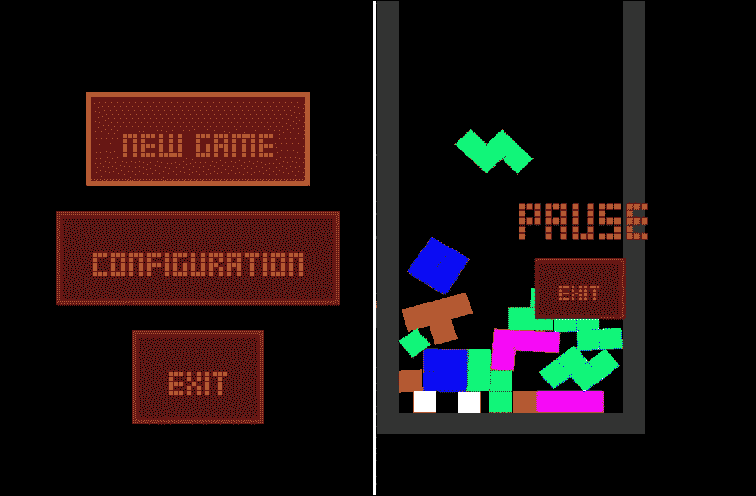
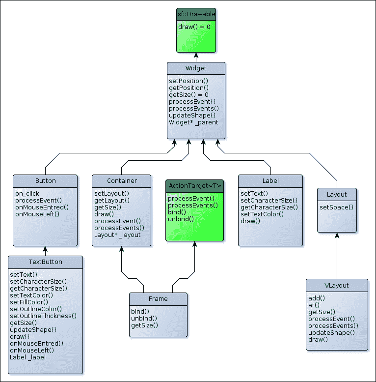
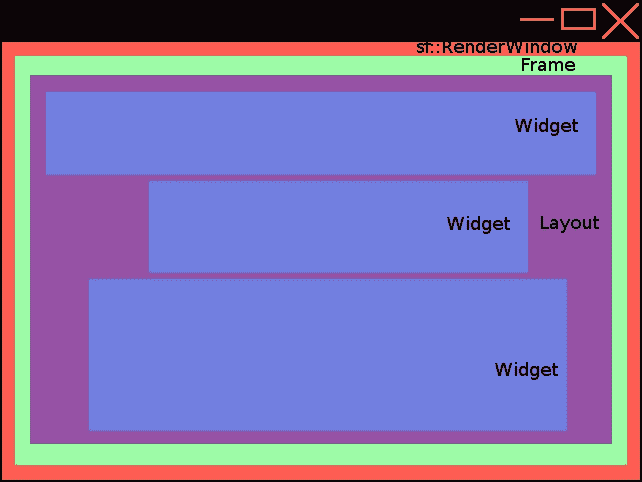
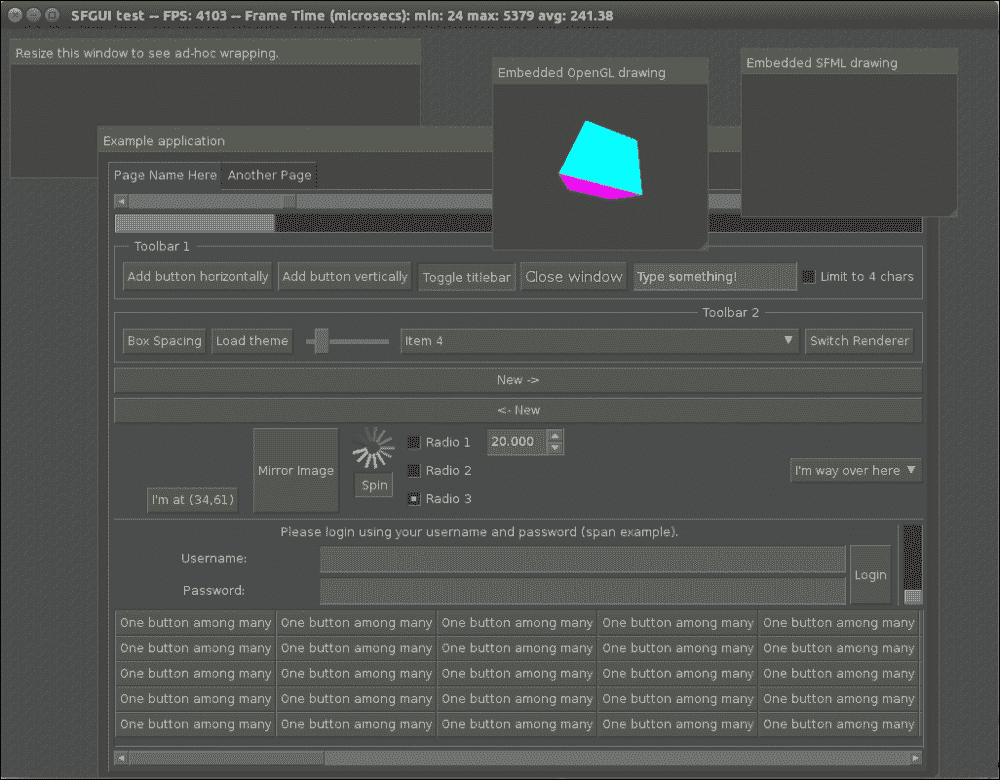
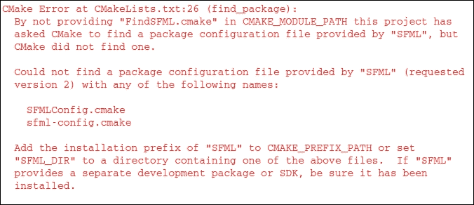
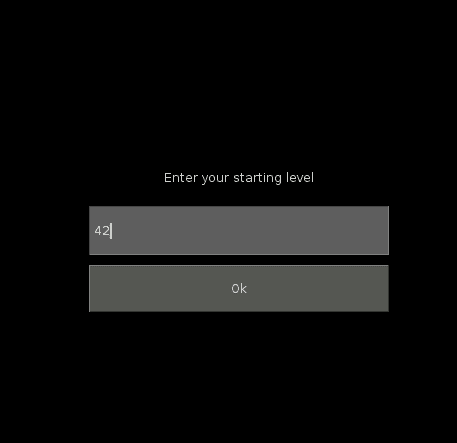

# 第五章. 与用户界面玩耍

在前面的章节中，我们学习了如何构建一些简单的游戏。本章将向您展示如何通过添加用户界面来改进这些游戏。本章将涵盖两种不同的用户界面可能性：

+   创建自己的对象

+   使用现有的库–**简单快速图形用户界面**（**SFGUI**）

到本章结束时，你应该能够创建从简单到复杂的界面与玩家进行通信。

# 什么是 GUI？

**图形用户界面**（**GUI**）是一种机制，允许用户通过图标、文本、按钮等图形对象直观地与软件进行交互。内部，GUI 处理一些事件并将它们绑定到函数，这些函数通常被称为回调。这些函数定义了程序的反应。

在 GUI 中始终存在许多不同的常见对象，例如按钮、窗口、标签和布局。我认为我不需要向你解释按钮、窗口或标签是什么，但我将简要解释布局是什么。

布局是一个不可见对象，它管理屏幕上图形对象的排列。简单来说，它的目标是通过管理它们的一部分来关注对象的大小和位置。它就像一张桌子，确保这些对象中没有一个是位于另一个之上的，并且尽可能地调整它们的大小以填充屏幕。

## 从头开始创建 GUI

现在已经介绍了 GUI 术语，我们将考虑如何使用 SFML 逐个构建它。这个 GUI 将被添加到 Gravitris 项目中，结果将与以下两个截图类似：



这些显示了游戏的开局菜单和游戏中的暂停菜单。

要构建这个 GUI，只使用了四个不同的对象：`TextButton`、`Label`、`Frame`和`VLayout`。我们现在将看看如何构建我们的代码，使其尽可能灵活，以便在需要时扩展这个 GUI。

## 类层次结构

如前所述，我们需要为 GUI 构建不同的组件。每个组件都有其独特的特性和功能，可能与其他组件略有不同。以下是这些组件的一些特性：

+   `TextButton`：这个类将代表一个按钮，当点击时可以触发“点击”事件。从图形上看，它是一个包含文本的框。

+   `Label`：这个类可以接受可以在屏幕上显示的简单文本。

+   `Frame`：这个类是一个不可见的容器，将通过布局包含一些对象。这个对象也将附加到 SFML 窗口上，并填充整个窗口。这个类还可以处理事件（例如捕获窗口的调整大小、*Esc*键的点击等）。

+   `Vlayout`：这个类的功能已经解释过了——它垂直显示对象。这个类必须能够调整它所附加的所有对象的位置。

因为我们想要构建一个可重用的 GUI 并且它需要尽可能灵活，所以我们需要比我们的 4 个类更大的视野来构建它。例如，我们应该能够轻松地添加一个容器，切换到水平布局或网格布局，使用精灵按钮等等。基本上，我们需要一个允许轻松添加新组件的层次结构。以下是一个可能的解决方案：



### 注意

在这个层次结构中，每个绿色框代表 GUI 的外部类。

在 GUI 系统中，每个组件都是一个`Widget`。这个类是所有其他组件的基础，并定义了与它们交互的通用方法。我们还定义了一些虚拟类，例如`Button`、`Container`和`Layout`。每个这些类都适配了`Widget`类，并增加了在不费太多力气的情况下扩展我们系统的可能性。例如，通过从`Layout`扩展，可以添加一个`HLayout`类。其他例子包括一些特定的按钮，如`RadioButton`和`CheckBox`，它们使用`Button`类。

在这个层次结构中，`Frame`类扩展了`ActionTarget`类。目的是能够使用`ActionTarget`的绑定方法来捕获一些事件，例如在某个窗口中工作时按下*Esc*键。

现在我们已经向你展示了这个层次结构，我们将继续实现不同的类。让我们从基础开始：`Widget`类。

### `Widget`类

如前所述，这个类是所有其他 GUI 组件的共同主干。它提供了一些具有默认行为的通用方法，这些方法可以被自定义或改进。`Widget`类不仅有一个位置并且可以被移动，而且还有在屏幕上显示的能力。看看它的头文件源码：

```cpp
class Widget : public sf::Drawable
{
  public:
  Widget(Widget* parent=nullptr);
  virtual ~Widget();

  void setPosition(const sf::Vector2f& pos);
  void setPosition(float x,float y);
  const sf::Vector2f& getPosition()const;
  virtual sf::Vector2f getSize()const = 0;

  protected:
  virtual bool processEvent(const sf::Event& event,const sf::Vector2f& parent_pos);
  virtual void processEvents(const sf::Vector2f& parent_pos);
  virtual void updateShape();

  Widget* _parent;
  sf::Vector2f _position;
};
```

这个第一个类很简单。我们定义了一个构造函数和一个虚拟析构函数。虚拟析构函数非常重要，因为 GUI 逻辑中使用了多态。然后我们在内部变量上定义了一些 getter 和 setter。小部件也可以附加到它所包含的另一个小部件上，因此我们保留了对它的引用以供更新之用。现在让我们看看实现以更好地理解：

```cpp
Widget::Widget(Widget* parent) : _parent(parent){}
Widget::~Widget(){}
void Widget::setPosition(const sf::Vector2f& pos) {_position = pos;}
void Widget::setPosition(float x,float y)
{
  _position.x = x;
  _position.y = y;
}
const sf::Vector2f& Widget::getPosition()const {return _position;}
bool Widget::processEvent(const sf::Event& event,const sf::Vector2f& parent_pos) {return false;}
void Widget::processEvents(const sf::Vector2f& parent_pos) {}
```

到目前为止，没有什么应该让你感到惊讶的。我们只定义了一些 getter/setter 和为事件处理编写了默认行为。

现在看看下面的函数：

```cpp
void Widget::updateShape()
{
  if(_parent)
  _parent->updateShape();
}
```

这个函数，与我们所看到的其他函数不同，非常重要。它的目标是通过 GUI 树传播更新请求。例如，从一个由于文本更改而改变大小的按钮，到其布局，再到容器。通过这样做，我们确保每个组件都会被更新，而无需进一步的努力。

### `Label`类

现在已经介绍了`Widget`类，让我们构建我们的第一个小部件，一个标签。这是我们能够构建的最简单的小部件。因此，我们将通过它学习 GUI 的逻辑。结果将如下所示：


为了做到这一点，我们将运行以下代码：

```cpp
class Label : public Widget
{
  public:
  Label(const std::string& text, Widget* parent=nullptr);
  virtual ~Label();

  void setText(const std::string& text);
  void setCharacterSize(unsigned int size);
  unsigned int getCharacterSize()const;
  void setTextColor(const sf::Color& color);
  virtual sf::Vector2f getSize()const override;

  private:
  sf::Text _text;
  virtual void draw(sf::RenderTarget& target, sf::RenderStates states) const override;
};
```

如您所见，这个类不过是一个围绕`sf::Text`的盒子。它定义了一些从`sf::Text` API 中提取的方法，具有完全相同的行为。它还实现了`Widget`类的要求，例如`getSize()`和`draw()`方法。现在让我们看看实现：

```cpp
Label::Label(const std::string& text, Widget* parent) : Widget(parent)
{
  _text.setFont(Configuration::fonts.get(Configuration::Fonts::Gui));
  setText(text);
  setTextColor(sf::Color(180,93,23));
}
```

构造函数从参数初始化文本，设置从`Configuration`类中获取的默认字体，并设置颜色。

```cpp
Label::~Label() {}
void Label::setText(const std::string& text)
{
  _text.setString(text);
  updateShape();
}
void Label::setCharacterSize(unsigned int size)
{
  _text.setCharacterSize(size);
  updateShape();
}
```

这两个函数将任务转发给`sf::Text`，并请求更新，因为可能发生大小的变化。

```cpp
unsigned int Label::getCharacterSize()const {return _text.getCharacterSize();}

void Label::setTextColor(const sf::Color& color) {_text.setColor(color);}

sf::Vector2f Label::getSize()const
{
  sf::FloatRect rect = _text.getGlobalBounds();
  return sf::Vector2f(rect.width,rect.height);
}
```

SFML 已经提供了一个函数来获取`sf::Text`参数的大小，所以我们使用它并将结果转换为预期的值，如下面的代码片段所示：

```cpp
void Label::draw(sf::RenderTarget& target, sf::RenderStates states) const
{
  states.transform.translate(_position);
  target.draw(_text,states);
}
```

此函数很简单，但我们需要理解它。每个小部件都有自己的位置，但相对于父元素。因此，当我们显示对象时，我们需要通过平移变换矩阵的相对位置来更新`sf::RenderStates`参数，然后绘制所有需要的元素。这很简单，但很重要。

### 按钮类

现在，我们将构建另一个非常有用的`Widget`类：`Button`类。这个类将是一个虚拟类，因为我们希望能够构建多个按钮类。但是，所有按钮类都有一些共享的函数，例如“点击”事件。因此，这个类的目标是分组它们。看看这个类的头文件：

```cpp
class Button : public Widget
{
  public:
  using FuncType = std::function<void(const sf::Event& event,Button& self)>;
  static FuncType defaultFunc;
  Button(Widget* parent=nullptr);

  virtual ~Button();
  FuncType onClick;

  protected:
  virtual bool processEvent(const sf::Event& event,const sf::Vector2f& parent_pos)override;
  virtual void onMouseEntered();
  virtual void onMouseLeft();

  private:
  enum Status {None =0,Hover = 1};
  int _status;
};
```

如同往常，我们声明构造函数和析构函数。我们还声明了一个`onClick`属性，它是一个`std::function`，当按钮被按下时会触发。这是我们的回调。回调类型被保留为`typedef`，我们还声明了一个默认的空函数以方便使用。现在，让我们看看实现：

```cpp
Button::FuncType Button::defaultFunc = [](const sf::Event&,Button&)->void{};
```

在以下代码片段的帮助下，我们声明了一个空函数，该函数将用作`onClick`属性的默认值。此函数不执行任何操作：

```cpp
Button::Button(Widget* parent) : Widget(parent), onClick(defaultFunc), _status(Status::None) {}
```

我们构建了一个构造函数，它将其参数转发给其父类，并将`onClick`值设置为之前定义的默认空函数，以避免当用户未初始化回调时出现未定义的性能，如下面的代码片段所示：

```cpp
Button::~Button() {}
bool Button::processEvent(const sf::Event& event,const 
sf::Vector2f& parent_pos)
{
  bool res = false;
  if(event.type == sf::Event::MouseButtonReleased)
  {
    const sf::Vector2f pos = _position + parent_pos;
    const sf::Vector2f size = getSize();
    sf::FloatRect rect;
    rect.left = pos.x;
    rect.top = pos.y;
    rect.width = size.x;
    rect.height = size.y;
    if(rect.contains(event.mouseButton.x,event.mouseButton.y)) 
{
      onClick(event,*this);
        res = true;
    }
  } else if (event.type == sf::Event::MouseMoved) {
    const sf::Vector2f pos = _position + parent_pos;
    const sf::Vector2f size = getSize();
    sf::FloatRect rect;
    rect.left = pos.x;
    rect.top = pos.y;
    rect.width = size.x;
    rect.height = size.y;
    int old_status = _status;
    _status = Status::None;
    const sf::Vector2f 
    mouse_pos(event.mouseMove.x,event.mouseMove.y);
    if(rect.contains(mouse_pos))
      _status=Status::Hover;
    if((old_status & Status::Hover) and not (_status & 
      Status::Hover))
        onMouseLeft();
    else if(not (old_status & Status::Hover) and (_status & 
      Status::Hover))
        onMouseEntered();
  }
  return res;
}
```

这个函数是我们类的心脏。它通过在满足某些标准时触发一些回调来管理事件。让我们一步一步地看看它：

1.  如果作为参数接收的事件是点击，我们必须检查它是否发生在按钮区域内。如果是这样，我们将触发我们的`onClick`函数。

1.  另一方面，如果事件是由指针移动引起的，我们验证鼠标指针是否悬停在按钮上。如果是这样，我们将状态值设置为`Hover`，这里有一个技巧：

1.  如果这个标志刚刚被定义为`Hover`，那么我们将调用`onMouseEntered()`方法，这个方法是可以定制的。

1.  如果标志之前被定义为`Hover`但现在不再设置为它，那是因为鼠标离开了按钮的区域，所以我们调用另一个方法：`onMouseLeft()`。

### 注意

如果`processEvent()`方法返回的值设置为`true`，它将停止在 GUI 上事件的传播。返回`false`将继续事件的传播；例如，在鼠标移动时，也可以使用不停止事件传播的事件；但在这个情况下，我们简单地不能同时点击多个小部件对象，所以如果需要，我们将停止。

我希望`processEvent()`函数的逻辑是清晰的，因为我们的 GUI 逻辑基于它。

以下两个函数是带有鼠标移动事件的按钮的默认空行为。当然，我们将在专门的`Button`类中自定义它们：

```cpp
void Button::onMouseEntered() {}
void Button::onMouseLeft() {}
```

### 文本按钮类

这个类将扩展我们之前定义的`Button`类。结果将在屏幕上显示一个带有文本的矩形，就像以下截图所示：


现在看看实现。记住，我们的`Button`类是从`sf::Drawable`扩展而来的：

```cpp
class TextButton : public
{
  public:
  TextButton(const std::string& text, Widget* parent=nullptr);
  virtual ~TextButton();

  void setText(const std::string& text);
  void setCharacterSize(unsigned int size);

  void setTextColor(const sf::Color& color);
  void setFillColor(const sf::Color& color);
  void setOutlineColor(const sf::Color& color);
  void setOutlineThickness(float thickness);
  virtual sf::Vector2f getSize()const override;

  private:
  sf::RectangleShape _shape;
  Label _label;
  void updateShape()override;
  virtual void draw(sf::RenderTarget& target, sf::RenderStates states) const override;
  sf::Color _fillColor;
  sf::Color _outlineColor;
  virtual void onMouseEntered()override;
  virtual void onMouseLeft()override;
};
```

这个类扩展了`Button`类，并为其添加了一个矩形形状和标签。它还实现了`onMouseEntered()`和`onMouseLeft()`函数。这两个函数将改变按钮的颜色，使其稍微亮一些：

```cpp
TextButton::TextButton(const std::string& text,Widget* parent) : Button(parent), _label(text,this)
{
  setFillColor(sf::Color(86,20,19));
  setOutlineThickness(5);
  setOutlineColor(sf::Color(146,20,19));
}
```

构造函数初始化不同的颜色和初始文本：

```cpp
TextButton::~TextButton() {}
void TextButton::setText(const std::string& text) {_label.setText(text);}
void TextButton::setCharacterSize(unsigned int size) {_label.setCharacterSize(size);}
void TextButton::setTextColor(const sf::Color& color) {_label.setTextColor(color);}

void TextButton::setFillColor(const sf::Color& color)
{
  _fillColor = color;
  _shape.setFillColor(_fillColor);
}

void TextButton::setOutlineColor(const sf::Color& color)
{
  _outlineColor = color;
  _shape.setOutlineColor(_outlineColor);
}

void TextButton::setOutlineThickness(float thickness) {_shape.setOutlineThickness(thickness);}

sf::Vector2f TextButton::getSize()const
{
  sf::FloatRect rect = _shape.getGlobalBounds();
  return sf::Vector2f(rect.width,rect.height);
}
```

所有这些函数通过转发任务来设置不同的属性。它还调用`updateShape()`方法来更新容器：

```cpp
void TextButton::updateShape()
{
  sf::Vector2f label_size = _label.getSize();
  unsigned int char_size = _label.getCharacterSize();
  _shape.setSize(sf::Vector2f(char_size*2 + label_size.x ,char_size*2 + label_size.y));
  _label.setPosition(char_size,char_size);
  Widget::updateShape();
}
```

以下函数通过使用内部标签的大小来调整形状，并添加一些填充来更新形状：

```cpp
void TextButton::draw(sf::RenderTarget& target, sf::RenderStates states) const
{
  states.transform.translate(_position);
  target.draw(_shape,states);
  target.draw(_label,states);
}
```

这个方法与标签的逻辑相同。它将`sf::RenderStates`移动到按钮的位置，并绘制所有不同的`sf::Drawable`参数：

```cpp
void TextButton::onMouseEntered()
{
  const float light = 1.4f;
  _shape.setOutlineColor(sf::Color(_outlineColor.r*light,
  _outlineColor.g*light,
  _outlineColor.b*light));
  _shape.setFillColor(sf::Color(_fillColor.r*light,
  _fillColor.b*light,
  _fillColor.b*light));
}

void TextButton::onMouseLeft()
{
  _shape.setOutlineColor(_outlineColor);
  _shape.setFillColor(_fillColor);
}
```

这两个函数在鼠标悬停在按钮上时改变按钮的颜色，并在鼠标离开时重置初始颜色。这对用户来说很有用，因为他可以很容易地知道哪个按钮将被点击。

如您所见，`TextButton`的实现相当简短，这都要归功于父类`Button`和`Widget`所做的更改。

### 容器类

这个类是另一种类型的`Widget`，将是抽象的。`Container`类是一个`Widget`类，将通过`Layout`类存储其他小部件。这个类的目的是将不同可能的`Container`类之间的所有常见操作分组，即使在我们只实现了`Frame`容器的情况下。

```cpp
class Container  : public Widget
{
  public:
  Container(Widget* parent=nullptr);
  virtual ~Container();

  void setLayout(Layout* layout);
  Layout* getLayout()const;

  virtual sf::Vector2f getSize()const override;

  protected:
  virtual void draw(sf::RenderTarget& target, sf::RenderStates states) const override;
  virtual bool processEvent(const sf::Event& event,const sf::Vector2f& parent_pos)override;
  virtual void processEvents(const sf::Vector2f& parent_pos)override;

  private:
  Layout* _layout;
};
```

如同往常，我们定义了构造函数和析构函数。我们还添加了对内部`Layout`类的访问器。我们还将实现`draw()`方法和事件处理。现在看看以下代码片段中的实现：

```cpp
Container::Container(Widget* parent) : Widget(parent), _layout(nullptr) {}
Container::~Container()
{
  if(_layout != nullptr and _layout->_parent == this) {
    _layout->_parent = nullptr;
    delete _layout;
  }
}
```

析构函数会删除内部的`Layout`类，但仅当`Layout`类的父类是当前容器时才会这样做。这避免了双重释放的损坏，并尊重了 RAII 习语：

```cpp
void Container::setLayout(Layout* layout)
{
  if(_layout != nullptr and _layout->_parent == this) {
    _layout->_parent = nullptr;
  }
  if((_layout = layout) != nullptr) {
    _layout->_parent = this;
    _layout->updateShape();
  }
}
```

前一个函数设置容器的布局，并在需要时将其从内存中删除。然后它接管新的布局的所有权，并更新对它的内部指针。

```cpp
Layout* Container::getLayout()const {return _layout;}
sf::Vector2f Container::getSize()const
{
  sf::Vector2f res(0,0);
  if(_layout)
  res = _layout->getSize();
  return res;
}
void Container::draw(sf::RenderTarget& target, sf::RenderStates states) const
{
  if(_layout)
  target.draw(*_layout,states);
}
```

前三个函数执行通常的工作，就像其他`Widgets`一样：

```cpp
bool Container::processEvent(const sf::Event& event,const sf::Vector2f& parent_pos)
{
    bool res = false;
    if(and _layout)
        res = _layout->processEvent(event,parent_pos);
    return res;
}
void Container::processEvents(const sf::Vector2f& parent_pos)
{
    if(_layout)
        _layout->processEvents(parent_pos);
}
```

这两个之前的函数处理事件。因为`Layout`类没有要处理的事件，它将任务转发给所有内部的`Widget`类。如果一个`Widget`类处理了事件，我们就停止传播，因为从逻辑上讲，没有其他控件应该能够处理它。

### `Frame`类

现在基本容器已经构建完成，让我们用特殊的一个来扩展它。下面的`Widget`类将附加到`sf::RenderWindow`上，并成为主要的控件。它将自行管理渲染目标和事件。看看它的头文件：

```cpp
class Frame : public Container, protected ActionTarget<int>
{
  public:
  using ActionTarget<int>::FuncType;
  Frame(sf::RenderWindow& window);
  virtual ~Frame();

  void processEvents();
  bool processEvent(const sf::Event& event);

  void bind(int key,const FuncType& callback);
  void unbind(int key);

  void draw();
  virtual sf::Vector2f getSize()const override;

  private:
  sf::RenderWindow& _window;

  virtual bool processEvent(const sf::Event& event,const sf::Vector2f& parent_pos)override;
  virtual void processEvents(const sf::Vector2f& parent_pos)override;
};
```

正如你所见，这个类比之前的`Widget`类要复杂一些。它扩展了`Container`类，以便能够将其附加到`Layout`类上。此外，它还扩展了`ActionTarget`类，但作为受保护的。这是一个重要的点。实际上，我们希望允许用户绑定/解绑事件，但不想允许他们将`Frame`强制转换为`ActionTarget`，所以我们将其隐藏给用户，并重写`ActionTarget`类的所有方法。这就是为什么有受保护关键字的原因。

这个类还将能够从其父窗口中提取事件；这解释了为什么我们需要保留对其的引用，如下所示：

```cpp
Frame::Frame(sf::RenderWindow& window) : Container(nullptr), ActionTarget(Configuration::gui_inputs), _window(window) {}
Frame::~Frame(){}

void Frame::draw() {_window.draw(*this);}

void Frame::bind(int key,const FuncType& callback) {ActionTarget::bind(key,callback);}

void Frame::unbind(int key) {ActionTarget::unbind(key);}

sf::Vector2f Frame::getSize()const
{
  sf::Vector2u size = _window.getSize();
  return sf::Vector2f(size.x,size.y);
}
```

所有这些方法都很简单，不需要很多解释。你只需使用构造函数初始化所有属性，并将任务转发给存储在类内部的属性，就像这里所做的那样：

```cpp
void Frame::processEvents()
{
    sf::Vector2f parent_pos(0,0);
    processEvents(parent_pos);
}
bool Frame::processEvent(const sf::Event& event)
{
    sf::Vector2f parent_pos(0,0);
    return processEvent(event,parent_pos);
}
```

这两个重载函数暴露给用户。它通过构造缺失的或已知的参数将任务转发给从`Widget`继承的覆盖函数。

```cpp
bool Frame::processEvent(const sf::Event& event,const sf::Vector2f& parent_pos)
{
  bool res = ActionTarget::processEvent(event);
  if(not res)
  res = Container::processEvent(event,parent_pos);
  return res;
}

void Frame::processEvents(const sf::Vector2f& parent_pos)
{
  ActionTarget::processEvents();
  Container::processEvents(parent_pos);
  sf::Event event;
  while(_window.pollEvent(event))
  Container::processEvent(event,parent_pos);
}
```

另一方面，这两个函数处理类的`ActionTarget`和`Container`基类的事件管理，同时也负责从父窗口轮询事件。在这种情况下，所有事件管理都将自动进行。

`Frame`类现在已经结束。正如你所见，这并不是一个复杂的任务，多亏了我们的分层树和代码的重用。

### `Layout`类

现在所有将在屏幕上渲染的控件都正在构建，让我们构建一个负责它们排列的类：

```cpp
class Layout : protected Widget
{
  public:
  Layout(Widget* parent=nullptr);
  virtual ~Layout();

  void setSpace(float pixels);

  protected:
  friend class Container;
  float _space;
};
```

如您所见，抽象类非常简单。唯一的新特性是能够设置间距。我们没有 `add(Widget*)` 方法，例如。原因是根据使用的 `Layout` 类型，参数会有所不同。例如，对于只有单列或单行的布局，我们只需要一个 `Widget` 类作为参数，但对于网格来说，情况完全不同。我们需要两个其他整数来表示小部件可以放置的单元格。因此，这里没有设计通用的 API。您将看到，这个类的实现也非常简单，不需要任何解释。它遵循我们之前创建的 `Widget` 类的逻辑。

```cpp
Layout::Layout(Widget* parent): Widget(parent), _space(5) {}

Layout::~Layout() {}
void Layout::setSpace(float pixels)
{
    if(pixels >= 0) {
        _space = pixels;
        updateShape();
    }
    else
        throw std::invalid_argument("pixel value must be >= 0");
}
```

### VLayout 类

这个 `Layout` 类将比之前的类更复杂。这个类包含了垂直布局的完整实现，它自动调整其大小和所有内部对象的对齐方式：

```cpp
class VLayout : public Layout
{
  public:
  VLayout(const VLayout&) = delete;
  VLayout& operator=(const VLayout&) = delete;
  VLayout(Widget* parent = nullptr);
  ~Vlayout();

  void add(Widget* widget);
  Widget* at(unsigned int index)const;
  virtual sf::Vector2f getSize()const override;

  protected:
  virtual bool processEvent(const sf::Event& event,const sf::Vector2f& parent_pos) override;
  virtual void processEvents(const sf::Vector2f& parent_pos) override;

  private:
  std::vector<Widget*> _widgets;
  virtual void updateShape() override;
  virtual void draw(sf::RenderTarget& target, sf::RenderStates states) const override;
};
```

这个类将实现所有来自小部件的要求，并添加在其中添加小部件的功能。因此，有一些函数需要实现。为了跟踪附加到 `Layout` 类的小部件，我们将在内部将它们存储在一个容器中。选择 `std::vector` 类在这里是有意义的，因为元素可以通过 `at()` 方法进行随机访问，并且通过容器进行大量访问。所以选择的原因仅仅是性能，因为 `std::list` 也能完成同样的工作。现在，让我们看看实现：

```cpp
VLayout::VLayout(Widget* parent) : Layout(parent) {}
VLayout::~VLayout()
{
    for(Widget* widget : _widgets) {
        if(widget->_parent == this)
            delete widget;
    }
}
```

析构函数将释放与 `Layout` 类关联的对象的内存，其标准与在 `Container` 类中解释的标准相同：

```cpp
void VLayout::add(Widget* widget)
{
  widget->_parent = this;
  _widgets.emplace_back(widget);
  updateShape();
}
Widget* VLayout::at(unsigned int index)const {return _widgets.at(index);}
```

这两个之前的功能添加了添加和获取由类实例存储的小部件的可能性。`add()` 方法还额外承担了添加对象的拥有权：

```cpp
sf::Vector2f VLayout::getSize()const
{
  float max_x = 0;
  float y = 0;
  for(Widget* widget : _widgets)
  {
    sf::Vector2f size = widget->getSize();
    if(size.x > max_x)
    max_x = size.x;
    y+= _space + size.y;
  }
  return sf::Vector2f(max_x+_space*2,y+_space);
}
```

这个方法计算布局的总大小，考虑到间距。因为我们的类将在单列中显示所有对象，所以高度将是它们的总大小，宽度是所有对象的最大值。每次都必须考虑间距。

```cpp
bool VLayout::processEvent(const sf::Event& event,const sf::Vector2f& parent_pos)
{
  for(Widget* widget : _widgets) 
{
    if(widget->processEvent(event,parent_pos))
    return true;
  }
    return false ;
}

void VLayout::processEvents(const sf::Vector2f& parent_pos)
{
  for(Widget* widget : _widgets)
  widget->processEvents(parent_pos);
}
```

这两个之前的方法将任务转发给所有存储的小部件，但在需要时我们会停止传播。

```cpp
void VLayout::updateShape()
{
  float max_x = (_parentparent->getSize().x:0);
  for(Widget* widget : _widgets) {
  sf::Vector2f size = widget->getSize();
  float widget_x = size.x;
  if(widget_x > max_x)
  max_x = widget_x;
}
  float pos_y = _space;
  if(_parent)
  pos_y = (_parent->getSize().y - getSize().y)/2.f;
  for(Widget* widget : _widgets) 
{
    sf::Vector2f size = widget->getSize();
    widget->setPosition((max_x-size.x)/2.0,pos_y);
    pos_y += size.y + _space;
  }
  Widget::updateShape();
}
```

这个方法对这个类来说是最重要的。它通过基于所有其他小部件来计算，重置所有对象的不同位置。最终结果将是一个垂直和水平居中的小部件列。

```cpp
void VLayout::draw(sf::RenderTarget& target, sf::RenderStates states) const
{
  for(Widget* widget : _widgets)
  target.draw(*widget,states);
}
```

这个最后的函数要求每个 `Widget` 通过传递参数来渲染自己。这次，我们不需要翻译状态，因为布局的位置与其父级相同。

整个类现在已经构建并解释完毕。现在是用户使用它们并为我们的游戏添加菜单的时候了。

# 为游戏添加菜单

现在我们已经准备好所有构建基本菜单的组件，让我们用我们的新 GUI 来实现它。我们将构建两个菜单。一个是主要的游戏开启菜单，另一个是暂停菜单。这将展示我们实际 GUI 的不同使用可能性。

如果你已经很好地理解了我们到目前为止所做的一切，你会注意到我们 GUI 的基础组件是`Frame`。所有其他小部件都将显示在其顶部。以下是一个总结 GUI 树结构的图示：



每种颜色代表不同类型的组件。树干是**sf::RenderWindow**，然后我们有一个附加到其上的**Frame**及其**Layout**。最后，我们有一些不同的**Widget**。现在使用方法已经解释清楚，让我们创建我们的主菜单。

## 构建主菜单

为了构建主菜单，我们需要向`Game`类添加一个属性。让我们称它为`_mainMenu`。

```cpp
gui::Frame _mainMenu;
```

我们然后创建一个`enum`函数，其中包含不同的值可能性，以便知道当前显示的状态：

```cpp
enum Status {StatusMainMenu,StatusGame,StatusConfiguration,StatusPaused,StatusExit} _status
```

现在让我们创建一个初始化菜单的函数：

```cpp
void initGui();
```

此函数将存储整个 GUI 构建过程，除了调用构造函数之外。现在我们已经将所有需要的内容放入头文件中，让我们继续实现所有这些功能。

首先，我们需要通过添加`_mainMenu`和`_status`的初始化来更新构造函数。它应该看起来像这样：

```cpp
Game::Game(int X, int Y,int word_x,int word_y) : ActionTarget(Configuration::player_inputs), 
_window(sf::VideoMode(X,Y),"05_Gui"), _current_piece(nullptr), 
_world(word_x,word_y), _mainMenu(_window), 
_status(Status::StatusMainMenu)
{
  //...
  initGui();
}
```

现在我们需要按照以下方式实现`initGui()`函数：

```cpp
void Game::initGui()
{
  book::gui::VLayout* layout = new book::gui::VLayout;
  layout->setSpace(25);
  book::gui::TextButton* newGame = new book::gui::TextButton("New Game");
  newGame->onClick = this{
  initGame();
  _status = Status::StatusGame;
};

layout->add(newGame);
book::gui::TextButton* configuration = new book::gui::TextButton("Configuration");
configuration->onClick = this{
  _status = Status::StatusConfiguration;
};

layout->add(configuration);
book::gui::TextButton* exit = new book::gui::TextButton("Exit");
exit->onClick = this{
  _window.close();
};
layout->add(exit);
_mainMenu.setLayout(layout);
_mainMenu.bind(Configuration::GuiInputs::Escape,this{
    this->_window.close();
  });
}
```

让我们一步一步地讨论这个函数：

1.  我们创建了一个`Vlayout`类并设置了其间距。

1.  我们创建了一个按钮，其标签为`New Game`。

1.  我们设置了初始化游戏的`onClick`回调函数。

1.  我们将按钮添加到布局中。

1.  使用相同的逻辑，我们创建了两个其他按钮，具有不同的回调函数。

1.  然后将布局设置到`_mainMenu`参数。

1.  最后，我们向框架中添加一个事件，该事件将处理*Esc*键。这个键在`Configuration`类中定义的`GuiInputs enum`中，该类是作为`PlayerInputs`构建的。

现在我们已经创建了菜单，我们需要对现有的`run()`、`processEvents()`和`render()`方法进行一些小的修改。让我们从`run()`开始。这次修改微乎其微。实际上，我们只需要添加一个调用更新方法的条件，对`_status`变量进行验证。新的一行如下：

```cpp
if(_status == StatusGame and not _stats.isGameOver())
```

下一个函数是`processEvents()`，它需要一些更多的修改，但并不多。实际上，我们需要在游戏处于`StatusMainMenu`模式时调用`_mainMenu::processEvent(const f::Event&)`和`_mainMenu::processEvents()`。新的方法如下：

```cpp
void Game::processEvents()
{
  sf::Event event;
  while(_window.pollEvent(event))
  {
    if (event.type == sf::Event::Closed)
    _window.close();
    else if (event.type == sf::Event::KeyPressed and event.key.code == sf::Keyboard::Escape and _status == Status::StatusGame)
    _status = StatusPaused;
    else
    {
      switch(_status)
      {
        case StatusMainMenu: _mainMenu.processEvent(event);break;
        case StatusGame : ActionTarget::processEvent(event);break;
        default : break;
      }
    }
  }
  switch(_status)
  {
    case StatusMainMenu: _mainMenu.processEvents();break;
    case StatusGame :  ActionTarget::processEvents();break;
    default : break;
  }
}
```

如你所见，修改并不复杂，易于理解。

现在，`render()`方法的最后一个修改。逻辑相同，根据`_status`值进行切换。

```cpp
void Game::render()
{
  _window.clear();
  switch(_status)
  {
    case StatusMainMenu: _window.draw(_mainMenu);break;
    case StatusGame :
    {
if(not _stats.isGameOver())
  _window.draw(_world);
  _window.draw(_stats);
    }break;
    default : break;
  }
_window.display();
}
```

如您所见，我们能够轻松地为我们游戏添加一个菜单。结果应该像这里显示的图示一样：


现在，让我们构建第二个菜单。

## 构建暂停菜单

暂停菜单将像之前的一个一样构建，所以我将跳过构造函数部分，直接进入 `initGui()` 函数：

```cpp
void Game::initGui()
{
  //...
  book::gui::VLayout* layout = new book::gui::VLayout;
  layout->setSpace(50);
  book::gui::Label* pause = new book::gui::Label("Pause");
  pause->setCharacterSize(70);
  layout->add(pause);
  book::gui::TextButton* exit = new book::gui::TextButton("Exit");
  exit->onClick = this
  {
    _status = StatusMainMenu;
  };

  layout->add(exit);
  _pauseMenu.setLayout(layout);
  _pauseMenu.bind(Configuration::GuiInputs::Escape,this{
  _status = StatusGame;
  });
}
```

逻辑与之前菜单使用的逻辑完全相同，但这里我们使用了一个 `Label` 和 `TextButton` 类。按钮的回调也将更改 `_status` 值。在这里，我们再次捕获 *Esc* 键。结果是离开这个菜单。在 `processEvents()` 中，我们只需要在第一个 switch 语句中添加一行：

```cpp
case StatusPaused :_pauseMenu.processEvent(event);break;
```

并在第二个 switch 语句中添加另一行：

```cpp
case StatusPaused : _pauseMenu.processEvents();break;
```

就这样。我们完成了这个函数。

下一步是 `render()` 函数。在这里，它也将非常快。我们在 switch 语句中添加一个 case，如下所示：

```cpp
case StatusPaused :
{
    if(not _stats.isGameOver())
        _window.draw(_world);
    _window.draw(_pauseMenu);
}break;
```

请求绘制 `_world` 意味着在菜单的背景上设置当前游戏状态。这没什么用，但很酷，为什么不试试呢？

最终结果是本章开头显示的第二张截图。看看我屏幕上显示的内容：


## 构建配置菜单

实际上，这个菜单将在第二部分（使用 SFGUI）中实现，但我们需要一个退出配置菜单的方法。因此，我们只需创建一个 `_configurationMenu` 作为另外两个一样，并将 `Escape` 事件绑定到设置为主菜单的状态。下面是 `initGui()` 中需要添加的代码：

```cpp
_configurationMenu.bind(Configuration::GuiInputs::Escape,this{
    _status = StatusMainMenu;
});
```

我相信您现在能够使用您的新技能自己更新 `processEvents()` 和 `render()` 函数。

关于我们自制的 GUI 的内容就到这里。当然，您可以按需改进它。这是它的一个优点。

### 提示

如果您对改进感兴趣，请查看外部库 [`github.com/Krozark/SFML-utils/`](http://github.com/Krozark/SFML-utils/)，它将所有自定义游戏框架重新组合。

下一步是使用一个已经制作好的具有更复杂控件的 GUI。但请记住，如果您只需要显示像这里展示的菜单，这个 GUI 就足够了。

# 使用 SFGUI

SFGUI 是一个开源库，它基于 SFML 实现了一个完整的 GUI 系统。其目标是提供丰富的控件，并且易于自定义和扩展。它还使用了现代 C++，因此在任何 SFML 项目中使用它都很容易，无需太多努力。

以下截图显示了 SFGUI 与提供的源代码中的测试示例一起运行的情况：



## 安装 SFGUI

第一步是下载源代码。你可以在库的官方网站上找到它：[`sfgui.sfml-dev.de/`](http://sfgui.sfml-dev.de/)。当前版本是 0.2.3（2014 年 2 月 20 日）。你需要自己构建 SFGUI，但像往常一样，它附带 `cmake` 文件来帮助构建。这很完美，因为我们已经知道如何使用它。

在构建步骤中，有时你可能会遇到如下截图所示的问题：



在这种情况下，你必须使用 `add entry` 参数将 `CMAKE_MODULE_PATH` 变量设置为 `/path/to/SFML/cmake/Modules`。这应该可以解决问题。

### 注意

对于其他类似的问题，请查看这个页面：[`sfgui.sfml-dev.de/p/faq#findsfml`](http://sfgui.sfml-dev.de/p/faq#findsfml)。这应该会有所帮助。

现在 SFGUI 已经配置好了，你需要构建它，并最终像 SFML 和 Box2D 一样安装它。你现在应该已经很熟悉这个过程了。

## 使用 SFGUI 的特性

在这本书中，我不会深入探讨 SFGUI 的使用。目标是向你展示，当已经有现成的好方案时，你不必总是需要重新发明轮子。

SFGUI 使用了许多 C++11 特性，例如 `shared_pointers`、`std::functions` 以及本书中已经介绍的一些其他特性，并且还使用了 RAII 习惯用法。既然你已经知道如何使用这些特性，那么在使用 SFGUI 时，你不会感到迷茫。

首先，要使用 SFGUI 对象，你必须先实例化一个对象，然后再实例化其他所有对象：`sfg::SFGUI`。这个类包含了渲染所需的所有信息。除了这个点之外，库可以像我们的一样使用。所以让我们试试吧。

## 构建起始级别

我们将在游戏中添加一个菜单，允许我们选择起始级别。本节的目标是添加一个简单的表单，它接受一个数字作为参数并将其设置为游戏的起始级别。最终结果将如下所示：



在开始使用 SFGUI 之前，我们需要更新我们的 `Stats` 类。实际上，这个类不允许我们从特定级别开始，所以我们需要添加这个功能。这可以通过向其中添加一个新属性来完成，如下所示：

```cpp
unsigned int _initialLvl;
```

我们还需要一个新的方法：

```cpp
void setLevel(int lvl);
```

标题部分就到这里。现在我们需要将 `_initialLvl` 初始化为默认的 `0`。然后更改 `addLines()` 函数中当前级别的计算。为此，请转到以下行：

```cpp
_nbLvl = _nbRows / 10;
```

将前面的行更改为以下行：

```cpp
_nbLvl = _initialLvl + (_nbRows / 10);
```

最后，我们需要更新或实现当前级别的评估器，如下所示：

```cpp
void Stats::setLevel(int lvl)
{
  _initialLvl = lvl;
  _textLvl.setString("lvl : "+std::to_string(lvl));
}

int Stats::getLevel()const
{
  return _initialLvl + _nbLvl;
}
```

这个类更新的内容就到这里。现在让我们回到 SFGUI。

我们将只使用三个不同的视觉对象来构建所需表单：标签、文本输入和按钮。但我们也会使用布局和桌面，这相当于我们的 `Frame` 类。所有初始化都将像之前一样在 `initGui()` 函数中完成。

我们还需要为我们的游戏添加两个新的属性：

```cpp
sfg::SFGUI _sfgui;
sfg::Desktop _sfgDesktop;
```

添加 `_sfgui` 的原因之前已经解释过了。我们添加 `_sfDesktop` 的原因与添加 `Frame` 来包含对象的原因完全相同。

现在看看创建表单所需的代码：

```cpp
void Game::initGui()
{
  //...
  auto title = sfg::Label::Create("Enter your starting level");
  auto level = sfg::Entry::Create();
  auto error = sfg::Label::Create();
  auto button = sfg::Button::Create( "Ok" );
  button->GetSignal( sfg::Button::OnLeftClick ).Connect(
    [level,error,this](){
      int lvl = 0;
      std::stringstream sstr(static_cast<std::string>(level->GetText()));
      sstr >> lvl;
      if(lvl < 1 or lvl > 100)
      error->SetText("Enter a number from 1 to 100.");
      else
      {
        error->SetText("");
        initGame();
        _stats.setLevel(lvl);
        _status = Status::StatusGame;
      }
    }
  );

  auto table = sfg::Table::Create();
  table->SetRowSpacings(10);
  table->Attach(title,sf::Rect<sf::Uint32>(0,0,1,1));
  table->Attach(level,sf::Rect<sf::Uint32>(0,1,1,1));
  table->Attach(button,sf::Rect<sf::Uint32>(0,2,1,1));
  table->Attach(error,sf::Rect<sf::Uint32>(0,3,1,1));
  table->SetAllocation(sf::FloatRect((_window.getSize().x-300)/2,
  (_window.getSize().y-200)/2,
  300,200));
  _sfgDesktop.Add(table);
}
```

好吧，这里有很多新功能，所以我将一步一步地解释它们：

1.  首先，我们创建这个表单所需的不同组件。

1.  然后，我们将按钮的回调设置为按下事件。这个回调执行了很多事情：

    +   我们获取用户输入的文本。

    +   我们使用 `std::stringstream` 将此文本转换为整数。

    +   我们检查输入的有效性。

    +   如果输入无效，我们将显示错误信息。

    +   另一方面，如果它是有效的，我们将重置游戏，设置起始关卡，并开始游戏。

1.  在所有对象创建完成之前，我们将它们逐个添加到布局中。

1.  我们更改了布局的大小并将其居中显示在窗口中。

1.  最后，我们将布局附加到桌面上。

由于所有对象都已创建并存储到 `std::shared_` 中，我们不需要跟踪它们。SFGUI 会为我们做这件事。

现在表单已经创建，我们面临与 GUI 相同的挑战：事件和渲染。好消息是，逻辑是相同的！然而，我们确实需要再次编写 `processEvents()` 和 `render()` 函数。

在 `processEvents()` 方法中，我们只需要完成以下代码片段中显示的第一个 switch 即可：

```cpp
case StatusConfiguration :
{
  _configurationMenu.processEvent(event);
  _sfgDesktop.HandleEvent(event);
}break;
```

如你所见，逻辑与我们的 GUI 相同，所以推理是清晰的。

最后，是渲染。在这里，同样，我们需要使用以下代码片段来完成 switch：

```cpp
case StatusConfiguration:
{
  _sfgDesktop.Update(0.0);
  _sfgui.Display(_window);
  _window.draw(_configurationMenu);
}break;
```

新的是 `Update()` 调用。这是用于动画的。由于在我们的案例中我们没有动画，我们可以将参数设置为 `0`。这是一个好的实践，将其添加到 `Game::update()` 函数中，但对于我们的需求来说是可以的——它也避免了变化。

现在你应该能够使用这个新的表单在配置菜单中使用了。

当然，在这个例子中，我只是向你展示了一小部分 SFGUI。它包含了许多更多功能，如果你感兴趣，我建议你查看库的文档和示例。这非常有趣。

# 摘要

恭喜你，你现在已经完成了这一章节，并且获得了以良好的方式与玩家沟通的能力。你现在能够创建一些按钮，使用标签，并为用户设置的事件触发器添加回调函数。你还了解了创建自己的 GUI 和使用 SFGUI 的基本知识。

在下一章中，我们将学习如何通过使用多个线程来充分利用 CPU 的强大功能，并了解它在游戏编程中的影响。
