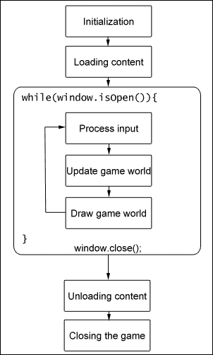
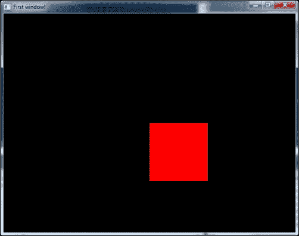
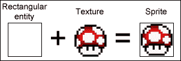
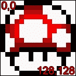
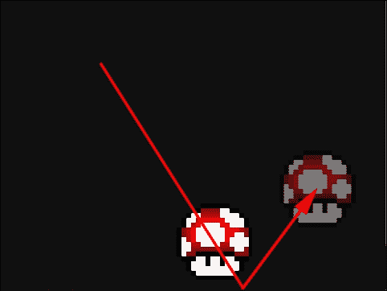

# 第一章。它活着！它活着！——设置和第一个程序

建造某物的自豪感是一种强大的感觉。结合探索的刺激，几乎很难缩小我们大多数游戏开发者为何这样做的原因。虽然创造是这个过程的主要力量，但失败支配着它，就像任何其他学科一样。迟早，我们都会处于一个砖墙不仅阻碍了特定项目的开发，甚至可能扼杀工作动机的情况。在这些时候，有一个好的资源可以依靠是至关重要的，尤其是对于刚开始动手的新开发者来说，这就是我们介入的地方。我们的目标是通过对本书过程中开发真实项目来以最实际的方法传授经验。

在本章中，我们将介绍以下内容：

+   在您的机器和 IDE 上设置 SFML

+   平均 SFML 应用程序的流程

+   打开和管理窗口

+   渲染基础

本章的目的是帮助您轻松地进入使用**简单快速多媒体库**（**SFML**）开发游戏的过程。让我们先从设置过程开始！

# 什么是 SFML？

在我们开始向您抛出术语和代码之前，公平起见，我们应该稍微谈谈本书选择的库。正如其标题清楚地表明的那样，SFML 是一个库，它加快并简化了开发依赖于大量使用媒体内容的应用程序的过程，例如视频、文本、静态图像、音频和动画以实现交互性，我们将专注于这些应用程序的特定类别，即视频游戏。它提供了一个易于使用的**应用程序****编程接口**（**API**），在 Windows、Linux 和 Mac OS X 上无需安装即可编译和运行，并支持多种语言，如 C、.NET、C++、Java、Ruby、Python 和 Go 等，仅举几例。虽然某些移动设备存在非官方的端口，但官方移动平台的发布仍在进行中。它也是开源的，所以如果有人愿意，总可以去查看源代码。在本书中，我们将专注于使用**C++11**在**Windows**平台上进行开发。

为了方便起见，SFML 被分为五个模块，这些模块相互独立，可以根据需要使用：

+   **系统**：一个核心模块，定义了大多数基本数据结构，提供对线程、时钟、用户数据流和其他基本功能的访问。

+   **窗口**：此模块提供创建和管理窗口、收集用户输入和事件以及与 OpenGL 一起使用 SFML 的方法。

+   **图形**：在充分利用窗口模块后，所有剩余的图形需求都由图形模块处理。它处理所有与二维渲染相关的内容。

+   **音频**：与播放音乐、声音、音频流或录音相关的一切都由这个模块处理。

+   **网络**：最后一个但绝对是最有趣的模块，它涵盖了向其他计算机发送数据以及使用一些网络协议。

每个这样的模块都编译在一个单独的库（.lib）中，该库具有特定的后缀，表示库是**静态**链接还是**动态**链接，以及是否在**调试**或**发布**模式下构建。静态链接库意味着它被包含在可执行文件中，与动态链接相反，动态链接需要`.dll`文件存在于应用程序运行时。后一种情况通过依赖于运行它的机器上存在的库来减少应用程序的整体大小。这也意味着库可以升级而无需修改应用程序，这在修复错误时非常有用。另一方面，静态链接允许你的代码在更受限的环境中执行。

确保你的应用程序以适合情况的模式构建也很重要。调试模式的应用程序包含大量有用的额外信息，这些信息在查找程序中的缺陷时非常有用。这使得应用程序运行速度明显减慢，不应用于除测试以外的任何目的。当以发布模式构建你的项目时，也会开启大量的不同优化，这不仅提供了更小的可执行文件大小，还提供了更快的运行速度。如果应用程序要用于除调试以外的任何目的，则应该以这种模式编译。

每个模块都按照格式`sfml-module[-s][-d].lib`命名。例如，一个静态链接并编译在调试模式下的图形库的文件名可能看起来像这样：`sfml-graphics-s-d.lib`。当动态链接或编译在发布模式下时，后缀需要被省略。SFML 还要求在静态链接时定义`SFML_STATIC`宏，我们将在设置第一个项目时简要介绍。

关于单独的库，需要记住的一个重要事情是它们仍然有依赖关系。窗口、图形、音频和网络库依赖于系统库，任何 SFML 应用程序要编译和运行都必须链接到系统库。图形库也依赖于窗口库，所以如果应用程序进行任何绘图，所有三个库都必须链接。音频和网络库只依赖于系统库。

### 注意

从版本 *2.2* 开始，当静态链接 SFML 时，其依赖项也必须链接到项目中。这些依赖项在 2.2 和 2.3 主要版本之间有所不同，因此我们将坚持使用最新版本，即 2.3。图形库需要 `opengl32.lib`、`freetype.lib` 和 `jpeg.lib` 库。窗口库依赖于 `opengl32.lib`、`winmm.lib` 和 `gdi32.lib`。仅链接到系统库只需要 `winmm.lib` 库，而 `sfml-network-s.lib` 需要依赖 `ws2_32.lib` 才能工作。最后，声音库依赖于 `openal32.lib`、`flac.lib`、`vorbisenc.lib`、`vorbisfile.lib`、`vorbis.lib` 和 `ogg.lib`。

这五个模块中的每一个都有一个相应的头文件，必须包含以利用其功能。例如，包含图形头文件将看起来像这样：

```cpp
#include <SFML/Graphics.hpp>
```

通过指定模块中所需的实际头文件，也可以避免包含整个模块头文件：

```cpp
#include <SFML/Graphics/Color.hpp>
```

这让你有机会只包含绝对必要的部分。

### 注意

在包含库时使用正斜杠是一种最佳实践。不同的操作系统无法识别包含反斜杠的路径。

# SFML 许可协议

无论你为项目使用何种类型的库，了解你可以用它做什么以及不能做什么都很重要。SFML 在 zlib/libpng 许可协议下授权，这远非限制性。它允许任何人出于任何目的使用 SFML，包括商业应用，以及修改和重新分发它，前提是保留原始软件的作者信用不变，并且产品标记为修改过的源代码。对于使用原始软件的信用并不强制要求，但会表示感谢。更多信息，请访问：[`opensource.org/licenses/Zlib`](http://opensource.org/licenses/Zlib)。

# 资源和安装

你可以在：[`www.sfml-dev.org/download.php`](http://www.sfml-dev.org/download.php) 下载库的最新稳定预构建版本。你也可以从这里获取最新的 Git 修订版并自行编译：[`github.com/LaurentGomila/SFML`](https://github.com/LaurentGomila/SFML)。前一种选项更容易，也推荐给初学者。然而，你必须等待主要版本发布，尽管它们更稳定。要自行构建 SFML，你需要使用 CMake，这是一个用于生成解决方案或 g++ Makefiles 的工具，具体取决于编译它的软件。官方 SFML 网站提供了关于如何自行构建的教程：[`www.sfml-dev.org/tutorials`](http://www.sfml-dev.org/tutorials)。

在获取到 SFML 的预构建版本或自己编译它之后，将其移动到一个更永久的位置是个好主意，希望路径尽可能短。在本地驱动器上为 SFML 和其他库分配一个目录以供快速链接和随时使用并不罕见。当处理同一库的多个版本时，这也很有用。在本书的其余部分，我们将假设我们的 SFML 库和头文件目录位于`C:\libs\SFML-2.3`，因此库目录为`C:\libs\SFML-2.3\lib`，头文件目录为`C:\libs\SFML-2.3\include`。这些目录必须在您选择的编译器中正确设置，以便项目可以构建。在本书的整个过程中，我们将使用 Microsoft Visual Studio 2013，然而，有关为 Code::Blocks 设置项目的说明可以在 SFML 网站上的教程部分找到。

## 设置 Microsoft Visual Studio 项目

在您的 IDE 中创建一个新的解决方案。它可以是一个 Win32 应用程序或控制台应用程序，这实际上并不重要，尽管一个漂亮的控制台窗口通常对调试很有用。我总是选择空项目选项以避免任何自动生成的代码。完成这些后，让我们准备我们的项目以使用 SFML：

1.  通过右键点击我们的项目并选择**属性**，导航到**配置属性**下的**VC++ 目录**。

1.  对于我们来说，只有两个字段是关注的重点，即**包含目录**和**库目录**。确保为**调试**和**发布**配置都提供了 SFML 库和包含目录的路径。

1.  当静态链接 SFML 时，需要在**C/C++**下的**预处理器**部分定义`SFML_STATIC`宏。

1.  接下来是**链接器**下的**通用**部分的**附加库目录**。确保它也指向 SFML 库目录，在调试和发布配置中都要如此。

1.  最后，我们需要通过编辑**链接器**下的**输入**部分的**附加依赖项**字段来设置项目依赖项。当使用静态链接库时，调试配置看起来可能如下所示：`sfml-graphics-s-d.lib; sfml-window-s-d.lib; sfml-system-s-d.lib; opengl32.lib; freetype.lib; jpeg.lib; winmm.lib; gdi32.lib;`

    记住，由于库依赖性，我们需要包含系统库。同时注意使用`-s`和`-d`后缀。确保调试和发布配置都已设置，并且发布配置省略了`-d`后缀。

# 打开一个窗口

如您所知，在屏幕上绘制东西需要一个窗口存在。幸运的是，SFML 允许我们轻松打开和管理我们自己的窗口！让我们像往常一样，通过向我们的项目添加一个名为`Main.cpp`的文件开始。这将是我们的应用程序的入口点。一个基本应用程序的骨架如下所示：

```cpp
#include <SFML/Graphics.hpp>

void main(int argc, char** argv[]){

}
```

注意，我们已经包含了 SFML 图形头文件。这将为我们提供打开窗口和绘制所需的一切，所以无需多言，让我们看看打开我们窗口的代码：

```cpp
#include <SFML/Graphics.hpp>

void main(int argc, char** argv[]){
  sf::RenderWindow window(sf::VideoMode(640,480), "First window!");

  while(window.isOpen()){
    sf::Event event;
    while(window.pollEvent(event)){
      if(event.type == sf::Event::Closed){
        // Close window button clicked.
        window.close();
      }
    }
    window.clear(sf::Color::Black);
    // Draw here.
    window.display();
  }
}
```

### 小贴士

SFML 使用 sf *命名空间*，因此我们必须在它的数据类型、枚举和静态类成员前加上前缀"`sf::`"。

在这里我们首先声明并初始化我们的`RenderWindow`类型的窗口实例。在这种情况下，我们使用了它的构造函数，然而也可以留空并在稍后通过传递完全相同的参数来利用它的`create`方法，这些参数中至少需要两个：一个`sf::videoMode`和一个用于窗口的`std::string`标题。视频模式的构造函数需要两个参数：内部窗口的宽度和高度。还有一个可选的参数用于设置每像素的位数，默认为 32 位，这对于良好的渲染已经足够，所以现在不必为此烦恼。

在我们的窗口实例创建之后，我们进入一个 while 循环，使用我们的窗口方法之一来检查它是否仍然打开，即`isOpen`。这实际上创建了我们游戏循环，这是我们代码的核心部分。

让我们看看一个典型游戏的示意图：



游戏循环的目的是检查事件和输入，在帧之间更新我们的游戏世界，这意味着移动玩家、敌人、检查变化等，最后在屏幕上绘制一切。这个过程需要每秒重复多次，直到窗口关闭。次数因应用程序而异，有时每秒高达数千次迭代。第二章，“给它一些结构 - 构建游戏框架”将涵盖管理并限制应用程序的帧率以及使游戏以恒定速度运行。

大多数应用程序都需要一种方法来检查窗口是否已关闭、调整大小或移动。这就是事件处理的作用。SFML 提供了一个事件类，我们可以用它来存储我们的事件信息。在游戏循环的每次*迭代*中，我们需要通过使用窗口实例的`pollEvent`方法来检查发生的事件并处理它们。在这种情况下，我们只对当鼠标点击关闭窗口按钮时触发的事件感兴趣。我们可以检查类`Event`的公共成员`type`是否与适当的枚举成员匹配，在这种情况下是`sf::Event::Closed`。如果是，我们可以调用窗口实例的`close`方法，我们的程序将终止。

### 小贴士

在所有 SFML 应用程序中必须处理事件。如果没有事件循环轮询事件，窗口将变得无响应，因为它不仅向用户提供事件信息，而且还为窗口本身提供了一种处理其内部事件的方式，这对于它能够对移动或调整大小做出反应是必要的。

在完成所有这些之后，清除前一次迭代的窗口是必要的。如果不这样做，我们将在其上绘制的所有内容都会堆叠并造成混乱。想象一下屏幕是一块白板，你想要在别人在上面乱涂乱画之后在上面绘制新的东西。然而，我们不需要拿橡皮擦，而是需要调用我们的窗口实例的 `clear` 方法，该方法接受一个 `sf::Color` 数据类型作为参数，如果没有提供参数，则默认为黑色。屏幕可以被清除为 `sf::Color` 类提供的任何枚举颜色，该类作为静态成员提供，或者我们可以传递一个 `sf::Color` 实例，该实例的构造函数接受单个颜色通道的 *无符号整数* 值：红色、绿色、蓝色，以及可选的 alpha。后者为我们提供了一个明确指定所需颜色范围的方法，如下所示：

```cpp
window.clear(sf::Color(0,0,0,255));
```

最后，我们调用 `window.display()` 方法来显示所有绘制的内容。这利用了一种称为双缓冲的技术，这在当今的游戏中是标准的。基本上，任何绘制的内容都不会立即绘制到屏幕上，而是绘制到一个隐藏的缓冲区中，然后在调用 `display` 后将缓冲区的内容复制到我们的窗口中。双缓冲用于防止图形伪影，如撕裂，这是由于显卡驱动程序在帧缓冲区仍在写入时从中提取导致的，结果是一个部分绘制的图像被显示出来。调用 `display` 方法是强制性的，不能避免，否则窗口将显示为一个静态的正方形，没有任何变化发生。

### 小贴士

请记住，如果应用程序是动态链接的，则必须在可执行文件依赖的同一目录中包含 SFML 库 `.dll` 文件。

在编译和执行代码后，我们将发现自己有一个空白的控制台窗口和一个黑色的 *640x480 px* 窗口坐在它上面，少于 20 行代码，并且一个打开的窗口。这并不令人兴奋，但仍然比 *Atari 2600* 上的 *E.T.* 要好。让我们在屏幕上画些东西吧！

# SFML 绘图基础

就像幼儿园一样，我们将从基本形状开始，逐步过渡到更复杂的类型。让我们通过首先声明它并设置它来绘制一个矩形形状：

```cpp
sf::RectangleShape rectangle(sf::Vector2f(128.0f,128.0f));
rectangle.setFillColor(sf::Color::Red);
rectangle.setPosition(320,240);
```

`sf::RectangleShape` 是 `sf::Shape` 的一个派生类，它继承自 `sf::Drawable`，这是一个抽象基类，所有实体都必须继承并实现其虚拟方法才能在屏幕上绘制。它还继承自 `sf::Transformable`，这提供了移动、缩放和旋转实体的所有必要功能。这种关系允许我们的矩形进行变换，并且可以在屏幕上渲染。在其构造函数中，我们引入了一个新的数据类型：`sf::Vector2f`。它本质上只是一个包含两个 *float* 的结构，x 和 y，代表二维宇宙中的一个点，不要与 `std::vector` 混淆，后者是一个数据容器。

### 小贴士

SFML 为整数和无符号整数提供了一些其他向量类型：`sf::Vector2i` 和 `sf::Vector2u`。实际的 `sf::Vector2` 类是模板化的，因此可以使用任何原始数据类型与之一起使用，如下所示：

```cpp
sf::Vector2<long> m_vector;
```

矩形构造函数接受一个 `sf::Vector2f` 类型的单个参数，它表示矩形的像素大小，这是可选的。在第二行，我们通过提供 SFML 的预定义颜色之一来设置矩形的填充颜色。最后，我们通过调用 `setPosition` 方法并传入其位置（以像素为单位）以及 *x* 和 *y* 轴来设置我们形状的位置，在这种情况下是窗口的中心。在我们能够绘制矩形之前，只剩下一件事要做：

```cpp
window.draw(rectangle); // Render our shape.
```

这行代码就在我们调用 `window.display();` 之前，负责将我们的形状带到屏幕上。让我们运行我们的修改后的应用程序并查看结果：



现在我们屏幕上画了一个红色方块，但它并不完全居中。这是因为任何 `sf::Transformable` 的默认原点，它只是一个代表对象全局位置的二维点，位于局部坐标 *(0,0)*，即左上角。在这种情况下，这意味着这个矩形的左上角被设置为屏幕中心的位置。这可以通过调用 `setOrigin` 方法并传入我们形状的所需局部坐标来轻松解决，我们希望新的原点正好在中间：

```cpp
rectangle.setOrigin(64.0f,64.0f);
```

如果由于某种原因不知道形状的大小，矩形类提供了一个很好的方法 `getSize`，它返回一个包含大小的 *float 向量*：

```cpp
rectangle.setOrigin(rectangle.getSize().x / 2, rectangle.getSize().y / 2);
```

现在我们的形状正快乐地坐在黑色屏幕的正中间。使这一切成为可能的整个代码段看起来有点像这样：

```cpp
#include <SFML/Graphics.hpp>

void main(int argc, char** argv[]){
  sf::RenderWindow window(sf::VideoMode(640,480),
    "Rendering the rectangle.");

  // Creating our shape.
  sf::RectangleShape rectangle(sf::Vector2f(128.0f,128.0f));
  rectangle.setFillColor(sf::Color::Red);
  rectangle.setPosition(320,240);
  rectangle.setOrigin(rectangle.getSize().x / 2, rectangle.getSize().y / 2);

  while(window.isOpen()){
    sf::Event event;
    while(window.pollEvent(event)){
      if(event.type == sf::Event::Closed){
        // Close window button clicked.
        window.close();
      }
    }
    window.clear(sf::Color::Black);
    window.draw(rectangle); // Drawing our shape.
    window.display();
  }
}
```

# 在 SFML 中绘制图像

为了在屏幕上绘制图像，我们需要熟悉两个类：`sf::Texture` 和 `sf::Sprite`。纹理本质上只是一个图像，它位于图形卡上，目的是使其绘制更快。任何硬盘上的图片都可以通过加载它来转换成纹理：

```cpp
sf::Texture texture;
if(!texture.loadFromFile("filename.png"){
    // Handle an error.
}
```

`loadFromFile` 方法返回一个布尔值，这提供了一种简单的方式来处理加载错误，例如文件未找到。如果你同时打开了控制台窗口和 SFML 窗口，你将注意到在纹理加载失败的情况下会打印出一些信息：

**无法加载图像 "filename.png"。原因：无法打开文件**

### 提示

如果在 `loadFromFile` 方法中未指定完整路径，它将被解释为相对于工作目录。重要的是要注意，虽然当单独启动时，工作目录通常与可执行文件相同，但在 IDE（在我们的例子中是 Microsoft Visual Studio）中编译和运行应用程序时，它通常设置为项目目录而不是调试或发布文件夹。如果你提供了相对路径，请确保将你要加载的资源放在与你的 `.vcxproj` 项目文件相同的目录中。

还可以从内存、自定义输入流或 `sf::Image` 工具类中加载你的纹理，这些工具类帮助存储和操作图像数据作为原始像素，这将在后面的章节中更广泛地介绍。

## 什么是精灵？

精灵，就像我们迄今为止所使用的 `sf::Shape` 派生类一样，是一个 `sf::Drawable` 对象，在这种情况下代表一个 `sf::Texture`，并且支持一系列变换，包括物理变换和图形变换。把它想象成一个简单应用了纹理的矩形：



`sf::Sprite` 提供了在屏幕上渲染纹理或其一部分的手段，以及变换它的手段，这使得精灵依赖于纹理的使用。由于 `sf::Texture` 不是一个轻量级对象，`sf::Sprite` 出于性能原因使用它所绑定纹理的像素数据，这意味着只要精灵在使用它所绑定的纹理，该纹理就必须在内存中保持活跃，并且只能在不再使用时才能被释放。在我们设置好纹理之后，设置精灵并绘制它就变得非常简单：

```cpp
sf::Sprite sprite(texture);
...
window.draw(sprite);
```

将纹理通过引用传递给精灵构造函数是可选的。可以通过使用 `setTexture` 方法在任意时刻更改它所绑定的纹理：

```cpp
sprite.setTexture(texture);
```

由于 `sf::Sprite`，就像 `sf::Shape` 一样，继承自 `sf::Transformable`，我们可以访问相同的方法来操作和获取原点、位置、缩放和旋转。

是时候应用我们迄今为止所获得的所有知识，并编写一个利用这些知识的基本应用程序了：

```cpp
void main(int argc, char** argv[]){
  sf::RenderWindow window(sf::VideoMode(640,480),
    "Bouncing mushroom.");

  sf::Texture mushroomTexture;
  mushroomTexture.loadFromFile("Mushroom.png");
  sf::Sprite mushroom(mushroomTexture);
  sf::Vector2u size = mushroomTexture.getSize();
  mushroom.setOrigin(size.x / 2, size.y / 2);
  sf::Vector2f increment(0.4f, 0.4f);

  while(window.isOpen()){
    sf::Event event;
    while(window.pollEvent(event)){
      if(event.type == sf::Event::Closed){
        window.close();
      }
    }

    if((mushroom.getPosition().x + (size.x / 2) >
      window.getSize().x && increment.x > 0) ||
      (mushroom.getPosition().x - (size.x / 2) < 0 &&
      increment.x < 0))
    {
        // Reverse the direction on X axis.
        increment.x = -increment.x;
    }

    if((mushroom.getPosition().y + (size.y / 2) >
      window.getSize().y && increment.y > 0) ||
      (mushroom.getPosition().y - (size.y / 2) < 0 &&
      increment.y < 0))
    {
         // Reverse the direction on Y axis.
        increment.y = -increment.y;
    }

    mushroom.setPosition(mushroom.getPosition() + increment);

    window.clear(sf::Color(16,16,16,255)); // Dark gray.
    window.draw(mushroom); // Drawing our sprite.
    window.display();
  }
}
```

上述代码将产生一个在窗口周围弹跳的精灵，每次撞击窗口边界时都会改变方向。为了使代码更短，省略了加载纹理的错误检查。在主循环的事件处理部分之后的两条`if`语句负责检查精灵的当前位置并更新表示正负号的增量值的方向，因为你可以沿着单轴的正负端移动。记住，形状的默认原点是左上角，如这里所示：



由于这个原因，在检查形状是否超出底部或右侧边界时，我们必须补偿形状的整个宽度和高度，或者确保其原点位于中间。在这种情况下，我们选择后者，并从蘑菇的位置添加或减去纹理大小的一半来检查它是否仍然在我们希望的空间内。如果不是，只需将轴上超出屏幕的增量浮点向量的符号取反，voila！我们就有了反弹效果！



作为额外加分，你可以随意尝试使用`sf::Sprite`的`setColor`方法，它可以用来用所需颜色着色精灵，并通过调整`sf::Color`类型的第四个参数（对应于 alpha 通道）使其透明：

```cpp
mushroom.setColor(sf::Color(255, 0, 0, 255)); // Red tint.
```

# 常见错误

经常，SFML 的新用户会尝试做一些类似这样的事情：

```cpp
sf::Sprite CreateSprite(std::string l_path){
    sf::Texture texture;
    texture.loadFromFile(l_path);
    . . .
    return sf::Sprite(texture);
}
```

当尝试绘制返回的精灵时，在精灵应该所在的位置出现了一个白色方块。发生了什么？好吧，回顾一下我们讨论纹理的部分。只要精灵在使用纹理，纹理就必须在作用域内，因为它存储了对纹理实例的指针。从上面的例子中，我们可以看到它是**静态分配的**，所以当函数返回时，在栈上分配的纹理现在超出了作用域，并被弹出。Poof。消失了。现在精灵指向了一个它无法使用的无效资源，并绘制了一个白色矩形。现在这并不是说你可以通过调用新函数在堆上分配内存，但这不是本例的重点。从这个例子中我们可以吸取的教训是，在处理任何应用程序时，适当的资源管理至关重要，因此请注意你资源的生命周期。在第六章中，我们将讨论设计自己的资源管理器并自动处理此类情况。

另一个常见的错误是保留过多的纹理实例。一个纹理可以被尽可能多的精灵使用。`sf::Texture` 并非一个轻量级对象，你可以使用相同的纹理来创建大量的 `sf::Sprite` 实例，同时仍然获得良好的性能。对于显卡来说，重新加载纹理也是昂贵的，因此尽可能少地保留纹理是如果你想让应用程序运行得更快的话，你需要真正记住的事情之一。这就是使用瓦片图集的思路，它只是包含在其中的小图像的大纹理。这提供了更好的性能，因为我们不需要保留数百个纹理实例并逐个加载文件，我们只需加载单个纹理，通过指定读取区域来访问任何所需的瓦片。这一点将在后面的章节中进一步讨论。

使用不受支持的图像格式或格式选项是另一个相当常见的问题。始终最好查阅官方网站以获取有关文件格式支持的最新信息。一个简短的列表可以在这里找到：[`www.sfml-dev.org/documentation/2.2/classsf_1_1Image.php#a9e4f2aa8e36d0cabde5ed5a4ef80290b`](http://www.sfml-dev.org/documentation/2.2/classsf_1_1Image.php#a9e4f2aa8e36d0cabde5ed5a4ef80290b)

最后，需要提一下 `LNK2019` 错误。无论指南、教程或书籍多少次提到如何正确设置和链接你的项目到任何给定的库，在这个世界上没有什么是完美的，尤其是人类。当你尝试编译项目时，你的 IDE 输出可能会被类似以下的消息淹没：

```cpp
error LNK2019: unresolved external symbol. . .

```

不要慌张，并且请，不要在某个论坛上发一个包含数百行代码的新帖子。你只是忘记在链接器输入中包含所有必需的附加依赖项。回顾我们介绍如何使用 SFML 设置项目的部分，并确保那里一切都正确。此外，请记住，你需要包含其他库所依赖的库。例如，系统库始终需要包含，如果使用图形模块，则需要包含窗口库，等等。静态链接库需要链接它们的依赖项。

# 摘要

本章涵盖了大量的内容。如果你是初学者，其中一些内容可能一开始有点难以理解，但请不要气馁。将这一知识应用到实践中是更好地理解它的关键。在继续到下一章之前，确保你对到目前为止所介绍的一切都感到自信。

如果你真的能通读这一章，并且充满信心地说你已经准备好向前迈进，我们想恭喜你迈出了成为成功的 SFML 游戏开发者的重要第一步！为什么就此止步呢？在下一章中，我们将介绍一种更好的方法来构建我们的第一个游戏项目的代码结构。除此之外，我们还将引入时间管理，并通过构建你第一个完整功能游戏的主要部分来实际应用到目前为止所涵盖的所有内容。我们面前还有大量的工作要做，所以赶快行动起来！你的软件不会自己写出来。
