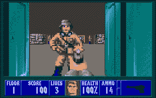
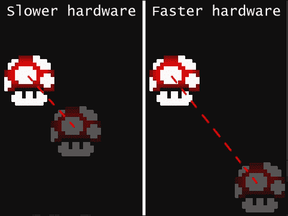
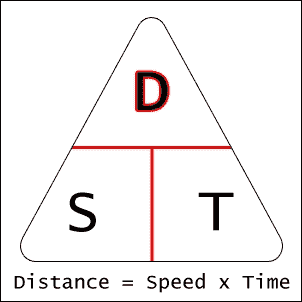
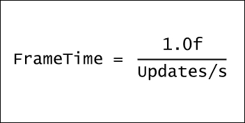

# 第二章. 给它一些结构 – 构建游戏框架

在一个结构不良的项目上工作就像在没有地基的情况下建造房子：很难维护，极其不稳定，你可能会很快放弃它。虽然我们在第一章中工作的代码，*它活着！它活着！ – 设置和第一个程序*，在非常小的规模上是功能性的，并且可以管理，但在没有首先构建一个坚实的框架的情况下扩展它很可能会导致大量的*意大利面代码*（不要与意大利面代码或千层面代码混淆）。虽然听起来很美味，但这个贬义词描述了在无结构且以“纠缠”方式执行源代码中实现新特征的指数级困难，这是我们将会着重避免的。

在本章中，我们将涵盖：

+   设计窗口类和主游戏类

+   代码重构和适当的架构

+   在应用程序中适当的时间管理的重要性

+   使用 `sf::Clock` 和 `sf::Time` 类

+   固定和可变的时间步长

# 晋升到意大利面

让我们从简单开始。每个游戏都需要有一个窗口，正如你从第一章，*它活着！它活着！ – 设置和第一个程序*中已经知道的，它需要被创建、销毁，并且需要处理其事件。它还需要能够清除屏幕并更新自身以显示在屏幕清除之后绘制的任何内容。此外，跟踪窗口是否正在关闭以及它是否处于全屏模式，以及有一个方法可以切换后者将会非常有用。最后，我们当然需要将内容绘制到窗口中。了解所有这些，我们的窗口类头文件可能会预见到如下所示：

```cpp
class Window{
public:
    Window();
    Window(const std::string& l_title,const sf::Vector2u& l_size);
    ~Window();

    void BeginDraw(); // Clear the window.
    void EndDraw(); // Display the changes.

    void Update();

    bool IsDone();
    bool IsFullscreen();
    sf::Vector2u GetWindowSize();

    void ToggleFullscreen();

    void Draw(sf::Drawable& l_drawable);
private:
    void Setup(const std::string& l_title, const sf::Vector2u& l_size);
    void Destroy();
    void Create();

    sf::RenderWindow m_window;
    sf::Vector2u m_windowSize;
    std::string m_windowTitle;
    bool m_isDone;
    bool m_isFullscreen;
};
```

由于我们希望在内部处理窗口的设置，设置方法被设置为私有，以及销毁和创建方法。将这些视为用户不需要了解的辅助方法。在设置完成后保留某些信息是个好主意，比如窗口大小或显示在其上的标题。最后，我们保留两个布尔变量来跟踪窗口是否关闭以及其全屏状态。

### 小贴士

我们窗口类中使用的命名约定被称为**匈牙利符号法**。当然，使用它不是必需的，但在处理大量代码、尝试追踪错误以及在更大的人群中工作时，它可能很有用。我们将在这本书中利用它。更多关于它的信息可以在这里找到：[`en.wikipedia.org/wiki/Hungarian_notation`](http://en.wikipedia.org/wiki/Hungarian_notation)

# 实现窗口类

现在我们有了我们的蓝图，让我们开始实际构建我们的窗口类。入口和出口点似乎是开始的好地方：

```cpp
Window::Window(){ Setup("Window", sf::Vector2u(640,480)); }

Window::Window(const std::string& l_title, const sf::Vector2u& l_size)
{
    Setup(l_title,l_size);
}

Window::~Window(){ Destroy(); }
```

构造函数和析构函数的实现只是简单地利用我们很快将要实现的辅助方法。还有一个默认构造函数，它不接受任何参数并初始化一些预设的默认值，这不是必需的，但很方便。话虽如此，让我们看看设置方法：

```cpp
void Window::Setup(const std::string l_title, const sf::Vector2u& l_size)
{
    m_windowTitle = l_title;
    m_windowSize = l_size;
    m_isFullscreen = false;
    m_isDone = false;
    Create();
}
```

再次强调，这很简单。如前所述，它初始化并跟踪一些将要传递给构造函数的窗口属性。除此之外，它还调用另一个名为 `Create` 的方法来进一步分解代码，这是我们将在实现 `Destroy` 方法之后要实现的内容：

```cpp
void Window::Create(){
    auto style = (m_isFullscreen ? sf::Style::Fullscreen 
        : sf::Style::Default);
    m_window.create({ m_windowSize.x, m_windowSize.y, 32 },
        m_windowTitle, style);
}

void Window::Destroy(){
    m_window.close();
}
```

在这里，我们介绍 SFML 提供的一种新数据类型：`sf::Uint32`。它存储在 `style` 本地变量中，通过使用 `auto` 关键字自动推断为该类型。它是一个无符号的固定大小整数类型。在这种情况下，我们使用的是 *32 位* 整数，尽管 SFML 提供了 *8 位*、*16 位* 和 *32 位* 的有符号和无符号类型。我们使用这个值来保存窗口的当前样式，使用 *三元运算符* 并将其分配给窗口样式枚举的默认或全屏样式。这是 SFML 中所有可能的窗口样式的完整列表：

| 枚举器 | 描述 | 互斥 |
| --- | --- | --- |
| 无 | 没有边框或标题栏。最简约的样式。 | 是 |
| 全屏 | 全屏模式。 | 是 |
| 标题栏 | 标题栏和固定边框。 | 否 |
| 关闭 | 标题栏和关闭按钮。 | 否 |
| 调整大小 | 标题栏、可调整大小的边框和最大化按钮。 | 否 |
| 默认 | 标题栏、可调整大小的边框、最大化和关闭按钮。 | 否 |

互斥列仅表示所讨论的样式是否可以与其他样式同时使用。例如，通过在 C++ 中使用位或运算符组合两种样式，可以拥有一个带有标题栏、可调整大小的边框、最大化按钮和关闭按钮的窗口：

```cpp
auto style = sf::Style::Resize | sf::Style::Close;
```

如果一个样式是互斥的，则不能以这种方式与其他任何样式一起使用。

一旦我们有了我们的样式，我们只需将其传递给窗口的 `create` 方法，以及构造时得到的 `sf::VideoMode` 类型，使用统一初始化。就这么简单。

我们 `Window` 类的 `destroy` 方法将简单地通过调用其 `close` 方法来关闭窗口。这里需要注意的是，关闭的窗口将销毁其所有附加的资源，但您仍然可以再次调用其 `create` 方法来重新创建窗口。如果窗口关闭，轮询事件和调用 `display` 方法仍然有效，但不会有任何效果。

让我们通过在适当的 `update` 方法中处理窗口的事件来继续分解我们之前的一块代码：

```cpp
void Window::Update(){
   sf::Event event;
   while(m_window.pollEvent(event)){
      if(event.type == sf::Event::Closed){
         m_isDone = true;
      } else if(event.type == sf::Event::KeyPressed &&
         event.key.code == sf::Keyboard::F5)
      {
         ToggleFullscreen();
      }
   }
}
```

这和之前一样，我们只是在处理事件。然而，我们不是立即关闭窗口，而是简单地翻转我们用来检查窗口是否已关闭的布尔标志`m_isDone`。由于我们还在切换窗口的全屏和正常状态之间切换，我们需要注意另一种类型的事件：`sf::Event::KeyPressed`。每当键盘按键被按下时，都会分发此事件，并且它包含有关该键的信息，存储在`event.key`结构中。目前，我们只对按下的键的代码感兴趣，然后我们可以将其与`sf::Keyboard`枚举表进行比较。在接收到按下*F5*键的事件时，我们调用`ToggleFullscreen`方法，现在由于我们将代码分解成可管理的部分，这个方法实现起来相当简单：

```cpp
void Window::ToggleFullscreen(){
    m_isFullscreen = !m_isFullscreen;
    Destroy();
    Create();
}
```

如您所见，我们在这里做的唯一一件事就是反转我们的布尔类成员`m_isFullscreen`的值，它跟踪窗口状态。之后，我们需要销毁并重新创建窗口，以便使其遵守我们的更改。让我们看看绘图方法：

```cpp
void Window::BeginDraw(){ m_window.clear(sf::Color::Black); }
void Window::EndDraw(){ m_window.display(); }
```

这里没有引入任何新内容。我们只是在`BeginDraw`和`EndDraw`方法中封装了清除和显示的功能。现在剩下的只是简单的辅助方法：

```cpp
bool Window::IsDone(){ return m_isDone; }
bool Window::IsFullscreen(){ return m_isFullscreen; }
sf::Vector2u Window::GetWindowSize(){ return m_windowSize; }

void Window::Draw(sf::Drawable&l_drawable){
    m_window.draw(l_drawable);
}
```

这些基本方法提供了获取窗口信息的方式，同时不会给窗口类外部的东西太多控制。目前，我们的窗口类已经足够。

# 构建游戏类

我们已经很好地完成了窗口类的基本功能封装，但这并不是唯一需要重构的代码块。在第一章中，“它活着！它活着！——设置和第一个程序”，我们讨论了主游戏循环及其内容，主要是处理输入、更新游戏世界和玩家，最后，在屏幕上渲染一切。将所有这些功能塞进游戏循环中通常会导致代码混乱，既然我们想要摆脱这种状况，让我们考虑一个更好的结构，这将允许这种行为：

```cpp
#include "Game.h"

void main(int argc, void** argv[]){
    // Program entry point.
    Game game; // Creating our game object.
    while(!game.GetWindow()->IsDone()){
        // Game loop.
        game.HandleInput();
        game.Update();
        game.Render();
    }
}
```

上述代码代表了我们的`main.cpp`文件的*全部*内容，并完美地说明了正确结构的游戏类的使用，它不会在无限循环中调用适当的顺序直到窗口关闭。为了清晰起见，让我们看看游戏类头文件的简化版本：

```cpp
class Game{
public:
    Game();
    ~Game();

    void HandleInput();
    void Update();
    void Render();
    Window* GetWindow();
    ...
private:
    void MoveMushroom();
    Window m_window;
    ...
};
```

注意，游戏类持有我们的窗口实例。它可以以不同的方式完成，但就我们当前的需求而言，这已经足够了。

## 将我们的代码投入实际应用

我们现在准备重新实现来自第一章的弹跳蘑菇演示，“它活着！它活着！——设置和第一个程序”。鉴于它的简单性，我们将向您展示如何将我们之前编写的代码适应到我们的新结构中的整个过程。让我们首先设置我们将要使用的窗口和图形：

```cpp
Game::Game(): m_window("Chapter 2", sf::Vector2u(800,600)){
    // Setting up class members.
    m_mushroomTexture.loadFromFile("Mushroom.png");
    m_mushroom.setTexture(m_mushroomTexture);
    m_increment = sf::Vector2i(4,4);
}
```

由于我们没有什么要清理的，我们的游戏析构函数现在仍然是空的：

```cpp
Game::~Game(){}
```

对于这个例子，我们没有必要检查输入，所以现在让我们暂时忽略这个方法。然而，我们将要做的是更新我们的精灵在每个帧的位置：

```cpp
void Game::Update(){
    m_window.Update(); // Update window events.
    MoveMushroom();
}
void Game::MoveMushroom(){
   sf::Vector2u l_windSize = m_window.GetWindowSize();
   sf::Vector2u l_textSize = m_mushroomTexture.getSize();

   if((m_mushroom.getPosition().x >
      l_windSize.x - l_textSize.x&&m_increment.x> 0) ||
      (m_mushroom.getPosition().x < 0 &&m_increment.x< 0)){
         m_increment.x = -m_increment.x;
   }

   if((m_mushroom.getPosition().y >
      l_windSize.y - l_textSize.y&&m_increment.y> 0) ||
      (m_mushroom.getPosition().y < 0 &&m_increment.y< 0)){
         m_increment.y = -m_increment.y;
   }

   m_mushroom.setPosition(
      m_mushroom.getPosition().x + m_increment.x, 
      m_mushroom.getPosition().y + m_increment.y);
}
```

你可能首先注意到的是我们窗口类的更新方法调用。我们已经在 SFML 中讨论了 *事件处理* 的重要性，但仍然值得再次强调。其余的代码基本上是一样的，只是我们现在有一个单独的方法负责更新蘑菇精灵的位置。我们使用了两个局部变量来保存窗口和纹理的大小，以提高可读性，但这基本上就是所有的事情。现在是时候将我们的精灵绘制到屏幕上了：

```cpp
void Game::Render(){
    m_window.BeginDraw(); // Clear.
    m_window.Draw(m_mushroom);
    m_window.EndDraw(); // Display.
}
```

再次，代码相当直接。我们的窗口类做所有的工作，我们只需要调用 `Draw` 方法，并在清除屏幕和显示更改的包装方法之间传递我们的 `sf::Drawable`。

将一切组合起来并运行它应该会产生与第一章，“它活着！它活着！——设置和第一个程序”中相同的弹跳蘑菇。然而，你可能已经注意到，精灵的移动方式取决于你的电脑有多忙。在这个观察中，隐藏着一个关于游戏开发的重要教训。

# 硬件和执行时间

让我们回到 1992 年 5 月 5 日。Apogee 软件开始发布由 *id Software* 开发的现在已知的经典之作 *Wolfenstein 3D*：



具有远见卓识的人，*约翰·卡马克*，在个人电脑上的第一人称射击游戏类型中迈出了巨大的步伐，不仅普及了这一类型，而且还彻底改变了它。它的巨大成功不容小觑，因为即使现在也很难准确预测它被下载了多少次。在那个时代长大的人，有时不禁会感到怀旧，并试图再次玩这款游戏。自从它在个人电脑上的 *DOS* 操作系统上首次发布以来，它已经被移植到许多其他操作系统和游戏机上。虽然现在仍然可以玩它，但我们已经从使用 DOS 的时代走了很长的路。我们软件运行的环境已经发生了根本性的变化，因此过去的软件不再兼容，这就需要仿真。

### 注意

**模拟器**是软件、硬件或两者的组合，它模拟了在主系统（称为主机）上运行的一定系统的功能，通常称为客户机。

用于此目的的每个模拟器不仅需要模仿一个与你要尝试玩的游戏兼容的系统的软件，还需要模仿硬件。为什么这很重要？在 DOS 时代，大多数游戏都依赖于硬件的大致相似性。在《狼人之三》的例子中，它假设它在一个*4.77 MHz*的系统上运行，这使得开发者可以通过不编写内部定时循环来节省一些时钟周期以提高效率。像《狼人之三》这样的游戏消耗了所有的处理能力，这在当时是一个很好的策略，直到更强大、更快的处理器出现。如今，即使是所有最便宜的消费级处理器，4.77 MHz 的速度也相形见绌，因此，正确模拟特定系统还需要减少 CPU 时钟周期，否则这些游戏会运行得太快，这正是当模拟器设置不正确且没有足够限制速度时发生的情况。

虽然这是一个最极端的例子，但速度管理是任何需要以恒定速度运行的软件的重要组件。抛开硬件和架构的不同选择，你的软件可能仅仅基于系统在那一刻的繁忙程度或代码在渲染图像之前每轮需要完成的任务的不同，运行得更快或更慢。考虑以下说明：



左侧和右侧的变化都在 1 秒的时间间隔内发生。在这两种情况下，代码完全相同。唯一的区别是主循环在那个间隔内完成的迭代次数。可以预见，硬件越慢，执行你的代码所需的时间就越长，因此迭代次数会更少，导致在 1 秒的时间间隔内精灵移动的次数更少，最终看起来像左侧。作为一个游戏开发者，确保你的产品在指定的规范指南内的所有系统上运行相同是很重要的。这就是 SFML 时间管理发挥作用的地方。

## 控制帧率

SFML 提供了一种为你的应用程序设置帧率上限的方法。这是`sf::RenderWindow`类中的一个方法，恰当地命名为`setFramerateLimit`：

```cpp
m_window.setFramerateLimit(60); // 60 FPS cap.
```

虽然这个特性并不绝对可靠，但它确保了只要提供的上限不是太高，应用程序的帧率以合理的精度被限制在提供的最大值。记住，限制帧率会降低程序的总体 CPU 消耗，因为它不再需要多次更新和重新绘制相同的场景。然而，这也会为较慢的硬件带来问题。如果帧率低于提供的值，模拟也会运行得更慢。设置限制只解决了我们问题的一半。让我们看看一些更实际的东西。进入`sf::Clock`！

# 使用 SFML 时钟

`sf::Clock`类非常简单且轻量级，因此它只有两个方法：`getElapsedTime()`和`restart()`。它的唯一目的是以操作系统能提供的最精确的方式测量自上次时钟重启或创建以来的经过时间。当使用`getElapsedTime`方法检索经过时间时，它返回一个类型为`sf::Time`的值。背后的主要原因是增加一层抽象，以提供灵活性和避免强加任何固定数据类型。《sf::Time`类也是轻量级的，并提供三个将经过时间转换为秒的方法，返回一个*浮点*值，毫秒，返回一个*32 位整数*值，以及微秒，返回一个*64 位整数*值，如下所示：

```cpp
sf::Clock clock;
...
sf::Time time = clock.getElapsedTime();

float seconds = time.asSeconds();
sf::Int32 milliseconds = time.asMilliseconds();
sf::Int64 microseconds = time.asMicroseconds();
...
time = clock.restart();
```

如您所见，`restart`方法也返回一个`sf::Time`值。这是为了防止在调用`restart`方法之前立即调用`getElapsedTime`，在这两个调用之间会有一些时间流逝，否则将无法计算。这对我们有什么用呢？好吧，我们处理的问题是相同的代码在其他平台上运行不同，因为我们无法计算它们的速度。我们使用以下代码行在屏幕上移动精灵：

```cpp
m_mushroom.setPosition(
    m_mushroom.getPosition().x + m_increment.x, 
    m_mushroom.getPosition().y + m_increment.y);
```

这里使用的`m_increment`向量是基于假设迭代之间的时间间隔是恒定的，但显然这不是真的。回想一下速度、时间和距离公式的神奇三角形：



要找到精灵在更新之间应该旅行的距离，首先需要定义一个移动速度。这里的时间值只是整个程序周期完成所需的时间。为了准确测量，我们将调整`Game`类以利用`sf::Clock`：

```cpp
class Game{
public:
...
    sf::Time GetElapsed();
    void RestartClock();
private:
...
    sf::Clock m_clock;
    sf::Time m_elapsed;
...
};
```

我们添加的两个新公共方法可以这样实现：

```cpp
sf::Time Game::GetElapsed(){ return m_elapsed; }
void Game::RestartClock(){ m_elapsed = m_clock.restart(); }
```

完成这些后，实际上利用这个功能并在每次迭代后重启游戏时钟是很重要的。这可以通过在主游戏循环中在所有工作完成后简单地调用`RestartClock`方法来实现：

```cpp
while(!game.GetWindow()->IsDone()){
    // Game loop.
    game.HandleInput();
    game.Update();
    game.Render();
    game.RestartClock(); // Restarting our clock.
}
```

循环中的最后一行将确保游戏类中的`m_elapsed`成员始终具有上一次迭代期间经过的时间值，所以让我们使用这个时间来确定我们的精灵应该移动多远：

```cpp
float fElapsed = m_elapsed.asSeconds();

m_mushroom.setPosition(
    m_mushroom.getPosition().x + (m_increment.x * fElapsed), 
    m_mushroom.getPosition().y + (m_increment.y * fElapsed));
```

我们现在使用`m_increment`作为速度变量，而不是距离。通过查看我们在构造函数中的前一段代码，我们将`m_increment`向量的*x*和*y*值都设置为`4`。由于我们用秒来表示经过的时间，这实际上意味着精灵需要每秒移动*4*像素。这真的很慢，所以让我们将其改为更有刺激性的值：

```cpp
Game::Game(){
...
    m_increment = sf::Vector2i(400,400); // 400px a second.
}
```

编译并运行项目后，你应该看到我们的精灵在屏幕上快乐地弹跳。现在，无论在哪个机器上执行，它都会移动相同的距离，无论帧率有多不稳定。为了加分，你可以通过使用 SFML 提供的`sf::sleep`函数人工减慢游戏循环来尝试一下，如下所示：

```cpp
while(!game.GetWindow()->IsDone()){
    // Game loop.
    game.HandleInput();
    game.Update();
    game.Render();
    sf::sleep(sf::seconds(0.2)); // Sleep for 0.2 seconds.
    game.RestartClock();
}
```

随意调整传递给 sleep 函数的参数。你会发现，无论每次迭代完成需要多长时间，精灵都会移动相同的距离。

# 固定时间步长

在某些情况下，我们编写的代码对于时间管理并不完全适用。假设我们只想以每秒 60 次的固定速率调用某些方法。这可能是一个需要仅更新一定次数的物理系统，或者如果游戏是网格基础的，它可能很有用。无论情况如何，当更新速率非常重要时，固定时间步长是你的朋友。与可变时间步长不同，其中下一次更新和绘制会在前一次完成后立即发生，固定时间步长方法将确保某些游戏逻辑仅在提供的速率下发生。实现固定时间步长相当简单。首先，我们必须确保不是覆盖前一次迭代的经过时间值，而是像这样将其添加到：

```cpp
void Game::RestartClock(){
    m_elapsed += m_clock.restart();
}
```

计算一秒内单个更新的时间的基本表达式在这里展示：



假设我们想让我们的游戏每秒更新*60*次。为了找到帧时间，我们将*1*除以*60*，并检查经过的时间是否超过了这个值，如下所示：

```cpp
float frametime = 1.0f / 60.0f;

if(m_elapsed.asSeconds() >= frametime){
    // Do something 60 times a second.
    ...
    m_elapsed -= sf::seconds(frametime); // Subtracting.
}
```

注意最后的减法。这是我们重置周期并保持模拟以恒定速度运行的方式。根据你的应用，你可能会想在更新之间将其“休眠”，以减轻 CPU 的负担。除了这个细节之外，这些都是固定时间步长的基本框架。这正是我们将在下一章中完成构建的游戏所使用的技术。

# 常见错误

通常，当使用时钟时，SFML 的新手往往会把它们放在错误的位置，并在错误的时间重新启动它们。这类事情最多只会导致“古怪”的行为。

### 注意

请记住，每行非空或非注释的代码都需要时间来执行。根据被调用的函数或正在构造的类的实现方式，时间值可能从微不足道到无限。

更新游戏世界中的所有游戏实体、执行计算和渲染等操作，在计算上相当昂贵，所以请确保不要以某种方式排除这些调用在时间测量的范围内。始终确保在主游戏循环结束时重启时钟和获取经过的时间是最后做的事情。

另一个错误是将时钟对象放在了错误的作用域内。考虑以下示例：

```cpp
void Game::SomeMethod(){
    sf::Clock clock;
    ...
    sf::Time time = clock.getElapsedTime();
}
```

假设这段代码的目的是测量除 `sf::Clock` 对象启动以来的时间之外的任何东西，这段代码将产生错误的结果。创建时钟实例只是测量它在作用域内存在的时间，而不是其他任何东西。这也是为什么游戏类中的时钟被声明为类成员的原因。由于时钟是在栈上创建的，一旦上述方法结束，时钟就会被再次销毁。

将经过的时间保存在 `float` 数据类型中，或者任何其他不是 `sf::Time` 的数据类型，通常也是不被推荐的。以下这样的例子并不是正确使用 SFML 的好例子：

```cpp
class Game{
...
private:
...
    float m_elapsed;
...
};
```

虽然它可行，但这并不完全类型安全。由于每次时钟重启时都必须调用三种转换方法之一，因此它还需要进行更多的类型转换。代码的可读性也是一个问题。SFML 提供自己的时间类是为了方便，所以除非有充分的理由不使用它，否则请避免使用其他数据类型。

最后，由于我们正在讨论时间，所以值得提一下的是 C++ 中的控制台输出。虽然偶尔打印一些内容是可以接受的，甚至只是为了调试目的，但持续的 console spam 会减慢你的应用程序速度。控制台输出本身相当慢，并且不能期望它以与程序其他部分相同的速度执行。例如，在主游戏循环的每次迭代中打印内容，将会极大地降低应用程序的速度。

# 摘要

恭喜你完成了这本书的第二章！正如之前提到的，理解本章涵盖的所有内容至关重要，因为接下来的一切都将严重依赖于这里所讨论的内容。

在不同平台和不同条件下获得平滑和一致的结果，与一个应用程序的良好结构一样重要，这又是一个“千层面”的层次。完成本章后，你将再次拥有足够的知识来制作能够利用固定和可变时间步长来创建独立于底层架构的模拟应用程序。

最后，我们将给你留下一条宝贵的建议。前几章的内容是大多数读者相对紧密和字面地遵循的部分。虽然这样做是可以接受的，但我们更希望你能将其视为一个指南而不是食谱。人类知识的最大奇妙之处在于它并非仅仅通过无休止的记忆来吸收。实验和获得实际经验是成功掌握这一技能的另一半关键，所以请继续编写代码。无论代码好坏，编译它，或者遇到一大堆错误，运行它或让它崩溃，两种情况都很好。尝试新事物并失败得惨不忍睹，以便有一天能够取得辉煌的成功。你已经走在“动手实践”的道路上了，因为我们将在下一章实际上开始为这本书实现第一个游戏项目。在那里见！
