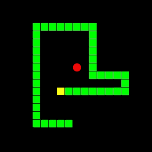
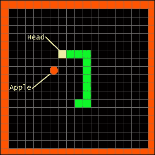
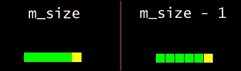
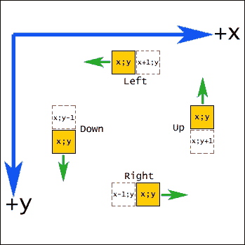
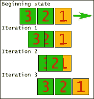
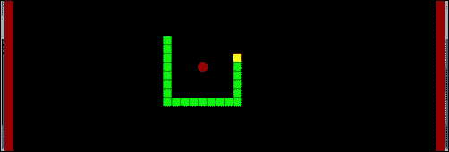
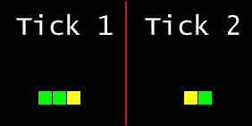
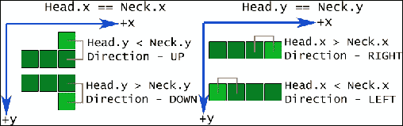
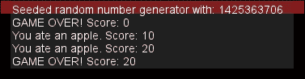

# 第三章. 沾满泥土——你需要知道的内容

游戏开发往往是一个令人厌烦的过程。在许多情况下，花费在编写特定代码块、实现特定功能集或修订你或其他人编写的旧代码上的时间很少能立即得到认可；这就是为什么你可能会在某些时候看到游戏开发者的脸上突然露出喜悦的表情，当他们的项目中的一个更炫目的部分得以展示时。看到你的游戏真正地在你眼前开始变化，这是大多数游戏开发者所做事情的原因。那些时刻使得编写大量看似没有刺激结果的代码成为可能。

因此，现在我们已经准备好了游戏结构，是时候专注于有趣、炫目的部分了！

在本章中，我们将涵盖：

+   我们第一个项目的游戏选择及其历史

+   构建我们选择的游戏

+   常见的游戏编程元素

+   完成我们项目所需的额外 SFML 元素

+   为我们所有的游戏项目构建辅助元素

+   游戏中的有效调试和常见问题解决

# 介绍蛇

如果你现在想象的是用戴着标志性头巾的*Solid Snake*来构建游戏，我们还没有达到那个阶段，尽管这样做的心情是可以理解的。然而，如果你想象的是以下这样的东西，你就完全正确：



首次由*Gremlin*于 1976 年以“Blockade”之名发布，蛇的概念是有史以来最著名的游戏类型之一。为这种机制编写了无数移植版本，例如 1978 年由*Atari*发布的*Surround*和由*Peter Trefonas*发布的*Worm*。几乎任何能想到的平台都有蛇的移植版本，甚至包括早期的单色*Nokia*手机，如*3310*和*6110*。图形从移植到移植，随着时间的推移而改进。然而，自从其简朴的起点以来，主要思想和规则始终保持不变：

+   蛇可以沿四个方向移动：上、下、左和右

+   吃苹果会使蛇变长

+   你不能触碰墙壁或自己的身体，否则游戏结束

根据你玩的游戏版本，其他一些事情可能会有所不同，例如吃苹果获得的分数、你的生命值、蛇移动的速度、游戏场的尺寸、障碍物等等。

# 游戏设计决策

某些版本的蛇运行方式不同；然而，为了致敬经典方法，我们将实现一个基于**网格**移动的蛇，如下所示：



采用这种方法使得以后检查蛇段和苹果之间的碰撞变得更容易。网格移动基本上意味着以静态速率更新。这可以通过使用固定的时间步长来实现，这是我们之前在 第二章 中提到的，*给它一些结构 - 构建游戏框架*。

外部区域象征着游戏的边界，在基于网格的移动中，这将是范围 *[1;Width-1]* 和 *[1;Height-1]*。如果蛇头不在这个范围内，那么可以肯定地说，玩家已经撞到了墙壁。这里所有的网格段都是 16px x 16px 大小；然而，这可以在任何时候进行调整。

除非玩家用完生命，否则我们希望在蛇头与身体相交的点切断蛇，并减少剩余的生命值。这给游戏增添了一些多样性，但不会过于失衡。

最后，您可能已经注意到了，我们在游戏中使用的是非常简单的蛇的图形表示。这样做主要是为了保持简单，同时也为了给经典元素增添魅力。然而，使用精灵来做到这一点并不复杂，但让我们先不考虑这一点。

# 实现蛇结构

现在让我们创建我们将要工作的两个文件：`Snake.h` 和 `Snake.cpp`。在真正开发蛇类之前，我们需要定义一些数据类型和结构。我们可以从在蛇头文件中实际定义我们的苹果吞噬蛇的结构开始：

```cpp
struct SnakeSegment{
    SnakeSegment(int x, int y) : position(x,y){}
    sf::Vector2i position;
};
```

如您所见，这是一个非常简单的结构，它包含一个单一成员，即一个表示段在网格上位置的 *整数向量*。这里的构造函数被用来通过 *初始化列表* 设置段的位置。

### 小贴士

在继续前进之前，请确保您熟悉 **标准模板库** 和它提供的数据容器。我们将特别使用 `std::vector` 来满足我们的需求。

我们现在已经定义了段类型，所以让我们开始考虑将蛇存储在某个地方。出于初学者的目的，`std::vector` 将会非常合适！在深入之前，这里有一个小技巧可以帮助我们消除代码中的“长行病”：

```cpp
using SnakeContainer = std::vector<SnakeSegment>;
```

正如您从您的 *C/C++* 背景中应该已经知道的，`using` 是一个很棒的小关键字，它允许用户为已知的数据类型定义别名。通过结合使用我们干净的新定义和 `auto` 关键字，我们防止了以下情况的发生：

```cpp
std::vector<SnakeSegment>::iterator someIterator = ...
```

这只是一个方便的问题，使用它是完全可选的，然而，我们将在这个书中一直使用这个有用的工具。

在真正开始编写蛇类之前，我们还需要定义一个类型枚举：

```cpp
enum class Direction{ None, Up, Down, Left, Right };
```

再次强调，这并不复杂。蛇有四个可以移动的方向。我们还有一个可能性，即它保持静止，在这种情况下，我们可以将方向设置为`NONE`。

# 蛇类

在设计任何对象之前，必须问自己它需要什么。在我们的例子中，蛇需要有一个移动的方向。它还需要有生命值，跟踪分数，速度，是否失败，以及是否失败。最后，我们将存储一个矩形形状，它将代表蛇的每个部分。当所有这些问题都得到解决后，蛇类的头文件将看起来像以下这样：

```cpp
class Snake{
public:
    Snake(int l_blockSize);
    ~Snake();

    // Helper methods.
    void SetDirection(Direction l_dir);
    Direction GetDirection();
    int GetSpeed();
    sf::Vector2i GetPosition();
    int GetLives();
    int GetScore();
    void IncreaseScore();
    bool HasLost();

    void Lose(); // Handle losing here.
    void ToggleLost();

    void Extend(); // Grow the snake.
    void Reset(); // Reset to starting position.

    void Move(); // Movement method.
    void Tick(); // Update method.
    void Cut(int l_segments); // Method for cutting snake.
    void Render(sf::RenderWindow& l_window);
private:
    void CheckCollision(); // Checking for collisions.

    SnakeContainer m_snakeBody; // Segment vector.
    int m_size; // Size of the graphics.
    Direction m_dir; // Current direction.
    int m_speed; // Speed of the snake.
    int m_lives; // Lives.
    int m_score; // Score.
    bool m_lost; // Losing state.
    sf::RectangleShape m_bodyRect; // Shape used in rendering.
};
```

注意，我们正在使用我们为蛇段向量创建的新类型别名。这看起来目前并不那么有用，但它很快就会变得非常有用。

如您所见，我们的类定义了一些方法，旨在分割功能，例如`Lose()`、`Extend()`、`Reset()`和`CheckCollision()`。这将增加代码的可重用性和可读性。让我们开始实际实现这些方法：

```cpp
Snake::Snake(int l_blockSize){
    m_size = l_blockSize;
    m_bodyRect.setSize(sf::Vector2f(m_size - 1, m_size - 1));
    Reset();
}
Snake::~Snake(){}
```

构造函数相当直接。它接受一个参数，即我们图形的大小。这个值将被存储以供以后使用，并且`sf::RectangleShape`成员的大小将根据它进行调整。从大小中减去一个像素是一个非常简单的方法，以保持蛇段在视觉上略微分离，如图所示：



构造函数也在最后一行调用了`Reset()`方法。头文件中的注释表明，此方法负责将蛇移动到起始位置。让我们实现这一点：

```cpp
void Snake::Reset(){
    m_snakeBody.clear();

    m_snakeBody.push_back(SnakeSegment(5,7));
    m_snakeBody.push_back(SnakeSegment(5,6));
    m_snakeBody.push_back(SnakeSegment(5,5));

    SetDirection(Direction::None); // Start off still.
    m_speed = 15;
    m_lives = 3;
    m_score = 0;
    m_lost = false;
}
```

这段代码将在每次新游戏开始时被调用。首先，它将清除上一局游戏中的蛇段向量。之后，将添加一些蛇段。由于我们的实现方式，向量中的第一个元素始终将是头部。蛇片的坐标目前是硬编码的，只是为了保持简单。

现在我们有一个三段蛇。我们现在要做的第一件事是将它的方向设置为`None`。我们希望在没有玩家按下键移动蛇之前不发生任何移动。接下来，我们为速度、生命值和起始分数设置一些任意值。这些可以在以后根据您的喜好进行调整。我们还设置了`m_lost`标志为`false`，以表示正在进行新的一轮。

在继续到更难实现的方法之前，让我们快速覆盖所有辅助方法：

```cpp
void Snake::SetDirection(Direction l_dir){ m_dir = l_dir; }
Direction Snake::GetDirection(){ return m_dir; }
int Snake::GetSpeed(){ return m_speed; }

sf::Vector2i Snake::GetPosition(){
   return (!m_snakeBody.empty() ?
      m_snakeBody.front().position : sf::Vector2i(1,1));
}

int Snake::GetLives(){ return m_lives; }
int Snake::GetScore(){ return m_score; }

void Snake::IncreaseScore(){ m_score += 10; }
bool Snake::HasLost(){ return m_lost; }
void Snake::Lose(){ m_lost = true; }
void Snake::ToggleLost(){ m_lost = !m_lost; }
```

这些方法相当简单。有描述性的名称非常有帮助。现在让我们看看`Extend`方法：

```cpp
void Snake::Extend(){
  if (m_snakeBody.empty()){ return; }
  SnakeSegment& tail_head = 
    m_snakeBody[m_snakeBody.size() - 1];

  if(m_snakeBody.size() > 1){
    SnakeSegment& tail_bone = 
      m_snakeBody[m_snakeBody.size() - 2];

    if(tail_head.position.x == tail_bone.position.x){
      if(tail_head.position.y > tail_bone.position.y){
        m_snakeBody.push_back(SnakeSegment(
          tail_head.position.x, tail_head.position.y + 1));
      } else {
        m_snakeBody.push_back(SnakeSegment(
          tail_head.position.x, tail_head.position.y - 1));
      }
    } else if(tail_head.position.y == tail_bone.position.y){
      if(tail_head.position.x > tail_bone.position.x){
        m_snakeBody.push_back(SnakeSegment(
          tail_head.position.x + 1, tail_head.position.y));
      } else {
        m_snakeBody.push_back(SnakeSegment(
          tail_head.position.x - 1, tail_head.position.y));
      }
    }
  } else {
    if(m_dir == Direction::Up){
      m_snakeBody.push_back(SnakeSegment(
        tail_head.position.x, tail_head.position.y + 1));
    } else if (m_dir == Direction::Down){
      m_snakeBody.push_back(SnakeSegment(
        tail_head.position.x, tail_head.position.y - 1));
    } else if (m_dir == Direction::Left){
      m_snakeBody.push_back(SnakeSegment(
        tail_head.position.x + 1, tail_head.position.y));
    } else if (m_dir == Direction::Right){
      m_snakeBody.push_back(SnakeSegment(
        tail_head.position.x - 1, tail_head.position.y));
    }
  }
}
```

之前的方法是负责在蛇触碰到苹果时实际增长蛇的。我们首先做的事情是创建一个指向该段向量中**最后一个**元素的引用，称为`tail_head`。接下来，我们有一个相当大的**if-else 语句**代码块，并且它的两种情况都需要访问最后一个元素，所以现在创建这个引用是一个好主意，以避免代码重复。

### 小贴士

`std::vector`容器重载了**方括号运算符**以支持通过数字索引进行随机访问。它与数组类似，使我们能够通过使用`size() - 1`的索引来引用最后一个元素。随机访问速度也是恒定的，无论容器中的元素数量如何，这就是为什么`std::vector`是此项目的良好选择。

实质上，这归结为两种情况：要么蛇的长度超过一个段，要么不超过。如果蛇有多于一个部分，我们创建另一个引用，称为`tail_bone`，它指向**倒数第二个**元素。这是为了确定在扩展蛇时新的一段应该放置的位置，而我们检查这个位置的方法是通过比较`tail_head`和`tail_bone`段的位置`position.x`和`position.y`值。如果 x 值相同，可以说两个部分之间的差异在 y 轴上，反之亦然。考虑以下插图，其中橙色矩形是`tail_bone`，红色矩形是`tail_head`：



让我们以面向左的例子为例进行分析：`tail_bone`和`tail_head`具有相同的**y**坐标，而`tail_head`的**x**坐标大于`tail_bone`，所以下一个段将添加到与`tail_head`相同的坐标，除了 x 值将增加一。由于`SnakeSegment`构造函数方便地重载以接受坐标，因此可以在将段推入向量的末尾的同时轻松执行这个简单的数学运算。

在向量中只有一个段的情况下，我们只需检查蛇的方向并执行之前所做的相同数学运算，只是这次是基于头部朝向的方向。前面的插图也适用于这种情况，其中橙色矩形是头部，红色矩形是即将添加的部分。如果它面向左，我们将 x 坐标增加一，而 y 坐标保持不变。如果它面向右，则从 x 坐标中减去，依此类推。花点时间分析这张图片，并将其与之前的代码联系起来。

当然，如果我们的蛇不动，这一切都没有意义。这正是更新方法所处理的内容，在我们的固定时间步长案例中，这被称为“tick”：

```cpp
void Snake::Tick(){
    if (m_snakeBody.empty()){ return; }
    if (m_dir == Direction::None){ return; }
    Move();
    CheckCollision();
}
```

方法中的前两行用于检查蛇是否应该移动，这取决于其大小和方向。如前所述，`Direction::None`值专门用于使其保持静止。蛇的移动完全包含在`Move`方法中：

```cpp
void Snake::Move(){
   for (int i = m_snakeBody.size() - 1; i > 0; --i){
      m_snakeBody[i].position = m_snakeBody[i - 1].position;
   }
   if (m_dir == Direction::Left){
      --m_snakeBody[0].position.x;
   } else if (m_dir == Direction::Right){
      ++m_snakeBody[0].position.x;
   } else if (m_dir == Direction::Up){
      --m_snakeBody[0].position.y;
   } else if (m_dir == Direction::Down){
      ++m_snakeBody[0].position.y;
   }
}
```

我们首先从向量中*向后*迭代。这样做是为了达到一种类似“ inchworm”的效果。当然，也可以不反向迭代向量来做这件事，然而，这样做简化了过程，并使得理解游戏的工作原理更容易。我们还在使用*随机访问运算符*，再次使用数字索引而不是向量*迭代器*，出于同样的原因。考虑以下插图：



在我们调用`tick`方法之前，我们有一组段的位置，这可以被称为“初始状态”。当我们开始从我们的向量中向后迭代时，我们首先从段#3 开始。在我们的`for`循环中，我们检查索引是否等于`0`，以确定当前段是否是蛇的前端。在这种情况下，它不是，所以我们把段#3 的位置设置为与段#2 的*相同*。前面的插图显示了该部分似乎位于两个位置之间，这样做只是为了能够看到它们。实际上，段#3 正坐在段#2 的上面。

在对蛇的第二部分应用同样的过程之后，我们继续处理它的头部。在这个时候，我们只需将其移动到对应其面向方向的轴上的一个空间。这里的应用思想与之前的插图相同，但符号相反。由于在我们的例子中，蛇面向右，它被移动到坐标*(x+1;y)*。一旦这样做，我们就成功地移动了我们的蛇一个空间。

我们的小虫子最后要做的一件事是调用`CheckCollision()`方法。让我们看看它的实现：

```cpp
void Snake::CheckCollision(){
   if (m_snakeBody.size() < 5){ return; }
   SnakeSegment& head = m_snakeBody.front();
   for(auto itr = m_snakeBody.begin() + 1; 
      itr != m_snakeBody.end(); ++itr)
   {
      if(itr->position == head.position){
         int segments = m_snakeBody.end() - itr;
         Cut(segments);
         break;
      }
   }
}
```

首先，除非我们有超过四个段，否则没有必要检查碰撞。理解你的游戏中的某些场景，并添加检查以避免资源浪费是游戏开发的重要部分。如果我们有超过四个蛇的段，我们再次创建对头部的引用，因为在任何碰撞的情况下，那将是首先撞到另一个段的部分。没有必要两次检查所有部分之间的碰撞。我们还在蛇的头部跳过一个迭代，因为显然没有必要检查它是否与自己碰撞。

在这个基于网格的游戏中，我们检查碰撞的基本方式是本质上通过比较头部位置和由我们的迭代器表示的当前片段位置。如果两个位置相同，头部与身体相交。我们解决这个问题的方法在本书的*游戏设计决策*部分有简要介绍。蛇必须在碰撞点被切断，直到玩家用完生命。我们通过首先获取从末端到被击中的片段之间的片段计数整数值来完成此操作。STL 在迭代器方面相当灵活，并且由于使用向量时内存都是连续布局的，我们可以简单地从向量的最后一个元素中减去我们的当前迭代器来获得这个值。这样做是为了知道需要从蛇的尾部移除多少个元素，直到交点。然后我们调用负责切割蛇的方法。此外，由于一次只能有一个碰撞，我们跳出`for`循环，以避免浪费更多的时钟周期。

让我们来看看`Cut`方法：

```cpp
void Snake::Cut(int l_segments){
   for (int i = 0; i < l_segments; ++i){
      m_snakeBody.pop_back();
   }
   --m_lives;
   if (!m_lives){ Lose(); return; }
}
```

到目前为止，这就像基于`l_segments`值循环一定次数，并从向量的末尾弹出元素一样简单。这实际上是在蛇上切割。

其余的代码只是减少剩余的生命值，检查是否为零，如果没有更多生命，则调用`Lose()`方法。

呼！这相当多的代码。然而，仍然有一件事要做，那就是将我们的方形蛇渲染到屏幕上：

```cpp
void Snake::Render(sf::RenderWindow& l_window){
   if (m_snakeBody.empty()){ return; }

   auto head = m_snakeBody.begin();
   m_bodyRect.setFillColor(sf::Color::Yellow);
   m_bodyRect.setPosition(head->position.x * m_size,
      head->position.y * m_size);
   l_window.draw(m_bodyRect);

   m_bodyRect.setFillColor(sf::Color::Green);
   for(auto itr = m_snakeBody.begin() + 1;
      itr != m_snakeBody.end(); ++itr)
   {
      m_bodyRect.setPosition(itr->position.x * m_size, 
         itr->position.y * m_size);
      l_window.draw(m_bodyRect);
   }
}
```

与我们在这里实施的大多数方法非常相似，我们需要遍历每个片段。头部本身是在循环外部绘制的，以避免不必要的检查。我们将代表蛇片段的`sf::RectangleShape`图形形状的位置设置为网格位置乘以`m_size`值，以便在屏幕上获得像素坐标。绘制矩形是完整实现蛇类的最后一步！

# 世界类

我们的蛇现在可以移动并与其自身碰撞。虽然功能齐全，但这并不足以让游戏变得真正有趣。让我们通过引入`World`类来给它一些边界和可以咀嚼的东西，以增加分数。

虽然我们可以为这里提到的每一件事都创建单独的对象，但这个项目足够简单，足以允许其某些方面被很好地包含在一个类中，这个类可以轻松地管理它们。这个类负责处理与保持游戏边界相关的一切，以及维护玩家将尝试抓取的苹果。 

让我们看看类头：

```cpp
class World{
public:
    World(sf::Vector2u l_windSize);
    ~World();

    int GetBlockSize();

    void RespawnApple();

    void Update(Snake& l_player);
    void Render(sf::RenderWindow& l_window);
private:
    sf::Vector2u m_windowSize;
    sf::Vector2i m_item;
    int m_blockSize;

    sf::CircleShape m_appleShape;
    sf::RectangleShape m_bounds[4];
};
```

如您从前面的代码中可以看到，这个类还跟踪游戏中对象的大小。除此之外，它仅仅保留四个矩形用于边界图形，一个圆用于绘制苹果，以及一个整数向量用于跟踪苹果的坐标，该向量命名为 `m_item`。让我们开始实现构造函数：

```cpp
World::World(sf::Vector2u l_windSize){
  m_blockSize = 16;

  m_windowSize = l_windSize;
  RespawnApple();
  m_appleShape.setFillColor(sf::Color::Red);
  m_appleShape.setRadius(m_blockSize / 2);

  for(int i = 0; i < 4; ++i){
    m_bounds[i].setFillColor(sf::Color(150,0,0));
    if(!((i + 1) % 2)){
      m_bounds[i].setSize(sf::Vector2f(m_windowSize.x,
        m_blockSize));
    } else {
      m_bounds[i].setSize(sf::Vector2f(m_blockSize,
        m_windowSize.y));
    }
    if(i < 2){
      m_bounds[i].setPosition(0,0);
    } else {
      m_bounds[i].setOrigin(m_bounds[i].getSize());
      m_bounds[i].setPosition(sf::Vector2f(m_windowSize));
    }
  }
}

World::~World(){}
```

在看起来复杂的 `for` 循环之前，我们只是从局部构造函数变量中初始化一些成员值，设置苹果圆的颜色和半径，并调用 `RespawnApple()` 方法来将其放置在网格上的某个位置。

第一个 `for` 循环只是对游戏屏幕的四边各迭代四次，以便在每一边设置一个红色矩形墙。它为矩形填充设置深红色颜色，并继续检查索引值。首先，我们通过以下表达式确定索引是偶数还是奇数：`if(!((i + 1) % 2)){...}`。这是为了知道在特定轴上每堵墙需要有多大。因为它必须与屏幕尺寸之一一样大，所以我们简单地使另一个与屏幕上的所有其他图形一样大，这由 `m_blockSize` 值表示。

最后的 `if` 语句检查索引是否小于 2。如果是，我们正在处理左上角，所以我们只需将矩形的位置设置为（0,0）。由于 SFML 中所有基于矩形的可绘制对象的坐标原点始终是左上角，所以我们在这个情况下不需要担心。然而，如果索引是 2 或更高，我们将原点设置为矩形的尺寸，这实际上使其成为右下角。之后，我们将矩形的位置设置为与屏幕尺寸相同，这样就将形状放置到底部右下角。您可以简单地手动设置所有坐标和原点，但这种方法使基本特征的初始化更加自动化。现在可能很难看到它的用途，但在更复杂的项目中，这种思维方式会很有用，所以为什么不从现在开始呢？

既然我们有我们的墙壁，让我们看看一个人可能会如何重新生成苹果：

```cpp
void World::RespawnApple(){
    int maxX = (m_windowSize.x / m_blockSize) - 2;
    int maxY = (m_windowSize.y / m_blockSize) - 2;
    m_item = sf::Vector2i(
        rand() % maxX + 1, rand() % maxY + 1);
    m_appleShape.setPosition(
        m_item.x * m_blockSize,
        m_item.y * m_blockSize);
}
```

我们必须做的第一件事是确定苹果可以生成的边界。我们通过定义两个值来完成此操作：`maxX` 和 `maxY`。这些值设置为窗口尺寸除以块大小，这给出了网格中的空间数量，然后我们必须从中减去 2。这是因为网格索引从 0 开始，而不是 1，并且我们不希望在右侧或底部墙壁内生成苹果。

下一步是实际生成苹果坐标的随机值。我们在这里使用预先计算好的值，并将最低可能的随机值设置为`1`，因为我们不希望任何东西在顶部墙壁或左侧墙壁上生成。由于苹果的坐标现在可用，我们可以通过将网格坐标乘以所有图形的大小来设置`m_appleShape`图形的像素坐标。

让我们通过实现更新方法来让所有这些功能变得生动起来：

```cpp
void World::Update(Snake& l_player){
    if(l_player.GetPosition() == m_item){
        l_player.Extend();
        l_player.IncreaseScore();
        RespawnApple();
    }

    int gridSize_x = m_windowSize.x / m_blockSize;
    int gridSize_y = m_windowSize.y / m_blockSize;

    if(l_player.GetPosition().x <= 0 ||
        l_player.GetPosition().y <= 0 ||
        l_player.GetPosition().x >= gridSize_x – 1 ||
        l_player.GetPosition().y >= gridSize_y - 1)
    {
            l_player.Lose();
    }
}
```

首先，我们检查玩家的位置是否与苹果的位置相同。如果是，我们就有了碰撞，蛇变长，分数增加，苹果重新生成。接下来，我们确定网格大小，并检查玩家坐标是否在任何指定的边界之外。如果是这种情况，我们调用`Lose()`方法来展示与墙壁的碰撞，并给玩家一个“游戏结束”的提示。

为了不让玩家处于盲目状态，我们必须显示游戏的边界，以及主要兴趣点——苹果。让我们在屏幕上绘制一切：

```cpp
void World::Render(sf::RenderWindow& l_window){
    for(int i = 0; i < 4; ++i){
        l_window.draw(m_bounds[i]);
    }
    l_window.draw(m_appleShape);
}
```

我们所需要做的就是迭代四次，绘制四个相应的边界。然后我们绘制苹果，这标志着我们对这个方法的兴趣结束。

还有一点需要指出的是，其他类可能需要知道图形需要有多大，因此让我们实现一个简单的方法来获取这个值：

```cpp
int World::GetBlockSize(){ return m_blockSize; }
```

这就完成了`World`类的编写。

# 是时候整合了

正如没有人在使用它时锤子毫无用处一样，我们的两个类如果没有被`Game`类正确采用，也是无用的。既然我们写所有这些代码并不是仅仅为了练习打字，那么让我们来把这些碎片拼在一起。首先，我们需要实际上向`Game`类添加两个新成员，你可能已经猜到了它们是什么：

```cpp
class Game{
...
private:
...
    World m_world;
    Snake m_snake;
};
```

接下来，让我们初始化这些成员。由于它们都有接受参数的构造函数，现在是初始化列表的时间了：

```cpp
Game::Game(): m_window("Snake", sf::Vector2u(800, 600)),m_snake(m_world.GetBlockSize()),m_world(sf::Vector2u(800,600))
{
    ...
}
```

接下来，我们需要处理一些输入。正如你可能从前面的章节中回忆起来的那样，利用事件进行实时输入是非常延迟的，并且绝对不应该用于除检查非时间敏感的按键以外的任何其他目的。幸运的是，SFML 通过`sf::Keyboard`类提供了获取键盘实时状态的方法。它只包含静态函数，并且从不打算被初始化。其中有一个函数正是我们需要的：`isKeyPressed(sf::Keyboard::Key)`。它接受的唯一参数是你想要检查状态的键的实际键值，这可以通过使用`sf::Keyboard::Key`枚举来获得，如下所示：

```cpp
if(sf::Keyboard::isKeyPressed(sf::Keyboard::Up) 
   && m_snake.GetDirection() != Direction::Down)
{
   m_snake.SetDirection(Direction::Up);
} else if(sf::Keyboard::isKeyPressed(sf::Keyboard::Down) 
   && m_snake.GetDirection() != Direction::Up)
{
   m_snake.SetDirection(Direction::Down);
} else if(sf::Keyboard::isKeyPressed(sf::Keyboard::Left) 
   && m_snake.GetDirection() != Direction::Right)
{
   m_snake.SetDirection(Direction::Left);
} else if(sf::Keyboard::isKeyPressed(sf::Keyboard::Right) 
   && m_snake.GetDirection() != Direction::Left)
{
   m_snake.SetDirection(Direction::Right);
}
```

我们不希望蛇做的某件事是朝与当前方向相反的方向移动。在任何给定的时间，它只能朝三个方向移动，使用`GetDirection()`方法确保我们不会让蛇反向移动，从而吃掉自己。如果我们有适当的输入组合及其当前方向，就可以通过使用`SetDirection()`方法安全地调整其方向。

让我们通过更新我们的两个类来开始行动：

```cpp
void Game::Update(){
...
    float timestep = 1.0f / m_snake.GetSpeed();

    if(m_elapsed >= timestep){
        m_snake.Tick();
        m_world.Update(m_snake);
        m_elapsed -= timestep;
        if(m_snake.HasLost()){
            m_snake.Reset();
        }
    }
...
}
```

如前所述，我们在这里使用的是*固定时间步长*，它包含了蛇的速度，以便每秒更新适当的次数。这也是我们检查玩家是否输掉游戏并重置蛇的地方，如果玩家输了。

我们现在非常接近了。是时候在屏幕上绘制一切了：

```cpp
void Game::Render(){
    m_window.BeginDraw();
    // Render here.
    m_world.Render(*m_window.GetRenderWindow());
    m_snake.Render(*m_window.GetRenderWindow());

    m_window.EndDraw();
}
```

和之前一样，我们只是简单地调用我们两个类的`Render`方法，并传入`sf::RenderWindow`的引用。有了这个，我们的游戏实际上就可以玩了！在项目成功编译和执行后，我们应该得到以下图像所示的内容：



蛇最初是静止的，直到按下四个方向键中的任意一个。一旦开始移动，它就能吃掉苹果并增长一个节段，在与自己的尾巴碰撞并失去两次之前死亡，如果玩家撞到墙壁，游戏结束。我们游戏的核心版本已经完成！给自己鼓掌吧，因为你刚刚创建了你第一个游戏。

# 捕捉虫子

尽管你对自己的第一个项目感到自豪和满足，但没有任何事情是完美的。如果你花了一些时间实际玩游戏，你可能注意到了当快速按键时发生的奇怪事件，看起来像这样：



这张图片代表了两次连续更新之间的差异。看起来它之前面向正确的方向，然后面向左边，并且没有撞到自己的尾巴。发生了什么？在继续之前，试着自己找出答案，因为它完美地说明了修复游戏缺陷的经历。

再多玩一会儿，可以揭示一些缩小我们问题的细节。让我们分析一下当玩家开始快速按键时会发生什么：

+   蛇面向右。

+   按下除了左键或右键之外的任意箭头键。

+   蛇的方向被设置为其他方向，比如说向上。

+   在游戏有机会更新之前，正确的按键已经被按下。

+   由于蛇的方向不再设置为向右或向左，输入处理程序中的`if`语句被满足，并将方向设置为向左。

+   游戏更新蛇的位置，并将其向左移动一个空间。头部与尾巴相撞，蛇被切断。

是的，看起来我们的方向检查有缺陷，导致了这个错误。再次，在继续之前，花些时间想想如何解决这个问题。

# 修复 bug

让我们讨论在这种情况下可能使用的几种方法。首先，程序员可能会考虑在某个地方放置一个标志，以记住方向是否已经为当前迭代设置，并在之后重置。这将防止我们遇到的错误，但也会锁定玩家与蛇交互的次数。假设蛇每秒移动一次。这意味着如果你在那一秒的开始按下一个键，你就无法改变主意并快速按下另一个键来纠正你的错误决定，因为蛇会移动。这不好。让我们转向一个新的想法。

另一种方法可能是记录在更改任何迭代之前原始方向。然后，一旦调用更新方法，我们可以检查在做出任何更改之前原始方向是否与我们收到的最新方向相反。如果是这样，我们可以简单地忽略它，并将蛇移动到任何更改之前的方向。这将修复错误，而不会给我们带来新的错误，但这也意味着需要跟踪一个额外的变量，可能会变得令人困惑。想象一下，在未来你遇到了一个类似的错误或需要跟踪另一个变量的功能请求。想象这种情况发生一次，然后又一次。很快，你的检查语句可能看起来有点像这样：

```cpp
if(var1 != something && var2 == something && var3 == true && var4 == !var3 ...)
```

现在我们称之为混乱。更不用说，想象一下你不得不为四种不同的条件检查相同的变量四次。很快就会很明显，这是一个糟糕的设计，任何打算向他人展示其代码的人都不应该使用它。

你可能会问我们如何纠正我们的问题。好吧，我们可以简单地不依赖蛇类中变量的使用来确定其方向，而是实现一个查看其结构并输出其面对的方向的方法，如下所示：

```cpp
Direction Snake::GetPhysicalDirection(){
    if(m_snakeBody.size() <= 1){
        return Direction::None;
    }

    SnakeSegment& head = m_snakeBody[0];
    SnakeSegment& neck = m_snakeBody[1];

    if(head.position.x == neck.position.x){
        return (head.position.y > neck.position.y ? Direction::Down : Direction::Up);
    } else if(head.position.y == neck.position.y){
        return (head.position.x > neck.position.x ? Direction::Right : Direction::Left);
    }

    return Direction::None;
}
```

首先，我们检查蛇是否只有 1 个或更少的段；在这种情况下，它朝哪个方向不重要，因为它如果只有头部，就不会吃掉自己，如果没有段在向量中，甚至没有方向。假设它比一个段更长，我们获得两个引用：头部和颈部，这是蛇头后面的第二部分。然后，我们简单地检查它们的位置，并使用与之前相同的逻辑确定蛇的方向，就像在实现蛇类时所示，如下面的图像所示：



这将返回一个正确的方向，除非蛇移动，否则不会改变，所以让我们调整我们的输入处理代码以适应这些变化：

```cpp
if(sf::Keyboard::isKeyPressed(sf::Keyboard::Up) && m_snake.GetPhysicalDirection() != Direction::Down)
{
    m_snake.SetDirection(Direction::Up);
} else if(sf::Keyboard::isKeyPressed(sf::Keyboard::Down) && m_snake.GetPhysicalDirection() != Direction::Up)
{
    m_snake.SetDirection(Direction::Down);
} else if(sf::Keyboard::isKeyPressed(sf::Keyboard::Left) && m_snake.GetPhysicalDirection() != Direction::Right)
{
    m_snake.SetDirection(Direction::Left);
} else if(sf::Keyboard::isKeyPressed(sf::Keyboard::Right) && m_snake.GetPhysicalDirection() != Direction::Left)
{
    m_snake.SetDirection(Direction::Right);
}
```

哇！我们的蛇不再会翻转了。

游戏中还有一个故意没有解决的错误。试着找出它并修复它，以便在将来练习解决这类问题。

### 小贴士

提示：这与游戏开始时蛇有多少段有关。

如果你想要公平地完成这个任务，尽量不参考这本书附带已完成项目的代码，因为那已经固定了。

# 走得更远

一个功能性的游戏远非一个完全完成的产品。当然，我们一开始就拥有了所有想要的东西，但它仍然留有遗憾，比如跟踪分数和显示我们有多少条命。起初，你的主要本能可能就是简单地在一个屏幕上的某个地方添加一些文本，简单地打印出你剩余的命数。你甚至可能被诱惑只简单地将其打印到控制窗口中。如果是这样的话，这部分的目的就是通过引入我们将在这本书的整个过程中使用和改进的东西来改变你的思维方式：文本框。

如果这个名字对你来说没有任何意义，只需想象在任何通信应用上的一个聊天窗口，例如 *MSN Messenger* 或 *Skype*。每当有新消息添加时，它会被添加到底部，而较旧的消息则被向上移动。窗口中可以同时显示一定数量的消息。这不仅对游戏打印轻松消息很有用，还可以用于调试。让我们先从编写我们的标题开始，就像往常一样：

```cpp
using MessageContainer = std::vector<std::string>;

class Textbox{
public:
    Textbox();
    Textbox(int l_visible, int l_charSize, int l_width, sf::Vector2f l_screenPos);
    ~Textbox();

    void Setup(int l_visible, int l_charSize, int l_width, sf::Vector2f l_screenPos);
    void Add(std::string l_message);
    void Clear();

    void Render(sf::RenderWindow& l_wind);
private:
    MessageContainer m_messages;
    int m_numVisible;

    sf::RectangleShape m_backdrop;
    sf::Font m_font;
    sf::Text m_content;
};
```

我们首先定义了所有消息容器的数据类型。在这种情况下，我们再次选择了 `std::vector`，因为这在这个阶段更熟悉。为了使其看起来更好、更易读，我们添加了一个矩形形状作为类的一个成员，该类将用作背景。除此之外，我们还引入了一个新的数据类型：`sf::Text`。这是一个可绘制的类型，代表任何键入的字符或字符字符串，并且可以调整大小、字体和颜色，就像 SFML 中的任何其他可绘制对象一样。

让我们开始实现我们的新特性：

```cpp
Textbox::Textbox(){
    Setup(5,9,200,sf::Vector2f(0,0));
}

Textbox::Textbox(int l_visible, int l_charSize, 
int l_width, sf::Vector2f l_screenPos){
    Setup(l_visible, l_charSize, l_width, l_screenPos);
}

Textbox::~Textbox(){ Clear(); }
```

如你所见，它有两个构造函数，其中一个可以用来初始化一些默认值，另一个允许通过传递一些参数来自定义。第一个参数是文本框中可见的行数。它后面跟着字符大小（以像素为单位）、整个文本框的宽度（以像素为单位），以及一个表示应在屏幕上绘制位置的浮点向量。所有这些构造函数所做的只是调用 `Setup` 方法并将所有这些参数传递给它，所以让我们来看看它：

```cpp
void Textbox::Setup(int l_visible, int l_charSize, int l_width, sf::Vector2f l_screenPos)
{
    m_numVisible = l_visible;

    sf::Vector2f l_offset(2.0f, 2.0f);

    m_font.loadFromFile("arial.ttf");
    m_content.setFont(m_font);
    m_content.setString("");
    m_content.setCharacterSize(l_charSize);
    m_content.setColor(sf::Color::White);
    m_content.setPosition(l_screenPos + l_offset);

    m_backdrop.setSize(sf::Vector2f(
        l_width, (l_visible * (l_charSize * 1.2f))));
    m_backdrop.setFillColor(sf::Color(90,90,90,90));
    m_backdrop.setPosition(l_screenPos);
}
```

除了初始化其成员值之外，此方法定义了一个偏移浮点向量，它将被用来适当地间隔文本并提供从左上角的一些填充。它还通过首先创建一个与之绑定的字体，设置初始字符串为空，设置字符大小和颜色，以及将其屏幕位置设置为提供的位置参数（考虑了适当的偏移量）来设置我们的`sf::Text`成员。此外，它通过使用提供的宽度并乘以可见行数与字符大小和 1.2 这个常量浮点值的乘积来设置背景的大小，以考虑到行之间的间隔。

### 小贴士

有时，这仅仅归结为玩代码，看看什么真正有效。找到在所有情况下都起作用的某些数值常数，就是测试以确定正确值的情况之一。不要害怕尝试新事物并看看什么有效。

由于我们正在使用向量来存储我们的消息，添加一个新消息或删除所有消息就像使用`push_back`和`clear`方法一样简单：

```cpp
void Textbox::Add(std::string l_message){
    m_messages.push_back(l_message);
    if(m_messages.size() < 6){ return; }
    m_messages.erase(m_messages.begin());
}

void Textbox::Clear(){ m_messages.clear(); }
```

在添加新消息的情况下，检查我们是否比我们看到的多，这是一个好主意。如果我们周围有我们永远不会看到或需要的物品，那就是浪费，所以当时肯定看不见的第一条消息就被从消息容器中移除了。

我们实际上已经非常接近完成这个整洁的功能了。现在唯一剩下的事情就是绘制它，这，就像往常一样，由`Render`方法来处理：

```cpp
void Textbox::Render(sf::RenderWindow& l_wind){
  std::string l_content;

  for(auto &itr : m_messages){
    l_content.append(itr+"\n");
  }

  if(l_content != ""){
    m_content.setString(l_content);
    l_wind.draw(m_backdrop);
    l_wind.draw(m_content);
  }
}
```

代码从设置`std::string`以存储屏幕上所有可见消息开始。之后，它就像遍历消息向量并将每条消息的文本追加到我们的本地`std::string`变量一样简单，在末尾加上换行符。最后，在检查本地变量并确保它不为空后，我们必须将我们的`m_content`成员（类型为`sf::Text`）设置为包含我们一直在推送消息的字符串，并在屏幕上绘制背景和文本。这就是`Textbox`类的全部内容。

在将`Textbox`实例作为成员添加到我们的游戏类之后，我们可以开始设置它：

```cpp
Game::Game() ... {
...
    m_textbox.Setup(5,14,350,sf::Vector2f(225,0));
...
    m_textbox.Add("Seeded random number generator with: " + std::to_string(time(NULL)));
}
```

在向我们的`m_textbox`成员的`Setup`方法传递一些常量值后，我们立即在构造函数中使用它，实际上输出我们的第一条消息。让我们通过最后调整`Game::Render()`方法来完全集成它：

```cpp
void Game::Render(){
    m_window.BeginDraw();
    // Render here.
    m_world.Render(*m_window.GetRenderWindow());
    m_snake.Render(*m_window.GetRenderWindow());
    m_textbox.Render(*m_window.GetRenderWindow());

    m_window.EndDraw();
}
```

这与我们在之前实现的所有类都一样，只是现在文本框是我们最后绘制的，这意味着它将显示在其他所有内容之上。在向游戏中添加更多要打印的消息并编译我们的项目后，我们最终应该得到如下所示的内容：



这个文本框，在其最基本的形式中，是我们将在本书中涵盖的蛇游戏中的最后一个新增功能。请随意尝试，看看你还能想出什么来让游戏更加有趣！

# 常见错误

人们经常忘记的一个相当常见的事情是以下这一行：

```cpp
srand(time(nullptr));
```

如果你注意到，每次启动游戏时生成的数字都是完全相同的，那么很可能是你没有对随机数生成器进行初始化，或者你没有提供一个合适的种子。建议始终使用 Unix 时间戳，如下所示。

### 小贴士

应该限制使用这个特定的随机函数，以避免与安全性和密码学相关。与模运算符结合使用时，由于引入的偏差，可能会产生非常不均匀的结果。

另一个相当常见的问题是程序员选择的数据容器来存储他们的结构。以下是一个例子：

```cpp
using SnakeContainer = std::vector<SnakeSegment>;
```

这定义了我们的`SnakeContainer`的类型。如果你已经编译了我们编写的代码，你会注意到它运行得相当顺畅。现在考虑下一行代码：

```cpp
Using SnakeContainer = std::deque<SnakeSegment>;
```

由于这两个容器在 STL 中的实现方式，我们的代码中没有任何其他变化，所以请随意尝试将你的`SnakeContainer`的数据类型从`std::vector`更改为`std::deque`。编译并运行项目后，你肯定会注意到性能的提升。为什么会这样呢？好吧，尽管`std::vector`和`std::deque`基本上可以以相同的方式使用，但它们在底层是根本不同的。向量提供了其元素在内存中连续的确定性，而双端队列则没有。根据插入和删除操作最频繁的位置，性能上也有差异。如果你不确定使用哪个容器，请确保查阅或自己进行基准测试。永远不要盲目假设，除非性能不是你主要关心的问题。

最后，在更开放的话题上，不要害怕尝试、修改、更改、破解或以其他方式改变你看到的任何代码。你最大的错误可能是没有通过破坏和修复来学习。考虑我们编写的代码只是正确的方向上的一个推动，而不是一个具体的食谱。如果你必须先破坏它才能更好地理解某些东西，那就这么做吧。

# 摘要

游戏开发是一次伟大的旅程，你之前已经迈出了第一步和第二步，但现在你已经带着你的第一个、功能齐全的游戏登上了飞机。你现在正式成为一名游戏开发者了！这架机会之飞机将带你到何方，它将停留多久？这一切完全取决于你。然而，在你还在空中之前，我们将尽我们所能来激励你，并展示你可以去的不同地方以及在那里可以获得的美好体验。然而，有一件事是肯定的，那就是这并不是终点。如果你的热情让你走到了这一步，那么只有一个方向可以前进，那就是向前。

本章涵盖了大量的内容，现在可以说你在向所有时代街机经典之一致敬时已经动手实践了。在下一章中，我们将处理输入处理和事件管理，以便在提供你与应用程序之间灵活和流畅的交互方式的同时，引入我们为下一章准备的新项目。还有很多东西要学习，还有很多代码要编写，所以不要花太多时间犹豫是否进入下一章。一场全新的冒险正在等待展开。在那里见！
