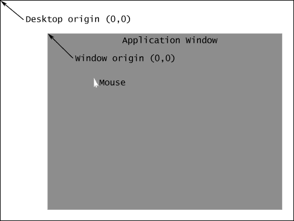
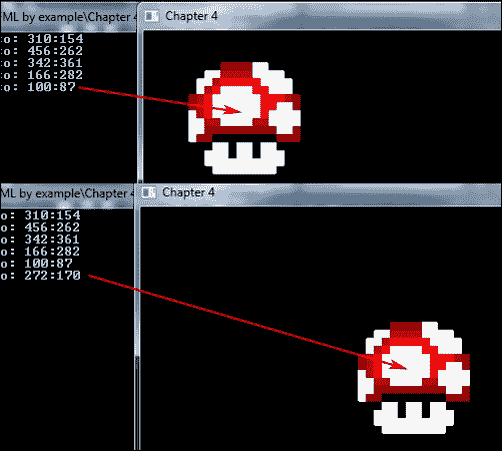

# 第四章. 捕获摇杆 – 输入和事件管理

毫无疑问，任何游戏最重要的方面实际上就是能够玩它。无论输入的目的如何，从简单地按键到浏览菜单，再到控制角色何时跳跃以及他或她走向哪个方向，如果没有一个应用程序提供一种让你与之交互的方式，那么你可能会得到一个非常花哨的屏保。我们非常简要地查看了一下获取和使用键盘输入的原始方法，然而我们本章的动机与仅仅满足于处理每个按键的庞大 if/else 语句集合是截然不同的。相反，我们想要查看一种更健壮的方法来处理不仅仅是键盘，还包括鼠标和帧之间发生的事件，以及添加处理其他外围设备输入的可能性，例如摇杆。考虑到这一点，让我们看看本章我们将要涵盖的内容：

+   检查键盘和鼠标按钮状态的基本方法

+   理解和处理不同类型的事件

+   理解和利用回调

+   设计和实现事件管理器

让我们不要像你的游戏角色在没有输入的情况下一样静止不动，开始编码吧！

# 获取外围输入

几个之前的章节已经稍微触及了检索外围输出的主题，并且讽刺的是，整个类的范围都被涵盖了。只是为了回顾一下，`sf::Keyboard` 是一个提供单个静态方法 `isKeyPressed(sf::Keyboard::Key)` 的类，用于确定某个键盘键的实时状态，该方法通过 `sf::Keyboard::Key` 枚举表传递作为参数。因为这个方法是静态的，所以 `sf::Keyboard` 不需要实例化，可以使用如下方式：

```cpp
if(sf::Keyboard::isKeyPressed(sf::Keyboard::W)){
    // Do something if the W key is pressed.
}
```

这是我们在之前章节中检查输入的方法，然而，如果我们想要检查更多的按键，这会导致大量的 `if`/`else` 语句。

## 检查鼠标输入

预计之下，SFML 也提供了一个类似于 `sf::Keyboard` 的类，具有获取鼠标实时状态的同一种想法：`sf::Mouse`。与它的犯罪伙伴键盘类似，它提供了一种检查鼠标按钮是否被按下的方法，如下所示：

```cpp
if(sf::Mouse::isButtonPressed(sf::Mouse::Left)){
    // Do something if the left mouse button is pressed.
}
```

`sf::Mouse` 类提供了任何给定鼠标上可能按钮的枚举，其中我们总共有五个：

| `sf::Mouse::Left` | 左键鼠标按钮 |
| --- | --- |
| `sf::Mouse::Right` | 右键鼠标按钮 |
| `sf::Mouse::Middle` | 鼠标滚轮被点击 |
| `sf::Mouse::XButton1` | 第一个额外鼠标按钮 |
| `sf::Mouse::XButton2` | 第二个额外鼠标按钮 |

此外，`sf::Mouse` 类提供了一种获取和设置当前鼠标位置的方法：

```cpp
// Getting the mouse position.
sf::Vector2i mousePos = sf::Mouse::getPosition(); // 1
sf::Vector2i mousePos = sf::Mouse::getPosition(m_window); // 2

// Setting the mouse position.
sf::Mouse::setPosition(sf::Vector2i(0,0)); // 3
sf::Mouse::setPosition(sf::Vector2i(0,0),m_window); // 4
```

这两种方法都有一个重载版本，它接受一个窗口的引用，以确定是查看相对于窗口的鼠标坐标还是相对于桌面的鼠标坐标。考虑以下插图：



如果没有提供窗口的引用，就像上一个示例中的第 1 行，返回的鼠标位置是桌面原点到鼠标所在点的距离。然而，如果提供了窗口的引用，位置就是窗口原点到鼠标位置的距离。换句话说，示例#2 中的鼠标位置是相对于窗口的。同样的逻辑也适用于第 3 行和第 4 行，除了鼠标位置被设置为提供的 int 向量参数。

## 插入你的控制器

是的，正如标题所述，SFML 不仅支持来自键盘和鼠标的输入，还支持来自连接到计算机的附加外设的输入。通过利用类`sf::Joystick`，它只包含静态方法，就像前两个类一样，可以检查控制器是否连接，检查其按钮状态，甚至确定控制器是否支持某些轴的位置。

SFML 支持同时连接多达八个不同的控制器，这些控制器通过[0;7]范围内的数值索引来识别。因此，`sf::Joystick`提供的每个方法都必须至少有一个参数，即控制器 ID。首先，让我们看看确定控制器是否连接的方法：

```cpp
if (sf::Joystick::isConnected(0))
{
    // We have a controller with an id 0.
}
```

如果我们有一个 ID 为 0 的控制器，我们可以检查它实际支持多少个按钮，如下所示：

```cpp
unsigned int n_buttons = sf::Joystick::getButtonCount(0);
```

因为没有其他方法可以抽象地定义地球上每个控制器的按钮，所以它们简单地通过 0 到 31 之间的数字索引来引用。可以通过调用`isButtonPressed()`方法来检查按钮是否被按下，如下所示：

```cpp
if(sf::Joystick::isButtonPressed(0,1)){
    // Button 1 on controller 0 is pressed.
}
```

为了检查一个控制器是否支持特定的轴，我们可以使用`hasAxis()`方法：

```cpp
if(sf::Joystick::hasAxis(0,sf::Joystick::X)){
    // Controller 0 supports movement on X axis.
}
```

`sf::Joystick::Axis`枚举封装了一个控制器可能支持的所有可能的轴，因此可以像前面代码中那样进行检查。假设控制器支持它，可以通过以下方式获取其沿轴的当前位置：

```cpp
float p_x = sf::Joystick::getAxisPosition(0, sf::Joystick::X);
float p_y = sf::Joystick::getAxisPosition(0, sf::Joystick::Y);
// Do something with p_x and p_y.
```

前面的方法将返回控制器 0 上 X 和 Y 轴的当前位置。

### 注意

因为在检查事件时`sf::Joystick`状态会被更新，所以在事件被轮询之前使用这些方法可能会出现一些问题。如果出现这种情况，最好手动调用`sf::Joystick:Update()`方法，以确保你拥有最新的外设状态。

## 理解`sf::Event`

再次强调，`sf::Event` 是我们简要提到过的东西，然而，如果我们想要构建一个可以无缝处理所有类型事件而没有任何问题的系统，那么在继续之前，我们必须扩展并更好地理解它。首先，让我们重申一下什么是事件。`sf::Event` 是一个联合体，在 C++ 术语中意味着它是一个特殊的类，它一次只能持有其非静态数据成员中的一个，它有几个这样的成员，例如 `KeyEvent`，它包含有关键盘事件的信息，`SizeEvent`，它包含有关我们窗口大小的信息，以及其他许多事件。由于 `sf::Event` 的这种性质，如果新手以错误的方式处理事件，例如在 `sf::Event` 中访问 `KeyEvent` 结构，而此时它不是活动的数据成员，那么这可能会成为一个陷阱。由于联合体的所有成员共享相同的内存空间，这会导致未定义的行为，并可能导致你的应用程序崩溃，除非你知道你在做什么。

让我们看看处理事件最基本的方法：

```cpp
sf::Event event;

while(m_window.pollEvent(event)){
    switch(event.type){
    case sf::Event::Closed:
        m_window.close();
        break;

    case sf::Event::KeyPressed:
        if(event.key.code == sf::Keyboard::W){
            // Do something when W key gets pressed once.
        }
        break;
    }
}
```

我们没有看到过的新东西，尽管了解确切发生的事情是很重要的。首先，名为 `event` 的 `sf::Event` 实例是通过 `pollEvent()` 方法填充的。根据其类型，它将选择联合体中的一个结构作为活动结构来携带与事件相关的数据。之后，我们可以检查事件的类型，这是由 `sf::Event::Type` 枚举表定义的，并确保我们使用正确的数据成员来获取所需的信息。如前所述，如果事件类型是 `sf::Event::Closed`，尝试访问 `event.key.code` 将会导致未定义的行为。

### 小贴士

记住，使用 `sf::Event::KeyPressed` 事件来处理类似实时角色移动的操作是一个糟糕的想法。这个事件在应用一小段时间延迟之前只会被分发一次，然后再次分发。想象一下文档编辑器。当你按下并保持一个键时，最初它只会显示一个字符，然后才会写入更多内容。这个事件的工作方式与此完全相同。将其用于任何需要持续按下键的动作，甚至都不接近最佳方案，并且应该用 `sf::Keyboard::isKeyPressed()` 来替换，以便检查键的实际状态。同样的想法也适用于鼠标和控制器输入。使用这些事件对于只需要在每次按键时发生一次的事情是理想的，但除此之外并不多。

虽然这种方法在小项目中是可管理的，与之前的输入示例几乎相同，但在更大规模上可能会迅速失控。让我们面对现实，以我们之前项目中的方式处理所有事件、按键和每个输入设备的所有状态，那是一个噩梦。仍然不相信？想象一下，有一个应用程序，你想要检查同时按下多个键，并在它们同时按下时调用某个函数。这不好吗？好吧，让我们将事件纳入这个场景。你想要检查同时按下两个键和同时发生某个事件，以便调用一个函数。这增加了另一层复杂性，但你完全能够处理，对吧？在其中加入一些布尔标志来跟踪事件状态或按键状态可能不会太难。

一段时间过去了，现在应用程序需要支持从文件中加载键组合，以便使你的方法更加动态和可定制。你现在手头一团糟。你可以构建它，但添加新功能或扩展那堆废话将会非常尴尬，你可能会举手放弃。为什么让自己经历所有这些，而只需一些努力和白板，你就可以想出一个自动化的方法，它不需要任何标志，是灵活的，可以从文件中加载任何键和事件的组合，并且仍然保持你的代码像以前一样整洁和干净，甚至更好？让我们通过开发一个将为我们处理所有这些烦恼的系统来智能地解决这个问题。

# 介绍事件管理器

确定我们想要从我们的应用程序中获得什么，是设计过程中的第一步也是最关键的部分。有时很难覆盖所有的基础，但忘记一个可能改变所有代码结构的功能，然后在以后尝试实现它，可能会对你的软件投入的所有工作造成严重破坏。话虽如此，让我们列出一个我们希望事件管理器拥有的功能列表：

+   能够将任何组合的键、按钮或事件（从现在起称为绑定）与通过字符串标识的所需功能相耦合

+   将这些功能绑定到当所有条件（例如按键被按下、左鼠标按钮被点击或窗口失去焦点等）满足时会被调用的方法

+   事件管理器处理实际被轮询的 SFML 事件的方式

+   从配置文件中加载绑定

我们有了规格说明，现在让我们开始设计！我们将使用`EventManager.h`文件来包含所有使这成为可能的小部件，同时还有类的定义。我们需要定义的第一件事是我们将要处理的所有事件类型。这可以在以后扩展，但鉴于这现在将完全满足我们的目的，我们暂时不必担心这一点。让我们编写枚举表：

```cpp
enum class EventType{
    KeyDown = sf::Event::KeyPressed,
    KeyUp = sf::Event::KeyReleased,
    MButtonDown = sf::Event::MouseButtonPressed,
    MButtonUp = sf::Event::MouseButtonReleased,
    MouseWheel = sf::Event::MouseWheelMoved,
    WindowResized = sf::Event::Resized,
    GainedFocus = sf::Event::GainedFocus,
    LostFocus = sf::Event::LostFocus,
    MouseEntered = sf::Event::MouseEntered,
    MouseLeft = sf::Event::MouseLeft,
    Closed = sf::Event::Closed,
    TextEntered = sf::Event::TextEntered,
    Keyboard = sf::Event::Count + 1, Mouse, Joystick
};
```

大多数这些都是实际事件；然而，请注意在列举结束前的最后一行。我们正在设置自己的事件，称为`Keyboard`，其值为`sf::Event::Count + 1`。因为所有的枚举本质上都是指向整数值的关键字，所以最后一行防止了任何类型的标识符冲突，并确保在此之后添加的任何内容都高于绝对最大`sf::Event::EventType`枚举值。只要在最后一行之前添加的内容是有效的事件类型，就不应该有冲突。

### 注意

`sf::Event`枚举值可能因你使用的 SFML 版本不同而不同！

接下来，让我们使能够为每个绑定存储这些事件组成为可能。我们知道，为了绑定到一个键，我们需要事件类型和我们感兴趣的键的代码。我们将处理的一些事件只需要存储类型，在这种情况下，我们可以简单地存储一个与类型相关的 0 整数值。了解这一点后，让我们定义一个新的结构，它将帮助我们存储这些信息：

```cpp
struct EventInfo{
    EventInfo(){ m_code = 0; }
    EventInfo(int l_event){ m_code = l_event; }
    union{
        int m_code;
    };
};
```

为了留出扩展的空间，我们已经在使用**联合体**来存储事件代码。接下来，我们可以设置我们将要使用来保存事件信息的数据类型：

```cpp
using Events = std::vector<std::pair<EventType, EventInfo>>;
```

由于我们需要与使用此类的代码共享事件信息，现在是设置一个有助于我们做到这一点的数据类型的好时机：

```cpp
struct EventDetails{
    EventDetails(const std::string& l_bindName)
        : m_name(l_bindName)
    {
        Clear();
    }
    std::string m_name;

    sf::Vector2i m_size;
    sf::Uint32 m_textEntered;
    sf::Vector2i m_mouse;
    int m_mouseWheelDelta;
    int m_keyCode; // Single key code.

    void Clear(){
        m_size = sf::Vector2i(0, 0);
        m_textEntered = 0;
        m_mouse = sf::Vector2i(0, 0);
        m_mouseWheelDelta = 0;
        m_keyCode = -1;
    }
};
```

现在是时候设计绑定结构了，它将保存所有的事件信息。看起来相当简单，所以让我们来实现它：

```cpp
struct Binding{
   Binding(const std::string& l_name)
      : m_name(l_name), m_details(l_name), c(0){}
   void BindEvent(EventType l_type,
      EventInfo l_info = EventInfo())
   {
      m_events.emplace_back(l_type, l_info);
   }

   Events m_events;
   std::string m_name;
   int c; // Count of events that are "happening".

   EventDetails m_details;
};
```

构造函数接受我们想要绑定事件的动作名称，并使用初始化列表来设置类的数据成员。我们还有一个`BindEvent()`方法，它简单地接受一个事件类型和一个事件信息结构，以便将其添加到事件向量中。我们之前还没有提到的一个额外数据成员是名为`c`的整数。正如注释所暗示的，它跟踪实际发生的事件数量，这将在稍后确定绑定中的所有键和事件是否“开启”时很有用。最后，这是事件详细数据成员共享的结构。

这些绑定也必须以某种方式存储，所以让我们定义一个数据类型，用于容纳负责这一点的容器：

```cpp
using Bindings = std::unordered_map<std::string, Binding*>;
```

使用`std::unordered_map`作为我们的绑定保证了每个动作只有一个绑定，因为它是一个关联容器，动作名称字符串是该容器的键。

到目前为止，我们进展顺利，然而，如果没有一种方法将这些操作与将被调用的有效方法实际联系起来，这个系统就相当无用。让我们来谈谈如何实现这一点。在计算机科学的世界里，你可能时不时地会听到“回调”这个术语被提及。简单来说，回调就是一些代码块，作为参数传递给其他代码，它将在一个方便的时间执行。在我们的事件管理器中，方便的时间是所有绑定到特定动作的事件发生时，而回调是一个表示正在执行的动作的方法。比如说，我们希望在按下空格键时让角色跳跃。我们会创建一个名为"`Jump`"的绑定，这是我们的动作名称，并向它添加一个类型为`KeyDown`和代码`sf::Keyboard::Space`的单个事件。为了举例，假设角色有一个名为`Jump()`的方法。这就是我们的回调。我们希望将这个方法绑定到名称"`Jump`"上，并让事件管理器在按下空格键时调用角色的`Jump()`方法。简而言之，这就是我们将如何使用这个新系统处理输入的。

到现在为止，你的 C++背景可能让你想到了“函数指针”这个术语。虽然这并不一定是一个坏选择，但如果你对这个领域不是很熟悉，可能会有些混乱。那种方法的主要问题是添加一个类的方法作为回调的场景。指向类成员的指针并不完全等同于常规函数，除非它是静态方法。以下是一个成员函数指针的基本定义：

```cpp
void(SomeClass::*_callback)();
```

已经显示出了一些主要限制。首先，我们只能有指向“SomeClass”类的方法的指针。其次，如果没有指向我们想要指向的方法的类的实例，这相当无用。你可能已经想到了一个想法，就是将实例和函数指针一起存储在某种回调结构中。让我们看看：

```cpp
struct Callback{
    std::string m_name;
    SomeClass* CallbackInstance; // Pointer to instance.
    void(SomeClass::*_callback)();

    void Call(){
    CallbackInstance->*_callback();
    }
};
```

这有点好。至少我们现在可以调用方法了，尽管我们仍然只限于一个类。我们可以在“SomeClass”类的方法中包装其他类的每个方法调用，但这很繁琐，更重要的是，这是一种不好的做法。现在你可能正在想，一些模板魔法可能可以解决这个问题。虽然这是可能的，但你还得考虑兼容性和它可能造成的混乱。考虑一下这需要的最小工作量：

```cpp
template<class T>
struct Callback{
    ...
    T* CallbackInstance; // Pointer to instance.
    void(T::*_callback)();
    ...
};
```

这本身并不能解决问题，反而只会带来更多的问题。首先，你现在必须在事件管理器类中定义这个模板，这很成问题，因为我们需要一个容器来存放所有这些回调函数，这意味着我们必须模板化整个事件管理器类，这将其锁定为一种类类型。我们又回到了起点。使用 typedef 可能是一个聪明的想法，但是大多数 Visual Studio 编译器不支持这种形式的 typedef：

```cpp
template <class T>
using Function = void (T::*)();
```

对于非 C++11 编译器，有一些非常规的解决方案，比如在定义模板后，将`typedef`包裹在`struct`中。然而，这并不能解决问题。甚至有 Visual Studio 2010 编译器在使用“模板化”成员函数指针类型定义时崩溃的实例。这相当混乱，到这一点你可能正在考虑简单地回到常规函数指针，并将每个成员函数调用包裹在不同的函数中。不用担心，C++11 引入了一个比那更好的方法。

# 标准函数包装器

C++工具库为我们提供了解决这个难题所需的一切：`std::function`和`std::bind`。`std::function`类型是一个通用多态函数包装器。在它支持的许多其他功能中，它可以存储成员函数指针并调用它们。让我们看看使用它的最小示例：

```cpp
#include <functional> // Defines std::function & std::bind.
...
std::function<void(void)> foo = std::bind(&Bar::method1, this);
```

在这种情况下，我们实例化了一个名为"`foo`"的函数包装器，它包含一个签名为`void(void)`的函数。在等号的右侧，我们使用`std::bind`将类"`Bar`"的成员函数"`method1`"绑定到`foo`对象上。第二个参数，因为这是一个成员函数指针，是具有其方法注册为回调的类的实例。在这种情况下，它必须是`Bar`类的实例，所以让我们想象这一行代码是在它的实现中写下的，并且只传入"`this`"。现在我们的`foo`对象被绑定到了`Bar`类的`method1`方法上。因为`std::function`重载了括号操作符，所以调用它就像这样：

```cpp
foo(); // Equivalent to barInstance->method1();
```

现在我们可以最终定义回调容器类型：

```cpp
using Callbacks = std::unordered_map<std::string, std::function<void(EventDetails*)>>;
```

再次强调，使用`std::unordered_map`确保每个动作只有一个回调。如果需要，以后可以更改。

# 构建事件管理器

到目前为止，我们已经有了编写事件管理器类头文件所需的一切。考虑到我们之前做出的所有设计决策，它应该看起来像以下这样：

```cpp
class EventManager{
public:
    EventManager();
    ~EventManager();

    bool AddBinding(Binding *l_binding);
    bool RemoveBinding(std::string l_name);

    void SetFocus(const bool& l_focus);

    // Needs to be defined in the header!
    template<class T>
    bool AddCallback(const std::string& l_name, void(T::*l_func)(EventDetails*), T* l_instance)
    {
        auto temp = std::bind(l_func,l_instance, std::placeholders::_1);
        return m_callbacks.emplace(l_name, temp).second;
    }

    void RemoveCallback(const std::string& l_name){
        m_callbacks.erase(l_name);
    }

    void HandleEvent(sf::Event& l_event);
    void Update();

    sf::Vector2i GetMousePos(sf::RenderWindow* l_wind = nullptr){
        return (l_wind ? sf::Mouse::getPosition(*l_wind)
            : sf::Mouse::getPosition());
    }
private:
    void LoadBindings();

    Bindings m_bindings;
    Callbacks m_callbacks;
    bool m_hasFocus;
};
```

从查看类定义中可以看出，我们仍然需要为`AddCallback()`方法使用模板成员函数指针参数。然而，`std::function`的使用将此隔离到单个方法中，这意味着我们不需要对整个类进行模板化，这是一个改进。在将方法指针和类的实例以及一个将来将被参数替换的单个占位符绑定到一个临时函数后，我们将其插入到回调容器中。由于编译器处理模板类的方式，我们需要在头文件中实现我们的模板`AddCallback()`方法，而不是在.cpp 文件中。只是为了保持一致性，并且因为这个方法非常简单，我们在头文件中也定义了`RemoveCallback()`。

关于标题的另一件值得指出的事情是用于获取鼠标位置的方法实现：`GetMousePos()`。它接受一个指向`sf::RenderWindow`类型的指针，以防我们希望返回的坐标相对于特定窗口。同一个窗口也可以获得或失去焦点，因此有一个标志`m_hasFocus`被保留以跟踪这一点。

## 实现事件管理器

让我们开始实际实现所有事件管理器类方法，从构造函数和析构函数开始：

```cpp
EventManager::EventManager(): m_hasFocus(true){ LoadBindings(); }
EventManager::~EventManager(){
   for (auto &itr : m_bindings){
      delete itr.second;
      itr.second = nullptr;
   }
}
```

在这种情况下，构造函数的工作非常简单。它只需要调用一个私有方法`LoadBindings()`，该方法用于从文件中加载有关我们绑定的信息。我们将在稍后介绍这一点。

对于此类，析构函数的工作也相当普通。如果你还记得，我们在堆上存储绑定，因此必须释放这块动态内存。

让我们看看`AddBinding`方法实现：

```cpp
bool EventManager::AddBinding(Binding *l_binding){
   if (m_bindings.find(l_binding->m_name) != m_bindings.end())
      return false;

   return m_bindings.emplace(l_binding->m_name,
      l_binding).second;
}
```

如你所见，它接受一个指向绑定的指针。然后它检查绑定容器是否已经有一个具有相同名称的绑定。如果有，该方法返回`false`，这对于错误检查很有用。如果没有名称冲突，新的绑定将被插入到容器中。

我们有添加绑定的一种方法，但关于移除它们怎么办？这就是`RemoveBinding`方法的作用所在：

```cpp
bool EventManager::RemoveBinding(std::string l_name){
    auto itr = m_bindings.find(l_name);
    if (itr == m_bindings.end()){ return false; }
    delete itr->second;
    m_bindings.erase(itr);
    return true;
}
```

它接受一个字符串参数，并在容器中搜索匹配项以存储到迭代器中。如果找到匹配项，它首先通过删除键值对中的第二个元素（即为绑定对象分配的动态内存）来释放内存，然后在实际返回`true`表示成功之前从容器中删除条目。很简单。

如在设计此类规格说明中提到的，我们需要一种方法来处理在每次迭代中轮询的 SFML 事件，以便查看它们并确定是否有我们感兴趣的内容。这就是`HandleEvent`的作用所在：

```cpp
void EventManager::HandleEvent(sf::Event& l_event){
  // Handling SFML events.
  for (auto &b_itr : m_bindings){
    Binding* bind = b_itr.second;
    for (auto &e_itr : bind->m_events){
      EventType sfmlEvent = (EventType)l_event.type;
      if (e_itr.first != sfmlEvent){ continue; }
      if (sfmlEvent == EventType::KeyDown ||
        sfmlEvent == EventType::KeyUp)
      {
        if (e_itr.second.m_code == l_event.key.code){
          // Matching event/keystroke.
          // Increase count.
          if (bind->m_details.m_keyCode != -1){
            bind->m_details.m_keyCode = e_itr.second.m_code;
          }
          ++(bind->c);
          break;
        }
      } else if (sfmlEvent == EventType::MButtonDown ||
        sfmlEvent == EventType::MButtonUp)
      {
        if (e_itr.second.m_code == l_event.mouseButton.button){
          // Matching event/keystroke.
          // Increase count.
          bind->m_details.m_mouse.x = l_event.mouseButton.x;
          bind->m_details.m_mouse.y = l_event.mouseButton.y;
          if (bind->m_details.m_keyCode != -1){
            bind->m_details.m_keyCode = e_itr.second.m_code;
          }
          ++(bind->c);
          break;
        }
      } else {
        // No need for additional checking.
        if (sfmlEvent == EventType::MouseWheel){
          bind->m_details.m_mouseWheelDelta = l_event.mouseWheel.delta;
        } else if (sfmlEvent == EventType::WindowResized){
          bind->m_details.m_size.x = l_event.size.width;
          bind->m_details.m_size.y = l_event.size.height;
        } else if (sfmlEvent == EventType::TextEntered){
          bind->m_details.m_textEntered = l_event.text.unicode;
        }
        ++(bind->c);
      }
    }
  }
}
```

它接受一个类型为 `sf::Event` 的参数，这是相当合适的。然后这个方法必须遍历所有的绑定以及绑定内的每个事件，检查 `l_event` 参数的类型是否与当前正在处理的事件绑定类型匹配。如果匹配，我们检查它是否是键盘事件或鼠标事件，因为这涉及到进一步检查键盘键或鼠标按钮是否与我们的绑定匹配。如果是其中之一，最后一步是检查键盘键码或鼠标按钮码，分别存储在 `l_event.key` 和 `l_event.mouseButton` 结构体中，是否与我们的绑定事件码匹配。如果是这种情况，或者如果它是一种不需要进一步处理的不同类型的事件，如几行代码所示，我们就在将相关事件信息存储在绑定的事件详情结构体后不久，增加绑定实例的成员 `c` 以表示匹配。

最后，对于输入处理，我们需要有一个更新方法，这个方法可以处理实时输入检查以及验证和重置绑定状态。让我们来写一下：

```cpp
void EventManager::Update(){
  if (!m_hasFocus){ return; }
  for (auto &b_itr : m_bindings){
    Binding* bind = b_itr.second;
    for (auto &e_itr : bind->m_events){
      switch (e_itr.first){
      case(EventType::Keyboard) :
        if (sf::Keyboard::isKeyPressed(
          sf::Keyboard::Key(e_itr.second.m_code)))
        {
          if (bind->m_details.m_keyCode != -1){
            bind->m_details.m_keyCode = e_itr.second.m_code;
          }
          ++(bind->c);
        }
      break;
      case(EventType::Mouse) :
        if (sf::Mouse::isButtonPressed(
          sf::Mouse::Button(e_itr.second.m_code)))
        {
          if (bind->m_details.m_keyCode != -1){
            bind->m_details.m_keyCode = e_itr.second.m_code;
          }
          ++(bind->c);
        }
      break;
      case(EventType::Joystick) :
        // Up for expansion.
        break;
      }
    }

    if (bind->m_events.size() == bind->c){
      auto callItr = m_callbacks.find(bind->m_name);
      if(callItr != m_callbacks.end()){
        callItr->second(&bind->m_details);
      }
    }
    bind->c = 0;
    bind->m_details.Clear();
  }
}
```

再次遍历所有的绑定及其事件。然而，在这种情况下，我们只对 `Keyboard`、`Mouse` 和 `Joystick` 感兴趣，因为这是我们唯一可以检查实时输入的设备。就像之前一样，我们检查我们处理的事件类型，并使用适当的类来检查输入。像往常一样，增加绑定类的 `c` 成员是我们注册匹配的方式。

最后一步是检查事件容器中的事件数量是否与“开启”的事件数量匹配。如果是这样，我们在 `m_callbacks` 容器中定位我们的回调，并使用括号操作符调用 `second` 数据成员，因为它是一个 `std::function` 方法包装器，从而正式实现回调。我们向它传递包含所有事件信息的 `EventDetails` 结构体的地址。之后，重要的是将活动事件计数器 `c` 重置为 `0` 以进行下一次迭代，因为之前检查的任何事件的状态都可能已经改变，它们都需要重新评估。

最后，如果你从头到尾看了代码，你可能已经注意到控制器输入的情况并没有做任何事情。事实上，我们甚至没有处理任何与控制器相关的事件。这是可以稍后扩展的内容，并且对我们任何项目都不是至关重要的。如果你渴望添加对游戏手柄的支持并且有机会使用一个，那么在完成本章后，将其视为作业。

现在我们有了所有这些功能，为什么不实际从文件中读取一些绑定信息呢？让我们看看我们将要加载的示例配置文件，名为 `keys.cfg`：

```cpp
Window_close 0:0
Fullscreen_toggle 5:89
Move 9:0 24:38
```

这可以按照您想要的任何方式格式化，然而，为了简单起见，这里的布局将保持相当基础。每一行都是一个新绑定。它以绑定名称开始，后面跟着事件类型的数值表示和事件代码，由冒号分隔。每个不同的事件键：值对由空格分隔，以及绑定名称和事件的开始。让我们读取这个：

```cpp
void EventManager::LoadBindings(){
  std::string delimiter = ":";

  std::ifstream bindings;
  bindings.open("keys.cfg");
  if (!bindings.is_open()){
    std::cout << "! Failed loading keys.cfg." << std::endl;
    return;
  }
  std::string line;
  while (std::getline(bindings, line)){
    std::stringstream keystream(line);
    std::string callbackName;
    keystream >> callbackName;
    Binding* bind = new Binding(callbackName);
    while (!keystream.eof()){
      std::string keyval;
      keystream >> keyval;
      int start = 0;
      int end = keyval.find(delimiter);
      if (end == std::string::npos){
        delete bind;
        bind = nullptr;
        break;
      }
      EventType type = EventType(
        stoi(keyval.substr(start, end - start)));
      int code = stoi(keyval.substr(end + delimiter.length(),
        keyval.find(delimiter, end + delimiter.length())));
        EventInfo eventInfo;
      eventInfo.m_code = code;

      bind->BindEvent(type, eventInfo);
    }

    if (!AddBinding(bind)){ delete bind; }
    bind = nullptr;
  }
  bindings.close();
}
```

我们首先尝试打开`keys.cfg`文件。如果失败，此方法会输出一个控制台消息通知我们。接下来，我们进入一个`while`循环，以便读取文件中的每一行。我们定义一个`std::stringstream`对象，它允许我们使用`>>`运算符逐个“流”我们的字符串。它使用默认的分隔符，即空格，这就是我们为配置文件做出那个决定的原因。在获取我们的绑定名称后，我们创建一个新的`Binding`实例，并在构造函数中传递该名称。之后，通过进入`while`循环并使用`!keystream.eof()`作为参数，我们确保它循环直到`std::stringstream`对象达到它正在读取的行的末尾。这个循环对每个键：值对运行一次，再次感谢`std::stringstream`及其默认使用空格作为分隔符的重载`>>`运算符。

在流式传输事件类型和代码后，我们必须确保将其从字符串转换为两个整数值，然后分别存储在各自的局部变量中。它读取之前读取的字符串的一部分，以便通过分隔符字符将键：值对分开，在这个例子中，该分隔符字符是在此方法的顶部定义的，即"`:`"。如果该字符在字符串中未找到，则绑定实例将被删除，该行将被跳过，因为它很可能格式不正确。如果不是这种情况，则事件将成功绑定，代码继续到下一对。

一旦读取了所有值并达到行尾，我们尝试将绑定添加到事件管理器中。这是在 if 语句中完成的，以便捕获我们之前提到的与绑定名称冲突的错误。如果有冲突，绑定实例将被删除。

如您可能已经知道，在使用文件后关闭它也同样重要，因此这是此方法结束前我们做的最后一件事。完成这些后，我们的事件管理器终于完成了，现在是时候真正投入使用。

# 集成事件管理器类

因为事件管理器需要检查所有被处理的事件，所以将其保留在我们的`Window`类中是有意义的，因为我们实际上在这里进行事件轮询。毕竟，我们处理的所有事件都源自打开的窗口，所以在这里保留事件管理器的一个实例是合理的。让我们通过向`Window`类中添加一个数据成员来对其进行轻微调整：

```cpp
class Window{
public:
    ...
    bool IsFocused();
    EventManager* GetEventManager();
    void ToggleFullscreen(EventDetails* l_details);
    void Close(EventDetails* l_details = nullptr);
    ...
private:
    ...
    EventManager m_eventManager;
    bool m_isFocused;
};
```

除了添加一个额外的获取事件管理器的方法外，全屏切换方法已经被修改为接受`EventDetails`结构作为参数。我们还为我们的`Window`类添加了一个`Close`方法，以及一个标志来跟踪窗口是否处于焦点状态。关闭窗口的方法本身非常简单，只需将一个标志设置为`true`：

```cpp
void Window::Close(){ m_isDone = true; }
```

现在是时候调整`Window::Update`方法并将所有被轮询的事件传递给事件管理器：

```cpp
void Window::Update(){
   sf::Event event;
   while(m_window.pollEvent(event)){
      if (event.type == sf::Event::LostFocus){
         m_isFocused = false;
         m_eventManager.SetFocus(false);
      }
      else if (event.type == sf::Event::GainedFocus){
         m_isFocused = true;
         m_eventManager.SetFocus(true);
      }
      m_eventManager.HandleEvent(event);
   }
   m_eventManager.Update();
}
```

这确保了窗口中发出的每个事件都将得到适当的处理。它还通知事件管理器窗口的焦点是否发生变化。

现在是真正使用事件管理器的时候了！让我们在`Window::Setup`中通过注册两个回调到一些成员函数来实现，在创建事件管理器的新实例之后：

```cpp
void Window::Setup(...){
    ...
    m_isFocused = true; // Default value for focused flag.
    m_eventManager->AddCallback("Fullscreen_toggle", &Window::ToggleFullscreen,this);
    m_eventManager->AddCallback("Window_close", &Window::Close,this);
    ...
}
```

让我们回顾一下`keys.cfg`文件。我们定义了`Fullscreen_toggle`操作，并设置了一个键值对 5:89，这实际上被分解为事件类型`KeyDown`（数字 5）和键盘上*F5*键的代码（数字 89）。这两个值都是我们使用的枚举的整数表示。

另一个被设置的回调是针对`Window_close`操作的，在配置文件中它被绑定到 0:0。事件类型 0 对应枚举表中的`Closed`，代码无关紧要，所以我们也将它设置为 0。

这两个操作都被绑定到`Window`类的函数上。注意`AddCallback`方法中的最后一个参数，它是一个指向当前窗口实例的`this`指针。在成功编译和启动后，你应该会发现按下键盘上的*F5*键可以切换窗口的全屏模式，而点击关闭按钮实际上会关闭窗口。它真的工作了！现在让我们用这个来做点更有趣的事情。

# 重新审视移动精灵

现在我们有了这个花哨的事件管理器，让我们通过在按下左 shift 键并按下左鼠标按钮时将精灵移动到鼠标位置来完全测试它。在你的`Game`类中添加两个新的数据成员：`m_texture`和`m_sprite`。按照前几章的讨论来设置它们。对于我们的目的，我们只需重新使用第一、二章节中的蘑菇图形。现在在你的游戏类中添加并实现一个新的方法`MoveSprite`：

```cpp
void Game::MoveSprite(EventDetails* l_details){
    sf::Vector2i mousepos = m_window->GetEventManager()->GetMousePos(m_window->GetRenderWindow());
    m_sprite.setPosition(mousepos.x, mousepos.y);
    std::cout << "Moving sprite to: " << mousepos.x << ":" << mousepos.y << std::endl;
}
```

我们在这里做的是从事件管理器获取相对于当前窗口的鼠标位置，并将其存储在一个名为 `mousepos` 的局部整数向量中。然后我们将精灵的位置设置为当前鼠标位置，并在控制台窗口中打印出一个小句子。这非常基础，但将很好地作为测试。让我们设置我们的回调：

```cpp
Game::Game(){
    ...
    // Texture and sprite setup.
    ...
    m_window->GetEventManager()->AddCallback("Move", &Game::MoveSprite,this);
}
```

我们将动作名称 `Move` 绑定到 `Game` 类的 `MoveSprite` 方法，并传入当前实例的指针，就像之前一样。在运行之前，让我们看看 `keys.cfg` 文件中定义的移动动作的方式：

```cpp
Move 9:0 24:38
```

第一个事件类型对应于 `MButtonDown`，这是左鼠标按钮被按下的事件。第二个事件类型对应于 `Keyboard` 事件，它通过 `sf::Keyboard` 类检查实时输入。数字 38 是左移位键码，对应于 `sf::Keyboard::LShift`。

在编译和执行我们的应用程序后，我们应该在屏幕上渲染一个精灵。如果我们按住左移位键并在屏幕上的任何位置左击，它将神奇地移动到那个位置！



# 使用原则

在这个设计中，知道何时使用哪种类型的事件同样重要。比如说，如果你只想在涉及左移位和 *R* 键的绑定中调用一次回调，你不会将这两个事件类型都定义为 `Keyboard`，因为这样只要这些键被按下，回调方法就会一直被调用。你也不想将它们都定义为 `KeyDown` 事件，因为这意味着这两个事件必须同时注册，而在同时按下多个键的情况下，由于屏幕刷新率的原因，这种情况不太可能发生。正确使用的方法是混合使用 `Keyboard` 和 `KeyDown` 事件，使得最后一个被按下的键是 `KeyDown` 类型，其余的键将是 `Keyboard` 类型。在我们的例子中，这意味着我们将左移位键通过 `sf::Keyboard` 类进行检查，而 *R* 键将默认为事件分发。这听起来可能有些奇怪，然而，考虑一下你电脑上著名的 *Ctrl* + *Alt* + *Del* 键组合。它就是这样工作的，但如果以相反的顺序按这些键，它将不会做任何事情。如果我们正在实现这个功能，我们很可能会确保 *Ctrl* 和 *Alt* 键总是通过 `sf::Keyboard` 类进行检查，而 *Del* 键将通过事件轮询进行注册。

关于这个类使用的一个需要注意的最后一点是，一些事件尚未得到支持，例如`sf::Event::TextEntered`事件，因为为了完全利用它们，需要额外的信息，这些信息来自`sf::Event`类。在处理需要这些事件的问题时，将在后面的章节中介绍如何正确扩展事件管理器以支持这些功能。

# 常见错误

当涉及到 SFML 输入时，新用户犯的最常见的错误之一是使用某些方法来检查用户输入，但这些方法并不适用于正确的任务，例如使用窗口事件进行实时字符移动或捕获文本输入。了解你所使用的一切的限制是培养任何良好性能的关键。确保坚持我们讨论过的所有不同机制的本意用途，以实现最佳结果。

另一个相当常见的错误是，人们在.cpp 文件中定义模板而不是在头文件中。如果你遇到了与使用模板的方法（例如`EventManager::AddCallback()`方法）相关的链接错误，确保将方法的实现和模板的定义直接移动到你的类头文件中，否则编译器无法实例化模板，方法在链接过程中将不可访问。

最后，许多新用户在使用 SFML 时犯的一个相当简单但极其普遍的错误是不知道如何正确获取相对于窗口的鼠标坐标。这从简单地使用错误的坐标并经历奇怪的行为，到获取相对于桌面的坐标以及窗口的位置，然后从另一个坐标中减去以获得局部鼠标位置。虽然后者可行，但有点过度，尤其是考虑到 SFML 已经为你提供了一种无需重新发明轮子的方法。只需将你的窗口引用传递给`sf::Mouse::getPosition()`方法即可。这就是你所需要的一切。

# 摘要

正如良好的代码组织一样，健壮的输入管理是许多可以意味着你快乐地开发应用程序和应用程序在众多失败项目中淹没之间的区别之一。随着适当和灵活的设计，代码的可重用性得到了极大的提高，所以恭喜你，又迈出了构建一个不会因为其狭隘的结构而难以工作而变得一文不值的应用程序的一步。

这个世界上没有绝对完美的设计，然而，随着本章的完成，我们现在又向我们在这次体验一开始就为自己设定的目标迈进了一步。这个目标因人而异。也许自从我们开始以来它已经有所增长；甚至可能已经变成了与之前完全不同的东西。对我们其他人来说，这些都并不确定，但这并不重要。重要的是，我们完全掌控着我们将这些目标引向何方，即使我们无法控制它们将我们带向何方。而且，随着我们朝着目标前进的旅程持续进行，甚至当新的目标开始出现时，我们现在可以说，我们有了更强的手段来掌控整个过程，就像我们建立了自己更强的手段来掌控我们的应用程序一样。所以，请继续前进到下一章，并继续你的旅程，通过了解应用程序状态。我们那里见！
