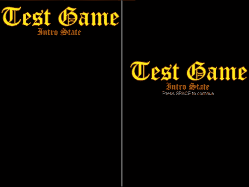
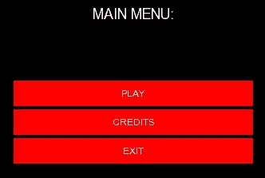

# 第五章. 我能暂停吗？ – 应用程序状态

一款软件，如视频游戏，很少像术语所暗示的那样简单。大多数时候，你不仅要处理游戏机制和渲染，还要处理这种应用程序。如今，行业标准的产品在游戏开始之前还包括一个很好的开场动画。它还有一个菜单，玩家可以用来开始游戏，管理它提供的不同设置，查看版权信息或退出应用程序。除此之外，本章标题还暗示了暂停游戏一会儿的可能性。事后看来，这样的简单便利性正是区分早期游戏（操作尴尬，可能令人困惑）和提供与市场上大多数游戏相同控制水平的产品之间的界限。为了为这样的想法提供支撑，在本章中，我们将涵盖以下内容：

+   实现状态管理器

+   升级事件管理器以处理不同状态

+   为我们的游戏介绍、主菜单和游戏玩法部分创建不同的状态

+   提供暂停游戏的方法

+   实现状态混合

+   将状态串联起来以创建连贯的应用程序流程

# 什么是状态？

在我们开始任何类型的实现之前，理解我们所处理的内容是必要的。如果你之前阅读过任何类型的游戏开发材料，你可能已经遇到了术语**状态**。它可以根据上下文有不同的含义。在这种情况下，状态是游戏中的许多不同层次之一，比如主菜单、在显示菜单之前播放的介绍，或者实际的游戏玩法。自然地，这些层次中的每一个都有自己的方式来更新自己并将内容渲染到屏幕上。当利用这个系统时，游戏开发者的工作是将给定的问题分解成单独的、可管理的状态以及它们之间的转换。这本质上意味着，如果你面临在游戏中添加菜单的问题，解决方案将是创建两个状态，一个用于菜单，一个用于你的游戏玩法，并在适当的时候在这两个状态之间进行转换。

# 最简单的方法

让我们先从新手解决这个问题的最常见方法开始说明。它首先列举了游戏可能具有的所有可能状态：

```cpp
enum class StateType{
    Intro = 1, MainMenu, Game, Paused, GameOver, Credits
};
```

良好的开始。现在让我们通过简单地使用`switch`语句来使用它：

```cpp
void Game::Update(){
  switch(m_state){
    case(StateType::Intro):
      UpdateIntro();
      break;
    case(StateType::Game):
      UpdateGame();
      break;
    case(StateType::MainMenu):
      UpdateMenu();
      break;
    ...
  }
}
```

同样，在屏幕上绘制它：

```cpp
void Game::Render(){
  switch(m_state){
    case(StateType::Intro):
      DrawIntro();
      break;
    case(StateType::Game):
      DrawGame();
      break;
    case(StateType::MainMenu):
      DrawMenu();
      break;
    ...
  }
}
```

虽然这种方法对于非常小的游戏来说是可行的，但可扩展性在这里完全是个问题。首先，随着状态的增加，switch 语句将继续增长。假设我们保持更新和渲染特定状态的功能仅本地化到一种方法，那么这些方法的数量也将随着每个状态至少增加两种方法而增长，其中一种用于更新，另一种用于渲染。记住，这是为了支持额外状态所需的**最小**扩展量。如果我们还为每个状态单独处理事件或执行某种类型的附加逻辑，如**延迟更新**，那么就是四个 switch 语句，每个状态一个额外的 switch 分支，以及四个必须实现并添加到分支中的额外方法。

接下来，考虑状态转换。如果你出于某种原因想在短时间内同时渲染两个状态，整个方法就会崩溃。仍然可以通过绑定一串标志或创建如下组合状态来以某种方式将那种功能组合在一起：

```cpp
enum StateType{
    Intro = 1, Intro_MainMenu, MainMenu, Game, MainMenu_Game
    Paused, GameOver, MainMenu_GameOver, Credits, MainMenu_Credits
    ...
    // Crying in the corner.
};
```

这种混乱的情况正变得越来越严重，我们甚至还没有开始扩展我们已有的庞大的 switch 语句，更不用说实现我们想要的全部状态了！

如果你到现在还没有考虑过迁移到不同的策略，请考虑以下最后一个观点：资源。如果你同时加载了游戏可能具有的所有可能状态的所有数据，那么从效率的角度来看，你可能会遇到相当大的问题。你可以动态分配代表某些状态的类，并检查它们何时不再使用，从而以某种方式释放它们，然而，这将在你已经几乎无法阅读的代码库中增加额外的混乱，而且既然你已经考虑使用类，为什么不做得更好呢？

# 介绍状态模式

在经过一些仔细的白板讨论和考虑之后，之前提到的问题都可以避免。之前已经提出过，不同的游戏状态可以简单地本地化到它们自己的类中。所有这些类都将共享相同的更新和渲染方法，这使得**继承**成为了当务之急。让我们看看我们的基础状态头文件：

```cpp
class StateManager;

class BaseState{
  friend class StateManager;
public:
  BaseState(StateManager* l_stateManager)
    :m_stateMgr(l_stateManager),m_transparent(false),
    m_transcendent(false){}
  virtual ~BaseState(){}

  virtual void OnCreate() = 0;
  virtual void OnDestroy() = 0;

  virtual void Activate() = 0;
  virtual void Deactivate() = 0;

  virtual void Update(const sf::Time& l_time) = 0;
  virtual void Draw() = 0;

  void SetTransparent(const bool& l_transparent){
    m_transparent = l_transparent;
  }
  bool IsTransparent()const{ return m_transparent; }
  void SetTranscendent(const bool& l_transcendence){
    m_transcendent = l_transcendence;
  }
  bool IsTranscendent()const{ return m_transcendent; }
  StateManager* GetStateManager(){ return m_stateMgr; }
protected:
  StateManager* m_stateMgr;
  bool m_transparent;
  bool m_transcendent;
};
```

首先，你会注意到我们正在使用`StateManager`类的**前向声明**。基类实际上不需要了解我们的状态管理器将如何实现，只需要知道它需要保持对其的指针。这样做也是为了避免**递归定义**，因为`StateManager`类头文件需要包含`BaseState`类头文件。

由于我们希望在整个状态中强制使用相同的方法，我们将它们定义为**纯虚**的，这意味着从 `BaseState` 继承的类必须实现每一个，以便项目可以编译。任何派生类必须实现的方 法包括 `OnCreate` 和 `OnDestroy`，这些方法在状态被创建并推入栈中时调用，稍后从栈中移除，`Activate` 和 `Deactivate`，这些方法在状态被移动到栈顶以及从栈顶位置移除时调用，最后是 `Update` 和 `Draw`，这些方法用于更新状态和绘制其内容。

关于这个类的一个需要注意的最后一点是，它有一对标志：`m_transparent` 和 `m_transcendent`。这些标志表示这个状态是否也需要渲染或更新其之前的状态。这消除了对状态之间不同转换的无数枚举的需求，并且可以自动完成，无需任何额外的扩展。

## 定义常见类型

我们肯定要保留从上一个示例中的状态类型枚举表：

```cpp
enum class StateType{
    Intro = 1, MainMenu, Game, Paused, GameOver, Credits
};
```

将状态类型枚举出来既方便又有助于自动化状态创建，您稍后将会看到。

我们还需要保留的另一个常见类型是我们将与状态一起使用的设备上下文。不要被这个名字迷惑，它仅仅意味着有一个指向我们最常用的一些类或“设备”的指针。因为不止一个，定义一个简单的结构来保留指向主窗口类和事件管理器的指针非常有用：

```cpp
struct SharedContext{
    SharedContext():m_wind(nullptr),m_eventManager(nullptr){}
    Window* m_wind;
    EventManager* m_eventManager;
};
```

这可以在需要时进行扩展，以保存有关玩家和其他处理资源分配、声音和网络辅助类的信息。

## 状态管理类

现在我们已经设置了辅助结构，让我们实际定义将在状态管理类中使用的类型，以保存信息。像往常一样，我们将使用类型定义，其美妙之处在于它们减少了在修改类型定义时需要更改的代码量。让我们首先看看状态容器类型：

```cpp
using StateContainer = std::vector<std::pair<StateType, BaseState*>>;
```

再次强调，我们正在使用一个向量。元素类型是我们状态类型和指向 `BaseState` 类型对象的指针的配对。你可能想知道为什么映射不是更好的选择，答案取决于你的实现想法，然而，一个主要因素是映射在容器中不保持类似栈的顺序，这对于我们希望状态管理器正确工作来说非常重要。

状态管理类中的一个设计决策也需要一个状态类型的容器，让我们定义一下：

```cpp
using TypeContainer = std::vector<StateType>;
```

如您所见，它只是一个 `StateType` 枚举类型的向量。

我们需要定义的最后一个类型是用于存储自定义函数的容器，这些函数将作为自动生成从 `BaseState` 类派生的不同类型对象的手段：

```cpp
using StateFactory = std::unordered_map<StateType, std::function<BaseState*(void)>>;
```

我们在这里使用无序映射来将特定的状态类型映射到将生成该类型的特定函数。如果现在听起来很困惑，请耐心等待。当我们实际使用它时，将会更详细地介绍。

### 定义状态管理器类

我们需要的所有单个部分现在都已齐备，因此让我们编写它：

```cpp
class StateManager{
public:
    StateManager(SharedContext* l_shared);
    ~StateManager();

    void Update(const sf::Time& l_time);
    void Draw();

    void ProcessRequests();

    SharedContext* GetContext();
    bool HasState(const StateType& l_type);

    void SwitchTo(const StateType& l_type);
    void Remove(const StateType& l_type);
private:
    // Methods.
    void CreateState(const StateType& l_type);
    void RemoveState(const StateType& l_type);

    template<class T>
    void RegisterState(const StateType& l_type){...}

    // Members.
    SharedContext* m_shared;
    StateContainer m_states;
    TypeContainer m_toRemove;
    StateFactory m_stateFactory;
};
```

构造函数接受一个指向我们之前提到的 `SharedContext` 类型的指针，它将在我们的主 `Game` 类中创建。不出所料，状态管理器也使用了 `Update` 和 `Draw` 方法，因为它将由 `Game` 类操作，并且保持接口熟悉是件好事。为了方便起见，它还提供了获取上下文以及确定当前是否具有某个状态在栈上的辅助方法。

在公共方法结束时，我们有 `SwitchTo`，它接受一个状态类型并将当前状态更改为与该类型相对应的状态，以及 `Remove`，用于通过其类型从状态栈中删除状态。

如果你从上到下查看类定义，你可能已经注意到我们有一个名为 `m_toRemove` 的 `TypeContainer` 成员。为了确保平稳且无错误的转换，我们不能在任何时候随意从状态容器中删除任何状态。这里的简单解决方案是跟踪我们想要删除的状态类型，并且只有在它们不再被使用时才删除它们，这就是 `ProcessRequests` 方法所做的工作。它在游戏循环的最后被调用，这确保了 `m_toRemove` 容器中的状态不再被使用。

让我们在下一节继续介绍更高级的私有方法和状态管理器类的实现。

### 实现状态管理器

为了保持我们在堆上自动创建状态的自动化方法，我们必须有一种定义它们如何创建的方式。`m_stateFactory` 成员是一个将状态类型映射到 `std::function` 类型的映射，我们可以通过使用 lambda 表达式来设置它以包含函数体：

```cpp
template<class T>
void RegisterState(const StateType& l_type){
    m_stateFactory[l_type] = [this]() -> BaseState*
    {
        return new T(this);
    };
}
```

上面的代码将 `m_stateFactory` 映射中的 `l_type` 类型映射到一个简单的函数，该函数返回新分配的内存的指针。我们在这里使用模板来减少代码量。因为每个状态在其构造函数中都需要指向 `StateManager` 类的指针，所以我们传递了 *this 指针*。我们现在可以像这样注册不同的状态：

```cpp
StateManager::StateManager(SharedContext* l_shared): m_shared(l_shared)
{
    RegisterState<State_Intro>(StateType::Intro);
    RegisterState<State_MainMenu>(StateType::MainMenu);
    RegisterState<State_Game>(StateType::Game);
    RegisterState<State_Paused>(StateType::Paused);
}
```

现在是时候开始实现类的其余部分了。让我们看看析构函数：

```cpp
StateManager::~StateManager(){
    for (auto &itr : m_states){
        itr.second->OnDestroy();
        delete itr.second;
    }
}
```

由于我们将任何状态的动态内存分配都本地化到这个类中，因此我们也有必要适当地释放内存。遍历所有状态并删除组成元素的配对的第二个值正是这样做的。

接下来，让我们看看如何实现绘制方法：

```cpp
void StateManager::Draw(){
  if (m_states.empty()){ return; }
  if (m_states.back().second->IsTransparent() && m_states.size() > 1)
  {
    auto itr = m_states.end();
    while (itr != m_states.begin()){
      if (itr != m_states.end()){
        if (!itr->second->IsTransparent()){
          break;
        }
      }
      --itr;
    }
    for (; itr != m_states.end(); ++itr){
      itr->second->Draw();
    }
  } else {
    m_states.back().second->Draw();
  }
}
```

首先，就像 `Update` 方法一样，我们检查状态容器是否至少有一个状态。如果有，我们检查最近添加的一个的**透明度标志**，以及栈上是否只有一个状态，否则透明度将没有用。如果栈上只有一个状态或者当前状态不是透明的，我们只需调用它的 `Draw` 方法。否则，事情会变得有点更有趣。

为了正确渲染透明状态，我们必须以正确的顺序调用它们的相应 `Draw` 方法，其中栈上最新的状态最后被绘制到屏幕上。为此，需要从状态向量中向后迭代，直到找到一个既不是透明的状态，或者是栈上的第一个状态，这正是 `while` 循环所做的事情。找到这样的状态后，`for` 循环将调用从找到的状态开始，包括最后一个状态的所有状态的 `Draw` 方法。这有效地以正确的顺序一次渲染多个状态。

更新状态时遵循相当类似的程序：

```cpp
void StateManager::Update(const sf::Time& l_time){
  if (m_states.empty()){ return; }
  if (m_states.back().second->IsTranscendent() && m_states.size() > 1)
  {
    auto itr = m_states.end();
    while (itr != m_states.begin()){
      if (itr != m_states.end()){
        if (!itr->second->IsTranscendent()){
          break;
        }
      }
      --itr;
    }
    for (; itr != m_states.end(); ++itr){
      itr->second->Update(l_time);
    }
  } else {
    m_states.back().second->Update(l_time);
  }
}
```

首先检查状态的单**超越**标志，以确定顶部状态是否允许其他状态更新。然后需要更新的状态或状态的 `Update` 方法被调用，传入的参数是经过的时间，通常称为**delta time**。

总是如此，我们需要为类定义一些辅助方法，使其真正灵活和有用：

```cpp
SharedContext* StateManager::GetContext(){ return m_shared; }

bool StateManager::HasState(const StateType& l_type){
  for (auto itr = m_states.begin();
    itr != m_states.end(); ++itr)
  {
    if (itr->first == l_type){
      auto removed = std::find(m_toRemove.begin(),
        m_toRemove.end(), l_type);
      if (removed == m_toRemove.end()){ return true; }
      return false;
    }
  }
  return false;
}
```

获取上下文的第一种方法相当直接。它只是返回对 `m_shared` 成员的指针。第二种方法简单地遍历 `m_states` 容器，直到找到一个类型为 `l_type` 的状态并返回 `true`。如果没有找到这样的状态，或者找到了但即将被移除，它返回 `false`。这为我们提供了一种检查特定状态是否在栈上的方法。

有一种方法可以移除状态，就像有方法添加状态一样必要。让我们实现公共方法 `Remove`：

```cpp
void StateManager::Remove(const StateType& l_type){
     m_toRemove.push_back(l_type);
}
```

这个方法将状态类型推入 `m_toRemove` 向量中，稍后由该方法处理：

```cpp
void StateManager::ProcessRequests(){
    while (m_toRemove.begin() != m_toRemove.end()){
        RemoveState(*m_toRemove.begin());
        m_toRemove.erase(m_toRemove.begin());
    }
}
```

这个类中最后被调用的方法 `ProcessRequests` 简单地遍历 `m_toRemove` 向量，并调用一个私有方法 `RemoveState`，该方法负责实际的资源释放。然后它移除元素，确保容器被清空。

能够更改当前状态至关重要，这正是 `SwitchTo` 方法所处理的：

```cpp
void StateManager::SwitchTo(const StateType& l_type){
  m_shared->m_eventManager->SetCurrentState(l_type);
  for (auto itr = m_states.begin();
    itr != m_states.end(); ++itr)
  {
    if (itr->first == l_type){
      m_states.back().second->Deactivate();
      StateType tmp_type = itr->first;
      BaseState* tmp_state = itr->second;
      m_states.erase(itr);
      m_states.emplace_back(tmp_type, tmp_state);
      tmp_state->Activate();
      return;
    }
  }

  // State with l_type wasn't found.
  if (!m_states.empty()){ m_states.back().second->Deactivate(); }
  CreateState(l_type);
  m_states.back().second->Activate();
}
```

首先，你会注意到我们通过共享上下文访问事件管理器并调用一个名为 `SetCurrentState` 的方法。我们还没有添加它，但是很快就会涉及到。它的作用是简单地修改事件管理器类的一个内部数据成员，这个成员跟踪游戏处于哪个状态。

接下来，我们必须找到我们想要切换到的类型的状态，因此我们遍历状态向量。如果我们找到一个匹配项，即将被推回的当前状态将调用其 `Deactivate` 方法以执行任何必要的功能，以防状态关心它被移动下来的时刻。然后，我们创建两个临时变量来保存状态类型和状态对象的指针，这样在通过调用 `erase` 从向量中移除我们感兴趣的元素时，我们不会丢失这些信息。完成这些后，所有指向状态容器的迭代器都无效了，但在我们的情况下，这并不重要，因为我们不再需要任何。移动所需状态现在就像将另一个元素推回向量并传入我们的临时变量一样简单。然后，我们调用刚刚移动进来的状态的 `Activate` 方法，以防它在那时需要执行任何逻辑。

如果找不到具有 `l_type` 的状态，则需要创建一个。然而，首先，重要的是检查是否至少有一个状态可以调用 `Deactivate` 方法，如果有，就调用它。在调用私有方法 `CreateState` 并传入状态类型之后，我们从状态向量中获取最近由 `CreateState` 添加的元素，并调用 `Activate`。

是时候看看创建一个状态究竟需要包含哪些内容了：

```cpp
void StateManager::CreateState(const StateType& l_type){
    auto newState = m_stateFactory.find(l_type);
    if (newState == m_stateFactory.end()){ return; }
    BaseState* state = newState->second();
    m_states.emplace_back(l_type, state);
    state->OnCreate();
}
```

创建一个状态工厂迭代器并检查它是否与 `std::unordered_map` 的 `end()` 方法返回的迭代器匹配，这样我们可以确保可以创建具有该类型的状态。如果可以，创建一个类型为 `BaseState` 的指针，称为 `state`。它捕获了我们的迭代器第二个值作为函数调用的返回结果，如果你记得，那是 `std::function` 类型，并返回一个指向新创建的状态类的指针。这就是我们如何使用之前提到的“工厂”。在检索到状态的新分配内存的指针后，我们只需将其推回状态向量并调用 `OnCreate` 以执行状态关于刚刚创建的内部逻辑。

我们如何移除一个状态？让我们看看：

```cpp
void StateManager::RemoveState(const StateType& l_type){
  for (auto itr = m_states.begin();itr != m_states.end(); ++itr)
  {
    if (itr->first == l_type){
      itr->second->OnDestroy();
      delete itr->second;
      m_states.erase(itr);
      return;
    }
  }
}
```

当处理 `std::vector` 类型时，我们遍历它直到找到匹配项。移除实际状态的过程是从调用该状态的 `OnDestroy` 方法开始的，再次强调，这是为了让它执行任何必要的逻辑以便准备好被移除。然后我们简单地使用 `delete` 关键字来释放内存。最后，我们从状态向量中删除元素并从方法中返回。

# 改进事件管理器类

在游戏中存在不同的状态无疑会创造需要相同键或事件的场景，至少有两个状态会需要。假设我们有一个菜单，通过按箭头键进行导航。这都很好，但如果游戏状态也注册了箭头键的使用并设置了它自己的回调呢？最好的情况是所有状态的回调将同时被调用并产生奇怪的行为。然而，当你有指向不再内存中的方法的函数指针时，事情变得更糟，特别是没有人喜欢应用程序崩溃。处理这个问题的简单方法是将回调按状态分组，并且只有在当前状态是回调状态时才调用它们。这显然意味着需要对正在处理的数据类型进行一些重新定义：

```cpp
using CallbackContainer = std::unordered_map<std::string, std::function<void(EventDetails*)>>;
enum class StateType;
using Callbacks = std::unordered_map<StateType, CallbackContainer>;
```

现在事情变得有点复杂了。之前是`Callback`定义的地方现在被重命名为`CallbackContainer`。我们每个状态只想有一个这样的，这意味着我们需要使用另一个映射，这就是新的`Callback`定义出现的地方。它将状态类型映射到`CallbackContainer`类型，这样我们就可以在每个状态中只有一个`CallbackContainer`，同时每个名称也只有一个回调函数。

尽管有这些变化，事件管理器头文件中`m_callbacks`的声明保持不变：

```cpp
Callbacks m_callbacks;
```

类数据成员列表中增加了一个小的内容，那就是当前状态：

```cpp
StateType m_currentState;
```

然而，改变的是添加、移除和利用回调的方法。让我们将`AddCallback`方法适应这些变化：

```cpp
template<class T>
bool AddCallback(StateType l_state, const std::string& l_name,void(T::*l_func)(EventDetails*), T* l_instance)
{
    auto itr = m_callbacks.emplace(l_state, CallbackContainer()).first;
    auto temp = std::bind(l_func, l_instance,std::placeholders::_1);
    return itr->second.emplace(l_name, temp).second;
}
```

首先要注意的是，我们在方法签名中有一个新的参数`l_state`。接下来，我们尝试向`m_callbacks`映射中插入一个新元素，将状态参数和一个新的`CallbackContainer`配对。由于映射只能有一个具有特定索引的元素，在这种情况下是状态类型，`emplace`方法总是返回一个元素对，其中第一个元素是一个迭代器。如果插入成功，迭代器指向新创建的元素。另一方面，如果已经存在具有指定索引的元素，迭代器将指向该元素。这是一个很好的策略，因为我们无论如何都需要那个迭代器，如果没有我们指定的索引的元素，我们想要插入一个。

函数绑定之后，它保持不变，我们需要将实际的回调插入到`CallbackContainer`类型中，这是构成`m_callbacks`元素的配对中的第二个值。映射插入方法返回的配对的第二个值是一个布尔值，表示插入的成功，这就是用于错误检查返回的内容。

现在让我们来看看修改回调移除的方法：

```cpp
bool RemoveCallback(StateType l_state, const std::string& l_name){
    auto itr = m_callbacks.find(l_state);
    if (itr == m_callbacks.end()){ return false; }
    auto itr2 = itr->second.find(l_name);
    if (itr2 == itr->second.end()){ return false; }
    itr->second.erase(l_name);
    return true;
}
```

这个相当简单。我们只是使用`find`方法两次而不是一次。首先，我们在第一个映射中`find`到状态对，然后就像之前一样，通过名称在第二个映射中`erase`实际的回调。

使其按我们想要的方式工作的最后一部分是修复回调函数实际调用的方式。由于类型定义发生了变化，我们调用回调的方式也略有不同：

```cpp
void EventManager::Update(){
  ...
  if (bind->m_events.size() == bind->c){
    auto stateCallbacks = m_callbacks.find(m_currentState);
    auto otherCallbacks = m_callbacks.find(StateType(0));

    if (stateCallbacks != m_callbacks.end()){
      auto callItr = stateCallbacks->second.find(bind->m_name);
      if (callItr != stateCallbacks->second.end()){
        // Pass in information about events.
        callItr->second(&bind->m_details);
      }
    }

    if (otherCallbacks != m_callbacks.end()){
      auto callItr = otherCallbacks->second.find(bind->m_name);
      if (callItr != otherCallbacks->second.end()){
        // Pass in information about events.
        callItr->second(&bind->m_details);
      }
    }
  }
  ...
}
```

这里的主要区别是现在有两个状态需要检查回调，而不仅仅是其中一个：`stateCallbacks`和`otherCallbacks`。前者相当明显，我们只是使用`find`来获取当前状态的回调映射。然而，后者传递了一个状态类型值`0`，这不是一个有效的状态类型，因为枚举从`1`开始。这样做是因为即使在游戏中存在多个状态的情况下，我们仍然希望处理`Window`类的全局回调，以及其他超出简单状态范围并持续整个应用程序生命周期的类。任何状态类型为`0`的都将被调用，无论我们处于哪个状态。

其余部分相当直接。就像之前一样，我们使用从第一次搜索返回的迭代器的第二个值中的`find`方法，这实际上是我们真正的回调映射。如果找到匹配项，函数将被调用。

我们在这里想要做的最后一件事是修改`keys.cfg`文件，以便为我们保留一些额外的键，以便以后使用：

```cpp
Window_close 0:0
Fullscreen_toggle 5:89
Intro_Continue 5:57
Mouse_Left 9:0
Key_Escape 5:36
Key_P 5:15
```

`Intro_Continue`绑定代表空格键的“按下”事件，`Mouse_Left`是鼠标左键点击事件，`Key_Escape`绑定到*ESC*“按下”事件，最后，`Key_P`代表字母*P*“按下”事件。

# 集成状态管理器

虽然现在还不是欢庆的时候，但兴奋之情确实在所难免，因为我们可以最终开始使用我们全新的`StateManager`类了！对`Game`类头文件的修改是一个良好的开端：

```cpp
...
#include "StateManager.h"
...
class Game{
public:
    ...
    void LateUpdate();
private:
    ...
    StateManager m_stateManager;
};
```

将新的数据成员附加到`Game`类并添加一个新的方法以进行后期更新，这些都是需要在头文件中进行的调整。让我们调整`Game`构造函数以初始化状态管理器：

```cpp
Game::Game(): m_window("Chapter 5", sf::Vector2u(800, 600)), m_stateManager(&m_context)
{
    ...
    m_context.m_wind = &m_window;
    m_context.m_eventManager = m_window.GetEventManager();
    m_stateManager.SwitchTo(StateType::Intro);
}
```

自然地，我们首先创建将被所有状态使用的上下文，并将其传递给状态管理器的构造函数。然后我们开始“多米诺效应”，切换到介绍状态，这将最终切换到其他状态并强制应用程序的流程。

最后，让我们调整`Game`类中最重要三种方法：

```cpp
void Game::Update(){
    m_window.Update();
    m_stateManager.Update(m_elapsed);
}
void Game::Render(){
    m_window.BeginDraw();
    m_stateManager.Draw();
    m_window.EndDraw();
}
void Game::LateUpdate(){
    m_stateManager.ProcessRequests();
    RestartClock();
}
```

这已经很直接了。需要注意的是，`RestartClock`方法现在由`LateUpdate`调用，这意味着我们必须按照以下方式调整`main.cpp`文件：

```cpp
#include "Game.h"

void main(int argc, void** argv[]){
    // Program entry point.
    Game game;
    while(!game.GetWindow()->IsDone()){
        game.Update();
        game.Render();
        game.LateUpdate();
    }
}
```

现在一切似乎都井然有序。编译并启动应用程序应该会给你一个非常令人印象深刻的黑色屏幕。太棒了！让我们实际上为游戏创建一些状态，以表彰为此付出的努力。

# 创建介绍状态

从介绍状态开始似乎很合适，这样同时也给状态管理器一个介绍。一如既往，一个好的开始是从头文件开始，让我们开始吧：

```cpp
class State_Intro : public BaseState{
public:
    ...
    void Continue(EventDetails* l_details);
private:
    sf::Texture m_introTexture;
    sf::Sprite m_introSprite;
    sf::Text m_text;
    float m_timePassed;
};
```

`State_Intro` 类，就像我们将要构建的所有其他状态类一样，继承自 `BaseState` 类。基类中的所有纯虚方法都必须在这里实现。除此之外，我们还有一个名为 `Continue` 的独特方法以及一些将在该状态下使用的私有数据成员。不出所料，我们将在屏幕上渲染一个精灵以及一些文本。位于最底部的浮点数据成员将用于跟踪我们在该状态下花费的时间，以便在经过一定间隔后，用户能够按下空格键进入主菜单。`Continue` 方法负责处理这个转换。

## 实现介绍状态

我们即将完成我们的第一个功能状态！现在需要完成的是在头文件中声明的实际方法的实现，这样我们就可以大功告成了。让我们首先在 `State_Intro.cpp` 中包含我们类的头文件：

```cpp
#include "State_Intro.h"
#include "StateManager.h"
```

注意第二行。因为 `StateManager` 类在 `BaseState` 头文件中是前向声明的，所以我们*必须*在实现文件中包含状态管理器头文件。这对于我们将要构建的任何状态都适用，包括这个。

我们永远不会使用我们状态的结构体和析构函数来初始化或分配任何东西，而是依赖于 `OnCreate` 和 `OnDestroy` 方法来保持对资源分配和释放实际发生时间的最大控制：

```cpp
void State_Intro::OnCreate(){
  m_timePassed = 0.0f;

  sf::Vector2u windowSize = m_stateMgr->GetContext()->
    m_wind->GetRenderWindow()->getSize();

  m_introTexture.loadFromFile("intro.png");
  m_introSprite.setTexture(m_introTexture);
  m_introSprite.setOrigin(m_introTexture.getSize().x / 2.0f,
    m_introTexture.getSize().y / 2.0f);

  m_introSprite.setPosition(windowSize.x / 2.0f, 0);

  m_font.loadFromFile("arial.ttf");
  m_text.setFont(m_font);
  m_text.setString({ "Press SPACE to continue" });
  m_text.setCharacterSize(15);
  sf::FloatRect textRect = m_text.getLocalBounds();
  m_text.setOrigin(textRect.left + textRect.width / 2.0f,
    textRect.top + textRect.height / 2.0f);
  m_text.setPosition(windowSize.x / 2.0f, windowSize.y / 2.0f);

  EventManager* evMgr = m_stateMgr->
    GetContext()->m_eventManager;
  evMgr->AddCallback(StateType::Intro,"Intro_Continue",
    &State_Intro::Continue,this);
}
```

然而，代码量相当大，但到目前为止，其中只有一小部分对我们来说是新的。首先，我们必须将我们的数据成员 `m_timePassed` 初始化为零。接下来，我们通过从基类使用状态管理器指针来获取共享上下文，并使用它来获取当前窗口大小。

为了将 `m_text` 正好放置在屏幕中间，我们首先将其原点设置为绝对中心，这是通过首先调用我们的 `sf::text` 对象的 `getLocalBounds` 方法来获取一个 `sf::FloatRect` 数据类型来完成的。`sf::FloatRect` 的左和上值代表文本的左上角，可以通过向其添加矩形大小的一半来计算中心。

### 提示

如果对字符大小、字符串或 `sf::text` 对象使用的字体进行了任何更改，则必须重新计算原点，因为局部边界矩形的物理尺寸也发生了变化。

这个介绍状态的基本想法是让一个精灵从屏幕顶部下降到中间。经过五秒钟后，一些文本将出现在精灵下方，通知用户可以按空格键进入主菜单。这是我们将会使用的下降精灵纹理：


我们最后需要做的是将空格键绑定到我们介绍类的`Continue`方法。我们通过共享上下文获取事件管理器实例并设置回调来实现，这与上一章的做法几乎相同，只是这次我们需要一个额外的参数：状态类型。

即使这个类没有分配任何内存，但在移除时仍然很重要，它需要移除其回调，这可以在下面这样做：

```cpp
void State_Intro::OnDestroy(){
    EventManager* evMgr = m_stateMgr->GetContext()->m_eventManager;
    evMgr->RemoveCallback(StateType::Intro,"Intro_Continue");
}
```

就像`AddCallback`方法一样，移除回调也要求第一个参数为状态类型。

由于我们在这里处理的是时间和移动，因此更新这个状态将是必要的：

```cpp
void State_Intro::Update(const sf::Time& l_time){
  if(m_timePassed < 5.0f){ // Less than five seconds.
    m_timePassed += l_time.asSeconds();
    m_introSprite.setPosition(m_introSprite.getPosition().x,
      m_introSprite.getPosition().y + (48 * l_time.asSeconds()));
  }
}
```

由于只希望精灵移动到中间，因此定义了一个五秒钟的窗口。如果总时间少于这个值，我们将 delta time 参数添加到下一次迭代中，并以每秒一定像素数在 y 方向上移动精灵，同时保持 x 方向不变。这保证了垂直移动，当然，除非我们绘制一切，否则这是完全无用的：

```cpp
void State_Intro::Draw(){
    sf::RenderWindow* window = m_stateMgr->GetContext()->m_wind->GetRenderWindow();

    window->draw(m_introSprite);
    if(m_timePassed >= 5.0f){
        window->draw(m_text);
    }
}
```

在通过共享上下文获得窗口指针后，我们在屏幕上绘制精灵。如果已经过去五秒钟以上，我们还会绘制文本，通知玩家可以继续通过介绍状态，这是最后一部分的拼图：

```cpp
void State_Intro::Continue(){
    if(m_timePassed >= 5.0f){
        m_stateMgr->SwitchTo(StateType::MainMenu);
        m_stateMgr->Remove(StateType::Intro);
    }
}
```

再次检查是否已经过去足够的时间以继续到下一个状态。实际的切换发生在调用`SwitchTo`方法时。由于我们不再需要在栈中保留介绍状态，它将在下一行自行移除。

尽管我们不需要最后两种方法，但我们仍然需要实现它们的空版本，如下所示：

```cpp
void State_Intro::Activate(){}
void State_Intro::Deactivate(){}
```

现在是时候吹响号角了！我们的第一个状态已经完成，并准备好使用。构建和启动你的应用程序应该会得到类似这样的结果：



如上图所示，精灵下降到屏幕中间，并在五秒后显示继续的提示信息。按下空格键后，你将发现自己在一个黑色窗口中，因为我们还没有实现主菜单状态。

从这一点开始，所有重复的代码都将被省略。对于完整的源代码，请查看本章的源文件。

# 主菜单状态

任何游戏的主菜单在应用程序流程中都是一个重要的部分，尽管它通常被忽视。是我们尝试构建一个的时候了，尽管是一个非常简化的版本，就像往常一样，从头文件开始：

```cpp
class State_MainMenu : public BaseState{
public:
    ...
    void MouseClick(EventDetails* l_details);
private:
    sf::Text m_text;

    sf::Vector2f m_buttonSize;
    sf::Vector2f m_buttonPos;
    unsigned int m_buttonPadding;

    sf::RectangleShape m_rects[3];
    sf::Text m_labels[3];
};
```

这个类独特的功能是`MouseClick`方法。由于我们在这里处理的是一个菜单，可以预见它将用于处理鼠标输入。对于私有数据成员，我们有一个用于标题的文本变量，按钮的大小、位置和填充大小变量，按钮的可绘制矩形以及按钮标签的文本变量。让我们把它们放在一起：

```cpp
void State_MainMenu::OnCreate(){
  m_font.loadFromFile("arial.ttf");
  m_text.setFont(m_font);
  m_text.setString(sf::String("MAIN MENU:"));
  m_text.setCharacterSize(18);

  sf::FloatRect textRect = m_text.getLocalBounds();
  m_text.setOrigin(textRect.left + textRect.width / 2.0f,
    textRect.top + textRect.height / 2.0f);

  m_text.setPosition(400,100);

  m_buttonSize = sf::Vector2f(300.0f,32.0f);
  m_buttonPos = sf::Vector2f(400,200);
  m_buttonPadding = 4; // 4px.

  std::string str[3];
  str[0] = "PLAY";
  str[1] = "CREDITS";
  str[2] = "EXIT";

  for(int i = 0; i < 3; ++i){
    sf::Vector2f buttonPosition(m_buttonPos.x,m_buttonPos.y + 
      (i * (m_buttonSize.y + m_buttonPadding)));
    m_rects[i].setSize(m_buttonSize);
    m_rects[i].setFillColor(sf::Color::Red);

    m_rects[i].setOrigin(m_buttonSize.x / 2.0f,
      m_buttonSize.y / 2.0f);
    m_rects[i].setPosition(buttonPosition);

    m_labels[i].setFont(m_font);
    m_labels[i].setString(sf::String(str[i]));
    m_labels[i].setCharacterSize(12);

    sf::FloatRect rect = m_labels[i].getLocalBounds();
    m_labels[i].setOrigin(rect.left + rect.width / 2.0f,
      rect.top + rect.height / 2.0f);

    m_labels[i].setPosition(buttonPosition);
  }

  EventManager* evMgr = m_stateMgr->
    GetContext()->m_eventManager;
  evMgr->AddCallback(StateType::MainMenu,"Mouse_Left",
    &State_MainMenu::MouseClick,this);
}
```

在上述方法中，所有图形元素都得到了设置。定义了文本数据成员，设置了原点，并为单个按钮命名了标签。最后，设置了鼠标左键点击的回调。这绝对不是一个复杂的 GUI 系统。然而，在后面的章节中，我们将介绍一种更健壮的设计方法，但就目前而言，这将满足我们的需求。

当状态被销毁时，我们需要移除其回调，如前所述：

```cpp
void State_MainMenu::OnDestroy(){
    EventManager* evMgr = m_stateMgr->GetContext()->m_eventManager;
    evMgr->RemoveCallback(StateType::MainMenu,"Mouse_Left");
}
```

当状态被激活时，我们需要检查主游戏状态是否存在于状态堆栈中，以便调整“play”按钮以显示“继续”：

```cpp
void State_MainMenu::Activate(){
    if(m_stateMgr->HasState(StateType::Game) && m_labels[0].getString() == "PLAY")
    {
        m_labels[0].setString(sf::String("RESUME"));
        sf::FloatRect rect = m_labels[0].getLocalBounds();
        m_labels[0].setOrigin(rect.left + rect.width / 2.0f,rect.top + rect.height / 2.0f);
    }
}
```

### 注意

文本原点需要重新计算，因为`sf::drawable`对象的尺寸现在不同了。

`MouseClick`方法可以按以下方式实现：

```cpp
void State_MainMenu::MouseClick(EventDetails* l_details){
  sf::Vector2i mousePos = l_details->m_mouse;

  float halfX = m_buttonSize.x / 2.0f;
  float halfY = m_buttonSize.y / 2.0f;
  for(int i = 0; i < 3; ++i){
    if(mousePos.x >= m_rects[i].getPosition().x - halfX &&
      mousePos.x <= m_rects[i].getPosition().x + halfX &&
      mousePos.y >= m_rects[i].getPosition().y - halfY &&
      mousePos.y <= m_rects[i].getPosition().y + halfY)
    {
      if(i == 0){
        m_stateMgr->SwitchTo(StateType::Game);
      } else if(i == 1){
        // Credits state.
      } else if(i == 2){
        m_stateMgr->GetContext()->m_wind->Close();
      }
    }
  }
}
```

首先，我们从事件信息结构中获取鼠标位置，该结构作为参数传递。然后我们设置一些局部浮点类型变量，这些变量将被用来检查按钮的边界，并开始遍历所有按钮。由于每个按钮的原点都设置为绝对中间，我们必须在检查鼠标位置是否在矩形内时根据这个进行调整。如果我们有一个鼠标到按钮的碰撞，一个 if-else 语句会检查哪个 ID 发生了碰撞，并相应地执行操作。在“play”按钮被按下的情况下，我们切换到游戏状态。如果退出按钮被按下，我们通过共享上下文调用`Window::Close`方法。

最后，让我们绘制主菜单：

```cpp
void State_MainMenu::Draw(){
    sf::RenderWindow* window = m_stateMgr->GetContext()->m_wind->GetRenderWindow();
    window->draw(m_text);
    for(int i = 0; i < 3; ++i){
        window->draw(m_rects[i]);
        window->draw(m_labels[i]);
    }
}
```

通过共享上下文获取渲染窗口指针后，绘制整个菜单就像迭代几次来绘制一个按钮和一个标签一样简单。

在成功编译和执行后，我们再次看到主界面。当按下空格键时，主菜单打开，看起来像这样：



这并不是世界上最漂亮的样子，但它完成了工作。点击**PLAY**按钮一次会留下一个黑屏，而点击**EXIT**会关闭应用程序。整洁！

# 一个示例游戏状态

为了展示我们系统的完整使用，让我们在屏幕上得到一些弹跳的东西，这将展示在菜单、游戏和暂停状态之间的切换。为了测试目的，前几章中的弹跳蘑菇就足够了。我们还需要切换到菜单状态和暂停状态的方法。知道了这一点，让我们为游戏状态编写头文件：

```cpp
class State_Game : public BaseState{
public:
    ...
    void MainMenu(EventDetails* l_details);
    void Pause(EventDetails* l_details);
private:
    sf::Texture m_texture;
    sf::Sprite m_sprite;
    sf::Vector2f m_increment;
};
```

我们开始，就像许多其他时候一样，在`OnCreate`方法中进行资源分配和数据成员的设置：

```cpp
void State_Game::OnCreate(){
    m_texture.loadFromFile("Mushroom.png");
    m_sprite.setTexture(m_texture);
    m_sprite.setPosition(0,0);
    m_increment = sf::Vector2f(400.0f,400.0f);

    EventManager* evMgr = m_stateMgr->GetContext()->m_eventManager;
    evMgr->AddCallback(StateType::Game,"Key_Escape",&State_Game::MainMenu,this);
    evMgr->AddCallback(StateType::Game,"Key_P",&State_Game::Pause,this);
}
```

在加载纹理并将精灵绑定到它之后，我们设置其位置，定义增量向量，就像之前一样，并添加回调到我们额外的两个方法以切换到不同的状态。当然，我们需要在状态销毁时移除它们，如下所示：

```cpp
void State_Game::OnDestroy(){
    EventManager* evMgr = m_stateMgr->GetContext()->m_eventManager;
    evMgr->RemoveCallback(StateType::GAME,"Key_Escape");
    evMgr->RemoveCallback(StateType::GAME,"Key_P");
}
```

更新方法将保持我们之前使用的相同代码：

```cpp
void State_Game::Update(const sf::Time& l_time){
  sf::Vector2u l_windSize = m_stateMgr->GetContext()->
    m_wind->GetWindowSize();
  sf::Vector2u l_textSize = m_texture.getSize();

  if((m_sprite.getPosition().x > l_windSize.x - 
    l_textSize.x && m_increment.x > 0) ||
    (m_sprite.getPosition().x < 0 && m_increment.x < 0))
  {
      m_increment.x = -m_increment.x;
  }

  if((m_sprite.getPosition().y > l_windSize.y -
    l_textSize.y && m_increment.y > 0) ||
    (m_sprite.getPosition().y < 0 && m_increment.y < 0))
  {
      m_increment.y = -m_increment.y;
  }

  m_sprite.setPosition(m_sprite.getPosition().x + 
    (m_increment.x * l_time.asSeconds()), 
    m_sprite.getPosition().y + 
    (m_increment.y * l_time.asSeconds()));
}
```

检查精灵位置，如果它在窗口边界之外，则适当的轴上的增量向量被反转。然后，更新精灵位置，考虑到帧之间的时间差。就像时钟一样规律。让我们在屏幕上绘制精灵：

```cpp
void State_Game::Draw(){
    m_stateMgr->GetContext()->m_wind->GetRenderWindow()->draw(m_sprite);
}
```

现在让我们实现切换状态的方法：

```cpp
void State_Game::MainMenu(EventDetails* l_details){ 
    m_stateMgr->SwitchTo(StateType::MAIN_MENU); 
}

void State_Game::Pause(EventDetails* l_details){ 
    m_stateMgr->SwitchTo(StateType::PAUSED); 
}
```

注意，游戏状态在这里并没有删除自己，就像主菜单状态一样。这意味着它仍然在内存中，并等待被推回到向量前面以更新和重新渲染。这使用户能够在任何时间点返回主菜单并恢复游戏状态，而不会丢失进度。

现在运行应用程序将带我们通过介绍状态进入主菜单。按下**PLAY**按钮将出现一个弹跳的蘑菇，就像之前一样：


现在按下 Esc 键将带您回到主菜单，此时您可以点击**RESUME**按钮返回游戏状态，或者点击**EXIT**按钮退出应用程序。只剩下一个状态需要实现，才能完全展示这个系统的能力！

# 暂停的方式

有些人可能会简单地认为从游戏状态导航到主菜单是将游戏暂停的一种方式。虽然这在技术上是真的，但为什么不探索第二种选项，它看起来比简单地弹出主菜单更时尚？在写了这么多代码之后，我们值得一个看起来很棒的暂停状态：

```cpp
class State_Paused : public BaseState{
public:
    ...
    void Unpause(EventDetails* l_details);
private:
    sf::Text m_text;
    sf::RectangleShape m_rect;
};
```

这个很简单。再次定义一个额外的方法，在这种情况下是`Unpause`，以切换到不同的状态。同时，也只使用了两个数据成员来在屏幕上绘制“PAUSED”文本，以及一个漂亮的半透明背景，由`sf::RectangleShape`表示。让我们在这个章节中最后一次实现`OnCreate`方法：

```cpp
void State_Paused::OnCreate(){
    SetTransparent(true); // Set our transparency flag.
    m_font.loadFromFile("arial.ttf");
    m_text.setFont(m_font);
    m_text.setString(sf::String("PAUSED"));
    m_text.setCharacterSize(14);
    m_text.setStyle(sf::Text::Bold);

    sf::Vector2u windowSize = m_stateMgr->GetContext()->m_wind->GetRenderWindow()->getSize();

    sf::FloatRect textRect = m_text.getLocalBounds();
    m_text.setOrigin(textRect.left + textRect.width / 2.0f,textRect.top + textRect.height / 2.0f);
    m_text.setPosition(windowSize.x / 2.0f, windowSize.y / 2.0f);

    m_rect.setSize(sf::Vector2f(windowSize));
    m_rect.setPosition(0,0);
    m_rect.setFillColor(sf::Color(0,0,0,150));

    EventManager* evMgr = m_stateMgr->GetContext()->m_eventManager;
    evMgr->AddCallback(StateType::Paused,"Key_P",&State_Paused::Unpause,this);
}
```

这里的一个显著区别是使用了`m_transparent`标志，它是`BaseState`类的一个受保护的数据成员。将其设置为 true 意味着我们允许状态管理器直接在状态堆栈中渲染此状态之后的状态。

除了这些，我们创建一个与整个窗口大小相同的矩形，并将其填充颜色设置为黑色，alpha 通道值为 255 中的 150。这使得它既透明又暗淡，使其背后的所有东西都变暗。

上文所述方法的最后一部分，与其他所有方法一样，是将回调函数添加到`Unpause`方法中。当此状态被销毁时，需要像这样将其移除：

```cpp
void State_Paused::OnDestroy(){
    EventManager* evMgr = m_stateMgr->GetContext()->m_eventManager;
    evMgr->RemoveCallback(StateType::Paused,"Key_P");
}
```

现在让我们绘制我们创建的矩形和文字：

```cpp
void State_Paused::Draw(){
    sf::RenderWindow* wind = m_stateMgr->GetContext()->m_wind->GetRenderWindow();
    wind->draw(m_rect);
    wind->draw(m_text);
}
```

此外，让我们通过简单地切换到游戏状态来实现`Unpause`方法：

```cpp
void State_Paused::Unpause(EventDetails* l_details){ 
    m_stateMgr->SwitchTo(StateType::Game); 
}
```

由于主游戏状态是目前唯一可以暂停的状态，因此只需简单地切换回它就足够了。

现在，深呼吸并再次编译应用程序。通过跳过初始状态，点击主菜单中的**PLAY**按钮，以及按下键盘上的**P**键，将有效地暂停游戏状态并微妙地变暗屏幕，同时在中间显示**PAUSED**文字，如图所示：


如果你已经走到这一步，恭喜你！虽然这绝对不是一个成品，但它已经从几乎无法控制的静态、不可移动的类走了很长的路。

# 常见错误

在使用此系统时可能犯的一个常见错误是未注册新添加的状态。如果你构建了一个状态，当你切换到它时它只是简单地显示一个黑色屏幕，那么很可能是它从未在`StateManager`的构造函数中注册。

窗口对按下**F5**键或点击关闭按钮没有反应是全局回调没有正确设置的标志。为了确保无论处于何种状态都会调用回调，它必须设置为状态类型 0，如下所示：

```cpp
m_eventManager->AddCallback(StateType(0),"Fullscreen_toggle",
    &Window::ToggleFullscreen,this);
m_eventManager->AddCallback(StateType(0),"Window_close",
    &Window::Close,this);
```

最后，记住当在主菜单状态中检索鼠标位置时，事件内部存储的坐标是自动相对于窗口的。通过`sf::Mouse::GetPosition`获取坐标不会做同样的事情，除非提供一个`sf::Window`类的引用作为参数。

# 摘要

当本章结束时，你应该已经拥有了制作可以透明、批量更新并由我们代码库的其他部分支持的状态的工具。没有必要就此止步。再次构建它，让它变得更好、更快，并实现本章未涉及的不同功能。扩展它，崩溃它，修复它并从中学习。永远没有足够好的东西，所以在这里构建你获得的知识。

> *一句著名的中国谚语说：“人生如棋，每一步都在变”。*

虽然这个类比是正确的，但生活也可以像是一个具有不同状态的游戏。将其分解成更小、更易于管理的部分，会使处理起来容易得多。无论是生活模仿代码还是代码模仿生活，这都不重要。伟大的想法来自于不同背景的融合。希望到这一章结束时，你不仅掌握了如何构建另一个管理者的知识，而且也拥有了从每一个可用资源和想法中寻求灵感的智慧。没有专属的知识，只有包容性的思维。下一章见！
