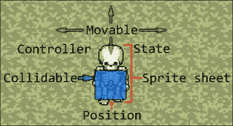
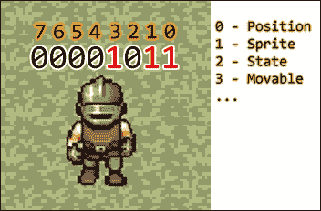
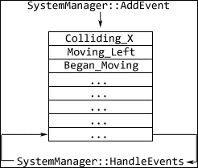
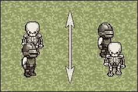
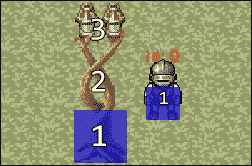
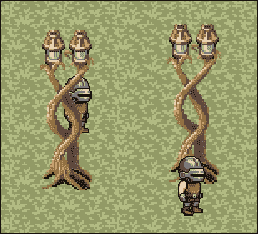
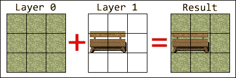
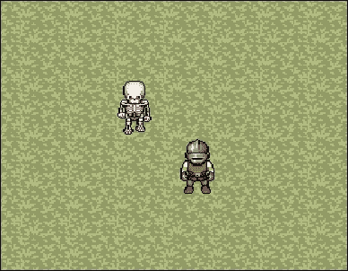

# 第八章. 知识越多越好 – 常见游戏编程模式

随着我们这本书过半，我们游戏中的功能和装饰将越来越复杂。为了正确展示它们，我们最终项目的类型将是一个经典的二维 **角色扮演游戏**，采用正交投影。随着我们的代码库以快速的速度增长，糟糕的设计很快就会变得难以维护，甚至难以管理。随着新功能的添加，我们希望代码的扩展变得容易，而不是减慢整体过程。这正是游戏编程模式最闪耀的地方。

在本章中，我们将涵盖：

+   实体组件系统的设计和实现

+   使用观察者模式进行跨系统通信

+   渲染顺序

+   地图层的实现

让我们不要浪费时间，直接进入使我们的代码库更健壮的步骤！

# 版权资源的利用

再次提醒，在开始本章之前，我们希望对应该给予的赞誉给予应有的认可。本书第三个项目的图形资源包括但不限于：

由 *wulax* 根据 CC-BY-SA 3.0 和 GPL 3.0 许可证提供的 *[LPC] 中世纪幻想角色精灵*：

[`opengameart.org/content/lpc-medieval-fantasy-character-sprites`](http://opengameart.org/content/lpc-medieval-fantasy-character-sprites)

由 *Hyptosis* 提供 *大量免费的 2D 瓦片和精灵*，根据 CC-BY 3.0 许可证：

[`opengameart.org/content/lots-of-free-2d-tiles-and-sprites-by-hyptosis`](http://opengameart.org/content/lots-of-free-2d-tiles-and-sprites-by-hyptosis)

适用于这些资源使用的所有许可证都可以在这里找到：

+   [`creativecommons.org/licenses/by/3.0/`](http://creativecommons.org/licenses/by/3.0/)

+   [`creativecommons.org/licenses/by-sa/3.0/`](http://creativecommons.org/licenses/by-sa/3.0/)

+   [`www.gnu.org/licenses/gpl-3.0.html`](http://www.gnu.org/licenses/gpl-3.0.html)

# 什么是编程模式？

编程模式，或称为设计模式，是针对特定问题的可重用和广泛实施的解决方案。这并不是说这些模式作为某种库存在，尽管基于它们的库是存在的。相反，编程模式更多的是一种想法或策略。它是对解决某个问题的精心设计的计划，是对给定问题情境的最佳可能答案，这是经过时间和经验证明的，这也是它们应该被使用的一个最好的理由。

现在有很多设计模式，以及书籍、教程甚至专门用于理解和实现它们的课程。为了我们的目的，我们将介绍四种：实体组件系统、事件队列、观察者和工厂模式。我们将分别讨论每一个，尽管它们在功能上不重叠，但它们可以一起工作。

# 实体组件系统

**实体组件系统**是一种编程模式，它允许实体通过组合的方式拥有属性和功能，而不是通过继承。使用这种模式的最大好处包括逻辑更强的解耦、更容易的实体序列化和反序列化、更好的代码重用性以及创建新实体的简便性。然而，它确实会给你的代码库增加相当多的复杂性。

这种模式的典型实现包括三个部分：

+   **实体**：在大多数情况下，实体几乎只是标识符，被贴在一系列组件上

+   **组件**是实体的构建块，它们不过是数据的集合

+   **系统**：这些是专门处理非常特定任务的类，并负责持有这个范式中的所有逻辑

除了处理这三种不同的元素类型外，我们的实体组件系统还需要一个实体管理器来保存和管理所有实体和组件数据，以及系统管理器，它将负责更新每个系统，此外还有一些我们很快会介绍的功能。

为了区分不同类型的组件和系统，我们将创建一个新的头文件，`ECS_Types.h`，该文件将用于存储这些信息：

```cpp
using ComponentType = unsigned int;
#define N_COMPONENT_TYPES 32

enum class Component{
 Position = 0, SpriteSheet, State, Movable, Controller, Collidable
};

enum class System{
 Renderer = 0, Movement, Collision, Control, State, SheetAnimation
};
```

除了组件和系统枚举之外，我们还别名一个无符号整数作为组件类型，并定义了一个宏`N_COMPONENT_TYPES`，它代表我们可以拥有的最大组件类型数。

## 什么是组件？

在实体组件系统范式内，**组件**是实体的最小、非重叠的部分，例如其位置、速度或精灵。然而，从编程的角度来看，它不过是一个简单的数据结构，其中没有任何真正的逻辑。它的唯一任务是存储它所代表的实体特征信息，如下所示：



为了轻松存储组件，它们必须依赖于继承原则。让我们看看一个基组件类的定义：

```cpp
class C_Base{
public:
  C_Base(const Component& l_type): m_type(l_type){}
  virtual ~C_Base(){}

  Component GetType(){ return m_type; }

  friend std::stringstream& operator >>(
    std::stringstream& l_stream, C_Base& b)
  {
    b.ReadIn(l_stream);
    return l_stream;
  }

  virtual void ReadIn(std::stringstream& l_stream) = 0;
protected:
  Component m_type;
};
```

我们组件基类的构造函数将接受它所代表的组件类型。需要注意的是重载的`>>`运算符，它调用一个纯虚函数`ReadIn`。这提供了一种快速从文件中读取组件数据的方法。因为每个组件都是唯一的，它定义了自己的`ReadIn`方法版本，以便正确地加载数据。

## 位置组件

将基组件类投入实际应用的一个好例子是实现第一种也是最具普遍性的组件类型：**位置**。

```cpp
class C_Position : public C_Base{
public:
  C_Position(): C_Base(Component::Position), m_elevation(0){}
  ~C_Position(){}

  void ReadIn(std::stringstream& l_stream){
    l_stream >> m_position.x >> m_position.y >> m_elevation;
  }

  const sf::Vector2f& GetPosition(){ return m_position; }
  const sf::Vector2f& GetOldPosition(){ return m_positionOld; }
  unsigned int GetElevation(){ return m_elevation; }

  void SetPosition(float l_x, float l_y){
    m_positionOld = m_position;
    m_position = sf::Vector2f(l_x,l_y);
  }

  void SetPosition(const sf::Vector2f& l_vec){
    m_positionOld = m_position;
    m_position = l_vec;
  }

  void SetElevation(unsigned int l_elevation){
    m_elevation = l_elevation;
  }

  void MoveBy(float l_x, float l_y){
    m_positionOld = m_position;
    m_position += sf::Vector2f(l_x,l_y);
  }

  void MoveBy(const sf::Vector2f& l_vec){
    m_positionOld = m_position;
    m_position += l_vec;
  }

private:
  sf::Vector2f m_position;
  sf::Vector2f m_positionOld;
  unsigned int m_elevation;
};
```

我们组件基类的构造函数在初始化列表中被调用，组件类型作为唯一参数传递。虽然还有更好的方法为单个组件类型分配它们自己的唯一标识符，但为了清晰起见，最好从简单开始。

这个组件跟踪三份数据：其实际位置、前一个周期时的位置以及实体的当前高度，这是一个表示实体相对于地图高度的值。

就像本章后面将要介绍的其他任何组件一样，它提供了一系列修改和获取其数据成员的方法。虽然公开其数据成员是完全可以接受的，但提供辅助方法可以减少代码冗余并提供一个熟悉的接口。

最后，注意`ReadIn`方法的实现。它使用一个`stringstream`对象作为参数，并从中加载相关的数据。

## 位掩码

拥有一个轻量级、易于使用且易于扩展的数据结构，它可以表示任何给定实体的组成，以及系统强加的一组要求，这可以节省很多麻烦。对我们来说，这个数据结构是一个**位掩码**。

### 提示

标准模板库提供了一个自己的位掩码版本：`std::bitset`。出于教育目的，我们将实现这个类的自己的版本。

如您可能已经知道，在二进制中，任何和所有数字都可以表示为零和一的组合。然而，谁又能说这两个值只能用来表示一个数字呢？通过一些快速的位运算符魔法，任何简单的整数都可以转换成一系列连续的标志，这些标志代表实体的不同方面，例如它具有哪些组件，或者它需要具有哪些类型的组件才能属于一个系统。

考虑以下插图：



实际上的唯一真正区别是可用的标志比八个多得多。让我们开始编码：

```cpp
#include <stdint.h>

using Bitset = uint32_t;
class Bitmask{
public:
  Bitmask() : bits(0){}
  Bitmask(const Bitset& l_bits) : bits(l_bits){}

  Bitset GetMask() const{ return bits; }
  void SetMask(const Bitset& l_value){ bits = l_value; }

  bool Matches(const Bitmask& l_bits, 
    const Bitset& l_relevant = 0)const
  {
    return(l_relevant ?
      ((l_bits.GetMask() & l_relevant) == (bits & l_relevant))
      :(l_bits.GetMask() == bits));
  }

  bool GetBit(const unsigned int& l_pos)const{
    return ((bits&(1 << l_pos)) != 0);
  }
  void TurnOnBit(const unsigned int& l_pos){
    bits |= 1 << l_pos;
  }
  void TurnOnBits(const Bitset& l_bits){
    bits |= l_bits;
  }
  void ClearBit(const unsigned int& l_pos){
    bits &= ~(1 << l_pos);
  }
  void ToggleBit(const unsigned int& l_pos){
    bits ^= 1 << l_pos;
  }

  void Clear(){ bits = 0; }
private:
  Bitset bits;
};
```

我们首先定义了 bitset 的数据类型，这个数据类型由`stdint.h`头文件友好地提供。正如其名所示，`uint32_t`类型正好是 32 位宽。使用这种类型，而不是，比如说，一个典型的整数，消除了跨平台差异的可能性。一个常规整数可能根据我们的代码在哪个平台上执行而占用更少或更多的内存。使用`stdint.h`头文件中的专用类型确保无论平台差异如何，都能得到相同的结果。

`Bitmask`类的大部分内容都是位运算，这是 C/C++背景的一个基本组成部分。如果您还不熟悉它们，那也不是世界末日，然而，在继续前进之前至少了解它们是如何工作的会更有益。

# 管理实体

现在我们已经定义了实体的构建块，是时候讨论存储和管理它们了。如前所述，目前实体只是一个单一的标识符。了解这一点后，我们可以开始塑造这种数据存储的方式，一如既往地，从定义要使用的数据类型开始：

```cpp
using EntityId = unsigned int;

using ComponentContainer = std::vector<C_Base*>;
using EntityData = std::pair<Bitmask,ComponentContainer>;
using EntityContainer = std::unordered_map<EntityId,EntityData>;
using ComponentFactory = std::unordered_map<
  Component,std::function<C_Base*(void)>>;
```

我们将要处理的第一种数据类型是实体标识符，它再次由一个无符号整数表示。接下来，需要一个容器来存储实体的所有组件。向量非常适合这个目的。随后，我们定义了一对，一个位掩码和组件容器，它们将存储有关实体的所有信息。位掩码在这里被用来减轻在容器中迭代以查找组件的需求，当可以快速查询以实现相同目的时。实体拼图的最后一部分是将实体标识符映射到所有其数据上，我们将使用`unordered_map`来完成这项工作。

为了尽可能少地编写代码来生成不同的组件类型，我们在这里也将使用我们信任的 lambda 表达式工厂方法。这里类型定义的最后四行使得这一点成为可能。

定义了所有数据类型后，我们终于可以查看实体管理器类的声明了：

```cpp
class SystemManager;
class EntityManager{
public:
  EntityManager(SystemManager* l_sysMgr,
    TextureManager* l_textureMgr);
  ~EntityManager();

  int AddEntity(const Bitmask& l_mask);
  int AddEntity(const std::string& l_entityFile);
  bool RemoveEntity(const EntityId& l_id);

  bool AddComponent(const EntityId& l_entity,
    const Component& l_component);

  template<class T>
  T* GetComponent(const EntityId& l_entity,
    const Component& l_component){ ... }

  bool RemoveComponent(const EntityId& l_entity,
    const Component& l_component);
  bool HasComponent(const EntityId& l_entity,
    const Component& l_component);

  void Purge();
private:
  template<class T>
  void AddComponentType(const Component& l_id){
    m_cFactory[l_id] = []()->C_Base* { return new T(); };
  }

  // Data members
  unsigned int m_idCounter;
  EntityContainer m_entities;
  ComponentFactory m_cFactory;

  SystemManager* m_systems;
  TextureManager* m_textureManager;
};
```

以相当可预测的方式，我们拥有任何其他作为容器存在的类中可能存在的所有方法。提供了两种不同的添加实体版本，一种基于作为参数传递的位掩码，另一种是从文件中加载实体配置。从特定实体获取组件的方法是模板化的，这减少了在类外编写以获取所需组件类型代码的数量。让我们看看它是如何实现的：

```cpp
template<class T>
T* GetComponent(const EntityId& l_entity,
  const Component& l_component)
{
  auto itr = m_entities.find(l_entity);
  if (itr == m_entities.end()){ return nullptr; }
  // Found the entity.
  if (!itr->second.first.GetBit((unsigned int)l_component))
  {
    return nullptr;
  }
  // Component exists.
  auto& container = itr->second.second;
  auto component = std::find_if(container.begin(),container.end(),
    &l_component{
      return c->GetType() == l_component;
    });
  return (component != container.end() ?
    dynamic_cast<T*>(*component) : nullptr);
}
```

首先评估传递给方法中的实体参数，以确定是否存在具有提供标识符的实体。如果存在，则检查该实体的位掩码以验证请求类型的组件是否是其一部分。然后在该向量中定位组件，并以模板的动态类型返回。

## 实现实体管理器

在处理完类定义后，我们可以开始实现其方法。按照惯例，让我们首先处理实体管理器类的构造函数和析构函数：

```cpp
EntityManager::EntityManager(SystemManager* l_sysMgr, 
  TextureManager* l_textureMgr): m_idCounter(0), 
  m_systems(l_sysMgr), m_textureManager(l_textureMgr)
{
  AddComponentType<C_Position>(Component::Position);
  AddComponentType<C_SpriteSheet>(Component::SpriteSheet);
  AddComponentType<C_State>(Component::State);
  AddComponentType<C_Movable>(Component::Movable);
  AddComponentType<C_Controller>(Component::Controller);
  AddComponentType<C_Collidable>(Component::Collidable);
}

EntityManager::~EntityManager(){ Purge(); }
```

构造函数接收一个指向`SystemManager`类的指针，我们将在不久后实现它，以及一个指向`TextureManager`的指针。在其初始化列表中，`idCounter`数据成员被设置为零。这是一个变量，将用于跟踪分配给实体的最后一个标识符。此外，系统管理器和纹理管理器指针被存储以供以后参考。构造函数的最后一个目的是将所有不同类型的组件添加到组件工厂中。

析构函数简单地调用一个`Purge`方法，该方法将用于清理所有动态分配的内存并清除此类中所有可能的容器。

```cpp
int EntityManager::AddEntity(const Bitmask& l_mask){
  unsigned int entity = m_idCounter;
  if (!m_entities.emplace(entity,
    EntityData(0,ComponentContainer())).second)
  { return -1; }
  ++m_idCounter;
  for(unsigned int i = 0; i < N_COMPONENT_TYPES; ++i){
    if(l_mask.GetBit(i)){ AddComponent(entity,(Component)i); }
  }
  // Notifying the system manager of a modified entity.
  m_systems->EntityModified(entity,l_mask);
  m_systems->AddEvent(entity,(EventID)EntityEvent::Spawned);
  return entity;
}
```

在根据提供的位掩码添加实体的情况下，首先将新的实体对插入到实体容器中。如果插入成功，则`for`循环遍历所有可能的组件类型，并检查该类型的掩码。如果位掩码启用了该类型，则调用`AddComponent`方法。

在组件插入后，系统管理员被通知实体已被修改，或者在这种情况下，被插入。实体标识符以及该实体的位掩码被传递到系统管理员的`EntityModified`方法中。同时创建一个事件来提醒系统这个实体刚刚生成。

然后返回新创建的实体的标识符。如果方法未能添加实体，则返回-1，以表示错误。

删除实体同样简单，甚至可能更简单：

```cpp
bool EntityManager::RemoveEntity(const EntityId& l_id){
  auto itr = m_entities.find(l_id);
  if (itr == m_entities.end()){ return false; }
  // Removing all components.
  while(itr->second.second.begin() != itr->second.second.end()){
    delete itr->second.second.back();
    itr->second.second.pop_back();
  }
  m_entities.erase(itr);
  m_systems->RemoveEntity(l_id);
  return true;
}
```

在实体容器中成功定位实体后，首先释放它所拥有的每个组件的动态分配的内存，然后从向量中删除组件。然后实体本身从实体容器中被删除，并且系统管理员被通知其删除。

```cpp
bool EntityManager::AddComponent(const EntityId& l_entity, 
  const Component& l_component)
{
  auto itr = m_entities.find(l_entity);
  if (itr == m_entities.end()){ return false; }
  if (itr->second.first.GetBit((unsigned int)l_component))
  {
    return false;
  }
  // Component doesn't exist.
  auto itr2 = m_cFactory.find(l_component);
  if (itr2 == m_cFactory.end()){ return false; }
  // Component type does exist.
  C_Base* component = itr2->second();
  itr->second.second.emplace_back(component);
  itr->second.first.TurnOnBit((unsigned int)l_component);
  // Notifying the system manager of a modified entity.
  m_systems->EntityModified(l_entity,itr->second.first);
  return true;
}
```

向实体添加组件的过程首先是通过提供的标识符验证实体是否存在。如果存在，并且该实体尚未添加该类型的组件，则查询 lambda 函数容器以获取所需类型的组件。一旦为组件分配了内存，它就被推入组件向量中。然后修改位掩码以反映对实体的更改。系统管理员也会被通知这些更改。

预计在从实体中删除组件时，发生的过程非常相似：

```cpp
bool EntityManager::RemoveComponent(const EntityId& l_entity,
  const Component& l_component)
{
  auto itr = m_entities.find(l_entity);
  if (itr == m_entities.end()){ return false; }
  // Found the entity.
  if (!itr->second.first.GetBit((unsigned int)l_component))
  {
    return false;
  }
  // Component exists.
  auto& container = itr->second.second;
  auto component = std::find_if(container.begin(),container.end(),
    &l_component{
      return c->GetType() == l_component;
    });
  if (component == container.end()){ return false; }
  delete (*component);
  container.erase(component);
  itr->second.first.ClearBit((unsigned int)l_component);

  m_systems->EntityModified(l_entity, itr->second.first);
  return true;
}
```

确认实体和组件都存在后，为组件分配的内存被释放，组件本身也被删除。位掩码也相应地修改以反映这些变化。就像之前一样，系统管理员需要知道实体是否被修改，因此调用`EntityModified`方法。

对于课外活动来说，有一个非常有用的方法是检查一个实体是否具有某种类型的组件：

```cpp
bool EntityManager::HasComponent(const EntityId& l_entity,
  const Component& l_component)
{
  auto itr = m_entities.find(l_entity);
  if (itr == m_entities.end()){ return false; }
  return itr->second.first.GetBit((unsigned int)l_component);
}
```

它遵循之前的模式，首先检查实体是否存在，然后检查其位掩码以确定是否存在特定类型的组件。

清理时间到了。正确处理所有分配的资源留给`Purge`方法：

```cpp
void EntityManager::Purge(){
  m_systems->PurgeEntities();
  for(auto& entity : m_entities){
    for(auto &component : entity.second.second){delete component;}
    entity.second.second.clear();
    entity.second.first.Clear();
  }
  m_entities.clear();
  m_idCounter = 0;
}
```

系统管理员首先被通知删除所有实体。在遍历存储中的所有实体时，它会释放每个组件的内存。然后清除组件容器。最后，清除实体容器本身，并将标识符计数器重置为 0。

### 工厂模式

对于像实体这样的复杂数据结构，程序员可能不会手动设置和初始化每个组件。快速设置具有任何组件排列的实体，并尽可能减少重复代码，这是这里的主要目标。幸运的是，存在一种编程模式可以解决这个特定问题。它简单地被称为**工厂**模式。

对于这种整洁模式的用法哲学相当简单。存在一个类，它包含一些抽象方法，这些方法接受一个或两个参数，这些参数与一些模糊的识别特性相关。然后，根据它所提供的信息，这个类生成一个或多个类，并返回它们的句柄，实际上消除了手动进行数据分配或成员初始化的部分。换句话说，它提供了一个蓝图，并根据它生成产品，因此得名“工厂”。这种功能已经通过基于位掩码创建实体来实现，然而，实际上并没有初始化任何数据，只是设置了默认值。要更纯净地设置这些实体，需要一个更详细的蓝图，所以为什么不使用文本文件呢？例如：

```cpp
Name Player
Attributes 63
|Component|ID|Individual attributes|
Component 0 0 0 1
...
```

这种格式允许将实体的所有内容以纯文本形式存储为蓝图，并在任何时间加载以生成具有完全相同特性的任意数量的实体。让我们看看如何实现处理实体文件：

```cpp
int EntityManager::AddEntity(const std::string& l_entityFile){
  int EntityId = -1;

  std::ifstream file;
  file.open(Utils::GetWorkingDirectory() +
    "media/Entities/" + l_entityFile + ".entity");
  if (!file.is_open()){
    std::cout << "! Failed to load entity: "
      << l_entityFile << std::endl;
    return -1;
  }
  std::string line;
  while(std::getline(file,line)){
    if (line[0] == '|'){ continue; }
    std::stringstream keystream(line);
    std::string type;
    keystream >> type;
    if(type == "Name"){

    } else if(type == "Attributes"){
      if (EntityId != -1){ continue; }
      Bitset set = 0;
      Bitmask mask;
      keystream >> set;
      mask.SetMask(set);
      EntityId = AddEntity(mask);
      if(EntityId == -1){ return -1; }
    } else if(type == "Component"){
      if (EntityId == -1){ continue; }
      unsigned int c_id = 0;
      keystream >> c_id;
      C_Base* component = GetComponent<C_Base>
        (EntityId,(Component)c_id);
      if (!component){ continue; }
      keystream >> *component;
      if(component->GetType() == Component::SpriteSheet){
        C_SpriteSheet* sheet = (C_SpriteSheet*)component;
        sheet->Create(m_textureManager);
      }
    }
  }
  file.close();
  return EntityId;
}
```

加载实体文件与我们过去处理的其他文件没有太大区别。目前，读取实体名称尚未实现。属性行只是位掩码与已启用的所需组件的数值。一旦读取了这个值，我们就将其传递给`AddEntity`的其他版本，以创建它并确保所有组件都正确分配。

读取实际组件稍微复杂一些。首先，我们必须确保实体已经被创建。这意味着“属性”行必须在实体文件中各个组件数据之前。如果实体 ID 大于-1，我们继续读取组件 ID 并根据它获取实际对象。重载的`>>`运算符在这里很有用，因为它极大地简化了实际流式传输组件数据。

最后，由于资源管理的性质，必须检查组件类型，以便为其实例提供一个指向纹理管理器类的指针，如果需要的话。我们还没有创建这样的组件，然而其中之一将是代表某些实体的精灵图组件。

# 设计系统

在考虑了这一范式的数据方面之后，最后一个剩余的组件就是**系统**。正如其名称所暗示的，系统负责处理组件内部和之间的所有逻辑。从精灵渲染到碰撞检测等所有事情都是由各自的系统处理的，以确保游戏非重叠部分之间的完全分离。至少，在理想世界中应该是这样。然而，在现实中，尽管人们尽力解耦和分类逻辑或数据，但某些事物仍然保持松散的联系，这正是事物的本质。信息仍然需要在系统之间进行交换。某些功能也需要作为完全无关的系统动作的结果而被调用。简单来说，系统之间需要有一种方式来进行交流，而无需了解彼此的工作方式。

## 实体事件

处理系统间关系的一种相当简单且必要的做法是派发事件。每个其他系统都可以监听这些事件，并在发生特定事件时执行自己的逻辑，完全独立于其他一切。让我们看看可能的实体事件列表：

```cpp
enum class EntityEvent{ 
  Spawned, Despawned, Colliding_X, Colliding_Y, 
  Moving_Left, Moving_Right, Moving_Up, Moving_Down,
  Elevation_Change, Became_Idle, Began_Moving
};
```

这应该能给你一个很好的概念，了解系统通信将如何进行。假设有一个实体正在向左移动。"移动系统"开始派发事件，表示它在运动。"动画系统"监听这些事件，并在接收到事件后，继续增加实体精灵表中的帧数。记住，所有这些逻辑块之间仍然是完全独立的。"移动系统"并没有增加实体精灵表中的帧数。它只是对所有其他系统说：“嗨，我正在将实体 x 向左移动”，而它们在监听并做出反应。听起来我们可以从"事件队列"中受益。

### 实体事件队列

**事件队列**是一种编程模式，用于解耦事件触发和实际处理的时间。下面的插图应该能够捕捉到它的本质：



队列被称为先进先出（First-In-First-Out）的数据容器。最早推入的数据最先被移除。这很好地满足了我们的需求。正如事件队列的定义所述，其事件是在与它们添加时完全不同的时间被处理的。考虑到这一点，让我们开始设计`EventQueue`类：

```cpp
using EventID = unsigned int;

class EventQueue{
public:
  void AddEvent(const EventID& l_event){m_queue.push(l_event);}

  bool ProcessEvents(EventID& l_id){
    if (m_queue.empty()){ return false; }
    l_id = m_queue.front();
    m_queue.pop();
    return true;
  }

  void Clear(){ while(!m_queue.empty()){ m_queue.pop(); }}
private:
  std::queue<EventID> m_queue;
};
```

事件标识符用一个无符号整数表示。为了存储实际的事件，我们将使用一个合适的`队列`容器。向其中添加一个事件就像向任何其他 STL 容器添加一样简单。这个类提供了一个方法，可以在 while 循环中使用，以简化事件处理。它返回一个布尔值，以便在事件队列空时退出循环，并且它的唯一参数是通过引用传递的，以便每次调用该方法时都可以修改它。这与 SFML 处理事件的方式类似。

## 基类

为了开始实现我们的系统，它们必须首先有一个共同的基类，这个基类不仅提供了一个必须实现的共同接口，还消除了代码冗余。就像我们构建的大多数其他类一样，它将有自己的数据类型定义：

```cpp
using EntityList = std::vector<EntityId>;
using Requirements = std::vector<Bitmask>;
```

系统标识符，就像组件标识符一样，由一个无符号整数表示。所有实体标识符都将存储在一个向量容器中，就像要求位掩码一样。我们之所以想要超过一个要求位掩码，是为了能够定义属于同一系统的不同类型组件的组合。一个很好的例子是不同可绘制类型属于同一渲染系统。

让我们看看我们的系统基类的头文件：

```cpp
class SystemManager;
class S_Base{
public:
  S_Base(const System& l_id, SystemManager* l_systemMgr);
  virtual ~S_Base();

  bool AddEntity(const EntityId& l_entity);
  bool HasEntity(const EntityId& l_entity);
  bool RemoveEntity(const EntityId& l_entity);

  System GetId();

  bool FitsRequirements(const Bitmask& l_bits);
  void Purge();

  virtual void Update(float l_dT) = 0;
  virtual void HandleEvent(const EntityId& l_entity,
    const EntityEvent& l_event) = 0;
protected:
  System m_id;
  Requirements m_requiredComponents;
  EntityList m_entities;

  SystemManager* m_systemManager;
};
```

我们希望每个系统都有自己的更新方法，以及自己的事件处理版本。此外，希望系统可以访问它们自己的管理器。所有其他非系统特定的东西，比如检查要求位掩码，都由基类处理。

### 实现基类

因为所有系统都需要指向系统管理器的指针，所以存在交叉包含的问题。在类头文件之前进行前向声明，并在实现文件中包含系统管理器头文件，可以解决这个问题：

```cpp
#include "System_Manager.h"
```

现在是时候开始实现方法的列表了，从构造函数和析构函数开始：

```cpp
S_Base::S_Base(const System& l_id, SystemManager* l_systemMgr) 
    : m_id(l_id), m_systemManager(l_systemMgr){}

S_Base::~S_Base(){ Purge(); }
```

每个系统都必须有自己的标识符，就像所有组件一样。这个标识符通过构造函数的参数列表传递，同时传递一个指向系统管理器的指针。除了在初始化列表中将适当的数据成员设置为这些值之外，基类构造函数不做其他任何事情。

析构函数，遵循典型模式，调用`Purge`方法来进行清理。

```cpp
bool S_Base::AddEntity(const EntityId& l_entity){
  if (HasEntity(l_entity)){ return false; }
  m_entities.emplace_back(l_entity);
  return true;
}
```

向系统中添加实体相当简单。如果提供的标识符在该系统中不存在，它就直接被推入向量中。系统是如何确定它是否有具有该标识符的实体呢？让我们来看看：

```cpp
bool S_Base::HasEntity(const EntityId& l_entity){
  return std::find(m_entities.begin(),
    m_entities.end(), l_entity) != m_entities.end();
}
```

利用`std::find`函数，我们可以将此方法总结为单行。移除实体也利用了类似的功能：

```cpp
bool S_Base::RemoveEntity(const EntityId& l_entity){
  auto entity = std::find_if(m_entities.begin(), m_entities.end(),
    &l_entity{ return id = l_entity; });
  if (entity == m_entities.end()){ return false; }
  m_entities.erase(entity);
  return true;
}
```

在这种情况下，我们使用`std::find_if`函数，它将谓词作为第三个参数。谓词只是另一个函数，它比较两个元素以找到匹配项。在这种情况下，我们简单地构造一个 lambda 函数，它接受一个`EntityId`并返回一个布尔值，这将告诉查找函数是否找到了匹配项。如果是，则移除该实体。

每个系统都必须确保一个实体拥有所有必需的组件才能将其添加进去。这正是这个方法发挥作用的地方：

```cpp
bool S_Base::FitsRequirements(const Bitmask& l_bits){
  return std::find_if(m_requiredComponents.begin(),
    m_requiredComponents.end(), &l_bits{
      return b.Matches(l_bits, b.GetMask());
    }) != m_requiredComponents.end();
}
```

它接受一个位掩码作为参数，并利用相同的`std::find_if`函数与 lambda 一起定位匹配项。虽然很少的系统需要为其实际组件定义超过一个位掩码，但是当需要时，拥有这种功能总是很好的。

最后，这是清理的方法：

```cpp
void S_Base::Purge(){ m_entities.clear(); }
```

由于这里没有实际分配动态内存，所以可以安全地清空容器中的所有实体标识符。

## 处理消息

实体事件，虽然对许多情况很有用，但并不是所有情况都适用。例如，使用事件队列在系统之间传递数据是不可能的。事件还被发送到每个系统，这可能是浪费的。为什么不有一个额外的通信方法，不仅能够携带数据，还允许系统选择他们想要接收的内容？实体组件系统消息正好满足这个目的，而且恰好还有一个编程模式，它允许轻松实现消息订阅方法。

### 观察者模式

如其名所示，**观察者**模式允许用户选择他们希望被通知的内容。换句话说，观察者在订阅希望接收的信息类型后会处于休眠状态，并且只有在遇到这些类型时才会被通知。让我们看看`Observer`基类的非常基本的实现：

```cpp
class Observer{
public:
    virtual ~Observer(){}
    virtual void Notify(const Message& l_message) = 0;
};
```

`Observer`类只是一个接口，其继承者必须定义一个方法才能使用它。尽管看起来很简单，但如果没有它，我们游戏中许多期望的功能将无法实现。让我们看看这些观察者将收到什么通知：

```cpp
using MessageType = unsigned int;
struct TwoFloats{ float m_x; float m_y; };

struct Message{
    Message(const MessageType& l_type) : m_type(l_type){}

    MessageType m_type;
    int m_sender;
    int m_receiver;

    union{
        TwoFloats m_2f;
        bool m_bool;
        int m_int;
    };
};
```

除了包含发送者和接收者实体以及消息类型的信息外，它还使用了一个`union`来避免继承。这本质上意味着这个`union`中的所有数据成员将在内存中共享相同的空间，并且一次只能有一个有效。

拼图的最后一块是将所有可能的观察者包含在一个`Communicator`类中。为此，我们将使用一个向量：

```cpp
using ObserverContainer = std::vector<Observer*>;
```

由于这个类具有相对简单的仅处理管理向量容器的函数，让我们从头到尾查看完整的类定义：

```cpp
class Communicator{
public:
  ~Communicator(){ m_observers.clear(); }

  bool AddObserver(Observer* l_observer){
    if (HasObserver(l_observer)){ return false; }
    m_observers.emplace_back(l_observer);
    return true;
  }

  bool RemoveObserver(Observer* l_observer){
    auto observer = std::find_if(m_observers.begin(),
      m_observers.end(), &l_observer{
        return o == l_observer; });
    if (observer == m_observers.end()){ return false; }
    m_observers.erase(observer);
    return true;
  }

  bool HasObserver(const Observer* l_observer){
    return (std::find_if(m_observers.begin(), m_observers.end(),
      &l_observer{
        return o == l_observer;
      }) != m_observers.end());
  }

  void Broadcast(const Message& l_msg){
    for(auto& itr : m_observers){ itr->Notify(l_msg); }
  }

private:
  ObserverContainer m_observers;
};
```

添加、删除和查找观察者的基本方法都是典型的。然而，有一点需要注意，那就是`Broadcast`方法，它只是调用了观察者的`Notify`方法，并传递了一个要发送的消息。

最后，真正使用观察者方法的代码量最少：

```cpp
class S_Base : public Observer{ ... }
```

由于基本系统类有虚方法，它不需要实现自己的`Notify`版本。这将是所有从该类继承的系统的工作。

## 消息处理器类

我们已经拥有了构建统一消息系统的所有组件。让我们看看将用于存储消息订阅信息的数据类型：

```cpp
using Subscribtions = std::unordered_map<
  EntityMessage,Communicator>;
```

每种可能的消息类型都将有自己的通信者，用于将消息广播给所有观察者。使用`unordered_map`是表达这种关系的完美选择。

消息处理器是一个非常简单的类，让我们看看它的完整实现：

```cpp
class MessageHandler{
public:
  bool Subscribe(const EntityMessage& l_type
    Observer* l_observer)
  {
    return m_communicators[l_type].AddObserver(l_observer);
  }

  bool Unsubscribe(const EntityMessage& l_type,
    Observer* l_observer)
  {
    return m_communicators[l_type].RemoveObserver(l_observer);
  }

  void Dispatch(const Message& l_msg){
    auto itr = m_communicators.find(
      (EntityMessage)l_msg.m_type);
    if (itr == m_communicators.end()){ return; }
    itr->second.Broadcast(l_msg);
  }
private:
  Subscriptions m_communicators;
};
```

订阅和取消订阅消息类型只需通过操作无序映射数据容器即可完成。当消息被分发时，会在订阅容器中查询消息类型。如果找到，则使用传递的消息作为参数调用通信者的`Broadcast`方法。

到目前为止，你可能想知道我们将处理哪种类型的消息。让我们看看`EntityMessages.h`文件：

```cpp
enum class EntityMessage{ 
    Move, Is_Moving, State_Changed, Direction_Changed,
    Switch_State, Attack_Action, Dead
};
```

通过简单地阅读消息类型的名称，消息系统的目的很快就会变得清晰。每一个都适合需要包含额外数据或仅适用于单个系统。

# 管理系统

最后，我们已经到达了实体组件系统路线的最后一站：处理系统本身。让我们快速回顾一下这个类的自定义数据类型：

```cpp
using SystemContainer = std::unordered_map<System,S_Base*>;
using EntityEventContainer = std::unordered_map<
  EntityId,EventQueue>;
```

第一个数据类型`SystemContainer`非常难以误解。使用无序映射将系统标识符链接到实际系统。这里第二个类型定义负责存储实体事件。它也使用无序映射并将实体标识符链接到`EventQueue`实例，这些实例都持有特定实体的所有事件，直到它们被处理。

是时候设计系统管理器类了：

```cpp
class EntityManager;
class SystemManager{
public:
  SystemManager();
  ~SystemManager();

  void SetEntityManager(EntityManager* l_entityMgr);
  EntityManager* GetEntityManager();
  MessageHandler* GetMessageHandler();

  template<class T>
  T* GetSystem(const System& l_system){...}

  void AddEvent(const EntityId& l_entity, const EventID& l_event);

  void Update(float l_dT);
  void HandleEvents();
  void Draw(Window* l_wind, unsigned int l_elevation);

  void EntityModified(const EntityId& l_entity,
    const Bitmask& l_bits);
  void RemoveEntity(const EntityId& l_entity);

  void PurgeEntities();
  void PurgeSystems();
private:
  SystemContainer m_systems;
  EntityManager* m_entityManager;
  EntityEventContainer m_events;
  MessageHandler m_messages;
};
```

如预期的那样，它需要添加和处理事件、更新和绘制系统、通知实体更改和删除请求的方法，以及获取它们的方法。获取特定系统的方式如下实现模板方法：

```cpp
template<class T>
T* GetSystem(const System& l_system){
  auto itr = m_systems.find(l_system);
  return(itr != m_systems.end() ?
    dynamic_cast<T*>(itr->second) : nullptr);
}
```

就像实体管理器获取组件的方法一样，这个方法依赖于模板和动态类型转换的使用，以获取正确形式的系统。

## 实现系统管理器

交叉包含问题再次浮现，因此我们必须通过在实现文件中使用前向声明和头文件包含来对抗它：

```cpp
#include "Entity_Manager.h"
```

在完成这些之后，我们现在可以开始实现构造函数和析构函数：

```cpp
SystemManager::SystemManager(): m_entityManager(nullptr){
  m_systems[System::State] = new S_State(this);
  m_systems[System::Control] = new S_Control(this);
  m_systems[System::Movement] = new S_Movement(this);
  m_systems[System::Collision] = new S_Collision(this);
  m_systems[System::SheetAnimation] = new S_SheetAnimation(this);
  m_systems[System::Renderer] = new S_Renderer(this);
}

SystemManager::~SystemManager(){
  PurgeSystems();
}
```

构造函数在初始化它所持有的所有系统之前，设置了一个指向实体管理器类的指针。析构函数执行其通常的清理工作，这被委托给`PurgeSystems`方法。

因为系统管理器需要指向实体管理器的指针，反之亦然，所以首先实例化的那个不能简单地在其构造函数中获取其他类的指针，因此需要`SetEntityManager`方法：

```cpp
void SystemManager::SetEntityManager(EntityManager* l_entityMgr){
    if(!m_entityManager){ m_entityManager = l_entityMgr; }
}
```

对于这样一个应用广泛的类，它需要为其数据成员提供 getter 方法：

```cpp
EntityManager* SystemManager::GetEntityManager(){
    return m_entityManager;
}

MessageHandler* SystemManager::GetMessageHandler(){
    return &m_messages;
}
```

这确保了所有系统都可以访问消息处理器以及实体处理器。

说到系统访问，它们还必须能够向任何实体添加事件：

```cpp
void SystemManager::AddEvent(const EntityId& l_entity, const EventID& l_event)
{
    m_events[l_entity].AddEvent(l_event);
}
```

在这里使用`unordered_map`结构真的让这个方法变得简单而整洁。实体标识符作为键，可以轻松访问其单独的事件队列并向其中添加内容。

如果我们想让那些系统运行，就需要一个更新循环：

```cpp
void SystemManager::Update(float l_dT){
  for(auto &itr : m_systems){
    itr.second->Update(l_dT);
  }
  HandleEvents();
}
```

在这里，调用每个系统的更新方法，并传入经过的时间。在所有系统更新完毕后进行事件处理。现在是时候剖析那个方法了：

```cpp
void SystemManager::HandleEvents(){
  for(auto &event : m_events){
    EventID id = 0;
    while(event.second.ProcessEvents(id)){
      for(auto &system : m_systems)
      {
        if(system.second->HasEntity(event.first)){
          system.second->HandleEvent(event.first,(EntityEvent)id);
        }
      }
    }
  }
}
```

我们首先遍历不同实体的事件队列。设置了一个事件标识符变量，并在`while`循环中通过引用使用它，以从队列中获取信息。遍历管理器中的每个系统，并检查是否有感兴趣的实体。如果有，就调用系统的`HandleEvent`方法，并传入相关信息。总结来说，这就是在更大规模上完成事件管理。现在每个系统只需要担心它想要处理哪些事件以及如何响应它们。

为了在屏幕的黑暗空间中填充实体，我们需要一个`Draw`方法：

```cpp
void SystemManager::Draw(Window* l_wind,
  unsigned int l_elevation)
{
  auto itr = m_systems.find(System::Renderer);
  if (itr == m_systems.end()){ return; }
  S_Renderer* system = (S_Renderer*)itr->second;
  system->Render(l_wind, l_elevation);
}
```

对于大多数需求，有一个专门用于渲染实体的系统就足够了。因此，渲染系统位于系统容器中，并从基类向上进行类型转换。然后使用相关参数调用其`Render`方法，其中一个参数是当前正在渲染的高度。以这种方式绘制可以让我们在游戏中实现“深度”感。

由于实体的组成不是静态的，系统必须意识到这些变化，并根据情况适当接收或处理它们。这个特定方法已经在实体管理器类的实现过程中多次被提及，所以让我们看看它是如何工作的：

```cpp
void SystemManager::EntityModified(const EntityId& l_entity,
  const Bitmask& l_bits)
{
  for(auto &s_itr : m_systems){
    S_Base* system = s_itr.second;
    if(system->FitsRequirements(l_bits)){
      if(!system->HasEntity(l_entity)){
        system->AddEntity(l_entity);
      }
    } else {
      if(system->HasEntity(l_entity)){
        system->RemoveEntity(l_entity);
      }
    }
  }
}
```

当有关实体的任何变化发生时，必须使用实体的标识符及其新的位掩码作为参数调用`EntityModified`方法。然后遍历每个系统。它们的相应`FitsRequirements`方法使用新的位掩码作为参数被调用。如果一个实体符合系统的要求，但它不属于该系统，它将被添加。然而，如果一个实体不符合这些要求，但系统仍然有这个实体，它将被移除。这个简单概念的使用使得实体在结构上具有动态性。任何给定的实体都可以失去或获得一个组件，并立即“转变”成其他东西。

实体的移除相当简单：

```cpp
void SystemManager::RemoveEntity(const EntityId& l_entity){
  for(auto &system : m_systems){
    system.second->RemoveEntity(l_entity);
  }
}
```

这里需要发生的事情只是调用每个系统的`RemoveEntity`方法，这与清除所有实体非常相似：

```cpp
void SystemManager::PurgeEntities(){
  for(auto &system : m_systems){
    system.second->Purge();
  }
}
```

从系统管理器中移除所有系统也是轻而易举的事情：

```cpp
void SystemManager::PurgeSystems(){
  for (auto &system : m_systems){
    delete system.second;
  }
  m_systems.clear();
}
```

由于系统是动态分配的，因此必须为每个系统释放内存。然后系统容器被简单地清空。

最后一种方法标志着我们的系统管理器的完成，以及实体组件系统范例的核心结构。现在，我们塑造游戏的基本工具都已经准备好了，所以让我们实现游戏中的第一个也是最重要的系统：渲染器。

# 实现渲染系统

为了让实体能够在屏幕上绘制，它们必须有一个代表其视觉外观的组件。经过一些仔细的计划，可以推断出实体可能不会只有一个可能的图形表示选择。例如，一个实体可以是一个简单的形状，具有单色填充，而不是精灵表。为了实现这一点，我们需要一个可绘制组件的通用接口。让我们看看我们能想出什么：

```cpp
class C_Drawable : public C_Base{
public:
  C_Drawable(const Component& l_type) : C_Base(l_type){}
  virtual ~C_Drawable(){}

  virtual void UpdatePosition(const sf::Vector2f& l_vec) = 0;
  virtual const sf::Vector2u& GetSize() = 0;
  virtual void Draw(sf::RenderWindow* l_wind) = 0;
private:

};
```

这里首先要注意的是，这个类的构造函数也接受一个组件类型，并将其简单地传递给基类。由于`C_Drawable`只有纯虚方法，它永远不能被实例化，而只能用作塑造其他可绘制组件的模板。它要求所有派生类实现一个用于更新可绘制位置、获取其大小并在屏幕上绘制的方法。

## 精灵表组件

基类设置好后，是时候看看如何创建精灵表组件了：

```cpp
class C_SpriteSheet : public C_Drawable{
public:
    ...
private:
    SpriteSheet* m_spriteSheet;
    std::string m_sheetName;
};
```

当然，这个组件将利用我们之前构建的`SpriteSheet`类作为其数据成员之一。我们还想保留精灵表名称，以便在反序列化之后正确分配资源。让我们开始实现精灵表组件：

```cpp
C_SpriteSheet(): C_Drawable(Component::SpriteSheet),
    m_spriteSheet(nullptr){}

~C_SpriteSheet(){
    if(m_spriteSheet){ delete m_spriteSheet; }
}
```

到目前为止，一切都很正常。构造函数使用初始化列表来设置组件类型并将精灵表指针设置为`NULL`，而析构函数则负责释放由该精灵表占用的内存。

接下来，让我们处理读取组件数据，这仅包括精灵表名称：

```cpp
void ReadIn(std::stringstream& l_stream){
    l_stream >> m_sheetName;
}
```

由于这个特定的可绘制组件的性质，它需要访问纹理管理器。为了正确设置精灵表，引入了`Create`方法：

```cpp
void Create(TextureManager* l_textureMgr, 
  const std::string& l_name = "")
{
  if (m_spriteSheet){ return; }
  m_spriteSheet = new SpriteSheet(l_textureMgr);
  m_spriteSheet->LoadSheet("media/Spritesheets/" +
    (l_name != "" ? l_name : m_sheetName) + ".sheet");
}
```

如前所述，这个特定方法用于在实体加载期间设置精灵表组件。它首先检查`m_spriteSheet`数据成员的内存是否已经被分配。如果没有，就使用传入的纹理管理器指针作为唯一参数创建一个新的`SpriteSheet`对象。其余的代码处理第二个可选参数。纹理的名称可以直接传递给`Create`方法，或者可以使用从实体文件中读取的`m_sheetName`数据成员。

最后，所有`C_Drawable`类的虚拟方法都必须在这里实现：

```cpp
SpriteSheet* GetSpriteSheet(){ return m_spriteSheet; }
void UpdatePosition(const sf::Vector2f& l_vec){
  m_spriteSheet->SetSpritePosition(l_vec);
}

const sf::Vector2u& GetSize(){ 
  return m_spriteSheet->GetSpriteSize();
}
void Draw(sf::RenderWindow* l_wind){
  if (!m_spriteSheet){ return; }
  m_spriteSheet->Draw(l_wind);
}
```

过去在`SpriteSheet`类上所做的所有工作使得这变得相当简单。需要注意的是，由于加载精灵表组件的性质，在尝试绘制之前检查它是否实际上已经被分配可能是个明智的选择。

## 渲染器

简单的部分已经处理完毕，让我们专注于创建我们构建的第一个系统，即渲染器：

```cpp
class S_Renderer : public S_Base{
public:
  S_Renderer(SystemManager* l_systemMgr);
  ~S_Renderer();

  void Update(float l_dT);
  void HandleEvent(const EntityId& l_entity,
    const EntityEvent& l_event);
  void Notify(const Message& l_message);
  void Render(Window* l_wind, unsigned int l_layer);
private:
  void SetSheetDirection(const EntityId& l_entity,
    const Direction& l_dir);
  void SortDrawables();
};
```

所有其他系统的头文件看起来将非常类似于这个，除了私有方法，这些方法针对每个系统执行的功能是特定的。每个系统都必须实现自己的`Update`和`HandleEvent`方法。此外，作为一个观察者，还需要实现一个独特的`Notify`方法。现在是时候尝试实现渲染器系统了：

```cpp
S_Renderer::S_Renderer(SystemManager* l_systemMgr)
  :S_Base(System::Renderer, l_systemMgr)
{
  Bitmask req;
  req.TurnOnBit((unsigned int)Component::Position);
  req.TurnOnBit((unsigned int)Component::SpriteSheet);
  m_requiredComponents.push_back(req);
  req.Clear();

  m_systemManager->GetMessageHandler()->
    Subscribe(EntityMessage::Direction_Changed,this);
}
S_Renderer::~S_Renderer(){}
```

在调用基类构造函数并传入适当的类型以及指向系统管理器的指针后，渲染器设置了一个位掩码，表示实体必须满足的要求才能属于这个系统。正如你所见，它只需要具有位置和精灵表组件。一旦将要求位掩码添加到系统中，它还会订阅`Direction_Changed`消息类型。这利用了之前讨论过的观察者模式。

让我们看看更新方法：

```cpp
void S_Renderer::Update(float l_dT){
  EntityManager* entities = m_systemManager->GetEntityManager();
  for(auto &entity : m_entities)
  {
    C_Position* position = entities->
      GetComponent<C_Position>(entity, Component::Position);
    C_Drawable* drawable = nullptr;
    if (entities->HasComponent(entity, Component::SpriteSheet)){
      drawable = entities->
        GetComponent<C_Drawable>(entity, Component::SpriteSheet);
    } else { continue; }
    drawable->UpdatePosition(position->GetPosition());
  }
}
```

在迭代属于这个系统的所有实体时，通过实体管理器获取位置和可绘制组件。然后，通过使用其`UpdatePosition`方法更新可绘制组件的位置。显然，如果将来添加了额外的可绘制类型，这个方法可以扩展。

接下来，让我们处理适当的事件：

```cpp
void S_Renderer::HandleEvent(const EntityId& l_entity,
  const EntityEvent& l_event)
{
  if (l_event == EntityEvent::Moving_Left ||
    l_event == EntityEvent::Moving_Right ||
    l_event == EntityEvent::Moving_Up ||
    l_event == EntityEvent::Moving_Down ||
    l_event == EntityEvent::Elevation_Change ||
    l_event == EntityEvent::Spawned)
  {
    SortDrawables();
  }
}
```

如果系统遇到实体生成、改变位置或海拔高度的事件，它们的可绘制表示必须重新排序，以确保正确的分层。这个结果相当值得麻烦：



消息处理的相关代码如下：

```cpp
void S_Renderer::Notify(const Message& l_message){
  if(HasEntity(l_message.m_receiver)){
    EntityMessage m = (EntityMessage)l_message.m_type;
    switch(m){
    case EntityMessage::Direction_Changed: 
      SetSheetDirection(l_message.m_receiver,
        (Direction)l_message.m_int);
      break;
    }
  }
}
```

由于消息是全球广播到每个系统，无论它们包含哪些实体，并且渲染器只处理与特定实体相关的单一消息类型，因此会进行一次检查，以确保实体存在于渲染器系统中。到目前为止，我们关注的唯一消息类型是方向被改变，在这种情况下，将调用一个私有方法来调整它。

现在，让我们来谈谈渲染器系统存在的主要目的：

```cpp
void S_Renderer::Render(Window* l_wind, unsigned int l_layer)
{
  EntityManager* entities = m_systemManager->GetEntityManager();
  for(auto &entity : m_entities){
    C_Position* position = entities->
      GetComponent<C_Position>(entity, Component::Position);
    if(position->GetElevation() < l_layer){ continue; }
    if(position->GetElevation() > l_layer){ break; }
    C_Drawable* drawable = nullptr;
    if (!entities->HasComponent(entity,
      Component::SpriteSheet))
    {
      continue;
    }
    drawable = entities->
      GetComponent<C_Drawable>(entity, Component::SpriteSheet);
    sf::FloatRect drawableBounds;
    drawableBounds.left = position->GetPosition().x –
      (drawable->GetSize().x / 2);
    drawableBounds.top = position->GetPosition().y –
      drawable->GetSize().y;
    drawableBounds.width = drawable->GetSize().x;
    drawableBounds.height = drawable->GetSize().y;
    if (!l_wind->GetViewSpace().intersects(
      drawableBounds))
    {
      continue;
    }
    drawable->Draw(l_wind->GetRenderWindow());
  }
}
```

每个实体都会被迭代，就像任何其他系统一样。这里的主要区别是方法接受的层参数。因为我们想要有一个地图，许多不同的层实体可以“夹”在其中，按高度渲染是必要的，以保持正确的绘制顺序并提供深度感，如图所示：



`Render`方法的第二部分致力于实体剔除。首先，创建一个矩形结构来表示可渲染对象的边界。在精灵图的情况下，我们知道其原点设置在其宽度的一半和其完整高度的位置。使用这些信息，矩形结构被正确设置并检查与视图空间的交集，这本质上意味着精灵在屏幕上，应该被绘制。

尽可能地重用代码，从长远来看会使生活变得更轻松，这就是为什么在多个系统中存在许多私有方法，这些方法涉及实体组件的修改。例如：

```cpp
void S_Renderer::SetSheetDirection(const EntityId& l_entity,
  const Direction& l_dir)
{
  EntityManager* entities = m_systemManager->GetEntityManager();
  if (!entities->HasComponent(l_entity,
    Component::SpriteSheet))
  {
    return;
  }
  C_SpriteSheet* sheet = entities->
    GetComponent<C_SpriteSheet>(l_entity,Component::SpriteSheet);
  sheet->GetSpriteSheet()->SetDirection(l_dir);
}
```

`SetSheetDirection`方法简单地获取精灵图组件并更改其方向。

我们想要实现的功能的最后一项是可渲染对象的渲染顺序，以便模拟深度。正确顺序绘制实体需要它们被排序。这就是`SortDrawables`方法发挥作用的地方：

```cpp
void S_Renderer::SortDrawables(){
  EntityManager* e_mgr = m_systemManager->GetEntityManager();
  std::sort(m_entities.begin(), m_entities.end(),
    e_mgr
  {
    auto pos1 = e_mgr->
      GetComponent<C_Position>(l_1, Component::Position);
    auto pos2 = e_mgr->
      GetComponent<C_Position>(l_2, Component::Position);
    if (pos1->GetElevation() == pos2->GetElevation()){
      return pos1->GetPosition().y < pos2->GetPosition().y;
    }
    return pos1->GetElevation() < pos2->GetElevation();
  });
}
```

在这里，我们只是调用`std::sort`函数，最后一个参数是我们之前已经见过的谓词 lambda。在实体精灵排序时，高度优先考虑。任何高度更高的对象都将绘制在顶部，而处于相同高度的精灵将根据它们的*Y*坐标进行排序。

有了这个，渲染系统现在就完成了！将所有这些部件组合在一起，是我们游戏中采用实体组件系统模式的最后一步。

# 将 ECS 投入工作

由于这种范式在我们应用程序的整体结构中扮演的角色，我们希望系统管理器和实体管理类对大多数代码库都是可访问的。将这些对象作为共享上下文的一部分是做到这一点的最佳方式：

```cpp
struct SharedContext{
    SharedContext():
        ...
        m_systemManager(nullptr),
        m_entityManager(nullptr),
        ...{}
    ...
    SystemManager* m_systemManager;
    EntityManager* m_entityManager;
    ...
};
```

调整共享上下文意味着我们在`Game.h`中需要跟踪两个额外的类：

```cpp
class Game{
...
private:
    ...
    SystemManager m_systemManager;
    EntityManager m_entityManager;
    ...
};
```

这些类必须被正确初始化，这将在`Game.cpp`中完成：

```cpp
Game::Game(): m_window("Chapter 8", sf::Vector2u(800,600)), 
  m_entityManager(&m_systemManager, &m_textureManager),
  m_stateManager(&m_context)
{
  ...
  m_systemManager.SetEntityManager(&m_entityManager);
  m_context.m_systemManager = &m_systemManager;
  m_context.m_entityManager = &m_entityManager;
  ...
}
```

注意到实体管理器在初始化列表中被初始化。然后系统管理器被赋予实体管理器的指针，这两个类都被添加到共享上下文中。

接下来，需要对游戏状态进行一些修改：

```cpp
class State_Game : public BaseState{
public:
    ...
    void PlayerMove(EventDetails* l_details);
    ...
private:
    ...
    Void UpdateCamera();
    int m_player;
};
```

当前游戏状态除了提供更新摄像头的新方法外，还跟踪玩家的实体标识符，并将这些设置为一个回调，如下所示：

```cpp
void State_Game::OnCreate(){
  ...
  evMgr->AddCallback(StateType::Game, "Player_MoveLeft",
    &State_Game::PlayerMove, this);
  evMgr->AddCallback(StateType::Game, "Player_MoveRight",
    &State_Game::PlayerMove, this);
  evMgr->AddCallback(StateType::Game, "Player_MoveUp",
    &State_Game::PlayerMove, this);
  evMgr->AddCallback(StateType::Game, "Player_MoveDown",
    &State_Game::PlayerMove, this);
  ...
  m_player = m_gameMap->GetPlayerId();
}
```

在加载游戏地图后，通过`Map`类获取玩家实体标识符，该类在地图加载期间存储此信息。

下一个任务是让摄像头跟随我们的英雄。这可以通过首先在我们的游戏状态`Update`方法中调用我们的`UpdateCamera`方法来实现：

```cpp
void State_Game::Update(const sf::Time& l_time){
  SharedContext* context = m_stateMgr->GetContext();
  UpdateCamera();
  m_gameMap->Update(l_time.asSeconds());
  context->m_systemManager->Update(l_time.asSeconds());
}
```

实际的`UpdateCamera`方法实现如下：

```cpp
void State_Game::UpdateCamera(){
  if (m_player == -1){ return; }
  SharedContext* context = m_stateMgr->GetContext();
  C_Position* pos = m_stateMgr->GetContext()->m_entityManager->
    GetComponent<C_Position>(m_player, Component::Position);

  m_view.setCenter(pos->GetPosition());
  context->m_wind->GetRenderWindow()->setView(m_view);

  sf::FloatRect viewSpace = context->m_wind->GetViewSpace();
  if (viewSpace.left <= 0){
    m_view.setCenter(viewSpace.width / 2, m_view.getCenter().y);
    context->m_wind->GetRenderWindow()->setView(m_view);
  } else if (viewSpace.left + viewSpace.width >
    (m_gameMap->GetMapSize().x) * Sheet::Tile_Size)
  {
    m_view.setCenter(
      ((m_gameMap->GetMapSize().x) * Sheet::Tile_Size) -
      (viewSpace.width / 2), m_view.getCenter().y);
    context->m_wind->GetRenderWindow()->setView(m_view);
  }

  if (viewSpace.top <= 0){
    m_view.setCenter(m_view.getCenter().x, viewSpace.height / 2);
    context->m_wind->GetRenderWindow()->setView(m_view);
  } else if (viewSpace.top + viewSpace.height >
    (m_gameMap->GetMapSize().y) * Sheet::Tile_Size)
  {
    m_view.setCenter(m_view.getCenter().x,
      ((m_gameMap->GetMapSize().y) * Sheet::Tile_Size) -
      (viewSpace.height / 2));
    context->m_wind->GetRenderWindow()->setView(m_view);
  }
}
```

首先验证玩家标识符是否为非负值，这会表示一个错误。然后获取玩家实体的位置组件，并用于更新当前视图的位置。其余的代码处理调整视图以适应地图边界，如果它游出边界之外。这也是必须调用系统管理器更新方法的地方。

绘制我们的游戏世界也需要进行修订：

```cpp
void State_Game::Draw(){
  for(unsigned int i = 0; i < Sheet::Num_Layers; ++i){
    m_gameMap->Draw(i);
    m_stateMgr->GetContext()->m_systemManager->Draw(
      m_stateMgr->GetContext()->m_wind, i);
  }
}
```

首先，一个`for`循环遍历可能用于游戏的每一层。`Num_Layers`值是`Sheet`枚举的一部分，该枚举在`Map`类头文件中定义。我们将在稍后介绍这一点。现在，地图`Draw`方法需要知道要绘制哪一层，因为它们不再同时绘制。在渲染适当的层之后，所有占据相同高度的实体也会在屏幕上渲染，从而产生游戏中的深度感，如下所示：



最后，我们需要定义移动玩家的回调方法：

```cpp
void State_Game::PlayerMove(EventDetails* l_details){
  Message msg((MessageType)EntityMessage::Move);
  if (l_details->m_name == "Player_MoveLeft"){
    msg.m_int = (int)Direction::Left;
  } else if (l_details->m_name == "Player_MoveRight"){
    msg.m_int = (int)Direction::Right;
  } else if (l_details->m_name == "Player_MoveUp"){
    msg.m_int = (int)Direction::Up;
  } else if (l_details->m_name == "Player_MoveDown"){
    msg.m_int = (int)Direction::Down;
  }
  msg.m_receiver = m_player;
  m_stateMgr->GetContext()->m_systemManager->
    GetMessageHandler()->Dispatch(msg);
}
```

创建并设置了一个类型为`Move`的消息，以便在它的`m_int`数据成员中保存方向。消息的接收者也被设置为玩家，并且消息通过系统管理器的消息处理器分发。这个消息将由我们在后续章节中构建的系统中之一处理。

我们之前项目中的最后一个变化是实体可以移动的方向数量。鉴于我们新的实体精灵表格式，让我们修改`Directions.h`：

```cpp
enum class Direction{ Up = 0, Left, Down, Right };
```

由于方向被用作偏移精灵表中的行数以获取正确动画的方式，因此这里设置的值很重要。这个小改动标志着我们组件实体系统的构建和设置完成！现在剩下的只是调整`Map`类，以满足并补充我们游戏的新特性。

# 新的改进版地图

尽管这本书的第二个项目看起来很好，但它有很多方面相当原始。在其其他缺点中，由于无法支持瓦片层，地图设计缺乏复杂性。要有一个更复杂的场景，需要瓦片能够相互叠加，如图所示：



添加层支持，以及重新设计处理实体方式后加载实体信息，需要对地图文件格式进行一些修改。让我们看看一个例子：

```cpp
SIZE 32 32
DEFAULT_FRICTION 1.0 1.0
|ENTITY|Name|x|y|elevation|
ENTITY Player 256.0 256.0 1
...
|TILE|ID|x|y|layer|solid|
TILE 3 0 0 0 0
...
```

虽然一些地图属性保持不变，但像重力或背景图像这样的东西已经被移除，因为它们不再适合我们正在制作的游戏的类型。这里的主要变化是实体和瓦片行。

加载实体就像提供其实体文件名称和一些与地图相关的数据一样简单，例如其位置和海拔。

瓦片加载现在也有所不同。除了其标识符和位置外，瓦片现在还需要有一个层，以及一个表示固实的标志，这些将在下一章中更深入地介绍。

在一些较大的变化中，枚举`Sheet`中定义了一个新值。它代表任何给定地图中可能的最大层数：

```cpp
enum Sheet{
  Tile_Size = 32, Sheet_Width = 256,
  Sheet_Height = 256, Num_Layers = 4
};
```

此外，为了允许单独的固实选项，每个瓦片现在都带有一个可以开启或关闭的固实标志：

```cpp
struct Tile{
    ...
    bool m_solid; // Is the tile a solid.
};
```

与额外的信息，如瓦片层一起工作，需要对`GetTile`和`ConvertCoords`方法进行某些修改：

```cpp
class Map{
public:
    ...
    Tile* GetTile(unsigned int l_x, unsigned int l_y, unsigned int l_layer);
    ...
    void Draw(unsigned int l_layer);
private:
    unsigned int ConvertCoords(unsigned int l_x, unsigned int l_y,unsigned int l_layer)const;
    ...
    int m_playerId;
    ...
};
```

注意`m_playerId`数据成员。它在加载地图文件后跟踪玩家被分配的实体 ID。

## 调整地图类

是时候开始实施所有这些更改了！首先，让我们看看用于获取地图瓦片的方法：

```cpp
Tile* Map::GetTile(unsigned int l_x, unsigned int l_y,
  unsigned int l_layer)
{
  if(l_x < 0 || l_y < 0 || l_x >= m_maxMapSize.x ||
    l_y >= m_maxMapSize.y || l_layer < 0 ||
    l_layer >= Sheet::Num_Layers)
  {
    return nullptr;
  }
  auto itr = m_tileMap.find(ConvertCoords(l_x,l_y,l_layer));
  if (itr == m_tileMap.end()){ return nullptr; }
  return itr->second;
}
```

这里最大的不同之处在于检查访问超出地图边界的瓦片。该方法本身接受一个额外的参数，代表瓦片层，然后将其传递到`ConvertCoords`方法。与瓦片层一起工作需要将一个三维添加到二维瓦片数组中。由于我们正在将所有这些信息存储在一个一维数组中，因此必须进行一些额外的数学运算才能执行转换：

```cpp
unsigned int Map::ConvertCoords(unsigned int l_x,
  unsigned int l_y, unsigned int l_layer)const
{
  return ((l_layer*m_maxMapSize.y+l_y) * m_maxMapSize.x + l_x);
}
```

如果你之前将地图视为一个二维网格，现在它正变成一个三维立方体，层值代表其深度。

更新后的`Draw`方法的功能在游戏状态`Draw`方法中已经非常清晰地概述了。让我们来实现它：

```cpp
void Map::Draw(unsigned int l_layer){
  if (l_layer >= Sheet::Num_Layers){ return; }
  sf::RenderWindow* l_wind = m_context->m_wind->GetRenderWindow();
  sf::FloatRect viewSpace = m_context->m_wind->GetViewSpace();

  sf::Vector2i tileBegin(
    floor(viewSpace.left / Sheet::Tile_Size),
    floor(viewSpace.top / Sheet::Tile_Size));
  sf::Vector2i tileEnd(
    ceil((viewSpace.left + viewSpace.width) / Sheet::Tile_Size),
    ceil((viewSpace.top + viewSpace.height) / Sheet::Tile_Size));

  unsigned int count = 0;
  for(int x = tileBegin.x; x <= tileEnd.x; ++x){
    for(int y = tileBegin.y; y <= tileEnd.y; ++y){
      Tile* tile = GetTile(x,y,l_layer);
      if (!tile){ continue; }
      sf::Sprite& sprite = tile->m_properties->m_sprite;
      sprite.setPosition(x * Sheet::Tile_Size,
        y * Sheet::Tile_Size);
      l_wind->draw(sprite);
      ++count;
    }
  }
}
```

在我们开始任何实际的渲染之前，我们必须确保提供的层参数不超过定义的最大值。除此之外，唯一的真正区别现在是我们现在将层参数传递到`GetTile`方法。这是一个相当简单的调整。

最后，需要修复加载瓦片和实体的方式。让我们看看`LoadMap`方法的片段：

```cpp
if(type == "TILE"){
  ...
  sf::Vector2i tileCoords;
  unsigned int tileLayer = 0;
  unsigned int tileSolidity = 0;
  keystream >> tileCoords.x >> tileCoords.y >>
    tileLayer >> tileSolidity;
  if (tileCoords.x > m_maxMapSize.x ||
    tileCoords.y > m_maxMapSize.y ||
    tileLayer >= Sheet::Num_Layers)
  {
    std::cout << "! Tile is out of range: " <<
      tileCoords.x << " " << tileCoords.y << std::endl;
    continue;
  }
  Tile* tile = new Tile();
  // Bind properties of a tile from a set.
  tile->m_properties = itr->second;
  tile->m_solid = (bool)tileSolidity;
  if(!m_tileMap.emplace(ConvertCoords(
    tileCoords.x,tileCoords.y,tileLayer),tile).second)
  {
    ...
  }
  ...
} else if ...
```

这段代码的大部分保持不变。增加了读取图层和实体数据，以及检查图层值是否有效，以及坐标值。然而，实体方面的事情却相当不同：

```cpp
} else if(type == "ENTITY"){
  // Set up entity here.
  std::string name;
  keystream >> name;
  if (name == "Player" && m_playerId != -1){ continue; }
  int entityId = m_context->m_entityManager->AddEntity(name);
  if (entityId < 0){ continue; }
  if(name == "Player"){ m_playerId = entityId; }
  C_Base* position = m_context->m_entityManager->
    GetComponent<C_Position>(entityId,Component::Position);
  if(position){ keystream >> *position; }
} else ...
```

首先读取实体的名称。如果它是一个玩家实体，并且尚未根据`m_playerId`数据成员设置，或者它只是任何其他实体，将尝试添加它。成功添加后，会再次检查其名称，以确保捕获并存储玩家实体标识符。然后获取位置组件，并直接从地图文件中读取其数据。

一旦`Map`类完成，编译和渲染我们的项目以及加载一个有效的地图，我们应该会剩下一些实体安静地站立着：



# 摘要

随着我们所需的所有工具的发明，我们接下来将致力于将最常见的游戏元素添加到我们的最终项目中，并使其栩栩如生，更不用说实际上运用我们构建的后端功能了。尽管这一章节已经结束，但这绝不是我们探索和应用新编程模式的终结，如果将来再次需要使用它们的话。

一个好的代码库应该能够轻松处理新功能的添加和旧功能的扩展。这一章节的实现标志着我们制作的游戏不再受限于设计限制或不便扩展。在这个阶段，问题不再是“如何”，而是“为什么不？”既然你已经走到了这一步，为什么不继续前进呢？下一章见！
