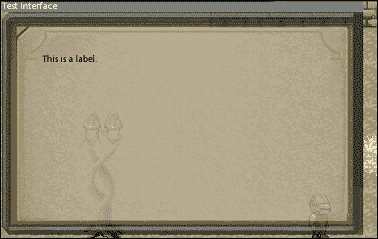
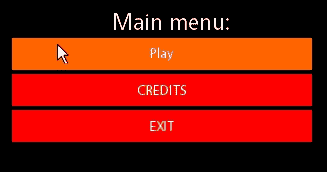

# 第十一章。别碰那个红按钮！ – 实现 GUI

在上一章中，我们介绍了基础知识并创建了图形用户界面组装所需的构建块。尽管这可能看起来代码很多，但要让其运行还需要更多的工作。正确管理接口、代码库的其他部分的良好支持以及 GUI 系统本身的用户友好语义都是至关重要的。让我们完成在第十章中设定的目标，*我能点击这个吗？ – GUI 基础知识*，并最终为用户提供一种接口方式。

在本章中，我们将涵盖以下主题：

+   接口及其事件的管理

+   扩展事件管理类以支持额外的 GUI 功能

+   创建我们的第一个元素类型

+   我们 GUI 系统的集成和使用

在所有部件就位后，让我们让我们的接口活跃起来！

# GUI 管理器

在幕后负责整个表演的“木偶大师”，在这种情况下，必须是`GUI_Manager`类。它负责存储应用程序中的所有接口以及维护它们的状态。所有鼠标输入处理都源自这个类，并传递到所有权树中。让我们先解决一些类型定义问题：

```cpp
using GUI_Interfaces = std::unordered_map<std::string,
  GUI_Interface*>;
using GUI_Container = std::unordered_map<StateType,
  GUI_Interfaces>;
using GUI_Events = std::unordered_map<StateType,
  std::vector<GUI_Event>>;
using GUI_Factory = std::unordered_map<GUI_ElementType,
  std::function<GUI_Element*(GUI_Interface*)>>;
using GUI_ElemTypes = std::unordered_map<std::string,
  GUI_ElementType>;
```

我们将使用`std::unordered_map`数据结构，通过名称索引它们来存储接口数据。接口数据容器还需要按游戏状态分组，这正是下一个类型定义的目的。同样，GUI 事件需要根据相关的游戏状态进行索引。事件本身存储在`std::vector`中。

此外，由于我们将以类似之前的方式以工厂模式创建元素，因此创建了一个工厂类型定义。这里的主要区别在于我们将存储的`lambda`函数需要接收一个指向所有者接口的指针，以便正确构造。

最后，我们将映射元素类型字符串到实际的枚举值。再次，`std::unordered_map`类型再次发挥作用。

现在，这里是类定义本身：

```cpp
struct SharedContext; // Forward declaration.
class GUI_Manager{
  friend class GUI_Interface;
public:
  GUI_Manager(EventManager* l_evMgr, SharedContext* l_context);
  ~GUI_Manager();
  ...
  template<class T>
  void RegisterElement(const GUI_ElementType& l_id){
    m_factory[l_id] = [](GUI_Interface* l_owner) -> GUI_Element*
    { return new T("",l_owner); };
  }
private:
  GUI_Element* CreateElement(const GUI_ElementType& l_id,
    GUI_Interface* l_owner);
  GUI_ElementType StringToType(const std::string& l_string);
  bool LoadStyle(const std::string& l_file,
    GUI_Element* l_element);

  GUI_Container m_interfaces;
  GUI_Events m_events;
  SharedContext* m_context;
  StateType m_currentState;
  GUI_Factory m_factory;
  GUI_ElemTypes m_elemTypes;
};
```

一开始，我们可以看出元素将使用工厂方法，因为存在`RegisterElement`方法。它存储一个以所有者接口指针作为唯一参数的`lambda`函数，该函数返回一个带有空白名称的`GUI_Element`类型，由`l_id`参数指定的给定类型构造而成。它的私有方法友元`CreateElement`将使用存储的`lambda`函数并返回指向新创建内存的指针。

在深入实现这个类之前，还有一个需要注意的事情，那就是存在一个接受`GUI_Element`类型的`LoadStyle`方法。管理类负责反序列化样式文件并根据它们正确设置元素，以避免在元素和接口类中造成混乱。

## 实现 GUI 管理器

在处理完类头文件之后，我们可以直接进入实现我们的 GUI 管理器。`GUI_Manager`类的构造函数定义如下：

```cpp
GUI_Manager::GUI_Manager(EventManager* l_evMgr,
  SharedContext* l_shared): m_eventMgr(l_evMgr),
  m_context(l_shared), m_currentState(StateType(0))
{
  RegisterElement<GUI_Label>(GUI_ElementType::Label);
  RegisterElement<GUI_Scrollbar>(GUI_ElementType::Scrollbar);
  RegisterElement<GUI_Textfield>(GUI_ElementType::Textfield);
  m_elemTypes.emplace("Label", GUI_ElementType::Label);
  m_elemTypes.emplace("Button", GUI_ElementType::Button);
  m_elemTypes.emplace("Scrollbar", GUI_ElementType::Scrollbar);
  m_elemTypes.emplace("TextField", GUI_ElementType::Textfield);
  m_elemTypes.emplace("Interface", GUI_ElementType::Window);

  m_eventMgr->AddCallback(StateType(0),
    "Mouse_Left", &GUI_Manager::HandleClick, this);
  m_eventMgr->AddCallback(StateType(0),
    "Mouse_Left_Release", &GUI_Manager::HandleRelease, this);
  m_eventMgr->AddCallback(StateType(0),
    "Text_Entered", &GUI_Manager::HandleTextEntered, this);
}
```

它需要一个指向事件管理器的指针和共享上下文结构作为参数，并通过初始化列表设置它们，同时为当前状态设置一个默认值。在函数体内部，我们可以看到这个类首先注册了我们将要使用的三个元素类型。它还填充了元素类型映射，这将用于后续的检查。最后，它注册了三个回调：两个用于左鼠标按钮的按下和释放，一个用于文本输入。请注意，这些回调被注册为无论应用程序处于何种状态都会被调用。

```cpp
GUI_Manager::~GUI_Manager(){
  m_eventMgr->RemoveCallback(StateType(0), "Mouse_Left");
  m_eventMgr->RemoveCallback(StateType(0), "Mouse_Left_Release");
  m_eventMgr->RemoveCallback(StateType(0), "Text_Entered");

  for (auto &itr : m_interfaces){
    for (auto &itr2 : itr.second){
      delete itr2.second;
    }
  }
}
```

析构函数移除了在构造函数中注册的所有回调，并对每个界面进行迭代以正确释放动态分配的内存。然后清除界面和事件容器。

让我们看看如何将一个界面添加到 GUI 管理器中：

```cpp
bool GUI_Manager::AddInterface(const StateType& l_state,
  const std::string& l_name)
{
  auto s = m_interfaces.emplace(l_state, GUI_Interfaces()).first;
  GUI_Interface* temp = new GUI_Interface(l_name, this);
  if (s->second.emplace(l_name, temp).second){ return true; }
  delete temp;
  return false;
}
```

当提供有效的应用程序状态和未使用的界面名称时，为界面分配动态内存并尝试插入。在插入过程中遇到任何问题都会被`emplace`方法的返回值捕获，该值存储在`i`变量中。如果失败，将释放内存并返回`false`以表示失败。否则，返回`true`。

获取一个界面就像这样简单：

```cpp
GUI_Interface* GUI_Manager::GetInterface(const StateType& l_state,
  const std::string& l_name)
{
  auto s = m_interfaces.find(l_state);
  if (s == m_interfaces.end()){ return nullptr; }
  auto i = s->second.find(l_name);
  return (i != s->second.end() ? i->second : nullptr);
}
```

如果找到作为参数提供的状态，并且还找到了提供的名称的界面，则返回它。找不到有效状态或正确界面的情况由返回值`nullptr`表示。

通过操作容器结构来移除界面：

```cpp
bool GUI_Manager::RemoveInterface(const StateType& l_state,
  const std::string& l_name)
{
  auto s = m_interfaces.find(l_state);
  if (s == m_interfaces.end()){ return false; }
  auto i = s->second.find(l_name);
  if (i == s->second.end()){ return false; }
  delete i->second;
  return s->second.erase(l_name);
}
```

### 注意

注意，如果找到状态和界面，`delete`关键字就会出现。有时，很容易忘记在堆上释放不再使用的内存，这会导致内存泄漏。

由于 GUI 管理器需要跟踪当前应用程序状态，因此需要以下方法：

```cpp
void GUI_Manager::SetCurrentState(const StateType& l_state){
  if (m_currentState == l_state){ return; }
  HandleRelease(nullptr);
  m_currentState = l_state;
}
```

除了更改当前状态的数据成员外，它还调用了`HandleRelease`方法，以防止界面和元素状态粘滞。如果一个元素被点击并且状态突然改变，该元素将保持在`CLICKED`状态，直到它被悬停，除非调用`HandleRelease`。

现在，让我们处理鼠标输入以提供与我们的界面交互：

```cpp
void GUI_Manager::HandleClick(EventDetails* l_details){
  auto state = m_interfaces.find(m_currentState);
  if (state == m_interfaces.end()){ return; }
  sf::Vector2i mousePos = m_eventMgr->
    GetMousePos(m_context->m_wind->GetRenderWindow());
  for (auto itr = state->second.rbegin();
    itr != state->second.rend(); ++itr)
  {
    if (!itr->second->IsInside(sf::Vector2f(mousePos))){continue;}
    if (!itr->second->IsActive()){ return; }
    itr->second->OnClick(sf::Vector2f(mousePos));
    itr->second->Focus();
    if (itr->second->IsBeingMoved()){itr->second->BeginMoving();}
    return;
  }
}
```

这个方法，就像它的`HandleRelease`兄弟方法一样，只接受一个类型为`EventDetails`的参数。目前，只需忽略它，因为它对`GUI_Manager`没有任何影响，将在本章的后面处理。

首先，它获取相对于窗口的当前鼠标位置。接下来，获取接口容器的迭代器并检查其有效性。然后，以相反的顺序遍历属于当前状态的每个接口，这给新添加的接口提供了优先权。如果它处于活动状态，并且鼠标位置在其边界内，则调用其`OnClick`方法，并将鼠标位置作为参数传递。然后检查接口的`m_beingMoved`标志，因为点击可能发生在其标题栏的边界内。如果是这样，则调用`BeginMoving`方法来完成拖动操作。在这个点上，我们简单地从方法中返回，以防止一次点击影响多个接口。

处理左鼠标按钮释放遵循相同的约定：

```cpp
void GUI_Manager::HandleRelease(EventDetails* l_details){
  auto state = m_interfaces.find(m_currentState);
  if (state == m_interfaces.end()){ return; }
  for (auto &itr : state->second){
    GUI_Interface* i = itr.second;
    if (!i->IsActive()){ continue; }
    if (i->GetState() == GUI_ElementState::Clicked)
    {
      i->OnRelease();
    }
    if (i->IsBeingMoved()){ i->StopMoving(); }
  }
}
```

唯一的不同之处在于，每个处于`Clicked`状态的接口都会调用其`OnRelease`方法，如果它处于被拖动的状态，还会调用`StopMoving`方法。

最后，别忘了我们的文本字段元素，因为它们需要在输入文本时得到通知：

```cpp
void GUI_Manager::HandleTextEntered(EventDetails* l_details){
  auto state = m_interfaces.find(m_currentState);
  if (state == m_interfaces.end()){ return; }
  for (auto &itr : state->second){
    if (!itr.second->IsActive()){ continue; }
    if (!itr.second->IsFocused()){ continue; }
    itr.second->OnTextEntered(l_details->m_textEntered);
    return;
  }
}
```

这是一段相当简单的代码片段。每当输入文本时，我们尝试找到一个活动且聚焦的元素。一旦找到，就调用其`OnTextEntered`方法，并将文本信息作为参数传递。

添加 GUI 事件就像将它们推回到`std::vector`数据结构中一样简单：

```cpp
void GUI_Manager::AddEvent(GUI_Event l_event){
    m_events[m_currentState].push_back(l_event);
}
```

为了正确处理这些事件，我们必须有一种方法来获取它们：

```cpp
bool GUI_Manager::PollEvent(GUI_Event& l_event){
  if (m_events[m_currentState].empty()){ return false; }
  l_event = m_events[m_currentState].back();
  m_events[m_currentState].pop_back();
  return true;
}
```

这与 SFML 处理事件的方式类似，因为它接收一个`GUI_Event`数据类型的引用，并在弹出之前用事件向量中的最后一个事件覆盖它。它还返回一个布尔值，以便在`while`循环中方便地使用。

接下来，让我们来更新接口：

```cpp
void GUI_Manager::Update(float l_dT){
  sf::Vector2i mousePos = m_eventMgr->
    GetMousePos(m_context->m_wind->GetRenderWindow());

  auto state = m_interfaces.find(m_currentState);
  if (state == m_interfaces.end()){ return; }
  for (auto itr = state->second.rbegin();
    itr != state->second.rend(); ++itr)
  {
    GUI_Interface* i = itr->second;
    if (!i->IsActive()){ continue; }
    i->Update(l_dT);
    if (i->IsBeingMoved()){ continue; }
    if (i->IsInside(sf::Vector2f(mousePos)))
    {
      if (i->GetState() == GUI_ElementState::Neutral){
        i->OnHover(sf::Vector2f(mousePos));
      }
      return;
    } else if (i->GetState() == GUI_ElementState::Focused){
      i->OnLeave();
    }
  }
}
```

获取当前鼠标位置后，遍历属于当前应用程序状态的所有接口。如果接口当前处于活动状态，则对其进行更新。只有当问题接口当前没有被拖动时，才会考虑`Hover`和`Leave`事件，就像我们在接口内部的小型 GUI 元素中所做的那样。

现在是时候将这些接口绘制到屏幕上了：

```cpp
void GUI_Manager::Render(sf::RenderWindow* l_wind){
  auto state = m_interfaces.find(m_currentState);
  if (state == m_interfaces.end()){ return; }
  for (auto &itr : state->second){
    GUI_Interface* i = itr.second;
    if (!i->IsActive()){ continue; }
    if (i->NeedsRedraw()){ i->Redraw(); }
    if (i->NeedsContentRedraw()){ i->RedrawContent(); }
    if (i->NeedsControlRedraw()){ i->RedrawControls(); }
    i->Draw(l_wind);
  }
}
```

再次强调，此方法会遍历属于当前应用程序状态的所有接口。如果它们处于活动状态，则会检查每个重绘标志并调用相应的重绘方法。最后，将`sf::RenderWindow`的指针传递给接口的`Draw`方法，以便它能够绘制自身。

如果有一个方法可以自动创建这些类型，那就太好了，因为我们正在使用工厂生产的元素类型：

```cpp
GUI_Element* GUI_Manager::CreateElement(
  const GUI_ElementType& l_id, GUI_Interface* l_owner)
{
  if (l_id == GUI_ElementType::Window){ 
    return new GUI_Interface("", this);
  }
  auto f = m_factory.find(l_id);
  return (f != m_factory.end() ? f->second(l_owner) : nullptr);
}
```

如果提供的元素类型是`Window`，则创建一个新的接口，并将`GUI_Manager`的指针传递为其第二个参数。在传递任何其他元素类型的情况下，搜索工厂容器，并调用存储的`lambda`函数，并将`l_owner`参数传递给它。

最后，让我们讨论接口的反序列化。需要一个方法来加载这种格式的文件：

```cpp
Interface name Style.style 0 0 Immovable NoTitle "Title"
Element Label name 100 0 Style.style "Label text"
...
```

接下来，让我们从文件中加载我们的接口。我们不会介绍如何读取文件本身，因为它基本上与我们的常规做法相同：

```cpp
bool GUI_Manager::LoadInterface(const StateType& l_state,const std::string& l_interface, const std::string& l_name)
{
    ...
}
```

让我们从创建一个接口开始：

```cpp
if (key == "Interface"){
  std::string style;
  keystream >> InterfaceName >> style;
  if (!AddInterface(l_state, l_name)){
    std::cout << "Failed adding interface: " 
      << l_name << std::endl;
    return false;
  }
  GUI_Interface* i = GetInterface(l_state, l_name);
  keystream >> *i;
  if (!LoadStyle(style, i)){
    std::cout << "Failed loading style file: "
      << style << " for interface " << l_name << std::endl;
  }
  i->SetContentSize(i->GetSize());
} else if ...
```

如文件格式所建议，首先需要读取其名称和样式文件名称。如果添加带有加载名称的接口失败，则打印错误信息并停止文件读取。否则，获取新添加的窗口的指针，并使用其重载的**>>**运算符从流中读取附加信息，这是我们在本章接口部分讨论过的。

接下来，尝试通过调用`LoadStyle`方法加载之前读取的样式文件，我们将在稍后介绍该方法。如果失败，则打印错误信息。最后，根据其当前样式调整其内容大小。

处理元素反序列化，在其最基本的形式下，相当相似：

```cpp
} else if (key == "Element"){
  if (InterfaceName == ""){
    std::cout << "Error: 'Element' outside or before 
      declaration of 'Interface'!" << std::endl;
    continue;
  }
  std::string type;
  std::string name;
  sf::Vector2f position;
  std::string style;
  keystream >> type >> name >> position.x >> position.y >> style;
  GUI_ElementType eType = StringToType(type);
  if (eType == GUI_ElementType::None){
    std::cout << "Unknown element('" << name
      << "') type: '" << type << "'" << std::endl;
    continue;
  }

  GUI_Interface* i = GetInterface(l_state, l_name);
  if (!i){ continue; }
  if (!i->AddElement(eType, name)){ continue; }
  GUI_Element* e = i->GetElement(name);
  keystream >> *e;
  e->SetPosition(position);
  if (!LoadStyle(style, e)){
    std::cout << "Failed loading style file: " << style
      << " for element " << name << std::endl;
    continue;
  }
}
```

元素类型、名称、位置和样式值都是从文件中读取的。元素类型是在将读取到的文本运行到`type`变量中并通过我们的辅助方法`StringToType`后获得的。需要添加到元素中的接口是通过使用传递给`LoadInterface`方法的参数名称获得的。通过调用获取到的接口的`AddElement`方法，以在堆上创建适当的元素类型。如果成功，通过名称获取元素，并通过利用其重载的`>>`运算符读取其附加信息。再次调用`LoadStyle`方法，以从文件中读取元素的样式。让我们看看这看起来是什么样子：

```cpp
State Neutral
Size 64 32
TextColor 0 0 0 255
TextSize 12
Font Main
TextPadding 0 0
/State

State Hover
TextColor 255 255 255 255
/State

State Clicked
TextColor 255 0 0 255
/State
```

以此为例，现在是时候尝试读取它了。再次提醒，我们将跳过读取文件的代码，因为它与通常的做法重复。考虑到这一点，让我们看一下：

```cpp
bool GUI_Manager::LoadStyle(const std::string& l_file,
  GUI_Element* l_element)
{
  ...
  std::string currentState;
  GUI_Style ParentStyle;
  GUI_Style TemporaryStyle;
  ...
}
```

注意这里设置的两种`GUI_Style`结构：它们跟踪作为父级的主要样式和当前正在读取的临时样式。让我们继续向下看这个方法，在实际的`while`循环中：

```cpp
if (type == "State"){
  if (currentState != ""){
    std::cout << "Error: 'State' keyword found 
      inside another state!" << std::endl;
    continue;
  }
  keystream >> currentState;
} else if ...
```

如果遇到`State`关键字且`currentState`未设置，则读取状态名称。否则，我们打印出错误信息：

```cpp
} else if (type == "/State"){
  if (currentState == ""){
    std::cout << "Error: '/State' keyword found 
      prior to 'State'!" << std::endl;
    continue;
  }
  GUI_ElementState state = GUI_ElementState::Neutral;
  if (currentState == "Hover"){state = GUI_ElementState::Focused;}
  else if (currentState == "Clicked"){
    state = GUI_ElementState::Clicked;
  }

  if (state == GUI_ElementState::Neutral){
    ParentStyle = TemporaryStyle;
    l_element->UpdateStyle(
      GUI_ElementState::Neutral, TemporaryStyle);
    l_element->UpdateStyle(
      GUI_ElementState::Focused, TemporaryStyle);
    l_element->UpdateStyle(
      GUI_ElementState::Clicked, TemporaryStyle);
  } else {
    l_element->UpdateStyle(state, TemporaryStyle);
  }
  TemporaryStyle = ParentStyle;
  currentState = "";
} else { ...
```

当遇到`/State`关键字时，我们可以安全地假设当前正在处理的样式已经结束。然后，根据读取的表示该状态的字符串确定状态。

如果状态是`Neutral`，我们需要将其设置为父样式，这意味着其他样式的所有未设置属性也将从这一种继承过来。然后对三个支持的状态中的每一个调用`UpdateStyle`方法，以覆盖默认值。如果状态不是`Neutral`，则只为该状态调用一次`UpdateStyle`方法。然后，`TemporaryStyle`变量被`ParentStyle`覆盖，以模拟继承。

最后，让我们看看如何支持每个不同的样式特性：

```cpp
} else {
  // Handling style information.
  if (currentState == ""){
    std::cout << "Error: '" << type
      << "' keyword found outside of a state!" << std::endl;
    continue;
  }
  if (type == "Size"){
    keystream >>TemporaryStyle.m_size.x >>TemporaryStyle.m_size.y;
  } else if (type == "BgColor"){
    int r, g, b, a = 0;
    keystream >> r >> g >> b >> a;
    TemporaryStyle.m_backgroundColor = sf::Color(r,g,b,a);
  } else if (type == "BgImage"){
    keystream >> TemporaryStyle.m_backgroundImage;
  } else if (type == "BgImageColor"){
    int r, g, b, a = 0;
    keystream >> r >> g >> b >> a;
    TemporaryStyle.m_backgroundImageColor = sf::Color(r, g, b, a);
  } else if (type == "TextColor"){
    int r, g, b, a = 0;
    keystream >> r >> g >> b >> a;
    TemporaryStyle.m_textColor = sf::Color(r, g, b, a);
  } else if (type == "TextSize"){
    keystream >> TemporaryStyle.m_textSize;
  } else if (type == "TextOriginCenter"){
    TemporaryStyle.m_textCenterOrigin = true;
  } else if (type == "Font"){
    keystream >> TemporaryStyle.m_textFont;
  } else if (type == "TextPadding"){
    keystream >> TemporaryStyle.m_textPadding.x
      >> TemporaryStyle.m_textPadding.y;
  } else if (type == "ElementColor"){
    int r, g, b, a = 0;
    keystream >> r >> g >> b >> a;
    TemporaryStyle.m_elementColor = sf::Color(r, g, b, a);
  } else if (type == "Glyph"){
    keystream >> TemporaryStyle.m_glyph;
  } else if (type == "GlyphPadding"){
    Keystream >> TemporaryStyle.m_glyphPadding.x
      >> TemporaryStyle.m_glyphPadding.y;
  } else {
    std::cout << "Error: style tag '" << type
      << "' is unknown!" << std::endl;
  }
}
```

每个颜色值首先被读取为四个单独的整数，然后存储在`sf::Color`结构中，该结构被分配给样式结构中的适当数据成员。填充和文本值只是简单地流进。有一个例外是`TextOriginCenter`标签。它不包含任何附加信息，它的存在仅仅意味着文本元素的起点应该始终居中。

# 标签元素

标签元素是最简单的 GUI 类型。它支持所有默认的样式特性，但除了包含一个可以在运行时加载或设置的特定字符串值之外，没有做太多其他的事情。

让我们看看它的构造函数和析构函数：

```cpp
GUI_Label::GUI_Label(const std::string& l_name,
  GUI_Interface* l_owner)
  : GUI_Element(l_name, GUI_ElementType::Label, l_owner){}
```

与我们之前编写的代码相比，这简直是小菜一碟。它的名称、类型和所有者都在初始化列表中设置，除此之外没有其他内容。

这种类型元素的反序列化过程也相当简单。回想一下接口文件中的以下行：

```cpp
Element Label TestLabel 0 0 Default.style "Some text"
```

由于`GUI_Manager`类处理了所有这些信息（除了最后一部分），这个元素的`ReadIn`方法可能看起来像这样：

```cpp
void GUI_Label::ReadIn(std::stringstream& l_stream){
    std::string content;
    Utils::ReadQuotedString(l_stream, content);
    m_visual.m_text.setString(content);
}
```

现在，我们必须实现这个元素的的事件方法。在这种情况下，这不过是简单地调整标签的状态：

```cpp
void GUI_Label::OnClick(const sf::Vector2f& l_mousePos){
  SetState(GUI_ElementState::Clicked);
}
void GUI_Label::OnRelease(){
  SetState(GUI_ElementState::Neutral);
}
void GUI_Label::OnHover(const sf::Vector2f& l_mousePos){
  SetState(GUI_ElementState::Focused);
}
void GUI_Label::OnLeave(){
  SetState(GUI_ElementState::Neutral);
}
```

最后一部分代码负责如何绘制这个元素：

```cpp
void GUI_Label::Draw(sf::RenderTarget* l_target){
  l_target->draw(m_visual.m_backgroundSolid);
  if (m_style[m_state].m_glyph != ""){
    l_target->draw(m_visual.m_glyph);
  }
  l_target->draw(m_visual.m_text);
}
```

在绘制背景矩形之后，检查符号是否需要绘制。最后，文本直接渲染在最后两个视觉属性之上。

# 文本字段元素

为了成功实现文本字段元素，我们需要定义它如何正确地响应输入。首先，让我们通过创建文本字段元素类和实现构造函数来设置一个新的元素类型，如下所示：

```cpp
GUI_Textfield::GUI_Textfield(const std::string& l_name,
  GUI_Interface* l_owner)
  : GUI_Element(l_name, GUI_ElementType::Textfield , l_owner){}
```

这个元素在加载时也可以有一个默认的文本值，所以让我们通过提供一个自定义的`ReadIn`方法来表达这一点：

```cpp
void GUI_Textfield::ReadIn(std::stringstream& l_stream){
  std::string content;
  Utils::ReadQuotedString(l_stream, content);
  m_visual.m_text.setString(content);
}
```

如你所知，文本字段在鼠标按钮释放时不会改变状态。这允许它们保持聚焦状态，直到在其他地方注册鼠标点击。我们已经在`GUI_Interface`类中实现了该功能，作为`DefocusTextfields`方法。现在剩下的只是忽略释放事件：

```cpp
void GUI_Textfield::OnRelease(){}
```

最后，让我们看看如何绘制这个元素：

```cpp
void GUI_Textfield::Draw(sf::RenderTarget* l_target){
  l_target->draw(m_visual.m_backgroundSolid);
  if (m_style[m_state].m_glyph != ""){
    l_target->draw(m_visual.m_glyph);
  }
  l_target->draw(m_visual.m_text);
}
```

它的本质相当简单。到目前为止，我们只关心绘制这个元素所包含文本背后的背景实体。符号也在这里得到支持，但我们不会使用它。

# 滑块元素

所有这些对界面滚动和控制元素的支持意味着滑块元素的存在。其目的是在内容纹理的可见区域内移动，以揭示位置超出其尺寸允许的元素，这可以沿任何轴进行。有了这些知识，让我们尝试制定滑块元素的基本类定义：

```cpp
enum class SliderType{ Horizontal, Vertical };

class GUI_Scrollbar : public GUI_Element{
public:
  ...
  void SetPosition(const sf::Vector2f& l_pos);
  void ApplyStyle();
  void UpdateStyle(const GUI_ElementState& l_state,
    const GUI_Style& l_style);
private:
  SliderType m_sliderType;
  sf::RectangleShape m_slider;
  sf::Vector2f m_moveMouseLast;
  int m_percentage;
};
```

首先，我们列举两种可能的滑块类型：水平和垂直。实际的 `GUI_Scrollbar` 类覆盖了父类提供的三个原始方法，并实现了所有纯虚拟方法。

在其私有数据成员中，滑块跟踪其自身类型，该类型包含另一个可绘制对象来表示滑块，并维护有关最后已知鼠标坐标以及当前滚动百分比值的信息。

让我们从简单的部分开始——构造函数：

```cpp
GUI_Scrollbar::GUI_Scrollbar(const std::string& l_name,
  GUI_Interface* l_owner)
  : GUI_Element(l_name, GUI_ElementType::Scrollbar, l_owner)
{
  m_isControl = true;
}
```

到目前为止，这相当直接。元素类型设置为 `Scrollbar`，并将 `m_isControl` 标志设置为 `true` 以告诉所有者界面在哪个层上绘制它。

接下来，需要覆盖 `SetPosition` 方法以确保滑块定位正确：

```cpp
void GUI_Scrollbar::SetPosition(const sf::Vector2f& l_pos){
  GUI_Element::SetPosition(l_pos);
  if (m_sliderType == SliderType::Horizontal){ m_position.x = 0; }
  else { m_position.y = 0; }
}
```

由于这个特定元素的特性，必须始终将一个轴设置为 `0` 以保持其在右侧边缘的位置。

目前，滑块类型将从界面文件中读取。为了实现这一点，我们可能需要像这样处理反序列化：

```cpp
void GUI_Scrollbar::ReadIn(std::stringstream& l_stream){
  std::string type;
  l_stream >> type;
  if (type == "Horizontal"){m_sliderType =SliderType::Horizontal;}
  else { m_sliderType = SliderType::Vertical; }

  if (m_sliderType == SliderType::Horizontal){
    m_slider.setPosition(0, GetPosition().y);
  }
  else { m_slider.setPosition(GetPosition().x, 0); }
}
```

接下来，我们处理事件，从 `OnClick` 开始：

```cpp
void GUI_Scrollbar::OnClick(const sf::Vector2f& l_mousePos){
  if (!m_slider.getGlobalBounds().contains(
    l_mousePos - m_owner->GetPosition()))
  {
    return;
  }
  SetState(GUI_ElementState::Clicked);
  m_moveMouseLast = l_mousePos;
}
```

由于我们只想在拖动滑块部分时进行滚动，因此只有当鼠标坐标在滑块内时，此元素的状态才设置为 `Clicked`。然后它们被存储在 `m_moveMouseLast` 数据成员中，以防止滑块跳动。

剩下的三个事件除了调整状态外不需要做任何事情：

```cpp
void GUI_Scrollbar::OnRelease(){
  SetState(GUI_ElementState::Neutral);
}
void GUI_Scrollbar::OnHover(const sf::Vector2f& l_mousePos){
  SetState(GUI_ElementState::Focused);
}
void GUI_Scrollbar::OnLeave(){
  SetState(GUI_ElementState::Neutral);
}
```

样式更新也必须更改以保持滑块的期望功能：

```cpp
void GUI_Scrollbar::UpdateStyle(const GUI_ElementState& l_state,
  const GUI_Style& l_style)
{
  GUI_Element::UpdateStyle(l_state, l_style);
  if (m_sliderType == SliderType::Horizontal){
    m_style[l_state].m_size.x = m_owner->GetSize().x;
  }
  else { m_style[l_state].m_size.y = m_owner->GetSize().y; }
}
```

在调用父类 `UpdateStyle` 之后，滑块的大小设置为与所有者界面在相关轴上的大小相匹配。

接下来，我们必须定义一种自定义方式来应用样式属性到滑块元素，因为它们的独特性质：

```cpp
void GUI_Scrollbar::ApplyStyle(){
  GUI_Element::ApplyStyle();
  m_slider.setFillColor(m_style[m_state].m_elementColor);
  bool horizontal = m_sliderType == SliderType::Horizontal;
  auto& bgSolid = m_visual.m_backgroundSolid;
  SetPosition((horizontal ?
    sf::Vector2f(0, m_owner->GetSize().y - bgSolid.getSize().y) :
    sf::Vector2f(m_owner->GetSize().x - bgSolid.getSize().x, 0)));
  bgSolid.setSize((horizontal ?
   sf::Vector2f(m_owner->GetSize().x,m_style[m_state].m_size.y) :
   sf::Vector2f(m_style[m_state].m_size.x,m_owner->GetSize().y)));
  m_slider.setPosition(
    (horizontal ? m_slider.getPosition().x : GetPosition().x),
    (horizontal ? GetPosition().y : m_slider.getPosition().y));
  float SizeFactor = (horizontal ?
    m_owner->GetContentSize().x / m_owner->GetSize().x :
    m_owner->GetContentSize().y / m_owner->GetSize().y);
  if (SizeFactor < 1.f){ SizeFactor = 1.f; }
  float SliderSize = (horizontal ?
    m_owner->GetSize().x : m_owner->GetSize().y) / SizeFactor;
  m_slider.setSize((horizontal ?
    sf::Vector2f(SliderSize,bgSolid.getSize().y):
    sf::Vector2f(bgSolid.getSize().x, SliderSize)));
  bgSolid.setPosition(GetPosition());
}
```

在调用父类 `ApplyStyle` 并设置滑块颜色后，元素的定位被覆盖，以保持在动作轴上的位置为 0 并且在垂直轴的边缘附近。背景实体的尺寸由滚动轴上的界面尺寸决定。其样式属性决定了其他尺寸值。

滚动条的位置在非操作轴上被修改，以确保始终与元素本身的位置相匹配。沿着滚动轴计算其大小就像将拥有窗口的大小除以其内容大小除以相同窗口大小的结果一样简单。

在完成这个元素的样式部分后，让我们来移动它并影响其所有者界面：

```cpp
void GUI_Scrollbar::Update(float l_dT){
  // Mouse-drag code.
  if (GetState() != GUI_ElementState::Clicked){ return; }
  SharedContext* context = m_owner->GetManager()->GetContext();
  sf::Vector2f mousePos = 
    sf::Vector2f(context->m_eventManager->GetMousePos(
    context->m_wind->GetRenderWindow()));
  if (m_moveMouseLast == mousePos){ return; }
  sf::Vector2f difference = mousePos - m_moveMouseLast;
  m_moveMouseLast = mousePos;

  bool horizontal = m_sliderType == SliderType::Horizontal;
  m_slider.move((horizontal ? difference.x : 0),
    (horizontal ? 0 : difference.y));
  if (horizontal && m_slider.getPosition().x < 0){
    m_slider.setPosition(0, m_slider.getPosition().y);
  } else if (m_slider.getPosition().y < 0){
    m_slider.setPosition(m_slider.getPosition().x, 0);
  }
  if (horizontal&&(m_slider.getPosition().x+m_slider.getSize().x >
    m_owner->GetSize().x))
  {
    m_slider.setPosition(
      m_owner->GetSize().x - m_slider.getSize().x,
      m_slider.getPosition().y);
  } else if (m_slider.getPosition().y + m_slider.getSize().y >
    m_owner->GetSize().y)
  {
    m_slider.setPosition(m_slider.getPosition().x,
      m_owner->GetSize().y - m_slider.getSize().y);
  }
  float WorkArea = (horizontal ?
    m_owner->GetSize().x - m_slider.getSize().x :
    m_owner->GetSize().y - m_slider.getSize().y);
  int percentage = ((horizontal ?
    m_slider.getPosition().x : m_slider.getPosition().y) /
    WorkArea) * 100;
  if (horizontal){ m_owner->UpdateScrollHorizontal(percentage); }
  else { m_owner->UpdateScrollVertical(percentage); }
  SetRedraw(true);
}
```

上述所有代码只有在元素的当前状态为`Clicked`时才需要执行。很明显，滚动条的滑块正在上下拖动。如果当前鼠标位置与上一次迭代的最后位置不同，则计算它们之间的差异，并将当前鼠标位置存储以供以后参考。

首先，通过两次迭代之间鼠标位置的差异来移动滑块。然后检查它是否超出界面的边界，如果是，则将其位置重置为最近的边缘。

最后，通过将滑块在相关轴上的位置除以窗口大小和滑块大小的差值来计算滚动百分比值。然后调用相应的滚动更新方法，并将此元素标记为需要重新绘制以反映其更改。

我们需要做的最后一件事是定义滚动条元素是如何绘制的：

```cpp
void GUI_Scrollbar::Draw(sf::RenderTarget* l_target){
    l_target->draw(m_visual.m_backgroundSolid);
    l_target->draw(m_slider);
}
```

目前，它只使用两个矩形形状，但是很容易扩展以支持纹理。

# 集成 GUI 系统

为了使用 GUI 系统，它首先需要存在。就像在之前的章节中一样，我们需要实例化和更新我们构建的 GUI 类。让我们首先将 GUI 管理器和字体管理器添加到`SharedContext.h`文件中：

```cpp
struct SharedContext{
  SharedContext():
    ...
    m_fontManager(nullptr),
    ...
    m_guiManager(nullptr){}
     ...
     FontManager* m_fontManager;
  GUI_Manager* m_guiManager;
};
```

我们需要在`Game`类中保留对 GUI 管理器和字体管理器的指针，就像所有通过`SharedContext`结构共享的其他类一样，从头文件开始：

```cpp
class Game{
public:
    ...
private:
    ...
    FontManager m_fontManager;
    ...
    GUI_Manager m_guiManager;
};
```

这些指针当然是没有意义的，除非它们实际上指向内存中的有效对象。让我们在`Game.cpp`文件中处理资源的分配和释放：

```cpp
Game::Game() : m_window("Chapter 11", sf::Vector2u(800, 600)),
  m_entityManager(&m_systemManager, &m_textureManager),
  m_stateManager(&m_context),
  m_guiManager(m_window.GetEventManager(),&m_context)
{
  ...
  m_context.m_guiManager = &m_guiManager;
  ...
  m_fontManager.RequireResource("Main");
}
Game::~Game(){ 
  m_fontManager.ReleaseResource("Main");
}
```

接下来，我们可以查看更新应用程序中的所有界面和处理 GUI 事件：

```cpp
void Game::Update(){
    ...
    m_context.m_guiManager->Update(m_elapsed.asSeconds());
    GUI_Event guiEvent;
    while (m_context,m_guiManager->PollEvent(guiEvent)){
        m_window.GetEventManager()->HandleEvent(guiEvent);
    }
}
```

注意，`GUI_Event`实例被转发到`EventManager`类。我们很快就会对其进行扩展。

最后，让我们处理绘制我们的界面：

```cpp
void Game::Render(){
    ...
    m_stateManager.Draw();

    sf::View CurrentView = m_window.GetRenderWindow()->getView();
    m_window.GetRenderWindow()->setView(m_window.GetRenderWindow()->getDefaultView());
    m_context.m_guiManager->Render(m_window->GetRenderWindow());
    m_window.GetRenderWindow()->setView(CurrentView);

    m_window.EndDraw();
}
```

为了使 GUI 始终绘制在场景的其他部分之上，在绘制界面之前必须将窗口视图设置为默认值。然后需要将其设置回以保持一致的相机位置，这可能看起来像这样：



# 扩展事件管理器

为了防止堆积，需要为应用程序的每个可能状态处理 GUI 事件，就像 SFML 事件一样。为了避免编写所有额外的代码，我们将使用专门为处理它们而构建的东西：事件管理器。

让我们从扩展 `EventType` 枚举以支持 GUI 事件开始：

```cpp
enum class EventType{ 
  ...
  Keyboard = sf::Event::Count + 1, Mouse, Joystick,
  GUI_Click, GUI_Release, GUI_Hover, GUI_Leave
};
```

由于我们过去编写的代码的方式，出于这个原因，重要的是将这些自定义事件类型放在结构的底部。

我们之前对 `EventManager` 类的原始实现依赖于这样一个事实：任何给定的事件都可以简单地用一个数值来表示。大多数 SFML 事件，如按键绑定，都属于这一类，但许多其他事件类型，尤其是自定义事件，需要额外的信息才能正确处理。

而不是使用数字，我们需要切换到一个轻量级的数据结构，如下所示：

```cpp
struct EventInfo{
    EventInfo(){ l_code = 0; }
    EventInfo(int l_event){ l_code = l_event; }
    EventInfo(GUI_Event l_guiEvent){ l_gui = l_guiEvent; }
    union{
        int l_code;
        GUI_Event l_gui;
    };
};
```

联合确保没有浪费内存，我们仍然可以使用事件类型的数值表示，以及自定义数据类型，如 `GUI_Event` 结构。`GUI_Event` 属于联合，这就是为什么它不能使用 `std::string` 类型的数据成员。

### 提示

如果使用 boost 库，所有这些代码都可以简化为 `boost::variant<int, GUI_Event>`。

一个额外的变化是我们希望能够将 GUI 事件信息传递给已注册的回调方法。这些信息也将由我们的 `EventDetails` 结构持有：

```cpp
struct EventDetails{
    EventDetails(const std::string& l_bindName)
        : m_name(l_bindName){ Clear(); }
    ...
    std::string m_guiInterface; // GUI interface name.
    std::string m_guiElement; // GUI element name.
    GUI_EventType m_guiEvent; // GUI event type.

    void Clear(){
        ...
        m_guiInterface = "";
        m_guiElement = "";
        m_guiEvent = GUI_EventType::None;
    }
};
```

现在，让我们调整 `Binding` 结构：

```cpp
struct Binding{
  Binding(const std::string& l_name): m_name(l_name),
    m_details(l_name), c(0){}
  ~Binding(){
    // GUI portion.
    for (auto itr = m_events.begin();
      itr != m_events.end(); ++itr)
    {
      if (itr->first == EventType::GUI_Click ||
        itr->first == EventType::GUI_Release ||
        itr->first == EventType::GUI_Hover ||
        itr->first == EventType::GUI_Leave)
      {
        delete [] itr->second.m_gui.m_interface;
        delete [] itr->second.m_gui.m_element;
      }
    }
  }
  ...
};
```

由于联合的限制，我们不得不使用 `const char*` 数据类型来存储元素和接口名称。虽然这仅适用于与 GUI 相关的事件，但这些内存仍然需要释放。当一个绑定被销毁时，所有的事件信息都会被迭代并检查是否属于四种 GUI 事件类型之一，如果是，则安全地释放内存。

接下来，我们需要一个单独的方法来处理仅 GUI 事件。在这里，使用不同的参数类型重载 `HandleEvent` 方法似乎是一个不错的选择：

```cpp
void HandleEvent(sf::Event& l_event);
void HandleEvent(GUI_Event& l_event);
```

我们需要确保在原始的 `HandleEvent` 方法中不处理任何 GUI 事件：

```cpp
void EventManager::HandleEvent(sf::Event& l_event){
  ...
  for(auto &e_itr : bind->m_events){
    EventType sfmlEvent = (EventType)l_event.type;
    if (e_itr.first == EventType::GUI_Click ||
      e_itr.first == EventType::GUI_Release ||
      e_itr.first == EventType::GUI_Hover ||
      e_itr.first == EventType::GUI_Leave)
    {
      continue;
    }
    ...
  }
  ...
}
```

如果事件是四种 GUI 类型之一，则跳过迭代。处理 GUI 事件本身相当简单，可以按以下方式完成：

```cpp
void EventManager::HandleEvent(GUI_Event& l_event){
  for (auto &b_itr : m_bindings){
    Binding* bind = b_itr.second;
    for (auto &e_itr : bind->m_events)
    {
      if (e_itr.first != EventType::GUI_Click &&
        e_itr.first != EventType::GUI_Release &&
        e_itr.first != EventType::GUI_Hover &&
        e_itr.first != EventType::GUI_Leave)
      { continue; }
      if ((e_itr.first == EventType::GUI_Click &&
        l_event.m_type != GUI_EventType::Click) ||
        (e_itr.first == EventType::GUI_Release &&
        l_event.m_type != GUI_EventType::Release) ||
        (e_itr.first == EventType::GUI_Hover &&
        l_event.m_type != GUI_EventType::Hover) ||
        (e_itr.first == EventType::GUI_Leave &&
        l_event.m_type != GUI_EventType::Leave))
      { continue; }
      if (strcmp(e_itr.second.m_gui.m_interface,
        l_event.m_interface) ||
        strcmp(e_itr.second.m_gui.m_element, l_event.m_element))
      { continue; }
      bind->m_details.m_guiInterface = l_event.m_interface;
      bind->m_details.m_guiElement = l_event.m_element;
      ++(bind->c);
    }
  }
}
```

在迭代绑定内的事件时，会检查它们的类型。任何不是 GUI 事件的都会被跳过。如果处理事件的类型与绑定内的类型匹配，则会在 `EventInfo` 结构中检查额外的信息，即接口和元素名称。如果这些也匹配，它们将被记录为事件细节，并且事件计数会增加。

需要关注的最后一部分代码是 `LoadBindings` 方法。我们需要调整它以支持从 `keys.cfg` 文件中加载接口和元素名称，其格式可能如下所示：

```cpp
Key_X 5:23
MainMenu_Play 27:MainMenu:Play
```

第一行代表一种普通类型的事件，而第二行是 GUI 事件，它需要加载两个标识符而不是一个。让我们调整它：

```cpp
void EventManager::LoadBindings(){
  ...
  while(!keystream.eof()){
    std::string keyval;
    keystream >> keyval;
    int start = 0;
    int end = keyval.find(delimiter);
    if (end == std::string::npos){
      delete bind;
      bind = nullptr;
      break;
    }
    EventType type = EventType(
      stoi(keyval.substr(start, end-start)));

    EventInfo eventInfo;
    if (type==EventType::GUI_Click ||
      type==EventType::GUI_Release ||
      type == EventType::GUI_Hover ||
      type == EventType::GUI_Leave)
    {
      start = end + delimiter.length();
      end = keyval.find(delimiter, start);
      std::string window = keyval.substr(start, end - start);
      std::string element;
      if (end != std::string::npos){
        start = end + delimiter.length();
        end = keyval.length();
        element = keyval.substr(start, end);
      }
      char* w = new char[window.length() + 1]; // +1 for \0
 char* e = new char[element.length() + 1];

 // Size in bytes is the same as character length.1 char = 1B.
 strcpy_s(w, window.length() + 1, window.c_str());
 strcpy_s(e, element.length() + 1, element.c_str());

 eventInfo.m_gui.m_interface = w;
 eventInfo.m_gui.m_element = e;
    } else {
      int code = stoi(keyval.substr(end + delimiter.length(),
        keyval.find(delimiter,end + delimiter.length())));
      eventInfo.m_code = code;
    }
    bind->BindEvent(type, eventInfo);
  }
  ...
}
```

在像往常一样加载事件类型后，它会检查它是否与四个 GUI 事件中的任何一个匹配。然后读取窗口和元素字符串，并通过`std::strcpy`方法将它们复制到新分配的`char*`内存中。

### 注意

请记住，当为`char*`类型的内存分配以匹配给定字符串时，它还需要额外的空间来存储末尾的空终止字符。

# 重新实现主菜单

为了展示以这种方式构建交互性有多容易，让我们重新构建主菜单，首先创建其`.interface`文件：

```cpp
Interface MainMenu MainMenu.style 0 0 Immovable NoTitle "Main menu"
Element Label Title 100 0 MainMenuTitle.style "Main menu:"
Element Label Play 0 32 MainMenuLabel.style "PLAY"
Element Label Credits 0 68 MainMenuLabel.style "CREDITS"
Element Label Quit 0 104 MainMenuLabel.style "EXIT"
```

该界面在两个轴向上都设置了零填充，不可移动，并且没有标题栏。此界面中的所有三个按钮以及其标题都可以用不同样式的标签表示。说到这里，让我们看看我们主菜单界面的样式：

```cpp
State Neutral
Size 300 150
TextSize 12
Font Main
/State
```

如您所见，它只定义了最基本的属性，并且本身并不旨在具有视觉响应性。然而，按钮标签样式略有不同：

```cpp
State Neutral
Size 300 32
BgColor 255 0 0 255
TextColor 255 255 255 255
TextSize 14
Font Main
TextPadding 150 16
TextOriginCenter
/State

State Hover
BgColor 255 100 0 255
/State

State Clicked
BgColor 255 150 0 255
/State
```

当状态改变时，标签的背景颜色也会调整，这与代表主菜单标题的标签不同：

```cpp
State Neutral
Size 118 32
TextColor 255 255 255 255
TextSize 24
Font Main
/State
```

在所有视觉元素都处理完毕后，让我们调整主菜单状态以加载并维护此界面：

```cpp
class State_MainMenu : public BaseState{
public:
    ...
    void Play(EventDetails* l_details); // Callback.
    void Quit(EventDetails* l_details); // Callback.
};
```

除了状态必须实现的所有必需方法之外，我们只需要两个回调函数来处理 GUI 点击。这一切都在主菜单状态中的`OnCreate`方法中设置：

```cpp
void State_MainMenu::OnCreate(){
  GUI_Manager* gui = m_stateMgr->GetContext()->m_guiManager;
  gui->LoadInterface(StateType::MainMenu,
    "MainMenu.interface", "MainMenu");
  gui->GetInterface(StateType::MainMenu,
    "MainMenu")->SetPosition(sf::Vector2f(250.f, 168.f));
  EventManager* eMgr = m_stateMgr->GetContext()->m_eventManager;
  eMgr->AddCallback(StateType::MainMenu,
    "MainMenu_Play", &State_MainMenu::Play, this);
  eMgr->AddCallback(StateType::MainMenu,
    "MainMenu_Quit", &State_MainMenu::Quit, this);
}
```

首先，主菜单界面从文件加载并放置在屏幕上。然后使用事件管理器设置**播放**和**退出**按钮动作的回调。这已经比以前的方法干净得多。

一旦状态被销毁，必须移除界面和两个回调函数，如下所示：

```cpp
void State_MainMenu::OnDestroy(){
  m_stateMgr->GetContext()->m_guiManager->
    RemoveInterface(StateType::MainMenu, "MainMenu");
  EventManager* eMgr = m_stateMgr->GetContext()->m_eventManager;
  eMgr->RemoveCallback(StateType::MainMenu, "MainMenu_Play");
  eMgr->RemoveCallback(StateType::MainMenu, "MainMenu_Quit");
}
```

如果存在`GAME`状态，则必须更改**播放**按钮的文本：

```cpp
void State_MainMenu::Activate(){
  auto& play = *m_stateMgr->GetContext()->m_guiManager->
    GetInterface(StateType::MainMenu, "MainMenu")->
    GetElement("Play");
  if (m_stateMgr->HasState(StateType::Game)){
    // Resume
    play.SetText("Resume");
  } else {
    // Play
    play.SetText("Play");
  }
}
```

这就留下了我们两个回调函数，它们看起来像这样：

```cpp
void State_MainMenu::Play(EventDetails* l_details){
    m_stateMgr->SwitchTo(StateType::Game);
}
void State_MainMenu::Quit(EventDetails* l_details){
    m_stateMgr->GetContext()->m_wind->Close();
}
```

这完美地说明了使用我们新的 GUI 以及改进的事件管理器如何容易实现快速和响应的结果。主菜单是用大约 20 行代码或更少的代码创建的，看起来像这样：



# 摘要

在第十章的开始部分 第十章，“我能点击这个吗？ – GUI 基础”，我们的主要目标是实现一种简单而强大的方式来与我们的应用程序进行交互。在本章中，我们深入探讨了诸如界面和事件管理、新元素类型的创建和集成以及现有代码的扩展等附加主题。投入 GUI 的所有工作的有效性无法用其他方式衡量，只能用成功来衡量。我们现在拥有一个系统，它能够在最少的努力和代码下产生高效、响应快和快速的结果。此外，你现在应该具备构建更多元素类型的技能，这将使这个系统能够完成令人惊叹的事情。

在下一章中，我们将介绍 SFML 中声音和音乐元素的管理和使用。那里见！
