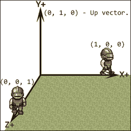
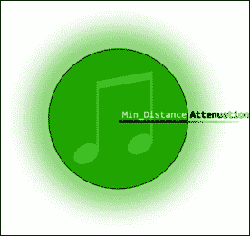

# 第十二章.你现在能听到我吗？——声音和音乐

沉浸在虚拟环境中的享受是独一无二的。从我们观看的电影到我们玩的游戏，尽可能多地吸引和利用人类感官可以决定一种媒体能否吸引人。创造一个生机勃勃的氛围很少，如果不是永远，仅仅依靠视觉效果。在本章中，我们将暂时闭上眼睛，通过涵盖以下主题来参与这个项目的听觉方面：

+   SFML 中声音和音乐的基本知识

+   3D 空间中声音和听者的位置

+   正确管理和回收声音实例

+   扩展实体组件系统以允许声音

我们离第一次声爆还有很长的路要走，所以让我们直接进入正题！

# 使用受版权保护的资源

在我们进入声音管理之前，让我们给予应有的赞誉。在本章中，我们将使用以下资源：

+   由*Fantozzi*创作的、受 CC0 许可（公共领域）的*Fantozzi 的脚步声（草地/沙石与石头）*：[`opengameart.org/content/fantozzis-footsteps-grasssand-stone`](http://opengameart.org/content/fantozzis-footsteps-grasssand-stone)

+   由*Snabisch*创作的、受 CC-BY 3.0 许可的*NES 版本 Electrix*：[`opengameart.org/content/electrix-nes-version`](http://opengameart.org/content/electrix-nes-version)

+   由*cynicmusic*创作的、受 CC-BY 3.0 许可的*城镇主题 RPG*：[`opengameart.org/content/town-theme-rpg`](http://opengameart.org/content/town-theme-rpg)

# 为项目准备声音

为了成功编译使用 SFML 音频的项目，我们需要确保包含这些额外的依赖`.lib`文件：

+   `sfml-audio-s.lib`

+   `openal32.lib`

+   `flac.lib`

+   `ogg.lib`

+   `vorbis.lib`

+   `vorbisenc.lib`

+   `vorbisfile.lib`

此外，可执行文件必须始终附带 SFML 提供的`openal32.dll`文件，该文件位于库的`bin`文件夹中。

# SFML 声音的基本知识

任何与音频相关的内容在 SFML 中都属于以下两个类别之一：代表短声音效果的`sf::Sound`，或用于播放较长时间音频片段的`sf::Music`。在继续之前，了解这两个类如何使用是明智的。让我们分别讨论每一个。

## 播放声音

`sf::Sound`类非常轻量级，应该仅用于播放短小的声音效果，不应占用大量内存。它存储和利用实际音频文件的方式是通过使用`sf::SoundBuffer`实例。这与`sf::Sprite`及其使用`sf::Texture`实例进行绘制的方式类似。`sf::SoundBuffer`用于在内存中存储音频数据，然后`sf::Sound`类从这些数据中读取并播放。它可以如下使用：

```cpp
sf::SoundBuffer buffer;
buffer.loadFromFile("SomeSound.ogg");

sf::Sound sound(buffer);
sound.setBuffer(buffer); // Alternative.
```

如您所见，可以通过将声音缓冲区传递给声音的构造函数或使用声音实例的`setBuffer`方法，将声音缓冲区附加到`sf::Sound`实例。

### 小贴士

只要预期声音正在播放，就不应该销毁 `sf::SoundBuffer` 实例！

在声音缓冲区加载声音文件并将其附加到 `sf::Sound` 实例之后，可以通过调用 `play()` 方法来播放：

```cpp
sound.play(); // Play the sound!
```

也可以通过使用相应命名的 `pause()` 和 `stop()` 方法来暂停和停止：

```cpp
sound.pause(); // Pause the sound.
sound.stop(); // Stop the sound.
```

要确定声音是否正在播放、暂停或停止，以获取当前状态，可以这样做：

```cpp
sf::SoundSource::Status status = sound.getStatus();
```

返回的状态是三个值的简单枚举：`stopped`、`paused` 和 `playing`。

最后，我们可以通过使用这些方法分别调整声音的音量、音高、是否循环以及声音已播放的进度：

```cpp
sound.setVolume(100.f); // Takes in a float.
sound.setPitch(1.f); // Takes in a float.
sound.setLoop(true); // Takes in a Boolean.
sound.setPlayingOffset(sf::seconds(5.f)); // Takes in sf::Time.
```

音频音高是一个表示声音频率的数值。大于 1 的值会导致声音以更高的音高播放，而小于 1 的值则产生相反的效果。如果改变音高，也会改变声音的播放速度。

## 播放音乐

任何 `sf::Music` 实例都支持之前讨论的所有方法，除了 `setBuffer`。正如你所知道的那样，`sf::Sound` 使用它从中读取的 `sf::SoundBuffer` 实例。这意味着整个声音文件必须加载到内存中才能播放。对于较大的文件，这很快就会变得低效，这就是 `sf::Music` 存在的原因。它不是使用缓冲区对象，而是在音乐播放时从文件本身流式传输数据，只加载当前所需的数据。

让我们看看一个例子：

```cpp
sf::Music music;
music.openFromFile("SomeMusic.ogg");
music.play();
...
music.stop();
```

注意方法名称 `openFromFile`。相比之下，当声音缓冲区加载文件时，`sf::Music` 只打开它并从中读取。

这里要提到的一个重要的事情是 `sf::Music` 是一个不可复制的类！这意味着任何形式的值赋值都会自动导致错误：

```cpp
sf::Music music;
sf::Music music2 = music; // ERROR!
```

通过值传递音乐实例到函数或方法也会产生相同的结果。

# 声音空间化

`sf::Sound` 和 `sf::Music` 也支持空间定位。它利用左右音频通道，让人感觉声音实际上是在你周围播放。不过有一个问题。任何希望实现空间化的声音或音乐实例都必须只有一个通道。这更常见地被称为单声道或单声，与已经决定了扬声器如何使用的立体声相对。

在三维空间中感知声音的方式是通过一个单一、静态的类：`sf::Listener`。它是静态的，因为每个应用程序只能有一个监听器。我们感兴趣的该类的主要两个方面是监听器的位置和方向。记住，尽管我们可能在制作 2D 游戏，SFML 声音存在于 3D 空间中。让我们看看一个例子：

```cpp
sf::Listener::setPosition(5.f, 0.f, 5.f);
sf::Listener::setDirection(1.f, 0.f, 0.f);
```

首先，让我们谈谈三维坐标。在 SFML 中，默认的向上向量位于正 *Y* 轴上。看看下面的图：



角色所在的每个轴代表三维空间中的一个方向向量

这种轴的排列被称为右手笛卡尔坐标系，是 OpenGL 的标准，而 SFML 就是基于 OpenGL 的。这意味着我们所说的二维空间的*Y*轴实际上是三维空间中的*Z*轴。如果我们想在空间移动声音时得到正确的结果，这一点很重要要记住。

听众的方向由一个称为单位向量的东西表示，也称为归一化向量，这意味着它只能有一个最大幅度为 1。当设置听众的方向时，提供的向量将被再次归一化，因此这两行代码将产生等效的东南方向结果：

```cpp
sf::Listener::setDirection(1.f, 0.f, 1.f);
sf::Listener::setDirection(0.5f, 0.f, 0.5f);
```

然而，对于我们来说，我们不需要使用对角方向，因为我们的主要角色，显然将是唯一的听众，只能面向四个可能的方向。

## 在空间中放置声音

就像精灵在二维空间中的位置一样，声音也可以通过同名的方法进行定位：

```cpp
sf::Sound sound;
sound.setPosition(5.f, 0.f, 5.f);
```

假设听众面向正*X*方向 *(1.f, 0.f, 0.f)*。我们刚刚放置在坐标 *(5.f, 0.f, 5.f)* 的声音将位于听众前方五单位，右侧五单位，将通过右扬声器听到。然而，它需要多大声呢？这就是最小声音距离和衰减发挥作用的地方：

```cpp
sound.setMinDistance(6.f);
sound.setAttenuation(2.f);
```

声音最小距离是声音开始失去音量并变弱的下限。在先前的例子中，如果听众距离声音源更近或正好六单位距离，将听到声音的全音量。否则，声音开始减弱。减弱的速度由衰减因子决定。考虑这个图示：



半径为 Min_Distance 的圆代表一个区域，在这个区域内可以听到最大音量的声音。超过最小距离后，将应用衰减因子到音量上。

衰减是一个乘法因子。它越高，声音随距离的衰减越快。将衰减设置为 0 会导致声音无处不在都能听到，而像 100 这样的值则意味着只有在听众非常接近时才能听到。

记住，尽管我们不会利用它，但只要它只有一个通道，SFML 中的音乐在空间化方面遵循与声音相同的规则。

# 音频管理器

与我们对纹理和字体所做的一样，我们需要一种方法来轻松管理`sf::SoundBuffer`实例。幸运的是，我们的`ResourceManager`类可以使其变得极其方便，因此让我们创建`AudioManager.h`文件并定义声音缓冲区的设置方式：

```cpp
class AudioManager : public ResourceManager<
  AudioManager, sf::SoundBuffer>
{
public:
  AudioManager() : ResourceManager("audio.cfg"){}

  sf::SoundBuffer* Load(const std::string& l_path){
    sf::SoundBuffer* sound = new sf::SoundBuffer();
    if (!sound->loadFromFile(
      Utils::GetWorkingDirectory() + l_path))
    {
      delete sound;
      sound = nullptr;
      std::cerr << "! Failed to load sound: "
        << l_path << std::endl;
    }
    return sound;
  }
};
```

如您所知，声音接口几乎与纹理或字体完全相同。类似于之前的资源管理器，我们也提供了一个文件，路径是从该文件加载的。在这种情况下，它是 `audio.cfg` 文件：

```cpp
Footstep media/Audio/footstep.ogg
TownTheme media/Audio/TownTheme.ogg
```

再次强调，这就像处理纹理或字体一样。到目前为止，一切顺利！

# 定义声音属性

声音，就像任何其他媒介一样，有几个有趣的属性可以调整。我们将在游戏中播放的效果不仅有不同的来源，还有不同的音量、音调值、声音可以覆盖的距离以及表示声音衰减速度的系数。我们将如何存储这些信息在 `SoundProps.h` 中定义：

```cpp
struct SoundProps{
    SoundProps(const std::string& l_name): m_audioName(l_name), m_volume(100), m_pitch(1.f), m_minDistance(10.f), m_attenuation(10.f){}
    std::string m_audioName;
    float m_volume;
    float m_pitch;
    float m_minDistance;
    float m_attenuation;
};
```

除了之前描述的品质之外，还需要存储声音将要使用的音频文件的标识符。我们应用程序的典型声音文件可能看起来像 `footstep.sound`：

```cpp
Audio Footstep
Volume 25
Pitch 1.0
Distance 150
Attenuation 2
```

在这个问题解决之后，我们实际上可以直接进入管理 `sf::Sound` 实例的阶段！

# 管理声音

由于应用程序中我们可以拥有的声音数量有限制，最好有一个集中处理和回收声音的方法。这就是 `SoundManager` 类发挥作用的地方。让我们开始为声音 ID 赋予别名数据类型：

```cpp
using SoundID = int;
```

一个简单的整数类型完全能够胜任保持声音识别的工作。

此外，我们还想与声音实例存储一些信息：

```cpp
struct SoundInfo{
    SoundInfo(const std::string& l_name): m_name(l_name), m_manualPaused(false){}
    std::string m_name;
    bool m_manualPaused;
};
```

为了在关键时刻正确地释放资源，我们需要存储声音使用的音频文件的字符串标识符。跟踪声音是否被自动暂停对于一致性很重要。这就是 `m_manualPaused` 布尔标志的作用。

最后，在我们深入探讨声音管理器之前，查看这里使用的几个类型定义是至关重要的：

```cpp
using SoundProperties = std::unordered_map<std::string,
  SoundProps>;
using SoundContainer = std::unordered_map<SoundID,
  std::pair<SoundInfo, sf::Sound*>>;
using Sounds = std::unordered_map<StateType, SoundContainer>;
using RecycledSounds = std::vector<std::pair<
  std::pair<SoundID, std::string>, sf::Sound*>>;
using MusicContainer = std::unordered_map<StateType,
  std::pair<SoundInfo, sf::Music*>>;
```

`SoundProperties` 类型只是一个将声音名称与其属性包含的结构相关联的映射。`SoundContainer` 是另一个映射，它将 `SoundID` 与包含 `SoundInfo` 结构以及实际的 `sf::Sound` 对象实例的配对绑定。`Sounds` 数据类型负责根据 `State` 对这些声音容器进行分组。

在声音被回收的过程中，它们需要被移动到不同类型的 `RecycledSounds` 容器中。它存储了声音 ID 和名称，以及 `sf::Sound` 实例。

我们将要处理的最后一个类型定义是一个用于 `sf::Music` 实例的容器。就像声音一样，它们按状态分组。这里的一个主要区别是我们只允许每个状态有一个 `sf::Music` 实例，它与 `SoundInfo` 结构一起存储。

现在我们已经拥有了所有需要的东西，让我们来看看声音管理器的头文件：

```cpp
class SoundManager{
public:
  SoundManager(AudioManager* l_audioMgr);
  ~SoundManager();

  void ChangeState(const StateType& l_state);
  void RemoveState(const StateType& l_state);

  void Update(float l_dT);

  SoundID Play(const std::string& l_sound, 
    const sf::Vector3f& l_position, 
    bool l_loop = false, 
    bool l_relative = false);
  bool Play(const SoundID& l_id);
  bool Stop(const SoundID& l_id);
  bool Pause(const SoundID& l_id);

  bool PlayMusic(const std::string& l_musicId,
    float l_volume = 100.f, bool l_loop = false);
  bool PlayMusic(const StateType& l_state);
  bool StopMusic(const StateType& l_state);
  bool PauseMusic(const StateType& l_state);

  bool SetPosition(const SoundID& l_id, const sf::Vector3f& l_pos);
  bool IsPlaying(const SoundID& l_id);
  SoundProps* GetSoundProperties(const std::string& l_soundName);

  static const int Max_Sounds = 150;
  static const int Sound_Cache = 75;
private:
  bool LoadProperties(const std::string& l_file);
  void PauseAll(const StateType& l_state);
  void UnpauseAll(const StateType& l_state);

  sf::Sound* CreateSound(SoundID& l_id,
    const std::string& l_audioName);
  void SetUpSound(sf::Sound* l_snd, const SoundProps* l_props, 
    bool l_loop = false, bool l_relative = false);
  bool RecycleSound(const SoundID& l_id, sf::Sound* l_snd,
    const std::string& l_name);

  void Cleanup();

  Sounds m_audio;
  MusicContainer m_music;
  RecycledSounds m_recycled;
  SoundProperties m_properties;
  StateType m_currentState;

  SoundID m_lastID;
  unsigned int m_numSounds;
  float m_elapsed;

  AudioManager* m_audioManager;
};
```

如前所述，将应用程序中`sf::Sound`和`sf::Music`实例的数量限制在不超过 256 个的指定限制是一个好主意。在这种情况下，我们通过使用静态数据成员来设置同时加载到内存中的声音限制为 150 个，这样做相当安全。此外，我们还设置了一个限制，即在使用之前可以回收多少个声音实例，这个数字是 75。这些值显然可以根据您的喜好进行调整。

在我们深入了解实现细节之前，让我们谈谈这个类的私有数据成员。正如预期的那样，声音和音乐容器存储在这个类中，分别命名为`m_audio`和`m_music`。此外，我们还将所有声音属性存储在这个类中，以及回收的声音容器。由于声音功能是基于状态的，因此`m_currentState`数据成员对于跟踪应用程序运行在哪个状态是必要的。

为了正确分配声音 ID，跟踪最后一个 ID 是一个好主意，因此有`m_lastID`。此外，由于强制限制`sf::Sound`和`sf::Music`实例同时“存活”的数量至关重要，`m_numSounds`用于跟踪这两个类的每个实例。我们还需要在我们的应用程序中检查时间流逝，这将是`m_elapsed`所用的。

最后，保留对音频管理器的指针，用于资源管理和检索。

## 实现声音管理器

就像往常一样，让我们从查看这个类的构造函数和析构函数开始：

```cpp
SoundManager::SoundManager(AudioManager* l_audioMgr)
    : m_lastID(0), m_audioManager(l_audioMgr), 
    m_elapsed(0.f), m_numSounds(0){}

SoundManager::~SoundManager(){ Cleanup(); }
```

通过构造函数的参数列表获取指向`AudioManager`实例的指针，并在初始化列表中初始化，与其他数据成员及其默认值一起。析构函数简单地调用另一个名为`Cleanup()`的方法，该方法负责释放内存。这将在稍后进行介绍。

我们已经讨论了应用状态在良好管理中所扮演的角色。现在，让我们来看看当状态改变时，声音行为的实际定义：

```cpp
void SoundManager::ChangeState(const StateType& l_state){
  PauseAll(m_currentState);
  UnpauseAll(l_state);
  m_currentState = l_state;

  if (m_music.find(m_currentState) != m_music.end()){ return; }
  SoundInfo info("");
  sf::Music* music = nullptr;
  m_music.emplace(m_currentState, std::make_pair(info, music));
}
```

当应用状态被改变时，会调用`PauseAll`方法，并传递`m_currentState`作为参数。它负责有效地静音当前正在播放的所有声音。在我们处于主菜单时，我们不想听到游戏中的战斗和爆炸声。接下来调用`UnpauseAll`方法，将状态改变的状态标识符作为参数传递。显然，如果我们处于主菜单并切换回游戏状态，我们希望所有动作都恢复，这包括所有声音效果。然后修改保存当前状态信息的数据成员。

在这个方法的最后几行代码中，负责确保音乐容器有关于新状态的信息。如果没有找到任何内容，就会在`m_music`容器中插入一些空白信息，以表示当前状态目前没有播放音乐。

接下来，让我们谈谈当从应用程序中移除状态时会发生什么：

```cpp
void SoundManager::RemoveState(const StateType& l_state){
  auto& StateSounds = m_audio.find(l_state)->second;
  for (auto &itr : StateSounds){
    RecycleSound(itr.first, itr.second.second,
      itr.second.first.m_name);
  }
  m_audio.erase(l_state);
  auto music = m_music.find(l_state);
  if (music == m_music.end()){ return; }
  if (music->second.second){
    delete music->second.second;
    --m_numSounds;
  }
  m_music.erase(l_state);
}
```

首先获取要移除的状态的声音容器。然后遍历该状态中的每个声音，并通过`RecycleSound`方法进行回收，该方法接受声音 ID、指向`sf::Sound`实例的指针和声音名称。完成这些后，所有状态信息都会从`m_audio`容器中删除。此外，如果在那个状态中找到了`sf::Music`实例，它的内存将被释放，并且当前内存中存在的声音数量会减少。

在应用程序中，良好的内存管理非常重要，这也是我们使用管理类而不是简单地将资源散布各处的主要原因之一。负责清理这种混乱的方法可能看起来像这样：

```cpp
void SoundManager::Cleanup(){
  for (auto &state : m_audio){
    for (auto &sound : state.second){
      m_audioManager->ReleaseResource(sound.second.first.m_name);
      delete sound.second.second;
    }
  }
  m_audio.clear();
  for (auto &recycled : m_recycled){
    m_audioManager->ReleaseResource(recycled.first.second);
    delete recycled.second;
  }
  m_recycled.clear();
  for (auto &music : m_music){
    if (music.second.second){ 
      delete music.second.second;
    }
  }
  m_music.clear();

  m_properties.clear();
  m_numSounds = 0;
  m_lastID = 0;
}
```

首先，我们遍历当前播放的声音容器，释放正在使用的音频资源。然后安全地删除声音的动态内存，而不是进行回收。对于`m_recycled`容器中存在的所有声音，重复上述过程。最后，删除所有音乐实例。一旦所有容器都得到适当清理，声音的数量将重置为 0，以及最后一个声音 ID。

现在我们已经涵盖了所有的“家务”细节，让我们看看我们如何通过`Update`方法使这样的系统运行起来：

```cpp
void SoundManager::Update(float l_dT){
  m_elapsed += l_dT;
  if (m_elapsed < 0.33f){ return; }
  // Run once every third of a second.
  m_elapsed = 0;
  auto& container = m_audio[m_currentState];
  for (auto itr = container.begin(); itr != container.end();){
    if (!itr->second.second->getStatus()){
      RecycleSound(itr->first, itr->second.second,
        itr->second.first.m_name);
      itr = container.erase(itr); // Remove sound.
      continue;
    }
    ++itr;
  }
  auto music = m_music.find(m_currentState);
  if (music == m_music.end()){ return; }
  if (!music->second.second){ return; }
  if (music->second.second->getStatus()){ return; }
  delete music->second.second;
  music->second.second = nullptr;
  --m_numSounds;
}
```

这里需要记住的一个重要事项是，我们真的不需要在应用程序的每个 tick 都运行这段代码。相反，我们跟踪时间的流逝，并在每个周期检查`m_elapsed`数据成员，看是否是运行我们代码的时候了。在这个情况下，`0.33f`的值是任意的，可以设置在合理的范围内。

如果已经过去了足够的时间，我们就遍历当前状态中的每个声音并检查其状态。如果声音已经停止，我们可以通过调用`RecycleSound`方法安全地回收它，然后从我们的主要声音容器中移除它。

### 小贴士

当一个 STL 容器中的元素被移除时，该容器的所有迭代器都变为无效。如果置之不理，可能会导致元素被跳过或越界访问。可以通过将迭代器设置为`erase`方法的返回值来解决，因为它返回一个指向被删除元素之后元素的合法迭代器。只有当循环的当前周期中没有元素被删除时，迭代器才会递增。

在这个系统中，音乐遵循相同的处理方式，如果不再播放，就会被移除。

接下来，让我们看看为这个类的用户提供播放声音的方法：

```cpp
SoundID SoundManager::Play(const std::string& l_sound,
  const sf::Vector3f& l_position, bool l_loop, bool l_relative)
{
  SoundProps* props = GetSoundProperties(l_sound);
  if (!props){ return -1; } // Failed to load sound properties.
  SoundID id;
  sf::Sound* sound = CreateSound(id, props->m_audioName);
  if (!sound){ return -1; }
  // Sound created successfully.
  SetUpSound(sound, props, l_loop, l_relative);
  sound->setPosition(l_position);
  SoundInfo info(props->m_audioName);
  m_audio[m_currentState].emplace(id,std::make_pair(info, sound));
  sound->play();
  return id;
}
```

我们首先通过使用`GetSoundProperties`方法获取声音属性结构的指针，该方法我们将在后面介绍。如果它返回`nullptr`值，则`Play`方法返回-1 以表示加载错误。否则，我们继续创建一个将要传递给`CreateSound`方法的声声音 ID 实例，并附带音频声音缓冲区的标识符。如果声音创建成功，它将返回一个指向`sf::Sound`实例的指针，该实例已准备好使用。

然后调用`SetUpSound`方法，将`sf::Sound`实例和属性作为参数传递，以及两个布尔标志，表示声音是否应该循环和相对于听者。后两个作为参数传递给当前正在实现的`Play`方法。然后，声音在空间中被定位并存储在`m_audio`容器中，以及设置在上一行并包含音频标识符的`SoundInfo`结构。

最后一步是调用我们的声音实例的`play()`方法，并返回该声音的 ID 以供后续操作。

如头文件所示，`Play`方法有两个版本。现在让我们来看看另一个版本：

```cpp
bool SoundManager::Play(const SoundID& l_id){
  auto& container = m_audio[m_currentState];
  auto sound = container.find(l_id);
  if (sound == container.end()){ return false; }
  sound->second.second->play();
  sound->second.first.m_manualPaused = false;
  return true;
}
```

这个版本的`Play`方法只接受一个声音 ID 参数并返回一个布尔标志。它的目的是启动一个已经存在的声音，该声音首先位于声音容器中。如果找到了声音，它的`play`方法将被调用，并将`m_manualPaused`标志设置为`false`，表示它不再处于暂停状态。

停止声音的工作方式非常相似：

```cpp
bool SoundManager::Stop(const SoundID& l_id){
  auto& container = m_audio[m_currentState];
  auto sound = container.find(l_id);
  if (sound == container.end()){ return false; }
  sound->second.second->stop();
  sound->second.first.m_manualPaused = true;
  return true;
}
```

这里的唯一区别是调用`stop`方法，并将`m_manualPaused`标志设置为`true`，以表示它以非自动方式被暂停。

另一个遵循完全相同模式的函数是`Pause`方法：

```cpp
bool SoundManager::Pause(const SoundID& l_id){
  auto& container = m_audio[m_currentState];
  auto sound = container.find(l_id);
  if (sound == container.end()){ return false; }
  sound->second.second->pause();
  sound->second.first.m_manualPaused = true;
  return true;
}
```

现在是时候从声音转向音乐，特别是如何播放它：

```cpp
bool SoundManager::PlayMusic(const std::string& l_musicId,
  float l_volume, bool l_loop)
{
  auto s = m_music.find(m_currentState);
  if (s == m_music.end()){ return false; }
  std::string path = m_audioManager->GetPath(l_musicId);
  if (path == ""){ return false; }
  if (!s->second.second){
    s->second.second = new sf::Music();
    ++m_numSounds;
  }
  sf::Music* music = s->second.second;
  if (!music->openFromFile(Utils::GetWorkingDirectory() + path)){
    delete music;
    --m_numSounds;
    s->second.second = nullptr;
    std::cerr << "[SoundManager] Failed to load music from file: "
      << l_musicId << std::endl;
    return false;
  }
  music->setLoop(l_loop);
  music->setVolume(l_volume);
  music->setRelativeToListener(true); // Always relative.
  music->play();
  s->second.first.m_name = l_musicId;
  return true;
}
```

首先，定位当前状态的音元素。然后，通过使用我们新添加的`GetPath`方法获取实际音频文件的路径，并检查其是否为空。如果不为空，我们检查当前状态是否存在`sf::Music`的实际实例，如果不存在则创建一个。随后，在`if`语句中调用`sf::Music`实例的`openFromFile`方法，以检查其是否成功。如果不成功，则删除`sf::Music`实例并减少声音的数量。否则，将音乐实例设置为提供的音量和循环偏好，并播放。请注意，我们正在将每个音乐实例设置为相对于听者的相对位置。虽然可以制作位置音乐，但我们目前不需要它。

由于我们希望音乐具有与任何给定声音相同的功能，因此我们也有类似的函数列表来操作音乐：

```cpp
bool SoundManager::PlayMusic(const StateType& l_state){
  auto music = m_music.find(m_currentState);
  if (music == m_music.end()){ return false; }
  if (!music->second.second){ return false; }
  music->second.second->play();
  music->second.first.m_manualPaused = false;
  return true;
}
bool SoundManager::StopMusic(const StateType& l_state){
  auto music = m_music.find(m_currentState);
  if (music == m_music.end()){ return false; }
  if (!music->second.second){ return false; }
  music->second.second->stop();
  delete music->second.second;
  music->second.second = nullptr;
  --m_numSounds;
  return true;
}
bool SoundManager::PauseMusic(const StateType& l_state){
  auto music = m_music.find(m_currentState);
  if (music == m_music.end()){ return false; }
  if (!music->second.second){ return false; }
  music->second.second->pause();
  music->second.first.m_manualPaused = true;
  return true;
}
```

让我们回到声音上来。由于我们将利用其空间特性，因此有一个可以用来设置其在空间中位置的方法是个好主意：

```cpp
bool SoundManager::SetPosition(const SoundID& l_id,
  const sf::Vector3f& l_pos)
{
  auto& container = m_audio[m_currentState];
  auto sound = container.find(l_id);
  if (sound == container.end()){ return false; }
  sound->second.second->setPosition(l_pos);
  return true;
}
```

此方法只是在其容器中定位声音实例，并将其位置设置为提供的参数。

如果我们想检查一个声音是否仍在播放？没问题！这正是`IsPlaying`方法的作用：

```cpp
bool SoundManager::IsPlaying(const SoundID& l_id){
  auto& container = m_audio[m_currentState];
  auto sound = container.find(l_id);
  return (sound != container.end() ?
    sound->second.second->getStatus() : false);
}
```

由于声音状态是一个简单的枚举表，它可以被强制转换为布尔值。由于我们不关心“暂停”状态，将状态作为布尔值返回就可以正常工作。

接下来，我们有一种方法可以获取声音属性：

```cpp
SoundProps* SoundManager::GetSoundProperties(
  const std::string& l_soundName)
{
  auto& properties = m_properties.find(l_soundName);
  if (properties == m_properties.end()){
    if (!LoadProperties(l_soundName)){ return nullptr; }
    properties = m_properties.find(l_soundName);
  }
  return &properties->second;
}
```

由于声音属性在启动时没有加载，简单地找不到正确的信息可能仅仅意味着它从未被加载。如果是这种情况，将调用`LoadProperties`方法。它返回一个布尔值，告诉我们是否失败，在这种情况下返回`nullptr`值。否则，将再次在属性结构中搜索，并在该方法结束时返回。

在讨论加载属性的过程中，我们实际上可以看看它们是如何从`.sound`文件中加载的：

```cpp
bool SoundManager::LoadProperties(const std::string& l_name){
  std::ifstream file;
  file.open(Utils::GetWorkingDirectory() +
    "media/Sounds/" + l_name + ".sound");
  if (!file.is_open()){
    std::cerr << "Failed to load sound: " << l_name << std::endl;
    return false;
  }
  SoundProps props("");
  std::string line;
  while (std::getline(file, line)){
    if (line[0] == '|'){ continue; }
    std::stringstream keystream(line);
    std::string type;
    keystream >> type;
    if (type == "Audio"){
      keystream >> props.m_audioName;
    } else if (type == "Volume"){
      keystream >> props.m_volume;
    } else if (type == "Pitch"){
      keystream >> props.m_pitch;
    } else if (type == "Distance"){
      keystream >> props.m_minDistance;
    } else if (type == "Attenuation"){
      keystream >> props.m_attenuation;
    } else {
      // ?
    }
  }
  file.close();
  if (props.m_audioName == ""){ return false; }
  m_properties.emplace(l_name, props);
  return true;
}
```

在过去加载了许多文件之后，这应该没有什么新奇的。所以，我们就直接快速浏览一下。在栈上创建了一个临时的`SoundProps`实例，名为`props`，默认音频名称为空。然后逐行处理并检查文件中的相关关键词。信息随后使用`>>`运算符直接加载到临时的属性实例中。

### 小贴士

为了获得额外加分，可以将`if else`链替换为某种类型的关联 lambda 函数容器，但为了简单起见，我们还是保持原有的逻辑。

一旦文件全部读取完毕，它将被关闭，并检查属性实例的音频名称是否不为空，因为它应该在过程中被加载。如果名称实际上不是空，则将`SoundProps`实例插入到属性容器中，并返回成功为`true`。

在我们讨论状态变化时，介绍了一些暂停和启动所有声音的方法。现在让我们看看其中之一：

```cpp
void SoundManager::PauseAll(const StateType& l_state){
  auto& container = m_audio[l_state];
  for (auto itr = container.begin(); itr != container.end();){
    if (!itr->second.second->getStatus()){
      RecycleSound(itr->first, itr->second.second,
        itr->second.first.m_name);
      itr = container.erase(itr);
      continue;
    }
    itr->second.second->pause();
    ++itr;
  }
  auto music = m_music.find(l_state);
  if (music == m_music.end()){ return; }
  if (!music->second.second){ return; }
  music->second.second->pause();
}
```

`PauseAll`方法首先获取提供状态的所有声音的容器。它遍历每一个，检查声音是否实际上已经停止。如果是，声音将被简单地回收，元素被删除。否则，将调用声音的`pause`方法。如果存在提供状态的音乐，也会暂停。

`UnpauseAll`方法比较简单，因为它没有理由回收声音：

```cpp
void SoundManager::UnpauseAll(const StateType& l_state){
  auto& container = m_audio[l_state];
  for (auto &itr : container){
    if (itr.second.first.m_manualPaused){ continue; }
    itr.second.second->play();
  }

  auto music = m_music.find(l_state);
  if (music == m_music.end()){ return; }
  if (!music->second.second ||music->second.first.m_manualPaused){
    return;
  }
  music->second.second->play();
}
```

这里的问题是，只有当声音没有被相应的`Pause`方法手动暂停时，声音和音乐才会再次播放。

现在，让我们实现这个类中可能最重要的部分，它负责实际的`sf::Sound`实例的创建和循环使用：

```cpp
sf::Sound* SoundManager::CreateSound(SoundID& l_id,
  const std::string& l_audioName)
{
  sf::Sound* sound = nullptr;
  if (!m_recycled.empty() && (m_numSounds >= Max_Sounds ||
    m_recycled.size() >= Sound_Cache))
  {
    auto itr = m_recycled.begin();
    while (itr != m_recycled.end()){
      if (itr->first.second == l_audioName){ break; }
      ++itr;
    }
    if (itr == m_recycled.end()){
      // If a sound with the same name hasn't been found!
      auto element = m_recycled.begin();
      l_id = element->first.first;
      m_audioManager->ReleaseResource(element->first.second);
      m_audioManager->RequireResource(l_audioName);
      sound = element->second;
      sound->setBuffer(*m_audioManager->GetResource(l_audioName));
      m_recycled.erase(element);
    } else {
      l_id = itr->first.first;
      sound = itr->second;
      m_recycled.erase(itr);
    }
    return sound;
  }
  if (m_numSounds < Max_Sounds){
    if (m_audioManager->RequireResource(l_audioName)){
      sound = new sf::Sound();
      l_id = m_lastID;
      ++m_lastID;
      ++m_numSounds;
      sound->setBuffer(*m_audioManager->GetResource(l_audioName));
      return sound;
    }
  }
  std::cerr << "[SoundManager] Failed to create sound."
    << std::endl;
  return nullptr;
}
```

首先设置一个名为`sound`的局部变量，其值为`nullptr`，并在整个方法中对其进行操作。然后检查循环声音容器的尺寸，以及整体最大声音数量或最大缓存声音数量是否已超过。

如果声音的数量过高，无论是总数还是循环容器不为空，我们知道我们将要循环使用已经存在的声音。这个过程首先尝试找到一个已经使用相同`sf::SoundBuffer`实例的声音。如果这样的声音不存在，我们就简单地从循环容器中弹出第一个元素，将其 ID 存储在变量`l_id`中，并释放被循环声音使用的资源。`l_id`参数接受一个对`SoundID`的引用，它修改该引用，这作为让外部代码知道分配给声音实例的 ID 的一种方式。然后为新资源预留空间，并将我们的声音变量设置为指向循环声音实例，然后将其设置为使用新的声音缓冲区。我们的翻新声音从循环容器中移除。另一方面，如果找到了使用相同`sf::SoundBuffer`实例的声音，它不需要任何额外的设置，只需在存储其 ID 并将其从`m_recycled`容器中删除后即可返回。

如果没有可用的循环声音或者我们有额外的空间可以用来创建新的声音，那么就会创建一个新的声音而不是使用循环声音。声音的 ID 被设置为匹配`m_lastID`，然后递增（与`m_numSounds`相同）。在声音的缓冲区设置完成后，它可以安全地返回以进行进一步处理，例如在`SetUpSound`方法中：

```cpp
void SoundManager::SetUpSound(sf::Sound* l_snd, 
  const SoundProps* l_props, bool& l_loop, bool& l_relative)
{
    l_snd->setVolume(l_props->m_volume);
    l_snd->setPitch(l_props->m_pitch);
    l_snd->setMinDistance(l_props->m_minDistance);
    l_snd->setAttenuation(l_props->m_attenuation);
    l_snd->setLoop(l_loop);
    l_snd->setRelativeToListener(l_relative);
}
```

此方法的主要思想是尽可能减少代码。它根据提供的参数设置声音的音量、音调、最小距离、衰减、循环和相对性。

让我们用一段相对简单但常用的代码来结束这个类：

```cpp
void SoundManager::RecycleSound(const SoundID& l_id, 
  sf::Sound* l_snd, const std::string& l_name)
{
  m_recycled.emplace_back(std::make_pair(l_id, l_name), l_snd);
}
```

此方法仅负责将作为参数提供的信息推送到循环容器中，以供以后使用。

# 添加声音支持

为了让我们的实体发出声音，必须做一些准备工作。目前，我们只关心在角色行走时简单地添加脚步声。这样做需要对`EntityMessages.h`中的`EntityMessage`枚举进行轻微修改：

```cpp
enum class EntityMessage{ 
  Move, Is_Moving, Frame_Change, State_Changed, Direction_Changed,
  Switch_State, Attack_Action, Dead
};
```

我们将重点关注突出显示的部分。`Frame_Change`是本章中添加的新类型消息，而`Direction_Changed`将用于操纵声音监听器的方向。然而，为了检测动画过程中帧的变化，我们还需要对我们的代码库进行一些调整。

## 动画系统钩子

为了能够发送我们刚刚创建的`Frame_Change`消息，我们的动画系统将需要一些小的补充，从`Anim_Base.h`开始：

```cpp
class Anim_Base{
public:
    ...
    bool CheckMoved();
    ...
protected:
    ...
    bool m_hasMoved;
    ...
};
```

在这里，我们添加了一个新的数据成员和一个方法来检查动画的当前帧是否最近已被更改。让我们实际上在`Anim_Base.cpp`中集成这段代码：

```cpp
Anim_Base::Anim_Base()...,m_hasMoved(false){ ... }

bool Anim_Base::CheckMoved(){
    bool result = m_hasMoved;
    m_hasMoved = false;
    return result;
}
```

在构造函数中，重要的是要记住将新添加的数据成员设置为默认值，在这个例子中是`false`。实际的`CheckMoved`方法是一段非常基础的代码块，它返回`m_hasMoved`的值，但同时也将其设置为`false`，以避免出现误报。

现在我们有一个将被用来检查帧变化的激活标志，所缺少的只是简单地在`SetFrame`方法中将它设置为`true`：

```cpp
bool Anim_Base::SetFrame(const unsigned int& l_frame){
    if((l_frame >= m_frameStart && l_frame <= m_frameEnd)||
      (l_frame >= m_frameEnd && l_frame <= m_frameStart))
    {
        m_frameCurrent = l_frame;
        m_hasMoved = true;
        return true;
    }
    return false;
}
```

注意，返回值现在是一个布尔值而不是`void`。这个额外的变化使得进行错误检查变得非常容易，这对于我们在`Anim_Directional.cpp`中进行的最后修改非常重要：

```cpp
void Anim_Directional::FrameStep(){
  bool b = SetFrame(m_frameCurrent +
    (m_frameStart <= m_frameEnd ? 1 : -1));
  if (b){ return; }
  if (m_loop){ SetFrame(m_frameStart); }
  else { SetFrame(m_frameEnd); Pause(); }
}
```

这里的区别微妙但相关。我们实际上是从手动通过`m_frameCurrent`递增当前帧，转变为仅使用`SetFrame`方法。

## 实体组件系统扩展

经过之前的调整，我们现在可以通过在`S_SheetAnimation.cpp`中发送`Frame_Change`消息来放下最后一部分拼图，使其工作：

```cpp
void S_SheetAnimation::Update(float l_dT){
  EntityManager* entities = m_systemManager->GetEntityManager();
  for(auto &entity : m_entities){
    ...
    if (sheet->GetSpriteSheet()->GetCurrentAnim()->CheckMoved()){
      int frame = sheet->GetSpriteSheet()->
        GetCurrentAnim()->GetFrame();
      Message msg((MessageType)EntityMessage::Frame_Change);
      msg.m_receiver = entity;
      msg.m_int = frame;
      m_systemManager->GetMessageHandler()->Dispatch(msg);
    }
  }
}
```

如您所知，`Update`方法已经处理了与实体攻击和死亡相关的其他类型的消息，所以这已经为我们准备好了。我们之前添加的`CheckMoved`方法现在派上了用场，并帮助我们检查变化。如果有变化，当前帧将被获取并存储在消息中，随后很快就会调用`Dispatch`。

# 声音发射组件

在实体组件系统范式内，每一个可能的实体参数或特性都表示为一个组件。发出声音无疑是这些特性之一。为了实现这一点，我们确实需要进行一些设置，从在`C_SoundEmitter.h`头文件中创建和实现它开始。然而，在此之前，让我们定义实体可以拥有的声音类型：

```cpp
enum class EntitySound{ None = -1, Footstep, Attack, Hurt,Death };
```

如您所见，我们只将与四种类型的音效打交道，其中之一将在本章中实现。还设置了一个`None`值，以便于进行错误检查。

一个实体可以发出的每一个声音很可能会在不同的帧中播放，这需要一个新的数据结构来封装此类信息：

```cpp
struct SoundParameters{
  static const int Max_SoundFrames = 5;
  SoundParameters(){
    for (int i = 0; i < Max_SoundFrames; ++i){ m_frames[i] = -1; }
  }
  std::string m_sound;
  std::array<int, Max_SoundFrames> m_frames;
};
```

由于声音将被绑定到动画的特定帧上，我们需要定义可以附加声音的最大帧数。名为`Max_SoundFrames`的静态常量在这里用于此目的。

`SoundParameters`结构的构造函数将整个帧数组初始化为-1 的值。这将允许我们以稍微高效一些的方式检查这个信息，因为检查可以在遇到第一个-1 值时停止。除了帧数字组之外，这个结构还存储了要发出的声音的名称。

现在，我们终于可以开始实现声音发射组件了：

```cpp
class C_SoundEmitter : public C_Base{
public:
    static const int Max_EntitySounds = 4;
    ...
private:
    SoundID m_soundID;
    std::array<SoundParameters, Max_EntitySounds> m_params;
};
```

首先，创建了一个新的静态常量，用来表示将要存在的实体声音的数量。该组件本身只有两个数据成员。第一个是一个声音 ID，它将被用来发射不应重复播放且必须等待前一个声音播放完毕的声音。第二个数据成员是每个可能的实体声音类型的参数数组。

让我们从组件的构造函数开始实现组件：

```cpp
C_SoundEmitter(): C_Base(Component::SoundEmitter), m_soundID(-1){}
```

除了使用传递的组件类型调用`C_Base`构造函数之外，声音 ID 数据成员也被初始化为-1，以表示该组件当前没有播放任何声音。

为了让未来的声音系统知道播放哪些声音，我们将提供一种从该组件中提取声音信息的方法：

```cpp
const std::string& GetSound(const EntitySound& l_snd){
  static std::string empty = "";
  return((int)l_snd < Max_EntitySounds ?
    m_params[(int)l_snd].m_sound : empty);
}
```

通过简单地提供一个`EntitySound`枚举值作为参数，外部类可以获取在特定情况下应该播放哪个声音的信息。

此外，为了知道是否应该播放声音，声音系统将需要一个方法来判断当前动画帧是否应该发出声音。这就是`IsSoundFrame`方法的作用所在：

```cpp
bool IsSoundFrame(const EntitySound& l_snd, int l_frame){
  if ((int)l_snd >= Max_EntitySounds){ return false; }
  for (int i = 0; i < SoundParameters::Max_SoundFrames; ++i){
    if (m_params[(int)l_snd].m_frames[i] == -1){ return false; }
    if (m_params[(int)l_snd].m_frames[i] == l_frame){return true;}
  }
  return false;
}
```

如果提供的声音参数大于最高支持的实体声音 ID，则返回`false`。否则，将迭代给定声音的所有帧。如果遇到-1 值，则立即返回`false`。然而，如果提供的帧参数与数组中的声音帧匹配，则此方法返回`true`。

接下来，我们需要一些辅助方法来设置和获取某些信息：

```cpp
SoundID GetSoundID(){ return m_soundID; }
void SetSoundID(const SoundID& l_id){ m_soundID = l_id; }
SoundParameters* GetParameters(){ return &m_params[0]; }
```

在我们从实体文件中读取此组件的信息之前，让我们看看它可能的样子。这个片段可以在`Player.entity`文件中找到：

```cpp
Name Player
...
Component 6 footstep:1,4
```

在组件 ID 之后，我们将读取要播放的声音效果的名称，然后是一系列由逗号分隔的帧。声音本身的名称与帧信息之间由冒号分隔。让我们写下这个：

```cpp
void ReadIn(std::stringstream& l_stream){
  std::string main_delimiter = ":";
  std::string frame_delimiter = ",";
  for (int i = 0; i < Max_EntitySounds; ++i){
    std::string chunk;
    l_stream >> chunk;
    if (chunk == ""){ break; }

    std::string sound = chunk.substr(0,
      chunk.find(main_delimiter));
    std::string frames = chunk.substr(
      chunk.find(main_delimiter) + main_delimiter.length());
    m_params[i].m_sound = sound;
    size_t pos = 0;
    unsigned int frameNum = 0;
    while (frameNum < SoundParameters::Max_SoundFrames){
      pos = frames.find(frame_delimiter);
      int frame = -1;
      if (pos != std::string::npos){
        frame = stoi(frames.substr(0, pos));
        frames.erase(0, pos + frame_delimiter.length());
      } else {
        frame = stoi(frames);
        m_params[i].m_frames[frameNum] = frame;
        break;
      }
      m_params[i].m_frames[frameNum] = frame;
      ++frameNum;
    }
  }
}
```

在设置分隔符信息之后，我们针对每个可能的实体声音迭代一次，并将行中的下一个段的内容读入一个名为`chunk`的字符串。如果该字符串实际上是空的，则退出循环，因为显然没有更多的信息需要加载。否则，将块在冒号分隔符处分成两部分：`sound`和`frames`。然后，实体声音存储在参数结构体中。

最后，有必要处理帧信息，这些信息由逗号分隔。为此设置了两个局部变量来帮助我们：`pos`用于存储逗号分隔符的位置（如果找到的话），而`frameNum`用于确保遵守`Max_SoundFrames`限制。在`while`循环内部，首先使用`std::string`类的`find`方法定位帧分隔符。如果找到了分隔符，则从字符串中提取帧并将其转换为整数，存储在变量`frame`中。然后，包括分隔符在内的整个段被从字符串`frames`中删除，提取的信息存储在参数结构体中。然而，如果没有找到分隔符，循环将在提取帧信息后立即停止。

# 声音监听器组件

为了正确实现空间声音，我们的游戏世界中必须有一个监听器。当然，这个监听器是游戏玩家。幸运的是，在创建音频监听器组件时，我们不需要处理或存储大量的信息：

```cpp
class C_SoundListener : public C_Base{
public:
    C_SoundListener() : C_Base(Component::SoundListener){}
    void ReadIn(std::stringstream& l_stream){}
private:

};
```

是的，就是这样！在其最基本的形式中，这个类仅仅表示一个标志，表示其所有者实体应在听觉世界中被视为监听器。

# 实现声音系统

在处理完声音发射器和声音监听器组件之后，我们可以开始实现将所有这些代码激活的声音系统。让我们开始吧！

```cpp
class S_Sound : public S_Base{
public:
  S_Sound(SystemManager* l_systemMgr);
  ~S_Sound();

  void Update(float l_dT);
  void HandleEvent(const EntityId& l_entity,
    const EntityEvent& l_event);
  void Notify(const Message& l_message);

  void SetUp(AudioManager* l_audioManager,
    SoundManager* l_soundManager);
private:
  sf::Vector3f MakeSoundPosition(const sf::Vector2f& l_entityPos,
    unsigned int l_elevation);
  void EmitSound(const EntityId& l_entity,
    const EntitySound& l_sound, bool l_useId, bool l_relative,
    int l_checkFrame = -1);
  AudioManager* m_audioManager;
  SoundManager* m_soundManager;
};
```

除了系统需要实现的典型方法和一些自定义方法之外，我们还有两个数据成员，它们指向`AudioManager`和`SoundManager`类的实例。让我们开始实际实现声音系统：

```cpp
S_Sound::S_Sound(SystemManager* l_systemMgr)
  : S_Base(System::Sound, l_systemMgr), m_audioManager(nullptr),
  m_soundManager(nullptr)
{
  Bitmask req;
  req.TurnOnBit((unsigned int)Component::Position);
  req.TurnOnBit((unsigned int)Component::SoundEmitter);
  m_requiredComponents.push_back(req);
  req.ClearBit((unsigned int)Component::SoundEmitter);
  req.TurnOnBit((unsigned int)Component::SoundListener);
  m_requiredComponents.push_back(req);

  m_systemManager->GetMessageHandler()->
    Subscribe(EntityMessage::Direction_Changed, this);
  m_systemManager->GetMessageHandler()->
    Subscribe(EntityMessage::Frame_Change, this);
}
```

构造函数，不出所料，设置了两个可能的要求掩码版本，这两个版本都需要位置组件存在。然后，它订阅了我们之前讨论的两个消息类型。

由于我们需要访问音频管理器和声音管理器，这样的方法肯定很有用：

```cpp
void S_Sound::SetUp(AudioManager* l_audioManager, 
    SoundManager* l_soundManager)
{ 
    m_audioManager = l_audioManager;
    m_soundManager = l_soundManager;
}
```

接下来，让我们尝试实现`Update`方法：

```cpp
void S_Sound::Update(float l_dT){
  EntityManager* entities = m_systemManager->GetEntityManager();
  for (auto &entity : m_entities){
    C_Position* c_pos = entities->
      GetComponent<C_Position>(entity, Component::Position);
    sf::Vector2f position = c_pos->GetPosition();
    unsigned int elevation = c_pos->GetElevation();

    bool IsListener = entities->
      HasComponent(entity, Component::SoundListener);
    if (IsListener){
      sf::Listener::setPosition(
        MakeSoundPosition(position, elevation));
    }

    if (!entities->HasComponent(
      entity, Component::SoundEmitter))
    {
      continue;
    }
    C_SoundEmitter* c_snd = entities->GetComponent<C_SoundEmitter>
      (entity,Component::SoundEmitter);
    if (c_snd->GetSoundID() == -1){ continue; }
    if (!IsListener){
      if (!m_soundManager->SetPosition(c_snd->GetSoundID(),
        MakeSoundPosition(position, elevation)))
      {
        c_snd->SetSoundID(-1);
      }
    } else {
      if (!m_soundManager->IsPlaying(c_snd->GetSoundID())){
        c_snd->SetSoundID(-1);
      }
    }
  }
}
```

在这个系统中，每个实体首先获取其位置和高度，并将这些信息存储在几个局部变量中。它还确定当前实体是否是声音监听器，并将该信息存储在布尔变量中。

如果当前实体具有声音发射器组件且其声音 ID 不等于-1，可以安全地推断声音目前正在播放。如果当前实体不是声音监听者，我们尝试更新声音的位置并在`if`语句中捕获结果。如果位置更新失败，则将声音 ID 设置回-1，因为这表示声音不再活跃。如果实体实际上是监听者，我们根本不需要更新声音的位置。相反，我们通过调用`IsPlaying`方法来确定声音是否仍在播放。

之后，如果当前实体具有监听器组件，有必要更新`sf::Listener`类的位置。注意这里以及之前代码块中`MakeSoundPosition`方法的使用。它根据实体的位置和高度返回一个`sf::Vector3f`。我们将在稍后介绍这个方法。

让我们处理之前讨论的两种消息类型：

```cpp
void S_Sound::Notify(const Message& l_message){
  if (!HasEntity(l_message.m_receiver)){ return; }
  EntityManager* entities = m_systemManager->GetEntityManager();
  bool IsListener = entities->
    HasComponent(l_message.m_receiver, Component::SoundListener);
  EntityMessage m = (EntityMessage)l_message.m_type;
  switch (m){
  case EntityMessage::Direction_Changed:
  {
    if (!IsListener){ return; }
    Direction dir = (Direction)l_message.m_int;
    switch (dir){
    case Direction::Up: sf::Listener::setDirection(0, 0, -1);
      break;
    case Direction::Down: sf::Listener::setDirection(0, 0, 1);
      break;
    case Direction::Left: sf::Listener::setDirection(-1, 0, 0);
      break;
    case Direction::Right: sf::Listener::setDirection(1, 0, 0);
      break;
    }
  }
    break;
  case EntityMessage::Frame_Change:
    if (!entities->HasComponent(l_message.m_receiver,
      Component::SoundEmitter))
    {
      return;
    }
    EntityState state = entities->GetComponent<C_State>
      (l_message.m_receiver, Component::State)->GetState();
    EntitySound sound = EntitySound::None;
    if (state==EntityState::Walking){sound=EntitySound::Footstep;}
       else if(state == EntityState::Attacking){
         sound = EntitySound::Attack;
    } else if (state==EntityState::Hurt){sound=EntitySound::Hurt;}
    else if (state==EntityState::Dying){sound=EntitySound::Death;}
    if (sound == EntitySound::None){ return; }
    EmitSound(l_message.m_receiver, sound, false,
      IsListener, l_message.m_int);
    break;
  }
}
```

如果实体的方向已改变且它是声音监听者，我们显然需要改变`sf::Listener`的方向以匹配消息中携带的方向。另一方面，如果我们收到有关帧改变的消息，将使用实体 ID、声音类型、两个布尔标志（指示声音是否应该循环以及是否相对于监听者）和动画当前帧作为参数调用`EmitSound`方法。场景中声音相对于监听者的相对性简单由当前实体本身是否是监听者来决定。

在空间中定位声音也是整个系统正确工作的重要组成部分。让我们看看`MakeSoundPosition`方法：

```cpp
sf::Vector3f S_Sound::MakeSoundPosition(
  const sf::Vector2f& l_entityPos, unsigned int l_elevation)
{
  return sf::Vector3f(l_entityPos.x,
    l_elevation * Sheet::Tile_Size, l_entityPos.y);
}
```

由于 SFML 中的默认向上向量是正*Y*轴，因此将实体位置的二维坐标作为 X 和 Z 参数传入。同时，*Y*参数简单地是实体高度乘以`Tile_Size`值，该值在`Map.h`头文件中找到，这导致实体高度模拟高度。

最后但绝对重要的是，我们有一段负责实体发射所有声音的代码，我们需要看看：

```cpp
void S_Sound::EmitSound(const EntityId& l_entity,
  const EntitySound& l_sound, bool l_useId, bool l_relative,
  int l_checkFrame)
{
  if (!HasEntity(l_entity)){ return; }
  if (!m_systemManager->GetEntityManager()->
    HasComponent(l_entity, Component::SoundEmitter))
  {
    return;
  }
  // Is a sound emitter.
  EntityManager* entities = m_systemManager->GetEntityManager();
  C_SoundEmitter* c_snd = entities->GetComponent<C_SoundEmitter>
    (l_entity, Component::SoundEmitter);
  if (c_snd->GetSoundID() != -1 && l_useId){ return; }
  // If sound is free or use of ID isn't required.
  if (l_checkFrame != -1 &&
    !c_snd->IsSoundFrame(l_sound, l_checkFrame))
  {
    return;
  }
  // Frame is irrelevant or correct.
  C_Position* c_pos = entities->
    GetComponent<C_Position>(l_entity, Component::Position);
  sf::Vector3f pos = (l_relative ?
    sf::Vector3f(0.f, 0.f, 0.f) :
    MakeSoundPosition(c_pos->GetPosition(),
    c_pos->GetElevation()));
  if (l_useId){
    c_snd->SetSoundID(m_soundManager->
      Play(c_snd->GetSound(l_sound), pos));
  } else {
    m_soundManager->Play(c_snd->GetSound(l_sound),
      pos, false, l_relative);
  }
}
```

第一项任务是显然检查声音系统是否有具有提供 ID 的实体，并且该实体是否是声音发射器。如果是，就获取声音发射器组件并检查它存储的声音 ID 是否等于-1。然而，如果实体已经发射了另一个声音但`l_useId`参数设置为`false`，这告诉我们应该发出声音。接下来，检查传入的帧参数是否等于-1，这意味着应该播放声音，或者检查它是否是声音发射器组件内部定义的声音帧之一。

一旦我们决定播放声音，就会获取实体的位置组件并用于计算声音的位置。如果它应该是相对于听者的，则位置简单地设置为所有轴的绝对零坐标。

如果我们只想保留特定声音的单个实例，声音管理器的`Play`方法将在声音发射组件的`SetSoundID`参数列表中调用，以捕获返回的 ID。它只传递了两个参数，因为其他两个布尔标志持有`false`的默认值。否则，如果这个特定的声音应该播放，无论实体是否已经发出另一个声音，我们的声音管理器的`Play`方法将自行调用，并将声音相对于听者的布尔标志作为最后一个参数传递。

# 整合我们的代码

为了防止在不适当时播放声音或音乐，我们的状态管理器必须通知声音管理器任何状态变化：

```cpp
void StateManager::SwitchTo(const StateType& l_type){
  ...
  m_shared->m_soundManager->ChangeState(l_type);
  ...
}
```

由于声音管理器也关心状态的移除，让我们在发生这种情况时通知它：

```cpp
void StateManager::RemoveState(const StateType& l_type){
  for (auto itr = m_states.begin();
    itr != m_states.end(); ++itr)
  {
    if (itr->first == l_type){
      ...
      m_shared->m_soundManager->RemoveState(l_type);
      return;
    }
  }
}
```

我们现在唯一要做的就是将我们所有的工作整合到我们的代码库中，从`SharedContext.h`开始：

```cpp
...
#include "AudioManager.h"
#include "SoundManager.h"
...
struct SharedContext{
    SharedContext():
        ...
        m_audioManager(nullptr),
        m_soundManager(nullptr),
        ...
        {}

    ...
    AudioManager* m_audioManager;
    SoundManager* m_soundManager;
    ...
};
```

接下来，在共享上下文中实例化和管理这两个新类至关重要。让我们先从修改`Game.h`头文件开始：

```cpp
class Game{
public:
    ...
private:
    ...
    AudioManager m_audioManager;
    SoundManager m_soundManager;
    ...
};
```

和往常一样，我们将这些管理类放在`Game`中，以便正确管理它们的生命周期。然而，对于其中的一些，仅仅存在是不够的。它们需要像这样设置：

```cpp
Game::Game(): ..., m_soundManager(&m_audioManager)
{
  ...
  m_context.m_audioManager = &m_audioManager;
  m_context.m_soundManager = &m_soundManager;
  ...
  m_systemManager.GetSystem<S_Sound>(System::Sound)->
    SetUp(&m_audioManager, &m_soundManager);
  ...
}
```

在创建这两个类之后，它们的地址被传递到共享上下文中。一个容易被忽视的重要细节是在这一点上实际上设置声音系统。它需要访问音频和声音管理器。

让我们别忘了在整个应用程序流程中正确更新声音管理器：

```cpp
void Game::Update(){
    ...
    m_soundManager.Update(m_elapsed.asSeconds());
    ...
}
```

随着新组件和系统的创建，我们也有责任确保它们可以自动创建，通过将组件类型添加到实体管理器：

```cpp
EntityManager::EntityManager(SystemManager* l_sysMgr, 
  TextureManager* l_textureMgr): ...
{
  ...
  AddComponentType<C_SoundEmitter>(Component::SoundEmitter);
  AddComponentType<C_SoundListener>(Component::SoundListener);
}
```

我们的声音系统也需要在系统管理器内部创建：

```cpp
SystemManager::SystemManager():...{
  ...
  m_systems[System::Sound] = new S_Sound(this);
}
```

完成所有这些后，我们终于可以为我们的游戏添加音乐了！让我们先通过修改`State_Intro.cpp`来确保我们有一个开场音乐：

```cpp
void State_Intro::OnCreate(){
    ...
    m_stateMgr->GetContext()->m_soundManager->
        PlayMusic("Electrix", 100.f, true);
}
```

此外，在游戏实际进行时有一些背景音乐会很好，所以让我们按照以下方式修改`State_Game.cpp`：

```cpp
void State_Game::OnCreate(){
    ...
    m_stateMgr->GetContext()->m_soundManager->
        PlayMusic("TownTheme", 50.f, true);
}
```

哇！就这样，我们现在在我们的 RPG 中有了音乐和动态音效！

# 摘要

游戏世界开始发展出一种角色感和存在感，从简单的氛围到复杂的音乐曲目牵动着玩家的心弦。我们投入的所有努力，确保我们的项目不会沉默无声，累积起来又是一次向质量方向的重大飞跃。然而，随着我们开始接近这本书的结尾，只剩下两章，最具挑战性的部分仍然还在前方。

在下一章中，我们将探索广阔的网络世界以及它是如何帮助我们把我们孤独、安静的角色扮演游戏转变为多个玩家战斗区的。那里见！
