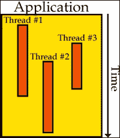
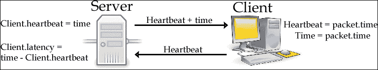
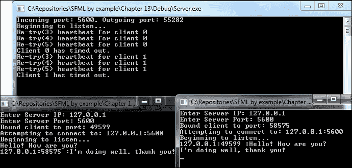

# 第十三章. 我们有联系！ – 网络基础

在当今这个人人互联、事事相连的世界里，和朋友一起玩游戏已经不再是什么新鲜事了。它已经成为许多群体中的标准。像“击杀”或“露营”这样的表达已经成为游戏玩家的流行语。无论是 2-4 人的局域网聚会还是大型多人在线游戏，网络显然在游戏圈中扮演着巨大的角色。引入其他玩家的元素增加了游戏内容，同时也让游戏的宇宙看起来更加生动和繁荣。在许多情况下，这种现象实际上将人们聚集在一起，并提供了一种非常愉快的体验，只要它不卡顿。现在是时候利用多人游戏的核心，也许甚至传播六度分隔理论了。

在本章中，我们将介绍以下内容：

+   网络应用程序的基本原理

+   利用线程并确保数据安全

+   实现我们自己的基本通信协议

+   构建一个简单的聊天客户端和服务器

让我们打破系统的孤立状态，将其对外开放！

# 网络基础

首先，让我们来解释一个在此时与网络几乎同义的术语：套接字。什么是套接字？最简单的说法，套接字就是一个用于网络通信的接口。当两个应用程序进行通信时，至少涉及两个套接字，并且它们之间交换数据。当数据从应用程序 A 发送到应用程序 B 时，它首先从应用程序 A 的套接字出发，穿越整个互联网，并希望最终到达应用程序 B 的套接字：


每个套接字都必须绑定到一个称为端口的实体上，这可以想象成通向系统的门户。每个门户用于不同的目的，并且一次只能由一个套接字使用。最简单的说法，端口就是一个 16 位的数值，这意味着端口号可以高达 65535。当某个服务正在使用特定的端口时，另一个套接字无法绑定到它，直到它被释放。最常用的端口范围在 20-1024 之间。例如，端口 80 始终用于 HTTP 流量，这是大多数网站托管服务器运行的基础。

## SFML 网络

为了在 SFML 中访问网络结构，我们首先需要包含网络头文件：

```cpp
#include <SFML/Network.hpp>
```

构建具有网络功能的项目还需要更多的库文件来正确链接，具体为`sfml-network.lib`、`ws2_32.lib`和`winmm.lib`。包含这些库将确保项目能够正确编译。

现在有几种类型的套接字可供选择，每种都有特定的功能、优点和缺点。SFML 为我们提供了两种基本类型：TCP 和 UDP。**TCP** 代表 **传输控制协议**，而 **UDP** 代表 **用户数据报协议**。这两个协议都能够发送和接收数据，但在底层它们是根本不同的。公平地说，虽然同一类型的两个套接字不能绑定到同一个端口，但它们仍然可以被两种不同的协议绑定。

### TCP 套接字

TCP 是一种基于连接的协议，这意味着在交换数据之前，必须通过一个尝试发起连接的应用程序（客户端）连接到另一个积极等待连接的应用程序（服务器）来建立连接。让我们看看一个基本的客户端应用程序连接尝试：

```cpp
sf::TcpSocket socket;
sf::Socket::Status status = 
  socket.connect("192.168.1.2", 5600, sf::seconds(5.f));
if (status != sf::Socket::Done){
    // Connection failed.
}
```

首先，我们创建一个 TCP 套接字实例。接下来，会调用其 `connect` 方法，并传递三个参数：

+   第一个参数是 `sf::IpAddress` 类型，正如其名称所示：我们试图连接到的 IP 地址，它必须是开放的并且有一个服务器正在接受连接。

+   第二个参数是端口号。

+   最后，我们有第三个参数，它是完全可选的。这是套接字在超时后放弃并抛出错误的超时值。如果没有提供此参数，则使用默认的操作系统超时值。

`connect` 方法的返回值被捕获并存储在 `sf::Socket::Status` 类型中，它只是一个包含一些有用值的枚举表，例如 `Done`、`NotReady`、`Partial`、`Disconnected` 和 `Error`。与发送或接收数据、连接或断开连接相关的两种套接字类型的每个方法都会返回一个我们可以用于错误检查的状态。

当使用 TCP 在服务器端接受连接时，会使用一个特殊的类：`sf::TcpListener`。它必须绑定到特定的端口，并且不能发送或接收任何数据：

```cpp
sf::TcpListener listener;
if (listener.listen(5600) != sf::Socket::Done)
{
    // Unable to bind to port.
}

sf::TcpSocket incoming;
if (listener.accept(incoming) != sf::Socket::Done)
{
    // Failed accepting an incoming connection.
}
```

在套接字设置完成后，会调用监听器的 `accept` 方法。与 `connect` 以及我们稍后将要讨论的几个其他方法一样，它实际上会阻止应用程序继续执行，直到建立连接。这被称为 `阻塞`。一个来自 STL 库的阻塞函数的好例子是 `std::cin`。为什么这很重要呢？简单来说，网络操作相当不可预测。我们无法确切知道连接尝试可能需要多长时间，因为另一端的宿主可能无法到达。在这段时间里，你的应用程序将停滞不前，什么也不做。

最终，当连接建立后，传入的套接字可以用来与客户端通信：

```cpp
char data[100];
// ...
if (socket.send(data, 100) != sf::Socket::Done){
    // Sending data failed.
}
```

发送方法有两种变体：一种是低级版本，允许用户发送原始字节数组，另一种是高级版本，它使用我们将很快介绍的专业化类。低级版本接受一个`void`指针和它应该发送的字节数量。

### 小贴士

请记住，由于多种原因，发送数据也可能失败。务必始终检查返回的状态以检查错误！

为了在另一端接收数据，套接字需要监听：

```cpp
char data[100];
std::size_t received;

if (socket.receive(data, 100, received) != sf::Socket::Done)
{
    // Failed receiving data.
}
```

当发送原始数据时，必须提供一个足够大的缓冲区以及它可以包含的最大大小，这是接收方法中的第二个参数。第三个参数是接收到的字节数，当数据到来时会被写入。默认情况下，接收方法也是阻塞的。这意味着它将使整个程序停止，直到有数据通过。

### 处理多个连接

你可能已经注意到，上述所有示例都只关注一个客户端连接并发送数据。在当今高度互联的世界里，这种情况几乎从未发生过，所以让我们看看我们如何同时处理多个 TCP 套接字：

```cpp
sf::TcpSocket socket;
// ...
sf::SocketSelector selector;
selector.add(socket);
```

`sf::SocketSelector`类提供了一种让我们能够阻塞在多个套接字上的方法，而不是仅仅一个。它监视添加到其中的每个套接字，以寻找传入的数据，与之前的示例不同，之前的示例只处理了一个套接字。

### 注意

需要牢记的一个重要事情是，套接字选择器实际上并不存储添加到其中的套接字，它只是指向它们。这意味着尽管套接字已被添加到选择器中，但它仍然必须存储在你选择的数据容器中。

要处理来自多个套接字的数据，可以使用套接字选择器的`wait`方法：

```cpp
sf::SocketSelector selector;
std::vector<sf::TcpSocket> container;
// ...
sf::TcpSocket socket;
selector.add(socket);
container.push_back(socket);
if (selector.wait(sf::seconds(10))){
  for (auto &itr : container){
    if (selector.isReady(itr)){
      // Socket received data.
      char data[100];
      std::size_t received;
      sf::Socket::Status status= itr.receive(data, 100, received);
      if (status != sf::Socket::Done){
        // Failed receiving data...
      }
    }
  }
} else {
  // Timed out...
}
```

`wait`方法提供的参数再次是可选的。如果选择器内的某个套接字接收到了数据，则返回`true`，我们可以通过使用`isRead`方法遍历我们的数据容器来找到接收数据的套接字。

### TCP 协议细节

TCP 和 UDP 之间一个主要的不同点在于传输可靠性。TCP 协议在建立连接时使用了一种称为三次握手的机制。它看起来有点像这样：


尝试建立连接的一方首先发送一个**SYN**（**同步**）数据包。服务器响应一个**SYN/ACK**（**同步确认**）数据包，客户端随后响应一个**ACK**（**确认**）数据包。这三个数据交换发生在每个连接的开始阶段。之后，当实际数据发送时，它以 SYN 数据包的形式发送，接收方总是回复一个 ACK 数据包。如果发送数据的方没有收到 ACK 响应，那么在特定的时间间隔后，会再次发送相同的数据。所有这些来回发送的数据都会被标记上序列号，这使得 TCP 协议也能确保数据按顺序到达。这提供了可靠性，但代价是速度较慢且体积较大。如果某个数据包丢失，接收方必须等待直到相同的数据被重传才能继续。对于大多数应用程序甚至某些类型的游戏，这种速度差异是可以忽略不计的。然而，一些需要最高效率且不关心数据包丢失的快节奏游戏最终会使用 UDP。

### 用户数据报协议

在 SFML 中，TCP 和 UDP 套接字实际上都继承自同一个基类，这意味着我们之前看到的 TCP 的大部分功能都得到了继承。然而，一个主要的区别是 UDP 是无连接的。这意味着 UDP 没有三次握手这样的东西，也没有确认包。UDP 专注于数据的发送。没有顺序检查，没有序列号，没有膨胀的包，也没有保证发送出去的数据会到达目的地。这种完全消除错误检查将数据包开销从使用 TCP 时的 20 字节降低到 8 字节。

说了这么多，UDP 也有一些限制，比如发送数据的最大大小。UDP 中的数据是以数据报的形式发送的，而不是像 TCP 那样以流的形式，这是 TCP 处理数据的方式。规定的最大数据报大小略小于 65536 字节，不能超过。

因为 UDP 是无连接的，所以没有可以用来接收传入流量的`sf::TcpListener`等价物。不过，在可以使用之前，套接字必须绑定到特定的端口：

```cpp
sf::UdpSocket socket;

// Bind to port 5600
if (socket.bind(5600) != sf::Socket::Done)
{
    // Binding failed.
}
```

通过`sf::Socket::AnyPort`，可以将随机端口绑定到套接字，而不是使用数值常量。稍后可以像这样检索它：

```cpp
sf::UdpSocket socket;
// ...
unsigned int port = socket.getLocalPort();
```

发送和接收的基本原理相同，只是由于 UDP 是无连接的，所以需要提供额外的参数，即数据发送到或接收自的 IP 地址和端口：

```cpp
sf::UdpSocket socket;
// ...
char data[100];
if (socket.send(data, 100, "192.168.1.2", 5600)
  != sf::Socket::Done)
{
    // Sending failed.
}
// ...
sf::IpAddress ipAddr;
unsigned short port;
std::size_t received;
if (socket.receive(data, 100, received, ipAddr, port) 
  != sf::Socket::Done)
{
    // Receiving failed.
}
```

最后，UDP 套接字确实与`sf::SocketSelector`类一起工作，但鉴于 UDP 的特性，真正有用的情况并不多，因为所有数据最多可以通过一个或两个套接字发送和接收。

## 发送原始数据的替代方案

在网络上简单地发送原始字节可能会变得相当复杂，更不用说有问题了。第一个也许是最大的问题是机器的**字节序**。一些处理器以不同于其他处理器的顺序解释数据。在大端字节序的家族中，最重要的字节首先存储，而在小端字节序的机器中则会相反。从大端机器发送到小端机器的原始数据会被不同地解释，并导致奇怪的结果。

除了所有类型的机器存储数据的方式不同之外，C++中基本变量的大小可能在不同的机器和编译器之间有所不同。如果这还不够，TCP 协议由于不保留消息边界而引入了额外的麻烦。发送出去的数据块可能会被分割和组合，如果接收者没有正确地重新构造它们，这可能会引起问题。

虽然所有这些都听起来相当可怕，但所有这些问题都有解决方案。可以通过使用 SFML 的固定大小类型来解决数据类型大小变化的问题，例如`sf::Int8`、`sf::Uint16`等。它们是简单的类型定义，映射到平台上的预期大小确定的数据类型。通过网络交换这些类型可以再次确保数据安全。

### SFML 数据包

字节序和消息边界问题需要稍微更多的努力来解决。这时就出现了`sf::Packet`！它是一个专门且轻量级的类，可以用来打包/提取数据。SFML 数据包使用与标准流完全相同的接口，通过使用`<<`和`>>`操作符进行数据插入和提取，如下所示：

```cpp
sf::Int16 n = 16;
float f = 32.f;
std::string str = "Aloha";

sf::Packet packet;
packet << n << f << str;
// ...
packet >> n >> f >> str;
```

虽然打包数据始终可以保证工作，但提取数据实际上可能会失败。如果发生这种情况，数据包错误标志会被设置。检查标志是否设置与测试布尔值类似，这又与标准流类似：

```cpp
if(!(packet >> n)){
    // Failed extraction.
}
```

TCP 和 UDP 数据包都提供了与`sf::Packet`实例一起工作的重载发送和接收方法：

```cpp
sf::Packet packet;
// TCP
tcpSocket.send(packet);
tcpSocket.receive(packet);
// UDP
udpSocket.send(packet, "192.168.1.2", 5600);
sf::IpAddress senderIP;
unsigned short senderPort;
udpSocket.receive(packet, senderIP, senderPort);
```

如果提供了`<<`和`>>`操作符的重载，自定义数据类型也可以被输入到或从`sf::Packet`结构中提取，如下所示：

```cpp
struct SomeStructure{
    sf::Int32 m_int;
    std::string m_str;
};

sf::Packet& operator <<(sf::Packet& l_packet, 
  const SomeStructure& l_struct)
{
    return l_packet << l_struct.m_int << l_struct.m_str;
}

sf::Packet& operator >>(sf::Packet& l_packet, 
  SomeStructure& l_struct)
{
    return l_packet >> l_struct.m_int >> l_struct.m_str;
}
```

这使得插入和提取自定义数据类型变得容易：

```cpp
SomeStructure s;
sf::Packet packet;

packet << s;
packet >> s;
```

使用 SFML 数据包与 TCP 套接字存在一个小限制。由于必须保留消息边界，数据包中会发送一些额外的数据。这意味着以 SFML 数据包形式发送的数据必须使用 SFML 数据包接收。UDP 不对此有限制，因为该协议本身保留了消息边界。

## 非阻塞套接字

默认情况下，TCP 和 UDP 套接字以及 TCP 监听器都是阻塞的。它们的阻塞模式可以更改为立即返回：

```cpp
sf::TcpSocket tcp;
tcp.setBlocking(false);

sf::TcpListener tcpListener;
tcpListener.setBlocking(false);

sf::UdpSocket udp;
udp.setBlocking(false);
```

在一个没有数据传入的非阻塞套接字上接收数据会返回 `sf::Socket::NotReady`，同样，如果没有挂起的 TCP 连接，尝试接受 TCP 连接也会返回 `sf::Socket::NotReady`。将你的套接字置于非阻塞模式是避免程序执行因检查数据或连接的可用性而中断的最简单方法。

非阻塞 TCP 套接字不能保证发送你传递给它的所有数据，即使使用 `sf::Packet` 实例。如果返回 `sf::Socket::Partial` 状态，必须在 `send` 上一次调用停止的确切字节偏移量处再次发送数据。如果发送原始数据，请确保使用此 `send` 重载：

```cpp
send(const void* data, std::size_t size, std::size_t& sent)
```

它会覆盖第三个提供的参数，以发送的字节数的准确值。

发送 `sf::Packet` 实例不需要你跟踪字节数偏移量，因为它存储在数据包本身中。这意味着你必须在数据包成功发送之前不能销毁数据包实例。创建一个新的数据包并用完全相同的数据填充它将不起作用，因为数据包内部存储的数据偏移量丢失了。

# 让流量流动

在互联网上进行通信比使用正确的代码有更多细微之处。正如我们之前讨论的，应用程序用于发送或接收数据的端口号可以想象成是通向你的系统的门户，其中有成千上万个。这个门户可以是开启的，也可以是关闭的。默认情况下，你选择的程序使用的端口在你的系统上更有可能被关闭，这对于本地连接来说无关紧要，但任何通过该特定端口从外部世界传入的数据都无法通过。你可以通过访问你的路由器设置页面来管理你的端口。所需的步骤因每个路由器而异。幸运的是，[`portforward.com`](http://portforward.com) 提供了帮助！通过访问它并在该网站上查找你的路由器的制造商和型号，你可以找到有关如何打开或关闭任何端口的详细说明。

### 小贴士

绑定到 `sf::Socket::AnyPort` 的套接字很可能会绑定到 49152 和 65535 之间的某个端口。端口转发适用于范围，以及单个端口。打开这个特定的端口范围将确保你的 SFML 网络应用程序在通过万维网进行通信时按预期工作。

防火墙也通常会默认阻止此类流量。例如，Windows 防火墙会提示用户允许流量通过首次启动的应用程序。然而，根据您的应用程序，由于 Windows 防火墙并非最可靠的应用软件，该提示可能永远不会出现。如果您的所有关键端口都开放，而某个特定程序似乎仍然没有发送或接收任何内容，请确保将您的客户端或服务器程序添加到 Windows 防火墙的“允许列表”中，方法是转到**控制面板**，点击**Windows 防火墙**，在左侧选择**通过 Windows 防火墙允许程序或功能**，点击**更改设置**，最后点击**允许另一个程序**按钮。这将打开另一个窗口，您可以通过浏览并点击**添加**来添加您的客户端/服务器应用程序。

# 多线程

在您的代码中包含阻塞函数可能会带来真正的麻烦。监听传入的网络连接或数据、要求用户在控制台中输入某些内容，或者甚至加载游戏数据，如纹理、地图或声音，都可能阻塞程序执行直到完成。您是否曾想过某些游戏在加载数据时加载条会实际移动？如何用顺序执行的代码实现这一点？答案是多线程。您的应用程序从上到下按顺序在主线程中运行所有代码。它不是一个程序，因为它不能独立存在。相反，线程只在您的应用程序中运行。这种美妙的特性是，可以同时存在并运行多个线程，这实现了并行代码执行。考虑以下图示：



假设整个应用程序空间是主线程，我们在这里所做的一切就是更新和渲染游戏。上面的例子中除了主线程外还运行了三个线程。第一个线程可以用来监听传入的网络连接。**线程 #2** 负责在新关卡打开或关闭时加载数据或卸载数据。最后，第三个线程可能正在等待控制台输入。即使这三个线程都阻塞了，应用程序仍然会继续渲染！真酷！

SFML 为我们提供了一些基本类型，可以用来创建和控制线程。让我们首先给线程分配一些工作：

```cpp
void Test(){
    for (int i = 0; i < 10; ++i){
        std::cout << i << std::endl;
    }
}
```

这只是一个我们希望与主线程并行执行的基本函数。如何实现这一点？通过使用 `sf::Thread`！

### 小贴士

C++ 也提供了它自己的线程类 `std::thread`，以及它自己的锁和互斥量。它还提供了一个 `std::future` 类模板，这在访问异步操作的结果时非常有用。

首先，必须通过向其构造函数提供函数或成员函数指针来正确设置它：

```cpp
sf::Thread thread1(Test);
```

线程构造函数实际上提供了四个重载，甚至可以接受`std::bind`和 lambda 表达式的返回值，这使得我们可以向这些函数提供任意数量的参数。一旦线程设置好，就必须启动它才能执行代码：

```cpp
thread1.launch();
```

一旦执行函数返回，其线程将自动停止。`sf::Thread`类提供了一个终止方法，但除非您知道自己在做什么，否则不应使用它。它可能会产生不受欢迎的行为，包括在某些操作系统上局部变量不会被销毁。相反，您的代码应该设计成允许线程在不再需要时自行停止。手动终止它是不安全的！警告您了。

线程提供的最后一个方法是`wait`方法：

```cpp
thread1.wait();
```

被调用的线程将一直挂起，直到`thread1`完成。这可能会非常危险。如果`thread1`中存在无限循环或被调用的阻塞函数永远不会解除阻塞，程序将完全挂起。

### 注意

在`sf::Thread`完成之前，永远不要销毁其实例！这将导致主线程挂起，因为线程的析构函数会调用其`wait`方法。您的应用程序将陷入停滞。

## 共享数据保护

顺便说一下，使用线程的原因也是用户可能遇到的大多数问题的原因。并行运行代码块是很好的，但如果两个线程试图读取或修改相同的数据会发生什么呢？在这种场景下，崩溃和数据损坏是明确的可能性。想象一下这样一个场景：主线程持有要更新和渲染的实体列表。到目前为止，一切顺利！接下来，让我们引入一个新的线程，该线程将运行特定于网络的代码，并有权访问我们所有的实体。如果这个线程出于任何原因决定删除一个实体，那么它很可能发生在主线程的更新或渲染周期中。此时，我们都知道当您正在使用的迭代器突然变得无效时会发生什么。幸运的是，有方法可以确保您的代码中的所有操作都是线程安全的，通过同步它们来实现。

SFML 为我们提供了一个有趣的名为`sf::Mutex`的小类。它代表互斥，基于一个非常基本的原理：允许只有一个线程执行某些代码，同时使其他线程等待它完成。让我们通过一个基本的代码示例来帮助您更好地理解这个概念：

```cpp
sf::Mutex mutex;

void Test(){
    mutex.lock();
    for (int i = 0; i < 10; ++i){
        std::cout << i << std::endl;
    }
    mutex.unlock();
}

int main(){
    sf::Thread thread1(Test);
    thread1.launch();

    mutex.lock();
    // Do something data-sensitive here.
    mutex.unlock();
    return 0;
}
```

`mutex`类为我们提供了两个方法：`lock`和`unlock`。当一个互斥锁第一次被锁定时，锁定它的线程被赋予优先权，并允许继续执行代码。如果另一个线程在互斥锁仍然锁定的情况下调用`lock`方法，则不允许它进一步移动，直到互斥锁被解锁。一旦解锁，等待结束，第二个线程被允许继续。

让我们分析一下上面代码示例中发生的情况：`thread1` 被绑定到 `Test` 函数并立即启动。测试函数锁定互斥锁，因为在此之前它还没有被锁定，所以打印数字的循环开始迭代。与此同时，我们的主线程到达了 `mutex.lock();` 这一行。此时可能已经打印出了一些数字。由于互斥锁已经被锁定，主线程立即停止。一旦 `Test` 函数打印出最后一个数字，就会到达 `mutex.unlock();` 这一行。这允许主线程为自己锁定互斥锁并继续执行。如果其他任何线程试图调用共享互斥锁的锁定方法，它必须等待主线程完成。最后，互斥锁被解锁，任何在后台等待的可能线程现在可以继续执行。

存在一个潜在的边缘情况，这可能会变得危险。互斥锁必须被解锁，主线程才能继续执行。如果绑定到线程的函数突然抛出异常怎么办？如果它返回一个值，或者有返回不同值的 if/else 语句分支怎么办？`unlock` 方法可以在每个分支中调用，但这只会使代码变得混乱，更不用说它并没有解决异常问题。幸运的是，有一个非常优雅的解决方案：`sf::Lock` 类。它所做的只是在其构造函数中接收一个互斥锁的引用，此时它被锁定，并在析构函数中解锁它。在栈上创建这样的对象可以解决所有这些问题，因为互斥锁会在锁对象超出作用域时自动解锁。让我们看看它是如何使用的：

```cpp
sf::Mutex mutex;

void Test(){
    sf::Lock lock(mutex);
    for (int i = 0; i < 10; ++i){
        std::cout << i << std::endl;
        if (i == 5){ return; } // mutex.unlock() called.
    }
} // mutex.unlock() called.
```

这是一段更安全的代码。即使有可能抛出异常，共享互斥锁也会被解锁，允许程序的其余部分继续执行。

# 创建一个简单的通信协议

在涵盖了所有基础知识之后，我们终于准备好开始设计了！我们需要做的第一个选择是选择哪种协议更适合我们的需求。在像这样的实时应用程序中丢失数据包并不是悲剧。更重要的是，数据要尽可能快地发送和接收，以便更新玩家和游戏中的所有实体。由于 TCP 是一个较慢的协议，我们不会从它采取的额外措施中受益，因此选择很明确。用户数据报协议是更好的选择。

通过首先定义一些将在服务器和客户端之间交换的包类型，以及决定包标识符的类型，让我们详细说明一下我们将要构建的系统的一些细节。这些信息将保存在 `PacketTypes.h` 头文件中：

```cpp
using PacketID = sf::Int8;
enum class PacketType{
  Disconnect = -1, Connect, Heartbeat, Snapshot,
  Player_Update, Message, Hurt, OutOfBounds
};
void StampPacket(const PacketType& l_type, sf::Packet& l_packet);
```

注意`PacketType`枚举中的最后一个元素。它并不是一个实际要发送或接收的数据包类型。相反，它仅仅是为了方便检查数据包类型是否有效而存在，这一点我们很快就会讨论。除了枚举之外，我们还提供了一个将类型附加到数据包的函数。该函数在`PacketTypes.cpp`文件中实现：

```cpp
void StampPacket(const PacketType& l_type, sf::Packet& l_packet){
    l_packet << PacketID(l_type);
}
```

这个函数只是将提供的类型参数转换为 SFML 提供的特定整数数据类型，然后再将其输入到数据包实例中。使用函数来做这件事，从长远来看是有好处的，如果我们决定通过在数据包中添加额外的数据来更改通信协议。

接下来，让我们创建一个头文件，其中包含客户端和服务器之间共享的最常见信息位。我们可以简单地称它为`NetworkDefinitions.h`：

```cpp
enum class Network{
  HighestTimestamp = 2147483647, ClientTimeout = 10000,
  ServerPort = 5600, NullID = -1
};
using ClientID = int;
using PortNumber = unsigned short;
```

这些只是通信双方将要使用到的所有类型和常量。

## 保持 UDP 连接活跃

由于 UDP 套接字是无连接的，我们需要有一种方法来检查服务器端的任何一个客户端，或者客户端端的任何一个服务器，是否已经停止响应，因此被认为是超时了。这种机制的常见术语是**心跳**。它的实现可能因应用程序而异，以及你的个人感受。在这种情况下，我们将讨论一种相当基本的策略，不仅维护一个活跃的连接，而且还测量两边的网络延迟。

为了这个目的，最好由服务器启动心跳。它有两个主要好处：交换的数据更少，作弊的风险降低。让我们看看服务器-客户端心跳的最保守实现：



服务器将跟踪最后一次向客户端发送心跳的时间。结合预定义的心跳间隔，我们可以以恒定的速率发送它们。当需要发送时，构建一个心跳包并将其本地服务器时间附加到它上。然后将其发送到客户端。

这个操作的客户端部分要简单得多。它总是等待心跳，当收到一个心跳时，更新客户端的本地时间并保留下来以供稍后检查超时。然后向服务器发送一个响应，确认确实收到了心跳。

当我们的服务器从客户端收到心跳响应时，通过从当前时间减去最后一次心跳包发送的时间来测量这两台机器之间的延迟。这个延迟，也称为延迟，是数据在两个主机之间往返所需的时间。

在服务器上实现心跳机制确保我们不会保留任何可能已经断开连接的客户端，从而通过向不可达的主机发送数据而浪费带宽。

# 设计客户端类

在客户端发生的一切，无论是渲染精灵、播放声音还是处理用户输入，都只意味着将所有网络代码本地化在单个类中。这将使我们能够快速轻松地与服务器通信。让我们首先查看`Client.h`头文件中的一些必要定义，开始设计这个类：

```cpp
#define CONNECT_TIMEOUT 5000 // Milliseconds.

class Client;
using PacketHandler = std::function<
  void(const PacketID&, sf::Packet&, Client*)>;
```

第一个定义是客户端意识到它不再连接到服务器所需的时间（以毫秒为单位）。这个值显然可以在任何时候进行调整。接下来是一个函数类型的定义，它将用于处理客户端上的数据包。我们将为客户端类提供一个指向函数的指针，该函数负责处理大部分传入的信息。

在处理完这些之后，我们可以开始塑造客户端类：

```cpp
class Client{
public:
  Client();
  ~Client();
  bool Connect();
  bool Disconnect();
  void Listen();
  bool Send(sf::Packet& l_packet);
  const sf::Time& GetTime() const;
  const sf::Time& GetLastHeartbeat() const;
  void SetTime(const sf::Time& l_time);
  void SetServerInformation(const sf::IpAddress& l_ip,
    const PortNumber& l_port);

  template<class T>
  void Setup(void(T::*l_handler)
    (const PacketID&, sf::Packet&, Client*), T* l_instance)
  {
    m_packetHandler = std::bind(l_handler, l_instance,
      std::placeholders::_1, std::placeholders::_2,
      std::placeholders::_3);
  }

  void Setup(void(*l_handler)(const PacketID&,
    sf::Packet&, Client*));
  void UnregisterPacketHandler();
  void Update(const sf::Time& l_time);
  bool IsConnected() const;
  void SetPlayerName(const std::string& l_name);
  sf::Mutex& GetMutex();
private:
  std::string m_playerName;

  sf::UdpSocket m_socket;
  sf::IpAddress m_serverIp;
  PortNumber m_serverPort;
  PacketHandler m_packetHandler;
  bool m_connected;
  sf::Time m_serverTime;
  sf::Time m_lastHeartbeat;

  sf::Thread m_listenThread;
  sf::Mutex m_mutex;
};
```

这里有一些需要注意的事情。首先，我们希望支持常规函数和成员函数作为数据包处理器，因此有两个`Setup`方法。显然，第一个方法由于有模板参数，必须在头文件中实现。

第二，这个类保留并管理自己的`sf::Mutex`和`sf::Thread`实例。这样，我们可以向外部代码提供一个通用的线程同步接口。

# 实现客户端

在处理完类定义后，现在是时候让它真正发挥作用了，从构造函数和析构函数开始：

```cpp
Client::Client():m_listenThread(&Client::Listen, this){}
Client::~Client(){ m_socket.unbind(); }
```

在客户端构造函数的初始化列表中，我们将监听线程绑定到这个类的`Listen`方法。线程没有默认的空构造函数，这就是为什么这是必要的。析构函数只是用来解绑我们使用的套接字。

现在，让我们尝试实现连接协议：

```cpp
bool Client::Connect(){
  if (m_connected){ return false; }
  m_socket.bind(sf::Socket::AnyPort);
  sf::Packet p;
  StampPacket(PacketType::Connect, p);
  p << m_playerName;
  if (m_socket.send(p, m_serverIp, m_serverPort) !=
    sf::Socket::Done)
  {
    m_socket.unbind();
    return false;
  }
  m_socket.setBlocking(false);
  p.clear();
  sf::IpAddress recvIP;
  PortNumber recvPORT;
  sf::Clock timer;
  timer.restart();
  while (timer.getElapsedTime().asMilliseconds()<CONNECT_TIMEOUT){
    sf::Socket::Status s = m_socket.receive(p, recvIP, recvPORT);
    if (s != sf::Socket::Done){ continue; }
    if (recvIP != m_serverIp){ continue; }
    PacketID id;
    if (!(p >> id)){ break; }
    if ((PacketType)id != PacketType::Connect){ continue; }
    m_packetHandler(id, p, this);
    m_connected = true;
    m_socket.setBlocking(true);
    m_lastHeartbeat = m_serverTime;
    m_listenThread.launch();
    return true;
  }
  std::cout << "Connection attempt failed! Server info: " 
    << m_serverIp << ":" << m_serverPort << std::endl;
  m_socket.unbind();
  m_socket.setBlocking(true);
  return false;
}
```

第一步也是最明显的一步是检查我们是否已经连接到服务器，通过检查`m_connected`数据成员。

接下来，我们使用的套接字必须绑定到一个端口。这里可以使用特定的端口号，但这将限制同一台计算机在同时可以拥有的连接数量。你不能在相同的协议上两次绑定同一个端口的套接字。通过使用`sf::Socket::AnyPort`，我们让 SFML 选择一个未被使用的随机端口。

为了建立连接，客户端必须首先向服务器发送一些信息。由于 SFML 已经提供了一个用于轻松数据传输的优秀辅助类`sf::Packet`，我们将充分利用它。

在将类型`Connect`分配给我们的数据包后，我们也写入玩家名称并将数据包发送到服务器。

代码的其余部分负责正确处理超时。首先，我们将套接字设置为非阻塞模式，因为我们将在单个线程中处理它。在清除我们刚刚发送的数据包以便再次使用后，设置一些局部变量以捕获响应的 IP 地址和端口号。此外，设置一个时钟，以帮助我们确定我们是否等待响应时间过长。

接下来，代码会在计时器保持在预定义的超时值`CONNECT_TIMEOUT`之下时循环。在每次迭代中，我们调用套接字的接收方法并捕获其状态。如果返回的状态不表示成功或接收到的 IP 地址不匹配我们服务器的 IP 地址，我们简单地跳过当前迭代。没有人想从未知来源接收数据！

在验证数据包包含 ID 并且它与`Connect`匹配后，我们将接收到的信息传递给数据包处理器，将`m_connected`标志设置为`true`，将套接字放回阻塞模式，将最后的心跳值设置为当前时间，启动监听线程，并返回`true`以表示成功。然而，如果成功连接的时间耗尽，循环结束，打印错误消息，并将套接字解绑并再次设置为阻塞模式。

一旦客户端连接到服务器，就会启动监听线程。让我们看看是什么让它运转：

```cpp
void Client::Listen(){
  sf::Packet packet;
  sf::IpAddress recvIP;
  PortNumber recvPORT;
  while (m_connected){
    packet.clear();
    sf::Socket::Status status =
      m_socket.receive(packet, recvIP, recvPORT);
    if (status != sf::Socket::Done){
      if (m_connected){
        std::cout << "Failed receiving a packet from "
          << recvIP << ":" << recvPORT << ". Status: "
          << status << std::endl;
        continue;
      } else {
        std::cout << "Socket unbound." << std::endl;
        break;
      }
    }
    if (recvIP != m_serverIp){
      // Ignore packets not sent from the server.
      continue;
    }
    PacketID p_id;
    if (!(packet >> p_id)){
      // Non-conventional packet.
      continue;
    }
    PacketType id = (PacketType)p_id;
    if (id<PacketType::Disconnect||id >=PacketType::OutOfBounds){
      // Invalid packet type.
      continue;
    }

    if (id == PacketType::Heartbeat){
      sf::Packet p;
      StampPacket(PacketType::Heartbeat, p);
      if (m_socket.send(p, m_serverIp, m_serverPort) !=
        sf::Socket::Done)
      {
        std::cout << "Failed sending a heartbeat!" << std::endl;
      }
      sf::Int32 timestamp;
      packet >> timestamp;
      SetTime(sf::milliseconds(timestamp));
      m_lastHeartbeat = m_serverTime;
    } else if(m_packetHandler){
      m_packetHandler((PacketID)id, packet, this); // Handle.
    }
  }
}
```

在设置一些局部变量以保存数据包、IP 和端口号信息后，进入监听线程循环。只要客户端连接到服务器，它就会运行。每次循环迭代时，都会清除数据包实例以接收新数据。套接字接收方法的状态存储在局部变量`status`中，并检查是否成功。因为套接字处于阻塞模式，监听线程将在`m_socket.receive(...)`行处停止，直到有数据到来。

如果返回的状态表示某种失败，打印适当的错误消息，假设客户端仍然连接到服务器。如果不是，套接字将被解绑，循环立即停止，以便线程可以安全地终止。

假设已经正确接收了一些数据，检查原始 IP 地址。如果它不匹配我们服务器的 IP 地址，数据将通过跳过当前循环迭代被丢弃。同样，如果我们无法提取数据包 ID，或者它不在我们预定的边界内，结果相同。我们不希望有任何格式不正确或不欢迎的数据包。

接下来，我们检查刚刚接收到的数据包的 ID。在这个特定的类中，我们只关心一种类型的数据包：`PACKET_HEARTBEAT`。这些是小消息，服务器为了两个原因发送给所有客户端：时间同步和保持有效的连接。由于不可预见的情况，服务器端和客户端的时间可能会开始不同步，这最终可能导致严重的问题。每隔一段时间用来自服务器的时间戳覆盖客户端的时间可以消除这个问题。除此之外，这也是客户端和服务器跟踪连接是否仍然存活的方法。在我们的客户端中，`m_lastHeartbeat`保存了从服务器接收到的最新时间戳，稍后可以用来检查超时。

如果数据包 ID 是其他东西，它就直接传递给数据包处理函数，由不同的类进行处理。

现在我们有了所有这些打开和维护服务器连接的方法，让我们看看它是如何被终止的：

```cpp
bool Client::Disconnect(){
  if (!m_connected){ return false; }
  sf::Packet p;
  StampPacket(PacketType::Disconnect, p);
  sf::Socket::Status s =
    m_socket.send(p, m_serverIp, m_serverPort);
  m_connected = false;
  m_socket.unbind(); // Unbind to close the listening thread.
  if (s != sf::Socket::Done){ return false; }
  return true;
}
```

首先，检查客户端的状态。如果没有连接，我们不需要断开连接。然后，使用类型为`Disconnect`的数据包实例发送到服务器。在将`m_connected`标志设置为`false`之后，我们解绑我们的套接字，并根据发送数据包是否成功返回`true`或`false`。

### 注意

当套接字处于阻塞模式时，其`receive`方法会在有数据到达之前等待，然后继续。如果在单独的线程中发生类似的事情，它就会继续运行，因此会阻止我们的程序退出。防止这种情况的一种方法是通过解绑正在使用的套接字。这会使`receive`方法返回一个错误，我们在客户端类的`Listen`方法中已经处理了这个错误。

向服务器发送数据非常简单，就像下一个方法所展示的那样：

```cpp
bool Client::Send(sf::Packet& l_packet){
  if (!m_connected){ return false; }
  if (m_socket.send(l_packet, m_serverIp, m_serverPort) !=
    sf::Socket::Done)
  {
    return false;
  }
  return true;
}
```

我们接收一个需要发送出去的现有数据包的引用。如果我们没有连接到服务器，或者我们的套接字的`send`方法返回的不是`sf::Socket::Done`，该方法立即返回`false`。

我们还需要一种方法来提供自定义的数据包处理函数，该函数将由这个类使用。这个方法的成员函数版本已经在头文件中实现，剩下要处理的是函数指针版本：

```cpp
void Client::Setup(void(*l_handler)
  (const PacketID&, sf::Packet&, Client*))
{
    m_packetHandler = std::bind(l_handler,
      std::placeholders::_1, std::placeholders::_2, 
      std::placeholders::_3);
}
```

为了平衡，每个正面都需要一个反面。让我们提供一种方法来移除对可能不再存在的函数的任何关联，一旦代码开始封装：

```cpp
void Client::UnregisterPacketHandler(){
    m_packetHandler = nullptr;
}
```

最后但同样重要的是，更新方法：

```cpp
void Client::Update(const sf::Time& l_time){
  if (!m_connected){ return; }
  m_serverTime += l_time;
  if (m_serverTime.asMilliseconds() < 0){
    m_serverTime -= sf::milliseconds(
      sf::Int32(Network::HighestTimestamp));
    m_lastHeartbeat = m_serverTime;
    return;
  }
  if (m_serverTime.asMilliseconds() -
    m_lastHeartbeat.asMilliseconds() >=
      sf::Int32(Network::ClientTimeout))
  {
    // Timeout.
    std::cout << "Server connection timed out!" << std::endl;
    Disconnect();
  }
}
```

这个方法的主要目的是通过将更新之间的时间添加到服务器时间来跟踪流逝的时间。

现在，你可能会在接下来的几行中注意到一些奇怪的地方。为什么我们要检查服务器时间是否低于零？嗯，自开始以来经过的毫秒数由一个有符号的 32 位整数表示。它的最大正值是 2,147,483,647，之后它直接进入负数，确切地说是-2,147,483,648。诚然，这种情况并不常见。事实上，服务器需要连续运行近 25 天才能使时间戳达到我们讨论的值。尽管如此，一个边缘情况场景不应该因为不太可能发生而被忽视。从 32 位整数的最大可能值中减去服务器时间戳“将时间绕回”到正数领域，并允许它继续像什么都没发生一样。

更新方法也是我们检查连接是否超时的地方。如果当前时间和从服务器接收到的最后心跳之间的差异大于或等于超时值（以毫秒为单位），则调用`Disconnect`方法。

# 服务器类

现在，是时候看看另一端是如何处理这些事情的了。让我们先定义一些常量：

```cpp
#define HEARTBEAT_INTERVAL 1000 // Milliseconds.
#define HEARTBEAT_RETRIES 5
```

我们的服务器应用程序将每秒发送一次心跳，并在超时前重试五次，然后才会将客户端标记为超时。说到客户端，我们还需要跟踪一些额外的信息，这需要一个好的数据结构来存储所有这些信息：

```cpp
struct ClientInfo{
   sf::IpAddress m_clientIP;
   PortNumber m_clientPORT;
   sf::Time m_lastHeartbeat;
   sf::Time m_heartbeatSent;
   bool m_heartbeatWaiting;
   unsigned short m_heartbeatRetry;
   unsigned int m_latency;

   ClientInfo(const sf::IpAddress& l_ip, const PortNumber& l_port,
     const sf::Time& l_heartbeat): m_clientIP(l_ip),
     m_clientPORT(l_port), m_lastHeartbeat(l_heartbeat), 
     m_heartbeatWaiting(false), m_heartbeatRetry(0), m_latency(0)
   {}

   ClientInfo& operator=(const ClientInfo& l_rhs){
      m_clientIP         = l_rhs.m_clientIP;
      m_clientPORT       = l_rhs.m_clientPORT;
      m_lastHeartbeat    = l_rhs.m_lastHeartbeat;
      m_heartbeatSent    = l_rhs.m_heartbeatSent;
      m_heartbeatWaiting = l_rhs.m_heartbeatWaiting;
      m_heartbeatRetry   = l_rhs.m_heartbeatRetry;
      m_latency          = l_rhs.m_latency;
      return *this;
   }
};
```

除了简单地跟踪客户端的 IP 和端口号外，我们还需要知道上次向他们发送心跳的时间，服务器是否正在等待心跳响应，已进行的心跳重试次数，以及客户端当前的延迟。

### 小贴士

跟踪延迟提供了大量的潜在好处，从评估服务质量、精确匹配到最大化网络模拟的准确性。

接下来，我们将要使用的数据类型在整个`Server`类中值得一看：

```cpp
using Clients = std::unordered_map<ClientID, ClientInfo>;
class Server;
using PacketHandler = std::function<void(sf::IpAddress&,
  const PortNumber&, const PacketID&, sf::Packet&, Server*)>;
using TimeoutHandler = std::function<void(const ClientID&)>;
```

如您所见，这个类还使用了一个自定义函数，该函数将处理传入的数据包。除此之外，我们还需要能够在类外处理客户端超时，这也可以通过使用函数指针来完成。

我们已经有了所有需要的东西，所以让我们编写`Server`类的头文件：

```cpp
class Server{
public:
   template <class T>
   Server(void(T::*l_handler)(sf::IpAddress&, const PortNumber&, 
      const PacketID&, sf::Packet&, Server*),
      T* l_instance): m_listenThread(&Server::Listen, this)
   {
      m_packetHandler = std::bind(l_handler, l_instance,
         std::placeholders::_1, std::placeholders::_2, 
         std::placeholders::_3, std::placeholders::_4, 
         std::placeholders::_5);
   }

   Server(void(*l_handler)(sf::IpAddress&, const PortNumber&, 
      const PacketID&, sf::Packet&, Server*));
   ~Server();

   template<class T>
   void BindTimeoutHandler(void(T::*l_handler)
      (const ClientID&), T* l_instance)
   {
      m_timeoutHandler = std::bind(l_handler, l_instance, 
         std::placeholders::_1);
   }
   void BindTimeoutHandler(void(*l_handler)(const ClientID&));

   bool Send(const ClientID& l_id, sf::Packet& l_packet);
   bool Send(sf::IpAddress& l_ip, const PortNumber& l_port, 
      sf::Packet& l_packet);
   void Broadcast(sf::Packet& l_packet, 
      const ClientID& l_ignore = ClientID(Network::NullID));

   void Listen();
   void Update(const sf::Time& l_time);

   ClientID AddClient(const sf::IpAddress& l_ip, 
      const PortNumber& l_port);
   ClientID GetClientID(const sf::IpAddress& l_ip, 
      const PortNumber& l_port);
   bool HasClient(const ClientID& l_id);
   bool HasClient(const sf::IpAddress& l_ip, 
      const PortNumber& l_port);
   bool GetClientInfo(const ClientID& l_id, ClientInfo& l_info);
   bool RemoveClient(const ClientID& l_id);
   bool RemoveClient(const sf::IpAddress& l_ip, 
      const PortNumber& l_port);

   void DisconnectAll();
   bool Start();
   bool Stop();

   bool IsRunning();

   unsigned int GetClientCount();
   std::string GetClientList();

   sf::Mutex& GetMutex();
private:
   void Setup();
   ClientID m_lastID;

   sf::UdpSocket m_incoming;
   sf::UdpSocket m_outgoing;

   PacketHandler m_packetHandler;
   TimeoutHandler m_timeoutHandler;

   Clients m_clients;
   sf::Time m_serverTime;

   bool m_running;

   sf::Thread m_listenThread;
   sf::Mutex m_mutex;

   size_t m_totalSent;
   size_t m_totalReceived;
};
```

就像`Client`类一样，我们希望支持将成员函数和常规函数绑定作为数据包和超时处理程序。此外，我们还需要一个互斥锁的实例和两个套接字：一个用于监听，一个用于发送数据。在服务器端有两个套接字提供了不同操作之间的分离，这有时可能会导致运行时错误和数据损坏。作为额外的奖励，我们还在跟踪所有发送和接收的数据。

# 实现服务器

让我们先看看这个类的第二个构造函数和析构函数：

```cpp
Server::Server(void(*l_handler)(sf::IpAddress&, const PortNumber&, 
   const PacketID&, sf::Packet&, Server*))
   : m_listenThread(&Server::Listen, this)
{
   // Bind a packet handler function.
   m_packetHandler = std::bind(l_handler, 
     std::placeholders::_1, std::placeholders::_2,
     std::placeholders::_3, std::placeholders::_4,
     std::placeholders::_5);
}

Server::~Server(){ Stop(); }
```

这里没有发生什么有趣的事情。构造函数只是绑定提供的包处理函数，而析构函数只是调用我们即将介绍的`Stop`方法。说到绑定，我们还需要一个处理客户端超时的函数：

```cpp
void Server::BindTimeoutHandler(void(*l_handler)
  (const ClientID&))
{
   m_timeoutHandler = std::bind(l_handler, std::placeholders::_1);
}
```

仅让客户端断开连接并不总是足够的，这取决于你的应用程序。我们将利用这个功能的主要方式之一是在游戏世界中销毁实体。

现在，让我们看看我们是如何启动服务器的：

```cpp
bool Server::Start(){
    if (m_running){ return false; }
    if(m_incoming.bind(SERVER_PORT) != sf::Socket::Done){
        return false;
    }
    m_outgoing.bind(sf::Socket::AnyPort);
    Setup();
    std::cout << "Incoming port: " <<
      m_incoming.getLocalPort() << ". Outgoing port: " 
      << m_outgoing.getLocalPort() << std::endl;
    m_listenThread.launch();
    m_running = true;
    return true;
}
```

如果服务器已经运行，或者如果我们未能将传入的套接字绑定到预指定的端口号，则返回`false`。否则，传出套接字绑定到一个随机端口，调用`Setup`方法来设置一些数据成员，启动监听线程，并将`m_running`标志设置为`true`。你可以这样停止服务器：

```cpp
bool Server::Stop(){
    if (!m_running){ return false; }
    DisconnectAll();
    m_running = false;
    m_incoming.unbind(); // Stops the listening thread.
    return true;
}
```

如果服务器实际上正在运行，则会调用`DisconnectAll`方法来断开所有客户端。然后运行标志设置为`false`，并将传入的套接字解绑，这反过来又停止了监听线程的运行，因为套接字处于阻塞模式。

这里有一个小助手方法，它将一些数据成员初始化为它们的默认状态：

```cpp
void Server::Setup(){
    m_lastID = 0;
    m_running = false;
    m_totalSent = 0;
    m_totalReceived = 0;
}
```

这在之前演示的每次启动服务器时都会被调用。

向客户端发送数据相当直接，正如你所看到的：

```cpp
bool Server::Send(const ClientID& l_id, sf::Packet& l_packet){
   sf::Lock lock(m_mutex);
   auto itr = m_clients.find(l_id);
   if (itr == m_clients.end()){ return false; }
   if (m_outgoing.send(l_packet, itr->second.m_clientIP, 
      itr->second.m_clientPORT) != sf::Socket::Done)
   {
      std::cout << "Error sending a packet..." << std::endl;
      return false;
   }
   m_totalSent += l_packet.getDataSize();
   return true;
}
```

通过一点 STL 查找魔法，我们从存储它的容器中检索客户端信息，并发送数据包。

### 注意

注意第一行中的互斥锁。这样做是为了确保在发送操作过程中不会从容器中移除客户端。

作为一项额外的好处，跟踪发送和接收的数据量也是一件好事。在这里，我们利用`sf::Packet`提供的`getDataSize`方法来完成这项工作。

为了方便，我们还可以编写一个重载的`Send`方法，它不需要客户端：

```cpp
bool Server::Send(sf::IpAddress& l_ip,
  const PortNumber& l_port, sf::Packet& l_packet)
{
  if (m_outgoing.send(l_packet, l_ip, l_port) != sf::Socket::Done)
  {
    return false;
  }
  m_totalSent += l_packet.getDataSize();
  return true;
}
```

在许多情况下，仅向单个客户端发送数据是不够的。将数据广播给所有当前连接的客户端可以用于发送从聊天消息到实体状态的各种内容。让我们来写一下：

```cpp
void Server::Broadcast(sf::Packet& l_packet,
  const ClientID& l_ignore)
{
  sf::Lock lock(m_mutex);
  for (auto &itr : m_clients)
  {
    if (itr.first != l_ignore){
      if (m_outgoing.send(l_packet, itr.second.m_clientIP,
        itr.second.m_clientPORT) != sf::Socket::Done)
      {
        std::cout << "Error broadcasting a packet to client: " 
          << itr.first << std::endl;
        continue;
      }
      m_totalSent += l_packet.getDataSize();
    }
  }
}
```

再次强调，这相当基础。遍历客户端容器，并检查每个客户端的 ID 是否与`l_ignore`参数匹配，该参数可以用来指定不应接收广播数据包的客户端 ID。如果数据成功发送出去，其大小会被添加到已发送数据计数器中。

就像客户端一样，我们的服务器也需要一个单独的线程来处理传入的数据。让我们看看`Listen`方法：

```cpp
void Server::Listen(){
  sf::IpAddress ip;
  PortNumber port;
  sf::Packet packet;
  while (m_running){
    packet.clear();
    sf::Socket::Status status =
      m_incoming.receive(packet, ip, port);
    if (status != sf::Socket::Done){
      if (m_running){
        std::cout << "Error receiving a packet from: "
          << ip << ":" << port << ". Code: " <<
          status << std::endl;
        continue;
      } else {
        std::cout << "Socket unbound." << std::endl;
        break;
      }
    }

    m_totalReceived += packet.getDataSize();

    PacketID p_id;
    if (!(packet >> p_id)){
      continue;
    } // Non-conventional packet.
    PacketType id = (PacketType)p_id;
    if (id<PacketType::Disconnect || id>=PacketType::OutOfBounds){
      continue;
    } // Invalid packet type.

    if (id == PacketType::Heartbeat){
      sf::Lock lock(m_mutex);
      for (auto &itr : m_clients){
        if (itr.second.m_clientIP != ip ||
          itr.second.m_clientPORT != port)
        {
          continue;
        }
        if (!itr.second.m_heartbeatWaiting){
          std::cout << "Invalid heartbeat packet received!"
            << std::endl;
          break;
        }
        itr.second.m_ping = m_serverTime.asMilliseconds() -
          itr.second.m_heartbeatSent.asMilliseconds();
        itr.second.m_lastHeartbeat = m_serverTime;
        itr.second.m_heartbeatWaiting = false;
        itr.second.m_heartbeatRetry = 0;
        break;
      }
    } else if (m_packetHandler){
      m_packetHandler(ip, port, (PacketID)id, packet, this);
    }
  }
}
```

如您所见，这与客户端监听器实现的方式非常相似。在设置了一些用于捕获传入数据的局部变量之后，我们进入一个`while`循环，在这个循环中，数据包被清除，并调用我们传入套接字的阻塞接收方法，同时捕获状态。就像之前一样，如果服务器不再运行，并且`receive`方法的返回状态不是`sf::Socket::Done`，我们就从循环中跳出。

在所有数据包 ID 检查之后，我们到达代码的心跳部分。设置了一个标志来指示是否找到了发送心跳的客户端。

### 注意

注意，我们在这里锁定互斥锁，因为我们即将开始遍历客户端列表以找到发送心跳响应的那个客户端。

如果找到了匹配信息的客户端，我们还会检查服务器是否正在等待从他们那里收到心跳响应。我们只希望客户端能够发送心跳响应，以便准确测量延迟并防止潜在的作弊尝试。

由于这是一个有效的心跳响应，通过从当前服务器时间减去发送到特定客户端的心跳时间来计算延迟。当前的时间戳也存储在`m_lastHeartbeat`中，我们将使用它来确定何时发送下一个心跳。之后，将心跳等待标志设置为`false`，并将重试计数器重置为 0。

接下来，让我们实现添加客户端：

```cpp
ClientID Server::AddClient(const sf::IpAddress& l_ip,
  const PortNumber& l_port)
{
  sf::Lock lock(m_mutex);
  for (auto &itr : m_clients){
    if (itr.second.m_clientIP == l_ip &&
      itr.second.m_clientPORT == l_port)
    {
      return ClientID(Network::NullID);
    }
  }
  ClientID id = m_lastID;
  ClientInfo info(l_ip, l_port, m_serverTime);
  m_clients.insert(std::make_pair(id, info));
  ++m_lastID;
  return id;
}
```

再次强调，由于我们正在修改客户端数据，我们想要锁定互斥锁以确保没有其他在另一个线程中运行的代码尝试读取或修改数据。随后，我们在客户端容器中进行快速搜索，如果指定的 IP 和端口号组合已经存在，则返回-1。否则，分配一个新的客户端 ID，并将客户端信息插入到容器中，然后对`m_lastID`进行增量操作。

有时，我们可能需要通过提供 IP 地址和端口号来获取客户端的 ID。让我们编写一种方法来实现这一点：

```cpp
ClientID Server::GetClientID(const sf::IpAddress& l_ip,
  const PortNumber& l_port)
{
  sf::Lock lock(m_mutex);
  for (auto &itr : m_clients){
    if (itr.second.m_clientIP == l_ip &&
      itr.second.m_clientPORT == l_port)
    {
      return itr.first;
    }
  }
  return ClientID(Network::NullID);
}
```

和往常一样，它只是遍历每个客户端并检查它们的信息是否与提供的参数匹配。这又是一个需要锁定互斥锁以安全访问这些数据的例子。

接下来，我们需要一些设置器和获取器：

```cpp
bool Server::HasClient(const ClientID& l_id){
    return (m_clients.find(l_id) != m_clients.end());
}

bool Server::HasClient(const sf::IpAddress& l_ip, 
  const PortNumber& l_port)
{
    return(GetClientID(l_ip, l_port) >= 0);
}

bool Server::IsRunning(){ return m_running; }
sf::Mutex& Server::GetMutex(){ return m_mutex; }
```

从客户端 ID 获取客户信息的方法也是必要的：

```cpp
bool Server::GetClientInfo(const ClientID& l_id,
  ClientInfo& l_info)
{
  sf::Lock lock(m_mutex);
  for (auto &itr : m_clients){
    if (itr.first == l_id){
      l_info = itr.second;
      return true;
    }
  }
  return false;
}
```

在这种情况下，提供的`ClientInfo`结构引用被简单地覆盖为找到的信息。这可以通过`ClientInfo`提供的重载赋值运算符在单行代码中完成。再次强调，我们锁定互斥锁，因为我们正在访问可能在搜索过程中被删除或覆盖的数据。

当不再需要客户端时，它必须被移除。为了方便，我们提供了两种相同方法的变体：

```cpp
bool Server::RemoveClient(const ClientID& l_id){
  sf::Lock lock(m_mutex);
  auto itr = m_clients.find(l_id);
  if (itr == m_clients.end()){ return false; }
  sf::Packet p;
  StampPacket(PacketType::Disconnect, p);
  Send(l_id, p);
  m_clients.erase(itr);
  return true;
}
```

第一种方法简单地通过使用存储它的容器中的`find`方法来定位客户端信息。如果找到了一个，则在它被删除之前，会创建一个断开连接的数据包并发送给客户端。第二种变化在于其搜索方法，但执行的是相同的基本想法：

```cpp
bool Server::RemoveClient(const sf::IpAddress& l_ip,
  const PortNumber& l_port)
{
  sf::Lock lock(m_mutex);
  for (auto itr = m_clients.begin(); 
    itr != m_clients.end(); ++itr)
  {
    if (itr->second.m_clientIP == l_ip &&
      itr->second.m_clientPORT == l_port)
    {
      sf::Packet p;
      StampPacket(PacketType::Disconnect , p);
      Send(itr->first, p);
      m_clients.erase(itr);
      return true;
    }
  }
  return false;
}
```

再次，由于数据正在读取和修改，所以在这两个地方都锁定了互斥锁。说到移除客户端，我们是否可以有一个一次性将所有客户端踢出的方法？

```cpp
void Server::DisconnectAll(){
  if (!m_running){ return; }
  sf::Packet p;
  StampPacket(PacketType::Disconnect, p);
  Broadcast(p);
  sf::Lock lock(m_mutex);
  m_clients.clear();
}
```

这段代码相当简单。如果服务器正在运行，就会创建一个断开连接的数据包，就像之前一样，只不过它是广播给所有客户端而不是一个。然后锁定互斥锁，在客户端容器被完全清除之前。

最后但绝对不是最不重要的，这里是有更新方法：

```cpp
void Server::Update(const sf::Time& l_time){
  m_serverTime += l_time;
  if (m_serverTime.asMilliseconds() < 0){ 
    m_serverTime -= sf::milliseconds(HIGHEST_TIMESTAMP);
    sf::Lock lock(m_mutex);
    for (auto &itr : m_clients)
    {
      Itr.second.m_lastHeartbeat = 
        sf::milliseconds(std::abs(
        itr.second.m_lastHeartbeat.asMilliseconds() - 
        HIGHEST_TIMESTAMP));
    }
  }

  sf::Lock lock(m_mutex);
  for (auto itr = m_clients.begin(); itr != m_clients.end();){
    sf::Int32 elapsed = 
      m_serverTime.asMilliseconds() - 
      itr->second.m_lastHeartbeat.asMilliseconds();
    if (elapsed >= HEARTBEAT_INTERVAL){
      if (elapsed >= CLIENT_TIMEOUT 
        || itr->second.m_heartbeatRetry > HEARTBEAT_RETRIES)
      {
        // Remove client.
        std::cout << "Client " << 
          itr->first << " has timed out." << std::endl;
        if (m_timeoutHandler){ m_timeoutHandler(itr->first); }
        itr = m_clients.erase(itr);
        continue;
      }
      if (!itr->second.m_heartbeatWaiting || (elapsed >= 
        HEARTBEAT_INTERVAL * (itr->second.m_heartbeatRetry + 1)))
      {
        // Heartbeat
        if (itr->second.m_heartbeatRetry >= 3){
          std::cout << "Re-try(" << itr->second.m_heartbeatRetry
            << ") heartbeat for client " 
            << itr->first << std::endl;
        }
        sf::Packet Heartbeat;
        StampPacket(PACKET_HEARTBEAT, Heartbeat);
        Heartbeat << m_serverTime.asMilliseconds();
        Send(itr->first, Heartbeat);
        if (itr->second.m_heartbeatRetry == 0){
          itr->second.m_heartbeatSent = m_serverTime;
        }
        itr->second.m_heartbeatWaiting = true;
        ++itr->second.m_heartbeatRetry;

        m_totalSent += Heartbeat.getDataSize();
      }
    }
    ++itr;
  }
}
```

与客户端类似，服务器也必须担心时间戳超出范围的问题。然而，与客户端不同的是，我们需要重置服务器拥有的每个客户端的心跳，因此需要互斥锁。说到这里，我们还需要在所有更新代码之前锁定互斥锁，因为它可以像任何其他在不同线程中运行的代码片段一样修改任何客户端。

在互斥锁之后，我们开始遍历客户端并测量现在和上次心跳之间经过的时间。如果这个时间超过了我们想要发送心跳的间隔，我们首先检查它是否也超过了超时间隔，或者心跳重试次数是否超过了指定的值。如果是这样，就会调用超时处理程序，并将客户端从容器中删除。

心跳代码本身相当简单。如果服务器没有等待来自客户端的回复，或者如果到了重试发送另一个心跳的时间，就会构建一个数据包，将服务器时间附加到它上面，然后发送出去。如果是第一次尝试发送它，服务器时间也会存储在客户端条目的`m_heartbeatSent`数据成员中。

# 一个简单的聊天应用程序

我们已经有了处理连接的基本框架，所以让我们用它来构建一些东西！比如一个整洁的基于控制台的聊天程序？让我们从创建一个名为`Server_Main.cpp`的新文件开始，并创建一个单独的项目。我们首先需要的是一个数据包处理器：

```cpp
void Handler(sf::IpAddress& l_ip, const PortNumber& l_port,
  const PacketID& l_id, sf::Packet& l_packet, Server* l_server)
{
  ClientID id = l_server->GetClientID(l_ip, l_port);
  if (id >= 0){
    if ((PacketType)l_id == PacketType::Disconnect){
      l_server->RemoveClient(l_ip, l_port);
      sf::Packet p;
      StampPacket(PacketType::Message, p);
      std::string message;
      message = "Client left! " + l_ip.toString() +
        ":" + std::to_string(l_port);
      p << message;
      l_server->Broadcast(p, id);
    } else if ((PacketType)l_id == PacketType::Message){
      std::string receivedMessage;
      l_packet >> receivedMessage;
      std::string message = l_ip.toString() + ":" +
        std::to_string(l_port) + " :" + receivedMessage;
      sf::Packet p;
      StampPacket(PacketType::Message, p);
      p << message;
      l_server->Broadcast(p, id);
    }
  } else {
    if ((PacketType)l_id == PacketType::Connect){
      ClientID id = l_server->AddClient(l_ip, l_port);
      sf::Packet packet;
      StampPacket(PacketType::Connect, packet);
      l_server->Send(id, packet);
    }
  }
}
```

由于我们打算向`Server`类提供这个函数的指针，因此指纹必须完全匹配。函数本身首先确定提供的 IP 地址和端口号的客户端 ID 是否存在。如果它确实大于或等于零，我们只对两种类型的数据包感兴趣：`Disconnect`和`Message`。

在客户端断开连接的情况下，我们创建一个广播给所有客户端（不包括断开连接的那个）的消息数据包。另一方面，如果收到来自某个客户端的消息，它首先被提取并附加到一个包含客户端 IP 地址和端口号的字符串上。这次我们不会使用昵称。然后将完整的消息字符串附加到消息数据包上，并广播给每个客户端，除了最初发送消息的那个客户端。

然而，如果找不到客户端，我们唯一关心的是接收连接数据包。当收到一个时，IP 地址和端口号被添加，并发送一个连接数据包回客户端。

如果服务器没有处理命令的能力，那会是什么样的服务器？让我们编写一个将在单独的线程中运行的函数，用于处理用户输入：

```cpp
void CommandProcess(Server* l_server){
   while (l_server->IsRunning()){
      std::string str;
      std::getline(std::cin, str);
      if (str == "!quit"){
         l_server->Stop();
         break;
      } else if (str == "dc"){
         l_server->DisconnectAll();
         std::cout << "DC..." << std::endl;
      } else if (str == "list"){
         std::cout << l_server->GetClientCount() 
            << " clients online:" << std::endl;
         std::cout << l_server->GetClientList() << std::endl;
      }
   }
}
```

注意，`std::getline` 是一个阻塞函数。如果程序停止运行，运行此函数的线程将仍然阻塞，直到有用户输入。让它终止的一种方法是实现一个停止服务器的命令，这就是 `"!quit"` 所做的。一旦调用服务器的 `Stop` 方法，它也会打破循环以确保安全。

另外两个命令相当标准。一个简单地断开所有用户，而另一个打印出所有已连接客户端的列表。我们没有涵盖 `GetClientCount` 或 `GetClientList`，因为它们相当基础，并且对于服务器运行不是必需的。您可以在本书的源代码中找到这两个方法的实现。

现在是组装和运行我们代码的时候了：

```cpp
int main(){
   Server server(Handler);

   if (server.Start()){
      sf::Thread c(&CommandProcess, &server);
      c.launch();

      sf::Clock clock;
      clock.restart();
      while (server.IsRunning()){
         server.Update(clock.restart());
      }
      std::cout << "Stopping server..." << std::endl;
   }

   system("PAUSE");
   return 0;
}
```

这是对此类应用程序的入口点的相当基本的设置。首先，我们创建 `Server` 类的一个实例，并在其构造函数中提供一个将处理数据包的函数指针。然后我们尝试启动服务器，并在 `if` 语句中捕获其返回值。如果成功启动，就设置并启动一个命令线程。在进入主循环之前，创建并重新启动 `sf::Clock` 实例，主循环简单地执行，只要服务器在运行，就更新它之间的迭代时间值。这就是我们需要的所有内容，一个聊天服务器！

# 聊天客户端

如果我们没有连接到服务器并来回发送消息的手段，我们的服务器就毫无用处。在另一个项目中，让我们创建一个名为 `Client_Main.cpp` 的文件，并开始编写客户端部分的代码，从数据包处理器开始：

```cpp
void HandlePacket(const PacketID& l_id,
  sf::Packet& l_packet, Client* l_client)
{
  if ((PacketType)l_id == PacketType::Message){
    std::string message;
    l_packet >> message;
    std::cout << message << std::endl;
  } else if ((PacketType)l_id == PacketType::Disconnect){
    l_client->Disconnect();
  }
}
```

如您所见，当我们有一个合适的支持类可以依赖时，这实际上是一个非常简单的设计。客户端响应两种类型的数据包：消息和断开连接。如果消息突然出现，它会被提取并在控制台窗口中简单地打印出来。如果从服务器收到断开连接的数据包，客户端的 `Disconnect` 方法将被调用。

接下来，将在命令线程中运行的函数：

```cpp
void CommandProcess(Client* l_client){
   while (l_client->IsConnected()){
      std::string str;
      std::getline(std::cin, str);
      if (str != ""){
         if (str == "!quit"){
            l_client->Disconnect();
            break;
         }
         sf::Packet p;
         StampPacket(PacketType::Message, p);
         p << str;
         l_client->Send(p);
      }
   }
}
```

我们使用与`std::getline`函数捕获控制台输入相同的基本原理，但在这个案例中，我们只处理退出命令。输入的其他任何内容都被视为消息并发送到服务器。请注意，由于`std::getline`函数是一个阻塞函数，如果客户端被服务器断开连接，用户将需要按一次回车键，以便提供一些输入并使线程关闭，从而使事情再次运转起来。 

最后，让我们将所有这些代码付诸实践，并实现聊天客户端的主循环：

```cpp
void main(int argc, char** argv){
    sf::IpAddress ip;
    PortNumber port;
    if (argc == 1){
        std::cout << "Enter Server IP: ";
        std::cin >> ip;
        std::cout << "Enter Server Port: ";
        std::cin >> port;
    } else if (argc == 3){
        ip = argv[1];
        port = atoi(argv[2]);
    } else {
        return;
    }

    Client client;
    client.SetServerInformation(ip, port);
    client.Setup(&HandlePacket);
    sf::Thread c(&CommandProcess, &client);
    if (client.Connect()){
        c.launch();
        sf::Clock clock;
        clock.restart();
        while (client.IsConnected()){
            client.Update(clock.restart());
        }
    } else {
        std::cout << "Failed to connect." << std::endl;
    }
    std::cout << "Quitting..." << std::endl;
    sf::sleep(sf::seconds(1.f));
}
```

我们首先设置几个变量来保存服务器的 IP 地址和端口号。作为额外加分项，让我们添加对命令行参数的支持。如果没有提供任何参数，用户将被提示在控制台窗口中输入服务器信息。否则，将读取命令行参数并用于相同的目的。

进一步来说，我们看到创建了一个`Client`实例，并使用提供的服务器信息进行了设置，同时注册了数据包处理函数，并准备了一个命令线程。然后客户端尝试连接到服务器，如果连接成功，将启动命令线程，创建一个`sf::Clock`实例，并进入程序的主循环，其中客户端会得到更新。

有了这个，我们就拥有了一个相当简单但功能齐全的聊天应用程序：



# 摘要

恭喜你走到了这一步！在涵盖了最重要的基础知识之后，包括套接字编程的基础、线程的使用以及构建客户端-服务器通信的底层层，我们终于准备好处理实际的网络游戏了！在本书的最后一章中，我们将把这段网络代码集成到现有的代码库中，将孤独的单人 RPG 游戏转变为激动人心的玩家对战竞技场！那里见！
