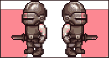
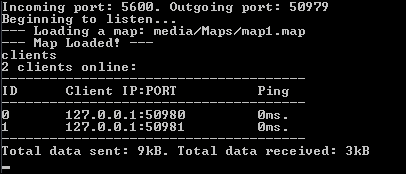
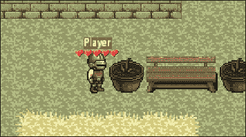
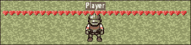
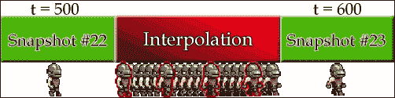
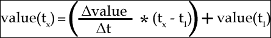
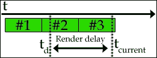
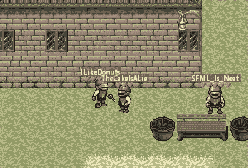

# 第十四章.一起来玩吧！ – 多玩家细微差别

这个世界上有很多伟大的事物有着极其谦逊的起点。这本书从封面到封底，讲述了一个从兴趣和创造意志开始的旅程。现在我们已经到达故事的顶点，为什么不来个高潮呢？让我们将我们开发的框架与网络功能结合起来，为这本书的第三个项目带来新的视角！让我们通过游戏玩法将我们的玩家连接起来，而不仅仅是通过简单的信息交换。

在本章中，我们将涵盖：

+   构建支持先前实现机制的游戏服务器

+   在网络上交换实体数据

+   将现有游戏代码转换为客户端应用程序

+   实现玩家对战玩家战斗

+   通过平滑实体移动来隐藏网络延迟

有很多代码需要覆盖，让我们开始吧！

# 版权资源的利用

和往常一样，我们应该感谢那些为我们最终项目制作了惊人的图形和音效的艺术家：

+   由*C.Nilsson*创作的*简单的像素心形*，根据 CC-BY-SA 3.0 许可：[`opengameart.org/content/simple-small-pixel-hearts`](http://opengameart.org/content/simple-small-pixel-hearts)

+   由*n3b*创作的*Grunt*，根据 CC-BY 3.0 许可：[`opengameart.org/content/grunt`](http://opengameart.org/content/grunt)

+   由*artisticdude*创作的*Swishes 声音包*，根据 CC0 许可（公共领域）：[`opengameart.org/content/swishes-sound-pack`](http://opengameart.org/content/swishes-sound-pack)

+   由*Michel Baradari*创作的*3 个物品声音*，根据 CC-BY 3.0 许可：[`opengameart.org/content/3-item-sounds`](http://opengameart.org/content/3-item-sounds)

# 共享代码

由于我们编写的代码将存在于客户端和服务器端，让我们首先讨论这一点，从双方数据交换的方式开始。

我们信息交换最重要的部分是更新所有连接客户端上的实体。我们通过发送包含相关实体信息的专业结构来做到这一点。从现在开始，这些结构将被称为快照。让我们看看它们是如何实现的，通过查看`EntitySnapshot.h`文件：

```cpp
struct EntitySnapshot{
    std::string m_type;
    sf::Vector2f m_position;
    sf::Int32 m_elevation;
    sf::Vector2f m_velocity;
    sf::Vector2f m_acceleration;
    sf::Uint8 m_direction;
    sf::Uint8 m_state;
    sf::Uint8 m_health;
    std::string m_name;
};
```

我们将不断更新任何给定实体的信息，包括其实体位置和海拔，速度，加速度，其面向的方向以及其实体的状态，以及实体的健康和名称。实体的类型也会在快照中发送，并在客户端创建实体时使用。

### 提示

在这个例子中，`EntitySnapshot`结构中数据成员的顺序可能不是最有效的。从大到小对结构中的数据进行排序可以帮助减小它们的大小，从而减少带宽开销。结构对齐和打包在这里不会讨论，但它是一个值得研究的主题。

在使我们的代码更易读方面，重载`sf::Packet`的位运算符以支持自定义数据类型，如`EntitySnapshot`，非常有帮助：

```cpp
sf::Packet& operator <<(sf::Packet& l_packet, 
    const EntitySnapshot& l_snapshot);
sf::Packet& operator >>(sf::Packet& l_packet, 
    EntitySnapshot& l_snapshot);
```

这些重载的实际实现位于`EntitySnapshot.cpp`文件中：

```cpp
sf::Packet& operator <<(sf::Packet& l_packet, 
   const EntitySnapshot& l_snapshot)
{
   return l_packet << l_snapshot.m_type << l_snapshot.m_name 
      << l_snapshot.m_position.x << l_snapshot.m_position.y 
      << l_snapshot.m_elevation << l_snapshot.m_velocity.x 
      << l_snapshot.m_velocity.y << l_snapshot.m_acceleration.x
      << l_snapshot.m_acceleration.y << l_snapshot.m_direction 
      << l_snapshot.m_state << l_snapshot.m_health;
}

sf::Packet& operator >>(sf::Packet& l_packet, 
   EntitySnapshot& l_snapshot)
{
   return l_packet >> l_snapshot.m_type >> l_snapshot.m_name 
      >> l_snapshot.m_position.x >> l_snapshot.m_position.y 
      >> l_snapshot.m_elevation >> l_snapshot.m_velocity.x 
      >> l_snapshot.m_velocity.y >> l_snapshot.m_acceleration.x
      >> l_snapshot.m_acceleration.y >> l_snapshot.m_direction 
      >> l_snapshot.m_state >> l_snapshot.m_health;
}
```

其他数据交换将更具体地针对特定情况，所以我们将在稍后讨论它们。然而，现在我们可以做的一件事是，更新`NetworkDefinitions.h`文件中的`Network`枚举，添加一个新值，该值将用作特定数据包中不同类型数据之间的分隔符：

```cpp
enum class Network{
  HighestTimestamp = 2147483647, ClientTimeout = 10000,
  ServerPort = 5600, NullID = -1, PlayerUpdateDelim = -1
};
```

由于我们将在客户端和服务器上使用使用此分隔符的特定数据包类型，所以它的位置在共享代码空间中。

## 额外组件

首先且最重要的是，需要在服务器和客户端之间同步的实体需要被标记并分配一个唯一的标识符。这就是`C_Client`组件发挥作用的地方：

```cpp
class C_Client : public C_Base{
public:
  C_Client(): C_Base(Component::Client),
    m_clientID((ClientID)Network::NullID){}
  void ReadIn(std::stringstream& l_stream){}

  ClientID GetClientID()const{ return m_clientID; }
  void SetClientID(const ClientID& l_id){ m_clientID = l_id; }
private:
  ClientID m_clientID;
};
```

支持实体名称也会很方便，以便能够存储玩家昵称。这可以通过实现一个名称组件来完成：

```cpp
class C_Name : public C_Base{
public:
  C_Name() : C_Base(Component::Name){}
  void ReadIn(std::stringstream& l_stream){ l_stream >> m_name; }
  const std::string& GetName()const{ return m_name; }
  void SetName(const std::string& l_name){ m_name = l_name; }
private:
  std::string m_name;
};
```

在游戏中，有一个小冷却期，在这个期间实体不能被攻击，可能还会定义其受伤/死亡动画应该持续多长时间。允许并定义此类功能的组件理想情况下需要从基类继承，这样可以简化此类事件的时间处理过程：

```cpp
class C_TimedComponentBase : public C_Base{
public:
  C_TimedComponentBase(const Component& l_type)
    : C_Base(l_type), m_duration(sf::milliseconds(0)){}
  virtual ~C_TimedComponentBase(){}

  const sf::Time& GetTimer()const{ return m_duration; }
  void SetTimer(const sf::Time& l_time){ m_duration = l_time; }
  void AddToTimer(const sf::Time& l_time){ m_duration += l_time; }

  void Reset(){ m_duration = sf::milliseconds(0); }
protected:
  sf::Time m_duration;
};
```

将使用基定时类的`C_Health`组件：

```cpp
using Health = unsigned int;

class C_Health : public C_TimedComponentBase{
public:
  C_Health(): C_TimedComponentBase(Component::Health), 
    m_hurtDuration(0), m_deathDuration(0){}
  void ReadIn(std::stringstream& l_stream){
    l_stream >> m_maxHealth >> m_hurtDuration >> m_deathDuration;
    m_health = m_maxHealth;
  }
  Health GetHealth()const{ return m_health; }
  Health GetMaxHealth()const{ return m_maxHealth; }
  void SetHealth(const Health& l_health){ m_health = l_health; }
  void ResetHealth(){ m_health = m_maxHealth; }

  sf::Uint32 GetHurtDuration(){ return m_hurtDuration; }
  sf::Uint32 GetDeathDuration(){ return m_deathDuration; }
private:
  Health m_health;
  Health m_maxHealth;
  sf::Uint32 m_hurtDuration;
  sf::Uint32 m_deathDuration;
};
```

如您所见，它包含当前实体的健康值、其最大健康值以及一些数据成员，这些成员持有预期受伤和死亡的时间长度。

自然地，我们需要更多的实体消息和事件类型来表示战斗过程。以下代码片段中突出显示了新添加的类型：

```cpp
enum class EntityMessage{
  Move, Is_Moving, Frame_Change, State_Changed,
  Direction_Changed, Switch_State, Attack,
 Being_Attacked, Hurt, Die, Respawn, Removed_Entity
};
enum class EntityEvent{
  Spawned, Despawned, Colliding_X, Colliding_Y,
  Moving_Left, Moving_Right, Moving_Up, Moving_Down,
  Elevation_Change, Became_Idle, Began_Moving, Began_Attacking
};
```

`EntityManager`类也将被双方共享。为了让实体组件系统知道何时添加或删除实体，需要对它的`AddEntity`和`RemoveEntity`方法进行一些调整：

```cpp
int EntityManager::AddEntity(const Bitmask& l_mask, int l_id){
    ...
    m_systems->EntityModified(entity,l_mask);
    m_systems->AddEvent(entity, (EventID)EntityEvent::Spawned);
    return entity;
}

bool EntityManager::RemoveEntity(const EntityId& l_id){
    ...
    Message msg((MessageType)EntityMessage::Removed_Entity);
    msg.m_receiver = l_id;
    msg.m_int = l_id;
    m_systems->GetMessageHandler()->Dispatch(msg);
    ... // Removing all components.
}
```

我们在前几章中编写的很多代码实际上也需要共享。例如，一些类，如实体管理器，已经稍作修改，作为客户端和服务器实现派生类的父类。我们在这里不会详细讨论这个问题，因为本章的代码文件应该足以帮助你熟悉代码结构。

# 构建我们的游戏服务器

在第十三章《我们有了联系！——网络基础》中，我们查看了一个由服务器应用程序支持并由多个客户端连接的基本聊天服务。构建游戏服务器与此非常相似。我们有一块软件，它通过执行所有计算并将结果发送回客户端，作为所有客户端的中心兴趣点，以确保整个系统的正确和一致的模拟。自然地，由于我们不仅仅是交换文本消息，因此将会有更多的数据在客户端和服务器之间来回发送，以及服务器端更多的计算。

首先，我们需要决定发送实体快照的时间间隔值。它必须足够频繁以保持平滑更新，但发送尽可能少的信息以保持效率。经过一些测试和调整，可以很容易地找到一个最佳点。对于这个特定的项目，让我们假设实体快照将每 100 毫秒发送一次，这将在`NetSettings.h`中定义：

```cpp
#define SNAPSHOT_INTERVAL 100
```

每秒发送 10 个快照就足以让客户满意，同时服务器也能保持相对较低的带宽。

## 实体组件系统的补充

大多数战斗逻辑将在服务器端进行。为了支持实体相互攻击，我们需要一个新的组件与`C_Attacker`一起工作：

```cpp
class C_Attacker : public C_TimedComponentBase{
public:
  C_Attacker(): C_TimedComponentBase(Component::Attacker), 
    m_attacked(false), m_knockback(0.f), m_attackDuration(0){}
  void ReadIn(std::stringstream& l_stream){
    l_stream >> m_offset.x >> m_offset.y 
      >> m_attackArea.width >> m_attackArea.height 
      >> m_knockback >> m_attackDuration;
  }

  void SetAreaPosition(const sf::Vector2f& l_pos){
    m_attackArea.left = l_pos.x;
    m_attackArea.top = l_pos.y;
  }

  const sf::FloatRect& GetAreaOfAttack(){ return m_attackArea; }
  const sf::Vector2f& GetOffset(){ return m_offset; }
  bool HasAttacked(){ return m_attacked; }
  void SetAttacked(bool l_attacked){ m_attacked = l_attacked; }
  float GetKnockback(){ return m_knockback; }
  sf::Uint32 GetAttackDuration(){ return m_attackDuration; }
private:
  sf::FloatRect m_attackArea;
  sf::Vector2f m_offset;
  bool m_attacked;
  float m_knockback;
  sf::Uint32 m_attackDuration;
};
```

攻击组件包含有关实体攻击区域的大小和位置以及可能的偏移量的信息，一个标志用于检查实体在攻击时是否击中了某个东西，对另一个被攻击实体的击退力，以及攻击的持续时间。

### 实现战斗

实体间的战斗将是一个相当简单的补充，因为我们已经有一个很好的碰撞系统。它只需要在`EntityCollisions`方法内部添加几行代码：

```cpp
void S_Collision::EntityCollisions(){
  EntityManager* entities = m_systemManager->GetEntityManager();
  for (auto itr = m_entities.begin();
    itr != m_entities.end(); ++itr)
  {
    for (auto itr2 = std::next(itr);
      itr2 != m_entities.end(); ++itr2)
    {
      ...
      C_Attacker* attacker1 = entities->
        GetComponent<C_Attacker>(*itr, Component::Attacker);
      C_Attacker* attacker2 = entities->
        GetComponent<C_Attacker>(*itr2, Component::Attacker);
      if (!attacker1 && !attacker2){ continue; }
      Message msg((MessageType)EntityMessage::Being_Attacked);
      if (attacker1){
        if (attacker1->GetAreaOfAttack().intersects(
          collidable2->GetCollidable()))
        {
          // Attacker-on-entity collision!
          msg.m_receiver = *itr2;
          msg.m_sender = *itr;
          m_systemManager->GetMessageHandler()->Dispatch(msg);
        }
      }
      if (attacker2){
        if (attacker2->GetAreaOfAttack().intersects(
          collidable1->GetCollidable()))
        {
          // Attacker-on-entity collision!
          msg.m_receiver = *itr;
          msg.m_sender = *itr2;
          m_systemManager->GetMessageHandler()->Dispatch(msg);
        }
      }
    }
  }
}
```

首先，被检查的两个实体都会获取其攻击组件。如果它们中没有一个有，则跳过迭代。否则，会构建一个新的类型为`Being_Attacked`的消息。如果攻击实体的攻击区域实际上与另一个实体的边界框相交，则该消息会填充接收者和发送者信息并发送出去。

为了正确处理和反应这些碰撞，以及更新所有可能处于战斗状态的实体，我们需要一个新的系统：`S_Combat`！它除了需要实现基本系统类所需的方法外，没有其他额外的方法，所以我们实际上没有必要检查其头文件。让我们看看它的构造函数和析构函数：

```cpp
S_Combat::S_Combat(SystemManager* l_systemMgr)
  : S_Base(System::Combat, l_systemMgr)
{
  Bitmask req;
  req.TurnOnBit((unsigned int)Component::Position);
  req.TurnOnBit((unsigned int)Component::Movable);
  req.TurnOnBit((unsigned int)Component::State);
  req.TurnOnBit((unsigned int)Component::Health);
  m_requiredComponents.push_back(req);
  req.ClearBit((unsigned int)Component::Health);
  req.TurnOnBit((unsigned int)Component::Attacker);
  m_requiredComponents.push_back(req);

  m_systemManager->GetMessageHandler()->
    Subscribe(EntityMessage::Being_Attacked, this);
}
```

该系统将保留任何具有位置、是具有状态的移动实体，并且具有健康组件或攻击组件或两者都有的实体。它还订阅了`Being_Attacked`消息，以便处理攻击区域碰撞。

自然地，不能为实体面向的四个方向中的任何一个以相同的方式定位相同的攻击区域。考虑以下示例：



根据每个实体的当前方向重新定位攻击区域是在该系统的`Update`方法中完成的：

```cpp
void S_Combat::Update(float l_dT){
  EntityManager* entities = m_systemManager->GetEntityManager();
  for (auto &entity : m_entities){
    C_Attacker* attack = entities->
      GetComponent<C_Attacker>(entity, Component::Attacker);
    if (!attack){ continue; }
    sf::Vector2f offset = attack->GetOffset();
    sf::FloatRect AoA = attack->GetAreaOfAttack();
    Direction dir = entities->GetComponent<C_Movable>
      (entity, Component::Movable)->GetDirection();
    sf::Vector2f position = entities->GetComponent<C_Position>
      (entity, Component::Position)->GetPosition();
    if (dir == Direction::Left){ offset.x -= AoA.width / 2; }
    else if (dir == Direction::Right){offset.x += AoA.width / 2; }
    else if (dir == Direction::Up){offset.y -= AoA.height / 2; }
    else if (dir == Direction::Down){offset.y += AoA.height / 2; }
    position -= sf::Vector2f(AoA.width / 2, AoA.height / 2);
    attack->SetAreaPosition(position + offset);
  }
}
```

如果当前正在检查的实体没有`C_Attacker`组件，则简单地跳过迭代。否则，除了当前方向和位置外，还获取实体的攻击区域和偏移量。为了首先使攻击区域居中，从实体的位置中减去其宽度和高度的一半。然后根据实体面向的方向调整偏移量，并将攻击区域移动到应用偏移量的最新位置。

让我们看看对碰撞系统发出的消息的可能响应：

```cpp
void S_Combat::Notify(const Message& l_message){
  if (!HasEntity(l_message.m_receiver) ||
    !HasEntity(l_message.m_sender))
  {
    return;
  }
  EntityManager* entities = m_systemManager->GetEntityManager();
  EntityMessage m = (EntityMessage)l_message.m_type;
  switch (m){
  case EntityMessage::Being_Attacked:
    C_Health* victim = entities->GetComponent<C_Health>
      (l_message.m_receiver, Component::Health);
    C_Attacker* attacker = entities->GetComponent<C_Attacker>
      (l_message.m_sender, Component::Attacker);
    if (!victim || !attacker){ return; }
    S_State* StateSystem = m_systemManager->
      GetSystem<S_State>(System::State);
    if (StateSystem->GetState(l_message.m_sender) !=
      EntityState::Attacking)
    {
      return;
    }
    if (attacker->HasAttacked()){ return; }
    // Begin attacking.
    victim->SetHealth((victim->GetHealth() > 1 ?
      victim->GetHealth() - 1 : 0));
    attacker->SetAttacked(true);
    if (!victim->GetHealth()){
      StateSystem->ChangeState(l_message.m_receiver,
        EntityState::Dying, true);
    } else {
      Message msg((MessageType)EntityMessage::Hurt);
      msg.m_receiver = l_message.m_receiver;
      m_systemManager->GetMessageHandler()->Dispatch(msg);
    }

    // Knockback.
    Direction attackerDirection =entities->GetComponent<C_Movable>
      (l_message.m_sender, Component::Movable)->GetDirection();
    float Knockback = attacker->GetKnockback();
    sf::Vector2f KnockbackVelocity;
    if (attackerDirection == Direction::Left ||
      attackerDirection == Direction::Up)
    {
      Knockback = -Knockback;
    }
    if (attackerDirection == Direction::Left ||
      attackerDirection == Direction::Right)
    {
      KnockbackVelocity.x = Knockback;
    }
    else{ KnockbackVelocity.y = Knockback; }
    entities->GetComponent<C_Movable>
      (l_message.m_receiver, Component::Movable)->
      SetVelocity(KnockbackVelocity);
    break;
  }
}
```

首先，我们检查战斗系统是否具有此消息的发送者和接收者。如果是这样，首先获取被攻击实体的健康组件以及攻击者的攻击组件。然后检查攻击实体的状态。如果它目前没有攻击或实体已经攻击了其他东西，方法通过返回来终止。否则，通过首先减少受害者的健康值*1*来开始攻击。然后标记攻击者已经攻击了一个实体。如果受害者的健康值为 0，其状态将更改为`Dying`。否则，发送一个`Hurt`消息。

剩下的几行代码处理被攻击实体被轻微击退的情况。同时获取攻击者的方向和击退力，并创建一个表示施加力的`sf::Vector2f`变量。如果攻击者面向左或上，击退值将被反转。此外，如果攻击实体面向左或右，击退力将应用于*X*轴。否则，使用*Y*轴。然后，通过受害者的`C_Movable`组件将力简单地应用于速度。

## 服务器动作时间

在服务器上运行相同的代码与在客户端运行之间的一大区别是某些动作和事件的计时方式。由于我们没有动画发生，因此无法简单地检查何时达到最后一帧并终止攻击或死亡，例如。这就是手动设置某些时间值的作用。为此，我们需要`S_Timers`系统。由于它也没有任何除必需方法之外的其他方法，因此不需要类定义。

让我们先看看这个系统的构造函数和析构函数：

```cpp
S_Timers::S_Timers(SystemManager* l_systemMgr)
  : S_Base(System::Timers, l_systemMgr)
{
  Bitmask req;
  req.TurnOnBit((unsigned int)Component::State);
  req.TurnOnBit((unsigned int)Component::Attacker);
  m_requiredComponents.push_back(req);
  req.ClearBit((unsigned int)Component::Attacker);
  req.TurnOnBit((unsigned int)Component::Health);
  m_requiredComponents.push_back(req);
}
```

再次，我们只是订阅了状态组件以及攻击者组件、健康组件或两者。这里没有发生什么有趣的事情，所以让我们继续到`Update`方法，它使得服务器端的计时成为可能：

```cpp
void S_Timers::Update(float l_dT){
  EntityManager* entities = m_systemManager->GetEntityManager();
  for (auto &entity : m_entities){
    EntityState state = entities->GetComponent<C_State>
      (entity, Component::State)->GetState();
    if (state == EntityState::Attacking){
      C_Attacker* attack = entities->GetComponent<C_Attacker>
        (entity, Component::Attacker);
      attack->AddToTimer(sf::seconds(l_dT));
      if (attack->GetTimer().asMilliseconds() <
        attack->GetAttackDuration())
      {
        continue;
      }
      attack->Reset();
      attack->SetAttacked(false);
    } else if (state == EntityState::Hurt ||
      state == EntityState::Dying)
    {
      C_Health* health = entities->
        GetComponent<C_Health>(entity, Component::Health);
      health->AddToTimer(sf::seconds(l_dT));
      if ((state == EntityState::Hurt && 
        health->GetTimer().asMilliseconds() <
        health->GetHurtDuration()) ||
        (state == EntityState::Dying && 
        health->GetTimer().asMilliseconds() <
        health->GetDeathDuration()))
      {
        continue;
      }

      health->Reset();
      if (state == EntityState::Dying){
        Message msg((MessageType)EntityMessage::Respawn);
        msg.m_receiver = entity;
        m_systemManager->GetMessageHandler()->Dispatch(msg);
        health->ResetHealth();
      }
    } else { continue; }
    m_systemManager->GetSystem<S_State>(System::State)->
      ChangeState(entity, EntityState::Idle, true);
  }
}
```

在这个系统中，攻击者和健康组件都会被检查，看它们是否达到了实体文件中提供的特定时间值。如果实体处于攻击状态，则获取攻击者组件并将经过的时间添加到其中。如果攻击持续时间已过，计时器将被重置，并将“攻击”标志设置回 false，从而允许进行另一次攻击。

如果实体处于受伤或死亡状态，将检查相应的计时器值是否与预定的持续时间相符，并在必要时重置计时器。如果实体实际上处于死亡状态，还会发送一个`Respawn`消息，以便重置其动画、生命值并将实体移动到特定的复活位置。

## 服务器网络系统

通过简单地构建一个专门系统，该系统设计上就已经可以访问实体数据，可以大大简化服务器端实体网络的处理。这就是服务器网络系统的作用所在。

让我们从玩家如何控制实体开始。在前面的章节中，我们只是简单地使用消息在客户端移动实体。显然，由于网络延迟和带宽限制，每当客户端移动时发送大量消息将会很成问题。简单地保持跟踪玩家的输入状态会更有效率，如下面的简单结构所示：

```cpp
struct PlayerInput{
    int m_movedX;
    int m_movedY;
    bool m_attacking;
    PlayerInput() : m_movedX(0), m_movedY(0), m_attacking(false){}
};

using PlayerInputContainer = std::unordered_map<EntityId, 
  PlayerInput>;
```

前两个数据成员将包含玩家在任一轴上移动的次数。在客户端，我们将以特定间隔向服务器发送输入状态，这意味着我们可以将消息组合成整洁的数据包，并处理掉冗余的移动，例如左右移动相同的距离。此外，客户端还将发送他们的攻击状态。所有这些信息都将保存在一个容器中，并将其与特定的实体 ID 绑定。

现在，让我们看看我们将要实现的网络系统的头文件：

```cpp
class S_Network : public S_Base{
public:
  S_Network(SystemManager* l_systemMgr);
  ~S_Network();

  void Update(float l_dT);
  void HandleEvent(const EntityId& l_entity,
    const EntityEvent& l_event);
  void Notify(const Message& l_message);

  bool RegisterClientID(const EntityId& l_entity,
    const ClientID& l_client);
  void RegisterServer(Server* l_server);
  ClientID GetClientID(const EntityId& l_entity);
  EntityId GetEntityID(const ClientID& l_client);

  void CreateSnapshot(sf::Packet& l_packet);
  void UpdatePlayer(sf::Packet& l_packet, const ClientID& l_cid);
private:
  PlayerInputContainer m_playerInput;
  Server* m_server;
};
```

如同往常，我们已经实现了所需的方法，以及一些额外的辅助方法。由于我们将在客户端和实体之间链接行为，因此有几个方法帮助我们注册和获取这种关系信息。除此之外，还有一些辅助方法用于创建实体状态的快照以及从接收到的数据包中更新特定客户端的信息。

### 实现网络系统

让我们从网络系统的构造函数和析构函数开始：

```cpp
S_Network::S_Network(SystemManager* l_systemMgr)
  : S_Base(System::Network, l_systemMgr)
{
  Bitmask req;
  req.TurnOnBit((unsigned int)Component::Client);
  m_requiredComponents.push_back(req);

  MessageHandler* messageHandler = 
    m_systemManager->GetMessageHandler();
  messageHandler->Subscribe(EntityMessage::Removed_Entity, this);
  messageHandler->Subscribe(EntityMessage::Hurt, this);
  messageHandler->Subscribe(EntityMessage::Respawn, this);
}
```

这个特定的系统只需要一个组件：`C_Client`。它还订阅了实体移除、受伤和复活消息。

接下来是`Update`方法：

```cpp
void S_Network::Update(float l_dT){
  EntityManager* entities = m_systemManager->GetEntityManager();
  for (auto &entity : m_entities){
    auto& player = m_playerInput[entity];
    if (player.m_movedX || player.m_movedY){
      if (player.m_movedX){
        Message msg((MessageType)EntityMessage::Move);
        msg.m_receiver = entity;
        if (player.m_movedX > 0){msg.m_int=(int)Direction::Right;}
        else { msg.m_int = (int)Direction::Left; }
        m_systemManager->GetMessageHandler()->Dispatch(msg);
      }

      if (player.m_movedY){
        Message msg((MessageType)EntityMessage::Move);
        msg.m_receiver = entity;
        if (player.m_movedY > 0){msg.m_int=(int)Direction::Down;}
        else { msg.m_int = (int)Direction::Up; }
        m_systemManager->GetMessageHandler()->Dispatch(msg);
      }
    }
    if (player.m_attacking){
      Message msg((MessageType)EntityMessage::Attack);
      msg.m_receiver = entity;
      m_systemManager->GetMessageHandler()->Dispatch(msg);
    }
  }
}
```

这是我们处理客户端当前控制状态并将其应用于实体的地方。根据客户端输入的状态构建并发送相关消息。

接下来，让我们处理这个系统订阅的三个消息类型：

```cpp
void S_Network::Notify(const Message& l_message){
  if (!HasEntity(l_message.m_receiver)){ return; }
  EntityMessage m = EntityMessage(l_message.m_type);
  if (m == EntityMessage::Removed_Entity){
    m_playerInput.erase(l_message.m_receiver);
    return;
  }
  if (m == EntityMessage::Hurt){
    sf::Packet packet;
    StampPacket(PacketType::Hurt, packet);
    packet << l_message.m_receiver;
    m_server->Broadcast(packet);
    return;
  }
  if (m == EntityMessage::Respawn){
    C_Position* position = m_systemManager->GetEntityManager()->
      GetComponent<C_Position>(l_message.m_receiver,
      Component::Position);
    if (!position){ return; }
    position->SetPosition(64.f, 64.f);
    position->SetElevation(1);
  }
}
```

首先，如果实体正在被移除，那么控制该实体的相应客户端的玩家输入信息将被删除。如果收到有关实体受伤的消息，将构建一个受伤包并发送给所有客户端，以通知它们实体正在受到伤害。最后，通过重置其位置和高度到一些预定义的值来处理实体重生消息。这些坐标可以很容易地随机化或从地图文件中读取，但为了演示目的，这样做就足够了。

当一个客户端连接到我们的服务器并为它创建一个实体时，我们需要一个方法来允许我们通过绑定这两个值来表达这种关系，如下所示：

```cpp
bool S_Network::RegisterClientID(const EntityId& l_entity,
  const ClientID& l_client)
   {
  if (!HasEntity(l_entity)){ return false; }
  m_systemManager->GetEntityManager()->GetComponent<C_Client>
    (l_entity, Component::Client)->SetClientID(l_client);
  return true;
}
```

由于我们将在客户端组件中存储客户端 ID，因此通过实体管理器获取它，并按这种方式使用。

网络类也需要访问`Server`类的一个实例，因此有如下方法：

```cpp
void S_Network::RegisterServer(Server* l_server){
    m_server = l_server;
}
```

接下来，一些方便获取客户端和实体 ID 的方法：

```cpp
ClientID S_Network::GetClientID(const EntityId& l_entity){
  if (!HasEntity(l_entity)){ return (ClientID)Network::NullID; }
  return m_systemManager->GetEntityManager()->
    GetComponent<C_Client>(l_entity, Component::Client)->
    GetClientID();
}
EntityId S_Network::GetEntityID(const ClientID& l_client){
  EntityManager* e = m_systemManager->GetEntityManager();
  auto entity = std::find_if(m_entities.begin(), m_entities.end(),
    &e, &l_client{
      return e->GetComponent<C_Client>
        (id, Component::Client)->GetClientID() == l_client;
  });
  return(entity != m_entities.end() ?
    *entity : (EntityId)Network::NullID);
}
```

快照的创建本身也值得有一个自己的方法：

```cpp
void S_Network::CreateSnapshot(sf::Packet& l_packet){
  sf::Lock lock(m_server->GetMutex());
  ServerEntityManager* e =
    (ServerEntityManager*)m_systemManager->GetEntityManager();
  StampPacket(PacketType::Snapshot, l_packet);
  l_packet << sf::Int32(e->GetEntityCount());
  if (e->GetEntityCount()){
    e->DumpEntityInfo(l_packet);
  }
}
```

因为我们要访问可能会被更改的实体信息，所以在访问之前必须锁定服务器互斥锁。在将快照类型分配给作为参数提供的包之后，我们还将实体数量写入其中。如果这个数字大于零，就会调用`DumpEntityInfo`方法。这个方法定义在我们的`ServerEntityManager`类中，稍后将会介绍。

最后，让我们处理传入的玩家更新包：

```cpp
void S_Network::UpdatePlayer(sf::Packet& l_packet,
  const ClientID& l_cid)
{
  sf::Lock lock(m_server->GetMutex());
  EntityId eid = GetEntityID(l_cid);
  if (eid == -1){ return; }
  if (!HasEntity(eid)){ return; }
  sf::Int8 entity_message;
  m_playerInput[eid].m_attacking = false;
  while (l_packet >> entity_message){
    switch (entity_message){
    case sf::Int8(EntityMessage::Move):
    {
      sf::Int32 x = 0, y = 0;
      l_packet >> x >> y;
      m_playerInput[eid].m_movedX = x;
      m_playerInput[eid].m_movedY = y;
      break;
    }
    case sf::Int8(EntityMessage::Attack):
    {
      sf::Int8 attackState;
      l_packet >> attackState;
      if (attackState){ m_playerInput[eid].m_attacking = true; }
      break;
    }
    }
    sf::Int8 delim = 0;
    if (!(l_packet >> delim) || delim !=
      (sf::Int8)Network::PlayerUpdateDelim)
    {
      std::cout << "Faulty update!" << std::endl; 
      break;
    }
  }
}
```

在进行任何操作之前，我们必须确保服务器互斥锁被锁定，并且发送此包的客户端附有一个有效的实体。这是通过获取实体 ID 并在接下来的两行中检查其有效性来完成的。然后创建一个名为`entity_message`的局部变量，以便保存客户端将要发送给我们的消息类型。然后默认将实体的攻击状态设置为`false`，并开始遍历包的信息。

遇到`Move`消息时，通过从包中提取 X 和 Y 值，并用它们覆盖给定实体的玩家移动信息来处理。`Attack`消息有一个更少的值需要关注。如果传入的玩家状态包含的不是零，则玩家的`m_attacking`标志被设置为`true`。

## 服务器实体和系统管理

服务器端支持的组件和系统显然将与客户端的不同。除此之外，两端的自定义方法通过允许基类保持不变，而派生类处理特定逻辑，大大帮助了这一点。让我们看看我们在服务器端运行的简单扩展`EntityManager`类：

```cpp
ServerEntityManager::ServerEntityManager(SystemManager* l_sysMgr)
  : EntityManager(l_sysMgr)
{
  AddComponentType<C_Position>(Component::Position);
  AddComponentType<C_State>(Component::State);
  AddComponentType<C_Movable>(Component::Movable);
  AddComponentType<C_Controller>(Component::Controller);
  AddComponentType<C_Collidable>(Component::Collidable);
  AddComponentType<C_Client>(Component::Client);
  AddComponentType<C_Health>(Component::Health);
  AddComponentType<C_Name>(Component::Name);
  AddComponentType<C_Attacker>(Component::Attacker);
}
```

显然，我们这里不需要任何与图形或声音相关的组件类型。处理这些是客户端的工作。

这个类在创建实体快照时也非常有用。所有实体信息都通过这个方法被倒入提供的`sf::Packet`实例中：

```cpp
void ServerEntityManager::DumpEntityInfo(sf::Packet& l_packet){
  for (auto &entity : m_entities){
    l_packet << sf::Int32(entity.first);
    EntitySnapshot snapshot;
    snapshot.m_type = entity.second.m_type;
    const auto& mask = entity.second.m_bitmask;
    if (mask.GetBit((unsigned int)Component::Position)){
      C_Position* p = GetComponent<C_Position>(entity.first,
        Component::Position);
      snapshot.m_position = p->GetPosition();
      snapshot.m_elevation = p->GetElevation();
    }
    if (mask.GetBit((unsigned int)Component::Movable)){
      C_Movable* m = GetComponent<C_Movable>(entity.first,
        Component::Movable);
      snapshot.m_velocity = m->GetVelocity();
      snapshot.m_acceleration = m->GetAcceleration();
      snapshot.m_direction = sf::Uint8(m->GetDirection());
    }
    if (mask.GetBit((unsigned int)Component::State)){
      C_State* s = GetComponent<C_State>(entity.first,
        Component::State);
      snapshot.m_state = sf::Uint8(s->GetState());
    }
    if (mask.GetBit((unsigned int)Component::Health)){
      C_Health* h = GetComponent<C_Health>(entity.first,
        Component::Health);
      snapshot.m_health = h->GetHealth();
    }
    if (mask.GetBit((unsigned int)Component::Name)){
      C_Name* n = GetComponent<C_Name>(entity.first,
        Component::Name);
      snapshot.m_name = n->GetName();
    }
    l_packet << snapshot;
  }
}
```

实体 ID 首先写入数据包实例。之后创建一个`EntitySnapshot`变量，并填充相关的组件信息，前提是这些组件确实存在。完成这些后，快照实例被写入数据包，这得益于其重载的`<<`和`>>`运算符，变得非常简单。

对于服务器端的管理系统，我们只需要处理添加的系统：

```cpp
ServerSystemManager::ServerSystemManager(){
  AddSystem<S_Network>(System::Network);
  AddSystem<S_State>(System::State);
  AddSystem<S_Control>(System::Control);
  AddSystem<S_Movement>(System::Movement);
  AddSystem<S_Timers>(System::Timers);
  AddSystem<S_Collision>(System::Collision);
  AddSystem<S_Combat>(System::Combat);
}
```

与我们对组件所做的一样，我们简单地排除了所有与图形或声音相关的任何内容。

## 主要服务器类

与客户端的`Game`类类似，服务器端也需要一个管理对象。我们将保持游戏地图、实体、服务器管理器和`Server`类本身的实例在一个新类中，简单地称为`World`。让我们先看看头文件：

```cpp
class World{
public:
    World();
    ~World();

    void Update(const sf::Time& l_time);
    void HandlePacket(sf::IpAddress& l_ip, 
      const PortNumber& l_port, const PacketID& l_id, 
     sf::Packet& l_packet, Server* l_server);
    void ClientLeave(const ClientID& l_client);
    void CommandLine();

    bool IsRunning();
private:
    sf::Time m_tpsTime;
    sf::Time m_serverTime;
    sf::Time m_snapshotTimer;
    sf::Thread m_commandThread;
    Server m_server;
    ServerSystemManager m_systems;
    ServerEntityManager m_entities;
    bool m_running;

    Map m_map;
    unsigned int m_tick;
    unsigned int m_tps;
};
```

与`Game`类似，它有一个`Update`方法，所有与时间相关的魔法都将在这里发生。它还有处理自定义数据包类型、处理客户端离开和处理命令行输入的方法。

在数据成员方面，我们关注几个`sf::Time`实例，用于跟踪当前服务器时间和快照的交付时间。还有一个用于命令行的`sf::Thread`实例也非常方便。

最后但同样重要的是，`m_tpsTime`、`m_tick`和`m_tps`数据成员存在是为了简单方便地测量服务器上的更新率。每秒的更新次数，也称为 tick，对于追踪和解决性能问题非常有用。

## 实现世界级

让我们启动这个类，从构造函数和析构函数开始：

```cpp
World::World(): m_server(&World::HandlePacket, this),
  m_commandThread(&World::CommandLine, this), m_entities(nullptr),
  m_map(&m_entities), m_tick(0), m_tps(0), m_running(false)
{
  if (!m_server.Start()){ return; }
  m_running = true;
  m_systems.SetEntityManager(&m_entities);
  m_entities.SetSystemManager(&m_systems);
  m_map.LoadMap("media/Maps/map1.map");
  m_systems.GetSystem<S_Collision>(System::Collision)->
    SetMap(&m_map);
  m_systems.GetSystem<S_Movement>(System::Movement)->
    SetMap(&m_map);
  m_systems.GetSystem<S_Network>(System::Network)->
    RegisterServer(&m_server);
  m_server.BindTimeoutHandler(&World::ClientLeave, this);
  m_commandThread.launch();
}

World::~World(){ m_entities.SetSystemManager(nullptr); }
```

我们通过在初始化列表中提供一个有效的数据包处理程序来设置`Server`实例，其中也设置了命令线程。在构造函数的实际主体中，我们首先尝试启动服务器，并在`if`语句中捕获可能的失败。启动成功后，将`m_running`标志设置为`true`，并将实体管理器和系统管理器相互提供指针。然后加载游戏地图，并将其实例提供给相关系统。在我们的网络系统通过`Server`实例可用后，将`ClientLeave`方法作为超时处理程序传入，并启动命令行线程。

在`World`类被销毁时，我们真正需要担心的是移除实体管理器对系统管理器的访问权限。

接下来，让我们通过更新一切来保持动作的连续性：

```cpp
void World::Update(const sf::Time& l_time){
  if (!m_server.IsRunning()){ m_running = false; return; }
  m_serverTime += l_time;
  m_snapshotTimer += l_time;
  m_tpsTime += l_time;
  m_server.Update(l_time);
  m_server.GetMutex().lock();
  m_systems.Update(l_time.asSeconds());
  m_server.GetMutex().unlock();
  if (m_snapshotTimer.asMilliseconds() >= SNAPSHOT_INTERVAL){
    sf::Packet snapshot;
    m_systems.GetSystem<S_Network>(System::Network)->
      CreateSnapshot(snapshot);
    m_server.Broadcast(snapshot);
    m_snapshotTimer = sf::milliseconds(0);
  }
  if (m_tpsTime >= sf::milliseconds(1000)){
    m_tps = m_tick;
    m_tick = 0;
    m_tpsTime = sf::milliseconds(0);
  } else {
    ++m_tick;
  }
}
```

首先检查服务器实例是否已停止。如果是这样，则`World`类本身停止，并返回`Update`方法。否则，所有的时间值都会与服务器类一起更新。在此期间，必须锁定服务器互斥锁，因为实体信息可能会被更改。

一切更新完毕后，检查快照计时器以查看它是否超过了快照间隔。如果是这样，使用`S_Network`的`CreateSnapshot`方法创建并填充快照数据包。然后，将数据包广播到每个客户端，并将快照计时器重置为零。

### 注意

**每秒滴答数**（**TPS**）通过在每次更新时增加`m_tick`数据成员来测量，前提是 TPS 计时器没有超过一秒。如果是这样，`m_tps`被分配`m_tick`的值，然后`m_tick`及其 TPS 计时器都会被重置为零。

处理传入的数据包是下一个难题：

```cpp
void World::HandlePacket(sf::IpAddress& l_ip,
  const PortNumber& l_port, const PacketID& l_id,
  sf::Packet& l_packet, Server* l_server)
{
  ClientID id = l_server->GetClientID(l_ip, l_port);
  PacketType type = (PacketType)l_id;
  if (id >= 0){
    if (type == PacketType::Disconnect){
      ClientLeave(id);
      l_server->RemoveClient(l_ip, l_port);
    } else if (type == PacketType::Message){
      // ...
    } else if (type == PacketType::PlayerUpdate){
      m_systems.GetSystem<S_Network>(System::Network)->
        UpdatePlayer(l_packet, id);
    }
  } else {
    if (type != PacketType::Connect){ return; }
    std::string nickname;
    if (!(l_packet >> nickname)){ return; }
    ClientID cid = l_server->AddClient(l_ip, l_port);
    if (cid == -1){
      sf::Packet packet;
      StampPacket(PacketType::Disconnect, packet);
      l_server->Send(l_ip, l_port, packet);
      return;
    }
    sf::Lock lock(m_server.GetMutex());
    sf::Int32 eid = m_entities.AddEntity("Player");
    if (eid == -1){ return; }
    m_systems.GetSystem<S_Network>(System::Network)->
      RegisterClientID(eid, cid);
    C_Position* pos = m_entities.GetComponent<C_Position>
      (eid, Component::Position);
    pos->SetPosition(64.f, 64.f);
    m_entities.GetComponent<C_Name>(eid, Component::Name)->
      SetName(nickname);
    sf::Packet packet;
    StampPacket(PacketType::Connect, packet);
    packet << eid;
    packet << pos->GetPosition().x << pos->GetPosition().y;
    if (!l_server->Send(cid, packet)){
      std::cout << "Unable to respond to connect packet!"
        << std::endl;
      return;
    }
  }
}
```

客户端 ID 首先从源 IP 地址和端口号中获取。如果存在具有该信息的客户端，我们对其可以接收的三个数据包类型感兴趣。首先，客户端断开连接数据包通过调用`ClientLeave`方法处理，该客户端 ID 作为唯一参数传入。接下来，实际的客户端从服务器类中移除。

下一个数据包类型，`Message`，目前尚未实现。我们目前不会在客户端之间发送聊天消息，但这是未来实现的地方。接下来是玩家更新数据包类型，在这种情况下，数据包只是简单地传递到网络系统中进行处理。我们已经讨论了这一点。

如果传入数据的源信息没有为我们提供一个有效的客户端 ID，我们只对尝试连接的通信感兴趣。首先，我们尝试从数据包中提取一个字符串，这将作为玩家的昵称。如果失败，则从这个方法返回。接下来，添加客户端信息，并通过分析返回的客户端 ID 来检查其成功。如果失败，则向原始源发送一个`Disconnect`数据包，并从这个方法返回。否则，服务器互斥锁被锁定，我们尝试添加一个新的玩家实体。如果无法做到这一点，则再次返回此方法。然后将客户端 ID 注册到网络系统中，并将我们新添加的玩家实体的位置设置为一些预定义的值。玩家实体的名称组件也被调整，以反映输入的昵称。此时，构建一个连接数据包作为响应。它包含玩家的实体 ID 以及其出生位置。然后，将数据包发送到我们的新客户端。

相比之下，离开服务器的过程要简单得多。让我们看看：

```cpp
void World::ClientLeave(const ClientID& l_client){
    sf::Lock lock(m_server.GetMutex());
    S_Network* network = m_systems.
     GetSystem<S_Network>(System::Network);
    m_entities.RemoveEntity(network->GetEntityID(l_client));
}
```

在执行此操作之前，服务器互斥锁被锁定。然后获取网络系统，并调用我们实体管理器的`RemoveEntity`方法，该方法使用网络系统`GetEntityID`方法的返回值。这实际上移除了实体。

在服务器端实现一些基本命令证明是非常有用的。让我们看看一个命令行线程的非常基本的设置：

```cpp
void World::CommandLine(){
   while (m_server.IsRunning()){
      std::string str;
      std::getline(std::cin, str);
      if (str == "terminate"){
         m_server.Stop();
         m_running = false;
         break;
      } else if (str == "disconnectall"){
         std::cout << "Disconnecting all clients..." << std::endl;
         m_server.DisconnectAll();
         sf::Lock lock(m_server.GetMutex());
         m_entities.Purge();
      } else if (str.find("tps") != std::string::npos){
         std::cout << "TPS: " << m_tps << std::endl;
      } else if (str == "clients"){
         std::cout << m_server.GetClientCount() 
            << " clients online:" << std::endl;
         std::cout << m_server.GetClientList() 
            << std::endl;
      } else if (str == "entities"){
         std::cout << "Current entity count: " 
            << m_entities.GetEntityCount() << std::endl;
      }
   }
}
```

首先，进入一个循环，只要服务器正在运行，就保持其活跃。接下来，提示命令行以获取一行输入。我们处理的第一个命令是`"terminate"`。这停止了服务器，并从命令行循环中跳出，这很有帮助。接下来的命令断开所有客户端的连接，并清除当前存在的所有实体。注意，在清除之前，服务器互斥锁被锁定。下一个命令简单地显示当前的每秒滴答率。输入`"clients"`将显示当前连接的客户端列表，包括它们的 IP 地址、端口号和延迟值。最后，`"entities"`命令简单地打印出当前世界中实体的数量。

最后一个，当然也是最不有趣的方法，用于获取世界的当前状态：

```cpp
bool World::IsRunning(){ return m_running; }
```

## 服务器入口点

现在让我们把所有的努力都付诸实践。以下是我们`Server_Main.cpp`文件的内容：

```cpp
#include "World.h"

int main(){
    World world;
    sf::Clock clock;
    clock.restart();

    while (world.IsRunning()){
        world.Update(clock.restart());
    }
     return 0;
}
```

这已经不能再简单了。创建了一个新的`World`类实例，并立即重新启动了时钟。我们进入主要的`while`循环，条件是必须让世界实例持续运行。它每次迭代都会使用`clock.restart()`的返回值进行更新。循环结束后，返回零以成功结束程序。

所有这些为我们带来一个非常漂亮且功能强大的控制台窗口，准备好处理一些传入的连接：



当然，如果没有客户端通过与服务器的通信绘制所有漂亮的图像，这本身是完全无用的。这是我们列表中的下一个主要任务。

# 开发游戏客户端

在服务器提供适当的后端支持后，我们现在可以完全专注于客户端的细节，并享受一些漂亮的视觉效果，这些视觉效果总是能比后台运行的内容更快地带来成就感。让我们首先创建客户端自己的`NetSettings.h`版本：

```cpp
#define NET_RENDER_DELAY 100 // ms.
#define PLAYER_UPDATE_INTERVAL 50 // ms
```

我们有几个宏可以在这里使用。第一个是屏幕上渲染的内容与真实时间之间的预期延迟。这意味着技术上我们将大约 100 毫秒前渲染所有动作。第二个宏是我们将发送到服务器的更新间隔。50 毫秒给我们足够的时间收集一些输入状态，并让服务器知道发生了什么。

## 实体组件系统扩展

就像服务器的情况一样，如果我们想实现我们的任何目标，就需要额外的组件和系统。然而，与服务器不同的是，这些添加到客户端实体组件系统中的内容将服务于一个完全不同的目的。对我们来说，看到游戏中所有玩家的名称和健康值将非常重要。我们将努力实现如下：



为了轻松维护这些漂浮在实体上方的符号，我们需要一种新的组件类型，它精确描述了它们应该渲染的位置：

```cpp
class C_UI_Element : public C_Base{
public:
  C_UI_Element() : C_Base(Component::UI_Element),
    m_showHealth(false), m_showName(false){}
  void ReadIn(std::stringstream& l_stream){
    l_stream >> m_offset.x >> m_offset.y;
  }

  const sf::Vector2f& GetOffset(){ return m_offset; }
  void SetOffset(const sf::Vector2f& l_offset){ m_offset = l_offset; }

  void SetShowHealth(bool l_show){ m_showHealth = l_show; }
  void SetShowName(bool l_show){ m_showName = l_show; }
  bool ShowHealth(){ return m_showHealth; }
  bool ShowName(){ return m_showName; }
private:
  sf::Vector2f m_offset;
  bool m_showHealth;
  bool m_showName;
};
```

`C_UI_Element`组件将从实体文件中读取两个偏移值，一个用于 X 轴，一个用于 Y 轴。这样，不同大小的角色可以定义自己的规则，确定这些信息将出现在哪里。我们还包含了一些布尔标志，以防健康或名称信息因某些原因需要被禁用。

单独的组件本身不会做任何复杂的事情，所以让我们创建一个新的系统，真正让事情发生：

```cpp
class S_CharacterUI : public S_Base{
public:
    S_CharacterUI(SystemManager* l_systemMgr);
    ~S_CharacterUI();

    void Update(float l_dT);
    void HandleEvent(const EntityId& l_entity, 
      const EntityEvent& l_event);
    void Notify(const Message& l_message);

    void Render(Window* l_wind);
private:
    sf::Sprite m_heartBar;
    sf::Text m_nickname;
    sf::RectangleShape m_nickbg;
    sf::Vector2u m_heartBarSize;
};
```

注意，这个系统有一个`Render`方法。我们不仅要更新图形元素的位置，还要在屏幕上绘制它们。这包括一个将绑定到表示健康的任何纹理上的精灵，一个将包含实体名称的`sf::Text`实例，一个将在名称后面渲染的矩形背景，以及一个包含健康条纹理大小的数据成员。

在处理完这些之后，让我们开始实现这个系统！

```cpp
S_CharacterUI::S_CharacterUI(SystemManager* l_systemMgr)
  : S_Base(System::Character_UI, l_systemMgr)
{
  Bitmask req;
  req.TurnOnBit((unsigned int)Component::Position);
  req.TurnOnBit((unsigned int)Component::UI_Element);
  req.TurnOnBit((unsigned int)Component::Health);
  m_requiredComponents.push_back(req);
  req.ClearBit((unsigned int)Component::Health);
  req.TurnOnBit((unsigned int)Component::Name);
  m_requiredComponents.push_back(req);

  ClientSystemManager* mgr =(ClientSystemManager*)m_systemManager;
  mgr->GetTextureManager()->RequireResource("HeartBar");
  mgr->GetFontManager()->RequireResource("Main");
  sf::Texture* txtr = mgr->GetTextureManager()->
    GetResource("HeartBar");
  txtr->setRepeated(true);
  m_heartBarSize = txtr->getSize();
  m_heartBar.setTexture(*txtr);
  m_heartBar.setScale(0.5f, 0.5f);
  m_heartBar.setOrigin(m_heartBarSize.x / 2, m_heartBarSize.y);
  m_nickname.setFont(*mgr->GetFontManager()->GetResource("Main"));
  m_nickname.setCharacterSize(9);
  m_nickname.setColor(sf::Color::White);
  m_nickbg.setFillColor(sf::Color(100, 100, 100, 100));
}
```

当然，这里的首要任务是设置组件需求。一个实体必须有一个位置组件和一个 UI 元素组件，此外还需要一些健康和名称组件的组合。构造函数的其余部分用于设置我们图形的纹理和字体资源。我们的健康条纹理被设置为可重复的，这样我们就可以表示任何健康值。实际的纹理只有单个心形的大小。

显然，当这些元素不再需要时，必须释放它们的资源。这就是析构函数的作用所在：

```cpp
S_CharacterUI::~S_CharacterUI(){
    ClientSystemManager* mgr =
     (ClientSystemManager*)m_systemManager;
    mgr->GetTextureManager()->ReleaseResource("HeartBar");
    mgr->GetFontManager()->ReleaseResource("Main");
}
```

最后，这个系统的最重要部分包含在`Render`方法中：

```cpp
void S_CharacterUI::Render(Window* l_wind){
  EntityManager* entities = m_systemManager->GetEntityManager();
  for (auto &entity : m_entities){
    C_Health* health = entities->
      GetComponent<C_Health>(entity, Component::Health);
    C_Name* name = entities->
      GetComponent<C_Name>(entity, Component::Name);
    C_Position* pos = entities->
      GetComponent<C_Position>(entity, Component::Position);
    C_UI_Element* ui = entities->
      GetComponent<C_UI_Element>(entity, Component::UI_Element);
    if (health){
      m_heartBar.setTextureRect(sf::IntRect(0, 0,
        m_heartBarSize.x * health->GetHealth(),
        m_heartBarSize.y));
      m_heartBar.setOrigin((
        m_heartBarSize.x * health->GetHealth())/2,
        m_heartBarSize.y);
      m_heartBar.setPosition(pos->GetPosition() +ui->GetOffset());
      l_wind->GetRenderWindow()->draw(m_heartBar);
    }
    if (name){
      m_nickname.setString(name->GetName());
      m_nickname.setOrigin(m_nickname.getLocalBounds().width / 2,
        m_nickname.getLocalBounds().height / 2);
      if (health){
        m_nickname.setPosition(m_heartBar.getPosition().x,
          m_heartBar.getPosition().y - (m_heartBarSize.y));
      } else {
        m_nickname.setPosition(pos->GetPosition() +
          ui->GetOffset());
      }
      m_nickbg.setSize(sf::Vector2f(
        m_nickname.getGlobalBounds().width + 2,
        m_nickname.getCharacterSize() + 1));
      m_nickbg.setOrigin(m_nickbg.getSize().x / 2,
        m_nickbg.getSize().y / 2);
      m_nickbg.setPosition(m_nickname.getPosition().x + 1,
        m_nickname.getPosition().y + 1);
      l_wind->GetRenderWindow()->draw(m_nickbg);
      l_wind->GetRenderWindow()->draw(m_nickname);
    }
  }
}
```

对于每个实体，我们获取我们将要使用的所有四个组件。由于可能存在名称或健康组件存在而另一个不存在的实例，因此在我们承诺渲染它们之前，必须检查这两个组件。

健康条部分是通过首先重置精灵的纹理矩形来绘制的。其宽度被更改为纹理中单个心形宽度的健康值。Y 值保持不变。然后，精灵的原点被更改为它在 X 轴上的中间位置和 Y 轴的底部。其位置被设置为实体的位置，但考虑了 UI 元素的偏移。因为纹理被设置为重复，这使我们能够表示大量的健康值：



当一个实体的名称被渲染时，`sf::Text`实例首先通过更改字符串来设置，然后其原点被操作以正好位于中间。由于我们希望信息整齐堆叠，而不是相互覆盖，因此检查是否渲染了健康值是必要的。

如果存在健康组件，名称的位置是从`m_heartBar`数据成员中获得的。该位置 Y 值通过减去健康条的宽度来修改，以便在顶部渲染玩家名称。否则，名称的位置被设置为与包含偏移的实体相匹配。名称背景被设置为比将要绘制在其后面的文本稍大，其原点设置为精确的中心。名称背景的位置稍微偏离实际名称的位置。这里使用的值可以通过简单地尝试不同的事情并找到最佳结果来完善。

最后，背景和实体的名称按照这个顺序在屏幕上绘制。

## 网络类和插值

简单地显示我们的实体出现在屏幕上根本不能令人满意。即使我们让它们移动，你也会很快注意到，由于服务器和客户端之间的延迟，玩家看起来更像是跳过屏幕，而不是行走。客户端需要做更多的工作来使其平滑。为此，我们将依赖于一种称为插值的方法。考虑以下插图：



什么是插值？它是在两个已知数据点之间的估计。有许多不同类型的插值，它们都有不同的使用哲学。就我们的目的而言，插值数据简单来说就是找到给定时间两个值之间的加权平均值。在前面的图中，我们有两个快照代表不同时间点。插值帮助我们找到两个快照之间的某个中间位置的状态，进而通过根据估计调整位置、速度和加速度等属性来平滑它们的移动，而不是实际快照数据。

在两个快照之间在特定时间点找到值可以表示为：



我们想在给定时间 tx 找到的值，简单地说，是两个快照之间值的差除以时间差，乘以自第一个快照以来经过的时间，然后加到第一个快照的值上。在代码中，它可以表示如下：

```cpp
template<class T>
inline T Interpolate(const sf::Int32& T1, const sf::Int32& T2,
  const T& T1_val, const T& T2_val, const sf::Int32& T_X)
{
  return (((T2_val - T1_val) / (T2 - T1)) * (T_X - T1)) + T1_val;
}
```

对于实际处理快照和时间类型，以及比较两个快照，有一些额外的方法将是有用的：

```cpp
void InterpolateSnapshot(const EntitySnapshot& l_s1, 
  const sf::Int32& T1, const EntitySnapshot& l_s2, 
  const sf::Int32& T2, EntitySnapshot& l_target, 
  const sf::Int32& T_X);

bool CompareSnapshots(const EntitySnapshot& l_s1, 
  const EntitySnapshot& l_s2, bool l_position = true, 
  bool l_physics = true, bool l_state = true);
```

我们需要一种方式来包含这些快照，因此是时候定义我们的数据类型了：

```cpp
using SnapshotMap = std::unordered_map<EntityId, EntitySnapshot>;
struct SnapshotDetails{
  SnapshotMap m_snapshots;
};
using SnapshotContainer = std::map<sf::Int32, SnapshotDetails>;
using OutgoingMessages = std::unordered_map<EntityMessage,
  std::vector<Message>>;
```

所有快照首先以实体 ID 作为键进行存储。实际的映射本身由一个`SnapshotDetails`结构体持有，这可能在以后如果我们决定添加任何额外的快照信息时变得有用。然后，所有实体数据都存储在一个映射结构中，其中快照的时间戳是键值。请注意，我们在这里使用的是常规映射，而不是无序映射。你可能会问，这有什么好处。常规映射类型可能稍微慢一点，但它会自动按键对条目进行排序。这意味着新的快照总是会映射到映射的末尾。为什么这很重要，当我们进行实体插值时会变得明显。

我们将为网络类需要的最后一个数据类型是某种容器，用于存储我们将发送到服务器的出站消息。在这种情况下，无序映射就足够了。

那么，我们的网络系统类将是什么样子呢？让我们看看：

```cpp
class S_Network : public S_Base{
public:
  S_Network(SystemManager* l_systemMgr);
  ~S_Network();

  void Update(float l_dT);
  void HandleEvent(const EntityId& l_entity,
    const EntityEvent& l_event);
  void Notify(const Message& l_message);

  void SetClient(Client* m_client);
  void SetPlayerID(const EntityId& l_entity);

  void AddSnapshot(const EntityId& l_entity, 
    const sf::Int32& l_timestamp, 
    EntitySnapshot& l_snapshot);
  void SendPlayerOutgoing();
  void ClearSnapshots();
private:
  void ApplyEntitySnapshot(const EntityId& l_entity,
    const EntitySnapshot& l_snapshot,
    bool l_applyPhysics);

  void PerformInterpolation();
  SnapshotContainer m_entitySnapshots;
  EntityId m_player;
  OutgoingMessages m_outgoing;
  Client* m_client;
  sf::Time m_playerUpdateTimer;
};
```

除了系统必须实现的常规方法外，我们还有一些用于注册`Client`实例的 setter，以及跟踪我们的客户端作为玩家将要控制的实体 ID。还有一些辅助方法用于添加接收到的实体快照，以及向服务器发送玩家消息，以使生活变得稍微容易一些。对于我们的私有方法选择，我们总共有两个：一个用于将特定快照应用于实体，另一个用于执行插值。这需要一定数量的数据成员，它们负责包含接收到的快照，跟踪玩家 ID，在发送之前包含要发送到服务器的输出消息，以及访问`Client`实例。为了锦上添花，我们还将使用另一个`sf::Time`数据类型来跟踪时间流逝，以便向服务器发送玩家更新。

## 实现客户端网络类

在实际实现网络系统之前，让我们完成与插值和实体快照比较相关的最后两个函数：

```cpp
void InterpolateSnapshot(const EntitySnapshot& l_s1,
  const sf::Int32& T1, const EntitySnapshot& l_s2,
  const sf::Int32& T2, EntitySnapshot& l_target,
  const sf::Int32& T_X)
{
  l_target.m_direction = l_s2.m_direction;
  l_target.m_health = l_s2.m_health;
  l_target.m_name = l_s2.m_name;
  l_target.m_state = l_s1.m_state;
  l_target.m_elevation = l_s1.m_elevation;

  l_target.m_position.x = Interpolate<float>(
    T1, T2, l_s1.m_position.x, l_s2.m_position.x, T_X);
  l_target.m_position.y = Interpolate<float>(
    T1, T2, l_s1.m_position.y, l_s2.m_position.y, T_X);

  l_target.m_velocity.x = Interpolate<float>(
    T1, T2, l_s1.m_velocity.x, l_s2.m_velocity.x, T_X);
  l_target.m_velocity.y = Interpolate<float>(
    T1, T2, l_s1.m_velocity.y, l_s2.m_velocity.y, T_X);

  l_target.m_acceleration.x = Interpolate<float>(
    T1, T2, l_s1.m_acceleration.x, l_s2.m_acceleration.x, T_X);
  l_target.m_acceleration.y = Interpolate<float>(
    T1, T2, l_s1.m_acceleration.y, l_s2.m_acceleration.y, T_X);
}
```

我们首先覆盖了一些不需要插值的数据。请注意，方向、健康和名称值是用来自第二个实体快照的最新信息覆盖的，而不是第一个。这为实体移动和交互提供了整体更平滑的感觉。对于其余的快照数据，我们使用我们方便的`Interpolate`函数，它提供了两个更新之间的平滑过渡。

还有一个能够比较两个快照的功能是非常有用的，这样我们就可以知道是否有任何数据已更改。"CompareSnapshots"在这里提供了帮助：

```cpp
bool CompareSnapshots(const EntitySnapshot& l_s1,
  const EntitySnapshot& l_s2, bool l_position,
  bool l_physics, bool l_state)
{
  if (l_position && (l_s1.m_position != l_s2.m_position || 
    l_s1.m_elevation != l_s2.m_elevation))
  { return false; }
  if (l_physics && (l_s1.m_velocity != l_s2.m_velocity ||
    l_s1.m_acceleration != l_s2.m_acceleration ||
    l_s1.m_direction != l_s2.m_direction))
  { return false; }
  if (l_state && (l_s1.m_state != l_s2.m_state))
  { return false; }
  return true;
}
```

在这里检查快照的每个方面并不是真的有必要。我们真正关心的是实体的位置、运动学和状态信息。还可以提供三个额外的布尔参数，告诉此函数哪些数据是相关的。

在完成这些之后，我们最终可以开始实现网络系统类，当然是从构造函数和析构函数开始：

```cpp
S_Network::S_Network(SystemManager* l_systemMgr)
  : S_Base(System::Network, l_systemMgr), m_client(nullptr)
{
  Bitmask req;
  req.TurnOnBit((unsigned int)Component::Client);
  m_requiredComponents.push_back(req);

  m_systemManager->GetMessageHandler()->
    Subscribe(EntityMessage::Move, this);
  m_systemManager->GetMessageHandler()->
    Subscribe(EntityMessage::Attack, this);
  m_playerUpdateTimer = sf::milliseconds(0);
}
```

与服务器类类似，我们只关心这个系统中具有客户端组件的实体。我们还订阅了实体移动和攻击的消息，以便正确存储它们并在稍后更新服务器。

接下来，我们有`Update`方法：

```cpp
void S_Network::Update(float l_dT){
  if (!m_client){ return; }
  sf::Lock lock(m_client->GetMutex());
  m_playerUpdateTimer += sf::seconds(l_dT);
  if (m_playerUpdateTimer.asMilliseconds() >=
    PLAYER_UPDATE_INTERVAL)
  {
    SendPlayerOutgoing();
    m_playerUpdateTimer = sf::milliseconds(0);
  }
  PerformInterpolation();
}
```

首先，进行一次检查以确保我们有一个指向客户端类的有效指针。如果是这样，我们锁定客户端互斥锁并给玩家更新计时器添加时间。如果经过足够的时间来更新服务器，则调用`SendPlayerOutgoing`方法并重置计时器。最后，我们调用这个类的私有辅助方法，该方法负责在快照之间进行插值。将此功能与实际的更新循环分开，使我们拥有更美观的代码，并允许在插值时提前返回。

处理这个系统订阅的消息相当简单，正如你在这里看到的：

```cpp
void S_Network::Notify(const Message& l_message){
  if (!HasEntity(l_message.m_receiver) ||
    l_message.m_receiver != m_player)
  {
    return;
  }
  if (l_message.m_type == (MessageType)EntityMessage::Attack &&
    m_outgoing.find(EntityMessage::Attack) != m_outgoing.end())
  {
    return;
  }
  m_outgoing[(EntityMessage)l_message.m_type].
    emplace_back(l_message);
}
```

在这个阶段，我们只关心将消息添加到我们的输出容器中，因为我们目前还没有处理更复杂类型。如果收到攻击消息，还会进行额外的检查。在这个容器中同时存在多个攻击消息实际上没有意义，所以`Notify`方法会在容器中已经存在攻击消息的情况下简单地返回。

接下来，我们有一些辅助方法：

```cpp
void S_Network::SetClient(Client* l_client){m_client = l_client;}
void S_Network::SetPlayerID(const EntityId& l_entity){
  m_player = l_entity;
}
void S_Network::AddSnapshot(const EntityId& l_entity, 
  const sf::Int32& l_timestamp, EntitySnapshot& l_snapshot)
{
  sf::Lock lock(m_client->GetMutex());
  auto i = m_entitySnapshots.emplace(l_timestamp,
    SnapshotDetails());
  i.first->second.m_snapshots.emplace(l_entity, l_snapshot);
}
```

这里并没有什么特别的事情发生。需要注意的是，当添加新的快照时，客户端互斥锁可能应该被锁定。说到快照，让我们看看如何将一个快照应用到实体上：

```cpp
void S_Network::ApplyEntitySnapshot(const EntityId& l_entity, 
  const EntitySnapshot& l_snapshot, bool l_applyPhysics)
{
  ClientEntityManager* entities =
    (ClientEntityManager*)m_systemManager->GetEntityManager();
  C_Position* position = nullptr;
  C_Movable* movable = nullptr;
  S_Movement* movement_s = nullptr;
  S_State* state_s = nullptr;
  C_Health* health = nullptr;
  C_Name* name = nullptr;
  sf::Lock lock(m_client->GetMutex());
  if (position = entities->GetComponent<C_Position>(l_entity,
    Component::Position))
  {
    position->SetPosition(l_snapshot.m_position);
    position->SetElevation(l_snapshot.m_elevation);
  }
  if (l_applyPhysics){
    if (movable = entities->GetComponent<C_Movable>(l_entity,
      Component::Movable))
    {
      movable->SetVelocity(l_snapshot.m_velocity);
      movable->SetAcceleration(l_snapshot.m_acceleration);
    }
  }
  if (movement_s = m_systemManager->
    GetSystem<S_Movement>(System::Movement))
  {
    movement_s->SetDirection(l_entity,
      (Direction)l_snapshot.m_direction);
  }
  if (state_s = m_systemManager->
    GetSystem<S_State>(System::State))
  {
    state_s->ChangeState(l_entity,
      (EntityState)l_snapshot.m_state,true);
  }
  if (health = entities->GetComponent<C_Health>(l_entity,
    Component::Health))
  {
    health->SetHealth(l_snapshot.m_health);
  }
  if (name = entities->GetComponent<C_Name>(l_entity,
    Component::Name))
  {
    name->SetName(l_snapshot.m_name);
  }
}
```

在我们获得实体管理器的指针并设置指向实体快照可能包含信息的各种组件的空指针之后，客户端互斥锁被锁定，我们开始仔细操作组件信息，首先尝试在`if`语句中检索一个有效的组件地址。此方法还接受一个标志，以告知它是否应该应用物理信息，如加速度或速度，这可能很有用。

以下方法在更新网络系统类时执行，它负责将玩家更新发送到服务器：

```cpp
void S_Network::SendPlayerOutgoing(){
  sf::Int32 p_x = 0, p_y = 0;
  sf::Int8 p_a = 0;

  for (auto &itr : m_outgoing){
    if (itr.first == EntityMessage::Move){
      sf::Int32 x = 0, y = 0;
      for (auto &message : itr.second){
        if (message.m_int == (int)Direction::Up){ --y; }
        else if (message.m_int == (int)Direction::Down){ ++y; }
        else if (message.m_int == (int)Direction::Left){ --x; }
        else if (message.m_int == (int)Direction::Right){ ++x; }
      }
      if (!x && !y){ continue; }
      p_x = x; p_y = y;
    } else if (itr.first == EntityMessage::Attack){ p_a = 1; }
  }

  sf::Packet packet;
  StampPacket(PacketType::PlayerUpdate, packet);
  packet << sf::Int8(EntityMessage::Move)
    << p_x << p_y << sf::Int8(Network::PlayerUpdateDelim);
  packet << sf::Int8(EntityMessage::Attack)
    << p_a << sf::Int8(Network::PlayerUpdateDelim);
  m_client->Send(packet);
  m_outgoing.clear();
}
```

我们首先设置一些局部变量，这些变量将用于存储玩家在 X 和 Y 方向上移动的次数。同时，还设置了一个较小的变量用于攻击状态。下一步是遍历所有发出的消息，并逐个处理每种类型。在`Move`类型的情况下，每个消息都会被计数。如果发现`Attack`消息，攻击状态就简单地设置为 1。

最后一步当然是发送这些信息。然后构建一个新的数据包，并将其标记为玩家更新。然后将移动和攻击状态信息输入到数据包中。注意，我们在每个更新类型的末尾添加了`PlayerUpdateDelim`值。通过执行此类特定的通信规则，可以降低服务器处理无效或损坏数据的机会。一旦发送了更新数据包，输出消息容器就会被清空，以便下一次使用。

最后，我们到达确保实体平滑移动的关键方法：

```cpp
void S_Network::PerformInterpolation(){
  if (m_entitySnapshots.empty()){ return; }
  ClientEntityManager* entities =
    (ClientEntityManager*)m_systemManager->GetEntityManager();
  sf::Time t = m_client->GetTime();
  auto itr = ++m_entitySnapshots.begin();
  while (itr != m_entitySnapshots.end()){
    if (m_entitySnapshots.begin()->first <=
      t.asMilliseconds() - NET_RENDER_DELAY &&
      itr->first >= t.asMilliseconds() - NET_RENDER_DELAY)
    {
      auto Snapshot1 = m_entitySnapshots.begin();
      auto Snapshot2 = itr;
      bool SortDrawables = false;
      for (auto snap = Snapshot1->second.m_snapshots.begin();
        snap != Snapshot1->second.m_snapshots.end();)
      {
        if (!entities->HasEntity(snap->first)){
          if (entities->AddEntity(snap->second.m_type,
            snap->first) == (int)Network::NullID)
          {
            std::cout << "Failed adding entity type: "
              << snap->second.m_type << std::endl;
            continue;
          }
          ApplyEntitySnapshot(snap->first, snap->second, true);
          ++snap;
          continue;
        }
        auto snap2 =Snapshot2->second.m_snapshots.find(
          snap->first);
        if (snap2 == Snapshot2->second.m_snapshots.end()){
          sf::Lock lock(m_client->GetMutex());
          entities->RemoveEntity(snap->first);
          snap = Snapshot1->second.m_snapshots.erase(snap);
          continue;
        }

        EntitySnapshot i_snapshot;
        InterpolateSnapshot(snap->second, Snapshot1->first,
          snap2->second, Snapshot2->first,
          i_snapshot, t.asMilliseconds() - NET_RENDER_DELAY);
        ApplyEntitySnapshot(snap->first, i_snapshot, true);
        if (!CompareSnapshots(snap->second, snap2->second,
          true, false, false))
        {
          SortDrawables = true;
        }
        ++snap;
      }
      if (SortDrawables){
        m_systemManager->GetSystem<S_Renderer>
          (System::Renderer)->SortDrawables();
      }
      return;
    }
    m_entitySnapshots.erase(m_entitySnapshots.begin());
    itr = ++m_entitySnapshots.begin();
  }
}
```

首先最重要的是处理客户端没有任何快照的可能性。如果发生这种情况，这个方法会立即返回。如果我们有可用的快照，下一步是遍历快照容器，找到我们目前处于其中的两个快照（从时间上讲）。通常情况下，这不太可能发生，但请记住，我们渲染的是稍早之前的事情：



在渲染时稍微滞后带来的好处是，我们实际上将拥有更多来自服务器的数据，这反过来又允许我们平滑处理并提供更佳的实体移动效果。如果我们只是实时渲染一切，这是不可能实现的。这种延迟由`NET_RENDER_DELAY`宏表示。

一旦我们找到了我们正在寻找的快照对，就设置一个名为`SortDrawables`的局部变量来跟踪我们是否需要担心重新排序可绘制组件以正确表示深度。然后迭代第一个（较早的）快照中的所有实体。我们的首要任务是确保快照中存在的实体也在我们的客户端存在。如果不存在，就根据快照提供的类型创建一个新的实体。然后将其所有信息应用于新创建的实体，并跳过当前快照循环的迭代，因为没有必要进行任何插值。

下一步是确保在较早的快照中存在的实体也在较后的快照中存在，因此尝试在第二个快照容器中找到它的尝试被做出。如果实体尚未找到，客户端互斥锁被锁定，实体从我们的客户端移除，在实际上从快照容器中删除之前。然后跳过当前迭代，因为我们没有理由再次进行插值。

如果所有这些检查都没有给出我们跳过迭代的理由，就会创建一个新的`EntitySnapshot`实例。这将是我们用来保存插值数据的对象。然后，使用两个快照及其时间值，以及考虑了插值延迟的目标快照和当前时间作为参数调用`InterpolateSnapshot`。在目标快照用插值数据填充后，它被应用于当前实体。我们还想比较我们正在插值之间的两个快照，如果它们的位置不同，则将`SortDrawables`变量设置为`true`。在所有实体插值代码之后，检查这个变量，并指示系统渲染器如果它确实在某处被设置为`true`，则重新排序可绘制组件。

从这一点我们可以得到的最后一点是，如果第一个循环中的时间检查条件最终没有得到满足，快照容器中的第一个元素将被删除，迭代器将被重置，指向其中的第二个值，确保无关快照得到适当的处理。

## 客户端实体和系统管理

很容易预测，我们在客户端侧将拥有与服务器侧不同的组件和系统类型，首先是组件类型：

```cpp
ClientEntityManager::ClientEntityManager(SystemManager* l_sysMgr, 
  TextureManager* l_textureMgr): EntityManager(l_sysMgr),
  m_textureManager(l_textureMgr)
{
  AddComponentType<C_Position>(Component::Position);
  AddComponentType<C_State>(Component::State);
  AddComponentType<C_Movable>(Component::Movable);
  AddComponentType<C_Controller>(Component::Controller);
  AddComponentType<C_Collidable>(Component::Collidable);
  AddComponentType<C_SpriteSheet>(Component::SpriteSheet);
  AddComponentType<C_SoundEmitter>(Component::SoundEmitter);
  AddComponentType<C_SoundListener>(Component::SoundListener);
  AddComponentType<C_Client>(Component::Client);
  AddComponentType<C_Health>(Component::Health);
  AddComponentType<C_Name>(Component::Name);
  AddComponentType<C_UI_Element>(Component::UI_Element);
}
```

在确保所有与客户端相关的组件类型都已注册后，让我们在这里实现我们自己的加载实体版本，因为它涉及到操作它可能具有的可渲染组件：

```cpp
int ClientEntityManager::AddEntity(
  const std::string& l_entityFile, int l_id)
{
  ...
  while (std::getline(file, line)){
    ...
    } else if (type == "Component"){
      ...
      keystream >> *component;
      if (component->GetType() == Component::SpriteSheet){
        C_SpriteSheet* sheet = (C_SpriteSheet*)component;
        sheet->Create(m_textureManager);
      }
    }
  }
  ...
}
```

我们已经在之前的章节中看到了这段代码，但仍然有理由强调，高亮显示的代码片段在服务器端根本不存在，但在这里是必要的。

接下来，客户端的系统管理器版本：

```cpp
class ClientSystemManager : public SystemManager{
public:
    ClientSystemManager(TextureManager* l_textureMgr,
      FontManager* l_fontMgr);
    ~ClientSystemManager();

    TextureManager* GetTextureManager();
    FontManager* GetFontManager();
    void Draw(Window* l_wind, unsigned int l_elevation);
private:
    TextureManager* m_textureMgr;
    FontManager* m_fontMgr;
};
```

自然地，我们在这里所做的唯一添加，再次强调，与图形相关。我们不需要在服务器端绘制任何东西，但在这里是必要的。

我们客户端系统管理器的构造函数处理添加与客户端预期表现相关的系统：

```cpp
ClientSystemManager::ClientSystemManager(
  TextureManager* l_textureMgr, FontManager* l_fontMgr)
  : m_textureMgr(l_textureMgr), m_fontMgr(l_fontMgr)
{
  AddSystem<S_State>(System::State);
  AddSystem<S_Control>(System::Control);
  AddSystem<S_Movement>(System::Movement);
  AddSystem<S_Collision>(System::Collision);
  AddSystem<S_SheetAnimation>(System::SheetAnimation);
  AddSystem<S_Network>(System::Network);
  AddSystem<S_Sound>(System::Sound);
  AddSystem<S_Renderer>(System::Renderer);
  AddSystem<S_CharacterUI>(System::Character_UI);
}
```

注意网络系统在这里的放置。添加这些系统的顺序直接决定了它们更新的顺序。我们不希望我们的网络系统在我们有机会处理我们自己的数据之前发送或接收任何数据。

自然地，在这个方面，纹理和字体管理器的获取器将是有用的：

```cpp
TextureManager* ClientSystemManager::GetTextureManager(){
    return m_textureMgr;
}
FontManager* ClientSystemManager::GetFontManager(){
    return m_fontMgr;
}
```

最后，我们有一些需要在屏幕上渲染的系统：

```cpp
void ClientSystemManager::Draw(Window* l_wind,
  unsigned int l_elevation)
{
  auto itr = m_systems.find(System::Renderer);
  if(itr != m_systems.end()){
    S_Renderer* system = (S_Renderer*)itr->second;
    system->Render(l_wind, l_elevation);
  }
  itr = m_systems.find(System::Character_UI);
  if (itr != m_systems.end()){
    S_CharacterUI* ui = (S_CharacterUI*)itr->second;
    ui->Render(l_wind);
  }
}
```

在渲染系统绘制屏幕上的所有实体之后，我们希望在它们上面叠加它们的名称和健康图形。

## 将各个部分放在一起

因为所有的网络和动作都将仅在网络状态范围内发生，所以我们将调整的主要类是，从头文件开始：

```cpp
class State_Game : public BaseState{
    ...
private:
    Map* m_gameMap;
    int m_player;
   Client* m_client;
};
```

在确保游戏状态有一个指向`Client`实例的指针之后，我们必须为游戏提供处理传入数据包的方法：

```cpp
void State_Game::HandlePacket(const PacketID& l_id,
  sf::Packet& l_packet, Client* l_client)
{
  ClientEntityManager* emgr = m_stateMgr->
    GetContext()->m_entityManager;
  PacketType type = (PacketType)l_id;
  if (type == PacketType::Connect){
    sf::Int32 eid;
    sf::Vector2f pos;
    if (!(l_packet >> eid) || !(l_packet >> pos.x) ||
      !(l_packet >> pos.y))
    {
      std::cout << "Faulty CONNECT response!" << std::endl;
      return;
    }
    std::cout << "Adding entity: " << eid << std::endl;
    m_client->GetMutex().lock();
    emgr->AddEntity("Player", eid);
    emgr->GetComponent<C_Position>
      (eid, Component::Position)->SetPosition(pos);
    m_client->GetMutex().unlock();
    m_player = eid;
    m_stateMgr->GetContext()->m_systemManager->
     GetSystem<S_Network>(System::Network)->SetPlayerID(m_player);
    emgr->AddComponent(eid, Component::SoundListener);
    return;
  }

  if (!m_client->IsConnected()){ return; }
  switch (type){
  case PacketType::Snapshot:
  {
    sf::Int32 entityCount = 0;
    if (!(l_packet >> entityCount)){
      std::cout << "Snapshot extraction failed."
        << std::endl;
      return;
    }
    sf::Lock lock(m_client->GetMutex());
    sf::Int32 t = m_client->GetTime().asMilliseconds();
    for (unsigned int i = 0; i < entityCount; ++i){
      sf::Int32 eid;
      EntitySnapshot snapshot;
      if (!(l_packet >> eid) || !(l_packet >> snapshot)){
        std::cout << "Snapshot extraction failed."
          << std::endl;
        return;
      }
      m_stateMgr->GetContext()->m_systemManager->
        GetSystem<S_Network>(System::Network)->
          AddSnapshot(eid, t, snapshot);
    }
    break;
  }
  case PacketType::Disconnect:
  {
    m_stateMgr->Remove(StateType::Game);
    m_stateMgr->SwitchTo(StateType::MainMenu);
    std::cout << "Disconnected by server!" << std::endl;
    break;
  }
  case PacketType::Hurt:
  {
    EntityId id;
    if (!(l_packet >> id)){ return; }
    Message msg((MessageType)EntityMessage::Hurt);
    msg.m_receiver = id;
    m_stateMgr->GetContext()->m_systemManager->
      GetMessageHandler()->Dispatch(msg);
    break;
  }
  }
}
```

首先，我们处理服务器在客户端尝试连接后发送回我们的连接数据包。如果成功从数据包中提取了实体 ID 和位置，则在添加玩家实体并更新其位置时锁定客户端互斥锁。然后，我们的玩家实体的实体 ID 存储在`m_player`数据成员中，并传递给需要它的网络系统。注意在这个段落的最后几行代码，在我们返回之前。在实体成功构建后，我们向其添加一个声音监听器组件。自然地，客户端只能有一个声音监听器，那就是我们的玩家。这意味着`player.entity`文件*不再*有自己的声音监听器组件。相反，它必须在这里添加，以便正确进行音频定位。

接下来，如果我们的客户端已经连接到服务器，我们就准备好处理快照、伤害和断开连接的数据包。如果收到快照，我们首先尝试读取其中包含的实体数量，如果读取失败则返回。然后锁定客户端互斥锁并获取当前时间，以保持实体快照的连续性。接着构建一个新的`for`循环，为数据包中的每个单独实体运行，提取其 ID 和快照数据，这些数据随后被添加到网络系统中以供后续处理。

如果从服务器接收到断开连接的数据包，我们只需移除游戏状态并切换回主菜单。此外，在接收到伤害数据包时，从中提取实体 ID，并创建一个要由该实体接收的`Hurt`消息，然后发送出去。

现在，是时候调整我们游戏状态中的现有方法，以便它在创建时尝试连接到服务器：

```cpp
void State_Game::OnCreate(){
  m_client->Setup(&State_Game::HandlePacket, this);
  if (m_client->Connect()){
    m_stateMgr->GetContext()->m_systemManager->
      GetSystem<S_Network>(System::Network)->SetClient(m_client);
    ...
    evMgr->AddCallback(StateType::Game, "Player_Attack",
      &State_Game::PlayerAttack, this);
    ...
  } else {
    std::cout << "Failed to connect to the game server!"
      << std::endl;
    m_stateMgr->Remove(StateType::Game);
    m_stateMgr->SwitchTo(StateType::MainMenu);
  }
}
```

首先，分配客户端的数据包处理器。然后，我们尝试使用客户端类中现有的 IP 和端口信息连接到服务器。如果连接尝试成功，我们可以开始初始化我们的数据成员并添加回调，其中一个回调是处理玩家攻击按钮被按下的新方法。如果连接尝试失败，则移除游戏状态并切换回主菜单状态。

如果移除游戏状态，需要进行一些清理工作：

```cpp
void State_Game::OnDestroy(){
  m_client->Disconnect();
  m_client->UnregisterPacketHandler();
  S_Network* net = m_stateMgr->GetContext()->
    m_systemManager->GetSystem<S_Network>(System::Network);
  net->ClearSnapshots();
  net->SetClient(nullptr);
  net->SetPlayerID((int)Network::NullID);
  ...
  evMgr->RemoveCallback(StateType::Game, "Player_Attack");
  ...
}
```

除了清理游戏状态的其余代码之外，我们现在还必须断开与服务器的连接并注销客户端类使用的包处理器。网络系统也被清除了它可能持有的所有快照，以及任何玩家信息和指向客户端类的指针。玩家攻击回调也在这里被移除。

自然地，我们还想稍微调整游戏状态的`Update`方法：

```cpp
void State_Game::Update(const sf::Time& l_time){
  if (!m_client->IsConnected()){
    m_stateMgr->Remove(StateType::Game);
    m_stateMgr->SwitchTo(StateType::MainMenu);
    return;
  }
  SharedContext* context = m_stateMgr->GetContext();
  UpdateCamera();
  m_gameMap->Update(l_time.asSeconds());
  {
    sf::Lock lock(m_client->GetMutex());
    context->m_systemManager->Update(l_time.asSeconds());
  }
}
```

首先检查客户端的连接状态。未连接意味着我们可以退出游戏状态并再次切换回主菜单。否则，我们继续更新。注意系统管理器更新调用周围的括号。它们为内部定义的任何变量创建了一个作用域，这对于使用`sf::Lock`实例锁定客户端互斥锁很有用，因为一旦我们离开括号，它就会超出作用域，从而解锁。

在屏幕上绘制东西也需要稍作调整：

```cpp
void State_Game::Draw(){
  if (!m_gameMap){ return; }
  sf::Lock lock(m_client->GetMutex());
  for (int i = 0; i < Sheet::Num_Layers; ++i){
    m_gameMap->Draw(i);
    m_stateMgr->GetContext()->m_systemManager->
      Draw(m_stateMgr->GetContext()->m_wind, i);
  }
}
```

这里唯一的添加是在`for`循环中绘制不同高度的实体之前，添加客户端互斥锁。我们不希望另一个线程操作我们可能正在访问的任何数据。

最后，需要像这样处理玩家攻击按钮被按下的事件：

```cpp
void State_Game::PlayerAttack(EventDetails* l_details){
  Message msg((MessageType)EntityMessage::Attack);
  msg.m_receiver = m_player;
  m_stateMgr->GetContext()->m_systemManager->
    GetMessageHandler()->Dispatch(msg);
}
```

这相当简单。当按下攻击键时，实体组件系统会收到一个新的攻击消息。我们的网络系统订阅了这种消息类型，并将其添加到玩家更新容器中，该容器将在特定的时间间隔内发送到服务器。

## 主菜单调整

我们现在的客户端-服务器设置已经可以正常工作，但我们还需要添加一个小功能才能使其真正运作。我们无法输入服务器信息！让我们通过修改主菜单界面文件来解决这个问题：

```cpp
Interface MainMenu MainMenu.style 0 0 Immovable NoTitle "Main menu"
Element Label Title 100 0 MainMenuTitle.style "Main menu:"
Element Label IpLabel 0 32 DefaultLabel.style "IP:"
Element TextField IP 18 32 MainMenuTextfield.style "127.0.0.1"
Element Label PortLabel 150 32 DefaultLabel.style "Port:"
Element TextField PORT 175 32 MainMenuTextfield.style "5600"
Element Label NameLabel 50 56 DefaultLabel.style "Nickname:"
Element TextField Nickname 105 56 MainMenuTextfield.style "Player"
Element Label Play 0 80 MainMenuLabel.style "CONNECT"
Element Label Disconnect 0 116 MainMenuLabel.style "DISCONNECT"
Element Label Credits 0 152 MainMenuLabel.style "CREDITS"
Element Label Quit 0 188 MainMenuLabel.style "EXIT"
```

在这里，主菜单中添加了许多新元素。我们有三个新的文本字段和一些与之相邻的文本标签，以便让用户知道它们的作用。这就是服务器信息和玩家昵称将被输入的方式。让我们通过为这些新按钮添加一些回调来实现这一点：

```cpp
void State_MainMenu::OnCreate(){
  SetTransparent(true); // Transparent for rendering.
  SetTranscendent(true); // Transcendent for updating.
  ...
  eMgr->AddCallback(StateType::MainMenu, "MainMenu_Play",
    &State_MainMenu::Play, this);
  eMgr->AddCallback(StateType::MainMenu, "MainMenu_Disconnect",
    &State_MainMenu::Disconnect, this);
  eMgr->AddCallback(StateType::MainMenu, "MainMenu_Quit",
    &State_MainMenu::Quit, this);
}

void State_MainMenu::OnDestroy(){
  ...
  gui->RemoveInterface(StateType::MainMenu, "MainMenu");
  eMgr->RemoveCallback(StateType::MainMenu, "MainMenu_Play");
  eMgr->RemoveCallback(StateType::MainMenu,"MainMenu_Disconnect");
  eMgr->RemoveCallback(StateType::MainMenu, "MainMenu_Quit");
}
```

为了让主菜单感觉更具互动性，我们希望在每次激活菜单状态时更新这个界面：

```cpp
void State_MainMenu::Activate(){
  GUI_Interface* menu = m_stateMgr->GetContext()->
    m_guiManager->GetInterface(StateType::MainMenu, "MainMenu");
  if(m_stateMgr->HasState(StateType::Game)){
    // Resume
    menu->GetElement("Play")->SetText("Resume");
    menu->GetElement("Disconnect")->SetActive(true);
    menu->GetElement("IP")->SetActive(false);
    menu->GetElement("PORT")->SetActive(false);
    menu->GetElement("IpLabel")->SetActive(false);
    menu->GetElement("PortLabel")->SetActive(false);
    menu->GetElement("NameLabel")->SetActive(false);
    menu->GetElement("Nickname")->SetActive(false);
  } else {
    // Play
    menu->GetElement("Play")->SetText("CONNECT");
    menu->GetElement("Disconnect")->SetActive(false);
    menu->GetElement("IP")->SetActive(true);
    menu->GetElement("PORT")->SetActive(true);
    menu->GetElement("IpLabel")->SetActive(true);
    menu->GetElement("PortLabel")->SetActive(true);
    menu->GetElement("NameLabel")->SetActive(true);
    menu->GetElement("Nickname")->SetActive(true);
  }
}
```

根据是否存在游戏状态，我们在界面中设置元素以反映我们当前连接的状态。

最后，让我们看看连接和断开连接按钮的回调方法：

```cpp
void State_MainMenu::Play(EventDetails* l_details){
  if (!m_stateMgr->HasState(StateType::Game)){
    GUI_Interface* menu = m_stateMgr->GetContext()->
      m_guiManager->GetInterface(StateType::MainMenu, "MainMenu");
    std::string ip = menu->GetElement("IP")->GetText();
    PortNumber port = std::atoi(
      menu->GetElement("PORT")->GetText().c_str());
    std::string name = menu->GetElement("Nickname")->GetText();
    m_stateMgr->GetContext()->m_client->
      SetServerInformation(ip, port);
    m_stateMgr->GetContext()->m_client->SetPlayerName(name);
  }
  m_stateMgr->SwitchTo(StateType::Game);
}

void State_MainMenu::Disconnect(EventDetails* l_details){
  m_stateMgr->GetContext()->m_client->Disconnect();
}
```

在`Play`方法中的第一次检查是为了确保文本字段信息被正确传递到需要的地方。因为我们有一个相同的按钮，既可以用来连接服务器，也可以在存在游戏状态时切换回游戏状态，确保客户端实例的服务器和玩家名称信息得到更新是很重要的。然后我们切换到游戏状态，这可能意味着需要创建它，这时我们会使用刚刚传递的信息，或者它只是简单地恢复为占主导地位的应用程序状态。

断开连接按钮的回调函数仅调用客户端的`Disconnect`方法，这反过来会导致游戏状态自行终止。

有了这个，我们就拥有了一个功能齐全的 2D 多人游戏，玩家可以互相攻击了！



# 摘要

恭喜！您已经到达了终点！这是一段相当漫长的旅程。我们凭借一些基本工具和集中精力，成功地创造了一个小世界。它可能内容并不多，但这就是您的用武之地。仅仅因为您读完了这本书，并不意味着我们讨论的三个项目中的任何一个已经完成。实际上，这只是一个开始。尽管我们已经覆盖了很多内容，但仍有大量功能等待您自己实现，例如不同类型的敌人、可选的玩家皮肤、最后项目的魔法和远程攻击、动画地图块、最后项目的地图过渡、聊天系统、我们的 RPG 的等级和经验值，以及更多。毫无疑问，您一定有自己的想法和机制，这些想法和机制应该被提出并在您的游戏中实现。现在不要停下来；保持流畅并开始编码！

非常感谢您阅读，请记住，最终我们创造的这个世界的走向掌握在您的手中，所以请让它变得美好。再见！
