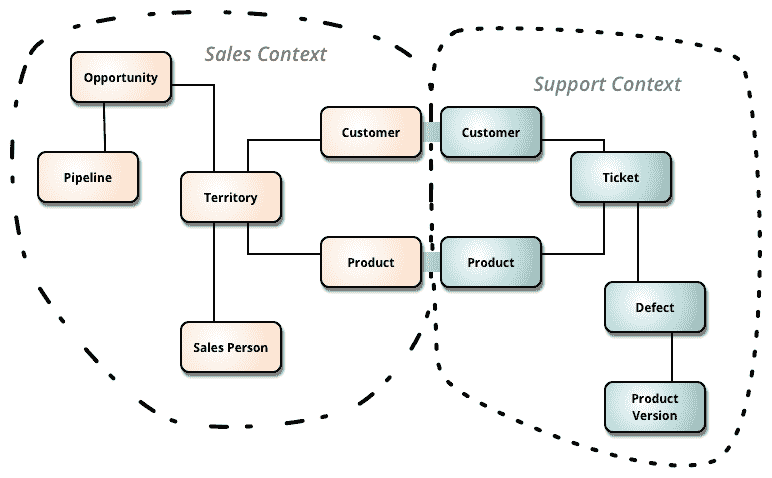
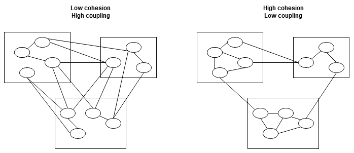

# 第一章：软件架构的重要性和优秀设计原则

这个介绍性章节的目的是展示软件架构在软件开发中的作用。它将专注于设计 C++解决方案架构时需要牢记的关键方面。我们将讨论如何设计具有方便和功能性接口的高效代码。我们还将介绍一个面向领域的方法，用于代码和架构。

在本章中，我们将涵盖以下主题：

+   理解软件架构

+   学习适当架构的重要性

+   探索良好架构的基本原理

+   使用敏捷原则开发架构

+   C++的哲学

+   遵循 SOLID 和 DRY 原则

+   领域驱动设计

+   耦合和内聚

# 技术要求

要运行本章中的代码，您需要以下内容：

+   一个 Git 客户端，用于检出即将给出的存储库。

+   一个符合 C++20 标准的编译器来编译所有的代码片段。其中大部分是用 C++11/14/17 编写的，但是需要概念支持来实验一下涉及该主题的少数代码片段。

+   代码片段的 GitHub 链接：[`github.com/PacktPublishing/Software-Architecture-with-Cpp/tree/master/Chapter01`](https://github.com/PacktPublishing/Software-Architecture-with-Cpp/tree/master/Chapter01)。

+   GSL 的 GitHub 链接：[`github.com/Microsoft/GSL`](https://github.com/Microsoft/GSL)

# 理解软件架构

让我们从定义软件架构的实际含义开始。当您创建一个应用程序、库或任何软件组件时，您需要考虑您编写的元素将如何呈现以及它们将如何相互交互。换句话说，您正在设计它们及其与周围环境的关系。就像城市建筑一样，重要的是要考虑整体情况，以免最终陷入杂乱状态。在小范围内，每栋建筑看起来都还不错，但它们无法合理地组合在一起，它们只是无法很好地结合在一起。这就是所谓的偶然架构，这是您要避免的结果之一。但是，请记住，无论您是否在思考，编写软件都是在创建架构。

那么，如果您想要有意识地定义解决方案的架构，您应该创建什么？软件工程研究所有这样说：

系统的软件架构是理解系统所需的结构集合，包括软件元素、它们之间的关系以及两者的属性。

这意味着为了彻底定义架构，我们应该从几个角度来考虑它，而不是只是匆忙地编写代码。

## 观察架构的不同方式

有几个范围可以用来观察架构：

+   企业架构涉及整个公司甚至一组公司。它采用全面的方法，关注整个企业的战略。在考虑企业架构时，您应该关注公司中所有系统的行为以及它们如何相互合作。它关注业务和 IT 之间的对齐。

+   解决方案架构比企业架构更具体。它处于企业架构和软件架构之间的中间位置。通常，解决方案架构关注的是一个特定系统以及它与周围环境的交互方式。解决方案架构师需要想出一种方式来满足特定的业务需求，通常是通过设计整个软件系统或修改现有系统。

+   软件架构甚至比解决方案架构更具体。它集中在一个特定项目、它使用的技术以及它与其他项目的交互方式。软件架构师对项目组件的内部感兴趣。

+   基础架构架构如其名称所示，关注软件将使用的基础架构。它定义了部署环境和策略，应用程序的扩展方式，故障处理，站点可靠性以及其他基础架构导向的方面。

解决方案架构基于软件和基础架构架构，以满足业务需求。在接下来的章节中，我们将讨论这两个方面，为您准备好小规模和大规模架构设计。在我们深入讨论之前，让我们也回答一个基本问题：为什么架构很重要？

# 学习正确架构的重要性

实际上，一个更好的问题应该是：为什么关心您的架构很重要？正如我们之前提到的，无论您是否有意识地努力构建它，您最终都会得到某种类型的架构。如果在数月甚至数年的开发之后，您仍希望您的软件保持其品质，您需要在过程的早期采取一些步骤。如果您不考虑您的架构，那么它可能永远不会呈现所需的品质。

因此，为了使您的产品满足业务需求和性能、可维护性、可扩展性或其他属性，您需要关注其架构，并且最好在过程的早期就这样做。现在让我们讨论每个优秀架构师都想保护其项目免受的两件事。

## 软件腐败

即使在您进行了最初的工作并有特定的架构构想之后，您仍需要不断监测系统的演变以及它是否仍然符合用户的需求，因为这些需求在软件的开发和生命周期中也可能发生变化。软件腐败，有时也称为侵蚀，发生在实现决策与计划的架构不相符时。所有这些差异都应被视为技术债务。

## 意外架构

未能跟踪开发是否遵循所选择的架构，或者未能有意地规划架构的外观，通常会导致所谓的意外架构，这可能会发生，无论在其他领域应用最佳实践，如测试或具有任何特定的开发文化。

有几种反模式表明您的架构是意外的。类似一团泥的代码是最明显的一个。拥有上帝对象是另一个重要的迹象。一般来说，如果您的软件变得紧密耦合，可能存在循环依赖，但最初并非如此，这是一个重要的信号，需要更多有意识的努力来规划架构的外观。

现在让我们描述一下架构师必须了解以交付可行解决方案的内容。

# 探索良好架构的基本原理

重要的是要知道如何识别好的架构和坏的架构，但这并不是一件容易的事。识别反模式是其中的一个重要方面，但要使架构良好，首先它必须支持交付软件所期望的内容，无论是功能要求、解决方案的属性，还是处理来自各个方面的约束。其中许多可以很容易地从架构背景中得出。

## 架构背景

上下文是架构师在设计坚实解决方案时考虑的因素。它包括需求、假设和约束，这些可以来自利益相关者，以及业务和技术环境。它还影响利益相关者和环境，例如，通过允许公司进入新的市场细分。

## 利益相关者

利益相关者是所有与产品有关的人。这些可以是你的客户，系统的用户，或者管理层。沟通是每个架构师的关键技能，妥善管理利益相关者的需求对于交付他们期望的东西以他们想要的方式至关重要。

不同的利益相关者群体对不同的事情都很重要，所以尽量收集所有这些群体的意见。

你的客户可能会关心编写和运行软件的成本、软件提供的功能、其寿命、上市时间以及你的解决方案的质量。

系统的用户可以分为两组：最终用户和管理员。前者通常关心的是软件的可用性、用户体验和性能。对于后者来说，更重要的方面是用户管理、系统配置、安全性、备份和恢复。

最后，对于管理工作中的利益相关者来说，重要的事情包括降低开发成本，实现业务目标，按照开发进度表进行，以及保持产品质量。

## 商业和技术环境

架构可以受到公司业务方面的影响。重要的相关方面包括上市时间、发布计划、组织结构、劳动力利用率以及对现有资产的投资。

技术环境指的是公司已经使用的技术或因某种原因需要成为解决方案一部分的技术。我们还需要集成的其他系统也是技术环境的重要组成部分。此外，可用软件工程师的技术专长在这里也很重要：架构师所做的技术决策可能会影响项目的人员配备，初级开发人员与高级开发人员的比例可能会影响项目的治理方式。良好的架构应该考虑到所有这些。

现在，凭借所有这些知识，让我们讨论一个可能会在你日常工作中遇到的颇具争议的话题。

# 使用敏捷原则开发架构

表面上，架构和敏捷开发方法之间存在对抗性关系，并且围绕这个话题有许多神话。有一些简单的原则你应该遵循，以便以敏捷方式开发产品，同时关注其架构。

敏捷本质上是迭代和增量的。这意味着在敏捷架构方法中，准备大量的预先设计不是一个选择。相反，应该提出一个小型但仍合理的预先设计。最好附带有每个决定的理由。这样，如果产品愿景发生变化，架构也可以随之发展。为了支持频繁的发布交付，预先设计应该逐步更新。以这种方式开发的架构被称为演进式架构。

管理架构并不意味着保留大量文档。事实上，文档应该只涵盖必要的内容，这样更容易保持其最新。它应该简单，只涵盖系统的相关视图。

还有一个关于架构师作为唯一真理来源和最终决策者的神话。在敏捷环境中，是团队在做决定。话虽如此，利益相关者对决策过程的贡献至关重要 - 毕竟，他们的观点决定了解决方案应该是什么样子。

架构师应该始终是开发团队的一部分，因为他们通常会为团队带来强大的技术专业知识和多年的经验。他们还应该参与估算，并在每次迭代之前计划所需的架构变更。

为了使您的团队保持敏捷，您应该考虑如何高效地工作，只专注于重要的事情。实现这些目标的一个好主意是领域驱动设计。

## 领域驱动设计

领域驱动设计，简称 DDD，是埃里克·埃文斯在他的同名书中引入的一个术语。本质上，它是关于改善业务和工程之间的沟通，并将开发人员的注意力引向领域模型。基于该模型的实现通常会导致更容易理解并随着模型变化而发展的设计。

DDD 与敏捷有什么关系？让我们回顾一下敏捷宣言的一部分：

**个人和互动**优于流程和工具

**工作软件**优于全面文档

**客户协作**优于合同谈判

**响应变化**优于遵循计划

- 敏捷宣言

为了做出正确的设计决策，您必须首先了解领域。为此，您需要经常与人交谈，并鼓励您的开发团队缩小他们与业务人员之间的差距。代码中的概念应该以*普遍语言*中的实体命名。这基本上是业务专家术语和技术专家术语的共同部分。由于每个群体使用另一方不同理解的术语，可能会导致无数误解，从而导致业务逻辑实现中的缺陷和常常微妙的错误。谨慎命名事物并使用双方同意的术语可能对项目意味着幸福。在团队中有业务分析师或其他业务领域专家可以在很大程度上帮助。

如果您正在建模一个更大的系统，可能很难使所有术语对不同团队意味着相同的事情。这是因为这些团队中的每一个实际上都在不同的上下文中操作。DDD 建议使用*有界上下文*来处理这个问题。例如，如果您正在建模一个电子商务系统，您可能只想从购物的角度考虑这些术语，但仔细观察后，您可能会发现库存、交付和会计团队实际上都有自己的模型和术语。

这些每一个都是您电子商务领域的不同子领域。理想情况下，每个子领域都可以映射到自己的有界上下文——系统的一部分，具有自己的词汇。在将解决方案拆分为较小的模块时，设置这些上下文的清晰边界非常重要。就像它的上下文一样，每个模块都有明确的责任、自己的数据库架构和自己的代码库。为了在更大的系统中在团队之间进行沟通，您可能希望引入一个上下文地图，它将显示不同上下文的术语之间的关系：



图 1.1-两个有界上下文及其之间匹配术语的映射（来自 Martin Fowler 关于 DDD 的一篇文章：https://martinfowler.com/bliki/BoundedContext.html）

现在您已经了解了一些重要的项目管理主题，我们可以转向一些更技术性的话题。

# C++的哲学

现在让我们更接近我们将在本书中大部分时间使用的编程语言。C++是一种多范式语言，已经存在了几十年。自其诞生以来，它发生了很大变化。当 C++11 发布时，语言的创造者 Bjarne Stroustrup 说感觉像是一种全新的语言。C++20 的发布标志着这个怪物演变的又一个里程碑，带来了类似的革命，改变了我们编写代码的方式。然而，在这些年里有一件事始终没有改变：语言的哲学。

简而言之，它可以总结为三条规则：

+   C++之下不应该有其他语言（除了汇编）。

+   你只为你使用的东西付费。

+   以低成本提供高级抽象（有强烈的零成本目标）。

不为你不使用的东西付费意味着，例如，如果你想在堆栈上创建数据成员，你可以。许多语言在堆上分配它们的对象，但对于 C++来说并不是必要的。在堆上分配是有一些成本的 - 可能你的分配器将不得不为此锁定互斥锁，在某些类型的应用程序中可能是一个很大的负担。好处是你可以很容易地分配变量而不需要每次动态分配内存。

高级抽象是区分 C++与低级语言（如 C 或汇编）的特点。它们允许直接在源代码中表达想法和意图，这与语言的类型安全非常契合。考虑以下代码片段：

```cpp
struct Duration {
  int millis_;
};

void example() {
  auto d = Duration{};
  d.millis_ = 100;

  auto timeout = 1; // second
  d.millis_ = timeout; // ouch, we meant 1000 millis but assigned just 1
}
```

一个更好的主意是利用语言提供的类型安全特性：

```cpp
#include <chrono>

using namespace std::literals::chrono_literals;

struct Duration {
  std::chrono::milliseconds millis_;
};

void example() {
  auto d = Duration{};
  // d.millis_ = 100; // compilation error, as 100 could mean anything
  d.millis_ = 100ms; // okay

```

```cpp
  auto timeout = 1s; // or std::chrono::seconds(1);
  d.millis_ =
      timeout; // okay, converted automatically to milliseconds
}

```

前面的抽象可以帮助我们避免错误，并且在这样做时不会花费我们任何东西；生成的汇编代码与第一个示例相同。这就是为什么它被称为零成本抽象。有时 C++允许我们使用抽象，实际上会导致比不使用更好的代码。一个例子是 C++20 中的协程，当使用时通常会产生这样的好处。

标准库提供的另一组很棒的抽象是算法。以下哪个代码片段你认为更容易阅读和更容易证明没有错误？哪个更好地表达了意图？

```cpp
// Approach #1
int count_dots(const char *str, std::size_t len) {
  int count = 0;
  for (std::size_t i = 0; i < len; ++i) {
    if (str[i] == '.') count++;
  }
  return count;
}

// Approach #2
int count_dots(std::string_view str) {
  return std::count(std::begin(str), std::end(str), '.');
}
```

好吧，第二个函数有一个不同的接口，但即使它保持不变，我们也可以从指针和长度创建`std::string_view`。由于它是一种轻量级类型，它应该被编译器优化掉。

使用高级抽象会导致更简单、更易维护的代码。C++语言自其诞生以来一直致力于提供零成本的抽象，因此应该建立在此基础上，而不是使用更低级别的抽象重新设计轮子。

说到简单和易维护的代码，接下来的部分介绍了一些在编写这种代码的过程中非常宝贵的规则和启发式方法。

# 遵循 SOLID 和 DRY 原则

在编写代码时要牢记许多原则。在编写面向对象的代码时，你应该熟悉抽象、封装、继承和多态的四个要素。无论你是以大部分面向对象编程的方式编写 C++代码，还是以其他方式编写，你都应该牢记这两个首字母缩略词背后的原则：SOLID 和 DRY。

SOLID 是一组实践，可以帮助你编写更清洁、更少错误的软件。它是由其背后的五个概念的首字母组成的首字母缩略词：

+   单一职责原则

+   开闭原则

+   里斯科夫替换原则

+   接口隔离

+   依赖反转

我们假设你已经了解了这些原则与面向对象编程的关系，但由于 C++并不总是面向对象的，让我们看看它们如何适用于不同的领域。

一些示例使用了动态多态性，但同样适用于静态多态性。如果你正在编写性能导向的代码（如果你选择了 C++，你可能是这样做的），你应该知道使用动态多态性在性能方面可能是一个坏主意，特别是在热路径上。在本书的后面，你将学习如何使用**奇怪的递归模板模式**（**CRTP**）编写静态多态类。

## 单一职责原则

简而言之，**单一职责原则**（**SRP**）意味着每个代码单元应该只有一个责任。这意味着编写只做一件事的函数，创建负责一件事的类型，以及创建专注于一个方面的高级组件。

这意味着如果你的类管理某种资源，比如文件句柄，它应该只做这个，例如，将解析留给另一种类型。

通常，如果你看到一个函数的名字中有“和”字，它就违反了 SRP，应该进行重构。另一个标志是当一个函数有注释指示函数的每个部分（译注：原文中的“section”可能是笔误，应为“function”）做什么。每个这样的部分可能最好作为一个独立的函数。

一个相关的主题是最少知识原则。本质上，它说任何对象都不应该知道关于其他对象的比必要更多的东西，因此它不依赖于它们的内部，例如。应用它会导致更易于维护的代码，组件之间的相互依赖更少。

## 开闭原则

**开闭原则**（**OCP**）意味着代码应该对扩展开放但对修改关闭。对扩展开放意味着我们可以轻松地扩展代码支持的类型列表。对修改关闭意味着现有的代码不应该改变，因为这往往会在系统的其他地方引起错误。C++中展示这一原则的一个很好的特性是`ostream`的`operator<<`。要扩展它以支持你的自定义类，你只需要编写类似以下的代码：

```cpp
std::ostream &operator<<(std::ostream &stream, const MyPair<int, int> 
    &mp) {
  stream << mp.firstMember() << ", ";
  stream << mp.secondMember();
  return stream;
}
```

请注意，我们对`operator<<`的实现是一个自由（非成员）函数。如果可能的话，你应该更喜欢这些而不是成员函数，因为它实际上有助于封装。有关此更多详细信息，请参阅本章末尾的*进一步阅读*部分中 Scott Meyers 的文章。如果你不想为希望打印到`ostream`的某个字段提供公共访问权限，你可以将`operator<<`设置为友元函数，就像这样：

```cpp
class MyPair {
// ...
  friend std::ostream &operator<<(std::ostream &stream, 
    const MyPair &mp);
};
std::ostream &operator<<(std::ostream &stream, const MyPair &mp) {
  stream << mp.first_ << ", ";
  stream << mp.second_ << ", ";
  stream << mp.secretThirdMember_;
  return stream;
}
```

请注意，这个 OCP 的定义与与多态性相关的更常见的定义略有不同。后者是关于创建不能被修改但可以被继承的基类，但对其他类开放。

说到多态性，让我们继续讨论下一个原则，因为它完全是关于正确使用它。

## 里氏替换原则

实质上，**里氏替换原则**（**LSP**）规定，如果一个函数使用基对象的指针或引用，它也必须使用任何派生对象的指针或引用。这个规则有时会被打破，因为我们在源代码中应用的技术并不总是适用于现实世界的抽象。

一个著名的例子是正方形和矩形。从数学上讲，前者是后者的一个特例，所以从一个到另一个有一个“是一个”关系。这引诱我们创建一个从`Rectangle`类继承的`Square`类。因此，我们可能会得到以下代码：

```cpp
class Rectangle {
 public:
  virtual ~Rectangle() = default;
  virtual double area() { return width_ * height_; }
  virtual void setWidth(double width) { width_ = width; }
  virtual void setHeight(double height) { height_ = height; }
 private:
  double width_;
  double height_;
};

class Square : public Rectangle {
 public:
  double area() override;
  void setWidth(double width) override;
  void setHeight(double height) override;
};
```

我们应该如何实现`Square`类的成员？如果我们想遵循 LSP 并避免这些类的用户受到意外的影响，我们不能：如果我们调用`setWidth`，我们的正方形将停止成为正方形。我们可以停止拥有一个正方形（无法使用前面的代码表达）或者修改高度，从而使正方形看起来与矩形不同。

如果你的代码违反了 LSP，很可能你正在使用一个不正确的抽象。在我们的情况下，`Square`毕竟不应该从`Rectangle`继承。一个更好的方法可能是让这两个实现一个`GeometricFigure`接口。

既然我们正在讨论接口，让我们继续讨论下一个与之相关的项目。

## 接口隔离原则

接口隔离原则就是其名字所暗示的。它的表述如下：

没有客户端应该被强迫依赖它不使用的方法。

这听起来非常明显，但它有一些不那么明显的内涵。首先，你应该更喜欢更多但更小的接口而不是一个大的接口。其次，当你添加一个派生类或扩展现有类的功能时，你应该在扩展类实现的接口之前考虑一下。

让我们以违反这一原则的一个例子来展示这一点，从以下接口开始：

```cpp
class IFoodProcessor {
 public:
  virtual ~IFoodProcessor() = default;
  virtual void blend() = 0;
};
```

我们可以有一个简单的实现它的类：

```cpp
class Blender : public IFoodProcessor {
 public:
  void blend() override;
};
```

到目前为止还不错。现在假设我们想要模拟另一个更高级的食品加工器，并且我们鲁莽地尝试向我们的接口添加更多方法：

```cpp
class IFoodProcessor {
 public:
  virtual ~IFoodProcessor() = default;
  virtual void blend() = 0;
  virtual void slice() = 0;
  virtual void dice() = 0;
};

class AnotherFoodProcessor : public IFoodProcessor {
 public:
  void blend() override;
  void slice() override;
  void dice() override;
};
```

现在我们有一个问题，`Blender`类不支持这个新接口 - 没有适当的方法来实现它。我们可以尝试通过一些变通方法或抛出`std::logic_error`来解决，但更好的解决方案是将接口分成两个，每个负责不同的功能：

```cpp
class IBlender {
 public:
  virtual ~IBlender() = default;
  virtual void blend() = 0;
};

class ICutter {
 public:
  virtual ~ICutter() = default;
  virtual void slice() = 0;
  virtual void dice() = 0;
};
```

现在我们的`AnotherFoodProcessor`可以实现两个接口，我们不需要更改现有食品加工器的实现。

我们还剩下最后一个 SOLID 原则，所以现在让我们学习一下。

## 依赖反转原则

依赖反转是一个有用的解耦原则。实质上，它意味着高级模块不应该依赖于低级模块。相反，两者都应该依赖于抽象。

C++允许两种方式来反转类之间的依赖关系。第一种是常规的多态方法，第二种使用模板。让我们看看如何在实践中应用这两种方法。

假设您正在建模一个软件开发项目，该项目应该有前端和后端开发人员。一个简单的方法是这样写：

```cpp
class FrontEndDeveloper {
 public:
  void developFrontEnd();
};

class BackEndDeveloper {
 public:
  void developBackEnd();
};

class Project {
 public:
  void deliver() {
    fed_.developFrontEnd();
    bed_.developBackEnd();
  }
 private:
  FrontEndDeveloper fed_;
  BackEndDeveloper bed_;
};
```

每个开发人员都由`Project`类构建。然而，这种方法并不理想，因为现在更高级的概念`Project`依赖于更低级的模块 - 个别开发人员的模块。让我们看看如何应用多态来应用依赖反转。我们可以定义我们的开发人员依赖于一个接口，如下所示：

```cpp
class Developer {
 public:
  virtual ~Developer() = default;
  virtual void develop() = 0;
};

class FrontEndDeveloper : public Developer {
 public:
  void develop() override { developFrontEnd(); }
 private:
  void developFrontEnd();
};

class BackEndDeveloper : public Developer {
 public:
  void develop() override { developBackEnd(); }
 private:
  void developBackEnd();
};
```

现在，`Project`类不再需要知道开发人员的实现。因此，它必须将它们作为构造函数参数接受：

```cpp
class Project {
 public:
  using Developers = std::vector<std::unique_ptr<Developer>>;
  explicit Project(Developers developers)
      : developers_{std::move(developers)} {}

  void deliver() {
    for (auto &developer : developers_) {
      developer->develop();
    }
  }

 private:
  Developers developers_;
};
```

在这种方法中，`Project`与具体实现解耦，而是仅依赖于名为`Developer`的多态接口。"低级"具体类也依赖于这个接口。这可以帮助您缩短构建时间，并且可以更容易进行单元测试 - 现在您可以在测试代码中轻松地传递模拟对象作为参数。

使用依赖反转和虚拟调度是有成本的，因为现在我们要处理内存分配，动态调度本身也有开销。有时，C++编译器可以检测到对于给定接口只使用了一个实现，并通过执行去虚拟化来消除开销（通常需要将函数标记为`final`才能实现这一点）。然而，在这里，使用了两个实现，因此必须支付动态调度的成本（通常实现为跳转到**虚拟方法表**或**vtables**）。

还有另一种反转依赖的方式，它没有这些缺点。让我们看看如何使用可变模板、C++14 的通用 lambda 和`variant`（C++17 或第三方库，如 Abseil 或 Boost）来实现这一点。首先是开发人员类：

```cpp
class FrontEndDeveloper {
 public:
  void develop() { developFrontEnd(); }
 private:
  void developFrontEnd();
};

class BackEndDeveloper {
 public:
  void develop() { developBackEnd(); }
 private:
  void developBackEnd();
};
```

现在我们不再依赖于接口，因此不会进行虚拟调度。`Project`类仍然将接受一个`Developers`的向量：

```cpp
template <typename... Devs>
class Project {
 public:
  using Developers = std::vector<std::variant<Devs...>>;

  explicit Project(Developers developers)
      : developers_{std::move(developers)} {}

  void deliver() {
    for (auto &developer : developers_) {
      std::visit([](auto &dev) { dev.develop(); }, developer);
    }
  }

 private:
  Developers developers_;
};
```

如果您不熟悉`variant`，它只是一个可以容纳模板参数传递的任何类型的类。因为我们使用了可变模板，我们可以传递任意多个类型。要在 variant 中存储的对象上调用函数，我们可以使用`std::get`来提取它，或者使用`std::visit`和一个可调用对象 - 在我们的例子中，是通用 lambda。它展示了鸭子类型在实践中的样子。由于我们所有的开发人员类都实现了`develop`函数，所以代码将编译并运行。如果您的开发人员类有不同的方法，您可以创建一个函数对象，该对象具有不同类型的`operator()`重载。

因为`Project`现在是一个模板，我们必须每次创建它时要么指定类型列表，要么提供一个类型别名。您可以像这样使用最终类：

```cpp
using MyProject = Project<FrontEndDeveloper, BackEndDeveloper>;
auto alice = FrontEndDeveloper{};
auto bob = BackEndDeveloper{};
auto new_project = MyProject{{alice, bob}};
new_project.deliver();
```

这种方法保证不为每个开发人员分配单独的内存，也不使用虚拟表。然而，在某些情况下，这种方法会导致较少的可扩展性，因为一旦声明了变体，就无法向其添加另一种类型。

关于依赖倒置的最后一点要提到的是，还有一个名为依赖注入的类似概念，我们甚至在我们的例子中使用过。它是关于通过构造函数或设置器注入依赖项，这对于代码的可测试性可能是有益的（例如，考虑注入模拟对象）。甚至有整个框架用于在整个应用程序中注入依赖项，比如 Boost.DI。这两个概念是相关的，经常一起使用。

## DRY 原则

DRY 是“不要重复自己”的缩写。这意味着在可能的情况下应避免代码重复和重用。这意味着当您的代码多次重复类似操作时，应提取函数或函数模板。此外，您应该考虑编写模板，而不是创建几个类似的类型。

当不必要时，重复造轮子是不重要的，也就是说，不要重复他人的工作。如今有数十个编写高质量软件的成熟库，可以帮助您更快地编写高质量的软件。我们想特别提到其中的一些：

+   Boost C++ Libraries（[`www.boost.org/`](https://www.boost.org/)）

+   Facebook 的 Folly（[`github.com/facebook/folly`](https://github.com/facebook/folly)）

+   Electronic Arts 的 EASTL（[`github.com/electronicarts/EASTL`](https://github.com/electronicarts/EASTL)）

+   Bloomberg 的 BDE（[`github.com/bloomberg/bde`](https://github.com/bloomberg/bde)）

+   Google 的 Abseil（[`abseil.io/`](https://abseil.io/)）

+   Awesome Cpp 列表（[`github.com/fffaraz/awesome-cpp`](https://github.com/fffaraz/awesome-cpp)）还有数十个

然而，有时复制代码也有其好处。一个这样的情景是开发微服务。当然，在单个微服务内遵循 DRY 原则总是一个好主意，但是允许在多个服务中重复代码实际上是值得的。无论是模型实体还是逻辑，允许代码重复可以更容易地维护多个服务。

想象一下，有多个微服务重用同一实体的相同代码。突然其中一个需要修改一个字段。所有其他服务现在也必须进行修改。对于任何公共代码的依赖也是如此。有数十个或更多微服务因为与它们无关的更改而必须进行修改，通常更容易进行维护，只需复制代码。

既然我们在谈论依赖和维护，让我们继续下一节，讨论一个密切相关的主题。

# 耦合和内聚

耦合和内聚是软件中相互关联的两个术语。让我们看看它们各自的含义以及它们如何相互关联。

## 耦合

耦合是衡量一个软件单元对其他单元依赖程度的指标。具有高耦合的单元依赖于许多其他单元。耦合越低，越好。

例如，如果一个类依赖于另一个类的私有成员，这意味着它们耦合紧密。第二个类的更改可能意味着第一个类也需要进行更改，这就是为什么这不是一种理想的情况。

为了减弱前面情景中的耦合，我们可以考虑为成员函数添加参数，而不是直接访问其他类的私有成员。

另一个耦合紧密的类的例子是依赖倒置部分中的`Project`和开发人员类的第一个实现。让我们看看如果我们要添加另一种开发人员类型会发生什么：

```cpp
class MiddlewareDeveloper {
 public:
  void developMiddleware() {}
};

class Project {
 public:
  void deliver() {
    fed_.developFrontEnd();
    med_.developMiddleware();
    bed_.developBackEnd();
  }

 private:
  FrontEndDeveloper fed_;
  MiddlewareDeveloper med_;
  BackEndDeveloper bed_;
};
```

看起来，我们不仅仅是添加了`MiddlewareDeveloper`类，而是必须修改了`Project`类的公共接口。这意味着它们耦合度高，并且`Project`类的这种实现实际上违反了 OCP。为了对比，现在让我们看看如何将相同的修改应用于使用依赖反转的实现：

```cpp
class MiddlewareDeveloper {
 public:
  void develop() { developMiddleware(); }

 private:
  void developMiddleware();
};
```

`Project`类不需要进行任何更改，所以现在这些类是松耦合的。我们需要做的只是添加`MiddlewareDeveloper`类。以这种方式构建我们的代码可以实现更小的重建、更快的开发和更容易的测试，而且代码更少且更易于维护。要使用我们的新类，我们只需要修改调用代码：

```cpp
using MyProject = Project<FrontEndDeveloper, MiddlewareDeveloper, BackEndDeveloper>;
auto alice = FrontEndDeveloper{};
auto bob = BackEndDeveloper{};
auto charlie = MiddlewareDeveloper{};
auto new_project = MyProject{{alice, charlie, bob}};
new_project.deliver();
```

这显示了类级别的耦合。在更大的范围内，例如两个服务之间，通过引入诸如消息队列等技术可以实现低耦合。这样服务就不会直接依赖于彼此，而只依赖于消息格式。如果您使用微服务架构，一个常见的错误是让多个服务使用相同的数据库。这会导致这些服务之间的耦合，因为您不能自由修改数据库架构而不影响使用它的所有微服务。

现在让我们转向内聚性。

## 内聚性

内聚性是衡量软件单元元素之间关系强度的指标。在高度内聚的系统中，同一模块中组件提供的功能是强相关的。感觉这样的组件就像是天生一对。

在类级别上，方法操作的字段越多，它对类的内聚性就越高。这意味着最常见的低内聚数据类型是那些庞大的单体类型。当一个类中发生太多事情时，它很可能不是内聚的，也会违反 SRP。这使得这样的类难以维护且容易出错。

较小的类也可能缺乏内聚性。考虑以下例子。这可能看起来微不足道，但发布现实生活中的场景，通常有数百甚至数千行长，是不切实际的：

```cpp
class CachingProcessor {
 public:
  Result process(WorkItem work);
  Results processBatch(WorkBatch batch);
  void addListener(const Listener &listener);
  void removeListener(const Listener &listener);

 private:
  void addToCache(const WorkItem &work, const Result &result);
  void findInCache(const WorkItem &work);
  void limitCacheSize(std::size_t size);
  void notifyListeners(const Result &result);
  // ...
};
```

我们可以看到我们的处理器实际上做了三种工作：实际工作、结果的缓存和管理监听器。在这种情况下增加内聚性的常见方法是提取一个类，甚至多个类：

```cpp
class WorkResultsCache {
 public:
  void addToCache(const WorkItem &work, const Result &result);
  void findInCache(const WorkItem &work);
  void limitCacheSize(std::size_t size);
 private:
  // ...
};

class ResultNotifier {
 public:
  void addListener(const Listener &listener);
  void removeListener(const Listener &listener);
  void notify(const Result &result);
 private:
  // ...
};

class CachingProcessor {
 public:
  explicit CachingProcessor(ResultNotifier &notifier);
  Result process(WorkItem work);
  Results processBatch(WorkBatch batch);
 private:
  WorkResultsCache cache_;
  ResultNotifier notifier_;
  // ...
};
```

现在每个部分都由一个单独的内聚实体完成。现在可以轻松地重用它们。甚至将它们制作成模板类应该也需要很少的工作。最后但并非最不重要的，测试这样的类应该也更容易。

将这个概念应用到组件或系统级别很简单 - 您设计的每个组件、服务和系统都应该简洁，并专注于做一件事并做到完美：



图 1.2 - 耦合与内聚

低内聚和高耦合通常与难以测试、重用、维护甚至理解的软件相关联，因此它缺乏许多通常在软件中期望具有的质量属性。

这些术语经常一起出现，因为通常一个特征会影响另一个特征，无论我们谈论的单元是函数、类、库、服务，甚至是整个系统。举个例子，通常来说，单体系统耦合度高，内聚性低，而分布式服务往往处于光谱的另一端。

这就结束了我们的介绍性章节。现在让我们总结一下我们学到的东西。

# 总结

在本章中，我们讨论了软件架构是什么，以及为什么值得关注它。我们展示了当架构没有随着需求和实现的变化而更新时会发生什么，以及如何在敏捷环境中处理架构。然后我们转向了 C++语言的一些核心原则。

我们了解到，许多软件开发术语在 C++中可能有不同的理解，因为 C++允许编写面向对象的代码以外的内容。最后，我们讨论了耦合和内聚等术语。

现在，您应该能够在代码审查中指出许多设计缺陷，并重构您的解决方案以获得更好的可维护性，以及作为开发人员更少容易出现错误。您现在可以设计健壮、自解释和完整的类接口。

在下一章中，我们将学习不同的架构方法或风格。我们还将学习如何以及何时可以使用它们来获得更好的结果。

# 问题

1.  为什么要关心软件架构？

1.  在敏捷团队中，架构师应该是最终的决策者吗？

1.  SRP 与内聚性有什么关系？

1.  项目的生命周期的哪些阶段可以从有架构师受益？

1.  遵循 SRP 有什么好处？

# 进一步阅读

1.  埃里克·埃文斯，《领域驱动设计：应对软件核心的复杂性》

1.  斯科特·迈尔斯，《非成员函数如何改善封装》，[`www.drdobbs.com/cpp/how-non-member-functions-improve-encapsu/184401197`](https://www.drdobbs.com/cpp/how-non-member-functions-improve-encapsu/184401197)
