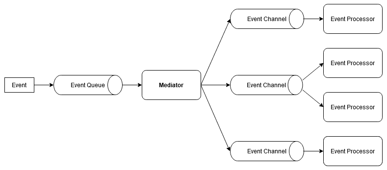
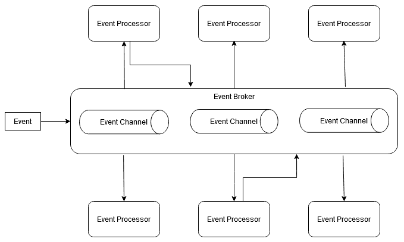
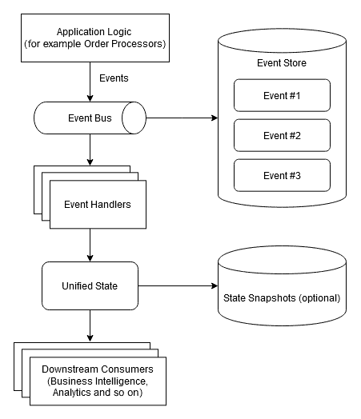
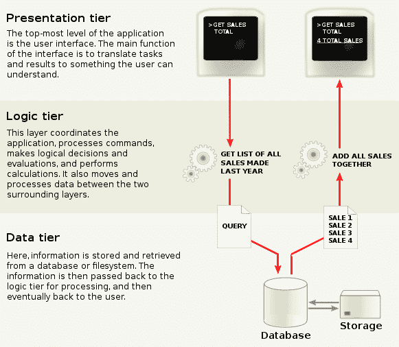
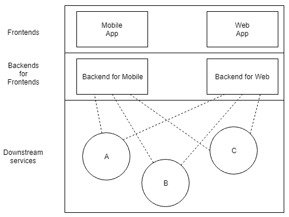

# 第二章：架构风格

本章介绍了不同的架构方法或风格。每个部分都将讨论设计软件的不同方法及其优缺点，并描述何时以及如何应用它以获得其好处。我们将从比较有状态和无状态架构开始本章。接下来，我们将从单体系统，通过各种类型的面向服务的设计，一直到微服务。然后，我们将开始从不同角度描述架构风格，包括事件驱动系统、分层系统，最后是模块化设计。

完成本章后，您将熟悉以下主题：

+   在有状态和无状态之间做出决定

+   理解单体系统——为什么应该避免它们，并识别例外情况

+   理解服务和微服务

+   探索基于事件的架构

+   理解分层架构

+   学习模块化架构

# 技术要求

您需要知道软件服务是什么，并且能够阅读 C++11 中的代码。

本章的代码可以在以下 GitHub 页面找到：[`github.com/PacktPublishing/Software-Architecture-with-Cpp/tree/master/Chapter02`](https://github.com/PacktPublishing/Software-Architecture-with-Cpp/tree/master/Chapter02)。

# 在有状态和无状态之间做出决定

有状态和无状态是编写软件的两种相反的方式，各有其优缺点。

正如其名称所示，有状态软件的行为取决于其内部状态。让我们以网络服务为例。如果它记住了自己的状态，服务的消费者可以在每个请求中发送更少的数据，因为服务记住了这些请求的上下文。然而，在请求大小和带宽上节省的同时，网络服务的一方面隐藏了成本。如果用户同时发送多个请求，服务现在必须同步其工作。由于多个请求可能同时更改状态，没有同步可能导致数据竞争。

然而，如果服务是无状态的，那么每个发送到它的请求都需要包含处理它所需的所有数据。这意味着请求会变得更大，使用更多的带宽，但另一方面，它将允许更好的性能和服务的扩展。如果您熟悉函数式编程，您可能会发现无状态服务很直观。处理每个请求可以被理解为对纯函数的调用。事实上，无状态编程提供的许多优势都源于其函数式编程的根基。可变状态是并发代码的敌人。函数式编程依赖于不可变的值，即使这意味着复制而不是修改现有对象。由于这个原因，每个线程可以独立工作，不可能发生数据竞争。

由于没有竞争条件，也不需要锁，这在性能方面可以带来巨大的提升。没有锁也意味着您将不再需要处理死锁。拥有纯函数意味着您的代码也更容易调试，因为您没有任何副作用。没有副作用反过来也有助于编译器，因为优化没有副作用的代码是一个更容易的任务，可以更积极地执行。以函数式方式编写代码的另一个好处是，您编写的源代码往往更简洁和表达力强，特别是与严重依赖**四人帮**（**GoF**）设计模式的代码相比。

这并不一定意味着如果带宽不是问题，您应该总是选择无状态。这些决定可以在许多层面上进行，从单个类或函数到整个应用程序。

以类为例。如果您正在建模，比如一个`Consultant`，那么类中包含诸如顾问的姓名、联系方式、小时费率、当前和过去的项目等字段是有意义的。它是自然而然地有状态的。现在，想象一下，您需要计算他们的工作所得。您应该创建一个`PaymentCalculator`类吗？您应该添加一个成员函数还是自由函数来计算这个？如果您选择类的方法，您应该将`Consultant`作为构造函数参数还是方法参数传递？类是否应该具有津贴等属性？

添加一个成员函数来计算薪水会违反**单一责任原则**（**SRP**），因为现在该类将有两个责任：计算薪水和存储顾问的数据（状态）。这意味着引入一个自由函数或一个单独的类来实现这个目的应该优于拥有这样的混合类。

这样的类首先应该有状态吗？让我们讨论一下我们的`PaymentCalculator`类的不同方法。

一种方法是公开用于计算目的所需的属性：

```cpp
class PaymentCalculator;
{
 public:
  double calculate() const;

  void setHours(double hours);
  void setHourlyRate(double rate);
  void setTaxPercentage(double tax);
 private:
  double hours_;
  double netHourlyRate_;
  double taxPercentage_;
};
```

这种方法有两个缺点。第一个是它不是线程安全的；这样的`PaymentCalculator`类的单个实例在没有锁的情况下不能在多个线程中使用。第二个是一旦我们的计算变得更加复杂，该类可能会开始从我们的`Consultant`类中复制更多字段。

为了消除重复，我们可以重新设计我们的类来存储一个`Consultant`实例，就像这样：

```cpp
class PaymentCalculator {
 public:
  double calculate() const;

  void setConsultant(const Consultant &c);
  void setTaxPercentage(double tax);

 private:
  gsl::not_null<const Consultant *> consultant_;
  double taxPercentage_;
};
```

请注意，由于我们不能轻松地重新绑定引用，我们正在使用**指南支持库**（**GSL**）中的一个辅助类来存储可重新绑定的指针，该辅助类会自动确保我们不存储空值。

这种方法仍然有不是线程安全的缺点。我们能做得更好吗？事实证明，我们可以通过使其无状态来使类线程安全：

```cpp
class PaymentCalculator {
 public:
  static double calculate(const Consultant &c, double taxPercentage);
};
```

如果没有状态需要管理，那么您决定创建自由函数（可能在不同的命名空间中）还是将它们作为类的静态函数分组，就不是很重要，就像我们在前面的片段中所做的那样。在类方面，有必要区分值（实体）类型和操作类型，因为混合它们可能导致 SRP 违规。

## 无状态和有状态的服务

我们讨论类的相同原则可以映射到更高级别的概念，例如微服务。

有状态服务是什么样的？让我们以 FTP 为例。如果不是匿名的，它需要用户传递用户名和密码来创建会话。服务器存储这些数据以识别用户仍然连接，因此它不断地存储状态。每次用户更改工作目录时，状态都会更新。用户所做的每个更改都会反映为状态的更改，即使他们断开连接也是如此。拥有有状态的服务意味着根据状态，对于两个看起来相同的`GET`请求，可以返回不同的结果。如果服务器丢失状态，您的请求甚至可能停止正确处理。

有状态的服务也可能存在不完整的会话或未完成的事务以及增加的复杂性。会话应该保持多久？如何验证客户端是否崩溃或断开连接？我们何时应该回滚任何更改？虽然您可以回答这些问题，但通常更容易依赖服务的消费者以一种动态的“智能”方式与其进行通信。由于他们将自己维护某种状态，因此拥有一个也维护状态的服务不仅是不必要的，而且通常是浪费的。

无状态服务，如本书后面描述的 REST 服务，采用相反的方法。每个请求必须包含处理请求所需的所有数据，以便成功处理，因此两个相同的幂等请求（如`GET`）将导致相同的回复。这是在假设服务器上存储的数据不会改变的情况下，但数据不一定等同于状态。重要的是每个请求都是自包含的。

无状态性在现代互联网服务中是基本的。HTTP 协议是无状态的，而许多服务 API，例如 Twitter 的，也是无状态的。REST，Twitter 的 API 依赖的协议，旨在实现功能上的无状态。这个缩写背后的整个概念，**表现层状态转移**（**REST**），传达了请求处理所需的所有状态必须在其中传输的概念。如果不是这种情况，你就不能说你有一个符合 REST 原则的服务。然而，由于实际需求，也有一些例外情况。

如果你正在构建一个在线商店，你可能希望存储与客户相关的信息，如他们的订单历史和送货地址。客户端可能会存储身份验证 cookie，而服务器可能会在数据库中存储一些用户数据。cookie 取代了我们在有状态服务中管理会话的需求。

将会话保留在服务器端是服务的不良方法，原因有几个：它们增加了许多可以避免的复杂性，使错误更难复制，最重要的是，它们不具备可伸缩性。如果你想将负载分布到另一台服务器上，很可能会遇到在负载和服务器之间复制会话以及同步它们的困难。所有会话信息都应该保存在客户端。

这意味着如果你希望有一个有状态的架构，你需要有一个很好的理由。以 FTP 协议为例。它必须在客户端和服务器端复制更改。用户只需要对一个特定的服务器进行身份验证，以执行单状态数据传输。将其与 Dropbox 等服务进行比较，其中数据通常在用户之间共享，并且文件访问是通过 API 抽象的，就可以看出无状态模型更适合这种情况。

# 理解单体应用——为什么应该避免，并识别例外情况

你可以开发应用程序的最简单的架构风格是单体架构。这就是为什么许多项目都是以这种风格开始的原因。单体应用程序只是一个大块，这意味着应用程序的功能可区分部分（如处理 I/O、数据处理和用户界面）都是交织在一起，而不是在单独的架构组件中。

部署这样的单体应用可能比多组件应用更容易，因为只需要部署一个东西。测试也可能更容易，因为端到端测试只需要启动一个单一组件。集成也更容易，因为除了扩展解决方案，你只需要在负载均衡器后面添加更多实例。尽管有这些优势，为什么会有人对这种架构风格感到畏惧呢？事实证明，尽管有这些优势，也存在许多缺点。

理论上提供的可伸缩性听起来不错，但如果你的应用程序具有不同资源需求的模块怎么办？如果只需要扩展应用程序中的一个模块怎么办？单体系统固有的缺乏模块化是与这种架构相关的许多缺陷的根源。

此外，你开发单片应用程序的时间越长，你在维护它时遇到的问题就越多。保持这样一个应用程序内部的松耦合是一个挑战，因为很容易在其模块之间添加另一个依赖。随着这样一个应用程序的增长，理解它变得越来越困难，因此由于增加的复杂性，开发过程很可能会随着时间的推移而变得越来越慢。在开发单片应用程序时，也很难维护**设计驱动开发**（**DDD**）的边界上下文。

拥有一个大型应用程序在部署和执行方面也有缺点。启动这样的应用程序所需的时间比启动更多、更小的服务要长得多。而且无论你在应用程序中做了什么改变，你可能不喜欢它强迫你一次性重新部署整个应用程序。现在，想象一下，你的一个开发人员在应用程序中引入了一个资源泄漏。如果泄漏的代码一遍又一遍地执行，它不仅会使应用程序的功能部分崩溃，还可能使整个应用程序崩溃。

如果你喜欢在项目中使用尖端技术，单片式风格也不会带来什么好消息。因为现在你需要一次性迁移整个应用程序，所以更难更新任何库或框架。

前面的解释表明，单片架构只适用于简单和小型应用程序。然而，还有一种情况，它实际上可能是一个好主意。如果你关心性能，单片架构有时可以帮助你在延迟或吞吐量方面比微服务更充分地利用你的应用程序。进程间通信总会带来一些开销，而单片应用程序则不需要支付。如果你对测量感兴趣，请参阅本章的*进一步阅读*部分中列出的论文。

# 理解服务和微服务

由于单片架构的缺点，其他方法已经出现。一个常见的想法是将解决方案分成多个相互通信的服务。然后，你可以将开发分配给不同的团队，每个团队负责一个单独的服务。每个团队的工作边界是清晰的，不像单片架构风格。

**面向服务的架构**，简称**SOA**，意味着业务功能被模块化，并作为独立的服务呈现给消费者应用程序使用。每个服务应该有一个自我描述的接口，并隐藏任何实现细节，比如内部架构、技术或所使用的编程语言。这允许多个团队以他们喜欢的方式开发服务，这意味着在幕后，每个团队可以使用最适合他们需求的东西。如果你有两个开发团队，一个精通 C#，一个精通 C++，他们可以开发两个可以轻松相互通信的服务。

SOA 的支持者提出了一项优先考虑以下内容的宣言：

+   业务价值优于技术策略

+   战略目标优于项目特定的利益

+   内在互操作性优于自定义集成

+   共享服务优于特定目的的实现

+   灵活性优于优化

+   演进式改进优于追求初始完美

尽管这份宣言不限制你使用特定的技术栈、实现或服务类型，但最常见的两种服务类型是 SOAP 和 REST。除此之外，最近，还有一种第三种类型的服务正在日益流行：基于 gRPC 的服务。你可以在关于面向服务的架构和微服务的章节中了解更多关于这些的信息。

## 微服务

顾名思义，微服务是一种软件开发模式，其中应用程序被拆分为使用轻量级协议进行通信的松耦合服务集合。微服务模式类似于 UNIX 哲学，即一个程序应该只有一个目的。根据 UNIX 哲学，复杂的问题可以通过将这些程序组合成 UNIX 管道来解决。同样，基于微服务的系统由许多微服务和支持服务组成。

让我们先来概述这种架构风格的优缺点。

### 微服务的优势和劣势

微服务架构中服务的小尺寸意味着它们开发、部署和理解起来更快。由于服务是彼此独立构建的，编译它们的新版本所需的时间可以大大缩短。由此，使用这种架构风格处理时更容易进行快速原型设计和开发。这反过来使得缩短交付时间成为可能，这意味着业务需求可以更快地引入和评估。

微服务方法的其他优点包括以下内容：

+   模块化是这种架构风格的固有特性。

+   更好的可测试性。

+   替换系统部分（如单个服务、数据库、消息代理或云提供商）的灵活性。

+   与传统系统集成：无需迁移整个应用程序，只需迁移需要当前开发的部分。

+   启用分布式开发：独立的开发团队可以并行地开发多个微服务。

+   可伸缩性：微服务可以独立扩展。

另一方面，以下是微服务的一些缺点：

+   它们需要成熟的 DevOps 方法和依赖于 CI/CD 自动化。

+   它们更难调试，需要更好的监控和分布式跟踪。

+   额外的开销（辅助服务方面）可能会超过较小应用程序的好处。

现在让我们讨论一下以这种架构风格编写的服务的特点。

### 微服务的特点

由于微服务风格相对较新，因此没有单一的微服务定义。根据 Martin Fowler 的说法，微服务具有几个基本特征，接下来我们将描述这些特征：

+   每个服务都应该是一个可以独立替换和升级的组件。这与组件作为单块应用程序库的紧耦合相对，后者在替换一个库时通常需要重新部署整个应用程序。

+   每个服务都应该由一个专注于特定业务能力的跨职能团队开发。听说过康威定律吗？

*"任何设计系统（广义上定义）的组织都会产生一个结构，其结构是组织的沟通结构的复制。"**– Melvyn Conway, 1967*

如果没有跨职能团队，你最终会陷入软件孤岛。与之伴随的沟通缺失将使您不断地跨越障碍才能成功交付。

+   每个服务都应该是一个产品，由开发团队在其整个生命周期内拥有。这与项目思维形成鲜明对比，项目思维中你只是开发软件然后交给其他人去维护。

+   服务应该具有智能端点并使用哑管道，而不是相反。这与传统服务形成对比，传统服务通常依赖于**企业服务总线**（**ESB**）的逻辑，ESB 通常管理消息的路由并根据业务规则进行转换。在微服务中，通过将逻辑存储在服务中并避免与消息组件耦合，可以实现内聚性。使用"哑"消息队列，如 ZeroMQ，可以帮助实现这一目标。

+   服务应该以分散的方式进行管理。单体通常使用特定的技术堆栈编写。当它们被拆分为微服务时，每个微服务可以选择最适合自己特定需求的技术。确保每个微服务 24/7 运行的管理工作由负责该特定服务的团队负责，而不是由一个中央部门负责。亚马逊、Netflix 和 Facebook 等公司遵循这种方法，并观察到让开发人员对其服务在生产中的无缺陷执行负责有助于确保高质量。

+   服务应该以分散的方式管理它们的数据。每个微服务可以选择最符合其需求的数据库，而不是为它们所有选择一个数据库。分散的数据可能会导致一些处理更新的挑战，但可以实现更好的扩展。这就是为什么微服务通常以无事务的方式协调并提供最终一致性。

+   服务使用的基础设施应该是自动管理的。为了有效地处理数十个微服务，您需要进行持续集成和持续交付，否则，部署您的服务将是一场噩梦。自动运行所有测试将为您节省大量时间和麻烦。在此基础上实施持续部署将缩短反馈周期，也能让您的客户更快地使用您的新功能。

+   微服务应该能够应对它们所依赖的其他服务的故障。在分布式部署环境中，由于有太多的运行部件，一些部件偶尔出现故障是正常的。您的服务应该能够优雅地处理这些故障。诸如断路器或舱壁（在本书后面有描述）的模式可以帮助实现这一点。为了使您的架构具有弹性，能够有效地将失败的服务重新启动甚至提前知道它们将崩溃也是至关重要的。实时监控延迟、吞吐量和资源使用情况对此至关重要。了解 Netflix 的 Simian Army 工具包，因为它对创建具有弹性的架构非常宝贵。

+   基于微服务的架构应该准备不断演进。您应该以一种允许轻松替换单个微服务甚至一组微服务的方式设计微服务和它们之间的合作。正确设计服务是有技巧的，特别是因为曾经存在于一个更大模块的代码中的一些复杂性现在可能存在于服务之间的复杂通信方案中，这更难以管理——所谓的意大利面集成。这意味着架构师的经验和技能比传统服务或单片式方法更加重要。

除此之外，许多（但并非全部）微服务共享的其他特征包括：

+   使用通过网络协议进行通信的独立进程

+   使用技术无关的协议（如 HTTP 和 JSON）

+   保持服务小型且运行时开销低

现在，您应该对基于微服务的系统的特征有了很好的理解，让我们看看这种方法与其他架构风格相比如何。

### 微服务和其他架构风格

微服务可以作为一种独立的架构模式使用。然而，它们通常与其他架构选择结合使用，例如云原生计算、无服务器应用程序，以及大多数轻量级应用容器。

面向服务的架构带来了松散耦合和高内聚。当正确应用时，微服务也可以做到。然而，这可能有些具有挑战性，因为需要很好的直觉来将系统划分为通常庞大数量的微服务。

微服务和它们的大型兄弟之间有更多的相似之处，它们也可以使用基于 SOAP、REST 或 gRPC 的消息传递，并使用诸如消息队列之类的技术来进行事件驱动。它们也有众所周知的模式来帮助实现所需的质量属性，例如容错（例如通过隔离故障组件），但为了拥有高效的架构，您必须决定您对诸如 API 网关、服务注册表、负载平衡、容错、监控、配置管理以及当然要使用的技术栈等元素的方法。

### 微服务的扩展

微服务与单片应用的扩展方式不同。在单片应用中，整个功能由单个进程处理。扩展应用程序意味着在不同的机器上复制此进程。这种扩展并不考虑哪些功能被大量使用，哪些不需要额外资源。

对于微服务，每个功能元素都作为一个单独的服务处理，这意味着一个单独的进程。为了扩展基于微服务的应用程序，只需复制需要更多资源的部分到不同的机器上。这种方法使得更容易更好地利用可用资源。

### 过渡到微服务

大多数公司都有某种现有的单片代码，他们不想立即使用微服务进行重写，但仍希望过渡到这种架构。在这种情况下，可以通过逐步添加越来越多与单片交互的服务来逐步适应微服务。您可以将新功能创建为微服务，或者只是剪切单片的一些部分并将其创建为微服务。

有关微服务的更多详细信息，包括如何从头开始构建自己的微服务，请参阅第十三章，*设计微服务*。

# 探索基于事件的架构

基于事件的系统是围绕处理事件的架构。有产生事件的组件，事件传播的通道，以及对其做出反应的监听器，可能还会触发新的事件。这是一种促进异步和松耦合的风格，这使得它成为提高性能和可伸缩性的好方法，也是一种易于部署的解决方案。

除了这些优势之外，还有一些需要解决的挑战。其中之一是创建这种类型系统的复杂性。所有队列必须具有容错能力，以便在处理过程中不会丢失任何事件。以分布式方式处理事务也是一个挑战。使用相关 ID 模式跟踪进程之间的事件，以及监控技术，可以节省您数小时的调试和苦思冥想。

基于事件的系统的示例包括流处理器和数据集成，以及旨在实现低延迟或高可伸缩性的系统。

让我们现在讨论在这种系统中常用的拓扑结构。

## 常见的基于事件的拓扑结构

基于事件的架构的两种主要拓扑结构是基于代理的和基于中介者的。这些拓扑结构在事件如何在系统中流动方面有所不同。

当处理需要执行多个独立任务或步骤的事件时，中介者拓扑结构最适用。最初产生的所有事件都会进入中介者的事件队列。中介者知道如何处理事件，但它不执行逻辑，而是通过每个处理器的事件通道将事件分派给适当的事件处理器。

如果这让您想起了业务流程是如何流动的，那么您的直觉很准确。您可以在业务流程管理（BPM）或业务流程执行语言（BPEL）中实现这种拓扑结构。然而，您也可以使用诸如 Apache Camel、Mule ESB 等技术来实现它：



图 2.1 - 中介者拓扑结构

另一方面，经纪人是一个轻量级组件，包含所有队列，不编排事件的处理。它可以要求接收者订阅特定类型的事件，然后简单地转发所有对他们有兴趣的事件。许多消息队列依赖于经纪人，例如 ZeroMQ，它是用 C++编写的，旨在实现零浪费和低延迟：



图 2.2 - 经纪人拓扑结构

现在您已经了解了基于事件的系统中使用的两种常见拓扑结构，让我们了解一种以事件为核心的强大架构模式。

## 事件溯源

您可以将事件视为包含额外数据的通知，供通知的服务处理。然而，还有另一种思考方式：状态的改变。想象一下，如果您能够知道应用逻辑在出现错误时所处的状态以及对其请求了什么改变，那么调试问题将会变得多么容易。这就是事件溯源的一个好处。实质上，它通过简单记录事件发生的顺序来捕获系统中发生的所有变化。

通常，您会发现服务不再需要在数据库中持久化其状态，因为在系统的其他地方存储事件就足够了。即使需要，也可以异步完成。从事件溯源中获得的另一个好处是免费的完整审计日志：



图 2.3 - 事件溯源架构。提供应用程序状态的统一视图可以允许消费它并创建定期快照以实现更快的恢复

由于减少了数据同步的需求，基于事件的系统通常具有低延迟，这使它们非常适合交易系统和活动跟踪器等应用。

现在让我们了解另一种流行的架构风格。

# 理解分层架构

如果您的架构开始看起来像意大利面条，或者您只是想要防止这种情况发生，那么将组件结构化为层可能会有所帮助。还记得模型-视图-控制器吗？或者类似的模式，如模型-视图-视图模型或实体-控制-边界？这些都是分层架构的典型例子（如果层是物理上相互分离的，则也称为 N 层架构）。您可以将代码结构化为层，可以创建微服务层，或者将此模式应用于您认为可以带来好处的其他领域。分层提供了抽象和关注点的分离，这是引入它的主要原因。然而，它还可以帮助减少复杂性，同时提高解决方案的模块化、可重用性和可维护性。

一个现实世界的例子是自动驾驶汽车，其中层可以用于分层地做出决策：最低层将处理汽车的传感器，然后另一层将处理消耗传感器数据的单个功能，再上面可能会有另一层来确保所有功能都能产生安全行为。当传感器在汽车的另一个型号中被替换时，只需要替换最低层。

分层架构通常很容易实现，因为大多数开发人员已经了解层的概念 - 他们只需要开发几个层并像下图中那样堆叠它们：



图 2.4 - 使用文本界面的 3 层架构示例

创建高效的分层架构的挑战在于规定层之间的稳定、明确定义的接口。通常，你可以在一个层之上有几个层。例如，如果你有一个领域逻辑层，它可以作为呈现层和向其他服务提供 API 的基础层。

这并不意味着分层始终是一件好事。在微服务中，有两种主要情况下会出现分层。第一种是当你想要将一组服务与另一组服务分开时。例如，你可以有一个快速变化的层与你的业务合作伙伴进行交互，内容经常变化，还有一个面向业务能力的层。后者的变化速度不那么快，使用的技术也比较稳定。分开这两个层是有意义的。还有一个概念是不太稳定的组件应该依赖于更稳定的组件，因此很容易看出你可以在这里有两个层，其中面向客户的层依赖于业务能力。

另一种情况是创建层以反映组织的通信结构（再见，康威定律）。这可能会减少团队之间的沟通，从而导致创新减少，因为现在团队不会那么了解彼此的内部或想法。

现在让我们讨论另一个经常与微服务一起使用的分层架构的例子——面向前端的后端。

## 面向前端的后端

看到许多前端依赖于相同的后端并不罕见。假设你有一个移动应用和一个 web 应用，两者都使用相同的后端。起初这可能是一个不错的设计选择。然而，一旦这两个应用的需求和使用场景开始分歧，你的后端就需要越来越多的改变，只为其中一个前端提供服务。这可能导致后端需要支持竞争性的需求，比如两种不同的更新数据存储的方式或者提供数据的不同场景。同时，前端开始需要更多的带宽来与后端进行正确的通信，这也导致移动应用的电池使用更多。在这一点上，你应该考虑为每个前端引入一个单独的后端。

这样，你可以将用户界面应用程序视为一个具有两个层的单个实体：前端和后端。后端可以依赖于另一层，包括下游服务。参考以下图表：



图 2.5 - 面向前端的后端模式

使用**面向前端的后端**（**BFFs**）的缺点是一些代码必须重复。只要这加快了开发并且从长远来看不是负担，那就没问题。但这也意味着你应该留意聚合重复逻辑到下游服务的可能性。有时，引入一个服务来聚合类似的调用可以帮助解决重复问题。通常，如果你有许多前端，一些前端仍然可以共享一个后端，而不会导致它有竞争性的需求。例如，如果你为 iOS 和 Android 创建移动应用，你可以考虑重用相同的后端，并为 web 和/或桌面应用程序单独创建后端。

# 基于学习模块的架构

在本节中，通过模块，我们指的是可以在运行时加载和卸载的软件组件。有关 C++20 模块，请参阅第五章，*利用 C++ 语言特性*。

如果您曾经需要尽可能少地运行一个组件，但由于任何原因无法应用通常的容错模式，例如服务的冗余副本，那么将该组件基于模块化可能会挽救您的一天。或者您可能只是被一个具有所有模块版本化的模块化系统的愿景所吸引，可以轻松查找所有可用服务，以及模块化系统可能引起的解耦、可测试性和增强团队合作。这就是为什么**开放服务网关倡议**（**OSGi**）模块被创建用于 Java，并在多个框架中被移植到 C++中。使用模块的架构示例包括诸如 Eclipse 的 IDE、**软件定义网络**（**SDN**）项目，如 OpenDaylight，或家庭自动化软件，如 OpenHAB。

OSGi 还允许模块之间的自动依赖管理，控制它们的初始化和卸载，以及控制它们的发现。由于它是面向服务的，您可以将使用 OSGi 服务视为在一个“容器”中拥有微小（微？）服务。这就是为什么 C++实现之一被命名为 C++ Micro Services。要看到它们的实际效果，请参考*进一步阅读*部分的*入门指南*。

C++ Micro Services 框架采用的一个有趣的概念是一种处理单例的新方法。`GetInstance()`静态函数将不再只传递静态实例对象，而是返回从捆绑上下文中获取的服务引用。因此，单例对象将被您可以配置的服务所取代。它还可以避免静态去初始化的困境，其中相互依赖的多个单例必须按特定顺序卸载。

# 摘要

在本章中，我们讨论了您可以在实际中遇到并应用于您的软件的各种架构风格。我们讨论了单体架构，通过面向服务的架构，转向了微服务，并讨论了它们可以提供外部接口并相互交互的各种方式。您学会了如何编写 RESTful 服务，以及如何创建一个弹性且易于维护的微服务架构。

我们还展示了如何创建简单的客户端来消费同样简单的服务。随后，我们讨论了架构的各种其他方法：事件驱动的方法，运行时基于模块的方法，并展示了分层可以被发现的地方以及原因。您现在知道如何实现事件溯源，并知道何时使用 BFFs。此外，您现在知道架构风格如何帮助您实现多个质量属性以及这可能带来的挑战。

在下一章中，您将学习如何知道在给定系统中哪些属性是重要的。

# 问题

1\. RESTful 服务的特征是什么？

2\. 您可以使用哪些工具包来帮助您创建弹性的分布式架构？

3\. 您应该为您的微服务使用集中式存储吗？为什么/为什么不？

4\. 何时应该编写有状态服务而不是无状态服务？

5\. 经纪人和中介之间有何不同？

6\. N 层和 N 层架构有什么区别？

7\. 您应该如何处理用微服务架构替换单体架构？

# 进一步阅读

+   Flygare, R., and Holmqvist, A. (2017). *单体架构和基于微服务的系统之间的性能特征（论文）*。取自[`urn.kb.se/resolve?urn=urn:nbn:se:bth-14888`](http://urn.kb.se/resolve?urn=urn:nbn:se:bth-14888)

+   Engelen, Robert. (2008). *使用 C 和 C++ Web 服务组件进行面向服务的计算的框架*。ACM Trans. Internet Techn. 8\. 10.1145/1361186.1361188

+   Fowler, Martin. *微服务-对这个新的架构术语的定义*。来源：[`martinfowler.com/articles/microservices.html#MicroservicesAndSoa`](https://martinfowler.com/articles/microservices.html#MicroservicesAndSoa)

+   *入门-C++ 微服务文档*。来源：[`docs.cppmicroservices.org/en/stable/doc/src/getting_started.html`](http://docs.cppmicroservices.org/en/stable/doc/src/getting_started.html)
