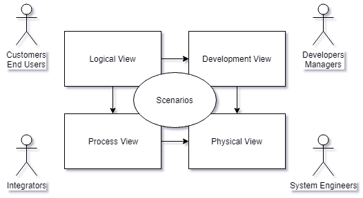
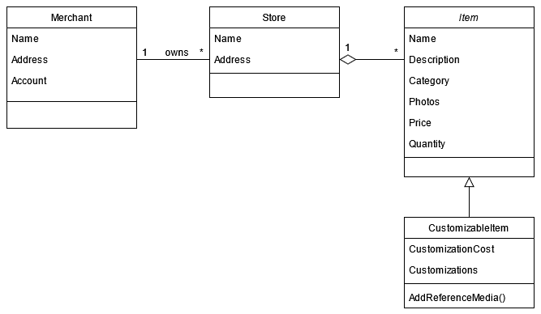
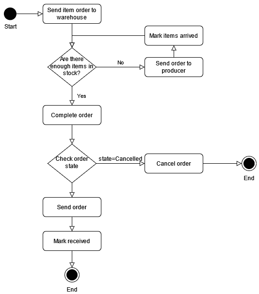
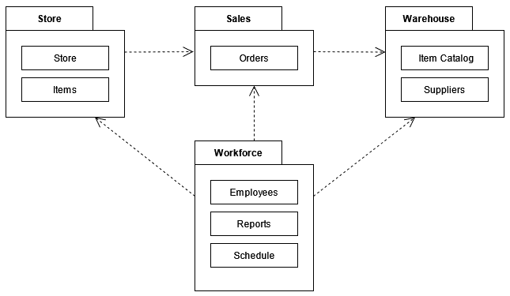
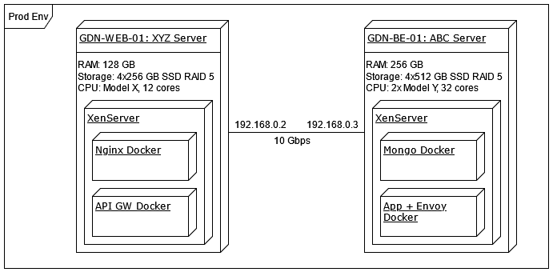
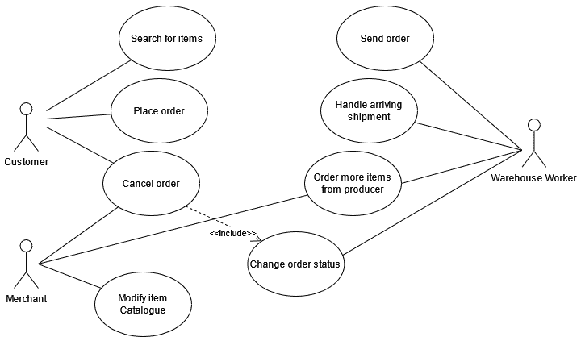
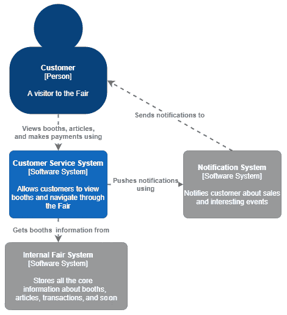
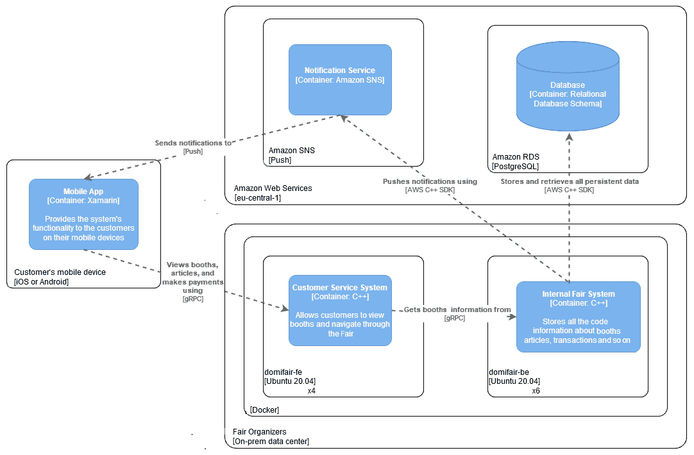
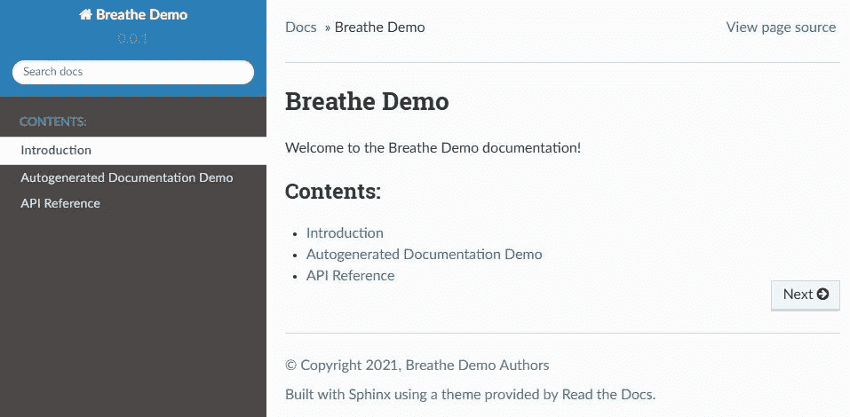
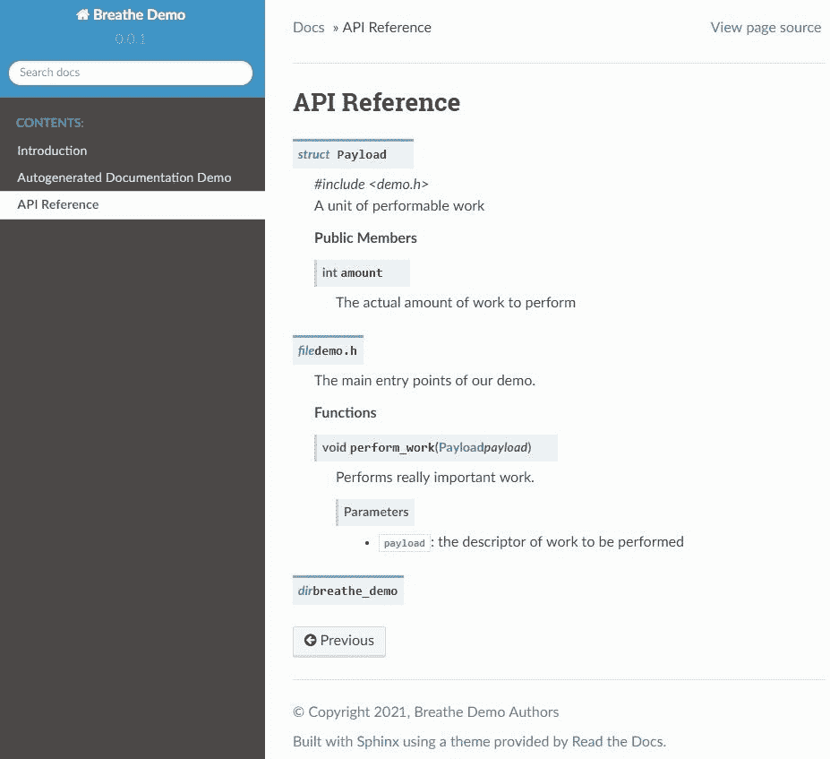

# 第三章：功能和非功能需求

作为架构师，重要的是要认识到哪些需求对架构有重要意义，以及为什么。本章将教你关于解决方案的各种需求——功能和非功能。功能需求告诉您您的解决方案应该做什么。另一方面，非功能需求告诉您您的解决方案应该如何*。*

在本章中，我们将涵盖以下主题：

+   理解需求的类型

+   识别具有架构重要性的需求

+   从各种来源收集需求

+   记录需求

+   记录架构

+   选择正确的视图来记录

+   生成文档

在本章结束时，您将学会如何识别和分类这两种类型的需求，并如何创建清晰描述它们的文档。

# 来自源的技术需求文档，您必须安装

要从源生成文档，必须安装 CMake、Doxygen、Sphinx、m2r2 和 Breathe。我们正在使用 ReadTheDocs Sphinx 主题，所以也请安装它。请随意使用提到的工具的最新版本。

您可以在[`github.com/PacktPublishing/Software-Architecture-with-Cpp/tree/master/Chapter03`](https://github.com/PacktPublishing/Software-Architecture-with-Cpp/tree/master/Chapter03)找到相关代码。

# 理解需求的类型

在创建软件系统时，您应该不断地问自己您正在做的是否是您的客户需要的。很多时候，他们甚至不知道哪个需求最能满足他们的需求。成功的架构师的角色是发现产品的需求，并确保它们得到满足。有三种不同类型的需求需要考虑：功能需求、质量属性和约束。让我们来看看每一种。

## 功能需求

第一组是功能需求。这些是定义您的系统应该做什么或应该提供什么功能的需求。

请记住，功能并不总是影响架构，因此您必须密切关注这些需求中哪些实际上会决定您的解决方案的外观。

通常，如果功能需求具有必须满足的某些特性，它可能会变得具有架构重要性。考虑一个为多米尼加展会的商家和游客设计的应用程序，这是一年一度的活动，包括音乐、各种艺术和商店，发生在格但斯克市。对它的一些功能需求的几个例子可能是以下内容：

+   *作为店主，我想要筛选包含特定产品的订单。*

+   *单击订阅按钮会将客户添加到所选商家的通知观察者列表中。*

这些要求中的第一个告诉我们，我们将需要一个用于跟踪订单和产品并具有搜索功能的组件。根据 UI 的具体外观和我们的应用程序的规模，我们可以只向我们的应用程序添加一个简单的页面，或者它可能需要诸如 Lucene 或 Elasticsearch 之类的功能。这意味着我们可能正在考虑一个对架构有影响的**架构上重要的需求**（**ASR**）。

第二个例子更加直接；现在我们知道我们需要一个用于订阅和发送通知的服务。这绝对是一个具有架构重要性的功能需求。现在让我们看一些**非功能需求**（**NFRs**），它们也可以是 ASRs。

顺便说一句，第一个要求实际上是以用户故事的形式给出的。用户故事是以以下格式给出的需求：“*作为<角色>，我可以/想要<能力>，以便<好处>*。”这是表达需求的常见方式，可以帮助利益相关者和开发人员找到共同点并更好地沟通。

## 非功能需求

非功能性需求不是关注你的系统应该具有什么功能，而是关注系统应该在多好的条件下执行这些功能。这一组主要包括两个子组：**质量属性**（**QAs**）和**约束**。

### 质量属性

**质量** **属性**（**QAs**）是你的解决方案的特征，如性能、可维护性和用户友好性。你的软件可能有数十个，甚至数百个不同的质量。在选择你的软件应该具有哪些质量时，试着只关注重要的质量，而不是列出你脑海中出现的所有质量。质量属性需求的例子包括以下内容：

+   系统在通常负载下对 99.9%的请求在 500 毫秒内做出响应（不要忘记指定通常负载是什么或将是什么）。

+   网站不会存储在支付过程中使用的客户信用卡数据（保密性的一个例子）。

+   在更新系统时，如果更新任何组件失败，系统将被回滚到更新之前的状态（生存能力）。

+   作为 Windows、macOS 和 Android 的用户，我希望能够从所有这些系统中使用系统（可移植性；尝试了解是否需要支持桌面、移动和/或网络等平台）。

虽然在积压中捕捉功能性需求非常简单，但我们不能说同样的话适用于质量属性需求。幸运的是，有几种方法可以解决这个问题：

+   其中一些可以在你的任务、故事和发布的**完成定义**或**验收标准**中表达。

+   其他可以直接表达为用户故事，如前面的最后一个例子所示。

+   你也可以在设计和代码审查中检查它们，并为其中一些创建自动化测试。

### 约束

约束是在交付项目时必须遵循的不可协商的决定。这些可以是设计决策、技术决策，甚至是政治（涉及人员或组织事务）的决定。另外两个常见的约束是**时间**和**预算**。约束的例子可能如下：

+   *团队的人数永远不会超过四名开发人员、一名质量保证工程师和一名系统管理员。*

+   *由于我们公司在所有当前产品中都使用 Oracle DB，新产品也必须使用它，这样我们就可以充分利用我们的专业知识。*

非功能性需求总是会影响你的架构。不要过度规定它们，因为出现*假阳性*将会是产品开发过程中的一个不断的负担。同样重要的是不要过度规定它们，因为这可能会在错过销售机会或未能遵守监管机构的要求时出现。

在下一节中，你将学会如何在这两个极端之间取得平衡，只关注那些在你的具体情况下真正重要的需求。

# 识别具有架构重要性的需求

在设计软件系统时，通常要处理数十个甚至数百个不同的需求。为了理解它们并提出一个好的设计，你需要知道哪些是重要的，哪些可以不考虑你的设计决策而实现，甚至可以被忽略。你应该学会如何识别最重要的需求，这样你就可以首先专注于它们，并在最短的时间内提供最大的价值。

你应该使用两个指标来优先考虑需求：业务价值和对架构的影响。那些在两个方面都很重要的需求是最重要的，应该优先处理。如果你提出了太多这样的需求，你应该重新审视你的优先考虑方案。如果这没有帮助，可能是系统根本无法实现。

ASR 是对系统架构产生可衡量影响的要求。它们可以是功能性的，也可以是非功能性的。你如何确定哪些才是真正重要的？如果某个特定要求的缺失会允许你创建不同的架构，那么你就在考虑一个 ASR。对这类要求的迟发现通常会花费你大量的时间和金钱，因为你需要重新设计系统的某些部分，甚至整个解决方案。你只能希望这不会给你的声誉和其他资源带来损失。

从架构工作的一开始就将具体技术应用于你的架构是一个常见的错误。我们强烈建议你首先收集所有的要求，专注于对架构重要的要求，然后再决定使用什么技术和技术栈来构建你的项目。

由于识别 ASR 如此重要，让我们谈谈一些可以帮助你的模式。

## 架构重要性的指标

如果你有要求与任何外部系统集成，这很可能会影响你的架构。让我们来看看一些常见的指标，表明一个要求是 ASR：

+   **需要创建一个软件组件来处理它**：例如发送电子邮件、推送通知、与公司的 SAP 服务器交换数据，或者使用特定的数据存储。

+   **对系统产生重大影响**：核心功能通常定义了你的系统应该是什么样子。诸如授权、可审计性或事务行为等横切关注点都是其他很好的例子。

+   **难以实现**：低延迟就是一个很好的例子：除非你在开发初期就考虑到它，否则要实现它可能是一场漫长的战斗，特别是当你突然意识到在热路径上不能承受垃圾回收时。

+   **在满足某些架构时强制进行权衡**：也许你的设计决策甚至需要在成本过高的情况下牺牲一些要求，以支持其他更重要的要求。将这类决策记录在某个地方，并注意到你正在处理 ASR 是一个很好的做法。如果任何要求限制了你或以任何方式限制了产品，那很可能对架构来说是重要的。如果你想在许多权衡中提出最佳架构，那么一定要阅读一下**架构权衡分析方法**（**ATAM**），你可以在*进一步阅读*部分的链接中找到相关内容。

约束和应用程序将运行的环境也可能会影响你的架构。嵌入式应用程序需要以不同的方式设计，以适应在云中运行的应用程序，而由经验不足的开发人员开发的应用程序可能应该使用简单且安全的框架，而不是使用学习曲线陡峭的框架或开发他们自己的框架。

## 识别 ASR 的障碍以及如何处理它们

与直觉相反，许多架构上重要的要求一开始很难发现。这是由两个因素造成的：它们很难定义，即使描述了，也可能模糊不清。你的客户可能还不清楚他们需要什么，但你仍然应该积极提出问题，以避免任何假设。如果你的系统要发送通知，你必须知道这些是实时的还是每天的电子邮件就足够了，因为前者可能需要你创建一个发布-订阅的架构。

在大多数情况下，你需要做一些假设，因为并非所有事情都能事先知道。如果你发现一个要求挑战了你的假设，那可能就是一个 ASR。如果你假设你可以在凌晨 3 点到 4 点之间维护你的服务，然后你意识到来自不同时区的客户仍然需要使用它，那就会挑战你的假设，很可能改变产品的架构。

此外，人们在项目的早期阶段，特别是经验较少或技术水平较低的人，往往倾向于模糊地对待质量属性。另一方面，这是解决这些 ASR 的最佳时机，因为在系统中实施它们的成本最低。

然而值得注意的是，许多人在指定需求时喜欢使用模糊的短语，而实际上并没有仔细考虑。如果您正在设计类似 Uber 的服务，一些例子可能是：*当接收到 DriverSearchRequest 时，系统必须快速回复 AvailableDrivers 消息*，或者*系统必须全天候可用*。

询问问题后，通常会发现 99.9%的月可用性是完全可以接受的，而*快速*实际上是几秒钟。这些短语总是需要澄清，了解背后的原因通常也是有价值的。也许这只是某人的主观看法，没有任何数据或业务需求支持。此外，请注意，在请求和响应的情况下，质量属性隐藏在另一个需求中，这使得更难以捕捉。

最后，对于一个系统而言，具有架构重要性的需求并不一定对另一个系统具有相同的重要性，即使这些系统提供类似的目的。一些需求会随着时间的推移变得更加重要，一旦系统增长并开始与越来越多的其他系统进行通信。其他需求可能在产品需求发生变化时变得重要。这就是为什么没有一种确定哪些需求将成为 ASR，哪些不会的银弹。

掌握了如何区分重要需求和其他需求的所有知识，您知道要寻找*什么*。现在让我们谈谈*在哪里*寻找。

# 从各种来源收集需求

现在您知道要关注哪些需求，让我们讨论一下收集这些需求的一些技术。

## 了解背景

在挖掘需求时，您应该考虑更广泛的背景。您必须确定未来可能对产品产生负面影响的潜在问题。这些风险通常来自外部。让我们重新审视我们类似 Uber 的服务场景。您的服务的一个例子风险可能是法律的潜在变化：您应该意识到一些国家可能会试图改变法律以将您从市场中移除。Uber 减轻这些风险的方式是与当地合作伙伴应对地区限制。

除了未来的风险之外，您还必须了解当前的问题，比如公司中缺乏主题专家，或市场上的激烈竞争。您可以做以下事情：

+   要注意并记录任何假设。最好有一个专门的文档来跟踪这些假设。

+   尽可能提出问题以澄清或排除您的假设。

+   您需要考虑项目内部的依赖关系，因为它们可能会影响开发进度。其他有用的领域是塑造公司日常行为的业务规则，因为您的产品可能需要遵守并可能增强这些规则。

+   此外，如果有足够的与用户或业务相关的数据，您应该尝试挖掘它以获取见解，并找到有用的模式，可以帮助做出关于未来产品及其架构的决策。如果您已经有一些用户，但无法挖掘数据，观察他们的行为通常也是有用的。

理想情况下，您可以在他们使用当前部署的系统执行日常任务时记录下来。这样，您不仅可以自动化他们工作的部分，还可以完全改变他们的工作流程为更高效的工作流程。然而，请记住，用户不喜欢改变他们的习惯，因此在可能的情况下逐渐引入变化更好。

## 了解现有文档

现有文件可以是信息的重要来源，尽管它们也可能存在问题。您应该至少留出一些时间来熟悉与您的工作相关的所有现有文件。很可能其中隐藏着一些需求。另一方面，要记住，文档永远不会完美；很可能会缺少一些重要信息。您还应该做好文档可能已过时的准备。在架构方面，从来没有一个真正的信息来源，因此除了阅读文档，您还应该与相关人员进行大量讨论。尽管如此，阅读文件可以是为此类讨论做好准备的好方法。

## 了解你的利益相关者

要成为成功的架构师，你必须学会与商业人士沟通，因为需求直接或间接来自他们。无论是来自你的公司还是客户，你都应该了解他们业务的背景。例如，你必须了解以下内容：

+   是什么推动业务？

+   公司有什么目标？

+   你的产品将帮助实现什么具体目标？

一旦你意识到这一点，与许多来自管理或高管的人建立共同基础，以及收集有关软件的更具体要求，将会更容易。例如，如果公司关心用户的隐私，它可以要求尽可能少地存储有关用户的数据，并使用仅存储在用户设备上的密钥进行加密。通常，如果这些要求来自公司文化，对一些员工来说，甚至表达这些要求都太明显了。了解业务背景可以帮助你提出适当的问题，并帮助公司回报。

话虽如此，请记住，您的利益相关者可能会有需求，这些需求不一定直接反映在公司的目标中。他们可能会有自己的功能提供或软件应该实现的指标的想法。也许一个经理承诺让他的员工有机会学习一种新技术或与特定技术一起工作。如果这个项目对他们的职业发展很重要，他们可能会成为强有力的盟友，甚至说服其他人支持你的决定。

另一个重要的利益相关者群体是负责部署您的软件的人。他们可能会提出自己的需求子组，称为过渡需求。这些需求的例子包括用户和数据库迁移、基础设施过渡或数据转换，因此不要忘记与他们联系以收集这些需求。

## 从利益相关者那里收集需求

在这一点上，你应该有一个利益相关者列表，包括他们的角色和联系信息。现在是时候利用它了：一定要抽出时间与每个利益相关者谈论他们对系统的需求以及他们对系统的设想。你可以进行面谈，如一对一会议或小组会议。与利益相关者交谈时，帮助他们做出明智的决定——展示他们的答案对最终产品的潜在影响。

利益相关者常常说他们所有的需求都同等重要。试着说服他们根据需求对他们的业务价值进行优先排序。当然，会有一些使命关键的需求，但很可能，如果一堆其他需求没有被交付，项目也不会失败，更不用说任何愿望清单上的附加需求了。

除了采访外，您还可以为他们组织研讨会，这可以像头脑风暴会议一样起作用。在这样的研讨会上，一旦建立了共同基础，每个人都知道他们为什么参与这样的冒险，您可以开始要求每个人尽可能多地提出使用场景。一旦这些场景确定下来，您可以开始整合相似的场景，然后应该对其进行优先排序，最后完善所有的故事。研讨会不仅仅是关于功能需求；每个使用场景也可以分配一个质量属性。在完善之后，所有的质量属性都应该是可衡量的。最后需要注意的是：您不需要将所有利益相关者都带到这样的活动中，因为它们有时可能需要超过一天的时间，这取决于系统的规模。

现在您知道如何使用各种技术和来源挖掘需求，让我们讨论如何将您的发现倾注到精心制作的文档中。

# 记录需求

一旦您完成了前面描述的步骤，就该将您收集到的所有需求整理并精炼到一个文档中了。文档的形式和管理方式并不重要。重要的是您有一个文档，让所有利益相关者对产品的要求和每个需求带来的价值有一个共同的认识。

需求由所有利益相关者产生和消耗，他们中的广泛一部分将需要阅读您的文档。这意味着您应该以一种能够为各种技术技能的人带来价值的方式来撰写它，从客户、销售人员和营销人员，到设计师和项目经理，再到软件架构师、开发人员和测试人员。

有时，准备文档的两个版本是有意义的，一个是针对项目业务方面的人员，另一个是更技术性的，针对开发团队。然而，通常，只需撰写一个文档，使每个人都能理解，其中包括用于涵盖更多技术细节的部分（有时是单独的段落）或整章。

现在让我们来看看您的需求文档可能包含哪些部分。

## 记录上下文

需求文档应该作为项目的一个入口点之一：它应该概述产品的目的，谁将使用它，以及如何使用它。在设计和开发之前，产品团队成员应该阅读它，以清楚地了解他们将实际工作的内容。

上下文部分应该提供系统的概述-为什么要构建它，它试图实现什么业务目标，以及它将提供什么关键功能。

您可以描述一些典型的用户角色，比如*CTO 约翰*，或者*司机安*，以便读者更有机会考虑系统的用户是实际的人类，并知道可以从他们那里期望什么。

*了解上下文*部分中描述的所有事情也应该作为上下文部分的一部分进行总结，有时甚至在文档中单独给出部分。上下文和范围部分应该提供大多数非项目利益相关者所需的所有信息。它们应该简洁而准确。

对于您可能想要研究并稍后决定的任何悬而未决的问题也是如此。对于您做出的每个决定，最好记录以下内容：

+   决策本身是什么

+   是谁做的，什么时候做的

+   背后的理由是什么

现在您知道如何记录项目的上下文，让我们学习如何正确描述其范围。

## 记录范围

这一部分应该定义项目的范围，以及超出范围的内容。您应该解释为什么以特定方式定义范围的理由，特别是在写关于不会被采纳的事情时。

这一部分还应该涵盖高级功能和非功能性要求，但详细信息应该放在文档的后续部分。如果您熟悉敏捷实践，只需在这里描述史诗和更大的用户故事。

如果您或您的利益相关者对范围有任何假设，您应该在这里提到。如果范围由于任何问题或风险而可能发生变化，您也应该写一些相关内容，同样适用于您不得不做出的任何权衡。

## 记录功能性要求

每个要求都应该是精确和可测试的。考虑这个例子："系统将为司机建立一个排名系统。"您会如何对其进行测试？最好为排名系统创建一个部分，并在那里指定精确的要求。

考虑另一个例子：如果有一名空闲司机靠近乘客，他们应该被通知即将到来的乘车请求。如果有多名可用司机呢？我们仍然可以描述为“靠近”的最大距离是多少呢？

这个要求既不精确，也缺乏业务逻辑的部分。我们只能希望没有空闲司机的情况已经被另一个要求覆盖了。

2009 年，劳斯莱斯开发了其**Easy Approach to Requirements Syntax**（**EARS**），以帮助应对这一问题。在 EARS 中，有五种基本类型的要求，它们应该以不同的方式编写并服务于不同的目的。它们可以后来组合成更复杂的要求。这些基本要求如下：

+   **普遍要求**："`$SYSTEM`应该`$REQUIREMENT`"，例如，应用程序将使用 C++开发。

+   **事件驱动**："当`$TRIGGER $OPTIONAL\_PRECONDITION`时，`$SYSTEM`应该`$REQUIREMENT`"，例如，"当订单到达时，网关将产生一个 NewOrderEvent。

+   **不需要的行为**："如果`$CONDITION`，那么`$SYSTEM`应该`$REQUIREMENT`"，例如，如果请求的处理时间超过 1 秒，工具将显示一个进度条。

+   **状态驱动**："当`$STATE`时，`$SYSTEM`应该`$REQUIREMENT`"，例如，当乘车进行时，应用程序将显示地图以帮助司机导航到目的地。

+   **可选功能**："在`$FEATURE`的情况下，`$SYSTEM`应该`$REQUIREMENT`"，例如，如果有空调，应用程序将允许用户通过移动应用程序设置温度。

一个更复杂的要求的例子是：在使用双服务器设置时，如果备份服务器在 5 秒内没有收到主服务器的消息，它应该尝试注册自己为新的主服务器。

您不需要使用 EARS，但如果您在处理模糊、含糊、过于复杂、不可测试、遗漏或者用词不当的要求时遇到困难，它可能会有所帮助。无论您选择哪种方式或措辞，都要确保使用基于常用语法并使用预定义关键字的简洁模型。为您列出的每个要求分配一个标识符也是一个好的做法，这样您就可以轻松地引用它们。

当涉及到更详细的要求格式时，它应该具有以下字段：

+   **ID 或索引**：方便识别特定要求。

+   **标题**：您可以在这里使用 EARS 模板。

+   **详细描述**：您可以在这里放置您认为相关的任何信息，例如用户故事。

+   **所有者**：这个要求是为谁服务的。可以是产品所有者、销售团队、法律部门、IT 等等。

+   **优先级**：相当不言自明。

+   **交付日期**：如果这个要求需要在任何关键日期之前完成，您可以在这里记录。

现在我们知道如何记录功能性要求，让我们讨论一下您应该如何记录非功能性要求。

## 记录非功能性要求

每个质量属性，比如性能或可扩展性，都应该在你的文档中有自己的部分，列出具体的、可测试的要求。大多数质量属性都是可衡量的，所以具体的度量标准可以在解决未来问题时起到很大作用。你也可以有一个关于项目约束的单独部分。

关于措辞，你可以使用相同的 EARS 模板来记录你的 NFRs。或者，你也可以使用在本章节中定义的角色来将它们指定为用户故事。

## 管理文档的版本历史

你可以采取以下两种方法之一：要么在文档内部创建一个版本日志，要么使用外部版本控制工具。两者都有各自的优缺点，但我们建议选择后者的方法。就像你为代码使用版本控制系统一样，你也可以用它来管理你的文档。我们并不是说你必须使用存储在 Git 仓库中的 Markdown 文档，但只要你也生成了一个**业务人员可读**的版本，比如网页或 PDF 文件，这也是一个完全有效的方法。或者，你也可以使用在线工具，比如 RedmineWikis，或 Confluence 页面，它们允许你在每次发布编辑时放置一个有意义的评论来描述所做的更改，并查看版本之间的差异。

如果你决定采用修订日志的方法，通常是一个包括以下字段的表格：

+   **修订**：标识引入变化的文档迭代的编号。如果你愿意，你也可以为特殊的修订添加标签，比如*第一稿*。

+   **更新者**：谁做出了更改。

+   **审查人**：谁审查了这个变化。

+   **更改描述**：这个修订的*提交消息*。它说明了发生了什么变化。

## 在敏捷项目中记录需求

许多敏捷的支持者会声称记录所有需求只是浪费时间，因为它们可能会发生变化。然而，一个好的方法是将它们类似地对待你的待办事项中的项目：在即将到来的冲刺中将会开发的项目应该比你希望以后实施的项目更详细地定义。就像在必要之前你不会将史诗故事拆分成故事和任务一样，你可以只粗略地描述、不那么细粒度地定义需求，直到你确定需要它们被实施。

注意是谁或什么是给定需求的来源，这样你就会知道谁可以为你提供未来完善它所需的输入。

让我们以我们的多米尼加集市为例。比如说在下一个冲刺中，我们将为访客构建商店页面，然后在下一个冲刺中，我们将添加一个订阅机制。我们的需求可能看起来像下面这样：

| **ID** | **优先级** | **描述** | **利益相关者** |
| --- | --- | --- | --- |
| DF-42 | P1 | 商店页面必须显示商店的库存，每件物品都有照片和价格。 | 乔什，瑞克 |
| DF-43 | P2 | 商店页面必须包含商店位置的地图。 | 乔什，坎迪斯 |
| DF-44 | P2 | 客户必须能够订阅商店。 | 史蒂文 |

正如你所看到的，前两项与我们接下来要做的功能有关，所以它们被描述得更详细。谁知道，也许在下一个冲刺之前，关于订阅的需求就会被取消，所以考虑每个细节就没有意义了。

另一方面，有些情况可能仍需要你列出完整的需求清单。如果你需要与外部监管机构或内部团队（如审计、法律或合规性）打交道，他们可能仍然需要你提供一份完整的书面文件。有时，只需向他们提供一份包含从你的待办事项中提取的工作项的文件就可以了。最好像对待其他利益相关者一样与这些利益相关者沟通：了解他们的期望，以了解满足他们需求的最低可行文档。

记录需求的重要之处在于你和提出具体需求的各方之间有一个共识。如何实现这一点？一旦你准备好了草稿，你应该向他们展示你的文档并收集反馈。这样，你就会知道哪些地方含糊不清、不清楚或遗漏了。即使需要几次迭代，这也将帮助你与利益相关者达成共识，从而更有信心地确保你正在构建正确的东西。

## 其他部分

在网站中设置一个链接和资源部分是个好主意，你可以在这里指向问题跟踪板、工件、持续集成、源代码库以及其他你觉得有用的东西。架构、营销和其他类型的文档也可以在这里列出。

如果需要，你也可以包括一个术语表。

现在你知道如何记录你的需求和相关信息了。现在让我们简要谈谈如何记录设计的系统。

# 记录架构

就像你应该记录你的需求一样，你也应该记录新兴的架构。这当然不仅仅是为了有文档：它应该帮助项目中的每个人更加高效，让他们更好地理解他们需要做什么以及最终产品需要什么。你制作的并不是所有图表都对每个人都有用，但你应该从未来读者的角度来创建它们。

有很多框架可以用来记录你的愿景，其中许多框架专门服务于特定领域、项目类型或架构范围。如果你有兴趣记录企业架构，比如说，你可能会对 TOGAF 感兴趣。这是“开放组织架构框架”的缩写。它依赖于四个领域，即以下内容：

+   业务架构（战略、组织、关键流程和治理）

+   数据架构（逻辑和物理数据管理）

+   应用架构（单个系统的蓝图）

+   技术架构（硬件、软件和网络基础设施）

如果你在整个公司范围内或者更广泛的范围内记录你的软件，这种分组是有用的。其他类似规模的框架包括英国国防部（MODAF）和美国国防部（DoDAF）开发的框架。

如果你不是在记录企业架构，尤其是如果你刚开始自己的架构自我发展之路，你可能会对其他框架更感兴趣，比如 4+1 和 C4 模型。

## 理解 4+1 模型

4+1 视图模型是由 Philippe Kruchten 于 1995 年创建的。作者当时声称它旨在“描述基于多个并发视图使用的软件密集型系统的架构”。它的名称来源于它包含的视图。

这个模型因为在市场上存在已久并且发挥了作用而广为人知。它非常适合大型项目，虽然也可以用于中小型项目，但对于它们的需求来说可能过于复杂（特别是如果它们是以敏捷方式编写的）。如果你的情况是这样，你应该尝试下一节中描述的 C4 模型。

4+1 模型的一个缺点是它使用了一组固定的视图，而实际上，对架构进行文档化的务实方法应该是根据项目的具体情况选择视图（稍后详述）。

另一方面，一个很好的优势是视图之间的链接，特别是在场景方面。同时，每个利益相关者都可以轻松地获得与他们相关的模型部分。这将引出模型的外观：



图 3.1 - 4+1 模型概述

前面图中的参与者是最感兴趣的各自视图。所有视图都可以用不同类型的**统一建模语言**（**UML**）图表来表示。现在让我们讨论每个视图：

+   **逻辑视图**显示如何向用户提供功能。它显示系统的组件（对象）以及它们之间的交互。通常，它由类和状态图组成。如果你有成千上万的类，或者只是想更好地展示它们之间的交互，你还应该有通信或序列图，它们都是我们下一个视图的一部分：



图 3.2 - 类图可用于显示我们计划拥有的类型及其关系

+   **过程视图**围绕系统的运行时行为展开。它显示进程、它们之间的通信以及与外部系统的交互。它由活动和交互图表示。该视图涉及许多 NFR，包括并发性、性能、可用性和可扩展性。



图 3.3 - 活动图是工作流程和流程的图形表示

+   **开发视图**用于将系统分解为子系统，并围绕软件组织展开。重用、工具约束、分层、模块化、打包、执行环境 - 该视图可以通过显示系统的构建块分解来表示它们。它通过使用组件和包图来实现：



图 3.4 - 包图可以从更高的角度显示系统的部分，以及特定组件之间的依赖或关系

+   **物理视图**用于使用部署图将软件映射到硬件。针对系统工程师，它可以涵盖与硬件相关的一部分 NFR，例如通信：



图 3.5 - 部署图展示每个软件组件将在哪些硬件上运行。它还可以用于传递有关网络的信息

+   **场景**将所有其他视图粘合在一起。通过用例图表示，这对所有利益相关者都有用。该视图显示系统是否按照应有的方式运行，并且是一致的。当所有其他视图完成时，场景视图可能会变得多余。然而，没有使用场景，其他视图就不可能存在。该视图从高层次显示系统，而其他视图则进入细节：



图 3.6 - 用例图显示特定参与者如何与系统交互以及这些交互之间的关系

这些视图中的每一个都与其他视图相互关联，通常它们必须共存以展示完整的画面。让我们考虑表达并发性。仅使用逻辑视图无法完成，因为将其映射到任务和流程更具表现力；我们需要过程视图。另一方面，流程将被映射到物理的、通常是分布式的节点。这意味着我们需要有效地在三个视图中记录它，每个视图对特定的利益相关者都是相关的。视图之间的其他连接包括以下内容：

+   逻辑视图和过程视图在分析和设计中用于概念化产品。

+   开发和部署结合描述了软件的打包以及每个软件包的部署时间。

+   逻辑和开发视图显示功能如何在源代码中反映出来。

+   流程和部署视图旨在共同描述非功能需求。

现在您已经熟悉了 4+1 模型，让我们讨论另一个简单但极其有效的模型：C4 模型。我们希望使用它会很有趣（双关语）。

## 理解 C4 模型

C4 模型非常适合中小型项目。它易于应用，因为它非常简单，不依赖于任何预定义的符号。如果您想要开始使用它进行图表绘制，可以尝试 Tobias Shochguertel 的 c4-draw.io 插件（[`github.com/tobiashochguertel/c4-draw.io`](https://github.com/tobiashochguertel/c4-draw.io)）用于免费在线绘图工具 draw.io（[`www.draw.io/`](https://www.draw.io/)）。

在 C4 模型中，有四种主要类型的图表，即以下：

+   上下文

+   容器

+   组件

+   代码

就像使用地图放大和缩小一样，您可以使用这四种类型来显示特定代码区域的更多细节，或者“缩小”以显示有关特定模块甚至整个系统的更多交互和周围环境的信息。

系统上下文是查看架构的绝佳起点，因为它显示了系统作为一个整体，周围是其用户和与之交互的其他系统。您可以在这里查看一个 C4 上下文图的示例：



图 3.7 - C4 上下文图

正如您所看到的，它显示了“大局”，因此不应该专注于特定的技术或协议。相反，将其视为一张图表，也可以展示给非技术利益相关者。仅仅通过看图，应该清楚地看到有一个参与者（客户的人形描述），他与我们解决方案的一个组件进行交互，即客户服务系统。另一方面，这个系统与另外两个系统进行交互，每个交互都有箭头描述。

我们描述的上下文图用于提供系统的概览，但没有太多细节。现在让我们逐个查看其他图表：

+   容器图：这个图表用于显示系统内部的概览。如果您的系统使用数据库、提供服务，或者只是由某些应用程序组成，这个图表会显示出来。它还可以显示容器的主要技术选择。请注意，容器并不意味着 Docker 容器；尽管每个容器都是一个可以单独运行和部署的单元，但这种图表类型并不涉及部署场景。容器视图是为技术人员准备的，但并不仅限于开发团队。架构师、运维和支持人员也是预期的受众。

+   组件图表：如果您想要了解特定容器的更多细节，那么组件图表就派上用场了。它显示了所选容器内部组件之间的交互，以及与容器外部的元素和参与者的交互。通过查看这个图表，您可以了解每个组件的责任以及它所使用的技术。组件图表的目标受众主要集中在特定容器周围，包括开发团队和架构师。

+   代码图表：最后我们来到了代码图表，当您放大到特定组件时，这些图表就会出现。这个视图主要由 UML 图表组成，包括类、实体关系等，理想情况下应该由独立工具和集成开发环境自动创建。您绝对不应该为系统中的每个组件制作这样的图表；相反，应该专注于为最重要的组件制作图表，以便它们真正告诉读者您想要传达的信息。这意味着在这样的图表中，少即是多，因此您应该省略代码图表中的不必要元素。在许多系统中，特别是较小的系统中，这类图表是被省略的。目标受众与组件图表的情况相同。

您可能会发现 C4 模型缺少一些特定的视图。例如，如果您想知道如何展示系统的部署，那么您可能会对除了主要图表之外的一些补充图表感兴趣。其中之一是部署图，您可以在下面看到。它展示了系统中的容器如何映射到基础设施中的节点。总的来说，这是 UML 部署图的一个简化版本：



图 3.8 - C4 部署图

谈到 C4 模型的 UML 图，您可能会想知道为什么它对呈现系统的用例付出如此少的努力。如果是这种情况，那么您应该考虑用 UML 的用例图或者考虑引入一些序列图来补充前面的模型。

在记录架构时，更重要的是您记录了什么知识和分享了什么，而不是遵循特定的硬性规则。选择最适合您需求的工具。

## 在敏捷项目中记录架构

在敏捷环境中，您记录架构的方法应该与记录需求的方法类似。首先，考虑谁将阅读您准备的材料，以确保您以正确的方式描述了正确的事物。您的文档不需要是冗长的 Word 文档。您可以使用演示文稿、维基页面、单个图表，甚至是会议记录，当有人描述架构时。

重要的是收集有关记录架构的反馈。同样，与记录需求一样，与利益相关者重复文档是重要的，以了解在哪里改进它们。即使这看起来可能会浪费时间，但如果做得当，它应该能节省您一些交付产品的时间。足够好的文档应该帮助新手更快地开始工作，并引导更熟悉的利益相关者走下去。如果您只是在一些会议上讨论架构，很可能在一个季度后，没有人会记得您为什么做出这些决定，以及它们是否在不断变化的敏捷环境中仍然有效。

在创建文档时，重复是重要的，因为很可能会有一些重要细节的误解。其他时候，您或您的利益相关者会获得更多知识并决定改变事物。在文档被认为成熟和完成之前，准备至少多次审查文档。通常，通过即时通讯、电话或面对面的几次对话将帮助您更快地完成，并解决可能出现的任何后续问题，因此更倾向于这些方式而不是电子邮件或其他异步的沟通方式。

# 选择正确的视图来记录

架构是一个太复杂的主题，无法用一个大图来描述。想象一下您是一栋建筑的建筑师。为了设计整个建筑，您需要为不同方面制作单独的图表：一个用于管道，另一个用于电力和其他电缆，依此类推。这些图表中的每一个都会展示项目的不同视图。软件架构也是如此：您需要从不同的角度呈现软件，以满足不同的利益相关者。

此外，如果您正在建造一个智能房屋，很可能会绘制一些设备放置的计划。尽管并非所有项目都需要这样的视图，但由于它在您的项目中起着作用，可能值得添加。对于架构也是同样的方法：如果您发现不同的视图对文档有价值，那么您应该这样做。那么，您如何知道哪些视图可能有价值呢？您可以尝试执行以下步骤：

1.  从 4+1 模型或 C4 模型开始选择视图。

1.  询问您的利益相关者对他们来说什么是必要的，并考虑修改您的视图集。

1.  选择能帮助您评估架构是否达到其目标并且所有 ASR 是否满足的视图。阅读下一节中每个视图的第一段，以检查它们是否符合您的需求。

如果您仍然不确定要记录哪些视图，以下是一些提示：

尽量只选择最重要的视图，因为如果太多，架构将变得难以跟踪。一个好的视图集不仅应该展示架构，还应该暴露项目的技术风险。

在选择要在文档中描述的视图时，有一些事情您应该考虑。我们将在这里简要描述它们，但如果您感兴趣，可以查看*罗赞斯基和伍兹*在*进一步阅读*部分提到的书籍。

## 功能视图

如果您的软件是作为更大系统的一部分开发的，特别是与不经常交流的团队，您应该包括一个功能视图（如 4+1 模型）。

文档化架构的一个重要且经常被忽视的方面是定义您提供的接口，尽管这是描述的最重要的事情之一。无论是两个组件之间的接口还是外部世界的入口点，您都应该花时间清楚地记录它，描述对象和调用的语义，以及使用示例（有时可以重复使用为测试）。

在文档中包括功能视图的另一个重要好处是澄清系统各组件之间的责任。开发系统的每个团队都应该了解边界在哪里，以及谁负责开发哪些功能。所有需求都应明确映射到组件，以消除差距和重复工作。

这里需要注意的一点是避免过度加载功能视图。如果变得混乱，没有人会想要阅读它。如果您开始在其中描述基础设施，请考虑添加部署视图。如果您的模型中出现了“上帝对象”，请尝试重新思考设计并将其拆分为更小、更具凝聚力的部分。

关于功能视图的最后一个重要说明是，尽量保持每个包含的图表在一个抽象级别上。另一方面，不要选择过于抽象的级别使其变得太模糊；确保每个元素都得到了相关方的明确定义和理解。

## 信息视图

如果您的系统在信息、处理流程、管理流程或存储方面有非直接的需求，也许包括这种视图是个好主意。

选择最重要的、数据丰富的实体，并展示它们如何在系统中流动，谁拥有它们，生产者和消费者是谁。标记某些数据保持“新鲜”的时间以及何时可以安全丢弃，预期到达系统某些点的延迟是多少，或者在分布式环境中如何处理标识符可能会有用。如果您的系统管理交易，这个过程以及任何回滚也应该清晰地展示给利益相关者。转换、发送和持久化数据的技术对其中一些人也可能很重要。如果您在金融领域工作或者必须处理个人数据，您很可能必须遵守一些法规，因此描述您的系统计划如何应对这些是很重要的。

您的数据结构可以使用 UML 类模型进行图表化。请记住要清楚地描述您的数据格式，特别是如果它在两个不同的系统之间流动。美国宇航局与洛克希德·马丁合作开发的火星气候轨道飞行器价值 1.25 亿美元的失误，就是因为他们无意中使用了不同的单位，因此要注意系统之间的数据不一致性。

您的数据处理流程可以使用 UML 的活动模型，并且可以使用状态图来展示信息的生命周期。

## 并发视图

如果运行许多并发执行单元是产品的一个重要方面，请考虑添加并发视图。它可以显示您可能遇到的问题和瓶颈（除非听起来太详细）。包括它的其他好理由是依赖进程间通信，具有非直观的任务结构，并发状态管理，同步或任务失败处理逻辑。

对于这个视图，您可以使用任何您想要的符号，只要它能捕捉到执行单元及其通信。如果需要，为您的进程和线程分配优先级，然后分析任何潜在的问题，比如死锁或争用。您可以使用状态图来显示重要执行单元的可能状态及其转换（等待查询、执行查询、分发结果等）。

如果您不确定是否需要向系统引入并发，一个好的经验法则是*不要*。如果必须引入，并且力求简单的设计。调试并发问题从来都不容易，而且总是很耗时，所以如果可能的话，尝试优化您现有的东西，而不是仅仅向问题投入更多的线程。

如果通过查看您的图表，您担心资源争用，请尝试用更多、但更细粒度的锁替换大对象上的锁，使用轻量级同步（有时原子操作就足够了），引入乐观锁定，或减少共享的内容（在线程中创建一份数据的额外副本并处理它可能比共享对唯一副本的访问更快）。

## 开发视图

如果您正在构建一个具有许多模块的大型系统，并且需要结构化您的代码，具有系统范围的设计约束，或者如果您希望在系统的各个部分之间共享一些共同的方面，那么从开发的角度呈现解决方案应该对您有益，以及软件开发人员和测试人员。

开发视图的包图可以很方便地显示系统中不同模块的位置，它们的依赖关系以及其他相关模块（例如，位于相同的软件层）。它不需要是 UML 图表 - 即使是方框和线条也可以。如果您计划将一个模块替换掉，这种类型的图表可以显示哪些其他软件包可能会受到影响。

增加系统中重用的策略，例如为组件创建自己的运行时框架，或者增加系统的一致性的策略，例如对认证、日志记录、国际化或其他类型的处理采用共同的方法，都属于开发视图的一部分。如果您发现系统中有共同的部分，请确保所有开发人员也能看到它们。

代码组织、构建和配置管理的常见方法也应该包括在文档的这一部分。如果所有这些听起来都需要大量文档记录，那么重点关注最重要的部分，如果可能的话，简要涵盖其余部分。

## 部署和运行视图

如果您有一个非标准或复杂的部署环境，例如硬件、第三方软件或网络需求方面的特定需求，请考虑在一个单独的部署部分中记录它，针对系统管理员、开发人员和测试人员。

如果必要，涵盖以下内容：

+   所需的内存量

+   CPU 线程数（是否启用超线程）

+   关于 NUMA 节点的固定和亲和性

+   专业的网络设备要求，例如标记数据包以以黑盒方式测量延迟和吞吐量的交换机

+   网络拓扑

+   所需的估计带宽

+   应用程序的存储需求

+   您计划使用的任何第三方软件

一旦您有了需求，您可以将它们映射到特定的硬件，并将其放入运行时平台模型中。如果您需要正式建模，可以使用 UML 部署图与构造型。这应该显示您的处理节点和客户节点、在线和离线存储、网络链接、专用硬件（如防火墙或 FPGA 或 ASIC 设备）以及功能元素与它们将在其上运行的节点之间的映射。

如果您有非直接的网络需求，可以添加另一个图表，显示网络节点和它们之间的连接。

如果您依赖于特定的技术（包括特定版本的软件），列出它们是个好主意，以查看您使用的软件之间是否存在兼容性问题。有时，两个第三方组件将需要相同的依赖项，但是版本不同。

如果您在脑海中有一个特定的安装和升级计划，写几句话可能是个好主意。诸如 A/B 测试、蓝绿部署或者您的解决方案将依赖的任何特定容器技术都应该对所有相关人员清晰可见。如果需要，还应该包括数据迁移计划，包括迁移可能需要多长时间以及何时可以安排迁移。

任何配置管理、性能监控、运行监控和控制以及备份策略的计划都值得描述。您可能希望创建几个组，识别每个组的依赖关系，并为每个组定义方法。如果您能想到可能发生的任何错误，应该有一个检测和恢复计划。

一些支持团队的注意事项也可以放在这一部分：哪些利益相关者组需要支持，您计划拥有哪些类别的事件，如何升级，以及每个支持级别将负责什么。

最好尽早与运营人员进行沟通，并为他们专门创建图表，以保持他们的参与。

现在我们已经讨论了如何手动创建关于您的系统及其需求的文档，让我们转而以自动化的方式记录您的 API。

# 生成文档

作为工程师，我们不喜欢手工劳动。这就是为什么，如果某些事情可以自动化并节省我们的工作，它很可能会被实现。在努力创建足够好的文档的过程中，至少部分工作可以自动化，这实际上可能是一种幸福。

## 生成需求文档

如果您从零开始创建一个项目，很难凭空生成文档。然而，有时候，如果您只有适当的工具和需求，生成文档是可能的。例如，如果您使用 JIRA，一个起点就是从问题导航器视图中导出所有项目。您可以使用任何您喜欢的过滤器，并为这些项目获取打印输出。如果您不喜欢默认的字段集，或者觉得这不是您要找的东西，您可以尝试使用 JIRA 的需求管理插件之一。它们不仅允许您导出需求，例如**R4J**（**Jira 的需求**）还允许您创建整个需求层次结构，跟踪它们，管理变更并将其传播到整个项目中，执行任何需求变更的影响分析，当然，还可以使用用户定义的模板进行导出。许多这样的工具还可以帮助您创建与您的需求相关的测试套件，但我们看到的没有一个是免费的。

## 从代码生成图表

如果您想了解代码结构，但又不想深入研究源代码，您可能会对从代码生成图表的工具感兴趣。

其中一个工具是 CppDepend。它使你能够在源代码的不同部分之间创建各种依赖关系图。更重要的是，它允许你根据各种参数查询和过滤代码。无论你是想了解代码的结构，发现不同软件组件之间的依赖关系以及它们之间的紧密程度，还是想快速定位具有最多技术债务的部分，你可能会对这个工具感兴趣。它是专有的，但提供了一个完全功能的试用版。

一些绘图工具允许你从类图中创建代码，并从代码中创建类图。Enterprise Architect 可以让你从类和接口图生成多种语言的代码。C++就是其中之一，并允许直接从源代码生成 UML 类图。另一个可以做到这一点的工具是 Visual Paradigm。

## 从代码生成（API）文档

为了帮助其他人浏览你现有的代码并使用你提供的 API，一个好主意是提供从代码注释中生成的文档。没有比将这样的文档放在描述函数和数据类型的旁边更好的地方了，这在保持它们同步方面有很大帮助。

用于编写这种文档的事实上的标准工具是 Doxygen。它的优点是它很快（特别是对于大型项目和 HTML 文档生成），生成器具有一些内置的正确性检查（例如对函数中部分记录的参数的检查 - 这是检查文档是否仍然是最新的一个好标记），并允许导航类和文件层次结构。它的缺点包括不能进行全文搜索，PDF 生成不够理想，以及一些人可能觉得繁琐的界面。

幸运的是，这些可用性缺陷可以通过使用另一个流行的文档工具来补救。如果你曾经阅读过任何 Python 文档，你可能会遇到 Sphinx。它具有清新的界面和可用性，并使用 reStructuredText 作为标记语言。好消息是这两者之间有一个桥梁，所以你可以使用 Doxygen 生成的 XML 在 Sphinx 中使用。这个桥接软件叫做 Breathe。

现在让我们看看如何在你的项目中设置它。假设我们将源代码保存在`src`中，公共头文件保存在`include`中，文档保存在`doc`中。首先，让我们创建一个`CMakeLists.txt`文件：

```cpp
cmake_minimum_required(VERSION 3.10)

project("Breathe Demo" VERSION 0.0.1 LANGUAGES CXX)

list(APPEND CMAKE_MODULE_PATH "${CMAKE_CURRENT_LIST_DIR}/cmake")
add_subdirectory(src)
add_subdirectory(doc)
```

我们已经对我们的项目支持的 CMake 版本设置了要求，指定了它的名称、版本和使用的语言（在我们的情况下，只是 C++），并将`cmake`目录添加到 CMake 查找其包含文件的路径下。

在`cmake`子目录中，我们将创建一个名为`FindSphinx.cmake`的文件，我们将按照名称使用它，因为 Sphinx 并没有提供这样的文件：

```cpp
find_program(
  SPHINX_EXECUTABLE
  NAMES sphinx-build
  DOC "Path to sphinx-build executable")

# handle REQUIRED and QUIET arguments, set SPHINX_FOUND variable
include(FindPackageHandleStandardArgs)
find_package_handle_standard_args(
  Sphinx "Unable to locate sphinx-build executable" SPHINX_EXECUTABLE)
```

现在，CMake 将寻找我们的 Sphinx 构建工具，如果找到，将设置适当的 CMake 变量来标记 Sphinx 包已找到。接下来，让我们创建我们的源代码来生成文档。让我们有一个`include/breathe_demo/demo.h`文件：

```cpp
#pragma once

// the @file annotation is needed for Doxygen to document the free
// functions in this file
/**
 * @file
 * @brief The main entry points of our demo
 */

/**
 * A unit of performable work
 */
struct Payload {
  /**
   * The actual amount of work to perform
   */
  int amount;
};

/**
   @brief Performs really important work
   @param payload the descriptor of work to be performed
 */
void perform_work(struct Payload payload);
```

注意注释语法。Doxygen 在解析我们的头文件时会识别它，以便知道在生成的文档中放入什么。

现在，让我们为我们的头文件添加一个相应的`src/demo.cpp`实现：

```cpp
#include "breathe_demo/demo.h"

#include <chrono>
#include <thread>

void perform_work(Payload payload) {
  std::this_thread::sleep_for(std::chrono::seconds(payload.amount));
}
```

这里没有 Doxygen 注释。我们更喜欢在头文件中记录我们的类型和函数，因为它们是我们库的接口。源文件只是实现，它们对接口没有任何新的东西。

除了前面的文件，我们还需要在`src`中添加一个简单的`CMakeLists.txt`文件：

```cpp
add_library(BreatheDemo demo.cpp)
target_include_directories(BreatheDemo PUBLIC   
  ${PROJECT_SOURCE_DIR}/include)
target_compile_features(BreatheDemo PUBLIC cxx_std_11)
```

在这里，我们为我们的目标指定了源文件，为它指定了头文件目录，并指定了编译所需的 C++标准。

现在，让我们转到`doc`文件夹，这里是魔法发生的地方；首先是它的`CMakeLists.txt`文件，从检查是否有 Doxygen 可用并在这种情况下省略生成开始：

```cpp
find_package(Doxygen)
if (NOT DOXYGEN_FOUND)
  return()
endif()
```

如果 Doxygen 没有安装，我们将跳过文档生成。还要注意`return()`调用，它将退出当前的 CMake 列表文件，这是一个不太广为人知，但仍然有用的技巧。

接下来，假设找到了 Doxygen，我们需要设置一些变量来引导生成。我们只想要 Breathe 的 XML 输出，所以让我们设置以下变量：

```cpp
set(DOXYGEN_GENERATE_HTML NO)
set(DOXYGEN_GENERATE_XML YES)
```

为了强制使用相对路径，使用`set(DOXYGEN_STRIP_FROM_PATH ${PROJECT_SOURCE_DIR}/include)`。如果你有任何要隐藏的实现细节，你可以使用`set(DOXYGEN_EXCLUDE_PATTERNS "*/detail/*")`。好了，既然所有变量都设置好了，现在让我们生成：

```cpp
# Note: Use doxygen_add_docs(doxygen-doc ALL ...) if you want your 
# documentation to be created by default each time you build. Without the # keyword you need to explicitly invoke building of the 'doc' target.
doxygen_add_docs(doxygen-doc ${PROJECT_SOURCE_DIR}/include COMMENT
                 "Generating API documentation with Doxygen")
```

在这里，我们调用了一个专门用于使用 Doxygen 的 CMake 函数。我们定义了一个目标，`doxygen-doc`，我们需要明确调用它以根据需要生成我们的文档，就像注释中所说的那样。

现在我们需要创建一个 Breathe 目标来消耗我们从 Doxygen 得到的东西。我们可以使用我们的`FindSphinx`模块来实现这一点：

```cpp
find_package(Sphinx REQUIRED)
configure_file(${CMAKE_CURRENT_SOURCE_DIR}/conf.py.in
               ${CMAKE_CURRENT_BINARY_DIR}/conf.py @ONLY)
add_custom_target(
  sphinx-doc ALL
  COMMAND ${SPHINX_EXECUTABLE} -b html -c ${CMAKE_CURRENT_BINARY_DIR}
          ${CMAKE_CURRENT_SOURCE_DIR} ${CMAKE_CURRENT_BINARY_DIR}
  WORKING_DIRECTORY ${CMAKE_CURRENT_BINARY_DIR}
  COMMENT "Generating API documentation with Sphinx"
  VERBATIM)
```

首先，我们调用我们的模块。然后，我们用我们项目的变量填写一个 Python 配置文件，供 Sphinx 使用。我们创建一个`sphinx-doc`目标，它将生成 HTML 文件作为其输出，并在构建输出时打印一行。

最后，让我们强制 CMake 在每次生成 Sphinx 文档时调用 Doxygen：`add_dependencies(sphinx-doc doxygen-doc)`。

如果你希望有更多的文档目标，引入一些 CMake 函数来处理与文档相关的目标可能会很有用。

现在让我们看看我们的`conf.py.in`文件中有什么，用于引导我们的猫工具。让我们创建它，并让它指向 Sphinx 到 Breathe：

```cpp
extensions = [ "breathe", "m2r2" ]
breathe_projects = { "BreatheDemo": "@CMAKE_CURRENT_BINARY_DIR@/xml" }
breathe_default_project = "BreatheDemo"

project = "Breathe Demo"
author = "Breathe Demo Authors"
copyright = "2021, Breathe Demo Authors"
version = "@PROJECT_VERSION@"
release = "@PROJECT_VERSION@

html_theme = 'sphinx_rtd_theme'
```

正如前面的列表所示，我们设置了 Sphinx 要使用的扩展名，文档化项目的名称以及其他一些相关变量。注意`@NOTATION@`，它被 CMake 用来用适当的 CMake 变量的值填充输出文件。最后，我们告诉 Sphinx 使用我们的 ReadTheDocs 主题（`sphinx_rtd_theme`）。

拼图的最后一块是 reStructuredText 文件，它们定义了文档中包含什么。首先，让我们创建一个`index.rst`文件，其中包含目录和一些链接：

```cpp
Breathe Demo
============

Welcome to the Breathe Demo documentation!

.. toctree::
 :maxdepth: 2
 :caption: Contents:

Introduction <self>
 readme
 api_reference
```

第一个链接指向这个页面，所以我们可以从其他页面返回到它。我们将显示`Introduction`作为标签。其他名称指向具有`.rst`扩展名的其他文件。由于我们包含了 M2R2 Sphinx 扩展，我们可以在文档中包含我们的`README.md`文件，这可以节省一些重复。`readme.rst`文件的内容只是`.. mdinclude:: ../README.md`。现在是最后一部分：合并 Doxygen 的输出。这是在`api_reference.rst`文件中使用以下命令完成的：

```cpp
API Reference
=============

.. doxygenindex::

```

因此，我们只是按照自己的喜好命名了参考页面，并指定了 Doxygen 生成的文档应该在这里列出，就是这样！只需构建`sphinx-doc`目标，你就会得到一个看起来像这样的页面：



图 3.9 - 我们文档的主页，整合了生成的部分和手动编写的部分

当我们查看 API 文档页面时，它应该是这样的：



图 3.10 - 自动生成的 API 文档

正如你所看到的，文档已经自动生成了我们的`Payload`类型及其每个成员，以及自由的`perform_work`函数，包括每个参数，并根据定义它们的文件进行了分组。整洁！

# 摘要

在这一章中，您了解了有关需求和文档的所有基本知识。您学会了如何成功收集需求以及如何识别最重要的需求。您现在可以准备精简而有用的文档，以一种面向视图的方式只展示重要内容。您能够区分不同类型和风格的图表，并使用最适合您需求的那种。最后，但同样重要的是，您现在能够自动生成美观的文档。

在下一章中，您将了解有用的架构设计模式，这将帮助您满足系统的需求。我们将讨论各种模式以及如何应用它们来提供许多重要的质量属性，无论是在分布式系统中的单个组件规模上。

# 问题

1.  什么是质量属性？

1.  在收集需求时应使用哪些来源？

1.  您如何判断一个需求是否具有架构上的重要性？

1.  开发视图文档在什么时候有用？

1.  您如何自动检查您的代码的 API 文档是否过时？

1.  您如何在图表上指示给定的过程是由系统的不同组件处理的？

# 进一步阅读

1.  *使用 ATAM 评估软件架构*，JC Olamendy，博客文章：[`johnolamendy.wordpress.com/2011/08/12/evaluate-the-software-architecture-using-atam/`](https://johnolamendy.wordpress.com/2011/08/12/evaluate-the-software-architecture-using-atam/)

1.  **EARS**：*需求语法的简易方法*，John Terzakis，英特尔公司，来自 ICCGI 会议的会议演讲：[`www.iaria.org/conferences2013/filesICCGI13/ICCGI_2013_Tutorial_Terzakis.pdf`](https://www.iaria.org/conferences2013/filesICCGI13/ICCGI_2013_Tutorial_Terzakis.pdf)

1.  Eoin Woods 和 Nick Rozanski，*软件系统架构：使用观点和透视与利益相关者合作*
