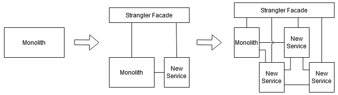
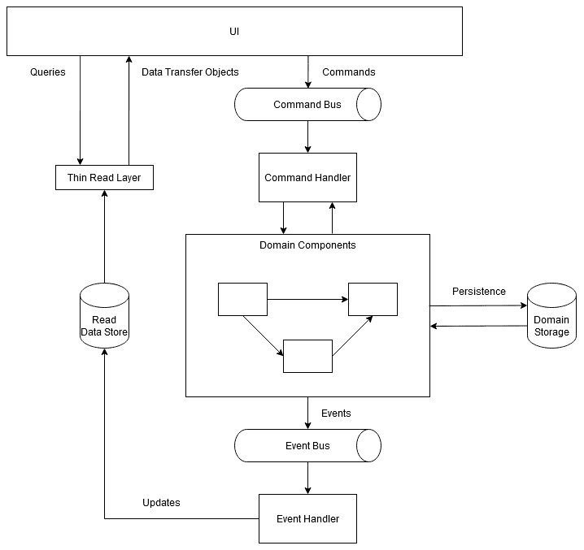

# 第四章：架构和系统设计

模式帮助我们处理复杂性。在单个软件组件的级别上，您可以使用软件模式，例如由该书的四位作者描述的模式（更为人所知的是*四人帮*）*设计模式：可重用面向对象软件的元素*。当我们向上移动并开始查看不同组件之间的架构时，知道何时以及如何应用架构模式可以大有裨益。

有无数这样的模式适用于不同的场景。实际上，要了解所有这些模式，您需要阅读不止一本书。话虽如此，我们为本书选择了几种模式，适用于实现各种架构目标。

在本章中，我们将向您介绍与架构设计相关的一些概念和谬论；我们将展示何时使用上述模式以及如何设计易于部署的高质量组件。

本章将涵盖以下主题：

+   不同的服务模型以及何时使用它们

+   如何避免分布式计算的谬论

+   CAP 定理的结果以及如何实现最终一致性

+   使您的系统具有容错性和可用性

+   集成您的系统

+   实现规模的性能

+   部署您的系统

+   管理您的 API

通过本章结束时，您将了解如何设计您的架构以提供几个重要的特性，例如容错性、可伸缩性和可部署性。在那之前，让我们首先了解分布式架构的两个固有方面。

# 技术要求

本章的代码需要以下工具来构建和运行：

+   Docker

+   Docker Compose

本章的源代码片段可以在[`github.com/PacktPublishing/Software-Architecture-with-Cpp/tree/master/Chapter04`](https://github.com/PacktPublishing/Software-Architecture-with-Cpp/tree/master/Chapter04)找到。

# 了解分布式系统的特殊性

有许多不同类型的软件系统，每种系统都适用于不同的场景，为不同的需求构建，并使用不同的假设集。编写和部署经典的独立桌面应用程序与编写和部署需要通过网络与许多其他应用程序通信的微服务完全不同。

在本节中，我们将介绍您可以用来部署软件的各种模型，人们在创建分布式系统时应避免的常见错误，以及人们需要做出的一些妥协，以成功创建这样的系统。

## 不同的服务模型以及何时使用它们

让我们首先从服务模型开始。在设计一个更大的系统时，您需要决定您将管理多少基础设施，而不是您可以建立在现有构建块之上。有时，您可能希望利用现有软件，而无需手动部署应用程序或备份数据，例如，通过其 API 使用 Google Drive 作为应用程序的存储。其他时候，您可以依赖于现有的云平台，例如 Google 的 App Engine，以部署您的解决方案，而无需担心提供语言运行时或数据库。如果您可以决定以自己的方式部署所有内容，您可以利用云提供商的基础设施，或者使用您公司的基础设施。

让我们讨论不同的模型以及每种模型在哪里可以有用。

### 本地模型

经典的方式，也是在云之前唯一可用的方式，就是在自己的场地部署一切。您需要购买所有所需的硬件和软件，并确保它能够满足您的需求。如果您在一家初创公司工作，这可能是一个很大的前期成本。随着用户群的增长，您需要购买和设置更多的资源，以便您的服务甚至可以处理偶尔的负载峰值。所有这些意味着您需要预测解决方案的增长并积极行动，因为没有办法根据当前负载自动扩展。

即使在云时代，本地部署仍然是有用的，并且经常在实际中发现。有时您处理的数据不应该，甚至不能离开公司的场地，要么是由于数据隐私问题，要么是合规问题。其他时候，您需要尽可能少的延迟，并且您需要自己的数据中心来实现。有时您可能会计算成本并决定在您的情况下，本地部署将比云解决方案更便宜。最后，但同样重要的是，您的公司可能已经拥有现有的数据中心，您可以使用。

在本地部署并不意味着您需要拥有一个单体系统。通常，公司在本地部署自己的私有云。这有助于通过更好地利用可用基础设施来降低成本。您还可以将私有云解决方案与其他服务模型相结合，这在您需要不时的额外容量时可能很有用。这被称为混合部署，并且所有主要的云提供商都提供了这种服务，同时 OpenStack 的 Omni 项目也提供了这种服务。

### 基础设施即服务（IaaS）模型

说到其他模型，最基本的云服务模型被称为基础设施即服务（IaaS）。它也与本地部署最相似：你可以将 IaaS 看作是虚拟数据中心的一种方式。正如其名称所示，云提供商为您提供了他们托管的基础设施的一部分，其中包括三种类型的资源：

+   计算，例如虚拟机、容器或裸金属机器（不包括操作系统）

+   网络，除了网络本身外，还包括 DNS 服务器、路由和防火墙

+   存储，包括备份和恢复功能

您仍然需要提供所有软件：操作系统、中间件和您的应用程序。

IaaS 可用于从托管网站（可能比传统的网站托管更便宜）到存储（例如，亚马逊的 S3 和 Glacier 服务），再到高性能计算和大数据分析（需要大量计算能力）的场景。一些公司使用它来快速建立和清除测试和开发环境。

使用 IaaS 而不是本地基础设施可以是测试新想法的廉价方式，同时节省配置所需的时间。

如果您的服务观察到使用量的增加，例如在周末，您可能希望利用云的自动扩展能力：在需要时扩展，稍后缩小规模以节省资金。

所有流行的云服务提供商都提供 IaaS 解决方案。

一个类似的概念，有时被认为是 IaaS 的子集，是容器即服务（CaaS）。在 CaaS 中，服务不是提供裸金属系统和虚拟机，而是提供容器和编排功能，您可以使用它们构建自己的容器集群。CaaS 的服务可以在谷歌云平台和 AWS 等地方找到。

### 平台即服务（PaaS）模型

如果基础设施本身不足以满足您的需求，您可以使用平台即服务（PaaS）模型。在这种模型中，云服务提供商不仅管理基础设施（就像在 IaaS 中一样），还管理操作系统、任何所需的中间件和运行时 - 您将在其上部署软件的平台。

通常，PaaS 解决方案将为您提供应用程序版本控制功能、服务监控和发现、数据库管理、业务智能，甚至开发工具。

使用 PaaS，您可以在整个开发流程中得到覆盖：从构建和测试到部署、更新和管理您的服务。然而，PaaS 解决方案比 IaaS 提供的更昂贵。另一方面，由于整个平台已经提供，您可以削减成本和时间来开发软件的部分，并且可以轻松为遍布全球的开发团队提供相同的设置。

所有主要的云提供商都有自己的产品，例如 Google App Engine 或 Azure App Service。还有一些独立的产品，比如 Heroku。

除了更通用的 PaaS 之外，还有**通信平台即服务**（CPaaS），其中您将获得整个通信后端，包括音频和视频，您可以将其集成到您的解决方案中。这项技术使您能够轻松提供支持视频的帮助台，或者只是将实时聊天集成到您的应用程序中。

### 软件即服务（SaaS）模型

有时，您可能不想自己开发软件组件，只想使用现有的组件。**软件即服务**（SaaS）基本上为您提供了托管的应用程序。使用 SaaS，您无需担心基础架构或基于其上构建的平台，甚至不用担心软件本身。提供者负责安装、运行、更新和维护整个软件堆栈，以及备份、许可和扩展。

在 SaaS 模型中，您可以获得各种各样的软件。示例包括办公套件，如 Office 365 和 Google Docs，以及消息软件，如 Slack，还有**客户关系管理**（CRM）系统，甚至涵盖云游戏服务，允许您在云上玩耗费大量资源的视频游戏。

通常，要访问这些服务，您只需要一个浏览器，因此这可以是为您的员工提供远程工作能力的重要一步。

您可以创建自己的 SaaS 应用程序，并通过部署它们的方式或通过 AWS Marketplace 等方式向用户提供。

### **函数即服务（FaaS）模型和无服务器架构

随着云原生的出现，另一种日益流行的模型是**函数即服务**（FaaS）。如果您想实现无服务器架构，这可能会有所帮助。使用 FaaS，您可以获得一个平台（类似于 PaaS），在该平台上可以运行短暂的应用程序或函数。

使用 PaaS，通常您始终需要至少运行一个实例的服务，而在 FaaS 中，您只能在实际需要时运行它们。运行您的函数可能会使处理请求的时间变长（以秒为单位；毕竟您需要启动函数）。然而，一些请求可以被缓存以减少延迟和成本。说到成本，如果您长时间运行函数，FaaS 可能会比 PaaS 更昂贵，因此在设计系统时必须进行计算。

如果使用正确，FaaS 可以将服务器从开发人员那里抽象出来，可以降低成本，并且可以提供更好的可伸缩性，因为它可以基于事件而不是资源。这种模型通常用于运行预定或手动触发的任务，处理批处理或数据流，以及处理不太紧急的请求。一些流行的 FaaS 提供者包括 AWS Lambda、Azure Functions 和 Google Cloud Functions。

现在我们已经涵盖了云中常见的服务模型，让我们讨论一些人们在设计分布式系统时常犯的错误假设。

## 避免分布式计算的谬论

当刚接触分布式计算的人开始设计这样的系统时，他们往往会忘记或忽视这些系统的一些方面。尽管这些问题在 90 年代就被注意到，但它们至今仍然存在。

这些谬误将在以下子部分中讨论。让我们快速浏览一下每个谬误。

### 网络是可靠的

网络设备设计用于长时间无故障运行。尽管如此，许多事情仍然可能导致数据包丢失，从停电到无线网络信号差，配置错误，有人绊倒电缆，甚至动物咬断电线。例如，谷歌不得不用凯夫拉保护他们的水下电缆，因为它们被鲨鱼咬断（是的，真的）。您应该始终假设数据可能在网络中的某个地方丢失。即使这种情况没有发生，软件问题仍可能发生在电线的另一端。

为了抵御这些问题，请确保您有一个自动重试失败的网络请求的策略，并且有一种处理常见网络问题的方法。在重试时，尽量不要过载对方，并且不要多次提交相同的事务。您可以使用消息队列来存储和重试发送。

诸如断路器之类的模式，我们稍后将在本章中展示，也可以帮助。哦，并且请确保不要无限等待，每次失败的请求都会占用资源。

### 延迟为零

网络和您运行的服务在正常情况下都需要一些时间来响应。偶尔它们可能需要更长的时间，特别是在承受比平均负载更大的情况下。有时，您的请求完成可能需要几秒钟，而不是几毫秒。

尽量设计系统，使其不要等待太多细粒度的远程调用，因为每个这样的调用都会增加总处理时间。即使在本地网络中，1 条记录的 10,000 个请求也比 10,000 条记录的 1 个请求慢得多。为了减少网络延迟，考虑批量发送和处理请求。您还可以尝试在等待其结果时执行其他处理任务，以隐藏小调用的成本。

处理延迟的其他方法是引入缓存，以发布者-订阅者模型推送数据，而不是等待请求，或者部署更接近客户，例如使用内容传送网络（CDN）。

### 带宽是无限的

在向架构中添加新服务时，请确保注意它将使用多少流量。有时，您可能希望通过压缩数据或引入限流策略来减少带宽。

这个谬误也与移动设备有关。如果信号弱，网络通常会成为瓶颈。这意味着移动应用程序使用的数据量通常应保持较低。使用本章中描述的“用于前端的后端”模式，通常可以帮助节省宝贵的带宽。

如果您的后端需要在某些组件之间传输大量数据，请确保这些组件彼此靠近：不要将它们运行在不同的数据中心。对于数据库来说，这通常归结为更好的复制。诸如 CQRS（本章后面将讨论）之类的模式也很有用。

### 网络是安全的

这是一个危险的谬误。一条链只有其最薄弱的一环那么强大，不幸的是，分布式系统中有许多环节。以下是使这些环节更强大的一些方法：

+   请务必始终对您使用的每个组件，您的基础设施，操作系统和其他组件应用安全补丁。

+   培训您的人员，并尽量保护系统免受人为因素的影响；有时候是一个流氓员工危害了系统。

+   如果您的系统在线，它将受到攻击，并且可能会发生一次违规事件。请确保制定如何应对此类事件的书面计划。

+   你可能听说过深度防御原则。它归结为对系统的不同部分（基础设施、应用程序等）进行不同的检查，以便在发生违规时，其范围和相关损害将受到限制。

+   使用防火墙、证书、加密和适当的身份验证。

有关安全性的更多信息，请参阅第十章，*代码和部署中的安全性*。

### 拓扑结构不会改变

这在微服务时代尤为真实。自动扩展和管理基础设施的*牛群而非宠物*方法的出现意味着拓扑结构将不断变化。这可能会影响延迟和带宽，因此这种谬误的一些结果与前面描述的结果相同。

幸运的是，上述方法还附带了如何有效管理*服务器群*的指南。依赖主机名和 DNS 而不是硬编码 IP 是朝着正确方向迈出的一步，而服务发现，本书后面描述的另一步。第三步，甚至更大的一步，是始终假设你的实例可能会失败并自动应对这种情况。Netflix 的*混沌猴工具*也可以帮助你测试你的准备情况。

### 有一个管理员

由于分布式系统的性质，对分布式系统的知识通常也是分布的。不同的人负责开发、配置、部署和管理这些系统及其基础设施。不同的组件通常由不同的人升级，不一定同步进行。还有所谓的公交因素，简而言之，就是关键项目成员被公交车撞击的风险因素。

我们如何应对所有这些？答案包括几个部分。其中之一是 DevOps 文化。通过促进开发和运营之间的紧密合作，人们分享关于系统的知识，从而减少公交因素。引入持续交付可以帮助升级项目并使其始终保持更新。

尽量将系统模块化并且向后兼容，这样组件的升级不需要其他组件也进行升级。一种简单的解耦方法是在它们之间引入消息传递，因此考虑添加一个或两个队列。这也将有助于在升级期间减少停机时间。

最后，尽量监控系统并将日志收集到一个集中的位置。系统的去中心化不应意味着你现在需要手动查看十几台不同的机器上的日志。**ELK**（**Elasticsearch，Logstash，Kibana**）堆栈对此非常宝贵。Grafana、Prometheus、Loki 和 Jaeger 也非常受欢迎，特别是在 Kubernetes 中。如果你正在寻找比 Logstash 更轻量级的东西，可以考虑 Fluentd 和 Filebeat，特别是如果你正在处理容器。

### 传输成本为零

这种谬误对规划项目和预算很重要。为分布式系统构建和维护网络无论是在本地部署还是在云端部署，都需要时间和金钱成本，只是支付成本的时间不同。尽量估算设备成本、数据传输成本（云提供商会收费）和所需的人力成本。

如果你依赖压缩，请注意，虽然这可以减少网络成本，但可能会增加计算成本。一般来说，使用基于 gRPC 的二进制 API 会比基于 JSON 的 API 更便宜（而且更快），而这些又比 XML 更便宜。如果你发送图像、音频或视频，估算一下这将给你带来多少成本是必要的。

### 网络是同质的

即使您计划在网络上运行什么硬件和软件，也很容易最终出现至少一些异构性。一些机器上略有不同的配置，需要与之集成的传统系统使用不同的通信协议，或者不同的手机向您的系统发送请求，这些都是其中的一些例子。另一个例子是通过使用云中的额外工作人员来扩展您的本地解决方案。

尽量限制使用的协议和格式的数量，努力使用标准的协议，并避免供应商锁定，以确保您的系统在这种异构环境中仍然可以正常通信。异构性也可能意味着弹性上的差异。尝试使用断路器模式以及重试来处理这个问题。

现在我们已经讨论了所有的谬误，让我们讨论一下分布式架构的另一个非常重要的方面。

## CAP 定理和最终一致性

要设计成功的跨多个节点的系统，您需要了解并使用某些原则。其中之一就是**CAP 定理**。它涉及到设计分布式系统时需要做出的最重要选择之一，并且得名于分布式系统可以具有的三个属性。它们如下：

+   **一致性**：每次读取都会得到最近一次写入之后的数据（或错误）。

+   **可用性**：每个请求都将获得非错误响应（但不能保证您将获得最新数据）。

+   **分区容忍性**：即使两个节点之间发生网络故障，整个系统仍将继续工作。

实质上，该定理表明您可以选择分布式系统的这三个属性中的最多两个。

只要系统正常运行，看起来所有三个属性都可以得到满足。然而，正如我们从谬误中所知道的，网络是不可靠的，因此会发生分区。在这种情况下，分布式系统应该仍然可以正常运行。这意味着定理实际上让您在提供分区容忍性和一致性（即 CP）之间做出选择，或者提供分区容忍性和可用性（即 AP）之间做出选择。通常，后者是更好的选择。如果您想选择 CA，您必须完全删除网络，并留下一个单节点系统。

如果在分区下，您决定提供一致性，您将不得不返回错误或者在等待数据一致性时冒风险超时。如果您选择可用性而不是一致性，您将面临返回陈旧数据的风险-最新的写入可能无法在分区间传播。

这两种方法都适用于不同的需求。例如，如果您的系统需要原子读写，因为客户可能会丢失他们的钱，那么选择 CP。如果您的系统必须在分区下继续运行，或者可以允许最终一致性，那么选择 AP。

好吧，但是什么是最终一致性？让我们讨论一下不同的一致性级别来理解这一点。

在提供强一致性的系统中，每次写入都是同步传播的。这意味着所有读取将始终看到最新的写入，即使以更高的延迟或更低的可用性为代价。这是关系型数据库管理系统提供的类型（基于 ACID 保证），最适合需要事务的系统。

另一方面，在提供最终一致性的系统中，您只保证在写入后，读取最终会看到更改。通常，“最终”意味着在几毫秒内。这是由于这些系统中数据复制的异步性质，与前一段中的同步传播相反。与提供 ACID 保证的关系型数据库管理系统不同，这里我们有 BASE 语义，通常由 NoSQL 数据库提供。

对于异步和最终一致的系统（通常是 AP 系统），需要有一种解决状态冲突的方法。解决这个问题的常见方法是在实例之间交换更新，并选择第一个或最后一个写入作为接受的写入。

现在让我们讨论两种相关模式，可以帮助实现最终一致性。

### Sagas 和补偿事务

当您需要执行分布式事务时，saga 模式非常有用。

在微服务时代之前，如果您有一个主机和一个数据库，您可以依赖数据库引擎为您执行事务。在一个主机上有多个数据库时，您可以使用**两阶段提交**（**2PCs**）来执行。使用 2PCs，您将有一个协调者，它首先会告诉所有数据库准备好，一旦它们都报告准备就绪，它会告诉它们所有提交事务。

现在，由于每个微服务可能都有自己的数据库（如果您想要可伸缩性，它应该有），并且它们遍布在整个基础设施上，您不能再依赖简单的事务和 2PCs（失去这种能力通常意味着您不再需要关系型数据库，因为 NoSQL 数据库可能会快得多）。

相反，您可以使用 saga 模式。让我们通过一个例子来演示。

想象一下，您想创建一个在线仓库，跟踪其供应量并允许使用信用卡付款。为了处理订单，除了其他服务，您需要三个：一个用于处理订单，一个用于预留供应，一个用于刷卡。

现在，saga 模式可以通过两种方式实现：**编排式**（也称为**基于事件**）和**指挥式**（也称为**基于命令**）。

#### 基于编排的 saga

在第一种情况下，saga 的第一部分将是订单处理服务向供应服务发送一个事件。供应服务将完成其部分并向支付服务发送另一个事件。然后支付服务将向订单服务发送另一个事件。这将完成事务（saga），订单现在可以愉快地发货了。

如果订单服务想要跟踪事务的状态，它只需要监听所有这些事件即可。

当然，有时订单可能无法完成，需要进行回滚。在这种情况下，saga 的每个步骤都需要单独和谨慎地回滚，因为其他事务可能会并行运行，例如修改供应状态。这样的回滚被称为**补偿事务**。

实现 saga 模式的这种方式非常直接，但如果涉及服务之间有很多依赖关系，最好使用*编排*方法。说到这一点，现在让我们谈谈 saga 的第二种方法。

#### 基于编排的 saga

在这种情况下，我们将需要一个消息代理来处理我们服务之间的通信，并且需要一个编排者来协调 saga。我们的订单服务将向编排者发送一个请求，然后编排者将向供应和支付服务发送命令。每个服务然后会完成其部分并通过代理的回复通道将回复发送回编排者。

在这种情况下，编排者拥有所有必要的逻辑来，嗯，编排事务，而服务本身不需要知道参与 saga 的任何其他服务。

如果编排者收到消息表明其中一个服务失败，例如，如果信用卡已过期，那么它将需要开始回滚。在我们的情况下，它将再次使用代理向特定服务发送适当的回滚命令。

好了，现在关于最终一致性的内容就说到这里。现在让我们转到与可用性相关的其他主题。

# 使系统容错和可用

可用性和容错能力是每种架构至少有些重要的软件质量。如果系统无法访问，那么创建软件系统有什么意义呢？在本节中，我们将了解这些术语的确切含义以及提供解决方案的一些技术。

## 计算系统的可用性

可用性是系统正常运行、功能正常且可访问的时间百分比。崩溃、网络故障或极高的负载（例如来自 DDoS 攻击）都可能影响其可用性。

通常，努力实现尽可能高的可用性是一个好主意。您可能会遇到术语*计算九*，因为可用性通常被规定为 99%（两个九）、99.9%（三个九）等。每增加一个九都更难获得，因此在做出承诺时要小心。看一下下表，看看如果您以每月的方式指定它，您可以承受多少停机时间：

| 每月停机时间 | 正常运行时间 |
| --- | --- |
| 7 小时 18 分钟 | 99%（“两个九”） |
| 43 分钟 48 秒 | 99.9%（“三个九”） |
| 4 分钟 22.8 秒 | 99.99%（“四个九”） |
| 26.28 秒 | 99.999%（“五个九”） |
| 2.628 秒 | 99.9999%（“六个九”） |
| 262.8 毫秒 | 99.99999%（“七个九”） |
| 26.28 毫秒 | 99.999999%（“八个九”） |
| 2.628 毫秒 | 99.9999999%（“九个九”） |

云应用的常见做法是提供**服务级别协议**（**SLA**），它规定了在一定时间内（例如一年）可以发生多少停机时间。您的云服务的 SLA 将严重依赖于您构建的云服务的 SLA。

要计算两个需要合作的服务之间的复合可用性，您只需将它们的正常运行时间相乘。这意味着如果您有两个可用性为 99.99%的服务，它们的复合可用性将是 99.99% * 99.99% = 99.98%。要计算冗余服务（例如两个独立区域）的可用性，您应该将它们的不可用性相乘。例如，如果两个区域的可用性为 99.99%，它们的总不可用性将是（100% - 99.99%）*（100% - 99.99%）= 0.01% * 0.01% = 0.0001%，因此它们的复合可用性为 99.9999%。

不幸的是，提供 100%的可用性是不可能的。故障偶尔会发生，因此让我们学习如何使您的系统能够容忍它们。

## 构建容错系统

容错能力是系统检测此类故障并优雅处理它们的能力。您的基于云的服务具有弹性是至关重要的，因为由于云的性质，许多不同的事情可能会突然出现问题。良好的容错能力可以帮助您的服务可用性。

不同类型的问题需要不同的处理：从预防、检测到最小化影响。让我们从避免单点故障的常见方法开始。

### 冗余

最基本的预防措施之一是引入**冗余**。类似于您可以为汽车备用轮胎一样，您可以有一个备用服务，在主服务器宕机时接管。这种接管也被称为**故障转移**。

备用服务器如何知道何时接管？实现这一点的一种方法是使用*检测故障*部分中描述的心跳机制。

为了加快切换速度，您可以将所有进入主服务器的消息也发送到备用服务器。这被称为**热备用**，与冷备用（从零开始初始化）相对。在这种情况下的一个好主意是保持一条消息落后，因此如果一条*有毒*消息使主服务器崩溃，备用服务器可以简单地拒绝它。

上述机制称为**主-被动**（或**主-从**）故障切换，因为备份服务器不处理传入流量。如果处理了传入流量，我们将有**主-主**（或**主-主**）故障切换。有关主-主架构的更多信息，请参阅*进一步阅读*部分中的最后一个链接。

确保故障切换发生时不会丢失任何数据。使用具有后备存储的消息队列可能有助于解决这个问题。

#### 领导者选举

对于两台服务器来说，它们知道自己是哪一个也很重要-如果两者都开始表现为主要实例，您可能会遇到麻烦。选择主服务器称为领导者选举模式。有几种方法可以做到这一点，例如通过引入第三方仲裁者，通过竞争独占共享资源的所有权，通过选择排名最低的实例，或者使用算法，如霸凌选举或令牌环选举。

领导者选举也是下一个相关概念的重要部分：实现共识。

#### 共识

如果您希望系统即使在发生网络分区或服务的某些实例出现故障时也能运行，您需要让实例达成共识的方法。它们必须就要提交的值以及通常的顺序达成一致意见。一个简单的方法是允许每个实例对正确的状态进行投票。然而，在某些情况下，这并不足以正确或根本达成共识。另一种方法是选举一个领导者并让其传播其值。由于手动实现这样的算法并不容易，我们建议使用经过行业验证的共识协议，如 Paxos 和 Raft。后者因为更简单和更容易理解而日益受到欢迎。

现在让我们讨论另一种防止系统故障的方法。

### 复制

这种方法在数据库中特别受欢迎，并且也有助于扩展它们。**复制**意味着您将并行运行几个实例的服务，并且处理传入流量的所有重复数据。

不要将复制与分片混淆。后者不需要任何数据冗余，但通常可以在规模上带来很好的性能。如果您使用的是 Postgres，我们建议您尝试 Citus ([`www.citusdata.com`](https://www.citusdata.com))。

在数据库方面，您可以有两种复制方式。

#### 主-从复制

在这种情况下，所有服务器都能执行只读操作，但只有一个主服务器可以进行写入。数据从主服务器通过从服务器复制，可以采用一对多拓扑结构或使用树拓扑结构。如果主服务器失败，系统可以继续以只读模式运行，直到此故障得到纠正。

#### 多主复制

您还可以拥有多个主服务器的系统。如果有两台服务器，您将拥有*主-主复制*方案。如果其中一台服务器死机，其他服务器仍然可以正常运行。但是，现在您需要同步写入或提供更宽松的一致性保证。此外，您需要提供**负载均衡器**。

此类复制的示例包括 Microsoft 的 Active Directory，OpenLDAP，Apache 的 CouchDB 或 Postgres-XL。

现在让我们讨论两种防止由负载过高引起的故障的方法。

### 基于队列的负载平衡

这种策略旨在减少系统负载突然增加的影响。向服务发送大量请求可能会导致性能问题，可靠性问题，甚至丢弃有效请求。再次，队列可以拯救一天。

要实现这种模式，我们只需要为传入的请求引入一个队列，以异步方式添加。您可以使用亚马逊的 SQS，Azure 的 Service Bus，Apache Kafka，ZeroMQ 或其他队列来实现。

现在，不再有传入请求的高峰，负载将得到平均。我们的服务可以从该队列中获取请求并处理它们，甚至不知道负载已经增加。就是这么简单。

如果您的队列性能良好，并且您的任务可以并行处理，那么这种模式的一个附加好处将是更好的可扩展性。

此外，如果您的服务不可用，请求仍将被添加到队列中，以便在其恢复时处理，因此这可能是帮助提高可用性的一种方式。

如果请求不频繁，请考虑将您的服务实现为仅在队列中有项目时才运行的函数，以节省成本。

请记住，使用这种模式时，由于队列的添加，总体延迟会增加。Apache Kafka 和 ZeroMQ 应该具有低延迟，但如果这是一个无法接受的问题，还有另一种处理增加负载的方法。

### 背压

如果负载保持高水平，很可能您将有更多的任务而无法处理。这可能会导致缓存未命中和交换，如果请求不再适合内存，则会丢弃请求和其他不好的事情。如果您预计会有大量负载，施加背压可能是处理它的一个很好的方法。

实质上，背压意味着我们不会在每个传入请求中给我们的服务增加更多的压力，而是将压力推回给调用者，因此需要处理这种情况。有几种不同的方法可以做到这一点。

例如，我们可以阻塞接收网络数据包的线程。调用者将看到无法将请求推送到我们的服务 - 相反，我们将压力推向上游。

另一种方法是识别更大的负载并简单地返回一个错误代码，例如 503。您可以设计您的架构，让另一个服务为您完成这项工作。Envoy 代理（[`envoyproxy.io`](https://envoyproxy.io)）就是这样的服务，它在许多其他场合也非常有用。

Envoy 可以根据预定义的配额施加背压，因此您的服务实际上永远不会过载。它还可以测量处理请求所需的时间，并且仅在超过某个阈值时施加背压。还有许多其他情况，其中将返回各种错误代码。希望调用者有计划对付压力回到他们身上时该怎么办。

既然我们知道如何预防故障，现在让我们学习一下一旦发生故障如何检测它们。

## 检测故障

正确和快速的故障检测可以为您节省很多麻烦，通常也可以节省金钱。有许多针对不同需求量身定制的故障检测方法。让我们来看看其中的一些。

### 边车设计模式

由于我们正在讨论 Envoy，值得一提的是它是“边车设计模式”的一个例子。这种模式不仅在错误预防和检测方面非常有用，Envoy 也是这方面的一个很好的例子。

总的来说，边车允许您为您的服务添加许多功能，而无需编写额外的代码。同样，就像物理边车可以连接到摩托车上一样，软件边车也可以连接到您的服务上 - 在这两种情况下都扩展了提供的功能。

边车如何帮助检测故障？首先，通过提供健康检查功能。当涉及到被动健康检查时，Envoy 可以检测服务集群中的任何实例是否开始表现不佳。这被称为“异常检测”。Envoy 可以寻找连续的 5XX 错误代码，网关故障等。除了检测此类故障实例，它还可以将它们排除，以便整个集群保持健康。

Envoy 还提供主动健康检查，这意味着它可以探测服务本身，而不仅仅是观察其对传入流量的反应。

在本章中，我们将展示边车模式在一般情况下以及 Envoy 在特定情况下的一些其他用途。现在让我们讨论下一个故障检测机制。

### 心跳机制

故障检测最常见的方式之一是通过“心跳机制”。 “心跳”是在两个服务之间定期发送的信号或消息（通常是几秒钟）。

如果连续几个心跳丢失，接收服务可以认为发送服务已经“死亡”。在之前的几个部分中，我们的主备服务对可能导致故障转移。

在实现心跳机制时，请确保它是可靠的。虚假警报可能会带来麻烦，因为服务可能会感到困惑，例如，不知道哪一个应该成为新的主服务。一个好主意可能是为心跳提供一个单独的端点，这样它就不会受到常规端点上的流量的影响。

### 漏桶计数器

另一种检测故障的方法是添加所谓的“漏桶”计数器。每次出现错误，计数器都会增加，当达到一定阈值时（桶满了），就会发出故障信号并进行处理。在规则的时间间隔内，计数器会减少（因此是漏桶）。这样，只有在短时间内发生许多错误时，才会被认为是故障。

如果在您的情况下有时出现错误是正常的，那么这种模式可能会很有用，例如，如果您正在处理网络问题。

现在我们知道如何检测故障，让我们学习一旦发生故障该怎么办。

## 减少故障的影响

检测正在发生的故障需要时间，解决它需要更多的宝贵资源。这就是为什么您应该努力减少故障的影响。以下是一些可以帮助的方法。

### 重试调用

当您的应用程序调用另一个服务时，有时调用会失败。对于这种情况最简单的补救方法就是重试调用。如果故障是瞬时的，而您不重试，那么故障很可能会通过您的系统传播，造成比应有的更多的损害。实现自动重试此类调用可以为您节省大量麻烦。

还记得我们的边车代理 Envoy 吗？事实证明它可以代表您执行自动重试，使您免于对源代码进行任何更改。

例如，看看这个可以添加到 Envoy 路由中的重试策略的示例配置：

```cpp
retry_policy:
  retry_on: "5xx"

  num_retries: 3

  per_try_timeout: 2s
```

这将使 Envoy 在返回诸如 503 HTTP 代码或映射到 5XX 代码的 gRPC 错误等错误时重试调用。将进行三次重试，如果在 2 秒内未完成则被视为失败。

### 避免级联故障

我们提到，如果没有重试，错误将会传播，导致整个系统中出现一系列故障。现在让我们展示更多的方法来防止这种情况发生。

#### 断路器

**断路器模式**对此非常有用。它允许我们快速发现服务无法处理请求，因此可以将对其的调用短路。这既可以发生在被调用方附近（Envoy 提供了这样的功能），也可以发生在调用方（还可以从调用中节省时间）。在 Envoy 的情况下，只需将以下内容添加到您的配置中即可：

```cpp
circuit_breakers:

  thresholds:

    - priority: DEFAULT

      max_connections: 1000

      max_requests: 1000

      max_pending_requests: 1000
```

在这两种情况下，对服务调用造成的负载可能会下降，在某些情况下可以帮助服务恢复正常运行。

我们如何在调用方实现断路器？一旦您进行了几次调用，并且，比如说，您的漏桶溢出了，您可以停止在指定的时间段内进行新的调用（例如，直到漏桶不再溢出）。简单而有效。

#### 隔离

另一种限制故障传播的方法直接来自肉类加工厂。在建造船只时，通常不希望船只在船体破裂时充满水。为了限制这种破洞的损害，您可以将船体分成隔舱，每个隔舱都很容易隔离。在这种情况下，只有受损的隔舱会充满水。

相同的原则适用于限制软件架构中的故障影响。您可以将实例分成组，也可以将它们使用的资源分配到组中。设置配额也可以被视为这种模式的一个例子。

可以为不同用户组创建单独的隔离舱，如果您需要对它们进行优先处理或为您的关键消费者提供不同级别的服务，则这可能很有用。

### 地理节点

我们将展示的最后一种方式称为**地理节点**。这个名字来自地理节点。当您的服务部署在多个地区时，可以使用它。

如果一个地区发生故障，您可以将流量重定向到其他未受影响的地区。当然，这将使延迟比如果您在同一数据中心的其他节点上进行调用要高得多，但通常将不太关键的用户重定向到远程地区比完全失败他们的调用要好得多。

现在您知道如何通过系统架构提供可用性和容错性，让我们讨论如何将其组件集成在一起。

# 集成您的系统

分布式系统不仅仅是您的应用程序的孤立实例，它们不知道现有的世界。它们不断地相互通信，并且必须被适当地集成在一起，以提供最大的价值。

关于集成的话题已经说了很多，因此在本节中，我们将尝试展示一些有效集成全新系统以及需要与其他现有部分共存的新系统部分的模式。

为了不让这一章成为一本独立的书，让我们从推荐一本现有的书开始这一部分。如果您对集成模式感兴趣，特别是专注于消息传递，那么 Gregor Hohpe 和 Bobby Woolf 的《企业集成模式》是您必读的书籍。

让我们简要介绍一下本书涵盖的两种模式。

## 管道和过滤器模式

我们将讨论的第一个集成模式称为**管道和过滤器**。它的目的是将一个大的处理任务分解为一系列较小、独立的任务（称为**过滤器**），然后您可以将它们连接在一起（使用管道，如消息队列）。这种方法可以为您提供可伸缩性、性能和可重用性。

假设您需要接收和处理一个传入的订单。您可以在一个大模块中完成，这样您就不需要额外的通信，但是这样一个模块的不同功能将很难测试，并且很难很好地扩展它们。

相反，您可以将订单处理分为单独的步骤，每个步骤由不同的组件处理：一个用于解码，一个用于验证，另一个用于实际处理订单，然后另一个用于将其存储在某个地方。通过这种方法，您现在可以独立执行每个步骤，根据需要轻松替换或禁用它们，并重用它们来处理不同类型的输入消息。

如果您想同时处理多个订单，还可以对处理进行流水线处理：一个线程验证一个消息，另一个线程解码下一个消息，依此类推。

缺点是您需要使用同步队列作为管道，这会引入一些开销。

要扩展处理的一步，您可能希望将此模式与我们列表中的下一个模式一起使用。

## 竞争消费者

竞争消费者的想法很简单：您有一个输入队列（或消息通道）和几个消费者实例，它们同时从队列中获取和处理项目。每个消费者都可以处理消息，因此它们彼此竞争成为接收者。

这样，您就可以获得可伸缩性、免费负载平衡和弹性。通过添加队列，您现在还可以使用**基于队列的负载平衡模式**。

这种模式可以轻松地与优先队列集成，如果您需要从请求中削减延迟，或者只是希望将提交到队列的特定任务以更紧急的方式执行。

如果顺序很重要，这种模式可能会变得棘手。您的消费者接收和完成处理消息的顺序可能会有所不同，因此请确保这不会影响您的系统，或者找到一种方法以后重新排序结果。如果需要按顺序处理消息，则可能无法使用此模式。

现在让我们看看更多的模式，这次是为了帮助我们与现有系统集成。

## 从传统系统过渡

从头开始开发系统可能是一种愉快的体验。开发而不是维护以及使用尖端技术堆栈的可能性 - 有什么不喜欢的呢？不幸的是，当开始与现有的传统系统集成时，这种幸福往往会结束。幸运的是，有一些方法可以缓解这种痛苦。

### 反腐层

引入**反腐层**可以帮助您的解决方案与具有不同语义的传统系统无痛集成。这个额外的层负责这两个方面之间的通信。

这样的组件可以使您的解决方案更灵活地设计 - 而无需 compromis 您的技术堆栈或架构决策。要实现这一点，只需要对传统系统进行一组最小的更改（或者如果传统系统不需要调用新系统，则不需要进行任何更改）。

例如，如果您的解决方案基于微服务，传统系统可以直接与反腐层通信，而不是直接定位和到达每个微服务。任何翻译（例如，由于过时的协议版本）也在附加层中完成。

请记住，添加这样的层可能会引入延迟，并且必须满足解决方案的质量属性，例如可伸缩性。

### 窒息模式

**窒息模式**允许逐步从传统系统迁移到新系统。虽然我们刚刚看到的反腐层对于两个系统之间的通信很有用，但窒息模式旨在为两个系统向外界提供服务。

在迁移过程的早期，窒息外观将大部分请求路由到传统系统中。在迁移过程中，越来越多的调用可以转发到新系统中，同时越来越多地*窒息*传统系统，限制其提供的功能。作为迁移的最后一步，窒息器以及传统系统可以被淘汰 - 新系统现在将提供所有功能：



图 4.1 - 单体的窒息。在迁移后，窒息仍然可以用作传统请求的入口点或适配器

这种模式对于小型系统来说可能过于复杂，如果数据存储应该是共享的或者用于事件源系统，则可能会变得棘手。在将其添加到您的解决方案时，请确保计划实现适当的性能和可伸缩性。

说到这两个属性，现在让我们讨论一些有助于实现它们的事情。

# 实现规模的性能

在设计 C++应用程序时，性能通常是一个关键因素。虽然使用该语言可以在单个应用程序的范围内走得更远，但适当的高级设计对于实现最佳的延迟和吞吐量也是至关重要的。让我们讨论一些关键的模式和方面。

## CQRS 和事件源

计算的扩展方式有很多种，但访问数据的扩展可能会很棘手。但是，当您的用户群增长时，通常是必要的。**命令查询职责分离**（**CQRS**）是一种可以在这里帮助的模式。

### 命令查询职责分离

在传统的 CRUD 系统中，读取和写入都是使用相同的数据模型进行的，并且数据流程也是相同的。标题上的分离基本上意味着以两种不同的方式处理查询（读取）和命令（写入）。

许多应用程序的读取与写入的比例非常偏向读取 - 在典型的应用程序中，通常从数据库中读取的次数要比更新它多得多。这意味着尽可能快地进行读取可以提高性能：现在可以分别优化和扩展读取和写入。除此之外，引入 CQRS 可以帮助解决许多写入相互竞争的问题，或者需要维护所有写入的轨迹，或者您的 API 用户组中的一部分需要只读访问。

为读取和写入操作使用不同的模型可以允许不同的团队在两侧工作。在读取方面工作的开发人员不需要对领域有深入的了解，这是执行更新所需的。当他们发出请求时，他们可以从一个薄的读取层中以一个简单的调用获取**数据传输对象**（**DTO**），而不是通过领域模型。

如果您不知道 DTO 是什么，请想象一下从数据库返回物品数据。如果调用者要求列出物品，您可以提供一个`ItemOverview`对象，其中只包含物品的名称和缩略图。另一方面，如果他们想要特定商店的物品，您还可以提供一个`StoreItem`对象，其中包含名称、更多图片、描述和价格。`ItemOverview`和`StoreItem`都是 DTO，从数据库中的相同`Item`对象中获取数据。

读取层可以位于用于写入的数据存储的顶部，也可以是通过事件更新的不同数据存储，如下图所示：



图 4.2 - 带事件源的 CQRS

使用这里展示的方法，您可以创建任意数量的不同命令，每个命令都有自己的处理程序。通常，命令是异步的，并且不会向调用者返回任何值。每个处理程序都使用领域对象并持久化所做的更改。在这样做之后，会发布事件，事件处理程序可以使用这些事件来更新读取操作使用的存储。继续我们的最后一个例子，物品数据查询将从由`ItemAdded`或`ItemPriceChanged`等事件更新的数据库中获取信息，这些事件可以由`AddItem`或`ModifyItem`等命令触发。

使用 CQRS 允许我们为读取和写入操作拥有不同的数据模型。例如，您可以创建存储过程和物化视图来加速读取。对读取和领域存储使用不同类型的存储（SQL 和 NoSQL）也可能是有益的：持久化数据的一种有效方式是使用 Apache Cassandra 集群，而使用 Elasticsearch 是快速搜索存储数据的好方法。

除了前面的优点，CQRS 也有其缺点。由于它引入的复杂性，通常不适合小型或需求较少的架构。通常只有在系统的部分中应用它会带来最大的好处。您还应该注意，在更新领域存储后更新读取存储意味着现在我们有了最终一致性，而不是强一致性。

### 命令查询分离

CQRS 实际上是基于 Eiffel 编程语言（引入合同的同一个语言）很久以前引入的一个更简单的概念。**命令查询分离**（**CQS**）是一个原则，旨在将 API 调用分为命令和查询 - 就像在 CQRS 中一样，但不考虑规模。它在面向对象编程和一般命令式编程中表现得非常好。

如果您的函数名称以*has*、*is*、*can*或类似的单词开头，它应该只是一个查询，而不修改底层状态或具有任何副作用。这带来了两个巨大的好处：

+   **更容易推理代码**：很明显，这样的函数在语义上只是*读取*，从不*写入*。这在调试时可以更容易地查找状态变化。

+   减少 Heisenbugs：如果您曾经不得不调试一个在发布版本中出现的错误，但在调试版本中没有出现（或者反过来），那么您已经处理过 Heisenbug。这很少令人愉快。许多此类错误可能是由修改状态的断言调用引起的。遵循 CQS 可以消除这样的错误。

与断言类似，如果您想要有合同（前置条件和后置条件），只使用查询是非常重要的。否则，禁用某些合同检查也可能导致 Heisenbugs，更不用说这将是多么令人费解了。

现在让我们再多说几句关于事件溯源。

### 事件溯源

正如在第二章中介绍的，*架构风格*，事件溯源意味着，与始终存储应用程序的整个状态并可能在更新期间处理冲突相比，您可以只存储应用程序状态发生的更改。使用事件溯源可以通过消除并发更新并允许所有相关方逐渐更改其状态来提高应用程序的性能。保存已执行的操作的历史记录（例如，市场交易）可以使调试更容易（稍后重放它们）和审计。这也为灵活性和可扩展性带来了更多的可能性。一些领域模型在引入事件溯源后可能变得简单得多。

事件溯源的一个成本是最终一致性。另一个是减慢应用程序的启动速度-除非您定期对状态进行快照，或者可以像在前一节中讨论的 CQRS 中使用只读存储。

好了，够了关于 CQRS 和相关模式的内容。现在让我们转向另一个热门话题，即性能方面的缓存。

## 缓存

正确使用缓存可以提高性能，降低延迟，减少服务器负载（从而降低在云中运行的成本），并有助于可伸缩性问题（需要更少的服务器）-有什么不喜欢的呢？

如果您想了解有关 CPU 缓存的技巧，可以在第十一章中找到，*性能*。

缓存是一个大话题，所以我们在这里只涵盖了一些方面。

缓存的工作原理很简单，只需将最常读取的数据存储在非持久性存储中，以实现快速访问。有许多不同类型的缓存：

+   客户端缓存：用于专门为特定客户存储数据，通常放置在客户端的机器或浏览器上。

+   Web 服务器缓存：用于加快从网页读取的速度，例如通过 HTTP 加速器（如 Varnish）可以缓存 Web 服务器响应。

+   数据库缓存：许多数据库引擎都具有内置的可调整缓存。

+   应用程序缓存：用于加快应用程序的速度，现在可以从缓存中读取数据，而不是直接访问数据库。

+   CDN 也可以被视为缓存：用于从靠近用户的位置提供内容，以减少延迟。

某些类型的缓存可以被复制或部署在集群中，以提供规模化的性能。另一种选择也可以是对它们进行分片：类似于您对数据库进行分片的方式，您可以为数据的不同部分使用不同的缓存实例。

现在让我们来看看更新缓存中数据的不同方法。毕竟，没有人喜欢被提供陈旧的数据。

### 更新缓存

有几种方法可以保持缓存数据的新鲜。无论是您决定如何更新缓存项，还是其他公司，了解它们都是值得的。在本节中，我们将讨论它们的优缺点。

#### 写入缓存的方法

如果您需要强一致性，同步更新数据库和缓存是有效的方法。这种方法可以保护您免受数据丢失的影响：如果数据对用户可见，这意味着它已经写入数据库。写入缓存的一个缺点是更新的延迟比其他方法更大。

#### 写后方式

另一种替代方法，也称为**写回**，是为用户提供对缓存的访问。当用户执行更新时，缓存将排队接收传入的更新，然后异步执行，从而更新数据库。显而易见的缺点是，如果出现问题，数据将无法写入。它也不像其他方法那样容易实现。然而，优点是用户看到的最低延迟。

#### 缓存旁路

这种最后一种方法，也称为**惰性加载**，是按需填充缓存。在这种情况下，数据访问如下所示：

1.  调用缓存以检查值是否已存在。如果是，就返回它。

1.  到达提供价值的主数据存储或服务。

1.  将值存储在缓存中并返回给用户。

这种类型的缓存通常使用 Memcached 或 Redis 进行。它可以非常快速和高效 - 缓存只包含被请求的数据。

然而，如果经常请求缓存中不存在的数据，前面三个调用可能会显着增加延迟。为了减轻这种情况，可以在缓存重新启动时，使用持久存储中的选定数据来初始化缓存。

缓存中的项目也可能变得过时，因此最好为每个条目设置生存时间。如果数据需要更新，可以通过以写入方式删除缓存中的记录并更新数据库来进行。在使用仅基于时间的更新策略（例如 DNS 缓存）的多级缓存时要小心。这可能导致长时间使用过时数据。

我们已经讨论了缓存的类型和更新策略，所以现在关于缓存的内容就足够了。让我们继续讨论提供可扩展架构的不同方面。

# 部署您的系统

尽管部署服务听起来很容易，但如果仔细看，有很多事情需要考虑。本节将描述如何执行高效的部署，安装后配置您的服务，检查它们在部署后保持健康，并在最小化停机时间的同时执行所有这些操作。

## 边车模式

还记得本章前面提到的 Envoy 吗？它是一种非常有用的工具，用于高效的应用程序开发。您可以将 Envoy 代理与您的应用程序一起部署，而不是将基础设施服务（如日志记录、监视或网络）嵌入到您的应用程序中，就像边车会*部署*在摩托车旁边一样。它们一起可以比没有这种模式的应用程序做得更多。

使用边车可以加快开发速度，因为它带来的许多功能需要独立开发每个微服务。由于它与您的应用程序分开，边车可以使用您认为最适合工作的任何编程语言进行开发。边车及其提供的所有功能可以由独立的开发团队维护，并可以独立于您的主服务进行更新。

因为边车就在它增强的应用程序旁边，它们可以使用本地的进程间通信手段。通常，这足够快，比从另一个主机通信要快得多，但请记住，有时它可能是一个太大的负担。

即使您部署了第三方服务，将您选择的边车部署在其旁边仍然可以提供价值：您可以监视主机和服务的资源使用情况和状态，以及跟踪分布式系统中的请求。有时还可以根据其状态动态重新配置服务，通过编辑配置文件或 Web 界面。

### 使用 Envoy 部署具有跟踪和反向代理的服务

现在让我们将 Envoy 用作部署的前置代理。首先创建 Envoy 的配置文件，在我们的情况下命名为`envoy-front_proxy.yaml`，并设置代理的地址：

```cpp
static_resources:
  listeners:
  - address:
      socket_address:
        address: 0.0.0.0
        port_value: 8080
    traffic_direction: INBOUND
```

我们已经指定 Envoy 将在端口`8080`上监听传入流量。稍后在配置中，我们将将其路由到我们的服务。现在，让我们指定我们希望使用我们的一组服务实例处理 HTTP 请求，并在其上添加一些跟踪功能。首先，让我们添加一个 HTTP 端点：

```cpp
    filter_chains:
      - filters:
          - name: envoy.filters.network.http_connection_manager
            typed_config:
              "@type": type.googleapis.com/envoy.extensions.filters.network.http_connection_manager.v3.HttpConnectionManager
```

现在，让我们指定请求应该被分配 ID，并由分布式跟踪系统 Jaeger 跟踪：

```cpp
              generate_request_id: true
              tracing:
                provider:
                  name: envoy.tracers.dynamic_ot
                  typed_config:
                    "@type": type.googleapis.com/envoy.config.trace.v3.DynamicOtConfig
                    library: /usr/local/lib/libjaegertracing_plugin.so
                    config:
                      service_name: front_proxy
                      sampler:
                        type: const
                        param: 1
                      reporter:
                        localAgentHostPort: jaeger:6831
                      headers:
                        jaegerDebugHeader: jaeger-debug-id
                        jaegerBaggageHeader: jaeger-baggage
                        traceBaggageHeaderPrefix: uberctx-
                      baggage_restrictions:
                        denyBaggageOnInitializationFailure: false
                        hostPort: ""
```

我们将为请求创建 ID，并使用 OpenTracing 标准（`DynamicOtConfig`）与本机 Jaeger 插件。该插件将报告给在指定地址下运行的 Jaeger 实例，并添加指定的标头。

我们还需要指定所有流量（参见`match`部分）从所有域都应该路由到我们的服务集群中：

```cpp
              codec_type: auto
              stat_prefix: ingress_http
              route_config:
                name: example_route
                virtual_hosts:
                  - name: front_proxy
                    domains:
                      - "*"
                    routes:
                      - match:
                          prefix: "/"
                        route:
                          cluster: example_service
                        decorator:
                          operation: example_operation
```

我们将在下一步中定义我们的`example_service`集群。请注意，来到集群的每个请求都将由预定义的操作装饰器标记。我们还需要指定要使用的路由器地址：

```cpp
            http_filters:
            - name: envoy.filters.http.router
              typed_config: {}
            use_remote_address: true
```

现在我们知道如何处理和跟踪请求，剩下的就是定义我们使用的集群。让我们从我们服务的集群开始：

```cpp
  clusters:
    - name: example_service
      connect_timeout: 0.250s
      type: strict_dns
      lb_policy: round_robin
      load_assignment:
        cluster_name: example_service
        endpoints:
          - lb_endpoints:
              - endpoint:
                  address:
                    socket_address:
                      address: example_service
                      port_value: 5678
```

每个集群可以有多个我们服务的实例（端点）。在这里，如果我们决定添加更多端点，传入的请求将使用轮询策略进行负载平衡。

让我们也添加一个管理界面：

```cpp
admin:
  access_log_path: /tmp/admin_access.log
  address:
    socket_address:
      address: 0.0.0.0
      port_value: 9901
```

现在让我们将配置放在一个容器中，该容器将使用一个名为`Dockerfile-front_proxy`的 Dockerfile 运行 Envoy：

```cpp
FROM envoyproxy/envoy:v1.17-latest

RUN apt-get update && \
    apt-get install -y curl && \
    rm -rf /var/lib/apt/lists/*
RUN curl -Lo - https://github.com/tetratelabs/getenvoy-package/files/3518103/getenvoy-centos-jaegertracing-plugin.tar.gz | tar -xz && mv libjaegertracing.so.0.4.2 /usr/local/lib/libjaegertracing_plugin.so

COPY envoy-front_proxy.yaml /etc/envoy/envoy.yaml
```

我们还下载了我们在 Envoy 配置中使用的 Jaeger 本机插件。

现在让我们指定如何在使用 Docker Compose 运行我们的代码时在多个容器中运行。创建一个`docker-compose.yaml`文件，从前置代理服务定义开始：

```cpp
version: "3.7"

services:
  front_proxy:
    build:
      context: .
      dockerfile: Dockerfile-front_proxy
    networks:
      - example_network
    ports:
      - 12345:12345
      - 9901:9901
```

我们在这里使用我们的 Dockerfile，一个简单的网络，并且我们从容器中向主机公开了两个端口：我们的服务和管理界面。现在让我们添加我们的代理将要指向的服务：

```cpp
  example_service:
    image: hashicorp/http-echo
    networks:
      - example_network
    command: -text "It works!"
```

在我们的情况下，服务将在一个简单的 Web 服务器中显示预定义的字符串。

现在，让我们在另一个容器中运行 Jaeger，并将其端口暴露给外部世界：

```cpp
  jaeger:
    image: jaegertracing/all-in-one
    environment:
      - COLLECTOR_ZIPKIN_HTTP_PORT=9411
    networks:
      - example_network
    ports:
      - 16686:16686
```

最后一步是定义我们的网络：

```cpp
networks:
  example_network: {}
```

然后就完成了。您现在可以使用`docker-compose up --build`运行服务，并将浏览器指向我们指定的端点。

使用边车代理还有一个好处：即使您的服务将停止，边车通常仍然存活，并且可以在主服务停止时响应外部请求。当您的服务重新部署时，例如因为更新，也是一样。说到这一点，让我们学习如何最小化相关的停机时间。

## 零停机部署

在部署过程中，有两种常见的方式可以最小化停机风险：**蓝绿部署**和**金丝雀发布**。在引入这两种方式时，您可以使用 Envoy 边车。

### 蓝绿部署

**蓝绿部署**可以帮助您最小化部署应用程序时的停机时间和风险。为此，您需要两个相同的生产环境，称为*蓝色*和*绿色*。当绿色为客户提供服务时，您可以在蓝色环境中执行更新。一旦更新完成，服务经过测试，一切看起来稳定，您可以切换流量，使其现在流向更新的（蓝色）环境。

如果在切换后在蓝色环境中发现任何问题，绿色环境仍然存在-您可以将它们切换回来。用户可能甚至不会注意到任何变化，因为两个环境都在运行，切换期间不应该出现任何停机时间。只需确保在切换期间不会丢失任何数据（例如，在新环境中进行的交易）。

### 金丝雀发布

通常，避免在更新后所有服务实例都失败的最简单方法是，嗯，不要一次更新所有服务实例。这就是增量蓝绿部署的关键思想，也称为**金丝雀发布**。

在 Envoy 中，您可以将以下内容放入配置的`routes`部分：

```cpp
- match:
    prefix: "/"
  route:
    weighted_clusters:
      clusters:
      - name: new_version
        weight: 5
      - name: old_version
        weight: 95
```

您还应该记住从前面的片段中定义的两个集群，第一个集群使用旧版本的服务：

```cpp
clusters:
  - name: old_version
    connect_timeout: 0.250s
    type: strict_dns
    lb_policy: round_robin
    load_assignment:
      cluster_name: old_version
      endpoints:
        - lb_endpoints:
            - endpoint:
                address:
                  socket_address:
                    address: old_version
                    port_value: 5678
```

第二个集群将运行新版本：

```cpp
- name: new_version
  connect_timeout: 0.250s
  type: strict_dns
  lb_policy: round_robin
  load_assignment:
    cluster_name: new_version
    endpoints:
      - lb_endpoints:
          - endpoint:
              address:
                socket_address:
                  address: new_version
                  port_value: 5678
```

当更新部署时，服务的新版本只会被一小部分用户（这里是 5%）看到和使用。如果更新的实例保持稳定，没有检查和验证失败，您可以逐步在几个步骤中更新更多主机，直到所有主机都切换到新版本。您可以通过手动更新配置文件或使用管理端点来完成。大功告成！

现在让我们转向我们将在这里介绍的最后一个部署模式。

## 外部配置存储

如果您部署的是一个简单的应用程序，将其配置与应用程序一起部署可能是可以接受的。然而，当您希望进行更复杂的部署，并拥有许多应用程序实例时，重新部署应用程序的新版本以重新配置它可能很快就会成为一个负担。同时，如果您希望将服务视为牲畜而不是宠物，手动配置更改是不可取的。引入外部配置存储可以是克服这些障碍的一种优雅方式。

实质上，您的应用程序可以从该存储中获取其配置，而不仅仅依赖于其本地配置文件。这使您可以为多个实例提供共同的设置，并为其中一些实例调整参数，同时可以轻松集中地监视所有配置。如果您希望仲裁者决定哪些节点将成为主节点，哪些将作为备份节点，外部配置存储可以为实例提供此类信息。实施配置更新过程也很有用，以便在操作期间可以轻松重新配置您的实例。您可以使用诸如 Firebase Remote Config 之类的现成解决方案，利用基于 Java 的 Netflix Archaius，或者编写自己的配置存储，利用云存储和更改通知。

现在我们已经学习了一些有用的部署模式，让我们转向另一个重要的主题，当涉及到高级设计时：API。

# 管理您的 API

适当的 API 对于您的开发团队和产品的成功至关重要。我们可以将这个主题分为两个较小的主题：系统级 API 和组件级 API。在本节中，我们将讨论如何处理第一级别的 API，而下一章将为您提供有关第二级别的提示。

除了管理对象，您还希望管理整个 API。如果您想要引入关于 API 使用的策略，控制对该 API 的访问，收集性能指标和其他分析数据，或者根据客户对接口的使用收费，**API 管理**（**APIM**）是您正在寻找的解决方案。

典型的 APIM 工具集由以下组件组成：

+   **API 网关**：API 所有用户的单一入口点。在下一节中详细介绍。

+   **报告和分析**：监视 API 的性能和延迟，消耗的资源或发送的数据。这些工具可以用于检测使用趋势，了解 API 的哪些部分以及其背后的哪些组件是性能瓶颈，或者可以提供合理的 SLA 以及如何改进它们。

+   **开发者门户**：帮助他们快速了解您的 API，并随时订阅您的 API。

+   **管理员门户**：用于管理策略、用户，并将 API 打包成可销售的产品。

+   **货币化**：根据客户对 API 的使用收费，并帮助相关的业务流程。

APIM 工具由云提供商和独立方提供，例如，NGINX 的 Controller 或 Tyk。

在为特定云设计 API 时，了解云提供商通常记录的良好实践。例如，您可以在*进一步阅读*部分中找到 Google Cloud Platform 的常见设计模式。在他们的情况下，许多实践都围绕使用 Protobufs。

选择正确的方式来使用 API 可以让您走得更远。向服务器发送请求的最简单方式是直接连接到服务。虽然易于设置并且对于小型应用程序来说还可以，但是这样做可能会导致性能问题。API 使用者可能需要调用几个不同的服务，导致高延迟。使用这种方法也无法实现适当的可扩展性。

使用 API 网关是一个更好的方法。这样的网关通常是 APIM 解决方案的一个重要部分，但也可以单独使用。

## API 网关

API 网关是客户端想要使用您的 API 的入口点。然后，它可以将传入的请求路由到特定的服务实例或集群。这可以简化您的客户端代码，因为它不再需要知道所有的后端节点，或者它们如何相互合作。客户端需要知道的只是 API 网关的地址——网关将处理其余的事情。通过隐藏客户端的后端架构，可以轻松地重新设计它，甚至不用触及客户端的代码。

网关可以将系统 API 的多个部分聚合成一个，并使用**层 7 路由**（例如，基于 URL）到系统的适当部分。层 7 路由由云提供商自己提供，以及诸如 Envoy 之类的工具也提供。

与本章中描述的许多模式一样，始终要考虑是否值得通过引入另一种模式来增加更多的复杂性来添加到您的架构中。考虑一下如果添加它会如何影响您的可用性、容错性和性能。毕竟，网关通常只是一个单一节点，所以尽量不要让它成为瓶颈或单点故障。

我们在前面的几章中提到的前端后端模式可以被认为是 API 网关模式的一种变体。在前端后端的情况下，每个前端都连接到自己的网关。

既然您知道系统设计与 API 设计的关系，让我们总结一下我们在最后几节中讨论的内容。

# 总结

在本章中，我们学到了很多东西。您现在知道何时应用哪种服务模型，以及如何避免设计分布式系统的常见陷阱。您已经了解了 CAP 定理以及它对分布式架构的实际影响。您现在可以成功地在这样的系统中运行事务，减少它们的停机时间，预防问题，并从错误中优雅地恢复。处理异常高负载不再是黑魔法。甚至将系统的部分，甚至是传统的部分，与您新设计的部分集成起来，也是您能够执行的。您现在也有一些诀窍来提高系统的性能和可扩展性。部署和负载平衡您的系统也已经被揭秘，所以您现在可以有效地执行它们。最后但同样重要的是，发现服务、设计和管理它们的 API 都是您现在已经学会的事情。不错！

在下一章中，我们将学习如何使用特定的 C++特性以更愉快和高效的方式走上卓越架构之路。

# 问题

1.  什么是事件溯源？

1.  CAP 定理的实际后果是什么？

1.  您可以使用 Netflix 的 Chaos Monkey 做什么？

1.  缓存可以应用在哪里？

1.  当整个数据中心宕机时，如何防止您的应用程序崩溃？

1.  为什么要使用 API 网关？

1.  Envoy 如何帮助您实现各种架构目标？

# 进一步阅读

+   Microsoft Azure 云设计模式：[`docs.microsoft.com/en-us/azure/architecture/patterns/`](https://docs.microsoft.com/en-us/azure/architecture/patterns/)

+   谷歌云 API 的常见设计模式：[`cloud.google.com/apis/design/design_patterns`](https://cloud.google.com/apis/design/design_patterns)

+   微软 REST API 指南：[`github.com/microsoft/api-guidelines/blob/vNext/Guidelines.md`](https://github.com/microsoft/api-guidelines/blob/vNext/Guidelines.md)

+   Envoy 代理的*入门*页面：[`www.envoyproxy.io/docs/envoy/latest/start/start`](https://www.envoyproxy.io/docs/envoy/latest/start/start)

+   使用 MongoDB 的主动-主动应用架构：[`developer.mongodb.com/article/active-active-application-architectures`](https://developer.mongodb.com/article/active-active-application-architectures)
