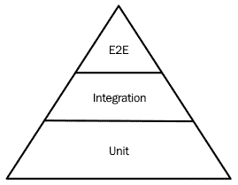

# 第八章：编写可测试的代码

代码测试的能力是任何软件产品最重要的质量。没有适当的测试，重构代码或改进其安全性、可扩展性或性能等其他部分将成本高昂。在本章中，我们将学习如何设计和管理自动化测试，以及在必要时如何正确使用伪造和模拟。

本章将涵盖以下主题：

+   为什么要测试代码？

+   引入测试框架

+   理解模拟和伪造

+   测试驱动的类设计

+   自动化测试以实现持续集成/持续部署

# 技术要求

本章的示例代码可以在[`github.com/PacktPublishing/Software-Architecture-with-Cpp/tree/master/Chapter08`](https://github.com/PacktPublishing/Software-Architecture-with-Cpp/tree/master/Chapter08)找到。

本章示例中将使用的软件如下：

+   GTest 1.10+

+   Catch2 2.10+

+   CppUnit 1.14+

+   Doctest 2.3+

+   Serverspec 2.41+

+   Testinfra 3.2+

+   Goss 0.3+

+   CMake 3.15+

+   Autoconf

+   Automake

+   Libtool

# 为什么要测试代码？

软件工程和软件架构是非常复杂的问题，应对不确定性的自然方式是对潜在风险进行保险。我们一直在做人寿保险、健康保险和汽车保险。然而，当涉及软件开发时，我们往往忘记了所有的安全预防措施，只是希望有一个乐观的结果。

知道事情不仅可能而且*一定*会出错，测试软件的话题仍然是一个有争议的话题，这是令人难以置信的。无论是因为缺乏技能还是缺乏预算，仍然有一些项目甚至缺乏一些最基本的测试。当客户决定更改需求时，简单的更正可能导致无休止的重做和火拼。

由于没有实施适当的测试而节省的时间将在第一次重做时丢失。如果您认为这次重做不会很快发生，那么您很可能是大错特错。在我们现在生活的敏捷环境中，重做是我们日常生活的一部分。我们对世界和客户的了解意味着需求会发生变化，随之而来的是对我们代码的更改。

因此，测试的主要目的是在项目后期保护您宝贵的时间。当您不得不实施各种测试而不是仅专注于功能时，这当然是一个早期的投资，但这是一个您不会后悔的投资。就像保险政策一样，当事情按计划进行时，测试会从您的预算中少扣一点，但当事情变糟时，您将获得丰厚的回报。

## 测试金字塔

在设计或实施软件系统时，您可能会遇到不同类型的测试。每个类别都有稍微不同的目的。它们可以归类如下：

+   单元测试：代码

+   集成测试：设计

+   系统测试：需求

+   验收测试（端到端或 E2E）：客户需求

这种区分是任意的，您可能经常看到金字塔的其他层，如下所示：

+   单元测试

+   服务测试

+   UI 测试（端到端或 E2E）

在这里，单元测试指的是与前面示例中相同的层。服务测试指的是集成测试和系统测试的组合。另一方面，UI 测试指的是验收测试。以下图显示了测试金字塔：



图 8.1 - 测试金字塔

值得注意的是，单元测试不仅是最便宜的构建方式，而且执行速度相当快，通常可以并行运行。这意味着它们非常适合作为持续集成的门控机制。不仅如此，它们通常也提供有关系统健康状况的最佳反馈。高级别测试不仅更难正确编写，而且可能不够健壮。这可能导致测试结果闪烁，每隔一段时间就会有一次测试运行失败。如果高级别测试的失败与单元测试级别的任何失败都没有关联，那么问题很可能出在测试本身而不是被测试系统上。

我们不想说高级别测试完全没有用，也不是说您应该只专注于编写单元测试。情况并非如此。金字塔之所以呈现这种形状，是因为应该有由单元测试覆盖的坚实基础。然而，在这个基础上，您还应该以适当的比例拥有所有高级别测试。毕竟，很容易想象出一个系统，其中所有单元测试都通过了，但系统本身对客户没有任何价值。一个极端的例子是一个完全正常工作的后端，没有任何用户界面（无论是图形界面还是 API 形式）。当然，它通过了所有的单元测试，但这并不是借口！

正如您所想象的那样，测试金字塔的相反称为冰锥，这是一种反模式。违反测试金字塔通常会导致脆弱的代码和难以追踪的错误。这使得调试成本更高，也不会在测试开发中节省成本。

## 非功能性测试

我们已经涵盖的是所谓的功能测试。它们的目的是检查被测试系统是否满足功能要求。但除了功能要求之外，还有其他类型的要求我们可能想要控制。其中一些如下：

+   **性能**：您的应用程序可能在功能方面符合要求，但由于性能不佳，对最终用户来说仍然无法使用。我们将在第十一章中更多关注性能改进。

+   **耐久性**：即使您的系统可能表现得非常出色，也并不意味着它能够承受持续的高负载。即使能够承受，它能够承受组件的一些故障吗？当我们接受这样一个观念，即每一款软件都是脆弱的，可能在任何时刻都会出现故障，我们开始设计可以抵御故障的系统。这是艾林生态系统所采纳的概念，但这个概念本身并不局限于该环境。在第十三章中，*设计微服务*，以及第十五章中，*云原生设计*，我们将更多地提到设计具有容错能力的系统以及混沌工程的作用。

+   **安全性**：现在，应该没有必要重复强调安全性的重要性。但由于安全性仍未得到应有的重视，我们将再次强调这一点。与网络连接的每个系统都可能被破解。在开发早期进行安全性测试可以带来与其他类型测试相同的好处：您可以在问题变得过于昂贵之前发现问题。

+   **可用性**：性能不佳可能会阻止最终用户使用您的产品，而可用性不佳可能会阻止他们甚至访问该产品。虽然可用性问题可能是由于性能过载引起的，但也有其他导致可用性丧失的原因。

+   **完整性**：您的客户数据不仅应该受到外部攻击者的保护，还应该免受由于软件故障而导致的任何更改或损失。防止完整性损失的方法包括防止位腐败、快照和备份。通过将当前版本与先前记录的快照进行比较，您可以确保差异仅由采取的操作引起，还是由错误引起。

+   **可用性**：即使产品符合以前提到的所有要求，如果它具有笨拙的界面和不直观的交互，对用户来说仍然可能不尽人意。可用性测试大多是手动执行的。每次 UI 或系统工作流程发生变化时，执行可用性评估非常重要。

## 回归测试

回归测试通常是端到端测试，应该防止您再次犯同样的错误。当您（或您的质量保证团队或客户）在生产系统中发现错误时，仅仅应用热修复并忘记所有这些是不够的。

您需要做的一件事是编写一个回归测试，以防止相同的错误再次进入生产系统。良好的回归测试甚至可以防止相同的错误*类*再次进入生产。毕竟，一旦您知道自己做错了什么，您就可以想象其他搞砸事情的方式。另一件事是执行根本原因分析。

## 根本原因分析

根本原因分析是一个过程，它帮助您发现问题的根本原因，而不仅仅是其表现形式。执行根本原因分析的最常见方法是使用“5 个为什么”的方法，这一方法是由丰田公司所著名的。这种方法包括剥离问题表现的所有表面层，以揭示隐藏在其下的根本原因。您可以通过在每一层询问“为什么”来做到这一点，直到找到您正在寻找的根本原因。

让我们看一个这种方法在实际中的例子。

问题：我们没有收到一些交易的付款：

1.  为什么？系统没有向客户发送适当的电子邮件。

1.  为什么？邮件发送系统不支持客户姓名中的特殊字符。

1.  为什么？邮件发送系统没有得到适当测试。

1.  为什么？由于需要开发新功能，没有时间进行适当的测试。

1.  为什么？我们对功能的时间估计不正确。

在这个例子中，对功能的时间估计问题可能是在生产系统中发现的错误的根本原因。但它也可能是另一个需要剥离的层。该框架为您提供了一个应该在大多数情况下有效的启发式方法，但如果您并不完全确定您得到的是否就是您要找的，您可以继续剥离额外的层，直到找到导致所有麻烦的原因。

鉴于许多错误都是由完全相同且经常可重复的根本原因导致的，找到根本原因是非常有益的，因为您可以在未来*多个不同的层面*上保护自己免受相同错误的影响。这是深度防御原则在软件测试和问题解决中的应用。

## 进一步改进的基础

对代码进行测试可以保护您免受意外错误的影响。但它也开启了不同的可能性。当您的代码由测试用例覆盖时，您就不必担心重构。重构是将完成其工作的代码转换为功能上类似但内部组织更好的代码的过程。您可能会想知道为什么需要更改代码的组织。这样做有几个原因。

首先，你的代码可能已经不再可读，这意味着每次修改都需要太多时间。其次，修复一个你即将修复的错误会导致一些其他功能表现不正确，因为随着时间的推移，代码中积累了太多的变通和特殊情况。这两个原因都可以归结为提高生产力。它们将使维护成本长期更加便宜。

但除了生产力之外，您可能还希望提高性能。这可能意味着运行时性能（应用程序在生产中的行为）或编译时性能（基本上是另一种形式的生产力改进）。

您可以通过用更高效的算法替换当前的次优算法或通过更改正在重构的模块中使用的数据结构来进行运行时性能重构。

编译时性能重构通常包括将代码的部分移动到不同的编译单元，重新组织头文件或减少依赖关系。

无论您的最终目标是什么，重构通常是一项风险很大的工作。您拿到的是大部分正确工作的东西，最终可能会得到一个更好的版本，也可能会得到一个更糟糕的版本。您怎么知道哪种情况是您的？在这里，测试就派上了用场。

如果当前的功能集已经得到充分覆盖，并且您想修复最近发现的错误，您需要做的就是添加另一个在那时会失败的测试用例。当您的整个测试套件再次开始通过时，意味着您的重构工作是成功的。

最坏的情况是，如果您无法在指定的时间范围内满足所有测试用例，您将不得不中止重构过程。如果您想要提高性能，您将进行类似的过程，但是不是针对单元测试（或端到端测试），而是专注于性能测试。

随着自动化工具的崛起，这些工具可以帮助重构（例如 ReSharper C++：[`www.jetbrains.com/resharper-cpp/features/`](https://www.jetbrains.com/resharper-cpp/features/)）和代码维护，您甚至可以将部分编码外包给外部软件服务。像 Renovate（[`renovatebot.com/`](https://renovatebot.com/)）、Dependabot（[`dependabot.com`](https://dependabot.com)）和 Greenkeeper（[`greenkeeper.io/`](https://greenkeeper.io/)）这样的服务可能很快就会支持 C++依赖项。拥有坚实的测试覆盖率将使您能够在依赖项更新期间使用它们，而不用担心破坏应用程序。

由于始终要考虑保持依赖项的安全漏洞最新状态，这样的服务可以显著减轻负担。因此，测试不仅可以保护您免受错误，还可以减少引入新功能所需的工作量。它还可以帮助您改进代码库并保持其稳定和安全！

既然我们了解了测试的必要性，我们想要开始编写我们自己的测试。可以在没有任何外部依赖项的情况下编写测试。但是，我们只想专注于测试逻辑。我们对管理测试结果和报告的细节不感兴趣。因此，我们将选择一个测试框架来为我们处理这项繁琐的工作。在下一节中，我们将介绍一些最受欢迎的测试框架。

# 引入测试框架

至于框架，当前的事实标准是 Google 的 GTest。与其配对的 GMock 一起，它们形成了一套小型工具，使您能够遵循 C++中的最佳测试实践。

GTest/GMock 二人组的其他热门替代方案包括 Catch2、CppUnit 和 Doctest。CppUnit 已经存在很长时间了，但由于缺乏最近的发布，我们不建议将其用于新项目。Catch2 和 Doctest 都支持现代 C++标准-特别是 C++14、C++17 和 C++20。

为了比较这些测试框架，我们将使用相同的代码库来进行测试。基于此，我们将在每个框架中实现测试。

## GTest 示例

这是一个使用 GTest 编写的客户库的示例测试：

```cpp
#include "customer/customer.h"

#include <gtest/gtest.h>

TEST(basic_responses, given_name_when_prepare_responses_then_greets_friendly) {
  auto name = "Bob";
  auto code_and_string = responder{}.prepare_response(name);
  ASSERT_EQ(code_and_string.first, web::http::status_codes::OK);
  ASSERT_EQ(code_and_string.second, web::json::value("Hello, Bob!"));
}
```

大多数在测试期间通常完成的任务已经被抽象化了。我们主要关注提供我们想要测试的操作（`prepare_response`）和期望的行为（两个`ASSERT_EQ`行）。

## Catch2 示例

这是一个使用 Catch2 编写的客户库的示例测试：

```cpp
#include "customer/customer.h"

#define CATCH_CONFIG_MAIN // This tells Catch to provide a main() - only do
                           // this in one cpp file
#include "catch2/catch.hpp"

TEST_CASE("Basic responses",
          "Given Name When Prepare Responses Then Greets Friendly") {
  auto name = "Bob";
  auto code_and_string = responder{}.prepare_response(name);
  REQUIRE(code_and_string.first == web::http::status_codes::OK);
  REQUIRE(code_and_string.second == web::json::value("Hello, Bob!"));
}
```

它看起来与前一个非常相似。一些关键字不同（`TEST`和`TEST_CASE`），并且检查结果的方式略有不同（`REQUIRE(a == b)`而不是`ASSERT_EQ(a,b)`）。无论如何，两者都非常简洁和易读。

## CppUnit 示例

这是一个使用 CppUnit 编写的客户库的示例测试。我们将其拆分为几个片段。

以下代码块准备我们使用 CppUnit 库中的构造：

```cpp
#include <cppunit/BriefTestProgressListener.h>
#include <cppunit/CompilerOutputter.h>
#include <cppunit/TestCase.h>
#include <cppunit/TestFixture.h>
#include <cppunit/TestResult.h>
#include <cppunit/TestResultCollector.h>
#include <cppunit/TestRunner.h>
#include <cppunit/XmlOutputter.h>
#include <cppunit/extensions/HelperMacros.h>
#include <cppunit/extensions/TestFactoryRegistry.h>
#include <cppunit/ui/text/TextTestRunner.h>

#include "customer/customer.h"

using namespace CppUnit;
using namespace std;
```

接下来，我们必须定义测试类并实现将执行我们的测试用例的方法。之后，我们必须注册类，以便我们可以在我们的测试运行器中使用它：

```cpp
class TestBasicResponses : public CppUnit::TestFixture {
  CPPUNIT_TEST_SUITE(TestBasicResponses);
  CPPUNIT_TEST(testBob);
  CPPUNIT_TEST_SUITE_END();

 protected:
  void testBob();
};

void TestBasicResponses::testBob() {
  auto name = "Bob";
  auto code_and_string = responder{}.prepare_response(name);
  CPPUNIT_ASSERT(code_and_string.first == web::http::status_codes::OK);
  CPPUNIT_ASSERT(code_and_string.second == web::json::value("Hello, Bob!"));
}

CPPUNIT_TEST_SUITE_REGISTRATION(TestBasicResponses);
```

最后，我们必须提供我们测试运行器的行为：

```cpp
int main() {
  CPPUNIT_NS::TestResult testresult;

  CPPUNIT_NS::TestResultCollector collectedresults;
  testresult.addListener(&collectedresults);

  CPPUNIT_NS::BriefTestProgressListener progress;
  testresult.addListener(&progress);

  CPPUNIT_NS::TestRunner testrunner;
  testrunner.addTest(CPPUNIT_NS::TestFactoryRegistry::getRegistry().makeTest());
  testrunner.run(testresult);

  CPPUNIT_NS::CompilerOutputter compileroutputter(&collectedresults, std::cerr);
  compileroutputter.write();

  ofstream xmlFileOut("cppTestBasicResponsesResults.xml");
  XmlOutputter xmlOut(&collectedresults, xmlFileOut);
  xmlOut.write();

  return collectedresults.wasSuccessful() ? 0 : 1;
}
```

与前两个示例相比，这里有很多样板代码。然而，测试本身看起来与前一个示例非常相似。

## Doctest 示例

这是一个使用 Doctest 编写的客户库的示例测试：

```cpp
#include "customer/customer.h"

#define DOCTEST_CONFIG_IMPLEMENT_WITH_MAIN
#include <doctest/doctest.h>

TEST_CASE("Basic responses") {
  auto name = "Bob";
  auto code_and_string = responder{}.prepare_response(name);
  REQUIRE(code_and_string.first == web::http::status_codes::OK);
  REQUIRE(code_and_string.second == web::json::value("Hello, Bob!"));
}
```

再次，它非常干净且易于理解。Doctest 的主要卖点是，与其他类似功能的替代品相比，它在编译时和运行时都是最快的。

## 测试编译时代码

模板元编程允许我们编写在编译时执行的 C++代码，而不是通常的执行时间。在 C++11 中添加的`constexpr`关键字允许我们使用更多的编译时代码，而 C++20 中的`consteval`关键字旨在让我们更好地控制代码的评估方式。

编译时编程的问题之一是没有简单的方法来测试它。虽然执行时间代码的单元测试框架很丰富（正如我们刚才看到的），但关于编译时编程的资源并不那么丰富。部分原因可能是编译时编程仍然被认为是复杂的，只针对专家。

仅仅因为某些事情不容易并不意味着它是不可能的。就像执行时间测试依赖于运行时检查断言一样，您可以使用`static_assert`来检查您的编译时代码的正确行为，这是在 C++11 中与`constexpr`一起引入的。

以下是使用`static_assert`的一个简单示例：

```cpp
#include <string_view>

constexpr int generate_lucky_number(std::string_view name) {
  if (name == "Bob") {
    number = number * 7 + static_cast<int>(letter);
  }
  return number;
}

static_assert(generate_lucky_number("Bob") == 808);
```

由于我们可以在编译时计算这里测试的每个值，我们可以有效地使用编译器作为我们的测试框架。

# 理解模拟对象和伪造对象

只要您测试的函数与外部世界的交互不太多，事情就会变得相当容易。当您测试的单元与数据库、HTTP 连接和特定文件等第三方组件进行接口时，问题就开始了。

一方面，您希望看到您的代码在各种情况下的行为。另一方面，您不希望等待数据库启动，而且您绝对不希望有几个包含不同数据版本的数据库，以便您可以检查所有必要的条件。

我们如何处理这种情况？这个想法不是执行触发所有这些副作用的实际代码，而是使用测试替身。测试替身是代码中模仿实际 API 的构造，除了它们不执行模仿函数或对象的操作。

最常见的测试替身是模拟对象、伪造对象和存根。许多人往往会将它们误认为是相同的，尽管它们并不相同。

## 不同的测试替身

模拟是注册所有接收到的调用但不做其他任何事情的测试替身。它们不返回任何值，也不以任何方式改变状态。当我们有一个应该调用我们代码的第三方框架时，使用模拟是有用的。通过使用模拟，我们可以观察所有调用，因此能够验证框架的行为是否符合预期。

当涉及到存根的实现时，它们会更加复杂。它们返回值，但这些值是预定义的。也许令人惊讶的是，`StubRandom.randomInteger()`方法总是返回相同的值（例如`3`），但当我们测试返回值的类型或者它是否返回值时，这可能是一个足够的存根实现。确切的值可能并不那么重要。

最后，伪装是具有工作实现并且行为大部分像实际生产实现的对象。主要区别在于伪装可能采取各种捷径，比如避免调用生产数据库或文件系统。

在实现**命令查询分离**（**CQS**）设计模式时，通常会使用存根来替代查询，使用模拟来替代命令。

## 测试替身的其他用途

伪装也可以在测试之外的有限范围内使用。在内存中处理数据而不依赖数据库访问也可以用于原型设计或者当您遇到性能瓶颈时。

## 编写测试替身

编写测试替身时，我们通常会使用外部库，就像我们在单元测试中所做的那样。一些最受欢迎的解决方案如下：

+   GoogleMock（也称为 gMock），现在是 GoogleTest 库的一部分：[`github.com/google/googletest`](https://github.com/google/googletest)。

+   Trompeloeil 专注于 C++14，与许多测试库（如 Catch2、doctest 和 GTest）集成得很好：[`github.com/rollbear/trompeloeil`](https://github.com/rollbear/trompeloeil)。

以下部分的代码将向您展示如何同时使用 GoogleMock 和 Trompeloeil。

### GoogleMock 示例

由于 GoogleMock 是 GoogleTest 的一部分，我们将它们一起介绍：

```cpp
#include "merchants/reviews.h"

#include <gmock/gmock.h>

#include <merchants/visited_merchant_history.h>

#include "fake_customer_review_store.h"

namespace {

class mock_visited_merchant : public i_visited_merchant {
 public:
  explicit mock_visited_merchant(fake_customer_review_store &store,
                                 merchant_id_t id)
      : review_store_{store},
        review_{store.get_review_for_merchant(id).value()} {
    ON_CALL(*this, post_rating).WillByDefault(this {
      review_.rating = s;
      review_store_.post_review(review_);
    });
    ON_CALL(*this, get_rating).WillByDefault([this] { return review_.rating; });
  }

  MOCK_METHOD(stars, get_rating, (), (override));
  MOCK_METHOD(void, post_rating, (stars s), (override));

 private:
  fake_customer_review_store &review_store_;
  review review_;
};

} // namespace

class history_with_one_rated_merchant : public ::testing::Test {
 public:
  static constexpr std::size_t CUSTOMER_ID = 7777;
  static constexpr std::size_t MERCHANT_ID = 1234;
  static constexpr const char *REVIEW_TEXT = "Very nice!";
  static constexpr stars RATING = stars{5.f};

 protected:
  void SetUp() final {
    fake_review_store_.post_review(
        {CUSTOMER_ID, MERCHANT_ID, REVIEW_TEXT, RATING});

    // nice mock will not warn on "uninteresting" call to get_rating
    auto mocked_merchant =
        std::make_unique<::testing::NiceMock<mock_visited_merchant>>(
            fake_review_store_, MERCHANT_ID);

    merchant_index_ = history_.add(std::move(mocked_merchant));
  }

  fake_customer_review_store fake_review_store_{CUSTOMER_ID};
  history_of_visited_merchants history_{};
  std::size_t merchant_index_{};
};

TEST_F(history_with_one_rated_merchant,
       when_user_changes_rating_then_the_review_is_updated_in_store) {
  const auto &mocked_merchant = dynamic_cast<const mock_visited_merchant &>(
      history_.get_merchant(merchant_index_));
  EXPECT_CALL(mocked_merchant, post_rating);

  constexpr auto new_rating = stars{4};
  static_assert(RATING != new_rating);
  history_.rate(merchant_index_, stars{new_rating});
}

TEST_F(history_with_one_rated_merchant,
       when_user_selects_same_rating_then_the_review_is_not_updated_in_store) {
  const auto &mocked_merchant = dynamic_cast<const mock_visited_merchant &>(
      history_.get_merchant(merchant_index_));
  EXPECT_CALL(mocked_merchant, post_rating).Times(0);

  history_.rate(merchant_index_, stars{RATING});
}
```

在撰写本书时，GTest 是最受欢迎的 C++测试框架。它与 GMock 的集成意味着 GMock 可能已经在您的项目中可用。如果您已经在使用 GTest，这种组合使用起来直观且功能齐全，因此没有理由寻找其他替代方案。

### Trompeloeil 示例

与前一个示例相比，这次我们使用 Trompeloeil 作为测试替身，Catch2 作为测试框架：

```cpp
#include "merchants/reviews.h"

#include "fake_customer_review_store.h"

// order is important
#define CATCH_CONFIG_MAIN
#include <catch2/catch.hpp>
#include <catch2/trompeloeil.hpp>

#include <memory>

#include <merchants/visited_merchant_history.h>

using trompeloeil::_;

class mock_visited_merchant : public i_visited_merchant {
 public:
  MAKE_MOCK0(get_rating, stars(), override);
  MAKE_MOCK1(post_rating, void(stars s), override);
};

SCENARIO("merchant history keeps store up to date", "[mobile app]") {
  GIVEN("a history with one rated merchant") {
    static constexpr std::size_t CUSTOMER_ID = 7777;
    static constexpr std::size_t MERCHANT_ID = 1234;
    static constexpr const char *REVIEW_TEXT = "Very nice!";
    static constexpr stars RATING = stars{5.f};

    auto fake_review_store_ = fake_customer_review_store{CUSTOMER_ID};
    fake_review_store_.post_review(
        {CUSTOMER_ID, MERCHANT_ID, REVIEW_TEXT, RATING});

    auto history_ = history_of_visited_merchants{};
    const auto merchant_index_ =
        history_.add(std::make_unique<mock_visited_merchant>());

    auto &mocked_merchant = const_cast<mock_visited_merchant &>(
        dynamic_cast<const mock_visited_merchant &>(
            history_.get_merchant(merchant_index_)));

    auto review_ = review{CUSTOMER_ID, MERCHANT_ID, REVIEW_TEXT, RATING};
    ALLOW_CALL(mocked_merchant, post_rating(_))
        .LR_SIDE_EFFECT(review_.rating = _1;
                        fake_review_store_.post_review(review_););
    ALLOW_CALL(mocked_merchant, get_rating()).LR_RETURN(review_.rating);

    WHEN("a user changes rating") {
      constexpr auto new_rating = stars{4};
      static_assert(RATING != new_rating);

      THEN("the review is updated in store") {
        REQUIRE_CALL(mocked_merchant, post_rating(_));
        history_.rate(merchant_index_, stars{new_rating});
      }
    }

    WHEN("a user selects same rating") {
      THEN("the review is not updated in store") {
        FORBID_CALL(mocked_merchant, post_rating(_));
        history_.rate(merchant_index_, stars{RATING});
      }
    }
  }
}
```

Catch2 的一个很棒的特性是它可以轻松编写行为驱动开发风格的测试，就像这里展示的一样。如果您喜欢这种风格，那么 Catch2 与 Trompeloeil 将是一个很好的选择，因为它们集成得非常好。

# 测试驱动的类设计

区分不同类型的测试并学习特定的测试框架（或多个框架）是不够的。当您开始测试实际代码时，很快就会注意到并非所有类都能轻松测试。有时，您可能需要访问私有属性或方法。如果您想保持良好架构原则，请抵制这种冲动！相反，考虑测试通过类型的公共 API 可用的业务需求，或者重构类型，以便有另一个可以测试的代码单元。

## 当测试和类设计发生冲突时

您可能面临的问题并不是测试框架不足够。通常，您遇到的问题是类设计不当。即使您的类可能行为正确并且看起来正确，除非它们允许测试，否则它们并没有正确设计。

然而，这是个好消息。这意味着你可以在问题变得不方便之前修复它。当你开始基于它构建类层次结构时，类设计可能会在以后困扰你。在测试实现过程中修复设计将简单地减少可能的技术债务。

## 防御性编程

与其名字可能暗示的不同，防御性编程并不是一个安全功能。它的名字来自于保护你的类和函数不被用于与它们最初意图相反的方式。它与测试没有直接关系，但是它是一个很好的设计模式，因为它提高了你代码的质量，使你的项目具有未来的可靠性。

防御性编程始于静态类型。如果你创建一个处理自定义定义类型的函数作为参数，你必须确保没有人会用一些意外的值来调用它。用户将不得不有意识地检查函数的期望并相应地准备输入。

在 C++中，当我们编写模板代码时，我们也可以利用类型安全特性。当我们为我们客户的评论创建一个容器时，我们可以接受任何类型的列表并从中复制。为了得到更好的错误和精心设计的检查，我们可以编写以下内容：

```cpp
class CustomerReviewStore : public i_customer_review_store {
 public:
  CustomerReviewStore() = default;
  explicit CustomerReviewStore(const std::ranges::range auto &initial_reviews) {
    static_assert(is_range_of_reviews_v<decltype(initial_reviews)>,
                  "Must pass in a collection of reviews");
    std::ranges::copy(begin(initial_reviews), end(initial_reviews),
                      begin(reviews_));
  }
 // ...
 private:
  std::vector<review> reviews_;
};
```

`explicit`关键字保护我们免受不必要的隐式转换。通过指定我们的输入参数满足`range`概念，我们确保只会与有效的容器一起编译。通过使用概念，我们可以从我们对无效使用的防御中获得更清晰的错误消息。在我们的代码中使用`static_assert`也是一个很好的防御措施，因为它允许我们在需要时提供一个好的错误消息。我们的`is_range_of_reviews`检查可以实现如下：

```cpp
template <typename T>
constexpr bool is_range_of_reviews_v =
    std::is_same_v<std::ranges::range_value_t<T>, review>;
```

这样，我们确保得到的范围实际上包含我们想要的类型的评论。

静态类型不会阻止无效的运行时值被传递给函数。这就是防御性编程的下一个形式，检查前置条件。这样，你的代码将在问题的第一个迹象出现时失败，这总是比返回一个无效值传播到系统的其他部分要好。在 C++中，直到我们有合同，我们可以使用我们在前几章中提到的 GSL 库来检查我们代码的前置条件和后置条件：

```cpp
void post_review(review review) final {
  Expects(review.merchant);
  Expects(review.customer);
  Ensures(!reviews_.empty());

  reviews_.push_back(std::move(review));
}
```

在这里，通过使用`Expects`宏，我们检查我们传入的评论实际上是否设置了商家和评论者的 ID。除了它不设置的情况，我们还在使用`Ensures`后置条件宏时防范了将评论添加到我们的存储失败的情况。

当涉及到运行时检查时，首先想到的是检查一个或多个属性是否不是`nullptr`。防范自己免受这个问题的最佳方法是区分可空资源（可以取`nullptr`作为值的资源）和不可空资源。有一个很好的工具可以用于这个问题，并且在 C++17 的标准库中可用：`std::optional`。如果可以的话，在你设计的所有 API 中都要使用它。

## 无聊的重复——先写你的测试

这已经说了很多次，但很多人倾向于“忘记”这个规则。当你实际编写你的测试时，你必须做的第一件事是减少创建难以测试的类的风险。你从 API 的使用开始，需要调整实现以最好地服务 API。这样，你通常会得到更愉快使用和更容易测试的 API。当你实施**测试驱动开发**（**TDD**）或在编写代码之前编写测试时，你也会实施依赖注入，这意味着你的类可以更松散地耦合。

反过来做（先编写你的类，然后再为它们添加单元测试）可能意味着你会得到更容易编写但更难测试的代码。当测试变得更难时，你可能会感到诱惑跳过它。

# 自动化持续集成/持续部署的测试

在下一章中，我们将专注于持续集成和持续部署（CI/CD）。要使 CI/CD 流水线正常工作，您需要一组测试来捕捉错误，以防它们进入生产环境。要确保所有业务需求都被适当地表达为测试，这取决于您和您的团队。

测试在几个层面上都很有用。在行为驱动开发中，我们在前一节中提到，业务需求是自动化测试的基础。但是您正在构建的系统不仅仅由业务需求组成。您希望确保所有第三方集成都按预期工作。您希望确保所有子组件（如微服务）实际上可以相互接口。最后，您希望确保您构建的函数和类没有您可以想象到的任何错误。

您可以自动化的每个测试都是 CI/CD 流水线的候选项。它们每一个也都在这个流水线的某个地方有其位置。例如，端到端测试在部署后作为验收测试是最有意义的。另一方面，单元测试在编译后直接执行时是最有意义的。毕竟，我们的目标是一旦发现与规范可能有任何分歧，就尽快中断电路。

每次运行 CI/CD 流水线时，您不必运行所有自动化的测试。最好是每个流水线的运行时间相对较短。理想情况下，应该在提交后的几分钟内完成。如果我们希望保持运行时间最短，那么如何确保一切都经过了适当的测试呢？

一个答案是为不同目的准备不同套件的测试。例如，您可以为提交到功能分支的最小测试。由于每天有许多提交到功能分支，这意味着它们只会被简要测试，并且答案将很快可用。然后，将功能分支合并到共享开发分支需要稍大一些的测试用例集。这样，我们可以确保我们没有破坏其他团队成员将使用的任何内容。最后，对于合并到生产分支的测试将运行更广泛的用例。毕竟，我们希望对生产分支进行彻底测试，即使测试需要很长时间。

另一个答案是为 CI/CD 目的使用精简的测试用例集，并进行额外的持续测试过程。此过程定期运行，并对特定环境的当前状态进行深入检查。测试可以进行到安全测试和性能测试，因此可能评估环境是否有资格进行推广。

当我们选择一个环境并确认该环境具备成为更成熟环境的所有特质时，就会发生推广。例如，开发环境可以成为下一个暂存环境，或者暂存环境可以成为下一个生产环境。如果此推广是自动进行的，还有一个好的做法是在新推广的环境不再通过测试（例如域名或流量方面的微小差异）时提供自动回滚。

这也提出了另一个重要的做法：始终在生产环境上运行测试。当然，这些测试必须是最不具侵入性的，但它们应该告诉您系统在任何给定时间都在正确执行。

## 测试基础设施

如果您希望将配置管理、基础设施即代码或不可变部署的概念纳入应用程序的软件架构中，您还应该考虑测试基础设施本身。有几种工具可以用来做到这一点，包括 Serverspec、Testinfra、Goss 和 Terratest，它们是一些比较流行的工具之一。

这些工具在范围上略有不同，如下所述：

+   Serverspec 和 Testinfra 更专注于测试通过配置管理（如 Salt、Ansible、Puppet 和 Chef）配置的服务器的实际状态。它们分别用 Ruby 和 Python 编写，并插入到这些语言的测试引擎中。这意味着 Serverspec 使用 RSPec，而 Testinfra 使用 Pytest。

+   Goss 在范围和形式上都有些不同。除了测试服务器，您还可以使用 Goss 通过 dgoss 包装器来测试项目中使用的容器。至于其形式，它不使用您在 Serverspec 或 Testinfra 中看到的命令式代码。与 Ansible 或 Salt 类似，它使用 YAML 文件来描述我们要检查的期望状态。如果您已经使用声明性的配置管理方法（如前面提到的 Ansible 或 Salt），Goss 可能更直观，因此更适合测试。

+   最后，Terratest 是一种工具，允许您测试基础设施即代码工具（如 Packer 和 Terraform）的输出（因此得名）。就像 Serverspec 和 Testinfra 使用它们的语言测试引擎为服务器编写测试一样，Terratest 利用 Go 的测试包来编写适当的测试用例。

让我们看看如何使用这些工具来验证部署是否按计划进行（至少从基础设施的角度来看）。

## 使用 Serverspec 进行测试

以下是一个检查特定版本中 Git 的可用性和 Let's Encrypt 配置文件的 Serverspec 测试的示例：

```cpp
# We want to have git 1:2.1.4 installed if we're running Debian
describe package('git'), :if => os[:family] == 'debian' do

  it { should be_installed.with_version('1:2.1.4') }

end
# We want the file /etc/letsencrypt/config/example.com.conf to:

describe file('/etc/letsencrypt/config/example.com.conf') do

  it { should be_file } # be a regular file

  it { should be_owned_by 'letsencrypt' } # owned by the letsencrypt user

  it { should be_mode 600 } # access mode 0600

  it { should contain('example.com') } # contain the text example.com 
                                       # in the content
end
```

Ruby 的 DSL 语法应该即使对于不经常使用 Ruby 的人来说也是可读的。您可能需要习惯编写代码。

## 使用 Testinfra 进行测试

以下是一个检查特定版本中 Git 的可用性和 Let's Encrypt 配置文件的 Testinfra 测试的示例：

```cpp
# We want Git installed on our host
def test_git_is_installed(host):
    git = host.package("git")
    # we test if the package is installed
    assert git.is_installed
    # and if it matches version 1:2.1.4 (using Debian versioning)
    assert git.version.startswith("1:2.1.4")
# We want the file /etc/letsencrypt/config/example.com.conf to:
def test_letsencrypt_file(host):
    le = host.file("/etc/letsencrypt/config/example.com.conf")
    assert le.user == "letsencrypt" # be owned by the letsencrypt user
    assert le.mode == 0o600 # access mode 0600
    assert le.contains("example.com") # contain the text example.com in the contents
```

Testinfra 使用纯 Python 语法。它应该是可读的，但就像 Serverspec 一样，您可能需要一些训练来自信地编写测试。

## 使用 Goss 进行测试

以下是一个检查特定版本中 Git 的可用性和 Let's Encrypt 配置文件的 Goss YAML 文件的示例：

```cpp
# We want Git installed on our host
package:
  git:
    installed: true # we test if the package is installed
  versions:
  - 1:2.1.4 # and if it matches version 1:2.1.4 (using Debian versioning)
file:
  # We want the file /etc/letsencrypt/config/example.com.conf to:
  /etc/letsencrypt/config/example.com.conf:
    exists: true
  filetype: file # be a regular file
  owner: letsencrypt # be owned by the letsencrypt user
  mode: "0600" # access mode 0600
  contains:
  - "example.com" # contain the text example.com in the contents
```

YAML 的语法可能需要最少的准备来阅读和编写。但是，如果您的项目已经使用 Ruby 或 Python，当涉及编写更复杂的测试时，您可能希望坚持使用 Serverspec 或 Testinfra。

# 总结

本章既关注软件不同部分的架构和技术方面的测试。我们查看了测试金字塔，以了解不同类型的测试如何对软件项目的整体健康和稳定性做出贡献。由于测试既可以是功能性的，也可以是非功能性的，我们看到了这两种类型的一些示例。

从本章中最重要的事情之一是要记住测试不是最终阶段。我们希望进行测试不是因为它们带来了即时价值，而是因为我们可以使用它们来检查已知的回归、重构或更改系统现有部分的行为时。当我们想要进行根本原因分析时，测试也可以证明有用，因为它们可以快速验证不同的假设。

在建立了理论要求之后，我们展示了可以用来编写测试替身的不同测试框架和库的示例。尽管先编写测试，后实现它们需要一些实践，但它有一个重要的好处。这个好处就是更好的类设计。

最后，为了突出现代架构不仅仅是软件代码，我们还看了一些用于测试基础设施和部署的工具。在下一章中，我们将看到持续集成和持续部署如何为您设计的应用程序带来更好的服务质量和稳健性。

# 问题

1.  测试金字塔的基础层是什么？

1.  非功能性测试有哪些类型？

1.  著名的根本原因分析方法的名称是什么？

1.  在 C++中是否可能测试编译时代码？

1.  在编写具有外部依赖的代码的单元测试时应该使用什么？

1.  单元测试在持续集成/持续部署中的作用是什么？

1.  有哪些工具可以让您测试基础架构代码？

1.  在单元测试中访问类的私有属性和方法是一个好主意吗？

# 进一步阅读

测试 C++代码：[`www.packtpub.com/application-development/modern-c-programming-cookbook`](https://www.packtpub.com/application-development/modern-c-programming-cookbook)

测试替身：[`martinfowler.com/articles/mocksArentStubs.html`](https://martinfowler.com/articles/mocksArentStubs.html)

持续集成/持续部署：[`www.packtpub.com/virtualization-and-cloud/hands-continuous-integration-and-delivery`](https://www.packtpub.com/virtualization-and-cloud/hands-continuous-integration-and-delivery) 和 [`www.packtpub.com/virtualization-and-cloud/cloud-native-continuous-integration-and-delivery`](https://www.packtpub.com/virtualization-and-cloud/cloud-native-continuous-integration-and-delivery)
