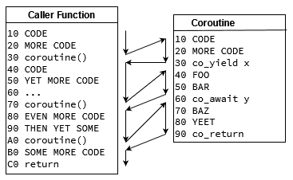

# 第十一章：性能

选择 C++作为项目的关键编程语言的最常见原因之一是出于性能要求。在性能方面，C++比竞争对手明显更有优势，但要取得最佳结果需要理解相关问题。本章重点介绍如何提高 C++软件的性能。我们将首先向您展示用于测量性能的工具。我们将向您展示一些增加单线程计算速度的技术。然后我们将讨论如何利用并行计算。最后，我们将展示如何使用 C++20 的协程进行非抢占式多任务处理。

本章将涵盖以下主题：

+   性能测量

+   帮助编译器生成高性能代码

+   并行计算

+   使用协程

首先，让我们指定在本章中运行示例所需的内容。

# 技术要求

要复制本章中的示例，您应安装以下内容：

+   CMake 3.15+

+   支持 C++20 的范围和协程的编译器，例如 GCC 10+

本章的源代码片段可以在[`github.com/PacktPublishing/Software-Architecture-with-Cpp/tree/master/Chapter11`](https://github.com/PacktPublishing/Software-Architecture-with-Cpp/tree/master/Chapter11)找到。

# 性能测量

要有效地提高代码的性能，您必须首先测量其性能。如果不知道实际瓶颈在哪里，最终会优化错误的地方，浪费时间，并且会对您的辛勤工作几乎没有收获感到惊讶和沮丧。在本节中，我们将展示如何使用基准测试正确测量性能，如何成功地对代码进行分析，并如何深入了解分布式系统的性能。

## 进行准确和有意义的测量

为了获得准确和可重复的测量结果，您可能还希望将计算机置于性能模式，而不是通常的默认节能模式。如果您需要系统低延迟，您可能希望永久禁用两台机器上的节能模式，并在生产环境中禁用节能模式。许多时候，这可能意味着进入 BIOS 并正确配置服务器。请注意，如果您使用公共云提供商，则可能无法做到这一点。如果您在计算机上拥有 root/admin 权限，操作系统通常也可以调整一些设置。例如，您可以通过在 Linux 系统上运行以下命令来强制 CPU 以最大频率运行：

```cpp
sudo cpupower frequency-set --governor performance
```

此外，为了获得有意义的结果，您可能希望在尽可能接近生产环境的系统上进行测量。除了配置之外，诸如 RAM 的不同速度、CPU 缓存的数量和 CPU 的微体系结构等方面也可能扭曲您的结果，并导致您得出错误的结论。硬盘设置、甚至网络拓扑和使用的硬件也是如此。您构建的软件也起着至关重要的作用：从固件使用，通过操作系统和内核，一直到软件堆栈和依赖项。最好有一个与您的生产环境相同的第二个环境，并使用相同的工具和脚本进行管理。

既然我们已经有了一个稳固的测量环境，让我们看看我们实际上可以测量些什么。

## 利用不同类型的测量工具

有几种测量性能的方法，每种方法都侧重于不同的范围。让我们逐一看看它们。

基准测试可用于测试系统在预先制定的测试中的速度。通常，它们会导致完成时间或每秒处理的订单等性能指标。有几种类型的基准测试：

+   **微基准测试**，您可以用它来测量小代码片段的执行。我们将在下一节中介绍它们。

+   **模拟**，这是对较大规模的人工数据进行的合成测试。如果您无法访问目标数据或目标硬件，它们可能会很有用。例如，当您计划检查您正在开发的硬件的性能，但它尚不存在，或者当您计划处理传入的流量，但只能假设流量的情况时。

+   **重放**，这是一种非常准确的衡量真实工作负载下性能的方法。其思想是记录进入生产系统的所有请求或工作负载，通常带有时间戳。然后可以将这些转储“重放”到基准系统中，尊重它们之间的时间差异，以检查其性能。这样的基准测试可以很好地看到代码或环境的潜在变化如何影响系统的延迟和吞吐量。

+   **行业标准**，这是一个很好的方法，可以看到我们的产品与竞争对手相比的表现。此类基准测试的示例包括用于 CPU 的 SuperPi，用于图形卡的 3D Mark 以及用于人工智能处理器的 ResNet-50。

除了基准测试之外，另一种在衡量性能时非常宝贵的工具是性能分析器。性能分析器不仅可以为您提供整体性能指标，还可以让您检查代码的执行情况并寻找瓶颈。它们对于捕捉减慢系统速度的意外情况非常有用。我们将在本章后面更详细地介绍它们。

掌握系统性能的最后一种方法是追踪。追踪本质上是在执行过程中记录系统行为的一种方式。通过监视请求完成各个处理步骤所需的时间（例如由不同类型的微服务处理），您可以洞察系统哪些部分需要改进性能，或者您的系统如何处理不同类型的请求：无论是不同类型的请求还是被接受或拒绝的请求。我们将在本章后面介绍追踪 - 就在性能分析之后。

现在让我们再多说几句关于微基准。

## 使用微基准测试

微基准测试用于衡量“微”代码片段的执行速度。如果您想知道如何实现特定功能，或者不同的第三方库如何处理相同的任务的速度，那么它们是完成此任务的完美工具。虽然它们不能代表真实环境，但它们非常适合执行这样的小型实验。

让我们展示如何使用 C++中最常用的框架之一来运行这样的实验：Google Benchmark。

### 设置 Google Benchmark

让我们首先通过 Conan 将库引入我们的代码中。将以下内容放入您的`conanfile.txt`中：

```cpp
[requires]

benchmark/1.5.2


[generators]

CMakeDeps
```

我们将使用 CMakeDeps 生成器，因为它是 Conan 2.0 中推荐的 CMake 生成器。它依赖于 CMake 的`find_package`功能来使用我们的原始依赖管理器安装的软件包。要安装它们的发布版本的依赖项，请运行以下命令：

```cpp
cd <build_directory>

conan install <source_directory> --build=missing -s build_type=Release
```

如果您正在使用自定义的 Conan 配置文件，请记得在这里也添加它。

从您的`CMakeLists.txt`文件中使用它也非常简单，如下所示：

```cpp
list(APPEND CMAKE_PREFIX_PATH "${CMAKE_BINARY_DIR}")

find_package(benchmark REQUIRED)
```

首先，我们将我们的构建目录添加到`CMAKE_PREFIX_PATH`中，以便 CMake 可以找到 Conan 生成的配置文件和/或目标文件。接下来，我们只需使用它们来找到我们的依赖项。

由于我们将创建多个微基准测试，我们可以使用一个 CMake 函数来帮助我们定义它们：

```cpp
function(add_benchmark NAME SOURCE)

  add_executable(${NAME} ${SOURCE})

  target_compile_features(${NAME} PRIVATE cxx_std_20)

  target_link_libraries(${NAME} PRIVATE benchmark::benchmark)

endfunction()
```

该函数将能够创建单一翻译单元的微基准测试，每个测试都使用 C++20 并链接到 Google Benchmark 库。现在让我们使用它来创建我们的第一个微基准测试可执行文件：

```cpp
add_benchmark(microbenchmark_1 microbenchmarking/main_1.cpp)
```

现在我们准备在源文件中放入一些代码。

### 编写您的第一个微基准测试

我们将尝试基准测试使用二分法在排序向量中进行查找时需要多快，与仅线性查找相比。让我们从创建排序向量的代码开始：

```cpp
using namespace std::ranges;


template <typename T>

auto make_sorted_vector(std::size_t size) {

  auto sorted = std::vector<T>{};

  sorted.reserve(size);


  auto sorted_view = views::iota(T{0}) | views::take(size);

  std::ranges::copy(sorted_view, std::back_inserter(sorted));

  return sorted;

}
```

我们的向量将包含大小元素，所有数字从 0 到大小-1 按升序排列。现在让我们指定我们要查找的元素和容器的大小：

```cpp
constexpr auto MAX_HAYSTACK_SIZE = std::size_t{10'000'000};

constexpr auto NEEDLE = 2137;
```

如您所见，我们将基准测试在干草垛中查找针需要多长时间。简单的线性搜索可以实现如下：

```cpp
void linear_search_in_sorted_vector(benchmark::State &state) {

  auto haystack = make_sorted_vector<int>(MAX_HAYSTACK_SIZE);

  for (auto _ : state) {

    benchmark::DoNotOptimize(find(haystack, NEEDLE));

  }

}
```

在这里，我们可以看到 Google Benchmark 的第一次使用。每个微基准测试应该接受`State`作为参数。这种特殊类型执行以下操作：

+   包含执行的迭代和测量计算所花费的时间的信息

+   计算所处理的字节数

+   如果需要，可以返回其他状态信息，例如需要进一步运行（通过`KeepRunning()`成员函数）

+   可以用于暂停和恢复迭代的计时（分别通过`PauseTiming()`和`ResumeTiming()`成员函数）

我们的循环中的代码将被测量，根据允许运行此特定基准测试的总时间进行所需的迭代。我们的干草垛的创建在循环外部，不会被测量。

在循环内部，有一个名为`DoNotOptimize`的辅助函数。它的目的是确保编译器不会摆脱我们的计算，因为它可以证明它们在这个范围之外是无关紧要的。在我们的情况下，它将标记`std::find`的结果是必要的，所以实际用于查找目标的代码不会被优化掉。使用诸如 objdump 或诸如 Godbolt 和 QuickBench 的网站等工具，可以查看您想要运行的代码是否已被优化掉。QuickBench 的额外优势在于在云中运行您的基准测试并在线共享其结果。

回到我们手头的任务，我们有一个线性搜索的微基准测试，所以现在让我们在另一个微基准测试中计时二进制搜索：

```cpp
void binary_search_in_sorted_vector(benchmark::State &state) {

  auto haystack = make_sorted_vector<int>(MAX_HAYSTACK_SIZE);

  for (auto _ : state) {

    benchmark::DoNotOptimize(lower_bound(haystack, NEEDLE));

  }

}
```

我们的新基准测试非常相似。它只在使用的函数上有所不同：`lower_bound`将执行二进制搜索。请注意，与我们的基本示例类似，我们甚至不检查迭代器返回的指向向量中的有效元素，还是指向其末尾。在`lower_bound`的情况下，我们可以检查迭代器下的元素是否实际上是我们要查找的元素。

现在我们有了微基准测试函数，让我们通过添加以下内容将它们创建为实际的基准测试：

```cpp
BENCHMARK(binary_search_in_sorted_vector);

BENCHMARK(linear_search_in_sorted_vector);
```

如果默认的基准测试设置对您来说没问题，那么您只需要通过。作为最后一步，让我们添加一个`main()`函数：

```cpp
BENCHMARK_MAIN();
```

就是这么简单！或者，您也可以链接我们的程序而不是`benchmark_main`。使用 Google Benchmark 的`main()`函数的优点是提供了一些默认选项。如果编译我们的基准测试并在传递`--help`作为参数运行它，您将看到以下内容：

```cpp
benchmark [--benchmark_list_tests={true|false}]

          [--benchmark_filter=<regex>]

          [--benchmark_min_time=<min_time>]

          [--benchmark_repetitions=<num_repetitions>]

          [--benchmark_report_aggregates_only={true|false}]

          [--benchmark_display_aggregates_only={true|false}]

          [--benchmark_format=<console|json|csv>]

          [--benchmark_out=<filename>]

          [--benchmark_out_format=<json|console|csv>]

          [--benchmark_color={auto|true|false}]

          [--benchmark_counters_tabular={true|false}]

          [--v=<verbosity>]
```

这是一组很好的功能。例如，在设计实验时，您可以使用`benchmark_format`开关获取 CSV 输出，以便更容易绘制图表。

现在让我们通过在编译后的可执行文件上不带命令行参数来看看我们的基准测试的运行情况。运行`./microbenchmark_1`的可能输出如下：

```cpp
2021-02-28T16:19:28+01:00

Running ./microbenchmark_1

Run on (8 X 2601 MHz CPU s)

Load Average: 0.52, 0.58, 0.59

-------------------------------------------------------------------------

Benchmark                               Time             CPU   Iterations

-------------------------------------------------------------------------

linear_search_in_sorted_vector        984 ns          984 ns       746667

binary_search_in_sorted_vector       18.9 ns         18.6 ns     34461538
```

从运行环境的一些数据开始（基准测试的时间、可执行文件名称、服务器的 CPU 和当前负载），我们得到了我们定义的每个基准测试的结果。对于每个基准测试，我们得到每次迭代的平均墙时间、每次迭代的平均 CPU 时间以及基准测试运行的迭代次数。默认情况下，单次迭代时间越长，迭代次数就越少。运行更多的迭代可以确保您获得更稳定的结果。

### 将任意参数传递给微基准测试

如果我们要测试处理手头问题的更多方法，我们可以寻找一种重用基准代码并将其传递给执行查找的函数的方法。Google Benchmark 具有一个我们可以使用的功能。该框架实际上允许我们通过将它们作为函数签名的附加参数来传递任何参数给基准。

让我们看看使用此功能的我们的基准的统一签名会是什么样子：

```cpp
void search_in_sorted_vector(benchmark::State &state, auto finder) {

  auto haystack = make_sorted_vector<int>(MAX_HAYSTACK_SIZE);

  for (auto _ : state) {

    benchmark::DoNotOptimize(finder(haystack, NEEDLE));

  }

}
```

您可以注意到函数的新`finder`参数，它用于我们之前调用`find`或`lower_bound`的位置。现在我们可以使用与上次不同的宏来创建我们的两个微基准测试：

```cpp
BENCHMARK_CAPTURE(search_in_sorted_vector, binary, lower_bound);

BENCHMARK_CAPTURE(search_in_sorted_vector, linear, find);
```

`BENCHMARK_CAPTURE`宏接受函数、名称后缀和任意数量的参数。如果我们需要更多，我们可以在这里传递它们。我们的基准函数可以是常规函数或模板-两者都受支持。现在让我们看看在运行代码时我们会得到什么：

```cpp
-------------------------------------------------------------------------

Benchmark                               Time             CPU   Iterations

-------------------------------------------------------------------------

search_in_sorted_vector/binary       19.0 ns         18.5 ns     28000000

search_in_sorted_vector/linear        959 ns          952 ns       640000
```

如您所见，传递给函数的参数不是名称的一部分，而是函数名称和我们的后缀。

现在让我们看看如何进一步定制我们的基准测试。

### 将数值参数传递给微基准测试

设计类似我们的实验时的一个常见需求是在不同大小的参数上进行检查。在 Google Benchmark 中可以通过多种方式来满足这些需求。最简单的方法就是在`BENCHMARK`宏返回的对象上添加一个调用`Args()`。这样，我们可以传递一组值来在给定的微基准测试中使用。要使用传递的值，我们需要将我们的基准函数更改如下：

```cpp
void search_in_sorted_vector(benchmark::State &state, auto finder) {

  const auto haystack = make_sorted_vector<int>(state.range(0));

  const auto needle = 2137;

  for (auto _ : state) {

    benchmark::DoNotOptimize(finder(haystack, needle));

  }

}
```

对`state.range(0)`的调用将读取传递的第 0 个参数。可以支持任意数量。在我们的情况下，它用于参数化干草堆的大小。如果我们想要传递一系列值集合呢？这样，我们可以更容易地看到改变大小如何影响性能。我们可以调用`Range`而不是`Args`来进行基准测试：

```cpp
constexpr auto MIN_HAYSTACK_SIZE = std::size_t{1'000};

constexpr auto MAX_HAYSTACK_SIZE = std::size_t{10'000'000};


BENCHMARK_CAPTURE(search_in_sorted_vector, binary, lower_bound)

    ->RangeMultiplier(10)

    ->Range(MIN_HAYSTACK_SIZE, MAX_HAYSTACK_SIZE);

BENCHMARK_CAPTURE(search_in_sorted_vector, linear, find)

    ->RangeMultiplier(10)

    ->Range(MIN_HAYSTACK_SIZE, MAX_HAYSTACK_SIZE);
```

我们使用预定义的最小值和最大值来指定范围边界。然后我们告诉基准测试工具通过乘以 10 来创建范围，而不是使用默认值。当我们运行这样的基准测试时，可能会得到以下结果：

```cpp
-------------------------------------------------------------------------

Benchmark                                 Time        CPU     Iterations

-------------------------------------------------------------------------

search_in_sorted_vector/binary/1000      0.2 ns    19.9 ns     34461538

search_in_sorted_vector/binary/10000     24.8 ns   24.9 ns     26352941

search_in_sorted_vector/binary/100000    26.1 ns   26.1 ns     26352941

search_in_sorted_vector/binary/1000000   29.6 ns   29.5 ns     24888889

search_in_sorted_vector/binary/10000000  25.9 ns   25.7 ns     24888889

search_in_sorted_vector/linear/1000      482 ns     474 ns      1120000

search_in_sorted_vector/linear/10000     997 ns    1001 ns       640000

search_in_sorted_vector/linear/100000    1005 ns   1001 ns       640000

search_in_sorted_vector/linear/1000000   1013 ns   1004 ns       746667

search_in_sorted_vector/linear/10000000  990 ns    1004 ns       746667
```

在分析这些结果时，您可能会想知道为什么线性搜索没有显示出线性增长。这是因为我们寻找一个可以在恒定位置被发现的针的恒定值。如果干草堆中包含我们的针，我们需要相同数量的操作来找到它，无论干草堆的大小如何，因此执行时间停止增长（但仍可能受到小波动的影响）。

为什么不也尝试一下针的位置呢？

#### 以编程方式生成传递的参数

在一个简单的函数中生成干草堆大小和针位置可能是最简单的。Google Benchmark 允许这样的场景，让我们看看它们在实践中是如何工作的。

让我们首先重写我们的基准函数，以便在每次迭代中传递两个参数：

```cpp
void search_in_sorted_vector(benchmark::State &state, auto finder) {

  const auto needle = state.range(0);

  const auto haystack = make_sorted_vector<int>(state.range(1));

  for (auto _ : state) {

    benchmark::DoNotOptimize(finder(haystack, needle));

  }

}
```

如您所见，`state.range(0)`将标记我们的针位置，而`state.range(1)`将是干草堆的大小。这意味着我们需要每次传递两个值。让我们创建一个生成它们的函数：

```cpp
void generate_sizes(benchmark::internal::Benchmark *b) {

  for (long haystack = MIN_HAYSTACK_SIZE; haystack <= MAX_HAYSTACK_SIZE;

       haystack *= 100) {

    for (auto needle :

         {haystack / 8, haystack / 2, haystack - 1, haystack + 1}) {

      b->Args({needle, haystack});

    }

  }

}
```

我们不使用`Range`和`RangeMultiplier`，而是编写一个循环来生成干草堆的大小，这次每次增加 100。至于针，我们使用干草堆的成比例位置中的三个位置和一个落在干草堆之外的位置。我们在每次循环迭代中调用`Args`，传递生成的值。

现在，让我们将我们的生成函数应用于我们定义的基准测试：

```cpp
BENCHMARK_CAPTURE(search_in_sorted_vector, binary, lower_bound)->Apply(generate_sizes);

BENCHMARK_CAPTURE(search_in_sorted_vector, linear, find)->Apply(generate_sizes);
```

使用这样的函数可以轻松地将相同的生成器传递给许多基准测试。这样的基准测试可能的结果如下：

```cpp
-------------------------------------------------------------------------

Benchmark                                        Time     CPU  Iterations

-------------------------------------------------------------------------

search_in_sorted_vector/binary/125/1000       20.0 ns  20.1 ns   37333333

search_in_sorted_vector/binary/500/1000       19.3 ns  19.0 ns   34461538

search_in_sorted_vector/binary/999/1000       20.1 ns  19.9 ns   34461538

search_in_sorted_vector/binary/1001/1000      18.1 ns  18.0 ns   40727273

search_in_sorted_vector/binary/12500/100000   35.0 ns  34.5 ns   20363636

search_in_sorted_vector/binary/50000/100000   28.9 ns  28.9 ns   24888889

search_in_sorted_vector/binary/99999/100000   31.0 ns  31.1 ns   23578947

search_in_sorted_vector/binary/100001/100000  29.1 ns  29.2 ns   23578947

// et cetera
```

现在我们有了一个非常明确定义的实验来执行搜索。作为练习，在您自己的机器上运行实验，以查看完整的结果，并尝试从结果中得出一些结论。

### 选择微基准测试和优化的对象

进行这样的实验可能是有教育意义的，甚至会让人上瘾。但请记住，微基准测试不应该是项目中唯一的性能测试类型。正如唐纳德·克努斯所说：

*我们应该忘记小的效率，大约 97%的时间：过早的优化是万恶之源*

这意味着您应该只对重要的代码进行微基准测试，特别是您的热路径上的代码。较大的基准测试，以及跟踪和探测，可以用来查看何时何地进行优化，而不是猜测和过早优化。首先，了解您的软件是如何执行的。

注意：关于上面的引用，我们还想再提一个观点。这并不意味着您应该允许过早的*恶化*。数据结构或算法的选择不佳，甚至是散布在所有代码中的小的低效率，有时可能会影响系统的整体性能。例如，执行不必要的动态分配，虽然一开始看起来可能不那么糟糕，但随着时间的推移可能会导致堆碎片化，并在应用程序长时间运行时给您带来严重的麻烦。过度使用基于节点的容器也可能导致更多的缓存未命中。长话短说，如果编写高效代码而不是低效代码不需要花费太多精力，那就去做吧。

现在让我们学习一下，如果您的项目有需要长期保持良好性能的地方，应该怎么做。

### 使用基准测试创建性能测试

与精确测试的单元测试和代码正确性的大规模功能测试类似，您可以使用微基准测试和较大的基准测试来测试代码的性能。

如果对某些代码路径的执行时间有严格的限制，那么确保达到限制的测试可能非常有用。即使没有这样具体的限制，您可能也对监视性能在代码更改时如何变化感兴趣。如果在更改后，您的代码运行比以前慢了一定的阈值，测试可能会被标记为失败。

尽管也是一个有用的工具，但请记住，这样的测试容易受到渐渐降低性能的影响：随着时间的推移，性能的下降可能会不被注意，因此请确保偶尔监视执行时间。在您的 CI 中引入性能测试时，确保始终在相同的环境中运行，以获得稳定的结果。

现在让我们讨论性能工具箱中的下一类工具。

## 探测

虽然基准测试和跟踪可以为给定范围提供概述和具体数字，但探测器可以帮助您分析这些数字的来源。如果您需要深入了解性能并进行改进，它们是必不可少的工具。

### 选择要使用的探测器类型

有两种类型的探测器可用：仪器探测器和采样探测器。较为知名的仪器探测器之一是 Callgrind，它是 Valgrind 套件的一部分。仪器探测器有很大的开销，因为它们需要对您的代码进行仪器化，以查看您调用了哪些函数以及每个函数的执行时间。这样，它们产生的结果甚至包含最小的函数，但执行时间可能会受到这种开销的影响。它还有一个缺点，就是不总是能捕捉到输入/输出的缓慢和抖动。它会减慢执行速度，因此，虽然它可以告诉您调用特定函数的频率，但它不会告诉您缓慢是由于等待磁盘读取完成而引起的。

由于仪器探测器的缺陷，通常最好使用采样探测器。两个值得一提的是开源的 perf 用于在 Linux 系统上进行性能分析，以及英特尔的专有工具 VTune（对于开源项目是免费的）。虽然它们有时会由于采样的性质而错过关键事件，但通常应该能够更好地展示代码的时间分配情况。

如果你决定使用 perf，你应该知道你可以通过调用`perf stat`来使用它，这会给你一个关于 CPU 缓存使用等统计数据的快速概览，或者使用`perf record -g`和`perf report -g`来捕获和分析性能分析结果。

如果你想要对 perf 有一个扎实的概述，请观看 Chandler Carruth 的视频，其中展示了工具的可能性以及如何使用它，或者查看它的教程。这两者都在*进一步阅读*部分中链接。

### 准备分析器和处理结果

在分析性能分析结果时，你可能经常需要进行一些准备、清理和处理。例如，如果你的代码大部分时间都在忙碌，你可能希望将其过滤掉。在开始使用分析器之前，一定要编译或下载尽可能多的调试符号，包括你的代码、你的依赖项，甚至操作系统库和内核。此外，禁用帧指针优化也是必要的。在 GCC 和 Clang 上，你可以通过传递`-fno-omit-frame-pointer`标志来实现。这不会对性能产生太大影响，但会为你提供更多关于代码执行的数据。在结果的后处理方面，使用 perf 时，通常最好从结果中创建火焰图。Brendan Gregg 在*进一步阅读*部分中的工具非常适合这个用途。火焰图是一个简单而有效的工具，可以看出执行花费了太多时间的地方，因为图表上每个项目的宽度对应着资源使用情况。你可以得到 CPU 使用情况的火焰图，以及资源使用情况、分配和页面错误等方面的火焰图，或者代码在不执行时花费的时间，比如在系统调用期间保持阻塞、在互斥锁上、I/O 操作等。还有一些方法可以对生成的火焰图进行差异分析。

### 分析结果

请记住，并非所有性能问题都会在这样的图表上显示出来，也不是所有问题都可以通过性能分析器找到。尽管有了一些经验，你可能会发现你可以从为线程设置亲和性或更改线程在特定 NUMA 节点上执行的方式中受益，但并不总是那么明显地看出你忘记了禁用节能功能或者从启用或禁用超线程中受益。关于你运行的硬件的信息也是有用的。有时你可能会看到 CPU 的 SIMD 寄存器被使用，但代码仍然无法以最快的速度运行：你可能使用了 SSE 指令而不是 AVX 指令，AVX 而不是 AVX2，或者 AVX2 而不是 AVX512。当你分析性能分析结果时，了解你的 CPU 能够运行哪些具体指令可能是非常有价值的。

解决性能问题也需要一些经验。另一方面，有时经验可能会导致你做出错误的假设。例如，在许多情况下，使用动态多态性会影响性能；但也有一些情况下，它不会减慢你的代码。在得出结论之前，值得对代码进行性能分析，并了解编译器优化代码的各种方式以及这些技术的限制。具体来说，关于虚拟化，当你不希望其他类型继承和重写你的虚拟成员函数时，将你的虚拟成员函数的类标记为 final 通常会帮助编译器在许多情况下。

编译器也可以更好地优化，如果它们“看到”对象的类型：如果你在作用域中创建一个类型并调用它的虚拟成员函数，编译器应该能够推断出应该调用哪个函数。GCC 倾向于比其他编译器更好地进行去虚拟化。关于这一点的更多信息，你可以参考*进一步阅读*部分中 Arthur O'Dwyer 的博客文章。

与本节中介绍的其他类型的工具一样，尽量不要只依赖于您的分析器。性能分析结果的改进并不意味着您的系统变得更快。一个看起来更好的性能分析图仍然不能告诉您整个故事。一个组件的更好性能并不一定意味着整个系统的性能都得到了改善。这就是我们最后一种类型的工具可以派上用场的地方。

## 跟踪

我们将在本节中讨论的最后一种技术是针对分布式系统的。在查看整个系统时，通常部署在云中，在一个盒子上对软件进行性能分析并不能告诉您整个故事。在这种范围内，您最好的选择是跟踪请求和响应在系统中的流动。

跟踪是记录代码执行的一种方式。当一个请求（有时还有其响应）必须流经系统的许多部分时，通常会使用它。通常情况下，这样的消息会沿着路线被跟踪，并在执行的有趣点添加时间戳。

### 相关 ID

时间戳的一个常见补充是相关 ID。基本上，它们是分配给每个被跟踪消息的唯一标识符。它们的目的是在处理相同的传入请求期间（有时也是由此引起的事件），相关 ID 可以将系统的不同组件（如不同的微服务）产生的日志相关联起来。这样的 ID 应该随着消息一起传递，例如通过附加到其 HTTP 标头。即使原始请求已经消失，您也可以将其相关 ID 添加到每个响应中。

通过使用相关 ID，您可以跟踪给定请求的消息如何在系统中传播，以及系统的不同部分处理它所花费的时间。通常情况下，您还希望在途中收集额外的数据，例如用于执行计算的线程，为给定请求产生的响应的类型和数量，或者它经过的机器的名称。

像 Jaeger 和 Zipkin（或其他 OpenTracing 替代方案）这样的工具可以帮助您快速为系统添加跟踪支持。

现在让我们来处理一个不同的主题，并谈谈代码生成。

# 帮助编译器生成高性能代码

有许多方法可以帮助编译器为您生成高效的代码。有些方法归结为正确引导编译器，而其他方法则需要以对编译器友好的方式编写代码。

了解您在关键路径上需要做什么，并有效地设计它也很重要。例如，尽量避免虚拟分派（除非您可以证明它已被去虚拟化），并尽量不要在其中分配新内存。通常情况下，一切可能会降低性能的东西都应该保持在热路径之外。使指令和数据缓存都保持热度确实会产生回报。甚至像`[[likely]]`和`[[unlikely]]`这样的属性，可以提示编译器应该期望执行哪个分支，有时也会产生很大的变化。

## 优化整个程序

增加许多 C++项目性能的一个有趣方法是启用**链接时优化**（**LTO**）。在编译过程中，您的编译器不知道代码将如何与其他目标文件或库链接。许多优化的机会只有在这一点上才会出现：在链接时，您的工具可以看到程序的各个部分如何相互交互的整体情况。通过启用 LTO，您有时可以在几乎没有成本的情况下获得显著的性能改进。在 CMake 项目中，您可以通过设置全局的`CMAKE_INTERPROCEDURAL_OPTIMIZATION`标志或在目标上设置`INTERPROCEDURAL_OPTIMIZATION`属性来启用 LTO。

使用 LTO 的一个缺点是它使构建过程变得更长。有时会长很多。为了减少开发人员的成本，您可能只想为需要性能测试或发布的构建启用此优化。

## 基于实际使用模式进行优化

优化代码的另一种有趣方法是使用**基于配置文件的优化**（**PGO**）。这种优化实际上是一个两步过程。在第一步中，您需要使用额外的标志编译代码，导致可执行文件在运行时收集特殊的分析信息。然后，您应该在预期的生产负载下执行它。完成后，您可以使用收集的数据第二次编译可执行文件，这次传递不同的标志，指示编译器使用收集的数据生成更适合您的配置文件的代码。这样，您将得到一个准备好并调整到您特定工作负载的二进制文件。

## 编写友好缓存的代码

这两种优化技术都可以派上用场，但在处理高性能系统时，还有一件重要的事情需要牢记：缓存友好性。使用平面数据结构而不是基于节点的数据结构意味着您在运行时需要执行更少的指针追踪，这有助于提高性能。无论是向前还是向后读取，使用内存中连续的数据意味着您的 CPU 内存预取器可以在使用之前加载它，这通常会产生巨大的差异。基于节点的数据结构和上述指针追踪会导致随机内存访问模式，这可能会“混淆”预取器，并使其无法预取正确的数据。

如果您想查看一些性能结果，请参考* C++容器基准测试*中的链接。它比较了`std::vector`，`std::list`，`std::deque`和`plf::colony`的各种使用场景。如果你不知道最后一个，它是一个有趣的“袋”类型容器，具有快速插入和删除大数据的功能。

在选择关联容器时，您通常会希望使用“平面”实现而不是基于节点的实现。这意味着您可能想尝试`tsl::hopscotch_map`或 Abseil 的`flat_hash_map`和`flat_hash_set`，而不是使用`std::unordered_map`和`std::unordered_set`。

诸如将较冷的指令（例如异常处理代码）放在非内联函数中的技术可以帮助增加指令缓存的热度。这样，用于处理罕见情况的冗长代码将不会加载到指令缓存中，为应该在那里的更多代码留出空间，这也可以提高性能。

## 以数据为中心设计您的代码

如果要帮助缓存，另一种有用的技术是数据导向设计。通常，将更频繁使用的成员存储在内存中靠近彼此的位置是一个好主意。较冷的数据通常可以放在另一个结构中，并通过 ID 或指针与较热的数据连接。

有时，与更常见的对象数组不同，使用数组对象可以获得更好的性能。不要以面向对象的方式编写代码，而是将对象的数据成员分布在几个数组中，每个数组包含多个对象的数据。换句话说，采用以下代码：

```cpp
struct Widget {

    Foo foo;

    Bar bar;

    Baz baz;

};


auto widgets = std::vector<Widget>{};
```

并考虑用以下内容替换它：

```cpp
struct Widgets {

    std::vector<Foo> foos;

    std::vector<Bar> bars;

    std::vector<Baz> bazs;

};
```

这样，当处理一组特定的数据点与一些对象时，缓存热度增加，性能也会提高。如果你不知道这是否会提高代码的性能，请进行测量。

有时候，甚至重新排列类型的成员也可以带来更好的性能。您应该考虑数据成员类型的对齐。如果性能很重要，通常最好的做法是对它们进行排序，以便编译器不需要在成员之间插入太多填充。由于这样，您的数据类型的大小可以更小，因此许多这样的对象可以适应一个缓存行。考虑以下示例（假设我们正在为 x86_64 架构编译）：

```cpp
struct TwoSizesAndTwoChars {
    std::size_t first_size;
    char first_char;
    std::size_t second_size;
    char second_char;
};
static_assert(sizeof(TwoSizesAndTwoChars) == 32);
```

尽管每个大小都是 8 字节，每个字符只有 1 字节，但我们最终总共得到 32 字节！这是因为`second_size`必须从 8 字节对齐地址开始，所以在`first_char`之后，我们得到 7 字节的填充。对于`second_char`也是一样，因为类型需要相对于它们最大的数据类型成员进行对齐。

我们能做得更好吗？让我们尝试交换成员的顺序：

```cpp
struct TwoSizesAndTwoChars {
    std::size_t first_size;
    std::size_t second_size;
    char first_char;
    char second_char;
};
static_assert(sizeof(TwoSizesAndTwoChars) == 24);
```

通过简单地将最大的成员放在最前面，我们能够将结构的大小减小 8 字节，这占其大小的 25%。对于这样一个微不足道的改变来说，效果不错。如果您的目标是将许多这样的结构打包到连续的内存块中并对它们进行迭代，您可能会看到代码片段的性能大幅提升。

现在让我们谈谈另一种提高性能的方法。

# 并行计算

在这一部分，我们将讨论几种不同的并行计算方法。我们将从线程和进程之间的比较开始，然后向您展示 C++标准中可用的工具，最后但并非最不重要的是，我们将简要介绍 OpenMP 和 MPI 框架。

在我们开始之前，让我们简要介绍一下如何估计您可以从并行化代码中获得的最大可能收益。有两个定律可以帮助我们。第一个是 Amdahl 定律。它指出，如果我们想通过增加核心数来加速我们的程序，那么必须保持顺序执行的代码部分（无法并行化）将限制我们的可伸缩性。例如，如果您的代码有 90%是可并行化的，那么即使有无限的核心，您最多只能获得 10 倍的加速。即使我们将执行该 90%的时间缩短到零，这 10%的代码仍将始终存在。

第二定律是 Gustafson 定律。它指出，每个足够大的任务都可以有效地并行化。这意味着通过增加问题的规模，我们可以获得更好的并行化（假设我们有空闲的计算资源可用）。换句话说，有时候最好的方法是在相同的时间框架内增加更多的功能，而不是试图减少现有代码的执行时间。如果您可以通过将核心数量翻倍来将任务的时间减少一半，那么在某个时刻，再次翻倍核心数量将会带来递减的回报，因此它们的处理能力可以更好地用在其他地方。

## 了解线程和进程之间的区别

要有效地并行计算，您还需要了解何时使用进程执行计算，何时线程是更好的工具。长话短说，如果您的唯一目标是实际并行化工作，那么最好是从增加额外线程开始，直到它们不带来额外的好处为止。在这一点上，在您的网络中的其他机器上添加更多进程，每个进程也有多个线程。

为什么呢？因为进程比线程更加笨重。生成一个进程和在它们之间切换所需的时间比创建和在线程之间切换所需的时间更长。每个进程都需要自己的内存空间，而同一进程内的线程共享它们的内存。此外，进程间通信比在线程之间传递变量要慢。使用线程比使用进程更容易，因此开发速度也会更快。

然而，在单个应用程序范围内，进程也有其用途。它们非常适合隔离可以独立运行和崩溃而不会将整个应用程序一起崩溃的组件。拥有单独的内存也意味着一个进程无法窥视另一个进程的内存，这在您需要运行可能是恶意的第三方代码时非常有用。这两个原因是它们在 Web 浏览器等应用程序中使用的原因。除此之外，还可以以不同的操作系统权限或特权运行不同的进程，这是无法通过多个线程实现的。

现在让我们讨论一种在单台机器范围内并行化工作的简单方法。

## 使用标准并行算法

如果您执行的计算可以并行化，有两种方法可以利用这一点。一种是用可并行化的标准库算法替换您对常规调用。如果您不熟悉并行算法，它们是在 C++17 中添加的，在本质上是相同的算法，但您可以向每个算法传递执行策略。有三种执行策略：

+   `std::execution::seq`：用于以非并行化方式执行算法的顺序策略。这个我们也太熟悉了。

+   `std::execution::par`：一个并行策略，表示执行*可能*是并行的，通常在底层使用线程池。

+   `std::execution::par_unseq`：一个并行策略，表示执行*可能*是并行化和矢量化的。

+   `std::execution::unseq`：C++20 添加到该系列的一个策略。该策略表示执行可以矢量化，但不能并行化。

如果前面的策略对您来说还不够，标准库实现可能会提供其他策略。可能的未来添加可能包括用于 CUDA、SyCL、OpenCL 甚至人工智能处理器的策略。

现在让我们看看并行算法的实际应用。例如，要以并行方式对向量进行排序，您可以编写以下内容：

```cpp
std::sort(std::execution::par, v.begin(), v.end());
```

简单又容易。虽然在许多情况下这将产生更好的性能，但在某些情况下，您最好以传统方式执行算法。为什么？因为在更多线程上调度工作需要额外的工作和同步。此外，根据您的应用程序架构，它可能会影响其他已经存在的线程的性能并刷新它们的核心数据缓存。一如既往，先进行测量。

## 使用 OpenMP 和 MPI 并行化计算

使用标准并行算法的替代方法是利用 OpenMP 的编译指示。它们是一种通过添加几行代码轻松并行化许多类型计算的方法。如果您想要在集群上分发代码，您可能想看看 MPI 能为您做些什么。这两者也可以结合在一起。

使用 OpenMP，您可以使用各种编译指示轻松并行化代码。例如，您可以在`for`循环之前写`#pragma openmp parallel for`以使用并行线程执行它。该库还可以执行更多操作，例如在 GPU 和其他加速器上执行计算。

将 MPI 集成到您的项目中比只添加适当的编译指示更难。在这里，您需要在代码库中使用 MPI API 在进程之间发送或接收数据（使用诸如`MPI_Send`和`MPI_Recv`的调用），或执行各种聚合和减少操作（调用`MPI_Bcast`和`MPI_Reduce`等此类函数）。通信可以通过点对点或使用称为通信器的对象到所有集群进行。

根据您的算法实现，MPI 节点可以全部执行相同的代码，或者在需要时可以变化。节点将根据其等级知道它应该如何行为：在计算开始时分配的唯一编号。说到这一点，要使用 MPI 启动进程，您应该通过包装器运行它，如下所示：

```cpp
$ mpirun --hostfile my_hostfile -np 4 my_command --with some ./args
```

这将逐个从文件中读取主机，连接到每个主机，并在每个主机上运行四个`my_command`实例，传递参数。

MPI 有许多实现。其中最值得注意的是 OpenMPI（不要将其与 OpenMP 混淆）。在一些有用的功能中，它提供了容错能力。毕竟，节点宕机并不罕见。

我们想在本节中提到的最后一个工具是 GNU Parallel，如果您想要轻松地生成并行进程来执行工作，那么您可能会发现它很有用。它既可以在单台机器上使用，也可以跨计算集群使用。

说到执行代码的不同方式，现在让我们讨论 C++20 中的另一个重要主题：协程。

# 使用协程

协程是可以暂停其执行并稍后恢复的函数。它们允许以非常类似于编写同步代码的方式编写异步代码。与使用`std::async`编写异步代码相比，这允许编写更清晰、更易于理解和维护的代码。不再需要编写回调函数，也不需要处理`std::async`的冗长性与 promise 和 future。

除此之外，它们通常还可以为您提供更好的性能。基于`std::async`的代码通常在切换线程和等待方面有更多的开销。协程可以非常廉价地恢复和暂停，甚至与调用函数的开销相比，这意味着它们可以提供更好的延迟和吞吐量。此外，它们的设计目标之一是高度可扩展，甚至可以扩展到数十亿个并发协程。



图 11.1 - 调用和执行协程与使用常规函数不同，因为它们可以被暂停和恢复

C++协程是无栈的，这意味着它们的状态不存储在调用线程的堆栈上。这使它们具有一个有趣的特性：几个不同的线程可以接管协程的执行。换句话说，即使看起来协程函数体将按顺序执行，其中的部分也可以在不同的线程中执行。这使得可以将函数的部分留给专用线程来执行。例如，I/O 操作可以在专用的 I/O 线程中完成。

要检查一个函数是否是 C++协程，需要在其主体中查找以下关键字之一：

+   `co_await`，暂停协程。

+   `co_yield`，将一个值返回给调用者并暂停协程。类似于 Python 中生成器中使用的`yield`关键字。允许惰性生成值。

+   `co_return`，返回一个值并结束执行协程。这是`return`关键字的协程等价物。

每当函数主体具有这些关键字之一时，该函数自动成为协程。虽然这意味着这是一个实现细节，但还有一个提示可以使用：协程返回类型必须满足某些要求，我们将在后面讨论。

协程在 C++世界中是一等公民。这意味着你可以获得它们的地址，将它们用作函数参数，从函数中返回它们，并将它们存储在对象中。

在 C++中，即使在 C++20 之前，你也可以编写协程。这得益于诸如 Boost.Coroutine2 或 Bloomberg 的 Quantum 等库。后者甚至被用来实现 CoroKafka - 一个使用协程高效处理 Kafka 流的库。随着标准 C++协程的出现，新的库开始出现。现在，我们将向您展示其中之一。

## 区分 cppcoro 实用程序

从头开始编写基于协程的代码很困难。C++20 只提供了编写协程的基本实用程序，因此在编写自己的协程时，我们需要一组原语来使用。由 Lewis Baker 创建的 cppcoro 库是 C++中最常用的协程框架之一。在本节中，我们将展示该库，并演示在编写基于协程的代码时如何使用它。

让我们从库提供的协程类型概述开始：

+   `任务<>`：用于安排稍后执行的工作-当它被`co_awaited`时开始执行。

+   `shared_task<>`：多个协程可以等待的任务。它可以被复制，以便多个协程引用相同的结果。本身不提供任何线程安全性。

+   `generator`：惰性和同步地产生一系列 Ts。它实际上是一个`std::range`：它有一个返回迭代器的`begin()`和一个返回哨兵的`end()`。

+   `recursive_generator`：类似于`generator<T>`，但可以产生 T 或`recursive_generator<T>`。有一些额外的开销。

+   `async_generator`：类似于`generator<T>`，但值可以异步产生。这意味着与生成器相反，异步生成器可以在其主体中使用`co_await`。

您应该将这些类型用作协程的返回类型。通常，在您的生成器（返回前述生成器类型之一的协程）中，您希望使用`co_yield`返回值（类似于 Python 生成器）。但是，在您的任务中，通常，您将希望使用`co_await`安排工作。

该库实际上提供了许多编程抽象，不仅仅是前述的协程类型。它还提供以下类型：

+   **可等待对象**可以在其上`co_await`的类型，例如协程风格的事件和同步原语：互斥锁、闩锁、屏障等。

+   **与取消相关的实用程序**，基本上允许您取消协程的执行。

+   **调度程序**-允许您通过它们安排工作的对象，例如`static_thread_pool`，或者用于在特定线程上安排工作的对象。

+   **I/O 和网络实用程序**，允许您从文件和 IP 套接字中读取和写入。

+   **元函数和概念**，例如`awaitable_traits`、`Awaitable`和`Awaiter`。

除了前述的实用程序之外，cppcoro 还为我们提供了函数-用于使用其他类和引导执行的实用程序，例如以下内容：

+   `sync_wait`：阻塞，直到传递的可等待对象完成。

+   `when_all, when_all_ready`：返回一个可等待对象，当所有传递的可等待对象完成时完成。这两者之间的区别在于处理子可等待对象的失败。`when_all_ready`将在发生故障时完成，调用者可以检查每个结果，而`when_all`将重新抛出异常，如果任何子可等待对象抛出异常（尽管不可能知道哪个子对象抛出异常）。它还将取消任何未完成的任务。

+   `fmap`：类似于函数式编程，将函数应用于可等待对象。您可以将其视为将一种类型的任务转换为另一种类型的任务。例如，您可以通过调用`fmap(serialize, my_coroutine())`序列化由您的协程返回的类型。

+   `resume_on`：指示协程在完成某些工作后继续执行时使用哪个调度程序。这使您能够在特定的执行上下文中执行某些工作，例如在专用 I/O 线程上运行 I/O 相关的任务。请注意，这意味着单个 C++函数（协程）可以在不同的线程上执行其部分。可以类似于`std::ranges`一样与计算一起“管道化”。

+   `schedule_on`：指示协程使用哪个调度程序开始一些工作。通常用作`auto foo = co_await schedule_on(scheduler, do_work());`。

在我们开始一起使用这些实用程序之前，让我们再说几句关于可等待对象。

## 查看可等待对象和协程的内部工作原理

除了 cppcoro 之外，标准库还提供了另外两个简单的可等待对象：`suspend_never`和`suspend_always`。通过查看它们，我们可以看到在需要时如何实现我们自己的可等待对象：

```cpp
struct suspend_never {

    constexpr bool await_ready() const noexcept { return true; }

    constexpr void await_suspend(coroutine_handle<>) const noexcept {}

    constexpr void await_resume() const noexcept {}

};


struct suspend_always {

    constexpr bool await_ready() const noexcept { return false; }

    constexpr void await_suspend(coroutine_handle<>) const noexcept {}

    constexpr void await_resume() const noexcept {}

};
```

当输入`co_await`时，您告诉编译器首先调用等待器的`await_ready()`。如果它通过返回 true 表示等待器已准备就绪，将调用`await_resume()`。`await_resume()`的返回类型应该是等待器实际产生的类型。如果等待器没有准备好，程序将执行`await_suspend()`。完成后，我们有三种情况：

+   `await_suspend`返回`void`：执行后总是会暂停。

+   `await_suspend`返回`bool`：根据返回的值，执行将暂停或不暂停。

+   `await_suspend`返回`std::coroutine_handle<PromiseType>`：另一个协程将被恢复。

协程底层有更多的东西。即使协程不使用`return`关键字，编译器也会在底层生成代码使它们编译和工作。当使用`co_yield`等关键字时，它会将它们重写为对应的辅助类型的成员函数的调用。例如，对`co_yield x`的调用等效于`co_await` `promise.yield_value(x)`。如果您想了解更多关于发生了什么并编写自己的协程类型，请参考*进一步阅读*部分的*Your First Coroutine*文章。

好的，现在让我们利用所有这些知识来编写我们自己的协程。我们将创建一个简单的应用程序，模拟进行有意义的工作。它将使用线程池来填充一个向量中的一些数字。

我们的 CMake 目标将如下所示：

```cpp
add_executable(coroutines_1 coroutines/main_1.cpp)

target_link_libraries(coroutines_1 PRIVATE cppcoro fmt::fmt Threads::Threads)

target_compile_features(coroutines_1 PRIVATE cxx_std_20)
```

我们将链接到 cppcoro 库。在我们的情况下，我们使用 Andreas Buhr 的 cppcoro 分支，因为它是 Lewis Baker 存储库的一个维护良好的分支，并支持 CMake。

我们还将链接到优秀的`{fmt}`库进行文本格式化。如果您的标准库提供了 C++20 的字符串格式化，您也可以使用它。

最后但同样重要的是，我们需要一个线程库 - 毕竟，我们想要在池中使用多个线程。

让我们从一些常量和一个`main`函数开始我们的实现：

```cpp
inline constexpr auto WORK_ITEMS = 5;


int main() {

  auto thread_pool = cppcoro::static_thread_pool{3};
```

我们希望使用三个池化线程生成五个项目。cppcoro 的线程池是一种很好的调度工作的方式。默认情况下，它会创建与您的机器硬件线程一样多的线程。继续前进，我们需要指定我们的工作：

```cpp
  fmt::print("Thread {}: preparing work\n", std::this_thread::get_id());

  auto work = do_routine_work(thread_pool);


  fmt::print("Thread {}: starting work\n", std::this_thread::get_id());

  const auto ints = cppcoro::sync_wait(work);
```

我们将在代码中添加日志消息，以便您更好地了解在哪个线程中发生了什么。这将帮助我们更好地理解协程的工作原理。我们通过调用名为`do_routine_work`的协程来创建工作。它返回给我们协程，我们使用`sync_wait`阻塞函数来运行它。协程在实际被等待之前不会开始执行。这意味着我们的实际工作将在这个函数调用内开始执行。

一旦我们有了结果，让我们记录它们：

```cpp
  fmt::print("Thread {}: work done. Produced ints are: ",

             std::this_thread::get_id());

  for (auto i : ints) {

    fmt::print("{}, ", i);

  }

  fmt::print("\n");
```

这里没有巫术魔法。让我们定义我们的`do_routine_work`协程：

```cpp
cppcoro::task<std::vector<int>>

do_routine_work(cppcoro::static_thread_pool &thread_pool) {


  auto mutex = cppcoro::async_mutex{};

  auto ints = std::vector<int>{};

  ints.reserve(WORK_ITEMS);
```

它返回一个任务，产生一些整数。因为我们将使用线程池，让我们使用 cppcoro 的`async_mutex`来同步线程。现在让我们开始使用池：

```cpp
  fmt::print("Thread {}: passing execution to the pool\n",

             std::this_thread::get_id());


  co_await thread_pool.schedule();
```

您可能会感到惊讶，`schedule()`调用没有传入任何可调用对象来执行。在协程的情况下，我们实际上是让当前线程挂起协程并开始执行其调用者。这意味着它现在将等待协程完成（在`sync_wait`调用中的某个地方）。

与此同时，来自我们池中的一个线程将恢复协程 - 简单地继续执行其主体。这是我们为它准备的：

```cpp
  fmt::print("Thread {}: running first pooled job\n",

             std::this_thread::get_id());


  std::vector<cppcoro::task<>> tasks;

  for (int i = 0; i < WORK_ITEMS; ++i) {

    tasks.emplace_back(

        cppcoro::schedule_on(thread_pool, fill_number(i, ints, mutex)));

  }

  co_await cppcoro::when_all_ready(std::move(tasks));
  co_return ints;
```

我们创建一个要执行的任务向量。每个任务在互斥锁下填充`ints`中的一个数字。`schedule_on`调用使用我们池中的另一个线程运行填充协程。最后，我们等待所有的结果。此时，我们的任务开始执行。最后，由于我们的协程是一个任务，我们使用`co_return`。

不要忘记使用`co_return`返回生成的值。如果我们从示例中删除了`co_return ints;`这一行，我们将简单地返回一个默认构造的向量。程序将运行，愉快地打印空向量，并以代码 0 退出。

我们的最后一步是实现一个将产生一个数字的协程：

```cpp
cppcoro::task<> fill_number(int i, std::vector<int> &ints,

                            cppcoro::async_mutex &mutex) {

  fmt::print("Thread {}: producing {}\n", std::this_thread::get_id(), i);

  std::this_thread::sleep_for(

      std::chrono::milliseconds((WORK_ITEMS - i) * 200));
```

这是一个不返回任何值的任务。相反，它将其添加到我们的向量中。它的辛苦工作实际上是通过打盹一定数量的毫秒来完成的。醒来后，协程将继续进行更有成效的努力：

```cpp
  {

    auto lock = co_await mutex.scoped_lock_async();

    ints.emplace_back(i);

  }
```

它将锁定互斥锁。在我们的情况下，它只是一个`await`。当互斥锁被锁定时，它将向我们的向量添加一个数字 - 与调用它的相同的数字。

注意：记得使用`co_await`。如果你忘记了，而你的可等待对象允许这样做（也许是因为可以不消耗每个可等待对象），那么你可能会跳过一些重要的计算。在我们的示例中，这可能意味着不锁定互斥锁。

让我们现在完成协程的实现：

```cpp
  fmt::print("Thread {}: produced {}\n", std::this_thread::get_id(), i);

  co_return;
```

只是一个简单的`status print`和一个`co_return`来标记协程为完成。一旦返回，协程帧就可以被销毁，释放其占用的内存。

就这些了。现在让我们运行我们的代码，看看会发生什么：

```cpp
Thread 140471890347840: preparing work

Thread 140471890347840: starting work

Thread 140471890347840: passing execution to the pool

Thread 140471890282240: running first pooled job

Thread 140471890282240: producing 4

Thread 140471881828096: producing 1

Thread 140471873373952: producing 0

Thread 140471890282240: produced 4

Thread 140471890282240: producing 3

Thread 140471890282240: produced 3

Thread 140471890282240: producing 2

Thread 140471881828096: produced 1

Thread 140471873373952: produced 0

Thread 140471890282240: produced 2

Thread 140471890347840: work done. Produced ints are: 4, 3, 1, 0, 2, 
```

我们的主线程用于在线程池上启动工作，然后等待结果。然后，我们的线程池中的三个线程正在生成数字。最后安排的任务实际上是第一个运行的任务，生成数字 4。这是因为它一直在执行`do_routine_work`：首先，在线程池上安排了所有其他任务，然后在调用`when_all_ready`时开始执行第一个任务。随后，执行继续进行，第一个空闲线程接管线程池上安排的下一个任务，直到整个向量填满。最后，执行返回到我们的主线程。

这就结束了我们的简短示例。随之而来的是本章的最后一节。现在让我们总结一下我们学到的东西。

# 总结

在本章中，我们学习了什么类型的工具可以帮助我们提高代码的性能。我们学习了如何进行实验，编写性能测试，并寻找性能瓶颈。您现在可以使用 Google Benchmark 编写微基准测试。此外，我们讨论了如何对代码进行性能分析，以及如何（以及为什么）实现系统的分布式跟踪。我们还讨论了如何使用标准库工具和外部解决方案并行化计算。最后但同样重要的是，我们向您介绍了协程。您现在知道 C++20 为协程带来了什么，以及您可以在 cppcoro 库中找到什么。您还学会了如何编写自己的协程。

本章最重要的教训是：在性能方面，先进行测量，后进行优化。这将帮助您最大限度地发挥您的工作影响。

这就是性能 - 我们想在书中讨论的最后一个质量属性。在下一章中，我们将开始进入服务和云的世界。我们将首先讨论面向服务的架构。

# 问题

1.  我们从本章微基准测试的性能结果中可以学到什么？

1.  遍历多维数组对性能重要吗？为什么/为什么不？

1.  在我们的协程示例中，为什么不能在`do_routine_work`函数内创建线程池？

1.  我们如何重新设计我们的协程示例，使其使用生成器而不仅仅是任务？

# 进一步阅读

+   C++编译器何时可以进行虚函数调用优化？，博客文章，Arthur O'Dwyer，[`quuxplusone.github.io/blog/2021/02/15/devirtualization/`](https://quuxplusone.github.io/blog/2021/02/15/devirtualization/)

+   CppCon 2015: Chandler Carruth "Tuning C++: Benchmarks, and CPUs, and Compilers! Oh My!"，YouTube 视频，[`www.youtube.com/watch?v=nXaxk27zwlk`](https://www.youtube.com/watch?v=nXaxk27zwlk)

+   教程，Perf Wiki，[`perf.wiki.kernel.org/index.php/Tutorial`](https://perf.wiki.kernel.org/index.php/Tutorial)

+   CPU Flame Graphs，Brendan Gregg，[`www.brendangregg.com/FlameGraphs/cpuflamegraphs.html`](http://www.brendangregg.com/FlameGraphs/cpuflamegraphs.html)

+   C++ 容器基准测试，Baptiste Wicht 的博客文章，[`baptiste-wicht.com/posts/2017/05/cpp-containers-benchmark-vector-list-deque-plf-colony.html`](https://baptiste-wicht.com/posts/2017/05/cpp-containers-benchmark-vector-list-deque-plf-colony.html)

+   你的第一个协程，Dawid Pilarski 的博客文章，[`blog.panicsoftware.com/your-first-coroutine`](https://blog.panicsoftware.com/your-first-coroutine)
