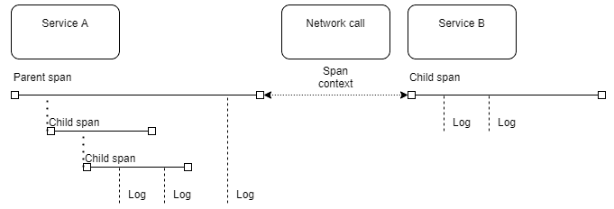

# 第十五章：云原生设计

正如其名称所示，云原生设计描述了首先建立在云中运行的应用程序架构。它不是由单一技术或语言定义的，而是充分利用现代云平台所提供的一切。

这可能意味着在必要时结合使用**平台即服务**（**PaaS**），多云部署，边缘计算，**函数即服务**（**FaaS**），静态文件托管，微服务和托管服务。它超越了传统操作系统的边界。云原生开发人员不再针对 POSIX API 和类 UNIX 操作系统，而是使用诸如 boto3、Pulumi 或 Kubernetes 等库和框架构建更高级别的概念。

本章将涵盖以下主题：

+   理解云原生

+   使用 Kubernetes 编排云原生工作负载

+   使用服务网格连接服务

+   分布式系统中的可观察性

+   采用 GitOps

通过本章结束时，您将对如何在应用程序中使用软件架构的现代趋势有很好的理解。

# 技术要求

本章中的一些示例需要 Kubernetes 1.18。

本章中的代码已放置在 GitHub 上[`github.com/PacktPublishing/Software-Architecture-with-Cpp/tree/master/Chapter15`](https://github.com/PacktPublishing/Software-Architecture-with-Cpp/tree/master/Chapter15)。

# 理解云原生

虽然可以将现有应用程序迁移到云中运行，但这种迁移不会使应用程序成为云原生。它可能在云中运行，但架构选择仍然基于本地模型。

简而言之，云原生应用程序通常是分布式的，松散耦合的，并且可扩展的。它们不受特定的物理基础设施约束，也不需要开发人员考虑特定的基础设施。这类应用程序通常是面向 Web 的。

在本章中，我们将介绍一些云原生构建模块的示例，并描述一些云原生模式。

## 云原生计算基金会

云原生设计的支持者之一是**Cloud Native Computing Foundation**（**CNCF**），它托管了 Kubernetes 项目。CNCF 拥有各种技术，使得更容易构建与云供应商无关的云原生应用程序。此类技术的示例包括以下内容：

+   **Fluentd**，统一的日志记录层

+   **Jaeger**，用于分布式跟踪

+   **Prometheus**，用于监控

+   **CoreDNS**，用于服务发现

云原生应用程序通常使用应用程序容器构建，通常在 Kubernetes 平台上运行。但这不是必需的，完全可以在 Kubernetes 和容器之外使用许多 CNCF 框架。

## 云作为操作系统

云原生设计的主要特点是将各种云资源视为应用程序的构建模块。在云原生设计中，很少使用单独的**虚拟机**（**VMs**）。与针对在某些实例上运行的特定操作系统相反，在云原生方法中，您要么直接针对云 API（例如使用 FaaS），要么针对 Kubernetes 等中间解决方案。在这种意义上，云成为您的操作系统，因为 POSIX API 不再限制您。

随着容器改变了构建和分发软件的方式，现在可以摆脱对基础硬件基础设施的思考。您的软件并非在孤立运行，因此仍然需要连接不同的服务，监视它们，控制它们的生命周期，存储数据或传递秘密。这是 Kubernetes 提供的功能之一，也是它变得如此受欢迎的原因之一。

您可能可以想象，云原生应用程序是面向 Web 和移动设备的。桌面应用程序也可以从具有一些云原生组件中受益，但这是一个不太常见的用例。

在云原生应用程序中仍然可以使用硬件和其他低级访问。如果您的工作负载需要使用 GPU，这不应该阻止您进行云原生。而且，如果您想要访问其他地方无法获得的自定义硬件，云原生应用程序也可以在本地构建。这个术语不仅限于公共云，而是一种思考不同资源的方式。

### 负载平衡和服务发现

负载平衡是分布式应用程序的重要组成部分。它不仅可以将传入的请求分散到一组服务中，这对于扩展至关重要，还可以帮助应用程序的响应性和可用性。智能负载均衡器可以收集指标以应对传入流量的模式，监视其集群中服务器的状态，并将请求转发到负载较轻和响应更快的节点，避免当前不健康的节点。

负载平衡带来更高的吞吐量和更少的停机时间。通过将请求转发到多个服务器，消除了单点故障，尤其是如果使用多个负载均衡器，例如在主备方案中。

负载均衡器可以在架构的任何地方使用：您可以平衡来自 Web 的请求，Web 服务器对其他服务的请求，对缓存或数据库服务器的请求，以及其他满足您需求的请求。

在引入负载平衡时有一些事项需要记住。其中之一是会话持久性——确保来自同一客户的所有请求都发送到同一服务器，这样精心选择的粉红色高跟鞋就不会从他们的购物篮中消失在您的电子商务网站上。负载均衡可能会让会话变得棘手：要特别小心，不要混淆会话，这样客户就不会突然开始被登录到彼此的个人资料中——许多公司在这方面出现过错误，尤其是在添加缓存时。将两者结合起来是一个好主意；只要确保它是正确的方式。

#### 反向代理

即使您只想部署一个服务器实例，将另一个服务添加到负载均衡器之前，而不是负载均衡器，即反向代理，可能是一个好主意。虽然代理通常代表客户端发送一些请求，但反向代理代表处理这些请求的服务器，因此得名。

你问为什么要使用它？有几个原因和用途可以使用这样的代理：

+   **安全性**：您的服务器地址现在被隐藏，服务器可以受到代理的 DDoS 防护能力的保护。

+   **灵活性和可扩展性**：您可以以任何您想要的方式和时间修改代理后面隐藏的基础设施。

+   **缓���**：如果您已经知道服务器将给出什么答案，为什么还要打扰服务器呢？

+   **压缩**：压缩数据将减少所需的带宽，这对于连接质量差的移动用户可能特别有用。它还可以降低您的网络成本（但可能会消耗计算能力）。

+   **SSL 终止**：通过接管加密和解密网络流量的负担，减轻后端服务器的负载。

反向代理的一个例子是**NGINX**。它还提供负载平衡能力、A/B 测试等等。它的另一个能力是服务发现。让我们看看它如何有帮助。

#### 服务发现

正如其名称所示，**服务发现**（**SD**）允许自动检测计算机网络中特定服务的实例。调用者不必硬编码服务应该托管的域名或 IP，而只需指向服务注册表。使用这种方法，您的架构变得更加灵活，因为现在您使用的所有服务都可以很容易地找到。如果您设计了基于微服务的架构，引入 SD 确实可以大有作为。

有几种 SD 的方法。在客户端发现中，调用者直接联系 SD 实例。每个服务实例都有一个注册表客户端，用于注册和注销实例，处理心跳等。虽然相当直接，但在这种方法中，每个客户端都必须实现服务发现逻辑。Netflix Eureka 是在这种方法中常用的服务注册表的一个例子。

另一种方法是使用服务器端发现。在这种情况下，服务注册表也存在，并且每个服务实例中都有注册表客户端。但是，调用者不直接联系它。相反，他们连接到负载均衡器，例如 AWS 弹性负载均衡器，然后再调用服务注册表或使用其内置服务注册表，然后将客户端调用分派到特定实例。除了 AWS ELB，还可以使用 NGINX 和 Consul 来提供服务器端 SD 功能。

我们现在知道如何高效地找到和使用我们的服务，那么让我们学习如何最好地部署它们。

# 使用 Kubernetes 编排云原生工作负载

Kubernetes 是一个可扩展的开源平台，用于自动化和管理容器应用程序。有时被称为 k8s，因为它以'k'开头，以's'结尾，在中间有八个字母。

其设计基于 Borg，这是 Google 内部使用的系统。Kubernetes 中的一些功能包括：

+   应用程序的自动扩展

+   可配置的网络

+   批处理作业执行

+   应用程序的统一升级

+   在其上运行高可用性应用程序的能力

+   声明性配置

在组织中运行 Kubernetes 有不同的方式。选择其中一种需要您分析与其相关的额外成本和收益。

## Kubernetes 结构

虽然可以在单台机器上运行 Kubernetes（例如使用 minikube、k3s 或 k3d），但不建议在生产环境中这样做。单机集群功能有限，没有故障转移机制。Kubernetes 集群的典型大小是六台或更多。其中三台机器组成控制平面。另外三台是工作节点。

三台机器的最低要求来自于这是提供高可用性的最小数量。控制平面节点也可以作为工作节点可用，尽管这并不被鼓励。

### 控制平面

在 Kubernetes 中，您很少与单个工作节点进行交互。相反，所有 API 请求都发送到控制平面。然后，控制平面根据请求决定要采取的操作，然后与工作节点通信。

与控制平面的交互可以采取多种形式：

+   使用 kubectl CLI

+   使用 Web 仪表板

+   从应用程序内部使用 Kubernetes API 而不是 kubectl

控制平面节点通常运行 API 服务器、调度器、配置存储（etcd）以及可能处理特定需求的其他一些附加进程。例如，在 Google Cloud Platform 等公共云中部署的 Kubernetes 集群上，控制平面节点上运行云控制器。云控制器与云提供商的 API 交互，以替换失败的机器、提供负载均衡器或分配外部 IP 地址。

### 工作节点

构成控制平面和工作节点池的节点是实际运行工作负载的机器。它们可以是你在本地托管的物理服务器，私有托管的 VM，或者来自你的云提供商的 VM。

集群中的每个节点至少运行以下三个程序：

+   容器运行时（例如 Docker Engine 或 cri-o），允许机器处理应用程序容器

+   kubelet，负责接收来自控制平面的请求，并根据这些请求管理单个容器

+   kube-proxy，负责节点级别的网络和负载平衡

## 部署 Kubernetes 的可能方法

正如你从阅读前一节中所了解的，部署 Kubernetes 有不同的可能方式。

其中一种方法是将其部署到本地托管的裸金属服务器上。其中一个好处是对于大规模应用程序来说，这可能比云提供商提供的更便宜。这种方法有一个主要缺点——当需要时，你将需要操作员提供额外的节点。

为了缓解这个问题，你可以在裸金属服务器上运行一个虚拟化设备。这样就可以使用 Kubernetes 内置的云控制器自动提供必要的资源。你仍然可以控制成本，但手动工作会减少。虚拟化会增加一些开销，但在大多数情况下，这应该是一个公平的权衡。

如果你不想自己托管服务器，你可以部署 Kubernetes 在云提供商的 VM 上运行。通过选择这种方式，你可以使用一些现有的模板进行最佳设置。在流行的云平台上有 Terraform 和 Ansible 模块可用于构建集群。

最后，主要云服务提供商提供的托管服务。在其中一些服务中，你只需要为工作节点付费，而控制平面是免费的。

在公共云中运行时，为什么会选择自托管的 Kubernetes 而不是托管服务？其中一个原因可能是你需要的特定版本的 Kubernetes。当涉及到引入更新时，云提供商通常会有些慢。

## 理解 Kubernetes 的概念

Kubernetes 引入了一些概念，如果你第一次听到它们可能会感到陌生或困惑。当你了解它们的目的时，就会更容易理解 Kubernetes 的特殊之处。以下是一些最常见的 Kubernetes 对象：

+   *容器*，特别是应用容器，是一种分发和运行单个应用程序的方法。它包含了在任何地方运行未经修改的应用程序所需的代码和配置。

+   *Pod*是基本的 Kubernetes 构建块。它是原子的，由一个或多个容器组成。Pod 中的所有容器共享相同的网络接口、卷（如持久存储或秘密）和资源（CPU 和内存）。

+   *部署*是一个描述工作负载及其生命周期特性的高级对象。它通常管理一组 pod 副本，允许滚动升级，并在失败时管理回滚。这使得扩展和管理 Kubernetes 应用程序的生命周期变得容易。

+   *DaemonSet*是一个类似于部署的控制器，它管理 pod 的分布位置。部署关注保持给定数量的副本，而 DaemonSets 将 pod 分布在所有工作节点上。主要用例是在每个节点上运行系统级服务，比如监控或日志代理。

+   *Jobs*设计用于一次性任务。部署中的 pod 在其中的容器终止时会自动重新启动。它们适用于所有始终开启的服务，以便监听网络端口的请求。但是，部署不适用于批处理作业，例如缩略图生成，您只希望在需要时运行。作业创建一个或多个 pod，并监视它们直到完成给定的任务。当特定数量的成功 pod 终止时，作业被视为完成。

+   *CronJobs*，顾名思义，是定期在集群中运行的作业。

+   *服务*代表集群中执行的特定功能。它们有与之关联的网络端点（通常是负载平衡）。服务可以由一个或多个 pod 执行。服务的生命周期独立于许多 pod 的生命周期。由于 pod 是瞬时的，它们可以随时创建和销毁。服务将个体 pod 抽象出来，以实现高可用性。服务具有自己的 IP 地址和 DNS 名称，以便使用。

### 声明性方法

我们在[第九章](https://cdp.packtpub.com/hands_on_software_architecture_with_c__/wp-admin/post.php?post=33&action=edit)中已经介绍了声明性和命令式方法之间的区别，*持续集成/持续部署*。Kubernetes 采用声明性方法。您不是提供关于需要采取的步骤的指示，而是提供描述集群所需状态的资源。由控制平面来分配内部资源，以满足您的需求。

可以直接使用命令行添加资源。这对于测试可能很快，但大多数时候您希望有您创建的资源的记录。因此，大多数人使用清单文件，这些文件提供所需资源的编码描述。清单通常是 YAML 文件，但也可以使用 JSON。

这是一个具有单个 Pod 的示例 YAML 清单：

```cpp
apiVersion: v1

kind: Pod

metadata:

  name: simple-server

  labels:

    app: dominican-front

spec:

  containers:

    - name: webserver

      image: nginx

      ports:

        - name: http

          containerPort: 80

          protocol: TCP
```

第一行是必需的，它告诉清单中将使用哪个 API 版本。某些资源仅在扩展中可用，因此这是解析器如何行为的信息。

第二行描述了我们正在创建的资源。接下来是元数据和资源的规范。

元数据中的名称是必需的，因为这是区分一个资源和另一个资源的方式。如果我们想要创建另一个具有相同名称的 pod，我们将收到一个错误，指出已经存在这样的资源。标签是可选的，在编写选择器时非常有用。例如，如果我们想要创建一个允许连接到 pod 的服务，我们将使用一个匹配标签应用程序的选择器，其值等于`dominican-front`。

规范也是必需的部分，因为它描述了资源的实际内容。在我们的示例中，我们列出了在 pod 内运行的所有容器。准确地说，一个名为`webserver`的容器，使用来自 Docker Hub 的图像`nginx`。由于我们希望从外部连接到 Nginx web 服务器，我们还公开了服务器正在侦听的容器端口`80`。端口描述中的名称是可选的。

## Kubernetes 网络

Kubernetes 允许可插拔的网络架构。根据要求，可以使用几种驱动程序。无论选择哪个驱动程序，一些概念是通用的。以下是典型的网络场景。

### 容器与容器之间的通信

单个 pod 可以托管多个不同的容器。由于网络接口绑定到 pod 而不是容器，每个容器在相同的网络命名空间中运行。这意味着各种容器可以使用本地主机网络相互通信。

### Pod 与 Pod 之间的通信

每个 pod 都有一个分配的内部集群本地 IP 地址。一旦 pod 被删除，该地址就不会持久存在。当一个 pod 知道另一个 pod 的地址时，它可以连接到另一个 pod 的暴露端口，因为它们共享相同的扁平网络。就这种通信模型而言，您可以将 pod 视为托管容器的 VM。这很少被使用，因为首选方法是 pod 到服务的通信。

### pod 到服务的通信

pod 到服务的通信是集群内通信的最常见用例。每个服务都有一个分配的 IP 地址和 DNS 名称。当一个 pod 连接到一个服务时，连接被代理到服务选择的组中的一个 pod。代理是早期描述的 kube-proxy 工具的任务。

### 外部到内部的通信

外部流量通常通过负载均衡器进入集群。这些负载均衡器要么与特定服务绑定，要么由特定服务处理。当外部暴露的服务处理流量时，它的行为类似于 pod 到服务的通信。通过 Ingress 控制器，您可以使用其他功能，如路由、可观察性或高级负载平衡。

## 使用 Kubernetes 是一个好主意吗？

在组织内引入 Kubernetes 需要一些投资。Kubernetes 提供了许多好处，如自动扩展、自动化或部署方案。然而，这些好处可能无法证明必要的投资。

这项投资涉及几个领域：

+   **基础设施成本**：运行控制平面和工作节点所需的成本可能相对较高。此外，如果您想使用各种 Kubernetes 扩展，如 GitOps 或服务网格（稍后描述），成本可能会上升。它们还需要额外的资源来运行，并在您的应用程序常规服务的基础上提供更多的开销。除了节点本身，您还应考虑其他成本。一些 Kubernetes 功能在部署到支持的云提供商时效果最佳。这意味着为了从这些功能中受益，您必须选���以下路线之一：

a. 将您的工作负载移至特定支持的云。

b. 为您选择的云提供商实现自己的驱动程序。

c. 将您的本地基础架构迁移到虚拟化的 API 启用环境，如 VMware vSphere 或 OpenStack。

+   **运营成本**：Kubernetes 集群和相关服务需要维护。尽管您的应用程序需要较少的维护，但这一好处略微被保持集群运行的成本所抵消。

+   **教育成本**：您的整个产品团队都必须学习新概念。即使您有一个专门的平台团队为开发人员提供易于使用的工具，开发人员仍需要基本了解他们的工作如何影响整个系统以及他们应该使用哪个 API。

在决定引入 Kubernetes 之前，首先考虑一下您是否能负担起它所需的初始投资。

# 分布式系统中的可观察性

诸如云原生架构之类的分布式系统提出了一些独特的挑战。在任何给定时间，不同服务的数量使得调查组件的性能变得非常不方便。

在单片系统中，通常日志记录和性能监控就足够了。在分布式系统中，即使日志记录也需要设计选择。不同的组件产生不同的日志格式。这些日志必须存储在某个地方。将它们与提供它们的服务放在一起，将使在停机情况下获得整体情况变得具有挑战性。此外，由于微服务可能存在时间很短，您将希望将日志的生命周期与提供它们的服务或托管服务的机器的生命周期解耦。

在第十三章中，*设计微服务*，我们描述了统一的日志记录层如何帮助管理日志。但日志只显示系统中特定点发生的情况。要从单个事务的角度看到整个图片，您需要采用不同的方法。

这就是追踪的作用。

## 追踪与日志记录的不同之处

追踪是日志记录的一种专门形式。它提供的信息比日志更低级。这可能包括所有函数调用、它��的参数、大小和执行时间。它们还包含正在处理的事务的唯一 ID。这些细节使得重新组装它们并查看给定事务在系统中的生命周期成为可能。

追踪中的性能信息可帮助您发现系统中的瓶颈和次优组件。

尽管日志通常由操作员和开发人员阅读，但它们往往是人类可读的。对于追踪没有这样的要求。要查看跟踪，您将使用专用的可视化程序。这意味着即使跟踪更详细，它们可能也比日志占用更少的空间。

以下图表是单个跟踪的概述：



图 15.1 - 单个跟踪

两个服务通过网络通信。在*Service A*中，我们有一个包含子跨度和单个日志的父跨度。子跨度通常对应于更深层的函数调用。日志代表最小的信息片段。它们中的每一个都被计时，并可能包含其他信息。

对*Service B*的网络调用保留了跨度上下文。即使*Service B*在另一台机器上的不同进程中执行，所有信息也可以稍后重新组装，因为事务 ID 得以保留。

我们从重新组装跟踪中获得的额外信息是我们分布式系统中服务之间的���赖关系图。由于跟踪包含整个调用链，因此可以可视化此信息并检查意外的依赖关系。

## 选择追踪解决方案

在实施追踪时，有几种可能的解决方案可供选择。正如您可能想象的那样，您可以使用自托管工具和托管工具来为您的应用程序进行仪器化。我们将简要描述托管工具，并重点关注自托管工具。

### Jaeger 和 OpenTracing

分布式跟踪的标准之一是 Jaeger 的作者提出的 OpenTracing。Jaeger 是为云原生应用程序构建的跟踪器。它解决了监视分布式事务和传播跟踪上下文的问题。它对以下目的很有用：

+   性能或延迟优化

+   执行根本原因分析

+   分析服务之间的依赖关系

OpenTracing 是一个开放标准，提供了一个独立于使用的跟踪器的 API。这意味着当您的应用程序使用 OpenTracing 进行仪器化时，您避免了对特定供应商的锁定。如果在某个时候，您决定从 Jaeger 切换到 Zipkin、DataDog 或任何其他兼容的跟踪器，您不必修改整个仪器化代码。

有许多与 OpenTracing 兼容的客户端库。您还可以找到许多资源，包括教程和文章，解释如何根据您的需求实现 API。OpenTracing 官方支持以下语言：

+   Go

+   JavaScript

+   Java

+   Python

+   Ruby

+   PHP

+   Objective-C

+   C++

+   C#

还有一些非官方的库可用，特定应用程序也可以导出 OpenTracing 数据。这包括 Nginx 和 Envoy，两个流行的 Web 代理。

Jaeger 还接受 Zipkin 格式的样本。我们将在下一节中介绍 Zipkin。这意味着如果您（或您的任何依赖项）已经使用 Zipkin，您就不必将仪器从一种格式重写为另一种格式。对于所有新应用程序，OpenTracing 是推荐的方法。

Jaeger 的扩展性很好。您可以将其作为单个二进制文件或单个应用程序容器来运行以进行评估。您可以配置 Jaeger 以在生产中使用其自己的后端或支持的外部后端，如 Elasticsearch、Cassandra 或 Kafka。

Jaeger 是一个 CNCF 毕业项目。这意味着它已经达到了与 Kubernetes、Prometheus 或 Fluentd 类似的成熟水平。因此，我们期望它在其他 CNCF 应用程序中获得更多支持。

### Zipkin

Jaeger 的主要竞争对手是 Zipkin。这是一个更老的项目，这意味着它更加成熟。通常，更老的项目也会得到更好的支持，但在这种情况下，CNCF 的认可对 Jaeger 更有利。

Zipkin 使用其专有协议来处理跟踪。它支持 OpenTracing，但可能不具有与本机 Jaeger 协议相同的成熟度和支持水平。正如我们之前提到的，还可以配置 Jaeger 以收集 Zipkin 格式的跟踪。这意味着这两者至少在某种程度上是可以互换的。

该项目由 Apache 基金会托管，但不被视为 CNCF 项目。在开发云原生应用程序时，Jaeger 是一个更好的选择。如果您正在寻找一个多用途的跟踪解决方案，那么考虑 Zipkin 也是值得的。

Zipkin 没有支持的 C++实现是一个缺点。有非官方的库，但似乎支持不够好。使用 C++ OpenTracing 库是仪表化 C++代码的首选方式。

## 使用 OpenTracing 为应用程序添加仪表

本节将说明如何向现有应用程序添加 Jaeger 和 OpenTracing 的仪表。我们将使用`opentracing-cpp`和`jaeger-client-cpp`库。

首先，我们要设置跟踪器：

```cpp
#include <jaegertracing/Tracer.h>


void setUpTracer()

{

    // We want to read the sampling server configuration from the 
    // environment variables

    auto config = jaegertracing::Config;
    config.fromEnv();

    // Jaeger provides us with ConsoleLogger and NullLogger

    auto tracer = jaegertracing::Tracer::make(

        "customer", config, jaegertracing::logging::consoleLogger());

    opentracing::Tracer::InitGlobal(

        std::static_pointer_cast<opentracing::Tracer>(tracer));

}
```

配置采样服务器的两种首选方法要么使用环境变量，就像我们做的那样，要么使用 YAML 配置文件。当使用环境变量时，我们必须在运行应用程序之前设置它们。最重要的是以下几个：

+   `JAEGER_AGENT_HOST`：Jaeger 代理所在的主机名

+   `JAEGER_AGENT_POR`：Jaeger 代理正在监听的端口

+   `JAEGER_SERVICE_NAME`：我们应用程序的名称

接下来，我们配置跟踪器并提供日志记录实现。如果可用的`ConsoleLogger`不够，可以实现自定义日志记录解决方案。对于基于容器的应用程序，统一的日志记录层，`ConsoleLogger`应该足够了。

当我们设置好跟踪器后，我们希望在要仪表化的函数中添加 span。以下代码就是这样做的：

```cpp
auto responder::respond(const http_request &request, status_code status,

                        const json::value &response) -> void {

  auto span = opentracing::Tracer::Global()->StartSpan("respond");

  // ...

}
```

这个 span 可以在以后用来在给定函数内创建子 span。它也可以作为参数传播到更深的函数调用中。它的使用方式如下：

```cpp
auto responder::prepare_response(const std::string &name, const std::unique_ptr<opentracing::Span>& parentSpan)

    -> std::pair<status_code, json::value> {

  auto span = opentracing::Tracer::Global()->StartSpan(

        "prepare_response", { opentracing::ChildOf(&parentSpan->context()) });

  return {status_codes::OK,

          json::value::string(string_t("Hello, ") + name + "!")};

}


auto responder::respond(const http_request &request, status_code status)

    -> void {

  auto span = opentracing::Tracer::Global()->StartSpan("respond");

  // ...

  auto response = this->prepare_response("Dominic", span);

  // ...

}
```

当我们调用`opentracing::ChildOf`函数时，上下文传播就会发生。我们还可以使用`inject()`和`extract()`调用通过网络调用传递上下文。

# 使用服务网格连接服务

微服务和云原生设计带来了一系列问题。不同服务之间的通信、可观察性、调试、速率限制、身份验证、访问控制和 A/B 测试可能会具有挑战性，即使服务数量有限。随着服务数量的增加，上述要求的复杂性也会增加。

这就是服务网格介入的地方。简而言之，服务网格通过一些资源（运行控制平面和边车所需的资源）来交换自动化和集中控制的解决方案，以解决上述挑战。

## 引入服务网格

我们在本章介绍中提到的所有要求以前都是在应用程序内部编码的。事实证明，许多要求可以被抽象化，因为它们在许多不同的应用程序中共享。当您的应用程序由许多服务组成时，向所有这些服务添加新功能开始变得昂贵。通过服务网格，您可以从一个单一点控制这些功能。

由于容器化工作流已经抽象化了一些运行时和一些网络，服务网格将抽象化提升到了另一个层次。这样，容器中的应用程序只知道 OSI 网络模型的应用程序级别发生了什么。服务网格处理更低级别的内容。

设置服务网格允许您以一种新的方式控制所有网络流量，并更好地了解这些流量。依赖关系变得可见，流动、形状和流量量也变得可见。

服务网格不仅处理流量的流动。其他流行的模式，如断路器、速率限制或重试，不必由每个应用程序单独实现和配置。这也是可以外包给服务网格的功能。同样，A/B 测试或金丝雀部署是服务网格能够实现的用例。

正如之前提到的，服务网格的一个好处是更大的控制权。其架构通常包括一个可管理的外部流量边缘代理和通常部署为旁路的内部代理。这样，网络策略可以被编写为代码，并存储在一个地方与所有其他配置一起。与为要连接的两个服务打开双向 TLS 加密相比，您只需在服务网格配置中启用一次该功能。

接下来，我们将介绍一些服务网格解决方案。

## 服务网格解决方案

这里描述的所有解决方案都是自托管的。

### Istio

Istio 是一组强大的服务网格工具。它允许您通过部署 Envoy 代理作为旁路容器来连接微服务。由于 Envoy 是可编程的，Istio 控制平面的配置更改会被传达给所有代理，然后代理会相应地重新配置自己。

Envoy 代理除了其他功能外，还负责处理加密和身份验证。使用 Istio，为服务之间启用双向 TLS 通常只需要在配置中进行一次切换。如果您不希望所有服务之间都使用 mTLS，您还可以选择那些需要此额外保护的服务，同时允许其他所有服务之间的未加密流量。

Istio 还有助于可观察性。首先，Envoy 代理导出与 Prometheus 兼容的代理级别指标。 Istio 还导出服务级别指标和控制平面指标。接下来，有描述网格内流量流动的分布式跟踪。Istio 可以将跟踪提供给不同的后端：Zipkin、Jaeger、Lightstep 和 Datadog。最后，还有 Envoy 访问日志，以类似 Nginx 的格式显示每个调用。

使用 Kiali 可以可视化您的网格，这是一个交互式的 Web 界面。这样，您可以看到服务的图表，包括加密是否已启用，不同服务之间流量的大小，以及每个服务的健康检查状态。

Istio 的作者声称，这种服务网格应该与不同的技术兼容。在撰写本文时，最好的文档化、最好的集成和最好的测试是与 Kubernetes 的集成。其他支持的环境包括本地环境、通用云、Mesos 和带有 Consul 的 Nomad。

如果您在关注合规性的行业工作（如金融机构），那么 Istio 可以在这些方面提供帮助。

#### Envoy

虽然 Envoy 本身不是服务网格，但由于其在 Istio 中的使用，它值得在本节中提及。

Envoy 是一个类似于 Nginx 或 HAProxy 的服务代理。主要区别在于它可以动态重新配置。这是通过 API 以编程方式实现的，不需要更改配置文件然后重新加载守护程序。

关于 Envoy 的有趣事实是其性能和流行度。根据 SolarWinds 进行的测试，Envoy 在作为服务代理时击败了竞争对手。这些竞争对手包括 HAProxy、Nginx、Traefik 和 AWS 应用负载均衡器。Envoy 比 Nginx、HAProxy、Apache 和 Microsoft IIS 等这个领域的老牌领导者要年轻得多，但这并没有阻止 Envoy 进入 Netcraft 最常用的前 10 名网页服务器列表。

### Linkerd

在 Istio 成为服务网格的代名词之前，这个领域由 Linkerd 代表。关于命名存在一些混淆，因为最初的 Linkerd 项目旨在是平台无关的，并且针对 Java 虚拟机。这意味着它资源密集且经常运行缓慢。更新的版本 Linkerd2 已经重写以解决这些问题。与最初的 Linkerd 相反，Linkerd2 只专注于 Kubernetes。

Linkerd 和 Linkerd2 都使用自己的代理解决方案，而不是依赖于 Envoy 等现有项目。这样做的理由是，专用代理（而不是通用的 Envoy）提供了更好的安全性和性能。Linkerd2 的一个有趣特性是，开发它的公司也提供付费支持。

### Consul 服务网格

服务网格领域的最新增加是 Consul 服务网格。这是 HashiCorp 的产品，这家知名的云公司以 Terraform、Vault、Packer、Nomad 和 Consul 等工具而闻名。

就像其他解决方案一样，它具有 mTLS 和流量管理。它被宣传为一个多云、多数据中心和多地区的网格。它与不同的平台、数据平面产品和可观察性提供者集成。在撰写本文时，现实情况要逊色一些，因为主要支持的平台是 Nomad 和 Kubernetes，而支持的代理要么是内置代理，要么是 Envoy。

如果您考虑使用 Nomad 来部署应用程序，那么 Consul 服务网格可能是一个很好的选择，因为两者都是 HashiCorp 产品。

# GitOps 进行中

本章我们想要讨论的最后一个话题是 GitOps。尽管这个术语听起来很新潮，但其背后的理念并不是全新的。它是**持续集成**/**持续部署**（**CI**/**CD**）模式的延伸。或许延伸并不是一个很好的描述。

虽然 CI/CD 系统通常旨在非常灵活，但 GitOps 旨在最小化可能的集成数量。两个主要的常量是 Git 和 Kubernetes。Git 用于版本控制、发布管理和环境分离。Kubernetes 用作标准化和可编程的部署平台。

这样，CI/CD 流水线几乎变得透明。这与处理构建的所有阶段的命令式代码的方法相反。为了允许这种抽象级别，通常需要以下内容：

+   基础设施即代码，以允许所有必要环境的自动化部署

+   具有功能分支和拉取请求或合并请求的 Git 工作流

+   声明性工作流配置，这在 Kubernetes 中已经��用

## GitOps 的原则

由于 GitOps 是已建立的 CI/CD 模式的延伸，可能很难清楚地区分两者。以下是一些 GitOps 原则，它们将这种方法与通用的 CI/CD 区分开来。

### 声明性描述

经典 CI/CD 系统和 GitOps 之间的主要区别在于操作模式。大多数 CI/CD 系统是命令式的：它们由一系列必须按顺序执行的步骤组成，以使管道成功。

即使管道的概念是必要的，因为它意味着一个具有入口、一组连接和一个接收器的对象。一些步骤可以并行执行，但是每当存在依赖关系时，进程必须停止并等待依赖步骤完成。

在 GitOps 中，配置是声明性的。这指的是系统的整个状态 - 应用程序、它们的配置、监控和仪表板。所有这些都被视为代码，具有与常规应用程序代码相同的特性。

### 系统的状态在 Git 中进行版本控制

由于系统的状态是以代码编写的，您从中获得了一些好处。诸如更容易的审计、代码审查和版本控制等功能现在不仅适用于应用程序代码。其结果是，如果出现任何问题，恢复���工作状态只需要一个`git revert`命令。

您可以利用 Git 的签名提交、SSH 和 GPG 密钥来控制不同环境。通过添加一个门控机制，确保只有符合要求标准的提交才能推送到存储库，您还可以消除许多可能由手动运行`ssh`或`kubectl`命令而导致的意外错误。

### 可审计

您存储在版本控制系统中的所有内容都可以进行审计。在引入新代码之前，您进行代码审查。当您注意到错误时，您可以撤消引入错误的更改，或者返回到上一个工作版本。您的存储库成为关于整个系统的唯一真相。

将其应用于应用程序代码时已经很有用。然而，将审计配置、辅助服务、指标、仪表板甚至部署策略的能力扩展，使其变得更加强大。您不再需要问自己，“好吧，为什么这个配置最终进入了生产环境？”您只需要检查 Git 日志。

### 与已建立的组件集成

大多数 CI/CD 工具引入了专有的配置语法。Jenkins 使用 Jenkins DSL。每个流行的 SaaS 解决方案都使用 YAML，但这些 YAML 文件彼此不兼容。您无法在 Travis 和 CircleCI 之间切换，也无法在 CircleCI 和 GitLab CI 之间切换，而无需重写您的管道。

这有两个缺点。一个是明显的供应商锁定。另一个是需要学习配置语法以使用给定的工具。即使您的大部分管道已在其他地方定义（shell 脚本、Dockerfile 或 Kubernetes 清单），您仍然需要编写一些粘合代码来指示 CI/CD 工具使用它。

GitOps 与之不同。在这里，您不编写显式指令或使用专有语法。相反，您可以重用其他常见标准，例如 Helm 或 Kustomize。需要学习的内容更少，迁移过程更加轻松。此外，GitOps 工具通常与 CNCF 生态系统中的其他组件很好地集成，因此您可以将部署指标存储在 Prometheus 中，并使用 Grafana 进行审计。

### 配置漂移预防

配置漂移发生在给定系统的当前状态与存储库中描述的期望状态不同时。多种原因导致了配置漂移。

例如，让我们考虑一个具有基于 VM 的工作负载的配置管理工具。所有 VM 都以相同的状态启动。当 CM 第一次运行时，它将机器带到期望的状态。但是，如果默认情况下在这些机器上运行自动更新代理，该代理可能会自行更新一些软件包，而不考虑 CM 中的期望状态。此外，由于网络连接可能不稳定，一些机器可能会更新到软件包的新版本，而其他机器则不会。

在极端情况下，更新的软件包可能与您的应用程序所需的固定软件包不兼容。这种情况将破坏整个 CM 工作流程，并使您的机器处于不可用状态。

使用 GitOps，系统内始终运行着一个代理，用于跟踪系统的当前状态和期望状态。如果当前状态突然与期望状态不同，代理可以修复它或发出有关配置漂移的警报。

防止配置漂移为您的系统增加了另一层自愈。如果您正在运行 Kubernetes，您已经在 Pod 级别上具有自愈能力。每当一个 Pod 失败时，另一个将在其位置重新创建。如果您在其下使用可编程基础设施（例如云提供商或本地 OpenStack），您还具有节点的自愈能力。通过 GitOps，您可以获得工作负载及其配置的自愈。

## GitOps 的好处

正如您可以想象的那样，GitOps 的描述功能提供了几个好处。以下是其中一些。

### 提高生产力

CI/CD 流水线已经自动化了许多常规任务。它们通过帮助进行更多部署来减少交付时间。GitOps 增加了一个反馈循环，可以防止配置漂移并允许自愈。这意味着您的团队可以更快地交付，并且不必担心引入潜在问题，因为它们很容易恢复。这反过来意味着开发吞吐量增加，您可以更快地引入新功能并更有信心。

### 更好的开发人员体验

使用 GitOps，开发人员不必担心构建容器���使用 kubectl 来控制集群。部署新功能只需要使用 Git，这在大多数环境中已经是一个熟悉的工具。

这也意味着入职速度更快，因为新员工不必学习很多新工具才能提高工作效率。GitOps 使用标准和一致的组件，因此对运营方面的更改不应影响开发人员。

### 更高的稳定性和可靠性

使用 Git 来存储系统状态意味着您可以访问审计日志。该日志包含所有引入的更改的描述。如果您的任务跟踪系统与 Git 集成（这是一个好习惯），通常可以确定与系统更改相关的业务功能。

使用 GitOps，不需要手动访问节点或整个集群的需求减少了，这减少了因运行无效命令而产生意外错误的机会。通过使用 Git 强大的还原功能，可以轻松修复系统中出现的随机错误。

从严重灾难（如失去整个控制平面）中恢复也更容易。所需的只是设置一个新的干净集群，在那里安装一个 GitOps 运算符，并将其指向具有您配置的存储库。不久之后，您将获得与以前的生产系统完全相同的副本，而无需手动干预。

### 提高安全性

减少对集群和节点的访问需求意味着提高了安全性。在丢失或盗窃密钥方面可以少操心。您避免了这样一种情况：即使某人不再在团队（或公司）工作，但仍然保留对生产环境的访问权限。

当涉及对系统的访问时，Git 存储库处理单一真相。即使恶意行为者决定在系统中引入后门，所需的更改也将经过代码审查。当您的存储库使用具有强验证的 GPG 签名提交时，冒充其他开发人员也更具挑战性。

到目前为止，我们主要讨论了从开发和运营角度的好处。但是 GitOps 也有利于业务。它为系统提供了业务可观察性，这是以前很难实现的。

很容易跟踪给定发布中存在的功能，因为它们都存储在 Git 中。由于 Git 提交了一个任务跟踪器的链接，业务人员可以获得预览链接，以查看应用程序在各种开发阶段的外观。

它还提供了清晰度，可以回答以下常见问题：

+   生产环境中运行什么？

+   上一个发布解决了哪些问题？

+   哪个更改可能导致服务降级？

所有这些答案的问题甚至可以在友好的仪表板中呈现。当然，仪表板本身也可以存储在 Git 中。

## GitOps 工具

GitOps 空间是一个新兴的领域。已经有一些可以被认为是稳定和成熟的工具。以下是一些最受欢迎的工具。

### FluxCD

FluxCD 是 Kubernetes 的一个主观的 GitOps 操作者。选择的集成提供核心功能。它使用 Helm 图表和 Kustomize 来描述资源。

它与 Prometheus 的集成为部署过程增加了可观察性。为了帮助维护，FluxCD 具有 CLI。

### ArgoCD

与 FluxCD 不同，它提供了更广泛的工具选择。如果您已经在配置中使用 Jsonnet 或 Ksonnet，这可能会很有用。与 FluxCD 一样，它与 Prometheus 集成，并具有 CLI。

在撰写本书时，ArgoCD 比 FluxCD 更受欢迎。

### Jenkins X

与名称可能暗示的相反，Jenkins X 与著名的 Jenkins CI 系统没有太多共同之处。它由同一家公司支持，但 Jenkins 和 Jenkins X 的整个概念完全不同。

虽然其他两个工具都是特意小而自包含的，但 Jenkins X 是一个复杂的解决方案，具有许多集成和更广泛的范围。它支持触发自定义构建任务，使其看起来像是经典 CI/CD 系统和 GitOps 之间的桥梁。

# 总结

恭喜您完成了本章的阅读！使用现代 C++不仅仅是理解最近添加的语言特性。您的应用程序将在生产环境中运行。作为架构师，您还可以选择确保运行时环境符合要求。在前几章中，我们描述了分布式应用程序中的一些流行趋势。我们希��这些知识将帮助您决定哪种最适合您的产品。

进行云原生转型带来了许多好处，并且可以自动化大部分工作流程。将定制工具切换到行业标准可以使您的软件更具弹性并更易于更新。在本章中，我们已经涵盖了流行的云原生解决方案的优缺点和用例。

一些工具，如 Jaeger 的分布式跟踪，对大多数项目都带来了即时的好处。其他工具，如 Istio 或 Kubernetes，在大规模操作中表现最佳。阅读本章后，您应该具有足够的知识来决定是否值得为您的应用程序引入云原生设计。

# 问题

1.  在云中运行应用程序和使其成为云原生之间有什么区别？

1.  如何在本地运行云原生应用程序？

1.  Kubernetes 的最小高可用集群大小是多少？

1.  哪个 Kubernetes 对象代表允许网络连接的微服务？

1.  为什么在分布式系统中日志记录不足够？

1.  服务网格如何帮助构建安全系统？

1.  GitOps 如何提高生产力？

1.  监控的标准 CNCF 项目是什么？

# 进一步阅读

+   *精通 Kubernetes*：[`www.packtpub.com/product/mastering-kubernetes-third-edition/9781839211256`](https://www.packtpub.com/product/mastering-kubernetes-third-edition/9781839211256)

+   *精通分布式跟踪*：[`www.packtpub.com/product/mastering-distributed-tracing/9781788628464`](https://www.packtpub.com/product/mastering-distributed-tracing/9781788628464)

+   《精通服务网格》：[`www.packtpub.com/product/mastering-service-mesh/9781789615791`](https://www.packtpub.com/product/mastering-service-mesh/9781789615791)
