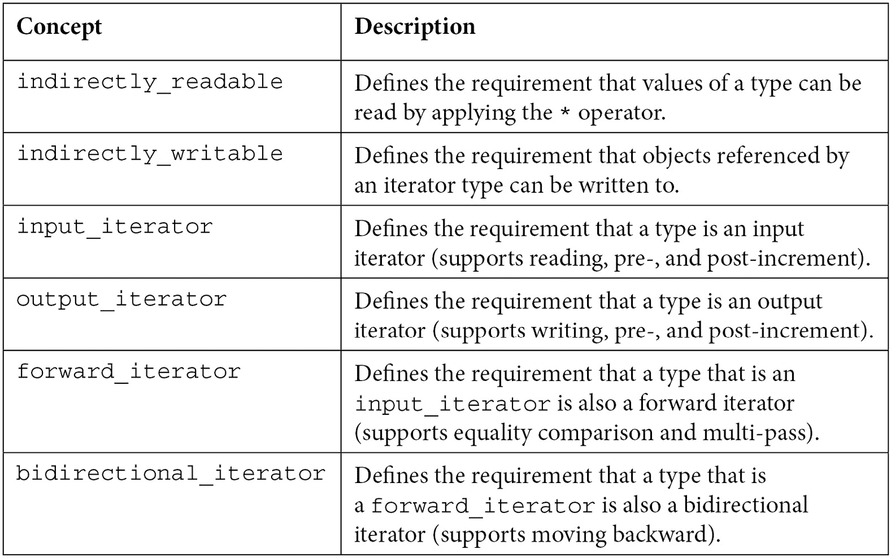
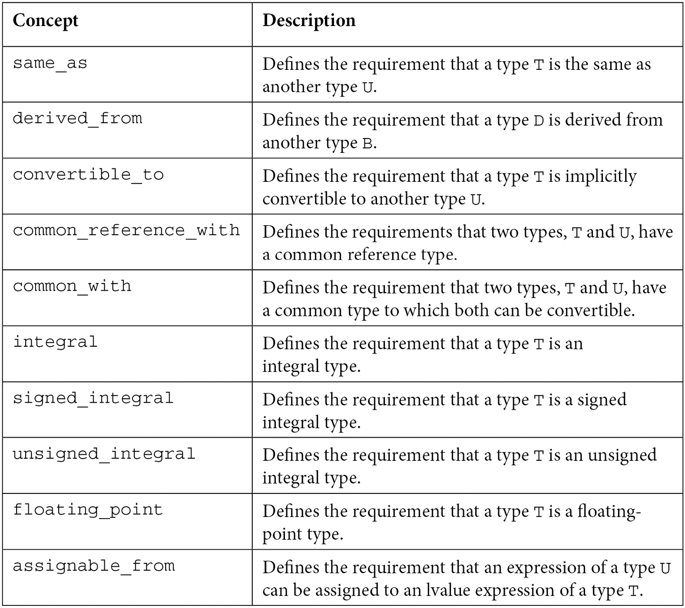
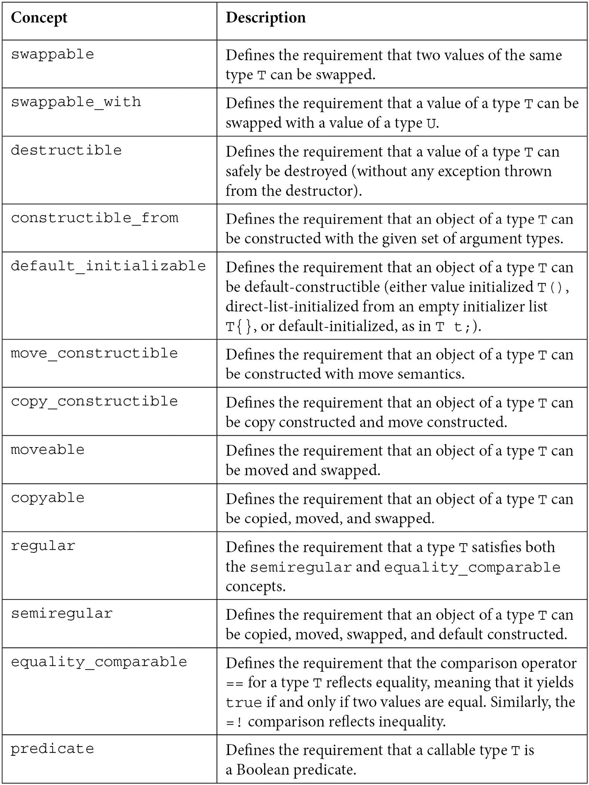
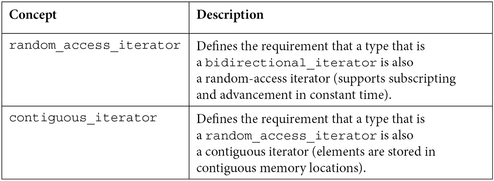
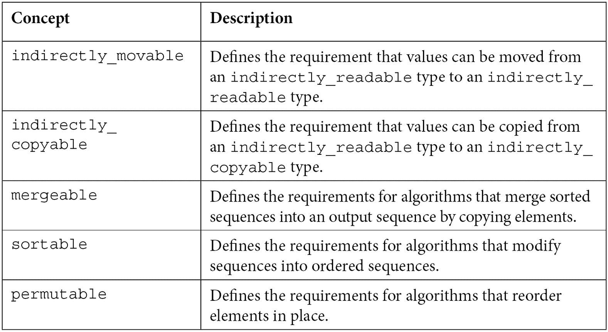
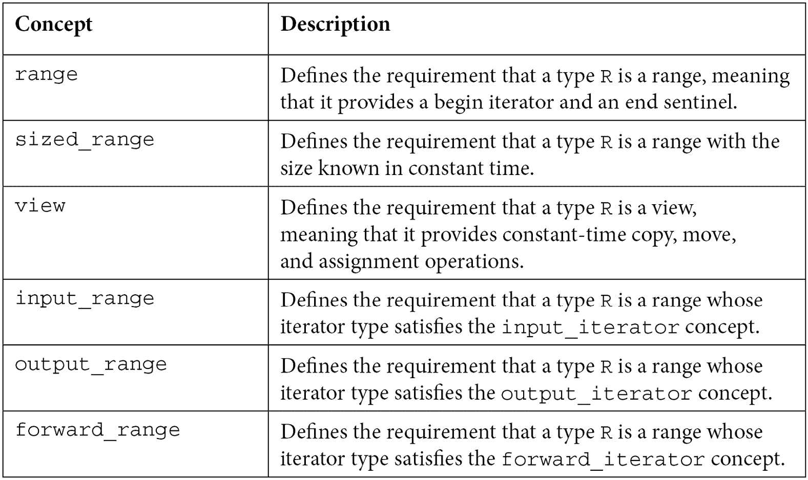
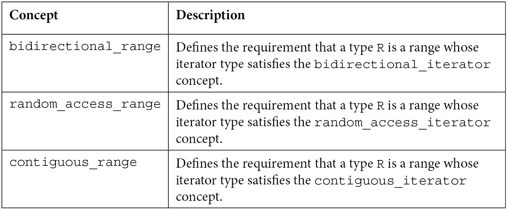

# 第六章：*第六章*：概念和约束

C++20 标准通过概念和约束提供了一系列对模板元编程的重大改进。**约束**是一种现代的方式来定义对模板参数的要求。**概念**是一组命名的约束。概念为传统的模板编写方式提供了几个好处，主要是代码可读性的提高、更好的诊断和减少编译时间。

在本章中，我们将讨论以下主题：

+   理解概念的需求

+   定义概念

+   探索需求表达式

+   编写约束

+   了解带有约束的模板的排序

+   限制非模板成员函数

+   限制类模板

+   限制变量模板和模板别名

+   学习更多指定约束的方式

+   使用概念来约束`auto`参数

+   探索标准概念库

到本章结束时，你将很好地理解 C++20 的概念，并对标准库提供哪些概念有一个概述。

我们将本章的讨论从探讨导致概念发展的原因及其主要好处开始。

# 理解概念的需求

如本章引言中简要提到的，概念提供了一些重要的好处。可以说，其中最重要的好处是代码可读性和更好的错误信息。在我们查看如何使用概念之前，让我们回顾一个之前看到的例子，并看看它与这两个编程方面有什么关系：

```cpp
template <typename T>
```

```cpp
T add(T const a, T const b)
```

```cpp
{
```

```cpp
   return a + b;
```

```cpp
}
```

这个简单的函数模板接受两个参数并返回它们的和。实际上，它并不返回和，而是将加法运算符应用于两个参数的结果。用户定义的类型可以重载此运算符并执行某些特定操作。术语“和”仅在讨论数学类型时才有意义，例如整数类型、浮点类型、`std::complex`类型、矩阵类型、向量类型等。

例如，对于字符串类型，加法运算符可以表示连接。而对于大多数类型，其重载根本没有任何意义。因此，仅通过查看函数的声明，而不检查其主体，我们并不能真正地说这个函数可能接受什么作为输入以及它做什么。我们可以这样调用这个函数：

```cpp
add(42, 1);       // [1]
```

```cpp
add(42.0, 1.0);   // [2]
```

```cpp
add("42"s, "1"s); // [3]
```

```cpp
add("42", "1");   // [4] error: cannot add two pointers
```

前三次调用都是好的；第一次调用添加了两个整数，第二次添加了两个`double`值，第三次连接了两个`std::string`对象。然而，第四次调用将产生编译错误，因为`const char *`被替换为类型模板参数`T`，并且加法运算符没有为指针类型重载。

这个`add`函数模板的意图是仅允许传递算术类型的值，即整数和浮点类型。在 C++20 之前，我们可以用几种方式做到这一点。

一种方法是通过使用`std::enable_if`和 SFINAE，正如我们在上一章中看到的。以下是一个这样的实现：

```cpp
template <typename T,
```

```cpp
   typename = typename std::enable_if_t
```

```cpp
      <std::is_arithmetic_v<T>>>
```

```cpp
T add(T const a, T const b)
```

```cpp
{
```

```cpp
   return a + b;
```

```cpp
}
```

在这里首先要注意的是，可读性已经下降。第二个模板参数类型难以阅读，并且需要良好的模板知识才能理解。然而，这次，标记为 `[3]` 和 `[4]` 的行上的调用都在产生编译器错误。不同的编译器会发出不同的错误信息。以下是三个主要编译器的错误信息：

+   在 **VC++ 17** 中，输出如下：

    ```cpp
    error C2672: 'add': no matching overloaded function found
    error C2783: 'T add(const T,const T)': could not deduce template argument for '<unnamed-symbol>'
    ```

+   在 **GCC 12** 中，输出如下：

    ```cpp
    prog.cc: In function 'int main()':
    prog.cc:15:8: error: no matching function for call to 'add(std::__cxx11::basic_string<char>, std::__cxx11::basic_string<char>)'
    15 |     add("42"s, "1"s);
          |     ~~~^~~~~~~~~~~~~
    prog.cc:6:6: note: candidate: 'template<class T, class> T add(T, T)'
        6 |    T add(T const a, T const b)
          |      ^~~
    prog.cc:6:6: note:   template argument deduction/substitution failed:
    In file included from /opt/wandbox/gcc-head/include/c++/12.0.0/bits/move.h:57,
                     from /opt/wandbox/gcc-head/include/c++/12.0.0/bits/nested_exception.h:40,
    from /opt/wandbox/gcc-head/include/c++/12.0.0/exception:154,
                     from /opt/wandbox/gcc-head/include/c++/12.0.0/ios:39,
                     from /opt/wandbox/gcc-head/include/c++/12.0.0/ostream:38,
                     from /opt/wandbox/gcc-head/include/c++/12.0.0/iostream:39,
                     from prog.cc:1:
    /opt/wandbox/gcc-head/include/c++/12.0.0/type_traits: In substitution of 'template<bool _Cond, class _Tp> using enable_if_t = typename std::enable_if::type [with bool _Cond = false; _Tp = void]':
    prog.cc:5:14:   required from here
    /opt/wandbox/gcc-head/include/c++/12.0.0/type_traits:2603:11: error: no type named 'type' in 'struct std::enable_if<false, void>'
     2603 |     using enable_if_t = typename enable_if<_Cond, _Tp>::type;
          |           ^~~~~~~~~~~
    ```

+   在 **Clang 13** 中，输出如下：

    ```cpp
    prog.cc:15:5: error: no matching function for call to 'add'
        add("42"s, "1"s);
        ^~~
    prog.cc:6:6: note: candidate template ignored: requirement 'std::is_arithmetic_v<std::string>' was not satisfied [with T = std::string]
       T add(T const a, T const b)
         ^
    ```

GCC 的错误信息非常冗长，而 VC++没有说明模板参数匹配失败的原因。Clang 在这方面做得更好，提供了更易于理解的错误信息。

在 C++20 之前，为这个函数定义限制的另一种方法是通过`static_assert`语句，如下面的片段所示：

```cpp
template <typename T>
```

```cpp
T add(T const a, T const b)
```

```cpp
{
```

```cpp
   static_assert(std::is_arithmetic_v<T>, 
```

```cpp
                 "Arithmetic type required");
```

```cpp
   return a + b;
```

```cpp
}
```

然而，在这个实现中，我们回到了原始问题：仅仅通过查看函数的声明，我们无法知道它将接受什么样的参数，前提是存在任何限制。另一方面，错误信息如下：

+   在 **VC++ 17** 中：

    ```cpp
    error C2338: Arithmetic type required
    main.cpp(157): message : see reference to function template instantiation 'T add<std::string>(const T,const T)' being compiled
         with
         [
             T=std::string
         ]
    ```

+   在 **GCC 12** 中：

    ```cpp
    prog.cc: In instantiation of 'T add(T, T) [with T = std::__cxx11::basic_string<char>]':
    prog.cc:15:8:   required from here
    prog.cc:7:24: error: static assertion failed: Arithmetic type required
        7 |     static_assert(std::is_arithmetic_v<T>, "Arithmetic type required");
          |                   ~~~~~^~~~~~~~~~~~~~~~~~
    prog.cc:7:24: note: 'std::is_arithmetic_v<std::__cxx11::basic_string<char> >' evaluates to false
    ```

+   在 **Clang 13** 中：

    ```cpp
    prog.cc:7:5: error: static_assert failed due to requirement 'std::is_arithmetic_v<std::string>' "Arithmetic type required"
        static_assert(std::is_arithmetic_v<T>, "Arithmetic type required");
        ^             ~~~~~~~~~~~~~~~~~~~~~~~
    prog.cc:15:5: note: in instantiation of function template specialization 'add<std::string>' requested here
        add("42"s, "1"s);
        ^
    ```

使用`static_assert`语句会导致无论使用哪种编译器都会收到类似的错误信息。

我们可以通过使用 C++20 中的约束来改进这两个讨论的方面（可读性和错误信息）。这些约束是通过新的`requires`关键字引入的，如下所示：

```cpp
template <typename T>
```

```cpp
requires std::is_arithmetic_v<T>
```

```cpp
T add(T const a, T const b)
```

```cpp
{
```

```cpp
   return a + b;
```

```cpp
}
```

`requires`关键字引入了一个子句，称为**requires 子句**，它定义了模板参数的约束。实际上，有两种不同的语法：一种是在模板参数列表之后跟随 requires 子句，如之前所见，另一种是在函数声明之后跟随 requires 子句，如下一个片段所示：

```cpp
template <typename T>      
```

```cpp
T add(T const a, T const b)
```

```cpp
requires std::is_arithmetic_v<T>
```

```cpp
{
```

```cpp
   return a + b;
```

```cpp
}
```

在选择这两种语法时，这是一个个人偏好的问题。然而，在两种情况下，可读性都比 C++20 之前的实现要好得多。仅通过阅读声明，你就知道类型模板参数`T`必须是算术类型。这也意味着该函数只是简单地相加两个数字。你实际上不需要看到定义就能知道这一点。让我们看看当我们用无效参数调用函数时错误信息如何变化：

+   在 **VC++ 17** 中：

    ```cpp
    error C2672: 'add': no matching overloaded function found
    error C7602: 'add': the associated constraints are not satisfied
    ```

+   在 **GCC 12** 中：

    ```cpp
    prog.cc: In function 'int main()':
    prog.cc:15:8: error: no matching function for call to 'add(std::__cxx11::basic_string<char>, std::__cxx11::basic_string<char>)'
       15 |     add("42"s, "1"s);
    |     ~~~^~~~~~~~~~~~~
    prog.cc:6:6: note: candidate: 'template<class T>  requires  is_arithmetic_v<T> T add(T, T)'
        6 |    T add(T const a, T const b)
          |      ^~~
    prog.cc:6:6: note:   template argument deduction/substitution failed:
    prog.cc:6:6: note: constraints not satisfied
    prog.cc: In substitution of 'template<class T>  requires  is_arithmetic_v<T> T add(T, T) [with T = std::__cxx11::basic_string<char>]':
    prog.cc:15:8:   required from here
    prog.cc:6:6:   required by the constraints of 'template<class T>  requires  is_arithmetic_v<T> T add(T, T)'
    prog.cc:5:15: note: the expression 'is_arithmetic_v<T> [with T = std::__cxx11::basic_string<char, std::char_traits<char>, std::allocator<char> >]' evaluated to 'false'
        5 | requires std::is_arithmetic_v<T>
          |          ~~~~~^~~~~~~~~~~~~~~~~~
    ```

+   在 **Clang 13** 中：

    ```cpp
    prog.cc:15:5: error: no matching function for call to 'add'
    add("42"s, "1"s);
        ^~~
    prog.cc:6:6: note: candidate template ignored: constraints not satisfied [with T = std::string]
       T add(T const a, T const b)
         ^
    prog.cc:5:10: note: because 'std::is_arithmetic_v<std::string>' evaluated to false
    requires std::is_arithmetic_v<T>
             ^
    ```

错误信息遵循之前看到的相同模式：GCC 太啰嗦，VC++缺少必要的信息（未满足的约束），而 Clang 则更加简洁，并能更好地指出错误的原因。总的来说，诊断信息有所改进，尽管仍有改进的空间。

约束是一个在编译时评估为真或假的谓词。在前面示例中使用的表达式 `std::is_arithmetic_v<T>`，仅仅是使用了一个标准类型特性（我们在上一章中看到过）。然而，这些是可以在约束中使用的不同类型的表达式，我们将在本章后面学习它们。

在下一节中，我们将探讨如何定义和使用命名约束。

# 定义概念

之前看到的约束是在它们被使用的地方定义的无名谓词。许多约束是通用的，可以在多个地方使用。让我们考虑以下类似于 `add` 函数的函数示例。这个函数执行算术值的乘法，如下所示：

```cpp
template <typename T>
```

```cpp
requires std::is_arithmetic_v<T>
```

```cpp
T mul(T const a, T const b)
```

```cpp
{
```

```cpp
   return a * b;
```

```cpp
}
```

与 `add` 函数中看到的相同的 requires 子句也出现在这里。为了避免这种重复的代码，我们可以定义一个可以在多个地方重用的命名约束。命名约束被称为 `concept` 关键字和模板语法。以下是一个示例：

```cpp
template<typename T>
```

```cpp
concept arithmetic = std::is_arithmetic_v<T>;
```

即使它们被分配了布尔值，概念名称也不应包含动词。它们代表需求，并用作模板参数的属性或限定符。因此，你应该优先选择诸如 *arithmetic*、*copyable*、*serializable*、*container* 等名称，而不是 *is_arithmetic*、*is_copyable*、*is_serializable* 和 *is_container*。之前定义的算术概念可以这样使用：

```cpp
template <arithmetic T>
```

```cpp
T add(T const a, T const b) { return a + b; }
```

```cpp
template <arithmetic T>
```

```cpp
T mul(T const a, T const b) { return a * b; }
```

从这个片段中，你可以看到概念被用来代替 `typename` 关键字。它用算术质量限定 `T` 类型，这意味着只有满足这个要求的类型才能用作模板参数。相同的算术概念可以用不同的语法定义，如下面的片段所示：

```cpp
template<typename T>
```

```cpp
concept arithmetic = requires { std::is_arithmetic_v<T>; };
```

这使用了 *requires 表达式*。requires 表达式使用花括号 `{}`，而 requires 子句则不使用。requires 表达式可以包含一系列不同类型的约束：简单约束、类型约束、复合约束和嵌套约束。这里看到的是一个简单约束。为了定义这个特定的概念，这种语法更复杂，但最终效果相同。然而，在某些情况下，需要复杂的约束。让我们看一个例子。

考虑我们想要定义一个只接受容器类型作为参数的模板的情况。在概念可用之前，这可以通过类型特性、SFINAE 或 `static_assert` 语句的帮助来解决，正如我们在本章开头所看到的。然而，正式定义容器类型并不容易。我们可以基于标准容器的一些属性来完成它：

+   它们具有成员类型 `value_type`、`size_type`、`allocator_type`、`iterator` 和 `const_iterator`。

+   它们有一个成员函数 `size`，该函数返回容器中的元素数量。

+   它们具有`begin`/`end`和`cbegin`/`cend`成员函数，这些函数返回迭代器和常量迭代器，指向容器中的第一个元素和最后一个元素之后的一个元素。

通过从*第五章*积累的知识，*类型特性和条件编译*，我们可以定义一个`is_containter`类型特性如下：

```cpp
template <typename T, typename U = void>
```

```cpp
struct is_container : std::false_type {};
```

```cpp
template <typename T>
```

```cpp
struct is_container<T,
```

```cpp
   std::void_t<typename T::value_type,
```

```cpp
               typename T::size_type,
```

```cpp
               typename T::allocator_type,
```

```cpp
               typename T::iterator,
```

```cpp
               typename T::const_iterator,
```

```cpp
               decltype(std::declval<T>().size()),
```

```cpp
               decltype(std::declval<T>().begin()),
```

```cpp
               decltype(std::declval<T>().end()),
```

```cpp
               decltype(std::declval<T>().cbegin()),
```

```cpp
               decltype(std::declval<T>().cend())>> 
```

```cpp
   : std::true_type{};
```

```cpp
template <typename T, typename U = void>
```

```cpp
constexpr bool is_container_v = is_container<T, U>::value;
```

我们可以使用`static_assert`语句来验证类型特性是否正确识别容器类型。以下是一个示例：

```cpp
struct foo {};
```

```cpp
static_assert(!is_container_v<foo>);
```

```cpp
static_assert(is_container_v<std::vector<foo>>);
```

概念使得编写这样的模板约束变得更容易。我们可以使用概念语法和`requires`表达式来定义以下内容：

```cpp
template <typename T>
```

```cpp
concept container = requires(T t)
```

```cpp
{
```

```cpp
   typename T::value_type;
```

```cpp
   typename T::size_type;
```

```cpp
   typename T::allocator_type;
```

```cpp
   typename T::iterator;
```

```cpp
   typename T::const_iterator;
```

```cpp
   t.size();
```

```cpp
   t.begin();
```

```cpp
   t.end();
```

```cpp
   t.cbegin();
```

```cpp
   t.cend();
```

```cpp
};
```

这个定义既简短又易于阅读。它使用了简单的要求，如`t.size()`，以及类型要求，如`typename T::value_type`。它可以用来以先前看到的方式约束模板参数，也可以与`static_assert`语句一起使用（因为约束评估为编译时的布尔值）：

```cpp
struct foo{};
```

```cpp
static_assert(!container<foo>);
```

```cpp
static_assert(container<std::vector<foo>>);
```

```cpp
template <container C>
```

```cpp
void process(C&& c) {}
```

在下一节中，我们将深入探讨`requires`表达式中可以使用的各种要求类型。

# 探索`requires`表达式

一个`requires`表达式可能是一个复杂表达式，如前面示例中容器概念的例子所示。`requires`表达式的实际形式非常类似于函数语法，如下所示：

```cpp
requires (parameter-list) { requirement-seq }
```

`parameter-list`是一个以逗号分隔的参数列表。与函数声明不同的是，不允许使用默认值。然而，在此列表中指定的参数没有存储、链接或生命周期。编译器不会为它们分配任何内存；它们仅用于定义要求。但是，它们确实有作用域，那就是`requires`表达式的闭合花括号。

`requirements-seq`是一系列要求。每个此类要求必须以分号结束，就像 C++中的任何语句一样。有四种类型的要求：

+   简单要求

+   类型要求

+   复合要求

+   嵌套要求

这些要求可能引用以下内容：

+   范围内的模板参数

+   在`requires`表达式的参数列表中引入的局部参数

+   任何从封装上下文中可见的其他声明

在以下小节中，我们将探讨所有提到的要求类型。一开始，我们将查看简单要求。

## 简单要求

一个`true`。表达式不能以`requires`关键字开头，因为这定义了一个嵌套要求（稍后讨论）。

当我们之前定义`arithmetic`和`container`概念时，我们已经看到了简单语句的例子。让我们再看几个例子：

```cpp
template<typename T>
```

```cpp
concept arithmetic = requires 
```

```cpp
{
```

```cpp
   std::is_arithmetic_v<T>; 
```

```cpp
};
```

```cpp
template <typename T>
```

```cpp
concept addable = requires(T a, T b) 
```

```cpp
{ 
```

```cpp
   a + b; 
```

```cpp
};
```

```cpp
template <typename T>
```

```cpp
concept logger = requires(T t)
```

```cpp
{
```

```cpp
   t.error("just");
```

```cpp
   t.warning("a");
```

```cpp
   t.info("demo");
```

```cpp
};
```

第一个概念，`算术`，与我们之前定义的是同一个。`std::is_arithmetic_v<T>` 表达式是一个简单的需求。注意，当参数列表为空时，它可以完全省略，就像在这个例子中，我们只检查 `T` 类型模板参数是否为算术类型。

`addable` 和 `logger` 概念都有参数列表，因为我们正在检查 `T` 类型值的操作。`a + b` 是一个简单需求，因为编译器只需检查加号运算符是否为 `T` 类型重载。在最后一个例子中，我们确保 `T` 类型有三个名为 `error`、`warning` 和 `info` 的成员函数，这些函数接受一个 `const char*` 类型或可以从 `const char*` 构造的类型的单个参数。记住，实际传递给参数的值并不重要，因为这些调用从未执行过；它们只是被检查是否正确。

让我们简要地阐述最后一个例子，并考虑以下片段：

```cpp
template <logger T>
```

```cpp
void log_error(T& logger)
```

```cpp
{}
```

```cpp
struct console_logger
```

```cpp
{
```

```cpp
   void error(std::string_view text){}
```

```cpp
   void warning(std::string_view text) {}
```

```cpp
   void info(std::string_view text) {}
```

```cpp
};
```

```cpp
struct stream_logger
```

```cpp
{
```

```cpp
   void error(std::string_view text, bool = false) {}
```

```cpp
   void warning(std::string_view text, bool = false) {}
```

```cpp
   void info(std::string_view text, bool) {}
```

```cpp
};
```

`log_error` 函数模板需要一个满足 `logger` 需求的类型参数。我们有两个类，称为 `console_logger` 和 `stream_logger`。第一个满足 `logger` 需求，但第二个不满足。这是因为 `info` 函数不能使用单个 `const char*` 类型的参数调用。此函数还需要一个布尔类型的第二个参数。前两个方法 `error` 和 `warning` 为第二个参数定义了一个默认值，因此它们可以用如 `t.error("just")` 和 `warning("a")` 这样的调用执行。

然而，由于第三个成员函数，`stream_logger` 不是一个满足预期需求的日志类，因此不能与 `log_error` 函数一起使用。`console_logger` 和 `stream_logger` 的使用在以下片段中得到了示例：

```cpp
console_logger cl;
```

```cpp
log_error(cl);      // OK
```

```cpp
stream_logger sl;
```

```cpp
log_error(sl);      // error
```

在下一节中，我们将探讨需求类型的第二类，即类型需求。

## 类型需求

`typename` 后跟一个类型名称。我们已经在前面的 `container` 约束定义中看到了几个例子。类型名称必须有效，需求才为真。类型需求可用于多个目的：

+   为了验证嵌套类型的存在（例如在 `typename T::value_type;` 中）

+   为了验证类模板特化是否命名了一个类型

+   为了验证别名模板特化是否命名了一个类型

让我们看看几个例子，了解如何使用类型需求。在第一个例子中，我们检查一个类型是否包含内部类型 `key_type` 和 `value_type`：

```cpp
template <typename T>
```

```cpp
concept KVP = requires 
```

```cpp
{
```

```cpp
   typename T::key_type;
```

```cpp
   typename T::value_type;
```

```cpp
};
```

```cpp
template <typename T, typename V>
```

```cpp
struct key_value_pair
```

```cpp
{
```

```cpp
   using key_type = T;
```

```cpp
   using value_type = V;
```

```cpp
   key_type    key;
```

```cpp
   value_type  value;
```

```cpp
};
```

```cpp
static_assert(KVP<key_value_pair<int, std::string>>);
```

```cpp
static_assert(!KVP<std::pair<int, std::string>>);
```

类型，`key_value_pair<int, std::string>` 满足这些类型需求，但 `std::pair<int, std::string>` 不满足。`std::pair` 类型确实有内部类型，但它们被称为 `first_type` 和 `second_type`。

在第二个例子中，我们检查类模板特化是否命名了一个类型。类模板是 `container`，特化是 `container<T>`：

```cpp
template <typename T>
```

```cpp
requires std::is_arithmetic_v<T>
```

```cpp
struct container
```

```cpp
{ /* ... */ };
```

```cpp
template <typename T>
```

```cpp
concept containerizeable = requires {
```

```cpp
   typename container<T>;
```

```cpp
};
```

```cpp
static_assert(containerizeable<int>);
```

```cpp
static_assert(!containerizeable<std::string>);
```

在这个片段中，`container` 是一个只能针对算术类型（如 `int`、`long`、`float` 或 `double`）进行特化的类模板。因此，存在如 `container<int>` 这样的特化，但不存在 `container<std::string>`。`containerizeable` 概念指定了对类型 `T` 的要求，以定义一个有效的 `container` 特化。因此，`containerizeable<int>` 为真，但 `containerizeable<std::string>` 为假。

现在我们已经理解了简单的要求和类型要求，是时候探索更复杂的要求类别了。首先我们要看的是复合要求。

## 复合要求

简单的要求使我们能够验证一个表达式是否有效。然而，有时我们需要验证一个表达式的某些属性，而不仅仅是它是否有效。这可以包括表达式是否不会抛出异常或对结果类型的要求（例如函数的返回类型）。一般形式如下：

```cpp
{ expression } noexcept -> type_constraint;
```

`noexcept` 说明符和 `type_constraint`（带前导 `->`）都是可选的。替换过程和约束检查如下：

1.  模板参数在表达式中被替换。

1.  如果指定了 `noexcept`，则表达式不得抛出异常；否则，要求为假。

1.  如果存在类型约束，则模板参数也被替换到 `type_contraint` 和 `decltype((expression))` 中，并且必须满足 `type_constraint` 强加的条件；否则，要求为假。

我们将讨论几个示例，以了解如何使用复合要求。在第一个例子中，我们检查一个函数是否带有 `noexcept` 说明符：

```cpp
template <typename T>
```

```cpp
void f(T) noexcept {}
```

```cpp
template <typename T>
```

```cpp
void g(T) {}
```

```cpp
template <typename F, typename ... T>
```

```cpp
concept NonThrowing = requires(F && func, T ... t)
```

```cpp
{
```

```cpp
   {func(t...)} noexcept;
```

```cpp
};
```

```cpp
template <typename F, typename ... T>
```

```cpp
   requires NonThrowing<F, T...>
```

```cpp
void invoke(F&& func, T... t)
```

```cpp
{
```

```cpp
   func(t...);
```

```cpp
}
```

在这个片段中，有两个函数模板：`f` 被声明为 `noexcept`；因此，它不应该抛出任何异常，而 `g` 可能会抛出异常。`NonThrowing` 概念强制要求类型 `F` 的变异性函数不得抛出异常。因此，在以下两个调用中，只有第一个是有效的，第二个将产生编译器错误：

```cpp
invoke(f<int>, 42);
```

```cpp
invoke(g<int>, 42); // error
```

Clang 生成的错误信息如下所示：

```cpp
prog.cc:28:7: error: no matching function for call to 'invoke'
      invoke(g<int>, 42);
      ^~~~~~
prog.cc:18:9: note: candidate template ignored: constraints not satisfied [with F = void (&)(int), T = <int>]
   void invoke(F&& func, T... t)
        ^
prog.cc:17:16: note: because 'NonThrowing<void (&)(int), int>' evaluated to false
      requires NonThrowing<F, T...>
               ^
prog.cc:13:20: note: because 'func(t)' may throw an exception
      {func(t...)} noexcept;
                   ^
```

这些错误信息告诉我们，`invoke(g<int>, 42)` 调用无效，因为 `g<int>` 可能会抛出异常，导致 `NonThrowing<F, T…>` 评估为 `false`。

对于第二个例子，我们将定义一个概念，为计时器类提供要求。具体来说，它要求存在一个名为 `start` 的函数，它可以无参数调用，并且返回 `void`。它还要求存在一个名为 `stop` 的第二个函数，它可以无参数调用，并且返回一个可以转换为 `long long` 的值。该概念定义如下：

```cpp
template <typename T>
```

```cpp
concept timer = requires(T t)
```

```cpp
{
```

```cpp
   {t.start()} -> std::same_as<void>;
```

```cpp
   {t.stop()}  -> std::convertible_to<long long>;
```

```cpp
};
```

注意，类型约束不能是任何编译时布尔表达式，而是一个实际的类型要求。因此，我们使用其他概念来指定返回类型。`std::same_as` 和 `std::convertible_to` 都是 `<concepts>` 头文件中标准库中可用的概念。我们将在 *探索标准概念库* 部分了解更多关于这些内容。现在，让我们考虑以下实现计时器的类：

```cpp
struct timerA
```

```cpp
{
```

```cpp
   void start() {}
```

```cpp
   long long stop() { return 0; }
```

```cpp
};
```

```cpp
struct timerB
```

```cpp
{
```

```cpp
   void start() {}
```

```cpp
   int stop() { return 0; }
```

```cpp
};
```

```cpp
struct timerC
```

```cpp
{
```

```cpp
   void start() {}
```

```cpp
   void stop() {}
```

```cpp
   long long getTicks() { return 0; }
```

```cpp
};
```

```cpp
static_assert(timer<timerA>);
```

```cpp
static_assert(timer<timerB>);
```

```cpp
static_assert(!timer<timerC>);
```

在这个例子中，`timerA` 满足计时器概念，因为它包含两个必需的方法：返回 `void` 的 `start` 和返回 `long long` 的 `stop`。同样，`timerB` 也满足计时器概念，因为它具有相同的方法，尽管 `stop` 返回的是 `int`。然而，`int` 类型可以隐式转换为 `long long` 类型；因此，类型要求得到了满足。最后，`timerC` 也具有相同的方法，但它们都返回 `void`，这意味着 `stop` 返回类型的要求没有得到满足，因此，计时器概念施加的约束没有得到满足。

剩下的最后一种要求是嵌套要求。我们将在下一部分进行探讨。

## 嵌套要求

最后一种要求是嵌套要求。嵌套要求是通过 `requires` 关键字引入的（记住我们提到简单要求是不用 `requires` 关键字引入的要求），并且具有以下形式：

```cpp
requires constraint-expression;
```

表达式必须由替换的参数满足。模板参数替换到 `constraint-expression` 中仅用于检查表达式是否满足。

在下面的例子中，我们想要定义一个函数，该函数可以对可变数量的参数执行加法操作。然而，我们想要施加一些条件：

+   有多个参数。

+   所有参数具有相同的类型。

+   表达式 `arg1 + arg2 + … + argn` 是有效的。

为了确保这一点，我们定义了一个名为 `HomogenousRange` 的概念如下：

```cpp
template<typename T, typename... Ts>
```

```cpp
inline constexpr bool are_same_v = 
```

```cpp
   std::conjunction_v<std::is_same<T, Ts>...>;
```

```cpp
template <typename ... T>
```

```cpp
concept HomogenousRange = requires(T... t)
```

```cpp
{
```

```cpp
   (... + t);
```

```cpp
   requires are_same_v<T...>;
```

```cpp
   requires sizeof...(T) > 1;
```

```cpp
};
```

这个概念包含一个简单要求和两个嵌套要求。一个嵌套要求使用 `are_same_v` 变量模板，其值由一个或多个类型特性（`std::is_same`）的合取确定，另一个是编译时布尔表达式 `size…(T) > 1`。

使用这个概念，我们可以定义 `add` 可变参数函数模板如下：

```cpp
template <typename ... T>
```

```cpp
requires HomogenousRange<T...>
```

```cpp
auto add(T&&... t)
```

```cpp
{
```

```cpp
   return (... + t);
```

```cpp
}
```

```cpp
add(1, 2);   // OK
```

```cpp
add(1, 2.0); // error, types not the same
```

```cpp
add(1);      // error, size not greater than 1
```

之前示例中演示的第一个调用是正确的，因为有两个参数，并且它们都是 `int` 类型。第二个调用产生了一个错误，因为参数的类型不同（`int` 和 `double`）。同样，第三个调用也产生了一个错误，因为只提供了一个参数。

`HomogenousRange` 概念也可以通过几个 `static_assert` 语句进行测试，如下所示：

```cpp
static_assert(HomogenousRange<int, int>);
```

```cpp
static_assert(!HomogenousRange<int>);
```

```cpp
static_assert(!HomogenousRange<int, double>);
```

我们已经走过了所有可以用于定义约束的`requires`表达式的类别。然而，约束也可以组合，这正是我们将要讨论的。

# 组合约束

我们已经看到了多个约束模板参数的例子，但在所有这些情况下，我们只使用了一个约束。然而，使用`&&`和`||`运算符，约束可以组合。使用`&&`运算符组合两个约束称为**析取**。

对于一个合取为真，两个约束都必须为真。就像逻辑**AND**操作的情况一样，两个约束从左到右进行评估，如果左边的约束是假的，则不会评估右边的约束。让我们看一个例子：

```cpp
template <typename T>
```

```cpp
requires std::is_integral_v<T> && std::is_signed_v<T>
```

```cpp
T decrement(T value) 
```

```cpp
{
```

```cpp
   return value--;
```

```cpp
}
```

在这个片段中，我们有一个返回接收到的参数递减值的函数模板。然而，它只接受有符号整数值。这是通过两个约束的合取来指定的，即`std::is_integral_v<T> && std::is_signed_v<T>`。同样，可以使用不同的方法来定义合取，如下所示：

```cpp
template <typename T>
```

```cpp
concept Integral = std::is_integral_v<T>;
```

```cpp
template <typename T>
```

```cpp
concept Signed = std::is_signed_v<T>;
```

```cpp
template <typename T>
```

```cpp
concept SignedIntegral = Integral<T> && Signed<T>;
```

```cpp
template <SignedIngeral T>      
```

```cpp
T decrement(T value)
```

```cpp
{
```

```cpp
   return value--;
```

```cpp
}
```

你可以看到这里定义了三个概念：一个约束整型类型，一个约束有符号类型，以及一个约束整型和有符号类型的。

并非（disjunctions）以类似的方式工作。对于一个非约束为真，至少必须有一个约束为真。如果左边的约束为真，则不会评估右边的约束。再次，让我们看一个例子。如果你还记得本章第一节的`add`函数模板，我们用`std::is_arithmetic`类型特性对其进行了约束。然而，我们可以使用`std::is_integral`和`std::is_floating_point`来得到相同的结果，如下所示：

```cpp
template <typename T>
```

```cpp
requires std::is_integral_v<T> || std::is_floating_point_v<T>
```

```cpp
T add(T a, T b)
```

```cpp
{
```

```cpp
   return a + b;
```

```cpp
}
```

表达式`std::is_integral_v<T> || std::is_floating_point_v<T>`定义了两个原子约束的非约束。我们将在稍后更详细地探讨这种约束。目前，请记住，原子约束是一个不能分解成更小部分的`bool`类型表达式。同样，就像我们之前所做的那样，我们也可以构建一个概念的非约束，并使用它。下面是如何做的：

```cpp
template <typename T>
```

```cpp
concept Integral = std::is_integral_v<T>;
```

```cpp
template <typename T>
```

```cpp
concept FloatingPoint = std::is_floating_point_v<T>;
```

```cpp
template <typename T>
```

```cpp
concept Number = Integral<T> || FloatingPoint<T>;
```

```cpp
template <Number T>
```

```cpp
T add(T a, T b)
```

```cpp
{
```

```cpp
   return a + b;
```

```cpp
}
```

如前所述，合取（conjunctions）和析取（disjunctions）是短路操作的。这在检查程序的正确性方面有重要的含义。考虑一个形式为`A<T> && B<T>`的合取，那么首先会检查和评估`A<T>`，如果它是假的，则不再检查第二个约束`B<T>`。

类似地，对于`A<T> || B<T>`析取，在检查`A<T>`之后，如果它评估为真，则不会检查第二个约束`B<T>`。如果你想要检查两个合取的有效性并确定它们的布尔值，那么你必须使用`&&`和`||`运算符的不同方式。合取或析取仅在`&&`和`||`符号分别嵌套在括号内或作为`&&`或`||`运算符的操作数时形成。否则，这些运算符被视为逻辑运算符。让我们用例子来解释这一点：

```cpp
template <typename T>
```

```cpp
requires A<T> || B<T>
```

```cpp
void f() {}
```

```cpp
template <typename T>
```

```cpp
requires (A<T> || B<T>)
```

```cpp
void f() {}
```

```cpp
template <typename T>
```

```cpp
requires A<T> && (!A<T> || B<T>)
```

```cpp
void f() {}
```

在所有这些例子中，`||`符号定义了一个析取。然而，当它用于类型转换表达式或逻辑`&&`和`||`符号时，它们定义了一个逻辑表达式：

```cpp
template <typename T>
```

```cpp
requires (!(A<T> || B<T>))
```

```cpp
void f() {}
```

```cpp
template <typename T>
```

```cpp
requires (static_cast<bool>(A<T> || B<T>))
```

```cpp
void f() {}
```

在这些情况下，整个表达式首先检查其正确性，然后确定其布尔值。值得一提的是，在这个后一个例子中，两个表达式`!(A<T> || B<T>)`和`static_cast<bool>(A<T> || B<T>)`都需要被括号包围，因为`requires`子句的表达式不能以`!`符号或类型转换开始。

交集和并集不能用于约束模板参数包。然而，有一个解决方案可以实现这一点。让我们考虑一个具有所有参数都必须是整型要求的`add`函数模板的可变实现。人们会尝试以下形式来编写这样的约束：

```cpp
template <typename ... T>
```

```cpp
requires std::is_integral_v<T> && ...
```

```cpp
auto add(T ... args)
```

```cpp
{
```

```cpp
   return (args + ...);
```

```cpp
}
```

这将生成编译器错误，因为在这个上下文中不允许使用省略号。为了避免这个错误，我们可以将表达式括在括号中，如下所示：

```cpp
template <typename ... T>
```

```cpp
requires (std::is_integral_v<T> && ...)
```

```cpp
auto add(T ... args)
```

```cpp
{
```

```cpp
   return (args + ...);
```

```cpp
}
```

表达式`(std::is_integral_v<T> && ...)`现在是一个折叠表达式。它不是一个合取，正如人们所期望的那样。因此，我们得到一个单一的原子约束。编译器将首先检查整个表达式的正确性，然后确定其布尔值。要构建一个合取，我们首先需要定义一个概念：

```cpp
template <typename T>
```

```cpp
concept Integral = std::is_integral_v<T>;
```

我们接下来需要做的是更改`requires`子句，使其使用新定义的概念而不是布尔变量`std::is_integral_v<T>`：

```cpp
template <typename ... T>
```

```cpp
requires (Integral<T> && ...)
```

```cpp
auto add(T ... args)
```

```cpp
{
```

```cpp
   return (args + ...);
```

```cpp
}
```

看起来变化不大，但实际上，由于使用了概念，验证正确性和确定布尔值对于每个模板参数都是单独发生的。如果某个类型的约束未满足，其余部分将短路，验证将停止。

你一定注意到了在本节前面我两次使用了术语*原子约束*。因此，人们会问，什么是原子约束？它是一个不能进一步分解的`bool`类型表达式。原子约束是在约束归一化过程中形成的，当编译器将约束分解为原子约束的交集和并集时。这如下所示：

+   表达式`E1 && E2`被分解为`E1`和`E2`的合取。

+   表达式 `E1 || E2` 被分解为 `E1` 和 `E2` 的析取。

+   概念 `C<A1, A2, … An>` 在将所有模板参数替换到其原子约束中后，被替换为其定义。

原子约束用于确定约束的部分排序，这反过来又确定了函数模板和类模板特化的部分排序，以及重载解析中非模板函数的下一个候选。我们将在下一节讨论这个主题。

# 了解具有约束的模板的排序

当编译器遇到函数调用或类模板实例化时，它需要确定哪个重载（对于函数）或特化（对于类）是最合适的。一个函数可能具有不同的类型约束。类模板也可以用不同的类型约束进行特化。为了决定哪个是最合适的，编译器需要确定哪个是最受约束的，并且在将所有模板参数替换后，同时评估为 `true`。为了找出这一点，它执行 **约束规范化**。这是将约束表达式转换为原子约束的合取和析取的过程，如前一小节所述。

如果一个原子约束 `A` 意味着另一个原子约束 `B`，则称 `A` 为 `B` 的子集。如果一个约束声明 `D1` 的约束包含另一个声明 `D2` 的约束，则称 `D1` 至少与 `D2` 一样受约束。此外，如果 `D1` 至少与 `D2` 一样受约束，但反之不成立，则称 `D1` 比 `D2` 更受约束。更受约束的重载被选为最佳匹配。

我们将通过几个示例来讨论约束如何影响重载解析。首先，让我们从以下两个重载开始：

```cpp
int add(int a, int b) 
```

```cpp
{
```

```cpp
   return a + b; 
```

```cpp
}
```

```cpp
template <typename T>
```

```cpp
T add(T a, T b)
```

```cpp
{
```

```cpp
   return a + b;
```

```cpp
}
```

第一个重载是一个非模板函数，它接受两个 `int` 参数并返回它们的和。第二个是我们在本章中已经看到的模板实现。

有这两个重载后，让我们考虑以下调用：

```cpp
add(1.0, 2.0);  // [1]
```

```cpp
add(1, 2);      // [2]
```

第一次调用（在第 `[1]` 行）接受两个 `double` 类型的值，因此只有模板重载匹配。因此，将调用其 `double` 类型的实例化。第二次调用 `add` 函数（在第 `[2]` 行）接受两个整数参数。两个重载都是可能的匹配。编译器将选择最具体的一个，即非模板重载。

如果两个重载都是模板，但其中一个有约束，会怎样？以下是一个讨论的例子：

```cpp
template <typename T>
```

```cpp
T add(T a, T b)
```

```cpp
{
```

```cpp
   return a + b;
```

```cpp
}
```

```cpp
template <typename T>
```

```cpp
requires std::is_integral_v<T>
```

```cpp
T add(T a, T b)
```

```cpp
{
```

```cpp
   return a + b;
```

```cpp
}
```

第一个重载是之前看到的函数模板。第二个重载与第一个具有相同的实现，只是它指定了对模板参数的要求，该参数限制为整型类型。如果我们考虑之前代码片段中的相同两个调用，对于第 `[1]` 行的调用，使用两个 `double` 值，只有第一个重载是一个良好的匹配。对于第 `[2]` 行的调用，使用两个整数值，两个重载都是良好的匹配。然而，第二个重载更加受限（它有一个约束，而第一个没有约束），因此编译器将选择这个重载进行调用。

在下一个示例中，两个重载都有约束。第一个重载要求模板参数的大小为四，第二个重载要求模板参数必须是整型类型：

```cpp
template <typename T>
```

```cpp
requires (sizeof(T) == 4)
```

```cpp
T add(T a, T b)
```

```cpp
{
```

```cpp
   return a + b;
```

```cpp
}
```

```cpp
template <typename T>
```

```cpp
requires std::is_integral_v<T>
```

```cpp
T add(T a, T b)
```

```cpp
{
```

```cpp
   return a + b;
```

```cpp
}
```

让我们考虑对这个重载函数模板的以下调用：

```cpp
add((short)1, (short)2);  // [1]
```

```cpp
add(1, 2);                // [2]
```

第 `[1]` 行的调用使用 `short` 类型的参数。这是一个大小为 `2` 的整型类型；因此，只有第二个重载是匹配的。然而，第 `[2]` 行的调用使用 `int` 类型的参数。这是一个大小为 `4` 的整型类型。因此，两个重载都是良好的匹配。然而，这是一个模糊的情况，编译器无法在这两个之间选择，并将触发一个错误。

然而，如果我们稍微改变这两个重载，如下一个代码片段所示，会发生什么？

```cpp
template <typename T>
```

```cpp
requires std::is_integral_v<T>
```

```cpp
T add(T a, T b)
```

```cpp
{
```

```cpp
   return a + b;
```

```cpp
}
```

```cpp
template <typename T>
```

```cpp
requires std::is_integral_v<T> && (sizeof(T) == 4)
```

```cpp
T add(T a, T b)
```

```cpp
{
```

```cpp
   return a + b;
```

```cpp
}
```

两个重载都要求模板参数必须是整型类型，但第二个还要求整型类型的大小必须是 `4` 字节。因此，对于第二个重载，我们使用两个原子约束的组合。我们将讨论相同的两个调用，一个使用 `short` 参数，另一个使用 `int` 参数。

对于第 `[1]` 行的调用，传递两个 `short` 值，只有第一个重载是良好的匹配，因此将调用这个重载。对于第 `[2]` 行的调用，它接受两个 `int` 参数，两个重载都是匹配的。然而，第二个重载更加受限。尽管如此，编译器无法决定哪个是更好的匹配，并将发出一个模糊调用错误。这可能让你感到惊讶，因为一开始我说最受限的重载将从重载集中被选中。在我们的例子中并不适用，因为我们使用了类型特性来约束这两个函数。如果我们使用概念而不是类型特性，行为会有所不同。下面是如何做的：

```cpp
template <typename T>
```

```cpp
concept Integral = std::is_integral_v<T>;
```

```cpp
template <typename T>
```

```cpp
requires Integral<T>
```

```cpp
T add(T a, T b)
```

```cpp
{
```

```cpp
   return a + b;
```

```cpp
}
```

```cpp
template <typename T>
```

```cpp
requires Integral<T> && (sizeof(T) == 4)
```

```cpp
T add(T a, T b)
```

```cpp
{
```

```cpp
   return a + b;
```

```cpp
}
```

现在不再存在歧义；编译器将从重载集中选择第二个重载作为最佳匹配。这表明概念在编译器中被优先处理。记住，使用概念有不同方式来使用约束，但前面的定义只是用一个概念替换了一个类型特性；因此，它们在演示这种行为方面可能是一个更好的选择：

```cpp
template <Integral T>
```

```cpp
T add(T a, T b)
```

```cpp
{
```

```cpp
   return a + b;
```

```cpp
}
```

```cpp
template <Integral T>
```

```cpp
requires (sizeof(T) == 4)
```

```cpp
T add(T a, T b)
```

```cpp
{
```

```cpp
   return a + b;
```

```cpp
}
```

本章讨论的所有示例都涉及约束函数模板。然而，也可以约束非模板成员函数以及类模板和类模板特化。我们将在下一节讨论这些内容，并从前者开始。

# 限制非模板成员函数

类模板的成员函数可以以与我们迄今为止看到的方式类似的方式进行约束。这使得模板类能够只为满足某些要求的类型定义成员函数。在以下示例中，相等运算符被约束：

```cpp
template <typename T>
```

```cpp
struct wrapper
```

```cpp
{
```

```cpp
   T value;
```

```cpp
   bool operator==(std::string_view str)
```

```cpp
   requires std::is_convertible_v<T, std::string_view>
```

```cpp
   {
```

```cpp
      return value == str;
```

```cpp
   }
```

```cpp
};
```

`wrapper`类持有`T`类型的值，并且只为可以转换为`std::string_view`的类型定义了`operator==`成员。让我们看看这是如何使用的：

```cpp
wrapper<int>         a{ 42 };
```

```cpp
wrapper<char const*> b{ "42" };
```

```cpp
if(a == 42)   {} // error
```

```cpp
if(b == "42") {} // OK
```

这里有两个`wrapper`类的实例化，一个用于`int`，一个用于`char const*`。尝试将`a`对象与字面量`42`进行比较会生成编译器错误，因为此类型没有定义`operator==`。然而，将`b`对象与字符串字面量`"42"`进行比较是可能的，因为对于可以隐式转换为`std::string_view`的类型，定义了相等运算符，而`char const*`就是这样的类型。

限制非模板成员是有用的，因为它比强制成员成为模板并使用 SFINAE 的解决方案更干净。为了更好地理解这一点，让我们考虑以下`wrapper`类的实现：

```cpp
template <typename T>
```

```cpp
struct wrapper
```

```cpp
{
```

```cpp
    T value;
```

```cpp
    wrapper(T const & v) :value(v) {}
```

```cpp
};
```

这个类模板可以如下实例化：

```cpp
wrapper<int> a = 42;            //OK
```

```cpp
wrapper<std::unique_ptr<int>> p = 
```

```cpp
   std::make_unique<int>(42);   //error
```

第一行编译成功，但第二行生成编译器错误。不同的编译器会发出不同的消息，但错误的根本是调用隐式删除的`std::unique_ptr`的复制构造函数。

我们想要做的是限制`wrapper`从`T`类型对象的复制构造，使其只对可复制的`T`类型有效。在 C++20 之前可用的方法是，将复制构造函数转换为模板并使用 SFINAE。这看起来如下所示：

```cpp
template <typename T>
```

```cpp
struct wrapper
```

```cpp
{
```

```cpp
   T value;
```

```cpp
   template <typename U,
```

```cpp
             typename = std::enable_if_t<
```

```cpp
                   std::is_copy_constructible_v<U> &&
```

```cpp
                   std::is_convertible_v<U, T>>>
```

```cpp
   wrapper(U const& v) :value(v) {}
```

```cpp
};
```

这次，当我们尝试从`std::unique_ptr<int>`值初始化`wrapper<std::unique_ptr<int>>`时，也会出现错误，但错误不同。例如，以下是 Clang 生成的错误信息：

```cpp
prog.cc:19:35: error: no viable conversion from 'typename __unique_if<int>::__unique_single' (aka 'unique_ptr<int>') to 'wrapper<std::unique_ptr<int>>'
```

```cpp
    wrapper<std::unique_ptr<int>> p = std::make_unique<int>(42); // error
```

```cpp
                                  ^   ~~~~~~~~~~~~~~~~~~~~~~~~~
```

```cpp
prog.cc:6:8: note: candidate constructor (the implicit copy constructor) not viable: no known conversion from 'typename __unique_if<int>::__unique_single' (aka 'unique_ptr<int>') to 'const wrapper<std::unique_ptr<int>> &' for 1st argument
```

```cpp
struct wrapper
```

```cpp
       ^
```

```cpp
prog.cc:6:8: note: candidate constructor (the implicit move constructor) not viable: no known conversion from 'typename __unique_if<int>::__unique_single' (aka 'unique_ptr<int>') to 'wrapper<std::unique_ptr<int>> &&' for 1st argument
```

```cpp
struct wrapper
```

```cpp
       ^
```

```cpp
prog.cc:13:9: note: candidate template ignored: requirement 'std::is_copy_constructible_v<std::unique_ptr<int, std::default_delete<int>>>' was not satisfied [with U = std::unique_ptr<int>]
```

```cpp
        wrapper(U const& v) :value(v) {}
```

```cpp
        ^
```

帮助理解问题原因的最重要信息是最后一条。它指出，将`U`替换为`std::unique_ptr<int>`的要求不满足布尔条件。在 C++20 中，我们可以更好地对`T`模板参数实施相同的限制。这次，我们可以使用约束，并且复制构造函数不再需要是模板。C++20 中的实现可以如下所示：

```cpp
template <typename T>
```

```cpp
struct wrapper
```

```cpp
{
```

```cpp
   T value;
```

```cpp
   wrapper(T const& v) 
```

```cpp
      requires std::is_copy_constructible_v<T> 
```

```cpp
      :value(v)
```

```cpp
   {}
```

```cpp
};
```

不仅代码量更少，不需要复杂的 SFINAE 机制，而且它更简单，更容易理解。它还可能生成更好的错误信息。在 Clang 的情况下，前面列出的最后一个注意事项被以下内容所取代：

```cpp
prog.cc:9:5: note: candidate constructor not viable: constraints not satisfied
```

```cpp
    wrapper(T const& v) 
```

```cpp
    ^
```

```cpp
prog.cc:10:18: note: because 'std::is_copy_constructible_v<std::unique_ptr<int> >' evaluated to false
```

```cpp
        requires std::is_copy_constructible_v<T>
```

在关闭这一节之前，值得提一下，不仅类成员的非模板函数可以被约束，自由函数也可以。非模板函数的使用场景很少，可以使用如 constexpr if 之类的简单替代解决方案来实现。尽管如此，让我们来看一个例子：

```cpp
void handle(int v)
```

```cpp
{ /* do something */ }
```

```cpp
void handle(long v)
```

```cpp
    requires (sizeof(long) > sizeof(int))
```

```cpp
{ /* do something else */ }
```

在这个代码片段中，`handle`函数有两个重载版本。第一个重载接受一个`int`类型的值，第二个接受一个`long`类型的值。这些重载函数的函数体并不重要，但它们应该执行不同的操作，仅当`long`的大小与`int`的大小不同时。标准规定`int`的大小至少为 16 位，尽管在大多数平台上它是 32 位。`long`的大小至少为 32 位。然而，有些平台，如`int`是 32 位而`long`是 64 位。在这些平台上，两个重载都应该可用。在所有其他平台上，如果两种类型的大小相同，则只有第一个重载应该可用。这可以按照前面所示的形式定义，尽管在 C++17 中可以使用 constexpr if 以以下方式实现：

```cpp
void handle(long v)
```

```cpp
{
```

```cpp
   if constexpr (sizeof(long) > sizeof(int))
```

```cpp
   {
```

```cpp
      /* do something else */
```

```cpp
   }
```

```cpp
   else
```

```cpp
   {
```

```cpp
      /* do something */
```

```cpp
   }
```

```cpp
}
```

在下一节中，我们将学习如何使用约束来定义类模板的模板参数的限制。

# 约束类模板

类模板和类模板特化也可以像函数模板一样被约束。首先，我们将再次考虑`wrapper`类模板，但这次要求它只能针对整型模板参数工作。这可以在 C++20 中简单地按照以下方式指定：

```cpp
template <std::integral T>
```

```cpp
struct wrapper
```

```cpp
{
```

```cpp
   T value;
```

```cpp
};
```

```cpp
wrapper<int>    a{ 42 };    // OK
```

```cpp
wrapper<double> b{ 42.0 };  // error
```

实例化`int`类型的模板是可以的，但对于`double`类型则不行，因为这不是一个整型。

可以使用 requires 子句和类模板特化来指定的要求也可以被约束。为了演示这一点，让我们考虑这样一个场景：当我们想要特化`wrapper`类模板，但仅针对大小为`4`字节的类型时。这可以按照以下方式实现：

```cpp
template <std::integral T>
```

```cpp
struct wrapper
```

```cpp
{
```

```cpp
   T value;
```

```cpp
};
```

```cpp
template <std::integral T>
```

```cpp
requires (sizeof(T) == 4)
```

```cpp
struct wrapper<T>
```

```cpp
{
```

```cpp
   union
```

```cpp
   {
```

```cpp
      T value;
```

```cpp
      struct
```

```cpp
      {
```

```cpp
         uint8_t byte4;
```

```cpp
         uint8_t byte3;
```

```cpp
         uint8_t byte2;
```

```cpp
         uint8_t byte1;
```

```cpp
      };
```

```cpp
   };
```

```cpp
};
```

我们可以使用以下代码片段中的这个类模板：

```cpp
wrapper<short> a{ 42 };
```

```cpp
std::cout << a.value << '\n';
```

```cpp
wrapper<int> b{ 0x11223344 };
```

```cpp
std::cout << std::hex << b.value << '\n';
```

```cpp
std::cout << std::hex << (int)b.byte1 << '\n';
```

```cpp
std::cout << std::hex << (int)b.byte2 << '\n';
```

```cpp
std::cout << std::hex << (int)b.byte3 << '\n';
```

```cpp
std::cout << std::hex << (int)b.byte4 << '\n';
```

对象`a`是`wrapper<short>`的实例；因此，使用的是主模板。另一方面，对象`b`是`wrapper<int>`的实例。由于`int`的大小为 4 字节（在大多数平台上），使用的是特化，我们可以通过`byte1`、`byte2`、`byte3`和`byte4`成员访问包装值的各个类型。

最后关于这个话题，我们将讨论变量模板和模板别名也可以被约束的情况。

# 约束变量模板和模板别名

如你所知，除了函数模板和类模板之外，C++中还有变量模板和别名模板。它们也不例外，需要定义约束。到目前为止讨论的模板参数约束规则同样适用于这两个。在本节中，我们将简要演示它们。让我们从变量模板开始。

这是一个典型的例子，用于定义`PI`常量，以展示变量模板是如何工作的。实际上，这是一个看起来如下所示的定义：

```cpp
template <typename T>
```

```cpp
constexpr T PI = T(3.1415926535897932385L);
```

然而，这仅对浮点类型（以及可能的其他类型，如尚不存在于 C++中的`decimal`）有意义。因此，这个定义应该限制为浮点类型，如下所示：

```cpp
template <std::floating_point T>
```

```cpp
constexpr T PI = T(3.1415926535897932385L);
```

```cpp
std::cout << PI<double> << '\n';  // OK
```

```cpp
std::cout << PI<int> << '\n';     // error
```

使用`PI<double>`是正确的，但`PI<int>`会产生编译错误。这就是约束可以以简单和可读的方式提供的内容。

最后，我们语言中最后一种模板类别，别名模板，也可以被约束。在下面的代码片段中，我们可以看到一个这样的例子：

```cpp
template <std::integral T>
```

```cpp
using integral_vector = std::vector<T>;
```

当`T`是整型时，`integral_vector`模板是`std::vector<T>`的一个别名。同样的效果可以通过以下更长一些的声明来实现：

```cpp
template <typename T>
```

```cpp
requires std::integral<T>
```

```cpp
using integral_vector = std::vector<T>;
```

我们可以这样使用这个`integral_vector`别名模板：

```cpp
integral_vector<int>    v1 { 1,2,3 };       // OK
```

```cpp
integral_vector<double> v2 {1.0, 2.0, 3.0}; // error
```

定义`v1`对象没有问题，因为`int`是整型。然而，定义`v2`向量会产生编译错误，因为`double`不是整型。

如果你注意到了本节中的示例，你会注意到它们没有使用我们在本章之前使用的类型特性（以及相关的变量模板），而是使用了几个概念：`std::integral`和`std::floating_point`。这些定义在`<concepts>`头文件中，并帮助我们避免重复定义基于可用的 C++11（或更新的）类型特性。我们将在稍后查看标准概念库的内容。在我们这样做之前，让我们看看我们还可以用其他什么方法在 C++20 中定义约束。

# 学习更多指定约束的方法

在本章中，我们已经讨论了 requires 子句和 requires 表达式。尽管两者都是通过新的`requires`关键字引入的，但它们是不同的事物，应该被完全理解：

+   一个 *requires 子句* 决定一个函数是否参与重载解析。这是基于编译时布尔表达式的值来发生的。

+   一个 *requires 表达式* 决定一组一个或多个表达式是否良好形成，而不会对程序的行为产生任何副作用。一个 requires 表达式是一个布尔表达式，它可以与 requires 子句一起使用。

让我们再次看看一个例子：

```cpp
template <typename T>
```

```cpp
concept addable = requires(T a, T b) { a + b; };
```

```cpp
                       // [1] requires expression
```

```cpp
template <typename T>
```

```cpp
requires addable<T>    // [2] requires clause
```

```cpp
auto add(T a, T b)
```

```cpp
{
```

```cpp
   return a + b;
```

```cpp
}
```

行 `[1]` 上以`requires`关键字开始的构造是一个要求表达式。它验证表达式`a + b`对于任何`T`都是良好形成的。另一方面，行 `[2]` 上的构造是一个要求子句。如果布尔表达式`addable<T>`评估为`true`，则函数参与重载解析；否则，它不参与。

虽然要求子句应该使用概念，但也可以使用要求表达式。基本上，任何可以放在概念定义中`=`符号右侧的内容都可以与要求子句一起使用。这意味着我们可以做以下操作：

```cpp
template <typename T>
```

```cpp
   requires requires(T a, T b) { a + b; }
```

```cpp
auto add(T a, T b)
```

```cpp
{
```

```cpp
   return a + b;
```

```cpp
}
```

虽然这是完全合法的代码，但关于它是否是使用约束的好方法存在争议。我建议避免创建以`requires requires`开头的构造。它们可读性较差，可能造成混淆。此外，命名概念可以在任何地方使用，而带有要求表达式的需求子句如果需要用于多个函数，则必须重复。

现在我们已经看到如何使用约束和概念以多种方式约束模板参数，让我们看看我们如何简化函数模板语法并约束模板参数。

# 使用概念约束`auto`参数

在 *第二章* *模板基础* 中，我们讨论了 C++14 中引入的泛型 lambda 以及 C++20 中引入的 lambda 模板。至少有一个参数使用`auto`指定符的 lambda 称为**泛型 lambda**。编译器生成的函数对象将具有模板调用操作符。以下是一个示例以刷新您的记忆：

```cpp
auto lsum = [](auto a, auto b) {return a + b; };
```

C++20 标准将此功能推广到所有函数。您可以在函数参数列表中使用`auto`指定符。这会将函数转换为模板函数。以下是一个示例：

```cpp
auto add(auto a, auto b)
```

```cpp
{
```

```cpp
   return a + b;
```

```cpp
}
```

这是一个接受两个参数并返回它们的和（或者更准确地说，是应用`operator+`于两个值的结果）的函数。使用`auto`作为函数参数的这种函数称为**缩写函数模板**。它基本上是函数模板的简写语法。前一个函数的等效模板如下：

```cpp
template<typename T, typename U>
```

```cpp
auto add(T a, U b)
```

```cpp
{
```

```cpp
   return a + b;
```

```cpp
}
```

我们可以像调用任何模板函数一样调用这个函数，编译器将通过用实际类型替换模板参数来生成适当的实例化。例如，让我们考虑以下调用：

```cpp
add(4, 2);   // returns 6
```

```cpp
add(4.0, 2); // returns 6.0
```

我们可以使用 [cppinsights.io](http://cppinsights.io) 网站来检查基于这两个调用的`add`缩写函数模板生成的编译器代码。以下是一些特化：

```cpp
template<>
```

```cpp
int add<int, int>(int a, int b)
```

```cpp
{
```

```cpp
  return a + b;
```

```cpp
}
```

```cpp
template<>
```

```cpp
double add<double, int>(double a, int b)
```

```cpp
{
```

```cpp
  return a + static_cast<double>(b);
```

```cpp
}
```

由于缩写函数模板实际上只是一个具有简化语法的常规函数模板，因此用户可以显式特化这样的函数。以下是一个示例：

```cpp
template<>
```

```cpp
auto add(char const* a, char const* b)
```

```cpp
{
```

```cpp
   return std::string(a) + std::string(b);
```

```cpp
}
```

这是对`char const*`类型的完全特化。这种特化使我们能够进行如`add("4", "2")`这样的调用，尽管结果是`std::string`类型。

这种简写函数模板的类别被称为`add`函数，其参数类型受限为整型：

```cpp
auto add(std::integral auto a, std::integral auto b)
```

```cpp
{
```

```cpp
   return a + b;
```

```cpp
}
```

如果我们再次考虑之前看到的相同调用，第一个调用将成功，但第二个调用将产生编译器错误，因为没有重载可以接受`double`和`int`类型的值：

```cpp
add(4, 2);   // OK
```

```cpp
add(4.2, 0); // error
```

受限的`auto`也可以用于变长简写函数模板。以下是一个示例片段：

```cpp
auto add(std::integral auto ... args)
```

```cpp
{
```

```cpp
   return (args + ...);
```

```cpp
}
```

最后但同样重要的是，受限的`auto`也可以与泛型 lambda 一起使用。如果我们希望本节开头显示的泛型 lambda 仅用于整型类型，那么我们可以将其约束如下：

```cpp
auto lsum = [](std::integral auto a, std::integral auto b) 
```

```cpp
{
```

```cpp
   return a + b;
```

```cpp
};
```

随着本节的结束，我们已经看到了 C++20 中与概念和约束相关的所有语言特性。接下来要讨论的是标准库提供的一组概念，其中我们已经看到了一些。我们将在下一节中这样做。

# 探索标准概念库

标准库提供了一组基本概念，可以用来定义对函数模板、类模板、变量模板和别名模板的模板参数的要求，正如我们在本章中看到的。C++20 的标准概念分布在几个头文件和命名空间中。虽然不是全部，但我们将在本节中介绍其中的一些。您可以在网上找到所有这些概念，地址为[`en.cppreference.com/`](https://en.cppreference.com/)。

主要的概念集可以在`<concepts>`头文件和`std`命名空间中找到。其中大部分概念与一个或多个现有的类型特性等价。对于其中一些，它们的实现是明确定义的；对于一些，它是未指定的。它们被分为四个类别：核心语言概念、比较概念、对象概念和可调用概念。这个概念集包含以下内容（但不仅限于此）：








表 6.1

其中一些概念是通过类型特性定义的，一些是其他概念或概念与类型特性的组合，还有一些至少部分地具有未指定的实现。以下是一些示例：

```cpp
template < class T >
```

```cpp
concept integral = std::is_integral_v<T>;
```

```cpp
template < class T >
```

```cpp
concept signed_integral = std::integral<T> && 
```

```cpp
                          std::is_signed_v<T>;
```

```cpp
template <class T>
```

```cpp
concept regular = std::semiregular<T> && 
```

```cpp
                  std::equality_comparable<T>;
```

C++20 还引入了一种基于概念的新迭代器系统，并在`<iterator>`头文件中定义了一组概念。以下表格中列出了其中一些：




表 6.2

这是 C++标准中对`random_access_iterator`概念的定义：

```cpp
template<typename I>
```

```cpp
concept random_access_iterator =
```

```cpp
   std::bidirectional_iterator<I> &&
```

```cpp
   std::derived_from</*ITER_CONCEPT*/<I>,
```

```cpp
                     std::random_access_iterator_tag> &&
```

```cpp
   std::totally_ordered<I> &&
```

```cpp
   std::sized_sentinel_for<I, I> &&
```

```cpp
   requires(I i, 
```

```cpp
            const I j, 
```

```cpp
            const std::iter_difference_t<I> n)
```

```cpp
   {
```

```cpp
      { i += n } -> std::same_as<I&>;
```

```cpp
      { j +  n } -> std::same_as<I>;
```

```cpp
      { n +  j } -> std::same_as<I>;
```

```cpp
      { i -= n } -> std::same_as<I&>;
```

```cpp
      { j -  n } -> std::same_as<I>;
```

```cpp
      {  j[n]  } -> std::same_as<std::iter_reference_t<I>>;
```

```cpp
   };
```

如您所见，它使用了几个概念（其中一些未在此列出）以及一个 requires 表达式来确保某些表达式是良好形成的。

此外，在 `<iterator>` 头文件中，有一组旨在简化通用算法约束的概念。其中一些概念在下一表中列出：



表 6.3

C++20 包含的几个主要特性之一（包括概念、模块和协程）是范围。`ranges` 库定义了一系列类和函数，用于简化范围操作。其中之一是一组概念。这些概念在 `<ranges>` 头文件和 `std::ranges` 命名空间中定义。以下列出了一些这些概念：



表 6.4

这里是如何定义这些概念的一些例子：

```cpp
template< class T >
```

```cpp
concept range = requires( T& t ) {
```

```cpp
   ranges::begin(t);
```

```cpp
   ranges::end  (t);
```

```cpp
};
```

```cpp
template< class T >
```

```cpp
concept sized_range = ranges::range<T> &&
```

```cpp
   requires(T& t) {
```

```cpp
      ranges::size(t);
```

```cpp
   };
```

```cpp
template< class T >
```

```cpp
concept input_range = ranges::range<T> && 
```

```cpp
   std::input_iterator<ranges::iterator_t<T>>;
```

如前所述，这里列出的概念比这些还要多。未来可能会添加更多。本节的目的不是作为标准概念的完整参考，而是作为对这些概念的介绍。您可以从官方 C++ 参考文档中了解更多关于这些概念的信息，该文档可在 [`en.cppreference.com/`](https://en.cppreference.com/) 找到。至于范围，我们将在 *第八章* *范围和算法* 中了解更多关于它们的信息，并探索标准库提供的功能。

# 摘要

C++20 标准为语言和标准库引入了一些新的主要功能。其中之一是概念，这是本章的主题。概念是一个命名约束，可以用来定义函数模板、类模板、变量模板和别名模板的模板参数的要求。

在本章中，我们详细探讨了如何使用约束和概念以及它们的工作原理。我们学习了 requires 子句（确定模板是否参与重载解析）和 requires 表达式（指定表达式良好形式的条件）。我们还看到了指定约束的各种语法。我们还学习了提供函数模板简化语法的简化函数模板。在本章末尾，我们探讨了标准库中可用的基本概念。

在下一章中，我们将把注意力转向如何将到目前为止积累的知识应用于实现各种基于模板的模式和惯用法。

# 问题

1.  约束和概念是什么？

1.  requires 子句和 requires 表达式是什么？

1.  requires 表达式的类别有哪些？

1.  约束如何影响重载解析中模板的排序？

1.  简化函数模板是什么？

# 进一步阅读

+   *C++20 Concepts - A Quick Introduction*，Bartlomiej Filipek，[`www.cppstories.com/2021/concepts-intro/`](https://www.cppstories.com/2021/concepts-intro/)

+   *C++20 概念如何简化你的代码*，安德烈亚斯·费蒂格，[`andreasfertig.blog/2020/07/how-cpp20-concepts-can-simplify-your-code/`](https://andreasfertig.blog/2020/07/how-cpp20-concepts-can-simplify-your-code/)

+   *C++20 概念和约束是什么？如何使用它们？*，索鲁什·卡杰波尔，[`iamsorush.com/posts/concepts-cpp/`](https://iamsorush.com/posts/concepts-cpp/)

+   *requires 子句*，安德烈·克日梅尼斯基，[`akrzemi1.wordpress.com/2020/03/26/requires-clause/`](https://akrzemi1.wordpress.com/2020/03/26/requires-clause/)

+   *按约束排序*，安德烈·克日梅尼斯基，[`akrzemi1.wordpress.com/2020/05/07/ordering-by-constraints/`](https://akrzemi1.wordpress.com/2020/05/07/ordering-by-constraints/)
