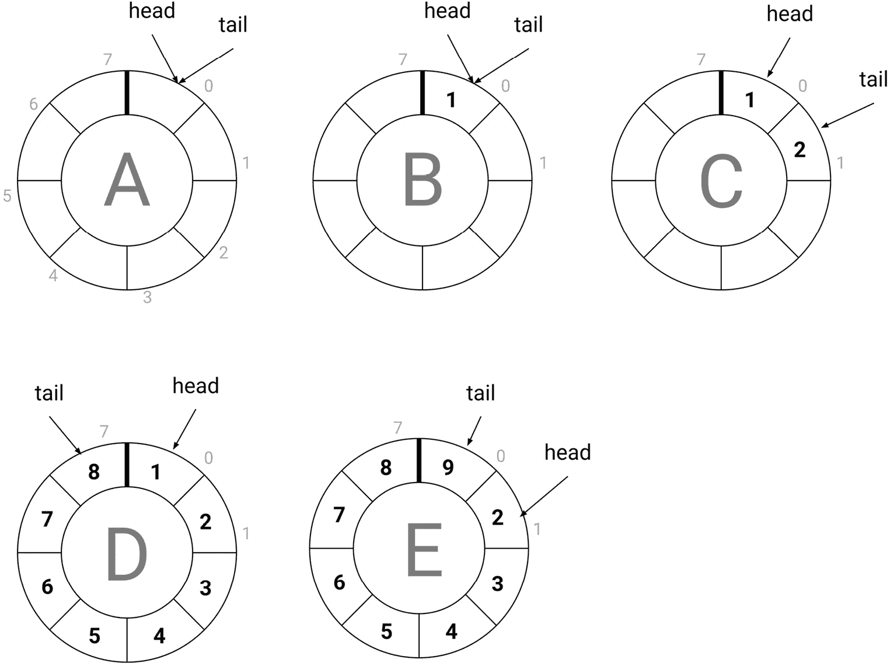
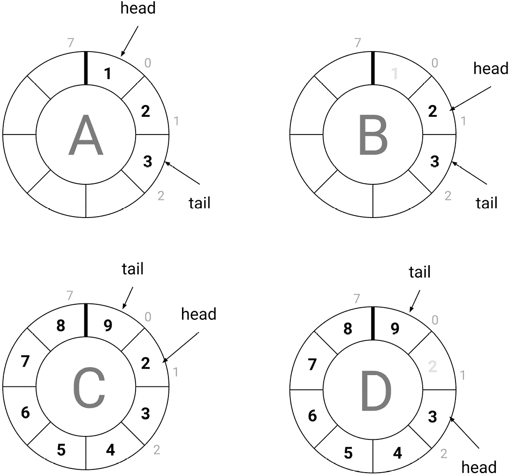
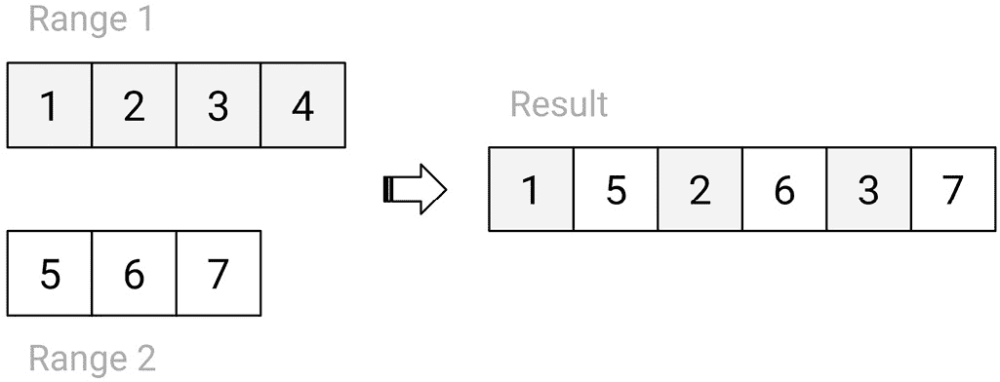
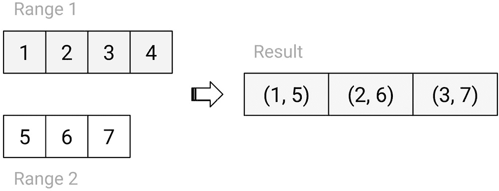

# 第八章：*第八章*: 范围和算法

到达本书的这一部分，你已经学习了有关 C++模板的语法和机制的所有内容，直到最新的标准版本 C++20。这为你编写从简单到复杂的模板提供了必要的知识。模板是编写泛型库的关键。即使你可能不会自己编写这样的库，你也会使用一个或多个。事实上，你用 C++编写的日常代码就使用了模板。主要原因在于，作为一个现代 C++开发者，你正在使用基于模板的标准库。

然而，标准库是一系列许多库的集合，例如容器库、迭代器库、算法库、数值库、输入/输出库、文件系统库、正则表达式库、线程支持库、实用库等。总的来说，这是一个庞大的库，至少可以写一本书的内容。然而，探索库的一些关键部分，可以帮助你更好地理解你经常使用或可能使用的一些概念和类型。

由于在一个章节中讨论这个主题会导致章节内容显著增加，我们将讨论分为两部分。在本章中，我们将讨论以下主题：

+   理解容器、迭代器和算法的设计

+   创建自定义容器和迭代器

+   编写自定义通用算法

到本章结束时，你将对标准模板库的三个主要支柱有很好的理解，这些支柱是容器、迭代器和算法。

我们将从这个章节开始，概述标准库在这个方面的提供内容。

# 理解容器、迭代器和算法的设计

**容器**是表示元素集合的类型。这些集合可以根据各种数据结构实现，每个都有不同的语义：列表、队列、树等。标准库提供了三类容器：

+   `vector`, `deque`, `list`, `array`, 和 `forward_list`

+   `set`, `map`, `multiset`, 和 `multimap`

+   `unordered_set`, `unordered_map`, `unordered_multiset`, 和 `unordered_multimap`

此外，还有提供不同接口的容器适配器，这一类别包括`stack`, `queue`, 和 `priority_queue`类。最后，还有一个名为`span`的类，它表示对连续对象序列的非拥有视图。

这些容器为什么要使用模板的原因在第*第一章*，*模板介绍*中进行了说明。你不想为需要存储在容器中的每种不同类型的元素重复编写相同的实现。可以说，标准库中最常用的容器如下：

+   `vector`：这是一个在内存中连续存储的变量大小元素集合。在没有特殊要求的情况下，这是你选择的默认容器。内部存储根据需要自动扩展或收缩以容纳存储的元素。向量分配比所需更多的内存，以降低扩展的风险。扩展是一个昂贵的操作，因为需要分配新内存，将当前存储的内容复制到新存储中，最后还需要丢弃之前的存储。因为元素在内存中连续存储，所以可以通过索引以常数时间随机访问。

+   `array`：这是一个在内存中连续存储的固定大小元素集合。大小必须是编译时常量表达式。`array`类的语义与包含 C 风格数组的结构体相同（`T[n]`）。就像`vector`类型一样，`array`类的元素可以以常数时间随机访问。

+   `map`：这是一个将值与唯一键关联的集合。键通过比较函数排序，`map`类通常实现为红黑树。搜索、插入或删除元素的操作具有对数复杂度。

+   `set`：这是一个唯一键的集合。键是容器中实际存储的值；与`map`类的情况不同，没有键值对。然而，就像`map`类的情况一样，`set`通常实现为红黑树，搜索、插入和删除元素的操作具有对数复杂度。

不论它们的类型如何，标准容器有一些共同点：

+   几个常见的成员类型

+   用于存储管理的分配器（除了`std::array`类）

+   几个常见的成员函数（其中一些在某些容器中可能缺失）

+   使用迭代器访问存储的数据

所有标准容器都定义了以下成员类型：

```cpp
using value_type      = /* ... */;
```

```cpp
using size_type       = std::size_t;
```

```cpp
using difference_type = std::ptrdiff_t;
```

```cpp
using reference       = value_type&;
```

```cpp
using const_reference = value_type const&;
```

```cpp
using pointer         = /* ... */;
```

```cpp
using const_pointer   = /* ... */;
```

```cpp
using iterator        = /* ... */;
```

```cpp
using const_iterator  = /* ... */;
```

这些名称实际所代表的数据类型可能因容器而异。例如，对于`std::vector`，`value_type`是模板参数`T`，但对于`std::map`，`value_type`是`std::pair<const Key, T>`类型。这些成员类型的目的在于帮助进行泛型编程。

除了表示编译时已知大小的数组的`std::array`类之外，所有其他容器都动态分配内存。如果没有指定，这通过一个称为`std::allocator`的对象来控制。这个标准分配器使用全局的`new`和`delete`运算符来分配和释放内存。所有标准容器的构造函数（包括复制和移动构造函数）都有重载，允许我们指定一个分配器。

标准容器还定义了一些常见的成员函数。以下是一些示例：

+   `size`，返回元素数量（在`std::forward_list`中不存在）。

+   `empty`，它检查容器是否为空。

+   `clear`，它清除容器的内容（`std::array`、`std::stack`、`std::queue`和`std::priority_queue`中不存在）。

+   `swap`，它交换容器对象的内容。

+   `begin`和`end`方法，它们返回容器的开始和结束迭代器（`std::stack`、`std::queue`和`std::priority_queue`中不存在，尽管这些不是容器而是容器适配器）。

最后一个要点提到了迭代器。这些类型抽象了在容器中访问元素细节，提供了一种统一的方式来识别和遍历容器的元素。这很重要，因为标准库的关键部分由通用算法表示。有超过一百种这样的算法，从序列操作（如`count`、`count_if`、`find`和`for_each`）到修改操作（如`copy`、`fill`、`transform`、`rotate`和`reverse`），再到分区和排序（`partition`、`sort`、`nth_element`等）以及其他操作。迭代器对于确保它们具有通用性至关重要。如果每个容器都有不同的访问其元素的方式，编写通用算法将几乎是不可能的。

让我们考虑将元素从一个容器复制到另一个容器的简单操作。例如，我们有一个`std::vector`对象，我们希望将其元素复制到`std::list`对象中。这可能看起来如下所示：

```cpp
std::vector<int> v {1, 2, 3};
```

```cpp
std::list<int> l;
```

```cpp
for (std::size_t i = 0; i < v.size(); ++i)
```

```cpp
   l.push_back(v[i]);
```

如果我们想从`std::list`复制到`std::set`，或者从`std::set`复制到`std::array`呢？每种情况都需要不同类型的代码。然而，通用算法使我们能够以统一的方式完成这些操作。以下代码片段展示了这样的一个例子：

```cpp
std::vector<int> v{ 1, 2, 3 };
```

```cpp
// copy vector to vector
```

```cpp
std::vector<int> vc(v.size());
```

```cpp
std::copy(v.begin(), v.end(), vc.begin());
```

```cpp
// copy vector to list
```

```cpp
std::list<int> l;
```

```cpp
std::copy(v.begin(), v.end(), std::back_inserter(l));
```

```cpp
// copy list to set
```

```cpp
std::set<int> s;
```

```cpp
std::copy(l.begin(), l.end(), std::inserter(s, s.begin()));
```

在这里，我们有一个`std::vector`对象，我们将它的内容复制到另一个`std::vector`中，同时也复制到一个`std::list`对象中。因此，`std::list`对象的内容随后被复制到`std::set`对象中。在所有情况下，都使用了`std::copy`算法。这个算法有几个参数：两个迭代器定义源的开始和结束，以及一个迭代器定义目标开始。算法通过输出迭代器逐个复制输入范围中的元素到输出迭代器指向的元素，然后增加输出迭代器。从概念上讲，它可以如下实现：

```cpp
template<typename InputIt, class OutputIt>
```

```cpp
OutputIt copy(InputIt first, InputIt last, 
```

```cpp
              OutputIt d_first)
```

```cpp
{
```

```cpp
   for (; first != last; (void)++first, (void)++d_first)
```

```cpp
   {
```

```cpp
      *d_first = *first;
```

```cpp
   }
```

```cpp
   return d_first;
```

```cpp
}
```

重要提示

这个算法在*第五章*中进行了讨论，*类型特性和条件编译*，当时我们探讨了如何利用类型特性来优化其实现。

考虑到前面的示例，存在目标容器尚未为其内容分配空间以进行复制的情况。这与将元素复制到列表和集合的情况相同。在这种情况下，使用类似迭代器的类型，`std::back_insert_iterator` 和 `std::insert_iterator`，间接通过 `std::back_inserter` 和 `std::inserter` 辅助函数，将元素插入到容器中。`std::back_insert_iterator` 类使用 `push_back` 函数，而 `std::insert_iterator` 使用 `insert` 函数。

C++中有六个迭代器类别：

+   输入迭代器

+   输出迭代器

+   前向迭代器

+   双向迭代器

+   随机访问迭代器

+   连续迭代器

连续迭代器类别是在 C++17 中添加的。所有操作符都可以使用前缀或后缀增量运算符进行递增。以下表格显示了每个类别定义的附加操作：

![Table 8.1]

![img/Table_8.01_B18367.jpg]

表 8.1

除了输出类别外，每个类别都包含关于它的所有内容。这意味着前向迭代器是输入迭代器，双向迭代器是前向迭代器，随机访问迭代器是双向迭代器，最后，连续迭代器是随机访问迭代器。然而，任何前五个类别中的迭代器也可以同时是输出迭代器。这样的迭代器被称为**可变**迭代器。否则，它们被称为**常量**迭代器。

C++20 标准增加了对概念和概念库的支持。该库为这些迭代器类别中的每一个定义了标准概念。以下表格显示了它们之间的关联：

![Table 8.2]

![Table 8.02_B18367.jpg]

表 8.2

重要提示

迭代器概念在*第六章*中简要讨论了，*概念和约束*。

所有容器都具有以下成员：

+   `begin`：它返回一个指向容器开头的迭代器。

+   `end`：它返回一个指向容器末尾的迭代器。

+   `cbegin`：它返回一个指向容器开头的常量迭代器。

+   `cend`：它返回一个指向容器末尾的常量迭代器。

一些容器还具有返回反向迭代器的成员：

+   `rbegin`：它返回一个指向反转容器开头的反向迭代器。

+   `rend`：它返回一个指向反转容器末尾的反向迭代器。

+   `rcbegin`：它返回一个指向反转容器开头的常量反向迭代器。

+   `rcend`：它返回一个指向反转容器末尾的常量反向迭代器。

有两件事必须理解得很好，才能与容器和迭代器一起工作：

+   容器的末尾不是容器的最后一个元素，而是最后一个元素之后的元素。

+   反向迭代器提供对容器中元素的逆序访问。容器第一个元素的反向迭代器实际上是未反转容器的最后一个元素。

为了更好地理解这两点，让我们看看以下示例：

```cpp
std::vector<int> v{ 1,2,3,4,5 };
```

```cpp
// prints 1 2 3 4 5
```

```cpp
std::copy(v.begin(), v.end(),
```

```cpp
          std::ostream_iterator<int>(std::cout, " "));
```

```cpp
// prints 5 4 3 2 1
```

```cpp
std::copy(v.rbegin(), v.rend(),
```

```cpp
          std::ostream_iterator<int>(std::cout, " "));
```

`std::copy` 的第一次调用按给定顺序打印容器中的元素。另一方面，`std::copy` 的第二次调用按相反顺序打印元素。

以下图表说明了迭代器和容器元素之间的关系：

![Figure 8.1]

![Figure 8.1_B18367.jpg]

![Figure 8.1]

由两个迭代器（一个开始和一个结束，即最后一个元素之后的那个）分隔的元素序列（无论它们存储在内存中的数据结构是什么）被称为**范围**。这个术语在 C++标准（特别是与算法一起）和文献中广泛使用。它也是 C++20 中范围库得名的术语，将在*第九章*“范围库”中讨论。

除了标准容器的 begin/end 成员函数集之外，还有同名的独立函数。它们之间的等价性在以下表中展示：

![Table 8.3]

![Table 8.03_B18367.jpg]

表 8.3

虽然这些自由函数在处理标准容器时并不带来很多好处，但它们帮助我们编写通用的代码，可以处理标准容器和 C 样式的数组，因为这些自由函数都为静态数组重载。以下是一个示例：

```cpp
std::vector<int> v{ 1,2,3,4,5 };
```

```cpp
std::copy(std::begin(v), std::end(v), 
```

```cpp
          std::ostream_iterator<int>(std::cout, " "));
```

```cpp
int a[] = { 1,2,3,4,5 };
```

```cpp
std::copy(std::begin(a), std::end(a),
```

```cpp
          std::ostream_iterator<int>(std::cout, " "));
```

没有这些函数，我们不得不编写 `std::copy(a, a + 5, …)`。也许这些函数的一个大好处是它们使我们能够使用基于范围的 for 循环来使用数组，如下所示：

```cpp
std::vector<int> v{ 1,2,3,4,5 };
```

```cpp
for (auto const& e : v) 
```

```cpp
   std::cout << e << ' ';
```

```cpp
int a[] = { 1,2,3,4,5 };
```

```cpp
for (auto const& e : a)
```

```cpp
   std::cout << e << ' ';
```

这本书的目的不是教你如何使用每个容器或许多标准算法。然而，学习如何创建容器、迭代器和算法对你来说应该是有帮助的。这就是我们将要做的。

# 创建自定义容器和迭代器

理解容器和迭代器工作原理的最好方式是亲自创建它们。为了避免实现标准库中已经存在的东西，我们将考虑一些不同的事物——更确切地说，是一个**循环缓冲区**。这是一个当满时覆盖现有元素的容器。我们可以考虑不同的方式来使这样的容器工作；因此，我们首先定义其要求是很重要的。这些要求如下：

+   容器应该具有在编译时已知的固定容量。因此，将不会有运行时内存管理。

+   容量是容器可以存储的元素数量，而大小是它实际包含的元素数量。当大小等于容量时，我们说容器已满。

+   当容器满时，添加新元素将覆盖容器中最旧的元素。

+   添加新元素始终在末尾进行；删除现有元素始终在开头进行（容器中最旧的元素）。

+   应该能够通过下标操作符和迭代器对容器的元素进行随机访问。

根据这些要求，我们可以考虑以下实现细节：

+   元素可以存储在数组中。为了方便，这可以是 `std::array` 类。

+   我们需要两个变量，我们称之为 `head` 和 `tail`，以存储容器中第一个和最后一个元素的下标。这是必需的，因为由于容器的循环性质，开始和结束会随着时间的推移而移动。

+   第三个变量将存储容器中的元素数量。这很有用，因为否则我们无法从 head 和 tail 指数的值中区分容器是否为空或只有一个元素。

    重要提示

    这里提供的实现仅用于教学目的，并不打算作为生产就绪的解决方案。有经验的读者会发现实现的不同方面可以进行优化。然而，这里的目的是学习如何编写容器，而不是如何优化实现。

以下图表显示了这样一个循环缓冲区的视觉表示，具有八个不同状态的元素容量：



图 8.2

我们可以从这张图中看到以下内容：

+   **图 A**：这是一个空缓冲区。容量是 8，大小是 0，而 **head** 和 **tail** 都指向下标 **0**。

+   **图 B**：这个缓冲区包含一个元素。容量仍然是 8，大小是 1，而 **head** 和 **tail** 都仍然指向下标 **0**。

+   **图 C**：这个缓冲区包含两个元素。大小是 2，**head** 包含下标 **0**，而 **tail** 包含下标 **1**。

+   **图 D**：这个缓冲区已满。大小是 8，等于容量，**head** 包含下标 **0**，而 **tail** 包含下标 **7**。

+   **图 E**：这个缓冲区仍然已满，但已添加了一个额外的元素，触发了缓冲区中最老元素的重写。大小是 8，**head** 包含下标 **1**，而 **tail** 包含下标 **0**。

现在我们已经研究了循环缓冲区的语义，我们可以开始编写实现。我们将从容器类开始。

## 实现循环缓冲区容器

容器类的代码太长，无法放在一个列表中，所以我们将将其分成多个片段。第一个如下：

```cpp
template <typename T, std::size_t N>
```

```cpp
   requires(N > 0)
```

```cpp
class circular_buffer_iterator;
```

```cpp
template <typename T, std::size_t N>
```

```cpp
   requires(N > 0)
```

```cpp
class circular_buffer
```

```cpp
{
```

```cpp
  // ...
```

```cpp
};
```

这里有两个东西：一个名为 `circular_buffer_iterator` 的类模板的前向声明，以及一个名为 `circular_buffer` 的类模板。它们具有相同的模板参数，一个类型模板参数 `T`，表示元素的类型，以及一个非类型模板参数，表示缓冲区的容量。使用约束来确保提供的容量值始终为正。如果您不使用 C++20，可以将约束替换为 `static_assert` 语句或 `enable_if` 来强制执行相同的限制。以下代码片段都是 `circular_buffer` 类的一部分。

首先，我们有一系列成员类型定义，为与 `circular_buffer` 类模板相关的不同类型提供别名。这些将在类的实现中使用。它们将在下面展示：

```cpp
public:
```

```cpp
   using value_type = T;
```

```cpp
   using size_type = std::size_t;
```

```cpp
   using difference_type = std::ptrdiff_t;
```

```cpp
   using reference = value_type&;
```

```cpp
   using const_reference = value_type const&;
```

```cpp
   using pointer = value_type*;
```

```cpp
   using const_pointer = value_type const*;
```

```cpp
   using iterator = circular_buffer_iterator<T, N>;
```

```cpp
   using const_iterator = 
```

```cpp
      circular_buffer_iterator<T const, N>;
```

第二，我们有存储缓冲区状态的成员数据。实际元素存储在一个 `std::array` 对象中。头、尾和大小都存储在 `size_type` 数据类型的变量中。这些成员都是私有的：

```cpp
private:
```

```cpp
   std::array<value_type, N> data_;
```

```cpp
   size_type                 head_ = 0;
```

```cpp
   size_type                 tail_ = 0;
```

```cpp
   size_type                 size_ = 0;
```

第三，我们有实现之前描述的功能的成员函数。以下所有成员都是公开的。首先列出的是构造函数：

```cpp
constexpr circular_buffer() = default;
```

```cpp
constexpr circular_buffer(value_type const (&values)[N]) :
```

```cpp
   size_(N), tail_(N-1)
```

```cpp
{
```

```cpp
   std::copy(std::begin(values), std::end(values), 
```

```cpp
             data_.begin());
```

```cpp
}
```

```cpp
constexpr circular_buffer(const_reference v):
```

```cpp
   size_(N), tail_(N-1)
```

```cpp
{
```

```cpp
   std::fill(data_.begin(), data_.end(), v);
```

```cpp
}
```

在这里定义了三个构造函数（尽管我们可以想到更多的）。这些是默认构造函数（它也是默认的），用于初始化一个空的缓冲区，一个从类似 C 语言的数组中构造的构造函数，它通过复制数组元素来初始化一个满缓冲区，最后是一个接受单个值的构造函数，通过将该值复制到缓冲区的每个元素中来初始化一个满缓冲区。这些构造函数允许我们以以下任何一种方式创建循环缓冲区：

```cpp
circular_buffer<int, 1> b1;              // {}
```

```cpp
circular_buffer<int, 3> b2({ 1, 2, 3 }); // {1, 2, 3}
```

```cpp
circular_buffer<int, 3> b3(42);          // {42, 42, 42}
```

接下来，我们定义了几个描述循环缓冲区状态的成员函数：

```cpp
constexpr size_type size() const noexcept 
```

```cpp
{ return size_; }
```

```cpp
constexpr size_type capacity() const noexcept 
```

```cpp
{ return N; }
```

```cpp
constexpr bool empty() const noexcept 
```

```cpp
{ return size_ == 0; }
```

```cpp
constexpr bool full() const noexcept 
```

```cpp
{ return size_ == N; }
```

```cpp
constexpr void clear() noexcept 
```

```cpp
{ size_ = 0; head_ = 0; tail_ = 0; };
```

`size` 函数返回缓冲区中的元素数量，`capacity` 函数返回缓冲区可以容纳的元素数量，`empty` 函数用于检查缓冲区是否没有元素（等同于 `size() == 0`），而 `full` 函数用于检查缓冲区是否已满（等同于 `size() == N`）。还有一个名为 `clear` 的函数，可以将循环缓冲区置于空状态。请注意，此函数不会销毁任何元素（不会释放内存或调用析构函数），而只是重置定义缓冲区状态的值。

我们需要访问缓冲区的元素；因此，定义了以下函数来达到这个目的：

```cpp
constexpr reference operator[](size_type const pos)
```

```cpp
{
```

```cpp
   return data_[(head_ + pos) % N];
```

```cpp
}
```

```cpp
constexpr const_reference operator[](size_type const pos) const
```

```cpp
{
```

```cpp
   return data_[(head_ + pos) % N];
```

```cpp
}
```

```cpp
constexpr reference at(size_type const pos)
```

```cpp
{
```

```cpp
   if (pos < size_)
```

```cpp
      return data_[(head_ + pos) % N];
```

```cpp
   throw std::out_of_range("Index is out of range");
```

```cpp
}
```

```cpp
constexpr const_reference at(size_type const pos) const
```

```cpp
{
```

```cpp
   if (pos < size_)
```

```cpp
      return data_[(head_ + pos) % N];
```

```cpp
   throw std::out_of_range("Index is out of range");
```

```cpp
}
```

```cpp
constexpr reference front()
```

```cpp
{
```

```cpp
   if (size_ > 0) return data_[head_];
```

```cpp
   throw std::logic_error("Buffer is empty");
```

```cpp
}
```

```cpp
constexpr const_reference front() const
```

```cpp
{
```

```cpp
   if (size_ > 0) return data_[head_];
```

```cpp
   throw std::logic_error("Buffer is empty");
```

```cpp
}
```

```cpp
constexpr reference back()
```

```cpp
{
```

```cpp
   if (size_ > 0) return data_[tail_];
```

```cpp
   throw std::logic_error("Buffer is empty");
```

```cpp
}
```

```cpp
constexpr const_reference back() const
```

```cpp
{
```

```cpp
   if (size_ > 0) return data_[tail_];
```

```cpp
   throw std::logic_error("Buffer is empty");
```

```cpp
}
```

每个这些成员都有一个 `const` 重载，用于调用缓冲区的常量实例。常量成员返回一个常量引用；非常量成员返回一个正常引用。这些方法如下：

+   下标运算符返回对指定索引的元素的引用，而不检查索引的值

+   `at`方法与下标操作符类似，但它会检查索引是否小于大小，如果不是，则抛出异常

+   返回第一个元素引用的`front`方法；如果缓冲区为空，则抛出异常

+   返回最后一个元素引用的`back`方法；如果缓冲区为空，则抛出异常

我们有成员函数来访问元素，但我们还需要成员函数来向/从缓冲区添加和删除元素。添加新元素总是发生在末尾，因此我们将此称为`push_back`。删除现有元素总是发生在开始位置（最老的元素），因此我们将此称为`pop_front`。让我们首先看看前者：

```cpp
constexpr void push_back(T const& value)
```

```cpp
{
```

```cpp
   if (empty())
```

```cpp
   {
```

```cpp
      data_[tail_] = value;
```

```cpp
      size_++;
```

```cpp
   }
```

```cpp
   else if (!full())
```

```cpp
   {
```

```cpp
      data_[++tail_] = value;
```

```cpp
      size_++;
```

```cpp
   }
```

```cpp
   else
```

```cpp
   {
```

```cpp
      head_ = (head_ + 1) % N;
```

```cpp
      tail_ = (tail_ + 1) % N;
```

```cpp
      data_[tail_] = value;
```

```cpp
   }
```

```cpp
}
```

这基于定义的要求和来自*图 8.2*的视觉表示：

+   如果缓冲区为空，则将值复制到`tail_`索引指向的元素，并增加大小。

+   如果缓冲区既不为空也不为满，则执行相同的操作，但还要增加`tail_`索引的值。

+   如果缓冲区已满，则增加`head_`和`tail_`的值，然后将值复制到`tail_`索引指向的元素。

此函数将`value`参数复制到缓冲区元素。然而，这可以针对临时对象或推送至缓冲区后不再需要的对象进行优化。因此，提供了一个接受 rvalue 引用的重载。这会将值移动到缓冲区，避免不必要的复制。此重载在以下代码片段中显示：

```cpp
constexpr void push_back(T&& value)
```

```cpp
{
```

```cpp
   if (empty())
```

```cpp
   {
```

```cpp
      data_[tail_] = value;
```

```cpp
      size_++;
```

```cpp
   }
```

```cpp
   else if (!full())
```

```cpp
   {
```

```cpp
      data_[++tail_] = std::move(value);
```

```cpp
      size_++;
```

```cpp
   }
```

```cpp
   else
```

```cpp
   {
```

```cpp
      head_ = (head_ + 1) % N;
```

```cpp
      tail_ = (tail_ + 1) % N;
```

```cpp
      data_[tail_] = std::move(value);
```

```cpp
   }
```

```cpp
}
```

实现从缓冲区删除元素的`pop_back`函数采用类似的方法。以下是实现：

```cpp
constexpr T pop_front()
```

```cpp
{
```

```cpp
   if (empty()) throw std::logic_error("Buffer is empty");
```

```cpp
   size_type index = head_;
```

```cpp
   head_ = (head_ + 1) % N;
```

```cpp
   size_--;
```

```cpp
   return data_[index];
```

```cpp
}
```

如果缓冲区为空，则抛出异常。否则，增加`head_`索引的值，并返回`head_`前一个位置的元素值。这在以下图中进行了视觉描述：



图 8.3

我们在这里可以看到以下内容：

+   **图 A**：缓冲区有 3 个元素（1、2 和 3），**头**位于索引**0**，而**尾**位于索引**2**。

+   **图 B**：已从前面删除了一个元素，其索引为**0**。因此，**头**现在是索引**1**，而**尾**仍然位于索引**2**。缓冲区现在有两个元素。

+   **图 C**：缓冲区有八个元素，这是其最大容量，并且一个元素已被覆盖。**头**位于索引**1**，而**尾**位于索引**0**。

+   **图 D**：已从前面删除了一个元素，其索引为**1**。现在**头**位于索引**2**，而**尾**仍然位于索引**0**。缓冲区现在有七个元素。

下一个代码片段展示了同时使用`push_back`和`pop_front`成员函数的示例：

```cpp
circular_buffer<int, 4> b({ 1, 2, 3, 4 });
```

```cpp
assert(b.size() == 4);
```

```cpp
b.push_back(5);
```

```cpp
b.push_back(6);
```

```cpp
b.pop_front();
```

```cpp
assert(b.size() == 3);
```

```cpp
assert(b[0] == 4);
```

```cpp
assert(b[1] == 5);
```

```cpp
assert(b[2] == 6);
```

最后，我们有成员函数`begin`和`end`，它们返回指向缓冲区第一个和最后一个元素之后的迭代器。以下是它们的实现：

```cpp
iterator begin()
```

```cpp
{
```

```cpp
   return iterator(*this, 0);
```

```cpp
}
```

```cpp
iterator end()
```

```cpp
{
```

```cpp
   return iterator(*this, size_);
```

```cpp
}
```

```cpp
const_iterator begin() const
```

```cpp
{
```

```cpp
   return const_iterator(*this, 0);
```

```cpp
}
```

```cpp
const_iterator end() const
```

```cpp
{
```

```cpp
   return const_iterator(*this, size_);
```

```cpp
}
```

为了理解这些，我们需要看看迭代器类实际上是如何实现的。我们将在下一节中探讨这一点。

## 实现循环缓冲区容器的迭代器类型

在我们开始 `circular_buffer` 容器时，我们在前一节的开始处声明了迭代器类模板。然而，我们还需要定义其实现。但是，我们还有一件事必须做：为了让迭代器类能够访问容器的私有成员，它需要被声明为友元。这是如下完成的：

```cpp
private:
```

```cpp
   friend circular_buffer_iterator<T, N>;
```

现在让我们看看 `circular_buffer_iterator` 类，它实际上与容器类有相似之处。这包括模板参数、约束以及成员类型集合（其中一些与 `circular_buffer` 中的类型相同）。以下是类的片段：

```cpp
template <typename T, std::size_t N>
```

```cpp
requires(N > 0)
```

```cpp
class circular_buffer_iterator
```

```cpp
{
```

```cpp
public:
```

```cpp
   using self_type = circular_buffer_iterator<T, N>;
```

```cpp
   using value_type = T;
```

```cpp
   using reference = value_type&;
```

```cpp
   using const_reference = value_type const &;
```

```cpp
   using pointer = value_type*;
```

```cpp
   using const_pointer = value_type const*;
```

```cpp
   using iterator_category =
```

```cpp
      std::random_access_iterator_tag;
```

```cpp
   using size_type = std::size_t;
```

```cpp
   using difference_type = std::ptrdiff_t;
```

```cpp
public:
```

```cpp
   /* definitions */
```

```cpp
private:
```

```cpp
   std::reference_wrapper<circular_buffer<T, N>> buffer_;
```

```cpp
   size_type              index_ = 0;
```

```cpp
};
```

`circular_buffer_iterator` 类有一个指向循环缓冲区的引用和一个指向它所指向的缓冲区元素的索引。对 `circular_buffer<T, N>` 的引用被封装在一个 `std::reference_wrapper` 对象中。原因将在稍后揭晓。这样的迭代器可以通过提供这两个参数显式创建。因此，只有一个构造函数如下所示：

```cpp
explicit circular_buffer_iterator(
```

```cpp
   circular_buffer<T, N>& buffer,
```

```cpp
   size_type const index):
```

```cpp
   buffer_(buffer), index_(index)
```

```cpp
{ }
```

如果现在回顾 `circular_buffer` 的 `begin` 和 `end` 成员函数的定义，我们可以看到第一个参数是 `*this`，第二个参数对于开始迭代器是 0，对于结束迭代器是 `size_`。第二个值是迭代器所指向的元素从头部开始的偏移量。因此，0 是第一个元素，`size_` 是缓冲区中最后一个元素之后的一个元素。

我们决定我们需要对缓冲区的元素进行随机访问；因此，迭代器类别是随机访问。成员类型 `iterator_category` 是 `std::random_access_iterator_tag` 的别名。这意味着我们需要提供此类迭代器支持的所有操作。在本章的前一节中，我们讨论了迭代器类别和每个类别所需的操作。我们将在下一节中实现所有必需的操作。

我们从输入迭代器的要求开始，如下所示：

```cpp
self_type& operator++()
```

```cpp
{ 
```

```cpp
   if(index_ >= buffer_.get().size())
```

```cpp
      throw std::out_of_range("Iterator cannot be 
```

```cpp
                  incremented past the end of the range");
```

```cpp
   index_++;
```

```cpp
   return *this;
```

```cpp
}
```

```cpp
self_type operator++(int)
```

```cpp
{
```

```cpp
   self_type temp = *this;
```

```cpp
   ++*this;
```

```cpp
   return temp;
```

```cpp
}
```

```cpp
bool operator==(self_type const& other) const
```

```cpp
{
```

```cpp
   return compatible(other) && index_ == other.index_;
```

```cpp
}
```

```cpp
bool operator!=(self_type const& other) const
```

```cpp
{
```

```cpp
   return !(*this == other);
```

```cpp
}
```

```cpp
const_reference operator*() const
```

```cpp
{
```

```cpp
   if (buffer_.get().empty() || !in_bounds())
```

```cpp
      throw std::logic_error("Cannot dereferentiate the 
```

```cpp
                              iterator");
```

```cpp
   return buffer_.get().data_[
```

```cpp
      (buffer_.get().head_ + index_) % 
```

```cpp
       buffer_.get().capacity()];
```

```cpp
}
```

```cpp
const_reference operator->() const
```

```cpp
{
```

```cpp
   if (buffer_.get().empty() || !in_bounds())
```

```cpp
      throw std::logic_error("Cannot dereferentiate the 
```

```cpp
                              iterator");
```

```cpp
   return buffer_.get().data_[
```

```cpp
      (buffer_.get().head_ + index_) % 
```

```cpp
       buffer_.get().capacity()];
```

```cpp
}
```

我们在这里实现了递增（前缀和后缀），检查相等/不等，以及解引用。当元素无法解引用时，`*` 和 `->` 运算符会抛出异常。这种情况发生在缓冲区为空，或者索引不在范围内（在 `head_` 和 `tail_` 之间）。我们使用了两个辅助函数（都是私有的），分别称为 `compatible` 和 `is_bounds`。这些将在下面展示：

```cpp
bool compatible(self_type const& other) const
```

```cpp
{
```

```cpp
   return buffer_.get().data_.data() == 
```

```cpp
          other.buffer_.get().data_.data();
```

```cpp
}
```

```cpp
bool in_bounds() const
```

```cpp
{
```

```cpp
   return
```

```cpp
      !buffer_.get().empty() &&
```

```cpp
      (buffer_.get().head_ + index_) % 
```

```cpp
       buffer_.get().capacity() <= buffer_.get().tail_;
```

```cpp
}
```

如果 `a` 和 `b` 是两个前向迭代器并且它们相等，那么它们要么是不可解引用的，否则它们的迭代器值 `*a` 和 `*b` 指向同一个对象。反之亦然，这意味着如果 `*a` 和 `*b` 相等，那么 `a` 和 `b` 也相等。这对于我们的实现是正确的。

前向迭代器的另一个要求是它们是可交换的。这意味着如果`a`和`b`是两个前向迭代器，那么`swap(a, b)`应该是一个有效的操作。这又让我们回到了使用`std::reference_wrapper`对象来持有对`circular_buffer<T, N>`的引用。引用是不可交换的，这将使得`circular_buffer_iterator`也不可交换。然而，`std::reference_wrapper`是可交换的，这也使得我们的迭代器类型可交换。这可以通过一个`static_assert`语句来验证，如下所示：

```cpp
static_assert(
```

```cpp
   std::is_swappable_v<circular_buffer_iterator<int, 10>>);
```

重要提示

使用原始指针到`circular_buffer`类的替代方案是使用`std::reference_wrapper`，因为指针可以赋值，因此是可交换的。使用哪种方式是风格和个人选择的问题。在这个例子中，我更喜欢避免使用原始指针的解决方案。

为了满足双向迭代器类别的需求，我们需要支持递减操作。在下一个代码片段中，您可以看到前置和后置递减运算符的实现：

```cpp
self_type& operator--()
```

```cpp
{
```

```cpp
   if(index_ <= 0)
```

```cpp
      throw std::out_of_range("Iterator cannot be 
```

```cpp
           decremented before the beginning of the range");
```

```cpp
   index_--;
```

```cpp
   return *this;
```

```cpp
}
```

```cpp
self_type operator--(int)
```

```cpp
{
```

```cpp
   self_type temp = *this;
```

```cpp
   --*this;
```

```cpp
   return temp;
```

```cpp
}
```

最后，我们有`+`和`-`（以及复合的`+=`和`-=`）操作的要求。这些将在下面展示：

```cpp
self_type operator+(difference_type offset) const
```

```cpp
{
```

```cpp
   self_type temp = *this;
```

```cpp
   return temp += offset;
```

```cpp
}
```

```cpp
self_type operator-(difference_type offset) const
```

```cpp
{
```

```cpp
   self_type temp = *this;
```

```cpp
   return temp -= offset;
```

```cpp
}
```

```cpp
difference_type operator-(self_type const& other) const
```

```cpp
{
```

```cpp
   return index_ - other.index_;
```

```cpp
}
```

```cpp
self_type& operator +=(difference_type const offset)
```

```cpp
{
```

```cpp
   difference_type next = 
```

```cpp
      (index_ + next) % buffer_.get().capacity();
```

```cpp
   if (next >= buffer_.get().size())
```

```cpp
      throw std::out_of_range("Iterator cannot be 
```

```cpp
                incremented past the bounds of the range");
```

```cpp
   index_ = next;
```

```cpp
   return *this;
```

```cpp
}
```

```cpp
self_type& operator -=(difference_type const offset)
```

```cpp
{
```

```cpp
   return *this += -offset;
```

```cpp
}
```

随机访问迭代器必须支持与其他操作的不等比较。这意味着我们需要重载`<`、`<=`、`>`和`>=`运算符。然而，`<=`、`>`和`>=`运算符可以基于`<`运算符来实现。因此，它们的定义可以如下所示：

```cpp
bool operator<(self_type const& other) const
```

```cpp
{
```

```cpp
   return index_ < other.index_;
```

```cpp
}
```

```cpp
bool operator>(self_type const& other) const
```

```cpp
{
```

```cpp
   return other < *this;
```

```cpp
}
```

```cpp
bool operator<=(self_type const& other) const
```

```cpp
{
```

```cpp
   return !(other < *this);
```

```cpp
}
```

```cpp
bool operator>=(self_type const& other) const
```

```cpp
{
```

```cpp
   return !(*this < other);
```

```cpp
}
```

最后，但同样重要的是，我们需要提供通过下标运算符（`[]`）访问元素的方法。一个可能的实现如下：

```cpp
value_type& operator[](difference_type const offset)
```

```cpp
{
```

```cpp
   return *((*this + offset));
```

```cpp
}
```

```cpp
value_type const & operator[](difference_type const offset) const
```

```cpp
{
```

```cpp
   return *((*this + offset));
```

```cpp
}
```

通过这种方式，我们已经完成了环形缓冲区迭代器类型的实现。如果您在跟踪这两个类的众多代码片段时遇到困难，您可以在 GitHub 仓库中找到这本书的完整实现。下面展示了使用迭代器类型的一个简单示例：

```cpp
circular_buffer<int, 3> b({1, 2, 3});
```

```cpp
std::vector<int> v;
```

```cpp
for (auto it = b.begin(); it != b.end(); ++it)
```

```cpp
{
```

```cpp
   v.push_back(*it);
```

```cpp
}
```

这段代码实际上可以通过基于范围的 for 循环来简化。在这种情况下，我们不直接使用迭代器，而是编译器生成的代码。因此，以下代码片段与上一个代码片段等价：

```cpp
circular_buffer<int, 3> b({ 1, 2, 3 });
```

```cpp
std::vector<int> v;
```

```cpp
for (auto const e : b)
```

```cpp
{
```

```cpp
   v.push_back(e);
```

```cpp
}
```

然而，这里提供的`circular_buffer_iterator`实现不允许以下代码片段编译：

```cpp
circular_buffer<int, 3> b({ 1,2,3 });
```

```cpp
*b.begin() = 0;
```

```cpp
assert(b.front() == 0);
```

这要求我们能够通过迭代器写入元素。然而，我们的实现没有满足输出迭代器类别的需求。这要求表达式如`*it = v`或`*it++ = v`是有效的。为了做到这一点，我们需要提供非 const 重载的`*`和`->`运算符，它们返回非 const 引用类型。这可以通过以下方式实现：

```cpp
reference operator*()
```

```cpp
{
```

```cpp
   if (buffer_.get().empty() || !in_bounds())
```

```cpp
      throw std::logic_error("Cannot dereferentiate the 
```

```cpp
                              iterator");
```

```cpp
   return buffer_.get().data_[
```

```cpp
      (buffer_.get().head_ + index_) % 
```

```cpp
       buffer_.get().capacity()];
```

```cpp
}
```

```cpp
reference operator->()
```

```cpp
{
```

```cpp
   if (buffer_.get().empty() || !in_bounds())
```

```cpp
      throw std::logic_error("Cannot dereferentiate the 
```

```cpp
                              iterator");
```

```cpp
   return buffer_.get().data_[
```

```cpp
      (buffer_.get().head_ + index_) % 
```

```cpp
       buffer_.get().capacity()];
```

```cpp
}
```

在 GitHub 仓库中可以找到使用`circular_buffer`类带有和没有迭代器的更多示例。接下来，我们将专注于实现一个适用于任何范围的通用算法，包括我们在这里定义的`circular_buffer`容器。

# 编写自定义通用算法

在本章的第一节中，我们看到了使用迭代器抽象容器元素访问对于构建通用算法的重要性。然而，练习编写这样的算法应该对你有所帮助，因为它可以帮助你更好地理解迭代器的使用。因此，在本节中，我们将编写一个通用算法。

标准库具有许多这样的算法。其中缺失的一个是**合并算法**。合并的含义实际上被不同的人以不同的方式解释或理解。对于一些人来说，合并意味着取两个或更多输入范围并创建一个新的范围，其中输入范围的元素是交错排列的。这将在以下图中举例说明：



图 8.4

对于其他人来说，合并意味着取两个或更多输入范围并创建一个新的范围，其中元素是由输入范围的元素组成的元组。这将在下一图中展示：



图 8.5

在本节中，我们将实现第一个算法。为了避免混淆，我们将称之为**flatzip**。以下是它的要求：

+   算法接收两个输入范围并将结果写入输出范围。

+   该算法接收迭代器作为参数。一对第一个和最后一个输入迭代器定义了每个输入范围的界限。一个输出迭代器定义了输出范围的开始，元素将被写入到那里。

+   两个输入范围应包含相同类型的元素。输出范围必须包含相同类型的元素或可以隐式转换为输入类型的类型。

+   如果两个输入范围的大小不同，算法将在处理完较小的那个范围后停止（如前图所示）。

+   返回值是复制到超过最后一个元素的输出迭代器。

描述的算法的一个可能实现如下所示：

```cpp
template <typename InputIt1, typename InputIt2,
```

```cpp
          typename OutputIt>
```

```cpp
OutputIt flatzip(
```

```cpp
   InputIt1 first1, InputIt1 last1,
```

```cpp
   InputIt2 first2, InputIt2 last2,
```

```cpp
   OutputIt dest)
```

```cpp
{
```

```cpp
   auto it1 = first1;
```

```cpp
   auto it2 = first2;
```

```cpp
   while (it1 != last1 && it2 != last2)
```

```cpp
   {
```

```cpp
      *dest++ = *it1++;
```

```cpp
      *dest++ = *it2++;
```

```cpp
   }
```

```cpp
   return dest;
```

```cpp
}
```

如代码片段所示，实现相当简单。我们在这里所做的只是同时遍历两个输入范围，并交替从它们中复制元素到目标范围。当到达最小范围的末尾时，两个输入范围的迭代停止。我们可以如下使用此算法：

```cpp
// one range is empty
```

```cpp
std::vector<int> v1 {1,2,3};
```

```cpp
std::vector<int> v2;
```

```cpp
std::vector<int> v3;
```

```cpp
flatzip(v1.begin(), v1.end(), v2.begin(), v2.end(),
```

```cpp
        std::back_inserter(v3));
```

```cpp
assert(v3.empty());
```

```cpp
// neither range is empty
```

```cpp
std::vector<int> v1 {1, 2, 3};
```

```cpp
std::vector<int> v2 {4, 5};
```

```cpp
std::vector<int> v3;
```

```cpp
flatzip(v1.begin(), v1.end(), v2.begin(), v2.end(),
```

```cpp
        std::back_inserter(v3));
```

```cpp
assert(v3 == std::vector<int>({ 1, 4, 2, 5 }));
```

这些示例使用`std::vector`作为输入和输出范围。然而，`flatzip`算法对容器一无所知。容器中的元素通过迭代器访问。因此，只要迭代器满足指定的要求，我们就可以使用任何容器。这包括我们之前编写的`circular_buffer`容器，因为`circular_buffer_container`满足输入和输出迭代器类别的需求。这意味着我们也可以编写以下代码片段：

```cpp
circular_buffer<int, 4> a({1, 2, 3, 4});
```

```cpp
circular_buffer<int, 3> b({5, 6, 7});
```

```cpp
circular_buffer<int, 8> c(0);
```

```cpp
flatzip(a.begin(), a.end(), b.begin(), b.end(), c.begin());
```

```cpp
std::vector<int> v;
```

```cpp
for (auto e : c)
```

```cpp
   v.push_back(e);
```

```cpp
assert(v == std::vector<int>({ 1, 5, 2, 6, 3, 7, 0, 0 }));
```

我们有两个输入循环缓冲区：`a`，它有四个元素，和`b`，它有三个元素。目标循环缓冲区有八个元素的空间，所有元素都被初始化为零。在应用 flatzip 算法后，目标循环缓冲区的六个元素将被`a`和`b`缓冲区中的值写入。结果是循环缓冲区将包含元素`1, 5, 2, 6, 3, 7, 0, 0`。

# 摘要

本章致力于探讨如何使用模板构建通用库。尽管我们无法对这些主题进行深入探讨，但我们已经探讨了 C++标准库中容器、迭代器和算法的设计。这些是标准库的支柱。我们花了大部分时间来理解编写类似于标准容器的容器以及提供对其元素访问的迭代器类需要什么。为此，我们实现了一个表示循环缓冲区的类，这是一个固定大小的数据结构，当容器满时，元素将被覆盖。最后，我们实现了一个通用算法，该算法将两个范围中的元素进行合并。这对于任何容器都适用，包括循环缓冲区容器。

如本章所讨论的，范围是一个抽象概念。然而，随着 C++20 的引入，它引入了新的范围库，其中包含了一个更具体的概念。这就是本书最后一章我们将要讨论的内容。

# 问题

1.  标准库中的序列容器有哪些？

1.  在标准容器中定义了哪些常见的成员函数？

1.  迭代器是什么？有多少种类别存在？

1.  随机访问迭代器支持哪些操作？

1.  范围访问函数是什么？
