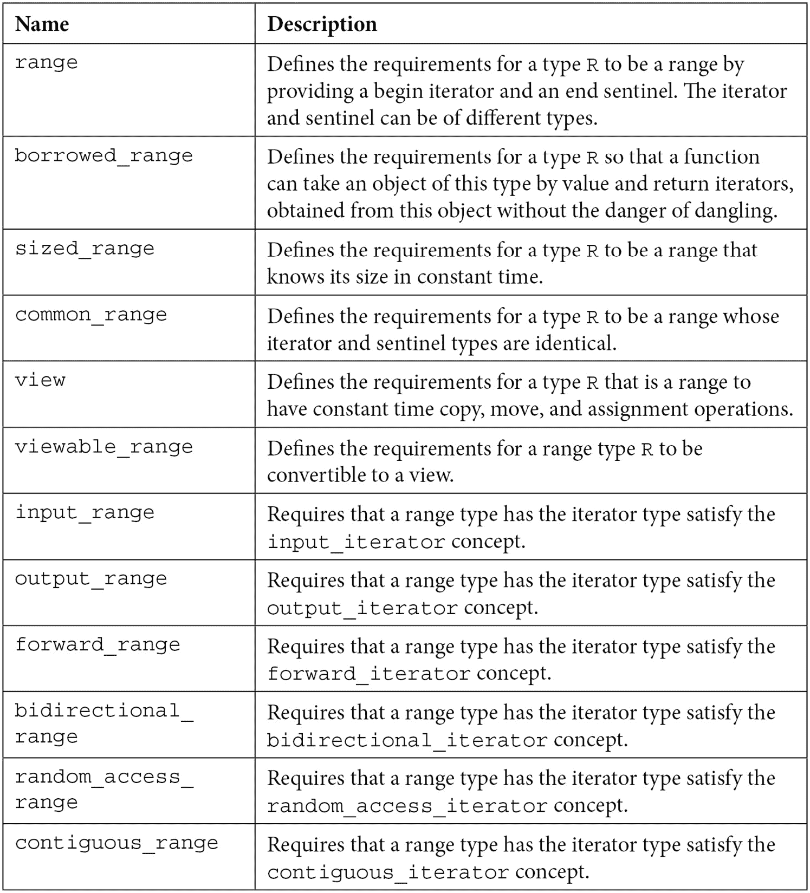
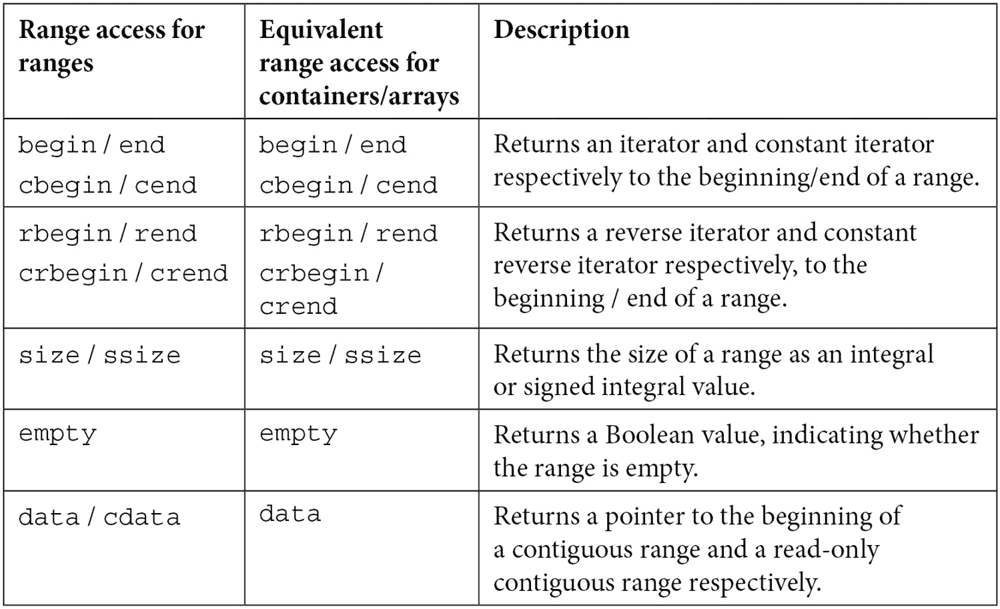
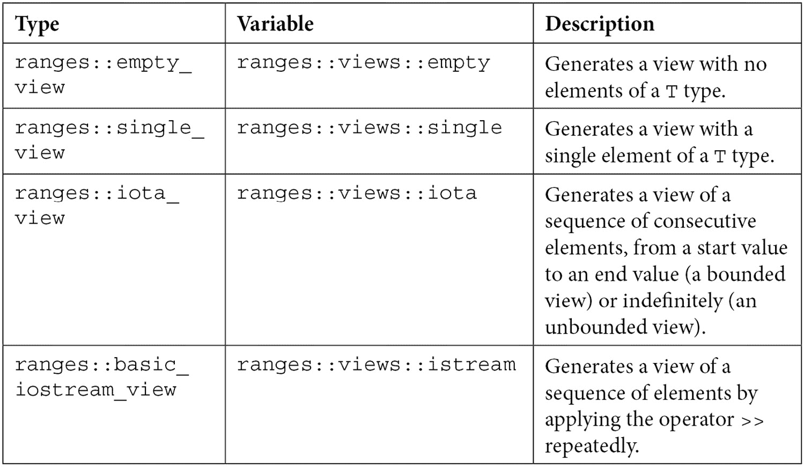
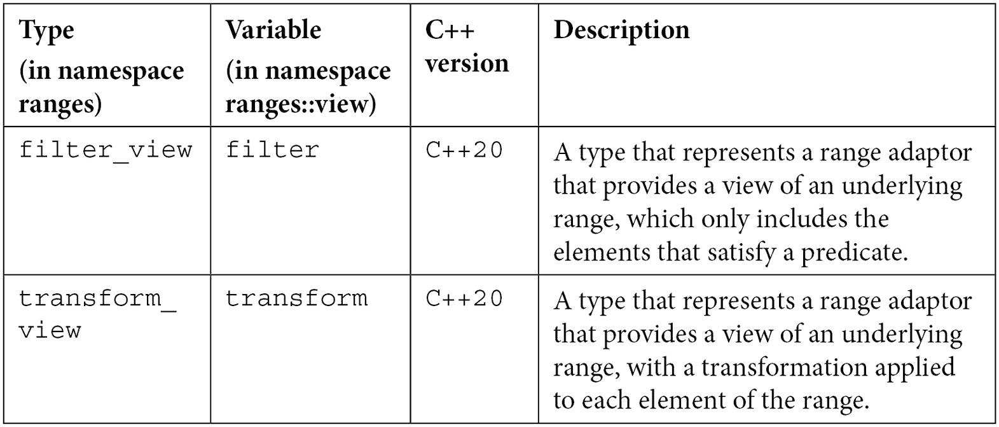
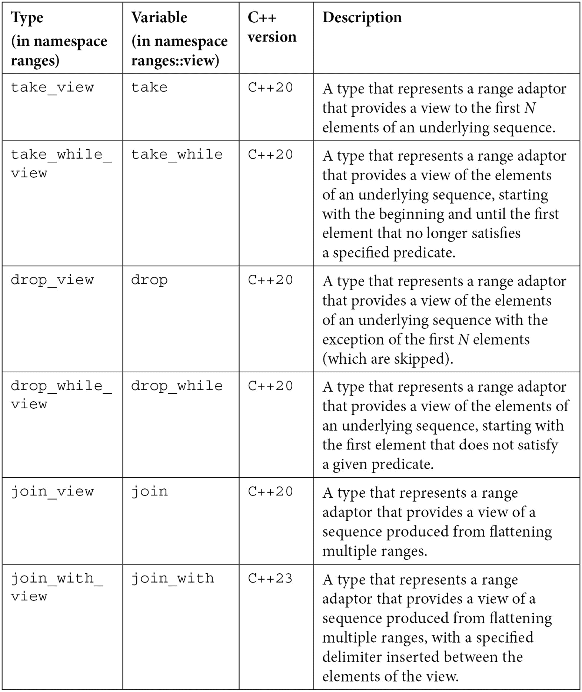
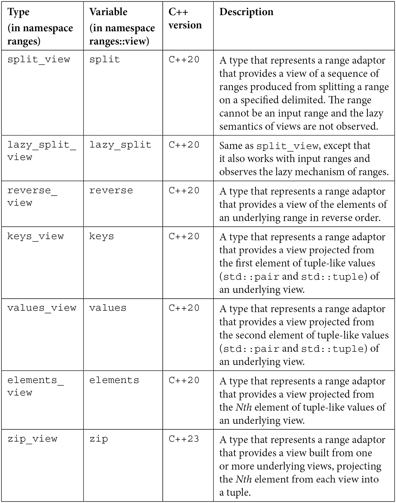
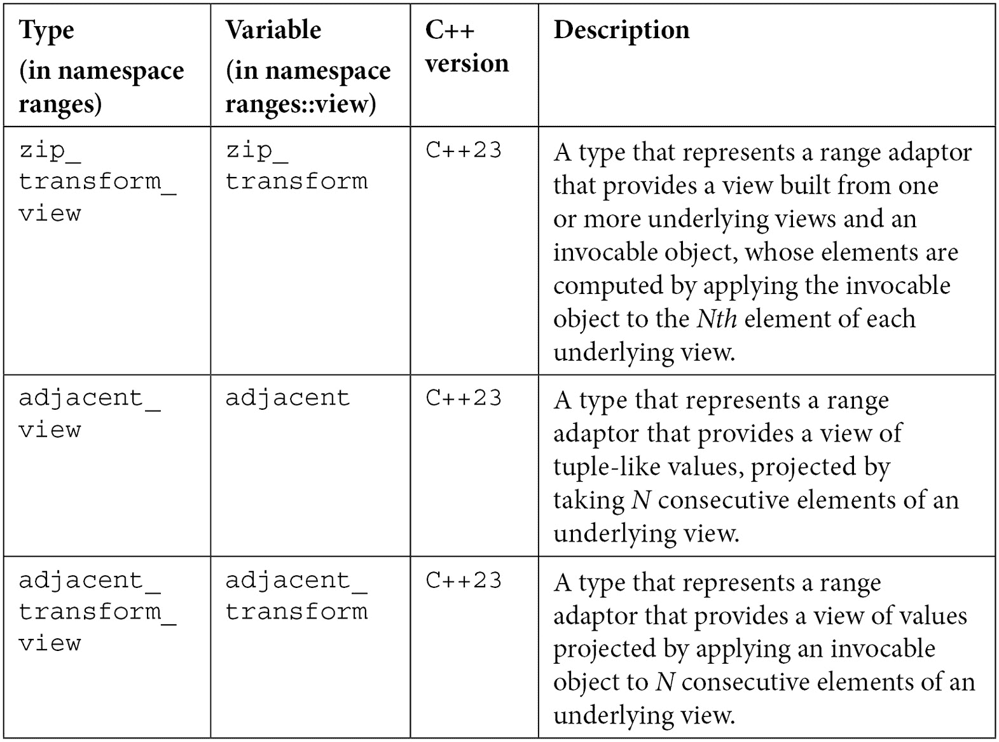
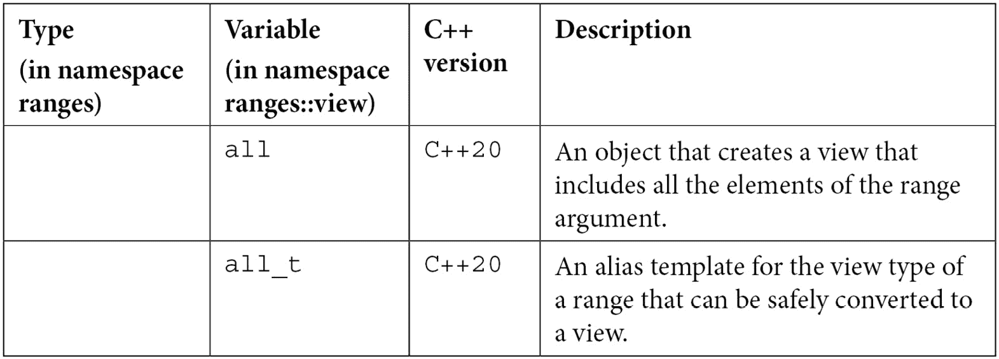
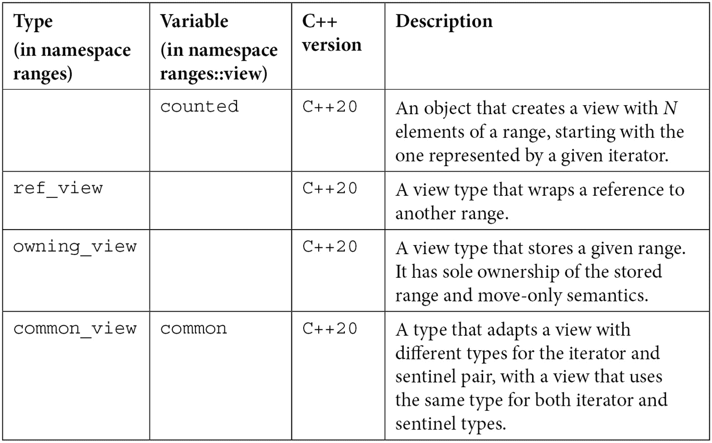

# 第九章：*第九章*：范围库

上一章致力于理解标准库的三个主要支柱：容器、迭代器和算法。在整个章节中，我们使用了范围这个抽象概念来表示由两个迭代器分隔的元素序列。C++20 标准通过提供一个范围库来简化与范围的工作，该库由两个主要部分组成：一方面，定义非拥有范围和范围适配器的类型，另一方面，与这些范围类型一起工作的算法，并且不需要迭代器来定义元素的范围。

在本章的最后，我们将讨论以下主题：

+   从抽象范围到范围库的过渡

+   理解范围概念和视图

+   理解约束算法

+   编写自己的范围适配器

到本章结束时，你将很好地理解范围库的内容，并且能够编写自己的范围适配器。

让我们从范围这个抽象概念过渡到 C++20 范围库开始本章。

# 从抽象范围到范围库的进步

在上一章中，我们多次使用了术语 *范围*。`std::vector`、`std::list` 和 `std::map` 是范围抽象的具体实现。它们拥有元素的所有权，并且使用各种数据结构实现，例如数组、链表或树。标准算法是通用的。它们对容器不可知。它们对 `std::vector`、`std::list` 或 `std::map` 一无所知。它们通过迭代器处理范围抽象。然而，这有一个缺点：我们总是需要从一个容器中检索开始和结束迭代器。以下是一些例子：

```cpp
// sorts a vector
```

```cpp
std::vector<int> v{ 1, 5, 3, 2, 4 };
```

```cpp
std::sort(v.begin(), v.end());
```

```cpp
// counts even numbers in an array
```

```cpp
std::array<int, 5> a{ 1, 5, 3, 2, 4 };
```

```cpp
auto even = std::count_if(
```

```cpp
   a.begin(), a.end(), 
```

```cpp
   [](int const n) {return n % 2 == 0; });
```

在需要仅处理容器部分元素的情况下很少。在绝大多数情况下，你只需要反复编写 `v.begin()` 和 `v.end()`。这包括 `cbegin()`/`cend()`、`rbegin()`/`rend()` 或独立的函数 `std::begin()`/`std::end()` 等变体。理想情况下，我们希望缩短所有这些，并能够编写以下内容：

```cpp
// sorts a vector
```

```cpp
std::vector<int> v{ 1, 5, 3, 2, 4 };
```

```cpp
sort(v);
```

```cpp
// counts even numbers in an array
```

```cpp
std::array<int, 5> a{ 1, 5, 3, 2, 4 };
```

```cpp
auto even = std::count_if(
```

```cpp
   a, 
```

```cpp
   [](int const n) {return n % 2 == 0; });
```

另一方面，我们经常需要组合操作。大多数时候，这涉及到许多操作和代码，即使使用标准算法，代码也过于冗长。让我们考虑以下示例：给定一个整数序列，我们想要按值（而不是位置）降序打印控制台上的所有偶数的平方，除了前两个。解决这个问题有多种方法。以下是一个可能的解决方案：

```cpp
std::vector<int> v{ 1, 5, 3, 2, 8, 7, 6, 4 };
```

```cpp
// copy only the even elements
```

```cpp
std::vector<int> temp;
```

```cpp
std::copy_if(v.begin(), v.end(), 
```

```cpp
             std::back_inserter(temp), 
```

```cpp
             [](int const n) {return n % 2 == 0; });
```

```cpp
// sort the sequence
```

```cpp
std::sort(temp.begin(), temp.end(), 
```

```cpp
          [](int const a, int const b) {return a > b; });
```

```cpp
// remove the first two
```

```cpp
temp.erase(temp.begin() + temp.size() - 2, temp.end());
```

```cpp
// transform the elements
```

```cpp
std::transform(temp.begin(), temp.end(), 
```

```cpp
               temp.begin(),
```

```cpp
               [](int const n) {return n * n; });
```

```cpp
// print each element
```

```cpp
std::for_each(temp.begin(), temp.end(), 
```

```cpp
              [](int const n) {std::cout << n << '\n'; });
```

我相信大多数人都会同意，尽管熟悉标准算法的任何人都可以轻松阅读此代码，但它仍然需要写很多。它还要求一个临时容器和重复调用 `begin`/`end`。因此，我也期待大多数人会更容易理解以下版本的先前代码，并且可能更喜欢这样编写：

```cpp
std::vector<int> v{ 1, 5, 3, 2, 8, 7, 6, 4 };
```

```cpp
sort(v);
```

```cpp
auto r = v
```

```cpp
         | filter([](int const n) {return n % 2 == 0; })
```

```cpp
         | drop(2)
```

```cpp
         | reverse
```

```cpp
         | transform([](int const n) {return n * n; });
```

```cpp
for_each(r, [](int const n) {std::cout << n << '\n'; });
```

这就是 C++20 标准借助范围库提供的功能。这有两个主要组成部分：

+   **视图** 或 **范围适配器**，它们表示非拥有可迭代序列。这使得我们更容易组合操作，如最后一个示例所示。

+   **约束算法**，它使我们能够对具体范围（标准容器或范围）进行操作，而不是对由一对迭代器界定的抽象范围进行操作（尽管这也是可能的）。

我们将在下一节中探讨范围库的这两个提供项，我们将从范围开始。

# 理解范围概念和视图

术语 *范围* 指的是一个抽象概念，它定义了由起始和结束迭代器界定的元素序列。因此，范围代表了一个可迭代的元素序列。然而，这样的序列可以通过多种方式定义：

+   使用起始迭代器和结束哨兵。此类序列从起始位置迭代到结束位置。一个 **哨兵** 是一个指示序列结束的对象。它可以与迭代器类型相同，也可以是不同类型。

+   使用起始对象和大小（元素数量），表示所谓的计数序列。此类序列从起始位置迭代 *N* 次（其中 *N* 代表大小）。

+   使用起始值和谓词，表示所谓的条件终止序列。此类序列从起始位置迭代，直到谓词返回 false。

+   只使用起始值，表示所谓的无界序列。此类序列可以无限迭代。

所有这些可迭代序列都被视为范围。因为范围是一个抽象概念，C++20 库定义了一系列概念来描述范围类型的必要条件。这些概念可以在 `<ranges>` 头文件和 `std::ranges` 命名空间中找到。下表展示了范围概念的列表：



表 9.1

标准库为容器和数组定义了一系列访问函数。这些包括 `std::begin` 和 `std::end` 而不是成员函数 `begin` 和 `end`，`std::size` 而不是成员函数 `size` 等。这些被称为 `<ranges>` 和 `<iterator>` 头文件以及 `std::ranges` 命名空间。它们列在下一表中：



表 9.2

以下代码片段展示了这些函数的一些用法：

```cpp
std::vector<int> v{ 8, 5, 3, 2, 4, 7, 6, 1 };
```

```cpp
auto r = std::views::iota(1, 10);
```

```cpp
std::cout << "size(v)=" << std::ranges::size(v) << '\n';
```

```cpp
std::cout << "size(r)=" << std::ranges::size(r) << '\n';
```

```cpp
std::cout << "empty(v)=" << std::ranges::empty(v) << '\n';
```

```cpp
std::cout << "empty(r)=" << std::ranges::empty(r) << '\n';
```

```cpp
std::cout << "first(v)=" << *std::ranges::begin(v) << '\n';
```

```cpp
std::cout << "first(r)=" << *std::ranges::begin(r) << '\n';
```

```cpp
std::cout << "rbegin(v)=" << *std::ranges::rbegin(v) 
```

```cpp
          << '\n';
```

```cpp
std::cout << "rbegin(r)=" << *std::ranges::rbegin(r) 
```

```cpp
          << '\n';
```

```cpp
std::cout << "data(v)=" << *std::ranges::data(v) << '\n'; 
```

在这个片段中，我们使用了一种名为 `std::views::iota` 的类型。正如命名空间所暗示的，这是一个视图。**视图**是一个带有额外限制的范围。视图是轻量级对象，具有非拥有语义。它们以一种不需要复制或修改序列的方式呈现底层元素序列（范围）的视图。其关键特性是延迟评估。这意味着无论它们应用何种转换，它们仅在请求（迭代）元素时执行，而不是在创建视图时执行。

C++20 提供了一系列视图，C++23 也增加了新的视图。视图在 `<ranges>` 头文件和 `std::ranges` 命名空间中以 `std::ranges::abc_view` 的形式提供，例如 `std::ranges::iota_view`。然而，为了使用方便，在 `std::views` 命名空间中，也存在形式为 `std::views::abc` 的变量模板，例如 `std::views::iota`。这正是我们在上一个示例中看到的。以下是使用 `iota` 的两个等效示例：

```cpp
// using the iota_view type
```

```cpp
for (auto i : std::ranges::iota_view(1, 10))
```

```cpp
   std::cout << i << '\n';
```

```cpp
// using the iota variable template
```

```cpp
for (auto i : std::views::iota(1, 10))
```

```cpp
   std::cout << i << '\n';
```

`iota` 视图是称为 **工厂** 的特殊视图类别的一部分。这些工厂是新生成范围上的视图。以下是在范围库中可用的工厂：



表 9.3

如果你想知道为什么 `empty_view` 和 `single_view` 有用，答案应该不难找到。这些在处理空范围或只有一个元素的范围的模板代码中很有用。你不想为处理这些特殊情况有多个函数模板的重载；相反，你可以传递一个 `empty_view` 或 `single_view` 范围。以下是一些使用这些工厂的示例片段。这些片段应该是自解释的：

```cpp
constexpr std::ranges::empty_view<int> ev;
```

```cpp
static_assert(std::ranges::empty(ev));
```

```cpp
static_assert(std::ranges::size(ev) == 0);
```

```cpp
static_assert(std::ranges::data(ev) == nullptr);
```

```cpp
constexpr std::ranges::single_view<int> sv{42};
```

```cpp
static_assert(!std::ranges::empty(sv));
```

```cpp
static_assert(std::ranges::size(sv) == 1);
```

```cpp
static_assert(*std::ranges::data(sv) == 42);
```

对于 `iota_view`，我们已经看到了一些使用有界视图的示例。下一个片段再次展示了不仅使用由 `iota` 生成的有界视图，还使用由 `iota` 生成的无界视图的示例：

```cpp
auto v1 = std::ranges::views::iota(1, 10);
```

```cpp
std::ranges::for_each(
```

```cpp
     v1, 
```

```cpp
     [](int const n) {std::cout << n << '\n'; });
```

```cpp
auto v2 = std::ranges::views::iota(1) |
```

```cpp
          std::ranges::views::take(9);
```

```cpp
std::ranges::for_each(
```

```cpp
     v2,
```

```cpp
     [](int const n) {std::cout << n << '\n'; });
```

最后一个示例利用了另一个名为 `take_view` 的视图。它产生另一个视图的前 *N* 个元素（在我们的例子中，是 `9`）的视图（在我们的情况下，是使用 `iota` 产生的无界视图）。我们将在稍后讨论更多关于这个话题的内容。但首先，让我们用一个示例来使用第四个视图工厂，`basic_iostream_view`。让我们考虑我们有一个文本中的文章价格列表，这些价格由空格分隔。我们需要打印这些价格的总和。有不同方法可以解决这个问题，但这里给出了一种可能的解决方案：

```cpp
auto text = "19.99 7.50 49.19 20 12.34";
```

```cpp
auto stream = std::istringstream{ text };
```

```cpp
std::vector<double> prices;
```

```cpp
double price;
```

```cpp
while (stream >> price)
```

```cpp
{
```

```cpp
   prices.push_back(price);
```

```cpp
}
```

```cpp
auto total = std::accumulate(prices.begin(), prices.end(), 
```

```cpp
                             0.0);
```

```cpp
std::cout << std::format("total: {}\n", total);
```

突出的部分可以用以下两行代码替换，这些代码使用 `basic_iostream_view` 或更精确地说，使用 `istream_view` 别名模板：

```cpp
for (double const price : 
```

```cpp
        std::ranges::istream_view<double>(stream))
```

```cpp
{
```

```cpp
   prices.push_back(price);
```

```cpp
}
```

`istream_view` 范围工厂所做的是在 `istringstream` 对象上反复应用操作符 `>>`，每次应用都会产生一个值。您不能指定分隔符；它只与空白符一起工作。如果您更喜欢使用标准算法而不是手工编写的循环，可以使用 `ranges::for_each` 限制算法以相同的方式产生结果，如下所示：

```cpp
std::ranges::for_each(
```

```cpp
   std::ranges::istream_view<double>(stream),
```

```cpp
   &prices {
```

```cpp
      prices.push_back(price); });
```

本章中给出的示例包括了 `filter`、`take`、`drop` 和 `reverse` 等视图。这些只是 C++20 中可用的标准视图中的一小部分。C++23 中正在添加更多，未来标准版本可能还会添加更多。以下表格列出了整个标准视图集：



表 9.4

除了前表中列出的视图（范围适配器）之外，还有一些在其他特定场景中可能很有用的视图。为了完整性，这些视图列在下一个表中：



表 9.5

现在我们已经列举了所有标准范围适配器，让我们看看使用其中一些的更多示例。

## 探索更多示例

在本节之前，我们看到了以下示例（这次带有显式命名空间）：

```cpp
namespace rv = std::ranges::views;
```

```cpp
std::ranges::sort(v);
```

```cpp
auto r = v
```

```cpp
        | rv::filter([](int const n) {return n % 2 == 0; })
```

```cpp
        | rv::drop(2)
```

```cpp
        | rv::reverse
```

```cpp
        | rv::transform([](int const n) {return n * n; });
```

这实际上是以下内容的更简短、更易读的版本：

```cpp
std::ranges::sort(v);auto r =
```

```cpp
  rv::transform(
```

```cpp
    rv::reverse(
```

```cpp
      rv::drop(
```

```cpp
        rv::filter(
```

```cpp
          v,
```

```cpp
          [](int const n) {return n % 2 == 0; }),
```

```cpp
        2)),
```

```cpp
    [](int const n) {return n * n; });
```

第一个版本是可能的，因为管道操作符（`|`）被重载以简化以更易读的形式组合视图。一些范围适配器接受一个参数，而一些可能接受多个参数。以下规则适用：

+   如果范围适配器 `A` 接受一个参数，一个视图 `V`，那么 `A(V)` 和 `V|A` 是等价的。这样的范围适配器是 `reverse_view`，以下是一个示例：

    ```cpp
    std::vector<int> v{ 1, 5, 3, 2, 8, 7, 6, 4 };
    namespace rv = std::ranges::views;
    auto r1 = rv::reverse(v);
    auto r2 = v | rv::reverse;
    ```

+   如果范围适配器 `A` 接受多个参数，一个视图 `V` 和 `args…`，那么 `A(V, args…)`、`A(args…)(V)` 和 `V|A(args…)` 是等价的。这样的范围适配器是 `take_view`，以下是一个示例：

    ```cpp
    std::vector<int> v{ 1, 5, 3, 2, 8, 7, 6, 4 };
    namespace rv = std::ranges::views;
    auto r1 = rv::take(v, 2);
    auto r2 = rv::take(2)(v);
    auto r3 = v | rv::take(2);
    ```

到目前为止，我们已经看到了 `filter`、`transform`、`reverse` 和 `drop` 的应用。为了完成本章的这一部分，让我们通过一系列示例来展示 *表 8.7* 中视图的使用。在所有以下示例中，我们将考虑 `rv` 作为 `std::ranges::views` 命名空间的别名：

+   以相反的顺序打印序列中的最后两个奇数：

    ```cpp
    std::vector<int> v{ 1, 5, 3, 2, 4, 7, 6, 8 };
    for (auto i : v |
      rv::reverse |
      rv::filter([](int const n) {return n % 2 == 1; }) |
      rv::take(2))
    {
       std::cout << i << '\n'; // prints 7 and 3
    }
    ```

+   打印一个范围中连续小于 10 的数字子序列，但不包括第一个连续的奇数：

    ```cpp
    std::vector<int> v{ 1, 5, 3, 2, 4, 7, 16, 8 };
    for (auto i : v |
     rv::take_while([](int const n){return n < 10; }) |
     rv::drop_while([](int const n){return n % 2 == 1; })
    )
    {
       std::cout << i << '\n'; // prints 2 4 7
    }
    ```

+   打印序列中的第一个元素、第二个元素，以及分别的第三个元素：

    ```cpp
    std::vector<std::tuple<int,double,std::string>> v = 
    { 
       {1, 1.1, "one"}, 
       {2, 2.2, "two"}, 
       {3, 3.3, "three"}
    };
    for (auto i : v | rv::keys)
       std::cout << i << '\n'; // prints 1 2 3
    for (auto i : v | rv::values)
       std::cout << i << '\n'; // prints 1.1 2.2 3.3
    for (auto i : v | rv::elements<2>)
       std::cout << i << '\n'; // prints one two three
    ```

+   打印整数向量向量的所有元素：

    ```cpp
    std::vector<std::vector<int>> v { 
       {1,2,3}, {4}, {5, 6}
    };
    for (int const i : v | rv::join)
       std::cout << i << ' ';  // prints 1 2 3 4 5 6
    ```

+   打印整数向量向量的所有元素，但每个向量元素之间插入一个 0。范围适配器 `join_with` 是 C++23 中的新功能，可能尚未被编译器支持：

    ```cpp
    std::vector<std::vector<int>> v{
       {1,2,3}, {4}, {5, 6}
    };
    for(int const i : v | rv::join_with(0))
       std::cout << i << ' ';  // print 1 2 3 0 4 0 5 6
    ```

+   从一个句子中打印出单独的单词，其中分隔符是空格：

    ```cpp
    std::string text{ "this is a demo!" };
    constexpr std::string_view delim{ " " };
    for (auto const word : text | rv::split(delim))
    {
       std::cout << std::string_view(word.begin(), 
                                     word.end()) 
                 << '\n';
    }
    ```

+   从整数数组和双精度浮点向量元素创建元组的视图：

    ```cpp
    std::array<int, 4> a {1, 2, 3, 4};
    std::vector<double> v {10.0, 20.0, 30.0};
    auto z = rv::zip(a, v)
    // { {1, 10.0}, {2, 20.0}, {3, 30.0} }
    ```

+   创建一个由整数数组和双精度浮点向量元素相乘的元素的视图：

    ```cpp
    std::array<int, 4> a {1, 2, 3, 4};
    std::vector<double> v {10.0, 20.0, 30.0};
    auto z = rv::zip_transform(
       std::multiplies<double>(), a, v)
    // { {1, 10.0}, {2, 20.0}, {3, 30.0} }
    ```

+   打印整数序列相邻元素的配对：

    ```cpp
    std::vector<int> v {1, 2, 3, 4};
    for (auto i : v | rv::adjacent<2>)
    {
       // prints: (1, 2) (2, 3) (3, 4)
       std::cout << std::format("({},{})", 
                                i.first, i.second)";
    }
    ```

+   打印从整数序列中乘以每个三个连续值得到的结果：

    ```cpp
    std::vector<int> v {1, 2, 3, 4, 5};
    for (auto i : v | rv::adjacent_transform<3>(
        std::multiplies()))
    {
       std::cout << i << ' '; // prints: 3 24 60
    }
    ```

希望这些例子能帮助您理解每个可用视图的可能用例。您可以在本书的源代码中找到更多示例，以及在本节中提到的*进一步阅读*部分的文章中。在下一节中，我们将讨论 ranges 库的另一个部分，即约束算法。

# 理解约束算法

标准库提供了超过一百个通用算法。正如我们之前在 ranges 库的介绍部分所讨论的，它们有一个共同点：它们在迭代器的帮助下与抽象范围一起工作。它们接受迭代器作为参数，有时返回迭代器。这使得它们在标准容器或数组上重复使用变得繁琐。以下是一个例子：

```cpp
auto l_odd = [](int const n) {return n % 2 == 1; };
```

```cpp
std::vector<int> v{ 1, 1, 2, 3, 5, 8, 13 };
```

```cpp
std::vector<int> o;
```

```cpp
auto e1 = std::copy_if(v.begin(), v.end(),
```

```cpp
                       std::back_inserter(o),
```

```cpp
                       l_odd);
```

```cpp
int arr[] = { 1, 1, 2, 3, 5, 8, 13 };
```

```cpp
auto e2 = std::copy_if(std::begin(arr), std::end(arr), 
```

```cpp
                       std::back_inserter(o), 
```

```cpp
                       l_odd);
```

在这个片段中，我们有一个向量 `v` 和一个数组 `arr`，我们将这两个中的奇数元素复制到一个第二个向量 `o` 中。为此，使用了 `std::copy_if` 算法。它接受开始和结束输入迭代器（定义输入范围），一个输出迭代器到第二个范围，其中复制的元素将被插入，以及一个一元谓词（在这个例子中，是一个 lambda 表达式）。它返回的是指向目标范围中最后一个复制元素之后的迭代器。

如果我们查看 `std::copy_if` 算法的声明，我们将找到以下两个重载：

```cpp
template <typename InputIt, typename OutputIt,
```

```cpp
          typename UnaryPredicate>
```

```cpp
constexpr OutputIt copy_if(InputIt first, InputIt last,
```

```cpp
                           OutputIt d_first,
```

```cpp
                           UnaryPredicate pred);
```

```cpp
template <typename ExecutionPolicy,
```

```cpp
          typename ForwardIt1, typename ForwardIt2,
```

```cpp
          typename UnaryPredicate>
```

```cpp
ForwardIt2 copy_if(ExecutionPolicy&& policy,
```

```cpp
                   ForwardIt1 first, ForwardIt1 last,
```

```cpp
                   ForwardIt2 d_first,
```

```cpp
                   UnaryPredicate pred);
```

第一个重载是这里使用和描述的重载。第二个重载是在 C++17 中引入的。这允许您指定一个执行策略，如并行或顺序。这基本上使得标准算法的并行执行成为可能。然而，这与本章的主题无关，我们不会进一步探讨。

大多数标准算法在 `std::ranges` 命名空间中都有一个新约束版本。这些算法位于 `<algorithm>`、`<numeric>` 和 `<memory>` 头文件中，并具有以下特性：

+   它们与现有算法具有相同的名称。

+   它们有重载，允许您指定一个范围，无论是使用开始迭代器和结束哨兵，还是作为一个单独的范围参数。

+   它们具有修改后的返回类型，提供了关于执行更多信息的说明。

+   它们支持投影以应用于处理后的元素。**投影**是一个可以调用的实体。它可以是一个成员指针、一个 lambda 表达式或函数指针。这样的投影在算法逻辑使用元素之前应用于范围元素。

下面是如何声明`std::ranges::copy_if`算法的重载的：

```cpp
template <std::input_iterator I,
```

```cpp
          std::sentinel_for<I> S,
```

```cpp
          std::weakly_incrementable O,
```

```cpp
          class Proj = std::identity,
```

```cpp
          std::indirect_unary_predicate<
```

```cpp
             std::projected<I, Proj>> Pred>
```

```cpp
requires std::indirectly_copyable<I, O>
```

```cpp
constexpr copy_if_result<I, O> copy_if(I first, S last,
```

```cpp
                                       O result,
```

```cpp
                                       Pred pred,
```

```cpp
                                       Proj proj = {} );
```

```cpp
template <ranges::input_range R,
```

```cpp
      std::weakly_incrementable O,
```

```cpp
      class Proj = std::identity,
```

```cpp
      std::indirect_unary_predicate<
```

```cpp
      std::projected<ranges::iterator_t<R>, Proj>> Pred>
```

```cpp
requires std::indirectly_copyable<ranges::iterator_t<R>, O>
```

```cpp
constexpr copy_if_result<ranges::borrowed_iterator_t<R>, O>
```

```cpp
          copy_if(R&& r,
```

```cpp
                  O result,
```

```cpp
                  Pred pred,
```

```cpp
                  Proj proj = {});
```

如果这些看起来更难阅读，那是因为它们有更多的参数、约束和更长的类型名。然而，好处是它们使得代码更容易编写。以下是之前代码片段的重写，使用了`std::ranges::copy_if`：

```cpp
std::vector<int> v{ 1, 1, 2, 3, 5, 8, 13 };
```

```cpp
std::vector<int> o;
```

```cpp
auto e1 = std::ranges::copy_if(v, std::back_inserter(o), 
```

```cpp
                               l_odd);
```

```cpp
int arr[] = { 1, 1, 2, 3, 5, 8, 13 };
```

```cpp
auto e2 = std::ranges::copy_if(arr, std::back_inserter(o), 
```

```cpp
                               l_odd);
```

```cpp
auto r = std::ranges::views::iota(1, 10);
```

```cpp
auto e3 = std::ranges::copy_if(r, std::back_inserter(o), 
```

```cpp
                               l_odd);
```

这些示例展示了两个事情：如何从`std::vector`对象和数组中复制元素，以及如何从视图（范围适配器）中复制元素。它们没有展示的是投影。这之前已经简要提到过。在这里，我们将更详细地讨论它，并提供更多示例。

投影是一个可调用的实体。它基本上是一个函数适配器。它影响谓词，提供了一种执行函数组合的方式。它不提供改变算法的方法。例如，假设我们有以下类型：

```cpp
struct Item
```

```cpp
{
```

```cpp
   int         id;
```

```cpp
   std::string name;
```

```cpp
   double      price;
```

```cpp
};
```

此外，为了解释的目的，让我们也考虑以下元素序列：

```cpp
std::vector<Item> items{
```

```cpp
   {1, "pen", 5.49},
```

```cpp
   {2, "ruler", 3.99},
```

```cpp
   {3, "pensil case", 12.50}
```

```cpp
};
```

投影允许你在谓词上执行组合。例如，假设我们想要将所有以字母*p*开头的项复制到第二个向量中。我们可以编写以下代码：

```cpp
std::vector<Item> copies;
```

```cpp
std::ranges::copy_if(
```

```cpp
   items, 
```

```cpp
   std::back_inserter(copies),
```

```cpp
   [](Item const& i) {return i.name[0] == 'p'; });
```

然而，我们也可以编写以下等效示例：

```cpp
std::vector<Item> copies;
```

```cpp
std::ranges::copy_if(
```

```cpp
   items, 
```

```cpp
   std::back_inserter(copies),
```

```cpp
   [](std::string const& name) {return name[0] == 'p'; },
```

```cpp
   &Item::name);
```

在这个例子中，投影是应用于每个`Item`元素并在执行谓词（这里是一个 lambda 表达式）之前应用的成员指针表达式`&Item::name`。这在你已经有可重用的函数对象或 lambda 表达式，并且不想为传递不同类型的参数编写另一个时非常有用。

以这种方式，项目无法用于将范围从一种类型转换为另一种类型。例如，你不能直接将`std::vector<Item>`中的项的名称复制到`std::vector<std::string>`中。这需要使用`std::ranges::transform`范围适配器，如下面的代码片段所示：

```cpp
std::vector<std::string> names;
```

```cpp
std::ranges::copy_if(
```

```cpp
   items | rv::transform(&Item::name),
```

```cpp
   std::back_inserter(names),
```

```cpp
   [](std::string const& name) {return name[0] == 'p'; });
```

有许多受限算法，但在此我们不会列出它们。相反，你可以在标准中直接查看它们，或者在[`en.cppreference.com/w/cpp/algorithm/ranges`](https://en.cppreference.com/w/cpp/algorithm/ranges)页面上查看。

本章我们将讨论的最后一个主题是编写自定义范围适配器。

# 编写自己的范围适配器

标准库包含一系列范围适配器，可用于解决许多不同的任务。在新版标准中，还在不断添加更多。然而，可能会有一些情况，你希望创建自己的范围适配器，以便与范围库中的其他适配器一起使用。这实际上并不是一个简单任务。因此，在本章的最后部分，我们将探讨编写此类范围适配器所需遵循的步骤。

为了这个目的，我们将考虑一个范围适配器，它取范围中的每个*Nth*元素并跳过其他元素。我们将把这个适配器称为`step_view`。我们可以用它来编写如下代码：

```cpp
for (auto i : std::views::iota(1, 10) | views::step(1))
```

```cpp
   std::cout << i << '\n';
```

```cpp
for (auto i : std::views::iota(1, 10) | views::step(2))
```

```cpp
   std::cout << i << '\n';
```

```cpp
for (auto i : std::views::iota(1, 10) | views::step(3))
```

```cpp
   std::cout << i << '\n';
```

```cpp
for (auto i : std::views::iota(1, 10) | views::step(2) | 
```

```cpp
              std::views::take(3))
```

```cpp
   std::cout << i << '\n';
```

第一个循环将打印从一到九的所有数字。第二个循环将打印所有奇数，1, 3, 5, 7, 9。第三个循环将打印 1, 4, 7。最后，第四个循环将打印 1, 3, 5。

要使这成为可能，我们需要实现以下实体：

+   定义范围适配器的类模板

+   一个推导指南，帮助进行范围适配器的类模板参数推导

+   定义范围适配器迭代器类型的类模板

+   定义范围适配器哨兵类型的类模板

+   一个重载的管道运算符 (`|`) 和辅助函数，这是其实现所必需的

+   一个编译时常量全局对象，用于简化范围适配器的使用

让我们逐一了解它们，并学习如何定义它们。我们将从哨兵类开始。**哨兵**是超出末尾迭代器的抽象。它允许我们检查迭代是否到达范围的末尾。哨兵使得末尾迭代器可以与范围迭代器具有不同的类型。哨兵不能解引用或增加。以下是它的定义方式：

```cpp
template <typename R>
```

```cpp
struct step_iterator;
```

```cpp
template <typename R>
```

```cpp
struct step_sentinel
```

```cpp
{
```

```cpp
   using base      = std::ranges::iterator_t<R>;
```

```cpp
   using size_type = std::ranges::range_difference_t<R>;
```

```cpp
   step_sentinel() = default;
```

```cpp
   constexpr step_sentinel(base end) : end_{ end } {}
```

```cpp
   constexpr bool is_at_end(step_iterator<R> it) const;
```

```cpp
private:
```

```cpp
   base      end_;
```

```cpp
};
```

```cpp
// definition of the step_iterator type
```

```cpp
template <typename R>
```

```cpp
constexpr bool step_sentinel<R>::is_at_end(
```

```cpp
   step_iterator<R> it) const
```

```cpp
{
```

```cpp
   return end_ == it.value();
```

```cpp
}
```

哨兵从一个迭代器构建，并包含一个名为 `is_at_end` 的成员函数，该函数检查存储的范围迭代器是否等于存储在 `step_iterator` 对象中的范围迭代器。这种类型，`step_iterator`，是一个类模板，定义了我们的范围适配器的迭代器类型，我们称之为 `step_view`。以下是此迭代器类型的实现：

```cpp
template <typename R>
```

```cpp
struct step_iterator : std::ranges::iterator_t<R>
```

```cpp
{
```

```cpp
   using base
```

```cpp
      = std::ranges::iterator_t<R>;
```

```cpp
   using value_type
```

```cpp
      = typename std::ranges::range_value_t<R>;
```

```cpp
   using reference_type
```

```cpp
      = typename std::ranges::range_reference_t<R>;
```

```cpp
   constexpr step_iterator(
```

```cpp
      base start, base end,
```

```cpp
      std::ranges::range_difference_t<R> step) :
```

```cpp
      pos_{ start }, end_{ end }, step_{ step }
```

```cpp
   {
```

```cpp
   }
```

```cpp
   constexpr step_iterator operator++(int)
```

```cpp
   {
```

```cpp
      auto ret = *this;
```

```cpp
      pos_ = std::ranges::next(pos_, step_, end_);
```

```cpp
      return ret;
```

```cpp
   }
```

```cpp
   constexpr step_iterator& operator++()
```

```cpp
   {
```

```cpp
      pos_ = std::ranges::next(pos_, step_, end_);
```

```cpp
      return *this;
```

```cpp
   }
```

```cpp
   constexpr reference_type operator*() const
```

```cpp
   {
```

```cpp
      return *pos_;
```

```cpp
   }
```

```cpp
   constexpr bool operator==(step_sentinel<R> s) const
```

```cpp
   {
```

```cpp
      return s.is_at_end(*this);
```

```cpp
   }
```

```cpp
   constexpr base const value() const { return pos_; }
```

```cpp
private:
```

```cpp
   base                                pos_;
```

```cpp
   base                                end_;
```

```cpp
   std::ranges::range_difference_t<R>  step_;
```

```cpp
};
```

此类型必须具有几个成员：

+   一个名为 `base` 的别名模板，表示底层范围迭代器的类型。

+   一个名为 `value_type` 的别名模板，表示底层范围元素的类型。

+   重载的运算符 `++` 和 `*`。

+   重载的运算符 `==` 将此对象与哨兵进行比较。

`++` 运算符的实现使用了 `std::ranges::next` 限制性算法来增加一个具有 *N* 个位置的迭代器，但不会超出范围的末尾。

为了使用 `step_iterator` 和 `step_sentinel` 对对 `step_view` 范围适配器，你必须确保这个对实际上是良好形成的。为此，我们必须确保 `step_iterator` 类型是一个输入迭代器，并且 `step_sentinel` 类型确实是 `step_iterator` 类型的哨兵类型。这可以通过以下 `static_assert` 语句来完成：

```cpp
namespace details
```

```cpp
{
```

```cpp
   using test_range_t = 
```

```cpp
      std::ranges::views::all_t<std::vector<int>>;
```

```cpp
   static_assert(
```

```cpp
      std::input_iterator<step_iterator<test_range_t>>);
```

```cpp
   static_assert(
```

```cpp
      std::sentinel_for<step_sentinel<test_range_t>, 
```

```cpp
      step_iterator<test_range_t>>);
```

```cpp
}
```

`step_iterator` 类型用于 `step_view` 范围适配器的实现。至少，它可能看起来如下：

```cpp
template<std::ranges::view R>
```

```cpp
struct step_view : 
```

```cpp
   public std::ranges::view_interface<step_view<R>>
```

```cpp
{
```

```cpp
private:
```

```cpp
   R                                   base_;
```

```cpp
   std::ranges::range_difference_t<R>  step_;
```

```cpp
public:
```

```cpp
   step_view() = default;
```

```cpp
   constexpr step_view(
```

```cpp
      R base,
```

```cpp
      std::ranges::range_difference_t<R> step)
```

```cpp
         : base_(std::move(base))
```

```cpp
         , step_(step)
```

```cpp
   {
```

```cpp
   }
```

```cpp
   constexpr R base() const&
```

```cpp
      requires std::copy_constructible<R>
```

```cpp
   { return base_; }
```

```cpp
   constexpr R base()&& { return std::move(base_); }
```

```cpp
   constexpr std::ranges::range_difference_t<R> const& increment() const 
```

```cpp
   { return step_; }
```

```cpp
   constexpr auto begin()
```

```cpp
   {
```

```cpp
      return step_iterator<R const>(
```

```cpp
         std::ranges::begin(base_),
```

```cpp
         std::ranges::end(base_), step_);
```

```cpp
   }
```

```cpp
   constexpr auto begin() const 
```

```cpp
   requires std::ranges::range<R const>
```

```cpp
   {
```

```cpp
      return step_iterator<R const>(
```

```cpp
         std::ranges::begin(base_),
```

```cpp
         std::ranges::end(base_), step_);
```

```cpp
   }
```

```cpp
   constexpr auto end()
```

```cpp
   {
```

```cpp
      return step_sentinel<R const>{ 
```

```cpp
         std::ranges::end(base_) };
```

```cpp
   }
```

```cpp
   constexpr auto end() const 
```

```cpp
   requires std::ranges::range<R const>
```

```cpp
   {
```

```cpp
      return step_sentinel<R const>{ 
```

```cpp
         std::ranges::end(base_) };
```

```cpp
   }
```

```cpp
   constexpr auto size() const 
```

```cpp
   requires std::ranges::sized_range<R const>
```

```cpp
   {
```

```cpp
      auto d = std::ranges::size(base_); 
```

```cpp
      return step_ == 1 ? d : 
```

```cpp
         static_cast<int>((d + 1)/step_); }
```

```cpp
   constexpr auto size() 
```

```cpp
   requires std::ranges::sized_range<R>
```

```cpp
   {
```

```cpp
      auto d = std::ranges::size(base_); 
```

```cpp
      return step_ == 1 ? d : 
```

```cpp
         static_cast<int>((d + 1)/step_);
```

```cpp
   }
```

```cpp
};
```

定义范围适配器时必须遵循一个模式。这个模式由以下方面表示：

+   类模板必须有一个模板参数，该参数满足 `std::ranges::view` 概念。

+   类模板应该从`std::ranges:view_interface`派生。它本身也接受一个模板参数，这应该是范围适配器类。这基本上是我们学到的 CRTP 的实现，如*第七章*，*模式和惯用语*中所述。

+   该类必须有一个默认构造函数。

+   该类必须有一个`base`成员函数，该函数返回底层范围。

+   该类必须有一个`begin`成员函数，该函数返回范围第一个元素的迭代器。

+   该类必须有一个`end`成员函数，该函数返回范围最后一个元素之后的一个迭代器或一个哨兵。

+   对于满足`std::ranges::sized_range`概念要求的范围，此类还必须包含一个名为`size`的成员函数，该函数返回范围中的元素数。

为了使能够使用类模板参数推导来为`step_view`类进行推导，应该定义一个用户定义的推导指南。这些在*第四章*，*高级模板概念*中进行了讨论。这样的指南应该如下所示：

```cpp
template<class R>
```

```cpp
step_view(R&& base, 
```

```cpp
          std::ranges::range_difference_t<R> step)
```

```cpp
   -> step_view<std::ranges::views::all_t<R>>;
```

为了使能够使用管道迭代器（`|`）将此范围适配器与其他适配器组合，此操作符必须被重载。然而，我们需要一些辅助函数对象，如下所示：

```cpp
namespace details
```

```cpp
{
```

```cpp
   struct step_view_fn_closure
```

```cpp
   {
```

```cpp
      std::size_t step_;
```

```cpp
      constexpr step_view_fn_closure(std::size_t step)
```

```cpp
         : step_(step)
```

```cpp
      {
```

```cpp
      }
```

```cpp
      template <std::ranges::range R>
```

```cpp
      constexpr auto operator()(R&& r) const
```

```cpp
      {
```

```cpp
         return step_view(std::forward<R>(r), step_);
```

```cpp
      }
```

```cpp
   };
```

```cpp
   template <std::ranges::range R>
```

```cpp
   constexpr auto operator | (R&& r, 
```

```cpp
                              step_view_fn_closure&& a)
```

```cpp
   {
```

```cpp
      return std::forward<step_view_fn_closure>(a)(
```

```cpp
         std::forward<R>(r));
```

```cpp
   }
```

```cpp
}
```

`step_view_fn_closure`类是一个函数对象，它存储一个表示每个迭代器要跳过的元素数的值。其重载的调用操作符接受一个范围作为参数，并返回一个由范围和跳步数值创建的`step_view`对象。

最后，我们希望使代码能够以类似于标准库中可用的方式编写，标准库为每个存在的范围适配器在`std::views`命名空间中提供了一个编译时全局对象。例如，而不是使用`std::ranges::transform_view`，你可以使用`std::views::transform`。同样，而不是使用（在某些命名空间中的）`step_view`，我们希望有一个对象，`views::step`。为了做到这一点，我们需要另一个函数对象，如下所示：

```cpp
namespace details
```

```cpp
{
```

```cpp
   struct step_view_fn
```

```cpp
   {
```

```cpp
      template<std::ranges::range R>
```

```cpp
      constexpr auto operator () (R&& r, 
```

```cpp
                                  std::size_t step) const
```

```cpp
      {
```

```cpp
         return step_view(std::forward<R>(r), step);
```

```cpp
      }
```

```cpp
      constexpr auto operator () (std::size_t step) const
```

```cpp
      {
```

```cpp
         return step_view_fn_closure(step);
```

```cpp
      }
```

```cpp
   };
```

```cpp
}
```

```cpp
namespace views
```

```cpp
{
```

```cpp
   inline constexpr details::step_view_fn step;
```

```cpp
}
```

`step_view_fn`类型是一个函数对象，它有两个重载的调用操作符：一个接受一个范围和一个整数，并返回一个`step_view`对象；另一个接受一个整数并返回一个用于此值的闭包，或者更准确地说，是一个`step_view_fn_closure`实例，这是我们之前看到的。

在实现了所有这些之后，我们可以成功运行本节开头所示的代码。我们已经完成了简单范围适配器的实现。希望这能给你一个编写范围适配器的概念。当你查看细节时，ranges 库非常复杂。在本章中，你学习了关于库内容的一些基础知识，它如何简化你的代码，以及如何通过自定义功能来扩展它。如果你想要使用其他资源学习更多，这些知识应该是一个起点。

# 摘要

在本书的最后一章，我们探讨了 C++20 范围库。我们从一个范围的概念过渡到新的范围库开始讨论。我们了解了这个库的内容以及它如何帮助我们编写更简单的代码。我们重点讨论了范围适配器，但也看了约束算法。在本章的结尾，我们学习了如何编写一个自定义范围适配器，它可以与标准适配器一起使用。

# 问题

1.  什么是范围？

1.  范围库中的视图是什么？

1.  什么是约束算法？

1.  什么是哨兵？

1.  如何检查哨兵类型是否对应迭代器类型？

# 进一步阅读

+   *C++ Ranges 和 Views 入门指南*，汉内斯·豪斯韦德尔，[`hannes.hauswedell.net/post/2019/11/30/range_intro/`](https://hannes.hauswedell.net/post/2019/11/30/range_intro/)

+   *教程：从头开始编写第一个视图（C++20/P0789）*，汉内斯·豪斯韦德尔，[`hannes.hauswedell.net/post/2018/04/11/view1/`](https://hannes.hauswedell.net/post/2018/04/11/view1/)

+   *C++20 范围适配器和范围工厂*，巴里·雷维津，[`brevzin.github.io/c++/2021/02/28/ranges-reference/`](https://brevzin.github.io/c++/2021/02/28/ranges-reference/)

+   *实现更好的 views::split*，巴里·雷维津，[`brevzin.github.io/c++/2020/07/06/split-view/`](https://brevzin.github.io/c++/2020/07/06/split-view/)

+   *投影是函数适配器*，巴里·雷维津，[`brevzin.github.io/c++/2022/02/13/projections-function-adaptors/`](https://brevzin.github.io/c++/2022/02/13/projections-function-adaptors/)

+   *教程：C++20 的迭代器哨兵*，乔纳森·穆勒，[`www.foonathan.net/2020/03/iterator-sentinel/`](https://www.foonathan.net/2020/03/iterator-sentinel/)

+   *标准范围*，埃里克·尼布勒，[`ericniebler.com/2018/12/05/standard-ranges/`](https://ericniebler.com/2018/12/05/standard-ranges/)

+   *Zip*，蒂姆·宋，[`www.open-std.org/jtc1/sc22/wg21/docs/papers/2021/p2321r2.html`](http://www.open-std.org/jtc1/sc22/wg21/docs/papers/2021/p2321r2.html)

+   *从范围投影到投影范围*，奥列克桑德·科瓦尔，[`oleksandrkvl.github.io/2021/10/11/projected-ranges.html`](https://oleksandrkvl.github.io/2021/10/11/projected-ranges.html)

+   *项目 30 - 创建自定义可组合视图*，韦斯利·希林福德，[`cppuniverse.com/EverydayCpp20/RangesCustomViews`](https://cppuniverse.com/EverydayCpp20/RangesCustomViews)

+   *自定义 C++20 范围视图*，马里乌斯·班奇拉，[`mariusbancila.ro/blog/2020/06/06/a-custom-cpp20-range-view/`](https://mariusbancila.ro/blog/2020/06/06/a-custom-cpp20-range-view/)

+   *新的 C++23 范围适配器*，马里乌斯·班奇拉，[`mariusbancila.ro/blog/2022/03/16/new-cpp23-range-adaptors/`](https://mariusbancila.ro/blog/2022/03/16/new-cpp23-range-adaptors/)

+   *在范围之前和之后的 C++代码示例*，马里乌斯·班奇拉，[`mariusbancila.ro/blog/2019/01/20/cpp-code-samples-before-and-after-ranges/`](https://mariusbancila.ro/blog/2019/01/20/cpp-code-samples-before-and-after-ranges/)
