# 第三章：探索虚拟现实中的引人入胜的游戏玩法

在我们的自定义游戏文件就绪后，是时候开始做出一些关于游戏玩法的决定了。在 *Server 17* 中，玩家扮演一个未来黑客的角色，试图破解企业服务器并为其个人利益窃取其秘密。那么，我们如何将这种体验在 VR 中呈现出来呢？在我们思考这一点之前，让我们先做一些研究和探索。了解哪些机制将挑战和娱乐我们的玩家，首先需要看看 VR 带给游戏的独特元素。之后，我们可以看看现在正在玩哪些游戏以及为什么。有了这些信息，我们就可以做出一些关于如何最好地为 *Server 17* 设计我们自己的游戏玩法的决定了。我们有很多东西要探索，让我们开始吧！

在本章中，我们将涵盖以下主题：

+   虚拟现实（VR）给电子游戏带来了什么？

+   流行的游戏玩法机制

+   设计 *Server 17* 的游戏玩法

# 虚拟现实（VR）给电子游戏带来了什么？

虚拟现实是游戏和娱乐的新前沿。它能够让玩家置身于他们最喜欢的英雄的鞋子中，或者坐在他们最喜欢的体验的前排座位上。在大多数体验中，玩家的移动被转换成游戏内的几乎一对一的移动——这在传统电子游戏中通常是做不到的。VR 还能够将我们的玩家沉浸在一个不同的世界中，让他们真正感觉到自己就在那里。正是这些特殊能力标志着 VR 是游戏未来的标志。

重要的是要理解，在 VR 中的输入和控制可以超越我们在上一章中讨论的移动方法。Vive 或 Oculus 的每个控制器至少都有六个不同的按钮，可以映射到游戏中的不同功能。这些按钮中的每一个都可以与位置或特定的玩家移动相结合，创造出几乎无限的变化。让我们看看 Epic Games 的 *Robo Recall* 中的枪战。

在这款游戏中，玩家使用挂在玩家身上的各种武器来摧毁机器人。角色在臀部两侧别着一把手枪，在肩膀上别着另一对武器。这似乎很简单，对吧？设计师利用 VR 的优势在于使用武器的手部放置。玩家必须弯腰到腰部去抓一把手枪，或者伸手到肩膀后面去抓武器。这种简单地将手部位置添加到装备枪械的输入中，增加了游戏玩法的沉浸感和直观性。

# 流行的游戏玩法机制

在过去几年中，许多开发者将 VR 技术作为他们首选的媒介。这导致了各种不同类型和想法的 VR 游戏。每款游戏都以自己的方式处理 VR 带来的输入和沉浸感。一些，如 Bethesda 和 ID Software，选择使用这项技术将他们的热门游戏*《辐射 4》*和*《毁灭战士》*带入 VR 时代（评价褒贬不一）。其他人则发现为该媒介专门制作游戏更为成功，例如 Beat Games 的*《节奏光剑》*和 Schell Games 的*I Expect You To Die*。为了研究什么可能适用于*《服务器 17》*，我们将研究七种不同的游戏玩法：

+   射击体验

+   动作/冒险体验

+   车辆体验

+   基于物理的体验

+   智力挑战体验

+   节奏体验

+   教育体验

# 射击体验

在过去一年中，Valve 的 Steam 下载服务上销售的 25 款顶级 VR 游戏中，超过一打属于射击类别。射击游戏被定义为任何将枪战作为体验主要部分的游戏。许多 VR 射击体验的变体都利用了独特的机制。仍然位于排行榜前列的是*《机器人回忆》*。

Epic Games 能够将波射击的狂热动作与 VR 带来的沉浸式环境和机制相结合。大部分游戏玩法都集中在使用你的双手。*《机器人回忆》*在武装自己时使用了有趣的机制。玩家从腰间和肩膀上的皮套中抓取他们选择的武器。每个皮套都装满了各种定制的武器，非常适合与游戏中的机器人敌人战斗。抓取机制也应用于*《机器人回忆》*中的一种特定品牌近战战斗。玩家可以通过位于他们胸中心方便位置的把手抓住许多机器人敌人。一旦抓住，敌人可以通过抓住肢体、扔向其他敌人或举起作为盾牌来保护自己。

Superhot Team 的*《超级热 VR》*是另一款将枪战提升到全新水平的游戏。该游戏将物理和射击游戏玩法与它们独有的时间机制相结合，创造了一种罕见体验。在它的简约环境中，几乎每个物体都是*《超级热 VR》*中的武器。这些物品可以被扔向敌人以解放他们的武器，使其飞入空中，然后被玩家抓起。结合时间只有在玩家行动时才会前进的事实，每个关卡都变成了一场战斗谜题。你首先面对哪个敌人？在手臂范围内有什么武器或物品可用？每个决定和动作对于发现关卡解决方案和进步都至关重要。

流行 VR 射击游戏最重要的元素是结合了活跃的枪战和另一种独特的机制。这可以是抓取、物理游戏玩法或特定的移动机制。这个类别中其他优秀的例子包括*Sairento VR*，因其移动机制和枪战与剑术的结合，以及*Damaged Core*，这款游戏让玩家利用从敌人到敌人传送的能力，控制他们并使用他们的武器。

# 动作/冒险体验

动作/冒险体验将战斗体验与探索和基于故事的游戏玩法相结合。这些游戏拥有令人印象深刻的环境和视觉效果，利用了 VR 将玩家直接带入游戏世界的事实。然而，在这样一个广阔的世界中探索，设计师必须使用人工移动方法来允许玩家探索如此大的空间。对于许多玩家来说，亲身体验故事的能力超过了使用摇杆或快速转向进行移动带来的任何不适。在这个类别中，最大的竞争者都来自*Bethesda Softworks*：*Fallout 4 VR*和*Skyrim VR*。

*Fallout 4 VR*是 2015 年流行游戏的直接移植，重新设计以适应 VR。玩家在荒野中建立定居点，制作装备，并以第一人称视角体验故事。战斗是直面敌人的。大多数早期敌人偏好近战，这意味着玩家在对手站在他们面前之前几乎没有使用枪械的机会。幸运的是，近战战斗就像装备正确的武器，或者根本不装备，然后挥舞武器一样简单。远程战斗感觉也不错，但远不如 VR 射击游戏中的那样令人满意。尽管如此，*Fallout 4*还是满足了所有正确的条件。这是一次动作/冒险体验，为玩家提供了一个巨大、令人敬畏的环境。在这里，他们可以制作、建造和互动，还可以参与一个深刻的故事，故事中有各种有趣的角色。

# 车辆体验

车辆体验通过让玩家驾驶船只、机甲或其他旅行和破坏方式来解决移动问题。大脑处理方式与我们在车内驾驶时几乎相同。我们不会质疑我们在移动，因为我们坐着并控制着车辆。这给了设计师机会为玩家提供驾驶体验。这个领域有许多优秀的例子。然而，我想给你一个代表这个类别中最好游戏玩法的例子，那就是 Frontier Developments 的*Elite Dangerous*。

*精英*系列最新作品是一部太空冒险、战斗和贸易模拟游戏，玩家将扮演一名精英指挥官。在银河系一对一、开放世界的版本中，玩家可以通过与主要势力的互动赚取金钱、提升等级和扩大影响力。游戏无需 VR 硬件即可游玩，但玩家戴上头戴式设备后，游戏体验将更加出色。在 VR 模式下，玩家能够看到飞船内部，并看到自己定制的玩家角色坐在驾驶舱中。

随着菜单通过一瞥即可打开，操作飞船的系统和管理菜单变得更加容易。战斗和驾驶变得轻松自如，因为玩家可以通过查看飞船的机舱来帮助追踪自己的位置。所有这些 VR 特有的功能都为玩家在游戏世界中战斗、交易和探索以获得财富和名声的体验增添了深度。

内置飞船环境、可定制的玩家角色和基于眼动追踪的菜单，都得益于 VR 提供的第一人称视角。能够在车辆内部看到自己，使玩家与周围环境产生了联系。这让他们感觉自己像是游戏中的活生生的一部分。无论是驾驶改装的高性能赛车比赛，还是在太空深处与外星人战斗，VR 视角都增强了玩家的驾驶体验。

# 基于物理的体验

在游戏世界中，基于物理的游戏并不像其他游戏那样广为人知，它们利用了玩家使用站立或房间空间体验瞄准和投掷物体的能力。这不仅仅局限于简单地捡起和扔日常物品，如*Superhot VR*中的游戏玩法。它们利用游戏引擎模拟真实世界物理的能力来创造游戏玩法。在这个类型中，游戏通常以基于物理的格斗游戏和物理解谜游戏的形式出现。让我们来看看基于物理的格斗游戏*Gorn*。

Devolver Digital 的*Gorn*让玩家扮演一名角斗士，为几个大头颅的观众提供娱乐。游戏采用卡通风格的艺术和暴力元素，围绕基于物理的打斗展开。每一轮开始时，玩家进入竞技场，有时可以选择武器，有时则赤手空拳。规则很简单：在别人击败你之前先击败他们。乐趣在于玩家选择使用的武器。当游戏将他们的动作转换到游戏世界中时，会加入一些卡通物理元素。动作变得夸张。武器感觉像是泡沫或橡胶制成的，使得战斗变得既奇特又荒谬。这些特点共同创造了一种既直观又荒诞的打斗体验。*Gorn*目前可在 HTC Vive、Oculus Rift 和 PlayStation VR 上玩。

与*Gorn*的战斗游戏玩法形成对比的是基于物理的拼图游戏*Bounce*。由 Steel Wool Studios 开发的*Bounce*让玩家帮助一个球形机器人穿越星际飞船的走廊。玩家被赋予了各种物理装置，旨在推动他们的机器人朋友从关卡的一侧到达出口传送门。为了到达那里，机器人必须绕过激光墙、重力井和其他科幻障碍。通关游戏解锁风格模式。这允许玩家再次玩游戏的 50 个关卡，并奖励他们最富有创意的解决方案。

在这两款游戏中，我们再次看到了在 VR 中经常看到的独特移动机制和第一人称视角，它们被有效地运用。*Gorn*使用玩家的手臂动作和卡通物理来创造一种既有趣又紧张的游戏体验。相比之下，*Bounce*使用第一人称视角，让玩家看到当球体撞击特定的物理装置时会发生什么。这给了玩家亲身体验他们行动效果的能力，并让玩家感觉更能控制体验。

# 拼图体验

由于它们使用物体操作作为主要机制，并且常常是幻想环境，拼图体验非常适合 VR 体验。自*Myst*及其续作以来，玩家一次又一次地表明他们喜欢解决古老遗迹、黑暗地牢和天空中的城堡的谜题。然而，直到现在，玩家还没有真正能够与一些这些谜题和环境达到眼平视的高度，这可能会使得需要瞄准激光或射箭的问题解决变得更加困难。以 Croteam 开发的 2014 年流行的拼图游戏*The* *Talos Principle VR*中的激光谜题为例。在几个谜题中，玩家需要使用设备弯曲激光束以击中特定的目标。一些玩家报告称，由于他们能够弯腰并从眼平视的高度看到激光的路径，这项任务在 VR 中要容易得多。

另一个将 VR 原则应用于解谜游戏的杰出例子可以在 Schell Games 的突出作品*I Expect You to Die*中找到。在这款游戏中，玩家扮演一个心灵感应超级间谍的角色，负责完成各种任务以击败邪恶的 Zoraxis 组织。游戏中的五个地点中的每一个都让人感觉有点像逃脱室。玩家被赋予逃离该地区的任务，必须使用他们找到的工具来完成使命。例如，游戏的第一项任务要求玩家在飞机慢慢充满毒气的同时，驾驶邪恶的 Dr. Zor 的武器化汽车从货机的后面开出去，而飞机上只有汽车或从汽车多次试图杀死你而拆卸的工具。游戏通过让玩家选择将其作为坐着或房间规模体验，以及赋予玩家心灵感应能力，使他们永远不必移动，来解决运动问题。游戏利用 VR 的独特性和创造力，创造出一种让玩家赞不绝口的体验。

# 节奏体验

在许多方面，VR 机制正在为我们所爱的游戏类型注入新的活力。这尤其适用于节奏游戏，其基本的游戏玩法机制“在这个时间按这个按钮”在今天看来似乎已经过时了。然而，VR 特定的游戏玩法机制，如一对一的手臂运动的应用，使这个类型焕发了新生，并催生了几个独特的节奏体验。其中最突出的无疑是 Beat Games 开发和发布的*Beat Saber*。

*Beat Saber* 将节奏游戏与 VR 光剑战斗相结合，创造了一个独特的游戏，玩家需要挥舞虚拟的红蓝能量光剑，在音乐的节奏下击中相应的颜色方块。玩家必须用正确的颜色光剑以正确的角度击中方块，同时躲避墙壁障碍和不应该击中的地雷。所有这些动作都随着歌曲的节奏进行。凭借各种曲目和难度设置，*Beat Saber* 为 VR 时代的节奏体验设定了新的标准。在这款游戏中，我们看到两种游戏玩法相互碰撞：VR 战斗（挥击和躲避）和节奏机制。这种结合创造了一种几乎像跳舞一样的体验，让人容易享受。尽管如果你以坐着的方式玩这款游戏，也要做好锻炼的准备，因为有些歌曲有时会非常充满活力。

# 教育体验

自其诞生以来，教育工作者一直对 VR 作为教授和培训下一代的一种引人入胜的方式感兴趣，并允许学习者从新的视角看待材料。新一代的学生正在寻找教育机构拥抱技术，同时提供独特和体验式的学习风格。为了满足这一需求，教育软件开发者、大学发展团队，甚至一些游戏开发者已经开始创建 VR 体验，让学生能够近距离体验历史或学习使用高端设备而无需担心受伤。除了沉浸感和独特的机制外，VR 还可以为那些希望学习需要昂贵设备或稀有资源的人提供机会。以下是目前可用的部分标题：

+   *The Body VR: Journey Inside a Cell*：这款游戏利用 VR 的沉浸感，让玩家体验在人体血液中旅行并进入血细胞，以观察细胞层面的内部运作。

+   *Sharecare VR*：这款应用程序允许玩家探索人体解剖学，模拟疾病，并展示治疗如何与身体相互作用。玩家还可以调用特定的器官，并启用显示标签以显示特定结构。这允许玩家以前所未有的方式学习和研究人体解剖学。

+   *Apollo 11 VR*：*阿波罗 11 号*结合了被动观看体验和偶尔的小游戏，让玩家亲身体验阿波罗 11 号任务。

我还想在这里提及 *Tribe XR*。尽管开发者选择教授用户如何使用高端设备进行 DJ，但目标是创建一个可以用来教授多种技能并利用他们所说的指数学习法的创意教育平台。作为他们平台计划的一部分，他们允许经过审查的用户，在这种情况下是其他 DJ，通过录制和现场课程教授那些新加入平台的人。这种机制有巨大的潜力改变学校和企业在教学和培训学生方面的方式。

VR 有能力将用户带入我们创造的虚拟游戏世界，并将他们的动作转化为真实的游戏动作。这两个独特功能有潜力彻底改变玩家享受电子游戏的方式，并为设计师创造新的创造性表达途径。然而，我们需要确保这些在游戏世界中创建交互的新技术不会成为支撑糟糕设计的拐杖。就像 20 年代初期的图形进步一样，我们绝不能让 VR 成为一种新奇的借口，为糟糕的游戏开脱。

# 设计服务器 17 的游戏玩法

现在我们已经发现了一些我们潜在用户正在玩的优秀 VR 游戏，并深入了解了 VR 如何使它们变得独特，让我们来看看 VR 如何真正让“服务器 17”这个体验熠熠生辉。这就是我们从设计过程的发现和同理心阶段过渡到构思阶段的地方。构思阶段是魔法发生的地方，也是想法被头脑风暴并转化为更具体事物的地方。对于我们的用户（第一次使用 VR 的用户、科幻迷和怀旧者），我们需要考虑到他们作为新用户的事实意味着基本移动方案很重要。我们还想确保游戏玩法直观且易于学习。当前的 VR 控制器能够实现多种基于按钮的功能，但我们将保持我们的控制方案简单，以降低学习曲线并使我们的游戏易于接触。最后，我们希望我们的环境简单，同时真正融入赛博朋克和未来美学。

考虑到这些因素，让我们开始设计。为了使移动简单并最大限度地减少 VR 不适，我们可以在保持游戏区域较小的情况下使用传送。这将带来额外的优势，即与我们的赛博朋克背景以及游戏关卡意在以 VR 形式进行的事实相契合。我们将让玩家按下按钮并使用一些虚拟手来操作物体。这使我们能够使游戏玩法尽可能自然，同时使其易于快速掌握（有意为之）。游戏玩法将围绕破解企业服务器展开，重新构想为房间中央一个看起来很科技的谜题盒，玩家将通过抓住部分来推动和滑动来解决问题。我们还希望为玩家提供一些特殊工具来加快这个过程。这些工具将分布在代表玩家电脑内部的虚拟房间中的不同工具站上。最后，为了表示被发现的危险，玩家必须在一定时间内完成谜题盒。以下是关卡的一个粗略想法：

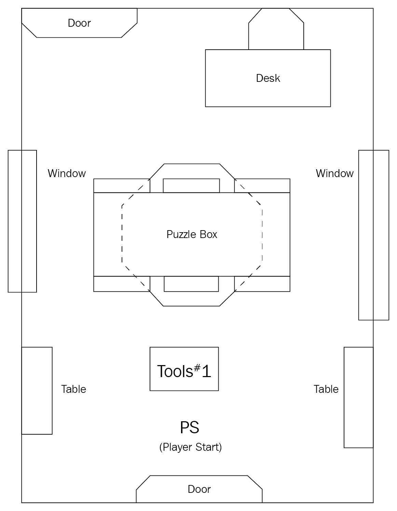

带有设计标记的水平地图

现在，你的直觉可能是在决定艺术风格或开始制作静态网格和着色器。抵制这种冲动！尽管在设计纸上听起来很有趣，但我们不知道所有功能是否都能按预期工作，或者它们是否真的像我们想象的那样有趣。为了测试我们的假设，我们需要进入设计过程的原型阶段，快速构建一个功能原型，并让用户测试以获取反馈。这样，我们不会在可能不使用的游戏元素上浪费时间和资源。

我们将从实现手部功能开始。

# 添加手部功能

我们希望玩家在游戏中的表现尽可能平滑和无缝。为此，我们实施的解决方案需要能够完成几件事情。首先，玩家需要能够看到手。其次，玩家需要能够知道哪些物体可以交互，哪些可能只是作为场景存在。第三，玩家需要能够抓取、拿起，并可能抛出我们希望他们与之交互的物体。第四，我们需要玩家能够按下关卡内的按钮，以利用在不同工具站找到的工具，并解决拼图立方体。

跟随我们的设计的第一步是将手部模型添加到我们的`Server17PlayerPawn`中，以便我们的玩家在游戏中有一个自己的代表。为此，我们将添加 Epic Games 为我们提供的标准手部模型到我们的 pawn 中：

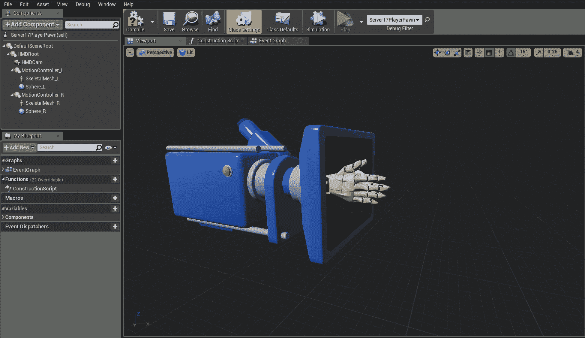

在类蓝图屏幕中添加的手部

这是我们添加手部的步骤：

1.  为了让手部网格读取玩家运动控制器的位置，我们首先在我们的 pawn 中添加一个附加到 MotionController_L 组件的骨骼网格组件。点击 MotionController_L 组件，然后点击组件面板顶部的添加组件按钮。选择骨骼网格选项，并将新组件命名为`SkeletalMesh_L`。

1.  在详细信息面板中，找到骨骼网格下拉菜单，并选择 MannequinHand_Right。这将把手添加到玩家的运动控制器末端。

1.  由于手部是为了作为右手设计的，我们需要更改一些设置，使其正确地作为左手工作。在详细信息面板中找到变换部分，并将位置属性的 X 字段更改为-10。这将使网格与玩家在控制器上的物理手更对齐，感觉更自然。

1.  向下移动到旋转属性，并将 X 值更改为 90 度。这将使手旋转到更自然的位置。

1.  向下移动一个属性到缩放属性，并将 Z 值更改为-1。这将翻转手的朝向，真正地代表左手。

1.  左手完成之后，重复步骤一至四来创建右手，并将其命名为`MotionController_R`。

如果我们现在测试，我们可以看到玩家 pawn 现在有了手！像你不在乎一样在空中挥舞它们。然而，它们实际上并没有做什么，除了看起来像塑料，但打理得很好。让我们开始通过添加一些碰撞形状来赋予它们一些功能，这样我们就可以记录它们与物体重叠时的情况。让我们从左手开始：

1.  选择 MotionController_L 组件，并导航到添加组件菜单。在下拉菜单的碰撞部分找到 Sphere Collision 组件，并选择它。将其命名为`Sphere_L`。

1.  在详细信息面板中，将球体半径更改为 10。这将定义对象被认为与玩家的手重叠的区域。

1.  重复步骤一和二以创建右手的一个碰撞球体，并将其命名为`Sphere_R`。

我们的手现在已设置好以记录重叠事件，这样我们就可以在游戏世界中操纵对象。此时，我们希望这些对象执行几个动作。我们希望它们能够检测到它们被注视和未被注视的情况。我们还需要它们知道我们对它们执行了某种动作，即激活和未激活状态。为此，我们将使用一种称为**蓝图接口**的东西。蓝图接口可以被定义为可以分配给需要共享数据和功能的对象的一个或多个函数的集合。它允许我们创建许多函数，每个使用该接口的对象都可以以独特的方式定义这些函数。在我们的游戏中，我们将创建一个包含控制双手如何操纵游戏对象的全部功能的接口。

*Tribe XR*广泛使用蓝图接口来促进其不同用户界面的创建和通信，因为其中许多共享共同元素。从用于显示音乐曲目信息的界面元素到选项屏幕，它们都有一个共同点，即它们都是投影到三维平面上的二维界面。正如我们将在下面的屏幕截图中所看到的，提前创建一个通用函数的蓝图接口可以促进这些菜单的创建！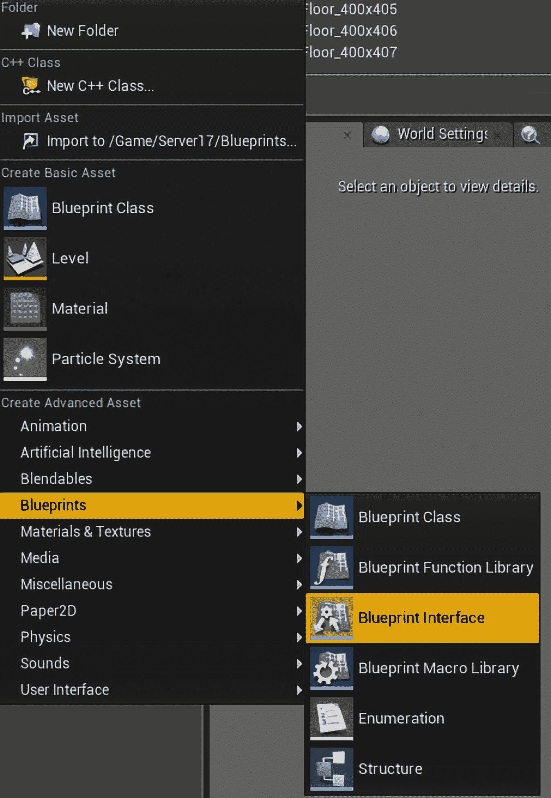

右键菜单中的蓝图接口选项

首先创建一个新的蓝图接口：

1.  确保我们位于`Sever17\Blueprints`文件夹中。在内容浏览器中右键单击，并导航到菜单的创建高级资产部分。找到蓝图选项并选择蓝图接口。将其命名为`ObjectInteractionInterface`。

1.  双击`ObjectInteractionInterface`以打开它。

1.  我们需要在这里创建几个函数。在屏幕右侧的我的蓝图面板的函数部分，点击加号（+）按钮创建一个新函数。将其命名为`TraceHitObject`。每当我们的对象被运动控制器或 HMD 的线迹击中时，它就会触发，这表示我们正在以某种方式查看或与之交互。

1.  在选择我们的新函数后，查看详细信息面板。此面板允许我们向我们的函数添加输入和输出以处理我们的数据。让我们添加一个名为`Hit`的输入，并使用击中结果类型。将击中数据传递给对象允许我们在以后访问重要信息。

1.  要完成函数，我们需要添加一个名为 Return 的布尔输出。虚幻引擎将没有输出的函数读取为事件，这不是我们想要的。为了避免这种情况，我们使用一个虚拟的布尔变量来完成函数。

1.  下一个我们需要创建的函数将能够读取当痕迹离开对象时的情况，为我们提供额外的功能选项。返回到 `MyBlueprint` 面板的函数部分，并创建另一个函数。将其命名为 `TraceLeaveObject`。创建一个名为 `Hit` 的输入变量，其类型为 Hit Result。通过创建一个布尔型输出并将其命名为 `Return` 来完成函数。

1.  现在对象能够判断是否被注视，让我们将这一功能提升到下一个层次。让对象知道正在被注视的哪一部分将非常有用。我们可以通过在组件级别检测痕迹来实现这一点。创建一个新函数，并将其命名为 `TraceHitComponent`。就像我们的其他函数一样，我们需要创建一个名为 `Hit` 的输入，其类型为 Hit Result，以及一个名为 `Return` 的输出，其类型为布尔型。

1.  为了能够读取被击中的组件，我们还需要添加另一个输入。创建第二个输入，并将其命名为 `Component`，使其类型为原始组件。这样，我们就可以传递被击中的特定组件。

1.  让我们完成这个功能。创建另一个函数，并将其命名为 `TraceLeaveComponent`。这个函数应该具有与 `TraceHitComponent` 相同的输入和输出。

1.  只需再创建几个函数，我们就能完成！让我们创建一个可以在每一帧调用的函数，以跟踪对象的潜在移动。创建另一个函数，并将其命名为 `TraceMove`。这个函数应该有一个名为 `Hit` 的输入，其类型为 Hit Result，以及一个名为 `Return` 的输出，其类型为布尔型。

1.  `TraceMove` 需要一个额外的更改才能正确工作。由于这是一个每帧调用的函数，性能肯定是一个考虑因素。为了优化这个函数，我们将检查两个选项。首先，在 `Hit` 输入下，点击变量名称旁边的小箭头，然后点击复选框以使函数通过引用传递。通过引用传递允许 `Hit` 变量通过名称传递而不传递值。因为我们选择以这种方式传递变量，所以我们需要在详细信息面板的图形部分中选择常量选项。如果你看不到选项，请点击该部分底部的向下箭头以显示复选框。

1.  最后，让我们再创建一点功能。我们希望能够激活和关闭对象上的某种效果。这涵盖了各种潜在场景，例如能够打开和关闭你捡起的闪光灯。为了创建这种效果，我们需要两个额外的函数。首先，创建一个新函数，并将其命名为 `TraceActivateDown`。

1.  `TraceActivateDown`将表示按下按钮以激活对象。它需要两个输入。第一个名为`Hit`，具有击中结果类型（这样就可以在击中结果中包含大量信息）。第二个名为`Instigator`，类型为兵种。这样，我们可以传递激活对象的兵种。最后，创建一个名为`Return`的布尔类型输出。

1.  如果`TraceActivateDown`代表按钮按下，那么我们需要为我们的接口创建一个最终函数来表示该按钮的释放。创建一个名为`TraceActivateUp`的最终函数。这个函数应该具有与`TraceActivateDown`相同的输入和输出。

完成所有操作后，你的界面应该看起来像这样：

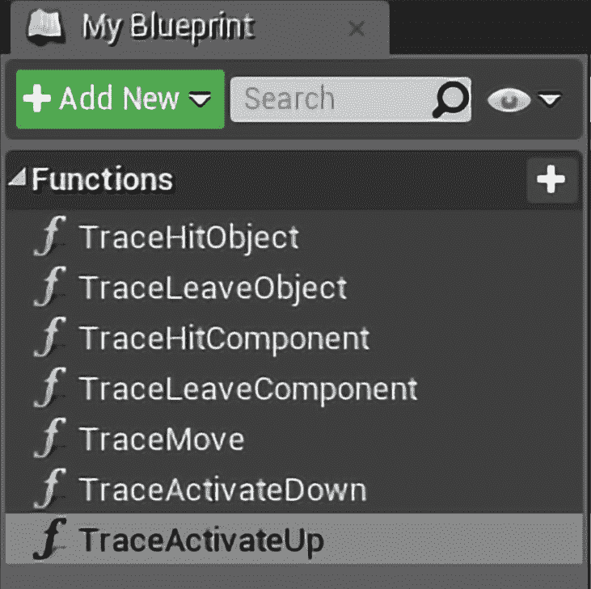

对象交互接口的“我的蓝图”部分

`ObjectInteractionInterface`现在封装了我们希望对象能够执行的大多数函数。然而，许多函数依赖于成为线迹的目标才能操作。**线迹**是一个可以调用的函数，它将从一点绘制到另一点，并报告被线迹击中的任何东西。使用这些击中数据，我们可以做各种事情！例如，我们可以找到玩家到物体的距离。我们可以对物体进行操作以改变颜色、发出声音或执行其他行为。我们甚至可以导致物体删除自己。在射击游戏中，这是直接伤害武器，如激光、狙击步枪或其他没有实际弹丸的武器的工作方式。由于我们的线迹将检查玩家正在看的地方，并且可能会用来确定他们可以传送的地方，因此我们将使用抛物线或曲线而不是直线进行追踪。为此，我们将创建一个自定义组件，可以添加到我们的 HMD 或动作控制器中，以投射线迹：

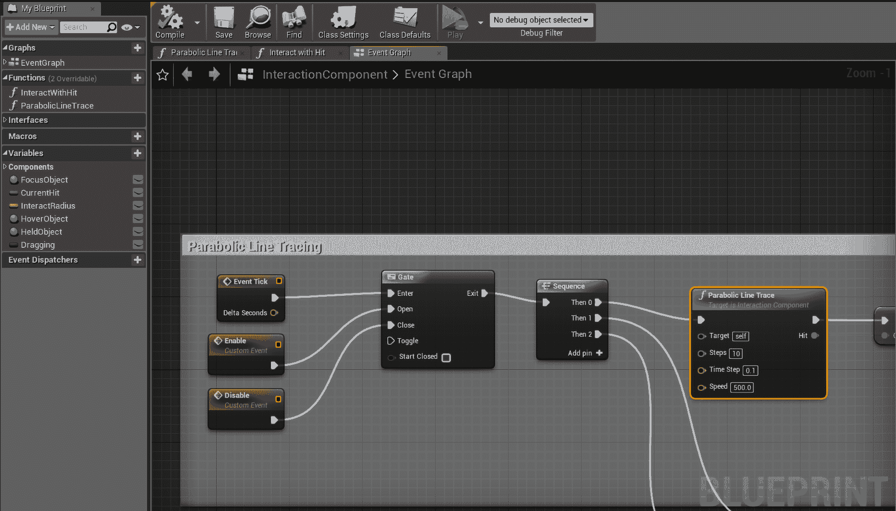

创建交互组件

我们需要创建一个自定义场景组件，可以添加到我们的自定义兵种中：

1.  在内容浏览器中，在`Server17\Blueprints`文件夹中右键单击，然后点击蓝图类选项。在“选择父类”窗口的底部部分，使用搜索框搜索场景组件。点击它，然后点击选择按钮。将这个新组件命名为`InteractionComponent`。

1.  这个新组件将处理我们的线迹追踪以及它收集到的任何数据。然后，它将通过我们的接口将击中数据分发到所有交互函数。首先，通过点击“我的蓝图”面板中的+函数按钮创建一个新的函数。将这个新函数命名为`ParabolicLineTrace`。

1.  我们通过获取交互组件面向的方向并基于固定时间和速度值计算投影曲线来计算抛物线曲线。公式是 *z = (t * v[z]) - (0.5 * g * t²)*，其中 *z* 是 *z* 轴上弧线的投影终点，*v* 是速度，*g* 是重力，*t* 是时间。弧线将覆盖的距离通过 *y = t * v[y]* 来估算，其中 *y* 是 *y* 轴上弧线的终点。为了使我们的函数计算弧线，它需要三个输入。第一个名为 `Steps`，类型为整数。第二个名为 `TimeStep`，是一个浮点值。最后，我们有 `Speed`，类型为浮点。

如果你不懂数学，不用担心！它创建的弧线非常适合估算我们未来传送的最终位置。一旦完成，Unreal Engine 4 将能够为我们直观地表示线迹，这将变得有意义。

1.  双击我们的新函数以打开它。`ParabolicLineTrace` 需要六个局部变量才能工作。在 My Blueprints 面板的底部找到局部变量部分。点击 +Local Variable 按钮并创建一个名为 Init Loc 的新变量，类型为 Vector。接下来，创建一个名为 Prev Loc 的变量，类型也是 Vector。这些将存储我们曲线计算的初始位置。

1.  创建另一个名为 `Velocity` 的局部变量，类型为 Vector。这是我们的速度值。

1.  现在，我们需要两个局部变量来处理我们的时间计算。创建两个新的局部变量，名为 `InTimeStep`，类型为 Float，以及名为 In Steps，类型为 Integer。

1.  这是最后一个了！我们需要一个额外的局部变量来存储从线迹获取的命中数据。创建一个名为 `TempHit` 的最终局部变量，并确保其类型设置为命中结果：

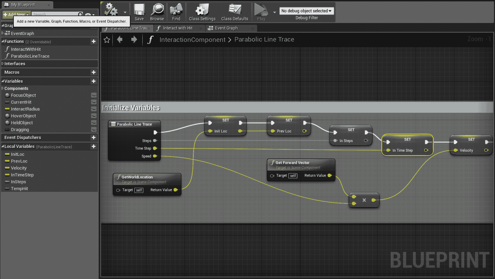

在抛物线线迹中设置变量

我们终于设置好了所有变量，现在可以继续创建曲线计算了。

1.  我们函数的第一步是存储我们的位置数据。从你的局部变量部分，拖入一个 `InitLoc` 变量的副本并选择设置。同样，对你的 `PrevLoc` 变量也这样做。将函数开始处的执行输出连接到 Init Loc 的输入。将 Init Loc 的执行输出连接到 Prev Loc 的输入。

1.  现在我们需要填充它们的数据。我们首先需要知道交互组件在游戏世界中的位置。在蓝图窗口中右键单击或使用调色板获取 GetWorldLocation 节点。将我们新节点的输出连接到 Init Loc 向量输入，然后将 Init Loc 的向量输出连接到 Prev Loc 的向量输入。

1.  返回 My Blueprint 中的局部变量部分，获取 In Steps 和 `InTimeStep` 变量，并对它们都选择设置。将 Prev Loc 节点的执行输出连接到 In Steps 节点的执行输入。然后，将 In Steps 的执行输出连接到 In Time Step 的输入。

1.  为了完成这一部分，我们需要将“步骤”和“时间步长”连接到它们适当的数据输入。从函数中获取“步骤”输入并将其连接到“步骤”的整数输入。最后，从函数中获取时间步长输入并将其连接到“时间步长”的浮点输入。

1.  在计算曲线之前，我们还需要初始化一些最后的数据。为了得到用于计算的速率，我们需要确定交互组件的前进向量，并将其乘以函数输入的`Speed`变量。回到屏幕的局部变量部分，拖入一个`Velocity`变量的副本。从菜单中选择“设置”。将我们的“In Time Step”节点的执行输出连接到新的速度节点。

1.  在蓝图上右键单击并使用菜单找到目标为场景组件的“获取前进向量”节点。从节点的返回值拖出一条线，将其拖到搜索菜单中，并搜索“`Vector * Float`”节点。向量输入将是“获取前进向量”的返回值，浮点值将是函数起始处的速度输入。得到的值将成为“设置速度”节点上向量的输入：

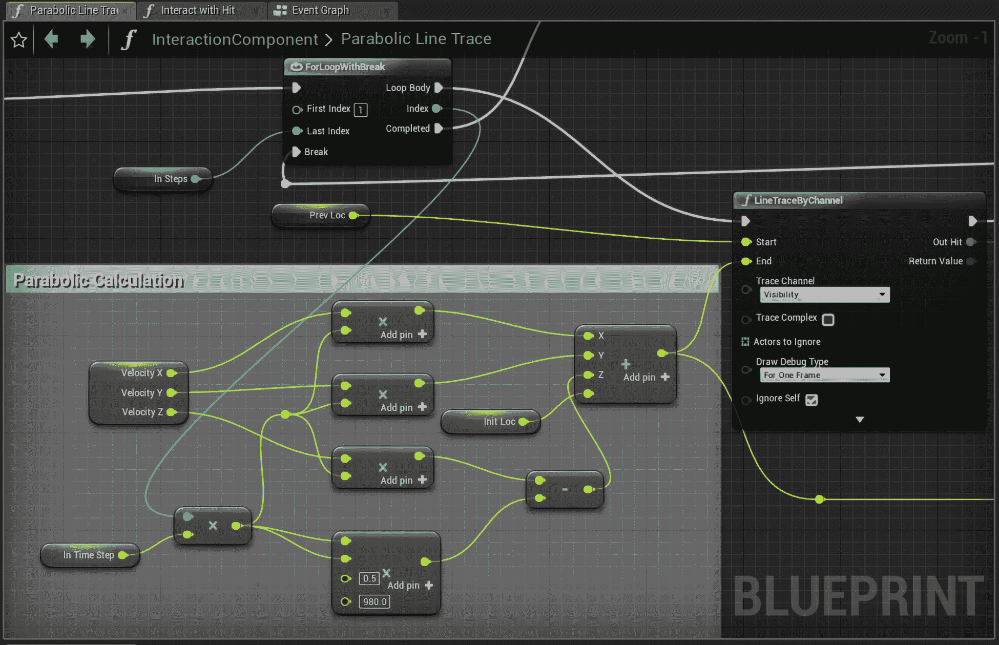

在蓝图中进行抛物线轨迹计算

1.  在所有变量都整理好之后，是时候进行有趣的部分了！通过创建一个`ForLoopWithBreak`节点开始计算。将我们的设置速度的执行输出连接到`ForLoopWithBreak`的执行输入。拖入一个本地变量“步骤”的副本，并将其连接到`ForLoopWithBreak`的最后一个索引输入。最后，将第一个索引整数设置为 1。

1.  接下来，创建一个“通过通道进行线迹”节点。这个节点将完成所有繁重的工作并创建实际的线迹。将`ForLoopWithBreak`的循环体输出连接到新线迹的执行输入。在线迹节点上，将“绘制调试类型”更改为“为一帧”。这将帮助我们可视化抛物线弧。我们总是可以在之后将其关闭。现在，获取一个`PrevLoc`变量的副本，并将其连接到线迹的“开始”输入。

1.  开始数学运算！让我们先获取一个`Velocity`局部变量的副本。在变量的输出上右键单击并选择“拆分结构引脚”选项。这将显示组成我们的速度向量的所有值。

1.  现在创建三个`Float * Float`节点的副本。我们将把刚刚在速度节点上公开的`X`、`Y`和`Z`值连接到每个乘法节点的顶部输入。

1.  创建一个`InTimeStep`局部变量和一个`Integer * Float`节点的副本。将变量的输出连接到乘法节点上的浮点输入。节点的整数部分输入来自`ForLoopWithBreak`节点的`Index`输出。这段数学计算的结果将被许多节点使用。

1.  将输出结果插入到我们在*步骤 17*中创建的乘法节点之前的第二个浮点输入。

不要忘记，你可以创建重路由节点来帮助你清理代码！在 Blueprint 中右键单击，就像你正在创建一个新节点一样，并在菜单底部找到 Reroute 节点。

1.  是时候在我们的计算中补偿重力了。创建一个`Float * Float`节点，并将其放置在*步骤 18*中创建的乘法节点附近。在新创建的节点上，有一个标有+ Add Pin 的按钮。让我们点击两次以创建两个额外的输入引脚。将*步骤 18*中乘法节点的输出插入到我们新节点的第一个两个输入值（这代表方程中的时间平方）。在第三个输入中，将值更改为 0.5。在最后一个输入中，将值更改为 980。

1.  我们几乎完成了数学计算。创建一个`Float - Float`节点，并将我们用于*Z*值的乘法节点的输出插入到第一个输入，将我们在*步骤 20*中创建的乘法节点的输出插入到第二个输入。

1.  最后，创建一个最终的数学节点，`Vector + Vector`，并在第一个`Vector`输入引脚上右键单击。从菜单中选择 Split Struct Pin。*X*值将是 X 速度乘法节点的输出。*Y*将是 Y 速度乘法节点的输出。*Z*值将是我们在上一步中创建的`Float - Float`的输出。所有这些都将添加到 Init Loc 的值。创建变量的副本并将其插入到最后一个输入。此节点的输出将成为线迹节点上的 End 向量输入。

关于此函数的最后一段内容。随着我们的 Line Trace by Channel 节点获取所有所需的信息，我们需要设置输出值以存储我们从追踪中接收到的信息。我们将通过更新我们存储在 Prev Loc 节点中的位置并将击中结果信息保存到 TempHit 节点中来实现这一点：

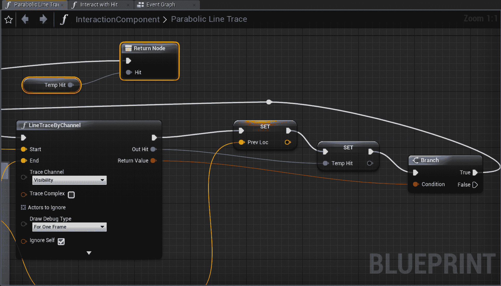

完成线迹追踪

让我们把这个东西完成！

1.  为我们的`PrevLoc`变量创建一个 SET 节点，并将线迹的执行输出连接到其执行输入。要更新向量输入，从我们在*步骤 22*中创建的`Vector + Vector`节点拖动一个连接并将其插入到输入。

1.  接下来，为 Temp Hit 局部变量创建一个 Set 节点，并将我们的 set Prev Loc 节点的执行输出连接到执行输入。将线迹的 Out Hit 输出连接到输入。

1.  为了确保在没有找到击中时，我们不会进行任何不必要的击中计算，让我们添加一个 Branch 节点。添加一个 Branch 节点，并将 set TempHit 节点的执行输出连接到它。将线迹的 Return Value 输出传递到条件输入。

1.  将此节点的执行输出全部返回到 ForLoopWithBreak 节点，并将其插入到 Break 输入。

1.  通过将完整的执行输出连接到函数的返回节点输入来完成此操作。创建 TempHit 的副本并将其传递到函数的输出。

现在抛物线射线追踪函数终于完成了（哇！那里有很多东西），是时候对它收集到的击中信息做些处理了。`InteractWithHit`函数将接收来自射线追踪的击中数据并将其传递到我们在对象交互接口中创建的函数：

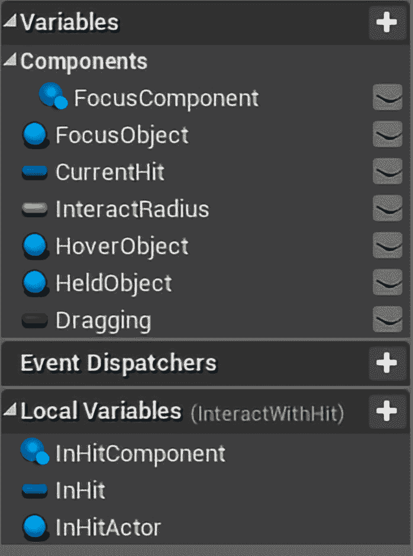

`InteractWithHit`函数的变量

让我们从创建一些变量开始：

1.  在我的蓝图面板中，找到变量部分并点击+变量按钮。我们将创建的第一个变量将被命名为`FocusComponent`。将变量类型设置为原始组件。这将允许我们处理对象的各个组件以及对象本身。接下来，创建一个名为`FocusObject`的新变量，类型设置为`Actor`。这将存储当前被击中的对象。最后，创建一个名为`CurrentHit`的变量，类型设置为`Hit Result`，用于存储我们从射线追踪中收集到的击中信息。一旦创建了所有三个变量，点击每个变量并在详细信息面板中将它们标记为私有。

1.  是时候创建我们的第二个函数了。在我的蓝图函数部分，点击+函数按钮并将新函数命名为`InteractWithHit`。新函数需要能够将击中数据传递给它。点击函数，并在详细信息面板中创建一个名为`Hit`的新输入，类型为击中结果。

1.  现在我们需要在我们的新函数内部设置三个局部变量。双击`InteractWithHit`函数并转到局部变量部分。点击+局部变量按钮，并将新变量命名为`InHitComponent`，类型为原始组件。创建第二个局部变量，并将其命名为 In Hit，类型为击中结果。最后，创建第三个局部变量，并将其命名为 In Hit Actor，类型为演员。

1.  初始设置已完成！随着我们的变量创建完成，我们现在可以开始用数据初始化它们。从函数节点开始，复制我们的 In Hit 局部变量，并从结果菜单中选择设置。将函数节点的执行输出连接到设置 In Hit 节点的输入。我们还想传递从函数外部来的击中数据，所以我们将函数节点的 Hit 引脚连接到设置 In Hit 节点的输入：

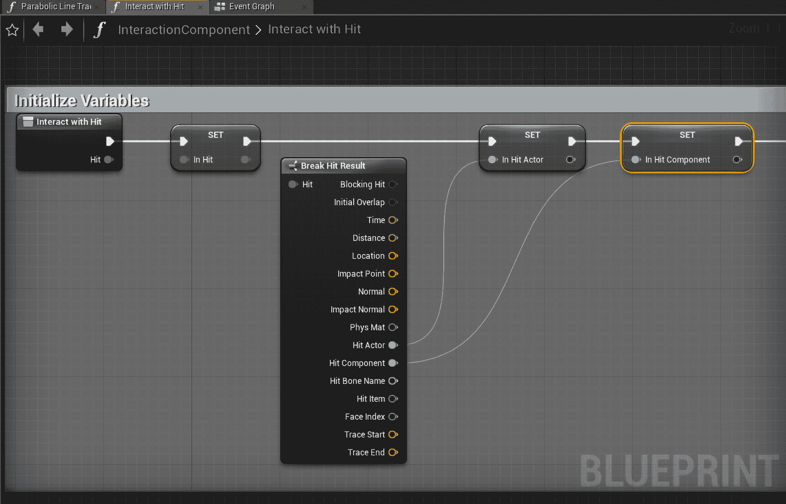

将击中数据接收并存储在我们的变量中

1.  接下来，我们将分解击中信息，并将击中演员和击中组件数据传递到我们的局部变量中，这样我们就可以处理它们了。在蓝图上右键单击并创建一个分解击中结果节点。将设置`In Hit`节点的变量输出连接到新节点的输入上。这将把击中信息分解成各个部分。接下来，引入我们的`In Hit Actor`和`InHitComponent`变量的副本，并从菜单中选择设置。创建了两个设置器后，按照之前截图中的顺序将它们连接起来。然后，将分解击中结果中的击中演员输出连接到设置`In Hit Actor`节点的输入上。务必为击中组件和`InHitComponent`节点做同样的事情。

1.  我们在这里所做的大部分工作都是检查数据，看看我们正在查看的内容是否可以交互，然后通过我们之前创建的接口传递这些信息。我们还需要能够清除我们的变量，如果我们不再查看具有交互性的内容。这个过程的第一步是检查我们正在查看的对象（存储在焦点对象中）是否等于我们当前正在查看的对象，为此我们需要一个`Branch`节点。创建一个新的`Branch`节点，并将其执行输入连接到设置`InHitComponent`的输出。现在我们需要比较的两个变量。获取我们的焦点对象变量和`In Hit Actor`局部变量的副本。从`FocusObject`拖动一个连接并放置到打开搜索菜单。寻找相等（对象）节点。这将比较传递给它的两个对象，并返回一个布尔值，显示它们是否匹配。将`In Hit Actor`连接到第二个输入，并将布尔输出运行到分支的输入引脚上：

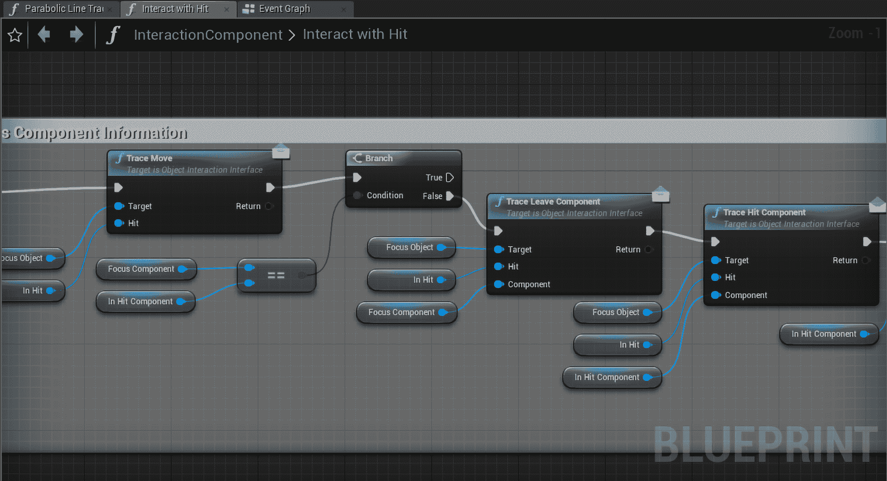

通过我们的接口传递数据

1.  我们的分支已经准备好了，现在是时候传递信息了。从`True`输出拖动一个连接并将其放置到我们之前在对象交互界面中创建的追踪移动（消息）函数上。获取焦点对象变量的副本并将其传递到追踪移动的目标引脚上。现在获取`In Hit`变量的副本并将其连接到追踪移动的`Hit`输入上。

1.  创建另一个分支节点，并将其执行输入连接到追踪移动的输出。这次，我们将检查焦点对象是否等于`InHitComponent`，如果不等于，则传递新的信息。为此，我们需要获取`Focus Object`和`InHitComponent`，并使用我们的相等（对象）节点来比较它们。将比较的布尔输出插入到新分支的输入上。

1.  下一个我们需要的是接口中的另一个函数。右键单击并搜索 Trace Leave Component（消息）。创建它并将其连接到上一个分支的 False 输出。对于输入，我们需要获取 FocusObject 的副本并将其传递到 Target，将 In Hit 传递到 Hit，并将 FocusComponent 传递到 Component。

1.  现在我们已经对当前关注的组件调用了 leave，我们将调用 Trace Hit Component 并让它传递我们正在查看的当前组件。创建 Trace Hit Component（消息）的副本并将其连接到 Trace Leave Component。将 FocusObject 传递到 Target，将 In Hit 传递到 Hit，并将`InHitComponent`传递到 Component。

1.  在这个流程分支中，还有最后一步。我们需要将 FocusComponent 设置为新的`InHitComponent`。为 FocusComponent 创建一个 Set 节点，并获取`InHitComponent`的副本。将 Trace Hit Component 的执行输出连接到设置 FocusComponent，并将`InHitComponent`传递到变量输入引脚。

1.  我们创建的分支是关于如果查看的 Focus Object 和 In Hit 对象相同，则传递组件数据，但如果它们不同怎么办？如果它们不同，我们需要清除击中数据并通过接口传递新的击中信息。回到我们之前在*步骤 6*中创建的分支。从`False`输出拖动一个连接并放下。搜索 Trace Leave Object 函数并创建节点。Trace Leave Object 有两个输入值。将当前存储在 FocusObject 中的对象传递到 Target 输入。对于`Hit`输入，获取当前 In Hit 的值并将其连接到输入引脚：

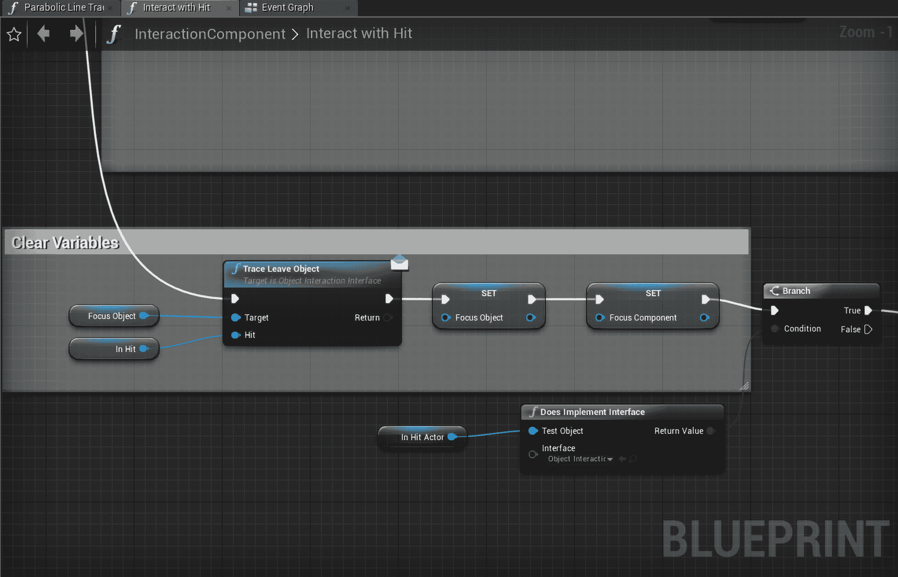

清除变量

1.  由于我们正在离开对象并将注意力转向其他地方，我们需要清除 FocusObject 和 FocusComponent 中存储的值。为每个变量创建一个 Set 版本。将新的设置 FocusObject 节点连接到 Trace Leave Object 的执行输出。将新的设置 FocusComponent 节点连接到设置 FocusObject 节点。我们为它们的输入值留空以清除它们的值。

1.  在我们将新的命中数据传递之前，我们还需要进行一个检查。我们只想在查看的对象使用了对象交互接口时传递命中信息，因为其他任何东西对我们来说都不重要。这是作为设计师的我们创建可交互对象和仅作为场景的对象的方式。为此，我们将使用另一个分支节点。将新分支的输入连接到设置焦点组件的执行输出。为了检查我们正在查看的对象是否使用了该接口，我们需要使用“是否实现接口”函数。此函数接受一个演员并检查它是否附加了特定的接口，然后返回一个布尔值——非常适合与分支节点一起使用。创建一个“是否实现接口”的副本。将“命中演员输入”的值作为测试对象传递，然后点击菜单下的下拉菜单。使用菜单顶部的搜索框找到我们的对象交互接口。设置完成后，将节点的返回值插入到分支的“条件”输入。我们的检查已经设置好了：

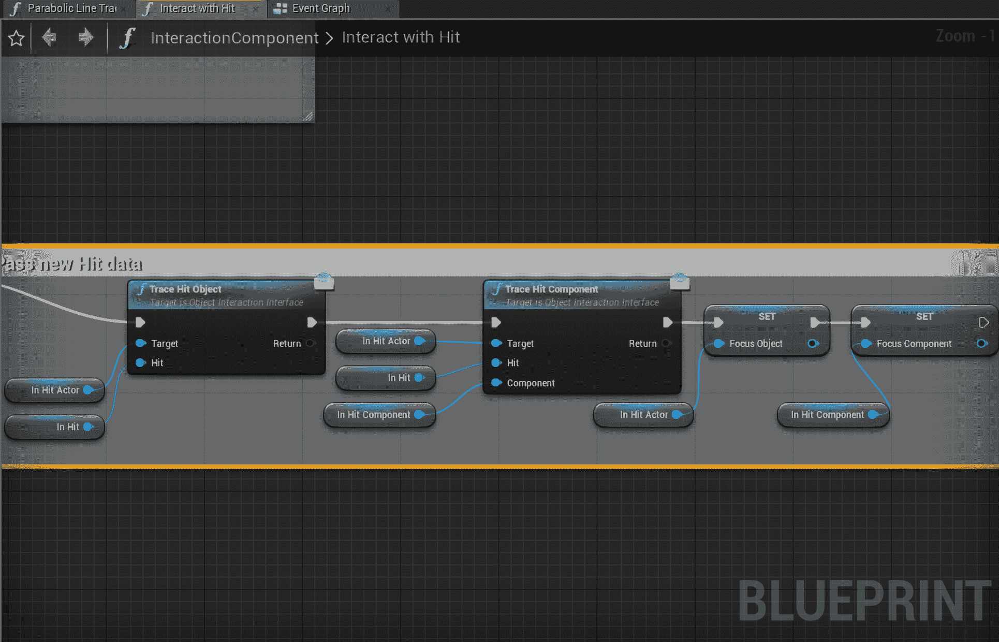

传递新的命中数据

1.  现在剩下要传递的就是新的命中数据。在蓝图上右键点击并搜索“追踪命中对象（消息）”。将其连接到分支的“真”输出，并将“命中演员输入”传递到目标输入，将“命中输入”传递到命中输入。

1.  接下来，创建一个“追踪命中组件（消息）”函数的副本。将“命中演员输入”传递到目标输入，将“命中输入”传递到命中输入，并将“命中组件输入”传递到组件输入。

1.  在此分支的最后一步，我们需要更新存储在“焦点对象”和“焦点组件”中的值，使用“命中演员输入”和“命中组件输入”的值。创建一个设置焦点对象节点并将其连接到追踪命中组件函数的执行输出。将“命中演员输入”的值传递到变量输入。最后，将设置焦点组件的执行输入连接到设置“焦点演员”的执行输出，并传递“命中组件输入”的值。我们现在已经完全完成了这个函数的使用！

到这里已经编写了相当多的代码，不是吗？然而，我们在构建我们的手部交互方面已经取得了巨大的进步。我们的交互组件现在能够进行抛物线线迹以找到对象和安全的传送位置。它现在可以通过我们创建的对象交互接口传递信息，使我们的交互对象能够与手部协同工作，以创建游戏玩法。现在是时候在事件图中将所有这些整合在一起，以实现我们创建的所有功能。为此，我们将使用事件计时节点：

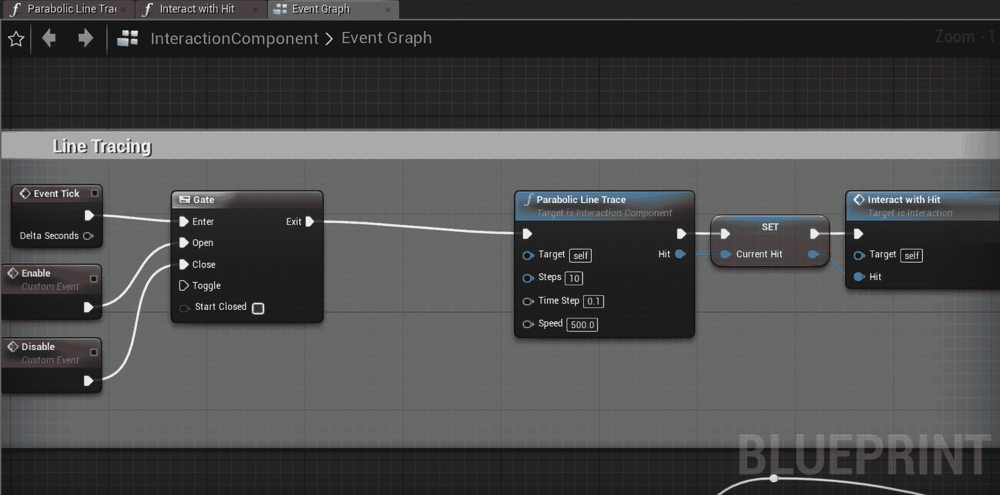

触发抛物线线迹

首先创建几个自定义事件：

1.  我们需要两个自定义事件来表示我们希望交互组件具有的开和关状态。自定义事件将由蓝图外的元素调用，以通过玩家的动作控制器上的按钮点击触发交互。在事件计时节点附近右键单击并找到菜单中的添加事件部分。打开它并选择添加自定义事件选项。将这个新事件命名为`Enable`。重复此过程创建第二个自定义事件并将其命名为`Disable`。

1.  接下来，我们将使用一个门节点来仅允许玩家在通过按钮启用交互组件时与对象交互。门是一个流控制节点，它打开和关闭以允许程序员允许时才通过数据。在蓝图上右键单击并搜索门节点。我们将事件计时输出连接到门上的进入输入。为了控制数据流，我们将我们的启用自定义事件的执行输出连接到打开输入，并将禁用自定义事件的执行输出连接到关闭输入。

1.  现在我们将添加我们的抛物线线迹函数。从我的蓝图面板中获取它的副本并将其拖入蓝图。将门节点的执行输出连接到函数的执行输入。为了确保我们的抛物线函数正确运行，将步骤数设置为`10`，时间步长设置为`0.1`，速度设置为`500`。

1.  我们需要存储我们的线迹输出，以便我们可以将其传递给与击中交互函数。幸运的是，我们已创建了一个变量来保存它。通过从我的蓝图面板中拖动它创建我们的`CurrentHit`击中变量的副本，并从菜单中选择设置。将其连接到线迹函数的执行输出，并将线迹的击中输出传递给它。

1.  通过引入“与击中交互”函数并连接从设置当前击中节点执行输出到它来结束序列。将设置当前击中的变量输出作为函数上的击中输入连接。

这个交互谜题还有最后一个部分。我们需要将交互组件添加到`Server17PlayerPawn`并将功能映射到玩家的动作控制器上的按钮。让我们首先向交互组件蓝图添加两个更多的自定义事件：

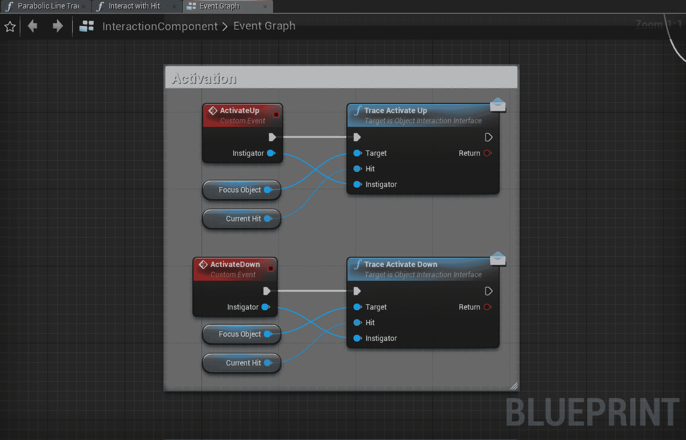

交互蓝图激活部分

每个按钮都有两种状态：上和下。我们将通过创建两个自定义事件来定义这些状态：

1.  在蓝图的新部分中右键单击，找到菜单中的添加事件部分，打开它并选择添加自定义事件。将第一个命名为`ActivateUp`。创建第二个自定义事件并将其命名为`ActivateDown`。这两个事件都需要一个输入。单击每个自定义事件，然后在详细信息面板的输入部分单击+按钮。将输入命名为`Instigator`并将其类型设置为 Pawn。

1.  从 ActivateUp 拖动一条连接并搜索 Trace Activate Up（消息）。我们作为接口的一部分创建了此函数。将其执行连接到 ActivateUp 事件，并将事件的 Instigator 输出连接到函数的 Instigator 输入。

1.  Trace Activate Up 还需要两个更多的输入值才能正确工作。获取`FocusObject`变量的副本并将其连接到目标输入。最后，获取`CurrentHit`变量的副本并将其连接到函数的`Hit`输入。

1.  我们将重复此过程为`ActivateDown`——只是这次，我们将连接来自我们接口的 Trace Activate Down（消息）函数。

是时候完成玩家 pawn 中的设置了：

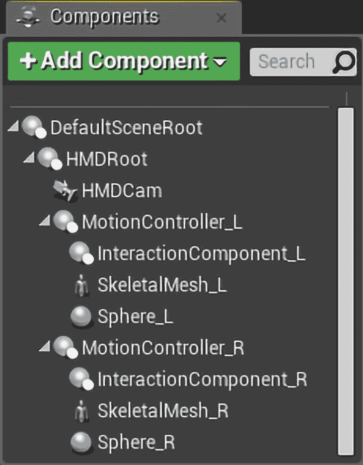

在玩家 pawn 中设置组件

首先为每只手添加交互组件的副本：

1.  在内容浏览器中找到`Server17PlayerPawn`并双击以打开它。

1.  在视口选项卡中，转到组件面板并点击添加组件按钮。使用搜索框找到我们创建的交互组件。它将在自定义标题下。点击它并命名新组件为`InteractionComponent_L`。

1.  将新组件拖放到 MotionController_L 组件上。

1.  重复*步骤 2*和*步骤 3*以创建一个作为右侧运动控制器子组件的第二交互组件。将其命名为`InteractionComponent_R`。

1.  现在我们可以将我们的新交互组件绑定到控制器上的按钮。这将赋予玩家最终与世界交互的能力！点击事件图选项卡。在图的空白部分右键单击并搜索 MotionController (L) 触发事件。重复此过程以创建一个用于 MotionController (R) 触发事件的节点：

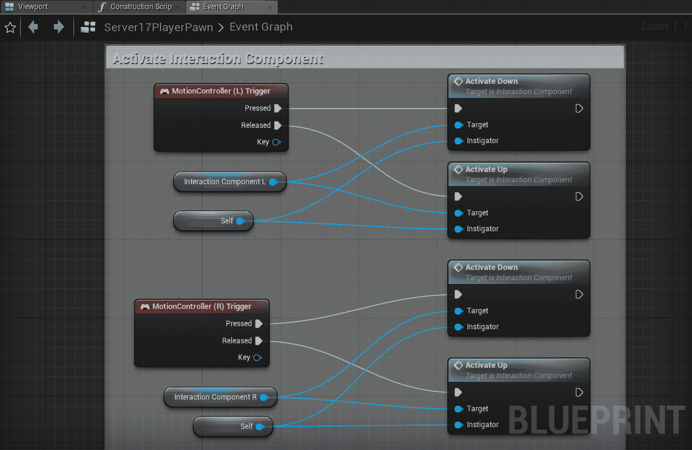

在玩家 pawn 中将动作映射到我们的运动控制器

1.  对于我们每个按钮事件，我们需要为我们在交互组件蓝图中所创建的自定义事件创建两个引用。首先从我的蓝图面板中获取左侧交互组件的引用。将其放置在 MotionController (L) 触发事件附近。从它拖动一条线并放下。使用搜索框找到我们的 Activate Down 函数。将其连接到左侧触发事件的 Pressed 执行输出。接下来，从 Activate Down 函数的 Instigator 输入引脚上拖动一条连接并将其拖到搜索菜单中。搜索对`Self`变量的引用。在这种情况下，玩家是激活的施动者。

1.  使用右侧交互组件的引用重复此过程以处理 MotionController (R) 触发事件。

我选择使用左右触发器进行交互，有几个不同的原因。首先，这是一个对于初次用户来说自然可以按下的按钮，用于激活某物或使其发生。它是直观的。其次，按钮事件存在于 Oculus Touch 控制器和 Vive 运动控制器中，因此我无需在硬件之间进行任何更改。稍后，我们将创建一个拾取交互，我将出于相同的原因使用握把按钮。

在这个编程的第一个部分，我们设置了手的静态网格并编程了`ObjectInteractionInterface`，这是一个可以被我们希望玩家能够与之交互的对象利用的函数集合。这个蓝图界面连接到我们的交互组件，这是一个具有利用抛物线线迹功能查找交互对象能力的自定义场景组件。最后，我们将激活功能映射到运动控制器的按钮上，作为玩家蓝图的一部分。在下一节中，我们将在此基础上构建新的功能来创建传送机制。

# 构建传送

现在已经实现了线迹和交互的代码，我们可以将注意力转向传送系统本身。在*Server 17*中使用传送的目标是给我们的玩家提供一个直观的环境移动方法。尽管传送通常被视为破坏沉浸感，但我认为我们游戏中的网络空间环境支持玩家角色能够在空间中传送的想法。为了开始，让我们首先考虑 VR 传送系统的各个部分：

+   **视觉**：玩家需要能够可视化当他们点击按钮时将移动到的地方。这可以通过将一条线或一个弧投影到他们将要着陆的地方来完成（我们通过之前设置的线迹调试选项完成了这个操作）。我们还应该在他们会着陆的表面上有一个视觉元素，以进一步突出他们的着陆点。最后，我们可能还会考虑粒子效果和/或声音效果来增强玩家体验。

+   **传送代码**：这将是在蓝图内构建的实际功能。代码需要处理显示视觉元素以及传送本身。对于设计师来说，构建一些控制也很不错，以限制玩家只能在特定区域内传送，这样他们就不能传送出我们为他们构建的区域或看到他们不应该看到的东西。

与我们通常开始构建此类功能（功能，然后是艺术）的方式相反，这里我们将从一些视觉组件开始。在这种情况下，我们需要一些可以打开和关闭的视觉元素来确保我们的代码正常工作。构建这个系统也将是对我们的界面和线迹代码工作情况的一个极好的测试。让我们从地面上的一个用于传送的视觉元素开始：

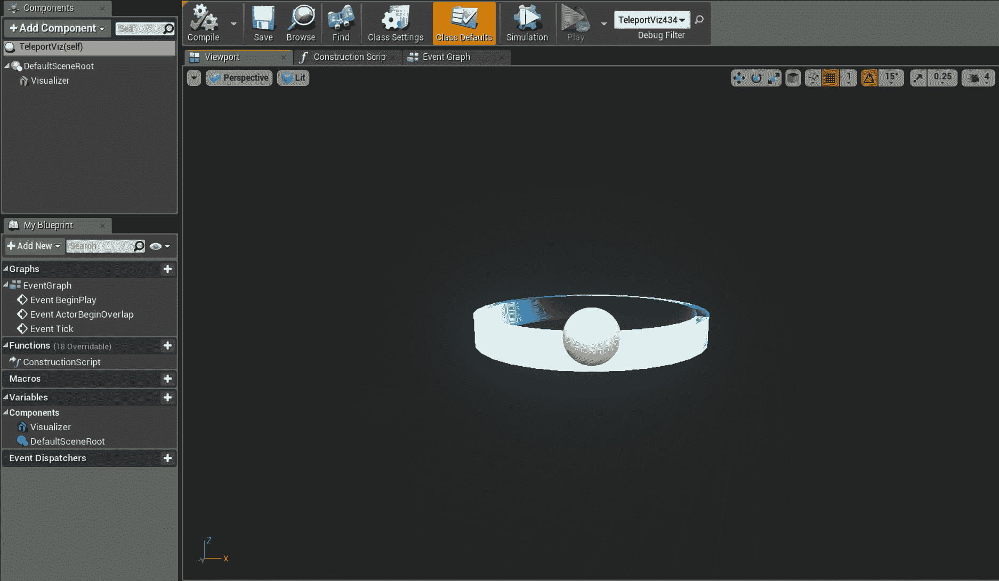

TeleportViz 视口

我们首先创建一个新的演员蓝图：

1.  在内容浏览器中，在`Server17\Blueprints`文件夹上右键单击，并从菜单的创建基本资产部分选择蓝图类选项。从选择父类菜单中选择 Actor，并将这个新蓝图命名为 TeleportViz。双击蓝图以打开它。

1.  在视口选项卡中，转到组件面板，并点击添加组件按钮。从菜单中选择静态网格。这应该创建一个新的静态网格组件，它是默认场景根的子组件。

1.  点击它，并在详情面板的静态网格部分中搜索。有一个名为静态网格的选项，我们可以设置我们想要使用的形状。点击下拉菜单，搜索 SM_FatCylinder，尽管你可以使用你喜欢的任何形状。将部件命名为`Visualizer`。

1.  这个静态网格看起来有点单调。让我们用自定义材质让它发光一点，使其突出。这还将作为游戏整体环境潜在艺术风格的一个很好的测试。在内容浏览器中，导航到`Server17`文件夹，在内容浏览器窗口中右键单击，并创建一个新的文件夹。将其命名为`Materials`。双击新文件夹，并在其中右键单击以创建一个新的材质。将这个材质命名为`M_TeleportViz`。双击新材质以打开它：

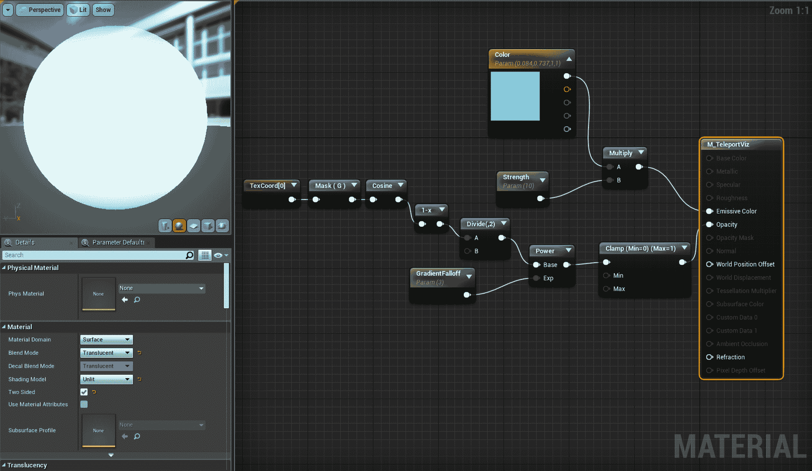

TeleportViz 材质

1.  当我们打开材质时，我们会看到一个大的结果节点来开始。点击它，让我们在详情面板中调整一些设置。找到标签为混合模式的选项。我们希望我们的新材质感觉高科技，所以让我们将其模式更改为半透明，以给它一点这种感觉。接下来，找到着色模型。由于我们将给这个元素一个自发光的光芒，让我们将其模型更改为不发光。最后，勾选复选框以使材质双面。

1.  现在是选择颜色的时候了。通过从调色板面板中抓取它或在材质蓝图上按*3*键并点击来创建一个常量 3 向量。如果你没有打开调色板，并希望它打开，请点击屏幕右上角的窗口按钮，并在菜单中选择调色板。在新的向量上右键单击，并在结果菜单的顶部选择转换为参数。将参数命名为颜色。通过将其设置为参数，我们使其在需要时能够使用蓝图来更改它。这将来可能很有用。

1.  点击颜色节点，然后在详情面板中点击颜色块，以打开颜色选择器。选择你喜欢的任何颜色，然后点击确定按钮。如果你想使用我使用的浅蓝色，请将你的 RGB 值设置为*R=0.84*，*G=0.74*，和*B=1.0*。确保你的 Alpha 设置为*A=1.0*。

1.  为了给材料添加一些发光效果，让我们创建一个常量值并将其乘以我们的颜色。在调色板中搜索 Constant 或右键单击并使用搜索框。右键单击新节点并选择转换为参数，就像我们在*步骤 6*中为颜色所做的那样。在详细信息面板中，将此值命名为 Strength 并将默认值设置为`10`。最后，创建一个 Multiply 节点并将颜色参数的输出作为值`A`连接，将 Strength 的输出作为值`B`连接。最后，将乘法节点的输出连接到结果节点的 Emissive 槽。

1.  为了给我们的新颜色添加一些渐变效果，我们将稍微调整纹理坐标。通过使用调色板或按住*U*键并在蓝图上点击来创建一个纹理坐标节点。

1.  接下来，我们需要一个组件遮罩。使用调色板或右键单击蓝图并使用搜索框来复制节点。在详细信息面板中，关闭使用 R 通道的选项。将纹理坐标的输出连接到组件遮罩的输入。

1.  现在创建一个余弦节点。余弦函数将确保渐变从材料的两端开始。这将连接到组件遮罩的输出。

1.  余弦函数输出介于-1 和 1 之间的值。我们需要结果值仅为正值，因此我们将使用一个 One Minus 节点。这将给我们介于 0 和 2 之间的值。创建 One Minus 节点并将其连接到余弦节点的输出。

1.  为了将值恢复到 0 到 1 之间，我们可以将答案除以 2。使用 Divide 节点，将 One Minus 节点的输出作为`A`值连接。在详细信息面板中找到`B`值的值。将此值更改为`2.0`。

1.  现在我们将添加一些控制渐变从不透明到透明距离的功能。这被称为**衰减**。创建一个新的 Power 节点，并将我们的 Divide 节点的输出连接到新节点的 Base 输入。接下来，创建一个 Constant。这可以通过调色板或搜索菜单完成，或者通过按下一个键并在蓝图上点击。右键单击它，将其转换为参数。将参数命名为`GradientFalloff`并将默认值设置为`3`。将此参数的输出连接到 Power 节点的指数或 Exp 输入。

1.  为了确保结果值永远不会超过 1，我们需要夹紧这个值。创建一个新的 Clamp 节点并将 Power 节点的输出引入。将 Clamp 节点的输出连接到结果节点的不透明度槽。

1.  检查一下！结果应该是发光且部分透明的。你可以通过调整渐变衰减、强度和颜色参数来调整材料，直到感觉合适为止。为了完成视觉效果，回到我们的 TeleportViz 类蓝图，点击静态网格组件。使用详细信息面板，应用我们新的材料，享受高科技的发光效果。

视觉组件处理完毕后，我们现在可以构建功能。为了满足我们需要的能够控制玩家可以传送到的位置的系统的需求，我们将创建一个只允许玩家在我们放置的位置传送的体积。当它检测到线追踪时，它将显示我们的视觉元素，并包含我们的传送代码。首先，在内容浏览器中的 `Server17\Blueprints` 文件夹上右键单击，创建一个新的蓝图类。从选择父类菜单中选择演员，并将其命名为 `TeleportVol`：

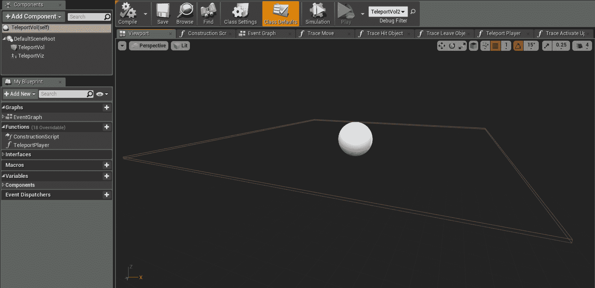

TeleportVol 组件

我们将从视口选项卡开始：

1.  TeleportVol 有两个组件使其工作。第一个是用于检测碰撞和线追踪的盒体体积。第二个是我们之前创建的可以打开和关闭的视觉元素。首先，前往组件面板并创建一个新的盒体碰撞。将新组件命名为 `TeleportVol`。

1.  在组件面板中点击 TeleportVol。我们希望碰撞盒覆盖相当大的空间，但它实际上不需要那么高。在详细信息面板中找到盒体范围条目，并将值更改为 *X=200*，*Y=200*，和 *Z=1.0*。

1.  现在，我们需要对碰撞进行一些定制。在详细信息面板的碰撞部分，找到碰撞条目。选择碰撞预设下拉菜单，将其更改为自定义。在追踪响应下，我们希望将两个选项都设置为阻止。在对象响应部分，将所有选项更改为忽略。这将使体积可用于线追踪，但其他则不行。

1.  体积定制完成后，我们可以继续到第二个组件。在组件面板中，点击添加组件按钮，从菜单中选择子演员。这是一个类蓝图副本，我们可以将其放置在这个蓝图内部。我们实际上可以用类蓝图构建一个类蓝图！点击组件，在详细信息面板中找到子演员类选项。使用下拉菜单，将此选项设置为 TeleportViz。我们也不希望它在未被射线追踪击中时可见，所以请在详细信息面板的渲染部分关闭可见选项。

1.  现在我们将进入代码部分！我们需要这个对象能够对线追踪做出反应，对吧？嗯，我们为此编写了一个完整的接口。这将是我们对象交互接口的第一个应用。要将接口中的函数添加到这个对象中，请点击位于事件图和视口选项卡区域上方的类默认值。这将在详细信息面板中打开此类的默认选项。找到接口部分，并点击添加按钮。在菜单中搜索对象交互接口，并选择它以将它的函数添加到我们的传送体积中。

1.  我们现在可以访问我们在界面中编写的每个函数。这些可以在 My Blueprint 面板的 Interfaces 部分找到。只需单击 Interfaces 旁边的箭头即可查看它们。我们甚至可以双击它们的名称来打开它们。打开以下函数：`TraceMove`、`TraceHit`、`TraceLeaveObject` 和 `TraceActivateUp`：

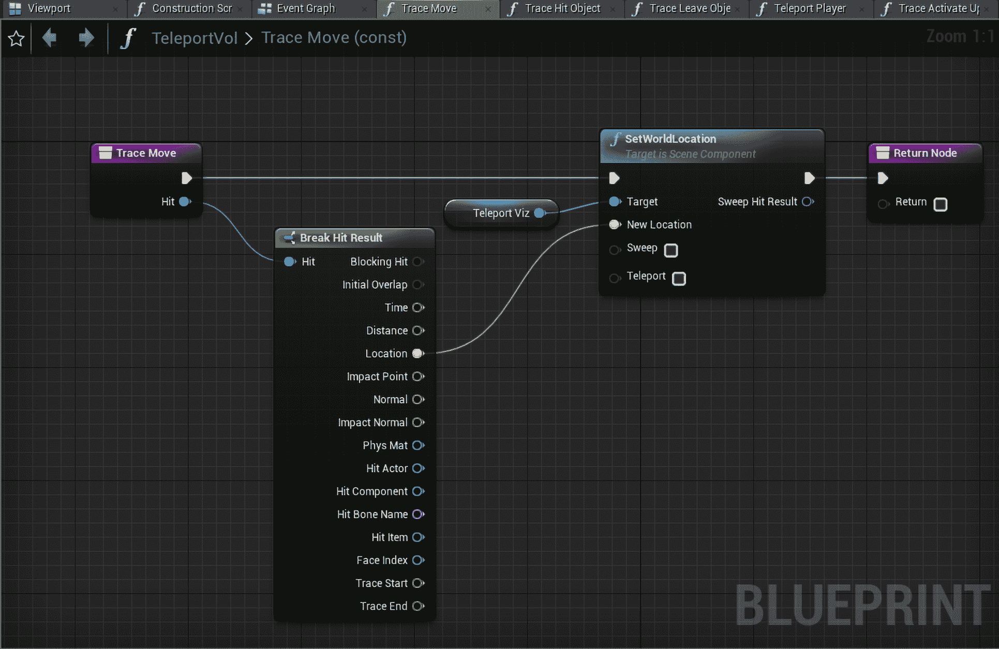

Trace Move 函数

1.  对于 Trace Move，我们需要编写当线迹穿过我们的对象时会发生什么。对于传送体积，我们希望将我们之前创建的视觉元素（发光的环，TeleportViz）移动到线迹击中的任何地方。为此，我们将使用一个 SetWorldLocation 节点。在蓝图上右键单击并搜索 Set World location。从列表中选择 SetWorldLocation (TeleportViz)。将函数节点的执行输出连接到其输入，并将执行输出连接到 Return 节点。

1.  SetWorldLocation 需要一个 New Location 输入来知道将 TeleportViz 移动到何处，我们可以通过将作为函数输入传入的 Hit 结果分解来找到它。创建一个 Break Hit Result 节点并将函数节点上的 Hit 作为输入。我们可以从分解中获取 Location 输出并将其用作 Set World Location 上的 New Location 输入。

1.  接下来，选择 TraceHit 函数。在这个函数中，我们希望打开我们的 TeleportViz 网格的可见性，以便我们的玩家可以看到他们将会出现的位置。在蓝图上右键单击并创建一个 Set Visibility (TeleportViz) 节点。将其连接到函数节点和 Return 节点。在节点上，勾选 New Visibility 复选框和 propagate to children 复选框。

1.  现在，让我们继续到 TraceLeaveObject 函数。这个函数将与 TraceHit 函数执行非常类似的功能，除了我们将把可见性重新设置为关闭。类似于前面的步骤，创建一个 Set Visibility (TeleportViz) 节点并将其连接到函数节点和 Return 节点。在节点本身上，不要勾选 New Visibility 旁边的框，但请点击 Propagate to Children 旁边的复选框：

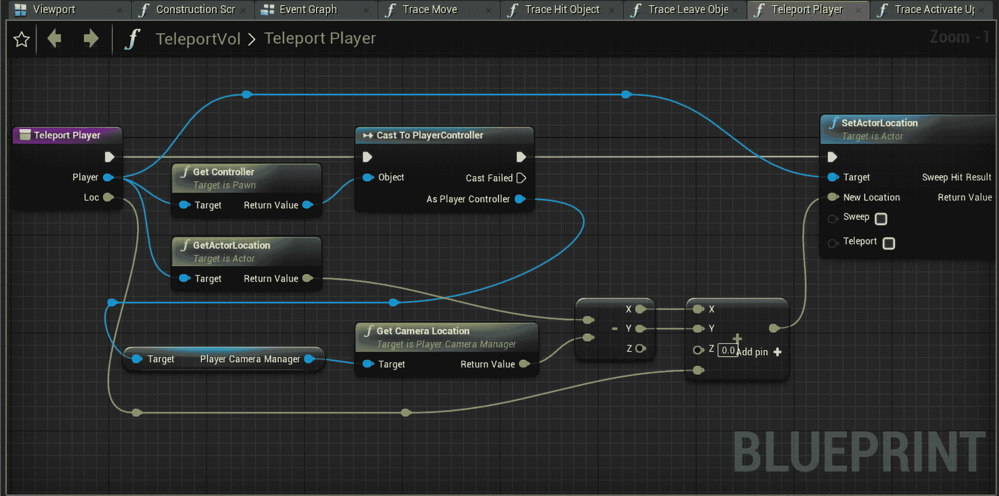

Teleport 函数

1.  在我们继续到 `TraceActivateUp` 之前，我们需要创建一个可以处理传送机制的功能。在 My Blueprint 面板的 Functions 部分中，点击 + 按钮，并将新功能命名为 Teleport Player。Teleport Player 需要一些输入值才能工作。第一个名为 `Player`，类型为 Actor。第二个将命名为 `Loc`，类型为 Vector。

1.  传送本身需要一点数学计算，并且需要从我们的 Player Controller 获取一些信息。让我们通过从函数节点拖动一个执行线并将其放下以打开搜索菜单来开始序列。搜索“Cast to PlayerController”节点并创建它。转换允许我们假装成另一个蓝图，并且只是许多允许我们在蓝图之间通信数据的方法之一。

1.  转换需要一个对象输入，即我们要假装成以访问其数据的特定对象的引用。为了获取我们需要的精确 PlayerController，点击并从函数节点的 Player 输入拖动一条线并将其放下。搜索“Get Controller”节点并将其输出连接到“Cast to PlayerController”节点的输入。

1.  接下来，创建一个“SetActorLocation”节点。这将通过将玩家移动到指定的向量坐标来完成实际传送。将转换的执行输出连接到“SetActorLocation”的执行输入。目标输入应设置为 Player，通过从函数节点的 Player 输入拖动一个连接并将其连接到“SetActorLocation”的目标输入。

1.  现在是计算新位置的时候了！首先，我们需要获取两样东西的位置：玩家和玩家相机。为了获取玩家的位置，从函数节点的 Player 输入拖动一条线并将其放下以打开搜索框。搜索“GetActorLocation”节点并创建一个。我们很快就需要这些数据。

1.  从我们的“Cast to PlayerController”节点的“as Player Controller”输出拖动一条线，并使用它来搜索“Get Player Camera Manager”节点。从该节点的输出拖动并搜索“Get Camera Location”节点。

1.  下面是数学部分：我们需要从玩家的相机位置减去玩家本身的位置，以找到我们传送的真确位置。为此，我们需要一个“Vector - Vector”节点。顶部输入将是“GetActorLocation”节点的向量输出。底部输入将是“GetCameraLocation”节点的向量。

1.  我们几乎完成了！在`Vector - Vector`节点的输出引脚上右键单击并拆分结构引脚。我们只需要计算下一部分所需的 X 和 Y 值。创建一个新的`Vector + Vector`节点，并在顶部输入上拆分结构引脚。将`Vector - Vector`的 X 和 Y 输出值连接到`Vector + Vector`节点的 X 和 Y 输入值。底部向量输入来自函数节点的 Loc 输入。从函数节点的 Loc 输入拖动一个连接并将其连接到`Vector + Vector`的底部向量输入。

不要忘记，您可以使用重定向节点来清理代码，使其有组织且易于阅读。如果您拖动一个连接并将其放下，可以在搜索菜单中找到重定向节点。您还可以通过在想要创建重定向节点的连接上双击来创建它们。

1.  这样，计算就完成了！将`Vector + Vector`节点的输出连接到 SetActorLocation 的 New Location 输入以完成序列：

Trace Activate Up

1.  最后要编程的功能是 Trace Activate Up，或者当玩家释放动作控制器的按钮时会发生什么。点击我们之前打开的选项卡或双击 My Blueprint 面板的函数部分中的函数名称。使用我们新的 Teleport Player 函数，我们将玩家移动到新位置。从函数节点拖取我们的 Teleport Player 函数副本并将其拖入蓝图。将函数节点的激发者输入连接到 Teleport Player 的玩家输入。

1.  计算精确的传送位置只需要一点数学知识。从函数节点的 Hit 输入拖出一条线并将其拖到打开搜索菜单。创建一个 Break Hit Result 节点，并右键单击位置输出以拆分结构。

1.  创建一个获取演员位置节点并将其放置在 Break Hit 节点附近。右键单击矢量输出并将该结构引脚也拆分。

1.  接下来，右键单击 Teleport Player 节点上的 Loc 输入，并（不出所料！）拆分结构引脚。

1.  是时候传递*XYZ*值了！将 Break Hit 的 Location X 和 Location Y 输出连接到 Teleport Player 的 Loc X 和 Loc Y 输入。同时，将 Get Actor Location 节点的 Z 输出连接到 Teleport Player 的 Loc Z 输入。

1.  通过将 Teleport Player 的执行输出连接到函数返回节点来完成序列。

在完成传送体积后，我们现在可以测试我们的传送能力，以及支持它的所有系统（抛物线线追踪和对象交互界面）。在你的测试级别中放下几个 TeleportVol 蓝图，尽情尝试！如果一切正常，我们可以继续构建原型拼图盒。

# 服务器 – 构建拼图盒

现在玩家有了触摸物体和在我们测试级别中传送的能力，现在是时候解决拼图盒了。在*Server 17*中，拼图盒是玩家远程入侵服务器并窃取数据的图形表示。最终版本可能包含多个需要解决的谜题和数十个需要完成的步骤。然而，对于这个第一个原型版本，我们将设计和构建一个简单的三步盒，如下所示：

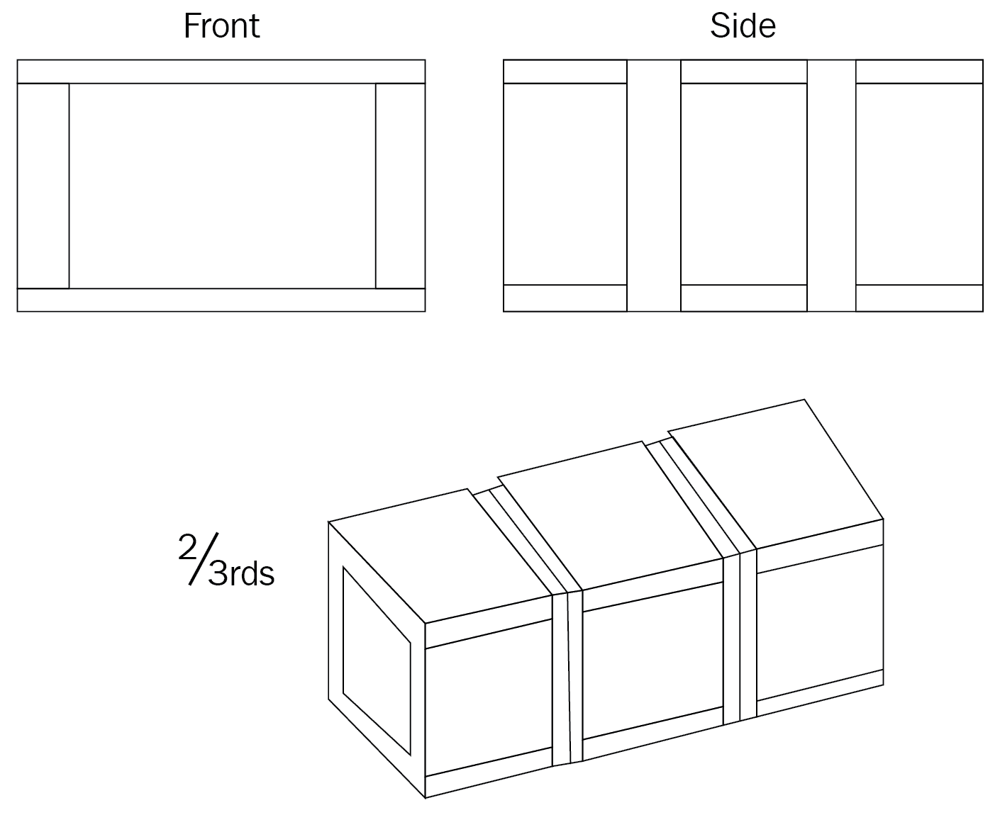

此设计要求玩家找到并移除盒子上的一个面板，以露出一个解锁盒子前部的按钮。然后可以通过抓住它并将其移动到一边来移除该面板，从而露出另一个开关。最后一步是按下开关并找到可移除的面板以窃取数据。

在 Unreal Engine 4 中构建此功能将使我们创建一些东西：

1.  我们需要为我们的界面目前未涵盖的手创建额外的功能，例如抓取、拖动和按下。

1.  我们需要一个能够对玩家的触摸做出反应、可以被抓住、移动和扔出的对象。

1.  我们需要可以触发事件的交互式按钮。

1.  我们需要使用子演员和代码来构建盒子本身，以打开和关闭交互元素。

当完成时，我们将拥有一个令人惊叹的测试平台，可以用来证明*服务器 17*很有趣，并且可以由我们的目标受众进行测试。向前推进的第一步是构建第二个界面来容纳我们的按钮交互：

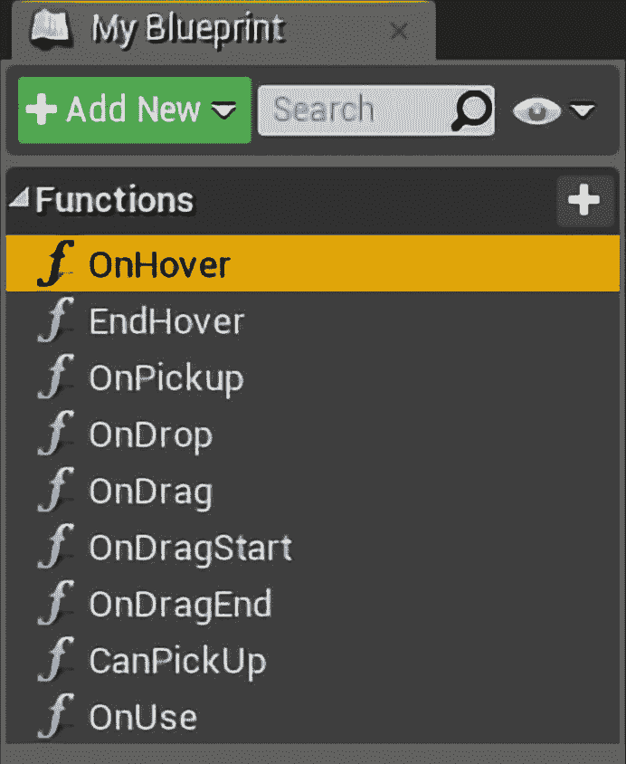

按钮交互界面

是时候创建按钮交互界面了：

1.  前往内容浏览器，导航到我们的`Server17\Blueprints`文件夹。在浏览器中右键单击，并导航到菜单中的创建高级资产部分。突出显示蓝图条目，并选择蓝图界面选项。将新界面命名为`ButtonInteractionInterface`。双击新界面以打开它。

1.  在这个界面中，我们将创建九个不同的函数，代表我们创建的动作的不同状态。第一个是一个确定当我们把手悬停在某个东西上时要做什么的函数。在 My Blueprint 面板的函数部分找到并点击+按钮。将新函数命名为`OnHover`。`OnHover`需要一个名为`Interactor`的输入，类型为 Interaction Component。它还需要一个名为 Return 的布尔类型输出，以便它能够正常工作。

1.  下一个函数将被命名为`EndHover`，它控制当玩家的手离开一个对象时会发生什么。它有与上一个函数相同的输入和输出。

1.  现在，我们将创建`OnPickup`函数来覆盖当我们想要拾取一个对象时会发生什么，这在 VR 中是一个非常常见的交互。它的输入和输出与最后两个函数相同。

1.  接下来是`OnDrop`函数；这个函数将给我们机会在玩家丢弃一个对象时创建额外的函数。它也有与最后几个函数相同的输入和输出。

1.  接下来的三个函数控制对象的拖动，并允许我们通过这些动作创建更多的游戏玩法。创建名为`OnDrag`、`OnDragStart`和`OnDragEnd`的函数。它们的输入和输出与迄今为止我们创建的所有其他函数相同。

1.  最后，这里有一个不同！创建一个新的函数，并将其命名为`CanPickUp`。这个函数控制一个布尔值，用于确定是否允许拾取某个东西。它只有一个输出：名为`PickUp`的布尔值。

1.  这是最后一个。再创建一个函数。这个函数被命名为`OnUse`，允许我们创建可以作为加成使用的对象。`OnUse`的输入和输出与`OnHover`相同。

现在我们有了第二个接口，它允许我们作为设计师有足够的自由，根据我们的想象力来创建交互。为了测试我们新的玩家能力，让我们构建一个基本的立方体，它可以以几种不同的方式进行交互：

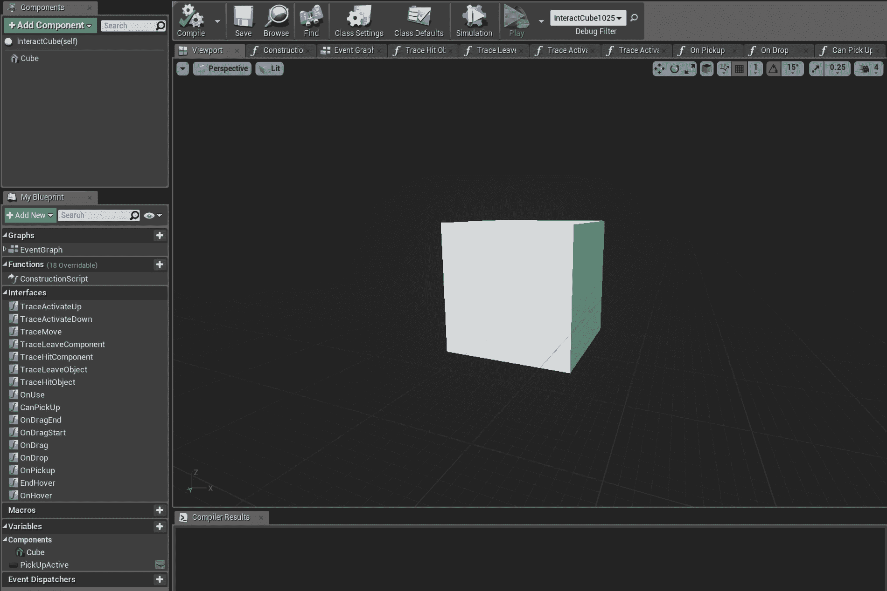

与界面交互的立方体

为了测试我们的系统（并有点乐趣），我们将创建一个立方体，它利用了我们在本章中创建的许多新功能：

1.  确保你处于`Server17\Blueprints`文件夹中，并在内容浏览器中右键单击以创建一个新的蓝图类。在“选择父类”菜单中选择 Actor，并将我们的新蓝图命名为`InteractCube`。

1.  在组件面板中点击“添加组件”按钮，并在菜单的通用部分选择立方体选项。在详细信息面板中，找到顶部附近的缩放值，并将值设置为 X=0.3，Y=0.3，Z=0.3。

1.  是时候添加接口了。在屏幕顶部点击“类默认值”按钮。在详细信息面板中，在接口部分点击“添加”按钮。搜索并添加对象交互接口和按钮交互接口。

1.  现在我们有很多功能可以玩！让我们从检测立方体被线迹击中的方式开始。打开我的蓝图面板的界面部分，并打开`TraceHitObject`函数。在蓝图上右键单击并搜索材料节点上的“设置向量参数值（立方体）”。此节点允许我们访问立方体默认材质上的颜色参数。将其连接到函数节点和返回节点。接下来，将参数名称的值设置为颜色。最后，通过将参数值 X 的值更改为 1.0，让我们将立方体变成红色。现在，当立方体被线迹击中时，它将变成红色！

1.  让我们在线迹离开立方体时将颜色重新设置为白色。在界面菜单中双击`TraceLeaveObject`函数。抓取我们之前使用的相同的“设置向量参数值（立方体）”节点，这次，将参数值的 X 设置为 1.0，Y 设置为 1.0，Z 设置为 1.0。

1.  还在玩得开心吗？让我们从界面菜单中打开`TraceActivateDown`函数。使用相同的前置技术，创建一个“设置向量参数值（立方体）”节点，输入参数名称的“颜色”，并将参数值的 X 设置为 0，Y 设置为 1.0，Z 设置为 0。现在，当我们点击按钮与之交互时，我们的立方体变成了绿色！

1.  如果我们使用`TraceActivateDown`，我们可能还需要使用`TraceActivateUp`。让我们设置它，以便在释放按钮时将颜色重新变回红色。打开函数并创建另一个“设置向量参数值（立方体）”节点。将其连接到函数，将参数名称的值设置为颜色，并将参数值的 X 设置为 1.0，Y 设置为 0，Z 设置为 0。

想要在我们的函数中玩得更开心吗？使用添加冲量节点，其中节点的目标是场景组件，以创建突然向上的加速度。将设置向量参数值节点中的一个替换为添加冲量，并将冲量参数的 Z 值更改为 5000。确保勾选速度变化复选框。这样，当按钮被按下或释放时，立方体将向天空射击！

1.  我们尝试让立方体可以被捡起和扔出去怎么样？为了创建这个机制，我们将让虚幻引擎对我们的立方体进行物理模拟，然后在捡起和放下立方体时切换这个功能的开和关。打开`OnPickup`和`OnDrop`函数。在`OnPickup`中，在蓝图上右键点击并搜索设置物理模拟（立方体）的节点。将执行输入和输出连接到函数节点和返回节点，因为这将是我们在这个函数中使用的唯一节点。这样，当立方体被捡起时，将禁用物理模拟，这样它就不会从玩家的手中掉落或表现出其他奇怪的行为。现在打开`OnDrop`并创建另一个设置物理模拟（立方体）的副本。这次，在节点旁边的“模拟物理”选项旁边勾选复选框。这样，当立方体被放下时，将启用物理模拟，使其按我们的意图行事。最后，回到视口选项卡，点击立方体。检查详细信息面板，确保已启用模拟物理选项。如果未启用，请启用它。

1.  还有一个函数需要设置。回到我的蓝图面板的接口部分，打开`CanPickUp`函数。为了能够开关这个功能，我们需要一个可以切换的布尔值。在变量部分，点击+按钮并创建一个名为`PickUpActive`的新布尔变量。回到`CanPickUp`函数，拖入我们新变量的副本并从菜单中选择获取。将`PickUpActive`的输出连接到返回节点的`PickUp`输入。

要使用这些新功能，我们需要在交互组件中设置调用它们的方法，并将它们映射到`Server17PlayerPawn`中的按钮。这就像我们在本章早期创建对象交互接口时做的那样。回到内容浏览器，打开交互组件：

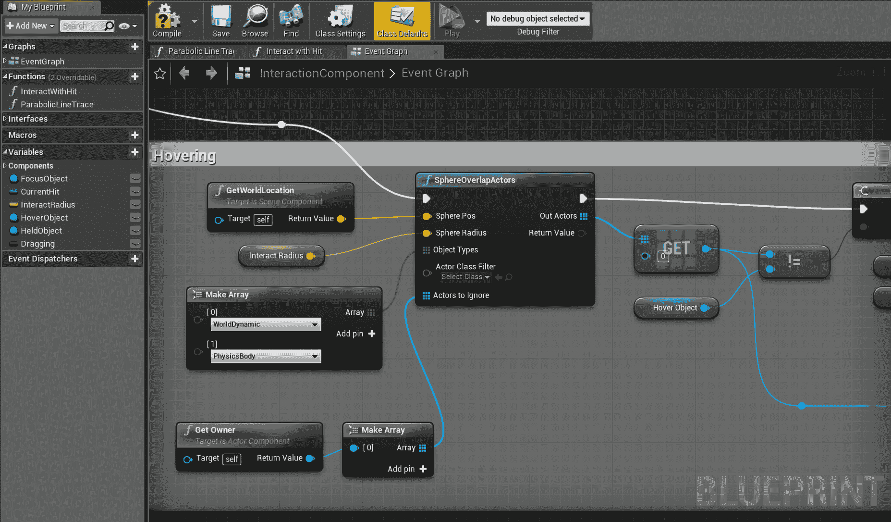

悬停交互组件代码

1.  在交互组件内部，我们需要添加一些新的玩家功能，但当前的代码不允许这种扩展。为了改变这一点，我们将使用一个序列节点。序列节点是一个流程控制节点，它按照每个输出引脚连接的代码顺序执行。为了实现我们的新功能，我们希望在门之后添加序列节点。在蓝图上右键单击并搜索序列节点。一旦创建，点击节点左下角的“添加引脚”按钮。这将添加一个额外的执行输出。将序列直接连接在门之后，并将抛物线线迹节点连接到标记为 Then 0 的执行输出。

1.  在开始实现悬停、拖拽和拾取功能之前，我们还需要一些额外的变量。在“我的蓝图”面板的变量部分点击“+”按钮并创建一个名为`InteractRadius`的新浮点变量。编译蓝图并为其设置默认值 10。接下来，创建两个类型为 Actor 的变量，一个命名为`HoverObject`，另一个命名为`HeldObject`。最后，创建一个布尔变量并命名为`Dragging`。

1.  让我们先实现悬停和拖拽行为。从我们新序列节点的 Then 1 输出拖动一条执行线并将其放置在蓝图的一个空白区域。我们要找的节点叫做 SphereOverlapActors，它被设计用来返回它在特定半径内检测到的对象。

1.  SphereOverlapActors 需要四个不同的输入值。第一个是“球体位置”（或 Pos）。我们希望球体从交互组件所在的位置进行检测。从 Sphere Pos 输入拖动一条线并放下。搜索“获取位置”节点。这将给我们一个输入，表示交互组件在世界空间中的位置。

1.  对于下一个输入，获取我们的 InteractRadius 变量的副本并从菜单中选择“获取”。这将为我们交互提供一个 10 厘米的检测半径，并通过变量轻松调整该半径。

1.  现在，我们想要过滤玩家可以与之交互的对象。从对象类型输入拖动一条线并搜索“创建数组”节点。在节点上点击“添加引脚”按钮并使用两个下拉菜单选择“世界动态”和“物理体”选项。

1.  最后，我们希望玩家忽略任何被归类为自身的对象，这样就不会出现一个动作控制器与另一个动作控制器交互的情况，例如。在蓝图上右键单击并使用搜索框查找“获取所有者”节点。这将返回一个指向玩家的 Actor 引用。由于 SphereOverlapActors 只接受一个数组作为忽略 Actors 的输入，我们需要将“获取所有者”的输出插入到一个数组中。从“获取所有者”的返回值拖动一条线并放下。找到“创建数组”节点并将结果数组连接到 SphereOverlapActors 的最终输入。

1.  SphereOverlapActors 现在将返回一个符合我们标准的对象数组。使用输出，我们需要快速检查我们存储在变量中的 HoverObject 是否与我们刚刚获取的对象相同。如果它们相同，就没有继续的理由；这将节省我们一些性能。从 Out Actors 输出拖出，并搜索 Get 节点。这将检索索引 0（数组应只包含一个对象）区域的项目。接下来，获取我们的 HoverObject 变量的引用。最后，为了比较它们，从 HoverObject 变量拖出并搜索 NotEqual 节点。一个输入应该是我们的 HoverObject，另一个应该是我们的 Get 节点的输出：

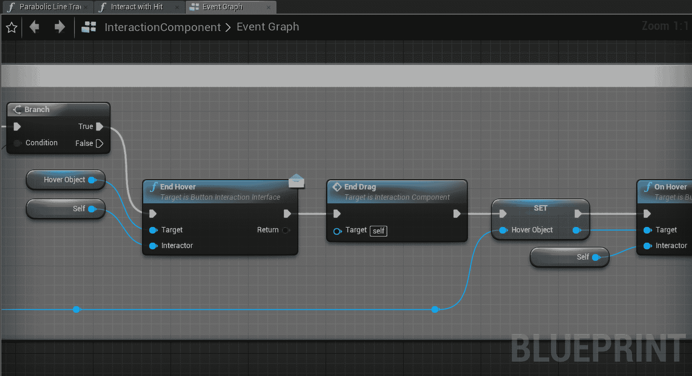

Hover 代码的第二部分

1.  NotEqual 将返回一个布尔值，因此我们需要一个分支来继续。将分支连接到来自 SphereOverlapActors 节点的执行输出。条件将是 NotEqual 节点的结果，并且只有当它是 `True` 时我们才会继续前进。

1.  如果我们的比较结果是 True，并且两个对象不相同，我们需要在当前对象上结束悬停行为，并设置悬停或拖动行为以与新对象一起工作。从分支的 True 输出拖出，并搜索我们的 Button Interaction Interface 中的 EndHover 函数。获取 HoverObject 变量的副本并将其插入到目标输入中，并使用 Self 引用作为交互者输入。

1.  接下来，创建 EndDrag 函数的副本并将其连接到 EndHover 节点的执行输出。

1.  现在，我们需要更新 HoverObject 变量，以包含我们正在悬停的新对象。拖入 HoverObject 的副本并从菜单中选择设置。输入将是之前 Get 节点的输出。

1.  最后，我们将调用 `OnHover` 函数来完成序列。创建 `OnHover` 函数的副本并将其连接到 set HoverObject 的执行输出。set HoverObject 的变量输出可以用作目标。使用 Self 引用作为交互者输入。

我们悬停的代码使我们能够检测玩家可能伸手去拿或手放在其上的对象，例如按钮或其他组件。接下来，我们将处理拖动：

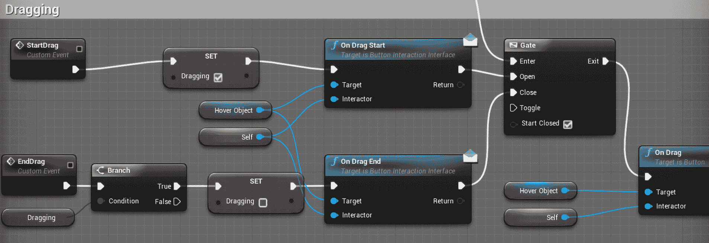

拖动代码

对于拖动，我们需要创建两个可以从蓝图外部调用的自定义事件。这正是我们之前用来实现 ActivateUp 和 ActivateDown 行为的技术：

1.  首先，我们将创建两个自定义事件。在蓝图上右键单击并选择添加自定义事件选项。将第一个命名为 `StartDrag`，第二个命名为 `EndDrag`。

1.  对于我们这两个新事件，我们基本上想要在调用 OnDragStart 和 OnDragEnd 函数的同时打开和关闭 Dragging 布尔值。让我们从 StartDrag 开始。获取我们的 Dragging 变量的副本，并从菜单中选择 Set。将事件的执行输出连接到 set Dragging，并点击节点上的复选框将其设置为 True。

1.  现在我们将调用 OnDragStart 函数。从 My Blueprint 的接口部分拖动 OnDragStart 的副本到蓝图，并连接一个从 set Dragging 的执行线。将我们的 HoverObject 变量的副本作为目标，并使用 Self 作为交互者。

1.  接下来，我们可以使用我们的 EndDrag 自定义事件。第一步是检查我们的 Dragging 布尔值是否为 True；如果是，那么我们可以结束当前的拖动。创建一个新的 Branch 节点，并将我们事件中的执行输出连接到它。获取一个 Dragging 的副本，并将其连接到 Branch 上的条件输入。

1.  如果 Dragging 为 True，我们需要更新变量并结束拖动。创建 Dragging 的另一个副本，这次从菜单中选择 Set 并将其连接到 True 的分支输出。确保 Dragging 的复选框是空的。

1.  是时候创建 OnDragEnd 函数的副本了。将 set Dragging 的执行输出连接到我们新节点的执行输入。就像我们之前为 OnDragStart 所做的那样，将 HoverObject 作为目标，并使用 Self 作为交互者。

1.  是时候将这两个序列组合在一起了。我们将使用一个 Gate 来控制是否可以使用自定义事件拖动某个东西。创建一个新的 Gate 节点，将 OnDragStart 的输出连接到打开输入，并将 OnDragEnd 的输出连接到关闭输入。我们将连接早期 Sequence 节点的 Then 2 输入到进入输入。

1.  完成拖动的最后一步是调用 OnDrag 函数。创建一个副本并将其连接到我们在上一步创建的 Gate 节点的退出输出。就像我们之前为拖动函数所做的那样，我们将 HoverObject 变量的副本连接到目标输入，并将 Self 作为交互者插入。

我们现在可以拖动物体了！这种行为可能在编程杠杆和其他可以移动但不必定能捡起的类似部件时很有用。说到捡起，我们将要解决的下个特性是捡起物品并扔掉的能力。与悬停或拖动类似，捡起和放下行为背后有一个类似的技巧。大多数物体，但并非全部，都会启用它们的模拟物理选项。这个技巧是这样的：当物体在 VR 中被捡起时，我们将物体附加到玩家的手上，这样它就不会从他们手中逃走。我们还将禁用物体的物理（我们在 InteractCube 的 OnPickup 函数中之前已经设置过）。当我们放下物体时，我们将它从玩家那里分离出来并重新启用物理。由于玩家从未看到任何变化，所以对他们来说，就像他们只是捡起物体然后放下一样。酷吧？

让我们开始构建：

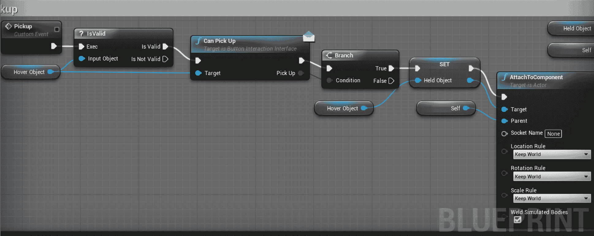

捡起代码

正如我们对拖动行为所做的那样，我们首先创建两个自定义事件：一个用于捡起，另一个用于放下：

1.  在我们的蓝图上右键单击，并使用添加自定义事件选项创建两个新的自定义事件。将第一个命名为“捡起”，第二个命名为“放下”。

1.  我们首先构建捡起行为。我们需要首先检查玩家悬停的物体是否是有效的物体。在蓝图上右键单击并搜索 IsValid 节点。我们需要的是图标上带有问号的版本。将其连接到我们的捡起事件，并创建 HoverObject 变量的副本，它将作为节点上输入对象引脚的输入。

1.  既然我们知道物体是否真实（从某种意义上说），我们可以检查我们是否可以捡起它！创建 CanPickUp 函数的副本，并将 HoverObject 作为目标连接。这将返回 True 或 False，这将决定玩家是否可以捡起该物体。

1.  接下来，我们需要一个分支来处理从 CanPickUp 传来的布尔值。我们只希望当这个值为 True 时，玩家才能捡起物品。创建一个新的分支节点，并将其连接到 CanPickUp 的执行输出。条件输入将是来自 CanPickUp 的 PickUp 输出。

1.  我们现在知道物体是否真实。我们也知道我们是否允许捡起它。现在是时候进行重头戏了。创建 HeldObject 变量的副本，并从菜单中选择设置。设置 HeldObject 的输入将是 HoverObject 的当前值。

1.  接下来，创建一个 AttachToComponent 节点的副本，确保我们使用的是 Target 是 Actor 版本。将其连接到 set HeldObject 的输出。也将 set HeldObject 的变量输出传递到 AttachToComponent 的 Target 输入。现在创建一个 Self 引用并将其插入到 Parent 输入。最后，在节点中设置 Location Rule、Rotation Rule 和 Scale Rule 设置为 Keep World 选项。这将保持我们拾取的物体的基本属性，以便当我们放下它时，一切都将保持不变。

1.  下一步是调用我们的 OnPickup 函数来触发我们可能想要为该对象执行的特殊行为。创建 OnPickup 的一个副本，并将 AttachToComponent 的输出连接到它。将 HeldObject 变量的一个副本连接到 Target 输入，并使用 Self 引用作为 Interactor。

1.  现在我们有了拾取和放下物品的能力，我们可能想让玩家能够使用他们悬停的物品。为了创建这种行为，我们需要创建一个名为 UseHovered 的自定义事件。接下来，创建我们的 `OnUse` 函数的副本并将其连接到我们的自定义事件。获取我们的 HoverObject 变量的一个副本作为 Target。完成节点时，使用 Self 引用作为 Interactor：

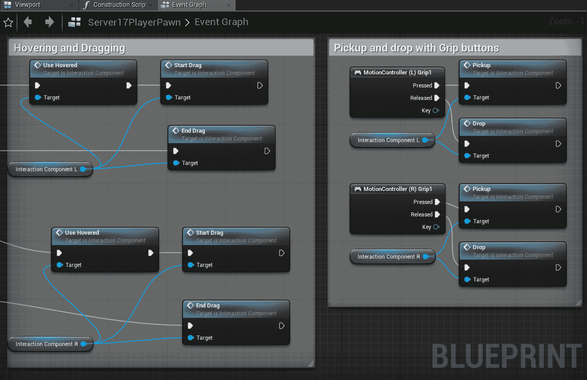

玩家 pawn 中的拾取/放下和悬停/拖拽代码

1.  为了能够利用我们新的行为（悬停、拖拽、拾取和放下），我们需要将它们映射到玩家的运动控制器上的按钮。让我们将悬停和拖拽添加到触发器上。打开 `Server17PlayerPawn` 并找到我们映射 ActivateUp 和 ActivateDown 到运动控制器触发器的位置。我们将从左侧触发器开始。从 ActivateDown 扩展一条执行线并将其拖动到搜索我们的 UseHovered 函数（引用左侧交互组件）。接下来，从 InteractionComponent_L 的引用拖动出来并搜索 StartDrag 函数。将其连接到 UseHovered 函数的执行输出。最后，再次从 InteractionComponent_L 的引用拖动出来并搜索 EndDrag。我们将将其连接到 ActivateUp 的执行输出。现在我们可以使用悬停的物体，以及开始和结束拖拽序列！

1.  为右侧运动控制器重复相同的步骤。

1.  最后，是时候映射拾取和放下行为。许多游戏将这种行为映射到握把按钮，因为玩家似乎自然地倾向于使用这些按钮进行交互。在蓝图上右键单击并搜索 MotionController L Grip1 事件。从 Pressed 输出拖动一条执行线并搜索我们的 Pickup 函数（引用左交互组件）。现在从 InteractionComponent_L 的引用拖动出来并搜索 Drop 函数。将这个新函数连接到事件的 Released 输出。像之前一样，也为右侧运动控制器重复此过程。

完成！为了测试行为，让我们在我们的关卡中放置几个这些神奇的立方体并测试它们的功能。拿起它们，扔出去，观察它们改变颜色。很酷，对吧？想想你现在在这个立方体中拥有的游戏玩法可能性。这给你带来了灵感，不是吗？在我们开始实现这些想法之前，为什么不给我们工具箱中再添加一个按钮，让玩家可以按下它：

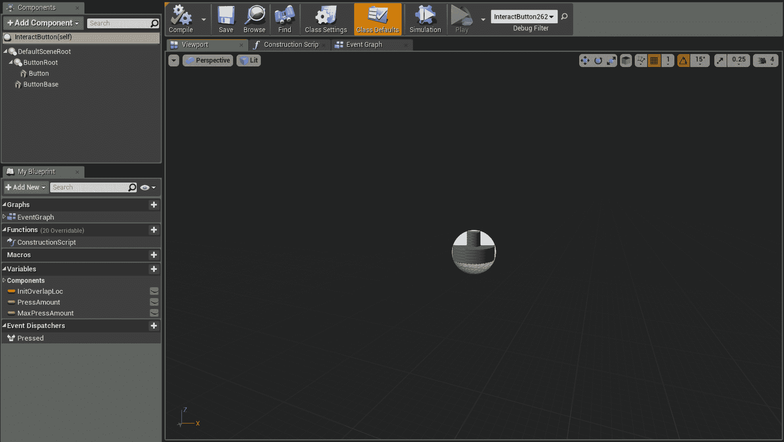

按钮按下代码

我们可以在视口（Viewport）中开始构建我们的按钮：

1.  我们按钮将由三个不同的组件构建。在视口选项卡中，点击添加组件按钮并创建一个新的场景组件。将其命名为 `ButtonRoot`。接下来，创建一个圆柱体组件并命名为 `Button`。我们需要将圆柱体缩小一点，所以将缩放属性的 X、Y 和 Z 值更改为 0.05。同时，将其碰撞预设更改为 OverlapAllDynamic。确保按钮是 ButtonRoot 的子组件。最后，创建另一个名为 `ButtonBase` 的圆柱体组件，并确保它是默认场景根的子组件。我们在这里也需要更改缩放属性。将缩放值更改为 X=0.15, Y=0.15, 和 Z=0.05。最后，将其碰撞预设设置为 NoCollision。

1.  现在视觉组件已经创建，我们可以继续到蓝图。我们想要创建一个按钮，当玩家将手悬停在它上面时，它会稍微动画化，为此，我们需要一些变量。第一个我们将创建的变量名为 `InitOverlapLoc`，类型为 Vector。这将存储玩家手开始重叠的位置。第二个是 `MaxPressAmount`，类型为 Float。这将是一个可调整的变量，这样我们就可以微调玩家需要按下按钮多少次才能触发它。编译蓝图并将此变量的默认值设置为 4。第三个我们需要变量名为 `PressAmount`，类型为 Float。这将存储玩家按下的按钮量。最后，我们需要存储重叠按钮的组件名称。创建另一个变量并命名为 `OverlapComponent`。确保其类型为 Primitive Component。

1.  我们将开始我们的第一个代码序列，包含两个事件。点击我们之前创建的按钮组件，并转到详细信息面板。在菜单的事件部分列表的底部附近，有一组按钮，允许你创建几乎与我们的按钮兼容的每个事件。我们需要创建两个： OnComponentBeginOverlap 和 OnComponentEndOverlap。这将检测当玩家的手按下按钮时的情况。

1.  在 ComponentBeginOverlap 事件开始似乎是个好地方，因为这个事件是启动一切的事件。第一步是检查重叠按钮的组件是否有效。创建一个 IsValid 节点的副本（记得那个带问号的？）。将其连接到事件并获取我们的 OverlapComponent 变量的副本以插入到输入对象引脚。

1.  如果我们的 OverlapComponent 无效（意味着变量为空），我们需要将按钮重叠的任何内容存储为我们 OverlapComponent 的新值。获取另一个 OverlapComponent 的副本，但这次，从菜单中选择设置。新节点的输入将是事件节点中的 Other Comp 输入。

1.  当 OverlapComponent 设置后，我们还需要在 InitOverlapLoc 变量中设置其位置。在蓝图上右键单击并复制一个 GetWorldLocation 节点，其中节点的目标是 Scene Component。将执行输入连接到设置 OverlapComponent 的执行输出。让 GetWorldLocation 的变量输入通过设置 OverlapComponent 的变量输出。

1.  现在我们需要将新位置存储在 InitOverlapLoc 中。创建一个新的节点 InitOverlapLoc。这个新节点的变量输入将是 GetWorldLocation 的输出。别忘了连接执行连接！

1.  是时候处理 OnComponentEndOverlap 事件了。当我们结束重叠时，我们只想检查从重叠中移除的对象是否与我们在 OverlapComponent 变量中存储的对象相同，以及我们是否想要清除该变量。通过创建一个分支并将其连接到事件的执行输出来启动序列。为了比较我们的对象，创建一个 Equals (object) 节点的副本。顶部的输入将是事件中的 OtherComp 输出。底部将是我们的 OverlapComponent 变量的副本。最后，将 Equals 节点的布尔输出连接到分支上的条件输入。

1.  在这个序列的最后一步，创建一个 OverlapComponent 的副本并从菜单中选择设置。将其连接到分支的 True 执行输出。我们将留其变量输入为空，这样我们就可以清除其值。

1.  我们代码的下一步是构建将控制简短动画的节点。我们从 Event Tick 节点开始。接下来，右键单击并创建一个 Sequence 节点，因为这将是一个两步过程。将 Sequence 连接到 Even Tick 的执行输出：

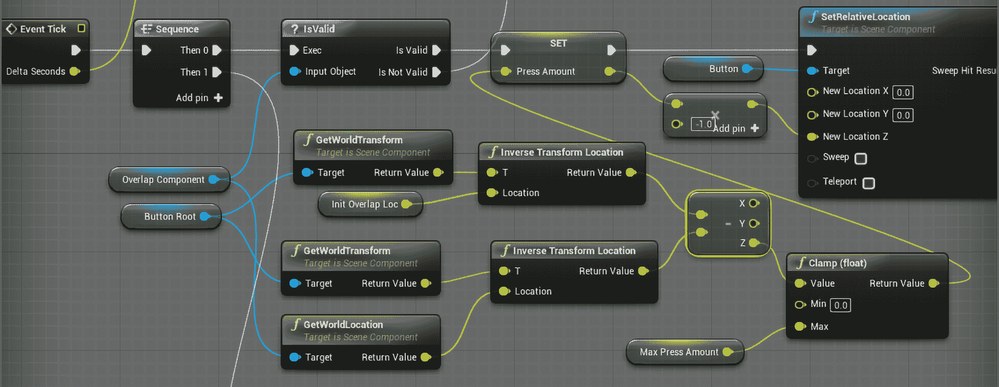

按钮下代码

1.  从 Then 0 输出拖动连接，并将其放下，并使用搜索框找到 IsValid 节点（记得使用菜单中标记为 ? 的那个）。我们将检查这次输入对象是否是 OverlapComponent 的副本。我们将使用这个设置来确定玩家是否仍然与按钮重叠。如果是，我们将动画按钮向下移动。如果不是，我们将动画按钮，使其返回到原始位置。

1.  接下来，拖入我们的 PressAmount 变量的一个副本，并从菜单中选择 Set 选项。将其连接到 IsValid 输出。我们现在将其变量输入留空。

1.  为了进行实际的动画，我们需要创建一个 SetRelativeLocation 节点的副本。将其执行输入连接到设置 PressAmount 的执行输出，并使用按钮组件的引用作为目标。

1.  当代码的基本设置完成动画后，是时候做一些快速的计算了。按下按钮是一个基本的动作，当玩家重叠时，涉及按钮组件在*Z*轴上上下移动。为了确定按钮需要移动多远，我们将重叠的演员移动的距离从该演员的初始位置中减去。我们将比较这个距离与我们的 MaxPressAmount，以确定按钮是否真正被按下。所有这些计算都将相对于按钮的位置进行，以确保它在您选择的任何情况下都能正常工作。我们将从将存储的 InitOverlapLoc 值转换为与按钮相关联开始。从组件面板获取 ButtonBase 的引用，从它那里拖动一个连接，并将其拖到打开搜索菜单。创建 GetWorldTransform 的副本。

1.  从 GetWorldTransform 的返回值拖动一条线，放下连接，并搜索 InverseTransformLocation 节点。此节点旨在接收一个位置，并根据我们提供的转换将其从世界空间转换为本地空间。在这种情况下，我们将初始重叠位置转换为相对于 ButtonBase 的相对位置。获取我们的 InitOverlapLoc 变量的一个副本，并将其连接到 Location 输入。

1.  现在创建一个`Vector - Vector`节点，并将 InverseTransformLocation 的返回值插入到顶部输入。我们将在以下步骤中计算第二个值。

1.  从 ButtonBase 的引用拖动另一个连接，并创建 GetWorldTransform 和 InverseTransformLocation 的另一个副本。

1.  这次，我们需要获取存储在 OverlapComponent 中的组件的位置。获取 OverlapComponent 变量的一个副本，并从它那里拖动一个连接。放下它，搜索 GetWorldLocation。此节点的返回值将是我们在*步骤 17*中创建的 InverseTransformLocation 副本的 Location 输入。现在，InverseTransformLocation 的返回值可以连接到我们的`Vector - Vector`的较低输入。

1.  由于按钮只在*Z*轴上移动，我们只对减法节点的*Z*输出感兴趣。在`Vector - Vector`的输出上右键单击，并拆分结构引脚。

1.  为了确保*Z*值不会超出我们需要的范围，我们将使用一个 Clamp 节点来限制它。Clamp 节点接收一个值并告诉它它只能介于一定的最小值和最大值之间。在这种情况下，我们将引入*Z*值，并确保它不会低于零或高于我们的 MaxPressAmount。右键单击并创建一个 Clamp (float)节点。使用我们的`Vector - Vector`的*Z*输出作为 Value 输入，并使用我们的 MaxPressAmount 变量的副本作为 Max。我们应该将最小值留在 0。

1.  我们几乎完成了！我们的钳位浮点值现在可以成为我们之前创建的 set PressAmount 节点的输入。将 Clamp 的输出连接到 set PressAmount 输入。

1.  由于按钮总是会向下移动以显示它被按下，因此我们需要传递给 SetRelativeLocation 节点的值应该是负数。从 set PressAmount 的变量输出拖出，并创建一个`Float * Float`节点。将第二个值设置为-1.0。

1.  为了完成动画，右键单击 SetRelativeLocation 的 New Location 输入并拆分结构。将`Float * Float`的输出连接到 New Location Z 输入：

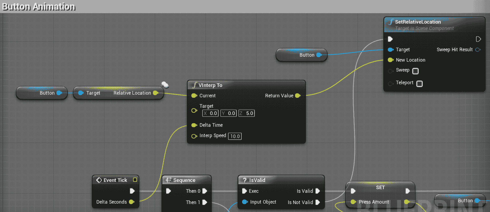

返回按钮起始位置的代码

1.  一旦重叠完成，我们需要将按钮移回其原始位置。回到我们之前在*步骤 11*中创建的 IsValid，将 IsNotValid 输出的连接拖动，放下，并搜索节点 SetRelativeLocation 的副本。将我们的 Button 组件作为目标设置引用。

1.  在蓝图上右键单击并搜索 VinterpTo。这将帮助按钮实现平滑的动画回到未按下状态。为了填充 Current 输入，获取按钮组件的引用并将其拖出连接。放下并搜索 GetRelativeLocation 节点。将此节点的输出连接到 Current 输入。

1.  要填充 Delta Time 输入，将 Event Tick 节点中的 Delta Time 值连接过来。

1.  最后，将 VinterpTo 的 Return Value 连接到 SetRelativeLocation 的 New Location 输入。

完成按钮的最后一步是处理按钮被按下时发生的情况。为此，我们将使用事件分发器。通过使用事件分发器，我们可以根据需要将不同的命令绑定到按钮上，从而为我们提供一个灵活且可重用的系统：

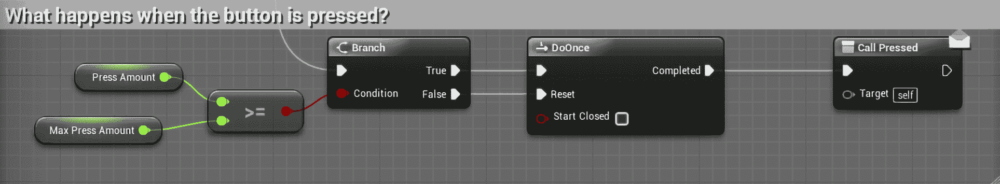

按钮被按下时会发生什么？

要继续，从 Sequence 节点的 Then 1 输出拖出，并创建一个新的 Branch：

1.  现在是时候比较我们按下的按钮数量与最大按下数量的差异了。右键单击并创建一个`Float >= Float`节点。获取 PressAmount 的副本并将其连接到顶部输入。获取 MaxPressAmount 的副本并将其连接到底部输入。最后，将节点的输出连接到分支的 Condition 输入。

1.  现在创建一个 DoOnce 节点。此节点停止再次发生某些事情，直到它被重置。我们将从分支的 True 输出连接到执行输入，并将 False 输出连接到重置输入。

1.  最后，创建一个事件分发器。在 My Blueprint 面板的事件分发器部分找到并点击+按钮。将新分发器命名为 Pressed。回到蓝图，从 DoOnce 的 Completed 输出拖动并搜索 Call Pressed 节点。

1.  实现按钮按下行为的最后一步是在交互组件中添加一些代码。

我们现在有一个可以供玩家在 VR 中猛按的工作按钮。为了测试功能，将按钮的副本放入可以按下并打开关卡蓝图的关卡中。我们将从蓝图默认应该存在的 Event BeginPlay 节点开始构建。如果它不在那里，请继续添加一个。

在蓝图上右键单击，创建一个指向级别中 InteractButton 的引用。从输出拖动并搜索 AssignPressed 节点，将事件的执行输出连接到其输入。这将允许您为 Pressed 分配一个自定义事件。它可以是你想要的任何东西！我在上一个屏幕截图中创建了一个简单的方法来结束关卡。

哇！我们已经从起点走了很长的路。现在玩家有了手。他们可以使用它们来与周围的世界互动。他们可以触摸、拿起、扔、按按钮，以及我们可以想到的任何其他事情。他们还可以在关卡中传送以探索我们决定创建的内容——所有这些都有控制措施，以便他们只能做我们作为设计师允许他们做的事情。是时候将这种力量用于良好的用途了。

记得我们在本节开头设计的拼图盒吗？我们现在拥有了实现这一目标所需的所有部件。由于这是一个原型，我们将使用静态网格组件和另一种称为子演员的组件来构建盒子。子演员是类蓝图的副本，允许我们在类蓝图中使用其他演员构建对象，这意味着我们可以使用 Box 组件、InteractCube 的副本和几个 InteractButton 的副本来拼凑我们的简单拼图盒：

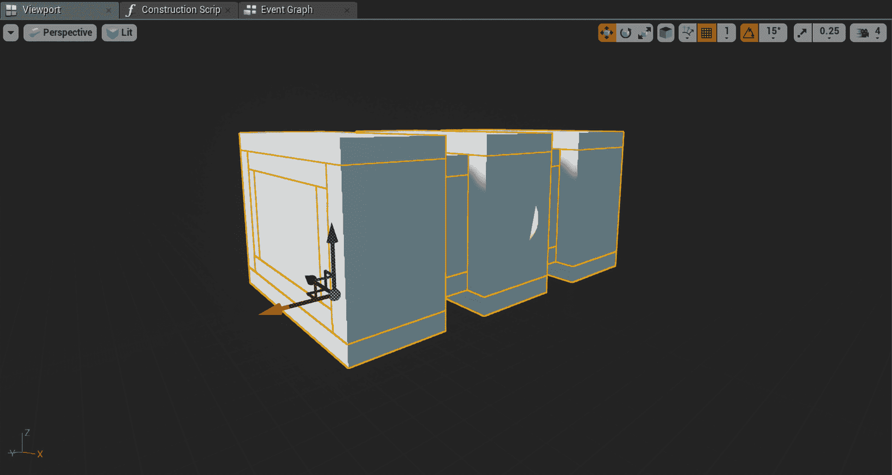

构建 PuzzleCubeTest

首先创建一个新的类蓝图：

1.  在内容浏览器中的`Server17\Blueprint`文件夹上右键单击，并基于 Actor 创建一个新的类蓝图。将这个新蓝图命名为 PuzzleCubeTest，因为这个拼图方块代表我们的第一个原型。双击它以打开它。

1.  让我们创建视觉组件。最好的开始方式是从非交互式组件开始。在 My Blueprints 的组件部分，点击添加组件按钮，并创建一个新的 Box 组件。将缩放属性更改为 X=1.0，Y=2.0，Z=0.1。将此组件命名为`Bottom`。

1.  创建另一个盒子组件，并将其命名为`RightSide`。将缩放属性更改为 X=0.5，Y=2.0，Z=0.1，并围绕*Y*轴旋转 90 度。将其沿底部组件的右侧对齐。

1.  选择右侧组件并按*Ctrl* *+ W*。这将创建一个副本，您可以将其与底部组件的左侧对齐。将这个新部件命名为`LeftSide`。将其 Y 缩放属性更改为 1.5。这个空间将允许在后面隐藏一个隔间。

1.  点击底部组件并按*Ctrl+W*创建一个副本。将这个新组件命名为 Top。将此组件沿正*Z*方向向上移动 60 厘米。

1.  箱子正在慢慢组装起来，但现在我们需要一块背板来完成外壳。创建一个新的盒子组件，并将缩放属性更改为 X=0.9，Y=0.5，Z=0.1。将其命名为 BackPlate。最后，围绕*X*轴旋转 90 度。

1.  现在我们将创建非交互式的底部和顶部支撑。创建一个新的盒子组件，并将其命名为 BottomSupport_1。将缩放属性设置为 X=0.5，Y=1.25，Z=0.1。将其移到 Bottom Component 下方，并与前部和侧面边缘对齐。

1.  选择`BottomSupport_1`，按*Ctrl + W*并命名这个新组件为`BottomSupport_2`。围绕*Z*轴旋转 90 度，并将其移回箱子底部的中心。这样做的一个简单方法是将其位置属性的*Y*值设置为 0。

1.  创建 BottomSupport_1 的另一个副本，并将其命名为 BottomSupport_3。围绕*Z*轴旋转 90 度，并将此组件与底部组件的后边缘对齐。

1.  通过单击第一个并按住*Ctrl*同时选择其他两个，在组件列表中选择所有 BottomSupport 组件。如有必要，旋转组件 90 度，使它们恢复到正确的方向。然后沿*Z*轴向上移动 80 厘米，使它们的底部边缘与 Top 组件的顶部边缘对齐。将它们命名为`TopSupport_1`，`TopSupport_2`和`TopSupport_3`。

1.  为了给箱子内的一个按钮提供一个放置的表面，我们将创建一个额外的非交互式组件。点击 BackPlate 组件，并使用*Ctrl + W*创建一个副本。将这个新组件命名为`MiddlePlate`，并使其位置属性的 X=0，Y=60，Z=30。

1.  为了在我们的拼图盒中创建交互式表面，我们将利用子演员组件，这些组件将是 InteractCube 对象的副本。这将使我们能够使用我们编程到 InteractCube 中的所有功能，并将它们作为拼图盒的组件使用，而无需在新的组件中重新编程它们（尽管我们可能在未来想要这样做）。创建一个新的子演员组件，并将其命名为`SideDecoy_R1`。在详细信息面板中，将子演员类属性设置为 InteractCube。将缩放值设置为 X=0.5，Y=0.13，Z=0.7，并围绕*Z*轴旋转 90 度。将此组件移动到右侧顶部和底部支撑之间的位置，与 RightSide 组件的前边缘对齐。

1.  使用*Ctrl + W*复制`SideDecoy_R1`，并将新子演员命名为`SideDecoy_R2`。将其移动到右侧顶部和底部支撑的后方，与 Right 组件的后边缘对齐。

1.  现在，对于左侧，使用*Ctrl + W*复制`SideDecoy_R1`，并将新子演员命名为`SideDecoy_L1`。将其移动到盒子左侧的顶部和底部支撑之间，并与 LeftSide 组件的前边缘对齐。

1.  复制`SideDecoy_L1`并将其移动到顶部和底部支撑的中心位置。

1.  诱饵组件是为了在玩家寻找要按下的按钮以解锁拼图盒时分散他们的注意力。当它们全部就位后，我们现在可以添加我们的交互式按钮组件。在拼图盒的右侧，创建一个新的子演员组件，并将子演员类属性设置为 InteractButton。将这个新组件命名为`Child Actor Button_Step1`。最后，将其移动到中间顶部和底部支撑之间的中心位置，并通过围绕*Y*轴旋转-90 度与 RightSide 组件的表面对齐。玩家需要在揭开并找到这个按钮之前才能打开盒子的前面。

1.  使用*Ctrl + W*复制 Button_Step1，并将新组件命名为 Button_Step2。将按钮的旋转属性设置为 X=0，Y=90，Z=90。将此按钮与 MiddlePlate 组件的中心对齐。此按钮位于覆盖拼图盒前部的板上，只有按下 Button_Step1 后才能将其移除。

1.  现在，让我们遮盖那些按钮！复制`SideDecoy_R1`并将其命名为`ButtonCover_Step1`。将这个新对象移动到覆盖 Button_Step1，通过在右侧顶部和底部支撑之间的中心位置对其进行对齐。

1.  为了覆盖前面，我们需要一个新的大小的 Child Actor 来适应那个隔间。创建一个新的 Child Actor，将 Child Actor 类属性设置为 InteractCube，并将其命名为 `ButtonCover_Step2`。将缩放属性的值设置为 X=0.8, Y=0.5, 和 Z=0.1。围绕 *X* 轴旋转 90 度。最后，将其对齐以覆盖 Button_Step2 并使其与拼图盒的前面齐平。这将在玩家按下第一个按钮后解锁。

1.  还有一个盖子。这个盖子将覆盖我们后面的隔间。点击 SideDecoy_L2 并使用 *Ctrl + W* 创建它的副本。将新副本命名为 `CompartmentCover_Step3`。将其对齐在后面顶部和底部支撑之间以覆盖隔间。这个盖子将在玩家按下第二个按钮时解锁。

1.  如果拼图盒的结尾没有奖品，那还有什么意义？创建另一个 Child Actor 组件并将 Child Actor 类属性设置为 InteractCube。将其命名为 StolenData。这代表玩家追求的奖品。将缩放属性的值设置为 X=0.1, Y=0.1, 和 Z=0.1。将其放置在 CompartmentCover_Step3 覆盖的后部隔间内。

1.  最后还有一个细节。为了让 InteractCube 作为我们稍后创建的更详细组件的替代品，我们需要打开 InteractCube 蓝图并关闭 Simulate Physics 选项。这将使得立方体不会默认启用物理，因此拼图立方体不会散开。一旦玩家与立方体交互，物理仍然会被启用。

根据我们的设计，原型拼图盒的代码需要能够完成以下几件事情：

+   在开始时禁用拾取按钮盖的能力

+   将正确的按钮按下事件绑定到我们的两个按钮上

+   在按下按钮 1 后启用前按钮盖

+   在按下按钮 2 后启用隔间盖

禁用玩家无法与之交互的组件可以通过切换它们的单个 PickUpActive 布尔变量来实现。这将保留它们的所有其他功能，但使得玩家在我们希望他们拥有这种能力之前无法移除它们。为了给他们这种能力，我们可以将几个自定义事件绑定到我们的两个按钮上，在按钮被找到并按下后重新启用它们。让我们转到 PuzzleCubeTest 的事件图并开始工作：

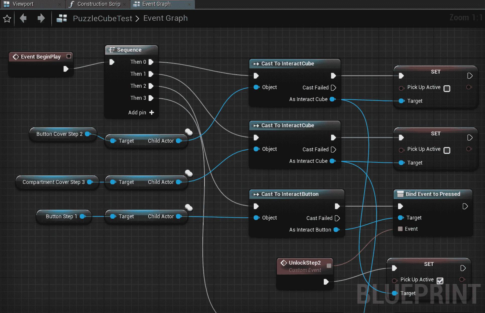

PuzzleBoxTest 代码

我们将从 Event BeginPlay 节点构建此代码：

1.  在蓝图上右键单击并搜索 Sequence 节点。我们将使用这个节点来按正确顺序触发之前提到的步骤。点击节点的添加引脚按钮，直到我们有四个输出引脚可供使用。

1.  首先，从 Then 0 输出拖动，并搜索 Cast To InteractCube 节点。对于 cast 的 Object 输入，我们需要引用我们的子演员 ButtonCover_Step2。然而，如果我们尝试插入一个简单的引用，cast 将无法正确工作。为了确保它引用正确的对象，我们需要添加一个 GetChildActor 节点。创建对 ButtonCover_Step2 的引用，并从其输出拖动一个连接。搜索 GetChildActor 节点，并将其输出连接到 cast 的 Object 输入。

1.  在设置好 cast 之后，我们现在可以假装自己是按钮盖，并关闭其被拾取的能力。从 As InteractCube 输出拖动一个连接，并搜索设置 PickUpActive。在设置 PickUpActive 节点上，确保复选框是关闭的。

1.  让我们重复这个过程为 CompartmentCover_Step3。通过在序列的 Then 1 输出上拖动创建 cast，并通过 GetChildActor 节点将子演员版本的 CompartmentCover_Step3 的引用连接到 Object 输入。作为子演员，通过在设置节点上关闭复选框将 PickUpActive 设置为 false。

1.  接下来，我们需要将按钮按下与几个自定义事件连接起来。从序列节点上的 Then 2 输出拖动一个连接，并搜索节点 Cast To InteractButton。使用与之前相同的方法创建对子演员 Button_Step1 的引用，并将其连接到 cast 的 Object 输入。我们将使用作为按钮一部分创建的事件调度器来将自定义事件连接到按钮的按下。从 As InteractButton 输出拖动一个连接，并搜索绑定事件到 Pressed。

1.  创建一个新的自定义事件，并将其命名为 UnlockStep2。从事件节点名称旁边的小方块拖动一个连接，并将其插入到 Bind Event to Pressed 节点的事件输入。

1.  从步骤 3 的 As InteractCube 输出拖动一个连接，并创建一个设置 PickUpActive 节点。将其连接到 UnlockStep2 事件的执行输出，并确保设置节点上的复选框已打开。我们现在已重新启用了 ButtonCover_Step2。

1.  重复这些步骤来设置重新启用 CompartmentCover_Step3 的能力。创建一个 Cast To InteractButton 节点，并传递对 Button_Step2 子演员版本的引用。作为按钮，创建一个绑定事件到 Pressed 节点，并将其连接到名为 UnlockStep3 的自定义事件。从步骤 4 的 As InteractCube 输出拖动，并创建一个设置 PickUpActive 节点。确保这个新节点上的复选框设置为开启。

就这样，我们得到了一个需要三步解决的实用拼图方块。使用我们的传送体积，创建一个可以在方块周围传送的空间，然后在中心放置一个拼图方块的副本。围绕它移动。测试步骤，看看它们是否工作。一旦一切正常，我有一个挑战给你。当我们开始这个部分时，我提供了拼图盒的计划草图，以及一个原型关卡供玩家测试。构建关卡并在其中测试你的拼图盒。想要更大的挑战吗？设计和构建你自己的拼图方块和测试关卡！

# 构建第一个工具站

*Server 17* 游戏的一个关键部分是工具站的概念，这是一个位于拼图盒附近的位置，包含某种工具、设备或提示生成器，玩家可以使用它来帮助解决当前的问题。每个站点的工具会有所不同，从可能以时间惩罚为代价解决拼图步骤的暴力破解工具，到可以突出显示玩家必须与之交互的下一个部件的简单提示工具。对于原型，我们将设计一个简单的旋转工具，以突出我们创建的工具的易用性。让我们看看原型视觉：

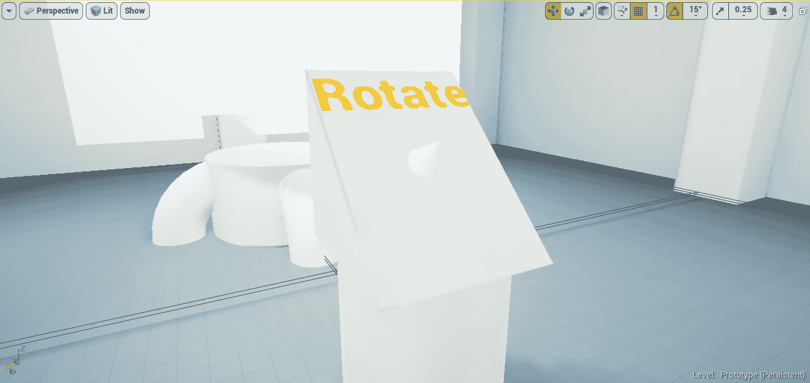

原型视觉

构建相对简单。使用内容浏览器，转到入门内容中的`Shapes`文件夹，并取一个圆柱体。使用缩放工具将其缩小一半。然后取一个楔形并将其放在圆柱体顶部。也将这个缩小一半。我还使用文本渲染器创建了图像中看到的文本。这个工具站最后的部件是一个新的类蓝图：

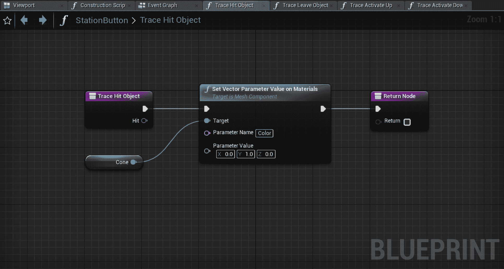

StationButton 代码

创建一个新的类蓝图并从菜单中选择 Actor：

1.  创建新的类蓝图，从“选择父类”菜单中选择 Actor 类，并将其命名为`StationButton`。

1.  与我们的 InteractCube 类似，这个蓝图只包含一个组件。我使用了圆锥组件；然而，请随意使用您认为可能合适的任何组件。

1.  现在，让我们为这个玩意儿编写代码！为了利用我们在这章中创建的一些功能，点击类默认按钮，并在详细信息面板中找到接口部分。点击添加按钮并选择我们的对象交互接口。

1.  添加接口后，转到 My Blueprint 面板并打开菜单中的接口部分。双击并打开以下功能：`TraceHitObject`、`TraceLeaveObject`、`TraceActivateUp`和`TraceActivateDown`。

1.  让我们从`TraceHitObject`开始。这涵盖了我们的线迹接触到对象时会发生什么。从组件面板中将圆锥的引用拖到蓝图，并从它拖出一条连接。创建`SetVectorParameterValueOnMaterial`的副本，并将其连接到函数节点和返回节点。将参数名称字段的值设置为 Color。最后，将参数值输入的*Y*值设置为 1.0。这将在我们对按钮进行线迹追踪时将其突出显示为绿色。

1.  对于`TraceLeaveObject`，我们需要创建一个变量来存储我们的按钮是否正在使用。转到 My Blueprint 的变量部分，创建一个新的布尔变量。将其命名为`ButtonPressed`，并将其默认值设置为 False。除了将按钮颜色变回默认的白色外，我们还想确保如果按钮不再被线迹触摸，它不再被注册为按下。重复前面的步骤创建`SetVectorParameterValueOnMaterial`节点，并将参数值输入的值设置为 X=1.0，Y=1.0，Z=1.0。这将使按钮颜色变回白色。在`SetVectorParameterValueOnMaterial`之后，连接一个设置`ButtonPressed`的节点，并确保复选框设置为关闭。将其连接到`SetVectorParameterValueOnMaterial`的输出和`ReturnNode`。

1.  现在，让我们继续到`TraceActivateDown`。当玩家激活按钮时，我们只想将`ButtonPressed`设置为 True。我们将在关卡蓝图中处理旋转。将设置`ButtonPressed`的副本连接到函数。确保节点上的复选框已打开。在设置节点之后，使用圆锥作为目标创建另一个`SetVectorParameterValueOnMaterial`的副本。按照本节前面的步骤设置它，并将参数值输入的*X*值设置为 1.0。这将使按钮在使用时变为红色。

1.  最后，我们有`TraceActivateUp`。当玩家释放扳机时，我们需要将颜色变回绿色（这是被线迹击中的颜色），并将`ButtonPressed`重置为 false。将`SetVectorParameterValueOnMaterial`的副本连接到函数节点，按照我们之前步骤设置好，并将参数值输入的*Y*值设置为 1.0。将`set ButtonPressed`的副本连接到`SetVectorParameterValueOnMaterial`节点的输出，并将其输出连接到返回节点，确保复选框设置为关闭。

1.  在我们的关卡中，将`StationButton`的副本添加到我们创建的工具站中，并将其命名为 StationButton_Rotate。

要使拼图盒在按下我们的站按钮时旋转，我们需要在关卡蓝图中构建一些功能，因为这种能力仅限于原型级别。使用蓝图按钮打开 Level Blueprint。

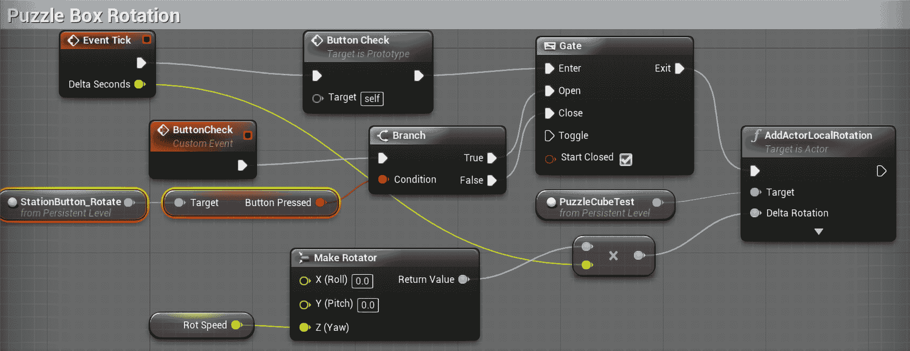

关卡蓝图代码

我们将使用一个自定义事件来开始构建这个序列：

1.  在蓝图上右键单击并创建一个新的自定义事件。我们将将其命名为 ButtonCheck。

1.  接下来，右键单击并创建一个新的 Branch 节点。这将读取按钮是否被按下。创建对 StationButton_Rotate 的引用并从它拖动一个连接。放下它并搜索 Get ButtonPressed。将此节点的输出连接到 Branch 上的条件节点。

1.  现在，创建一个 Event Tick 节点。我们希望游戏每帧检查按钮是否被按下。从事件拖动一个连接并搜索我们的 ButtonCheck 函数以创建它的副本。

1.  就像我们对之前的按钮所做的那样，我们将使用一个 Gate 来控制代码是否执行，基于 ButtonPressed 是 True 还是 False。创建一个 Gate 节点并将 Enter 输入连接到 ButtonCheck 函数的输出。将 Branch 的 True 输出连接到 Open 输入，将 Branch 的 False 输出连接到 Close 输入。

1.  是时候创建旋转功能了。在“我的蓝图”的变量部分创建一个新的`Float`变量，命名为 RotSpeed。这将控制谜题立方体的旋转速度。

1.  接下来，右键单击并搜索 Make Rotator 节点。将 RotSpeed 的一个副本连接到 Z（偏航）输入。

1.  我们需要的最后一个主要节点是 AddActorLocalRotation。将其连接到 Gate 节点的 Exit 输出，并使用关卡中谜题立方体的引用作为目标。

1.  Delta Rotation 输入需要一点数学计算。从 Make Rotator 的输出拖动一个连接并搜索 ScaleRotator 节点。对于浮点输入，使用 Event Tick 的 Delta Seconds 输出。这将创建一个随时间平滑的旋转。

1.  最后，将 ScaleRotator 节点的输出插入到 AddActorLocalRotation 的 Delta Rotation 输入上。

现在，我们有了旋转功能！显然，在*Server 17*中，关于黑客工具的想法还有很多可以做的，但这对我们的原型阶段来说已经足够了。看起来这个功能终于要完成了。尽管如此，我们仍然还没有创建最后一个游戏元素：我们的关卡计时器。

# 构建计时器

在*Server 17*的世界里，玩家破解公司服务器以寻找有价值的公司机密。然而，那些公司不会坐视不管！强大的系统管理员、公司黑客和 AI 反制措施动员起来阻止玩家，给他们有限的时间来破解每个服务器。为了在游戏中表示这一点，我们将在游戏中实现一个关卡计时器，当计时器达到零时，玩家将失败。由于这只是一个原型，当计时器完成时，游戏将退出。

由于这是一个独立于任何级别的游戏元素，我们将在自定义游戏状态中构建这个功能。前往我们的`Sever17\Blueprints`服务器，双击`S17GameState`以打开它：

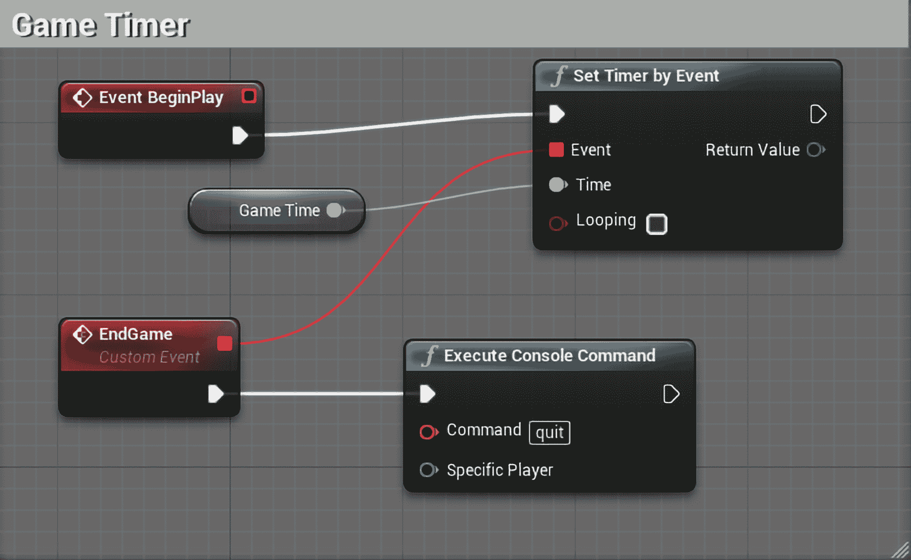

在游戏状态中设置游戏计时器代码

让我们开始吧：

1.  此功能利用了蓝图系统中内置的计时器系统。使用 SetTimerByEvent 节点，当计时器（以秒为单位）完成时，我们可以调用自定义事件。首先，创建 Event BeginPlay 节点的副本，并从输出拖动一个执行连接。搜索 SetTimerByEvent 节点，并从菜单中选择它。

1.  接下来，创建一个名为 `EndGame` 的自定义事件。通过将自定义事件旁边的方块引脚拖动并连接到 SetTimerByEvent 的输入引脚，将此自定义事件连接到 SetTimerByEvent 的事件输入。

1.  将 EndGame 事件拖动开，搜索 ExecuteConsoleCommand 节点。在命令字段中，输入命令 `quit`。

1.  要完成序列，我们需要为 SetTimerByEvent 上的时间设置一个值。为了保持系统的灵活性，我们将创建一个游戏时间的变量，可以从游戏状态外部轻松调整，以考虑诸如关卡难度或故事元素等因素。创建一个新的 `Float` 变量，并将其命名为 GameTime。编译蓝图，并将默认值设置为 300。获取它的副本，并将其连接到 SetTimerByEvent 的时间输入。

太棒了！我们勇敢的玩家现在有五分钟的时间来完成我们的拼图魔方，否则将被踢出游戏。请随意调整 GameTime 的默认值，使其适合您的玩家或根据您的挑战进行调整。

# 摘要

哇！这是一段多么精彩的旅程。我们以一些关于游戏玩法的有意思的讨论开始这一章，并以从头开始创建整个游戏原型结束！在这一章中，我们探讨了成功实现 VR 独特功能的多种不同类型的游戏玩法。利用这些知识，我们设计了游戏元素，以充分利用玩家动作与游戏之间几乎一对一的转换，以及玩家能够从真正的第一人称视角与世界互动的能力。在本章的剩余部分，我们从手部交互到 VR 按钮，甚至为玩家在时间限制内解决谜题的谜盒，从头开始构建了所有系统。

在下一章中，我们将通过讨论我们迄今为止创建的用户体验以及如何通过使用用户界面来改进该体验来扩展我们的游戏玩法。我们将讨论在游戏世界中使用 2D 和 3D 元素的使用和可行性，以及什么最适合与 VR 一起使用。利用这些知识，我们将设计和构建我们自己的元素，用于在 *Server 17* 中使用。
