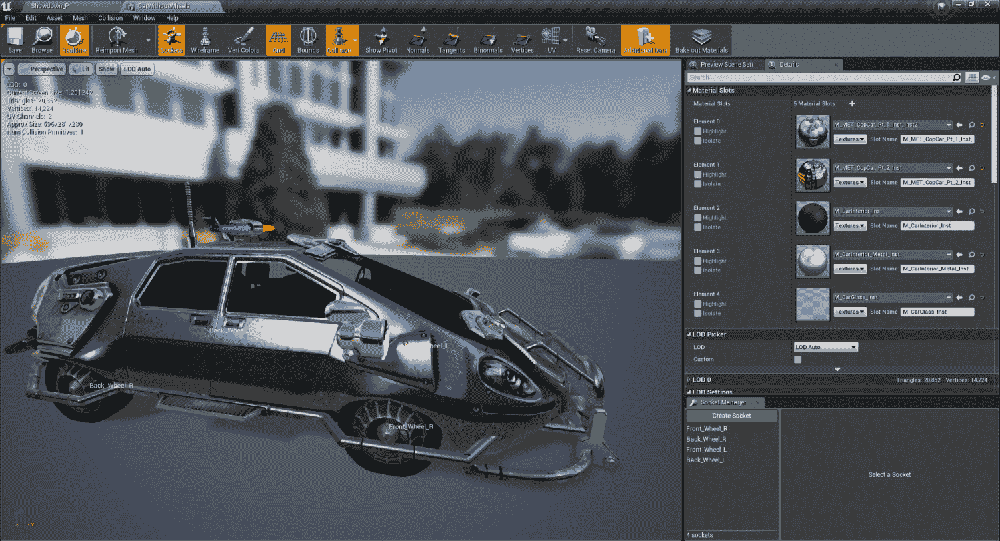
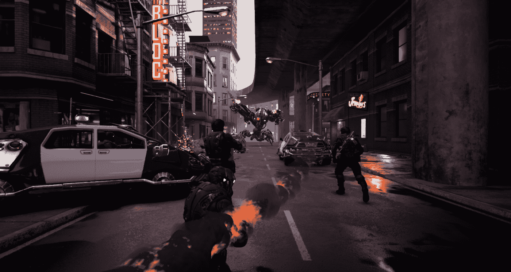
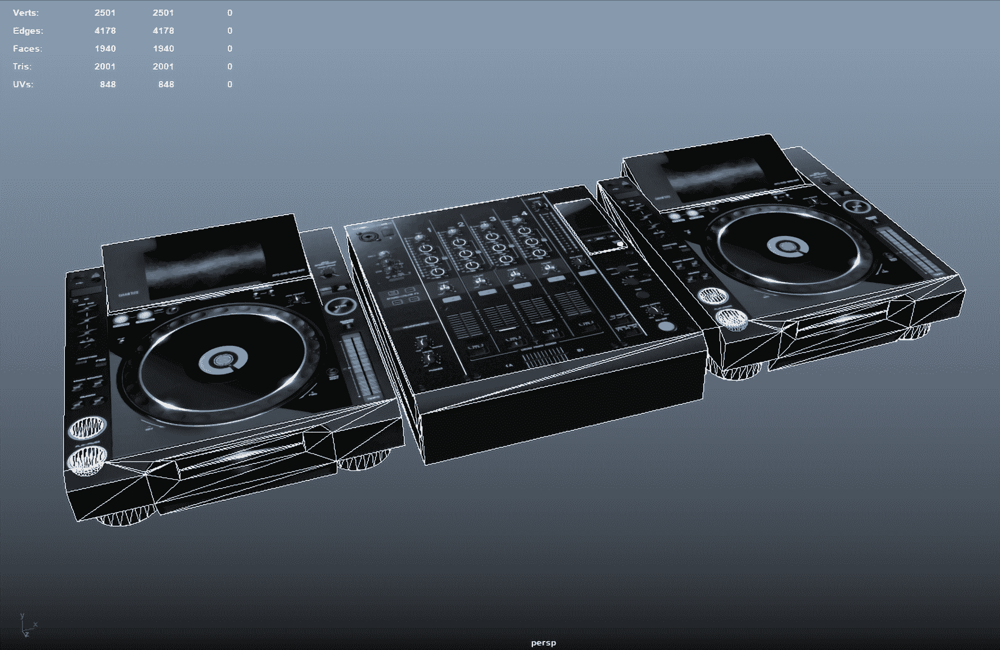
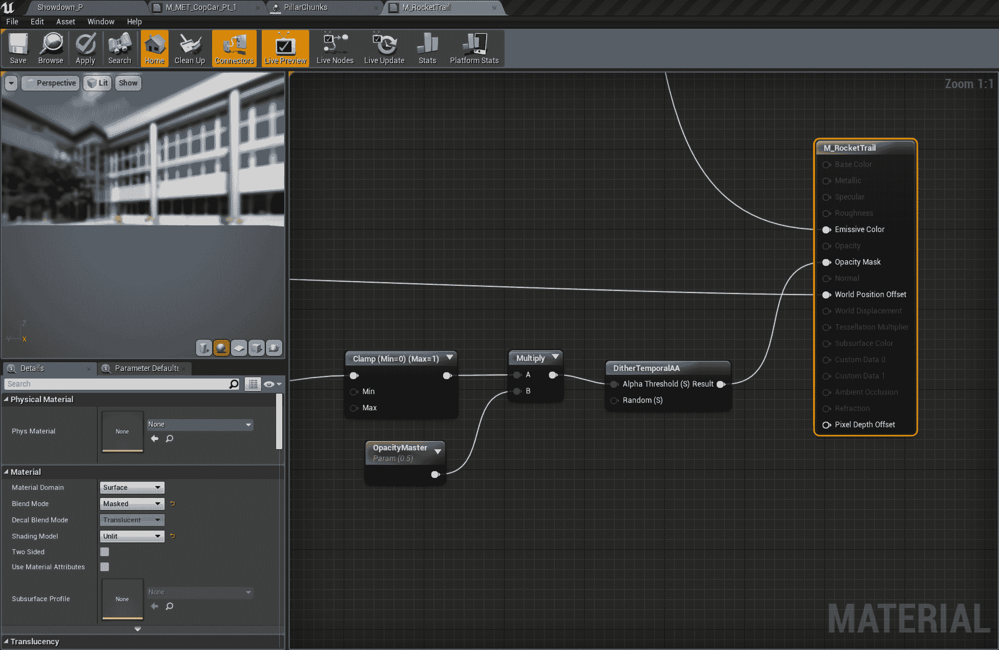
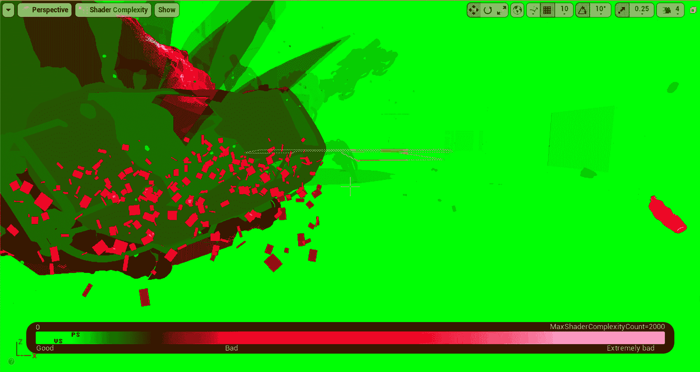
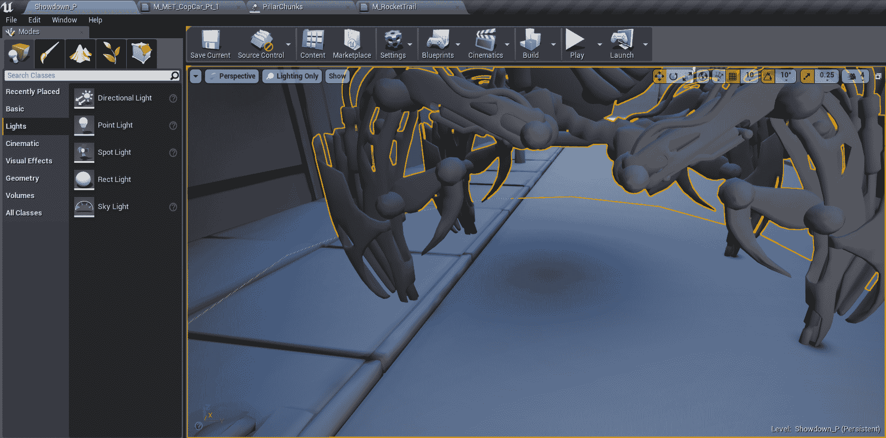
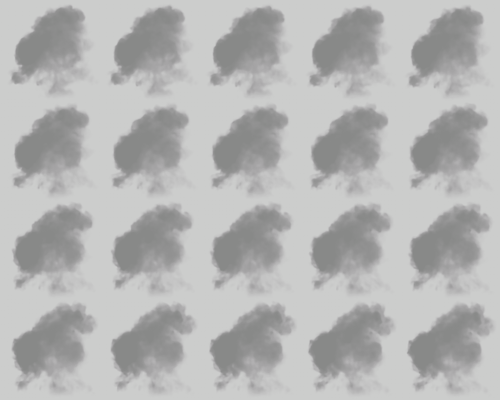
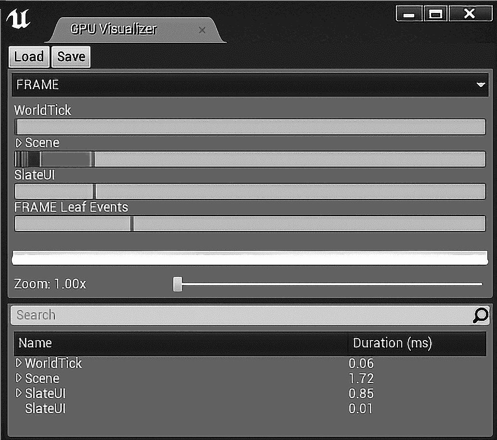

# 第五章：在 UE4 中为 VR 创建优化的游戏艺术

*服务器 17*已经取得了长足的进步。我们已经将游戏从简单的谜题想法发展成了一个可工作的游戏原型。在这个阶段，我们有一个样本关卡，自定义游戏玩法和自定义界面。我们已经构建了可以扩展以添加更多游戏机制的交互系统。然而，游戏看起来并不怎么样，对吧？我们的照明很基础。我们仍在使用许多事物的默认纹理。这没有问题，因为这是一个游戏原型，但如果我们想将这个游戏展示给家人和朋友之外的人，它将需要一些美化。

为 VR 创建 3D 游戏艺术与为其他游戏创建游戏艺术不同。尽管我们使用了许多相同的程序，但 VR 要求我们在艺术上保持保守。VR 的性能要求我们需要保持多边形数量低，使用技巧来消除高级照明技术的使用，并重新思考我们的艺术方法。尽可能伪造一切，并将你的游戏艺术视为 90 年代末的作品。

在本章中，我们将涵盖以下主题：

+   性能是关键

+   VR 中的艺术限制

+   性能提升技巧

+   测量游戏中的性能

# 性能是关键

反复提及 VR 中的性能主题。我们第一次讨论它是在第一章，“在虚幻引擎 4 中介绍 VR 技术”时，我们讨论了 VR 不适感。我们再次在第三章，“探索虚拟现实中的扣人心弦的游戏玩法”中提及了它，当时我们编写了使我们的游戏运行起来的交互系统。那么，为什么我们一直谈论这个话题呢？性能是享受 VR 体验的核心。高端视觉效果有助于我们的玩家沉浸在我们的数字环境中，而保持稳定的帧率是最大化玩家舒适度和减少 VR 不适感的最佳方式。那么，我们如何平衡这两者呢？

在本章中，我们将讨论与 3D 游戏艺术、照明和视觉效果相关的性能。在 VR 中，管理你的资源和细节级别变成了一场平衡游戏。我们如何提供吸引玩家的视觉效果，同时保持 90 FPS 或以上的帧率以保持他们的舒适度？简单的答案是理解和周密的计划。有了正确的规划和一些技巧，我们可以保持高 FPS，并交付玩家所要求的体验。

首先，让我们讨论一下 VR 如何渲染我们在屏幕上放置的元素的重要要点。我们创建并添加到环境中的每个对象都需要经过绘制到屏幕的过程。对象越详细（以多边形计数或三角形计数来衡量），所需的处理就越多。处理需要时间。我们还要注意绘制调用。每次我们更新屏幕时，对象都需要再次绘制，以及它所使用的每种材料。我们可以这样描述：

*绘制调用 = 屏幕上网格的数量 * 每个网格的材料数量*

我们还必须记住，VR 头戴式设备渲染到两个屏幕（每个眼睛一个）。因此，绘制调用的数量实际上是翻倍的！这就是规划可以发挥作用的地方。以下是一些有用的做法和禁忌：

+   **做法**：

+   规划我们的环境，以便我们可以最小化屏幕上的网格数量。确保每个网格都有目的，并且通过存在为关卡增添内容。

+   最小化每个对象上的材料数量。可以创建一个大的材料，可以与几个不同的网格一起使用。然而，将每个对象上的材料数量保持在尽可能低的工作效果同样好。

+   **禁忌**：

+   仅放置网格以填充空间。这使得关卡感觉杂乱无章。这也增加了每帧的绘制调用数量。

+   依赖高级渲染技术来显示网格和效果。如透明度、屏幕空间反射和法线贴图等特性在 VR 中表现不佳。要么它们太资源密集，要么显示不正确。

这些只是知识和规划如何帮助性能的一两种方式。通过理解 VR 的需求并规划我们的艺术方法，我们可以尽最大努力减少绘制调用。

# VR 中的艺术限制

现在我们有了基本理解，是时候具体分析了。我们在 VR 中面临的限制如何影响以下游戏艺术类别的每个类别？：

+   静态和骨骼网格

+   材料图

+   灯光

+   视觉效果

每个类别代表在为我们的游戏创建视觉效果时需要考虑的不同限制。

# 静态和骨骼网格的限制

让我们先从静态网格和骨骼网格开始看：

Unreal 4 中的静态网格编辑器

静态和骨骼网格代表了在 Unreal Engine 4 中创建游戏所投入的大部分艺术。这些是你的 3D 模型，通常被归类为环境、角色、武器、车辆等。回到 20 世纪 90 年代末，当计算机资源更加有限时，艺术家在多边形或三角形计数方面必须遵守严格的限制，但那些限制已经成为过去。现代游戏硬件可以毫无问题地将数百万个三角形推送到屏幕上。然而，由于 VR 对性能的需求如此之高，现在是时候像 1999 年一样创建我们的模型了！

对于我们这些较老的人来说，我们能够记住那些限制是什么样的。对于其他人（年轻的读者）来说，我们需要稍微回顾一下这意味着什么。今天的三角形计数标准相当高。第一人称武器可以有 30,000 个三角形或更多。角色拥有高达 120,000 个三角形的三角形计数并不罕见。然而，任何额外的细节都会影响性能。如果没有法线贴图帮助我们伪造细节并减少这些数字，我们如何保持高端环境所需的细节水平？一种常见的做法是在玩家看不到的地方删除对象上的多边形。当玩家可以看到我们对象的四面八方时，我们如何做到这一点？

# 材质限制

接下来，让我们讨论材质：

材质编辑器的一瞥

场景材质的复杂性和数量往往是 VR 中性能不佳的主要原因。我们应用到网格上的每种材质都会给我们的游戏增加一个绘制调用，迫使计算机在每一帧都要更加努力工作。这可能导致性能变慢，无法达到我们 90 FPS 的目标。还有透明度和反射的问题。透明和不透明的材质是一种很棒的效果。然而，在 VR 中，这些材质的成本很高，因为材质必须每帧重新评估和重新绘制。反射是另一种很棒的效果，它有助于让世界感觉更加真实和沉浸。然而，这些效果也非常消耗资源，需要复杂的计算。

# 光照限制

现在是时候看看光照了：

UE4 中的光照示例

许多现代游戏利用动态光源为玩家提供一个活生生的世界。阴影随着太阳在天空中移动而移动。NPC 在街灯下移动时投下阴影。这种光照和阴影让我们感觉在这个世界中扎根，是任何游戏不可或缺的一部分。然而，动态光照对每一帧的计算成本非常高。那么，我们如何使用阴影来保持虚拟世界中的真实感呢？

# 视觉效果（VFX）限制

最后，我们来谈谈视觉效果：

Unreal Engine 4 Cascade VFX 编辑器

正确的视觉效果可以为许多不同类型的游戏带来冲击力和兴奋感。它们在动作游戏中至关重要。它们为体育游戏带来冲击感。它们甚至增加了模拟的真实感和感觉。然而，就像动态光照一样，它们在性能方面成本很高。透明和不透明材质的限制也适用于这里。一些技术，如使用 SubUV 纹理（在网格中排列动画粒子的帧），变得无效。许多粒子还包含动态光源。

# 性能提升技术

考虑到玩家的舒适度和所有这些限制，设计师们是如何为 VR 用户创造令人惊叹的 3D 世界的？答案可以总结为阶段*fake it till you make it*。VR 背后的技术正在快速发展。处理我们提到的问题的新技术正在被集成到下一代游戏引擎中。然而，目前，艺术家们正在使用一些最佳实践来提供令人惊叹的视觉效果，例如 Epic Games 的决战演示：

Epic Games 的决战演示

这些人能够在 90 FPS 的帧率下渲染出这个惊人的场景。这里有透明度、光照和视觉效果。所使用的模型来自各种其他 UE4 演示，并且没有降低质量。以下是他们是如何做到的一些例子。

# 静态和骨骼网格技术

要在性能方面最大限度地提高你的 VR 环境的成功率，你需要有计划地处理场景，并尽可能保守。由于玩家有机会比在传统游戏中更仔细地检查和与环境互动，因此 VR 准备好的资产需要为平均身高的用户进行缩放。网格也必须是多面的。这意味着要确保对象是完整的，网格中没有缺失的多边形，因为玩家通常可以从任何角度查看对象。以下是一个为*Tribe XR*创建的 DJ 台示例：

在 Tribe XR 中使用的先锋 CDJ 在 Autodesk Maya 中打开。这个网格只有 2,001 个三角形

在他们的游戏*Tribe XR*中，团队计划和专注于他们的 VR DJ 体验，以便在一个房间里进行，这样他们就能最大限度地提高创造沉浸式科幻环境的能力。受到像*Overwatch*和*Team Fortress 2*这样的游戏的启发，他们创建的休息室中包含足够的网格，以营造出一种居住感。每个网格都经过精心放置，以创造一种轻松和逼真的氛围。他们使用的网格具有低多边形/三角形计数，并且 UV 贴图经过优化以减少冗余的绘制调用。结果是流畅的 VR 体验，保持高帧率，让玩家沉浸在音乐中。

游戏优化的标准方法，如使用**细节级别**（**LOD**）网格，在 VR 中仍然有效，应该仍然被考虑。

# 材料技术

如前所述，VR 的材料应该有计划地设计和规划，以最大限度地减少每帧所需的绘制调用次数。每个网格应包含尽可能少的材料以减少这些绘制调用。在决战演示中，Epic Games 创建了许多专门设计的道具，尽管其中一些是从以前的演示中借用的，例如 Samaritan 演示。为 VR 构建的网格都遵循类似的模式。所有网格都经过优化，三角形数量低，大多数只使用一种材料。

透明度/透明度被控制在最低限度，并且仅在少数几个位置使用，例如车辆中的玻璃。周围建筑中的玻璃是通过使用的纹理图像伪造的。在需要透明度的位置，可以使用 DitherTemporalAA 材质节点来使不透明度蒙版对象看起来像透明对象。以下是一个使用火箭烟雾尾迹的示例：

对决演示中的 RocketTrail 材质

具体来说，使用 DitherTemporalAA 节点有助于消除像素过度绘制，从而提高性能。

最后，我们有一个强大的工具可以帮助我们微调场景中的材质：着色器复杂度视图。通过视口中的视图模式下拉菜单访问，此视图以绿色和红色着色场景，绿色表示较简单，红色表示较复杂。让我们看看这个来自对决演示的截图：

启用着色器复杂度的对决演示

大多数场景都叠加在绿色上，显示该级别中大多数对象的着色器指令数量最少。我们看到红色的地方是透明的挡风玻璃和从渗透者演示中获取的角色的着色器（这些没有针对 VR 进行优化）。

# 照明技术

照明级别是每帧更新中最资源密集的过程之一。当动态灯光移动时，它会改变阴影、反射和散射光，这些都必须重新计算和重新绘制。为了补偿这一点，虚幻引擎 4 为每个对象提供了烘焙光图选项。这通过将照明数据烘焙到每个对象上的光图中来创建静态照明。光图不能像动态照明那样逼真，但性能差异非常明显。这并不是说动态照明在 VR 项目中没有位置。动态灯光仍然可以有限地使用，并且它们永远不应该相互接触。如果你正在创建的场景是户外场景，尝试将你的方向光（太阳或月亮）设置为动态，然后使用最简单的设置使用级联阴影图。

然而，使用静态照明的缺点是动态对象会失去阴影。例如玩家、敌人以及交互对象似乎只是漂浮在你的虚拟空间中，没有阴影来固定它们。这给空间带来了一种不太自然的外观。为了解决这个问题，我们可以使用一种可以创建伪造 blob 阴影的技术。我们可以在对决演示中看到它：

一个带有伪造的 blob 阴影的静态网格

最后，反射可以极大地增强一个区域的感觉复杂性和现实感。然而，实时反射消耗了大量的资源，并且不适合 VR 游戏。本着“假装做到你做到”的精神，Epic Games 的设计师创建了反射捕获演员。这些演员从它们的影响区域内捕获反射并将它们编码到静态立方图中。这些立方图可以由材质用于在关卡中创建和微调反射。由于这些立方图是在游戏开始之前创建的，它们对性能的影响非常小。

# 视觉效果技术

如果你做过很多游戏开发工作，无论是二维还是三维，那么你应该知道用于创建粒子效果的传统的 SubUV 技术。这项技术涉及创建一个代表粒子（如火焰或烟雾）的精灵图集，并让游戏引擎通过单元格进行动画处理。这创建了一个看起来是三维的动画粒子，但实际上是一个 2D 纹理。以下是一个烟雾的例子：

使用 SubUV 技术创建的烟雾粒子

你的第一个想法可能是这种类型的粒子对于 VR 来说非常理想，因为我们正在使用 2D 纹理投射烟雾粒子。然而，由于这项技术依赖于透明度，在 VR 中创建这种粒子对我们的性能来说将是艰难的。我们还需要考虑 VR 中的玩家可以从许多不同的角度观看粒子。正因为如此，使用 SubUV 技术创建的粒子最终看起来很平面且缺乏趣味。设计师可以通过专注于使用小网格作为粒子，并创建接近摄像机的效果来解决这个问题：

在 Cascade 中打开的 VR 友好型粒子

在对决演示中，烟雾在关卡中的几个地方被使用，例如翻转汽车的车辆爆炸的一部分。为了最小化对性能的影响，设计师创建了一个动画烟雾材质，他们可以将它放置在 3D 带状网格上，然后作为效果的一部分与几种不同类型的混凝土块一起发射。当启用 Shader Complexity 视图查看演示时，这些烟雾效果以绿色调显示，这意味着它们已经优化并且对帧率的影响很小。这也允许设计师在摄像机附近或正前方部署这些效果——这是 SubUV 粒子可以很好地做到的事情。

# 测量游戏内性能

反复提到性能是 VR 游戏最重要的考虑因素。然而，我们还没有讨论如何在 Unreal Engine 4 内部测量性能，以便我们知道我们是否进行了良好的优化。让我们看看我们有哪些可用的工具。

UE4 作为游戏引擎的一部分提供了大量的性能分析工具，多到我在这个快速入门指南中无法全部讨论。然而，我确实想讨论几个与我们讨论相关的内容：Stat 命令和 GPU 可视化器：

Stat 命令统计信息

有几个 Stat 命令对我们确定性能很有用。它们可以通过按波浪线键打开控制台并输入以下命令来访问（它们不区分大小写）：

+   **Stat FPS**：此命令显示当前帧率以及渲染一帧所需的时间（以毫秒为单位）。请记住，我们针对 HTC Vive 和 Oculus Rift 的目标是 90 FPS。

+   **Stat Unit**：以毫秒为单位显示渲染帧、游戏计算、绘制调用和 GPU 计算时间。

+   **Stat SceneRendering**：显示一般的渲染时间统计信息。当性能开始下降时，此面板可以显示罪魁祸首。

这些统计数据可以帮助我们了解我们的游戏是受 CPU 限制还是受 GPU 限制。受 CPU 限制意味着我们的游戏有太多的复杂计算，性能目前正受到 CPU 的瓶颈限制。当我们的游戏受 GPU 限制时，这意味着我们有太多的绘制调用、灯光或复杂的视觉效果，我们的性能正受到图形处理器的限制。

判断我们是 CPU 受限还是 GPU 受限的另一种简单方法是降低游戏图形质量，并观察对帧率的影响。如果当前 FPS 没有变化，那么我们就受 CPU 限制。

我们拥有的另一个工具是 GPU 可视化器：

GPU 可视化器

这是一个可视化界面，允许我们查看用于绘制每一帧的渲染通道的 GPU 成本。尽管一开始可能看起来很复杂，但这个界面可以显示哪个视觉元素或功能导致了性能的最大下降，正如该功能在渲染时占用最多的毫秒数所指示的那样。有了这些知识，我们可以优化特定的功能或完全删除它。有关此主题的更多信息，请参阅位于[`docs.unrealengine.com/en-us/Engine/Performance`](https://docs.unrealengine.com/en-us/Engine/Performance)的 Unreal Engine 4 文档中的*性能和性能分析*部分。

# 摘要

在本章中，我们学习了与静态和骨骼网格、材质、光照和视觉效果相关的 VR 游戏中性能问题的几个已知原因。在讨论了原因之后，我们通过一些来自 DJ 模拟器*Tribe XR*和 Epic Games 自家的电影级 VR 演示对决的例子，探讨了几个不同的解决方案。最后，我们讨论了如何对自家的游戏性能进行剖析，以确定游戏是否受到 CPU 或 GPU 的限制，以及我们如何利用这些数据来调整和优化我们的应用程序，以实现最大程度的玩家舒适度。

在最后一章中，我们将讨论游戏测试在用户体验设计过程中的重要性，以及如何收集这些数据以做出进一步的设计决策。我们还将学习如何通过烹饪过程最终确定我们的游戏，并为其分发做准备。最后，我们将讨论我们所学到的一切的重要性，如何继续进行我们创建的游戏原型，以及查看进一步开发 VR 应用程序的资源。
