# 第二章：物理资产工具

PhAT 代表物理资产工具。想象一下你扔一个骰子。根据我们生活世界中物理规则的实际情况，骰子在木头上、石头上、玻璃上和地毯上掉落的方式不同。玻璃、塑料球和敌人身体（更复杂）也是如此。使用 PhAT，你将学习如何根据游戏世界中存在的物理规则来模拟现实。这有点像动画，但包含更多的逻辑和工具。

在本章中，你将首先了解 PhAT 中最重要的项目，然后在一个实际示例中使用它们。

# 导航到 PhAT

在我们开始在 **Unreal Editor** 中工作之前，我们需要有一个项目来工作。执行以下步骤：

1.  首先，通过从 Unreal Engine Launcher 点击 **启动** 按钮打开 **Unreal Editor**。

1.  通过选择 **项目浏览器** 中的 **新建项目** 选项卡，从 **项目** 浏览器开始一个新的项目。然后，选择 **第三人称** 并确保 **包含启动内容** 被选中。给项目起一个名字（`phat_test`）。完成后，点击 **创建项目**。

当屏幕上显示所有内容后，在 **内容浏览器** 中，定位到 **ThirdPersonBP** 文件夹，并点击 **Character** 文件夹。找到 **ThirdPersonSkelMesh**，然后在列表上右键单击并选择 **创建** | **物理资产**，如图所示。然后，在 **新资产** 窗口中点击 **确定**。

### 注意

**ThirdPersonSkelMesh** 在 Unreal Engine 4 的新版本中可以通过名称 **SK_Mannequin** 找到。

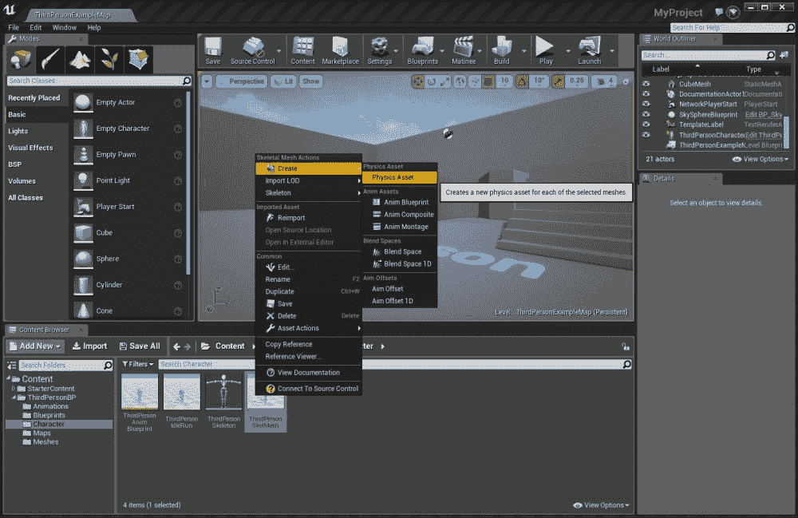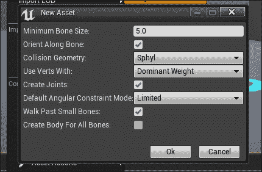

现在，如果一切正常，你将在 **物理资产工具** 或 **PhAT** 中找到你选择的网格。这种编辑器允许你根据骨骼在你的角色网格的某些部分放置一些自定义控制器。这些控制器对物理方面敏感，例如世界重力、其他部分的运动、每个部分的旋转以及部分之间的碰撞。

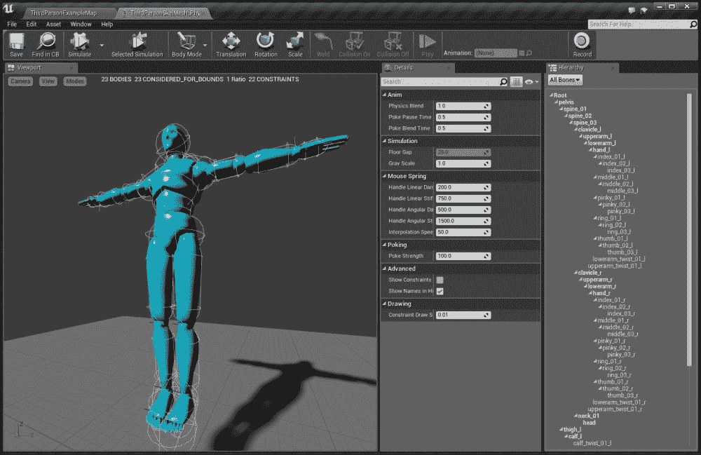

我们将选择一个类似人类的网格。想象一下这是一个敌人，玩家应该射击这个对象。射击后，在击中时，敌人角色会落在表面上。为了模拟这个场景，将您的摄像机设置为以下截图所示，并从顶部菜单点击 **Simulate**：

然后，将您的摄像机设置为该视图并点击 **Simulate**。

在前面的截图中，你可以看到角色正在下落，但它在很多方面下落的方式并不自然。以下图像是此动作的截图。在这里，你可以看到手和脊椎处于一个不真实的位置。PhAT 可以通过根据物理规则（如重力）自定义每个骨骼的运动来解决所有这些问题。

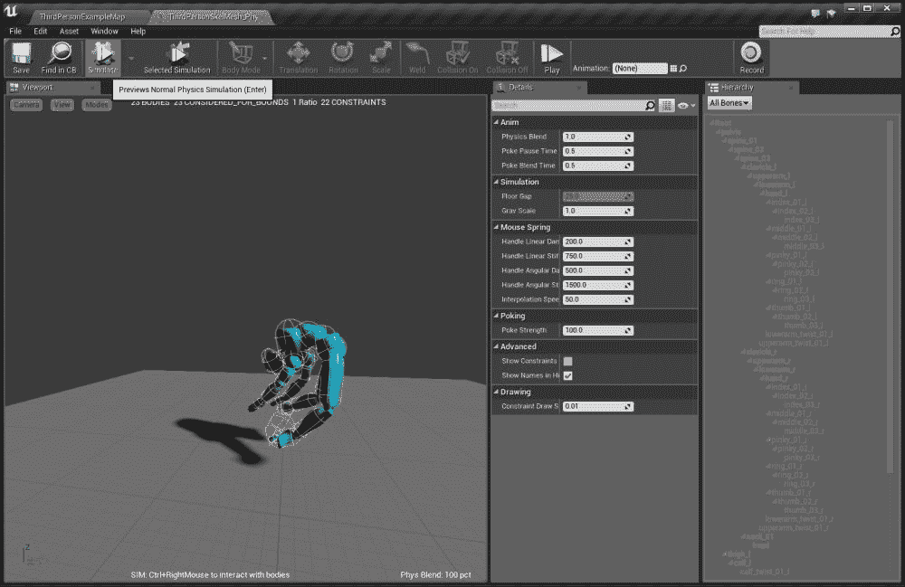

当网格下落时，问题仍然出现在背面和手上。

再次点击 **Simulate** 以返回正常模式。

## PhAT 环境

PhAT 有几个小工具和部分。在这里，我们将介绍大多数常用部分：

+   **层次结构**：在舞台右侧，有一个与角色网格纠缠在一起的骨骼列表。这用于动画目的。一些骨骼有粗体字，而一些没有。当您将物理资产分配给骨骼时，虚幻引擎会自动将其设置为粗体。这有助于通过一眼扫视来识别涉及的骨骼。您可以使用顶部菜单中的**窗口**按钮打开/关闭此功能。

+   **保存**：这将在模型上保存当前资产。

+   **在 CB 中查找**：这将在**内容浏览器**中定位当前资产。

+   **模拟**：这是运行模拟。

+   **模拟**前的**小箭头**：这将在**真实**和**无重力**类型的模拟模式之间切换。

+   **所选模拟**：当您选择一个骨骼然后按模拟时，只有所选骨骼及其分支（或子项）会响应模拟。让我们看看一个例子：

    1.  导航到右侧的**层次结构**并选择**带身体的骨骼**。这仅显示带有资产的骨骼。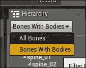

    1.  现在，在骨骼列表中右键单击**下臂 _r**，然后单击**所选模拟**以使其处于活动状态：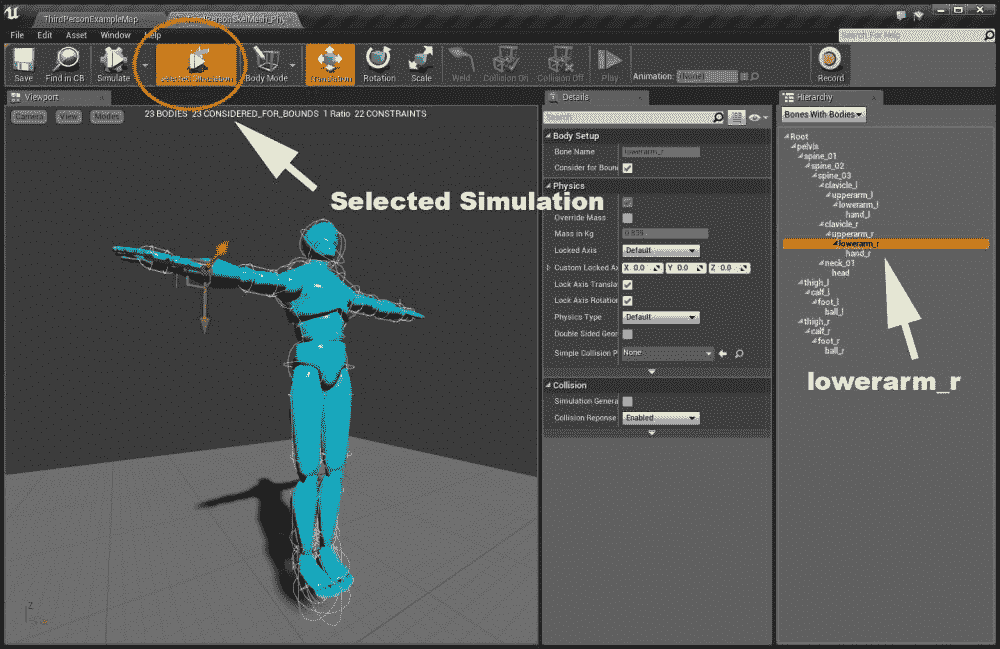

    1.  然后，点击**模拟**。如您所见，只有左手的一部分显示出一些运动，但身体的其余部分没有移动：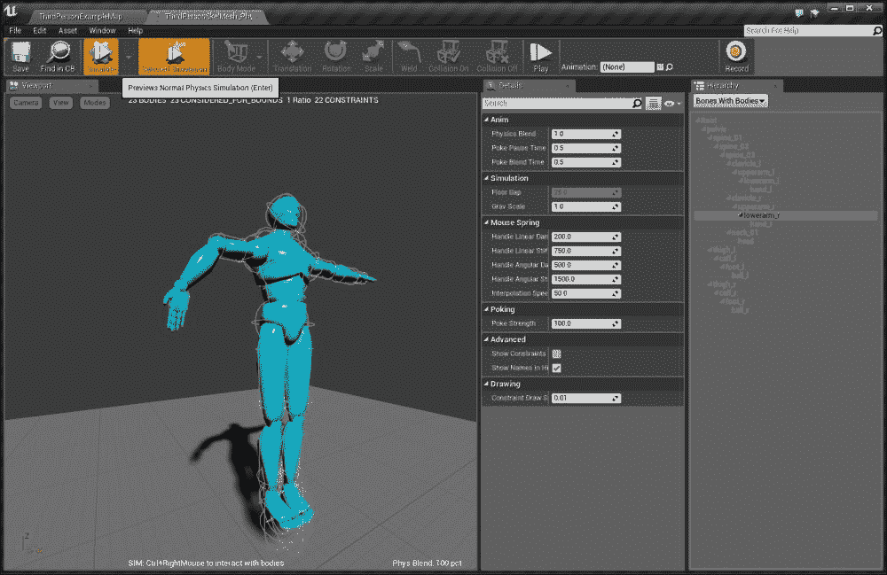

    1.  再次点击**模拟**以返回正常场景。

    1.  现在，点击**上臂 _r**在**层次结构**中。然后，再次点击**所选模拟**。如您所见，现在整个手是模拟的一部分，但身体没有移动：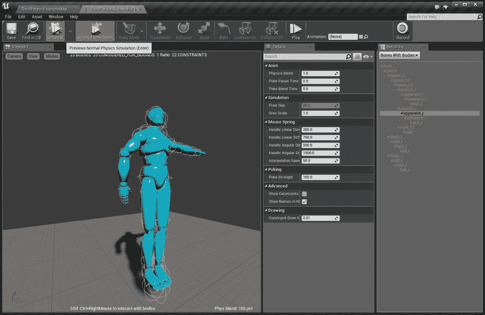

    1.  当我们开始添加资产时，这种模拟类型将非常有用和方便。现在，只需尝试使用更多骨骼进行实验并模拟您的选择。

+   **身体模式**：这选择身体的不同视觉呈现类型。

+   **翻译**、**旋转**和**缩放**：这些是编辑每个资产的工具。

+   **详情**：在本节中，您将找到每个资产的一些相关属性。当您在**层次结构**中选择不同的资产时，与所选资产相关的属性将在这里显示。您可以通过顶部菜单中的**窗口**按钮打开/关闭此功能：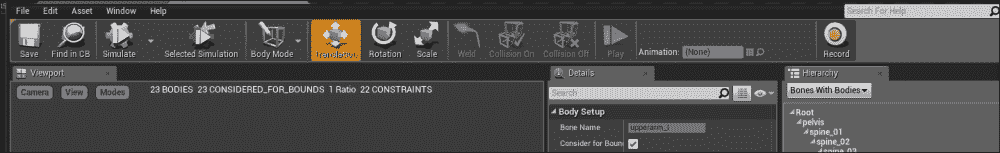

## PhAT 示例和经验

为了在每个骨骼上创建新的资产，最好将我们的对象从之前的对象中清理干净。有一个快速的方法来完成这个操作，那就是点击顶部菜单栏中的**编辑**，然后点击**选择所有对象**。现在，按键盘上的**删除**键。尝试这样做，然后点击同一菜单中的**撤销**。您还可以尝试另一种有用的方法，这在下一节中会解释。

### 删除当前资产

执行以下步骤以删除当前资产：

1.  将您的相机设置如图所示：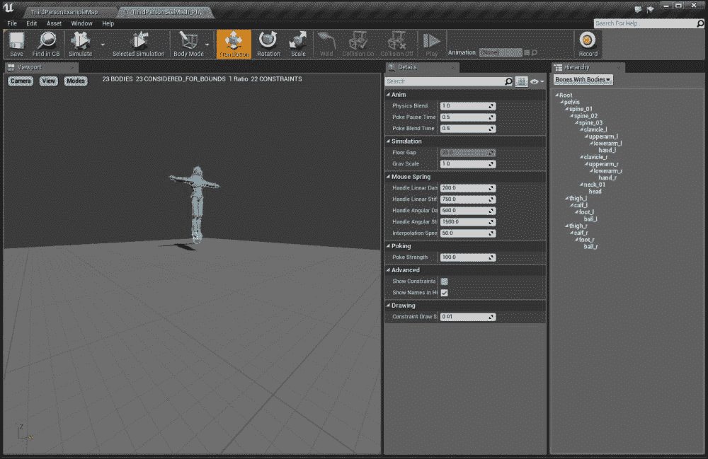

1.  现在，点击**模拟**并等待直到身体完全躺在地面上，如图所示。您的结果可能会有所不同，但没问题。您可以尝试点击**模拟**以达到图像的最近形式：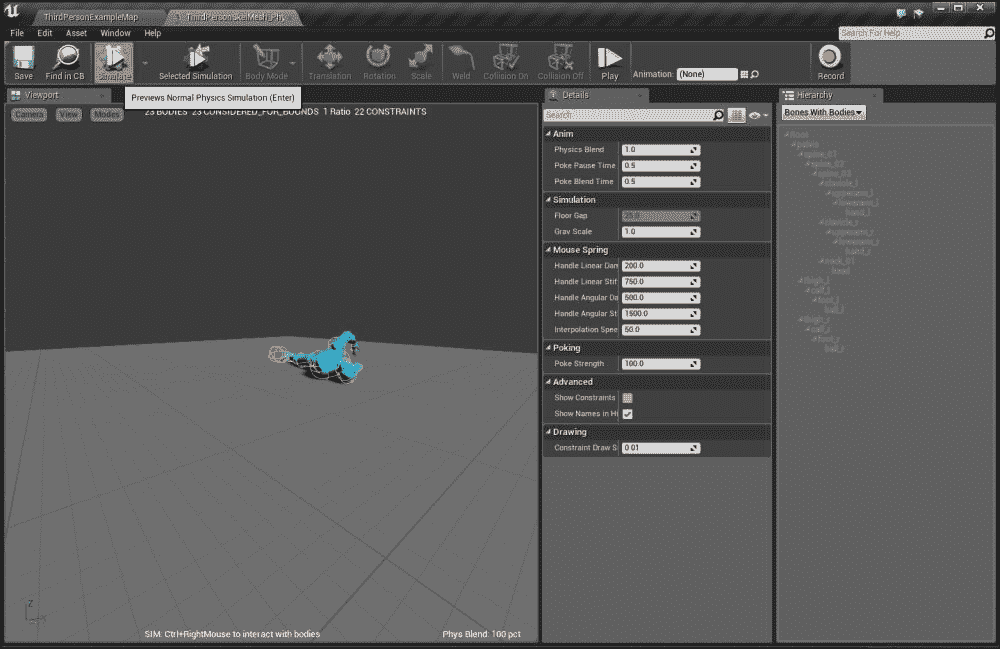

1.  现在，按*Ctrl*并右键点击以抓住头部，然后慢慢但不要太慢地移动鼠标。看起来网格就像悬挂在您的鼠标指针上，如图所示：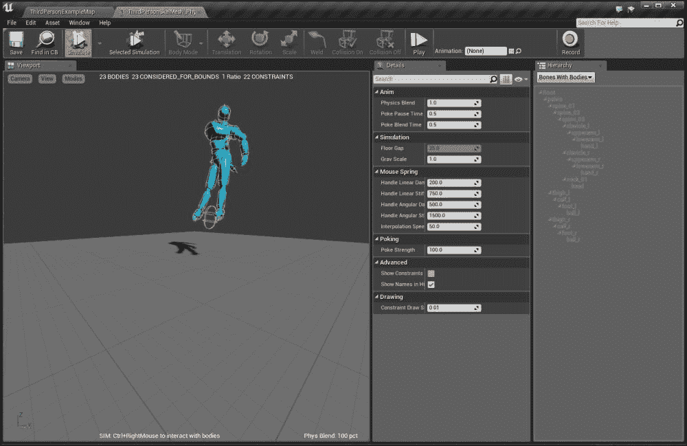

    在不释放鼠标右键的情况下，将鼠标在舞台的左右方向移动，并观察网格元素相互连接和移动。您很快会发现一条红线，指示鼠标刚刚移动的路径，如图所示：

    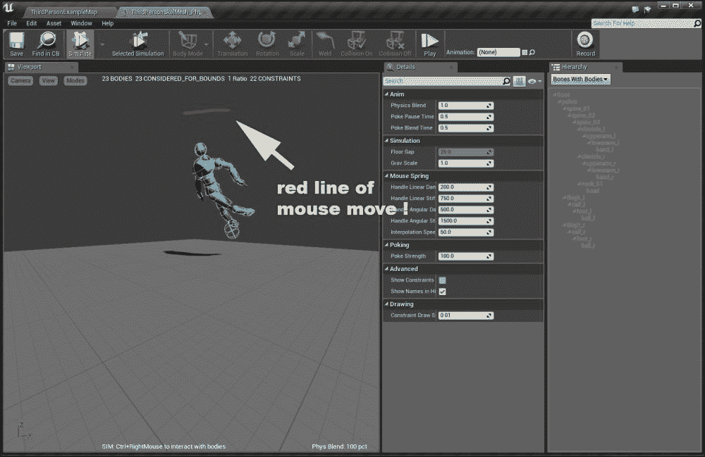

    如果您释放鼠标按钮，可以使用**模拟**切换回正常模式并重新创建它。

1.  现在，放开鼠标，角色将落在表面上。抓住角色的其他所有部分，并用不同的鼠标速度体验相同的运动。这有点像 PhAT 的乐趣，也显示了身体如何与骨骼连接。您可以在**层次结构**中追踪这一点。

1.  点击**模拟**返回到正常模式，然后在**层次结构**中右键点击**spine_03**。正如您在下面的屏幕截图中所见，这部分以不同的颜色被选中。现在，点击**模拟**。然后，抓住这部分（*Ctrl*，右键点击并按住）并移动它。再次选择**模拟**以返回正常模式。这次，选择**foot_r**并尝试模拟并抓住它移动角色。如您所见，当您抓住身体并移动时，其他部分会创造一种节奏，这取决于您在屏幕上的鼠标移动。这是由每个部分的默认物理资产引起的。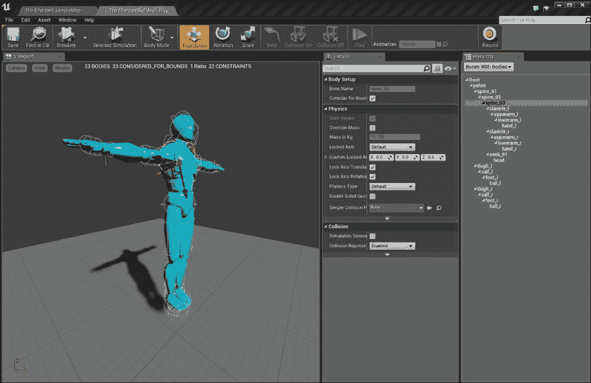

1.  现在，右键点击**clavicle_r**并选择**删除以下所有身体**，如图所示。看起来这里并没有发生什么严重的事情，但当您点击模拟时，砰！左臂保持静止，并显示出完全不同的行为。停止模拟，右键点击**clavicle_l**，选择**删除以下所有身体**，然后再次点击**模拟**。现在，两只手都保持静止，不再像以前那样。选择**撤销**以追踪先前和当前行为之间的差异。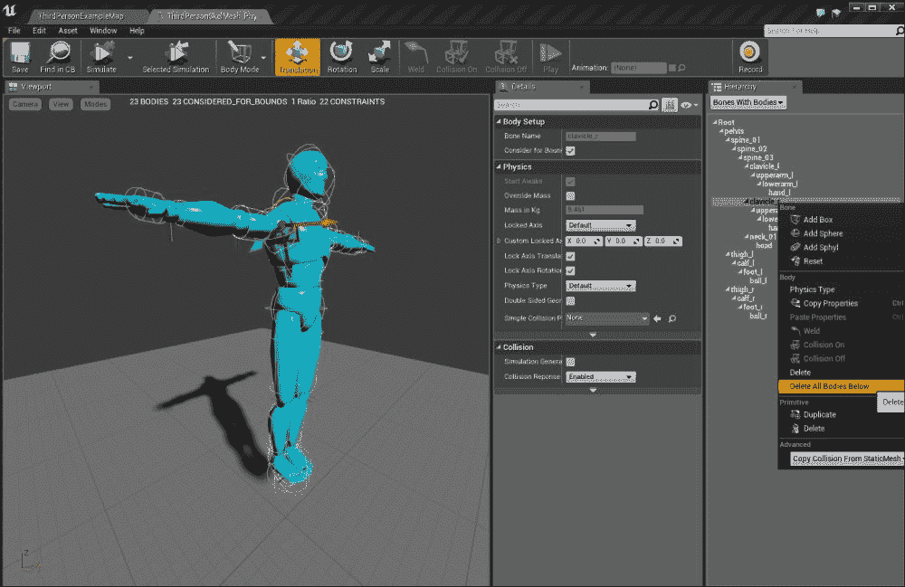

    这种练习对于理解 PhAT 在游戏中所能提供的内容至关重要。当你选择**Delete All Bodies Below**时，你可以删除所有将连接到所选骨骼的先前物理资产。你可以在**Hierarchy**中跟踪这一点。例如，**clavicle_r**连接到**upperarm_r**，同样的逻辑（想象成骨骼链），**upperarm_r**连接到**lowerarm_r**。而且，**lowerarm_r**连接到**hand_r**。在这里，**hand_r**是这一系列骨骼中的最后一个成员。（这对于最后一个骨骼很重要）。如果你对**clavicle_r**应用任何物理规则，能量就会通过其他骨骼流动到末端：**hand_r**。当你选择**Delete All Bodies Below**时，实际上可以删除这条路径来导航能量。这就是为什么在模拟中手看起来很坚固的原因。

    这是对 PhAT 用途的基本理解。你将学习如何设计某些资产，这些资产可以引导并反映环境（如重力或碰撞）通过角色的骨骼输入。

    要查看这些资产如何起作用和导航能量，在**Hierarchy**中选择**从上到下骨骼（或骨骼）**，并检查**clavicle_r**是否连接到**spine_03**。较大的骨骼将物理资产/能量发送/导航到**clavicle_r**。

    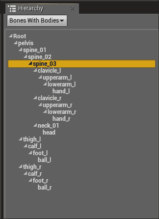

1.  用同样的方法尝试**thigh_l**和**thigh_r**。在这里，**pelvis**是**Hierarchy**中的较高骨骼。

### 添加和自定义当前资产

现在，随着我们体验 PhAT 资产对骨骼的影响，并理解骨骼是如何连接和引导能量的，是时候在身体上创建我们自己的物理资产了。参考最后一部分，尝试删除不同的骨骼资产，并模拟场景。然后，选择**Undo**和**Redo**。这对于游戏设计师来说是一种创造性的练习。

现在，点击顶部菜单栏中的**Edit**，选择**All Objects**，然后在键盘上按*Delete*。现在，我们可以删除身体上的所有物理资产。然后，在**Hierarchy**中选择**All Bones**：

你将在**Hierarchy**中找到一个所有骨骼的详细列表。它似乎有更多带有更详细名称的骨骼。我们可以在本章中选择其中一些，并在它们上面建立我们的物理资产；你可以尝试不同的骨骼，以获得更逼真的结果。

1.  按照以下方式更改你的相机。然后，点击**Simulation**。

    1.  什么也不会发生。现在，点击顶部的**Body Mode**并选择**Constraint Mode**。屏幕将变空白。

    1.  通过再次点击**Constraint Mode**并选择**Body Mode**，导航回**Body Mode**。你将再次看到身体。现在，在**Hierarchy**中点击**pelvis**，右键点击它，选择**New Body**，然后在**New Asset**框中点击**Ok**：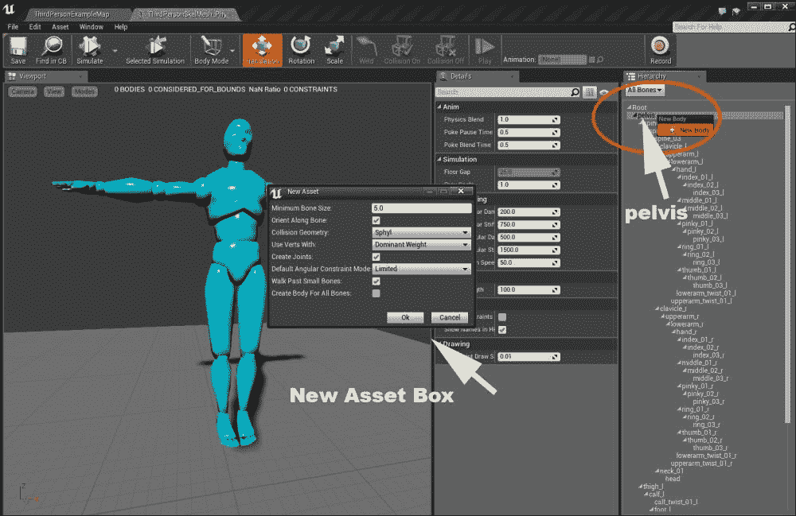

    1.  现在，点击顶部的**Body Mode**并选择**Constraint Mode**。这次屏幕上会出现一些东西。

    1.  这是你的第一个资产。现在，点击**Simulate**来在现实世界中尝试它。也可以拖动并尝试移动它（按住*Ctrl*和右鼠标按钮）。这基本上与你检查资产功能、创建和编辑、选择**Simulate**然后用鼠标测试的方式相似。

    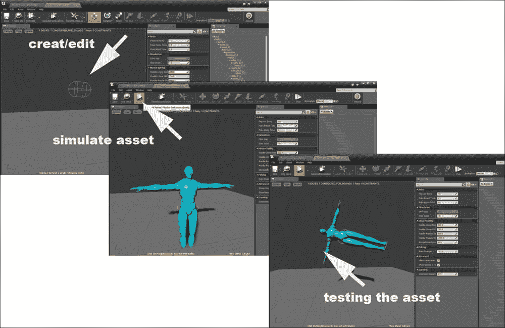

1.  在顶部切换到**Body Mode**以查看整个身体。然后，在**Hierarchy**中选择**thigh_l**并为其创建一个新的身体。现在，查看变化。点击**Simulate**并尝试用鼠标移动它。正如你所见，运动发生在两个部分之间：**pelvis**和**thigh_l**，这在**Hierarchy**中以粗体字体表示。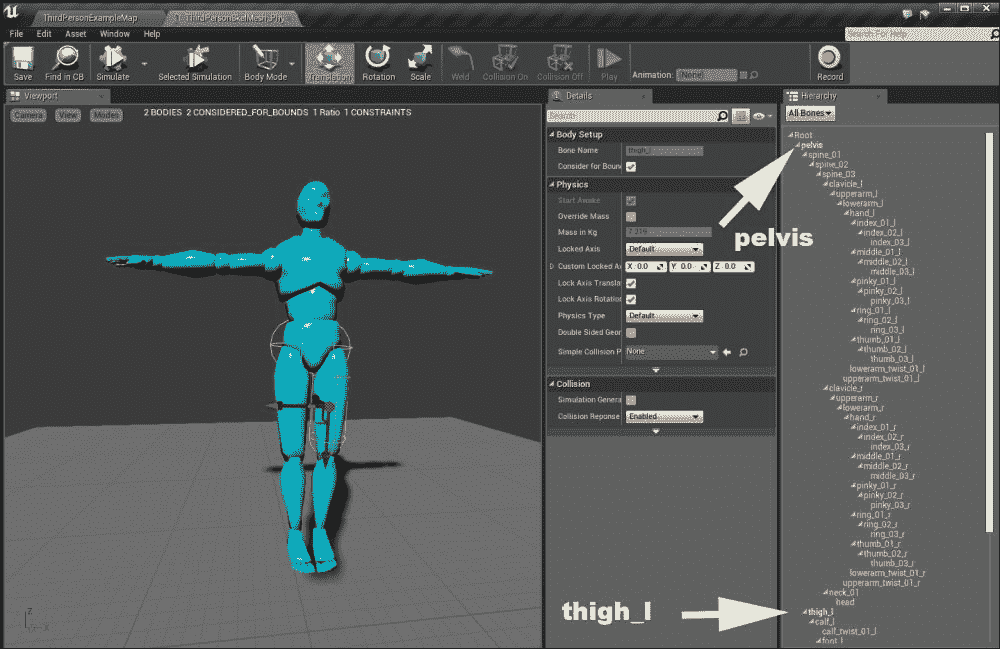

    1.  在**Hierarchy**中切换到**Bones With Bodies**以使列表中只有这些骨骼。现在，切换到顶部的**Constraint Mode**。现在，你可以看到你放在骨骼上的新物理资产。到目前为止，我们有两个。

    1.  现在，点击**thigh_l**然后在上面的**Selected Simulation**上，使其变为活动状态。然后，点击**Simulate**。正如你所见，只有选中的部分会移动。用鼠标测试一下。它移动得并不自然，与真实人体的运动相比，它绝对是 unnatural。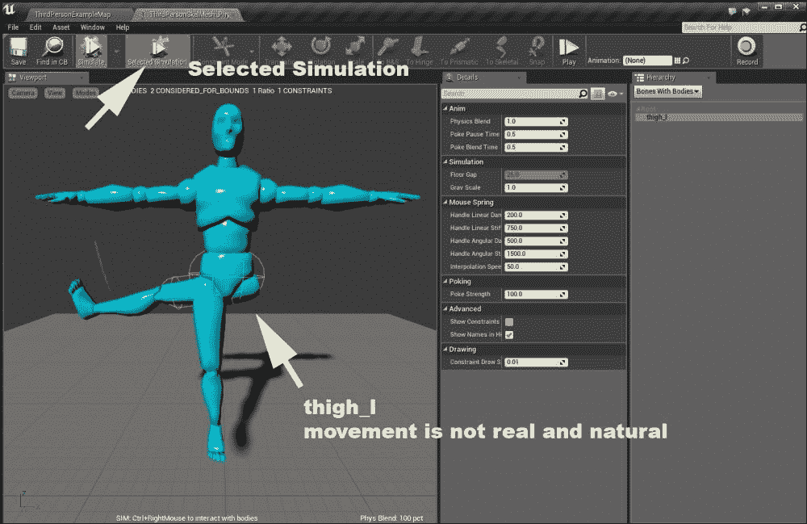

    1.  现在，我们想要修复这个问题，使其能够根据真实物理移动和工作。所以，停止模拟并点击**Hierarchy**中的**thigh_l**。在**Details**下，找到**Angular Limits**并更改选项，如下面的截图所示：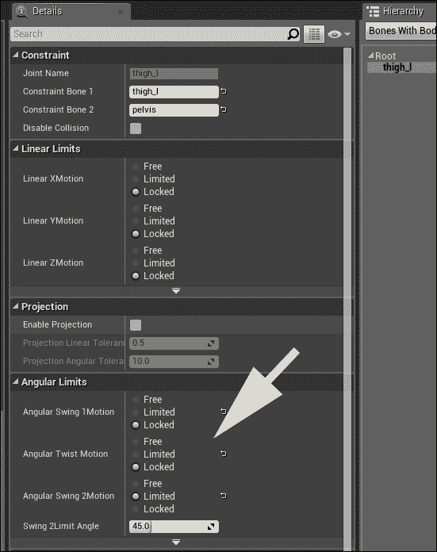

    1.  现在，更改你的相机视图，如下面的截图所示，然后在顶部点击**Rotation**。

    1.  一旦你选择了**Rotation**，你将看到围绕你的选择一个彩色的粗体弧形。使用这个来点击并旋转物理资产。同时，一个类似蓝色三角形的形状会出现。这表示你的骨骼可以活动和移动的最大范围。

    1.  点击你选择点周围的绿色粗体弧线，按*Alt* (*非常重要*)，并旋转该点使其指向地面，如下面的截图所示：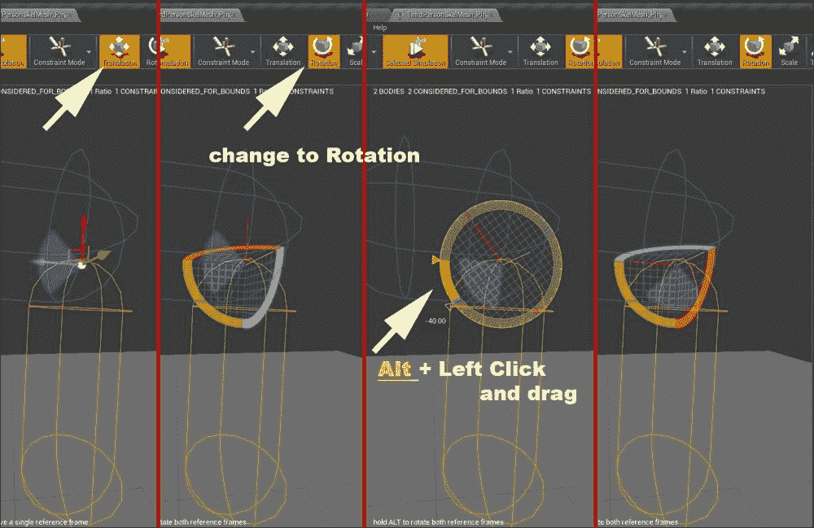

    1.  现在，点击**Simulate**并更改你的渲染选项，使其看起来类似于以下截图：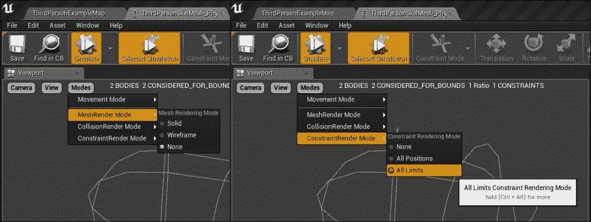

    1.  基本上，将**网格渲染模式**更改为**无**可以让你在测试期间看到主要物理资产的行为。此外，将**约束渲染模式**设置为**所有限制**可以让你观察那些由箭头指示的小小彩色线条的运动，如图所示。理解和控制这些线条是掌握网格上软物理资产的关键。它们的运动方式、覆盖的区域以及其他细节都位于**详细**部分。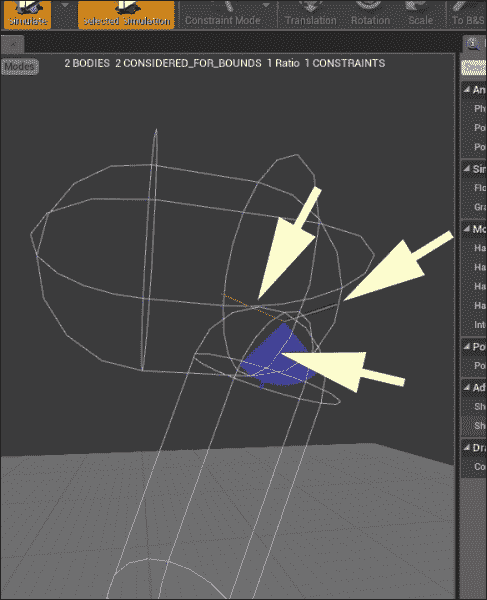

    1.  保持模拟模式，并移动对象几次。它从左向右移动，并始终保持在蓝色三角形形状的范围内。现在，停止模拟。在**详细**中，在**角度限制**内，将**Swing2Limit Angle**从`45`（当前值）更改为`12.0`，并再次运行模拟：

    1.  现在，运动变得更加紧凑。此外，蓝色三角形看起来更小。更改你的视图，然后将**网格渲染模式**更改为**实体**，如图所示。然后，检查左腿或**thigh_l**（在你的新物理资产下）的运动。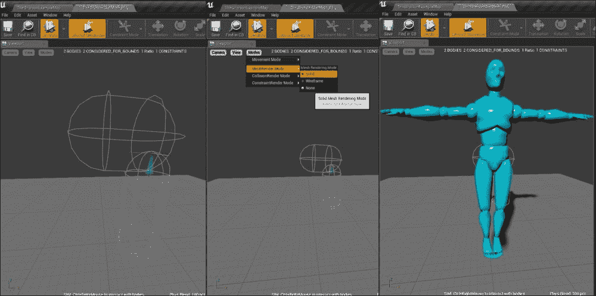

    1.  现在，将**Swing2Limit Angle**从`12`（当前值）更改为`45`，并再次运行模拟。

1.  在**层次结构**中，从顶部菜单切换到**所有骨骼**，然后切换到**身体模式**。最后，从骨骼列表中选择**thigh_r**，右键点击它，并选择**新建身体**。这是第二条腿。

    1.  在顶部切换到**约束模式**。与上一个骨骼类似，使旋转和细节看起来与以下截图相似。此外，从顶部菜单关闭**所选模拟**：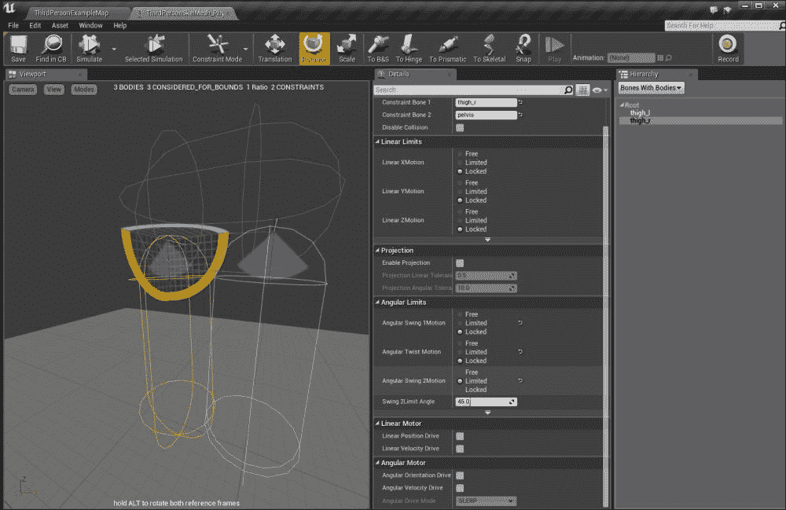

    1.  将**网格渲染模式**更改为**实体**，并检查在舞台上移动身体时的行为。腿部的移动比之前更自然，但也需要以不同的角度移动，如图所示：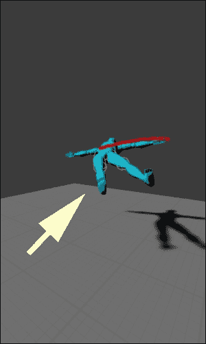

    1.  要应用更多细节，通过旋转和角度调整达到以下截图：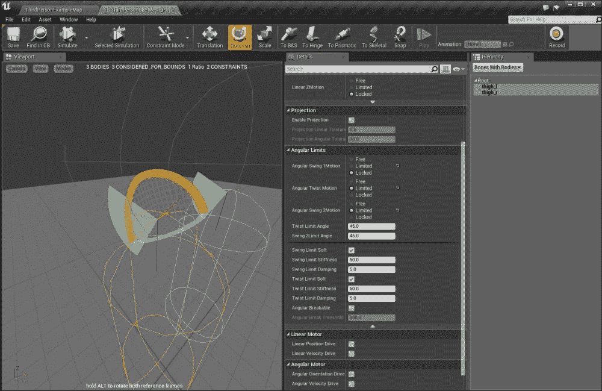

    1.  使用**spine_01**、**spine_02**和**spine_03**骨骼尝试相同的过程。然后，调整限制、角度，并专注于**clavicle_l**和**clavicle_r**。最后，处理**neck_01**和**head**。这样，你可以以正确组织的方式在身体上增长物理资产。你可以测试整体运动，当一切看起来都正常时，增加较小骨骼（如手指）的资产。

1.  随着你继续前进，你应该意识到在每个骨骼系列结束时需要执行一个修正。类似于手指、头部和脚趾，这仅仅与物理能量有关。当身体移动时，基于物理资产以及你如何编辑这些资产，身体会从一块骨头反射并引导到另一块骨头。如果当前骨头之后没有骨头，例如**头部**或手指的最后部分，在模拟和实际游戏中有时会在骨头上方产生不寻常的振动-like 运动。为了以受控的方式引导这种能量，在**身体模式**中点击骨头，在**细节**中展开**物理**部分，将**角阻尼**设置为`5`和**线性阻尼**设置为`1`，然后进行模拟。现在，检查你的运动并更改这些数字，直到问题得到解决。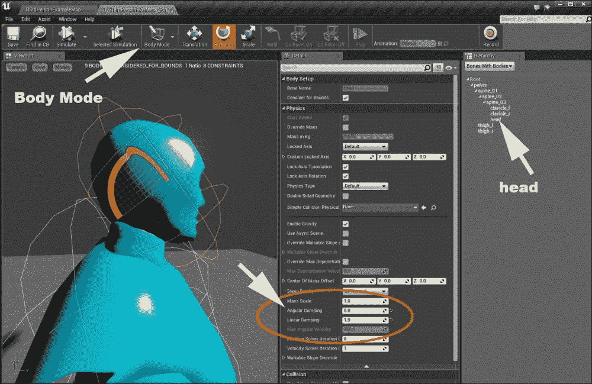

# 摘要

现在，你可以使用 PhAT 让你的角色移动和反映，这类似于现实世界。记住，在 PhAT 上工作就是将游戏故事呈现为角色行为。这是一门艺术，因为你在这一过程中花费的所有细节和时间都将直接被玩家（可能在玩游戏时反复数百次）监控和尝试。想象一个具有一些特殊行为（如移动、对墙壁、枪或火等物体的冲击）的角色，在现实世界中是很好的实践；然后，尝试使用虚幻引擎重新创建这种行为。这是一个具有许多细节的物理模拟，我们在本章中已经讨论过。作为一名游戏设计师，更多的实践将保证高质量的结果。

你可以从 3D 软件中导入带骨架的网格，并将相同的物理资产应用到它们上。网格应该以适当的方式带骨架，这与我们在本章中默认使用的类似。通过在 YouTube 上搜索 Unreal Engine 4 PhAT 来尝试在线资源。此外，如果你练习示例，你可以使用 Unreal Engine 3 和这个领域的教程资源。
