# 第七章：创建车辆蓝图

在本章中，我们将从头开始创建一个可工作的**车辆蓝图**，使用虚幻引擎 4 提供的默认资产以及**车辆游戏**项目示例，以及我们将自己创建的资产。首先，我们将从概述**车辆蓝图**将包含的内容开始，然后转到创建所有方面不同蓝图的具体方法。在概述之后，我们将涵盖以下主题：

+   创建车辆蓝图

+   编辑车辆蓝图

+   设置用户控制

+   测试车辆

本章将涵盖大量内容，让我们开始吧。

# 车辆蓝图 – 内容概述

在虚幻引擎 4 中的车辆包含多种不同类型的资产：

+   **骨骼网格**

+   **物理资产**

+   **动画蓝图**

+   **车辆蓝图**

+   一个或多个**车轮蓝图**

+   **轮胎类型数据资产**

让我们先创建必要的游戏项目，这样我们就可以默认访问**车辆骨骼网格**，而无需在第三方 3D 建模程序中创建自己的网格。为此，让我们打开 Epic Games 虚幻引擎启动器并导航到**学习**标签页。在这里，滚动到**示例游戏项目**部分并找到**车辆游戏**项目模板。选择此项目，然后选择**下载**选项：

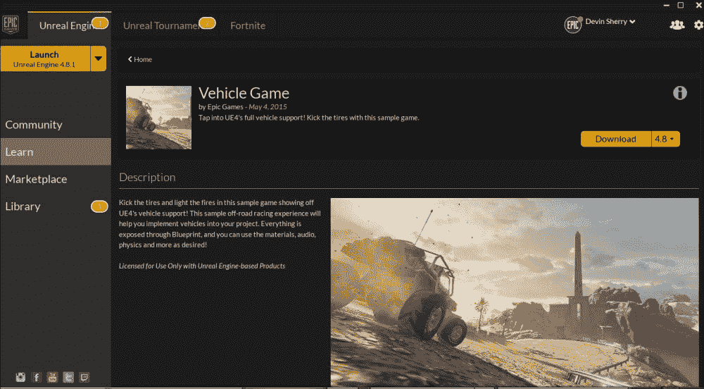

一旦成功下载，我们可以通过导航到虚幻引擎启动器的**库**标签页，滚动到页面底部的**保险库**部分，并选择**车辆游戏**的**创建项目**选项来创建项目：

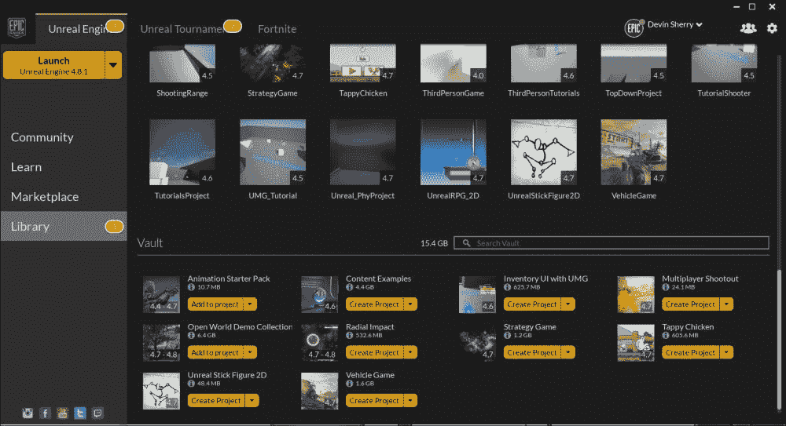

当我们选择**创建项目**选项时，它会要求我们输入项目的名称。让我们把这个项目命名为`Vehicle_PhyProject`。在虚幻引擎启动器为我们创建车辆项目之后，我们应该在我们的项目列表中看到它出现在**库**标签页的**我的项目**部分。现在，双击项目图像以打开此项目的虚幻引擎 4 编辑器。默认情况下，此项目包含创建一个可工作的**车辆蓝图**所需的所有资产，例如**骨骼网格**、**车轮蓝图**、**车辆动画蓝图**等等，但我们只会使用项目提供的**骨骼网格**，并且我们将从零开始逐步创建**车辆蓝图**的每个其他方面。

现在我们已经成功创建了**车辆游戏项目**，请随意探索其中的一些内容，并在**沙漠拉力赛**级别中玩游戏，看看我们这一章的最终结果会怎样。一旦我们对游戏项目感到满意，让我们首先在**内容浏览器**中创建一个新的文件夹，用于存放这一章的所有内容。首先，导航到**内容浏览器**，在浏览器的左上角突出显示内容层次结构中最顶部的**内容**文件夹。一旦突出显示，我们可以在**内容**文件夹上右键单击，选择**新建文件夹**选项，或者左键单击**添加新**下拉菜单并选择**新建文件夹**。将这个文件夹命名为`VehicleContent`。有了这个文件夹，我们现在将导航到**车辆**文件夹、**VH_Buggy**文件夹，然后是**网格**文件夹；这个文件夹包含我们开始这一课所需的**SK_Buggy_Vehicle Skeletal Mesh**。让我们左键单击并拖动**SK_Buggy_Vehicle**资产到我们的**VehicleContent**文件夹，并选择它以创建一个副本。将这个副本命名为`SK_Buggy_NewVehicle`。如果我们想创建自己的**骨骼网格**，以下是一些我们应该注意的事项。

创建合适的车辆所需的基本、最基本的艺术设置只是一个**骨骼网格**。车辆类型将决定我们需要多么复杂的艺术设置，并且可能需要对悬挂进行特殊考虑。例如，坦克不需要特殊的悬挂设置，而沙丘车（例如**车辆游戏**项目示例中的那种）将需要额外的关节来使暴露的部件以可信的方式移动。

我们在设置第三方艺术程序（如 3ds Max 或 Maya）中的车辆时需要了解的一些基本重要信息是，我们希望车辆网格指向正*X*方向。接下来，我们需要用厘米来测量我们车轮的半径，以便在虚幻引擎 4 中使用，因为我们之前在这本书中讨论过，虚幻引擎 4 使用厘米作为其度量单位，其中 1 **虚幻** **单位**（**uu**）等于 1 **厘米**（**cm**）。四轮车辆所需的**关节**的最小数量是 5:1 和 4 个车轮；这将根据车辆的车轮数量而变化（记住我们在第五章中讨论的内容，*物理阻尼、摩擦和物理体*）。车轮和根关节应与向前看的*X*方向和向上看的*Z*方向对齐。这样做将确保车轮将在*Y*轴上滚动并在*Z*轴上转向。所有其他关节可以按需排列，但应注意，例如，**动画蓝图**中的**Look At**节点假定*X*方向是向前。为了防止视觉上的不协调，我们的车轮关节应准确居中，如下面的截图所示：

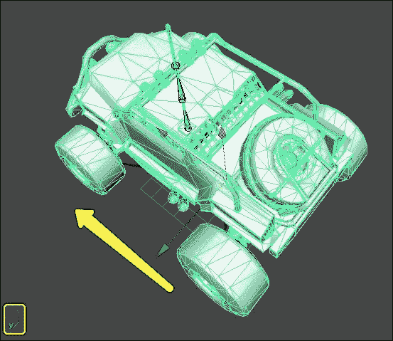

视觉网格将不会用于碰撞检测；然而，如果车轮网格偏离中心，看起来就像车轮坏了，并且由于运动模糊，这将会非常明显。

对于绑定目的，我们可以使用 Maya 的标准平滑绑定或 3ds Max 的皮肤修改器。车轮应该只在单个关节上有权重，这样它们可以自由旋转而不会出现奇异的变形。对于避震器和支撑杆，我们可以使用一些花哨的皮肤，但这将需要在虚幻引擎编辑器方面进行更多思考。

最后，当将资产导入虚幻引擎 4 时，车辆简单地以**骨骼网格**的形式导出，无需特殊考虑。

现在我们有了自己的**骨骼网格**车辆副本，我们可以通过在**VehicleContent**文件夹中的**SK_Buggy_NewVehicle**上右键单击，从下拉菜单中选择**创建**选项，然后选择**物理资产**来为这辆车创建**物理资产**。然后，将此资产命名为`PA_Buggy_NewVehicle`，并将所有设置选项保留为默认值，如下面的截图所示：

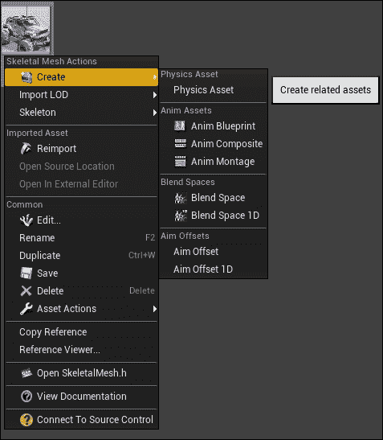

现在，双击新的**物理资产**，我们应该在**PhAT**中看到类似下面的截图：

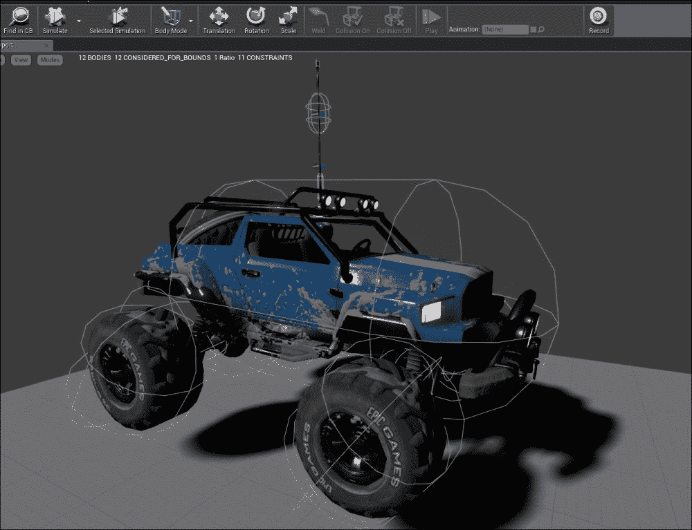

我们得到这个结果是因为 Unreal Engine 4 中的**Physics Asset Tool (PhAT)**试图尽可能好地包裹绑定到关节上的顶点。**PhAT**目前还没有有效处理所有**Physics Bodies**约束重建的方法，因此我们需要删除**Hierarchy**中所有现有的**Physics Bodies**，这样我们就可以从根关节开始构建它们。通过这样做，我们所有的约束都将被正确创建。

要这样做，导航到**Hierarchy**，按*Shift*键并左键点击所有选项，然后按*Delete*键；这将从资产中移除所有**Physics Bodies**：

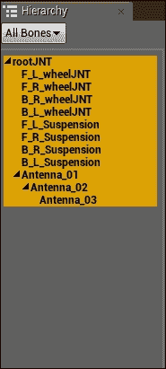

从根关节**rootJNT**开始：让我们在我们的车辆关节上创建**Physics Bodies**。请注意，我们只需要在需要物理模拟或影响车辆边界的关节上放置**Physics Body**。对于我们的车辆，根/主体使用盒子形状，每个轮子使用球体形状将非常适合我们，但我们将添加额外的**Physics Bodies**以获得我们想要的其他车辆部分（如天线）的行为。

对于我们的**Buggy Vehicle**，我们将总共拥有 10 个**Physics Bodies**。最终结果应该类似于以下图像：

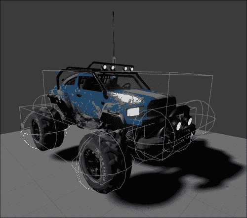

要完成这个任务，我们首先需要创建一个包围**Buggy Vehicle**主体的大边界框。从右侧的**Hierarchy**面板中选择**rootJNT**选项，然后右键点击并选择**Add Box**选项。确保使用**Translation**和**Scale**工具来调整**Physics Body**框的形状，使其尽可能匹配车辆的形状。接下来，让我们导航到**Details**面板的**Collision**部分，并确保**Simulation Generates Hit Events**设置为`True`。最后，在新创建的框的**Details**面板中，**Physics Body**，确保**Physics Type**设置为`Default`。

现在，让我们为我们的车辆的四轮创建**Physics Bodies**。每个**Physics Body**将具有相同的大小和形状，并具有与之相关的相同属性。让我们从**Hierarchy**面板中选择**F_L_wheelJNT**，右键点击此选项，并选择**Add Sphere**选项。使用**Scale**和**Translation**工具将球形**Physics Body**定位在车辆的前左轮周围，并将其**Physics Type**更改为**Kinematic**。按照此过程为剩余的三个轮子执行：**F_R_wheelJNT**、**B_R_wheelJNT**和**B_K_wheelJNT**。最后，让我们为四个轮子中的每一个导航到**Details**面板的**Collision**部分，并确保**Simulation Generates Hit Events**设置为`True`。

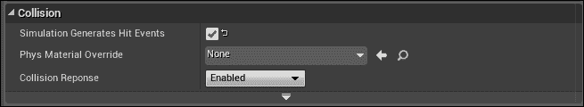

接下来，让我们通过在**rootJNT**上右键单击并选择**添加 Sphyl**选项来创建车辆的正面和背面保险杠的**物理体**，这将创建一个胶囊形状的**物理体**。使用**缩放**和**平移**工具将此**物理体**定位在车辆的前保险杠周围，并将其**物理类型**设置为`默认`。同样地为车辆的背面保险杠重复此过程。最后，让我们导航到两个的**细节**选项的**碰撞**部分。确保**模拟生成碰撞事件**设置为`True`。

在我们创建天线**物理体**之前，让我们首先为越野车的左右悬挂创建两个盒子形状。在**层次**面板的右侧选择**rootJNT**骨骼关节，右键单击并选择**添加盒子**选项。最后，让我们导航到**细节**面板的**碰撞**部分，并确保**模拟生成碰撞事件**设置为`True`。然后，盒子的缩放和位置应类似于以下截图：

现在，创建一个额外的**盒子物理体**，并对其进行形状和变换，使其覆盖越野车悬挂的另一侧。然后，将它们的**物理类型**参数都设置为`默认`。接下来，让我们导航到**细节**面板的**碰撞**部分，并确保**模拟生成碰撞事件**设置为`True`。

最后，让我们设置我们车辆天线的**物理体**，以便在我们在车内移动时模拟一个响应式的天线。为此，从**层次**面板中选择**Antenna_01**选项，右键单击它，并选择**添加 Sphyl**选项。接下来，将**物理类型**设置为`默认`，并在**细节**面板中为我们的天线**物理体**设置以下参数：

+   **质量比例**: 将此参数设置为 `0.01`

+   **角阻尼**: 将此参数设置为 `10.0`

+   **线性阻尼**: 将此参数设置为 `3.0`

为了完成我们天线**物理体**的设置，请确保在**层次**面板中选择了**Antenna_01**关节。然后，从**体模式**下拉菜单中选择**约束模式**：

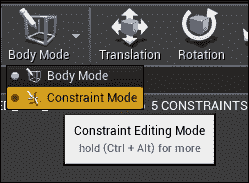

在**约束模式**下，并且选择了**Antenna_01**关节时，在**细节面板**中设置以下参数：

+   **角摆动 1 运动**: 将此参数设置为 `Limited`

+   **角扭曲运动**: 将此参数设置为 `Locked`

+   **角摆动 2 运动**: 将此参数设置为 `Limited`

+   **摆动 1 限制** **角度**: 将此参数设置为 `1.0`

+   **摆动 2 限制角度**: 将此参数设置为 `1.0`

+   **摆动限制刚度**: 将此参数设置为 `500.0`

+   **摆动限制阻尼**: 将此参数设置为 `50.0`

在这些更改到位后，让我们回到**车身模式**，从**层次结构**面板中选择**rootJNT**，然后选择**所选模拟**选项，并选择**模拟**来查看我们的**物理体**如何受到模拟重力的作用：

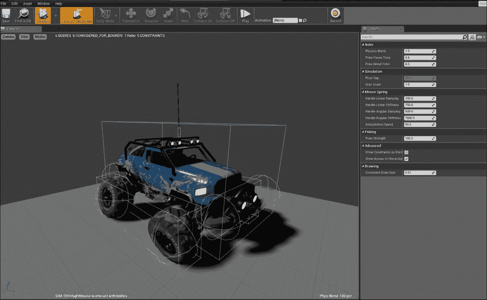

我们可以看到，车轮以奇怪的方式旋转，这在赛车游戏的工作车辆背景下并不太合理，但当我们为车辆创建蓝图时，我们会改变这种行为。

# 车辆蓝图 - 概述部分

在本节中，我们讨论了构成一个工作**车辆蓝图**的必要组件，并查看了我们车辆创建**物理体**的必要细节。最后，我们使用 Unreal Engine 4 中的**PhAT**重新创建了**越野车**的必要**物理体**组件，为车辆建立了一个工作的**物理体**。现在，我们已经从默认创建的**骨骼网格**中创建了**物理资产**，我们可以继续工作，创建**车辆蓝图**。

# 创建车辆蓝图

要创建一个新的**车辆蓝图**，让我们首先导航到**内容浏览器**中的**VehicleContent**文件夹，然后在一个空白区域右键单击。从上下文菜单中，我们将选择**蓝图类**选项，点击**所有类**下拉菜单，搜索**WheeledVehicle Pawn**类，并将此蓝图命名为`BP_NewVehicle`。

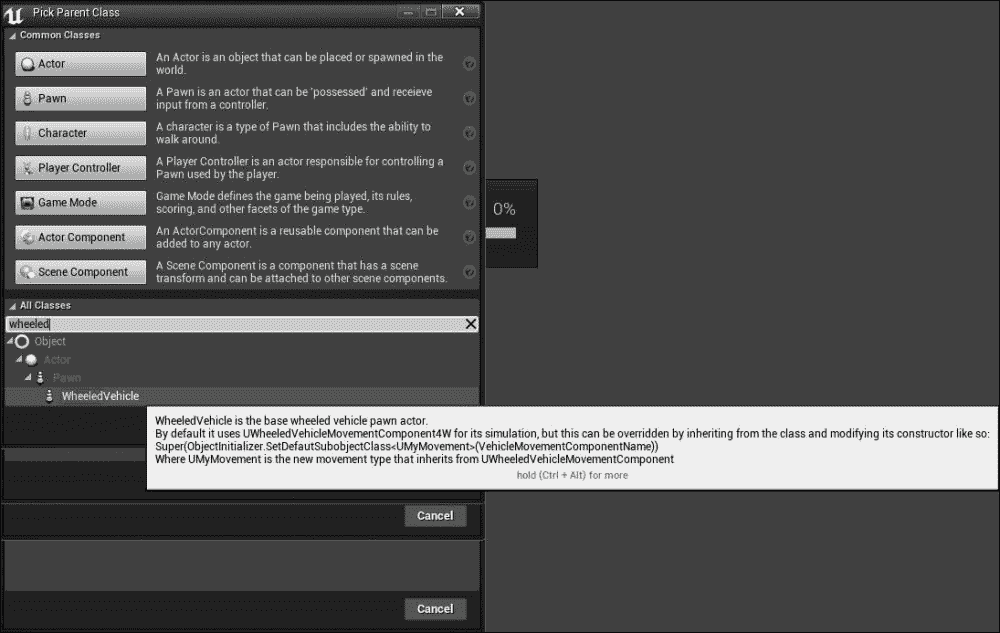

**WheeledVehicle Pawn**蓝图包含一个继承的组件，称为**VehicleMovement**。此组件允许您对车轮和车辆的整体行为有更多的控制。

接下来，我们需要为我们的车辆创建两种不同类型的**车轮蓝图**（一个用于前轮，一个用于后轮）。为了开始这个过程，让我们导航到**内容浏览器**中的**VehicleContent**文件夹，在**内容浏览器**的一个空白区域右键单击，并选择**蓝图类**选项。现在，在上下文相关下拉菜单中，输入`Vehicle Wheel`以定位**VehicleWheel 蓝图对象**类。我们将创建两个不同的**VehicleWheel 蓝图**类（一个命名为`BP_FrontWheel`，另一个命名为`BP_BackWheel`）。

在大多数情况下，我们希望至少有两种车轮类型：也就是说，一种受转向影响的车轮类型，另一种受车辆手刹影响的车轮类型。此外，我们可以设置不同的半径、质量、宽度、手刹效果、悬挂以及许多其他属性，以赋予我们的车辆所需的操控性。

现在，我们可以继续创建我们需要的**TireType**数据资产，用于我们的**VehicleWheel**蓝图。要在**内容浏览器**中创建新的**TireType**数据资产，我们需要在**VehicleContent**文件夹的空白区域右键单击，选择**杂项**选项，然后从出现的上下文相关下拉菜单中选择**TireType**选项：

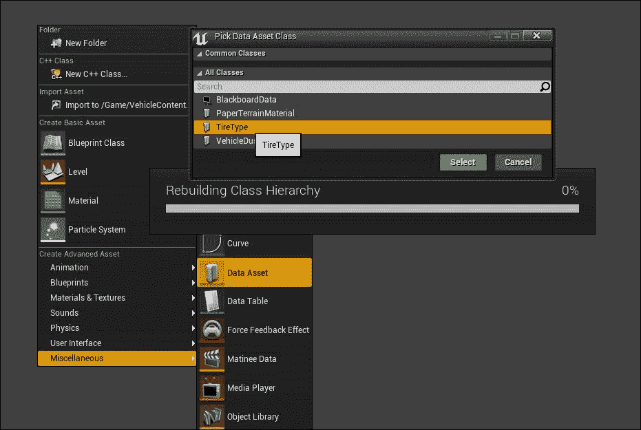

让我们把这个资产命名为`DA_TireType`，然后右键单击该资产以打开**通用资产编辑器**。**TireType**数据资产只有一个单一值：**摩擦系数**。这个值不仅影响车轮的原始摩擦力，还根据车轮在急转弯时滑动难度或容易程度来缩放值。在**VehicleWheel**蓝图中有**TireType**数据资产的属性槽，我们将在需要时使用它。

最后，我们必须创建**动画**蓝图。我们将使用它来动画化我们的**越野车**。为此，导航到**内容浏览器**，然后转到**VehicleContent**文件夹。现在，在空白区域右键单击，从下拉菜单中选择**动画**选项，然后选择**动画蓝图**：

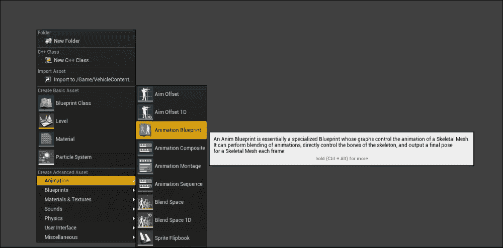

当我们首次创建**动画蓝图**时，它会要求我们选择要使用的**目标骨骼**；我们将从**目标骨骼**下拉列表中选择**SK_Buggy_Vehicle_Skeleton**选项。我们还想要确保从**父****类**上下文相关下拉列表中选择**VehicleAnimInstance**选项，并将此动画蓝图命名为`BP_VehicleAnimation`。在我们继续讨论如何编辑我们创建的不同蓝图和数据资产以完成我们的车辆之前，让我们简要讨论一下动画蓝图是什么。

**动画蓝图**是一种特殊的蓝图，其中包含用于控制骨骼网格动画的图表。它可以执行动画混合，直接控制骨骼中的骨骼，并在每一帧输出我们骨骼网格的最终姿态。**控制器**根据玩家输入或基于游戏玩法做出的决策来指导兵或角色移动。每个兵都有一个**骨骼网格**组件，该组件引用用于动画的**骨骼网格**，并有一个**动画蓝图**的实例。

通过使用其两个图，**动画蓝图**可以访问拥有者的属性，计算用于混合、状态转换或驾驶**动画蒙太奇**的值，并可以根据动画序列的混合和从**骨骼控制**的直接变换来计算骨骼网格的当前姿态。当我们处理动画蓝图时，我们必须记住有两个主要组件相互关联以创建每帧的最终动画。一个是我们可以从其他蓝图识别出的**事件图**。它负责更新可以在**动画图**中使用的值，以驱动**状态机**、**混合空间**或其他允许你在多个动画序列或姿态之间混合的节点，从而实现动态驱动的动画效果。

每个**动画蓝图**中都有一个**事件图**，它使用一组特殊的基于动画的事件来启动一系列动作。**事件图**最常见的使用是更新**混合空间**和其他混合节点使用的值，以驱动**动画图**中的动画。

**动画图**用于评估当前帧骨骼网格的最终姿态。默认情况下，每个**动画蓝图**都有一个**动画图**。此图可以包含放置其中的动画节点，用于采样动画序列、执行动画混合或使用**骨骼控制**来控制骨骼变换。然后，将得到的姿态应用于游戏中每一帧的**骨骼网格**。

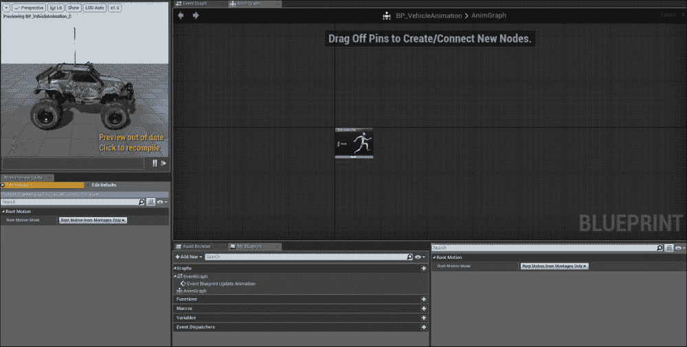

# 创建车辆蓝图 – 一节回顾

在本节中，我们探讨了必要的蓝图和数据资产。我们将继续编辑它们的属性，以获得我们为工作**越野车**所需的**行为**。首先，我们创建了**WheeledVehicle**蓝图。这是我们的车辆的主要蓝图。然后，我们创建了两种类型的**轮蓝图**（一个用于我们的前轮，另一个用于我们的后轮）。此外，我们创建了**TireType**数据资产。这是控制我们车轮的**摩擦**属性所必需的。最后，我们为**越野车**骨骼网格创建了动画蓝图，并详细讨论了**动画蓝图**及其功能。现在我们已经为我们的车辆创建了必要的蓝图和数据资产，我们可以继续编辑这些资产的属性。

# 编辑车辆蓝图

在创建了车辆蓝图之后，我们现在继续并编辑这些蓝图的属性，以便获得我们想要的车辆行为。我们将通过双击**Content Browser**并打开其**Anim Graph**来开始与**BP_VehicleAnimation**蓝图一起工作；它默认打开。我们将创建的第一个节点是**Mesh Space Ref Pose**节点，它用于返回**Animation Blueprint**中骨骼网格的网格空间参考姿态。要创建此节点，在**Anim Graph**上的空白区域右键单击。现在，从上下文菜单中，我们将搜索**Mesh Space Ref Pose**节点：

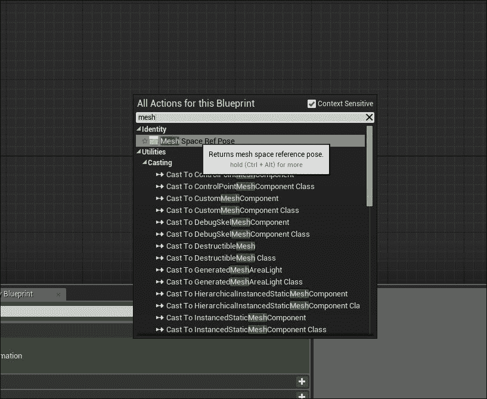

接下来，我们需要一个**Wheel Handler**节点。这个节点用于根据**Wheeled Vehicle**蓝图中的设置更改车轮变换；请注意，这仅在拥有**Wheeled Vehicle**类的所有者时才会生效。**Wheel Handler**节点还处理车轮的动画需求，例如旋转、转向、手刹和悬挂。不需要额外的设置；此节点从车轮获取所有必要的信息，并将其转换为与车轮关联的骨骼上的动画。要在我们的**Vehicle Animation**蓝图中的**Anim Graph**中创建**Wheel Handler**节点，我们需要在图上的空白区域右键单击。然后，从上下文菜单中，我们可以搜索**Wheel Handler**。最后，我们可以将**Mesh Space Ref Pose**节点的**Component Pose**输出连接到**Wheel Handler**的**Component Pose**输入，如图下截图所示：

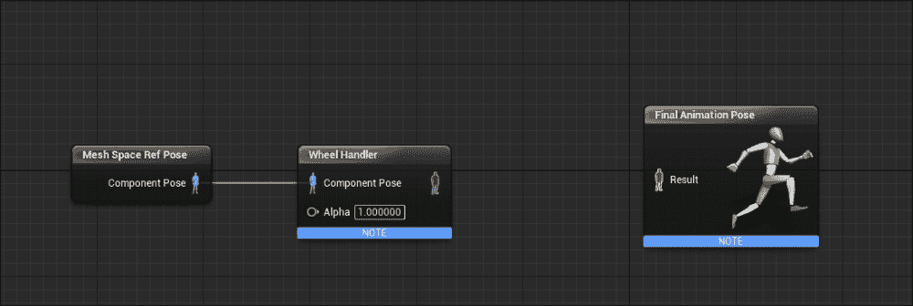

除非我们还需要额外的支撑或其他悬挂需求，否则我们会将**Wheeler Handler**节点的**Component Pose**输出连接到**Final Animation Pose**的**Result**输出节点；如果我们这样做，将在**Wheel Handler**和**Final Animation Pose**节点之间自动生成一个**Component to Local**节点，以便它可以将**Component Space Pose**转换为**Local Space Pose**。由于我们的**Vehicle Physics Asset**和**Vehicle Skeletal Mesh**包含车辆悬挂的骨骼，我们将需要创建额外的节点来处理影响悬挂多边形的关节。为此，从**Wheel Handler**节点的输出拉出，并使用上下文相关下拉菜单；我们将搜索**Look At**节点。在**Look At**节点的**Skeletal Control**部分下的**Details**面板中，我们将想要编辑**Bone to Modify**和**Look at Bone**属性，以便我们可以修改我们车辆骨骼网格上的四个骨骼，并且让**Look at Bone**观察我们的车轮关节。让我们创建四个不同的**Look At**节点，并为每个**Bone to Modify**和**Look at Bone**设置设置单独的属性：

1.  第一个节点：

    +   **要修改的骨骼**: 选择此属性为`F_L_Suspension`

    +   **看向骨骼**: 选择此属性为`F_L_wheelJNT`

1.  第二个节点：

    +   **要修改的骨骼**: 选择此属性为`F_R_Suspension`

    +   **看向骨骼**: 选择此属性为`F_R_wheelJNT`

1.  第三个节点：

    +   **要修改的骨骼**: 选择此属性为`B_R_Suspension`

    +   **看向骨骼**: 选择此属性为`B_R_wheelJNT`

1.  第四个节点：

    +   **要修改的骨骼**: 选择此属性为`B_L_Suspension`

    +   **看向骨骼**: 选择此属性为`B_L_wheelJNT`

在放置了四个**看向**节点后，我们现在可以将最后一个**看向**节点的输出连接到**最终动画姿态**节点的**结果**输入节点。我们的最终**车辆动画**蓝图应类似于以下截图：

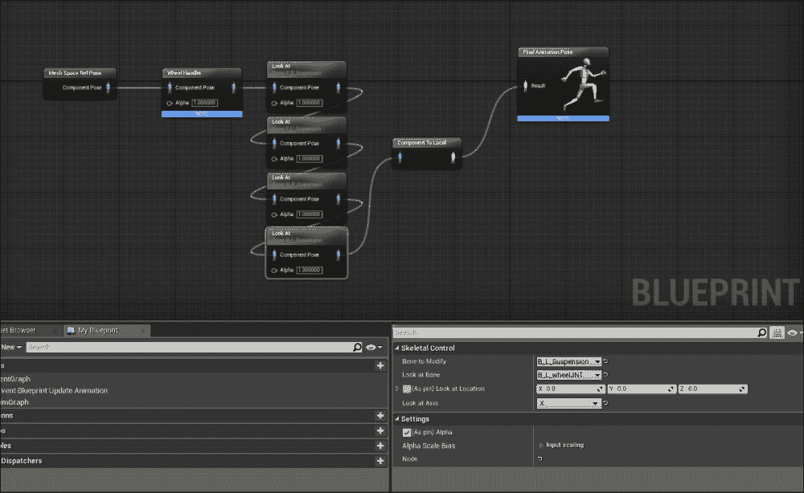

在这些节点就位后，我们就完成了**车辆动画**蓝图。现在我们可以继续前进并编辑我们的**轮胎**数据资产。

与我们之前讨论的类似，**轮胎**数据资产只有一个属性值可以编辑：**摩擦比例**。让我们导航回**内容浏览器**到我们的**VehicleContent**文件夹。现在，我们双击**DA_Tire Tire Type**资产。在**通用资产编辑器**中，我们将**摩擦比例**属性从默认值`1.0`更改为新值`2.0`：

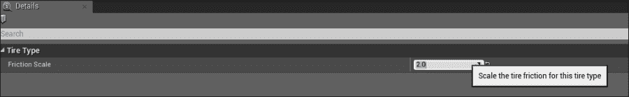

在我们的**轮胎**数据资产中的此更改到位后，我们现在可以继续前进并编辑我们的**车轮**蓝图。导航回**内容浏览器**到我们的**VehicleContent**文件夹，以便我们可以双击我们的**BP_BackWheel**蓝图并编辑其属性。如前所述，前轮和后轮的属性会有所不同，因为前轮将负责转向，而后轮将负责响应手刹。

我们需要最初设置的属性如下：

+   **形状半径**: 此属性确定用于车辆轮胎的形状半径。

+   **形状宽度**: 此属性确定用于车辆轮胎的形状宽度。

+   **受手刹影响**: 此属性确定车轮是否受玩家用于停止车辆的**手刹**影响。此参数通常仅用于后轮，不用于前轮。

+   **转向角度**: 这指定了车轮在正负方向上可以旋转的最大角度，即向左和向右转向。

+   **轮胎类型**: 此属性确定车轮将用于其**摩擦比例**属性的**TireType**数据资产。

**形状半径**和**形状宽度**属性由车轮的大小决定，在这个特定案例中，这些是我们车辆的后轮，因此对于这些设置，让我们设置以下参数：

+   **形状半径**: 将此参数设置为`57.0`

+   **形状宽度**: 将此参数设置为`30.0`

再次提醒，这些值将根据使用的车辆和车轮的大小而变化。接下来，我们需要更改**Steer Angle**属性的值。由于我们将使用**BP_BackWheel Wheel**蓝图，后轮不会控制转向；我们将**Steer Angle**属性从其默认值`70.0`更改为`0.0`。

接下来，我们需要确保**BP_BackWheel Wheel**蓝图中的**Affected by Handbrake**属性设置为`True`，这样当玩家使用车辆的刹车来减速并使其停止时，这些车轮才会受到影响。最后，我们需要从下拉菜单中将**Tire Type**从其默认值`DefaultTireType`更改为`DA_Tire`，以便我们的**BP_BackWheel**使用此**Tire Type**。

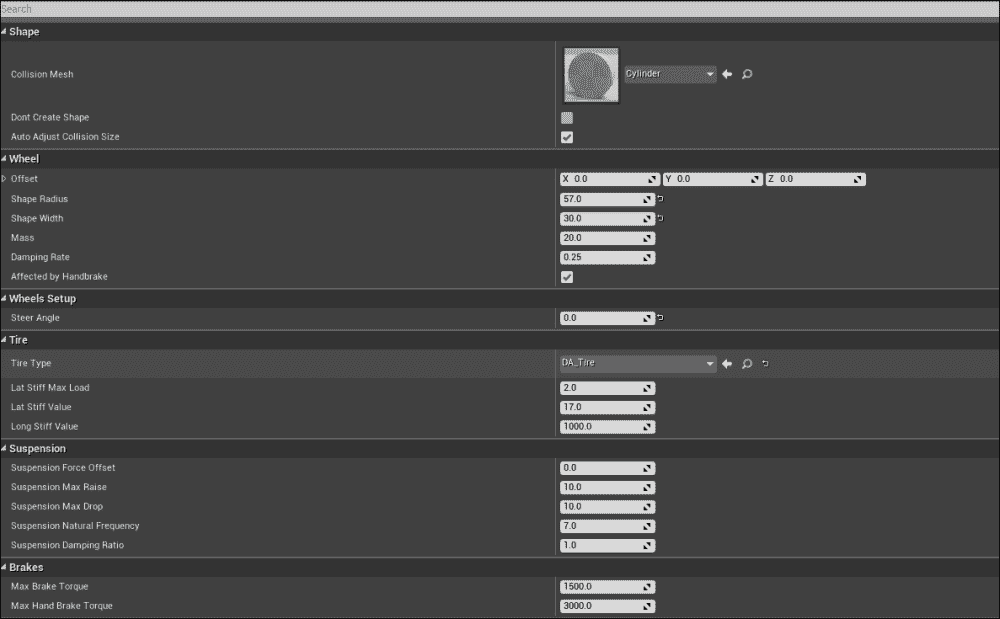

现在我们已经完成了**BP_BackWheel**蓝图，让我们导航回**Content Browser**和我们的**VehicleContent**文件夹，然后双击并打开**BP_FrontWheel**蓝图。如果我们查看我们车辆的骨骼网格，我们会看到后轮略大于前轮；当你设置**BP_FrontWheel**蓝图的**Shape Radius**和**Shape Width**参数的值时，这将很重要。为**Shape Radius**和**Shape Width**属性设置以下值：

+   **Shape Radius**：将此参数设置为`52.0`

+   **Shape Width**：将此参数设置为`23.0`

我们可以看到，形状半径比**BP_BackWheel**值小 5 个单位，形状宽度只小 7.0 个单位；这是两种类型车轮之间的**Unreal Units**（**uu**）差异。

由于我们将使用**BP_FrontWheel**蓝图，我们希望取消选中**Affected by Handbrake**属性，使其为`False`，因为我们的车辆的前轮不应对手刹有任何反应。在我们设置**Steer Angle**参数之前，我们必须理解这个角度是车轮在正负方向上可以旋转的最大角度，即向左和向右转动。对于我们的**Buggy Vehicle**，任何在`50`到`60`之间的值都最佳，但为了测试目的提供一个值，让我们将**Steering Angle**值设置为`55`。

最后但同样重要的是，让我们确保**TireType**参数正在使用我们的**DA_Tire**数据资产。

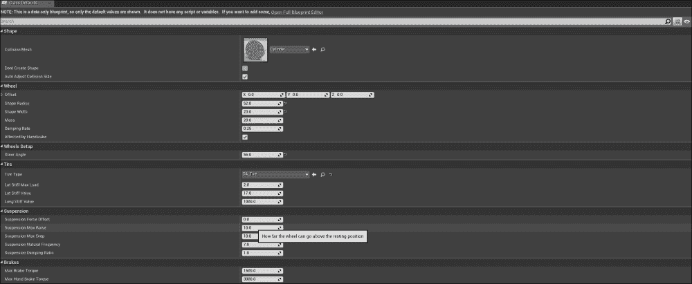

在我们继续编辑**BP_NewVehicle Vehicle**蓝图之前，让我们在这里花些时间简要定义一些我们没有编辑的**Wheel**蓝图参数，以便我们更好地理解**Wheel**蓝图的总体功能。以下是我们可以操纵的**Wheel**蓝图附加属性，以进行进一步定制：

+   **横向刚度最大载荷**：这是最大标准化轮胎载荷，在此载荷下，轮胎无法提供更多的横向（侧向）刚度，无论施加多少额外的载荷到轮胎上。

+   **横向刚度值**：这决定了可以给予横向滑移多少横向刚度。

+   **纵向刚度值**：这决定了可以给予纵向滑移多少纵向刚度。

+   **悬挂力偏移**：这是悬挂力作用在车辆质心垂直偏移的位置。

+   **悬挂最大提升**：此值决定了车轮可以高于其静止位置多远。

+   **悬挂最大下降**：此值决定了车轮可以低于其静止位置多远。

+   **悬挂自然频率**：这决定了悬挂的振荡频率；大多数汽车的值在`5`到`10`之间。

+   **悬挂阻尼比**：此值是车辆弹簧能量耗散的速率。大多数汽车的值在`0.8`到`1.2`之间；小于`1`的值更迟钝，而大于`1`的值更易抽搐。

+   **最大制动力矩**：这设置了我们车辆的制动力矩最大值，单位为牛顿米（Nm）。

+   **最大手刹制动力矩**：此属性设置了此车轮的最大手刹制动力矩，单位为 Nm。手刹应该比制动器具有更强的制动力矩。对于不受手刹影响的车轮，此值将被忽略。

现在我们对**车轮蓝图**有了更好的理解，让我们继续到我们的**车辆蓝图**。导航回**内容浏览器**到我们的**VehicleContent**文件夹。双击**BP_NewVehicle**，并从蓝图左上角的**组件**选项卡中选择**网格（继承）**组件时，关注**详细信息**面板。请注意，在查看蓝图中的**视口**、**构造脚本**和**事件图**选项卡之前，我们需要点击**打开完整**蓝图编辑器。

我们首先将要做的是在**组件**选项卡中选择**网格（继承）**组件。然后，在其**详细信息**面板中，我们将更改**动画蓝图生成类**属性和**骨骼网格**属性。对于**动画蓝图生成类**属性，我们希望确保从上下文相关的下拉菜单中选择我们的`BP_VehicleAnimation`蓝图；我们这样做是因为我们希望我们的车辆使用我们之前设置的动画蓝图。对于**骨骼网格**属性，我们将使用在**VehicleContent**文件夹中复制的`SK_Buggy_NewVehicle`骨骼网格。有了这些属性，我们现在可以编辑**车辆运动（继承）**组件的参数，我们将在此处实现车辆的**车轮蓝图**。

从**组件**选项卡中选择**VehicleMovement (Inherited)**组件。然后，在其**细节**面板中，让我们找到**轮子设置**参数，在那里我们可以为车辆中的每个单独的轮子设置我们想要使用的**轮子类别**和**骨骼名称**。在**轮子设置**部分，为四个轮子设置以下参数：

1.  **轮子 0**:

    +   **轮子类别**：将此参数设置为`BP_FrontWheel`

    +   **骨骼名称**：将此参数设置为`F_L_wheelJNT`

1.  **轮子 1**:

    +   **轮子类别**：将此参数设置为`BP_FrontWheel`

    +   **骨骼名称**：将此参数设置为`F_R_wheelJNT`

1.  **轮子 2**:

    +   **轮子类别**：将此参数设置为`BP_BackWheel`

    +   **骨骼名称**：将此参数设置为`B_L_wheelJNT`

1.  **轮子 3**:

    +   **轮子类别**：将此参数设置为`BP_BackWheel`

    +   **骨骼名称**：将此参数设置为`B_R_wheelJNT`

    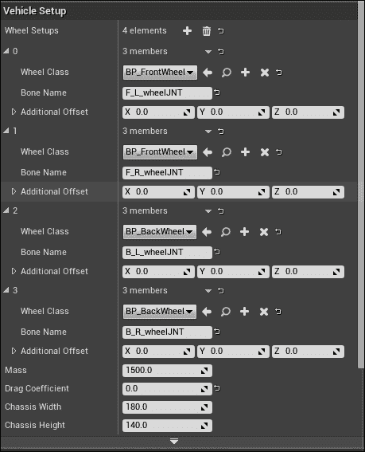

请记住，当我们使用独特的骨骼网格时，**骨骼名称**属性将根据它们的命名方式而有所不同。我们还可以通过点击**轮子设置**选项旁边的**+**号来向车辆设置中添加更多轮子。

对于这个**车辆蓝图**，我们最后需要做的是实现一个位于车辆后方和略微上方的第三人称视角相机位置。要创建一个**相机**组件，我们需要导航到**组件**选项卡。从**添加组件**选项，我们可以搜索**相机**组件。将此组件命名为`VehicleCamera`，并设置其位置和旋转值如下：

+   **位置**:

    +   **X**：将值设置为`-490.0`

    +   **Y**：将值设置为`0.0`

    +   **Z**：将值设置为`310.0`

+   **旋转**:

    +   **滚动（X）**：将值设置为`0.0`

    +   **俯仰（Y）**：将值设置为`-10.0`

    +   **偏航（Z）**：将值设置为`0.0`

最后，我们想要确保**车辆相机**组件的**细节**面板中的**使用 Pawn 控制旋转**选项未选中，以便将其设置为`False`。有了这些参数，我们现在可以开始设置我们的**用户控制**，以便我们可以开始测试我们的**车辆蓝图**。

# 编辑车辆蓝图 – 一节回顾

在本节中，我们为所有车辆蓝图设置了基本功能。首先，我们在**Vehicle**动画蓝图上添加了功能，通过创建一个**Mesh Space Ref Pose**节点，将其连接到一个**Wheel Handler**节点，并为每个连接到我们车辆的**Suspension Bones**实现了四个不同的**Look At**节点。接下来，我们为**Tire Type**数据资产设置了**Friction Scale**值。然后，我们设置了两个不同的**Wheel Blueprints**所需的参数，以便我们获得前后轮的适当行为。最后，我们通过应用必要的骨骼网格和车辆蓝图，为**Vehicle Blueprint**设置了参数。我们还花时间实现了两个**Wheel Blueprints**，并将它们与车辆骨骼网格的四个车轮骨骼关联起来。有了这些蓝图，我们现在可以实施车辆的用户控制，以便玩家实际上可以在游戏环境中驾驶车辆。

# 设置用户控制

当我们使用**Vehicle Game**项目示例时，已经有默认的**User Inputs**就位，允许你在游戏中控制车辆，但我们将查看输入设置，以便我们更好地理解它们。要查看当前输入控制，让我们通过首先左键单击**Edit**下拉菜单并选择**Project Settings**来导航到**Project Settings**；确保你在一个蓝图或级别中，以便获得**Edit**选项：

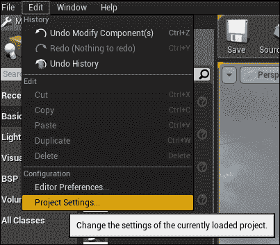

从**Project Settings**，导航到**Engine**部分的**Input**选项，以便我们能够访问控制器的**Action Mappings**和**Axis Mappings**。默认情况下，我们已经有**MoveForward**映射和**MoveRight**映射就位，它们使用键盘键和游戏手柄按钮的组合；对于我们的目的，我们只需要使用其中的一些按钮。让我们展开**Axis Mappings**下拉列表，首先查看**MoveForward**选项；我们将看到多个用于使我们的车辆前进的按钮，例如*W*、*S*、上和下键等。我们将移除所有选项，除了*W*和*S*键，以确保我们没有不必要的键绑定；为此，只需点击每个选项旁边的**X**按钮即可移除它。我们还会在每个键绑定旁边看到一个**Scale**值：`1`和`-1`。这指的是**MoveForward**控制将实际移动玩家或车辆前进或后退的方向；同样的概念也适用于**MoveRight**选项。让我们展开**MoveRight Axis**映射，并移除所有键绑定，除了*A*和*D*键。

我们在这里最后想做的事情是评估**手刹动作映射**。默认情况下，我们有多个键绑定，但我们要移除所有这些绑定，除了**空格键**选项：

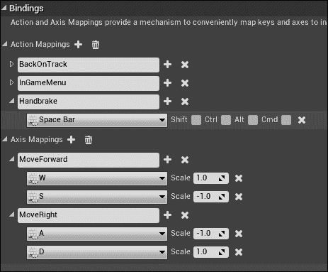

在我们继续之前，让我们简要讨论一下**动作映射**和**轴映射**之间的区别：

+   **动作映射**：这些映射用于按键和释放，例如按下和释放*空格键*

+   **轴映射**：这些映射允许具有连续范围和方向的输入

总体而言，**动作**和**轴映射**提供了一种机制，通过在输入行为和触发它的键或游戏手柄按钮之间插入一层间接性，来轻松地将键和轴映射到输入行为。

最后一步是为我们创建一个**游戏模式**蓝图，这样当我们编辑器内游玩时，我们能够驾驶我们的车辆。让我们导航回**内容浏览器**和我们的**VehicleContent**文件夹，以便我们可以创建**游戏模式**蓝图。一旦进入**VehicleContent**文件夹，让我们在**Content**文件夹的一个空白区域右键点击，选择**蓝图类**选项。然后，从**常用类**中选择**游戏模式**选项，并将这个新蓝图命名为`BP_VehicleGameMode`。现在，双击这个新蓝图，在**详情**面板下，我们将找到标记为**类**的部分。我们将把**默认 Pawn**类从`DefaultPawn`改为`BP_NewVehicle`。这确保了当我们玩游戏时，默认情况下，它将使用我们的**BP_NewVehicle Pawn**类。

我们最后需要做的是通过导航回**项目设置**并将这个新的**BP_VehicleGameMode**应用到我们的**项目设置**中。在**项目**部分，我们将找到**地图和模式**选项。在这里，我们可以通过展开**默认模式**部分来应用**BP_VehicleGameMode**。现在，从**默认游戏模式**下拉列表中，我们可以选择`BP_VehicleGameMode`选项。为了将来参考，当我们创建关卡时，我们可以在主**关卡编辑器**中导航到**设置**选项并选择**世界设置**。这允许你在屏幕右侧的**详情**面板旁边查看你的**世界设置**。在**世界设置**中，我们将找到**游戏模式**部分。在这里，我们可以看到**游戏模式覆盖**参数并选择**BP_VehicleGameMode**。有了这个设置，我们可以在游戏中玩耍并看到我们的车辆在行动，但我们会发现当我们按下*W*、*A*、*S*和*D*键时，我们无法移动我们的车辆。

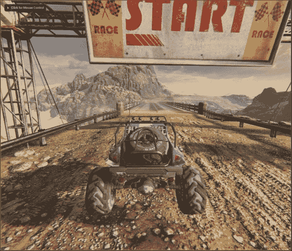

我们现在可以继续并添加我们的**BP_NewVehicle**中的输入动作事件，这样我们就能四处移动并控制我们的车辆。

# 设置用户控件 - 章节回顾

在本节中，我们创建了**轴映射**，以便车辆能够获得前进/后退和左右移动的能力。我们还通过**项目设置**中的**动作映射**实现了使用手刹的功能。最后，我们创建了一个新的**游戏模式**蓝图，并在我们的关卡**项目**和**世界设置**中实现了**游戏模式**。有了这些，我们可以继续添加行为到我们的**BP_NewVehicle 事件图**。这允许你控制你的车辆。

# 编写移动行为脚本

在我们的车辆可以通过各种玩家控制移动之前，我们需要通过利用**VehicleMovement (Inherited) Component**变量在**BP_NewVehicle 事件图**中编写蓝图行为脚本。首先，让我们导航到**内容浏览器**和我们的**VehicleContent**文件夹，以便我们可以双击并打开**BP_NewVehicle**。

在**事件图**的空白区域，让我们右键单击并使用上下文相关下拉菜单搜索我们的**Input Axis MoveForward**事件节点，以便我们可以控制车辆的向前和向后油门。接下来，我们需要获取**VehicleMovement (Inherited)**组件的**Get**变量。为此，我们必须按住*CTRL*键，然后从**组件**选项卡点击并拖动**VehicleMovement**组件到我们的**事件图**。然后，我们可以拉取**VehicleMovement**变量并从出现的上下文相关下拉菜单中搜索**Set Throttle Input**动作节点。最后，我们可以将**Input Axis MoveForward Event**的主可执行引脚连接到**Set Throttle Input**节点的输入可执行引脚，并且我们需要将事件的可执行**Axis Value**浮点输出连接到**Throttle**浮点值输入，如图下截图所示：

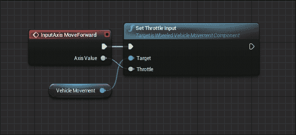

此逻辑所做的就是使用**Axis Value**为我们**Input Axis MoveForward**选项，这将根据按下的键是`1`或`-1`，并将此值应用到车辆的**油门**上，从而使车辆向前或向后移动。

接下来，让我们设置逻辑，通过在**事件图**的空白区域右键单击并搜索**Input Axis MoveRight**事件来控制我们的车辆。我们还需要**Vehicle Movement Component**变量的副本，以便我们可以从上下文相关下拉菜单中拉取此副本并搜索**Set Steering Input**动作节点。将**Input Axis MoveRight**事件节点的输出可执行引脚连接到**Set Steering Input**节点的输入可执行引脚。此外，将**Axis Value Float**输出连接到**Steering Float**输入，如图下截图所示：

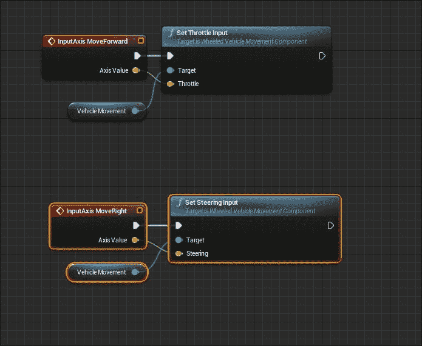

最后，我们需要设置手刹的逻辑，以便当玩家按下并释放空格键时，手刹能够适当地对输入做出反应。首先，让我们在**Event Graph**的空白区域右键单击，并搜索**Input Action Handbrake**事件节点。接下来，我们需要创建**Vehicle Movement Component**变量的副本，并从该变量中拉取，在上下文相关的下拉菜单中搜索**Set Handbrake Input**动作节点。然后，我们需要检查**Set Handbrake Input**节点的**New Handbrake Boolean**输入变量，以确保它使用我们车辆的手刹来停车。接下来，我们需要创建**Vehicle Movement Component**变量和**Set Handbrake Input**节点的副本，但对于这个副本，我们想要确保**New Handbrake Boolean**输入变量未被勾选。最后，我们需要将**Input Action Handbrake**节点的**Pressed**输出可执行引脚连接到其**New Handbrake Boolean**设置为`True`的**Set Handbrake Input**节点的输入可执行引脚。然后，将**Input Action Handbrake**节点的**Released**输出可执行引脚连接到其**New Handbrake**设置为`False`的**Set Handbrake Input**节点的输入可执行引脚。

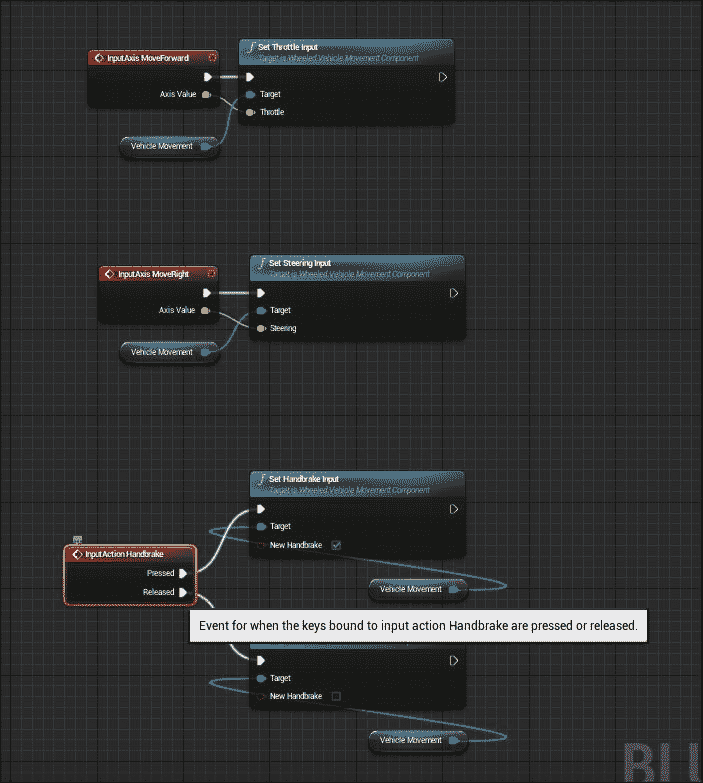

在我们的**BP_NewVehicle Vehicle**蓝图中的逻辑就绪后，我们可以编译并保存内容，然后导航到**DesertRallyRace**关卡，以便在编辑器中游玩并测试我们的车辆。再次提醒，在测试阶段之前，确保**World Settings**中的**GameMode Override**参数设置为我们的**BP_VehicleGameMode**蓝图。

现在，当我们玩游戏时，我们将能够使用*W*和*S*键前进和后退移动我们的车辆，使用*A*和*D*键操控车辆，并通过空格键使用手刹使车辆停止。我们还将看到，当车辆向前或向后移动时，车轮会旋转，前轮会转向我们按下的方向，并且我们车辆的物理表现符合预期。

# 编写移动行为脚本 – 章节回顾

在本节中，我们致力于编写车辆所需的必要行为脚本，以便在游戏中，我们能够移动和操控我们的车辆。首先，我们实现了与我们的**Input Axis MoveForward**事件节点相结合的**Set Throttle Input**。然后，我们使用**Input Axis MoveRight**事件节点与**Set Steering Input**节点。最后，我们将**Set Handbrake**节点功能与**Input Action Handbrake**事件节点关联起来。现在，我们能够在游戏中驾驶我们的车辆，从而评估其行为并测试其感觉。

# 测试车辆

当我们测试我们的车辆时，我们必须记住我们在驾驶车辆时试图创造的控件和感觉。车辆的行为将根据我们追求的游戏类型而有很大差异，例如，与马里奥赛车中的车辆相比，与《极限竞速》系列中的车辆相比，差异很大。

如果需要调整或更改以获得所需的行为，主要需要查看**BP_NewVehicle**蓝图中的**VehicleMovement (Inherited)**组件，其中在其**详细信息**面板中有各种参数，我们可以更改以改变车辆的行为，例如**差速器设置**或**传动设置**。我们还可以使用 Epic Games 提供的**VH_Buggy**和其他默认车辆内容，作为参考点来改变我们车辆的行为方式。

使用本章中创建的车辆作为垫脚石，创建一个具有不同行为的独特车辆。同时，也可以自由地调整**动画**、**车轮**和**车辆****蓝图**中的设置，看看我们可以创造出什么。

# 摘要

在这一章中，我们逐步从头开始使用**车辆游戏项目示例**模板创建了自己的工作车辆。在这个过程中，我们完成了一些任务。

首先，我们下载并使用**车辆游戏项目示例**模板创建了一个项目，以便我们可以访问创建基本车辆和模板赛车游戏所需的一些资源和内容。然后，我们使用**PhAT**创建了自己的**物理资产**，以默认的越野车骨骼网格为基础，并将我们自己的**物理体**应用到车辆上。

接下来，我们创建了构建游戏中的工作车辆所需的所有必要的蓝图和数据资产。首先，我们创建了一个包含**VehicleMovement (Inherited) 组件**类的**轮式车辆蓝图**组件。然后，我们创建了两种不同类型的**车轮蓝图**（一个用于前轮，另一个用于后轮）。每种都有自己的独特参数。最后，我们创建了所需的**车辆动画蓝图**组件，以便在驾驶时获得车轮的正确运动。

此外，我们还编辑了这些蓝图，以便能够获得我们车辆的适当行为。我们还通过编辑**输入动作**和**轴映射**来设置用户控制，以便为我们的车辆设置适当的按键绑定，以便车辆可以向前/向后移动，以便使用手刹并左右转向。

然后，我们在**BP_NewVehicle 轮式车辆蓝图**中实现了**蓝图**逻辑，通过将**输入动作**和**轴映射**事件节点应用到适当的**车辆移动**动作中，例如设置油门值和转向输入值。

最后，我们建立了自己的**游戏模式蓝图**，该蓝图利用了我们的**BP_NewVehicle Pawn Blueprint**类，并将该**游戏模式**实施到**项目设置**中，以及我们级别的**世界设置**中。从那时起，我们能够在游戏中玩耍，并在级别中驾驶我们的车辆，我们还提出了改变我们**BP_NewVehicle**参数的挑战，以便为我们的车辆获得独特的行为。

在下一章中，我们将介绍高级物理主题和故障排除概念，如实用物理。
