# 第一章。Unreal Engine 4 简介

欢迎来到 *Unreal Engine 4 游戏开发基础*。在本章中，您将学习如何下载 Unreal Engine 的源代码版本和启动器版本。之后，我们将熟悉 Unreal Engine 4 用户界面和内容浏览器。

# Unreal Engine 4 下载

Unreal Engine 4 完全免费（包括所有未来的更新！）下载和使用。您将获得所有 Unreal Engine 工具、免费样本内容、完整的 C++ 源代码，包括整个编辑器的代码及其所有工具；您还将获得访问官方文档的权限，包括教程和支持资源，以及访问 UE4 市场 place，它提供大量免费和商业内容。

Unreal Engine 4 可以下载两种不同的版本。一个是二进制版本（启动器），另一个是源代码版本（GitHub）。GitHub 版本和启动器版本之间的区别如下：

+   **启动器（二进制）版本**：这些由 Epic 编译并通过启动器提供。您还将获得启动器版本的所有源文件（`*.cpp`），但您不能对 Unreal Engine 进行任何修改，因为启动器版本不会生成解决方案文件。

+   **GitHub 版本**：这些版本没有二进制文件，因此您必须自己编译引擎。您将获得整个源代码，并且可以在 Unreal Engine 中修改几乎任何内容。您可以添加新的引擎功能，修改现有功能或删除它们（没有人这样做），并在 GitHub 上创建拉取请求，如果 Epic 喜欢它，他们将会将其官方集成到 Unreal Engine 中。

在本指南中，我将向您展示如何获取这两个版本。

## 下载启动器版本

要下载 Unreal Engine 的启动器版本，显然您需要启动器。要下载启动器，请按照以下步骤操作：

1.  首先前往 [`www.unrealengine.com/`](https://www.unrealengine.com/) 并使用您的凭证登录。

1.  登录后，您可以通过点击 **获取 Unreal Engine** 下的大橙色 **下载** 按钮来下载启动器。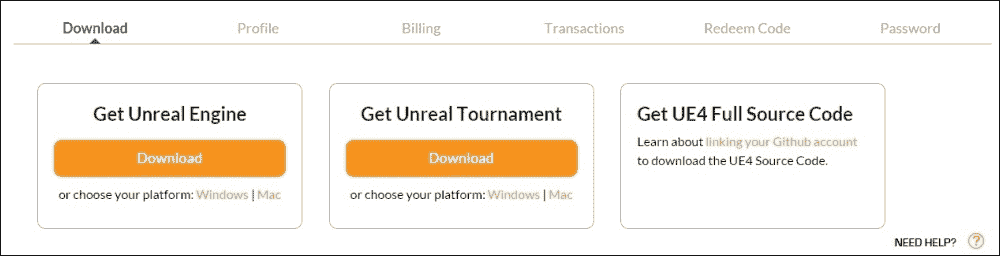

安装后首次打开启动器，它应自动下载 Unreal Engine 4 的最新版本。如果它没有这样做，请转到 **库** 选项卡并点击 **添加引擎**。现在将出现一个新的引擎槽，在这里您可以选择您的 Unreal Engine 版本并安装它。

## 下载 GitHub 版本

要下载 Unreal Engine 4 的源代码，请按照以下步骤操作

1.  首先创建一个 GitHub 账户（免费！）。

1.  之后，您需要前往 [`www.unrealengine.com/dashboard/settings`](https://www.unrealengine.com/dashboard/settings) 并更新您的 GitHub 账户名称，然后点击 **保存**：

### 分支 Unreal Engine 仓库

在你成功将 GitHub 账户与虚幻引擎账户链接后，你需要登录到 GitHub 并导航到虚幻引擎仓库。

### 注意

确保你已经将你的 GitHub 账户链接到你的虚幻引擎账户。否则，你将看不到虚幻引擎仓库。

当你在仓库页面时：

1.  点击页面右上角的 **Fork**。

1.  选择你的用户名以将其分叉到你的 GitHub 仓库。

1.  然后，你需要下载 GitHub for Windows（如果你使用 Windows）或 GitHub for Mac（如果你使用 Mac）并安装它。

你需要这个 Git 客户端来克隆（下载）你分叉的仓库，对虚幻引擎进行自己的修改，并将更改作为拉取请求提交给 Epic 以集成到编辑器中。

要克隆你的分叉仓库，请按照以下步骤操作：

1.  启动 GitHub 并使用你的凭证登录。

1.  点击 Git 客户端左上角的加号（**+**）。

1.  然后，点击 **克隆** 选项卡并选择你的 **用户名**（你现在应该能看到虚幻引擎）。

1.  现在，点击 **克隆虚幻引擎** 并选择你想要保存虚幻引擎仓库的文件夹。

1.  点击 **确定**。

1.  你现在应该看到 GitHub 正在将虚幻引擎克隆到你的硬盘上。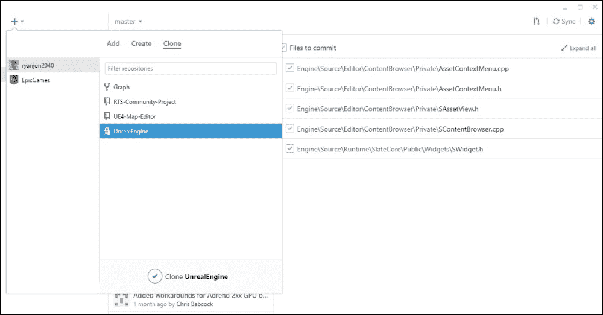

一旦克隆完成，导航到那个目录并运行 `Setup.bat` 文件。

1.  这将下载编译引擎所需的所有必要文件，并安装所有必需的先决条件。

1.  这可能需要一些时间，具体取决于你的网速，因为它需要下载超过 2 GB 的文件。

### 编译虚幻引擎

一旦 `Setup.bat` 完成，运行 `GenerateProjectFiles.bat`，这将生成 Visual Studio 解决方案文件。打开 `UE4.sln` 文件，现在，你就可以编译你自己的虚幻引擎 4 版本了。现在，在 **解决方案资源管理器** 中右键点击 UE4 并点击 **构建**。

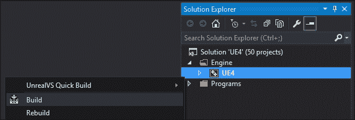

这将根据你的系统硬件从 15 分钟到 1 小时不等。所以请坐下来，拿一杯咖啡，等待引擎编译完成。

# 熟悉虚幻引擎

一旦你的引擎编译完成（或如果你使用启动器下载，则下载完成）是时候启动它了：

+   **启动你的自定义构建**：你可以按 Visual Studio 中的 *F5* 键以启动调试引擎，或者导航到下载它的目录，进入 `Engine\Binaries\Win64` 文件夹并双击 `UE4Editor.exe`。

+   **启动启动器构建**：只需点击那个大 **启动** 按钮即可。

### 注意

当你第一次编译后启动引擎时，可能会遇到长时间加载的情况。这是因为虚幻引擎将优化你的平台内容以生成数据缓存。这是一个一次性过程。

在启动画面之后，你现在应该能看到虚幻项目浏览器。执行以下步骤：

1.  选择**新建项目**选项卡，这就是你创建新项目的地方。

1.  对于这本书，我们将坚持使用**空白蓝图项目**。因此，在**蓝图**选项卡中，选择**空白**项目。

1.  你可以选择你想要的项目平台。有两个平台可供选择：**桌面/控制台**和**移动/平板**。请随意更改你项目的此设置。第二个设置确定你平台的图形设置。如果你选择**桌面/控制台**，最好坚持使用**最高质量**；如果你的项目针对**移动/平板**，你应该选择可伸缩的 3D 或 2D，这是针对低端 GPU 的。第三个也是最后一个设置让你可以从 Epic 添加一些**入门内容**，其中包含一些基本的网格、材质和纹理。你可以选择不包含**入门内容**，这样项目将只包含所选项目的必需元素。

1.  注意，在为**移动/平板**平台创建项目时，不建议包含**入门内容**。这可能会显著增加你项目的包大小。

1.  为你的项目选择一个名称以及你想要保存它的位置。

1.  最后，点击**创建项目**以使用你的项目启动 Unreal Engine 4：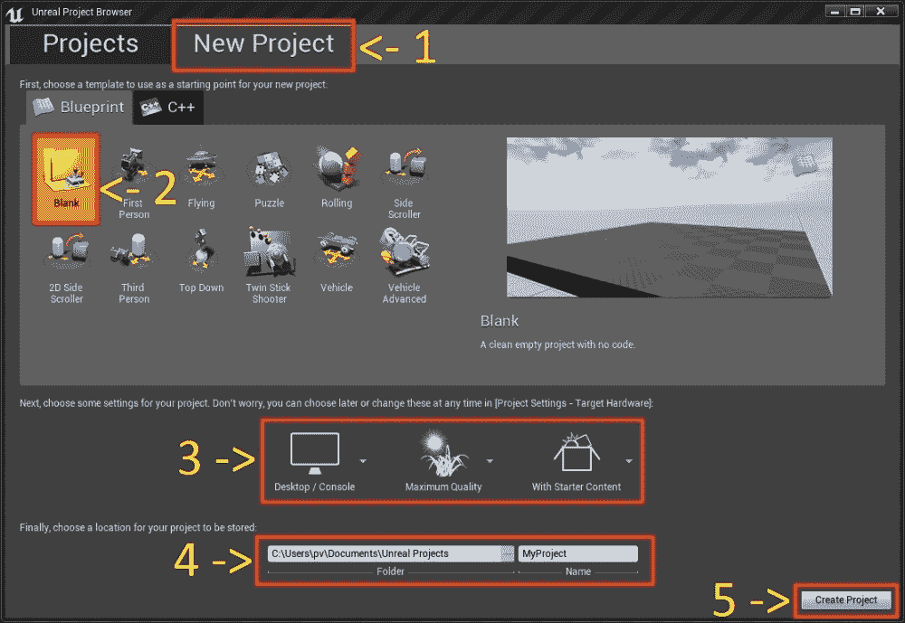

这就是 Unreal Engine 用户界面的样子：

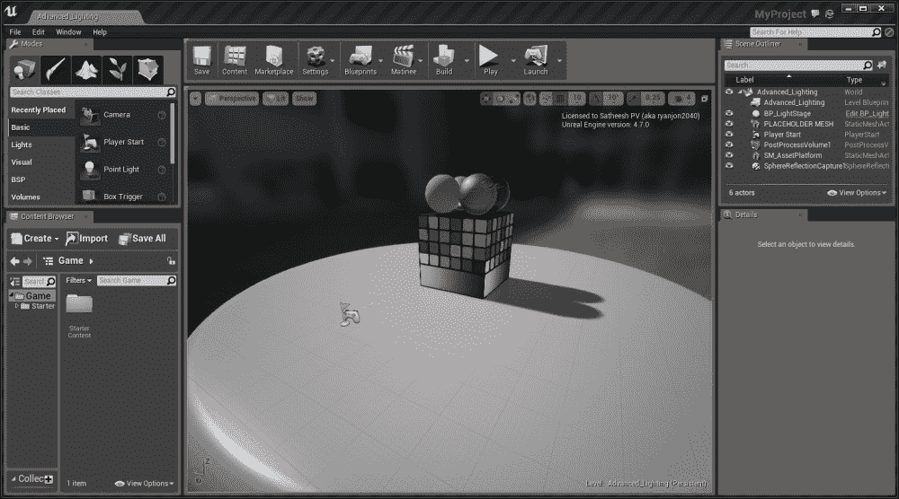

一旦 Unreal Engine 启动，你应该会看到一个类似于前面的截图的场景。这是如果你选择包含**入门内容**时将默认显示的场景。如果你跳过**入门内容**，则启动场景将不同。

## 视口工具栏

视口工具栏包含你在整个关卡设计过程中将使用的各种工具。让我们快速浏览一下：

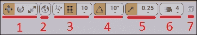

+   **变换工具**：这三个工具是移动工具、旋转工具和缩放工具。

+   **坐标系**：这允许你将你的 Actor 在世界轴（世界空间）或其自身的本地轴（本地空间）上移动、旋转或缩放。默认情况下，Unreal 编辑器以世界轴开始，但你可以通过点击图标来切换。地球图标表示世界空间，立方体图标表示本地空间。

+   **吸附和移动网格**：吸附允许你将一个 Actor 吸附到另一个 Actor 的表面上，移动网格允许你在场景内吸附到三维隐式网格上。

+   **旋转网格**：这提供了增量旋转吸附。

+   **缩放网格**：这会自动调整到增量值。

    ### 提示

    移动、旋转和缩放的吸附首选项可以在**编辑器首选项**中调整。转到**编辑** | **编辑器首选项** | **视口**，然后滚动到**网格吸附类别**。

+   **相机速度**：这让你可以控制相机在视口中的移动速度。

    ### 提示

    您可以通过按住鼠标右键（同时使用 *WASD* 控制键）并上下滚动鼠标滚轮来调整相机速度，从而加快或减慢相机的移动。

+   **最大化视口**：此选项在单个视口和 4 视口分割样式之间切换。

    ### 小贴士

    您可以通过更改 **布局** 选项来调整 **视口** 的布局，如下面的截图所示：

    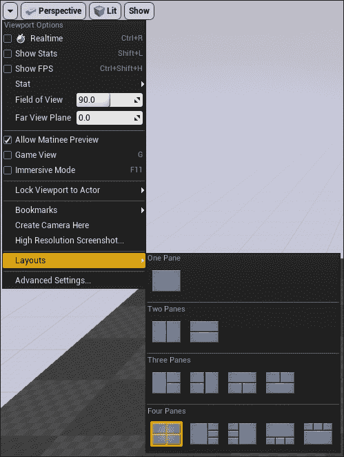

在本章的后面部分，您将学习如何使用 **二叉空间划分（BSP**）以及更改一些项目设置，如 **启动** 屏幕和游戏 **图标** 等。

## 模式

**模式** 选项卡包含编辑器的所有五种模式。具体如下：

+   **放置** 模式（快捷键是 *Shift* + *1*）：**放置** 模式允许您快速放置最近放置的对象，以及引擎原语，如灯光、几何形状、触发器、体积等。

+   **绘制** 模式（快捷键是 *Shift* + *2*）：**绘制** 模式（也称为 **网格绘制**）允许您在 **视口** 中的 **静态网格** 上交互式地绘制顶点颜色。

+   **景观** 模式（快捷键是 *Shift* + *3*）：**景观** 模式允许您在 Unreal 编辑器中完全创建新的景观，或从外部程序（如 **World Machine**、**TerreSculptor** 等）导入高度图，并对它进行修改。

+   **植被** 模式（快捷键是 *Shift* + *4*）：**植被** 模式允许您在 **景观**、其他静态网格等上绘制或擦除多个静态网格。一个示例工作流程是在大区域上绘制草地、树木等。

+   **几何编辑** 模式（快捷键是 *Shift* + *5*）：**几何** 模式允许您编辑 BSP 刷子。

## 内容浏览器

**内容浏览器** 是您项目的核心所在。在这里，您可以创建、导入、查看、编辑、组织和修改游戏中的所有资产。它还允许您像在 Windows 资源管理器中一样重命名、删除、复制和移动资产到其他文件夹。此外，内容浏览器还允许您根据关键词或资产类型搜索特定资产，并且您可以通过添加 '-'（连字符）作为前缀来排除资产。

您还可以创建 **集合** 来整理您常用的资产，以便快速访问。

### 小贴士

集合只是资产的引用，并不会移动到集合中。这意味着单个资产可以存在于多个集合中，并且您可以创建无限数量的集合。

有三种类型的集合：

+   **共享集合**：这些对您和其他用户可见。此选项仅在您已启用 **源** **控制**（例如：Perforce、Subversion 等）时才激活。

+   **私有集合**：这些只对被邀请查看集合的人可见。此选项仅在您已启用 **源控制**（例如：Perforce、Subversion 等）时才激活。

+   **本地集合**：这些仅为你所有。这意味着它们只存在于你的本地机器上。

如果你想要将资产从一个项目转移到另一个项目，你可以右键单击该资产并选择**迁移…**，这将复制该资产及其所有依赖项到你的新项目。

**内容浏览器**可以通过按*Ctrl*+*Shift*+*F*或从菜单栏上的**Windows**菜单访问。你还可以同时打开四个**内容浏览器**实例。

这在你想要将资产移动到不同的文件夹或预览不同文件夹中的各种资产时非常有用。

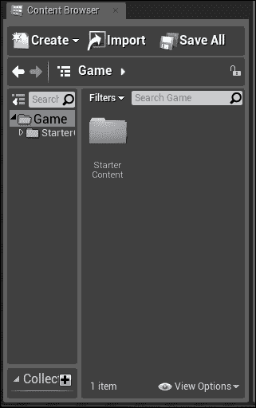

### 内容浏览器视图选项

视图选项让你可以执行以下操作：

+   更改缩略图大小

+   更改视图样式

+   修改 3D 缩略图，等等

**视图选项**可以从**内容浏览器**的右下角访问。

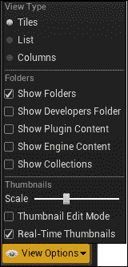

### 世界大纲

**世界大纲**以树形视图显示了级别内的所有角色。可以从世界大纲中选择和修改角色。在**世界大纲**中右键单击角色将显示与**视口**中相同的上下文菜单，这样你就可以在不进入**视口**的情况下修改它。你可以将一个角色拖动到另一个角色上并将它们连接在一起。

世界大纲允许你搜索特定的角色。你可以在搜索词前添加**-**（连字符）来排除特定的角色，你可以在搜索词前添加**+**来强制匹配确切术语。

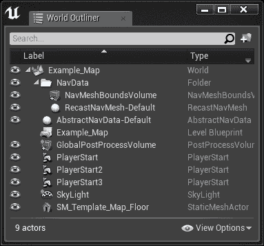

## 细节面板

**细节**面板显示了视口中选择的全部信息、实用工具和功能。它显示了所选角色的所有可编辑属性，并根据所选角色提供额外的功能。例如，如果你选择了一个**蓝图**，**细节**面板将显示与该蓝图相关的所有内容，包括暴露的变量、Blutility 事件等。如果你选择了一个**静态网格**角色，**细节**面板将显示应用了哪种材质、碰撞设置、物理设置、渲染设置等。**细节**面板可以锁定到所选角色，这样它就不会根据角色选择而改变。就像**内容浏览器**一样，你可以同时打开四个**细节**面板实例。

## 导航视口

你可以使用鼠标和键盘轻松地导航视口。关于导航视口的高级说明可以在这里找到：[`docs.unrealengine.com/latest/INT/Engine/UI/LevelEditor/Viewports/ViewportControls/index.html`](https://docs.unrealengine.com/latest/INT/Engine/UI/LevelEditor/Viewports/ViewportControls/index.html)

### 小贴士

在视口的左下角有一个小问号按钮。如果你点击它，你将看到一些常用的视口快捷键。

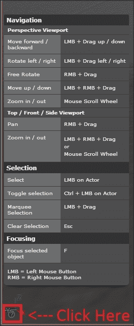

# BSP

现在我们对引擎用户界面有了些基本的了解，让我们使用 BSP 来创建一个简单的级别。BSP 是一个几何工具（也称为**几何笔刷**或简称**笔刷**），用于快速原型化级别（也称为级别布局）。一些开发者更喜欢称之为**构造实体几何**（**CSG**），这是一个更准确的术语，因为 Unreal 编辑器中的几何形状是通过添加和减去笔刷来创建的。BSP 自 Unreal 的第一个版本以来就存在了。它曾用于很久以前的级别设计，但后来，这个角色被静态网格所取代，因为 BSP 在性能上更昂贵。

所以基本上，BSP 应该只用于原型化一个级别。一旦你对一个级别应该看起来怎样有了基本的概念，你应该开始用静态网格替换它。

### 小贴士

CSG 和 BSP 可以互换用来指代 Unreal 中的几何形状。两者是相同的。

## 创建 BSP

Unreal Engine 4 附带七个笔刷，并且它们都可以在**细节**面板中进行自定义。它们如下：

+   **盒子**: 你可以调整*X*、*Y*和*Z*轴，并将其设置为**空心**，这是一个快速制作房间的快捷方式，并调整**墙厚**，它定义了内部墙壁的厚度。

+   **圆锥**: 你可以在**细节**面板中自定义边数、高度以及外半径和内半径。你还可以将其设置为**空心**，并调整**墙厚**来定义内部墙壁的厚度。

+   **圆柱**: 你可以在**细节**面板中自定义边数、高度以及外半径和内半径。你还可以将其设置为**空心**，并调整**墙厚**来定义内部墙壁的厚度。

+   **曲线楼梯**: 这将创建一个在角度周围弯曲的楼梯形状，但不能缠绕自身。

+   **直线楼梯**: 这将创建一个不弯曲的直楼梯。

+   **螺旋楼梯**: 这将创建一个可以反复缠绕自身的螺旋楼梯。

+   **球体**: 这将创建一个球形。半径可以在**细节**面板中自定义。

就像任何其他演员一样，您可以使用**变换工具**来移动、旋转和缩放，以适合您的需求。

有两种类型的**笔刷**。它们如下：

+   **加法**: 这些笔刷是实心的。这将*添加*几何形状到级别中。例如，您将使用**加法**类型来创建墙壁、地板、天花板等。

+   **减法**: 这些笔刷是空心的。这将*减去*之前创建的**加法**笔刷中的实体空间。例如，您将使用**减法**类型在墙上创建窗户或门。

你还可以将 BSP 几何形状转换为**静态网格**，并将它们保存在**内容浏览器**中，但请记住，它们将没有 UV 或额外的材质元素。这也值得提一下，这不是一个好的或推荐的流程。你应该只使用 BSP 来布局你的级别，然后，你应该导入从 DCC 应用程序创建的资产。

### 小贴士

您可以进入**几何编辑**模式（*Shift*+*F5*）来编辑顶点并创建自定义形状。

# 默认起始关卡、启动画面和游戏图标

您可以更改游戏和编辑器的默认起始关卡。例如，对于游戏，您可能希望将**主菜单**地图作为默认，而对于编辑器，您可能希望另一个关卡作为默认启动级别。

在虚幻编辑器中设置它们很容易：

1.  在菜单栏中点击**编辑**。

1.  点击**项目设置**。

1.  转到**地图与模式**。

1.  在这里，您可以更改游戏和编辑器的默认地图。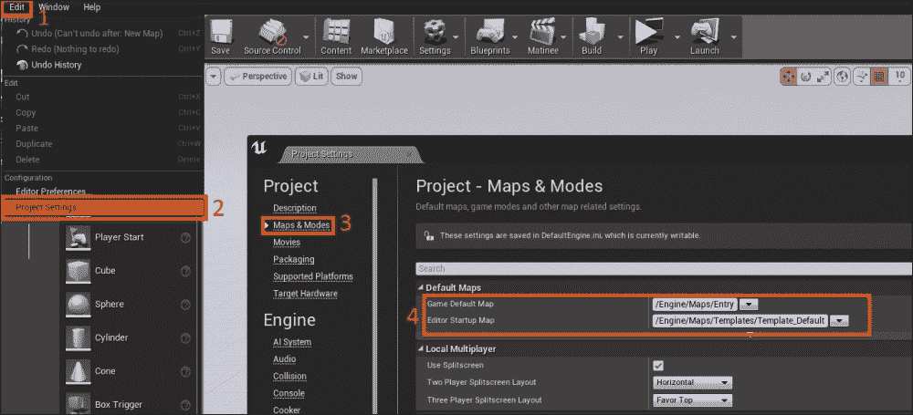

您可以通过**项目设置**调整**启动画面**：

1.  转到**窗口**部分。

1.  从这里更改**启动画面**和游戏的**图标**。

### 小贴士

**启动画面**的默认尺寸为**600 x 200**，需要**.bmp**图像。游戏**图标**需要**256 x 256**的`.ICO`文件。

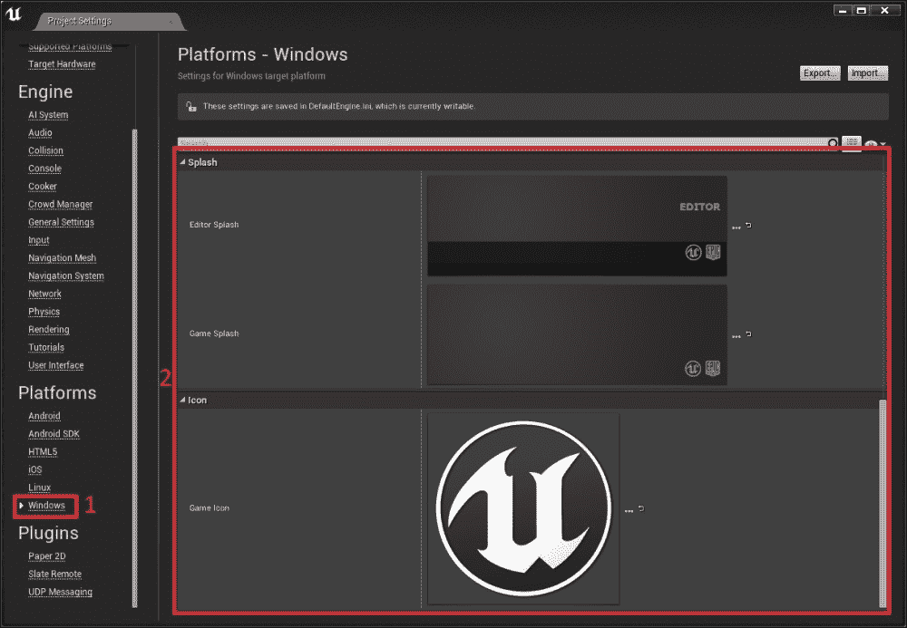

# 摘要

现在您已经了解了虚幻引擎的基础知识，是时候从 3ds Max、Maya 或 Blender 等 DCC 应用程序中导入一些资源了。在下一章中，我们将创建一个简单的网格在 3ds Max 中，并将其导入到虚幻引擎中，并介绍各种选项，例如设置材质、碰撞和 LOD。
