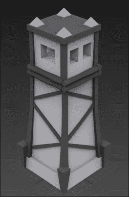
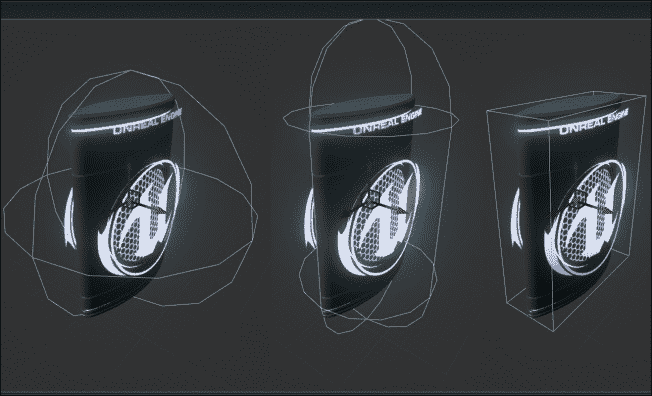
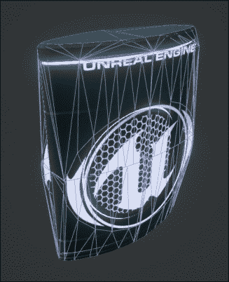
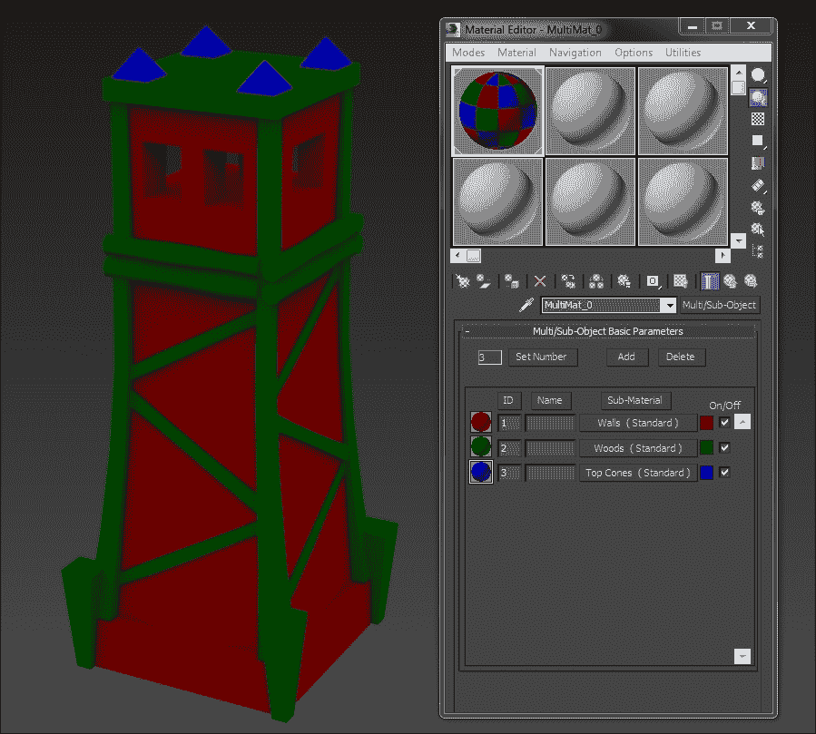
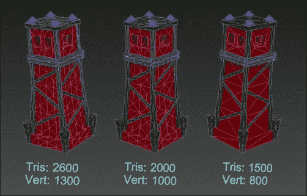
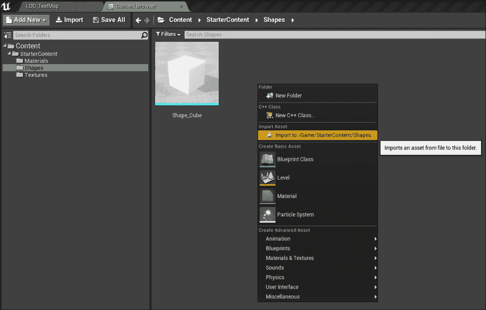
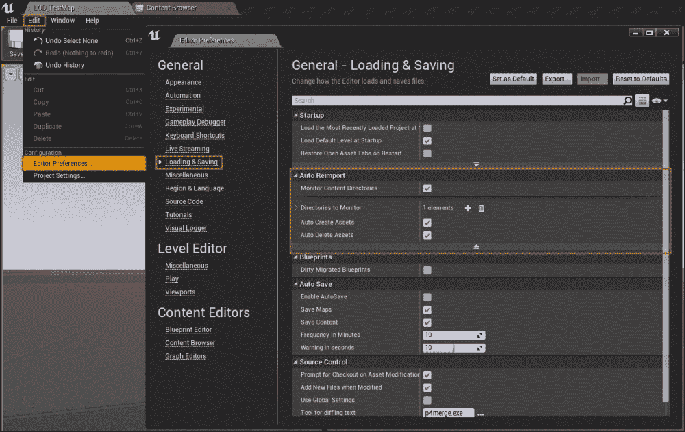
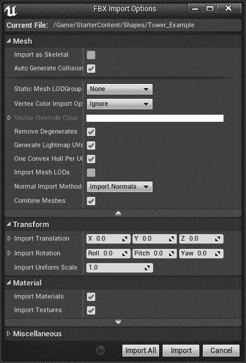
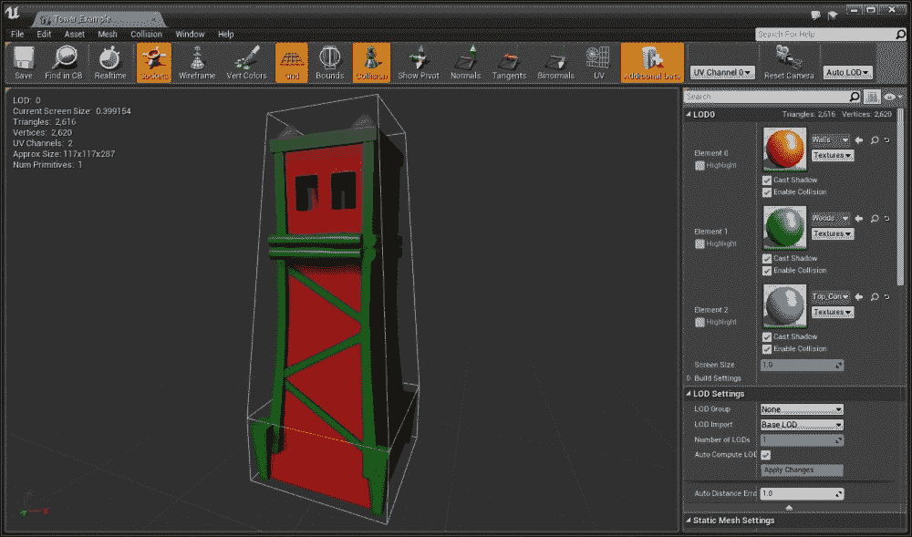

# 第二章：导入资源

在上一章中，你学习了 Unreal Engine 的基础知识。在本章中，你将学习如何从 Autodesk 3ds Max 导入资源。

# 在 DCC 应用程序中创建资源

在上一章中，你学习了如何使用 BSP 来阻挡关卡。然而，我们需要用静态网格来替换它们，以获得更好的性能和更多对材质、碰撞等方面的控制。我们将在 **数字内容创作** (**DCC**) 应用程序（如 Autodesk 3ds Max、Autodesk Maya、Blender 等）中创建模型，并通过内容浏览器导入 Unreal Engine。Unreal Engine 支持导入 FBX 和 OBJ 格式，但建议使用 FBX 格式。

以下截图是本章中将使用的示例资源：

### 注意

注意，在撰写本书时，Unreal Engine 的导入管道使用 FBX 2014。尝试使用不同版本导入可能会导致不兼容。

在建模时需要记住的一些事项如下：

+   **单位**：**Unreal 单位**（**UU**）在为游戏建模资产时至关重要。错误的单位会导致资产看起来比预期的大或小。1 Unreal 单位等于 1 厘米。Unreal Engine 4 中的示例角色高 196 厘米。因此，当你为 Unreal Engine 4 建模资产时，最好使用一个高 196 厘米的盒子作为参考。

    ### 注意

    要了解如何更改 Autodesk 3ds Max 的单位，你可以参考 [`knowledge.autodesk.com/support/3ds-max/learn-explore/caas/CloudHelp/cloudhelp/2015/ENU/3DSMax/files/GUID-69E92759-6CD9-4663-B993-635D081853D2-htm.html`](https://knowledge.autodesk.com/support/3ds-max/learn-explore/caas/CloudHelp/cloudhelp/2015/ENU/3DSMax/files/GUID-69E92759-6CD9-4663-B993-635D081853D2-htm.html)。

    要了解如何更改 Blender 的单位，你可以参考 [`www.katsbits.com/tutorials/blender/metric-imperial-units.php`](http://www.katsbits.com/tutorials/blender/metric-imperial-units.php)。

    +   **轴点**：这代表对象的局部中心和局部坐标系。当你将网格导入 Unreal Engine 时，该网格的轴点（正如它在你的 DCC 应用程序中一样）决定了任何变换（如移动、旋转和缩放）将执行的位置。通常，最好将你的网格保持在原点（0, 0, 0）并将轴点设置在网格的一个角落，以便在 Unreal Engine 中正确对齐。

    +   **三角化**：记住，Unreal Engine 导入器会自动将四边形转换为三角形，因此不会跳过三角形。

    +   **UV**：当你为资产进行 UV 时，你可以超出 0-1 空间，特别是当你处理大型对象时。UV 通道 1（在 Unreal 中是通道 0）用于纹理，UV 通道 2（在 Unreal 中是通道 1）用于光照贴图。

# 创建碰撞网格

您可以创建碰撞网格并将其与您的资产一起导出。Unreal Engine 4 为静态网格提供碰撞生成器，但有时我们必须创建自己的自定义碰撞形状，特别是如果网格有开口（如门或带有窗洞的墙）。在本节中，我们将看到这两种选项。

### 小贴士

碰撞形状应始终保持简单，因为计算简单形状要快得多。

## 自定义碰撞形状

碰撞网格由 Unreal 导入器根据其名称识别。您可以定义三种类型的碰撞形状。它们如下：

+   **UBX_MeshName**：UBX 代表 Unreal Box，正如其名，它应该呈箱形状。您不能以任何方式移动顶点，否则它将不起作用。

+   **USP_MeshName**：USP 代表 Unreal Sphere，正如其名，它应该呈球形状。此球体的分段数量并不重要（尽管大约 6-10 似乎不错），但您不能移动任何顶点。

+   **UCX_MeshName**：UCX 代表 Unreal Convex，正如其名，它应该是一个凸形状，不应该有空或凹。这是最常用的碰撞形状，因为基本形状（如箱体和球体）可以直接在 Unreal 中生成。

在下面的屏幕截图中，您可以看到红色的线框对象，这是我为了碰撞形状而创建的：

## Unreal Engine 4 碰撞生成器

静态网格的碰撞形状可以在静态网格编辑器内生成。要打开此编辑器，请双击**内容浏览器**中的静态网格资产，然后点击**碰撞**菜单，这将列出所有**碰撞**选项。

# 简单形状

此菜单中的前三个选项是简单形状，如下所示：

+   **球体碰撞**：这创建了一个简单的球体碰撞形状

+   **胶囊碰撞**：这创建了一个简单的胶囊碰撞形状

+   **箱体碰撞**：这创建了一个简单的箱体碰撞形状

## K-DOP 形状

**K 离散定向多面体**（**K-DOP**）形状基本上是边界体积。数字（10、18 和 26）代表 K 轴对齐的平面。

# 自动凸形碰撞

此选项用于创建更精确的碰撞形状以供您的模型使用。一旦您点击此选项，静态网格编辑器右下角将出现一个新的浮动窗口；使用**最大壳体**（创建以最佳匹配对象形状的壳体数量）和**最大壳体顶点**（确定碰撞壳体的复杂性）您可以创建更复杂的碰撞形状，用于您的**静态网格**。

如您在以下屏幕截图中所见，自动凸形的结果相当准确：

### 小贴士

碰撞形状支持变换（移动、旋转和缩放），并且您可以复制它们以拥有多个碰撞。在静态网格编辑器中单击碰撞形状，您可以使用*W*、*E*和*R*在移动、旋转和缩放之间切换。您可以使用*Alt* + 左键单击拖动（或*Ctrl* + *W*）来复制现有的碰撞。

# 材质

Unreal Engine 可以在从 3D 应用程序导出时将材质和纹理应用到网格上。从 Autodesk 3ds Max，只支持基本材质。它们是**标准**和**多/子对象**。在这些基本材质中，只支持特定功能。这意味着 FBX 不会导出所有设置，但它支持该材质类型中使用的某些贴图或纹理。

在以下示例中，您可以看到分配了多个材质的模型。

### 注意

注意，在**多/子对象**材质中为每个子材质拥有唯一的名称非常重要。每个子材质都有一个唯一的名称，如下面的截图所示：

# 级别细节（LOD）

**细节级别**（**LOD**）是一种限制网格随着它们远离相机时影响的方法。每个 LOD 与上一个相比将具有较少的三角形和顶点，并且可以具有更简单的材质。这意味着基础 LOD（**LOD 0**）将是当玩家靠近时出现的高质量网格。当玩家远离该对象时，它将变为**LOD 1**，其三角形和顶点比**LOD 0**少，当玩家进一步远离时，它将切换到**LOD 2**，其三角形和顶点比**LOD 1**少得多。

以下图应能给您一个关于 LOD 做什么的思路。左边的网格是基础 LOD（**LOD 0**），中间是**LOD 1**，右边是**LOD 2**。

### 注意

更多关于 LOD 的信息可以在[`docs.unrealengine.com/latest/INT/Engine/Content/Types/StaticMeshes/HowTo/LODs/index.html`](https://docs.unrealengine.com/latest/INT/Engine/Content/Types/StaticMeshes/HowTo/LODs/index.html)找到。

# 导出和导入

我们现在将介绍如何将网格导出和导入到 Unreal 中。

## 导出

导出网格是一个相当直接的过程。您可以在单个 FBX 文件中导出多个网格，或者单独导出每个网格。Unreal 导入器可以在导入时将多个网格作为单独的资产导入，或者通过在导入时启用**合并网格**选项将它们合并为一个资产。

在以下截图中，您可以看到我已经选择了碰撞网格和模型以进行导出：

### 注意

**平滑组**在导出时应该开启，否则 Unreal Engine 在导入时会显示警告。

## 导入

将网格导入到 Unreal 中很简单。您有三种导入方式。它们在这里解释。

### 上下文菜单

您可以在**内容浏览器**内部右键单击并选择**导入到 <您的文件夹名称>**。

### 拖放

如其名所示，你可以轻松地将 FBX 或 OBJ 模型从**Windows 资源管理器**拖放到**内容浏览器**以进行导入。

### 内容浏览器导入

**内容浏览器**有一个**导入**按钮，你可以使用它来导入网格。

### 自动导入

如果你将 FBX 文件放置在你的项目**内容**文件夹中（包括任何子文件夹），Unreal 将自动检测并触发导入过程（如果你已经打开了编辑器。否则，下次运行时）。

### 配置自动导入

你可以选择是否启用或禁用此选项。要配置，请转到**编辑** | **编辑器首选项** | **加载与保存** | **自动重新导入**。

+   **监控内容目录**：这可以启用或禁用资产的自动导入。

+   **要监控的目录**：这为引擎添加或删除一个路径（它可以是一个虚拟包路径，如`\Game\MyContent\`，或一个绝对路径，如`C:\My Contents`）以监控新内容。

+   **自动创建资产**：如果启用，任何新的 FBX 文件将不会自动导入。

+   **自动删除资产**：如果启用，并且你从资源管理器中删除了 FBX 文件，Unreal Engine 将提示你是否要删除资产文件。

### 结果

当你导入你的资产时，你将看到**导入选项**对话框。你可以在这里阅读有关导入设置的详细信息：

一旦你点击**导入**（如果你正在导入多个 FBX 文件，则为**导入全部**），你将在**内容浏览器**中看到资产。在下面的截图中，你可以看到 Unreal 如何自动从 Autodesk 3ds Max 导入材质：

如果你双击静态网格（**Tower_Example**），你将看到静态网格编辑器。在下面的截图中，你可以看到 Unreal 成功导入了我的自定义碰撞形状。

# 摘要

在下一章中，你将了解更多关于**材质**和**纹理**的内容。
